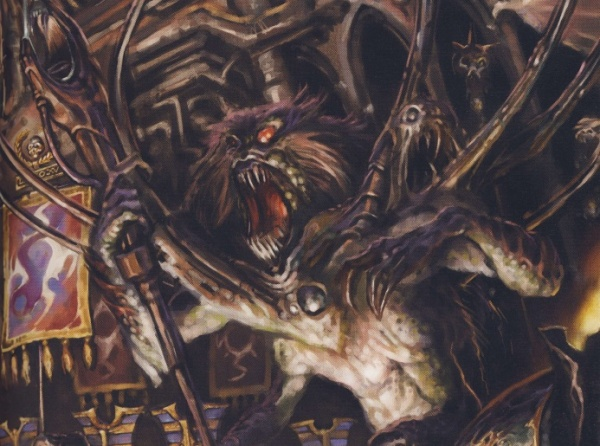

# 0736 升天者英格泰尔 Ingethel the Ascended

精校状态：中文行文已逐段精校，部分术语仍为暂定

分类：混沌 / 恶魔王子

原文来源：https://www.bilibili.com/opus/1089685193623601157

原作者：帝国神选罐头

原文时间：2025年07月15日 11:35

[返回分类目录](目录.md) · [全书目录](../../目录.md)

<!-- A0736-B0001 -->
**英文原文**

Ingethel, also known as Ingethel the Ascended, is a Daemon Prince of Chaos. Ingethel was originally a native to Cadia and was appointed by the Gods of Chaos to guide Lorgar during The Pilgrimage. After Ingethel revealed the Primordial Truth to Lorgar, she herself ascended to Daemonhood following ten human sacrifices which included Vendatha, a member of the Adeptus Custodes. Later, Ingethel the Ascended led the Serrated Sun Chapter of the Word Bearers into the Great Eye where the failure of the Eldar Empire was witnessed first hand. Ingethel told the Word Bearers that the Eldar failed and suffered the Fall because at the moment of their ascension they were unable to accept the Primordial Truth: they gave birth to a god of pleasure and promise, yet felt no joy. After showing the Serrated Sun the Primordial Truth, Ingethel guided Lorgar through the Eye of Terror and showed him former worlds of the Eldar. Later, Ingethel appeared in the court of Horus after he had fallen to Chaos.

<!-- /A0736-B0001 -->

<!-- A0736-B0002 -->

原译文

英格泰尔，也被称为升天者英格泰尔，是一位混沌恶魔王子。英格泰尔最初是卡迪亚人，在朝圣期间被混沌诸神任命为珞珈的向导。在英格泰尔向珞珈透露了原初真理后，她自己在十次人类的牺牲后升格为了恶魔王子，其中包括禁军修会的成员文达萨。后来，升天者英格泰尔带领怀言者的锯齿烈阳战团进入了恐惧之眼，在那里亲眼目睹了灵族帝国的失败。英格泰尔告诉怀言者，灵族失败并遭受了陨落，因为在他们升格的那一刻，他们无法接受原初真理：他们诞生了一个快乐和应许之神，但却没有感到快乐。在向锯齿烈阳展示了原初真理之后，英格泰尔引导珞珈穿过恐惧之眼，并向他展示了前灵族世界。后来，英格泰尔在荷鲁斯堕入混沌后出现在荷鲁斯的王庭中。

**校订译文**

英格泰尔，又称升天者英格泰尔，是一位混沌恶魔亲王。她原是卡迪亚的一名土著，在珞珈的朝圣期间受混沌诸神指派，担任他的向导。她向珞珈揭示原初真理后，以十个人类作为祭品，其中包括帝国禁军文达萨，自己随之升魔。此后，她带领怀言者的锯齿烈阳战团进入大眼，亲眼见证灵族帝国的失败。她告诉怀言者，灵族之所以失败并遭受陨落，是因为他们在升华的时刻无法接受原初真理：他们孕育了一位象征欢愉与应许的神，却没有为此感到喜悦。向锯齿烈阳展示原初真理后，英格泰尔又引导珞珈穿行恐惧之眼，向他展示灵族昔日的世界。后来，荷鲁斯堕入混沌，英格泰尔也曾现身于他的王庭。

**校注：** ten human sacrifices 指十名人类祭品，不是十次牺牲；女性代词依英文保留。Great Eye 沿专名大眼，指恐惧之眼。

<!-- /A0736-B0002 -->

<!-- A0736-B0003 图片 -->

<!-- A0736-B0004 -->

原译文

Ingethel the Ascended 升天者英格泰尔

**校订译文**

Ingethel the Ascended 升天者英格泰尔

<!-- /A0736-B0004 -->

本篇核心术语与暂定项

以下列出本篇出现的英文原形及核心术语表用词。同形词可能指不同对象，具体词义以本篇正文和校注为准；单复数、别名和仅见于图注的名称可能尚未列入。完整候选见[术语表](../../术语表/双语术语候选.csv)。

| 英文 | 采用中文 | 状态 |
| --- | --- | --- |
| Adeptus Custodes | 帝皇禁军 | 官方已核对 |
| Eldar | 灵族 | 暂定·语境区分 |
| Eye of Terror | 恐惧之眼 | 官方已核对 |
| Word Bearers | 怀言者 | 暂定·官方待核 |
| Daemon Prince | 恶魔亲王 | 官方已核对 |
| Horus | 荷鲁斯 | 暂定·官方待核 |
| Cadia | 卡迪亚 | 暂定·官方待核 |
| Chapter | 战团 | 暂定·官方待核 |
| Lorgar | 珞珈 | 暂定·官方待核 |
| Serrated Sun | 锯齿烈阳 | 暂定·官方待核 |
| Primordial Truth | 原初真理 | 暂定·官方待核 |
| Ingethel the Ascended | 升天者英格泰尔 | 暂定·官方待核 |
| Ingethel | 英格泰尔 | 暂定·官方待核 |
| Daemon Prince of Chaos | 混沌恶魔亲王 | 官方已核对 |
| Vendatha | 文达萨 | 暂定·官方待核 |

