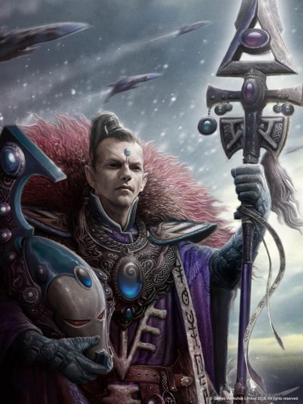
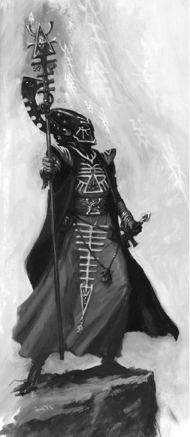
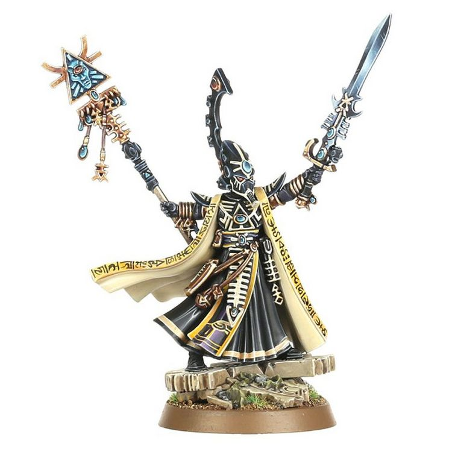

# 0737 艾尔德拉德·乌瑟兰 Eldrad Ulthran

精校状态：中文行文已逐段精校，部分术语仍为暂定

分类：混沌 / 乌斯维

原文来源：https://www.bilibili.com/opus/1089686013927751680

原作者：帝国神选罐头

原文时间：2025年07月15日 11:38

[返回分类目录](目录.md) · [全书目录](../../目录.md)

原篇名：埃尔德拉德·乌斯兰 Eldrad Ulthran

<!-- A0737-B0001 -->
**英文原文**

"When there is no other way, the perilous path is the only road to salvation"

<!-- /A0737-B0001 -->

<!-- A0737-B0002 -->

原译文

“当别无选择时，危险的道路是通往救赎的唯一道路”

**校订译文**

“当别无他途，险路便是唯一的救赎之路。”

<!-- /A0737-B0002 -->

<!-- A0737-B0003 -->
**英文原文**

Eldrad Ulthran was the chief Farseer of the Ulthwé Craftworld. He is perhaps the most gifted psyker amongst the Eldar, his incredible foresight having saved many thousands of Eldar lives. He created and carried into battle the Staff of Ulthamar, and his resilience and power has been a rallying point for the declining Eldar race.

<!-- /A0737-B0003 -->

<!-- A0737-B0004 -->

原译文

埃尔德拉德·乌索然是乌斯维方舟世界的首席先知。他可能是灵族中最有天赋的；灵能者，他令人难以置信的远见拯救了数千名灵族的生命。他创造了乌萨玛之杖并将其投入战斗，他的韧性和力量一直是衰落的灵族种族的集结点。

**校订译文**

艾尔德拉德·乌瑟兰曾任乌斯维方舟世界的首席大先知。他或许是灵族中天赋最高的灵能者，非凡的预见能力挽救了成千上万族人的生命。他亲手制成乌萨玛之杖，并持杖征战。他的坚韧与强大力量，一直是日渐衰落的灵族凝聚人心的依靠。

<!-- /A0737-B0004 -->

<!-- A0737-B0005 图片 -->

<!-- A0737-B0006 -->

原译文

Farseer Eldrad Ulthran 先知埃尔德拉德·乌索然

**校订译文**

Farseer Eldrad Ulthran 大先知艾尔德拉德·乌瑟兰

<!-- /A0737-B0006 -->

<!-- A0737-B0007 -->
## Biography 传记

<!-- /A0737-B0007 -->

<!-- A0737-B0008 -->
**英文原文**

Eldrad was over 10,000 years old, and was the first to warn the Imperium of Horus' treachery. On the Maiden World of Tarsus, Eldrad attempted to warn Fulgrim of Horus' betrayal to no avail, only later discovering that Fulgrim had already been corrupted by Slaanesh and was beyond reasoning. Eldrad then attempted to end the lives of the Primarch and his bodyguards but this would end disastrously for Ulthwé's warriors, resulting notably in the loss of Eldrad's trusted adviser, the ancient Wraithlord Khiraen Goldhelm and an Avatar of Khaine. The supposed perfidy of the Eldar would culminate in Fulgrim's widespread virus bombing of many maiden worlds. It was this fateful event that would cause Eldrad's massive distrust of the human race. Nonetheless, Eldrad again intervened in human affairs when he appeared before the Cabal agent John Grammaticus. Ulthran revealed to Grammaticus that he opposed the Cabal's aims and that their belief that Horus would usher in Chaos' ultimate demise was not set in stone. He believed that humanity were meant to be the firebreak against Chaos, and that without them the Eldar would fall and the galaxy shortly afterwards. He offered Grammaticus a way to leave the Cabal and a chance to stop being a traitor to his own race. Using the Fulgurite originally intended to kill the Emperor and then Vulkan, Grammaticus was instead convinced by Eldrad to use it to heal Vulkan's shattered psyche.

<!-- /A0737-B0008 -->

<!-- A0737-B0009 -->

原译文

埃尔德拉德有一万多岁，是第一个警告荷鲁斯背叛帝国的人。在塔苏斯少女世界，埃尔德拉德试图警告福格瑞姆有关荷鲁斯的背叛，但无济于事，后来才发现福格瑞姆已经被色孽腐化了，无法思考。埃尔德拉德随后试图结束原体和他的护卫的生命，但这对乌斯维的战士来说将是灾难性的，尤其是导致埃尔德拉德值得信赖的顾问、古代幽冥领主希兰·金盔和凯恩化身的丧生。灵族所谓的背信弃义将在福格瑞姆对许多少女世界的广泛病毒轰炸中达到高潮。正是这一决定性事件导致了埃尔德拉德对人类的巨大不信任。尽管如此，当埃尔德拉德出现在密会特工约翰·格拉马迪库斯面前时，他再次介入了人类事务。乌索然向格拉马迪库斯透露，他反对密会的目标，他们认为荷鲁斯将迎来混沌的最终灭亡的信念并不是板上钉钉的。他相信，人类注定是对抗混沌的防火带，没有他们，灵族就会倒下，银河系也会很快灭亡。他为格拉马迪库斯提供了一种离开密会的方法，以及一个停止背叛自己种族的机会。格拉马迪库斯最初打算用雷击石杀死帝皇和沃坎，但埃尔德拉德说服格拉马迪库斯用它来治愈沃坎破碎的心灵。

**校订译文**

艾尔德拉德已有一万多岁，是第一个向帝国警告荷鲁斯将要叛变的人。他曾在少女世界塔苏斯告诫福格瑞姆提防荷鲁斯，却徒劳无功，直到后来才发现福格瑞姆已经受到色孽腐化，再也听不进劝告。艾尔德拉德随即试图杀死原体及其护卫，但这次行动给乌斯维战士带来了灾难；他深为信任的顾问、古老的幽冥领主希兰·金盔，以及一尊凯恩化身都在战斗中丧生。福格瑞姆认定灵族背信弃义，继而对许多少女世界发动大规模病毒轰炸。这场灾难使艾尔德拉德对人类产生了极深的不信任。尽管如此，他后来还是再次介入人类事务，出现在密教特工约翰·格拉马迪库斯面前。他告诉格拉马迪库斯，自己反对密教的目标：密教坚信荷鲁斯将促成混沌最终灭亡，但未来并非已成定局。他认为人类本应成为阻挡混沌蔓延的屏障；失去人类，灵族也将灭亡，紧接着便是整个银河。他向格拉马迪库斯提供了脱离密教的出路，以及不再背叛自身种族的机会。那块雷击石原先被用来谋划刺杀帝皇，后来又要用于杀死沃坎；但在艾尔德拉德的劝说下，格拉马迪库斯转而用它修复了沃坎破碎的心智。

<!-- /A0737-B0009 -->

<!-- A0737-B0010 图片 -->

<!-- A0737-B0011 -->

原译文

Eldrad Ulthran 埃尔德拉德·乌索然

**校订译文**

Eldrad Ulthran 艾尔德拉德·乌瑟兰

<!-- /A0737-B0011 -->

<!-- A0737-B0012 -->
**英文原文**

Eldrad next appeared psychically in the form of an old man to Vulkan, urging him to access the Webway on Nocturne and journey to Terra as his destiny demanded. He did the same to Barthusa Narek, recruiting him for a new mission. Eldrad became determined to eliminate the Cabal, believing their plans would eventually bring ruination to the galaxy and that humanity was the key to defeating Chaos. Together with Narek, Eldrad assassinated most Cabal members including Gahet, Slau Dha, and Damon Prytanis. After killing Prytanis, Damon allowed Narek to go on his way but took John Grammaticus.

<!-- /A0737-B0012 -->

<!-- A0737-B0013 -->

原译文

埃尔德拉德接下来以一个老人的形态出现在沃坎之前，敦促他按照命运的要求，在夜曲星上进入网道，前往泰拉。他对巴图萨·纳瑞克也做了同样的事，招募他执行新的任务。埃尔德拉德决心消灭密会，相信他们的计划最终会给银河系带来毁灭，而人类是击败混沌的关键。埃尔德拉德与纳瑞克一起暗杀了包括盖赫特、斯劳·达和达蒙·普莱塔尼斯在内的大多数密会成员。在杀死普莱塔尼斯之后，允许纳瑞克继续前行，但带走了约翰·格拉马迪库斯。

**校订译文**

此后，艾尔德拉德以灵能投射出老者的形象，出现在沃坎面前，敦促他从夜曲星进入网道，前往泰拉，履行命运赋予他的使命。他也以相同方式接触巴图萨·纳瑞克，招募后者执行新任务。他确信密教的计划终将毁灭银河，而人类才是击败混沌的关键，因此决意铲除密教。他与纳瑞克联手，暗杀了加赫特、斯劳·达、达蒙·普莱塔尼斯等大多数密教成员。普莱塔尼斯死后，艾尔德拉德允许纳瑞克自行离去，却带走了约翰·格拉马迪库斯。

**校注：** 原文末句误以 Damon 作主语，但同句前文刚说 Prytanis 已死，两者为同一人。依据前后文暂按艾尔德拉德允许纳瑞克离去处理，英文笔误待原出版物核实。

<!-- /A0737-B0013 -->

<!-- A0737-B0014 -->
**英文原文**

During the War of the Beast, Eldrad led a ritual to transport Shadowseer Lhaerial Rey and her Harlequin Troupe into the Imperial Palace to deliver a message to the Emperor himself. Ultimately Lhaerial was captured, and as an olive branch displayed the tooth Vulkan had given Eldrad.

<!-- /A0737-B0014 -->

<!-- A0737-B0015 -->

原译文

在野兽战争期间，埃尔德拉德主持了一个仪式，将暗影先知勒亚尔·雷伊和她的丑角剧团运送到皇宫，向帝皇本人传递信息。最终，勒亚尔·雷伊被捕，一根橄榄枝上露出了沃坎给埃尔德拉德的牙齿。

**校订译文**

野兽战争期间，艾尔德拉德主持仪式，将暗影先知勒亚尔·雷伊及其丑角剧团送入帝国皇宫，准备直接向帝皇传递消息。勒亚尔最终被捕，为表示善意，她出示了沃坎曾赠予艾尔德拉德的一颗牙齿。

**校注：** olive branch 为示好、和平姿态的习语，原译“一根橄榄枝上露出牙齿”误解；实物是沃坎赠予的牙齿。

<!-- /A0737-B0015 -->

<!-- A0737-B0016 -->
### Recent History 近期事迹

原题：Recent History 目前历史

<!-- /A0737-B0016 -->

<!-- A0737-B0017 -->
**英文原文**

It was through Eldrad's foresight that the Eldar began a series of raids against the Orks, culminating in the emergence of Ghazghkull Thraka as perhaps the most powerful Ork Warlord in the galaxy, and diversion of his Waaagh! to the Hive World of Armageddon, rather than allow the Orks to move against the Craftworlds. Eldrad deliberately instigated the Second War for Armageddon, costing the Imperium millions of lives, to save 10,000 Eldar lives. Had it not been for his warning, the Iyanden Craftworld would have been completely unprepared for the attack of Hive Fleet Kraken. In addition, he prevented Craftworld Saim-Hann's infestation by the Hrud, allowed Farseer Auric Stormcloud to invoke the Pact of Anwyn to disrupt Daemon Prince Shaha Gaathon's plans, thwarted the mysterious works of the awakened C'tans and stopped the Days of Blood from coming to pass.

<!-- /A0737-B0017 -->

<!-- A0737-B0018 -->

原译文

正是通过埃尔德拉德的先见之明，灵族开始了一系列对欧克的袭击，最终导致碎骨者萨拉卡成为银河系中最强大的欧克军阀，并转移了他的Waaagh！前往阿玛吉多顿巢都世界，而不是让欧克对抗方舟世界。埃尔德拉德故意煽动第二次阿玛吉多顿战争，使帝国损失了数百万人的生命，以拯救一万名灵族的生命。如果没有他的警告，伊扬登方舟世界对克拉肯虫巢舰队的攻击将完全没有准备。此外，他还阻止了方舟世界萨姆-罕受到赫鲁德的侵扰，允许先知奥里克·风云借助安温契约来扰乱恶魔王子沙哈·加松的计划，挫败了觉醒的星神的神秘行动，并阻止了鲜血之日的到来。

**校订译文**

根据艾尔德拉德的预见，灵族对欧克蛮人发动了一系列袭击，最终促使碎骨者·斯拉卡崛起，成为银河中或许最强大的欧克蛮人军阀；他的 Waaagh! 也被引向巢都世界阿玛吉多顿，而没有进攻方舟世界。为了救下一万名灵族，艾尔德拉德蓄意促成第二次阿玛吉多顿战争，让数百万帝国人付出了生命。此外，若没有他的预警，伊扬登方舟世界将毫无准备地遭到克拉肯虫巢舰队袭击。他还阻止了赫鲁德入侵塞姆罕，帮助大先知奥里克·风云援引安温契约，破坏恶魔亲王沙哈·加松的计划；他挫败了苏醒星神的神秘图谋，并阻止鲜血之日降临。

<!-- /A0737-B0018 -->

<!-- A0737-B0019 -->
**英文原文**

Eldrad's predictions were also instrumental in the closing of the warp rift above the Exodite World Haran, which was to be used by the Gods of Chaos to pour forth their innumerable servants into the materium and the Eldar Webway. For many months, massed Eldar forces from all over the galaxy, joined by the mighty Phoenix Lords and led by Eldrad, persecuted a great campaign against the forces of Chaos. Eventually they succeeded in closing the warp rift, but at the cost of many Eldar lives. This lead to the planet being known as Haranshemash, the world of blood and tears.

<!-- /A0737-B0019 -->

<!-- A0737-B0020 -->

原译文

埃尔德拉德的预言也帮助了关闭蛮荒世界哈兰上方的亚空间裂隙，混沌诸神将利用这个裂隙将他们无数的仆人倾注到物质界和灵族网道中。几个月来，来自银河系各地的灵族大军，在强大的凤凰领主的加入和埃尔德拉德的领导下，发起了一场反抗混沌势力的伟大战役。最终，他们成功地闭合了亚空间裂隙，但代价是许多灵族的生命。这导致这个星球被称为哈兰舍玛什，一个充满鲜血和泪水的世界。

**校订译文**

蛮荒灵族世界哈兰上空曾出现一道亚空间裂隙，混沌诸神企图借此将无数仆从倾入物质宇宙和灵族网道。艾尔德拉德的预言为关闭裂隙发挥了关键作用。数月间，来自银河各处的灵族大军在他的率领下，与强大的凤凰领主并肩作战，向混沌发动大规模攻势。他们最终封闭了裂隙，却牺牲了许多族人。从此，这颗星球被称为哈兰舍玛什，即“血泪之世界”。

<!-- /A0737-B0020 -->

<!-- A0737-B0021 -->
**英文原文**

On Andante IV, Ezekyle Abaddon and the Sorcerer Zaraphiston engineered a meeting between himself and Eldrad by attacking a Webway gate leading to Ulthwé. His ultimate aim was not to attack the Craftworld itself, but to wipe out Ulthwé's Seer Council by eliminating their only means of escaping the planet. Many deaths came in the battle that lead to Eldrad and Abaddon's meeting in combat but the ancient seer along with the combined might of his retinue prevailed over the Despoiler and his Black Legion warriors in a titanic hand-to-hand battle, but before the killing blow could be dealt by the Staff of Ulthamar, Abaddon was whisked away from the battlefield by his patron gods. Eldrad had failed in his attempt to eliminate the great threat once and for all, and realized that his own end would soon be at hand.

<!-- /A0737-B0021 -->

<!-- A0737-B0022 -->

原译文

在安丹特四号，以泽凯尔·阿巴顿和巫师扎拉菲斯顿通过攻击通往乌斯维的网道门门，策划了他和埃尔德拉德之间的会面。他的最终目的不是攻击方舟世界本身，而是通过消除他们逃离行星的唯一手段来消灭乌斯维的先知议会。在导致埃尔德拉德和阿巴顿在战斗中相遇的战斗中发生了许多死亡事件，但这位古代先知及其随从的联合力量在一场巨大的肉搏战中战胜了掠夺者和他的黑色军团战士，但在乌萨玛之杖能够给予致命打击之前，阿巴顿被他的守护诸神从战场上带走了。埃尔德拉德试图一劳永逸地消除这一巨大威胁，但失败了，他意识到自己的末日即将到来。

**校订译文**

在安丹特四号，以泽凯尔·阿巴顿与巫师扎拉菲斯顿进攻一座通往乌斯维的网道门，借此诱使艾尔德拉德前来。阿巴顿的真正目标并非方舟世界本身，而是切断乌斯维先知议会离开行星的唯一退路，将其一网打尽。双方在激战中付出惨重伤亡，艾尔德拉德最终与阿巴顿正面交锋。古老的大先知与随从合力，在一场惨烈的近身战中压倒掠夺者及其黑色军团战士。然而，乌萨玛之杖尚未来得及给予致命一击，阿巴顿便被庇护他的诸神带离战场。艾尔德拉德未能一举除掉这个巨大的威胁，也意识到自己的末日已经临近。

<!-- /A0737-B0022 -->

<!-- A0737-B0023 -->
**英文原文**

In the closing days of the 41st Millennium, Eldrad concocted a scheme to bring about the awakening of Ynnead through a mass psychic ritual. However, he was foiled by the Deathwatch in the Battle of Port Demesnus upon Coheria. Later during the Battle of Biel-Tan, Eldrad led the newly formed Ynnari to victory and helped create the Yncarne. However the cost in doing so was high. Three of Ulthwé's finest Farseers turned to crystal during the ritual that opened the portal through which the Ynnari made their escape. For this act, and for the wayward arrogance he displayed on Coheria, Eldrad was exiled from Ulthwé by its Seer Council.

<!-- /A0737-B0023 -->

<!-- A0737-B0024 -->

原译文

在第41个千年的最后几天，埃尔德拉德策划了一个计划，通过大规模的灵能仪式唤醒因尼德。然而，他在科赫里亚的德米斯诺斯港之战中被死亡守望挫败。后来在比耶-坦之战中，埃尔德拉德带领新形成的因尼德取得了胜利，并帮助形成了因卡恩。然而，这样做的成本很高。在打开死神军逃亡之门的仪式中，乌斯维最优秀的三名先知变成了水晶。由于这一行为，以及他在科赫里亚上表现出的任性傲慢，埃尔德拉德被其先知议会驱逐出乌斯维。

**校订译文**

M41 末期，艾尔德拉德策划以一场大规模灵能仪式唤醒伊纳德，但死亡守望在科赫里亚的德梅斯努斯港之战中挫败了他的计划。后来，在比耶坦之战中，他率领新成立的死神军取得胜利，并协助因卡恩诞生。然而，代价极为惨重：为了打开传送门，让死神军逃离，乌斯维三位最出色的大先知在仪式中化作水晶。先知议会因此事，以及他在科赫里亚展露的恣意与傲慢，将他逐出了乌斯维。

**校注：** 区别 Ynnead 伊纳德（神）、Ynnari 死神军（组织）与 Yncarne 因卡恩（化身），修正原文“带领因尼德取得胜利”。

<!-- /A0737-B0024 -->

<!-- A0737-B0025 -->
**英文原文**

Despite his exile, Eldrad continued to guide the Ynnari and formed his own group known as The Exiles. He later reappeared during the 13th Black Crusade, dispatching the Shadowseer Sylandri Veilwalker to aid the Imperial forces. He next appeared on Kalisus in the Cadian System as a member of the Ynnari to guide several Imperial survivors of the destruction of Cadia into the Webway.

<!-- /A0737-B0025 -->

<!-- A0737-B0026 -->

原译文

尽管放逐在外，埃尔德拉德仍继续指导死神军，并成立了自己的组织，被称为流亡者。后来，他在第13次黑色远征期间再次出现，派遣暗影先知西兰德里·帷幕行者协助帝国军队。接下来，他以死神军成员的身份出现在卡迪亚星系的卡利苏斯，引导几名经历卡迪亚毁灭的帝国幸存者进入网道。

**校订译文**

尽管遭到放逐，艾尔德拉德仍继续引导死神军，并组织了名为“流亡者”的团体。第十三次黑色远征期间，他再次现身，派遣暗影先知西兰德里·帷幕行者协助帝国部队。随后，他作为死神军成员出现在卡迪亚星系的卡利苏斯，引导几名从卡迪亚毁灭中生还的帝国人进入网道。

<!-- /A0737-B0026 -->

<!-- A0737-B0027 图片 -->

<!-- A0737-B0028 -->

原译文

Eldrad Ulthran 埃尔德拉德·乌索然

**校订译文**

Eldrad Ulthran 艾尔德拉德·乌瑟兰

<!-- /A0737-B0028 -->

<!-- A0737-B0029 -->
**英文原文**

Eldrad eventually returned to Ulthwé, leading his Ynnari in the defense of the Craftworld. In his reestablished role on Ulthwe's Seer Council he instructed Yvraine and her Ynnari in retrieving the Hand of Darkness for Roboute Guilliman. Sometime afterwards while exploring the Falls of Unshead Tears within the Webway, he encountered the Slaaneshi Daemon N'Kari, who attemped to trick him to claim his soul. However Eldrad is able to drink from the falls, gaining a vision of Ynnead's rise and the full awakening of the Necrons. The rune of Saim-Hann appears at the end of his vision, which leads Eldrad to believe the Craftworld holds special significance. To that end, he accompanies Yvraine and the Ynnari alongside a Saim-Hann warhost to Zaisuthra to potentially discover the last Cronesword, though they are ultimately unsuccessful.

<!-- /A0737-B0029 -->

<!-- A0737-B0030 -->

原译文

埃尔德拉德最终回到了乌斯维，带领他的死神军保卫方舟世界。在他重新建立的乌斯维先知议会中，他指示伊芙蕾妮和她的死神军为罗伯特·基里曼取回黑暗之手。之后的某个时候，在探索网道内的无首之泪瀑布时，他遇到了色孽恶魔纳’卡里，他试图欺骗他来索取他的灵魂。然而，埃尔德拉德能够从瀑布中饮水，看到因尼德的崛起和死灵的完全苏醒。萨姆-罕的符文出现在他的视野的尽头，这让埃尔德拉德相信方舟世界具有特殊的意义。为此，他陪同伊芙蕾妮和死神军以及萨姆-罕的一位司战前往匝苏斯拉，以潜在地发现最后的老妪之剑，尽管他们最终没有成功。

**校订译文**

艾尔德拉德最终重返乌斯维，率领死神军保卫方舟世界。他恢复了在先知议会中的地位，并指引伊芙蕾妮及其死神军为罗保特·基里曼取回黑暗之手。此后某时，他探索网道内的未落之泪瀑布，遭遇色孽恶魔纳’卡里；对方企图以诡计夺走他的灵魂。但艾尔德拉德成功饮下瀑布之水，看到了伊纳德崛起与太空死灵彻底苏醒的异象。异象最后出现了塞姆罕的符文，使他相信这座方舟世界具有特殊意义。于是，他与伊芙蕾妮、死神军及一支塞姆罕战斗大军一同前往扎苏特拉，寻找最后一把老妪之剑，最终却未能成功。

**校注：** 原文 Falls of Unshead Tears 疑将 Unshed 拼错，暂译未落之泪瀑布；原“无首”应是将其误当 unhead。warhost 为战斗大军，非一名司战。

<!-- /A0737-B0030 -->

<!-- A0737-B0031 -->
**英文原文**

Eldrad has since drifted from the Ynnarri cause, believing that Yvraine has become increasingly desperate and is too willing to sacrifice Eldar to pursue her goals.

<!-- /A0737-B0031 -->

<!-- A0737-B0032 -->

原译文

自那以后，埃尔德拉德逐渐远离了死神军的事业，认为伊芙蕾妮变得越来越绝望，太愿意牺牲灵族来追求自己的目标。

**校订译文**

此后，艾尔德拉德逐渐疏远死神军的事业。他认为伊芙蕾妮已经愈发绝望，为达目的，过于轻率地牺牲灵族同胞。

<!-- /A0737-B0032 -->

<!-- A0737-B0033 -->
## Wargear 战斗装备

原题：Wargear 战备

<!-- /A0737-B0033 -->

<!-- A0737-B0034 -->
**英文原文**

Eldrad Ulthran is equipped with the Staff of Ulthamar. For protection, Eldrad wears the Armour of the Last Runes — a potent artifact and ward against harm. He is also equipped with a Witch Blade, Shuriken Pistol, Ghosthelm, and protective runes.

<!-- /A0737-B0034 -->

<!-- A0737-B0035 -->

原译文

埃尔德拉德配备了乌萨玛之杖。为了保护自己，埃尔德拉德佩戴了最终符文盔甲 — 一件强大的神器，可以抵御伤害。他还装备了女巫之人、星镖手枪、幽灵头盔和保护符文。

**校订译文**

艾尔德拉德·乌瑟兰持有乌萨玛之杖，身穿能够抵御伤害的强大圣物——最终符文之甲。他还装备巫刃、星镖手枪、幽灵头盔与防护符文。

**校注：** Witch Blade 译巫刃，原“女巫之人”明显错字。

<!-- /A0737-B0035 -->

<!-- A0737-B0036 -->
## Previous Editions 以前版本

<!-- /A0737-B0036 -->

<!-- A0737-B0037 -->
**英文原文**

It was previously established that Eldrad died aboard a Blackstone Fortress during the Thirteenth Black Crusade. However, as of 6th Edition, Eldrad is still alive. The 6th Edition Eldar codex makes no mention of the 13th Black Crusade introduced in the 3rd Edition Eye of Terror campaign and its eponymous codex in which he and Maugan Ra led the Black Guardians. Eldrad is now described as being in his last days, crystallising, but very much alive.

<!-- /A0737-B0037 -->

<!-- A0737-B0038 -->

原译文

此前已经确定，埃尔德拉德在第十三次黑色远征期间死于黑石要塞。然而，截至第六版，埃尔德拉德仍然活着。第6版灵族圣典没有提到第3版恐惧之眼战役中引入的第13次黑色远征及其同名圣典，在该圣典中，他和莫甘·拉领导了黑色守护者。埃尔德拉德现在被描述为处于生命的最后几天，逐渐具体，但非常有活力。

**校订译文**

早期版本曾设定艾尔德拉德在第十三次黑色远征期间死于一座黑石要塞之上。但到第六版时，他仍然在世。第六版《圣典：灵族》没有提及第三版“恐惧之眼”战役及其同名圣典引入的那场第十三次黑色远征；在那个旧版故事中，他曾与矛甘·拉一同率领黑色守护者。第六版则将他描述为已到暮年、身体逐渐结晶，却依然活着。

**校注：** 本段专论早期版本差异；“第六版”是源文的比较基点，不是当前版本。crystallising 为逐渐结晶，非“逐渐具体”。

<!-- /A0737-B0038 -->

<!-- A0737-B0039 -->
## Notes 注释

<!-- /A0737-B0039 -->

<!-- A0737-B0040 -->
**英文原文**

Eldrad may have belonged to the Line of Manan of Ulthwé, as it was Eldrad's line that saved Navigator House Belisarius in 101.M31, and formed the Pact of Anwyn with them.

<!-- /A0737-B0040 -->

<!-- A0737-B0041 -->

原译文

埃尔德拉德可能属于乌斯维的马南之界，因为正是埃尔德拉德的界在101.M31拯救了导航者贝利撒留家族，并与他们签订了安温契约。

**校订译文**

艾尔德拉德可能出身乌斯维的马南家系：101.M31，正是他所属的家系救下了导航员家族贝利萨留斯，并与之订立安温契约。

**校注：** Line 指家系，非界域；Belisarius 家族名沿657既有词根“贝利萨留斯”，不与机械修会人物考尔合并。

<!-- /A0737-B0041 -->

本篇核心术语与暂定项

以下列出本篇出现的英文原形及核心术语表用词。同形词可能指不同对象，具体词义以本篇正文和校注为准；单复数、别名和仅见于图注的名称可能尚未列入。完整候选见[术语表](../../术语表/双语术语候选.csv)。

| 英文 | 采用中文 | 状态 |
| --- | --- | --- |
| Deathwatch | 死亡守望 | 官方已核对 |
| Eldar | 灵族 | 暂定·语境区分 |
| Necrons | 太空死灵 | 官方已核对 |
| Orks | 欧克蛮人 | 官方已核对 |
| Psyker | 灵能者 | 官方已核对 |
| Roboute Guilliman | 罗保特·基里曼 | 官方已核对 |
| Navigator | 导航员 | 官方已核对 |
| Warp | 亚空间 | 官方已核对 |
| Imperium | 帝国 | 暂定·简称 |
| Webway | 网道 | 暂定 |
| Sorcerer | 巫师 | 官方已核对 |
| Farseer | 大先知 | 官方已核对 |
| Ulthwé | 乌斯维 | 暂定 |
| Craftworld | 方舟世界 | 官方已核对 |
| Shadowseer | 暗影先知 | 官方已核对 |
| Harlequin | 丑角 | 暂定 |
| Waaagh! | Waaagh! | 暂定·保留原文 |
| Eye of Terror | 恐惧之眼 | 官方已核对 |
| Emperor | 帝皇 | 官方已核对 |
| Primarch | 原体 | 官方已核对 |
| Hive World | 巢都世界 | 暂定·官方待核 |
| Daemon Prince | 恶魔亲王 | 官方已核对 |
| Black Legion | 黑色军团 | 暂定·官方待核 |
| Slaanesh | 色孽 | 官方已核对 |
| Exodite | 蛮荒灵族 | 暂定·官方待核 |
| Maiden World | 少女世界 | 暂定·官方待核 |
| Terra | 泰拉 | 暂定·官方待核 |
| Horus | 荷鲁斯 | 暂定·官方待核 |
| Fulgrim | 福格瑞姆 | 官方已核对 |
| Wraithlord | 幽冥领主 | 官方已核对 |
| Ghazghkull Thraka | 碎骨者·斯拉卡 | 官方已核对 |
| Fulgurite | 雷击石 | 暂定·官方待核 |
| Cabal | 密教 | 暂定·官方待核 |
| John Grammaticus | 约翰·格拉马迪库斯 | 暂定·官方待核 |
| Damon Prytanis | 达蒙·普莱塔尼斯 | 暂定·官方待核 |
| Vulkan | 沃坎 | 暂定·官方待核 |
| Armageddon | 阿玛吉多顿 | 暂定·官方待核 |
| Nocturne | 夜曲星 | 暂定·官方待核 |
| Cadia | 卡迪亚 | 暂定·官方待核 |
| Mission | 教团／传教机构 | 暂定 |
| Ancient | 旗手 | 官方已核对 |
| Ezekyle Abaddon | 以泽凯尔·阿巴顿 | 暂定·官方待核 |
| Despoiler | 劫掠者 | 暂定·官方待核 |
| Barthusa Narek | 巴图萨·纳瑞克 | 暂定·官方待核 |
| Hrud | 赫鲁德 | 暂定·官方待核 |
| Blackstone Fortress | 黑石要塞 | 暂定·官方待核 |
| Saim-Hann | 塞姆罕 | 暂定·官方待核 |
| Eldrad Ulthran | 艾尔德拉德·乌瑟兰 | 官方已核对 |
| Gahet | 加赫特 | 暂定·官方待核 |
| Slau Dha | 斯劳·达 | 暂定·官方待核 |
| Iyanden | 伊扬登 | 暂定·官方待核 |
| Maugan Ra | 矛甘·拉 | 官方已核对 |
| Troupe | 剧团 | 官方已核对 |
| Yvraine | 伊芙蕾妮 | 官方已核对 |
| The Yncarne | 因卡恩 | 官方已核对 |
| Ynnead | 伊纳德 | 官方词根参考·单名待核 |
| Maiden Worlds | 少女世界 | 暂定·官方待核 |
| Biel-Tan | 比耶坦 | 暂定·官方待核 |
| Shuriken | 星镖 | 暂定·官方待核 |
| Black Guardians | 黑色守护者 | 暂定·官方待核 |
| Ynnari | 死神军 | 暂定·官方待核 |
| Lhaerial Rey | 勒亚尔·雷伊 | 暂定·官方待核 |
| Sylandri Veilwalker | 西兰德里·帷幕行者 | 暂定·官方待核 |
| Port Demesnus | 德梅斯努斯港 | 暂定·官方待核 |
| The Beast | 野兽 | 暂定·官方待核 |
| Zaisuthra | 扎苏特拉 | 暂定·官方待核 |
| Zaraphiston | 扎拉菲斯顿 | 暂定·官方待核 |
| Kalisus | 卡利苏斯 | 暂定·官方待核 |
| Hand of Darkness | 黑暗之手 | 暂定·官方待核 |
| The Key | 钥匙 | 暂定·官方待核 |
| System | 星系（恒星系统） | 暂定·官方待核 |
| Staff of Ulthamar | 乌萨玛之杖 | 暂定·官方待核 |
| Tarsus | 塔苏斯 | 暂定·官方待核 |
| Khiraen Goldhelm | 希兰·金盔 | 暂定·官方待核 |
| Auric Stormcloud | 奥里克·风云 | 暂定·官方待核 |
| Pact of Anwyn | 安温契约 | 暂定·官方待核 |
| Shaha Gaathon | 沙哈·加松 | 暂定·官方待核 |
| Days of Blood | 鲜血之日 | 暂定·官方待核 |
| Haran | 哈兰 | 暂定·官方待核 |
| Haranshemash | 哈兰舍玛什 | 暂定·官方待核 |
| Andante IV | 安丹特四号 | 暂定·官方待核 |
| Coheria | 科赫里亚 | 暂定·官方待核 |
| Falls of Unshead Tears | 未落之泪瀑布 | 暂定·官方待核 |
| Armour of the Last Runes | 最终符文之甲 | 暂定·官方待核 |
| Witch Blade | 巫刃 | 暂定·官方待核 |
| Ghosthelm | 幽灵头盔 | 暂定·官方待核 |
| Line of Manan | 马南家系 | 暂定·官方待核 |
| House Belisarius | 贝利萨留斯家族 | 暂定·官方待核 |
| Kraken | 克拉肯 | 暂定·官方待核 |
| The Loss | 失落 | 暂定·官方待核 |

