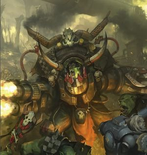
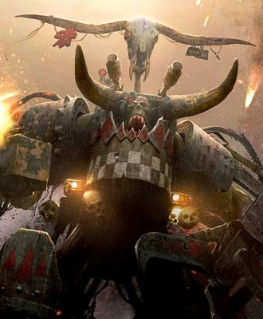
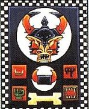
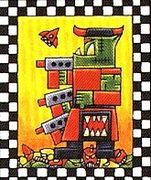
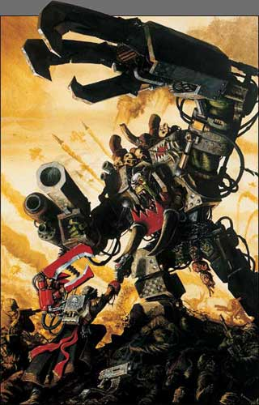
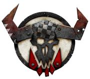
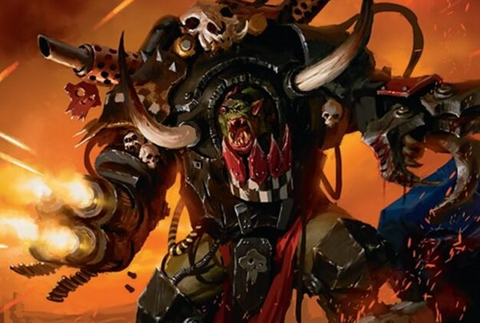
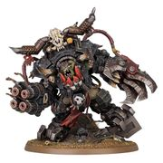

# 0740 碎骨者·斯拉卡 Ghazghkull Mag Uruk Thraka

精校状态：中文行文已逐段精校，部分术语仍为暂定

分类：混沌 / 欧克蛮人

原文来源：https://www.bilibili.com/opus/1137914953344221191

原作者：帝国神选罐头

原文时间：2025年11月22日 10:51

[返回分类目录](目录.md) · [全书目录](../../目录.md)

原篇名：碎骨者马格·乌鲁克·萨拉卡 Ghazghkull Mag Uruk Thraka

<!-- A0740-B0001 -->
**英文原文**

"Some Orks are clever. Some Orks are strong. I'm both"

<!-- /A0740-B0001 -->

<!-- A0740-B0002 -->

原译文

“有些欧克很聪明。有些欧克很强壮。我两者皆有。”

**校订译文**

“有的欧克脑子好使，有的欧克拳头够硬。俺两样都有！”

<!-- /A0740-B0002 -->

<!-- A0740-B0003 -->
**英文原文**

"Humies is all weak scum that deserve ta get stomped. 'Cept for One-Eye Yarrick. He knows how ter fight."

<!-- /A0740-B0003 -->

<!-- A0740-B0004 -->

原译文

“人类都是软弱的渣滓，应该被践踏。‘独眼亚瑞克除外。他知道如何战斗。”

**校订译文**

“人类全是软蛋，活该被踩扁。独眼亚瑞克除外，那家伙知道怎么打仗。”

<!-- /A0740-B0004 -->

<!-- A0740-B0005 -->
**英文原文**

Ghazghkull Mag Uruk Thraka, the self-proclaimed Prophet of the Waaagh!, known in the Imperium as The Beast of Armageddon, is the Ork Warlord of Waaagh! Ghazghkull and currently the most notorious Warboss of the 41st Millennium. He is infamous for his actions during both the Second and Third Armageddon Wars. Ghazghkull is a particularly megalomaniacal Ork, convinced he is blessed by the Ork gods Gork and Mork. He possesses a considerable measure of cunning, and in battle he tends to focus more on commanding his troops compared to other Warbosses, only engaging in combat himself at critical moments. Ghazghkull Mag Uruk Thraka roughly translates into "Metal-skull big/great Ork ruler" in Low Gothic.

<!-- /A0740-B0005 -->

<!-- A0740-B0006 -->

原译文

碎骨者马格·乌鲁克·萨拉卡，自称为Waaagh的先知！在帝国中被称为阿玛吉多顿的野兽，是碎骨者的Waaagh！的欧克军阀，目前是第41个千年最著名的战争头目。他因在第二次和第三次阿玛吉多顿战争中的行为而著名。碎骨者是一个特别夸大的欧克，他相信自己受到了欧克神搞哥和毛哥的祝福。他拥有相当多的狡猾，在战斗中，与其他战争头目相比，他倾向于更专注于指挥他的部队，只在关键时刻亲自参与战斗。碎骨者马格·乌鲁克·萨拉卡在低哥特语中大致翻译为“金属头骨大/伟大的欧克统治者”。

**校订译文**

碎骨者·斯拉卡自称“Waaagh! 先知”，帝国则称他为“阿玛吉多顿之兽”。他统领着碎骨者 Waaagh!，是 M41 最臭名昭著的欧克蛮人战争头目，尤其以第二次、第三次阿玛吉多顿战争中的事迹闻名。他野心膨胀，深信自己受到欧克双神搞哥与毛哥的眷顾。他十分狡猾，与其他战争头目相比，更注重指挥麾下部队，往往只在关键时刻亲自出战。他的完整名字 Ghazghkull Mag Uruk Thraka，译成低哥特语大致意为“金属颅骨的伟大欧克统治者”。

**校注：** 完整英文名沿18处理，中文采用已核官方短名“碎骨者·斯拉卡”，保留英文全名及源文词义解释，不把中间名臆造为官方译名。

<!-- /A0740-B0006 -->

<!-- A0740-B0007 图片 -->

<!-- A0740-B0008 -->

原译文

Ghazghkull since the Battle of Krongar during the Psychic Awakening 灵能觉醒时期克朗加之战后碎骨者

**校订译文**

Ghazghkull since the Battle of Krongar during the Psychic Awakening 灵能觉醒期间克朗加之战后的碎骨者

<!-- /A0740-B0008 -->

<!-- A0740-B0009 -->
### History 历史

<!-- /A0740-B0009 -->

<!-- A0740-B0010 -->
**英文原文**

Ghazghkull's rise was foreseen by Eldrad Ulthran as early as M32, shortly after The Beheading. After The Beast's defeat Eldrad told Ulthwé's Dome of Seers that beasts never die, they are only banished. He has heard the Orks chanting "Mag Uruk Thraka" through his divinations of the Othersea.

<!-- /A0740-B0010 -->

<!-- A0740-B0011 -->

原译文

埃尔德拉德·乌斯兰早在斩首后不久的M32就预见到了碎骨者的崛起。野兽战败后，埃尔德拉德告诉乌斯维的先知穹顶，野兽永远不会死，只会被放逐。他通过对异海的占卜，听到了欧克吟唱“马格·乌鲁克·萨拉卡”。

**校订译文**

早在 M32 的斩首事件后不久，艾尔德拉德·乌瑟兰便预见了碎骨者的崛起。野兽败亡之后，他告诉乌斯维先知穹顶中的同伴，野兽永远不会真正死去，只会被放逐。他在对异海的占卜中，听见欧克蛮人反复高呼“Mag Uruk Thraka”。

<!-- /A0740-B0011 -->

<!-- A0740-B0012 -->
### Origins 起源

<!-- /A0740-B0012 -->

<!-- A0740-B0013 -->
**英文原文**

In late M41, the Eldar of Ulthwé prevented a Waaagh! from endangering Craftworld Idharae. In the process, this act raised Ghazghkull Thraka to prominence.

<!-- /A0740-B0013 -->

<!-- A0740-B0014 -->

原译文

在M41晚期，乌斯维的灵族阻止了一次Waaagh！以免危及方舟世界伊德哈尔。在这一过程中，这一行为使碎骨者萨拉卡声名鹊起。

**校订译文**

M41 晚期，乌斯维灵族阻止了一场威胁伊德哈尔方舟世界的 Waaagh!，却也在这个过程中促成了碎骨者·斯拉卡的崛起。

<!-- /A0740-B0014 -->

<!-- A0740-B0015 图片 -->

<!-- A0740-B0016 -->

原译文

Warboss Ghazghkull pre-Psychic Awakening 灵能觉醒前的战争头目碎骨者

**校订译文**

Warboss Ghazghkull pre-Psychic Awakening 灵能觉醒前的战争头目碎骨者

<!-- /A0740-B0016 -->

<!-- A0740-B0017 -->
**英文原文**

The earliest records of Ghazghkull since that time were recorded nine years before the Second War for Armageddon. At this time, Ghazghkull was a newly spawned lowly Ork Boy in the armies of the Deathskulls Warboss Dregmek on the planet of Urk. At some point prior to Ghazghkull's birth, Dark Angels Space Marines raided the planet in the hopes of disrupting the Ork forces building up there and left behind a number of facilities that were continually raided by the disorganised Greenskins. During the battle against automated defenses left behind by the Space Marines, a bolter round tore into Ghazghkull's skull, destroying 30 percent of his skull and pulping a good portion of his brain. He was found by the notorious Painboy known as Mad Dok Grotsnik, who rebuilt his skull with adamantium. Despite these efforts, Ghazghkull apparently died on the operating table and Grotsnik dumped the body in a rubbish dump behind his operating shed.

<!-- /A0740-B0017 -->

<!-- A0740-B0018 -->

原译文

自那时起，关于碎骨者的最早记录是在第二次阿玛吉多顿战争前九年记录的。在这个时候，碎骨者是乌尔克行星上死颅战争头目德雷格梅克的军队中一个新出生的卑微的欧克小子。在碎骨者出生之前的某个时候，黑暗天使星际战士突袭了这个行星，希望扰乱那里的欧克部队，并留下了一些设施，这些设施不断遭到组织混乱的绿皮的袭击。在与星际战士留下的自动防御系统的战斗中，一枚爆弹撕裂了碎骨者的头骨，摧毁了他30%的头骨，并粉碎了他大部分的大脑。他被臭名昭著的痛苦小子发现，被称为疯医戈斯尼克，他用精金重建了头骨。尽管做出了这些努力，碎骨者显然还是死在了手术台上，戈斯尼克将尸体倒在了手术棚后面的垃圾堆里。

**校订译文**

此后关于碎骨者的最早记录，可追溯至第二次阿玛吉多顿战争前九年。当时，他还只是乌尔克行星上一名刚刚诞生、地位低微的蛮人小子，效力于死颅战争头目德雷格梅克。在他出生以前，黑暗天使曾袭击该行星，试图打乱欧克部队的集结，并留下若干设施；组织散乱的绿皮不断袭扰这些据点。在一次进攻星际战士遗留的自动防御系统时，一发爆矢击中碎骨者的头部，轰碎了约三成颅骨，也将很大一部分脑组织搅成烂泥。臭名昭著的痛苦小子疯医戈斯尼克发现了他，并以精金重造其颅骨。尽管如此，碎骨者似乎仍死在手术台上，戈斯尼克便把他的身体扔进手术棚后方的垃圾堆。

<!-- /A0740-B0018 -->

<!-- A0740-B0019 -->
**英文原文**

The body was discovered by a nameless Grot in the service of Grotsnik, who went about exploring this new arrival to see if there was anything worth looting. In that moment, Ghazghkull awoke and his single remaining eye stared into the Grot, sharing with him the vision given to him by Gork and Mork themselves. It told of a unified Ork race sweeping across the Galaxy and the Great Green brought into the material realm. Somehow, the damage to his brain had unlocked Ghazghkull's latent psychic powers. He declared himself the prophet of the Gods and dubbed the Grot Makari, who would now be his banner bearer.

<!-- /A0740-B0019 -->

<!-- A0740-B0020 -->

原译文

这具尸体是由一个无名的屁精为戈斯尼克服务时发现的，他四处探索这个新来者，看看是否有值得掠夺的东西。在那一刻，碎骨者醒了过来，他剩下的唯一一只眼睛盯着洞穴，与他分享了搞哥和毛哥给他的幻象。它讲述了一个统一的欧克种族席卷银河系，大绿神被带入了物质世界。不知何故，他大脑的损伤释放了碎骨者潜在的灵能力量。他宣称自己是神的先知，并称其为屁精马卡利，他现在将成为他的旗手。

**校订译文**

一个为戈斯尼克干活、没有名字的屁精发现了这具身体，凑过去翻找可以搜刮的东西。就在这时，碎骨者醒来，仅剩的一只眼睛直直盯住屁精，将搞哥与毛哥亲赐的异象展示给他：统一的欧克蛮人席卷银河，大绿降临物质宇宙。不知为何，脑部创伤反而释放了碎骨者潜藏的灵能力量。他宣称自己是双神的先知，为屁精取名“马卡利”，任命他担任自己的旗手。

**校注：** Grot 指屁精，原“盯着洞穴”误译。Great Green 为已定“大绿”，不额外加神，避免改变本体性质。

<!-- /A0740-B0020 -->

<!-- A0740-B0021 图片 -->

<!-- A0740-B0022 -->

原译文

Ghazghkull's Bosspole 碎骨者的老大之旗

**校订译文**

Ghazghkull's Bosspole 碎骨者的老大之旗

<!-- /A0740-B0022 -->

<!-- A0740-B0023 -->
**英文原文**

With Makari at his side, Ghazghkull immediately set for Dregmek's shantytown of ‘’’Rustspike’’’ and declared the boss a disgrace to the Gods who wasted perfectly good boyz in futile wars against machines instead of seeking greater foes. This prompted Dregmek to unload his cannon at Ghazghkull, but miraculously every shot missed the self-proclaimed Prophet. Ghazghkull then proceeded to slowly pick apart and exhaust Dregmek until he had been reduced to little more than a pile of meat. Ghazghkull declared himself boss of Rustspike and announced his intention to bring all of Urk under his rule. As if the Gods themselves approved, a great green light caused by a nearby supernova appeared in the sky. Ghazghkull then set about bringing the remaining Warbosses of Urk under his control, often through great challenges and duels. He eventually managed to turn the Snakebites Warboss Grudbolg, the Evil Sunz Shazfrag, the Bad Moon Snazdakka, the Blood Axes Straturgum and the Goff Ugrak to his side, completing his Counsill of Clan-Bosses. Upon unifying Urk, Ghazghkull announced his intention to leave the world.

<!-- /A0740-B0023 -->

<!-- A0740-B0024 -->

原译文

在马卡利的陪伴下，碎骨者立即前往德雷格梅克的“锈钉”棚户区，并宣布头目是神的耻辱，他们在与机械的徒劳战争中浪费了非常好的小子，而不是寻求更大的敌人。这促使德雷格梅克取出他的枪朝向碎骨者，但奇迹般的是，每一枪都没打中这位自称先知的人。然后，碎骨者开始慢慢地把德雷格梅克拆开，直到他只剩下一堆肉。碎骨者宣布自己是锈钉的头目，并宣布他打算将乌尔克全部纳入他的统治之下。仿佛神自己也同意了，一颗由附近超新星引起的巨大绿光出现在天空中。然后，碎骨者开始将乌尔克的剩余战争头目置于他的控制之下，通常是通过伟大的挑战和决斗。他最终成功地将蛇咬的格鲁德博尔格、邪日的沙兹弗拉格、恶月的斯纳兹哒咔、血斧的斯特拉图古姆和高夫的乌格拉克等战争头目转向了他，完成了他的氏族头目议会。统一乌尔克后，碎骨者宣布他打算离开这个世界。

**校订译文**

碎骨者带着马卡利立即前往德雷格梅克的棚户城“锈钉”，当面斥责头目辱没诸神：他把好端端的蛮人小子浪费在与机器的无谓厮杀中，却不去寻找更强的对手。德雷格梅克随即向他猛烈开炮，但奇迹般地，没有一炮击中这位自封的先知。碎骨者随后一点点击垮、耗尽德雷格梅克，直到对方几乎只剩一堆碎肉。他宣布自己是锈钉的新头目，并立誓统一整个乌尔克。仿佛诸神也表示赞同，邻近超新星爆发产生的一大片绿光出现在天空中。此后，他通过挑战和决斗，逐一收服乌尔克的其他战争头目，最终令蛇咬的格鲁德博尔格、邪日的沙兹弗拉格、恶月的斯纳兹哒咔、血斧的斯特拉图古姆以及高夫的乌格拉克都归于麾下，组成氏族头目议会。统一乌尔克后，他宣布下一步将离开这颗星球。

<!-- /A0740-B0024 -->

<!-- A0740-B0025 图片 -->

<!-- A0740-B0026 -->

原译文

Ghazghkull's Banner 碎骨者的旗帜

**校订译文**

Ghazghkull's Banner 碎骨者的旗帜

<!-- /A0740-B0026 -->

<!-- A0740-B0027 -->
**英文原文**

Ghazghkull needed to begin his exodus from Urk fast, for its sun had begun to expand into a red giant. Ghazghkull told the Orks that this was a sign from Gork that the time had come to launch his Waaagh! and paint the stars red with blood. Severe solar flares started to cause many deaths among the Orks from radiation. Then, as if in answer to Ghazghkull's proclamation, a massive space hulk appeared in orbit around the planet, offering escape from certain death. During this time, Ghazghkull constructed his first base of operations, a deserted Fortress of Redemption, later renamed as Da Forktress. It has been vastly 'upgraded' by Orks. He had also obtained his big Battlewagon known as "Da Killblasta". In the meantime, he had worked the Orks of Urk tirelessly in constructing rockets to get them off Urk, which soon proved quite difficult given the Greenskins' short attention span and dissatisfaction with peace and quiet. To satisfy his mobs, Ghazghkull stood on the balcony of Da Forkress and stripped himself of his armour, announcing he wouldn't move from the spot for 1 week and if he could do that then surely his boyz could wait a little longer. The action proved successful in inspiring the Orks to keep working.

<!-- /A0740-B0027 -->

<!-- A0740-B0028 -->

原译文

碎骨者需要尽快开始从乌尔克离开，因为它的太阳已经开始膨胀成红巨星。碎骨者告诉欧克，这是搞哥发出的信号，表明是时候开始他的Waaagh！了，用鲜血把群星涂成红色。严重的太阳耀斑开始导致许多欧克因辐射而死亡。然后，就好像是为了回应碎骨者的宣告，一艘巨大的太空废船出现在环绕行星的轨道上，提供了逃离死亡的机会。在此期间，碎骨者建造了他的第一个作战基地，一座废弃的救赎堡垒，后来更名为堡垒。它被欧克大大“升级”了。他还获得了被称为“杀戮爆炸”的大战斗卡车。与此同时，他不知疲倦地与乌尔克的欧克合作，建造火箭，让他们离开乌尔克，这很快就被证明是相当困难的，因为绿皮的注意力持续时间很短，对和平与宁静感到不满。为了满足他的暴徒，碎骨者站在堡垒的阳台上，脱下盔甲，宣布他一周内不会离开现场，如果他能做到这一点，那么他的小子们肯定可以再等一会儿。事实证明，这一行动成功地激励了欧克继续工作。

**校订译文**

碎骨者必须尽快带领族人离开乌尔克，因为其恒星已开始膨胀为红巨星。他告诉欧克蛮人，这是搞哥发出的征兆：该发动 Waaagh!，用鲜血染红群星了。猛烈的恒星耀斑带来致命辐射，许多欧克接连死去。仿佛回应了他的宣告，一艘巨大的太空废船出现在行星轨道，给他们带来了逃脱必死命运的机会。这段时期，碎骨者将一座废弃的救赎堡垒改为首个行动基地，重命名为“欧克堡垒”，并由麾下战士大肆“升级”。他还得到一辆名为“杀戮爆炸”的大型战斗堡垒。他不停驱使乌尔克的欧克建造火箭，准备离开行星，但绿皮缺乏耐性，又受不了和平无聊的日子，工程很快遇到困难。为安抚手下，碎骨者站到堡垒阳台上，脱下护甲，宣称自己会在原地一动不动地站上一周：若连他都能做到，小子们自然也能再等一会儿。这番举动果然激励了欧克继续干活。

**校注：** Da Forktress 原只译堡垒，为保留其欧克化专名暂译欧克堡垒，英文不改；Battlewagon 沿官译战斗堡垒，故名称“杀戮爆炸”与车型分开。worked the Orks 指驱使欧克劳作，不是他与欧克一起工作。

<!-- /A0740-B0028 -->

<!-- A0740-B0029 -->
**英文原文**

After the week was finally over, Ghazghkull led his boyz into space and launched a boarding operation to the Space Hulk in orbit. The Hulk proved to be full of Daemons, and at its centre was a massive Warp Rift. Ghazghkull and his boyz at last battled non-Orky foes, and had a jolly time of it. Upon reaching the Warp rift Ghazghkull bellowed a challenge and was faced with a monstrous Blood Thirster. The prophet of Gork and Mork bested the Daemon, hurling back into the Rift before headbutting it closed and warning the Chaos Gods to send something bigger next time. The Hulk was then renamed Wurld Killa and they entered the Warp for destinations unknown. It was during this time that Grotsnik killed Makari, though he was quickly reincarnated into a new body.

<!-- /A0740-B0029 -->

<!-- A0740-B0030 -->

原译文

一周终于结束后，碎骨者带领他的小子进入太空，并向轨道上的太空废船发起了一次跳帮行动。事实证明，废船内部充满了恶魔，其中心是一个巨大的亚空间裂隙。碎骨者和他的小子终于与非欧克的敌人作战，玩得很开心。到达亚空间裂隙后，碎骨者咆哮着挑战，面临着可怕的嗜血狂魔。搞哥和毛哥的先知击败了恶魔，在用头撞碎裂隙之前，把他扔回了裂隙，并警告混沌之神下次要派更大的东西。废船随后更名为世界杀手号，他们进入亚空间前往未知目的地。正是在这段时间里，戈斯尼克杀死了马卡利，尽管他很快转世成了一个新的身体。

**校订译文**

一周期满，碎骨者率领小子们升入太空，跳帮轨道上的太空废船。船内到处是恶魔，中央更有一道巨大的亚空间裂隙。欧克终于能痛快地和同族以外的敌人厮杀，打得兴高采烈。抵达裂隙前，碎骨者怒吼挑战，一头骇人的嗜血狂魔随即现身。双神的先知击败恶魔，将它扔回裂隙，再以一记头槌撞闭裂隙，警告混沌诸神下次派个更大的对手来。他把废船改名为世界杀手号，率众驶入亚空间，前往未知的目的地。这段时间里，戈斯尼克杀死了马卡利，不过屁精很快便在新的身体中转生。

<!-- /A0740-B0030 -->

<!-- A0740-B0031 -->
### Second War for Armageddon 第二次阿玛吉多顿战争

<!-- /A0740-B0031 -->

<!-- A0740-B0032 -->
**英文原文**

The hulk found its way to the Armageddon system, though according to Makari, Ghazghkull had been drawn to the world due to its apparent holy significance to the Greenskin race. Its weapons demolished the defences of the Armageddon system, including obsolete orbital satellites and small attack craft. Desperate messages were sent in the hope of acquiring aid. Three Space Marine Chapters began to organise themselves but would not be able to get there before the Orks landed. A month later the Orks disembarked, beginning the Second War for Armageddon in earnest on the day of the Feast of the Emperor's Ascension in 941.M41.

<!-- /A0740-B0032 -->

<!-- A0740-B0033 -->

原译文

废船进入了阿玛吉多顿星系，尽管据马卡利说，碎骨者之所以被世界所吸引，是因为它对绿皮种族具有明显的神圣意义。它的武器摧毁了阿玛吉多顿星系的防御，包括过时的轨道卫星和小型攻击艇。人们发出绝望的信息，希望获得援助。三个星际战士战团开始自行组织，但在欧克登陆之前无法到达那里。一个月后，欧克下船，在941.M41的帝皇升天节那天正式开始了第二次阿玛吉多顿战争。

**校订译文**

太空废船最终抵达阿玛吉多顿星系。按马卡利的说法，碎骨者是被这颗星球对绿皮一族的神圣意义吸引而来。废船的武器摧毁了星系防御，连同陈旧的轨道卫星与小型攻击艇一并击毁。帝国守军发出绝望的求援讯息，三个星际战士战团开始集结，却无法赶在欧克登陆之前抵达。一个月后，即 941.M41 的帝皇升天节，欧克大军登陆，第二次阿玛吉多顿战争正式爆发。

<!-- /A0740-B0033 -->

<!-- A0740-B0034 图片 -->

<!-- A0740-B0035 -->

原译文

Ghazghkull locked in combat with Commissar Yarrick 碎骨者与亚瑞克政委交战

**校订译文**

Ghazghkull locked in combat with Commissar Yarrick 碎骨者与亚瑞克政委交战

<!-- /A0740-B0035 -->

<!-- A0740-B0036 -->
**英文原文**

Ghazhkull's attempted conquest of Armageddon would be foiled by his arch-rival Commissar Yarrick, who caused the Warboss to begin to doubt his own abilities. Soon enough, due to Yarrick's meddling Armageddon had become a quagmire and a hinderance to Ghazghkull's vision to unify the Greenskins and conquer the stars. He had his boyz launch a futile frontal assault in order to provide a distraction to leave with his inner circle and Makari. However, Ghazghkull's doubt had now grown into a malaise, and he set course for Golgotha in order to recruit a new mob for a possible return to Armageddon instead. The return to Armageddon was apparently in contradiction to the will of the Gods, but was egged on continually by Grotsnik as he operated on Ghazghkull to relieve the Warboss of his severe headaches. When even Makari talked back to Ghazghkull over his desire to return to Armageddon, the Boss finally had enough and said he would ignore the Gods before killing Makari.

<!-- /A0740-B0036 -->

<!-- A0740-B0037 -->

原译文

碎骨者征服阿玛吉多顿的企图被他的主要敌手亚瑞克政委挫败，亚瑞克使战争头目开始怀疑自己的能力。很快，由于亚瑞克的干预，阿玛吉多顿就变成了一个泥潭，阻碍了碎骨者统一绿皮和征服群星的愿景。他让他的小子发动了一场徒劳的正面攻击，以分散他与内环和马卡利一起离开的注意力。然而，碎骨者的怀疑现在已经变成了一种不适，他为各各他制定了路线，以招募新的暴徒，从而有可能重返阿玛吉多顿。回到阿玛吉多顿显然与神的意愿相矛盾，但戈斯尼克不断怂恿他对碎骨者进行手术，以缓解战争头目的严重头痛。当马卡利甚至与碎骨者就他重返阿玛吉多顿的愿望进行了交谈时，头目终于受够了，他说在杀死马卡利之前，他会无视神。

**校订译文**

碎骨者征服阿玛吉多顿的计划，被宿敌亚瑞克政委挫败，甚至使他开始怀疑自己的能力。亚瑞克不断从中阻挠，将阿玛吉多顿变成战争泥潭，妨碍了他统一绿皮、征服群星的宏愿。碎骨者于是命令小子们发动注定徒劳的正面进攻，借机带着核心亲信和马卡利撤离。然而，自我怀疑已经演变为萎靡与苦闷。他转航各各他，打算招募新的部众，以便卷土重来。重返阿玛吉多顿似乎违背诸神旨意，但戈斯尼克却在为他动手术缓解剧烈头痛时，不断怂恿他回去。连马卡利也因这项计划顶撞他，令碎骨者终于忍无可忍。他宣称自己不再理会诸神，随后杀死了马卡利。

**校注：** 澄清戈斯尼克的双重动作：他一边给碎骨者手术缓解头痛，一边怂恿其重返阿玛吉多顿；原文不是怂恿碎骨者为自己做手术。

<!-- /A0740-B0037 -->

<!-- A0740-B0038 -->
### Golgotha 各各他

<!-- /A0740-B0038 -->

<!-- A0740-B0039 -->
**英文原文**

Ghazghkull swiftly captured the planet of Golgotha from Imperial-aligned Squats. Though soon Commissar Yarrick would arrive with an Imperial Guard army in an attempt to recapture the world. At the Battle of Golgotha Ghazghkull engaged Yarrick in battle once more, but this time bested and captured the Commissar. After a few weeks of torture, Ghazghkull decided Yarrick was too much fun for the "new" fight he was already planning and released the Commissar. It is also said that Yarrick escaped, and Ghazghkull only said he "let him go".

<!-- /A0740-B0039 -->

<!-- A0740-B0040 -->

原译文

碎骨者迅速从与帝国结盟的矮人手中夺取了各各塔行星。尽管很快，亚瑞克政委率领帝国卫队抵达，试图夺回世界。在各各他之战中，碎骨者再次与亚瑞克交战，但这次击败并俘虏了政委。经过几周的折磨，碎骨者认为亚瑞克对他已经计划好的“新”战斗来说太有趣了，于是释放了政委。还有人说亚瑞克逃跑了，碎骨者只说他“放了他”。

**校订译文**

碎骨者迅速从亲帝国的矮人手中夺取各各他。不久，亚瑞克政委率领帝国卫队抵达，试图收复该世界。在各各他之战中，两名宿敌再次交锋，这次碎骨者击败并俘虏了亚瑞克。折磨政委数周后，他认为这个对手太有趣，应该留到自己筹划的新战争中再较量，于是将其释放。也有说法称，亚瑞克其实是自行逃脱，只不过碎骨者声称是自己“放了他”。

<!-- /A0740-B0040 -->

<!-- A0740-B0041 -->
**英文原文**

Following Golgotha Ghazghkull begun to test Imperial worlds, starting with the destruction of Buca III in 962.M41.

<!-- /A0740-B0041 -->

<!-- A0740-B0042 -->

原译文

继各各他之后，碎骨者开始测试帝国世界，从962.M41的布卡三号的毁灭开始。

**校订译文**

各各他之战后，碎骨者开始试探帝国各世界的防御，首先在 962.M41 摧毁了布卡三号。

<!-- /A0740-B0042 -->

<!-- A0740-B0043 -->
### Chigon 17 and Piscina 奇贡十七号与皮希纳

原题：Chigon 17 and Piscina 奇贡17号和皮希纳

<!-- /A0740-B0043 -->

<!-- A0740-B0044 -->
**英文原文**

In 972.M41 Waaagh! Ghazghkull overan the agri-world of Chigon 17. Ghazgkull's Orks fought a guerrilla campaign which overwhelmed the Imperial defences. In 982.M41, Ghazghkull was able to capture the battlecruiser Radiant Way in orbit around Chigon 17. When Imperial relief forces arrived, they found that the Orks had already left the system.

<!-- /A0740-B0044 -->

<!-- A0740-B0045 -->

原译文

972.M41，碎骨者的Waaagh！前往奇贡17号农业世界。碎骨者的欧克进行了一场游击战，击败了帝国的防御。982.M41，碎骨者能够捕获在奇贡17号轨道上的战列巡洋舰容光之路号。当帝国救援部队到达时，他们发现欧克已经离开了这个星系。

**校订译文**

972.M41，碎骨者 Waaagh! 攻陷农业世界奇贡十七号。欧克以游击战击溃了帝国防御。982.M41，碎骨者又在该行星轨道俘获战列巡洋舰容光之路号。等帝国援军抵达，欧克早已离开星系。

<!-- /A0740-B0045 -->

<!-- A0740-B0046 图片 -->

<!-- A0740-B0047 -->

原译文

Ghazkull's glyph 碎骨者的符号

**校订译文**

Ghazkull's glyph 碎骨者的符号

<!-- /A0740-B0047 -->

<!-- A0740-B0048 -->
**英文原文**

Following this, Ghazghkull allied with Nazdreg Ug Urdgrub to attack the planet of Piscina IV. The Imperials were taken by complete surprise, when the Orks employed previously unknown tellyporta devices. Only the efforts of the Dark Angels and Harbingers were able to save the planet, despite the loss of a Warlord Titan. While the Waaagh! was driven back, Ghazghkull was pleased that his tellyportas worked. With the device perfected and tested, and his Waaagh! now far larger than before, he once more set his eyes on Armageddon.

<!-- /A0740-B0048 -->

<!-- A0740-B0049 -->

原译文

在此之后，碎骨者与纳兹德雷格·乌格·乌德格拉布结盟，袭击了皮希纳四号行星。当欧克使用了以前未知的传送器装置时，帝国完全措手不及。尽管失去了一架军阀泰坦，但黑暗天使和凶兆者的努力拯救了这个行星。当Waaagh！被赶回去时，碎骨者很高兴他的传送器工作正常。随着设备的完善和测试，他的Waaagh！现在比以前大得多，他再次将目光投向了阿玛吉多顿。

**校订译文**

此后，碎骨者与纳兹德雷格·乌骨·乌德格拉布结盟，进攻皮希纳四号。欧克使用此前不为人知的传送器，令帝国措手不及。虽然损失了一台战将级泰坦，但黑暗天使与凶兆战团仍奋力守住了这颗星球。Waaagh! 虽然被击退，碎骨者却对传送器的表现十分满意。装置经受实战检验并得到完善，他的 Waaagh! 规模也远胜从前；于是，他再次把目光投向阿玛吉多顿。

**校注：** 纳兹德雷格完整姓名沿574定译；Harbingers 沿225凶兆战团。Warlord Titan 采用已核官译战将级泰坦。

<!-- /A0740-B0049 -->

<!-- A0740-B0050 -->
**英文原文**

"I'm da hand of Gork and Mork, dey sent me to rouse up da Boyz to crush and kill cos da Boyz forgot what dere 'ere for. I woz one of da Boyz till da Godz smashed me in da 'ead an' I 'membered dat Orks is meant to conquer and make slaves of everyfing they don't kill... I'm Warlord Ghazghkull Mag Uruk Thraka an' I speak wiv da word of da Godz. We iz gonna stomp da 'ooniverse flat an' kill anyfing that fights back. We iz gonna do this coz' we're Orkz an' we was made ta fight an' win." - Inscription found on a destroyed Warlord Titan on Piscina IV

<!-- /A0740-B0050 -->

<!-- A0740-B0051 -->

原译文

“我是搞哥和毛哥之手，他们派我来唤醒小子来粉碎和杀戮，因为小子忘了这是为了什么。我曾是小子中的一个，直到神把我打得死亡，我记得欧克的目的是征服，让他们不杀的一切成为奴隶……我是军阀碎骨者马格·乌鲁克·萨拉卡，我会说神的一句话。我们要把宇宙夷为平地，杀死任何反击的人。我们要这样做，因为我们是欧克，我们注定要打赢。” - 在皮希纳四号上被摧毁的军阀泰坦上发现的刻字

**校订译文**

“俺是搞哥和毛哥的手！小子们忘了自己生来是干啥的，所以双神派俺来把他们叫醒，去砸烂东西，去宰人。俺本来也只是个小子，直到双神给了俺脑袋一下，俺才想起来：欧克生来就该征服一切，没宰掉的就抓来当奴隶……俺就是军阀碎骨者·斯拉卡，俺说的就是双神的话。俺们要把整个宇宙踩平，谁敢还手就宰了谁。为啥？因为俺们是欧克，生来就是为了打仗，为了赢！”——发现于皮希纳四号上一台被摧毁的战将级泰坦的刻文

**校注：** 保留欧克说话的粗豪口吻；smashed me in da ’ead 指打击头部，不是“把我打得死亡”。

<!-- /A0740-B0051 -->

<!-- A0740-B0052 -->
### Third War for Armageddon 第三次阿玛吉多顿战争

<!-- /A0740-B0052 -->

<!-- A0740-B0053 -->
**英文原文**

Fifty-seven years to the day after launching his first invasion of Armageddon, Ghazghkull once more invaded Armageddon. Though initially conquering half the planet's surface in extremely bloody fighting, Ghazghkull became bored with the stalemate that was developing on Armageddon. His headaches and malaise continued to plague him, and much to his dismay Makari would promptly commit suicide whenever the Warboss reincarnated him into a new body. The situation changed when Ghazghkull spoke directly to the newly reincarnated Makari for the first time, stating that as a true Ork he wouldn't apologise but that he had something to say. He showed Makari the Holy War he had created on Armageddon, but admitted it could be so much greater. At that moment a Leman Russ Battle Tank appeared, blasting a hole in Ghazghkull's chest. Ghazghkull was saved by Makari, who crawled inside the tank to murder the crew within. Seeing the incident as a message from the gods, the recovering Ghazghkull admitted he had been wrong to both Makari and Gork and Mork. He announced his attention to depart Armageddon and begin Da Great Waaagh!. Leaving the settlement of the conflict to his Nobz, Ghazghkull left Armageddon in search of a new, more exciting fight. His old enemy, Commissar Yarrick, followed him and vowed to slay the Warboss at all costs.

<!-- /A0740-B0053 -->

<!-- A0740-B0054 -->

原译文

在首次入侵阿玛吉多顿57年后的今天，碎骨者再次入侵阿玛吉多顿。虽然最初在极其血腥的战斗中征服了行星表面的一半，但碎骨者对阿玛吉多顿正在形成的僵局感到厌倦。他的头痛和不适继续困扰着他，令他沮丧的是，每当战争头目将他转世到一个新的身体时，马卡利都会立即自杀。当碎骨者第一次直接与新转世的马卡利交谈时，情况发生了变化，他说作为一个真正的欧克，他不会道歉，但他有话要说。他向马卡利展示了他在阿玛吉多顿创造的圣战，但承认它可能更大。就在那一刻，一辆黎曼鲁斯战斗坦克出现了，在碎骨者的胸膛上炸了一个洞。碎骨者被马卡利救了下来，马卡利爬进坦克里谋杀了里面的成员。将这一事件视为神的信息，正在康复的碎骨者承认他对马卡利、搞哥和毛哥都错了。他宣布要离开阿玛吉多顿，开始大Waaagh！把解决冲突的任务交给他的老大们，碎骨者离开阿玛吉多顿，寻找一场新的、更激动人心的战斗。他的宿敌，政委亚瑞克紧随其后，发誓要不惜一切代价杀死战争头目。

**校订译文**

距第一次入侵阿玛吉多顿整整五十七年，碎骨者再次攻打这颗星球。他在初期的血腥厮杀中征服了半个世界，却渐渐厌倦不断加深的僵局。头痛与萎靡仍折磨着他，更让他烦恼的是，每当他让马卡利在新的身体中复生，屁精总会立即自杀。转机出现在他首次主动与刚刚复生的马卡利谈心之时。他说，自己是个真正的欧克，当然不会道歉，但有些话必须说清。他让马卡利看看自己在阿玛吉多顿掀起的圣战，同时承认，战争本可以比这更宏大。就在这时，一辆黎曼鲁斯战斗坦克突然出现，一炮轰穿了他的胸膛。马卡利爬进坦克，杀死车组成员，救下了碎骨者。养伤期间，他将此事视为诸神的启示，承认自己错待了马卡利，也违背了搞哥与毛哥。他宣布将离开阿玛吉多顿，发动“大 Waaagh!”。把这里的战事交给麾下强蛮人后，他便出发寻找新的、更刺激的战争。宿敌亚瑞克政委紧追不舍，发誓不惜一切代价杀死他。

**校注：** fifty-seven years to the day 意为整整五十七年，不是叙述者所处的“今天”。该段交替描述马卡利反复复生、碎骨者此前杀死他等事件，按源文顺序保留。

<!-- /A0740-B0054 -->

<!-- A0740-B0055 -->

原译文

Da Great Waaagh! 大Waaagh！

**校订译文**

Da Great Waaagh! 大 Waaagh!

<!-- /A0740-B0055 -->

<!-- A0740-B0056 -->
**英文原文**

Ghazghkull was cornered by Yarrick and Helbrecht of the Black Templars at the Battle of Haunted Gulf, where it seemed the Warlord's luck had finally run out. During the height of the battle aboard his flagship Kill Wrecka, Ghazghkull received a message from his Weirdboyz apparently from Gork and Mork themselves. The Greenskin gods told him that it was not his time to die, and that the whole galaxy must echo to the battle cry of the Orks. They charged Ghazghkull with gathering a Waaagh! like no other, and to do this he must first defeat every other major Ork Warlord and bring their forces under his sway. Upon uniting the Ork race, he was commanded to lead them in a battle that would last forever. The Kill Wrecka vanished in the Warp and escaped his Imperial pursuers. The vessel reappeared in the Ork Empire of Octarius, where Ghazghkull first had to contend with the rival Warboss Urgok Da Slayer and then the Tyranids of Hive Fleet Leviathan. He has since launched his new Great Waaagh!, intent on fulfilling the mission given to him by the Ork gods.

<!-- /A0740-B0056 -->

<!-- A0740-B0057 -->

原译文

在闹鬼湾战役中，碎骨者被黑色圣堂的赫尔布雷希特和亚瑞克逼到了绝境，军阀的运气似乎终于用完了。在他的旗舰杀戮破坏者号上的战斗最激烈的时候，碎骨者收到了他的怪异小子的消息，显然是搞哥和毛哥发来的。绿皮的神告诉他，现在还不是他死的时候，整个银河系都必须回应欧克的战吼。他们要求碎骨者聚集Waaagh！要做到这一点，他必须首先击败所有其他主要的欧克军阀，并将他们的军队置于他的统治之下。在欧克种族团结起来后，他奉命领导他们进行一场将永远持续下去的战斗。杀戮破坏者号的残骸在亚空间中消失了，逃脱了帝国的追捕。这艘船再次出现是在奥克塔琉斯的欧克帝国，在那里，碎骨者首先不得不与对手战争头目杀戮者乌尔戈克作战，然后是虫巢舰队利维坦的泰伦。自那以后，他发起了他的新大Waaagh！致力于完成欧克之神赋予他的使命。

**校订译文**

闹鬼湾之战中，亚瑞克与黑色圣堂的赫尔布雷希特将碎骨者逼入绝境，他的好运似乎终于到了尽头。旗舰杀戮破坏者号上的战斗正激烈时，麾下灵能小子给他带来似乎直接出自搞哥与毛哥的神谕。双神告诉他，他命不该绝，欧克的战吼必须响彻整个银河。他们命令碎骨者掀起一场前所未有的 Waaagh!；为此，他首先必须击败所有其他强大的欧克军阀，将其部众收入麾下。等整个欧克种族统一，他就应带领族人投入一场永不终结的战争。随后，杀戮破坏者号隐入亚空间，甩脱了帝国追兵，再次出现时已抵达奥克塔琉斯欧克帝国。碎骨者先与竞争对手杀戮者乌尔戈克交战，随后对抗利维坦虫巢舰队。自此，他发动了新的大 Waaagh!，誓要完成双神赋予的使命。

**校注：** Kill Wrecka 是完整舰名，后面的 Wrecka 不另译为残骸；Weirdboyz 按官译灵能小子。

<!-- /A0740-B0057 -->

<!-- A0740-B0058 -->
**英文原文**

Ghazgkhull has since left the Octarius warzone, and is now leading a fleet of over 5 million ships against the Imperium. However conflicting reports by the Logis Strategos concerning the location of Ghazghkull is causing consternation at the highest levels of the Imperium. The Grand Warlord is documented to be within Octarius, yet simultaneously sacking Cantissa, upon the killing fields of Aurochtha, reappearing at Armageddon to give tactical advice to his followers, in the Imperium Nihilus, and fighting around Ryza. It is speculated that the Orks are using Warp Storms to 'navigate' the galaxy, and extreme empyric time dilation may also be to blame for the confusion.

<!-- /A0740-B0058 -->

<!-- A0740-B0059 -->

原译文

碎骨者已经离开了奥克塔琉斯战区，现在正率领一支由500多万艘船只组成的舰队对抗帝国。然而，情报部关于碎骨者位置的相互矛盾的报告引起了帝国最高层的恐慌。据记载，这位大军阀在奥克塔琉斯内，但同时在奥罗克萨杀戮区洗劫了坎蒂萨，在阿玛吉多顿再次出现，为他的追随者提供战术建议，在帝国暗面，并在瑞扎周围作战。据推测，欧克正在使用亚空间风暴来“导航”银河系，极端的以太时间膨胀也可能是造成这种混乱的原因。

**校订译文**

此后，碎骨者离开奥克塔琉斯战区，率领超过五百万艘舰船向帝国进军。但情报部关于其行踪的报告相互矛盾，引起帝国最高层震动。报告称，他仍在奥克塔琉斯，却同时又在劫掠坎蒂萨、现身奥罗克塔的杀戮战场、重返阿玛吉多顿指导部下作战；帝国暗面与瑞扎周边也都出现了他的踪迹。有人推测，欧克正在利用亚空间风暴穿行银河，亚空间造成的极端时间延缓也可能加剧了情报混乱。

**校注：** Cantissa 与 Aurochtha 是报告列举的两处不同地点，原译将其误并为在奥罗克塔洗劫坎蒂萨；此处恢复并列关系。

<!-- /A0740-B0059 -->

<!-- A0740-B0060 -->
### Psychic Awakening 灵能觉醒

<!-- /A0740-B0060 -->

<!-- A0740-B0061 -->
**英文原文**

During the Psychic Awakening, Ghazghkull would come into battle with the Space Wolves on the world of Krongar. During the ensuing battle, Ghazghkull deliberately isolated himself and Wolf Lord Ragnar Blackmane by detonating explosives which blocked the entrance to an Imperial cathedral with debris. In the subsequent duel, both sides fought bitterly but the Wolf Lord slowed Ghazghkull by cutting the hydraulic cabling to his armour. This did not fully stop Ghazghkull, and he crushed Ragnar in his claw. However, while horribly wounded, the Wolf Lord summoned up enough strength to decapitate Ghazghkull with his Frost Blade. Ragnar lifted Ghazghkull's head up high and howled in victory. Between life and death, Ghazghkull lamented that there was nobody left to bring back Makari now and that his work was still unfinished.

<!-- /A0740-B0061 -->

<!-- A0740-B0062 -->

原译文

在灵能觉醒期间，碎骨者在克朗加世界与太空野狼作战。在随后的战斗中，碎骨者故意通过引爆爆炸物将自己和狼主拉格纳·黑鬃隔离开来，爆炸物用碎片堵住了帝国大教堂的入口。在随后的决斗中，双方进行了激烈的战斗，但狼主通过切断装甲的液压电缆来减缓碎骨者的速度。这并没有完全阻止碎骨者，他用爪子把拉格纳捏碎了。然而，尽管身受重伤，狼主还是聚集了足够的力量，用他的霜刃斩首了碎骨者。拉格纳举起碎骨者的头，在胜利中嚎叫。在生与死之间，碎骨者哀叹现在没有人能把马卡利带回来，他的工作还没有完成。

**校订译文**

灵能觉醒期间，碎骨者在克朗加与太空野狼交战。他刻意引爆炸药，用瓦砾封住一座帝国大教堂的入口，将自己与狼主拉格纳·黑鬃单独困在其中。两人激烈决斗，拉格纳割断护甲的液压管路，减缓了碎骨者的动作，却未能阻止他。碎骨者用动力爪夹住狼主，将其重重挤伤。然而，拉格纳仍以重伤之躯聚起最后的力量，用霜刃斩下了对方的头颅。他高举首级，发出胜利的长嚎。徘徊在生死之间的碎骨者却满心遗憾：自己的事业尚未完成，如今也再没人能让马卡利回来了。

**校注：** crushed 在此为挤压造成重伤，狼主随后仍斩首敌人，故不译成身体已被捏碎。hydraulic cabling 为液压管路，非电缆。

<!-- /A0740-B0062 -->

<!-- A0740-B0063 图片 -->

<!-- A0740-B0064 -->

原译文

Ghazghkull, Prophet of the Waaagh! 碎骨者，Waaagh！的先知

**校订译文**

Ghazghkull, Prophet of the Waaagh! 碎骨者，Waaagh! 先知

<!-- /A0740-B0064 -->

<!-- A0740-B0065 -->
**英文原文**

Almost immediately after his death, Ghazghkull's Waaagh! began to fall apart. It fell to Makari, Bullets, and Grotsnik to try and resurrect the Prophet. They recovered Ghazghkull's body and Grotsnik worked his madness, dismembering it and attaching the various parts to a gigantic suit of armour. Grotsnik utilised a power generator in orbit existing between both the Materium and Immaterium to shoot down a beam of green lightning at the spot where Ghazghkull's form lay. The experiment had a 4-in-5 chance of destroying half the planet, but it succeeded in bringing Ghazghkull back to life after 10 days and nights. Moreover, the Warboss had been brought back bigger and more powerful than ever. Such is his Orky strength that his very presence draws Greenskins from light years away.

<!-- /A0740-B0065 -->

<!-- A0740-B0066 -->

原译文

几乎在他死后不久，碎骨者的Waaagh！开始分崩离析。马卡利、子弹和戈斯尼克试图复活先知。他们找到了碎骨者的尸体，戈斯尼克疯狂地将其肢解，并将各个部分连接到一套巨大的盔甲上。戈斯尼克利用存在于物质界和非物质界之间的轨道上的能量发生器，在碎骨者身体所在的位置击落了一束绿色闪电。这项实验有五分之四的机会摧毁半个行星，但它在10天10夜后成功地使碎骨者复活。此外，战争头目被带回，比以往任何时候都更大、更强。这就是他的欧克力量，他的存在将绿皮从光年之外吸引过来。

**校订译文**

碎骨者刚死，他的 Waaagh! 便开始分崩离析。复活先知的重任落到马卡利、子弹与戈斯尼克身上。他们找回遗体，戈斯尼克随即展开疯狂手术，将身体肢解，再把各部分接入一套巨型护甲。他利用轨道上一座同时横跨物质界与非物质界的动力发生器，向碎骨者躯体所在处射下绿色闪电。这场实验有五分之四的概率摧毁半颗星球，但经过十天十夜，终于成功使碎骨者复活。重生的战争头目比以往更加庞大、更加有力；他散发的欧克力量如此强烈，仅仅存在于那里，就能吸引数光年外的绿皮前来。

<!-- /A0740-B0066 -->

<!-- A0740-B0067 -->
### Wargear 战斗装备

原题：Wargear 战备

<!-- /A0740-B0067 -->

<!-- A0740-B0068 -->
**英文原文**

Clad in a huge suit of Mega Armour, Ghazghkull wields the massive Power Klaw Gork's Klaw and an equally massive four-barreled cannon known as Mork's Roar.

<!-- /A0740-B0068 -->

<!-- A0740-B0069 -->

原译文

穿着巨大的超重装盔甲，碎骨者挥舞着巨大的动力爪搞哥之爪和一门同样巨大的四管大枪，称为毛哥之吼。

**校订译文**

碎骨者身披巨大的超重型护甲，装备庞大的动力爪“搞哥之爪”，以及同样巨大的四管炮“毛哥之吼”。

<!-- /A0740-B0069 -->

<!-- A0740-B0070 图片 -->

<!-- A0740-B0071 -->

原译文

Ghazghkull 碎骨者

**校订译文**

Ghazghkull 碎骨者

<!-- /A0740-B0071 -->

<!-- A0740-B0072 -->
### Allies 盟友

<!-- /A0740-B0072 -->

<!-- A0740-B0073 -->
**英文原文**

Allied Warbosses include:

<!-- /A0740-B0073 -->

<!-- A0740-B0074 -->

原译文

盟友战争头目们包括

**校订译文**

与他结盟的战争头目包括：

<!-- /A0740-B0074 -->

<!-- A0740-B0075 -->

原译文

Nazdreg Ug Urdgrub 纳兹德雷格·乌格·乌德格拉布

**校订译文**

Nazdreg Ug Urdgrub 纳兹德雷格·乌骨·乌德格拉布

<!-- /A0740-B0075 -->

<!-- A0740-B0076 -->

原译文

Great Despot of Dregruk 大暴君德列格鲁克

**校订译文**

Great Despot of Dregruk 德列格鲁克大暴君

**校注：** of Dregruk 表示“大暴君”所属之地，未将 Dregruk 当作这个头目的个人姓名。

<!-- /A0740-B0076 -->

<!-- A0740-B0077 -->

原译文

Urgok the Unstoppable 不可阻挡的乌尔戈克

**校订译文**

Urgok the Unstoppable 不可阻挡的乌尔戈克

<!-- /A0740-B0077 -->

<!-- A0740-B0078 -->

原译文

Urgok Da Slayer 杀戮者乌尔戈克

**校订译文**

Urgok Da Slayer 杀戮者乌尔戈克

<!-- /A0740-B0078 -->

<!-- A0740-B0079 -->

原译文

Overfiend of Octarius 奥克塔琉斯的暴君

**校订译文**

Overfiend of Octarius 奥克塔琉斯暴君

<!-- /A0740-B0079 -->

<!-- A0740-B0080 -->

原译文

Gorsnik Magash 格斯尼克·马加什

**校订译文**

Gorsnik Magash 格斯尼克·马加什

<!-- /A0740-B0080 -->

<!-- A0740-B0081 -->

原译文

Zog Steeltoof 佐格·钢牙

**校订译文**

Zog Steeltoof 佐格·钢牙

<!-- /A0740-B0081 -->

<!-- A0740-B0082 -->

原译文

Grand Warlord of Mandrega 曼德雷加的大军阀

**校订译文**

Grand Warlord of Mandrega 曼德雷加的大军阀

<!-- /A0740-B0082 -->

<!-- A0740-B0083 -->

原译文

Dakkalord of Saq 萨克的哒咔领主

**校订译文**

Dakkalord of Saq 萨克的哒咔领主

<!-- /A0740-B0083 -->

<!-- A0740-B0084 -->

原译文

Arch-Maniac of Calverna 卡尔维纳的头号疯子

**校订译文**

Arch-Maniac of Calverna 卡尔维纳的头号疯子

<!-- /A0740-B0084 -->

<!-- A0740-B0085 -->
**英文原文**

Zogboss - Kommando boss who was later killed by Ghazghkull for trying to usurp him.

<!-- /A0740-B0085 -->

<!-- A0740-B0086 -->

原译文

佐格头目 - 指挥头目，后来因试图篡夺他而被碎骨者杀害。

**校订译文**

佐格头目——特种兵头目，后来试图篡位，被碎骨者杀死。

**校注：** Kommando 采用GW09/GW10已核复数同单位官译“特种兵”，原“指挥头目”误将单位名理解为指挥动作。

<!-- /A0740-B0086 -->

<!-- A0740-B0087 -->
### Counsill of Clan-Bosses 氏族头目议会

<!-- /A0740-B0087 -->

<!-- A0740-B0088 -->
**英文原文**

Over the course of his campaigns, Ghazghkull has recruited some of the most powerful Ork Warbosses as his allies. His core command consists of a group of lieutenants drawn from each of the Ork Clans, known as the Counsill of Clan-Bosses. These include:

<!-- /A0740-B0088 -->

<!-- A0740-B0089 -->

原译文

在他的征募过程中，碎骨者招募了一些最强大的欧克战争头目作为他的盟友。他的核心指挥部由一群来自每个欧克部落的副官组成，他们被称为氏族头目议会。这些人包括：

**校订译文**

在历次征战中，碎骨者不断将强大的欧克战争头目招为盟友。他的核心指挥层由来自各个氏族的副手组成，称为“氏族头目议会”，成员包括：

<!-- /A0740-B0089 -->

<!-- A0740-B0090 -->
**英文原文**

Bullets - Deathskulls

<!-- /A0740-B0090 -->

<!-- A0740-B0091 -->

原译文

子弹 - 死颅

**校订译文**

子弹——死颅

<!-- /A0740-B0091 -->

<!-- A0740-B0092 -->
**英文原文**

Grudbolg - Snakebites

<!-- /A0740-B0092 -->

<!-- A0740-B0093 -->

原译文

格鲁德博尔格 - 蛇咬

**校订译文**

格鲁德博尔格——蛇咬

<!-- /A0740-B0093 -->

<!-- A0740-B0094 -->
**英文原文**

Shazfrag - Evil Sunz

<!-- /A0740-B0094 -->

<!-- A0740-B0095 -->

原译文

沙兹弗拉格 - 邪日

**校订译文**

沙兹弗拉格——邪日

<!-- /A0740-B0095 -->

<!-- A0740-B0096 -->
**英文原文**

Snazdakka - Bad Moons

<!-- /A0740-B0096 -->

<!-- A0740-B0097 -->

原译文

斯纳兹哒咔 - 恶月

**校订译文**

斯纳兹哒咔——恶月

<!-- /A0740-B0097 -->

<!-- A0740-B0098 -->
**英文原文**

Straturgum - Blood Axes (Former)

<!-- /A0740-B0098 -->

<!-- A0740-B0099 -->

原译文

斯特拉图古姆 - 血斧（前）

**校订译文**

斯特拉图古姆——血斧，前任成员

<!-- /A0740-B0099 -->

<!-- A0740-B0100 -->
**英文原文**

Taktikus - Blood Axes (Current)

<!-- /A0740-B0100 -->

<!-- A0740-B0101 -->

原译文

塔克提库斯 - 血斧（现）

**校订译文**

塔克提库斯——血斧，现任成员

<!-- /A0740-B0101 -->

<!-- A0740-B0102 -->
**英文原文**

Ugrak - Goffs

<!-- /A0740-B0102 -->

<!-- A0740-B0103 -->

原译文

乌格拉克 - 高夫

**校订译文**

乌格拉克——高夫

<!-- /A0740-B0103 -->

本篇核心术语与暂定项

以下列出本篇出现的英文原形及核心术语表用词。同形词可能指不同对象，具体词义以本篇正文和校注为准；单复数、别名和仅见于图注的名称可能尚未列入。完整候选见[术语表](../../术语表/双语术语候选.csv)。

| 英文 | 采用中文 | 状态 |
| --- | --- | --- |
| Space Marines | 星际战士 | 官方已核对 |
| Black Templars | 黑色圣堂 | 官方已核对 |
| Dark Angels | 黑暗天使 | 官方已核对 |
| Space Wolves | 太空野狼 | 官方已核对 |
| Imperial Guard | 帝国卫队 | 暂定·语境区分 |
| Eldar | 灵族 | 暂定·语境区分 |
| Tyranids | 泰伦虫族 | 官方已核对 |
| Orks | 欧克蛮人 | 官方已核对 |
| Commissar | 政委 | 官方已核对 |
| Warp | 亚空间 | 官方已核对 |
| Imperium | 帝国 | 暂定·简称 |
| Ulthwé | 乌斯维 | 暂定 |
| Craftworld | 方舟世界 | 官方已核对 |
| Waaagh! | Waaagh! | 暂定·保留原文 |
| Emperor | 帝皇 | 官方已核对 |
| Agri-World | 农业世界 | 暂定·官方待核 |
| Murder | 谋杀 | 暂定·官方待核 |
| Ghazghkull Thraka | 碎骨者·斯拉卡 | 官方已核对 |
| Ghazghkull Mag Uruk Thraka | 碎骨者·斯拉卡 | 暂定·官方短名对应 |
| Imperium Nihilus | 帝国暗面 | 暂定·官方待核 |
| Octarius | 奥克塔琉斯 | 暂定·官方待核 |
| Hive Fleet Leviathan | 利维坦虫巢舰队 | 暂定·官方待核 |
| Logis Strategos | 情报部 | 暂定·官方待核 |
| Low Gothic | 低哥特语 | 暂定·官方待核 |
| Squats | 矮人 | 暂定·官方待核 |
| Armageddon | 阿玛吉多顿 | 暂定·官方待核 |
| Ryza | 瑞扎 | 暂定·官方待核 |
| Piscina IV | 皮希纳四号 | 暂定·官方待核 |
| Titan | 泰坦 | 暂定·官方待核 |
| The Beheading | 斩首事件 | 暂定 |
| Mission | 教团／传教机构 | 暂定 |
| Battlewagon | 战斗堡垒 | 官方已核对 |
| Kommando | 特种兵 | 官方已核对 |
| 'cept | 感知 | 暂定·官方待核 |
| Logis | 逻辑士 | 暂定·官方待核 |
| Space Marine | 星际战士 | 暂定·官方待核 |
| Ragnar Blackmane | 拉格纳·黑鬃 | 官方已核 |
| Helbrecht | 赫尔布雷彻 | 暂定·官方待核 |
| The Black Templars | 黑色圣堂 | 暂定·官方待核 |
| Harbingers | 凶兆 | 暂定·官方待核 |
| Nameless | 无名者 | 暂定·官方待核 |
| Powers | 能天使 | 暂定·官方待核 |
| Exodus | 伊克索底斯 | 暂定·官方待核 |
| Leman Russ Battle Tank | 黎曼鲁斯战斗坦克 | 官方已核对 |
| Eldrad Ulthran | 艾尔德拉德·乌瑟兰 | 官方已核对 |
| Idharae | 伊德哈尔 | 暂定·官方待核 |
| Boyz | 蛮人小子 | 官方已核对 |
| Nobz | 强蛮人 | 官方已核对 |
| Painboy | 痛苦小子 | 官方已核对 |
| Warboss | 战争头目 | 官方已核对 |
| Mob | 战群（欧克组织） | 暂定·官方待核 |
| Bad Moons | 恶月 | 暂定·官方待核 |
| Blood Axes | 血斧 | 暂定·官方待核 |
| Deathskulls | 死颅 | 暂定·官方待核 |
| Evil Sunz | 邪日 | 暂定·官方待核 |
| Goffs | 高夫 | 暂定·官方待核 |
| Snakebites | 蛇咬 | 暂定·官方待核 |
| Gork | 搞哥 | 暂定·官方待核 |
| Mork | 毛哥 | 暂定·官方待核 |
| Great Green | 大绿 | 暂定·官方待核 |
| Makari | 马卡利 | 暂定·官方待核 |
| Nazdreg Ug Urdgrub | 纳兹德雷格·乌骨·乌德格拉布 | 暂定·官方待核 |
| The Beast | 野兽 | 暂定·官方待核 |
| Mad Dok Grotsnik | 疯医戈斯尼克 | 暂定·官方待核 |
| Da Great Waaagh! | 大 Waaagh! | 暂定·官方待核 |
| Kill Wrecka | 杀戮破坏者号 | 暂定·官方待核 |
| Haunted Gulf | 闹鬼湾 | 暂定·官方待核 |
| Urgok Da Slayer | 杀戮者乌尔戈克 | 暂定·官方待核 |
| Urk | 乌尔克 | 暂定·官方待核 |
| Krongar | 克朗加 | 暂定·官方待核 |
| Cantissa | 坎蒂萨 | 暂定·官方待核 |
| Aurochtha | 奥罗克塔 | 暂定·官方待核 |
| Commissar Yarrick | 雅瑞克政委 | 官方中文参考·英文对应待复核 |
| Ork Empire of Octarius | 奥克塔琉斯欧克帝国 | 暂定·官方待核 |
| Power Klaw | 动力爪 | 暂定·官方待核 |
| Mega Armour | 超重型护甲 | 暂定·官方待核 |
| Warlord Titan | 战将级泰坦 | 官方已核对 |
| The Dark | 《黑暗》 | 暂定·官方待核 |
| The Blood | 鲜血 | 暂定·官方待核 |
| System | 星系（恒星系统） | 暂定·官方待核 |
| Piscina | 皮希纳 | 暂定·官方待核 |
| The Beast of Armageddon | 阿玛吉多顿之兽 | 暂定·官方待核 |
| Dome of Seers | 先知穹顶 | 暂定·官方待核 |
| Othersea | 异海 | 暂定·官方待核 |
| Dregmek | 德雷格梅克 | 暂定·官方待核 |
| Rustspike | 锈钉 | 暂定·官方待核 |
| Grudbolg | 格鲁德博尔格 | 暂定·官方待核 |
| Shazfrag | 沙兹弗拉格 | 暂定·官方待核 |
| Snazdakka | 斯纳兹哒咔 | 暂定·官方待核 |
| Straturgum | 斯特拉图古姆 | 暂定·官方待核 |
| Ugrak | 乌格拉克 | 暂定·官方待核 |
| Counsill of Clan-Bosses | 氏族头目议会 | 暂定·官方待核 |
| Da Forktress | 欧克堡垒 | 暂定·官方待核 |
| Da Killblasta | 杀戮爆炸 | 暂定·官方待核 |
| Wurld Killa | 世界杀手号 | 暂定·官方待核 |
| Buca III | 布卡三号 | 暂定·官方待核 |
| Chigon 17 | 奇贡十七号 | 暂定·官方待核 |
| Radiant Way | 容光之路号 | 暂定·官方待核 |
| Bullets | 子弹 | 暂定·官方待核 |
| Zogboss | 佐格头目 | 暂定·官方待核 |
| Taktikus | 塔克提库斯 | 暂定·官方待核 |
| Battle of Haunted Gulf | 闹鬼湾之战 | 暂定·官方待核 |
| claw | 利爪分队 | 暂定·官方待核 |
| Bolter | 爆矢枪 | 暂定·官方待核 |
| The Loss | 失落 | 暂定·官方待核 |

