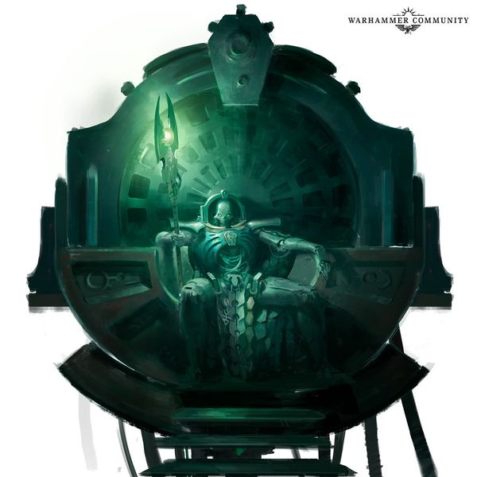
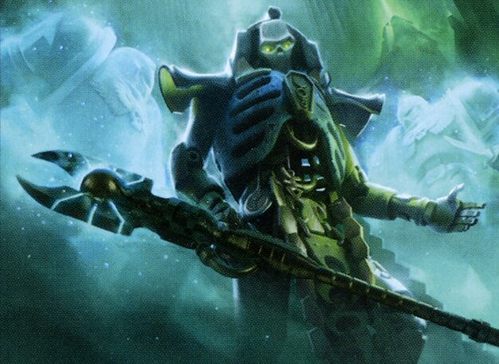
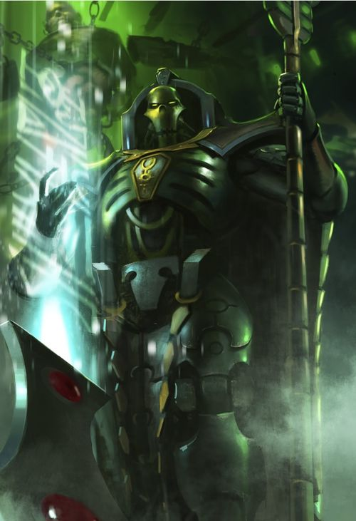

# 0741 无尽者塔拉辛 Trazyn the Infinite

精校状态：中文行文已逐段精校，部分术语仍为暂定

分类：混沌 / 尼希拉克王朝

原文来源：https://www.bilibili.com/opus/1108341045491400707

原作者：帝国神选罐头

原文时间：2025年09月03日 18:09

[返回分类目录](目录.md) · [全书目录](../../目录.md)

原篇名：无限者塔拉辛 Trazyn the Infinite

<!-- A0741-B0001 -->
**英文原文**

"I chop out the mechanisms of occurrence and study them at my leisure. This history of this galaxy is an open book to me, and my collection is the story of everything."

<!-- /A0741-B0001 -->

<!-- A0741-B0002 -->

原译文

“我削减了存在的机制，并在闲暇时研究它们。这个银河的历史对我来说是一本开放的书，我的收藏是一切的故事。”

**校订译文**

“我将事件发生的过程截取下来，留待闲暇时研究。银河的历史于我而言如同一本摊开的书，而我的收藏，便是万物的故事。”

<!-- /A0741-B0002 -->

<!-- A0741-B0003 -->
**英文原文**

Trazyn the Infinite is an ancient Necron Overlord of the Nihilakh Dynasty noted amongst his kind as a keeper of history and a preserver of artifacts and events on the Tomb World of Solemnace.

<!-- /A0741-B0003 -->

<!-- A0741-B0004 -->

原译文

无限者塔拉辛是尼希拉克王朝的一位古代死灵霸主，在他的同类中被称为历史的守护者和索勒姆纳斯墓穴世界造物和事件的保护者。

**校订译文**

无尽者塔拉辛是尼希拉克王朝的一位古老太空死灵霸主。他以历史守护者的身份闻名于同族，将文物乃至历史事件本身保存于墓穴世界索勒纳姆斯。

<!-- /A0741-B0004 -->

<!-- A0741-B0005 图片 -->

<!-- A0741-B0006 -->

原译文

Trazyn the Infinite 无限者塔拉辛

**校订译文**

Trazyn the Infinite 无尽者塔拉辛

<!-- /A0741-B0006 -->

<!-- A0741-B0007 -->
## History 历史

<!-- /A0741-B0007 -->

<!-- A0741-B0008 -->
**英文原文**

Before Bio-Transference Trazyn was a Necrontyr scribe and Chief Archivist who oversaw the mummification of Necrontyr Phaerons. He can not remember much detail of his past life due to self-installed protection protocols. Trazyn misremembers much of the past he can recall, such as insisting he was physically forced into Biotransference when according to Orikan he had embraced it.

<!-- /A0741-B0008 -->

<!-- A0741-B0009 -->

原译文

在生体转化之前，塔拉辛是一名惧亡者抄写员和首席档案员，负责监督惧亡者法皇的死灵化。由于自我安装的保护协议，他记不起过去生活的很多细节。塔拉辛误读了他能回忆起的许多过去，比如坚持认为他是在身体上被迫进行生体转化的，而根据欧瑞坎的说法，他接受了生体转化。

**校订译文**

生体转化之前，塔拉辛是一名惧亡者抄写员兼首席档案员，负责监督将惧亡者法皇制成木乃伊的工作。由于他为自己安装了保护协议，已无法回忆起从前生活的许多细节。即使能够回忆的部分，也有大量记忆失真。例如，他坚称自己当年是被强行押去接受生体转化的，但按欧瑞肯的说法，他其实欣然接受了转化。

**校注：** mummification 指制作木乃伊，发生于生体转化之前，原“死灵化”混淆历史阶段。misremembers 指记错过去，不是误读。

<!-- /A0741-B0009 -->

<!-- A0741-B0010 -->
**英文原文**

Trazyn awoke from the Great Sleep prematurely and during that time sought to expand his collection, pledging that he would one day share it with the rest of his race when they fully awoke. Trazyn is officially a member of the Nihilakh Dynasty but largely operates independently. He has alienated himself from many members of his race and is known to be persona non grata to the Sautekh Dynasty while he is only barely tolerated by the Nekthyst Dynasty in exchange for his services.

<!-- /A0741-B0010 -->

<!-- A0741-B0011 -->

原译文

塔拉辛过早地从大休眠中醒来，在那段时间里，他试图扩大自己的收藏，并承诺有一天当其他人完全醒来时，他会与他们分享。塔拉辛是尼希拉克王朝的正式成员，但在很大程度上是独立运作的。他与其他许多种族成员疏远，被索泰克王朝视为不受欢迎的人，而奈克希斯特王朝只勉强容忍他，以换取他的服务。

**校订译文**

塔拉辛比预定时间更早从大休眠中醒来，随后不断扩充收藏，并发誓等整个种族完全苏醒，便将这些藏品与同胞分享。他名义上属于尼希拉克王朝，行事却基本独立。他与许多同族关系疏远，在索泰克王朝更是不受欢迎的人物；奈克希斯特王朝也只是看在他能够提供服务的份上，才勉强容忍他。

<!-- /A0741-B0011 -->

<!-- A0741-B0012 图片 -->

<!-- A0741-B0013 -->

原译文

Trazyn, the Archaeovist of the Solmnace Galleries 塔拉辛，索勒姆纳斯回廊的古物观察学者

**校订译文**

Trazyn, the Archaeovist of the Solmnace Galleries 塔拉辛，索勒纳姆斯回廊的古物学者

<!-- /A0741-B0013 -->

<!-- A0741-B0014 -->
**英文原文**

Trazyn's philosophy of preserving the past is in stark contrast to the Cryptek Orikan the Diviner's hope of changing it for a better future and the two were hated enemies even in life. The two fought over access to the Tomb of the legendary Necrontyr Overlord Nephreth on Serenade for nearly 10,000 years. Though they were forced to reconcile and join forces after discovering they had both been duped by The Deceiver, Orikan still vows revenge.

<!-- /A0741-B0014 -->

<!-- A0741-B0015 -->

原译文

塔拉辛保留过去的哲学与墓穴技师占星者欧瑞坎希望改变过去以创造更美好的未来形成鲜明对比，即使在生活中，这两个人也是互相憎恨的敌人。两人在小夜曲星上为进入传说中的惧亡者霸主尼弗斯的墓穴而斗争了近10000年。尽管他们在都发现自己被骗子欺骗后被迫和解并联合起来，但欧瑞坎仍然发誓要复仇。

**校订译文**

塔拉辛主张保存过去，墓穴技师占卜者欧瑞肯却希望改变过去、创造更好的未来。两人的理念针锋相对，早在血肉之身尚存时就已互为宿敌。为了进入小夜曲星上那位传说中的惧亡者霸主尼弗斯的墓穴，他们争斗了近一万年。后来，两人发现自己都受了欺诈者蒙骗，不得不暂时和解、联手应敌，但欧瑞肯仍立誓复仇。

**校注：** in life 指两者尚为血肉生命的时代，不是泛泛“在生活中”。The Deceiver 沿专名欺诈者，非普通骗子。

<!-- /A0741-B0015 -->

<!-- A0741-B0016 -->
**英文原文**

He is known to hold technologies and relics that are so rare as to be priceless. Trazyn's nature means that he is loath to explore the galaxy himself, but his desire for exquisite artifacts to both see and catalogue forces him to go out amongst the stars when there is an opportunity he cannot afford to miss, in which case he will be accompanied by his Acquisition Phalanx. Furthermore, he is known to often send substitutes of himself to do his work for him and many have become annoyed to discover that the Necron they had slain who they believed to had been Trazyn was in fact a Lychguard or a Necron Lord. On such occasions, the real Trazyn works to break through his enemy's opposition in order to get his hands on his latest prize to add to his collection. Trazyn has tried twice to obtain the Spear of Vulkan from Salamanders Forgefather Vulkan He'stan. However he was defeated in personal combat by He'stan, and later foiled once again in the Tochran Crusade.

<!-- /A0741-B0016 -->

<!-- A0741-B0017 -->

原译文

众所周知，他拥有的技术和遗物非常罕见，价值连城。塔拉辛的天性意味着他不愿意自己探索银河系，但他渴望看到和编目精美的造物，这迫使他在一个不容错过的机会时走出星际，在这种情况下，他将由他的收集方阵陪同。 此外，众所周知，他经常派自己的替身为他工作，许多人发现他们杀死的死灵（他们认为是塔拉辛）实际上是巫妖卫或死灵领主，这让他们很恼火。在这种情况下，真正的塔拉辛努力突破敌人的反对，以获得他最新的奖赏，并将其添加到他的收藏中。 塔拉辛曾两次试图从火蜥蜴铸造之父伏尔甘·赫斯坦手中获得沃坎之矛。然而，他在个人战斗中被赫斯坦击败，后来在托克兰远征中再次被挫败。

**校订译文**

塔拉辛收藏的技术与文物极其罕见，价值连城。他天性不喜亲自出外探索，却又渴望观赏、编录珍奇古物。因此，一旦遇到不容错过的机会，他仍会在收集方阵的护卫下奔赴群星。他也常派替身代自己行事。许多对手满以为杀死了塔拉辛，最后才恼怒地发现，死者只是巫妖卫或太空死灵领主。与此同时，真正的塔拉辛则设法突破敌人阻拦，取得最新的珍宝，充实自己的收藏。他曾两度试图从火蜥蜴铸造之父伏尔甘·赫斯坦手中夺走沃坎之矛：先在单挑中落败，后来又在托克兰远征中受挫。

<!-- /A0741-B0017 -->

<!-- A0741-B0018 -->
**英文原文**

Sometime later, Trazyn journeyed to Harmony in search of new additions to his collection but was wounded by Eidolon. In exchange for his safe passage, Trazyn offered a lost Gene-Seed tithe of the Emperor's Children that was part of his collection. This caused Eidolon to dispatch Fabius Bile and Flavius Alkenex to Solemnace to retrieve it. Also part of the bargain was Fabius Bile himself, who Trazyn desired to add to his collection. However on Solemnace Bile was able to bargain his freedom and acquire the gene-seed tithe for himself by offering first Harlequins and then Fabius' clone of Fulgrim as well as Alkenex and his Emperor's Children.

<!-- /A0741-B0018 -->

<!-- A0741-B0019 -->

原译文

一段时间后，塔拉辛前往和谐星寻找新的收藏品，但被艾多隆打伤。为了换取他的安全通行，塔拉辛提供了一个失落的帝皇之子的基因种子什一税，这是他收藏的一部分。这导致艾多隆派遣法比乌斯·拜尔和弗莱维厄斯·阿尔克内斯前往索勒纳姆斯取回它。交易的一部分是法比乌斯·拜尔本人，塔拉辛希望将其添加到他的收藏中。然而，在索勒纳姆斯，拜尔通过提供丑角和法比乌斯的福格瑞姆克隆体以及阿尔克内斯和他的帝皇之子，为自己讨价还价，获得了基因种子什一税。

**校订译文**

后来，塔拉辛前往和谐星寻找新藏品，却被艾多隆击伤。为换取安全离开，他提出交出自己收藏的一批早已失落的帝皇之子基因种子什一税贡品。艾多隆于是派法比乌斯·拜尔与弗莱维厄斯·阿尔克内斯前往索勒纳姆斯取货。但交易的另一部分，正是塔拉辛想收入藏品的拜尔本人。抵达后，拜尔先提出用丑角交换，随后又献上自己培育的福格瑞姆克隆体，以及阿尔克内斯和他的帝皇之子战士，终于换回自由，并为自己取得了那批基因种子。

<!-- /A0741-B0019 -->

<!-- A0741-B0020 -->
**英文原文**

During the Thirteenth Black Crusade Trazyn's collection on Solemnace was thrown into upheaval. This provoked the Necron lord into investigating the cause via the Celestial Orrery, where he discovered that Pylons were holding back the tide of the Warp on Cadia. Not wishing to see Chaos spread throughout the Galaxy and perhaps searching for new items of his collection, Trazyn ventured to Cadia and aided the Imperial defenders there. On Cadia Trazyn worked with Belisarius Cawl in activating Cadia's Pylons but ultimately could not prevent the destruction of the planet. As Cadia died, Trazyn took part in the final battle against Abaddon and unleashed much of his collection against the Black Legion, but seeing that Cadia was doomed he promptly teleported away. Trazyn has since begun prying for information from his captive shard of The Deceiver on how to enter the Great Rift.

<!-- /A0741-B0020 -->

<!-- A0741-B0021 -->

原译文

在第十三次黑色远征期间，塔拉辛在索勒纳姆斯上的收藏陷入了动荡。这促使死灵领主通过璀璨星图调查原因，在那里他发现方尖塔正在阻挡卡迪亚上的亚空间浪潮。塔拉辛不希望看到混沌在整个银河系蔓延，也许是想寻找他能收藏的新物品，于是冒险前往卡迪亚，帮助那里的帝国守军。在卡迪亚，塔拉辛与贝利撒留·考尔合作激活了卡迪亚的方尖塔，但最终无法阻止行星的毁灭。当卡迪亚毁灭时，塔拉辛参加了与阿巴顿的最后一场战斗，并释放了他的大部分藏品来对抗黑色军团，但看到卡迪亚注定要失败，他立即传送了。此后，塔拉辛开始从他俘虏的欺诈者碎片中窥探如何进入大裂隙的信息。

**校订译文**

第十三次黑色远征期间，索勒纳姆斯上的藏品发生剧烈异动，促使塔拉辛借助璀璨星图追查原因。他发现，卡迪亚的方尖塔正在阻挡亚空间浪潮。既不愿混沌席卷银河，或许也想寻觅新的藏品，他于是前往卡迪亚，协助帝国守军，并与贝利萨留斯·考尔合作启动方尖塔。然而，他们最终仍未能阻止行星毁灭。在卡迪亚的末日之战中，塔拉辛参与迎战阿巴顿，释放大量藏品对抗黑色军团；但眼见星球已无可挽回，他立即传送离去。此后，他开始向自己囚禁的欺诈者碎片打探进入大裂隙的方法。

<!-- /A0741-B0021 -->

<!-- A0741-B0022 -->
**英文原文**

Trazyn has also connected Solemnace to a hidden Sub-dimensional reality bubble via Reality-Tethers. It is only able to be entered and exited by the Overlord or his minions and contains a stronghold, named Sanctum, which holds reality-warping arenas, that are replicated from those used by the Imperium. Trazyn has placed renowned warriors there, which he has fight for his amusement, though the Overlord has promised to free whoever emerges as the ultimate victor between them all. However due to the advance technology available to the Necrons, Trazyn is able to heal the warriors of even the most lethal wounds and send them back into the fray. Even should someone actually win, though, the Overlord has no intention of keeping his promise of giving the warriors their freedom. Instead, the arena winner will have the honour of taking a place of pride within Trazyn's latest exhibit on Solemnace.

<!-- /A0741-B0022 -->

<!-- A0741-B0023 -->

原译文

塔拉辛还通过现实束缚将索勒纳姆斯与一个隐藏的亚维度现实泡联系起来。它只能由霸主或他的下属进出，并包含一个名为圣地的据点，该据点拥有从帝国使用的竞技场复制而来的真实竞技场。塔拉辛把著名的战士放在那里，为了娱乐他而战斗，尽管霸主已经承诺释放他们之间的最终胜利者。然而，由于死灵拥有先进的技术，塔拉辛能够治愈战士们最致命的伤口，并将他们送回战场。然而，即使有人真的赢了，霸主也不打算兑现他给战士们自由的承诺。相反，竞技场获胜者将有幸在塔拉辛关于索勒纳姆斯的最新展览中占有一席之地。

**校订译文**

塔拉辛还以现实系缆将索勒纳姆斯连接到一个隐蔽的亚维度现实泡。只有他和手下能进出其中。那里有一座名为圣所的要塞，内部设有可扭曲现实的竞技场，仿自帝国的同类设施。他把著名战士关进这里，让他们厮杀供自己取乐，并承诺释放最终胜出的那个人。但凭借太空死灵的先进技术，即便最致命的创伤，他也能治好，再把战士送回竞技场。就算真有人获胜，他也无意兑现自由的承诺；胜者得到的“荣耀”，只是在索勒纳姆斯最新的展览中占据一个显赫位置。

**校注：** Sanctum 此处为塔拉辛亚维度现实泡中的要塞，暂译圣所；区别580同名圣所星。reality-warping arenas 指能扭曲现实的竞技场，非真实竞技场。

<!-- /A0741-B0023 -->

<!-- A0741-B0024 -->
## Equipment and Abilities 装备和能力

<!-- /A0741-B0024 -->

<!-- A0741-B0025 -->
**英文原文**

Trazyn carries a clutch of Mindshackle Scarabs and wields the Empathic Obliterator which is an ideal weapon for his purposes, as he disdains exhaustive physical combat and far prefers a single telling blow at the opportune moment. Trazyn is capable of a variety of other means of defense, such as manipulating his own Necrodermis into weapons and entrapping his enemies in stasis fields. Should his body be destroyed, he is promptly downloaded into a new form. He has complete control over his Necron Legions, able to stream his consciousness into any of his warriors.

<!-- /A0741-B0025 -->

<!-- A0741-B0026 -->

原译文

塔拉辛携带了一群锁心圣甲虫，并使用了移情泯灭杖，这是他实现目标的理想武器，因为他不屑于穷尽的肉搏，更喜欢在适当的时候攻击。塔拉辛能够采取各种其他防御手段，例如将自己的死灵金属操纵成武器，并将敌人困在停滞立场。如果他的身体被摧毁，他会立即被下载到一个新的形体中。他完全控制着他的死灵军团，能够将他的意识流到他的任何战士身上。

**校订译文**

塔拉辛随身携带一群锁心圣甲虫，并使用移情泯灭杖。这件武器非常符合他的作风：他不屑进行筋疲力尽的肉搏，更喜欢抓住时机，以一记重击决定胜负。他还拥有多种自卫手段，例如将自身死灵金属化为武器，或以停滞力场困住敌人。身体一旦被毁，他便会立即转移至新的躯壳。他完全控制麾下的太空死灵军团，能够将自身意识传入任一战士体内。

<!-- /A0741-B0026 -->

<!-- A0741-B0027 图片 -->

<!-- A0741-B0028 -->

原译文

Trazyn the Infinite 无限者塔拉辛

**校订译文**

Trazyn the Infinite 无尽者塔拉辛

<!-- /A0741-B0028 -->

<!-- A0741-B0029 -->
**英文原文**

Trazyn's personal vessel is the Shroud Class Light Cruiser Lord of Antiquity.

<!-- /A0741-B0029 -->

<!-- A0741-B0030 -->

原译文

塔拉辛的个人战舰是寿衣级轻型巡洋舰古代领主号。

**校订译文**

塔拉辛的座舰是寿衣级轻型巡洋舰古代领主号。

<!-- /A0741-B0030 -->

<!-- A0741-B0031 -->
## Collection 收藏

<!-- /A0741-B0031 -->

<!-- A0741-B0032 -->
**英文原文**

Trazyn the Infinite possesses a enormous variety of items in his collection among them are:

<!-- /A0741-B0032 -->

<!-- A0741-B0033 -->

原译文

无限者塔拉辛在他的收藏中拥有各种各样的物品，其中包括：

**校订译文**

无尽者塔拉辛的收藏包罗万象，其中包括：

<!-- /A0741-B0033 -->

<!-- A0741-B0034 -->
**英文原文**

The Prismatic Galleries. These are some of the most prized possessions of Trazyn and consist of holographic events recapturing events from history deemed worthy of preservation. These galleries are not populated by mere sculpture, but by conscious living beings transmuted into the holograph themselves.

<!-- /A0741-B0034 -->

<!-- A0741-B0035 -->

原译文

棱镜画廊。这些是塔拉辛最珍贵的财产，由全息事件组成，这些全息事件从历史上夺回了被认为值得保护的事件。这些画廊不仅仅是雕塑，而是有意识的生物转化为全息图本身。

**校订译文**

棱镜画廊，是塔拉辛最珍视的收藏之一，以全息场景重现他认为值得保存的历史事件。场景中的并非普通雕塑，而是仍有意识的活物，被转化为全息景象的一部分。

<!-- /A0741-B0035 -->

<!-- A0741-B0036 -->
**英文原文**

The last high council of Idharae Craftworld

<!-- /A0741-B0036 -->

<!-- A0741-B0037 -->

原译文

伊德哈尔方舟世界的最后的至高议会

**校订译文**

伊德哈尔方舟世界最后一届最高议会。

<!-- /A0741-B0037 -->

<!-- A0741-B0038 -->
**英文原文**

An exhibit showcasing the massacres on Tragus.

<!-- /A0741-B0038 -->

<!-- A0741-B0039 -->

原译文

展示特拉格斯大屠杀的展览。

**校订译文**

重现特拉格斯大屠杀的展览。

<!-- /A0741-B0039 -->

<!-- A0741-B0040 -->
**英文原文**

A warband of Orks attacking an unknown blue-shelled invertebrate Xenos species.

<!-- /A0741-B0040 -->

<!-- A0741-B0041 -->

原译文

一个欧克战帮正在攻击一种未知的蓝壳无脊椎动物异型种族。

**校订译文**

一支欧克蛮人战帮进攻某种不知名的蓝壳无脊椎异形的场景。

<!-- /A0741-B0041 -->

<!-- A0741-B0042 -->
**英文原文**

The catacombs of Calth during the Underground War

<!-- /A0741-B0042 -->

<!-- A0741-B0043 -->

原译文

地下战争期间的考斯地下墓穴

**校订译文**

地下战争期间的考斯地下墓穴。

<!-- /A0741-B0043 -->

<!-- A0741-B0044 -->
**英文原文**

An exhibit labelled "Doomrider's Folly"

<!-- /A0741-B0044 -->

<!-- A0741-B0045 -->

原译文

一个名为“末日骑士的愚行”的展品

**校订译文**

名为“末日骑士的愚行”的展览。

<!-- /A0741-B0045 -->

<!-- A0741-B0046 -->
**英文原文**

An exhibit labelled the "Death of Lord Solar Macharius", which is one-tenth composed of Imperial Guardsmen who are 300 years from the wrong time period.

<!-- /A0741-B0046 -->

<!-- A0741-B0047 -->

原译文

一个名为“太阳领主马卡里乌斯之死”的展品，其中十分之一是由距离错误的时间300年的帝国卫队组成的。

**校订译文**

名为“太阳领主马卡里乌斯之死”的展览，其中约十分之一的帝国卫队士兵来自错误的时代，与历史现场相差三百年。

<!-- /A0741-B0047 -->

<!-- A0741-B0048 -->
**英文原文**

An exhibit labelled the "Last Stand of Ursarkar Creed"

<!-- /A0741-B0048 -->

<!-- A0741-B0049 -->

原译文

一个名为“乌尔萨卡信条的最后一站”的展品

**校订译文**

名为“乌萨卡·克里德的最后抵抗”的展览。

**校注：** Ursarkar Creed 为乌萨卡·克里德，Creed 是姓，非信条；Last Stand 为最后抵抗，非最后一站。

<!-- /A0741-B0049 -->

<!-- A0741-B0050 -->
**英文原文**

An exhibit labelled the "Last Questions of Historicus Ostalan Varus"

<!-- /A0741-B0050 -->

<!-- A0741-B0051 -->

原译文

题为“奥斯塔兰·瓦鲁斯掌史官的最后问题”的展品

**校订译文**

名为“掌史官奥斯塔兰·瓦鲁斯最后的提问”的展览。

<!-- /A0741-B0051 -->

<!-- A0741-B0052 -->
**英文原文**

An exhibit labelled the "Sword Both Stolen and Sought"

<!-- /A0741-B0052 -->

<!-- A0741-B0053 -->

原译文

一个名为“窃取与谋求之剑”的展品

**校订译文**

名为“遭窃又遭寻求之剑”的展览。

<!-- /A0741-B0053 -->

<!-- A0741-B0054 -->
**英文原文**

An exhibit labelled the "Imperial Heroes of the Tyrannic Wars"

<!-- /A0741-B0054 -->

<!-- A0741-B0055 -->

原译文

一个名为“泰伦战争中的帝国英雄”的展品

**校订译文**

名为“泰伦战争中的帝国英雄”的展览。

<!-- /A0741-B0055 -->

<!-- A0741-B0056 -->
**英文原文**

An exhibit labelled "The Beheading of Goge Vandire"

<!-- /A0741-B0056 -->

<!-- A0741-B0057 -->

原译文

一个名为“斩首高戈·范迪尔”的展品

**校订译文**

名为“高戈·范迪尔被斩首”的展览。

<!-- /A0741-B0057 -->

<!-- A0741-B0058 -->
**英文原文**

An exhibit labelled "War in the Museum"

<!-- /A0741-B0058 -->

<!-- A0741-B0059 -->

原译文

一个名为“博物馆里的战争”的展品

**校订译文**

名为“博物馆中的战争”的展览。

<!-- /A0741-B0059 -->

<!-- A0741-B0060 -->
**英文原文**

An exhibit labelled "Angelis", which includes: Gorkamorka (the rocket ship), Mektown, and several Orkz.

<!-- /A0741-B0060 -->

<!-- A0741-B0061 -->

原译文

一个名为“安杰利斯”的展品，其中包括：搞卡莫卡（火箭飞船）、技师镇和一些欧克。

**校订译文**

名为“安杰利斯”的展览，其中包括搞卡莫卡火箭飞船、技师镇，以及若干欧克蛮人。

<!-- /A0741-B0061 -->

<!-- A0741-B0062 -->
**英文原文**

A C'tan Shard that Trayzn has called the "source" of his power and the crown jewel of his collection

<!-- /A0741-B0062 -->

<!-- A0741-B0063 -->

原译文

塔拉辛称之为他力量的“源泉”和他收藏的皇冠上的明珠的星神碎片

**校订译文**

一枚星神碎片，被塔拉辛称为自身力量的“源泉”，也是他最珍贵的藏品。

<!-- /A0741-B0063 -->

<!-- A0741-B0064 -->
**英文原文**

The fabled Wraithbone choir of Altansar

<!-- /A0741-B0064 -->

<!-- A0741-B0065 -->

原译文

奥坦萨传说中的灵骨合唱团

**校订译文**

传说中的奥坦萨灵骨合唱团。

<!-- /A0741-B0065 -->

<!-- A0741-B0066 -->
**英文原文**

Preserved head of Sebastian Thor

<!-- /A0741-B0066 -->

<!-- A0741-B0067 -->

原译文

保存的塞巴斯蒂安·托尔之首

**校订译文**

保存完好的塞巴斯蒂安·托尔的头颅。

<!-- /A0741-B0067 -->

<!-- A0741-B0068 -->
**英文原文**

Ossified husk of an Enslaver

<!-- /A0741-B0068 -->

<!-- A0741-B0069 -->

原译文

奴役者的僵化外壳

**校订译文**

一具奴役者的骨化躯壳。

<!-- /A0741-B0069 -->

<!-- A0741-B0070 -->
**英文原文**

A giant man wearing baroque power armour, whose face is contorted in a permanent scream

<!-- /A0741-B0070 -->

<!-- A0741-B0071 -->

原译文

一个穿着巴洛克式动力盔甲的巨人，他的脸被一声永恒的尖叫扭曲了

**校订译文**

一个身穿巴洛克风格动力护甲的巨人，面容永远凝固在尖叫时扭曲的表情。

<!-- /A0741-B0071 -->

<!-- A0741-B0072 -->

原译文

An Adeptus Custodes 一名禁军

**校订译文**

An Adeptus Custodes 一名禁军

<!-- /A0741-B0072 -->

<!-- A0741-B0073 -->
**英文原文**

Brother Cassiel of the Blood Angels, seconded to the Deathwatch. His face was frozen in a moment of fear.

<!-- /A0741-B0073 -->

<!-- A0741-B0074 -->

原译文

圣血天使的卡西尔兄弟，借调到死亡守望。他吓到面如死灰。

**校订译文**

曾被借调至死亡守望的圣血天使战士卡西尔兄弟，他的面容凝固在恐惧的一瞬。

**校注：** 原文描绘藏品被定格的表情，不是卡西尔“面如死灰”。

<!-- /A0741-B0074 -->

<!-- A0741-B0075 -->
**英文原文**

Raven Guard and Salamanders battling on Isstvan V.

<!-- /A0741-B0075 -->

<!-- A0741-B0076 -->

原译文

在伊斯塔万五号上作战的暗鸦守卫和火蜥蜴。

**校订译文**

在伊斯塔万五号上作战的暗鸦守卫与火蜥蜴。

<!-- /A0741-B0076 -->

<!-- A0741-B0077 -->
**英文原文**

Carnac World Spirit shrine

<!-- /A0741-B0077 -->

<!-- A0741-B0078 -->

原译文

卡纳克世界之魂圣地

**校订译文**

卡纳克世界之魂的圣地。

<!-- /A0741-B0078 -->

<!-- A0741-B0079 -->
**英文原文**

Acabrius War Catachan regiments

<!-- /A0741-B0079 -->

<!-- A0741-B0080 -->

原译文

阿卡布里乌斯战争卡塔昌兵团

**校订译文**

参加阿卡布里乌斯战争的卡塔昌诸团。

<!-- /A0741-B0080 -->

<!-- A0741-B0081 -->
**英文原文**

A temporal device containing the Tyranid invasion of Vuros, which was sparked by Trayzn himself (disposed of after several full-scale battles caused by Tyranid breakouts)

<!-- /A0741-B0081 -->

<!-- A0741-B0082 -->

原译文

一个包含泰伦入侵沃罗斯的临时装置，由塔拉辛本人引发（在泰伦爆发的几场全面战斗后被处置）

**校订译文**

一件时间装置，封存着泰伦虫族入侵沃罗斯的事件。这场入侵本由塔拉辛亲手促成；由于虫族数次突破封锁，引发大规模战斗，他后来处置了这件藏品。

**校注：** temporal 为时间相关，不是 temporary（临时）；泰伦入侵的对象是沃罗斯，装置封存的是这次事件。

<!-- /A0741-B0082 -->

<!-- A0741-B0083 -->
**英文原文**

Horus Heresy-era Ultramarines

<!-- /A0741-B0083 -->

<!-- A0741-B0084 -->

原译文

荷鲁斯叛乱时期极限战士

**校订译文**

荷鲁斯之乱时期的极限战士。

<!-- /A0741-B0084 -->

<!-- A0741-B0085 -->
**英文原文**

Vostroyan Firstborn Regiments

<!-- /A0741-B0085 -->

<!-- A0741-B0086 -->

原译文

沃斯托尼亚长子兵团

**校订译文**

沃斯特洛亚长子团。

<!-- /A0741-B0086 -->

<!-- A0741-B0087 -->
**英文原文**

Lost Tanith Regiments

<!-- /A0741-B0087 -->

<!-- A0741-B0088 -->

原译文

失踪的塔尼斯兵团

**校订译文**

失踪的塔尼斯诸团。

<!-- /A0741-B0088 -->

<!-- A0741-B0089 -->
**英文原文**

Salamanders thought lost during the Klovian disaster.

<!-- /A0741-B0089 -->

<!-- A0741-B0090 -->

原译文

在克洛维亚灾难中迷失方向的火蜥蜴。

**校订译文**

被认为在克洛维亚灾难中失踪的火蜥蜴战士。

**校注：** thought lost 指被认为失踪，不是迷失方向。

<!-- /A0741-B0090 -->

<!-- A0741-B0091 -->
**英文原文**

Inquisitor Greyfax and her retinue (escaped).

<!-- /A0741-B0091 -->

<!-- A0741-B0092 -->

原译文

审判官格雷法克斯和她的随从（逃跑了）。

**校订译文**

审判官格雷法克斯与随从，后来已经逃脱。

<!-- /A0741-B0092 -->

<!-- A0741-B0093 -->
**英文原文**

The Bell of Saint Gerstahl (disposed of after causing irreparable damage to his forces and collection).

<!-- /A0741-B0093 -->

<!-- A0741-B0094 -->

原译文

圣格斯塔尔之钟（在对他的部队和收藏造成不可挽回的损害后被处置）。

**校订译文**

圣格斯塔尔之钟；它对塔拉辛的军队与藏品造成无法挽回的损害，后来遭到处置。

<!-- /A0741-B0094 -->

<!-- A0741-B0095 -->
**英文原文**

A twelve foot tall Krork in power armour more advanced than Astartes Power Armour.

<!-- /A0741-B0095 -->

<!-- A0741-B0096 -->

原译文

一个12英尺高的古兽人，身穿比阿斯塔特动力盔甲更先进的动力盔甲。

**校订译文**

一名十二英尺高的古兽人，身穿比阿斯塔特动力护甲还要先进的动力护甲。

<!-- /A0741-B0096 -->

<!-- A0741-B0097 -->
**英文原文**

A damaged but still functioning Webway portal

<!-- /A0741-B0097 -->

<!-- A0741-B0098 -->

原译文

一个损坏但仍在运行的网道门户

**校订译文**

一座受损但仍能运作的网道门。

<!-- /A0741-B0098 -->

<!-- A0741-B0099 -->
**英文原文**

A troupe of Harlequins

<!-- /A0741-B0099 -->

<!-- A0741-B0100 -->

原译文

一个丑角剧团

**校订译文**

一支丑角剧团。

<!-- /A0741-B0100 -->

<!-- A0741-B0101 -->
**英文原文**

A massive stock of uncorrupted Emperor's Children Gene-seed (traded to Fabius Bile)

<!-- /A0741-B0101 -->

<!-- A0741-B0102 -->

原译文

大量未腐化的帝皇之子基因种子（交易给法比乌斯·拜尔）

**校订译文**

大量未被腐化的帝皇之子基因种子，后来交易给法比乌斯·拜尔。

<!-- /A0741-B0102 -->

<!-- A0741-B0103 -->
**英文原文**

A perfect clone of the Primarch Fulgrim as well as Flavius Alkenex and his warriors

<!-- /A0741-B0103 -->

<!-- A0741-B0104 -->

原译文

一个原体福格瑞姆的完美的克隆体，弗莱维厄斯·阿尔克内斯和他的战士

**校订译文**

原体福格瑞姆的完美克隆体，以及弗莱维厄斯·阿尔克内斯和他麾下的战士。

<!-- /A0741-B0104 -->

<!-- A0741-B0105 -->
**英文原文**

A Bride of the Emperor

<!-- /A0741-B0105 -->

<!-- A0741-B0106 -->

原译文

一位帝皇的新娘

**校订译文**

一名帝皇新娘。

<!-- /A0741-B0106 -->

<!-- A0741-B0107 -->
**英文原文**

A force of Sisters of Battle

<!-- /A0741-B0107 -->

<!-- A0741-B0108 -->

原译文

一支战斗修女部队

**校订译文**

一支战斗修女部队。

<!-- /A0741-B0108 -->

<!-- A0741-B0109 -->
**英文原文**

A Mechanicus Magos

<!-- /A0741-B0109 -->

<!-- A0741-B0110 -->

原译文

一个机械教贤者

**校订译文**

一名机械修会贤者。

<!-- /A0741-B0110 -->

<!-- A0741-B0111 -->
**英文原文**

A force of Dusk Raiders

<!-- /A0741-B0111 -->

<!-- A0741-B0112 -->

原译文

一支黄昏突袭者部队

**校订译文**

一支黄昏突袭者部队。

<!-- /A0741-B0112 -->

<!-- A0741-B0113 -->
**英文原文**

An antique Dreadnought

<!-- /A0741-B0113 -->

<!-- A0741-B0114 -->

原译文

一位古老无畏

**校订译文**

一台古老的无畏机甲。

<!-- /A0741-B0114 -->

<!-- A0741-B0115 -->

原译文

The Astrarium Mysterios 星穹谜匣

**校订译文**

The Astrarium Mysterios 星穹谜匣

<!-- /A0741-B0115 -->

<!-- A0741-B0116 -->
**英文原文**

A Tyranid Hive Tyrant

<!-- /A0741-B0116 -->

<!-- A0741-B0117 -->

原译文

一个泰伦虫巢暴君

**校订译文**

一头泰伦虫巢暴君。

<!-- /A0741-B0117 -->

<!-- A0741-B0118 -->
**英文原文**

A T'au diplomat that was sent to negotiate with Trazyn

<!-- /A0741-B0118 -->

<!-- A0741-B0119 -->

原译文

一位被派去与塔拉辛谈判的钛外交官

**校订译文**

一名受派前来与塔拉辛谈判的钛族外交官。

<!-- /A0741-B0119 -->

<!-- A0741-B0120 -->
**英文原文**

A Destroyer Lord who attempted to scour an entire planet on its own.

<!-- /A0741-B0120 -->

<!-- A0741-B0121 -->

原译文

一位试图独自清洗整个行星的毁灭者领主。

**校订译文**

一名曾试图凭一己之力荡平整个星球的毁灭者领主。

<!-- /A0741-B0121 -->

<!-- A0741-B0122 -->
**英文原文**

A large tableau of Ork warriors in mid-combat.

<!-- /A0741-B0122 -->

<!-- A0741-B0123 -->

原译文

中型战斗中的欧克战士的大型群像。

**校订译文**

一组重现欧克蛮人战士激战场面的大型群像。

**校注：** mid-combat 为战斗进行之中，原“中型战斗”误拆。

<!-- /A0741-B0123 -->

<!-- A0741-B0124 -->

原译文

A Shard of The Deceiver 欺诈者的碎片

**校订译文**

A Shard of The Deceiver 欺诈者的碎片

<!-- /A0741-B0124 -->

<!-- A0741-B0125 -->
**英文原文**

The Ultramarines Primaris Lieutenant Markus Castus - via the Sanctum stronghold

<!-- /A0741-B0125 -->

<!-- A0741-B0126 -->

原译文

极限战士原铸副官马库斯·卡斯图斯 - 途经圣所要塞

**校订译文**

极限战士原铸副官马库斯·卡斯图斯，经由圣所要塞收入收藏。

<!-- /A0741-B0126 -->

<!-- A0741-B0127 -->
**英文原文**

The Blood Angels Terminator Rafelo - via the Sanctum stronghold

<!-- /A0741-B0127 -->

<!-- A0741-B0128 -->

原译文

圣血天使终结者拉菲洛 - 途经圣所要塞

**校订译文**

圣血天使终结者拉菲洛，经由圣所要塞收入收藏。

<!-- /A0741-B0128 -->

<!-- A0741-B0129 -->
**英文原文**

The Death Guard Plague Champion Refulgus Grue - via the Sanctum stronghold

<!-- /A0741-B0129 -->

<!-- A0741-B0130 -->

原译文

死亡守卫瘟疫冠军瑞福古斯·格鲁 - 途经圣所要塞

**校订译文**

死亡守卫瘟疫冠军瑞福古斯·格鲁，经由圣所要塞收入收藏。

<!-- /A0741-B0130 -->

<!-- A0741-B0131 -->
**英文原文**

The Szarekhan Dynasty Royal Warden Teknoth - via the Sanctum stronghold

<!-- /A0741-B0131 -->

<!-- A0741-B0132 -->

原译文

斯扎拉坎王朝皇家督军泰克诺斯 - 途经圣所要塞

**校订译文**

斯扎拉坎王朝皇家监军泰克诺斯，经由圣所要塞收入收藏。

**校注：** Royal Warden 沿已核官译皇家监军。

<!-- /A0741-B0132 -->

<!-- A0741-B0133 -->

原译文

The Chalice of Entropy 熵值圣杯

**校订译文**

The Chalice of Entropy 熵值圣杯

<!-- /A0741-B0133 -->

本篇核心术语与暂定项

以下列出本篇出现的英文原形及核心术语表用词。同形词可能指不同对象，具体词义以本篇正文和校注为准；单复数、别名和仅见于图注的名称可能尚未列入。完整候选见[术语表](../../术语表/双语术语候选.csv)。

| 英文 | 采用中文 | 状态 |
| --- | --- | --- |
| Blood Angels | 圣血天使 | 官方已核对 |
| Deathwatch | 死亡守望 | 官方已核对 |
| Death Guard | 死亡守卫 | 官方已核对 |
| Necrons | 太空死灵 | 官方已核对 |
| Orks | 欧克蛮人 | 官方已核对 |
| Terminator | 终结者 | 官方已核对 |
| Ultramarines | 极限战士 | 官方已核对 |
| Horus Heresy | 荷鲁斯之乱 | 官方已核对 |
| Warp | 亚空间 | 官方已核对 |
| Great Rift | 大裂隙 | 官方已核对 |
| Inquisitor | 审判官 | 官方已核对 |
| Imperium | 帝国 | 暂定·简称 |
| Webway | 网道 | 暂定 |
| Craftworld | 方舟世界 | 官方已核对 |
| Cryptek | 墓穴技师 | 暂定 |
| Trazyn the Infinite | 无尽者塔拉辛 | 官方已核对 |
| Empathic Obliterator | 移情泯灭杖 | 暂定 |
| Hive Tyrant | 虫巢暴君 | 官方已核对 |
| History | 历史 | 编辑用语已统一 |
| Enslaver | 奴役者 | 暂定 |
| Phalanx | 山阵号 | 暂定 |
| Obliterator | 泯灭者 | 官方已核对 |
| Emperor | 帝皇 | 官方已核对 |
| Primarch | 原体 | 官方已核对 |
| Goge Vandire | 高戈·范迪尔 | 暂定·官方待核 |
| Black Legion | 黑色军团 | 暂定·官方待核 |
| Emperor's Children | 帝皇之子 | 官方已核对 |
| Szarekhan Dynasty | 斯扎拉坎王朝 | 暂定·官方待核 |
| Sautekh Dynasty | 索泰克王朝 | 暂定·官方待核 |
| Horus | 荷鲁斯 | 暂定·官方待核 |
| Fulgrim | 福格瑞姆 | 官方已核对 |
| Sisters of Battle | 战斗修女 | 暂定·官方待核 |
| Vulkan | 沃坎 | 暂定·官方待核 |
| Salamanders | 火蜥蜴 | 暂定·官方待核 |
| Tanith | 塔尼斯 | 暂定·官方待核 |
| Calth | 考斯 | 暂定·官方待核 |
| Catachan | 卡塔昌 | 暂定·官方待核 |
| Cadia | 卡迪亚 | 暂定·官方待核 |
| The Beheading | 斩首事件 | 暂定 |
| Fabius Bile | 法比乌斯·拜尔 | 官方已核对 |
| Ancient | 旗手 | 官方已核对 |
| Belisarius Cawl | 贝利萨留斯·考尔 | 官方已核对 |
| Lieutenant | 副官 | 暂定·官方待核 |
| Raven Guard | 暗鸦守卫 | 官方已核 |
| Isstvan | 伊斯塔万 | 暂定·官方待核 |
| Eidolon | 艾多隆 | 暂定·官方待核 |
| Champion | 冠军 | 暂定·官方待核 |
| Power Armour | 动力盔甲 | 暂定·官方待核 |
| Destroyer | 毁灭者 | 暂定·官方待核 |
| Brother | 修士 | 暂定·官方待核 |
| Vulkan He'stan | 伏尔甘·赫斯坦 | 暂定·官方待核 |
| Forgefather | 铸造之父 | 暂定·官方待核 |
| Firstborn | 长子 | 暂定·官方待核 |
| Overlord | 霸主 | 官方已核对 |
| Gene-seed | 基因种子 | 暂定·官方待核 |
| Vostroyan Firstborn | 沃斯特洛亚长子团 | 暂定·官方待核 |
| Lord Solar | 太阳领主 | 暂定·官方待核 |
| Xenos | 异形 | 暂定·官方待核 |
| T'au | 钛族 | 暂定·官方待核 |
| Necrontyr | 惧亡者 | 暂定·官方待核 |
| C'tan | 星神 | 暂定·官方待核 |
| Krork | 古兽人 | 暂定·官方待核 |
| Idharae | 伊德哈尔 | 暂定·官方待核 |
| Doomrider | 末日骑手 | 暂定·官方待核 |
| Troupe | 剧团 | 官方已核对 |
| Wraithbone | 灵骨 | 暂定·官方待核 |
| Altansar | 奥坦萨 | 暂定·官方待核 |
| Harmony | 和谐星 | 暂定·官方待核 |
| Sanctum | 圣所星 | 暂定·官方待核 |
| Dusk Raiders | 黄昏突袭者 | 暂定·官方待核 |
| Biotransference | 生体转化 | 暂定·官方待核 |
| Great Sleep | 大休眠 | 暂定·官方待核 |
| Necron Lord | 死灵领主 | 暂定·官方待核 |
| Necrodermis | 死灵金属 | 暂定·官方待核 |
| Celestial Orrery | 璀璨星图 | 暂定·官方待核 |
| Reality-Tethers | 现实系缆 | 暂定·官方待核 |
| Solemnace | 索勒纳姆斯 | 暂定·官方待核 |
| Orikan the Diviner | 占卜者欧瑞肯 | 官方已核对 |
| Royal Warden | 皇家监军 | 官方已核对 |
| Orikan | 欧瑞肯 | 官方词根参考·单名待核 |
| The Deceiver | 欺诈者 | 官方词根参考·单名待核 |
| Pylons | 方尖碑 | 暂定·官方待核 |
| Dreadnought | 无畏机甲 | 暂定·官方待核 |
| Forgefather Vulkan He'stan | 铸造之父伏尔甘·赫斯坦 | 暂定·官方待核 |
| Inquisitor Greyfax | 审判官格雷法克斯 | 官方已核对 |
| The Blood | 鲜血 | 暂定·官方待核 |
| Tochran Crusade | 托克兰远征 | 暂定·官方待核 |
| Spear of Vulkan | 沃坎之矛 | 暂定·官方待核 |
| Flavius Alkenex | 弗莱维厄斯·阿尔克内斯 | 暂定·官方待核 |
| Shroud | 裹尸布 | 暂定·官方待核 |
| Nihilakh Dynasty | 尼希拉克王朝 | 暂定·官方待核 |
| Nekthyst Dynasty | 奈克希斯特王朝 | 暂定·官方待核 |
| Nephreth | 尼弗斯 | 暂定·官方待核 |
| Serenade | 小夜曲星 | 暂定·官方待核 |
| Acquisition Phalanx | 收集方阵 | 暂定·官方待核 |
| Lord of Antiquity | 古代领主号 | 暂定·官方待核 |
| Prismatic Galleries | 棱镜画廊 | 暂定·官方待核 |
| Tragus | 特拉格斯 | 暂定·官方待核 |
| Ostalan Varus | 奥斯塔兰·瓦鲁斯 | 暂定·官方待核 |
| Sword Both Stolen and Sought | 遭窃又遭寻求之剑 | 暂定·官方待核 |
| Angelis | 安杰利斯 | 暂定·官方待核 |
| Gorkamorka | 搞卡莫卡 | 暂定·官方待核 |
| Mektown | 技师镇 | 暂定·官方待核 |
| Cassiel | 卡西尔 | 暂定·官方待核 |
| Carnac | 卡纳克 | 暂定·官方待核 |
| Acabrius War | 阿卡布里乌斯战争 | 暂定·官方待核 |
| Vuros | 沃罗斯 | 暂定·官方待核 |
| Klovian disaster | 克洛维亚灾难 | 暂定·官方待核 |
| Bell of Saint Gerstahl | 圣格斯塔尔之钟 | 暂定·官方待核 |
| Markus Castus | 马库斯·卡斯图斯 | 暂定·官方待核 |
| Rafelo | 拉菲洛 | 暂定·官方待核 |
| Refulgus Grue | 瑞福古斯·格鲁 | 暂定·官方待核 |
| Teknoth | 泰克诺斯 | 暂定·官方待核 |
| Sebastian Thor | 塞巴斯蒂安·托尔 | 暂定·官方待核 |
| Macharius | 马卡里乌斯 | 暂定·官方待核 |
| Lychguard | 巫妖卫士 | 官方已核 |

