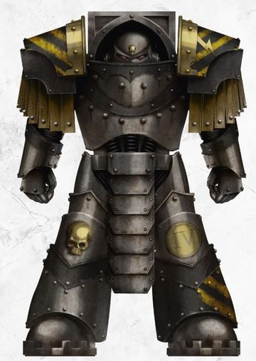

# 0536 提兰提科斯卫队 Tyranthiko

精校状态：中文行文已逐段精校，部分术语仍为暂定

分类：概念

原文来源：https://www.bilibili.com/opus/1036357827392700457

原作者：帝国神选罐头

原文时间：2025年02月21日 18:37

[返回分类目录](目录.md) · [全书目录](../../目录.md)

原篇名：僭主 Tyranthiko

<!-- A0536-B0001 -->
**英文原文**

The Tyranthikos, also known as the Dominators, were an elite cadre of line breakers and assault troops within the Iron Warriors Legion during the Great Crusade.

<!-- /A0536-B0001 -->

<!-- A0536-B0002 -->

原译文

僭主，也被称为统御者，是大远征期间钢铁勇士军团中的一支精英队伍，由破阵者和突击部队组成。

**校订译文**

提兰提科斯卫队，又称统御者，是大远征时期钢铁勇士军团内一支精锐的破阵与突击部队。

<!-- /A0536-B0002 -->

<!-- A0536-B0003 图片 -->

<!-- A0536-B0004 -->

原译文

Dominator 统御者

**校订译文**

Dominator 统御者

<!-- /A0536-B0004 -->

<!-- A0536-B0005 -->
## Overview 概述

<!-- /A0536-B0005 -->

<!-- A0536-B0006 -->
**英文原文**

Once seen as the proudest and most peerless of their brothers, every Iron Warriors Grand Battalion had its own cohort of these Terminator Armour-clad warriors but their most prestigious task was to act as the personal guards of their Primarch, Perturabo. However following their perceived failures in the aftermath of the Battle of Phall, Perturabo relieved the Dominators of their bodyguard role and replaced them with the mechanical Iron Circle. In the aftermath, the disgraced Dominators were used exclusively as frontline shock troops as the traitors drove towards Terra. With their honor besmirched, they grew increasingly resentful of their commanders and developed a fierce hatred of the Automata that had replaced them.

<!-- /A0536-B0006 -->

<!-- A0536-B0007 -->

原译文

曾经被视为他们兄弟中最自豪、最无与伦比的人，每个钢铁勇士大营都有自己的终结者盔甲战士队伍，但他们最负盛名的任务是担任其原体佩图拉博的个人护卫。然而，在法尔之战后，佩图拉博解除了统御者的护卫角色，并用机械铁环取而代之。之后，当叛徒向泰拉进发时，声名狼藉的统御者被专门用作前线突击部队。随着他们的荣誉受到玷污，他们对指挥官越来越不满，并对取代他们的自动机兵产生了强烈的仇恨。

**校订译文**

这些身披终结者护甲的战士，一度被视为同袍中最骄傲、最无可匹敌的精英。每个钢铁勇士大营都有自己的卫队分队，其中最荣耀的职责则是担任原体佩图拉博的亲卫。然而，法尔之战后，佩图拉博认定他们失职，解除了统御者的护卫职务，改用机械铁环。此后，叛军向泰拉进军时，这些蒙羞的统御者只被用于前线突击。荣誉遭到玷污使他们日益怨恨指挥官，也让他们对取代自己的自动机兵怀有深仇。

**校注：** 补回their perceived failures的含义：在佩图拉博看来失职；不能把主观判定当客观证明。Tyranthikos沿全书统一，原标题僭主。

<!-- /A0536-B0007 -->

<!-- A0536-B0008 -->
## Notable Tyranthikos 著名提兰提科斯卫队成员

原题：Notable Tyranthikos 著名僭主

<!-- /A0536-B0008 -->

<!-- A0536-B0009 -->

原译文

Galan Dion 加兰·迪昂

**校订译文**

Galan Dion 加兰·迪昂

<!-- /A0536-B0009 -->

<!-- A0536-B0010 -->

原译文

Goran Vuke 戈兰·武克

**校订译文**

Goran Vuke 戈兰·武克

<!-- /A0536-B0010 -->

本篇核心术语与暂定项

以下列出本篇出现的英文原形及核心术语表用词。同形词可能指不同对象，具体词义以本篇正文和校注为准；单复数、别名和仅见于图注的名称可能尚未列入。完整候选见[术语表](../../术语表/双语术语候选.csv)。

| 英文 | 采用中文 | 状态 |
| --- | --- | --- |
| Terminator | 终结者 | 官方已核对 |
| Primarch | 原体 | 官方已核对 |
| Iron Warriors | 钢铁勇士 | 暂定·官方待核 |
| Great Crusade | 大远征 | 暂定·官方待核 |
| Terra | 泰拉 | 暂定·官方待核 |
| Tyranthikos | 提兰提科斯卫队 | 暂定·官方待核 |
| Cadre | 骨干连（寂静修女）／核心队（钛族） | 语境定译·钛族词根参考 |
| Cohort | 大队 | 暂定·官方待核 |
| Iron Circle | 铁环 | 暂定·官方待核 |
| Terminator Armour | 终结者盔甲 | 暂定·官方待核 |

