# 0537 VIII - 午夜领主 Night Lords

精校状态：中文行文已逐段精校，部分术语仍为暂定

分类：概念

原文来源：https://www.bilibili.com/opus/1096692415581913090

原作者：帝国神选罐头

原文时间：编辑于 2025年09月16日 21:01

[返回分类目录](目录.md) · [全书目录](../../目录.md)

<!-- A0537-B0001 -->
**英文原文**

The Night Lords were the VIII Legion of the original twenty Space Marine Legions. Their Primarch was Konrad Curze, also called the Night Haunter. The Legion turned traitor during the Horus Heresy, after which it fought its way across Imperial space in a bloody campaign that culminated with the death of Konrad Curze at the hands of an Imperial Assassin. Since the loss of their primarch the Night Lords have based themselves in the Eye of Terror and now operate as a fragmented terror force who seem to go to war only to slaughter or acquire material possessions.

<!-- /A0537-B0001 -->

<!-- A0537-B0002 -->

原译文

午夜领主是最初的二十个星际战士军团中的第八军团。他们的原体是康拉德·科兹，也被称为午夜幽魂。在荷鲁斯叛乱期间，军团变成了叛徒，之后它在一场血腥的战役中穿越了帝国空域，最终康拉德·科兹被一名帝国刺客杀死。自从失去了他们的原体后，午夜领主就以恐惧之眼为基地，现在作为一支分散的恐怖力量运作，他们似乎只是为了屠杀或获得物质财富而开战。

**校订译文**

午夜领主是最初二十支星际战士军团中的第八军团，原体为康拉德·科兹，又称午夜幽魂。军团在荷鲁斯之乱中背叛帝国，此后一路杀穿帝国疆域，展开血腥征战，直至科兹死于帝国刺客之手。失去原体后，他们以恐惧之眼为基地，分裂成各支散布恐怖的部队，如今似乎只为屠杀或掠夺物资财宝而战。

<!-- /A0537-B0002 -->

<!-- A0537-B0003 图片 -->
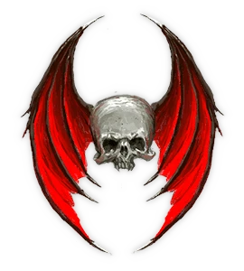

<!-- A0537-B0004 图片 -->
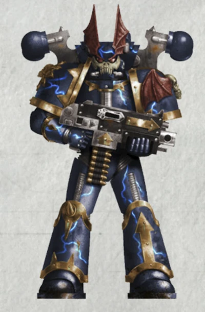

<!-- A0537-B0005 -->
**英文原文**

Legion Number:VIII

<!-- /A0537-B0005 -->

<!-- A0537-B0006 -->

原译文

军团编号：VII

**校订译文**

军团编号：VIII

**校注：** 原译VII少一位；英文明确VIII，修正为第八军团。

<!-- /A0537-B0006 -->

<!-- A0537-B0007 -->
**英文原文**

Primarch:Konrad Curze aka Night Haunter

<!-- /A0537-B0007 -->

<!-- A0537-B0008 -->

原译文

原体：康拉德·科兹又名午夜幽魂

**校订译文**

原体：康拉德·科兹又名午夜幽魂

<!-- /A0537-B0008 -->

<!-- A0537-B0009 -->
**英文原文**

Homeworld:Nostramo (Destroyed)

<!-- /A0537-B0009 -->

<!-- A0537-B0010 -->

原译文

家园世界：诺斯特拉莫（毁灭）

**校订译文**

家园世界：诺斯特拉莫（毁灭）

<!-- /A0537-B0010 -->

<!-- A0537-B0011 -->
**英文原文**

Current Base:Scattered, many in the Eye of Terror

<!-- /A0537-B0011 -->

<!-- A0537-B0012 -->

原译文

当前基地：分散，许多人在恐惧之眼中

**校订译文**

现驻地：分散各处，许多部队位于恐惧之眼。

<!-- /A0537-B0012 -->

<!-- A0537-B0013 -->
**英文原文**

Chaos Affiliation:Most scorn all faith, but some worship Chaos Undivided or particular Chaos Gods

<!-- /A0537-B0013 -->

<!-- A0537-B0014 -->

原译文

混沌隶属：大多数人蔑视所有的信仰，但有些人崇拜混沌无分或特定的混沌之神

**校订译文**

混沌隶属：大多数人蔑视所有的信仰，但有些人崇拜混沌无分或特定的混沌之神

<!-- /A0537-B0014 -->

<!-- A0537-B0015 -->
**英文原文**

Colours:Blue-black with imagery of death

<!-- /A0537-B0015 -->

<!-- A0537-B0016 -->

原译文

颜色：蓝黑色，带有死亡的意象

**校订译文**

颜色：蓝黑色，带有死亡的意象

<!-- /A0537-B0016 -->

<!-- A0537-B0017 -->
**英文原文**

Specialty:Infiltration, Psychological Warfare, Raptors

<!-- /A0537-B0017 -->

<!-- A0537-B0018 -->

原译文

专业：渗透、心理战、猛禽

**校订译文**

专长：渗透、心理战、猛禽作战。

<!-- /A0537-B0018 -->

<!-- A0537-B0019 -->
**英文原文**

Battle Cry:"We have come for you!" or "Ave Dominus Nox!"

<!-- /A0537-B0019 -->

<!-- A0537-B0020 -->

原译文

战吼：“我们为你而来！” 或 “夜之主万岁！”

**校订译文**

战吼：“我们为你而来！” 或 “夜之主万岁！”

<!-- /A0537-B0020 -->

<!-- A0537-B0021 -->
**英文原文**

Known Warbands:

<!-- /A0537-B0021 -->

<!-- A0537-B0022 -->

原译文

著名战帮

**校订译文**

著名战帮

<!-- /A0537-B0022 -->

<!-- A0537-B0023 -->

原译文

The Baleful Eye 恶意之眼

**校订译文**

The Baleful Eye 恶意之眼

<!-- /A0537-B0023 -->

<!-- A0537-B0024 -->

原译文

The Blades of Savasdus 萨瓦斯达斯之刃

**校订译文**

The Blades of Savasdus 萨瓦斯达斯之刃

<!-- /A0537-B0024 -->

<!-- A0537-B0025 -->

原译文

The Bleak Claw 荒凉利爪

**校订译文**

The Bleak Claw 荒凉利爪

<!-- /A0537-B0025 -->

<!-- A0537-B0026 -->

原译文

The Bleeding Eye 流血之眼

**校订译文**

The Bleeding Eye 流血之眼

<!-- /A0537-B0026 -->

<!-- A0537-B0027 -->

原译文

The Crowfeast of Xenorak 泽诺拉克鸦宴

**校订译文**

The Crowfeast of Xenorak 泽诺拉克鸦宴

<!-- /A0537-B0027 -->

<!-- A0537-B0028 -->

原译文

The Darkstrike 黑暗打击

**校订译文**

The Darkstrike 黑暗打击

<!-- /A0537-B0028 -->

<!-- A0537-B0029 -->

原译文

The Fear Rakers 恐惧之耙

**校订译文**

The Fear Rakers 恐惧之耙

<!-- /A0537-B0029 -->

<!-- A0537-B0030 -->
**英文原文**

The Gloomtalons - Personal warband of Night Lord turned Black Legionary Haarken Worldclaimer

<!-- /A0537-B0030 -->

<!-- A0537-B0031 -->

原译文

幽暗利爪 - 由转为黑色军团战士的夺世者哈肯的个人午夜领主战帮

**校订译文**

幽暗利爪——夺星者哈尔肯的私人战帮；他原属午夜领主，后来加入黑色军团。

**校注：** Haarken Worldclaimer采用GW09/GW10均第15页直接官译夺星者哈尔肯。

<!-- /A0537-B0031 -->

<!-- A0537-B0032 -->

原译文

The Goreshades 血影

**校订译文**

The Goreshades 血影

<!-- /A0537-B0032 -->

<!-- A0537-B0033 -->

原译文

The Night Wing 午夜之翼

**校订译文**

The Night Wing 午夜之翼

<!-- /A0537-B0033 -->

<!-- A0537-B0034 -->

原译文

The Reavers of Hodir 霍迪尔收割者

**校订译文**

The Reavers of Hodir 霍迪尔收割者

<!-- /A0537-B0034 -->

<!-- A0537-B0035 -->

原译文

The Raptorous Flayhost 狂热剥皮军

**校订译文**

The Raptorous Flayhost 狂热剥皮军

<!-- /A0537-B0035 -->

<!-- A0537-B0036 -->

原译文

The Shadow Flayers 暗影剥皮者

**校订译文**

The Shadow Flayers 暗影剥皮者

<!-- /A0537-B0036 -->

<!-- A0537-B0037 -->

原译文

The Skinblades 皮肤之刃

**校订译文**

The Skinblades 皮肤之刃

<!-- /A0537-B0037 -->

<!-- A0537-B0038 -->

原译文

The Torments 折磨

**校订译文**

The Torments 折磨

<!-- /A0537-B0038 -->

<!-- A0537-B0039 -->

原译文

Vreanus' Killers 弗瑞安努斯杀手

**校订译文**

Vreanus' Killers 弗瑞安努斯杀手

<!-- /A0537-B0039 -->

<!-- A0537-B0040 -->

原译文

The Whispering Shadow 低语暗影

**校订译文**

The Whispering Shadow 低语暗影

<!-- /A0537-B0040 -->

<!-- A0537-B0041 -->

原译文

The warband of Amon Cull 阿蒙·库尔的战帮

**校订译文**

The warband of Amon Cull 阿蒙·库尔的战帮

<!-- /A0537-B0041 -->

<!-- A0537-B0042 -->

原译文

The Warband of The Exalted 崇高者战帮

**校订译文**

The Warband of The Exalted 崇高者战帮

<!-- /A0537-B0042 -->

<!-- A0537-B0043 -->

原译文

The Warband of Krieg Acerbus 克里格·阿瑟布斯的战帮

**校订译文**

The Warband of Krieg Acerbus 克里格·阿瑟布斯的战帮

<!-- /A0537-B0043 -->

<!-- A0537-B0044 -->

原译文

The Warband of the Painted Count 纹面伯爵的战帮

**校订译文**

The Warband of the Painted Count 纹面伯爵的战帮

<!-- /A0537-B0044 -->

<!-- A0537-B0045 -->

原译文

The Warband of Tarraq Darkblood 塔拉克·暗血的战帮

**校订译文**

The Warband of Tarraq Darkblood 塔拉克·暗血的战帮

<!-- /A0537-B0045 -->

<!-- A0537-B0046 -->

原译文

The Warband of Kol Rakhul 科尔·拉库尔的战帮

**校订译文**

The Warband of Kol Rakhul 科尔·拉库尔的战帮

<!-- /A0537-B0046 -->

<!-- A0537-B0047 -->
**英文原文**

While most certainly Chaos Space Marines, the Night Lords scorn all forms of faith and respect only temporal and material power; indeed, many of them consider themselves free of the taint of Chaos and despise those they deem to be so corrupted.

<!-- /A0537-B0047 -->

<!-- A0537-B0048 -->

原译文

当然，混沌星际战士，午夜领主蔑视一切形式的信仰，只尊重世俗权力和物质力量；事实上，他们中的许多人认为自己没有混沌的污染，鄙视那些他们认为如此堕落的人。

**校订译文**

午夜领主无疑属于混沌星际战士，却蔑视一切形式的信仰，只尊重现世权势与物质力量。事实上，许多人认为自己未受混沌玷污，并鄙弃那些被他们视为已经堕落的同类。

<!-- /A0537-B0048 -->

<!-- A0537-B0049 -->
## Homeworld 家园世界

<!-- /A0537-B0049 -->

<!-- A0537-B0050 -->
**英文原文**

The homeworld of the Night Lords was Nostramo, a world of perpetual night. Plagued by both systematic corruption and endemic violence, Nostraman society was radically altered and pacified by the actions of the Night Haunter, at least for a time. Eventually however, conditions on the planet backslid to the point that the VIII Legion's Primarch, Konrad Curze, ordered its destruction. Nostramo has not existed as a world for ten thousand years, although traces of its once presence can still be found by those who know where to look.

<!-- /A0537-B0050 -->

<!-- A0537-B0051 -->

原译文

午夜领主的家园世界是诺斯特拉莫，一个永恒黑夜的世界。受到系统腐败和地方暴力的困扰，诺斯特拉莫社会至少在一段时间内被午夜幽魂的行为彻底改变和安抚。然而，最终，行星上的情况倒退到了第八军团的原体康拉德·柯兹下令摧毁它的地步。诺斯特拉莫作为一个世界已经存在了一万年，尽管那些知道去哪里寻找的人仍然可以找到它曾经存在的痕迹。

**校订译文**

午夜领主的母星诺斯特拉莫，是一个永远笼罩在黑夜中的世界。体制腐败与普遍暴力长期困扰着当地社会，午夜幽魂的行动一度彻底改变了这一切，让社会归于安定。然而，行星后来重蹈覆辙，恶化至第八军团原体康拉德·科兹下令将其摧毁的地步。诺斯特拉莫作为一颗完整的世界，已经不复存在一万年；不过，知道该去哪里寻找的人，仍能发现它曾经存在的痕迹。

**校注：** has not existed 原译漏not，错误变成世界存在一万年；修正为毁灭已一万年。

<!-- /A0537-B0051 -->

<!-- A0537-B0052 图片 -->
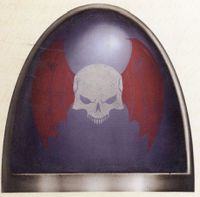

<!-- A0537-B0053 -->

原译文

Night Lords' Heresy shoulder symbol 午夜领主的叛乱肩甲标志

**校订译文**

Night Lords' Heresy shoulder symbol 午夜领主的叛乱肩甲标志

<!-- /A0537-B0053 -->

<!-- A0537-B0054 -->
## History 历史

<!-- /A0537-B0054 -->

<!-- A0537-B0055 -->
### Formation 形成

<!-- /A0537-B0055 -->

<!-- A0537-B0056 -->
**英文原文**

Originally known as the VIIIth Legion, the Night Lords first recruits were from the stinking ancient prisons of Terra. Here the children of prisoners were raised in the dark and among death. These pale "Night's Children" made perfect Astartes recruits. The Legion saw its first use when the Emperor deployed them against the Terran Saragorn Enclave, who despite having surrendered to the Imperium during the Unification Wars, still continued banned psy-breeding experiments. The Emperor's retribution on the Enclave was viciously carried out by the VIIIth Legion.

<!-- /A0537-B0056 -->

<!-- A0537-B0057 -->

原译文

最初被称为第八军团，午夜领主的第一批新兵来自臭气熏天的泰拉古老监狱。在这里，囚犯的孩子在黑暗和死亡中长大。这些苍白的“午夜之子”是阿斯塔特完美的新兵。当帝皇将军团部署到泰拉萨拉贡飞地时，军团首次看到了它的用途，尽管在统一战争期间向帝国投降，但泰拉萨拉贡飞地仍继续进行禁止的灵能繁殖实验。帝皇对飞地的报复是由第八军团恶意实施的。

**校订译文**

午夜领主最初仅称第八军团，第一批新兵来自泰拉臭气熏天的古老监狱。囚犯的子女在黑暗与死亡中长大，这些面色苍白的“午夜之子”成为极佳的阿斯塔特兵源。帝皇首次动用第八军团，是将其派往泰拉的萨拉贡飞地：该势力虽在统一战争期间归降帝国，却仍继续被禁止的灵能育种实验。第八军团以残酷手段执行了帝皇的惩罚。

<!-- /A0537-B0057 -->

<!-- A0537-B0058 图片 -->
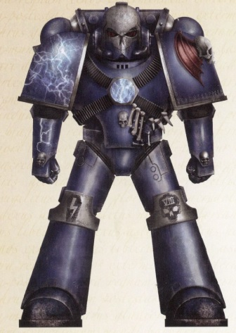

<!-- A0537-B0059 -->

原译文

Great Crusade era Night Lords Astartes 大远征时期午夜领主阿斯塔特

**校订译文**

Great Crusade era Night Lords Astartes 大远征时期午夜领主阿斯塔特

<!-- /A0537-B0059 -->

<!-- A0537-B0060 -->
### The Lord of the Night 午夜领主

<!-- /A0537-B0060 -->

<!-- A0537-B0061 -->
**英文原文**

After his discovery by the Emperor, Konrad Curze underwent a period of training under the tutelage of Fulgrim, primarch of the Emperor's Children, who introduced him to not only wider military strategems, but also Imperial culture, specifically that of Terra itself. Following this period, Curze was placed at the head of his legion, who are known to have adapted to his philosophies quickly and with diligence, as well as intelligently transforming the primarch's beliefs into military tactics. Curze's experiences upon Nostramo in his self-appointed role as the Night Haunter had instilled in him the philosophy of terror, whereby he had inspired obedience to the law by fear of extreme punishment. This societal philosophy translated into the military tactics of swift, sudden and decisive strikes often carried out to excess, as well as making sure the enemy knew who had hit them. The Night Lords therefore developed a practice of regularly using excessive force to defeat their enemies, as well as publicizing these actions so that other potential transgressors would be well aware of what could happen to them should they break faith with the Imperium.

<!-- /A0537-B0061 -->

<!-- A0537-B0062 -->

原译文

在被帝皇发现后，康拉德·科兹在帝皇之子的原体福格瑞姆的指导下接受了一段时间的训练，福格瑞姆不仅向他介绍了更广泛的军事战略，还介绍了帝国文化，特别是泰拉本身的文化。在这段时期之后，科兹被任命为他的军团的军团长，众所周知，他们迅速而勤奋地适应了他的哲学，并明智地将原体的信仰转化为军事战术。科兹在诺斯特拉莫自封的午夜幽魂的角色中的经历向他灌输了恐怖哲学，他通过恐惧极端惩罚来激发对法律的服从。这种社会哲学转化为迅速、突然和果断的军事战术，这些战术往往过度实施，并确保敌人知道是谁袭击了他们。因此，午夜领主养成了一种习惯，即经常过度使用武力击败敌人，并公开这些行为，以便其他潜在的违法者能够很好地意识到，如果他们对帝国失信，他们会发生什么。

**校订译文**

帝皇发现康拉德·科兹后，安排他向帝皇之子原体福格瑞姆学习了一段时间。福格瑞姆不仅传授更广泛的军事谋略，也向他介绍帝国文化，尤其是泰拉文化。随后，科兹开始统领自己的军团。军团战士迅速而认真地接受其理念，并巧妙地将原体的信条转化为战术。在诺斯特拉莫以午夜幽魂身份自行执法的经历，使科兹形成一套恐怖哲学：以极刑的威胁，迫使人们守法。这套社会理念落实到战场上，便成为迅疾、突然、决定性的打击；其暴力程度往往远超必要，还必须让敌人清楚是谁下的手。因此，午夜领主惯于以过度武力击败敌人，并公然传播暴行，让其他潜在的违逆者明白，背弃帝国将招致什么下场。

<!-- /A0537-B0062 -->

<!-- A0537-B0063 -->
**英文原文**

This approach made the Night Lords well-suited for dealing with worlds brought into the Imperium during the Crusade who were subsequently lax in achieving full compliance, or who even threatened to rebel. They were heavily utilized as a force that solidifed the Imperium's grip after initial pacification was achieved; as this sort of endeavor mirrored what Curze did as the Night Haunter on Nostramo, the Night Lords excelled at reinforcing the Emperor's will - through fear. To increase their effectiveness in this regard, Curze encouraged the Night Lords to decorate their power armour with death imagery. The legion soon gained a tremendously terrifying reputation, one that would cause many planetary rulers to immediately make good any outstanding tithes, make sure Imperial laws were being followed and sometimes would entirely stop an incipient rebellion at the mere rumour of Night Lord retaliation.

<!-- /A0537-B0063 -->

<!-- A0537-B0064 -->

原译文

这种方法使午夜领主非常适合处理远征期间被带入帝国的世界，这些世界随后在实现完全合规方面松懈，甚至威胁要叛乱。他们被大量用作一种部队，在最初的和平实现后巩固帝国的控制；由于这种努力反映了科兹作为诺斯特拉莫的午夜幽魂所做的一切，午夜领主擅长通过恐惧来强化帝皇的意志。为了提高他们在这方面的效率，科兹鼓励午夜领主用死亡意象装饰他们的动力盔甲。该军团很快获得了极其可怕的声誉，这导致许多行星统治者立即弥补任何未偿还的什一税，确保帝国法律得到遵守，有时甚至会在午夜领主报复的谣言中完全阻止初期的叛乱。

**校订译文**

这套手段特别适合对付那些在大远征中归入帝国，却迟迟不肯完全顺从、甚至意图叛乱的世界。帝国经常在初步平定之后动用午夜领主，巩固新取得的统治。这与科兹在诺斯特拉莫以午夜幽魂身份施行的做法如出一辙，因此军团极擅长以恐惧贯彻帝皇意志。为增强威慑，科兹鼓励战士用死亡意象装饰动力护甲。军团很快恶名远扬，许多行星统治者只要听闻午夜领主可能前来惩戒，就会立刻补缴欠税、严令遵守帝国法律，有时甚至能让尚在萌芽的叛乱就此平息。

<!-- /A0537-B0064 -->

<!-- A0537-B0065 -->
**英文原文**

As the Great Crusade wore on and the Night Lords began to slowly receive replacement Marines from Nostramo (which had meantime fallen back to its pre-Night Haunter ways), the criminal element of Nostraman society, including murderers and rapists, began to fill the ranks. Much of this was due to the instability of Nostramo's and the return of the old nobility in the absence of Curze, who emptied their worlds jails for the Legion in order to keep the best warriors for their own interests. This, in addition to Curze's probable insanity, initiated a downward spiral for the Legion.

<!-- /A0537-B0065 -->

<!-- A0537-B0066 -->

原译文

随着大远征的进行，午夜领主开始慢慢从诺斯特拉莫那里接收替代星际战士（在此期间，诺斯特拉莫已经回到了午夜幽魂之前的方式），诺斯特拉莫社会的犯罪分子，包括杀人犯和强奸犯，开始填补队伍。这在很大程度上是由于诺斯特拉莫的不稳定，以及在科兹缺席的情况下，旧贵族的回归，科兹为军团清空了他们世界的监狱，以便为自己的利益留住最好的战士。这，再加上科兹可能的精神错乱，引发了军团的螺旋式下降。

**校订译文**

随着大远征推进，午夜领主开始陆续接收来自诺斯特拉莫的补充兵员；此时母星已恢复了午夜幽魂统治前的旧日恶习。杀人犯、强奸犯等罪犯逐渐充斥军团。这主要源于诺斯特拉莫局势不稳，以及科兹离开后旧贵族重新掌权：贵族将监狱中的囚犯送进军团，把最优秀的战士留给自己。再加上科兹可能已出现精神失常，军团由此一步步走向堕落。

**校注：** emptied ... jails的主语为旧贵族，原译错归科兹。

<!-- /A0537-B0066 -->

<!-- A0537-B0067 -->
### Descent 堕落

原题：Descent 下降

<!-- /A0537-B0067 -->

<!-- A0537-B0068 -->
**英文原文**

While it may be possible that the Emperor tacitly or even secretly authorized the Night Lords' excessive tactics, the legion was eventually questioned over its increasingly extreme sanctioning of Imperial citizenry, especially by some of the other primarchs, a brotherhood that Curze had never felt a part of. Apart, that was, from Fulgrim. When his brothers began to turn on him, Curze turned to his tutor and supposed friend for counsel and confession. A sufferer of prophetic visions apparently all of his life, Curze told Fulgrim of his own great fear; that he had forseen the Emperor killing him and that the Legiones Astartes would endlessly battle each other in a perpetual civil war. Fulgrim, shocked and worried by Curze's behaviour and mental state, informed their brother Rogal Dorn (who was present in the same warzone as Curze and Fulgrim at the time) of these visions and claims. Dorn then confronted Curze over what he saw as this dishonourable besmirchment of the Emperor's name; the conversation came to blows, with Curze beating his brother bloody. Subsequently accepting being placed under arrest for this action, Curze entered confinement to await the judgement of the other Primarchs.

<!-- /A0537-B0068 -->

<!-- A0537-B0069 -->

原译文

虽然帝皇可能默许甚至秘密授权午夜领主的过度战术，但该军团最终因其对帝国公民的日益极端的制裁而受到质疑，尤其是其他一些原体，让寇兹从未感受到兄弟情谊。除此之外，那是来自福格瑞姆的。当他的兄弟们开始背叛他时，科兹转向他的导师和所谓的朋友寻求建议和忏悔。科兹一生都在遭受预言性幻象的折磨，他告诉福格瑞姆他自己的巨大恐惧；他预见到帝皇会杀了他，阿斯塔特军团将在一场永恒的内战中无休止地相互战斗。福格瑞姆对科兹的行为和精神状态感到震惊和担忧，向他们的兄弟罗格·多恩（当时与科兹和福格瑞姆在同一战区）通报了这些幻象和说法。多恩随后质问科兹，他认为这是对帝皇名誉的侮辱；谈话变得激烈起来，科兹血腥地殴打他的兄弟。随后，科兹接受了因这一行动而被逮捕的事实，并进入监狱等待其他原体的判决。

**校订译文**

帝皇或许曾默许、甚至秘密授权午夜领主采用过度暴力，但军团对帝国民众日益极端的惩戒终究引发质疑，尤其招致一些其他原体的非议。科兹从未觉得自己属于这个兄弟群体，唯一的例外是福格瑞姆。当兄弟们开始指责他，他便向这位导师和自认为的朋友寻求建议、倾诉心事。科兹似乎一生都受预言幻象折磨；他告诉福格瑞姆自己最深的恐惧：他预见帝皇会杀死自己，而阿斯塔特军团将陷入永无休止的内战。福格瑞姆为其举止和精神状态震惊且担忧，将这些幻象与言论告诉了当时身处同一战区的罗格·多恩。多恩认为这是可耻地玷污帝皇之名，于是前来质问。争执最终演变成打斗，科兹将兄弟打得浑身是血。事后，他接受拘押，等待其他原体的裁决。

**校注：** Apart ... from Fulgrim指唯一例外；brothers turn on him在此是指责，尚非战场叛变。

<!-- /A0537-B0069 -->

<!-- A0537-B0070 -->
**英文原文**

Such a verdict was never made, as before a conclave of the primarchs could be held Konrad Curze, after hearing that crime and corruption had returned to Nostramo in his absence, decided to refuse the entire process and escaped from detention, slaying members of the Imperial Fists and Emperor's Children in the process. He swiftly rejoined his legion and took his fleet to Nostramo, the planet that had betrayed him, where he ordered all the ships in his fleet to fire upon the single weakness in the planet's adamantium crust, causing it to be destroyed.

<!-- /A0537-B0070 -->

<!-- A0537-B0071 -->

原译文

这样的判决从未做出过，因为在原体的秘密会议召开之前，康拉德·科兹在得知犯罪和腐败在他缺席的情况下又回到了诺斯特拉莫后，决定拒绝整个过程并逃离拘留，在此过程中杀害了帝国之拳和皇帝之子。他迅速重新加入了他的军团，并将他的舰队带到了背叛他的行星诺斯特拉莫，在那里，他命令舰队中的所有战舰向行星上的一个弱点开火，导致其被摧毁。

**校订译文**

裁决始终未能作出。原体会议尚未召开，科兹就得知，自己离开后犯罪与腐败已重返诺斯特拉莫。他决定拒绝整个审判程序，逃出拘押地，途中杀死了帝国之拳与帝皇之子的成员。随后，他迅速归队，率舰队前往背叛自己的母星，命所有舰船集中轰击行星精金地壳唯一的薄弱点，将诺斯特拉莫彻底击碎。

**校注：** 补回精金地壳与唯一弱点；不是随便一处弱点。

<!-- /A0537-B0071 -->

<!-- A0537-B0072 -->
**英文原文**

Although the Night Lords had gone rogue, the Horus Heresy erupted before anything could be done about it.

<!-- /A0537-B0072 -->

<!-- A0537-B0073 -->

原译文

尽管午夜领主已经变得叛乱，但荷鲁斯叛乱在采取任何行动之前就爆发了。

**校订译文**

午夜领主虽然已经脱离帝国约束，但帝国还未来得及处置，荷鲁斯之乱便爆发了。

<!-- /A0537-B0073 -->

<!-- A0537-B0074 -->
### The Horus Heresy 荷鲁斯之乱

原题：The Horus Heresy 荷鲁斯叛乱

<!-- /A0537-B0074 -->

<!-- A0537-B0075 -->
**英文原文**

Despite having gone rogue, the Night Lords were one of the seven Legions dispatched to destroy the gathered Sons of Horus, World Eaters, Death Guard, and Emperor's Children at the Isstvan system. While records do not clearly explain why an apparent rogue legion was tasked to join the loyalist Astartes force charged with exterminating the traitors, at least one account puts forth the view that the Imperial justice system was both so slow and so unsure of how to deal with the Night Lords that the Imperial military commanders issued the order anyway, in their hurry to assemble a powerful force with which to crush Horus.

<!-- /A0537-B0075 -->

<!-- A0537-B0076 -->

原译文

尽管已经叛乱，但午夜领主还是被派去摧毁聚集在伊斯塔万星系的荷鲁斯之子、吞世、死亡守卫和皇帝之子的七个军团之一。虽然记录没有明确解释为什么一个明显的叛乱军团被派往加入负责消灭叛徒的忠诚的阿斯塔特部队，但至少有一种说法认为，帝国审判系统既缓慢又不确定如何处理午夜领主，以至于帝国军务指挥官还是发布了命令，急于组建一支强大的部队来粉碎荷鲁斯。

**校订译文**

尽管已脱离约束，午夜领主仍被列入七支讨伐军团，奉命消灭集结在伊斯塔万星系的荷鲁斯之子、吞世者、死亡守卫与帝皇之子。为何这样一支明显失控的军团仍能加入忠诚派讨伐大军，记载并未给出明确解释。至少有一种说法认为，帝国司法体系运转迟缓，又不知该如何处置午夜领主；军事指挥官急于集结足以击溃荷鲁斯的强大兵力，便仍然向他们发出了命令。

<!-- /A0537-B0076 -->

<!-- A0537-B0077 图片 -->
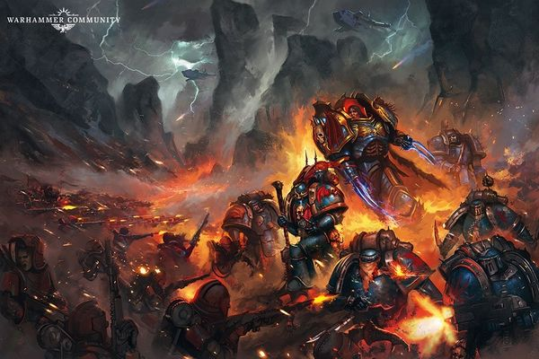

<!-- A0537-B0078 -->

原译文

Konrad Curze and the Night Lords during the Horus Heresy 荷鲁斯叛乱时期的康拉德·科兹与午夜领主

**校订译文**

Konrad Curze and the Night Lords during the Horus Heresy 荷鲁斯之乱时期的康拉德·科兹与午夜领主

<!-- /A0537-B0078 -->

<!-- A0537-B0079 -->
**英文原文**

Upon Isstvan V, the Night Lords, alongside the Word Bearers, Iron Warriors, and the Alpha Legion, turned on the loyalist Legions who had arrived earlier and took part in the Dropsite Massacre. Upon decimating the Raven Guard, Iron Hands, and the Salamanders, the Night Lords returned to the galactic east and began an apparently unfocused genocidal campaign; most likely this was designed to stop any support from this area reaching Terra. Eventually, however, the Night Lords fleet was ambushed and badly mauled by the Dark Angels at the climax of the Thramas Crusade, with one fifth of the Legion confirmed destroyed. Worse still for the Night Lords, Curze himself had been badly injured and rendered comatose by Lion El'Jonson during the debacle, forcing Sevatar to take command of the Legion and organize a regrouping. Before his capture by the Dark Angels Sevatar would divide the fleet into six parts and order their commanders to scatter. Meanwhile, Curze was stranded aboard the Dark Angels flagship Invincible Reason, eluding capture and eventually escaping to Macragge.

<!-- /A0537-B0079 -->

<!-- A0537-B0080 -->

原译文

在伊斯塔万五号，午夜领主与怀言者、钢铁勇士和阿尔法军团一起，攻击了早些时候抵达并参与登陆点大屠杀的忠诚军团。在摧毁暗鸦守卫、钢铁之手和火蜥蜴后，午夜领主回到银河系东部，开始了一场显然没有重点的种族灭绝运动；最有可能的是，这是为了阻止来自该地区的任何支援到达泰拉。然而，最终，在萨拉玛斯远征的高潮，午夜领主舰队遭到了黑暗天使的伏击和严重袭击，五分之一的军团被证实被摧毁。更糟糕的是，在溃败中，科兹本人受了重伤，被莱昂·艾尔庄森昏迷，迫使赛维塔指挥军团并组织重新集结。在他被黑暗天使俘虏之前，赛维塔将舰队分为六个部分，并命令他们的指挥官分散。与此同时，科兹被困在黑暗天使旗舰无敌理性号上，躲过了抓捕，最终逃到了马库拉格。

**校订译文**

在伊斯塔万五号，午夜领主与怀言者、钢铁勇士、阿尔法军团一同倒戈，袭击先期抵达的忠诚派军团，参与了登陆点大屠杀。重创暗鸦守卫、钢铁之手与火蜥蜴后，他们返回银河东部，展开一场表面上毫无明确目标的种族灭绝战；其真正目的很可能是阻断该地区对泰拉的增援。然而，在萨拉玛斯远征最激烈的阶段，午夜领主舰队遭到黑暗天使伏击，损失惨重，确认有五分之一的军团兵力被歼灭。科兹更被莱昂·艾尔’庄森打成重伤，陷入昏迷，迫使赛维塔接掌指挥，组织重整。赛维塔在被黑暗天使俘虏前，将舰队分成六支，命各指挥官分散行动。与此同时，科兹被困于黑暗天使旗舰无敌理性号上；他一直逃避搜捕，最终逃往马库拉格。

**校注：** 登陆点大屠杀由午夜领主等叛军发动，原译把忠诚军团写成先行参与大屠杀，施受关系错误。decimating此处为重创，不据字面套用十分之一刑罚。

<!-- /A0537-B0080 -->

<!-- A0537-B0081 -->
**英文原文**

Meanwhile the splinter fleets of Night Lords forces scattered during Thramas continued to wreak havoc across Ultima Segmentum. One notable example was the Battle of Sotha, where Night Lords under the command of Krukesh and Gendor Skraivok attempted to secure the xenos device known as the Pharos from Imperium Secundus. Later a renewed power struggle to determine the future of the Legion erupted aboard the Nightfall, with Curze's former Equerry Shang wanting to continue the search for the Primarch and become reaving warbands. However Shang was slain by Gendor Skraivok, who proclaimed that he intended to join with Horus and push on Terra.

<!-- /A0537-B0081 -->

<!-- A0537-B0082 -->

原译文

与此同时，萨拉玛斯期间分散的午夜领主部队的分裂舰队继续在极限星域肆虐。一个值得注意的例子是索萨战役，在那里，克鲁凯什和詹多·斯卡莱沃克指挥下的午夜领主试图从第二帝国手中夺取被称为法罗斯的异型装置。后来，一场决定军团未来的新的权力斗争在夜幕降临号上爆发，科兹的前侍从官尚希望继续寻找原体，成为劫掠战帮。然而，尚被詹多·斯卡莱沃克杀害，后者宣称他打算加入荷鲁斯并向泰拉推进。

**校订译文**

萨拉玛斯远征中分散的午夜领主舰队，仍在极限星域四处肆虐。索萨之战便是一例：克鲁凯什与詹多·斯卡莱沃克率军，试图从第二帝国手中夺走名为法罗斯的异形装置。后来，夜幕降临号上再次爆发争夺军团未来方向的权力斗争。科兹的前侍从官尚希望继续寻找原体，并以劫掠战帮的形式行动；詹多·斯卡莱沃克却将他杀死，宣布要与荷鲁斯会师，进攻泰拉。

<!-- /A0537-B0082 -->

<!-- A0537-B0083 -->
**英文原文**

On Macragge, Curze became the target of a planet-wide hunt by the Dark Angels, whose primarch Lion El'Jonson had been placed in charge of military and security in Roboute Guilliman's Imperium Secundus. The Lion eventually tracked down and beat Curze into submission, after which he became a prisoner of the Lion, Guilliman and Sanguinius. When the trio departed Imperium Secundus with their Legions to make a push for Terra, they took Curze with them, but Sanguinius eventually decided to dispose of him by freezing him in a stasis coffin and ejecting it into deep space. Curze was consequently absent from the Battle of Terra. However, elements of the Night Lords scattered by Sevatar as well as those under Skraivok joined with Horus' main fleet and took part in the siege.

<!-- /A0537-B0083 -->

<!-- A0537-B0084 -->

原译文

在马库拉格，科兹成为了黑暗天使在全球范围内狩猎的目标，黑暗天使的原体莱昂·艾尔庄森被任命为罗伯特·基里曼的第二帝国的军事和安全负责人。莱昂最终追踪并击败了科兹，使其屈服，之后他成为了莱昂、吉利曼和圣吉列斯的囚犯。当三人带着他们的军团离开第二帝国去前往泰拉时，他们带走了科兹，但圣吉列斯最终决定通过将他冷冻在一个停滞的棺材中并将其驱逐到深空来处置他。因此，科兹没有参加泰拉之战。然而，被赛维塔分散的午夜领主以及斯凯拉沃克手下的午夜领主加入了荷鲁斯的主舰队，并参与了围城。

**校订译文**

在马库拉格，黑暗天使对科兹展开遍及全星的搜捕。其原体莱昂·艾尔’庄森此时负责罗保特·基里曼第二帝国的军事与安全事务。莱昂最终寻获并击服科兹，使他成为自己、基里曼与圣吉列斯的阶下囚。三位原体率军团离开第二帝国、向泰拉推进时，也带上了科兹。但圣吉列斯后来决定将他封入静滞棺，再抛向深空。科兹因此缺席泰拉之战；不过，赛维塔先前遣散的部分午夜领主，以及斯卡莱沃克的部队，仍与荷鲁斯主舰队会合，参加了围城。

**校注：** stasis为静滞技术，不擅写低温冷冻。

<!-- /A0537-B0084 -->

<!-- A0537-B0085 -->
**英文原文**

During the siege of the Imperial Palace, Gendor Skraivok unwisely challenged Raldoron, First Captain of the Blood Angels, to a duel atop the palace walls. Raldoron easily defeated Skraivok and hurled him from the walls. Crippled by the fall, Skraivok allowed a daemon to possess his body and instantly became a helpless prisoner in his own flesh. (He would re-emerge millennia later a daemon prince). In his absence, a Night Lord named Krostovok took command, though the extent of his authority is unclear, as by this point the legion had devolved into individualistic killers caught up in the carnage.

<!-- /A0537-B0085 -->

<!-- A0537-B0086 -->

原译文

在皇宫被围攻期间，詹多·斯卡莱沃克不明智地挑战了圣血天使第一连长拉多隆，在皇宫墙壁上决斗。拉多隆轻松击败了斯凯拉沃克，并将他从墙上扔了下来。由于摔落而瘫痪，斯凯拉沃克允许一个恶魔占据他的身体，并立即成为自己肉体中无助的囚犯。（数千年后，他将重新成为恶魔王子）。在他缺席的情况下，一位名叫克罗斯托沃克的午夜领主接管了指挥权，尽管他的权力范围尚不清楚，因为到目前为止，军团已经沦为卷入大屠杀的个人主义杀手。

**校订译文**

围攻皇宫时，詹多·斯卡莱沃克贸然在宫墙上向圣血天使第一连长拉多隆挑战。拉多隆轻易将他击败，掷下城墙。坠落重创了斯卡莱沃克，他为求活命，允许恶魔附身，却立刻成为困在自己肉体中的无助囚徒；数千年后，他才以恶魔亲王身份再度现身。他退出战场后，一名叫克罗斯托沃克的午夜领主接过指挥权。但此时军团已沦为一群沉迷屠杀、各自为战的杀手，他究竟能号令多少人并不明确。

**校注：** re-emerge ... a daemon prince是后来以恶魔亲王身份现身，并非再次变成恶魔亲王。

<!-- /A0537-B0086 -->

<!-- A0537-B0087 -->
### Horus Heresy Aftermath 荷鲁斯之乱余波

原题：Horus Heresy Aftermath 荷鲁斯叛乱余波

<!-- /A0537-B0087 -->

<!-- A0537-B0088 -->
**英文原文**

Upon Horus's defeat, the Night Lords continued their bloody pogrom upon the Galactic East. While nearly every other Legion had been decimated in the fighting and all the other traitor Legions had begun retreating to the Eye of Terror, the Night Lords legion remained unified and retained the bulk of their pre-Heresy numbers. This heavily concerned the High Lords of Terra, who debated what could be done to cease their predations. Meanwhile the old base of the Night Lords, the Nostramo Sector, was scoured by an unknown enemy.

<!-- /A0537-B0088 -->

<!-- A0537-B0089 -->

原译文

荷鲁斯战败后，午夜领主继续对银河系东部进行血腥的大屠杀。虽然几乎所有其他军团都在战斗中被摧毁，所有其他叛徒军团都开始撤退到恐惧之眼，但午夜领主军团仍然保持统一，并保留了他们叛乱之前的大部分人数。这让泰拉的高领主们非常担忧，他们就如何停止掠夺进行了辩论。与此同时，午夜领主的旧基地诺斯特拉莫星区被一个未知的敌人洗劫一空。

**校订译文**

荷鲁斯战败后，午夜领主继续在银河东部展开血腥屠杀。英文底稿称，几乎所有其他军团都在战争中遭到重创，其他叛徒军团也已退往恐惧之眼，而午夜领主仍保持统一，并保有叛乱前的大部分兵力。这令泰拉高领主极为忧虑，反复商讨遏止其劫掠的方法。与此同时，一股不明势力扫荡了他们的旧根据地——诺斯特拉莫星区。

**校注：** 本段称军团仍统一，前文又记分裂舰队与指挥权瓦解，可能出自不同叙述时期或版本。保留原文说法，未将矛盾擅自抹平。

<!-- /A0537-B0089 -->

<!-- A0537-B0090 图片 -->
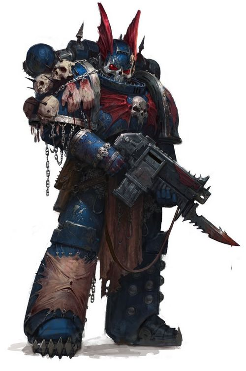

<!-- A0537-B0091 -->

原译文

Night Lords Space Marine 午夜领主星际战士

**校订译文**

Night Lords Space Marine 午夜领主星际战士

<!-- /A0537-B0091 -->

<!-- A0537-B0092 -->
**英文原文**

This eventually led to Konrad Curze being assassinated by a Callidus Assassin. Curze had visions of this event all his life and therefore chose to allow the assassin to kill him on the world of Tsagualsa, where the Night Lords had built a fortress of living flesh. Curze felt that this assassination vindicated his philosophy of life and every action he had taken in enacting it. Before his death, Curze left strict orders that the assassin was to be allowed to carry out her mission and escape, as well as apparently passing leadership to the Talonmaster Zso Sahaal, First Captain of the legion. These orders were not fully carried out.

<!-- /A0537-B0092 -->

<!-- A0537-B0093 -->

原译文

这最终导致康拉德·科兹被卡利都斯刺客暗杀。科兹一生都在想象这一事件，因此选择让刺客在察古尔萨世界杀死他，那里的午夜领主建造了一座活者的血肉堡垒。科兹认为这次暗杀证明了他的人生哲学和他在实施这一哲学时所采取的每一个行动都是正确的。在他死去之前，科兹留下了严格的命令，允许刺客执行任务并逃跑，并显然将领导权交给了军团的第一连长利爪大师索尔·萨哈尔。这些命令没有得到充分执行。

**校订译文**

这最终促成了卡利都斯刺客对康拉德·科兹的暗杀。科兹一生都曾在幻象中预见这一刻，因此选择在察古尔萨任由刺客杀死自己；午夜领主在那里建有一座活体血肉堡垒。他认为，这场暗杀将证明自己的人生哲学，以及依此行事的一切行为都是正确的。死前，他严令部下允许刺客完成任务并离去，似乎还将领导权传给军团第一连长、利爪大师索尔·萨哈尔。但这些命令没有被完全执行。

**校注：** visions为预见幻象，不是普通想象。

<!-- /A0537-B0093 -->

<!-- A0537-B0094 -->
**英文原文**

Refusing to allow the assassin to escape, the Night Lord named the Soul Hunter, an apothecary of the 10th Company, pursued her with intent to kill - a solo pursuit that was joined by a significant portion of the legion's senior officers when it transpired that the assassin had also looted several of Curze's possessions believed bequeathed by him to the legion's command cadre. Chief amongst these officers was the heir-apparent Zso Sahaal, who succeeded in boarding the assassin's vessel and retrieving the Corona Nox, a symbol of Curze's authority he believed was now to be his. However, Sahaal's own ship was attacked by Eldar raiders almost immediately, so he returned to it and vanished into the Warp, not to be seen again for almost ten thousand years. As for the Soul Hunter, he slew the assassin in the manner of the Night Lords.

<!-- /A0537-B0094 -->

<!-- A0537-B0095 -->

原译文

午夜领主拒绝让刺客逃跑，于是第10连队的药剂师灵魂猎手追捕她，意图杀死她 — 当刺客还掠夺了科兹的几件财产时，军团的大部分高级军官也加入了这场单独的追捕，据信这些财产是他留给军团指挥干部的。这些军官中的首领是法定继承者索尔·萨哈尔，他成功登上了刺客的船并取回了夜之王冠，这是他认为现在属于他的科兹权威的象征。然而，萨哈尔的船几乎立刻遭到了灵族袭击者的袭击，所以他回到船上，消失在亚空间中，在近一万年的时间里再也没有出现过。至于灵魂猎手，他以午夜领主的方式杀死了刺客。

**校订译文**

第十连药剂师、被称为灵魂猎手的午夜领主拒绝放走刺客，独自追去，意图杀死她。后来众人发现，刺客还拿走了科兹的数件遗物——据信原体本打算将它们留给军团高层——于是许多高级军官也加入追捕。其中最重要的是预定继承人索尔·萨哈尔。他成功登上刺客的舰船，夺回象征科兹权威的夜之王冠，认为此物理应由自己继承。但萨哈尔的舰船旋即遭到灵族劫掠者袭击，他只得返回，随后消失于亚空间，近一万年未再现身。灵魂猎手则以午夜领主的方式杀死了刺客。

<!-- /A0537-B0095 -->

<!-- A0537-B0096 -->
**英文原文**

Now without a leader, the Night Lords eventually fragmented into disparate warbands largely built around their original legion company structure and relocated to the Eye of Terror. Though various individuals would try to claim leadership of the entire legion, such as Zso Sahaal and Decimus, none were ever able to reunite the broken legion.

<!-- /A0537-B0096 -->

<!-- A0537-B0097 -->

原译文

现在没有了领导者，午夜领主最终分裂成不同的战帮，主要围绕他们最初的军团连队结构建立，并搬迁到恐惧之眼。尽管各种各样的人试图声称领导整个军团，如索尔·萨哈尔和德西莫斯，但没有人能够重新团结破碎的军团。

**校订译文**

失去领袖后，午夜领主最终分裂成互不统属的战帮，大体沿用原军团各连的组织框架，并迁往恐惧之眼。索尔·萨哈尔、德西莫斯等人都曾试图宣称对全军团的统治权，却始终无人能将这个破碎军团重新统一。

<!-- /A0537-B0097 -->

<!-- A0537-B0098 图片 -->
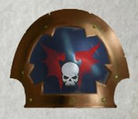

<!-- A0537-B0099 -->

原译文

Night Lords shoulder symbol 午夜领主肩甲标志

**校订译文**

Night Lords shoulder symbol 午夜领主肩甲标志

<!-- /A0537-B0099 -->

<!-- A0537-B0100 -->
### In Midnight Clad 身披午夜

原题：In Midnight Clad 午夜覆盖

<!-- /A0537-B0100 -->

<!-- A0537-B0101 -->
**英文原文**

The Night Lords have operated as raiding forces ever since, conducting terror raids in much the same style as they did whilst under the Imperial banner, only now fuelled by the hate and desperation brought on by the Long War, as well as the malign influences of Chaos. While the Warband of Krieg Acerbus is noted to be the largest and most chaotic in operation, many of the other warbands adhere more rigorously to the example set by their Primarch, deploying as organised Legiones Astartes and often with specific military goals.

<!-- /A0537-B0101 -->

<!-- A0537-B0102 -->

原译文

从那以后，午夜领主一直作为突袭部队运作，以与帝国旗帜下几乎相同的方式进行恐怖袭击，只是现在受到长期战争带来的仇恨和绝望以及混沌的恶劣影响的推动。虽然克里格·阿瑟布斯的战帮被认为是行动规模最大、最混乱的，但许多其他战帮更严格地遵守其原体的榜样，作为有组织的阿斯塔特军团进行部署，并经常有特定的军事目标。

**校订译文**

此后，午夜领主一直以劫掠部队的方式行动，仍像效力帝国时一样发动恐怖袭击，只是如今又受到万古长战带来的仇恨与绝望，以及混沌恶意的驱动。克里格·阿瑟布斯的战帮以规模最大、受混沌影响最深而著称；许多其他战帮则更严格地遵循原体留下的榜样，以组织严整的阿斯塔特军队行动，往往有明确的军事目标。

**校注：** most chaotic指混沌影响，与组织严整的战帮对举，不能单纯读为战术混乱。

<!-- /A0537-B0102 -->

<!-- A0537-B0103 -->
**英文原文**

A particular goal of the Night Lords ever since the death of their Primarch at the hands of the assassin M'Shen has been the recovery of her pict-log of the assassination. The investigations of the Soul Hunter, then an important member of the Exalted's Warband, led to the discovery of a copy of this recording, which allowed the Night Lords legion to witness their primarch - to all intents and purposes, their father - for the first time in ten millennia. A copy of it was ordered disseminated throughout the legion.

<!-- /A0537-B0103 -->

<!-- A0537-B0104 -->

原译文

自从他们的原体死于刺客穆’沈之手以来，午夜领主的一个特别目标就是恢复她暗杀的照片记录。灵魂猎手的调查，当时是崇高者战帮的重要成员，导致发现了这段录音的副本，这使得午夜领主军团在一万年来首次见证了他们的原体 — 实际上是他们的父亲。一份副本被命令在整个军团中传播。

**校订译文**

原体死于刺客穆’沈之手后，寻回她拍下的暗杀影像便成为午夜领主的一项特殊目标。当时是崇高者战帮重要成员的灵魂猎手，经调查找到一份影像副本，让军团战士在一万年来首次重新看见原体——实际上，也就是他们的父亲。此后，有人下令将副本传遍军团。

**校注：** pict-log / recording均指影像记录，原译先照片后录音前后不一。

<!-- /A0537-B0104 -->

<!-- A0537-B0105 -->
### The Great Rift 大裂隙

<!-- /A0537-B0105 -->

<!-- A0537-B0106 -->
**英文原文**

In the aftermath of the Great Rift's creation, the Night Lords' Warbands were in their element as they began launching more raids than ever before against an Imperium struck with fear and madness. They reaped a gory harvest from the Imperium's worlds and soon established small empires amongst those systems that had been cut off from the Emperor's Light. They struck an even more devastating blow against the Imperium when the Warbands used Daemonic pacts to establish a safe passage through the Great Rift near the Corinthe System. The passage was soon discovered by the Navigator Guilds and several Imperium fleets were sent through it, in a desperate attempt to reach the worlds of the Imperium Nihilus. However, when the fleets entered the tunnel through the Great Rift, the Night Lords attacked and captured dozens of Imperial vessels.

<!-- /A0537-B0106 -->

<!-- A0537-B0107 -->

原译文

在大裂隙形成之后，午夜领主的战帮处于有利地位，他们开始对一个被恐惧和疯狂袭击的帝国发动比以往任何时候都多的袭击。他们从帝国的世界中获得了血腥的收获，并很快在那些与帝皇之光隔绝的星系中建立了小帝国。当战帮使用恶魔条约在科林斯星系附近建立一条穿过大裂隙的安全通道时，他们对帝国造成了更具毁灭性的打击。导航者行会很快发现了这条通道，并派遣了几支帝国舰队穿过它，绝望地试图到达帝国暗面的世界。然而，当舰队通过大裂隙进入隧道时，午夜领主袭击并占领了数十艘帝国船只。

**校订译文**

大裂隙形成后，午夜领主如鱼得水，向被恐惧与疯狂笼罩的帝国发动了空前频繁的袭击。他们在帝国各世界大肆屠戮，很快便在那些失去帝皇之光的星系建立小型帝国。随后，各战帮又凭恶魔契约，在科林斯星系附近开辟了一条穿越大裂隙的安全通道，给帝国设下更致命的陷阱。导航员行会很快发现了通道，几支帝国舰队奉派通过，急切地试图抵达帝国暗面的世界。然而，舰队一进入裂隙中的通道，午夜领主便发动突袭，俘获数十艘帝国舰船。

**校注：** 导航员行会发现通道，不等于行会有权派遣帝国舰队，原译误接主语。

<!-- /A0537-B0107 -->

<!-- A0537-B0108 -->
**英文原文**

Only a small force of Night Lords under Ramaghan Savasdus aided Abaddon in the War of Beasts on Vigilus. The bulk of the Night Lords were instead attacking Ulthwe near the Eye of Terror.

<!-- /A0537-B0108 -->

<!-- A0537-B0109 -->

原译文

在警戒线的野兽战争中，只有拉马汉·萨瓦斯都率领的一小部分午夜领主帮助了阿巴顿。大部分午夜领主转而攻击恐惧之眼附近的乌斯维。

**校订译文**

警戒星的野兽战争中，只有拉马汉·萨瓦斯达斯率领的一小支午夜领主援助阿巴顿；军团主力则在进攻恐惧之眼附近的乌斯维。

**校注：** Vigilus统一警戒星，原警戒线误译；Savasdus与本篇战帮名统一萨瓦斯达斯。

<!-- /A0537-B0109 -->

<!-- A0537-B0110 图片 -->
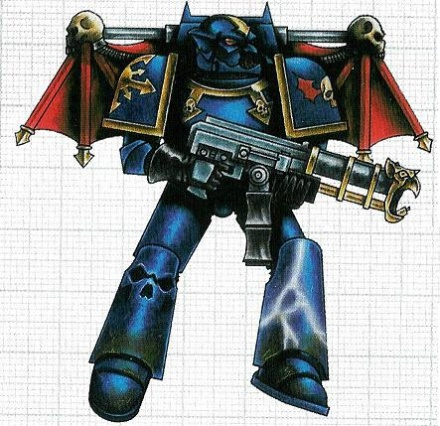

<!-- A0537-B0111 -->

原译文

Raptor of the Night Lords 午夜领主猛禽

**校订译文**

Raptor of the Night Lords 午夜领主猛禽

<!-- /A0537-B0111 -->

<!-- A0537-B0112 -->
### Notable Engagements 著名作战

<!-- /A0537-B0112 -->

<!-- A0537-B0113 -->
### The Great Crusade 大远征

<!-- /A0537-B0113 -->

<!-- A0537-B0114 -->
**英文原文**

???.M30: Vhnori Resurgence — Pacification action

<!-- /A0537-B0114 -->

<!-- A0537-B0115 -->

原译文

文诺里复兴 — 平定行动

**校订译文**

???.M30：文诺里复兴——平定行动。

<!-- /A0537-B0115 -->

<!-- A0537-B0116 -->
**英文原文**

???.M30: Battle of Velekshar — Anti-Ork fleet action

<!-- /A0537-B0116 -->

<!-- A0537-B0117 -->

原译文

韦莱克沙之战 — 反欧克舰队行动

**校订译文**

???.M30：韦莱克沙之战——针对欧克蛮人的舰队作战。

<!-- /A0537-B0117 -->

<!-- A0537-B0118 -->
**英文原文**

???.M30: Compliance of Kharaatan — purge carried out with the Salamanders

<!-- /A0537-B0118 -->

<!-- A0537-B0119 -->

原译文

卡拉坦征服 — 与火蜥蜴进行了净化

**校订译文**

???.M30：卡拉坦征服——与火蜥蜴共同实施的净化行动。

<!-- /A0537-B0119 -->

<!-- A0537-B0120 -->
**英文原文**

???.M30: Cheraut — Pacification action. The location where Konrad Curze struck Rogal Dorn and surrendered to Imperial judgement, before rejecting it and taking his legion rogue.

<!-- /A0537-B0120 -->

<!-- A0537-B0121 -->

原译文

切劳特 — 平定行动。康拉德·科兹袭击罗格·多恩并向帝国投降的地点，然后拒绝了帝国的判决，并将他的军团变成了叛乱。

**校订译文**

???.M30：切劳特——平定行动。科兹在此袭击罗格·多恩，并一度接受帝国审判；后来他拒绝受审，率军团脱离帝国约束。

<!-- /A0537-B0121 -->

<!-- A0537-B0122 -->
**英文原文**

???.M30: The Winnowing — pacification action

<!-- /A0537-B0122 -->

<!-- A0537-B0123 -->

原译文

吹拂之风 — 平定行动

**校订译文**

???.M30：筛除行动——平定行动。

**校注：** Winnowing指筛选、扬谷去糠，原译吹拂之风未体现剔除义；事件暂定筛除行动。

<!-- /A0537-B0123 -->

<!-- A0537-B0124 -->

原译文

???.M30: Piamen Campaign 皮阿曼战役

**校订译文**

???.M30: Piamen Campaign 皮阿曼战役

<!-- /A0537-B0124 -->

<!-- A0537-B0125 -->
**英文原文**

???.M30: The Carinae Retribution with the Raven Guard

<!-- /A0537-B0125 -->

<!-- A0537-B0126 -->

原译文

暗鸦守卫的船底座报复

**校订译文**

???.M30：船底座惩戒——与暗鸦守卫共同作战。

**校注：** with the Raven Guard指共同参战，非属于暗鸦守卫的报复。

<!-- /A0537-B0126 -->

<!-- A0537-B0127 -->

原译文

???.M30: Devastation of Zoah 佐亚毁灭

**校订译文**

???.M30: Devastation of Zoah 佐亚毁灭

<!-- /A0537-B0127 -->

<!-- A0537-B0128 -->
**英文原文**

???.M30: The Castigation of Terentius — Reprisal action against rebel forces.

<!-- /A0537-B0128 -->

<!-- A0537-B0129 -->

原译文

特伦修斯的惩罚 — 对叛军的报复行动。

**校订译文**

???.M30：特伦修斯惩戒——针对叛军的报复行动。

<!-- /A0537-B0129 -->

<!-- A0537-B0130 -->
**英文原文**

???.M31: Nostramo — Exterminatus action; the legion destroyed their own homeworld with concentrated lance firepower, shattering it.

<!-- /A0537-B0130 -->

<!-- A0537-B0131 -->

原译文

诺斯特拉莫 — 灭绝行动；军团用集中的光矛火力摧毁了自己的家园世界，将其粉碎。

**校订译文**

???.M31：诺斯特拉莫——灭绝行动；军团集中光矛火力，将自己的母星击碎。

<!-- /A0537-B0131 -->

<!-- A0537-B0132 -->
### The Horus Heresy 荷鲁斯之乱

原题：The Horus Heresy 荷鲁斯叛乱

<!-- /A0537-B0132 -->

<!-- A0537-B0133 -->

原译文

006.M31: The Drop Site Massacre 登陆点大屠杀

**校订译文**

006.M31: The Drop Site Massacre 登陆点大屠杀

<!-- /A0537-B0133 -->

<!-- A0537-B0134 -->
**英文原文**

007-009.M31: The Thramas Crusade and Eastern Fringe Genocide- diversionary campaign; continuing even after the defeat of Horus, though suffering a severe defeat at the hands of the Dark Angels, the Night Lords were only stopped by the assassination of Konrad Curze.

<!-- /A0537-B0134 -->

<!-- A0537-B0135 -->

原译文

萨拉玛斯远征和东部边缘种族灭绝 — 转移注意力的战役；即使在荷鲁斯战败后，午夜领主仍在继续，尽管在黑暗天使的手中遭受了严重的失败，但直到康拉德·科兹被暗杀才停止。

**校订译文**

007—009.M31：萨拉玛斯远征与银河东部边缘种族灭绝——牵制战役。午夜领主虽遭黑暗天使重创，仍在荷鲁斯败亡后继续屠杀，直到科兹被暗杀才停止。

**校注：** 条目日期为007—009.M31，但说明又提及叛乱结束后的延续行动；保留日期与说明并列，不擅自推算新终止年。

<!-- /A0537-B0135 -->

<!-- A0537-B0136 -->

原译文

~009.M31: The Battle of Sotha 索萨之战

**校订译文**

~009.M31: The Battle of Sotha 索萨之战

<!-- /A0537-B0136 -->

<!-- A0537-B0137 -->

原译文

???.M31: The Battle of Anuari 阿努里之战

**校订译文**

???.M31: The Battle of Anuari 阿努里之战

<!-- /A0537-B0137 -->

<!-- A0537-B0138 -->

原译文

~011.M31: The Battle of Trisolian 特里索兰之战

**校订译文**

~011.M31: The Battle of Trisolian 特里索兰之战

<!-- /A0537-B0138 -->

<!-- A0537-B0139 -->

原译文

012.M31: The formation of the Carrion Realms 腐尸领域形成

**校订译文**

012.M31: The formation of the Carrion Realms 腐尸领域形成

<!-- /A0537-B0139 -->

<!-- A0537-B0140 -->

原译文

013.M31: The Thassos Incident 特拉索斯事变

**校订译文**

013.M31: The Thassos Incident 特拉索斯事变

<!-- /A0537-B0140 -->

<!-- A0537-B0141 -->

原译文

014.M31: The Solar War and the Siege of Terra 太阳战争与泰拉围城

**校订译文**

014.M31: The Solar War and the Siege of Terra 太阳战争与泰拉围城

<!-- /A0537-B0141 -->

<!-- A0537-B0142 -->

原译文

017.M31: The Scouring of the Nostramo Sector 诺斯特拉莫星区大清洗

**校订译文**

017.M31: The Scouring of the Nostramo Sector 诺斯特拉莫星区大清洗

<!-- /A0537-B0142 -->

<!-- A0537-B0143 -->
### Post Heresy 叛乱后

<!-- /A0537-B0143 -->

<!-- A0537-B0144 -->

原译文

674.M31: Raid on Ptolemax XI 托勒马克斯十一号袭击

**校订译文**

674.M31: Raid on Ptolemax XI 托勒马克斯十一号袭击

<!-- /A0537-B0144 -->

<!-- A0537-B0145 -->

原译文

???.M32: The Solar Rebellion 太阳叛乱

**校订译文**

???.M32: The Solar Rebellion 太阳叛乱

<!-- /A0537-B0145 -->

<!-- A0537-B0146 -->

原译文

261.M33: The War of Broken Wings 断翼之战

**校订译文**

261.M33: The War of Broken Wings 断翼之战

<!-- /A0537-B0146 -->

<!-- A0537-B0147 -->

原译文

326.M33: The Destruction of Ila-Manesh 伊拉-玛内什毁灭

**校订译文**

326.M33: The Destruction of Ila-Manesh 伊拉-玛内什毁灭

<!-- /A0537-B0147 -->

<!-- A0537-B0148 -->

原译文

344.M33: The Blackstar Liberation 黑星解放

**校订译文**

344.M33: The Blackstar Liberation 黑星解放

<!-- /A0537-B0148 -->

<!-- A0537-B0149 -->
**英文原文**

834.M34: The Culling of Grendel's World — systematic extermination of the entire planetary populace.

<!-- /A0537-B0149 -->

<!-- A0537-B0150 -->

原译文

格伦德尔世界剔除 — 系统性地消灭整个行星的人口。

**校订译文**

834.M34：格伦德尔世界屠灭——系统性灭绝全星居民。

<!-- /A0537-B0150 -->

<!-- A0537-B0151 -->
**英文原文**

???.M37: The Te'Oran Scouring — Systematic extermination of the planetary populace by Virus Bombing

<!-- /A0537-B0151 -->

<!-- A0537-B0152 -->

原译文

泰’奥朗清洗 — 病毒轰炸对行星人口的系统性灭绝

**校订译文**

???.M37：泰’奥朗清洗——以病毒轰炸系统性灭绝行星居民。

<!-- /A0537-B0152 -->

<!-- A0537-B0153 -->
**英文原文**

999.M37: The War for the Andromax System during the 8th Black Crusade

<!-- /A0537-B0153 -->

<!-- A0537-B0154 -->

原译文

第八次黑色远征期间的安德洛马克斯星系战争

**校订译文**

999.M37：安德洛马克斯星系战争——第八次黑色远征期间发生。

<!-- /A0537-B0154 -->

<!-- A0537-B0155 -->

原译文

948.M38: The First Scouring of Coriolanthe 第一次科里奥兰清洗

**校订译文**

948.M38: The First Scouring of Coriolanthe 第一次科里奥兰清洗

<!-- /A0537-B0155 -->

<!-- A0537-B0156 -->

原译文

198.M39: The Wystengradt Raid 威斯滕格勒特袭击

**校订译文**

198.M39: The Wystengradt Raid 威斯滕格勒特袭击

<!-- /A0537-B0156 -->

<!-- A0537-B0157 -->

原译文

861-922.M39: The Orpheus Revolt 俄耳甫斯叛乱

**校订译文**

861-922.M39: The Orpheus Revolt 俄耳甫斯叛乱

<!-- /A0537-B0157 -->

<!-- A0537-B0158 -->
**英文原文**

300-307.M40: The Aschen War — several warbands of Night Lords fall under the control of the Daemon Prince known as the Horned God

<!-- /A0537-B0158 -->

<!-- A0537-B0159 -->

原译文

灰烬战争 — 几支午夜领主的军队落入被称为角神的恶魔王子的控制之下

**校订译文**

300—307.M40：灰烬战争——数支午夜领主战帮受制于名为角神的恶魔亲王。

<!-- /A0537-B0159 -->

<!-- A0537-B0160 -->
**英文原文**

???.M41: The Fall of Vilamus — the Night Lords warband of the Exalted aid the Red Corsairs in sacking the fortress-monastery of the Marines Errant Adeptus Astartes. Combat breaks out between the Night Lords and the Red Corsairs in the aftermath.

<!-- /A0537-B0160 -->

<!-- A0537-B0161 -->

原译文

维拉穆斯陷落 — 崇高者午夜领主战帮协助红海盗洗劫了星际战士的堡垒修道院。事件发生后，午夜领主和红海盗之间爆发了战斗。

**校订译文**

???.M41：维拉穆斯陷落——崇高者的午夜领主战帮协助红海盗，洗劫游侠战士战团的要塞修道院。事后，午夜领主又与红海盗交战。

**校注：** 补回被原译漏掉的战团Marines Errant，按核心统一游侠战士；不同于Marines Errantor迷途战士。

<!-- /A0537-B0161 -->

<!-- A0537-B0162 -->

原译文

142-160.M41: The 12th Black Crusade 第十二次黑色远征

**校订译文**

142-160.M41: The 12th Black Crusade 第十二次黑色远征

<!-- /A0537-B0162 -->

<!-- A0537-B0163 -->

原译文

841.M41: The Battle of Omnissiah's Eye 万机神之眼之战

**校订译文**

841.M41: The Battle of Omnissiah's Eye 万机神之眼之战

<!-- /A0537-B0163 -->

<!-- A0537-B0164 -->
**英文原文**

~800s.M41: The invasion of Zartak and battle against the Carcharodons

<!-- /A0537-B0164 -->

<!-- A0537-B0165 -->

原译文

入侵扎塔克并与噬人鲨作战

**校订译文**

约800年代.M41：入侵扎塔克，并与噬人鲨交战。

<!-- /A0537-B0165 -->

<!-- A0537-B0166 -->

原译文

940.M41: The Rhamiel Betrayal 雷米尔背叛

**校订译文**

940.M41: The Rhamiel Betrayal 雷米尔背叛

<!-- /A0537-B0166 -->

<!-- A0537-B0167 -->
**英文原文**

968.M41: The Khai-Zhan Uprising — the Nightlords aid the planet's populace in revolting against the Imperium, eventually becoming embroiled in one of the most bitter urban battles in recent memory.

<!-- /A0537-B0167 -->

<!-- A0537-B0168 -->

原译文

凯詹暴动 - 午夜领主帮助行星上的平民反抗帝国，最终卷入了最近记忆中最激烈的城市战之一。

**校订译文**

968.M41：凯詹暴动——午夜领主帮助当地民众反抗帝国，最终卷入近年以来最惨烈的城市战之一。

<!-- /A0537-B0168 -->

<!-- A0537-B0169 -->
**英文原文**

???.M41: Scound's Fall — the Night Lords raid an Imperial world a mere one hundred light years from Terra itself.

<!-- /A0537-B0169 -->

<!-- A0537-B0170 -->

原译文

斯考恩德陷落 - 午夜领主突袭了距离泰拉仅一百光年的帝国世界。

**校订译文**

???.M41：斯考恩德陷落——午夜领主突袭了一处距泰拉仅一百光年的帝国世界。

<!-- /A0537-B0170 -->

<!-- A0537-B0171 -->
**英文原文**

999.M41: 13th Black Crusade — the Night Lords fighting alongside Abaddon the Despoiler unleash great terror upon the people of the Cadian Sector

<!-- /A0537-B0171 -->

<!-- A0537-B0172 -->

原译文

第13次黑色远征 — 与掠夺者阿巴顿并肩作战的午夜领主向卡迪亚星区的人民释放了巨大的恐怖

**校订译文**

999.M41：第十三次黑色远征——午夜领主与掠夺者阿巴顿并肩作战，让卡迪亚星区居民深陷恐惧。

<!-- /A0537-B0172 -->

<!-- A0537-B0173 -->
**英文原文**

???.M42: The Battle for the Iron Veil during the Indomitus Crusade

<!-- /A0537-B0173 -->

<!-- A0537-B0174 -->

原译文

不屈远征期间的铁幕之战

**校订译文**

???.M42：铁幕之战——不屈远征期间发生。

<!-- /A0537-B0174 -->

<!-- A0537-B0175 -->

原译文

???.M41/M42: The Reclamation of Safiniyus 萨菲尼尤斯收回

**校订译文**

???.M41/M42: The Reclamation of Safiniyus 萨菲尼尤斯收回

<!-- /A0537-B0175 -->

<!-- A0537-B0176 -->

原译文

???.M42: The Invasion of the Stygius Sector 冥河星区入侵

**校订译文**

???.M42: The Invasion of the Stygius Sector 冥河星区入侵

<!-- /A0537-B0176 -->

<!-- A0537-B0177 -->

原译文

???.M42: The Antonis Crusade 安东尼斯远征

**校订译文**

???.M42: The Antonis Crusade 安东尼斯远征

<!-- /A0537-B0177 -->

<!-- A0537-B0178 -->

原译文

???.M42: The War of Beasts 野兽战争

**校订译文**

???.M42: The War of Beasts 野兽战争

<!-- /A0537-B0178 -->

<!-- A0537-B0179 -->

原译文

???.M42: The Talledus War 塔勒杜斯之战

**校订译文**

???.M42: The Talledus War 塔勒都斯战争

<!-- /A0537-B0179 -->

<!-- A0537-B0180 -->

原译文

???.M42: The Charadon Campaign 查拉顿战役

**校订译文**

???.M42: The Charadon Campaign 查拉顿战役

<!-- /A0537-B0180 -->

<!-- A0537-B0181 -->

原译文

???.M42: The Nachmund Rift War. 纳克蒙德走廊战争

**校订译文**

???.M42: The Nachmund Rift War. 纳克蒙德裂隙战争

<!-- /A0537-B0181 -->

<!-- A0537-B0182 -->

原译文

???.M42: The Arks of Omen Campaign 噩兆方舟战役

**校订译文**

???.M42: The Arks of Omen Campaign 噩兆方舟战役

<!-- /A0537-B0182 -->

<!-- A0537-B0183 -->

原译文

???.M42: The invasion of Ophelia VII by Kol Rakhul. 科尔·拉库尔入侵奥菲利亚七号。

**校订译文**

???.M42: The invasion of Ophelia VII by Kol Rakhul. 科尔·拉库尔入侵奥菲利亚七号。

<!-- /A0537-B0183 -->

<!-- A0537-B0184 -->

原译文

Date Unknown The Battle for Magnor Prime 马格诺尔主星之战

**校订译文**

Date Unknown The Battle for Magnor Prime 马格诺尔主星之战

<!-- /A0537-B0184 -->

<!-- A0537-B0185 -->
## Organization 组织

<!-- /A0537-B0185 -->

<!-- A0537-B0186 -->
### Heresy-Era 叛乱时期

<!-- /A0537-B0186 -->

<!-- A0537-B0187 -->
**英文原文**

During the Great Crusade and Horus Heresy, the Night Lords followed standard Space Marine Legion organization, albeit with a lower amount of Breacher and siege units. They also maintained a command council of Captains known as the Kyroptera.

<!-- /A0537-B0187 -->

<!-- A0537-B0188 -->

原译文

在大远征和荷鲁斯叛乱期间，午夜领主遵循了标准的星际战士组织，尽管有较少的破坏者和攻城单位。他们还维持着一个名为夜蝠议会的连长指挥议会。

**校订译文**

大远征与荷鲁斯之乱期间，午夜领主大体遵循标准星际战士军团编制，但攻坚者与攻城部队较少。他们另设由连长组成的指挥机构，称为夜蝠议会。

**校注：** Breacher在此为军团攻坚者兵种，非Devastator破坏者。

<!-- /A0537-B0188 -->

<!-- A0537-B0189 图片 -->
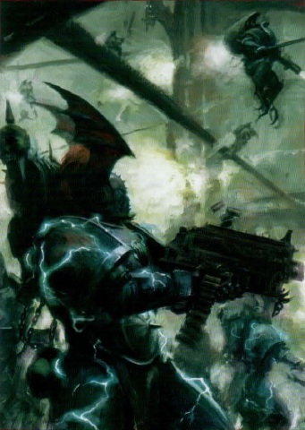

<!-- A0537-B0190 -->

原译文

Night Lords (Post-Heresy) 午夜领主（叛乱后）

**校订译文**

Night Lords (Post-Heresy) 午夜领主（叛乱后）

<!-- /A0537-B0190 -->

<!-- A0537-B0191 -->
**英文原文**

During this time the Night Lords would deploy "Pacification Battalions". These were formations of heavy armor and shock infantry, including the infamous Terror Squads. These would deploy to isolated worlds with the sole goal of breaking whatever limited defences they could find, then promptly ravaging the planet and its population. This served as an example for others for the price of defiance. These units would first deploy their heavy armor en-masse and once the defenders were broken and scattered, infantry as well as Land Speeders and Bikers would hunt down the survivors. The purpose of these operations was to cull and cause as much collateral damage as possible. They rarely made any attempt to hold their ground, most often departing after their brief but vicious onslaught.

<!-- /A0537-B0191 -->

<!-- A0537-B0192 -->

原译文

在此期间，午夜领主将部署“平定营”。这些是重型装甲和突击步兵的编队，包括臭名昭著的恐怖小队。这些将部署到独立世界，唯一的目标是打破他们能找到的任何有限的防御，然后迅速破坏行星及其人口。这为其他人树立了反抗的榜样。这些部队将首先大规模部署重型装甲，一旦防御者被击溃并分散，步兵以及兰德速攻艇和摩托骑士将追捕幸存者。这些行动的目的是扑杀并造成尽可能多的附带损害。他们很少试图守住阵地，大多数时候在短暂但恶毒的攻击后离开。

**校订译文**

这一时期，午夜领主会部署平定营，由重型装甲部队和突击步兵构成，其中包括臭名昭著的恐怖小队。它们被派往孤立世界，唯一目的就是击破当地有限的防御，随即蹂躏行星与居民，以血的代价警告其他违抗者。作战时先集中投入重型装甲，待守军溃散，再由步兵、兰德速攻艇和摩托骑手追杀幸存者。行动旨在屠戮，并尽可能扩大附带破坏；部队鲜少试图占守阵地，通常在短促而凶残的猛攻后便离开。

**校注：** isolated指孤立隔绝，并非政治上独立；行动示范的是反抗的代价，不是反抗本身值得效仿。

<!-- /A0537-B0192 -->

<!-- A0537-B0193 -->
**英文原文**

Among the few fully mechanized units of the Night Lords during this time was the 17th Chapter, known as the Bleak Cohort.

<!-- /A0537-B0193 -->

<!-- A0537-B0194 -->

原译文

在此期间，午夜领主为数不多的全机械化部队中有第17战团，即荒凉大队。

**校订译文**

在此期间，午夜领主为数不多的全机械化部队中有第17战团，即荒凉大队。

<!-- /A0537-B0194 -->

<!-- A0537-B0195 -->
**英文原文**

The fleet of the Night Lords was composed of at least 800 ships, 200 capital and 600 torpedo-boats or frigates, by the time of the Horus Heresy. The fleet's flagship was the Glorianna-pattern battleship Nightfall.

<!-- /A0537-B0195 -->

<!-- A0537-B0196 -->

原译文

到荷鲁斯叛乱时期，午夜领主的舰队由至少800艘战舰、200艘主力舰和600艘鱼雷舰或护卫舰组成。舰队的旗舰是荣光女王型战列舰夜幕将临号。

**校订译文**

荷鲁斯之乱时，午夜领主舰队至少拥有八百艘舰船，其中两百艘为主力舰，其余六百艘为鱼雷艇或护卫舰。旗舰是荣光女王型战列舰夜幕降临号。

**校注：** 800为总数，200与600为分项，原译并列易被读成1600艘。Nightfall统一夜幕降临号。

<!-- /A0537-B0196 -->

<!-- A0537-B0197 -->
**英文原文**

Known units of the Great Crusade and Horus Heresy

<!-- /A0537-B0197 -->

<!-- A0537-B0198 -->

原译文

大远征和荷鲁斯叛乱的著名单位

**校订译文**

大远征和荷鲁斯之乱的著名单位

<!-- /A0537-B0198 -->

<!-- A0537-B0199 -->
### Chapters 战团

<!-- /A0537-B0199 -->

<!-- A0537-B0200 -->

原译文

8th Chapter 第八战团

**校订译文**

8th Chapter 第八战团

<!-- /A0537-B0200 -->

<!-- A0537-B0201 -->

原译文

9th Chapter 第九战团

**校订译文**

9th Chapter 第九战团

<!-- /A0537-B0201 -->

<!-- A0537-B0202 -->

原译文

14th Chapter 第14战团

**校订译文**

14th Chapter 第14战团

<!-- /A0537-B0202 -->

<!-- A0537-B0203 -->
**英文原文**

17th Chapter (The "Bleak Cohort")

<!-- /A0537-B0203 -->

<!-- A0537-B0204 -->

原译文

第17战团（“荒凉大队”）

**校订译文**

第17战团（“荒凉大队”）

<!-- /A0537-B0204 -->

<!-- A0537-B0205 -->

原译文

18th Chapter 第18战团

**校订译文**

18th Chapter 第18战团

<!-- /A0537-B0205 -->

<!-- A0537-B0206 -->

原译文

19th Chapter 第19战团

**校订译文**

19th Chapter 第19战团

<!-- /A0537-B0206 -->

<!-- A0537-B0207 -->

原译文

27th Chapter 第27战团

**校订译文**

27th Chapter 第27战团

<!-- /A0537-B0207 -->

<!-- A0537-B0208 -->

原译文

43rd Chapter 第43战团

**校订译文**

43rd Chapter 第43战团

<!-- /A0537-B0208 -->

<!-- A0537-B0209 -->
### Companies 连队

<!-- /A0537-B0209 -->

<!-- A0537-B0210 -->

原译文

3rd Company 第三连队

**校订译文**

3rd Company 第三连队

<!-- /A0537-B0210 -->

<!-- A0537-B0211 -->

原译文

7th Company 第七连队

**校订译文**

7th Company 第七连队

<!-- /A0537-B0211 -->

<!-- A0537-B0212 -->
**英文原文**

8th Company (the "Circle of Inclemency")

<!-- /A0537-B0212 -->

<!-- A0537-B0213 -->

原译文

第八连队（“险恶之环”）

**校订译文**

第八连队（“险恶之环”）

<!-- /A0537-B0213 -->

<!-- A0537-B0214 -->
**英文原文**

9th Company: Nearly destroyed during the Unification Wars, remnants of the company formed the Crimson Sons group. Presumably restored by the time of the Great Crusade with Malithos Kuln acting as captain of the company.

<!-- /A0537-B0214 -->

<!-- A0537-B0215 -->

原译文

第九连队：在统一战争期间几乎被摧毁，连队的残余势力组成了深红之子小队。据推测，在大远征期间，马利索斯·库恩担任连长时，该部队已经恢复。

**校订译文**

第九连：统一战争中几近覆灭，残部组成了深红之子。据推测，大远征时该连已重建，由马利索斯·库恩担任连长。

<!-- /A0537-B0215 -->

<!-- A0537-B0216 -->
**英文原文**

10th Company: Became The Exalted warband after the Horus Heresy.

<!-- /A0537-B0216 -->

<!-- A0537-B0217 -->

原译文

第十连队：成为荷鲁斯叛乱之后的崇高者战帮。

**校订译文**

第十连队：成为荷鲁斯之乱之后的崇高者战帮。

<!-- /A0537-B0217 -->

<!-- A0537-B0218 -->

原译文

13th Company 第13连队

**校订译文**

13th Company 第13连队

<!-- /A0537-B0218 -->

<!-- A0537-B0219 -->
**英文原文**

17th Company (the "Lords of Tempest")

<!-- /A0537-B0219 -->

<!-- A0537-B0220 -->

原译文

第17连队（“暴风领主”）

**校订译文**

第17连队（“暴风领主”）

<!-- /A0537-B0220 -->

<!-- A0537-B0221 -->

原译文

19th Company 第19连队

**校订译文**

19th Company 第19连队

<!-- /A0537-B0221 -->

<!-- A0537-B0222 -->
**英文原文**

22nd Company (the "Night-Scythes")

<!-- /A0537-B0222 -->

<!-- A0537-B0223 -->

原译文

第22连队（“午夜镰刀”）

**校订译文**

第22连队（“午夜镰刀”）

<!-- /A0537-B0223 -->

<!-- A0537-B0224 -->

原译文

23rd Company 第23连队

**校订译文**

23rd Company 第23连队

<!-- /A0537-B0224 -->

<!-- A0537-B0225 -->
**英文原文**

27th Company (the "Shattered Skull")

<!-- /A0537-B0225 -->

<!-- A0537-B0226 -->

原译文

第27连队（“破碎颅骨”）

**校订译文**

第27连队（“破碎颅骨”）

<!-- /A0537-B0226 -->

<!-- A0537-B0227 -->

原译文

39th Company 第39连队

**校订译文**

39th Company 第39连队

<!-- /A0537-B0227 -->

<!-- A0537-B0228 -->

原译文

40th Company 第40连队

**校订译文**

40th Company 第40连队

<!-- /A0537-B0228 -->

<!-- A0537-B0229 -->

原译文

43rd Company 第43连队

**校订译文**

43rd Company 第43连队

<!-- /A0537-B0229 -->

<!-- A0537-B0230 -->

原译文

45th Company 第45连队

**校订译文**

45th Company 第45连队

<!-- /A0537-B0230 -->

<!-- A0537-B0231 -->
**英文原文**

71st Company (the "Crimson Judges")

<!-- /A0537-B0231 -->

<!-- A0537-B0232 -->

原译文

第71连队（深红法官）

**校订译文**

第71连队（深红法官）

<!-- /A0537-B0232 -->

<!-- A0537-B0233 -->
**英文原文**

77th Company (the "Harbingers of Nocnitsa")

<!-- /A0537-B0233 -->

<!-- A0537-B0234 -->

原译文

第77连队（“夜魇先驱”）

**校订译文**

第77连队（“夜魇先驱”）

<!-- /A0537-B0234 -->

<!-- A0537-B0235 -->

原译文

89th Company 第89连队

**校订译文**

89th Company 第89连队

<!-- /A0537-B0235 -->

<!-- A0537-B0236 -->

原译文

96th Company 第96连队

**校订译文**

96th Company 第96连队

<!-- /A0537-B0236 -->

<!-- A0537-B0237 -->

原译文

103rd Company 第103连队

**校订译文**

103rd Company 第103连队

<!-- /A0537-B0237 -->

<!-- A0537-B0238 -->
**英文原文**

104th Company (the "Sable Brothers")

<!-- /A0537-B0238 -->

<!-- A0537-B0239 -->

原译文

第104连队（“剑刃兄弟”）

**校订译文**

第104连（“玄黑兄弟”）。

**校注：** Sable意为黑色（亦有黑貂义），不是sabre刀剑；战帮名暂译玄黑兄弟，原剑刃兄弟。

<!-- /A0537-B0239 -->

<!-- A0537-B0240 -->

原译文

114th Company 第114连队

**校订译文**

114th Company 第114连队

<!-- /A0537-B0240 -->

<!-- A0537-B0241 -->
### Post-Heresy 叛乱后

<!-- /A0537-B0241 -->

<!-- A0537-B0242 -->
**英文原文**

Since the death of their Primarch, Konrad Curze, the Night Lords have been shattered as an organized legion. Most have fled to the Eye of Terror and now operate as disparate warbands. These warbands are fractious and mercenary to the extreme, mostly contenting themselves with raiding, butchery, and plundering. Many have found their way into the service of other Chaos Lords, Daemon Princes, and even Xenos warlords. For as so long as there is a chance to inflict fear and ambush on others, Night Lords will naturally be drawn to a cause.

<!-- /A0537-B0242 -->

<!-- A0537-B0243 -->

原译文

自从他们的原体康拉德·科兹死亡后，午夜领主作为一个有组织的军团已经瓦解。大多数人都逃到了恐惧之眼，现在作为不同的战帮运作。这些战帮性格暴躁，唯利是图，大多满足于突袭、屠杀和掠夺。许多人已经找到了为其他混沌领主、恶魔王子甚至异型军阀服务的途径。因为只要有机会对他人造成恐惧和伏击，午夜领主自然会被一项事业所吸引。

**校订译文**

康拉德·科兹死后，午夜领主作为统一军团的组织便已瓦解。多数战士逃往恐惧之眼，以各自独立的战帮活动。这些战帮内斗频仍，极端唯利是图，大多只求突袭、屠杀与掠夺。许多人投身其他混沌领主、恶魔亲王乃至异形军阀麾下。只要有机会制造恐惧、伏击他人，午夜领主就会被吸引而来。

<!-- /A0537-B0243 -->

<!-- A0537-B0244 图片 -->
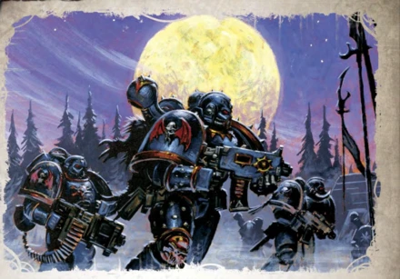

<!-- A0537-B0245 -->

原译文

Night Lords long after the Heresy 叛乱后很久的午夜领主

**校订译文**

Night Lords long after the Heresy 叛乱后很久的午夜领主

<!-- /A0537-B0245 -->

<!-- A0537-B0246 -->
**英文原文**

This style of living has led many Night Lords to become disillusioned with their identity and lack of vision. Some have even turned in their colors for other armies, as was the case with Haarken and his Gloomtalons, which eventually joined Abaddon's Black Legion. However there is some recent hope as of the 13th Black Crusade that the Legion may be reunited once more by the prophetic figure known as Decimus.

<!-- /A0537-B0246 -->

<!-- A0537-B0247 -->

原译文

这种生活方式导致许多午夜领主对自己的身份和缺乏远见感到失望。有些人甚至换了其他军队的颜色，就像哈肯和他的幽暗利爪一样，他们最终加入了阿巴顿的黑色军团。然而，自第13次黑色远征以来，最近有一些希望，军团可能会被被称为德西莫斯的预言中的人物再次团结起来。

**校订译文**

这种生活方式使许多午夜领主对自己的身份，以及毫无共同目标的处境感到失望。有些人甚至改换旗帜，加入其他军队：哈尔肯和他的幽暗利爪最终投奔阿巴顿的黑色军团便是一例。不过，第十三次黑色远征前后又出现了一丝希望——名为德西莫斯的先知，或许能重新统一军团。

**校注：** prophetic figure据本篇344 Prophet为有预知能力的先知，并非被某预言提到的人。

<!-- /A0537-B0247 -->

<!-- A0537-B0248 -->
## Gene-seed 基因种子

<!-- /A0537-B0248 -->

<!-- A0537-B0249 -->
**英文原文**

The geneseed of the Night Lords apparently remains surprisingly pure, especially for a legion that has turned from service to the Emperor. It has been theorised that the Night Lords' avoidance of overt Chaos worship has spared their gene-seed from degradation, but even leaving this aside, the stability of it is notable even when compared to that of the loyalist First Founding Chapters.

<!-- /A0537-B0249 -->

<!-- A0537-B0250 -->

原译文

午夜领主的基因显然仍然保持着令人惊讶的纯净，尤其是对于一个已经不为帝皇服务的军团来说。有理论认为，午夜领主避免公开的混沌崇拜使他们的基因种子免于退化，但即使抛开这一点，即使与忠诚派初次建军战团相比，它的稳定性也是值得注意的。

**校订译文**

午夜领主的基因种子似乎仍惊人地纯净，对一支背叛帝皇的军团而言尤为罕见。一种理论认为，他们避免公开崇拜混沌，因此基因种子未遭退化。但即便不考虑这一解释，其稳定性与忠诚派初次建军战团相比，也依旧引人注目。

<!-- /A0537-B0250 -->

<!-- A0537-B0251 -->
**英文原文**

Having said that, Curze's genetic legacy does have particular effects on those so altered. Firstly, all Night Lords sport jet black eyes which have superior night vision and very pale skin (although quite how much of this comes from geneseed and how much from having a Nostraman background in those Night Lords from the doomed night-planet is unclear). Secondly, some of the Night Lords can sport varying degrees of Konrad Curze's precognition ability. In most, these are only momentary (or even subconscious) glimpses or intuitions about the future that can result in paranoid behaviour - for Curze and his children seem more inclined to forsee negative outcomes than any other type - but in the rare few full precogs amongst the Night Lords, these visions appear as painful, violent seizures that can last for many hours.

<!-- /A0537-B0251 -->

<!-- A0537-B0252 -->

原译文

话虽如此，科兹的遗传遗产确实对那些如此改变的人有特殊的影响。首先，所有午夜领主都有一双乌黑的眼睛，有着优越的夜视能力和非常苍白的皮肤（尽管其中有多少来自基因种子，有多少来自那些来自注定要灭亡的午夜行星诺斯特拉莫背景的午夜领主尚不清楚）。其次，一些午夜领主可以表现出不同程度的康拉德·科兹的预知能力。在大多数情况下，这些只是对未来的短暂（甚至是潜意识）瞥见或直觉，可能会导致偏执行为 — 因为科兹和他的子嗣似乎比其他任何类型的人都更倾向于预见负面结果 — 但在午夜领主中为数不多的完整预判中，这些幻觉似乎是痛苦的、暴力的发作，可持续数小时。

**校订译文**

不过，科兹的遗传特征确实会影响接受改造的人。首先，午夜领主全都有漆黑的眼睛、出色的夜视能力和异常苍白的皮肤。对于出生于诺斯特拉莫这颗已毁灭的永夜行星的战士，这些特征有多少源于基因种子、多少源于出身环境，尚不明确。其次，部分午夜领主继承了程度不一的科兹式预知能力。多数人只会短暂、甚至下意识地瞥见未来，或产生某种直觉。这容易造成偏执，因为科兹及其子嗣似乎更容易看见负面结局，而非其他可能。在极少数拥有完整预知能力的战士身上，幻象则会以痛苦而剧烈的发作出现，持续数小时。

**校注：** any other type比较的是未来结局类型，原译误成其他任何类型的人。完整预知者指人，非完整预判。

<!-- /A0537-B0252 -->

<!-- A0537-B0253 图片 -->
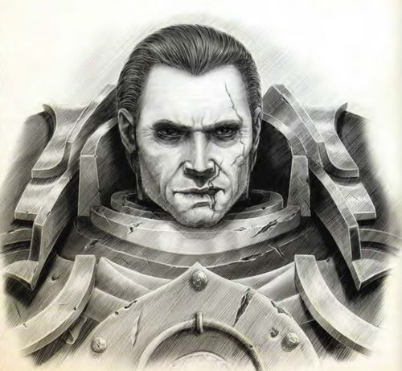

<!-- A0537-B0254 -->

原译文

The pale skin and black eyes of Night Lords First Captain Sevatar 午夜领主第一连长赛维塔苍白的皮肤和黑色的眼睛

**校订译文**

The pale skin and black eyes of Night Lords First Captain Sevatar 午夜领主第一连长赛维塔苍白的皮肤和黑色的眼睛

<!-- /A0537-B0254 -->

<!-- A0537-B0255 -->
**英文原文**

These prophetic seizures can be quite detailed, as well as show many possible futures, allowing certain Night Lords warbands to pick and choose their next moves with advance information, although Imperial scholars hope that, like their gene-sire, the Night Lords precognitives are driven to choose to self-fulfill the negative futures they see due to the believed inherent mental instability possessed by the Curze line. Chaos Lords with the ability are said to bear the Night Haunter's Curse, and the most notable Night Lords precog is the aforementioned Soul Hunter, also known amongst his warband as The Prophet.

<!-- /A0537-B0255 -->

<!-- A0537-B0256 -->

原译文

这些预言的发作可以非常详细，也可以显示许多可能的未来，允许某些午夜领主战士根据预先的信息选择他们的下一步行动，尽管帝国学者希望，就像他们的基因一样，午夜领主的预知能力被驱使选择自我实现他们所看到的负面未来，因为人们认为科兹具有内在的精神不稳定。据说具有这种能力的混沌领主会承受午夜幽魂的诅咒，最著名的午夜领主预言者是前面提到的灵魂猎手，在他的战帮中也被称为先知。

**校订译文**

这些预言幻象有时细节极为丰富，还会展现多种可能的未来，使某些午夜领主战帮能借助预先获得的信息，挑选下一步行动。帝国学者则寄望于另一种可能：科兹血脉被认为天生精神不稳，也许这些预知者会像基因之父一样，不由自主地选择促成自己看到的恶劣未来。据说，具有这种能力的混沌领主身负“午夜幽魂的诅咒”。其中最著名的预知者，是前文所述的灵魂猎手；在自己的战帮里，他也被称为“先知”。

**校注：** gene-sire指基因之父，原译漏人。帝国学者只是寄望预知者自毁，不是已证实规律。

<!-- /A0537-B0256 -->

<!-- A0537-B0257 -->
## Culture 文化

<!-- /A0537-B0257 -->

<!-- A0537-B0258 -->
**英文原文**

Even before their betrayal of the Emperor, the Night Lords were naturally rebellious thanks to the conditions of their homeworld. The Night Lords were, and largely still are, misotheists. Possessed of no holy or unholy crusade, no unifying belief, martial creed or even bonds of honour, they exist merely to reap the spoils of their actions and terrify those they despise. Curze had been their sole source of unity and command, and without him the Legion ceased to function as a coherent unit. Most of them, though far from all, have little to no interest in Chaos itself and shun the company of those that do. Their use of terror tactics and fondness for piracy and salvage operations are the only common themes found amongst their disparate warbands.

<!-- /A0537-B0258 -->

<!-- A0537-B0259 -->

原译文

即使在他们背叛帝皇之前，由于家园世界的条件，午夜领主也自然叛逆。午夜领主过去是，现在仍然是，厌恶有神论者。他们没有神圣或邪恶的远征，没有统一的信仰、军事信条，甚至没有荣誉的束缚，他们的存在只是为了收获他们行为的战利品，恐吓他们鄙视的人。科兹是他们团结和指挥的唯一来源，没有他，军团就无法作为一个连贯的单位运作。他们中的大多数人，虽然远非所有人，对混沌本身几乎没有兴趣，也避开了那些有兴趣的人。他们使用恐怖战术，喜欢劫掠和打捞行动，是他们不同的战帮中唯一的共同主题。

**校订译文**

即使尚未背叛帝皇，母星的环境也已使午夜领主带着根深蒂固的叛逆性。他们从前憎恨神祇，如今大体仍然如此。他们没有神圣或邪恶的远征使命，没有统一信仰、武人信条，甚至缺乏荣誉纽带，只为夺取战利品、恐吓蔑视之人而存在。科兹曾是唯一能统一并指挥他们的人；没有他，军团就不再是一支协调一致的部队。多数午夜领主对混沌本身几乎毫无兴趣，也避开热衷于它的同类，但并非所有人都如此。恐怖战术，以及对劫掠和打捞的热衷，是各个战帮仅存的共同点。

**校注：** misotheists为憎神者，不是厌恶有神论者。

<!-- /A0537-B0259 -->

<!-- A0537-B0260 -->
**英文原文**

The desire to cause fear is central to what philosophy the Night Lords have. This has become ritualised, to the extent that each Night Lord goes out of their way to affect a terrifying appearance, having their armour heavily artificed with symbols and imagery of death and nightmare such as skulls, skeletons, winged maws, lightning etc. Any edge gained over an opponent - including psychological ones - is important to the Night Lords. As a result, it is not uncommon for Night Lords to own a variety of personal weapons (some ornate, ancient and very deadly) and to prize them highly. A key aspect of the Eighth Legion's terror tactics is that of dominance; the Night Lords believe in theoretically achieving it before beginning a combat action in the first place, and will go out of their way to gain a superior position over the enemy, using psychological warfare for some time before the attack, or stealth tactics in order to infiltrate the battlefield or set up in ambush. Night Lords, while not averse to enjoying the slaughter they cause, do not simply engage in battle for the enjoyment in brings; they only fight when they intend to win, and win easily and well. A Night Lord will attempt every underhanded trick he knows before engaging in a straightforward, stand-up fight.

<!-- /A0537-B0260 -->

<!-- A0537-B0261 -->

原译文

制造恐惧的欲望是午夜领主哲学的核心。这已经变成了一种仪式，以至于每个午夜领主都会不遗余力地塑造一种可怕的外观，他们的盔甲上大量地装饰着死亡和噩梦的象征和图像，如头骨、骷髅、带翼的嘴、闪电等。任何超过对手的优势，包括心理优势，对午夜领主来说都很重要。因此，午夜领主拥有各种个人武器（有些华丽、古老且非常致命）并给予高度重视的情况并不少见。第八军团恐怖战术的一个关键方面是统御；午夜领主相信理论上在开始战斗行动之前就要实现这一目标，并会不遗余力地获得对敌人的优势地位，在攻击前一段时间内使用心理战，或采用隐形战术渗透战场或伏击。午夜领主虽然不反对享受他们造成的屠杀，但也不会简单地为享受带来的乐趣而战；他们只有在想赢的时候才会战斗，而且赢得很容易。午夜领主会尝试他所知道的每一个卑鄙的伎俩，然后再进行一场直截了当的单打独斗。

**校订译文**

制造恐惧是午夜领主理念的核心，甚至已近乎仪式。每个战士都竭力使自己看上去骇人，精心用头骨、骷髅、带翼巨口、闪电等死亡与梦魇意象装饰护甲。对他们而言，任何优势都很重要，心理优势也不例外。因此，他们常收藏并珍爱各式私人武器，其中不乏华美、古老而致命的珍品。第八军团恐怖战术的关键是先行压制敌人：他们认为，理想情况下，尚未开战就应掌握优势。因此，他们会提前开展心理战，或以潜行渗透战场、设置伏击。午夜领主固然享受屠杀，却并非只为杀戮的快感而战；他们出手时，意在轻松而彻底地获胜。在接受正面交战之前，一名午夜领主会先把自己知道的一切卑劣伎俩用尽。

**校注：** stealth为潜行，不意味着具备隐形能力；straightforward stand-up fight为正面交战，非必须单挑。

<!-- /A0537-B0261 -->

<!-- A0537-B0262 -->
## Recruitment 招募

<!-- /A0537-B0262 -->

<!-- A0537-B0263 -->
**英文原文**

During the Great Crusade Konrad Curze originally intended for the best and brightest of Nostramo to join the Night Lords. Curze considered the likes of Sevatar to exemplify the type of warriors he wanted in his Legion. However the embittered noble families of Nostramo deliberately sabotaged the Tithe to the Imperium, emptying their worlds jails and sending Curze instead an army of killers and thugs. The nobility kept the best warriors for themselves for use in gang warfare on Nostramo.

<!-- /A0537-B0263 -->

<!-- A0537-B0264 -->

原译文

在大远征期间，康拉德·科兹最初打算让诺斯特拉莫中最优秀、最聪明的人加入午夜领主。科兹认为赛维塔这样的人是他想要的军团战士的典型代表。然而，心怀怨恨的诺斯特拉莫贵族家族故意妨碍了帝国什一税，清空了他们世界的监狱，并派遣了一支由杀手和暴徒组成的军队。贵族们为自己保留了最好的战士，以便在诺斯特拉莫的帮派战争中使用。

**校订译文**

大远征中，科兹原本希望由诺斯特拉莫最优秀、最聪慧的人加入午夜领主，认为赛维塔这样的战士正是理想典范。但心怀怨恨的贵族家族故意破坏向帝国输送兵员的什一税制度，清空监狱，把一群杀手与暴徒送给科兹，最好的战士则留下来，为他们在诺斯特拉莫的帮派战争效力。

<!-- /A0537-B0264 -->

<!-- A0537-B0265 图片 -->
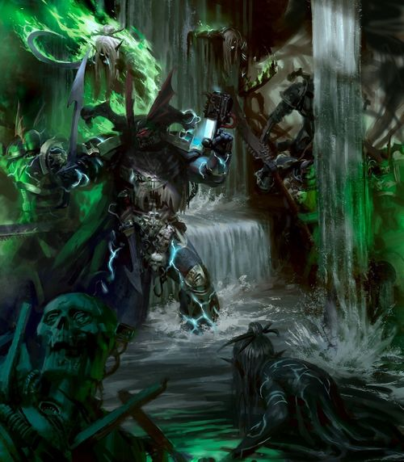

<!-- A0537-B0266 -->

原译文

Night Lords battle Mandrakes 午夜领主与曼德拉战斗

**校订译文**

Night Lords battle Mandrakes 午夜领主与曼德拉战斗

<!-- /A0537-B0266 -->

<!-- A0537-B0267 -->
**英文原文**

Since the Heresy, it is known the Night Lords recruit through a variety of methods. One such method is collecting children-survivors of worlds they attack. Another is to pick up other Chaos Marines from other Warbands. However, they can also lose numbers the same way. Night Lords have also been known to abduct infants to help replace fallen Astartes and choose recruits from conquered worlds.

<!-- /A0537-B0267 -->

<!-- A0537-B0268 -->

原译文

自叛乱以来，众所周知，午夜领主通过各种方法募兵。其中一种方法是收集他们攻击的世界的儿童幸存者。另一个是从其他战帮那里捡其他混沌星际战士。然而，它们也可能以同样的方式丢失成员。众所周知，午夜领主也会绑架婴儿，以帮助替换倒下的阿斯塔特，并从征服的世界中挑选新兵。

**校订译文**

荷鲁斯之乱后，午夜领主采用多种方式招募兵员，例如带走遭袭世界中幸存的儿童，或吸纳其他战帮的混沌星际战士。不过，他们也会因成员改投其他战帮而减员。他们还会绑架婴儿，以补充死去的阿斯塔特，或从征服的世界中挑选新兵。

<!-- /A0537-B0268 -->

<!-- A0537-B0269 图片 -->
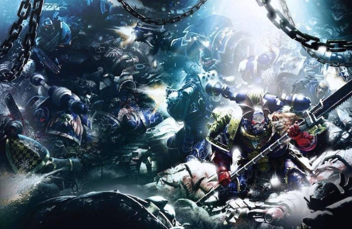

<!-- A0537-B0270 -->

原译文

Night Lords battle Dark Angels during the Horus Heresy 荷鲁斯叛乱时期午夜领主与黑暗天使战斗

**校订译文**

Night Lords battle Dark Angels during the Horus Heresy 荷鲁斯之乱时期午夜领主与黑暗天使战斗

<!-- /A0537-B0270 -->

<!-- A0537-B0271 -->
## Noted Elements of the Night Lords 午夜领主的著名力量

原题：Noted Elements of the Night Lords 午夜领主著名成员

<!-- /A0537-B0271 -->

<!-- A0537-B0272 -->
### Night Lords Armoury & Artefacts 午夜领主军械库与遗物

原题：Night Lords Armoury & Artefacts 午夜领主军械库&造物

<!-- /A0537-B0272 -->

<!-- A0537-B0273 -->
### Vessels 战舰

<!-- /A0537-B0273 -->

<!-- A0537-B0274 -->
**英文原文**

Nightfall — Glorianna-pattern battleship, flagship of Konrad Curze.

<!-- /A0537-B0274 -->

<!-- A0537-B0275 -->

原译文

夜幕降临号 — 荣光女王型战列舰，康拉德·科兹的旗舰。

**校订译文**

夜幕降临号 — 荣光女王型战列舰，康拉德·科兹的旗舰。

<!-- /A0537-B0275 -->

<!-- A0537-B0276 -->
**英文原文**

Umbrea Insidior — Battle Barge, assigned to the 1st Company.

<!-- /A0537-B0276 -->

<!-- A0537-B0277 -->

原译文

潜伏阴影号 — 战斗驳船，分配给第一连。

**校订译文**

潜伏阴影号 — 战斗驳船，分配给第一连。

<!-- /A0537-B0277 -->

<!-- A0537-B0278 -->
**英文原文**

Hunter's Premonition — Battle Barge of Halasker's warband.

<!-- /A0537-B0278 -->

<!-- A0537-B0279 -->

原译文

猎手预感号 — 哈拉斯克的战斗驳船。

**校订译文**

猎手预感号——哈拉斯克战帮的战斗驳船。

<!-- /A0537-B0279 -->

<!-- A0537-B0280 -->
**英文原文**

Terrorclaw — Battle Barge, assaulted by The Sanguinor.

<!-- /A0537-B0280 -->

<!-- A0537-B0281 -->

原译文

恐怖利爪号 - 战斗驳船，被圣吉列诺袭击。

**校订译文**

恐怖利爪号——战斗驳船，曾遭圣血者袭击。

**校注：** The Sanguinor沿GW09/GW10第11页官译圣血者，原圣吉列诺。

<!-- /A0537-B0281 -->

<!-- A0537-B0282 -->
**英文原文**

Nightmare of Celyx - Battleship.

<!-- /A0537-B0282 -->

<!-- A0537-B0283 -->

原译文

赛历克斯梦魇号 - 战列舰

**校订译文**

赛历克斯梦魇号 - 战列舰

<!-- /A0537-B0283 -->

<!-- A0537-B0284 -->
**英文原文**

Tenebrous Will - Battleship (Heresy-era).

<!-- /A0537-B0284 -->

<!-- A0537-B0285 -->

原译文

黑暗意志号 - 战列舰（叛乱时期）

**校订译文**

黑暗意志号 - 战列舰（叛乱时期）

<!-- /A0537-B0285 -->

<!-- A0537-B0286 -->
### Aircraft 飞行器

<!-- /A0537-B0286 -->

<!-- A0537-B0287 -->
**英文原文**

Blackened — Thunderhawk gunship.

<!-- /A0537-B0287 -->

<!-- A0537-B0288 -->

原译文

转黑号 — 雷鹰炮艇。

**校订译文**

转黑号 — 雷鹰炮艇。

<!-- /A0537-B0288 -->

<!-- A0537-B0289 -->
### Vehicles 载具

<!-- /A0537-B0289 -->

<!-- A0537-B0290 -->
**英文原文**

Storm's Eye — Land Raider, 10th Company, 1st Claw.

<!-- /A0537-B0290 -->

<!-- A0537-B0291 -->

原译文

风暴之眼 — 兰德掠袭者，第十连队，第一利爪

**校订译文**

风暴之眼——第十连第一利爪的兰德掠袭者战车。

<!-- /A0537-B0291 -->

<!-- A0537-B0292 -->
**英文原文**

Carpe Noctum — Rhino, destroyed on Crythe Primus after being crushed by the Warhound Scout Titan Hunter in the Grey.

<!-- /A0537-B0292 -->

<!-- A0537-B0293 -->

原译文

追猎黑夜 — 犀牛，在被灰色猎手战犬侦察泰坦压碎后，在克里斯主星上被摧毁。

**校订译文**

追猎黑夜——犀牛战车，在克里斯主星被战犬级侦察泰坦灰色猎手碾毁。

<!-- /A0537-B0293 -->

<!-- A0537-B0294 -->
**英文原文**

Vanguard - Arquitor Bombard.

<!-- /A0537-B0294 -->

<!-- A0537-B0295 -->

原译文

先锋 - 曲射手臼炮。

**校订译文**

先锋 - 曲射手臼炮。

<!-- /A0537-B0295 -->

<!-- A0537-B0296 -->
**英文原文**

Midnight Terminus - Fellblade.

<!-- /A0537-B0296 -->

<!-- A0537-B0297 -->

原译文

午夜终点 - 残暴刃。

**校订译文**

午夜终点 - 残暴刃。

<!-- /A0537-B0297 -->

<!-- A0537-B0298 -->
### Notable Members 著名成员

<!-- /A0537-B0298 -->

<!-- A0537-B0299 -->
### Heresy Era 叛乱时期

<!-- /A0537-B0299 -->

<!-- A0537-B0300 -->
**英文原文**

Konrad Curze (Night Haunter) — Primarch of the Night Lords.

<!-- /A0537-B0300 -->

<!-- A0537-B0301 -->

原译文

康拉德·科兹（午夜幽魂）— 午夜领主原体

**校订译文**

康拉德·科兹（午夜幽魂）— 午夜领主原体

<!-- /A0537-B0301 -->

<!-- A0537-B0302 -->
**英文原文**

Jago "Sevatar" Sevatarion — First Captain, officer of the Kyroptera.

<!-- /A0537-B0302 -->

<!-- A0537-B0303 -->

原译文

亚戈·“赛维塔”·塞维塔里昂 — 第一连长，夜蝠议会军官

**校订译文**

雅戈·“赛维塔”·赛维塔里昂——第一连长，夜蝠议会军官。

**校注：** 完整姓名随核心188统一雅戈·赛维塔里昂，保留中间绰号赛维塔。

<!-- /A0537-B0303 -->

<!-- A0537-B0304 -->
**英文原文**

Shang — Captain and Equerry to Konrad Curze.

<!-- /A0537-B0304 -->

<!-- A0537-B0305 -->

原译文

尚 — 连长和康拉德·科兹的侍从官

**校订译文**

尚 — 连长和康拉德·科兹的侍从官

<!-- /A0537-B0305 -->

<!-- A0537-B0306 -->
**英文原文**

Zso Sahaal — Talonmaster, succeeded Sevatar as First Captain.

<!-- /A0537-B0306 -->

<!-- A0537-B0307 -->

原译文

索尔·萨哈尔 — 利爪大师，继任赛维塔作为第一连长

**校订译文**

索尔·萨哈尔——利爪大师，接替赛维塔担任第一连长。

<!-- /A0537-B0307 -->

<!-- A0537-B0308 -->
**英文原文**

Nakrid Thole — Praetor.

<!-- /A0537-B0308 -->

<!-- A0537-B0309 -->

原译文

纳克雷德·索尔 — 执政官

**校订译文**

纳克雷德·索尔 — 执政官

<!-- /A0537-B0309 -->

<!-- A0537-B0310 -->
**英文原文**

Halasker — Captain of the 3rd Company.

<!-- /A0537-B0310 -->

<!-- A0537-B0311 -->

原译文

哈拉斯克 — 第三连队连长

**校订译文**

哈拉斯克 — 第三连队连长

<!-- /A0537-B0311 -->

<!-- A0537-B0312 -->
**英文原文**

Malithos Kuln — Captain of the 9th Company and officer of the Kyroptera, killed on Sevatar's orders.

<!-- /A0537-B0312 -->

<!-- A0537-B0313 -->

原译文

马利索斯·库恩 — 第九连队连长和夜蝠议会军官，在赛维塔的命令下被杀。

**校订译文**

马利索斯·库恩 — 第九连队连长和夜蝠议会军官，在赛维塔的命令下被杀。

<!-- /A0537-B0313 -->

<!-- A0537-B0314 -->
**英文原文**

Malcharion — the War-Sage, Captain of the 10th Company, later Dreadnought.

<!-- /A0537-B0314 -->

<!-- A0537-B0315 -->

原译文

马卡利昂 — 战争圣者，第十连队连长，后进入无畏。

**校订译文**

马卡利昂 — 战争圣者，第十连队连长，后进入无畏。

<!-- /A0537-B0315 -->

<!-- A0537-B0316 -->
**英文原文**

Krukesh — the Pale, Captain of the 103rd Company.

<!-- /A0537-B0316 -->

<!-- A0537-B0317 -->

原译文

克鲁凯什 — 苍白者，第103连队连长。

**校订译文**

克鲁凯什 — 苍白者，第103连队连长。

<!-- /A0537-B0317 -->

<!-- A0537-B0318 -->
**英文原文**

Naraka — the Bloodless, Captain of the 13th Company and officer of the Kyroptera.

<!-- /A0537-B0318 -->

<!-- A0537-B0319 -->

原译文

纳拉克 — 无血者，第13连队连长和夜蝠议会军官。

**校订译文**

纳拉克 — 无血者，第13连队连长和夜蝠议会军官。

<!-- /A0537-B0319 -->

<!-- A0537-B0320 -->
**英文原文**

Var Jahan — Captain of the 27th Company and officer of the Kyroptera.

<!-- /A0537-B0320 -->

<!-- A0537-B0321 -->

原译文

瓦尔·贾汉 — 第27连队连长和夜蝠议会军官。

**校订译文**

瓦尔·贾汉 — 第27连队连长和夜蝠议会军官。

<!-- /A0537-B0321 -->

<!-- A0537-B0322 -->
**英文原文**

Kheron Ophion — the Coward, Captain of the 39th Company and officer of the Kyroptera.

<!-- /A0537-B0322 -->

<!-- A0537-B0323 -->

原译文

凯伦·奥菲昂 — 怯懦者，第39连队连长和夜蝠议会军官。

**校订译文**

凯伦·奥菲昂 — 怯懦者，第39连队连长和夜蝠议会军官。

<!-- /A0537-B0323 -->

<!-- A0537-B0324 -->
**英文原文**

Cel Herec — Captain of the 43rd Company and officer of the Kyroptera, killed on Sevatar's orders.

<!-- /A0537-B0324 -->

<!-- A0537-B0325 -->

原译文

塞尔·赫雷克 — 第43连队连长和夜蝠议会军官，在赛维塔的命令下被杀。

**校订译文**

塞尔·赫雷克 — 第43连队连长和夜蝠议会军官，在赛维塔的命令下被杀。

<!-- /A0537-B0325 -->

<!-- A0537-B0326 -->
**英文原文**

Gendor Skraivok — the Painted Count, Captain.

<!-- /A0537-B0326 -->

<!-- A0537-B0327 -->

原译文

詹多·斯卡莱沃克 — 纹面伯爵，连长

**校订译文**

詹多·斯卡莱沃克 — 纹面伯爵，连长

<!-- /A0537-B0327 -->

<!-- A0537-B0328 -->
**英文原文**

Vyridium Silvadi — Captain, Lord of the Fleet.

<!-- /A0537-B0328 -->

<!-- A0537-B0329 -->

原译文

维里迪厄姆·希尔瓦迪 — 连长，舰队领主

**校订译文**

维里迪厄姆·希尔瓦迪 — 连长，舰队领主

<!-- /A0537-B0329 -->

<!-- A0537-B0330 -->
**英文原文**

Mawdrym Llansahai — Flaymaster, former Primus Medicae.

<!-- /A0537-B0330 -->

<!-- A0537-B0331 -->

原译文

莫德瑞姆·兰萨海 — 剥皮大师，前首席药剂师

**校订译文**

莫德瑞姆·兰萨海 — 剥皮大师，前首席药剂师

<!-- /A0537-B0331 -->

<!-- A0537-B0332 -->
**英文原文**

Thandamell — Terrormaster.

<!-- /A0537-B0332 -->

<!-- A0537-B0333 -->

原译文

坦达梅尔 — 恐惧大师

**校订译文**

坦达梅尔 — 恐惧大师

<!-- /A0537-B0333 -->

<!-- A0537-B0334 -->
**英文原文**

Fel Zharost — Chief Librarian.

<!-- /A0537-B0334 -->

<!-- A0537-B0335 -->

原译文

费尔·扎罗斯特 — 首席智库

**校订译文**

费尔·扎罗斯特——首席智库员。

<!-- /A0537-B0335 -->

<!-- A0537-B0336 -->
### Post-Heresy 叛乱后

<!-- /A0537-B0336 -->

<!-- A0537-B0337 -->
**英文原文**

Krieg Acerbus — Axemaster, Daemon Prince leading the largest Night Lords warband.

<!-- /A0537-B0337 -->

<!-- A0537-B0338 -->

原译文

克里格·阿瑟布斯 — 利斧大师，恶魔王子领导着最大的午夜领主战帮。

**校订译文**

克里格·阿瑟布斯——利斧大师，统领最大午夜领主战帮的恶魔亲王。

<!-- /A0537-B0338 -->

<!-- A0537-B0339 -->
**英文原文**

The Exalted — Possessed warband leader.

<!-- /A0537-B0339 -->

<!-- A0537-B0340 -->

原译文

崇高者 — 附魔战帮领主

**校订译文**

崇高者——遭恶魔附身的战帮首领。

<!-- /A0537-B0340 -->

<!-- A0537-B0341 -->
**英文原文**

Talos Valcoran — Soul Hunter, succeeded The Exalted as warband leader.

<!-- /A0537-B0341 -->

<!-- A0537-B0342 -->

原译文

塔洛斯·瓦尔科兰 — 灵魂猎手，接替崇高者成为战帮首领。

**校订译文**

塔洛斯·瓦尔科兰 — 灵魂猎手，接替崇高者成为战帮首领。

<!-- /A0537-B0342 -->

<!-- A0537-B0343 -->
**英文原文**

Decimus — Prophet, succeeded Talos Valcoran as warband leader.

<!-- /A0537-B0343 -->

<!-- A0537-B0344 -->

原译文

德西莫斯 — 先知，接替塔洛斯·瓦尔科兰成为战帮首领。

**校订译文**

德西莫斯 — 先知，接替塔洛斯·瓦尔科兰成为战帮首领。

<!-- /A0537-B0344 -->

<!-- A0537-B0345 -->
**英文原文**

Tarraq Darkblood — Warband leader.

<!-- /A0537-B0345 -->

<!-- A0537-B0346 -->

原译文

塔拉克·暗血 — 战帮首领

**校订译文**

塔拉克·暗血 — 战帮首领

<!-- /A0537-B0346 -->

<!-- A0537-B0347 -->
**英文原文**

The Painted Count — Daemon Prince.

<!-- /A0537-B0347 -->

<!-- A0537-B0348 -->

原译文

纹面伯爵 — 恶魔王子

**校订译文**

纹面伯爵——恶魔亲王。

<!-- /A0537-B0348 -->

<!-- A0537-B0349 -->
**英文原文**

Lucoryphus — Leader of the Bleeding Eyes Raptor cult.

<!-- /A0537-B0349 -->

<!-- A0537-B0350 -->

原译文

洛克瑞弗斯 — 流血之眼猛禽教派领导者

**校订译文**

洛克瑞弗斯 — 流血之眼猛禽教派领导者

<!-- /A0537-B0350 -->

<!-- A0537-B0351 -->
**英文原文**

Kol Rakhul — Warband leader.

<!-- /A0537-B0351 -->

<!-- A0537-B0352 -->

原译文

科尔·拉库尔 — 战帮首领

**校订译文**

科尔·拉库尔 — 战帮首领

<!-- /A0537-B0352 -->

<!-- A0537-B0353 -->
**英文原文**

Amon Cull - Warband leader.

<!-- /A0537-B0353 -->

<!-- A0537-B0354 -->

原译文

阿蒙·库尔 - 战帮首领

**校订译文**

阿蒙·库尔 - 战帮首领

<!-- /A0537-B0354 -->

<!-- A0537-B0355 -->
**英文原文**

Shadraith - Sorcerer.

<!-- /A0537-B0355 -->

<!-- A0537-B0356 -->

原译文

沙德瑞斯 - 巫师

**校订译文**

沙德瑞斯 - 巫师

<!-- /A0537-B0356 -->

<!-- A0537-B0357 -->
**英文原文**

Haarken - Leader of the Gloomtalons, eventually joined the Black Legion and now acts as herald of Abaddon the Despoiler.

<!-- /A0537-B0357 -->

<!-- A0537-B0358 -->

原译文

哈肯 - 幽暗利爪的领袖，最终加入了黑色军团，现在担任掠夺者阿巴顿的传令官。

**校订译文**

哈尔肯——幽暗利爪的领袖，后来加入黑色军团，如今担任掠夺者阿巴顿的传令官。

<!-- /A0537-B0358 -->

<!-- A0537-B0359 -->
**英文原文**

Szerhan Nethar — Leader of the Fear Rakers.

<!-- /A0537-B0359 -->

<!-- A0537-B0360 -->

原译文

瑟汉·内斯塔 — 恐惧之耙领导者

**校订译文**

瑟汉·内斯塔 — 恐惧之耙领导者

<!-- /A0537-B0360 -->

<!-- A0537-B0361 -->
### Unique units 独特单位

<!-- /A0537-B0361 -->

<!-- A0537-B0362 -->

原译文

Atramentar 黑甲卫

**校订译文**

Atramentar 黑甲卫

<!-- /A0537-B0362 -->

<!-- A0537-B0363 -->
**英文原文**

Night Raptor (Horus Heresy-era)

<!-- /A0537-B0363 -->

<!-- A0537-B0364 -->

原译文

午夜猛禽（荷鲁斯叛乱时期）

**校订译文**

午夜猛禽（荷鲁斯之乱时期）

<!-- /A0537-B0364 -->

<!-- A0537-B0365 -->
**英文原文**

Terror Squads (Horus Heresy-era)

<!-- /A0537-B0365 -->

<!-- A0537-B0366 -->

原译文

恐怖小队（荷鲁斯叛乱时期）

**校订译文**

恐怖小队（荷鲁斯之乱时期）

<!-- /A0537-B0366 -->

<!-- A0537-B0367 -->
**英文原文**

Reaver (Horus Heresy-era)

<!-- /A0537-B0367 -->

<!-- A0537-B0368 -->

原译文

劫掠者（荷鲁斯叛乱时期）

**校订译文**

劫掠者（荷鲁斯之乱时期）

<!-- /A0537-B0368 -->

<!-- A0537-B0369 -->
**英文原文**

Contekar Terminators (Horus Heresy-era)

<!-- /A0537-B0369 -->

<!-- A0537-B0370 -->

原译文

肯特卡终结者（荷鲁斯叛乱时期）

**校订译文**

肯特卡终结者（荷鲁斯之乱时期）

<!-- /A0537-B0370 -->

本篇核心术语与暂定项

以下列出本篇出现的英文原形及核心术语表用词。同形词可能指不同对象，具体词义以本篇正文和校注为准；单复数、别名和仅见于图注的名称可能尚未列入。完整候选见[术语表](../../术语表/双语术语候选.csv)。

| 英文 | 采用中文 | 状态 |
| --- | --- | --- |
| Space Marines | 星际战士 | 官方已核对 |
| Adeptus Astartes | 阿斯塔特修会 | 官方已核对 |
| Blood Angels | 圣血天使 | 官方已核对 |
| Dark Angels | 黑暗天使 | 官方已核对 |
| Chaos Space Marines | 混沌星际战士 | 官方已核对 |
| Death Guard | 死亡守卫 | 官方已核对 |
| World Eaters | 吞世者 | 官方已核对 |
| Eldar | 灵族 | 暂定·语境区分 |
| Librarian | 智库员 | 官方已核对 |
| Roboute Guilliman | 罗保特·基里曼 | 官方已核对 |
| Horus Heresy | 荷鲁斯之乱 | 官方已核对 |
| Navigator | 导航员 | 官方已核对 |
| Warp | 亚空间 | 官方已核对 |
| Great Rift | 大裂隙 | 官方已核对 |
| Imperium | 帝国 | 暂定·简称 |
| Sorcerer | 巫师 | 官方已核对 |
| Indomitus | 不屈学派 | 暂定·学派语境 |
| Eye of Terror | 恐惧之眼 | 官方已核对 |
| Imperial Fists | 帝国之拳 | 暂定 |
| Emperor | 帝皇 | 官方已核对 |
| Primarch | 原体 | 官方已核对 |
| Battle Barge | 战斗驳船 | 暂定·官方待核 |
| Word Bearers | 怀言者 | 暂定·官方待核 |
| Daemon Prince | 恶魔亲王 | 官方已核对 |
| Black Legion | 黑色军团 | 暂定·官方待核 |
| Emperor's Children | 帝皇之子 | 官方已核对 |
| Iron Warriors | 钢铁勇士 | 暂定·官方待核 |
| Night Lords | 午夜领主 | 暂定·官方待核 |
| The Order | 秩序 | 暂定·官方待核 |
| Great Crusade | 大远征 | 暂定·官方待核 |
| Compliance | 归顺；纳入帝国统治 | 暂定·官方待核 |
| Terra | 泰拉 | 暂定·官方待核 |
| Horus | 荷鲁斯 | 暂定·官方待核 |
| Sons of Horus | 荷鲁斯之子 | 暂定·官方待核 |
| Lion El'Jonson | 莱昂·艾尔’庄森 | 官方已核对 |
| Iron Hands | 钢铁之手 | 暂定·官方待核 |
| Fulgrim | 福格瑞姆 | 官方已核对 |
| High Lords of Terra | 泰拉高领主 | 暂定·官方待核 |
| Imperial Culture | 帝国文化 | 暂定·官方待核 |
| Imperium Nihilus | 帝国暗面 | 暂定·官方待核 |
| Indomitus Crusade | 不屈远征 | 暂定·官方待核 |
| War of Beasts | 野兽之战 | 暂定·官方待核 |
| Legiones Astartes | 阿斯塔特军团 | 暂定·官方待核 |
| Unification Wars | 统一战争 | 暂定·官方待核 |
| Ultima Segmentum | 极限星域 | 暂定·官方待核 |
| Segmentum | 星域 | 暂定·官方待核 |
| Sector | 星区 | 暂定·官方待核 |
| Eastern Fringe | 东部边缘 | 暂定·官方待核 |
| Perpetual | 永生者 | 暂定·官方待核 |
| Salamanders | 火蜥蜴 | 暂定·官方待核 |
| Brotherhood | 兄弟会 | 暂定·官方待核 |
| Konrad Curze | 康拉德·科兹 | 暂定·官方待核 |
| Thramas Crusade | 萨拉玛斯远征 | 暂定·官方待核 |
| Nostramo | 诺斯特拉莫 | 暂定·官方待核 |
| Khai-Zhan | 凯詹 | 暂定·官方待核 |
| Macragge | 马库拉格 | 暂定·官方待核 |
| Sotha | 索萨 | 暂定·官方待核 |
| Titan | 泰坦 | 暂定·官方待核 |
| Vigilus | 警戒星 | 暂定·官方待核 |
| Land Raider | 兰德掠袭者战车 | 官方已核对 |
| Imperium Secundus | 第二帝国 | 暂定·官方待核 |
| Pharos | 灯塔 | 暂定·官方待核 |
| Chief Librarian | 首席智库员 | 暂定·官方待核 |
| Mission | 教团／传教机构 | 暂定 |
| Primus Medicae | 首席药剂师 | 暂定·官方待核 |
| Apothecary | 药剂师 | 官方已核对 |
| Ancient | 旗手 | 官方已核对 |
| Rhino | 犀牛战车 | 官方已核对 |
| Veil | 韦尔 | 暂定·官方待核 |
| Lance | 骑士矛阵 | 暂定·官方待核 |
| Cadre | 骨干连（寂静修女）／核心队（钛族） | 语境定译·钛族词根参考 |
| Long War | 万古长战 | 暂定·官方待核 |
| Space Marine Legion | 星际战士军团 | 暂定·官方待核 |
| Alpha Legion | 阿尔法军团 | 暂定·官方待核 |
| Raven Guard | 暗鸦守卫 | 官方已核 |
| The Primarchs | 原体 | 暂定·官方待核 |
| Founding | 建军 | 暂定·官方待核 |
| Isstvan | 伊斯塔万 | 暂定·官方待核 |
| Fel Zharost | 费尔·扎罗斯特 | 暂定·官方待核 |
| First Captain | 第一连长 | 暂定·官方待核 |
| Praetor | 执政官 | 暂定·官方待核 |
| Raldoron | 拉多隆 | 暂定·官方待核 |
| Shang | 尚 | 暂定·官方待核 |
| Nakrid Thole | 纳克雷德·索尔 | 暂定·官方待核 |
| Amon | 阿蒙 | 暂定·官方待核 |
| Herald | 传令官 | 暂定·官方待核 |
| Despoiler | 劫掠者 | 暂定·官方待核 |
| Power Armour | 动力盔甲 | 暂定·官方待核 |
| Space Marine | 星际战士 | 暂定·官方待核 |
| Chapter | 战团 | 暂定·官方待核 |
| Fortress-monastery | 要塞修道院 | 暂定·官方待核 |
| Captain | 连长 | 暂定·官方待核 |
| Terminators | 终结者 | 暂定·官方待核 |
| Brother | 修士 | 暂定·官方待核 |
| Scout | 侦察兵 | 暂定·官方待核 |
| Vanguard | 先锋 | 暂定·官方待核 |
| First Founding | 初次建军 | 暂定·官方待核 |
| Raptors | 猛禽 | 暂定·官方待核 |
| Marines Errant | 游侠战士 | 暂定·官方待核 |
| Land Speeders | 兰德速攻艇 | 暂定·官方待核 |
| Carcharodons | 噬人鲨 | 暂定·官方待核 |
| Harbingers | 凶兆 | 暂定·官方待核 |
| Remnants | 残骸 | 暂定·官方待核 |
| Gene-seed | 基因种子 | 暂定·官方待核 |
| Thunderhawk Gunship | 雷鹰炮艇 | 暂定·官方待核 |
| Torpedo | 鱼雷 | 暂定·官方待核 |
| Equerry | 近侍 | 暂定·官方待核 |
| Medicae | 医疗工 | 暂定·官方待核 |
| Talonmaster | 利爪大师 | 暂定·官方待核 |
| Cohort | 大队 | 暂定·官方待核 |
| Chaos Undivided | 混沌无分 | 暂定·官方待核 |
| The Sanguinor | 圣血者 | 官方已核 |
| Xenos | 异形 | 暂定·官方待核 |
| Abaddon the Despoiler | 掠夺者阿巴顿 | 官方已核对 |
| Raider | 掠袭者飞艇 | 官方已核对 |
| Haarken Worldclaimer | 夺星者哈尔肯 | 官方已核对 |
| Contekar | 肯特卡 | 暂定·官方待核 |
| Ramaghan Savasdus | 拉马汉·萨瓦斯达斯 | 暂定·官方待核 |
| Gendor Skraivok | 詹多·斯卡莱沃克 | 暂定·官方待核 |
| Zso Sahaal | 索尔·萨哈尔 | 暂定·官方待核 |
| Corona Nox | 夜之王冠 | 暂定·官方待核 |
| Corinthe System | 科林斯星系 | 暂定·官方待核 |
| Nightfall | 夜幕降临号 | 暂定·官方待核 |
| Primus | 领军 | 官方已核对 |
| The Winnowing | 筛除行动 | 暂定·官方待核 |
| Carinae Retribution | 船底座惩戒 | 暂定·官方待核 |
| Sable Brothers | 玄黑兄弟 | 暂定·官方待核 |
| Kyroptera | 夜蝠议会 | 暂定·官方待核 |
| Talos Valcoran | 塔洛斯·瓦尔科兰 | 暂定·官方待核 |
| Terrorclaw | 恐怖利爪号 | 暂定·官方待核 |
| Krukesh | 克鲁克什 | 暂定·官方待核 |
| Terminus | 终点站 | 暂定·官方待核 |
| Grendel | 格伦德尔号 | 暂定·官方待核 |
| Dreadnought | 无畏机甲 | 暂定·官方待核 |
| Emperor's Will | 帝皇意志号 | 暂定·官方待核 |
| Sable | 暗夜星 | 暂定·官方待核 |
| Sevatar | 赛维塔 | 暂定·官方待核 |
| Tsagualsa | 查古尔萨 | 暂定·官方待核 |
| Invincible Reason | 无敌理性号 | 暂定·官方待核 |
| Tenebrous Will | 黑暗意志号 | 暂定·官方待核 |
| Bear | 熊 | 暂定·官方待核 |
| Kharaatan | 哈拉坦 | 暂定·官方待核 |
| The Dark | 《黑暗》 | 暂定·官方待核 |
| The Blood | 鲜血 | 暂定·官方待核 |
| Price | 普莱斯 | 暂定·官方待核 |
| System | 星系（恒星系统） | 暂定·官方待核 |
| Krieg | 克里格 | 暂定·官方待核 |
| Scound's Fall | 恶棍之陨 | 暂定·官方待核 |
| Saragorn Enclave | 萨拉贡飞地 | 暂定·官方待核 |
| Defiance | 反抗号 | 暂定·官方待核 |
| Corruption | 腐败 | 暂定·官方待核 |
| Tarraq Darkblood | 塔拉克·暗血 | 暂定·官方待核 |
| Arquitor Bombard | 曲射手臼炮载具 | 暂定·官方待核 |
| claw | 利爪分队 | 暂定·官方待核 |
| Szerhan Nethar | 施尔汉·内塔尔 | 暂定·官方待核 |
| Kol Rakhul | 科尔·拉库尔 | 暂定·官方待核 |
| Excessive Force | 过度武力号 | 暂定·官方待核 |
| Cadian Sector | 卡迪亚星区 | 暂定·官方待核 |
| Khai-Zhan Uprising | 凯詹叛乱 | 暂定·官方待核 |
| The Loss | 失落 | 暂定·官方待核 |
| Fellblade | 残暴刃 | 暂定·官方待核 |

