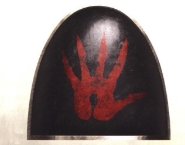
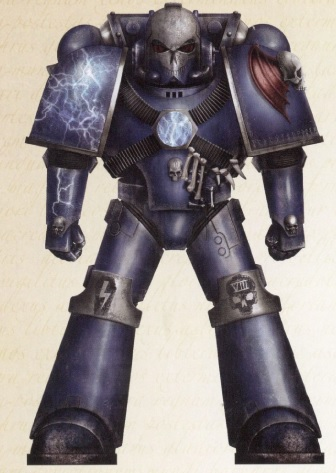

# 0538 恐怖小队 Terror Squad

精校状态：中文行文已逐段精校，部分术语仍为暂定

分类：概念

原文来源：https://www.bilibili.com/opus/1035980024864309248

原作者：帝国神选罐头

原文时间：2025年02月20日 18:11

[返回分类目录](目录.md) · [全书目录](../../目录.md)

<!-- A0538-B0001 -->
**英文原文**

Terror Squads were specialized Night Lords infantry formations during the Great Crusade and Horus Heresy. Their symbol was a bloody hand.

<!-- /A0538-B0001 -->

<!-- A0538-B0002 -->

原译文

恐怖小队是大远征和荷鲁斯叛乱时期专门的午夜领主步兵编队。他们的标志是一只沾满鲜血的手。

**校订译文**

恐怖小队是大远征与荷鲁斯之乱时期午夜领主的特种步兵编队，以一只血手为标志。

<!-- /A0538-B0002 -->

<!-- A0538-B0003 图片 -->

<!-- A0538-B0004 -->

原译文

Unofficial Terror Squad symbol 非官方恐怖小队标志

**校订译文**

Unofficial Terror Squad symbol 非官方恐怖小队标志

<!-- /A0538-B0004 -->

<!-- A0538-B0005 -->
**英文原文**

When punishments against those defying the Emperor was judged to be most severe, Terror Squads were unleashed. Consisting of torturers, flayers, mutilators, and head hunters, they were the coldest and most dispassionate members of the Legion. As the decades progressed Terror Squads became a sink-hole for the most unstable and unsubtle members of the Night Lords, and many were already facing death sentences that had been commuted so long as they proved useful to Konrad Curze.

<!-- /A0538-B0005 -->

<!-- A0538-B0006 -->

原译文

当判定对违抗帝皇者的惩罚须极为严厉时，恐怖小队便会出动。他们由折磨者、剥皮者、残杀者和猎头者组成，是军团中最冷酷、最无情的成员。随着几十年的发展，恐怖小队成为午夜领主中最不稳定和最不可靠的成员的藏身之地，许多人已经面临死刑，只要对康拉德·柯兹有用，死刑就可以减刑。

**校订译文**

当违抗帝皇者被判应受最严酷的惩罚时，恐怖小队便会出动。他们由酷刑施行者、剥皮者、残杀者与猎头者组成，是军团中最冷酷、最漠然的一群人。数十年间，这些小队逐渐沦为收容午夜领主中最不稳定、最粗暴成员的去处。许多人原本已被判处死刑，只因对康拉德·科兹仍有用，才得以减免。

**校注：** unsubtle指粗暴直接、毫不掩饰的行事方式，不是缺乏可靠性；减刑以持续有用为条件。

<!-- /A0538-B0006 -->

<!-- A0538-B0007 图片 -->

<!-- A0538-B0008 -->

原译文

Night Lords Terrorist 午夜领主恐怖者

**校订译文**

Night Lords Terrorist 午夜领主恐怖者

<!-- /A0538-B0008 -->

<!-- A0538-B0009 -->
**英文原文**

During the Heresy, Terror Squads were led by Headsmen.

<!-- /A0538-B0009 -->

<!-- A0538-B0010 -->

原译文

叛乱时期，恐惧小队由处刑者领导。

**校订译文**

荷鲁斯之乱期间，恐怖小队由处刑者率领。

<!-- /A0538-B0010 -->

<!-- A0538-B0011 -->
## Known Terror Squad members 著名恐怖小队成员

<!-- /A0538-B0011 -->

<!-- A0538-B0012 -->
**英文原文**

Kellendvar - Headsman

<!-- /A0538-B0012 -->

<!-- A0538-B0013 -->

原译文

凯伦德瓦尔 - 处刑者

**校订译文**

凯伦德瓦尔 - 处刑者

<!-- /A0538-B0013 -->

<!-- A0538-B0014 -->

原译文

Endros Shek 德罗斯·肖克

**校订译文**

Endros Shek 德罗斯·肖克

<!-- /A0538-B0014 -->

<!-- A0538-B0015 -->
**英文原文**

Rehk Nahmris - Headsman

<!-- /A0538-B0015 -->

<!-- A0538-B0016 -->

原译文

雷克·纳姆里斯 - 处刑者

**校订译文**

雷克·纳姆里斯 - 处刑者

<!-- /A0538-B0016 -->

<!-- A0538-B0017 -->
**英文原文**

Daras - Headsman

<!-- /A0538-B0017 -->

<!-- A0538-B0018 -->

原译文

达拉斯 - 处刑者

**校订译文**

达拉斯 - 处刑者

<!-- /A0538-B0018 -->

本篇核心术语与暂定项

以下列出本篇出现的英文原形及核心术语表用词。同形词可能指不同对象，具体词义以本篇正文和校注为准；单复数、别名和仅见于图注的名称可能尚未列入。完整候选见[术语表](../../术语表/双语术语候选.csv)。

| 英文 | 采用中文 | 状态 |
| --- | --- | --- |
| Horus Heresy | 荷鲁斯之乱 | 官方已核对 |
| Emperor | 帝皇 | 官方已核对 |
| Night Lords | 午夜领主 | 暂定·官方待核 |
| Great Crusade | 大远征 | 暂定·官方待核 |
| Horus | 荷鲁斯 | 暂定·官方待核 |
| Konrad Curze | 康拉德·科兹 | 暂定·官方待核 |

