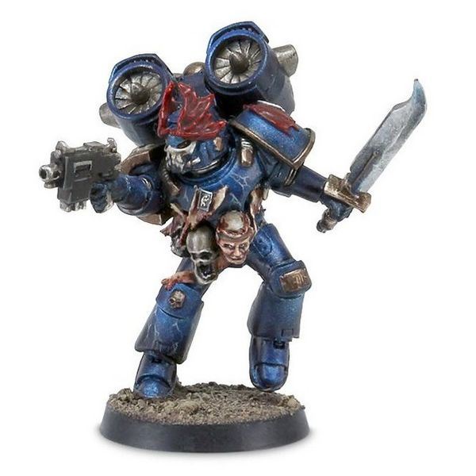

# 0539 午夜猛禽 Night Raptor

精校状态：中文行文已逐段精校，部分术语仍为暂定

分类：概念

原文来源：https://www.bilibili.com/opus/1031034705037754376

原作者：帝国神选罐头

原文时间：2025年02月07日 10:21

[返回分类目录](目录.md) · [全书目录](../../目录.md)

<!-- A0539-B0001 -->
**英文原文**

Night Raptors were specialized fast attack infantry of the Night Lords during the Horus Heresy and Great Crusade.

<!-- /A0539-B0001 -->

<!-- A0539-B0002 -->

原译文

午夜猛禽是大远征和荷鲁斯叛乱期间午夜领主的专业快速攻击步兵

**校订译文**

午夜猛禽是大远征与荷鲁斯之乱时期午夜领主的特种快速突击步兵。

<!-- /A0539-B0002 -->

<!-- A0539-B0003 -->
**英文原文**

The Night Raptors were a caste apart from the rest of their legion - not so much a martial elite as a bloody coterie of murderers unified by similar proclivities of terror and warfare. The Night Raptors were equipped with Jump Packs and an array of close combat weapons, all of which they utilized to bring obscene savagery down on their foes in overwhelming onslaughts.

<!-- /A0539-B0003 -->

<!-- A0539-B0004 -->

原译文

午夜猛禽是一个与其他军团不同的等级，与其说是一个军事精英，不如说是一群由类似的恐惧和战争倾向团结在一起的血腥杀人犯。午夜猛禽配备了跳跃背包和一系列近战武器，所有这些武器都被用来在压倒性的攻击中给敌人带来骇人听闻的野蛮行径。

**校订译文**

午夜猛禽在本军团内自成一群。与其说他们是军事精英，不如说是一伙嗜血杀人者，因对恐怖与战争有着相似嗜好而聚集。他们配备跳跃背包和各式近战武器，以压倒性的突击将骇人的残暴倾泻到敌人头上。

**校注：** apart from the rest of their legion是与本军团其余成员不同，原译错作其他军团。

<!-- /A0539-B0004 -->

<!-- A0539-B0005 图片 -->

<!-- A0539-B0006 -->

原译文

Night Raptor 午夜猛禽

**校订译文**

Night Raptor 午夜猛禽

<!-- /A0539-B0006 -->

<!-- A0539-B0007 -->
**英文原文**

Where the Night Lords wielded terror as a weapon, the Night Raptors rejected all subtlety in favor of bloody direct assaults. They found bleak joy in soaring above the battlefield and swooping down like screaming predators. Like many of the Legion's elite, they adorned their armor with grisly trophies and utilized advanced systems to project images of death upon its surface. These images normally depicted the doom of the Night Lords past victims in an eternal loop, amusing the wearer and stunning the target.

<!-- /A0539-B0007 -->

<!-- A0539-B0008 -->

原译文

在午夜领主将恐怖作为武器的地方，午夜猛禽拒绝了所有巧妙方法，转而支持血腥的直接攻击。他们在战场上空翱翔，像尖叫的捕食者一样俯冲下来，找到了阴冷的喜悦。与军团的许多精英一样，他们用可怕的战利品装饰盔甲，并利用先进的系统在盔甲表面投射死亡图像。这些图像通常描绘了午夜领主在永恒的循环中击败受害者的厄运，让佩戴者感到有趣，并让目标感到震惊。

**校订译文**

午夜领主惯以恐怖为武器，午夜猛禽却摒弃一切含蓄手法，只钟情血腥的正面突击。他们以翱翔战场上空、如尖啸的掠食者般俯冲而下为阴暗的乐趣。与军团中许多精英一样，他们用可怖的战利品装饰护甲，还借先进系统在甲面投射死亡影像。这些影像通常不断循环播放过往受害者的惨死，让穿戴者取乐，也让眼前的敌人惊骇失神。

**校注：** in an eternal loop指影像循环播放，不是受害者在循环中被杀；明确投射的是过去受害者的下场。

<!-- /A0539-B0008 -->

本篇核心术语与暂定项

以下列出本篇出现的英文原形及核心术语表用词。同形词可能指不同对象，具体词义以本篇正文和校注为准；单复数、别名和仅见于图注的名称可能尚未列入。完整候选见[术语表](../../术语表/双语术语候选.csv)。

| 英文 | 采用中文 | 状态 |
| --- | --- | --- |
| Horus Heresy | 荷鲁斯之乱 | 官方已核对 |
| Night Lords | 午夜领主 | 暂定·官方待核 |
| Great Crusade | 大远征 | 暂定·官方待核 |
| Horus | 荷鲁斯 | 暂定·官方待核 |
| Raptors | 猛禽 | 暂定·官方待核 |
| Predators | 掠食者 | 暂定·官方待核 |
| Night Raptors | 午夜猛禽 | 暂定·官方待核 |

