# 0540 XII - 吞世者 World Eaters

精校状态：中文行文已逐段精校，部分术语仍为暂定

分类：概念

原文来源：https://www.bilibili.com/opus/1098549580905054216

原作者：帝国神选罐头

原文时间：2025年08月08日 08:53

[返回分类目录](目录.md) · [全书目录](../../目录.md)

<!-- A0540-B0001 -->
**英文原文**

The World Eaters, originally known as the War Hounds, were the XII Legion of the original twenty Space Marine Legions. Their Primarch is Angron, sometimes known as The Lord of the Red Sands or the Red Angel. The Legion was amongst the first to turn traitor during the Horus Heresy. Already known for their peerless martial savagery - thanks in part to the effects of the psycho-surgical implants known as the Butcher's Nails that most of their members possessed - the World Eaters would eventually devolve into a legion of blood-crazed maniacs dedicated to the Chaos God Khorne, glorying in violence and slaughter and with no other purpose than spilling blood and taking skulls in the name of their god. After the catastrophic Battle of Skalathrax, they were scattered into disparate warbands, and have rarely fought as a unified Legion since.

<!-- /A0540-B0001 -->

<!-- A0540-B0002 -->

原译文

吞世者，最初被称为战犬，是最初的二十个星际战士军团中的第十二军团。他们的原体是安格隆，有时被称为红沙之主或红天使。在荷鲁斯叛乱期间，军团是第一批叛变的人之一。吞世者以其无与伦比的军事野蛮而闻名，部分原因是他们大多数成员所拥有的被称为屠夫之钉的灵能外科植入物的影响，他们最终会演变成一个致力于混沌之神恐虐的疯狂的鲜血军团，在暴力和屠杀中沾沾自喜，除了以他们的神的名义流血和夺取颅骨外，没有其他目的。在灾难性的斯卡拉特拉克斯之战之后，他们分散成不同的战帮，自那以后很少作为一个统一的军团作战。

**校订译文**

吞世者最初名为战犬，是二十支原始星际战士军团中的第十二军团。其原体为安格隆，又称红沙之主或红天使。军团是荷鲁斯之乱中最早叛变的部队之一。他们原已以无可匹敌的狂暴杀戮著称，部分原因就在于多数成员都植入了名为屠夫之钉的精神外科装置。后来，军团彻底沦为崇奉混沌神恐虐的嗜血狂徒，以暴力和屠杀为荣，除以血神之名流血、夺颅外再无其他目标。灾难性的斯卡拉特拉克斯之战后，他们分裂成互不统属的战帮，此后鲜少以完整军团的形式作战。

**校注：** psycho-surgical指影响心理与行为的外科改造，不等于灵能。屠夫之钉统一描述为精神外科装置。

<!-- /A0540-B0002 -->

<!-- A0540-B0003 -->
**英文原文**

Alongside the Space Wolves their warriors are some of the deadliest close combat fighters in the galaxy, amongst whom are counted large numbers of the infamous Khorne Berserkers.

<!-- /A0540-B0003 -->

<!-- A0540-B0004 -->

原译文

除了太空野狼，他们的战士也是银河系中最致命的近战战士，其中包括大量声名狼藉的恐虐狂战士。

**校订译文**

吞世者与太空野狼并列银河最致命的近战战士之列，其中有大量臭名昭著的恐虐狂战士。

<!-- /A0540-B0004 -->

<!-- A0540-B0005 图片 -->
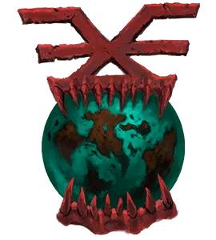

<!-- A0540-B0006 图片 -->
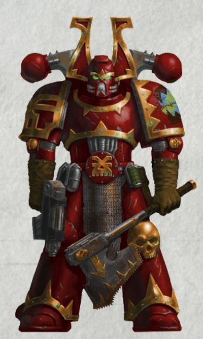

<!-- A0540-B0007 -->
**英文原文**

Legion Number:XII

<!-- /A0540-B0007 -->

<!-- A0540-B0008 -->

原译文

军团编号：XII

**校订译文**

军团编号：XII

<!-- /A0540-B0008 -->

<!-- A0540-B0009 -->
**英文原文**

Primarch:Angron

<!-- /A0540-B0009 -->

<!-- A0540-B0010 -->

原译文

原体：安格隆

**校订译文**

原体：安格隆

<!-- /A0540-B0010 -->

<!-- A0540-B0011 -->
**英文原文**

Homeworld:Bodt (de facto)

<!-- /A0540-B0011 -->

<!-- A0540-B0012 -->

原译文

家园世界：博德特（事实上）

**校订译文**

母星：博德特（事实上的军团母星）。

<!-- /A0540-B0012 -->

<!-- A0540-B0013 -->
**英文原文**

Current Base:None. Scattered since the Battle of Skalathrax.

<!-- /A0540-B0013 -->

<!-- A0540-B0014 -->

原译文

当前基地：无。斯卡拉特拉克斯之战后分散。

**校订译文**

当前基地：无。斯卡拉特拉克斯之战后分散。

<!-- /A0540-B0014 -->

<!-- A0540-B0015 -->
**英文原文**

Chaos Affiliation:Khorne

<!-- /A0540-B0015 -->

<!-- A0540-B0016 -->

原译文

混沌隶属：恐虐

**校订译文**

混沌隶属：恐虐

<!-- /A0540-B0016 -->

<!-- A0540-B0017 -->
**英文原文**

Colours:Blood red with brass (formerly white and blue)

<!-- /A0540-B0017 -->

<!-- A0540-B0018 -->

原译文

颜色：血红配黄铜（以前是白色和蓝色）

**校订译文**

颜色：血红配黄铜（以前是白色和蓝色）

<!-- /A0540-B0018 -->

<!-- A0540-B0019 -->
**英文原文**

Specialty:Close Combat, Berzerkers

<!-- /A0540-B0019 -->

<!-- A0540-B0020 -->

原译文

专业：近战格斗，狂战士

**校订译文**

专长：近战、狂战士作战。

<!-- /A0540-B0020 -->

<!-- A0540-B0021 -->
**英文原文**

Battle Cry:Blood for the Blood God!,often followed by Skulls for the Skull Throne!

<!-- /A0540-B0021 -->

<!-- A0540-B0022 -->

原译文

战吼：血祭血神！，经常紧随其后的是颅献颅座！

**校订译文**

战吼：“血祭血神！”常接以“颅献颅座！”。

<!-- /A0540-B0022 -->

<!-- A0540-B0023 -->
**英文原文**

Known Warbands:

<!-- /A0540-B0023 -->

<!-- A0540-B0024 -->

原译文

著名战帮

**校订译文**

著名战帮

<!-- /A0540-B0024 -->

<!-- A0540-B0025 -->

原译文

66th Armoured Company 第66装甲连队

**校订译文**

66th Armoured Company 第66装甲连队

<!-- /A0540-B0025 -->

<!-- A0540-B0026 -->

原译文

Angron's Chosen 安格隆亲选

**校订译文**

Angron's Chosen 安格隆亲选

<!-- /A0540-B0026 -->

<!-- A0540-B0027 -->

原译文

The Anointed 受膏者

**校订译文**

The Anointed 受膏者

<!-- /A0540-B0027 -->

<!-- A0540-B0028 -->

原译文

Axes of the Forge 铸炉之斧

**校订译文**

Axes of the Forge 铸炉之斧

<!-- /A0540-B0028 -->

<!-- A0540-B0029 -->
**英文原文**

Ba'ar Zul's Cleavers, Berserkers of Skallathrax, Blood Hounds, Blood Legion of Khorne, Bloody Dawn, Bloodgorged, Bloodstalkers, Bonescar, Brazen Butchers, The Butcherhorde

<!-- /A0540-B0029 -->

<!-- A0540-B0030 -->

原译文

巴’尔·祖尔的砍刀，斯卡拉特拉克斯狂战士，血犬，恐虐鲜血军团，血腥黎明，饱食鲜血，鲜血追猎者，骨疤，黄铜屠夫，屠夫部落

**校订译文**

巴’尔·祖尔的劈斩者、斯卡拉特拉克斯狂战士、血犬、恐虐鲜血军团、血腥黎明、饱食鲜血、鲜血追猎者、骨疤、黄铜屠夫、屠夫部落。

**校注：** Cleavers在战帮称号中指持刀劈斩的战士，原砍刀仅指器具；暂定劈斩者。

<!-- /A0540-B0030 -->

<!-- A0540-B0031 -->
**英文原文**

Canos Devoratores, Crimson Desecrators, The Crimson Fangs, The Crimson Covenant, Crushers of Bone

<!-- /A0540-B0031 -->

<!-- A0540-B0032 -->

原译文

卡诺斯吞噬者、深红亵渎者、深红獠牙、深红盟约、碎骨者

**校订译文**

卡诺斯吞噬者、深红亵渎者、深红獠牙、深红盟约、碎骨者

<!-- /A0540-B0032 -->

<!-- A0540-B0033 -->

原译文

Dhorngar's Goredrinkers 霍恩加尔的饮血者

**校订译文**

Dhorngar's Goredrinkers 霍恩加尔的饮血者

<!-- /A0540-B0033 -->

<!-- A0540-B0034 -->

原译文

Eight Sons 八子

**校订译文**

Eight Sons 八子

<!-- /A0540-B0034 -->

<!-- A0540-B0035 -->
**英文原文**

Fifteen Fangs, Fire Riders, The Foresworn

<!-- /A0540-B0035 -->

<!-- A0540-B0036 -->

原译文

十五獠牙，火焰骑手，弃誓者

**校订译文**

十五獠牙，火焰骑手，弃誓者

<!-- /A0540-B0036 -->

<!-- A0540-B0037 -->
**英文原文**

Garazak's Skullreapers, Gladiator Cadre 331, Gladiator Group 138, Goghur's Chosen, Gorehunters

<!-- /A0540-B0037 -->

<!-- A0540-B0038 -->

原译文

加拉扎克的颅骨收割者，角斗士干部331，角斗士队138，戈古尔亲选，凝血猎手

**校订译文**

加拉扎克的颅骨收割者、第 331 角斗士骨干队、第 138 角斗士群、戈古尔亲选、凝血猎手。

**校注：** Cadre不是政务干部；沿510第331角斗士骨干队，Group另为第138角斗士群。

<!-- /A0540-B0038 -->

<!-- A0540-B0039 -->
**英文原文**

Horkrax's Elect, Hound's Jaws

<!-- /A0540-B0039 -->

<!-- A0540-B0040 -->

原译文

霍克拉克斯之选，猎犬之颚

**校订译文**

霍克拉克斯之选，猎犬之颚

<!-- /A0540-B0040 -->

<!-- A0540-B0041 -->

原译文

Khar-Zhal's Desecrators 卡尔-兹哈尔的亵渎者

**校订译文**

Khar-Zhal's Desecrators 卡尔-兹哈尔的亵渎者

<!-- /A0540-B0041 -->

<!-- A0540-B0042 -->
**英文原文**

Lifeslayers, Lord Skchalick's Elite

<!-- /A0540-B0042 -->

<!-- A0540-B0043 -->

原译文

生命屠杀者，斯卡尔利克领主的精英

**校订译文**

生命屠杀者，斯卡尔利克领主的精英

<!-- /A0540-B0043 -->

<!-- A0540-B0044 -->
**英文原文**

Magore's Fiends, Maws of the Arena, Murder Bringers

<!-- /A0540-B0044 -->

<!-- A0540-B0045 -->

原译文

玛戈雷的魔鬼，竞技场之喉，谋杀使者

**校订译文**

玛戈雷的魔鬼，竞技场之喉，谋杀使者

<!-- /A0540-B0045 -->

<!-- A0540-B0046 -->

原译文

Pistonhand's Daemoniforge 活塞之手的恶魔熔炉

**校订译文**

Pistonhand's Daemoniforge 活塞之手的恶魔熔炉

<!-- /A0540-B0046 -->

<!-- A0540-B0047 -->

原译文

The Ravagers 掠夺者

**校订译文**

The Ravagers 掠夺者

<!-- /A0540-B0047 -->

<!-- A0540-B0048 -->
**英文原文**

Scalpers of Skalathrax, The Sanctified, Skull-blessed, Skullhunt, Skulltakers, Skull Takers of Hans Kho'ren, Sons of Skalathrax

<!-- /A0540-B0048 -->

<!-- A0540-B0049 -->

原译文

斯卡拉特拉克斯贩子，神圣者，受祝颅骨，猎颅者，夺颅者，汉斯·科’伦的夺颅者，斯卡拉特拉克斯之子

**校订译文**

斯卡拉特拉克斯剥头皮者、神圣者、受祝颅骨、猎颅者、夺颅者、汉斯·科’伦的夺颅者、斯卡拉特拉克斯之子。

**校注：** Scalpers在此是剥取头皮的杀手，不是转售商贩。

<!-- /A0540-B0049 -->

<!-- A0540-B0050 -->
**英文原文**

The Tide, Thralls of the Eightfold Cog

<!-- /A0540-B0050 -->

<!-- A0540-B0051 -->

原译文

潮汐，八重齿轮之奴

**校订译文**

潮汐，八重齿轮之奴

<!-- /A0540-B0051 -->

<!-- A0540-B0052 -->
**英文原文**

Viscerati, Voidbutchers

<!-- /A0540-B0052 -->

<!-- A0540-B0053 -->

原译文

脏器，虚空屠夫

**校订译文**

脏器，虚空屠夫

<!-- /A0540-B0053 -->

<!-- A0540-B0054 -->
**英文原文**

Witchcleavers, Wrathful Dead

<!-- /A0540-B0054 -->

<!-- A0540-B0055 -->

原译文

女巫砍刀，愤怒死亡

**校订译文**

斩巫者、愤怒亡者。

**校注：** Witchcleavers沿510斩巫者，无根据不限定只杀女巫；Wrathful Dead为死者群体。

<!-- /A0540-B0055 -->

<!-- A0540-B0056 -->
## History 历史

<!-- /A0540-B0056 -->

<!-- A0540-B0057 -->
### The Great Crusade 大远征

<!-- /A0540-B0057 -->

<!-- A0540-B0058 -->
### Formation 形成

<!-- /A0540-B0058 -->

<!-- A0540-B0059 -->
**英文原文**

The Twelfth Legion was formed on Terra, from no particular geographic recruiting ground. Fragmentary records do suggest, however, that during the formation process of the legion, an experimental screening process may have resulted in the initial intakes being formed from the most aggressive and competitive of candidates. While this cannot be confirmed with certainty, early records of the Legion do note that it was considered a highly aggressive, hot-blooded, and savage force.

<!-- /A0540-B0059 -->

<!-- A0540-B0060 -->

原译文

第十二军团是在泰拉上成立的，没有特定的地理招募地。然而，零散的记录确实表明，在军团的组建过程中，一个实验性的筛选过程可能导致最初的录取对象是最具攻击性和竞争力的候选人。虽然这不能得到肯定的证实，但军团的早期记录确实指出，它被认为是一支极具侵略性、热血和野蛮的部队。

**校订译文**

第十二军团组建于泰拉，没有特定的地域兵源。零散记录表明，军团建立时可能采用过一种实验性筛选程序，使首批入选者成为候选人中最具攻击性、最好胜的一群。此说尚无法确证，但早期记录的确将该军团描述为极具进攻性、热血而野蛮的部队。

<!-- /A0540-B0060 -->

<!-- A0540-B0061 图片 -->
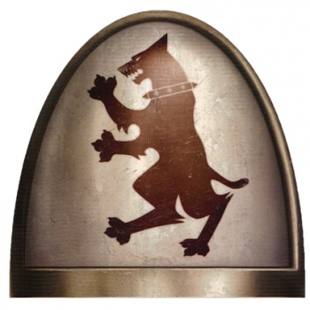

<!-- A0540-B0062 -->

原译文

Great Crusade era War Hounds shoulderpad 大远征时期战犬肩甲

**校订译文**

Great Crusade era War Hounds shoulderpad 大远征时期战犬肩甲

<!-- /A0540-B0062 -->

<!-- A0540-B0063 -->
**英文原文**

The nascent, relatively small Legion was deployed in the Unification Wars, their first recorded engagement being the Sa'afrik Liberation. However, for reasons unknown, after their initial battles they were largely held in the Imperial reserve right through the rest of Terran Unification and even throughout the conquest of the Sol System. While the true reasons for this withdrawal from the front-lines are unknown, one suggested reason was that they were simply kept off the board in case a sudden mishap in the Imperial campaigns resulted in a need for swift, fresh reinforcement. Another, more whispered proposed reason, is that they were deliberately held in check in case any disloyalty among the Emperor's troops emerged, and needed to be quickly ended.

<!-- /A0540-B0063 -->

<!-- A0540-B0064 -->

原译文

新生的、相对较小的军团被部署在统一战争中，他们的第一次有记录的交战是萨’弗里克解放。然而，由于未知的原因，在他们最初的战斗之后，他们在整个泰拉统一时期，甚至在整个征服太阳系的过程中，大部分都被安置在帝国保留地。虽然从前线撤军的真正原因尚不清楚，但一个可能的原因是，他们只是被排除在外，以防帝国战役中突然发生意外，需要迅速、新的增援。另一个更为隐秘的原因是，他们被故意控制住了，以防帝皇的军队出现任何不忠行为，需要迅速结束。

**校订译文**

新成立的军团规模尚小，曾参与统一战争，第一场有记录的战斗是萨’弗里克解放。然而，在最初几场战斗之后，他们便因不明原因，大体被留作帝国预备队，贯穿泰拉统一的剩余阶段乃至太阳系征服全程。撤离前线的真正原因不详。一种解释认为，帝国需要保留一支生力军，以便战事突生变故时迅速增援；另一种私下流传的说法则认为，他们是专门留下的制衡力量，一旦帝皇的其他军队显露不忠，就能立即将其镇压。

**校注：** reserve是预备队，不是帝国保留地；两种解释均保持未证实语气。

<!-- /A0540-B0064 -->

<!-- A0540-B0065 -->
**英文原文**

Nonetheless, the Legion continued to grow and determinedly train for war. This dedication, as well as their savage and tenacious demeanour during the few times they were deployed in combat during this period, reportedly led to the Emperor himself dubbing the XII Legion as his War Hounds. In prideful recognition of this honour, the Twelfth adopted a red hound as their insignia.

<!-- /A0540-B0065 -->

<!-- A0540-B0066 -->

原译文

尽管如此，军团仍在继续壮大，并坚定地为战争进行训练。据报道，这种奉献精神，以及他们在此期间被部署在战斗中的几次野蛮和顽强的行为，导致帝皇亲自将第十二军团称为他的战犬。为了自豪地承认这一荣誉，第十二军团采用了一只红色猎犬作为他们的徽章。

**校订译文**

尽管如此，军团仍不断扩张，刻苦备战。据说，他们的专注，以及这一时期少数几次作战中展现的凶猛顽强，让帝皇亲自称第十二军团为自己的“战犬”。军团为此深感自豪，采用红色猎犬作为徽记，以彰显这份荣誉。

<!-- /A0540-B0066 -->

<!-- A0540-B0067 -->
### Combat Disposition and Record 作战部署和记录

<!-- /A0540-B0067 -->

<!-- A0540-B0068 -->
**英文原文**

Like most Space Marine Legions, the combat disposition of the legion altered upon the discovery of their Primarch. Although, for the Twelfth Legion, this was both a relatively minor and massively damning alteration at one and the same time.

<!-- /A0540-B0068 -->

<!-- A0540-B0069 -->

原译文

与大多数星际战士军团一样，军团的战斗部署在发现他们的原体后发生了变化。虽然，对于第十二军团来说，这既是一个相对较小的改变，也是一个巨大的毁灭性改变。

**校订译文**

如同多数星际战士军团，第十二军团在寻回原体后改变了作战方式。但对他们而言，这种改变在某些方面虽小，却同时带来了灾难性的深远后果。

<!-- /A0540-B0069 -->

<!-- A0540-B0070 -->
### The Early Crusade 远征早期

<!-- /A0540-B0070 -->

<!-- A0540-B0071 -->
**英文原文**

The War Hounds were finally unleashed as a legion force partly by circumstance. The Imperial colony on Cerberus rose up in rebellion, and it quickly became apparent that Space Marine forces were needed to quell the insurrection. The Great Crusade having begun, most of the Space Marine Legions had already been assigned to Expedition Fleets and sent out into the wider galaxy. The Emperor was therefore minded to activate the War Hounds, sending them to Cerberus personally, with instructions to carry his wrath to those that defied him. Cerberus was invaded at 0300 hours Terran; the all-clear signal was transmitted by the War Hounds' commander at 0808. When asked how many prisoners were waiting to be processed, the War Hounds' commander replied that he had not been ordered to take any. Attached Imperial Army troops, sent into Cerberus in the aftermath, reported discovering scenes of shocking butchery and indication of massive casualties, on both sides.

<!-- /A0540-B0071 -->

<!-- A0540-B0072 -->

原译文

战犬最终被释放为军团力量，部分原因是环境。刻耳柏洛斯上的帝国殖民地爆发了叛乱，很快就很明显，需要星际战士来平息叛乱。大远征已经开始，大多数星际战士已经被分配到远征舰队，并被派往更广阔的星系。因此，帝皇打算激活战犬，亲自将它们送到刻耳柏洛斯，并指示将他的愤怒带给那些反抗他的人。刻耳柏洛斯于0300泰拉时被入侵；0808，战犬指挥官发出了解除警报的信号。当被问及有多少囚犯等待处理时，战犬的指挥官回答说，他没有接到任何命令。随后被派往刻耳柏洛斯的附属帝国军队报告称，双方都发现了令人震惊的屠杀场面和大规模伤亡的迹象。

**校订译文**

战犬最终得以整军出动，部分是时势使然。刻耳柏洛斯的帝国殖民地爆发叛乱，很快便显出必须动用星际战士才能平息。此时大远征已经开始，多数军团已编入远征舰队，驶向更广阔的银河。帝皇于是亲自下令启用战犬，将其派往刻耳柏洛斯，把自己的怒火带给违抗者。部队于泰拉时间03:00发动进攻，至08:08，战犬指挥官便传回肃清信号。有人询问有多少俘虏待处理，他回答：“我没有接到留俘虏的命令。”事后进入当地的配属帝国军报告称，现场屠杀惨状触目惊心，种种迹象显示交战双方都伤亡惨重。

**校注：** not ordered to take any的any指俘虏，原译漏宾语，错误变成没有接到任何命令。

<!-- /A0540-B0072 -->

<!-- A0540-B0073 图片 -->
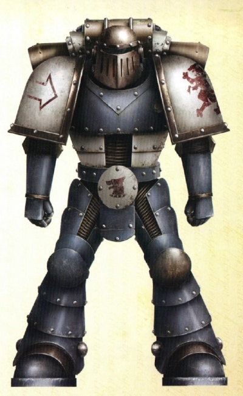

<!-- A0540-B0074 -->

原译文

War Hounds legionary 战犬军团士兵

**校订译文**

War Hounds legionary 战犬军团士兵

<!-- /A0540-B0074 -->

<!-- A0540-B0075 -->
### The Bloody 13th 血腥十三

<!-- /A0540-B0075 -->

<!-- A0540-B0076 -->
**英文原文**

As the Great Crusade progressed, the XIIth Legion was split into a number of independent commands, each many thousands of Space Marines strong. These detachments were notionally used as reserve elements for other Crusade forces, but are in fact recorded as being used as front-line assault troops in many successful campaigns, fighting alongside brother legions such as the First Legion, the Iron Warriors and the Space Wolves. Additionally, War Hounds reserves would be sent in to provide a killing edge to various Imperial Army formations in troublesome war-zones. These deployments created the reputation of the War Hounds; they became known Crusade-wide as vicious shock-troops, whose actions were not without cost. It was said that a War Hounds deployment had only two outcomes; glorious, victorious slaughter...or just slaughter. Additionally, rumours began to circulate that the War Hounds were intemperate with all those who stood in their path, friend and foe alike. Stories of the legion culling human regiments whose performance they found wanting began to spread. The truth of these rumours could not easily be determined; the War Hounds deliberately kept their distance from other Legiones Astartes elements where possible. The only definite fact noted about the legion during this time was that they possessed an unusually harsh code of internal discipline, necessitated apparently by their own fractious nature.

<!-- /A0540-B0076 -->

<!-- A0540-B0077 -->

原译文

随着大远征的推进，第十二军团被分成了许多独立的指挥，每个指挥都有数千名星际战士。这些分遣队名义上被用作其他远征的预备役部队，但事实上被记录为在许多成功的战役中被用作前线突击部队，与第一军团、钢铁勇士和太空野狼等兄弟军团并肩作战。此外，将派遣战犬预备队，为麻烦战区的各种帝国陆军编队提供杀伤优势。这些部署创造了战犬的声誉；他们在远征中被称为恶毒的突击部队，他们的行动并非没有代价。据说，部署战犬只有两个结果；光荣而胜利的屠杀…或者只是屠杀。此外，谣言开始流传，说猎犬对所有挡在他们面前的人，无论是朋友还是敌人，都大发雷霆。军团扑杀表现不佳的人类兵团的故事开始流传开来。这些谣言的真相很难确定；在可能的情况下，战犬故意与其他军团成员保持距离。在此期间，关于军团唯一明确的事实是，他们拥有异常严厉的内部纪律，这显然是由于他们自己的暴躁脾气所必需的。

**校订译文**

随着大远征推进，第十二军团拆分为多个独立指挥的部队，各有数千名星际战士。名义上，它们是其他远征部队的预备队；实际记录却显示，他们在许多胜利战役中充当前线突击力量，与第一军团、钢铁勇士、太空野狼等兄弟军团并肩作战。战犬也会增援困境中的帝国军，为其提供致命的突击力量。这些部署奠定了战犬的恶名：他们是整个远征军熟知的凶悍突击部队，而其战果总伴随沉重代价。据说，动用战犬只有两种结局——光荣而胜利的屠杀，或仅仅是屠杀。传闻还称，他们对一切挡路者都毫无节制，不分敌我；有些人类兵团仅因表现未达其要求，就遭到杀戮。这些传言难以核实，因为战犬总尽可能与其他阿斯塔特军团保持距离。这一时期唯一确切的记载，是他们执行着异常严苛的内部纪律，似乎必须如此，才能压制本军团争斗不休的天性。

<!-- /A0540-B0077 -->

<!-- A0540-B0078 -->
**英文原文**

The principal concentration of War Hounds astartes (around 8,000 Legionaries) had been grouped into the 13th Expeditionary Fleet, alongside dedicated support and naval elements. As the Crusade wore on and the various Legions grew in size to the point where they no longer needed a standing reserve reinforcement force, the scattered units of War Hounds were consolidated into the 13th Fleet, upon the legion muster-world of Bodt. Added to the 13th were many other Imperial forces, especially those who had similarly dark or questionable reputations for violence, particularly Feral World and Abhuman troops. Notable additions to the 13th were the Titans of Legio Audax and the warriors of the Numen Gun Clans, both powerful elements whose conduct had fallen under a pall of suspicion and distrust. It is believed this particular grouping was a deliberate choice by the War Council to corral into one force all the Imperial elements which had shown a tendency to cause massive destruction and loss of enemy life during their campaigns, so that the Imperium had a formation at hand that could be deployed where the total annihilation of the enemy and their works was desired. The war record of all of these various forces led to the 13th Expeditionary Fleet becoming known as "The Bloody 13th" in various Imperial circles.

<!-- /A0540-B0078 -->

<!-- A0540-B0079 -->

原译文

主要集中的战犬（约8000名军团士兵）与专门的支援和海军部队一起被编入第13远征舰队。随着远征的进行，各军团的规模越来越大，不再需要常备后备增援部队，分散的战犬部队被整合到第13舰队，在博德特的军团集结世界。除了13，还有许多其他帝国军队，尤其是那些在暴力方面有着类似黑暗或可疑声誉的军队，特别是蛮荒世界和亚人军队。第13远征舰队中值得注意的新增成员是莽勇军团的泰坦和努曼枪炮氏族的战士，这两支强大的部队的行为都笼罩在怀疑和不信任的阴影之下。据信，这种特殊的分组是战争议会的一个深思熟虑的选择，将所有在战役中表现出造成大规模破坏和敌人生命损失倾向的帝国分子集中到一支部队中，这样帝国就有了一个可以部署在需要彻底消灭敌人及其造物的地方的编队。所有这些不同部队的战争记录导致第13远征舰队在帝国各界被称为“血腥13”。

**校订译文**

战犬最集中的主力约有八千名军团战士，与专属支援和海军力量一起编入第十三远征舰队。随着各军团不断扩大，不再需要常设的后备增援力量，散布各地的战犬便返回军团集结世界博德特，整编至第十三舰队。许多其他帝国部队也被调来，尤其是那些同样因暴力而声名狼藉、行为备受质疑的部队，包括蛮荒世界战士与亚人。莽勇军团的泰坦、努曼枪炮氏族的战士便是其中两支强大力量，它们的行为都曾招致猜疑与不信任。据认为，这是战争议会刻意作出的安排：将容易造成巨大破坏和敌军惨重伤亡的力量集中起来，以备帝国需要将敌人及其一切彻底抹除时使用。各支部队的血腥战绩，使第十三远征舰队在帝国各界得到“血腥十三”的名号。

<!-- /A0540-B0079 -->

<!-- A0540-B0080 -->
**英文原文**

The Emperor is assembling a carnival of monsters for his amusement, although I doubt whoever he unleashes them upon will see the jest.

<!-- /A0540-B0080 -->

<!-- A0540-B0081 -->

原译文

帝皇正在召集一场怪物嘉年华作为他的消遣，尽管我怀疑无论他把它们释放在谁身上，都会看到笑话

**校订译文**

“帝皇正在召集一群怪物，供自己取乐。不过，无论他把它们放去对付谁，我都怀疑对方会觉得这有什么好笑。”

**校注：** 疑问针对受害者是否觉得好笑；原译反向成无论是谁都会看到笑话。

<!-- /A0540-B0081 -->

<!-- A0540-B0082 -->
**英文原文**

-Reportedly the Primarch Sanguinius, upon reviewing the muster rolls of the 13th Expeditionary Fleet

<!-- /A0540-B0082 -->

<!-- A0540-B0083 -->

原译文

-据传闻，原体圣吉列斯在审查第13远征舰队的召集名单时

**校订译文**

——据传为原体圣吉列斯审阅第十三远征舰队集结名册时所言。

<!-- /A0540-B0083 -->

<!-- A0540-B0084 -->
### The Eaters of Cities 吞城者

<!-- /A0540-B0084 -->

<!-- A0540-B0085 -->
**英文原文**

Angron, the primarch of the Twelfth, had been stranded on Nuceria, a technologically advanced planet with a poor and downtrodden population ruled over by an elite class of nobles. The most popular form of entertainment for the masses was gladiatorial duels between cyber-enhanced warriors, and destiny had it that one of the gladiator slavers would find the young Primarch. Angron was badly wounded when he was discovered, in one account surrounded by the corpses of native predators, in another surrounded by the bodies of xenos warriors. The young Angron survived his capture, and his first bouts in the gladiator pits. Initially thought of as a folly by his new masters, his unexpected prowess in the pits made them see him in a new light. As was the want on the world where the gladiators were concerned, they attempted to surgically and cybernetically enhance their slave. Angron's primarch nature meant that all of these attempts would fail; all except one. The Nucerian slavers were successful in implanting Angron with psycho-surgical devices known as the Butcher's Nails, devices which would enhance his aggression to truly super-human levels.

<!-- /A0540-B0085 -->

<!-- A0540-B0086 -->

原译文

第十二军团的原体安格隆被困在努凯里亚，这是一个技术先进的行星，人口贫穷，受压迫，由贵族精英阶层统治。大众最受欢迎的娱乐形式是智控增强战士之间的角斗士决斗，命运注定，其中一个角斗士奴隶会找到年轻的原体。安格隆被发现时受了重伤，一种说法是被当地掠食者的尸体包围，另一种说法则是被异型战士的尸体包围。年轻的安格隆在被捕后幸存下来，并在角斗士坑的第一场比赛中幸存下来。最初被他的新主人认为是愚蠢的，他在坑里出乎意料的实力让他们以新的眼光看待他。正如角斗士们所关心的世界一样，他们试图通过手术和智控来增强他们的奴隶。安格隆的原体本质意味着所有这些尝试都会失败；除了一个。努凯里亚奴隶主成功地为安格隆植入了被称为屠夫之钉的灵能外科植入物，这些装置将使他的攻击性提高到真正的超人水平。

**校订译文**

第十二军团原体安格隆流落在努凯里亚。这里技术先进，民众却贫困而备受压迫，由一小群贵族统治。机械强化战士之间的角斗，是大众最热衷的娱乐。一名贩卖角斗奴隶的奴隶主发现了年轻原体，当时安格隆已身负重伤：一种记载称，他周围全是本地掠食动物的尸体；另一种则称，是异形战士的尸体。他活过了被俘与最初几场角斗。新主人起先觉得收下他是个错误，却很快被他在竞技场中的惊人本领改变看法。奴隶主按照当地角斗界的惯例，试图以外科手术和机械改造增强他的力量。原体体质使这些尝试全部失败，只有一项例外：他们成功植入了称为屠夫之钉的精神外科装置，将他的攻击欲望增强到真正超人的程度。

**校注：** slaver是奴隶主，原误作角斗士奴隶。cyber-enhanced不是智控，以机械强化表述；两种发现现场记载均保留。

<!-- /A0540-B0086 -->

<!-- A0540-B0087 图片 -->
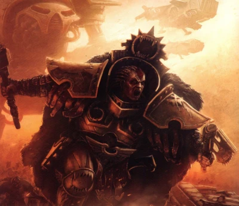

<!-- A0540-B0088 -->

原译文

Angron, the Lord of the Red Sands 安格隆，红沙之主

**校订译文**

Angron, the Lord of the Red Sands 安格隆，红沙之主

<!-- /A0540-B0088 -->

<!-- A0540-B0089 -->
**英文原文**

The discontented Angron plotted his escape for years, before finally leading his fellow gladiators in an armed revolt. A revolt doomed to fail, however, for the forces under the nobles vastly outnumbered the gladiator band. Although aware of this eventual doom, Angron refused to countenance any other course of action. His rebel force was eventually pursued into the mountains by no less than five armies, each outnumbering his own ten times or more. It was then that the Emperor - who had been secretly watching his son's actions with pride for some time - chose to intervene. Coming to Angron, he offered him his birthright; a place by his side. To the Emperor's surprise, Angron rejected the offer, instead choosing to remain and die by the side of his gladiator brethren. The Emperor would not accept this refusal, however, and the night before the final battle he teleported Angron from the field and to safety. Angron's followers - named the Eaters of Cities - were massacred to the last man and woman on the following morning.

<!-- /A0540-B0089 -->

<!-- A0540-B0090 -->

原译文

不满的安格隆策划了多年的逃亡，最终带领他的角斗士同伴进行了武装反抗。然而，一场注定要失败的起义，因为贵族统治下的军队远远超过了角斗士。尽管意识到这一最终的厄运，安格隆拒绝支持任何其他的行动过程。他的叛军最终被不少于五支军队追击到山区，每支军队的数量都是自己的十倍或更多。就在那时，帝皇 — 一段时间以来，他一直骄傲地秘密看着儿子的行为 — 选择了干预。来到安格隆面前，他给了他与生俱来的权利；他身边的一个位置。令帝皇惊讶的是，安格隆拒绝了这一提议，而是选择留下来，死在他的角斗士兄弟们身边。然而，帝皇不会接受这一拒绝，在最后一场战斗的前一天晚上，他将安格隆从战场传送到安全地带。第二天早上，安格隆的追随者 — 吞城者 — 被屠杀到最后一个男人和女人。

**校订译文**

不甘受奴役的安格隆筹划逃亡多年，终于率角斗士同伴武装起义。但贵族军队的人数远超起义者，失败几乎注定。即使知道结局，安格隆仍不肯选择别的道路。最终，不少于五支军队将他们追入山区，每支人数都至少是起义军的十倍。帝皇此前已秘密观察儿子一段时间，并为他的表现骄傲；此刻，他决定介入。他来到安格隆面前，许诺其与生俱来的地位：来到自己身边。令帝皇惊讶的是，安格隆拒绝了，宁愿留下与角斗士同伴共赴死。但帝皇不接受拒绝，在决战前夜将安格隆从战场传送至安全之地。次日清晨，名为吞城者的追随者们不分男女，尽数战死。

<!-- /A0540-B0090 -->

<!-- A0540-B0091 -->
**英文原文**

It is said he never forgave his father for the incident, and that the blow to his honour would eventually fester into a soul-deep wound. After Angron was spirited away by the Emperor, he was transferred to a vessel of the awaiting War Hounds. Unlike other meetings between primarchs and their legions, Angron's first contact with his genetic sons was one of extreme violence. Lost in an apparently inconsolable rage over what had just happened to him, Angron brutally murdered every legion officer of the War Hounds who attempted to speak to him, starting with their Legion Master, Gheer. As the War Hounds officers largely attempted to speak to him in order of seniority, their senior officer cadre diminished rapidly. Eventually, the 8th Captain - Khârn - was able to both survive his meeting with Angron, and in fact even forge a tenuous bond with him. When Angron emerged, ready and willing to assume command of his legion, Khârn introduced him to his officers with the phrase "Salute the one whose soldiers were named the Eaters of Cities". One of the officers, Captain Dreagher, issued a response that would result in an momentous occurrence.

<!-- /A0540-B0091 -->

<!-- A0540-B0092 -->

原译文

据说，他从未原谅过父亲的这一事件，对他荣誉的打击最终会溃烂成灵魂深处的伤口。安格隆被帝皇带走后，他被转移到一艘等待的战犬战舰上。与其他原体和他们的军团之间的会面不同，安格隆与他的子嗣的第一次接触是极端暴力的。安格隆对刚刚发生在他身上的事情感到非常愤怒，他残忍地杀害了每一位试图与他交谈的战犬军团军官，从他们的军团长盖尔开始。由于战犬的军官大多试图按资历顺序与他交谈，他们的高级军官队伍迅速减少。最终，第八连长卡恩在与安格隆的会面中幸存下来，事实上甚至与他建立了微弱的联系。当安格隆出现，准备并愿意接管他的军团时，卡恩用“向被称为吞城者的士兵致敬”这句话将他介绍给他的军官。其中一名军官德雷格尔连长做出了回应，这将导致一场重大事件。

**校订译文**

据说，安格隆从未原谅父亲。他认为荣誉受损，这份痛苦最终溃烂成深入灵魂的伤口。被强行带走后，他被转移到等候中的战犬舰船。与其他原体重逢军团的情景截然不同，安格隆与基因子嗣的初次相见充满极端暴力。刚遭逢的一切令他陷入无法安抚的狂怒；从军团长盖尔开始，凡试图上前交谈的战犬军官，都被他残忍杀死。军官们大体按资历依次求见，高层因而迅速凋零。最终，第八连长卡恩不仅活着结束了会面，还与安格隆建立了微弱的联系。安格隆终于走出，愿意接掌军团时，卡恩向其他军官介绍道：“向这位领袖致敬——他的战士，名为吞城者。”德雷格尔连长随即作出的回应，带来了一个意义重大的变化。

**校注：** 致敬对象是统领吞城者的安格隆，原译误作向吞城者士兵致敬。

<!-- /A0540-B0092 -->

<!-- A0540-B0093 -->
**英文原文**

"Primarch! General! Your warriors were eaters of cities, lord, but with you to command us the War Hounds will be eaters of worlds!"

<!-- /A0540-B0093 -->

<!-- A0540-B0094 -->

原译文

“原体！将军！大人，你的战士是城市的吞噬者，但有了你的命令，战犬将是世界的吞噬者！”

**校订译文**

“原体！将军！大人，您的战士曾是吞城者；但由您指挥我们，战犬便将成为吞世者！”

<!-- /A0540-B0094 -->

<!-- A0540-B0095 -->
**英文原文**

"World Eaters. World Eaters. So shall you be, then, little brothers. Come with me, then, World Eaters."

<!-- /A0540-B0095 -->

<!-- A0540-B0096 -->

原译文

“吞世者。吞世者。那么，小兄弟们，你们也一样。那么，吞世者们，跟我来。”

**校订译文**

“吞世者。吞世者……那么，你们就叫这个名字吧，我的小兄弟们。来吧，吞世者，跟我走。”

<!-- /A0540-B0096 -->

<!-- A0540-B0097 -->
**英文原文**

-Captain Dreagher of the War Hounds legion and Angron, their Primarch

<!-- /A0540-B0097 -->

<!-- A0540-B0098 -->

原译文

-战犬军团的德雷格尔连长和他们的原体安格隆

**校订译文**

-战犬军团的德雷格尔连长和他们的原体安格隆

<!-- /A0540-B0098 -->

<!-- A0540-B0099 -->
### The Eaters of Worlds 吞世者

<!-- /A0540-B0099 -->

<!-- A0540-B0100 -->
**英文原文**

After Angron assumed command of his newly-rechristened legion, they once again mustered upon the world of Bodt, where Angron took stock of his forces. Always possessed of the harshest self-inflicted training regimes in the Space Marine Legions, the World Eaters went to new lengths under Angron's direction, adopting fighting pits and gladiatorial combat into their doctrines. Each warrior who passed the new tests wore scars aplenty to show it. Those who failed did not live to try again. Whatever Terran martial traditions that existed in the War Hounds were erased by Angron's new gladiatorial ones, and by the time the Primarch led his World Eaters from Bodt under their new fanged maw symbol, the World Eaters had embraced Angron's own red code of savage competition and the butchery of the weak. However, Angron still refused to acknowledge his sons, and during their campaigns he ordered them to defeat each targeted world within 31 hours. This was the span of a single Nucerian day and the amount of time it had taken Angron and his army of slave rabble to score their greatest victory. Despite the brutality and even hatred Angron showed his legion, the World Eaters were committed to earning his respect. Meanwhile, Angron had ordered his Apothecarion, under Gahlan Surlak, to replicate his Butcher's Nails and implant the resultant creations into the brains of his legionaries. However, early on the process proved fatal to any marine who dared try to endure the process. Angron proved disgusted with his "weak" sons, and managed to flee to a feral world for two whole years before Kharn found him and convinced him to rejoin the Legion.

<!-- /A0540-B0100 -->

<!-- A0540-B0101 -->

原译文

在安格隆接管了他新更名的军团后，他们再次聚集在博德特世界，安格隆在那里清点了他的部队。吞世者一直拥有星际战士中最严厉的自我训练制度，在安格隆的指导下，他们走上了新的道路，将战斗坑和角斗士战斗纳入了他们的教义。每一个通过新测试的战士身上都有大量的伤疤来证明这一点。那些失败的人没有机会再试一次。存在于战犬中的泰拉军事传统被安格隆的新角斗士所抹去，当原体从博德特在他们新的尖牙符号下带领他的吞世者时，吞世者已经接受了安格隆的野蛮竞争和屠杀弱者的红色准则。然而，安格隆仍然拒绝承认他的子嗣，在他们的战役中，他命令他们在31小时内击败每个目标世界。这是一个努凯里亚一天的跨度，也是安格隆和他的奴隶乌合之众军队取得最大胜利所花费的时间。尽管安格隆的军团表现出了残暴甚至仇恨，但吞世者仍致力于赢得他的尊重。与此同时，安格隆命令他的药剂师加兰·苏拉克复制他的屠夫之钉，并将由此产生的造物植入他的军团士兵的大脑。然而，在早期，这一过程对任何敢于忍受这一过程的星际战士来说都是致命的。安格隆对他“软弱”的子嗣感到厌恶，并设法逃到一个蛮荒世界整整两年，直到卡恩找到他并说服他重新加入军团。

**校订译文**

军团改名并由安格隆接掌后，再次于博德特集结，供他检阅。吞世者原已拥有星际战士军团中最严苛的自我训练制度，如今更进一步，将斗坑与角斗纳入训练体系。通过考验者满身伤疤，失败者则无法活着再试。原有的泰拉军事传统被安格隆的角斗文化抹去。当他率军团自博德特启航、举起新的獠牙巨口徽记时，吞世者已接受了他的血色准则：残酷竞争，屠戮弱者。然而，安格隆仍不肯认可这些子嗣，命他们必须在三十一小时内征服每个目标世界。这正是努凯里亚一天的长度，也是他与奴隶起义军取得最伟大胜利所用的时间。尽管安格隆待他们残忍，甚至怀有憎恶，吞世者仍决心赢得他的尊重。与此同时，他命加兰·苏拉克领导的药剂师部门复制屠夫之钉，植入军团战士的大脑。但早期所有敢于尝试者都因此丧命。安格隆厌恶这些“软弱”的子嗣，逃往一处蛮荒世界，独自待了整整两年，才被卡恩找到并说服归队。

**校注：** 施加残忍和仇恨的主语是安格隆、对象为军团，原译反置。Apothecarion是由苏拉克领导的部门，非仅一人。

<!-- /A0540-B0101 -->

<!-- A0540-B0102 图片 -->
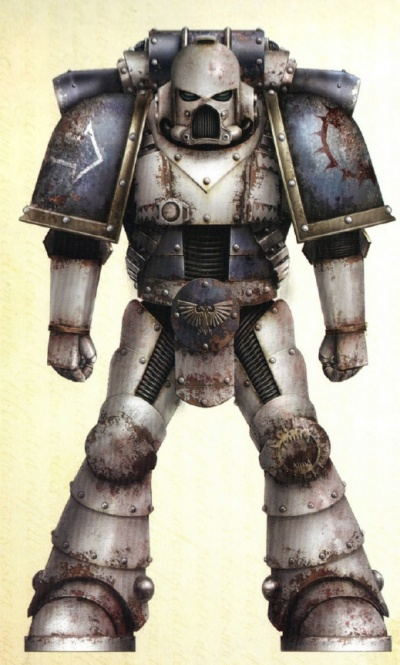

<!-- A0540-B0103 -->

原译文

World Eaters legionary 吞世者军团士兵

**校订译文**

World Eaters legionary 吞世者军团士兵

<!-- /A0540-B0103 -->

<!-- A0540-B0104 -->
**英文原文**

Time and time again the World Eaters failed to meet the 31 hour deadline and each time Angron demanded the punishment be decimation, forcing 1 of every 10 World Eaters to be killed by the other 9. After Centurion Mago refused to comply with decimation after the Ghenna Massacre, Angron was thrown into a bloody frenzy and massacred several World Eaters before being subdued by his own Librarians. The episode created a crisis within the Legion that saw Mago lead a revolt when Apothecary Gahlan Surlak announced that he had finally perfected a method for mass production of the Butcher's Nails within the Legion. However, the revolt failed, Mago was slain, and Kharn became the first World Eater to successfully endure the Nails. The result of almost an entire Space Marine Legion 'enhanced' with the aggression engines was seen during what became known as the Ghenna Massacre, an entire planetary population massacred in one night of unparalleled violence. While it is not known how many World Eaters escaped the mandatory nails, at least one, Endryd Haar, managed to do so.

<!-- /A0540-B0104 -->

<!-- A0540-B0105 -->

原译文

吞世者一次又一次地未能在31小时的最后期限前完成任务，每次安格隆要求的惩罚是抽杀，迫使每10名吞世者中就有1人被其他9人杀死。在根纳大屠杀后，百夫长马戈拒绝服从屠杀，安格隆陷入血腥的疯狂，屠杀了几名吞世者，然后被自己的智库制服。这一事件在军团内部引发了一场危机，当药剂师加兰·苏拉克宣布他终于完善了军团内大规模生产屠夫之钉的方法时，马戈领导了一场起义。然而，起义失败了，马戈被杀，卡恩成为第一个成功忍受钉子的吞世者。在后来被称为根纳大屠杀的事件中，几乎整个星际战士军团都被侵略引擎“增强”了，整个行星的人口在一个无与伦比的暴力之夜被屠杀。虽然尚不清楚有多少吞世者逃脱了强制性的钉子，但至少有一个人，恩德瑞德·哈尔，设法做到了。

**校订译文**

吞世者一次次未能在三十一小时内完成征服。每次安格隆都以十一抽杀惩罚：每十人中一人，须由其余九人亲手处死。根纳大屠杀后，百夫长马戈拒绝执行这一命令，安格隆随即狂怒，杀死数名吞世者，直到被本军团的智库员制服。这使军团陷入危机。当药剂师加兰·苏拉克宣布终于完善了屠夫之钉的量产技术时，马戈率众反抗，但起义失败，他也遭杀害。卡恩则成为首位成功承受钉子植入的吞世者。英文底稿随后又称，几乎全军团都以这类攻击性强化装置完成“增强”后，在名为根纳大屠杀的事件中，以空前暴力于一夜之间屠尽全星居民。究竟有多少战士避开了强制植入，尚不明确；至少恩德瑞德·哈尔成功做到了。

**校注：** 英文先称Ghenna Massacre发生后拒绝抽杀，后又称植钉成功的结果见于同名屠杀；先后关系存在矛盾。保留并指出原文差异，未依据设定记忆补造第二场事件。

<!-- /A0540-B0105 -->

<!-- A0540-B0106 -->
**英文原文**

Soon the World Eaters would become a byword for mass-scale slaughter and violence, their enemies not merely shot down or blasted to oblivion, but killed to a man in their streets and fortresses. Their legend for brutality became so strong that more than once non-compliant worlds would surrender at the threat of the World Eaters being unleashed upon them. Already a breed apart, Angron's legionaries began to be actively shunned by their fellow Space Marine Legions and spoken of in dread by those Imperial citizens who knew of their actions. The planets upon which the World Eaters fell were not merely crushed - they were destroyed utterly. This caused concern even among hardened Imperial Commanders, not least of whom was Primarch Roboute Guilliman of the Ultramarines, who decried the atrocities of Angron during the Cleansing of Ariggata. Eventually Leman Russ brought his Space Wolves to confront Angron, bringing word that the Emperor wanted the World Eaters to cease implanting themselves with aggression engines, and to further urge Angron to cease his massacres. What resulted was a brief but bloody confrontation between the World Eaters and Space Wolves, with Angron besting Russ in single combat but allowing himself to become encircled and doomed to be killed by Space Wolves in the process, if they so wished. When it became clear that Angron was a lost cause and did not understand that his own failure to lead resulted in him becoming entrapped, Russ ordered a withdrawal.

<!-- /A0540-B0106 -->

<!-- A0540-B0107 -->

原译文

很快，吞世者成为大规模屠杀和暴力的代名词，他们的敌人不仅被击倒或被炸得面目全非，而且在他们的街道和堡垒里被杀。他们的残暴传说变得如此强烈，以至于不止一次，不顺从的世界会在吞世者向他们释放的威胁下投降。安格隆的军团已经是一个与众不同的品种，他们开始被他们的星际战士同伴积极回避，并被那些知道他们行为的帝国公民恐惧地谈论。吞世者打下的行星不仅被摧毁，而且被彻底摧毁。这甚至引起了冷漠的帝国指挥官的担忧，其中最重要的是极限战士的原体罗伯特·基里曼，他谴责了安格隆在阿里加塔清洗期间的暴行。最终，黎曼·鲁斯带着他的太空野狼来对抗安格隆，带来了帝皇希望吞世者停止植入侵略引擎的消息，并进一步敦促安格隆停止屠杀。结果是吞世者和太空野狼之间发生了一场短暂而血腥的对抗，安格隆在一场战斗中击败了鲁斯，他自己却被包围了，如果太空野狼愿意，他注定要被太空野狼杀死。当清楚安格隆显然是一个失败的起因，并且不明白他自己的失败导致他陷入困境时，鲁斯下令撤军。

**校订译文**

吞世者很快成为大规模暴力与屠杀的代名词。敌人不仅会被枪炮击倒，更会在街道和堡垒中被赶尽杀绝。军团的残暴恶名如此骇人，以至于一些尚未顺服的世界，仅因面临吞世者出动的威胁便主动投降。安格隆的子嗣本已特立独行，如今其他星际战士军团更主动疏远他们，知晓其行径的帝国民众谈之色变。他们攻击的行星不只是被击败，而是遭到彻底毁灭。即便久经沙场的帝国指挥官，也为此担忧。极限战士原体罗保特·基里曼便谴责过安格隆在阿里加塔清洗中的暴行。后来，黎曼·鲁斯率太空野狼前来质问，传达帝皇要求吞世者停止植入攻击性强化装置的意愿，并敦促安格隆停止屠杀。双方爆发短暂却血腥的冲突。安格隆在单挑中击败鲁斯，却任由自己落入太空野狼的包围；只要对方愿意，他便必死无疑。鲁斯发现安格隆已无可救药，根本不懂是自己的指挥失误才导致被困，于是下令撤退。

**校注：** hardened为久经战阵，并非冷漠；lost cause表示无可挽回，不是失败的起因。

<!-- /A0540-B0107 -->

<!-- A0540-B0108 -->
**英文原文**

After this event, the Emperor moved to intervene, reprimanding Angron and ordering the prohibition of the Butcher's Nails and similar psycho-surgery. He further ordered the World Eaters out of the main line of the Great Crusade, sending them to the northern fringes of known space to combat xenos instead of human foes. This exile, likely intended as a punishment, instead allowed the World Eaters the freedom to operate without higher Imperial observation; they did not cease from the practices the Emperor had forbidden.

<!-- /A0540-B0108 -->

<!-- A0540-B0109 -->

原译文

在这件事之后，帝皇采取行动进行干预，谴责安格隆，并下令禁止屠夫之钉和类似的灵能外科植入物。他进一步命令吞世者离开大远征的主要战线，将他们派往已知太空的北部边缘，与异型而不是人类敌人作战。这种流放可能是为了惩罚，让吞世者在没有更高帝国观察的情况下自由行动；他们并没有停止帝皇禁止的做法。

**校订译文**

事后，帝皇亲自干预，斥责安格隆，并禁止屠夫之钉及类似的精神外科改造。他还将吞世者调离大远征主线，派往已知疆域的北部边缘，与异形而非人类作战。这次放逐本意可能是惩罚，结果却让军团脱离帝国高层监督，得以自由行动。他们并未停止那些被禁止的做法。

<!-- /A0540-B0109 -->

<!-- A0540-B0110 -->
**英文原文**

After some period in this 'exile', the Emperor recalled the World Eaters to the line. Still concerned with their conduct, he turned to his favourite and most trusted son, the Warmaster Horus Lupercal, and assigned him the role of mentoring Angron and overseeing the World Eaters, in an attempt to restrain them and return them to more acceptable Imperial modes of conduct. This would prove to be a grievous mistake.

<!-- /A0540-B0110 -->

<!-- A0540-B0111 -->

原译文

在经历了一段时间的“流放”后，帝皇召回了吞世者。他仍然担心他们的行为，于是求助于他最喜欢、最信任的儿子战帅荷鲁斯·卢佩卡尔，并指派他指导安格隆和监督吞世者，试图约束他们，让他们回到更可接受的帝国行为模式。这将被证明是一个严重的错误。

**校订译文**

流放一段时间后，帝皇召回吞世者，令其重返远征主线。他依旧忧虑军团的行为，便委托自己最宠爱、最信任的儿子——战帅荷鲁斯·卢佩卡尔——指导安格隆并监督吞世者，试图约束他们，让军团回归帝国可接受的行事准则。此举后来被证明是一个严重错误。

<!-- /A0540-B0111 -->

<!-- A0540-B0112 -->
### The Horus Heresy 荷鲁斯之乱

原题：The Horus Heresy 荷鲁斯叛乱

<!-- /A0540-B0112 -->

<!-- A0540-B0113 -->
### Betrayal 背叛

<!-- /A0540-B0113 -->

<!-- A0540-B0114 -->
**英文原文**

As the hour of the Horus Heresy grew near, Horus had little difficulty corrupting the bitter and unhappy Angron. Horus was able to feed the flames of Angron's discontent with the Emperor's prior behaviour, reinforcing Angron's perception that he had been betrayed and that the Emperor was a moral weakling. When the Sons of Horus broke with the Emperor's Imperium, Angron and the World Eaters were with them.

<!-- /A0540-B0114 -->

<!-- A0540-B0115 -->

原译文

随着荷鲁斯叛乱的时刻越来越近，荷鲁斯几乎毫不费力地腐化了痛苦和不幸的安格隆。荷鲁斯能够助长安格隆对帝皇先前行为的不满，强化安格隆的看法，即他被背叛了，帝皇是一个道德上的弱者。当荷鲁斯之子与帝皇的帝国决裂时，安格隆和吞世者与他们同在。

**校订译文**

荷鲁斯之乱日益临近时，荷鲁斯几乎不费力就拉拢了满怀怨恨的安格隆。他不断煽动安格隆对帝皇往日行为的不满，使其更确信自己遭到背叛，而帝皇不过是个道德软弱之辈。荷鲁斯之子与帝国决裂时，安格隆及吞世者也站在他们一边。

<!-- /A0540-B0115 -->

<!-- A0540-B0116 图片 -->
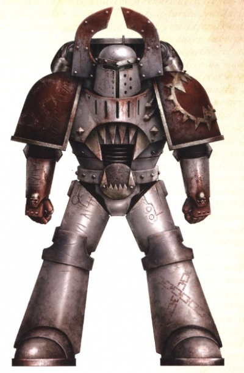

<!-- A0540-B0117 -->

原译文

Mid-Heresy World Eater Balcoth 叛乱中期吞世者巴尔科斯

**校订译文**

Mid-Heresy World Eater Balcoth 叛乱中期吞世者巴尔科斯

<!-- /A0540-B0117 -->

<!-- A0540-B0118 -->
**英文原文**

Angron and the World Eaters were first known to have worked to Lupercal's ends during the war with the Auretian Technocracy, when Angron's 203rd Expeditionary Fleet linked up with the 63rd of Horus. A war started under false pretences so that Horus could secure valuable STC machines with which to win the loyalty of the Mechanicum, the World Eaters worked in concert with the Sons of Horus to obliterate the Auretian civilisation.

<!-- /A0540-B0118 -->

<!-- A0540-B0119 -->

原译文

在与奥瑞提亚科技联盟的战争中，当安格隆的第203远征舰队与荷鲁斯的第63远征舰队会合时，人们首先知道安格隆和吞世者已经为卢佩卡尔的目的而努力。一场战争是在虚假的借口下开始的，为了让荷鲁斯能够获得有价值的STC机械，从而赢得机械教的忠诚，吞世者与荷鲁斯之子合作，消灭了奥瑞提亚文明。

**校订译文**

安格隆与吞世者最早替荷鲁斯私下行事的已知记录，发生在对奥瑞提亚科技联盟的战争中。当时，安格隆的第203远征舰队与荷鲁斯的第63舰队会师。荷鲁斯以虚假借口发动战争，意在夺取珍贵的 STC 机器，以此换取机械教的效忠。吞世者与荷鲁斯之子协同，将奥瑞提亚文明彻底抹除。

**校注：** STC机器不能由译者擅改为单纯图纸，沿英文机器。

<!-- /A0540-B0119 -->

<!-- A0540-B0120 -->
**英文原文**

When word of the rebellion on Isstvan III arrived, Angron was a member of Horus' war council which determined that the imminent campaign of reconquest on the planet was the perfect opportunity to rid their legions of the personnel believed unlikely to turn against the Emperor. A sizeable grouping of World Eaters was attached to the forces deployed to crush the rebellion, and like all the other victorious warriors, they were betrayed by their fellows in orbit. The Conqueror, the World Eaters Legion flagship, was amongst the vessels which commenced a viral bombardment of the planet.

<!-- /A0540-B0120 -->

<!-- A0540-B0121 -->

原译文

当伊斯塔万三号叛乱的消息传来时，安格隆是荷鲁斯战争议会的成员，议会决定，即将到来的行星上的重新征服战役是清除他们军团中据信不太可能背叛帝皇的人员的绝佳机会。一大批吞世者附属于部署镇压叛乱的部队，与所有其他获胜的战士一样，他们被轨道上的同伴背叛。征服者号，吞世者军团的旗舰，是开始对行星进行病毒轰炸的战舰之一。

**校订译文**

伊斯塔万三号发生叛乱的消息传来时，安格隆正在荷鲁斯的战争议会中。议会认定，即将展开的重新征服行动，是清除各军团中不肯背叛帝皇者的绝佳机会。大批吞世者被编入镇压部队；他们与其他取胜的地面战士一样，旋即遭到轨道上同袍的背叛。吞世者旗舰征服者号，也是向行星投放病毒炸弹的舰船之一。

<!-- /A0540-B0121 -->

<!-- A0540-B0122 -->
**英文原文**

When it became clear that almost two-thirds of the deployed forces had survived the life-eater, Horus made plans to saturation bomb their positions from orbit. However, his stratagem was altered by the actions of Angron, who seemingly decided that the survivors of his legion should be cut down by his own hand. Descending to the surface, with a full 50 companies of World Eaters at his back, Angron made straight for the largest concentration of his own betrayed troops and engaged them in close combat. Watching from orbit in outrage, Horus realised he had no choice but to commit his own ground forces in order to reinforce Angron's move. Thus the Battle of Isstvan III was begun.

<!-- /A0540-B0122 -->

<!-- A0540-B0123 -->

原译文

当很明显，近三分之二的部署部队幸存下来时，荷鲁斯计划从轨道上对他们的位置进行饱和轰炸。然而，他的战略被安格隆的行动改变了，安格隆似乎决定用自己的手杀死他的军团的幸存者。安格隆带着整整50个连队的吞世者来到表面，直奔他自己背叛的部队最集中的地方，与他们进行了近距离战斗。荷鲁斯愤怒地从轨道上观看，他意识到自己别无选择，只能投入自己的地面部队来加强安格隆的行动。于是，伊斯塔万三号之战开始了。

**校订译文**

荷鲁斯得知近三分之二的登陆部队活过了噬生命病毒袭击后，准备从轨道对其阵地实施饱和轰炸。但安格隆打乱了计划：他似乎认定，本军团的幸存者应由自己亲手杀死。他率足足五十个连登陆，直扑被自己出卖的吞世者最集中的阵地，与之近身厮杀。荷鲁斯在轨道上看得怒不可遏，却只能投入地面部队，配合安格隆。伊斯塔万三号之战由此展开。

**校注：** 补回life-eater病毒名；near two-thirds为首波登陆部队的比例。

<!-- /A0540-B0123 -->

<!-- A0540-B0124 -->
**英文原文**

Tell me why, father. Why stand with the Arch-Traitor?

<!-- /A0540-B0124 -->

<!-- A0540-B0125 -->

原译文

告诉我为什么，父亲。为什么要和大叛徒站在一起？

**校订译文**

告诉我为什么，父亲。为什么要和大叛徒站在一起？

<!-- /A0540-B0125 -->

<!-- A0540-B0126 -->
**英文原文**

I do not stand with Horus. I stand against the Emperor. Do you understand, Kauragar? I am free now. Free.

<!-- /A0540-B0126 -->

<!-- A0540-B0127 -->

原译文

我不是支持荷鲁斯。我是反抗帝皇。你明白吗，考拉格？我现在自由了。自由。

**校订译文**

我不是支持荷鲁斯。我是反抗帝皇。你明白吗，考拉格？我现在自由了。自由。

<!-- /A0540-B0127 -->

<!-- A0540-B0128 -->
**英文原文**

-World Eaters Centurion Kauragar and the Primarch Angron, after the former's mortal wounding by the latter.

<!-- /A0540-B0128 -->

<!-- A0540-B0129 -->

原译文

-吞世者百夫长考拉格和原体安格隆，前者被后者致命伤后。

**校订译文**

——吞世者百夫长考拉格与原体安格隆的对话，发生在前者被后者打成致命重伤之后。

<!-- /A0540-B0129 -->

<!-- A0540-B0130 -->
**英文原文**

Angron and his second wave of World Eaters spent most of the battle combating and wiping out the World Eaters of the first wave, but were marshalled and brought in for the kill of the last loyalist bastion, after its walls were breached by Titan assault. The final obliteration of the loyalists was to be by orbital bombardment, and Horus ordered his fellow primarchs Mortarion and Fulgrim to drag Angron from the field if he would not quit of his own accord; the World Eaters' strength was to be conserved for the planned Battle of Isstvan V.

<!-- /A0540-B0130 -->

<!-- A0540-B0131 -->

原译文

安格隆和他的第二波吞世者在战斗的大部分时间里都在与第一波吞世者作战并消灭他们，但在泰坦的进攻突破了最后一个忠诚者的堡垒后，他们被召集起来，准备破坏它。最后一次消灭忠诚者的行动是轨道轰炸，荷鲁斯命令他的其他原体莫塔里安和福格瑞姆将安格隆拖出战场，如果他不自愿退出的话；吞世者的力量将为计划中的伊斯塔万五号之战保留下来。

**校订译文**

战斗的大部分时间里，安格隆率第二波吞世者追杀首波登陆的本军团战士。直到泰坦攻破忠诚派最后据点的城墙，他们才被集结，投入最后的围杀。荷鲁斯计划用轨道轰炸彻底消灭忠诚派，命莫塔里安和福格瑞姆在必要时将安格隆强行拖离战场，以保存吞世者兵力，准备接下来的伊斯塔万五号之战。

<!-- /A0540-B0131 -->

<!-- A0540-B0132 -->
**英文原文**

The Battle of Isstvan V, also known as the Drop Site Massacre, saw Angron and the World Eaters unleashed, their assault splitting the Raven Guard's line of communication from that of the Iron Hands. The World Eaters then turned their ire upon the Raven Guard, causing many casualties in the sable-clad legion. Indeed, the World Eaters seemed to focus on the Raven Guard as their targets even after the battle had been settled in the favour of the traitors. As well as sending out hunter squads after the Raven Guard survivors trapped on the surface, the World Eaters were recorded to undertake a strange and barbaric practice, almost akin to a ritual; they decapitated and flensed the heads of the fallen, stacking them in ossuary-cairns. The significance of this post-battle development would not be truly appreciated by observers of the legion until some time later, but the cairns were noted to have a bizarre and deleterious psychic effect on the Raven Guard marines hiding in the area. Angron himself remained upon Isstvan V, leading the force hunting the Raven Guard personally. Eventually, after 98 days of cat-and-mouse hunting, the World Eaters were able to run the Raven Guard survivors down, launching themselves at their exhausted prey in what would surely be another, final massacre. This was not to be however, as the Raven Guard force - including their primarch, Corax - were rescued by a relief force of their own legion, in what some would come to refer to as a miracle.

<!-- /A0540-B0132 -->

<!-- A0540-B0133 -->

原译文

伊斯塔万五号之战，也被称为登陆点大屠杀，安格隆和吞世者被释放，他们的攻击将暗鸦守卫的通信线路与钢铁之手的通信线路分开。吞世者随后将怒火转向暗鸦守卫，导致覆影军团多人伤亡。事实上，即使在有利于叛徒的战斗结束后，吞世者似乎仍将暗鸦守卫作为他们的目标。除了在暗鸦守卫幸存者被困在表面后派出狩猎小队外，吞世者还被记录下进行了一种奇怪而野蛮的行为，几乎类似于一种仪式；他们把倒下的人的头砍下来剥皮，堆在骨骸堆里。直到一段时间后，军团的观察员才会真正意识到这一战后发展的重要性，但人们注意到，这些骨堆对躲藏在该地区的暗鸦守卫星际战士有着奇怪而有害的心理影响。安格隆本人留在伊斯塔万五号，亲自率领部队追捕暗鸦守卫。最终，经过98天的猫捉老鼠般的狩猎，吞世者成功地将暗鸦守卫的幸存者击倒，向他们疲惫的猎物发起攻击，这无疑将是另一场最后的大屠杀。然而，事实并非如此，因为暗鸦守卫部队 — 包括他们的原体科拉克斯 — 被他们自己军团的救援部队救出，有些人称之为奇迹。

**校订译文**

伊斯塔万五号之战，又称登陆点大屠杀。安格隆与吞世者全力猛攻，切断了暗鸦守卫和钢铁之手之间的联系，随后将怒火集中倾泻到暗鸦守卫身上，使这支身披黑甲的军团伤亡惨重。即便叛军胜局已定，吞世者仍继续以暗鸦守卫为目标，派出猎杀小队追捕被困地面的幸存者。他们还开始一种近乎仪式的野蛮行为：砍下死者的头颅，剥去皮肉，再堆成颅骨冢。当时人们尚不理解其意义，只注意到这些骨冢会对藏身附近的暗鸦守卫产生怪异而有害的灵能影响。安格隆本人也留在行星上，亲自率队追猎。九十八天的猫鼠游戏后，吞世者终于逼近筋疲力尽的幸存者，准备发动最后的大屠杀。但暗鸦守卫的增援及时赶到，救出了包括科拉克斯在内的同袍；后来有人将这称为奇迹。

**校注：** sable-clad仅形容黑甲，不是新军团名“覆影军团”。psychic effect在此为灵能作用，不仅心理影响。

<!-- /A0540-B0133 -->

<!-- A0540-B0134 -->
### A Shadowed Purpose 隐秘目的

<!-- /A0540-B0134 -->

<!-- A0540-B0135 -->
**英文原文**

After the opening of the Great Betrayal, Angron and the World Eaters were invited by the primarch Lorgar to accompany him and a force of his Word Bearers on a campaign into the Ultramar sector; the Shadow Crusade. A force of around 70,000 World Eaters assembled around their Primarch and joined a smaller force of Word Bearers. While Lorgar had a specific first target in mind - Armatura - the World Eaters insisted on attacking four other worlds of Ultramar upon the way, killing all who stood against them. These bloody diversions caused a rise in tensions with the Word Bearers that almost resulted in void-battle between their fleets, but after an Eldar attack on them was jointly repulsed, union of purpose was reached and Armatura was successfully assaulted.

<!-- /A0540-B0135 -->

<!-- A0540-B0136 -->

原译文

大背叛事件开始后，原体珞珈邀请安格隆和吞世者陪同他和他的一支怀言者部队进入奥特拉玛地区；暗影远征。一支由大约7万名吞世者组成的部队聚集在他们的原体周围，加入了一支规模较小的怀言者部队。虽然珞珈心中有一个具体的第一个目标 — 阿玛图拉，但吞世者坚持在途中攻击奥特拉玛的其他四个世界，杀死所有反抗他们的人。这些血腥的偏离导致了与怀言者的紧张关系加剧，几乎导致了他们舰队之间的无效战斗，但在灵族对他们的袭击被联合击退后，双方达成了目标，阿玛图拉被成功袭击。

**校订译文**

大背叛开始后，珞珈邀请安格隆与吞世者，随他和一支怀言者部队进军奥特拉玛星区，展开暗影远征。约七万名吞世者集结于原体麾下，与人数较少的怀言者会合。珞珈的首要目标本是阿玛图拉，吞世者却坚持先袭击途中的另外四个世界，杀死一切抵抗者。这些血腥绕行使双方关系日趋紧张，舰队间险些爆发虚空战。直到共同击退一次灵族袭击，两军才重新目标一致，成功攻入阿玛图拉。

**校注：** void-battle为虚空战，原译“无效战斗”误取void义。Ultramar sector沿原文保留星区层级。

<!-- /A0540-B0136 -->

<!-- A0540-B0137 -->
**英文原文**

It was then that Lorgar revealed to his brother the goals of the campaign; firstly, to finish creation of the Ruinstorm, begun by another force of Word Bearers during the Battle of Calth. Secondly, a more private goal of the Word Bearers primarch; the saving of Angron's life from the Butcher's Nails. Lorgar claimed that his abilities had allowed him to discern that the Nails were slowly killing Angron and destroying his mind. Thus, he had created a second purpose of the ritual necessary to finalise the warp storm's creation, one that would ensure Angron's effective immortality. Exactly what Lorgar meant by this would not become clear until some short time later. To Angron's shock, the final phase of Lorgar's ritual had to be carried out upon Nuceria.

<!-- /A0540-B0137 -->

<!-- A0540-B0138 -->

原译文

就在那时，珞珈向他的兄弟透露了这场战役的目标；首先，完成毁灭风暴的创造，这是由另一支怀言者部队在考斯之战中开始的。其次，怀言者的首要目标更加私人化；从屠夫之钉中拯救安格隆的生命。珞珈声称，他的能力使他能够辨别出钉子正在慢慢杀死安格隆并摧毁他的思想。因此，他创造了完成亚空间风暴创造所需的仪式的第二个目的，一个确保安格隆有效永生的目的。珞珈所指的确切含义要到不久后才会清楚。令安格隆震惊的是，珞珈仪式的最后阶段必须在努凯里亚进行。

**校订译文**

此时，珞珈向兄弟揭示了战役的两项目的。第一，是完成毁灭风暴；另一支怀言者部队此前已在考斯之战中开始制造这场风暴。第二，则更为私密：让安格隆不再因屠夫之钉而死。珞珈声称，他凭自己的能力看出，钉子正慢慢杀死安格隆、摧毁他的心智。因此，他赋予完成亚空间风暴的仪式另一重用途，使安格隆获得近乎永恒的生命。这句话真正意味着什么，要到不久后才会明朗。令安格隆震惊的是，仪式最后一步必须在努凯里亚完成。

**校注：** more private goal属于怀言者原体珞珈，不是“怀言者的首要目标”；第二个目标不可译成第一个。

<!-- /A0540-B0138 -->

<!-- A0540-B0139 -->
**英文原文**

Upon arriving at the planet, a delegation from both legions descended to the long-abandoned battle-site in the Desh'elika Mountains which Angron had been teleported from, and where the Eaters of Cities had died, to find that the bones of Angron's fallen followers had been left to rot in the open air. Enraged by this, Angron led the delegation to the capital, to discover more of what had happened since his discovery and the induction of Nuceria into the Imperium as a compliant world. Learning that the legend of him told on the world portrayed him as a coward who abandoned his army to be slaughtered, Angron issued a simple order to the field commanders of the World Eaters and Word Bearers legions: Kill everything and everyone upon the planet.

<!-- /A0540-B0139 -->

<!-- A0540-B0140 -->

原译文

抵达这颗行星后，两个军团的一个代表团来到德什’利卡山脉被遗弃已久的战场，那里是安格隆被传送的地方，也是吞城者死亡的地方，他们发现安格隆倒下的追随者的骨头已经在露天腐烂了。对此感到愤怒，安格隆率领代表团前往首都，了解自他发现努凯里亚并将其作为一个顺从的世界引入帝国以来发生的更多事情。得知他在世界上流传的传说将他描绘成一个放弃军队被屠杀的懦夫，安格隆向吞世者和怀言者军团的战地指挥官发出了一个简单的命令：杀死行星上的一切和每个人。

**校订译文**

抵达后，两个军团的代表一同来到德什’利卡山脉那处荒废已久的战场：安格隆在此被传送离去，吞城者也在此覆灭。众人发现，战死追随者的遗骨仍曝露于荒野。愤怒的安格隆率队前往首都，追问自帝皇发现自己、努凯里亚归顺帝国后，当地又发生了什么。得知流传的故事竟把他描绘成抛弃部下、任其被屠的懦夫，他只向吞世者与怀言者的战场指挥官下达了一道简短命令：杀光这颗行星上的一切。

**校注：** his discovery指安格隆被帝皇发现，原译误为他发现努凯里亚。

<!-- /A0540-B0140 -->

<!-- A0540-B0141 -->
**英文原文**

The slaughter would ultimately be interrupted on the sixth day, when an armada belonging to the Ultramarines legion, led by Roboute Guilliman himself, arrived and engaged the traitor forces. Battering aside the enemy fleet, the Ultramarines were able to land ground forces, bringing the legions to battle. During the ground war, the three primarchs present would all meet in hand-to-hand combat, with Lorgar being beaten back, leaving Guilliman and Angron to duel. It was then that Lorgar discerned the fateful moment, the opportunity the slaughter and rage of the war around him and titanic duel in front of him afforded him; the culmination of his ritual to save Angron was at hand. Despite a last-minute attempt to prevent the sorcery by the World Eaters' surviving Librarians, the ritual was completed: now a transcendent being of claws, steaming red flesh, and pure, volcanic rage, Angron roared to the heavens as Guilliman and his Ultramarines withdrew in disarray. The primarch of the World Eaters was transformed.

<!-- /A0540-B0141 -->

<!-- A0540-B0142 -->

原译文

屠杀最终在第六天中断，当时由罗伯特·基里曼本人领导的属于极限战士军团的舰队抵达并与叛徒部队交战。与敌方舰队作战后，极限战士能够使地面部队登陆，将军团带到战场上。在地面战争期间，在场的三位原体都进行了肉搏战，珞珈被击退，留下基里曼和安格隆决斗。就在那时，珞珈意识到了决定性的时刻，他周围战争的屠杀和愤怒以及面前的巨大决斗为他提供了机会；他拯救安格隆的仪式即将达到高潮。尽管吞世者幸存的智库在最后一刻试图阻止巫术，但仪式还是完成了：现在，安格隆是一个拥有爪子、热气腾腾的红色血肉和纯粹的火山愤怒的超凡生物，当基里曼和他的极限战士混乱地撤退时，他咆哮着冲向天空。吞世者的原体发生了转变。

**校订译文**

屠杀进行到第六天，罗保特·基里曼亲率极限战士舰队抵达，与叛军交战。舰队击退阻拦，投下地面部队，使军团在地表正面交锋。三位原体也展开近身战，珞珈被打退，剩下基里曼与安格隆对决。珞珈意识到，决定性时刻已至：周围的屠戮与狂怒，以及面前原体间的大战，恰好提供了完成仪式的条件。吞世者幸存的智库员虽在最后关头试图阻止巫术，仪式仍告完成。安格隆化为超凡存在，利爪狰狞，赤红血肉蒸腾热气，心中充满火山般的纯粹怒火。他朝天空咆哮，基里曼与极限战士则仓促撤退。吞世者原体已发生根本转变。

**校注：** roared to the heavens为朝天咆哮，不是冲向天空。

<!-- /A0540-B0142 -->

<!-- A0540-B0143 -->
**英文原文**

Following Angron's transformation, the World Eaters went on to rampage world after world in mindless slaughter. They refused all summons by Horus to muster at Ullanor in preparation for the drive on Terra. In the end, it took the Iron Warriors led by Perturabo himself to track Angron and his Legion down on Deluge, eventually being able to bring them to Ullanor.

<!-- /A0540-B0143 -->

<!-- A0540-B0144 -->

原译文

在安格隆转变之后，吞世者继续在无意识的屠杀中肆虐世界。他们拒绝了荷鲁斯在乌兰诺召集的所有召唤，为在泰拉上的努力做准备。最终，由佩图拉博亲自率领的钢铁勇士在德鲁格上追踪到了安格隆和他的军团，并最终将他们带到了乌兰诺。

**校订译文**

安格隆蜕变后，吞世者继续在一个又一个世界肆虐，只剩盲目的屠杀。他们无视荷鲁斯为进攻泰拉而发出的乌兰诺集结令。最终，佩图拉博亲率钢铁勇士，在德鲁格找到安格隆与其军团，才将他们带往乌兰诺。

<!-- /A0540-B0144 -->

<!-- A0540-B0145 -->
**英文原文**

Not all World Eaters rendezvoused with Angron, however. Several warbands remained behind in Ultramar, forming Butcher Fleets to oversee their own reign of terror. The bloodthirsty hordes ignored strategically important targets and instead targeted areas with high populations.

<!-- /A0540-B0145 -->

<!-- A0540-B0146 -->

原译文

然而，并不是所有的吞世者都与安格隆会面。几个战帮留在奥特拉玛，组成屠夫舰队来监督他们自己的恐怖统治。嗜血的部落忽视了具有战略重要性的目标，而是瞄准了人口稠密的地区。

**校订译文**

但并非所有吞世者都与安格隆会师。部分战帮留在奥特拉玛，组成屠夫舰队，建立各自的恐怖统治。这些嗜血大军不顾战略要地，专门袭击人口稠密的地区。

<!-- /A0540-B0146 -->

<!-- A0540-B0147 图片 -->
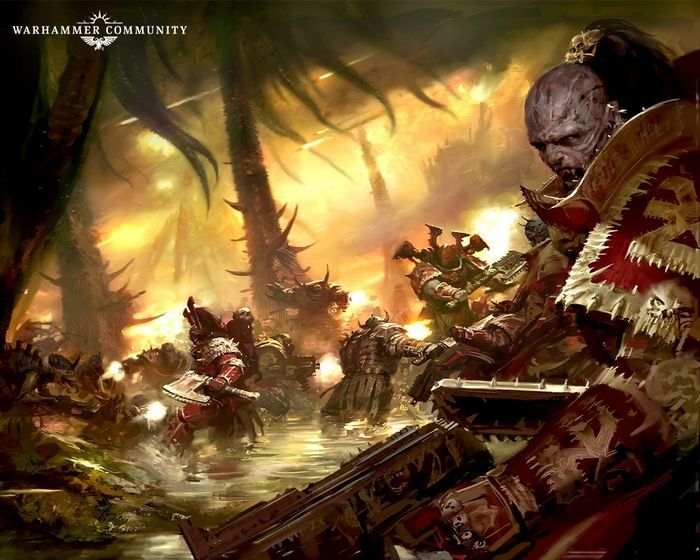

<!-- A0540-B0148 -->

原译文

World Eaters at war 战争中的吞世者

**校订译文**

World Eaters at war 战争中的吞世者

<!-- /A0540-B0148 -->

<!-- A0540-B0149 -->
**英文原文**

What did you do? Answer me.

<!-- /A0540-B0149 -->

<!-- A0540-B0150 -->

原译文

你做了什么？回答我。

**校订译文**

你做了什么？回答我。

<!-- /A0540-B0150 -->

<!-- A0540-B0151 -->
**英文原文**

I saved him, Khârn. It was the only way.

<!-- /A0540-B0151 -->

<!-- A0540-B0152 -->

原译文

我救了他，卡恩。这是唯一的办法。

**校订译文**

我救了他，卡恩。这是唯一的办法。

<!-- /A0540-B0152 -->

<!-- A0540-B0153 -->
**英文原文**

-World Eaters Centurion Khârn and the Primarch Lorgar.

<!-- /A0540-B0153 -->

<!-- A0540-B0154 -->

原译文

-吞世者百夫长卡恩和原体珞珈。

**校订译文**

-吞世者百夫长卡恩和原体珞珈。

<!-- /A0540-B0154 -->

<!-- A0540-B0155 -->
### The Siege 围城

<!-- /A0540-B0155 -->

<!-- A0540-B0156 -->
**英文原文**

The World Eaters were instrumental in the Siege of Terra itself: Legion records claim that it was the World Eaters who made the first breach in the walls of the Imperial Palace, a claim perhaps verified by surviving Imperial vid-logs of the Siege, which show the World Eaters breaching the walls with Angron at their head. However, it is also said that it was one of their champions, Khârn, who was the first to enter said breach. Kharn is said to have fallen during the siege at the hands of Sigismund, while others state he was terribly wounded.

<!-- /A0540-B0156 -->

<!-- A0540-B0157 -->

原译文

吞世者在泰拉围城中发挥了重要作用：军团记录声称，是吞世者首个突破了皇宫的城墙，这一说法可能得到了幸存的帝国围城视频日志的证实，这些日志显示，吞世者以安格隆为首突破了城墙。然而，也有人说，他们的冠军之一卡恩是第一个进入上述漏洞的人。据说，卡恩在西吉斯蒙德的围攻中倒下了，而其他人则表示他受了重伤。

**校订译文**

吞世者在泰拉围城中发挥关键作用。军团记录声称，他们第一个攻破皇宫城墙；现存帝国影像显示安格隆率吞世者突破城墙，或可支持此说。另有记载称，首个冲入缺口的是军团勇士卡恩。据说他在围城中死于西吉斯蒙德之手，也有说法称他只是身负重伤。

**校注：** 卡恩死去或重伤的两种记载均保留，不能合成确定死后复活。

<!-- /A0540-B0157 -->

<!-- A0540-B0158 -->
**英文原文**

The World Eaters were at the forefront of the assault on the Eternity Gate at the final stages of the Siege of Terra. Led by Angron himself, the World Eaters nearly reached the doors of the Gate before Angron was defeated in combat by Sanguinius. Angron's banishment to the Warp broke whatever sanity the World Eaters had left, and they began to cut down their own allies. The chaos caused by this act helped break the traitor advance on the Sanctum Imperialis just short of the Eternity Gate.

<!-- /A0540-B0158 -->

<!-- A0540-B0159 -->

原译文

在泰拉围城的最后阶段，吞世者处于对永恒之门进攻的最前沿。在安格隆本人的带领下，吞世者几乎到达了城门，安格隆在战斗中被圣吉列斯击败。安格隆被放逐到亚空间打破了吞世者剩下的理智，他们开始削减自己的盟友。这一行为造成的混乱有助于打破叛徒在距离永恒之门不远的帝国圣地的推进。

**校订译文**

泰拉围城末期，吞世者冲在进攻永恒之门的最前列。安格隆亲自率队，几乎杀到门前，随后却在战斗中败给圣吉列斯，被放逐回亚空间。这击碎了吞世者仅剩的理智，他们开始屠杀自己的盟军。由此引发的混乱，帮助阻断了叛军对帝国圣所的推进，使其止步于永恒之门外。

**校注：** cut down their own allies为杀死盟军，非削减数量。

<!-- /A0540-B0159 -->

<!-- A0540-B0160 -->
### Post-Heresy 叛乱后

<!-- /A0540-B0160 -->

<!-- A0540-B0161 -->
**英文原文**

In the end, the Forces of Chaos were defeated at Terra and the World Eaters fought their way to the Eye of Terror along with the other Traitor Legions. During this time, a large portion of the Legion was separated from Angron, with many coming under the control of former Devourers officer Goghur. They had no means of resupply or reinforcement and their ships were badly damaged. Under these conditions, even more of the Legion succumbed fully to the Butcher's Nails. Many of these warriors were imprisoned as feral animals to be unleashed later, while others were simply executed or even forced into the shell of a Dreadnought. With Kharn either dead or terribly wounded, the Legion found itself without cohesive leadership and their brotherhood fell apart as different Captains and Warlords fought for supremacy.

<!-- /A0540-B0161 -->

<!-- A0540-B0162 -->

原译文

最后，混沌部队在泰拉被击败，吞世者与其他叛徒军团一起战斗到了恐惧之眼。在此期间，军团的很大一部分从安格隆分离出来，许多人受到前吞世者军官戈古尔的控制。他们没有补给或增援的手段，他们的战舰严重受损。在这种情况下，更多的军团士兵完全屈服于屠夫之钉。这些战士中的许多人被囚禁为野兽，稍后被释放，而其他人则被简单地处决，甚至被强迫进入无畏机甲。由于卡恩要么死亡，要么重伤，军团发现自己没有凝聚力的领导，随着不同的连长和战争领主争夺霸权，他们的兄弟情谊分崩离析。

**校订译文**

混沌最终败于泰拉，吞世者与其他叛徒军团一路血战，退往恐惧之眼。途中，大批战士与安格隆失散，许多人受前吞噬者亲卫军官戈古尔指挥。他们的舰船严重受损，又无从补给或增援，更多战士因而彻底被屠夫之钉控制。其中许多人像野兽般遭到囚禁，等待日后释放杀敌；另一些则被处决，甚至强行封入无畏机体。卡恩或死或重伤，军团缺乏能凝聚全体的领袖，各连长与军阀争权，昔日兄弟情谊随之瓦解。

**校注：** Devourers是后文271明确的吞噬者亲卫，不是World Eaters吞世者，原译混淆单位。

<!-- /A0540-B0162 -->

<!-- A0540-B0163 图片 -->
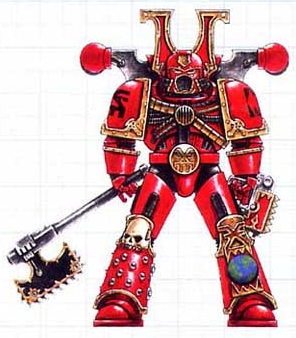

<!-- A0540-B0164 -->

原译文

Post-Heresy World Eater 叛乱后吞世者

**校订译文**

Post-Heresy World Eater 叛乱后吞世者

<!-- /A0540-B0164 -->

<!-- A0540-B0165 -->
**英文原文**

These issues came to a head during the Legion Wars in battle for Skalathrax against a much larger Emperor's Children army. As the World Eaters debated what to do, Kharn finally awoke from his injuries and led an assault on the Emperor's Children. The campaign turned into a bloody quagmire under frigid conditions, and in the Night of Madness Kharn turned upon his brothers as they were on the cusp of victory. The incident finally broke the World Eaters as a Legion, which subsequently scattered into individual warbands. In the ten thousand years since the battle, the leaderless remnants of the World Eaters have slaughtered their way across the Galaxy. Since the opening of the Great Rift the World Eaters reappeared in numbers unseen since the Heresy, spearheading all eight fronts of the Blood Crusades.

<!-- /A0540-B0165 -->

<!-- A0540-B0166 -->

原译文

在军团战争期间，这些问题在斯卡拉特拉克斯与一支规模大得多的帝皇之子军队的战斗中达到了顶峰。当吞世者争论该怎么办时，卡恩终于从伤痛中醒来，并领导了对帝皇之子的袭击。在寒冷的条件下，这场战役变成了一场血腥的泥潭，在疯狂之夜，当他的兄弟们即将取得胜利时，卡恩转向了他们。这一事件最终打破了吞世者作为一个军团的统治，随后他们分散成了单独的战帮。自那场战斗以来的一万年里，吞世者的无领袖残余势力在银河系各地进行了屠杀。自大裂隙打开以来，吞世者以叛乱以来从未见过的数量重新出现，领导着鲜血远征的所有八条战线。

**校订译文**

军团战争期间，吞世者在斯卡拉特拉克斯迎战人数远多于己的帝皇之子，积累的问题终于全面爆发。众人争论如何应对时，卡恩终于从重伤中苏醒，率队发起进攻。严寒中的战事陷入血腥泥潭；疯狂之夜里，正当吞世者即将取胜，卡恩却倒戈屠杀自己的兄弟。军团由此彻底崩裂，化为独立战帮。此后一万年，无统一领袖的残部在银河各地一路杀戮。大裂隙开启后，吞世者以前所未有的规模重新集结，人数为叛乱以来之最，并在鲜血远征全部八条战线上充当前锋。

<!-- /A0540-B0166 -->

<!-- A0540-B0167 图片 -->
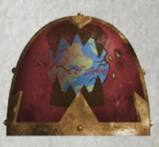

<!-- A0540-B0168 -->

原译文

Post-Heresy World Eaters symbol 叛乱后吞世者标志

**校订译文**

Post-Heresy World Eaters symbol 叛乱后吞世者标志

<!-- /A0540-B0168 -->

<!-- A0540-B0169 -->
**英文原文**

Angron was last seen during the First War for Armageddon, where he lead the invasion of a Khornate host upon an Imperial forge world. He was eventually banished to the Warp for a hundred years, at the cost of the lives of a large number of Grey Knights lead by Brother-Captain Aurellian.

<!-- /A0540-B0169 -->

<!-- A0540-B0170 -->

原译文

安格隆最后一次露面是在第一次阿玛吉多顿战争期间，在那里他领导了对帝国铸造世界的恐虐天军的入侵。他最终被放逐到亚空间一百年，以兄弟连长奥瑞利安率领的大量灰骑士的生命为代价。

**校订译文**

本段较早的记载称，安格隆最后一次现身是在第一次阿玛吉多顿战争，率恐虐大军入侵一处帝国铸造世界。兄弟会连长奥瑞利安率灰骑士付出惨重牺牲，终于将他放逐回亚空间一百年。

**校注：** “最后一次现身”明显属于较早记述，同篇后文列出M42多次现身，正文明确其为旧记载；forgeworld沿英文保留，不依设定记忆改成巢都世界。

<!-- /A0540-B0170 -->

<!-- A0540-B0171 图片 -->
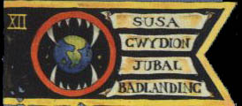

<!-- A0540-B0172 -->

原译文

Pre-heresy World Eaters Banner 叛乱前吞世者旗帜

**校订译文**

Pre-heresy World Eaters Banner 叛乱前吞世者旗帜

<!-- /A0540-B0172 -->

<!-- A0540-B0173 -->
## Notable Engagements 著名交战

<!-- /A0540-B0173 -->

<!-- A0540-B0174 -->
### The Great Crusade 大远征

<!-- /A0540-B0174 -->

<!-- A0540-B0175 -->
**英文原文**

???.M30 - Relief action on Sarum and destruction of the Brotherhood of Ruin. The Tech-Priests of Sarum swear fealty to the legion in the aftermath.

<!-- /A0540-B0175 -->

<!-- A0540-B0176 -->

原译文

对萨鲁姆的救援行动和毁灭毁灭兄弟会。萨鲁姆的技术神甫在事后宣誓效忠军团。

**校订译文**

???.M30：救援萨鲁姆，摧毁毁灭兄弟会。事后，萨鲁姆技术祭司宣誓效忠军团。

<!-- /A0540-B0176 -->

<!-- A0540-B0177 -->
**英文原文**

???.M30 - Ariggata Compliance action. Compliance achieved (theoretically) in concert with the Luna Wolves and Ultramarines. Roboute Guilliman spoke out against Angron in the aftermath.

<!-- /A0540-B0177 -->

<!-- A0540-B0178 -->

原译文

阿里加塔征服行动。（理论上）与影月苍狼和极限战士协同实现了征服。罗伯特·基里曼在事后公开反对安格隆。

**校订译文**

???.M30：阿里加塔征服行动，与影月苍狼和极限战士协同，在名义上完成征服。罗保特·基里曼事后公开谴责安格隆。

<!-- /A0540-B0178 -->

<!-- A0540-B0179 -->
**英文原文**

???.M30 - Ghenna Compliance action; entire planetary population reportedly wiped out in one night.

<!-- /A0540-B0179 -->

<!-- A0540-B0180 -->

原译文

根纳征服行动；据报道，整个行星的人口在一个晚上就灭绝了。

**校订译文**

???.M30：根纳征服行动；据称，全星居民在一夜之间被屠尽。

<!-- /A0540-B0180 -->

<!-- A0540-B0181 -->
**英文原文**

???.M30 - Alpha Shalish. The 203rd Expeditionary Fleet frees the world from lacrymole occupation.

<!-- /A0540-B0181 -->

<!-- A0540-B0182 -->

原译文

阿尔法·萨利许。第203远征舰队将世界从变形魔的占领中解放出来。

**校订译文**

???.M30：阿尔法·萨利许，第203远征舰队将其从变形魔占领下解放。

<!-- /A0540-B0182 -->

<!-- A0540-B0183 -->
**英文原文**

???.M30 - The destruction of Craftworld Tuonoetar

<!-- /A0540-B0183 -->

<!-- A0540-B0184 -->

原译文

方舟世界托诺埃塔尔的毁灭

**校订译文**

???.M30：摧毁方舟世界托诺埃塔尔。

<!-- /A0540-B0184 -->

<!-- A0540-B0185 -->
**英文原文**

???.M31 - The 203rd engages in a compliance action in concert with the Sons of Horus 63rd Expeditionary Fleet; victorious.

<!-- /A0540-B0185 -->

<!-- A0540-B0186 -->

原译文

第203舰队与荷鲁斯之子第63远征舰队协同开展征服行动；胜利。

**校订译文**

???.M31：第203远征舰队与荷鲁斯之子第63远征舰队协同实施征服行动，取胜。

<!-- /A0540-B0186 -->

<!-- A0540-B0187 -->
**英文原文**

005.M31 - Battle of Isstvan III, Punitive/Reconquering action. A large World Eaters force is part of the first wave of Imperial troops deployed.

<!-- /A0540-B0187 -->

<!-- A0540-B0188 -->

原译文

伊斯塔万三号之战，惩罚/收复行动。一支庞大的吞世者部队是部署的第一波帝国军队的一部分。

**校订译文**

005.M31：伊斯塔万三号之战，惩戒与重新征服行动。大批吞世者编入帝国首波登陆部队。

<!-- /A0540-B0188 -->

<!-- A0540-B0189 -->
### The Horus Heresy 荷鲁斯之乱

原题：The Horus Heresy 荷鲁斯叛乱

<!-- /A0540-B0189 -->

<!-- A0540-B0190 -->
**英文原文**

005 .M31 - Battle of Isstvan III. Angron precipitates a second phase of the battle by leading the rest of his forces present down as a second wave, to wipe out the survivors of the first.

<!-- /A0540-B0190 -->

<!-- A0540-B0191 -->

原译文

伊斯塔万三号之战中，安格隆率领其他部队作为第二波进攻，消灭了第一波的幸存者，从而加速了战斗的第二阶段。

**校订译文**

005.M31：伊斯塔万三号之战。安格隆率在场的剩余兵力第二波登陆，企图消灭首波幸存者，由此引发战役第二阶段。

**校注：** precipitates为促成第二阶段爆发，不是加速已在发生的第二阶段。

<!-- /A0540-B0191 -->

<!-- A0540-B0192 -->
**英文原文**

006.M31 - The Drop Site Massacre on Isstvan V.

<!-- /A0540-B0192 -->

<!-- A0540-B0193 -->

原译文

伊斯塔万五号登陆点大屠杀

**校订译文**

006.M31：伊斯塔万五号登陆点大屠杀。

<!-- /A0540-B0193 -->

<!-- A0540-B0194 -->

原译文

007.M31 - The Battle of Armatura 阿玛图拉之战

**校订译文**

007.M31 - The Battle of Armatura 阿玛图拉之战

<!-- /A0540-B0194 -->

<!-- A0540-B0195 -->
**英文原文**

008.M31 - Nuceria Extermination during the Shadow Crusade. Angron transcends to daemonhood at the battle's end.

<!-- /A0540-B0195 -->

<!-- A0540-B0196 -->

原译文

暗影远征期间的努凯里亚灭绝。战斗结束时，安格隆转化为了恶魔王子。

**校订译文**

008.M31：暗影远征中的努凯里亚灭绝行动。战役结束时，安格隆升格成魔。

<!-- /A0540-B0196 -->

<!-- A0540-B0197 -->
**英文原文**

008.M31 - The World Eaters de facto homeworld of Bodt is destroyed by an Iron Hands-led force.

<!-- /A0540-B0197 -->

<!-- A0540-B0198 -->

原译文

吞世者事实上的家园世界博德特被钢铁之手领导的部队摧毁

**校订译文**

008.M31：吞世者事实上的母星博德特，被钢铁之手率领的部队摧毁。

<!-- /A0540-B0198 -->

<!-- A0540-B0199 -->

原译文

009-013.M31 — Siege of Inwit 因维特围城

**校订译文**

009-013.M31 — Siege of Inwit 因维特围城

<!-- /A0540-B0199 -->

<!-- A0540-B0200 -->

原译文

~011.M31 - The Battle of Trisolian 特里索兰之战

**校订译文**

~011.M31 - The Battle of Trisolian 特里索兰之战

<!-- /A0540-B0200 -->

<!-- A0540-B0201 -->

原译文

~011.M31 - The Battle of Yarant 雅兰特之战

**校订译文**

~011.M31 - The Battle of Yarant 雅兰特之战

<!-- /A0540-B0201 -->

<!-- A0540-B0202 -->

原译文

011.M31 - The Battle of Tralsak 特拉萨克之战

**校订译文**

011.M31 - The Battle of Tralsak 特拉萨克之战

<!-- /A0540-B0202 -->

<!-- A0540-B0203 -->

原译文

012.M31 - The Balthor Sigma Intervention 巴尔索尔十八号干预

**校订译文**

012.M31 - The Balthor Sigma Intervention 巴尔索尔十八号干预

<!-- /A0540-B0203 -->

<!-- A0540-B0204 -->
**英文原文**

???.M31 - The World Eaters invade the world of Tekeli and fight against a maniple of Legio Thanataris

<!-- /A0540-B0204 -->

<!-- A0540-B0205 -->

原译文

吞世者入侵了特克利世界，并与一群死神军团作战

**校订译文**

???.M31：吞世者入侵特克利，与死神军团的一支泰坦战斗群交战。

**校注：** maniple在泰坦军团语境为战斗群，不是泛称一群军团。Legio Thanataris沿原稿死神军团，待核。

<!-- /A0540-B0205 -->

<!-- A0540-B0206 -->

原译文

???.M31 - The Battle of Anuari 阿努里之战

**校订译文**

???.M31 - The Battle of Anuari 阿努里之战

<!-- /A0540-B0206 -->

<!-- A0540-B0207 -->

原译文

???.M31 - The Battle of the Diavanos System 迪亚瓦诺斯星系之战

**校订译文**

???.M31 - The Battle of the Diavanos System 迪亚瓦诺斯星系之战

<!-- /A0540-B0207 -->

<!-- A0540-B0208 -->
**英文原文**

~013.M31 - The Battle of Deluge. The World Eaters butcher the population of Deluge and later fight the arriving Iron Warriors before uniting against the Ultramarines and escaping.

<!-- /A0540-B0208 -->

<!-- A0540-B0209 -->

原译文

德鲁格之战。吞世者屠杀了德鲁格的人口，后来与抵达的钢铁勇士作战，然后联合起来对抗极限战士并逃跑。

**校订译文**

约013.M31：德鲁格之战。吞世者屠杀当地居民，随后与抵达的钢铁勇士交锋；后来双方合力对抗极限战士，并撤离。

<!-- /A0540-B0209 -->

<!-- A0540-B0210 -->

原译文

013.M31 - The Liberation of Saronican 萨洛尼卡解放

**校订译文**

013.M31 - The Liberation of Saronican 萨洛尼卡解放

<!-- /A0540-B0210 -->

<!-- A0540-B0211 -->
**英文原文**

014.M31 - Took part in the Solar War and the grand assault on Terra; defeated.

<!-- /A0540-B0211 -->

<!-- A0540-B0212 -->

原译文

参加了太阳战争和对泰拉的大规模进攻；失败。

**校订译文**

014.M31：参与太阳战争及对泰拉的总攻，战败。

<!-- /A0540-B0212 -->

<!-- A0540-B0213 -->
### Post-Heresy 叛乱后

<!-- /A0540-B0213 -->

<!-- A0540-B0214 -->
**英文原文**

???.M31 - The Battle of Skalathrax. Pitched battle against the Emperor's Children. Legion scattered in the aftermath.

<!-- /A0540-B0214 -->

<!-- A0540-B0215 -->

原译文

斯卡拉特拉克斯之战。与帝皇之子开战。军团在之后四散。

**校订译文**

???.M31：斯卡拉特拉克斯之战，与帝皇之子正面会战；此后军团分裂。

<!-- /A0540-B0215 -->

<!-- A0540-B0216 -->

原译文

???.M31 - The Battle of Harmony 哈蒙尼之战

**校订译文**

???.M31 - The Battle of Harmony 哈蒙尼之战

<!-- /A0540-B0216 -->

<!-- A0540-B0217 -->

原译文

???.M32 - The Solar Rebellion 太阳叛乱

**校订译文**

???.M32 - The Solar Rebellion 太阳叛乱

<!-- /A0540-B0217 -->

<!-- A0540-B0218 -->

原译文

811.M37 - The 7th Black Crusade 第七次黑色远征

**校订译文**

811.M37 - The 7th Black Crusade 第七次黑色远征

<!-- /A0540-B0218 -->

<!-- A0540-B0219 -->

原译文

537.M38 - The 9th Black Crusade 第九次黑色远征

**校订译文**

537.M38 - The 9th Black Crusade 第九次黑色远征

<!-- /A0540-B0219 -->

<!-- A0540-B0220 -->
**英文原文**

mid-M38 - The Dominion of Fire. Angron leads 50,000 Berzerkers

<!-- /A0540-B0220 -->

<!-- A0540-B0221 -->

原译文

火焰统御。安格隆领导50000名狂战士

**校订译文**

M38中期：火焰统御，安格隆率五万名狂战士出征。

<!-- /A0540-B0221 -->

<!-- A0540-B0222 -->

原译文

649.M40 - The Garanhir Rebellion 加拉希尔叛乱

**校订译文**

649.M40 - The Garanhir Rebellion 加拉希尔叛乱

<!-- /A0540-B0222 -->

<!-- A0540-B0223 -->

原译文

???.M41 - The Bloodtorrent War 血潮战争

**校订译文**

???.M41 - The Bloodtorrent War 血潮战争

<!-- /A0540-B0223 -->

<!-- A0540-B0224 -->

原译文

???.M41 - The Cholercaust 怒蚀

**校订译文**

???.M41 - The Cholercaust 怒蚀

<!-- /A0540-B0224 -->

<!-- A0540-B0225 -->

原译文

???.M41 - The Fall of Absolom Reach 阿布索伦河段陷落

**校订译文**

???.M41 - The Fall of Absolom Reach 阿布索伦疆域陷落

**校注：** Reach统一疆域，原河段误按水文义。

<!-- /A0540-B0225 -->

<!-- A0540-B0226 -->

原译文

???.M41 - The battles for the Herakon Cluster 赫拉孔星群之战

**校订译文**

???.M41 - The battles for the Herakon Cluster 赫拉孔星群之战

<!-- /A0540-B0226 -->

<!-- A0540-B0227 -->

原译文

142-160.M41 - The 12th Black Crusade 第十二次黑色远征

**校订译文**

142-160.M41 - The 12th Black Crusade 第十二次黑色远征

<!-- /A0540-B0227 -->

<!-- A0540-B0228 -->
**英文原文**

444.M41 - First War for Armageddon. Khorne invasion of the world of Armageddon; defeated.

<!-- /A0540-B0228 -->

<!-- A0540-B0229 -->

原译文

第一次阿玛吉多顿战争。恐虐入侵阿玛吉多顿；打败了。

**校订译文**

444.M41：第一次阿玛吉多顿战争，恐虐部队入侵阿玛吉多顿，最终战败。

<!-- /A0540-B0229 -->

<!-- A0540-B0230 -->

原译文

813-830.M41 - The Siege of Vraks 弗拉克斯围城

**校订译文**

813-830.M41 - The Siege of Vraks 弗拉克斯围城

<!-- /A0540-B0230 -->

<!-- A0540-B0231 -->

原译文

802.M41 The Defense of Parathen City 帕拉森城防御

**校订译文**

802.M41 The Defense of Parathen City 帕拉森城防御

<!-- /A0540-B0231 -->

<!-- A0540-B0232 -->
**英文原文**

999.M41 - Planetary invasion of Agripinaa during the 13th Black Crusade; main forces repulsed.

<!-- /A0540-B0232 -->

<!-- A0540-B0233 -->

原译文

第13次黑色远征期间对阿格里皮娜的行星入侵；主力被击退。

**校订译文**

999.M41：第十三次黑色远征期间入侵阿格里皮娜，主力被击退。

<!-- /A0540-B0233 -->

<!-- A0540-B0234 -->
**英文原文**

~999.M41 - Kossolax attacks Agripinaa again at the head of a combined traitor fleet.

<!-- /A0540-B0234 -->

<!-- A0540-B0235 -->

原译文

科索拉克斯再次率领一支联合叛徒舰队袭击阿格里皮娜。

**校订译文**

约999.M41：科索拉克斯再度率叛军联合舰队袭击阿格里皮娜。

<!-- /A0540-B0235 -->

<!-- A0540-B0236 -->
**英文原文**

Diamor Campaign - Khârn's Butcherhorde allies with the forces of Lord Xorphas.

<!-- /A0540-B0236 -->

<!-- A0540-B0237 -->

原译文

迪亚莫尔战役 - 卡恩的屠夫部落与索法斯领主的部队结盟。

**校订译文**

迪亚莫尔战役 - 卡恩的屠夫部落与索法斯领主的部队结盟。

<!-- /A0540-B0237 -->

<!-- A0540-B0238 -->

原译文

???.M42 - The Blood Crusade 鲜血远征

**校订译文**

???.M42 - The Blood Crusade 鲜血远征

<!-- /A0540-B0238 -->

<!-- A0540-B0239 -->

原译文

???.M42 - The Crusade of Slaughter 屠杀者远征

**校订译文**

???.M42 - The Crusade of Slaughter 屠杀者远征

<!-- /A0540-B0239 -->

<!-- A0540-B0240 -->

原译文

???.M42 - The Invasion of Tsadrekha 赛德瑞卡入侵

**校订译文**

???.M42 - The Invasion of Tsadrekha 赛德瑞卡入侵

<!-- /A0540-B0240 -->

<!-- A0540-B0241 -->

原译文

???.M42 - The War of Beasts on Vigilus 警戒星野兽战争

**校订译文**

???.M42 - The War of Beasts on Vigilus 警戒星野兽战争

<!-- /A0540-B0241 -->

<!-- A0540-B0242 -->

原译文

???.M42 - The Invasion of Xendrya 辛德里亚入侵

**校订译文**

???.M42 - The Invasion of Xendrya 辛德里亚入侵

<!-- /A0540-B0242 -->

<!-- A0540-B0243 -->

原译文

???.M42 - The Nachmund Rift War 纳克蒙德走廊战争

**校订译文**

???.M42 - The Nachmund Rift War 纳克蒙德裂隙战争

<!-- /A0540-B0243 -->

<!-- A0540-B0244 -->
**英文原文**

???.M42 - The Battle of Örgvayr against the Leagues of Votann

<!-- /A0540-B0244 -->

<!-- A0540-B0245 -->

原译文

奥格维尔战役对抗沃坦联盟

**校订译文**

???.M42：奥格维尔之战，对抗沃坦联盟。

<!-- /A0540-B0245 -->

<!-- A0540-B0246 -->
**英文原文**

???.M42 - The destruction of Kalkin's Tribune by Kossolax and his forces. Angron returns during the battle to lead the World Eaters in the slaughter.

<!-- /A0540-B0246 -->

<!-- A0540-B0247 -->

原译文

科索拉克斯和他的部队摧毁了卡尔金之护。安格隆在战斗中返回，领导吞世者进行屠杀。

**校订译文**

???.M42：科索拉克斯及其部队摧毁卡尔金之护。安格隆在战斗中归来，率吞世者大肆屠杀。

<!-- /A0540-B0247 -->

<!-- A0540-B0248 -->
**英文原文**

???.M42 - Battle of Rendolia, Forces of the World Eaters fight against the 5th Company of the Black Dragons, the Cadian 124th regiment and elements of the 3rd, 600th and 89th on the world of Rendolia.

<!-- /A0540-B0248 -->

<!-- A0540-B0249 -->

原译文

伦杜里亚之战，吞世者部队在伦杜里亚世界与黑龙第五连队、卡迪亚第124团以及第3、第600和第89团的成员作战。

**校订译文**

???.M42：伦杜里亚之战。吞世者在当地迎战黑龙第五连、卡迪亚第124团，以及第三、第600和第89团的部分部队。

<!-- /A0540-B0249 -->

<!-- A0540-B0250 -->
**英文原文**

???.M42 - The destruction of Hyades, which proved to be a trap by the Grey Knights to banish Angron back to the Warp. Much of The Foresworn and its allied warbands are lost.

<!-- /A0540-B0250 -->

<!-- A0540-B0251 -->

原译文

毕星团的毁灭，被证明是灰骑士将安格隆驱逐回亚空间的陷阱。弃誓者及其盟友的大部分部队都已损失。

**校订译文**

???.M42：希亚德斯毁灭。此次行动实为灰骑士设下的陷阱，旨在将安格隆放逐回亚空间；弃誓者及盟友战帮损失了大部分兵力。

**校注：** Hyades 是本次灰骑士陷阱所在行星，依682世界语境统一希亚德斯；原译毕星团把同名词误当现实天文星群。

<!-- /A0540-B0251 -->

<!-- A0540-B0252 -->
**英文原文**

???.M42 - The Battle of Malak during the Arks of Omen Campaign. Angron leads a great World Eaters host in order to destroy the Choral Engine on the world of Malakbael. After a great battle, Angron succeeds in destroying the engine and even corrupting Indomitus Crusade Fleet Quartus, though a great many World Eaters are lost. Later during the same campaign World Eaters allied to Vashtorr were able to summon Angron to Wyrmwood during the Battle of Idolatros, though this time the Primarch was bested by the returned Lion El'Jonson.

<!-- /A0540-B0252 -->

<!-- A0540-B0253 -->

原译文

噩兆方舟战役中的马拉克之战。安格隆领导了一支巨大的吞世者天军，以摧毁马拉克巴力世界上的圣歌引擎。经过一场大战，安格隆成功摧毁了引擎，甚至腐化了不屈远征舰队基地，尽管许多吞世者丧生。后来，在同一次战役中，与瓦什托尔结盟的吞世者能够在盲信星之战中将安格隆召唤到龙林星，尽管这次原体被归来的莱昂·艾尔庄森击败。

**校订译文**

???.M42：噩兆方舟战役中的马拉克之战。安格隆率吞世者大军，意图摧毁马拉克巴力的圣歌引擎。一场大战后，他不仅摧毁引擎，还腐化了不屈远征第四舰队，但吞世者也伤亡惨重。同一战役稍后，在盲信星之战中，与瓦什托尔结盟的吞世者将安格隆召至龙林星；这次，他却败给归来的莱昂·艾尔’庄森。

**校注：** Fleet Quartus是第四舰队，原舰队基地误译；与本书65/836同名对应。Malakbael本处马拉克巴力，后682/842马拉贝尔/马拉克贝尔，暂沿较早本稿待主审统一。

<!-- /A0540-B0253 -->

<!-- A0540-B0254 -->
**英文原文**

???.M42 - The Season of Blood. Angron returns to lead a massive Khornate horde to Armageddon, the site of a prior banishment.

<!-- /A0540-B0254 -->

<!-- A0540-B0255 -->

原译文

血季。安格隆归来带领一个庞大的恐虐部落前往阿玛吉多顿，这是之前被驱逐的地方。

**校订译文**

???.M42：血季。安格隆归来，率庞大恐虐大军前往自己曾遭放逐的阿玛吉多顿。

<!-- /A0540-B0255 -->

<!-- A0540-B0256 -->

原译文

??? - The Fall of Ebon Vale 黑檀谷陷落

**校订译文**

??? - The Fall of Ebon Vale 黑檀谷陷落

<!-- /A0540-B0256 -->

<!-- A0540-B0257 -->

原译文

??? - The Skull Hunt of the Octarius War 奥克塔琉斯战争猎颅

**校订译文**

??? - The Skull Hunt of the Octarius War 奥克塔琉斯战争猎颅

<!-- /A0540-B0257 -->

<!-- A0540-B0258 -->

原译文

??? - The invasion of the Feast of Blades 刀锋盛宴入侵

**校订译文**

??? - The invasion of the Feast of Blades 刀锋盛宴入侵

<!-- /A0540-B0258 -->

<!-- A0540-B0259 -->

原译文

??? - The invasion of Vior'la 维奥'拉入侵

**校订译文**

??? - The invasion of Vior'la 维奥'拉入侵

<!-- /A0540-B0259 -->

<!-- A0540-B0260 -->

原译文

??? - The War for Stepjan's Hearth. 斯捷潘之心战争

**校订译文**

??? - The War for Stepjan's Hearth. 斯捷潘之心战争

<!-- /A0540-B0260 -->

<!-- A0540-B0261 -->
## Organisation 组织

<!-- /A0540-B0261 -->

<!-- A0540-B0262 -->
**英文原文**

Even before their fall to Chaos the War Hounds were known to favour close assaults, and this doctrine only grew more pronounced under the command of Angron and the transition into the World Eaters. Angron did little to change the higher-level organisation of the legion, with the echelons (a World Eaters formation roughly equivalent to the Chapters of other legions) only undergoing a slight biasing towards line infantry once he took command. The World Eaters as a legion force could best be described as a hybrid of tactical and close assault units, also possessing significant amounts of support elements useful to close assaults, such as Terminators and Land Speeders.

<!-- /A0540-B0262 -->

<!-- A0540-B0263 -->

原译文

甚至在他们堕入混沌之前，人们就知道猎犬喜欢近身攻击，而这一教义在安格隆的指挥和向吞世者的过渡下变得更加明显。安格隆几乎没有改变军团的高层组织，梯队（一种大致相当于其他军团战团的吞世者编队）在他接管指挥权后，只略微偏向线列步兵。吞世者作为一支军团部队，最好被描述为战术和近身突击部队的混合体，还拥有大量对近身突击有用的支援要素，如终结者和兰德速攻艇。

**校订译文**

早在堕入混沌之前，战犬就偏爱近身突击；安格隆接掌并将其改名为吞世者后，这一倾向更加鲜明。他并未大幅改动军团高层编制，只让梯队——大致相当于其他军团战团的单位——略微增加战列步兵比重。整体而言，吞世者由战术部队与近战突击部队混合构成，还拥有大量适合支援近距离进攻的力量，例如终结者和兰德速攻艇。

<!-- /A0540-B0263 -->

<!-- A0540-B0264 图片 -->
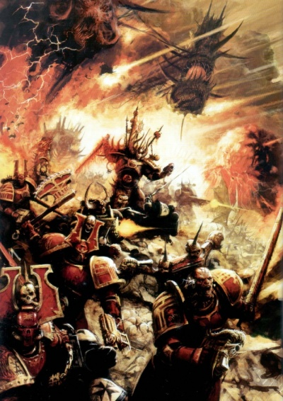

<!-- A0540-B0265 -->

原译文

World Eaters warband 吞世者战帮

**校订译文**

World Eaters warband 吞世者战帮

<!-- /A0540-B0265 -->

<!-- A0540-B0266 -->
**英文原文**

In terms of combat deployment, the World Eaters were champions of the drop-pod assault, usually choosing to appear in the heart of the enemy's defences, in order to rip it apart from within. When heavy firepower was required to support such a tactic, the World Eaters were not averse to advancing under danger-close orbital bombardment or direct Titan support. While infantry assault was their primary stratagem, the legion did possess respectable amounts of armour and artillery units, and were highly adept in their use. Transports and those vehicles able to closely support infantry were obviously prevalent, and the assault doctrine of the legion was so strongly ingrained that even vehicle crew carried assault weapons as standard issue, and would often find a means to employ them.

<!-- /A0540-B0266 -->

<!-- A0540-B0267 -->

原译文

在战斗部署方面，吞世者是空投舱攻击的拥护者，他们通常选择出现在敌人防御的中心，以便从内部将其撕裂。当需要强大的火力来支持这种战术时，吞世者并不反对在危险的近地轨道轰炸或直接的泰坦支援下前进。虽然步兵突击是他们的主要战略，但该军团确实拥有相当数量的装甲和火炮，并且非常善于使用。运输工具和能够密切支援步兵的载具显然很普遍，军团的突击学说根深蒂固，甚至连载具乘员都携带突击武器作为标准装备，并经常找到使用它们的方法。

**校订译文**

吞世者精于空降舱突击，通常直接降到敌方防御核心，从内部将其撕碎。需要强大火力支援时，他们不惜在距自身极近的轨道轰炸落点旁推进，或借助泰坦直接支援。虽然首选步兵突击，军团也拥有数量可观的装甲与火炮，且极善运用。运输载具及能紧密支援步兵的车辆尤其常见。突击理念如此根深蒂固，就连车组成员都将突击武器列为标准装备，常常设法亲自用上。

**校注：** danger-close指火力落点紧邻己军，非轰炸来自近地轨道。

<!-- /A0540-B0267 -->

<!-- A0540-B0268 -->
**英文原文**

The frequency and method of warfare carried out by the World Eaters was highly attritional not just in manpower, but materiel also. In this regard, the World Eaters had an easy means to offset losses and in fact ensure they had high supplies of arms and ammunition; the Forge World (of a sort) of Sarum considered itself an ally to the legion, and would dedicate a high portion of its output to servicing the legion forges and quartermasters. Amongst the Sarum-pattern equipment issued to the World Eaters and their allies in the 13th Expedition were the weapons known as Ursus Claws, which would appear in some preponderance aboard various vessels and walkers in the legion's employ.

<!-- /A0540-B0268 -->

<!-- A0540-B0269 -->

原译文

吞世者进行战争的频率和方法不仅在人力上，而且在物资上都消耗很大。在这方面，吞世者有一种简单的方法来抵消损失，并确保他们有大量的武器和弹药供应；萨鲁姆的铸造世界（某种意义上）认为自己是军团的盟友，并将其大部分产出用于为军团铸造厂和军需官服务。在第13远征舰队中，向吞世者及其盟友发放的萨鲁姆型装备中，有一种被称为熊爪的武器，这种武器在军团使用的各种战舰和步行者上以一定的优势出现。

**校订译文**

吞世者频繁作战，战法又极端消耗人力和物资。不过，他们有可靠的补充来源，甚至能维持充裕的武器弹药储备：萨鲁姆这个某种意义上的铸造世界自认军团盟友，将很大部分产出供应军团锻造部门与军需官。它为第十三远征舰队的吞世者及盟友提供许多萨鲁姆型装备，其中便有“熊爪”武器，大量装配在军团各型舰船和步行载具上。

<!-- /A0540-B0269 -->

<!-- A0540-B0270 -->
**英文原文**

The World Eaters did not employ large amounts of elite troops, but did have some special units. Notionally, the most elite formation in the legion was the Devourers, the twelve-strong bodyguard group to Angron himself. A position in the Devourers could only be achieved by the slaying of one in ritualised combat, or - if one died in battle - by an organised competition open to any in the legion. However vaunted the idea of the Devourers was (and they did have access to the best arms and armour of the legion), the reality did not exactly match the idea on paper. For a bodyguard unit to a personage such as Angron was essentially absurd, especially a bodyguard unit made up of the most dedicated killers in a legion like the World Eaters. A being as powerful as Angron barely needed a bodyguard, and even if he did, when the Nails bit, the Devourers could hardly be trusted to remain near their primarch, or he near them.

<!-- /A0540-B0270 -->

<!-- A0540-B0271 -->

原译文

吞世者没有应用大量精英部队，但确实有一些特种部队。从理论上讲，军团中最精锐的编队是吞噬者，这是安格隆本人的十二人护卫队。吞噬者中的一个位置只能通过在仪式化的战斗中杀死一个人来实现，或者 — 如果一个人在战斗中死亡 — 通过向军团中的任何人开放的有组织的比赛来实现。无论对吞噬者的概念多么夸耀（他们确实可以获得军团最好的武器和盔甲），现实与纸面上的想法并不完全相符。对于像安格隆这样的人物来说，护卫部队本质上是荒谬的，尤其是由像吞世者这样的军团中最敬业的杀手组成的护卫部队。像安格隆这样强大的生物几乎不需要护卫，即使他需要，当钉子攻击他们的时候，吞噬者也很难被信任留在他们的原体身边，或者他在他们身边。

**校订译文**

吞世者的精锐部队不多，但确有一些特殊编制。名义上最精锐的是吞噬者，安格隆的十二人亲卫。加入者须在仪式决斗中杀死一名现任成员；若亲卫在战场上阵亡，则举行向全军团开放的竞赛，选出继任者。吞噬者名号再显赫、装备再精良，实际用途也不如纸面上理想。给安格隆这样的人安排亲卫本就近乎荒谬，更何况亲卫还是吞世者中最痴迷杀戮的战士。他强大到几乎无需保护；即使真有需要，屠夫之钉发作时，也很难指望吞噬者守在原体身边，或指望原体待在他们周围。

**校注：** 加入仪式要求杀死一名现任吞噬者，而非随便杀一个人。

<!-- /A0540-B0271 -->

<!-- A0540-B0272 -->
**英文原文**

One aspect lacking in the legion's Order of Battle was an effective Librarius. Upon undergoing Butcher's Nails implantation, it was discovered that the aggression engines did not mesh with psychic talents. In short order - beginning at the very first battle after the first implantation wave - the legion Librarians began to die, either by uncontrolled power surges or sudden brain embolisms. Refusing to countenance failure, the Librarius attempted to learn to control the Nails' effect and continued to undergo implantation, but results never improved. Eventually, attempts were made to remove the Nails from the Librarians, but all such operations proved fatal. Thus, the remaining psychic warriors of the legion refused implantation in order to continue to serve. Lacking the shared experience of the Nails - and Angron's distrust of anything "unnatural" - the World Eaters Librarians found themselves shunned by their fellows. The legion, already disobeying the Emperor's orders where the aggression engines were concerned, never followed the Edict of Nikea, and allowed their Librarians to remain active as psykers. Simple battlefield attrition would reduce their numbers until, by the time of the Shadow Crusade, only 19 remained active in the entire legion. All of the remainder perished during the Battle of Nuceria, attempting to stop Angron's daemonic ascenscion.

<!-- /A0540-B0272 -->

<!-- A0540-B0273 -->

原译文

军团战斗序列中缺少的一个方面是有效的智库。在接受屠夫之钉植入后，人们发现侵略引擎与灵能天赋并不匹配。很快，从第一次植入波后的第一场战斗开始，军团智库开始死亡，要么是由于不受控制的电涌，要么是突然的脑栓塞。智库拒绝接受失败，试图学会控制钉子的影响，并继续接受植入手术，但结果从未改善。最终，有人试图从智库那里取下钉子，但所有这些操作都被证明是致命的。因此，军团中剩下的灵能战士拒绝植入，以继续服役。由于缺乏钉子的共同经历，以及安格隆对任何“非自然”事物的不信任，吞世者智库发现自己被战友所回避。军团已经在侵略引擎方面违反了帝皇的命令，从未遵循尼凯亚法令，并允许他们的智库作为灵能者继续活动。简单的战场消耗会减少他们的数量，直到暗影远征时，整个军团中只有19人仍然活跃。其余的人都在努凯里亚之战中丧生，试图阻止安格隆的恶魔升格。

**校订译文**

军团战斗序列的一大缺陷，是缺乏有效的智库部门。初次植入屠夫之钉后的第一场战斗起，军团就发现这种攻击性强化装置与灵能天赋不相容：智库员开始因失控的力量暴涌或突发脑栓塞而死亡。智库部门不肯接受失败，仍继续植入，试图掌握控制办法，但结果始终没有改善。后来尝试取出钉子的手术，也无一例外致命。剩余灵能战士为了继续服役，只能拒绝植入。由于没有与同袍共同承受钉子的经历，再加上安格隆怀疑一切“非自然”之物，智库员遭到排斥。军团本就在植入装置问题上违抗帝皇，也从未遵守尼凯亚法令，始终允许智库员继续使用灵能。但战场减员仍不断侵蚀其人数；至暗影远征时，全军团只剩十九名仍在服役。他们最终全都死于努凯里亚之战，试图阻止安格隆升魔。

**校注：** uncontrolled power surges为灵能力量失控，不是普通电涌；部门Librarius与成员Librarian分别处理。

<!-- /A0540-B0273 -->

<!-- A0540-B0274 图片 -->
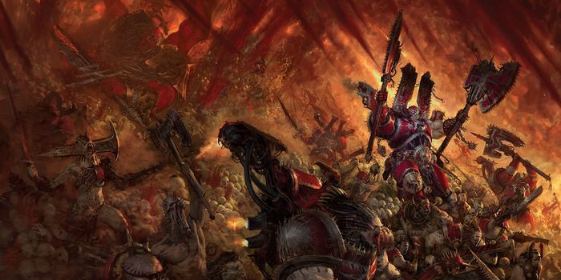

<!-- A0540-B0275 -->

原译文

Angron leads the World Eaters 安格隆领导吞世者

**校订译文**

Angron leads the World Eaters 安格隆领导吞世者

<!-- /A0540-B0275 -->

<!-- A0540-B0276 -->
**英文原文**

The total strength of the World Eaters was never known. Due to their high casualties in battle and rapid recruitment rates, their numbers were constantly fluctuating. A 'best guess' made by one Imperial record puts their numbers immediately before the outbreak of the Horus Heresy at around 150,000, which places the World Eaters at about a 'higher-mid' level of manpower when compared to the other legions. About 112,000 are reckoned to have been with Angron when he joined the Warmaster's fleet at Istvaan III, and of these, possibly as many as 37,000 were committed to the first wave and subsequently betrayed unto their deaths. The legion’s fleet was known to consist of at least 60 capital class vessels.

<!-- /A0540-B0276 -->

<!-- A0540-B0277 -->

原译文

吞世者的总兵力是未知的。由于他们在战斗中伤亡惨重，招募速度很快，他们的人数一直在波动。根据一份帝国记录的“最佳猜测”，在荷鲁斯叛乱爆发之前，他们的人数约为15万人，与其他军团相比，吞世者的人力处于“更高的中等”水平。据估计，当安格隆在伊斯塔万三号加入战帅舰队时，大约有112000人与他在一起，其中可能多达37000人被投入第一波战争，随后被出卖致死。众所周知，该军团的舰队至少由60艘主力级战舰组成。

**校订译文**

吞世者总兵力从无确数。高伤亡率与快速征兵使人数始终波动。一份帝国记录给出的最合理估计，是荷鲁斯之乱爆发前约十五万人，在各军团中属中上规模。安格隆于伊斯塔万三号与战帅舰队会合时，估计带着十一万两千人，其中多达三万七千人可能被派入首波登陆，随后遭背叛而死。军团舰队已知至少有六十艘主力舰。

**校注：** capital class vessels统称主力舰，不是名为主力级的舰型。

<!-- /A0540-B0277 -->

<!-- A0540-B0278 -->
**英文原文**

In the aftermath of the Heresy and the Battle of Skalathrax, the World Eaters have shattered as a united Legion and now operate as disparate warbands controlled by Chaos Lords. Each warband recruits its own way. Few have the facilities or skill needed to create more Space Marines themselves, though some utilize twisted Khornate Apothecaries known as Berzerker-Surgeons to create murderous monstrosities. On the advent of M42 with the formation of the Great Rift and return of Angron, many prominent World Eaters warlords such as Kossolax, Karakka Bloodfist, Dreagh'or, and even Khârn have (at least briefly) gathered around their Primarch once more.

<!-- /A0540-B0278 -->

<!-- A0540-B0279 -->

原译文

在叛乱和斯卡拉特拉克斯之战之后，吞世者作为一个统一的军团瓦解了，现在作为由混沌领主控制的不同的战帮运作。每个战帮都有自己的招募方式。很少有人拥有自己创造更多星际战士所需的设施或技能，尽管有些人利用被称为狂战士军医的扭曲恐虐药剂师来创造凶残的怪物。随着M42，大裂隙的形成和安格隆的回归，许多著名的吞世者战争领主，如科索拉克斯、卡拉卡·血拳、德雷格’尔，甚至卡恩（至少是短暂的）再次聚集在他们的原体周围。

**校订译文**

荷鲁斯之乱与斯卡拉特拉克斯之战后，吞世者分裂为混沌领主各自掌管的战帮，独立征募兵员。鲜有战帮具备自行制造星际战士的设施或技术，不过一些会依靠称为狂战士军医的扭曲恐虐药剂师，造出凶残怪物。M42到来，大裂隙形成，安格隆归来，科索拉克斯、卡拉卡·血拳、德雷格’尔乃至卡恩等著名军阀，又至少短暂地聚到原体身边。

<!-- /A0540-B0279 -->

<!-- A0540-B0280 图片 -->
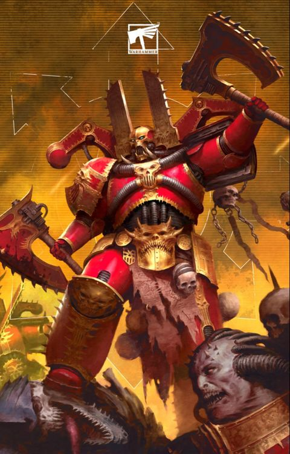

<!-- A0540-B0281 -->

原译文

World Eaters 吞世者

**校订译文**

World Eaters 吞世者

<!-- /A0540-B0281 -->

<!-- A0540-B0282 -->
### Known units of the Great Crusade and Horus Heresy 大远征和荷鲁斯之乱时期著名单位

原题：Known units of the Great Crusade and Horus Heresy 大远征和荷鲁斯叛乱时期著名单位

<!-- /A0540-B0282 -->

<!-- A0540-B0283 -->
### Chapters 战团

<!-- /A0540-B0283 -->

<!-- A0540-B0284 -->

原译文

3rd Chapter 第三战团

**校订译文**

3rd Chapter 第三战团

<!-- /A0540-B0284 -->

<!-- A0540-B0285 -->

原译文

9th Chapter 第九战团

**校订译文**

9th Chapter 第九战团

<!-- /A0540-B0285 -->

<!-- A0540-B0286 -->
**英文原文**

49th Chapter (The "Red Tide")

<!-- /A0540-B0286 -->

<!-- A0540-B0287 -->

原译文

第49战团（“赤潮”）

**校订译文**

第49战团（“赤潮”）

<!-- /A0540-B0287 -->

<!-- A0540-B0288 -->
### Companies 连队

<!-- /A0540-B0288 -->

<!-- A0540-B0289 -->

原译文

1st Company 第一连队

**校订译文**

1st Company 第一连队

<!-- /A0540-B0289 -->

<!-- A0540-B0290 -->

原译文

2nd Company 第二连队

**校订译文**

2nd Company 第二连队

<!-- /A0540-B0290 -->

<!-- A0540-B0291 -->

原译文

3rd Assault Company 第三连队

**校订译文**

3rd Assault Company 第三突击连

<!-- /A0540-B0291 -->

<!-- A0540-B0292 -->

原译文

8th Assault Company 第八连队

**校订译文**

8th Assault Company 第八突击连

<!-- /A0540-B0292 -->

<!-- A0540-B0293 -->

原译文

9th Company 第九连队

**校订译文**

9th Company 第九连队

<!-- /A0540-B0293 -->

<!-- A0540-B0294 -->

原译文

11th Assault Company 第11连队

**校订译文**

11th Assault Company 第11突击连

<!-- /A0540-B0294 -->

<!-- A0540-B0295 -->

原译文

12th Company 第12连队

**校订译文**

12th Company 第12连队

<!-- /A0540-B0295 -->

<!-- A0540-B0296 -->

原译文

15th Company 第15连队

**校订译文**

15th Company 第15连队

<!-- /A0540-B0296 -->

<!-- A0540-B0297 -->

原译文

17th Company 第17连队

**校订译文**

17th Company 第17连队

<!-- /A0540-B0297 -->

<!-- A0540-B0298 -->

原译文

18th Company 第18连队

**校订译文**

18th Company 第18连队

<!-- /A0540-B0298 -->

<!-- A0540-B0299 -->
**英文原文**

19th Company (The "Skull Takers")

<!-- /A0540-B0299 -->

<!-- A0540-B0300 -->

原译文

第19连队（“夺颅者”）

**校订译文**

第19连队（“夺颅者”）

<!-- /A0540-B0300 -->

<!-- A0540-B0301 -->

原译文

20th Company 第20连队

**校订译文**

20th Company 第20连队

<!-- /A0540-B0301 -->

<!-- A0540-B0302 -->

原译文

21st Company 第21连队

**校订译文**

21st Company 第21连队

<!-- /A0540-B0302 -->

<!-- A0540-B0303 -->

原译文

25th Company 第25连队

**校订译文**

25th Company 第25连队

<!-- /A0540-B0303 -->

<!-- A0540-B0304 -->

原译文

32nd Company 第32连队

**校订译文**

32nd Company 第32连队

<!-- /A0540-B0304 -->

<!-- A0540-B0305 -->

原译文

34th Company 第34连队

**校订译文**

34th Company 第34连队

<!-- /A0540-B0305 -->

<!-- A0540-B0306 -->

原译文

37th Company 第37连队

**校订译文**

37th Company 第37连队

<!-- /A0540-B0306 -->

<!-- A0540-B0307 -->

原译文

44th Company 第44连队

**校订译文**

44th Company 第44连队

<!-- /A0540-B0307 -->

<!-- A0540-B0308 -->

原译文

48th Company 第48连队

**校订译文**

48th Company 第48连队

<!-- /A0540-B0308 -->

<!-- A0540-B0309 -->

原译文

50th Heavy Support Company 第50重型支援连队

**校订译文**

50th Heavy Support Company 第50重型支援连队

<!-- /A0540-B0309 -->

<!-- A0540-B0310 -->

原译文

66th Armoured Company 第66装甲连队

**校订译文**

66th Armoured Company 第66装甲连队

<!-- /A0540-B0310 -->

<!-- A0540-B0311 -->

原译文

67th Company 第67连队

**校订译文**

67th Company 第67连队

<!-- /A0540-B0311 -->

<!-- A0540-B0312 -->

原译文

85th Company 第85连队

**校订译文**

85th Company 第85连队

<!-- /A0540-B0312 -->

<!-- A0540-B0313 -->
**英文原文**

89th Reconnaissance Company: Became the Bloodstalkers

<!-- /A0540-B0313 -->

<!-- A0540-B0314 -->

原译文

第89侦查连队：成为鲜血追猎者

**校订译文**

第89侦察连——后来成为鲜血追猎者。

<!-- /A0540-B0314 -->

<!-- A0540-B0315 -->
## Gene-seed 基因种子

<!-- /A0540-B0315 -->

<!-- A0540-B0316 -->
**英文原文**

Many scholars believe the World Eaters' geneseed was corrupted from the beginning, and the legion was intrinsically damned. Others believe that there was nothing inherently wrong with the genetic make-up of the legion, and point solely to Angron and his introduction of the Butcher's Nails as the reason behind the downfall of the Twelfth Legion. While no clear truth can be discerned, it is believed that the geneseed of Angron resulted in his marines developing an almost physical need to engage in combat, and a propensity to descend into bouts of bloodthirsty madness, separate from the effects of the Nails.

<!-- /A0540-B0316 -->

<!-- A0540-B0317 -->

原译文

许多学者认为，吞世者的基因从一开始就被破坏了，军团本质上是被诅咒的。其他人则认为，军团的基因组成本身并没有什么问题，并仅指出安格隆和他引入的屠夫之钉是第十二军团衰落的原因。虽然没有明确的真相，但据信，安格隆的基因导致他的星际战士几乎产生了参与战斗的生理需求，并倾向于陷入嗜血的疯狂，这与钉子的影响是分开的。

**校订译文**

许多学者认为，吞世者的基因种子从一开始就遭到腐化，军团天生注定堕落。另一些人则认为基因本身没有问题，罪魁只是安格隆及他引入的屠夫之钉。真相无从确知，但有一种看法认为，即使排除钉子的影响，安格隆的基因种子也会让子嗣对战斗产生近乎生理性的需求，并倾向于陷入嗜血狂乱。

<!-- /A0540-B0317 -->

<!-- A0540-B0318 -->
**英文原文**

Regardless, after millennia in the Eye of Terror, the currently existing geneseed of the legion warriors has been corrupted beyond all possible measure. Berzerker-Surgeons have been able to utilize this corrupted Gene-Seed to sometimes create new warriors who are little more than feral animals with no fear of pain or death.

<!-- /A0540-B0318 -->

<!-- A0540-B0319 -->

原译文

无论如何，经过数千年的恐惧之眼，目前存在的军团战士的基因种子已经被腐化得无法估量。狂战士军医已经能够利用这种被破坏的基因种子，有时创造出新的战士，他们只不过是野兽，不惧痛苦或死亡。

**校订译文**

无论原本如何，身处恐惧之眼数千年后，现存军团战士的基因种子已遭到难以估量的腐化。狂战士军医有时仍能用它培育新战士，但成品几乎只是毫不畏惧痛苦与死亡的野兽。

<!-- /A0540-B0319 -->

<!-- A0540-B0320 -->
## Culture 文化

<!-- /A0540-B0320 -->

<!-- A0540-B0321 -->
**英文原文**

Even as the War Hounds, the legion had an intemperate demeanour, requiring an especially harsh discipline code in order to retain effectiveness. The enforcement of punishment was carried out by the officer of those deemed guilty, but that officer needed to have the physical capability to carry it out, as well as the respect of the others under his command. War Hounds (and World Eaters) officers were not promoted on seniority, or on merit not earned in direct combat. They earned their rank by battlefield prowess and displays of personal leadership and charisma in the teeth of battle. All ranks were expected to be effective in close-range combat, even specialists. Failure in battle was not tolerated, surrender was literally never considered, and mercy to the enemy was a quick death to a worthy foe. Enemies who had proven unworthy - cowards - were to be butchered. Trial by combat was the preferred way to settle disagreements, with all parties concerned seeing both the undertaking and the result as honourable. One way an officer could achieve promotion was to challenge a senior to such a combat, with the winner taking (or keeping) the higher rank of the two. The loser...well, they would be dead.

<!-- /A0540-B0321 -->

<!-- A0540-B0322 -->

原译文

即使是战犬，该军团也有着过激的行为，需要特别严厉的纪律守则才能保持效力。惩罚的执行由被认定有罪的军官执行，但该军官需要具备执行惩罚的身体能力，并尊重其指挥下的其他人。战犬（和吞世者）军官的晋升不是基于资历，也不是基于非直接战斗中获得的功绩。他们凭借战场实力和在战斗中表现出的个人领导力和魅力获得军衔。所有级别的人都被期望在近距离战斗中发挥作用，即使是专家。战斗中的失败是不能容忍的，投降从来没有被考虑过，对敌人的怜悯是对一个值得尊敬的敌人的快速死亡。被证明不值得的敌人 — 懦夫 — 将被屠杀。战斗审判是解决分歧的首选方式，有关各方都认为这一承诺和结果是光荣的。军官晋升的一种方式是挑战一名高级军官参加这样的战斗，获胜者将获得（或保留）两人中的较高军衔。失败者…好吧，他们会死的。

**校订译文**

尚名战犬时，军团就行事狂烈，须靠极端严厉的纪律维持战斗力。处罚由犯错者的上级执行；这名军官既必须有足够武力执行惩罚，也必须得到其他部下敬重。战犬及后来的吞世者从不靠资历或非战斗功绩晋升，而以战场实力、临阵指挥能力及个人威望赢得军衔。所有人，无论级别或专业，都须善于近战。失败不可容忍，投降绝不考虑；对值得尊重的敌人，怜悯便是让其迅速死去，懦夫则只配遭屠戮。决斗裁决是解决分歧的首选，各方都认可过程与结果的荣誉性。军官也可挑战上级以谋求晋升，胜者取得或保留较高军衔，败者则以死告终。

**校注：** 执行惩罚者是罪犯的上级，不是被认定有罪的军官；他须赢得部下敬重，而非原译反向要求他尊重部下。

<!-- /A0540-B0322 -->

<!-- A0540-B0323 -->
**英文原文**

As determined masters of close-combat, the World Eaters were skilled in the employ of practically all hand-to-hand weapons. One in particular grew synonymous with the legion, however: the chain-axe. The legion favoured a broad-bladed pattern that dated back to the techno-barbarian tribes of Old Terra, and their habit of using this type of weapon grew into almost an obsession after their Primarch was revealed to be a master with the weapon type. Angron refined the chain-axe and it's use in his legion, as well as teaching his warriors new ways to kill with it, inspiring a cult of personal combat concentrated around using the weapon. The reputation of the chain-axe as a weapon grew in the Imperium thanks to the World Eaters, and its use spread to other legions as a result. At least one record opines that the chain-axe was the perfect metaphor for the World Eaters themselves; a brutal, remorseless machine with no purpose other than to kill.

<!-- /A0540-B0323 -->

<!-- A0540-B0324 -->

原译文

作为坚定的近身格斗大师，吞世者几乎精通所有徒手武器的使用。然而，其中一种特别成为了军团的代名词：链锯斧。军团喜欢一种可以追溯到旧泰拉的技术蛮人部落的宽刃型，在他们的原体被发现是这种武器类型的大师后，他们使用这种武器的习惯几乎变成了一种痴迷。安格隆改进了链锯斧，并在他的军团中使用，同时教会了他的战士们用它杀人的新方法，激发了人们对使用这种武器进行个人战斗的崇拜。由于吞世者，链锯斧作为武器的声誉在帝国中越来越高，因此它的使用也传播到了其他军团。至少有一条记录认为，链锯斧是吞世者自己的完美比喻；一台残忍无情的机械，除了杀人没有其他目的。

**校订译文**

吞世者痴心钻研近身战，几乎精通所有近战武器，其中尤以链锯斧与军团形象密不可分。他们偏爱一种宽刃型号，其历史可追溯至旧泰拉技术蛮人部落。得知原体本人也是链锯斧大师后，这份偏好更近乎痴迷。安格隆改良武器及其用法，传授新的杀敌技艺，促成以链锯斧为核心的个人武斗文化。借吞世者之名，这种武器在帝国日益知名，也逐渐传至其他军团。至少一份记载认为，链锯斧恰是吞世者最贴切的隐喻：残暴无情、只为杀戮而存在的机器。

**校注：** hand-to-hand weapons为近战武器，“徒手武器”自相矛盾。

<!-- /A0540-B0324 -->

<!-- A0540-B0325 -->
**英文原文**

Amongst various traditions (or superstitions) of the Nucerian gladiator-pits brought into the legion was that of the treatment of discarded weapons; a weapon lost, either on purpose or as a result of failure or the vagaries of the battlefield, was a weapon of ill luck. As a result the World Eaters would often take the somewhat wasteful step of abandoning fallen or discarded gear, including the gear of their enemies. One notable exception to this behaviour was when Khârn recovered and repaired Gorechild, a weapon of the primarch.

<!-- /A0540-B0325 -->

<!-- A0540-B0326 -->

原译文

在各种传统（或迷信）中，被带入军团的努凯里亚角斗士坑是处理废弃武器的传统；无论是故意丢失，还是由于失败或战场的变幻莫测而丢失的武器，都是一种倒霉的武器。因此，吞世者经常采取有点浪费的步骤，丢弃掉落或丢弃的装备，包括敌人的装备。这种行为的一个值得注意的例外是，当卡恩恢复并修复了原体的武器血子时。

**校订译文**

安格隆带进军团的努凯里亚角斗传统与迷信，也包括对遗落武器的看法。无论故意丢弃，还是因失利或战场变故而遗失，失落的武器都会被视为不祥。因此，吞世者常任由掉落或丢弃的装备留在原处，连敌方装备也不拾取，颇为浪费。卡恩取回并修复原体武器血子，便是一个著名例外。

<!-- /A0540-B0326 -->

<!-- A0540-B0327 -->
**英文原文**

The huge emphasis on personal combat was present inside the legion as well as on the battlefield. Training was with live rounds and whetted blades, often against other legionaries. Indeed, past a certain point in training, gladiatorial fights could be sanctioned up to the death. Pit-fights were not just employed as part of training; aware that his men needed to release their aggression even when not in combat, Angron allowed single combat between his legionaries to become almost ritualised inside the legion, with various rules and challenges particular to the World Eaters forming around the combats.

<!-- /A0540-B0327 -->

<!-- A0540-B0328 -->

原译文

军团内部和战场上都非常重视个人战斗。训练是用实弹和开刃刀进行的，通常是对抗其他军团士兵。事实上，在训练的某个阶段之后，角斗士的战斗可能会被判死刑。决斗坑不仅是训练的一部分；意识到他的士兵即使在没有战斗的情况下也需要释放他们的侵略性，安格隆允许他的军团之间的单次战斗在军团内部几乎成为仪式，在战斗中形成了各种规则和挑战，这些规则和挑战是吞世者特有的。

**校订译文**

个人武斗不仅主导战场，也渗透军团内部。训练使用实弹与开刃武器，对手往往就是其他军团战士。训练达到一定阶段后，角斗甚至获准以死亡为终点。斗坑也不限于训练之用：安格隆明白，部下即便离开战场仍需宣泄攻击冲动，于是允许军团内部单挑逐渐仪式化，围绕决斗形成吞世者特有的规则与挑战方式。

**校注：** sanctioned up to the death指允许死斗，不是角斗被判处死刑。

<!-- /A0540-B0328 -->

<!-- A0540-B0329 -->
**英文原文**

Despite the bulk of the non-Terran legionaries not having a shared world of origin, a second language to Gothic came to exist inside the legion: Nagrakali. Referred to as a bastardised tongue, it was a result of the melding of warriors from three dozen worlds, each with their own native language.

<!-- /A0540-B0329 -->

<!-- A0540-B0330 -->

原译文

尽管大部分非泰拉裔军团士兵没有共同的起源世界，但军团内部出现了除哥特语的第二种语言：纳格拉卡利语。它被称为一种混杂语言，是来自三十多个世界的战士融合的结果，每个世界都有自己的母语。

**校订译文**

尽管多数非泰拉裔战士并无共同母星，军团内部仍在哥特语之外形成了第二种语言——纳格拉卡利语。它被称作一种混杂语言，由来自三十六个世界、各说不同母语的战士相互交流而形成。

**校注：** three dozen是三十六，不是三十多个。

<!-- /A0540-B0330 -->

<!-- A0540-B0331 -->
**英文原文**

After a certain point, almost every legionary would undergo the voluntary implantation of the Butcher's Nails, the psycho-surgical implants that heightened aggression and pain tolerance to extreme levels. A side-effect of these devices would soon become apparent; they robbed the wearer of peace, satisfaction or joy except when stimulated in battle. While the effect of the Nails was not identical from person to person, the shared burden of bearing them would unite all World Eaters (and even their sire, Angron) in a bond of tortured familiarity. The World Eaters volunteered for the Nails, not just to receive the combat benefits, but because they wished to become closer to their primarch, and perhaps even understand him. In some sense, their embrace of the destructive brain surgery could be said to have been spiritual.

<!-- /A0540-B0331 -->

<!-- A0540-B0332 -->

原译文

在某一点之后，几乎每个军团士兵都会自愿植入屠夫之钉，这是一种灵能外科植入物，可以将攻击性和疼痛耐受性提高到极端水平。这些设备的副作用很快就会显现出来；除非在战斗中受到刺激，否则它们会剥夺佩戴者的平静、满足或快乐。虽然钉子的效果因人而异，但承受钉子的共同负担将使所有吞世者（甚至他们的父亲安格隆）团结在一种痛苦的熟悉关系中。吞世者自愿打入钉子，不仅是为了获得战斗福利，也是因为他们希望更接近他们的原体，甚至可能理解他。从某种意义上说，他们对破坏性脑部手术的拥抱可以说是精神上的。

**校订译文**

到某一阶段，几乎所有军团战士都会自愿植入屠夫之钉。这种精神外科装置将攻击性与痛苦耐受力推至极限，却很快显露副作用：除非受到战斗刺激，植入者无法感到平静、满足或快乐。影响虽因人而异，共同承受的折磨却将所有吞世者，乃至安格隆本人，连为一种彼此熟悉的痛苦纽带。他们愿意植钉，既为战斗优势，也为更接近、甚至理解自己的原体。从某种意义上，这种接受破坏性脑部手术的选择，也带着精神层面的认同。

**校注：** 此段称自愿植入，前文另记强制植入，保留不同叙述及其时间语境，不统一为全员自愿。spiritual为精神认同层面，并非灵能手术。

<!-- /A0540-B0332 -->

<!-- A0540-B0333 -->
**英文原文**

After their fall to Chaos, the legion's blood-rites and traditions swiftly became ritualised and transformed into a worship of Khorne. It is not unknown for World Eaters officers to have given themselves over to daemonic possession, and the presence of such possessed marines in legion formations is often seen as a sign of Khorne's esteem. The effect of the Butcher's Nails is also said to reinforce the World Eater's devotions to their patron, as slaying in his name is said to grant them an experience of unholy joy.

<!-- /A0540-B0333 -->

<!-- A0540-B0334 -->

原译文

在他们堕入混沌之后，军团的血腥仪式和传统迅速变得仪式化，并转变为对恐虐的崇拜。吞世者军官们已经将自己交给了恶魔的控制，而这种被控制的星际战士以军团的形式出现，通常被视为恐虐的尊重的标志。据说屠夫之钉的效果也加强了吞世者对他们幕后者的虔诚，因为以他的名义杀人据说会给他们带来一种邪恶的快乐体验。

**校订译文**

堕入混沌后，军团原有的血腥仪礼与传统迅速转化为崇拜恐虐的宗教仪式。一些吞世者军官甚至主动让恶魔附身，而附魔战士出现在部队之中，常被视为血神垂青的象征。屠夫之钉据说也强化了他们的虔诚：以恐虐之名杀戮，会带来邪异的狂喜。

<!-- /A0540-B0334 -->

<!-- A0540-B0335 -->
**英文原文**

Those who have embraced the Butcher's Nails to its fullest extent are known as the Sages of Slaughter.

<!-- /A0540-B0335 -->

<!-- A0540-B0336 -->

原译文

那些最大限度地拥抱屠夫之钉的人被称为屠杀圣者。

**校订译文**

那些最大限度地拥抱屠夫之钉的人被称为屠杀圣者。

<!-- /A0540-B0336 -->

<!-- A0540-B0337 -->
## Homeworld 家园世界

<!-- /A0540-B0337 -->

<!-- A0540-B0338 -->
**英文原文**

The World Eaters did not possess a typical homeworld in the manner of many of the other Space Marine Legions. Their Primarch, Angron, was discovered upon the world of Nuceria, but the events surrounding his discovery did not lead to a unifying of the planet and his legion. The World Eaters instead retained the use of various muster posts, the chief of which was the world of Bodt. Bodt was seized by the legion during their early days, and became a principal fiefdom. A volcanic and arid world with no recorded native inhabitants, it would serve as the training ground of the Legion.

<!-- /A0540-B0338 -->

<!-- A0540-B0339 -->

原译文

吞世者并不像其他许多星际战士那样拥有一个典型的家园世界。他们的原体安格隆在努凯里亚行星上被发现，但围绕他的发现的事件并没有导致行星和他的军团的统一。相反，吞世者保留了各个集合点的使用，其中最主要的是博德特世界。博德特在早期被军团占领，成为主要的封地。这是一个火山和干旱的世界，没有记录在案的土著居民，它将成为军团的训练场。

**校订译文**

吞世者不像许多其他星际战士军团那样，拥有一颗典型母星。安格隆虽在努凯里亚被发现，但当时的事件并未让该世界与军团建立一体关系。他们仍使用分散的集结据点，其中最重要的是早年夺取、随后成为主要封地的博德特。这个干旱、多火山的世界没有已知原生居民，成为军团训练场。

<!-- /A0540-B0339 -->

<!-- A0540-B0340 -->
**英文原文**

Bodt was ultimately destroyed during the Horus Heresy; a mixed Imperial strike force led by Autek Mor of the Iron Hands succeeded in crashing Bodt's lone moon into the world, causing a total extermination event that slew all those upon the surface.

<!-- /A0540-B0340 -->

<!-- A0540-B0341 -->

原译文

博德特最终在荷鲁斯叛乱期间被摧毁；由钢铁之手的奥特克·摩尔领导的混合帝国打击部队成功地将博德特的孤独卫星撞向世界，造成了一场彻底的灭绝事件，杀死了所有在表面的人。

**校订译文**

荷鲁斯之乱中，钢铁之手的奥特克·莫尔率帝国混合打击部队，将博德特唯一的卫星撞向行星。博德特由此毁灭，地表一切生命尽数灭绝。

**校注：** lone moon为唯一卫星，不是孤独卫星；Autek Mor沿核心188奥特克·莫尔。

<!-- /A0540-B0341 -->

<!-- A0540-B0342 -->
## Recruitment 招募

<!-- /A0540-B0342 -->

<!-- A0540-B0343 -->
**英文原文**

The standard tactics of the War Hounds (especially the World Eaters) typically resulted in high casualty levels for the legion. In order to keep up their strength, the World Eaters were involved in continual recruitment, with Angron choosing to personally streamline and cut out elements of the standard process in order to accelerate the viability of recruits. He was also noted to have regularly donated his own genetic material directly to his apothecaries in order to speed up the organ culture and implantation process as well as ensure the stability of the grafting. These recruits were taken from various feral and feudal worlds that the legion came across, including from conquered populations. As a result of this continual recruitment from as wide a variety of humanity as the galaxy could place in their path, no other legion except perhaps the Ultramarines could be said to have been so diverse in cultural origin. Recruits were most commonly trained on the legion's world Bodt.

<!-- /A0540-B0343 -->

<!-- A0540-B0344 -->

原译文

战犬（尤其是吞世者）的标准战术通常会导致军团的高伤亡率。为了保持他们的实力，吞世者参与了持续的招募，安格隆选择亲自简化和删除标准流程的元素，以加快新兵的生存能力。他还经常将自己的遗传物质直接捐赠给药剂师，以加快器官培养和植入过程，并确保移植的稳定性。这些新兵来自军团遇到的各种蛮荒和封建世界，包括被征服的人口。由于他们在银河系的道路上不断招募各种各样的人类，除了极限战士之外，没有其他军团可以说在文化起源上如此多样化。新兵最常在军团的世界博德特训练。

**校订译文**

战犬，尤其是后来的吞世者，其标准战法总伴随高伤亡率。为维持兵力，军团持续征兵。安格隆亲自精简标准流程，删去部分步骤，让新兵更快完成改造、具备作战条件。他还经常直接提供自身遗传材料，加速器官培育与植入，保障移植稳定。兵源来自沿途的各种蛮荒与封建世界，也包括被征服者。如此广泛而持续的征募，使他们的文化出身极为多样；或许除极限战士外，再无其他军团能与之相比。大部分新兵在博德特受训。

**校注：** viability为新兵完成改造后可投入使用，非单纯生存能力；perhaps Ultramarines保留可能性。

<!-- /A0540-B0344 -->

<!-- A0540-B0345 图片 -->
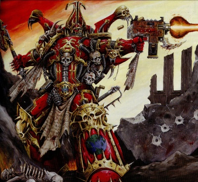

<!-- A0540-B0346 -->

原译文

World Eater in action 行动中的吞世者

**校订译文**

World Eater in action 行动中的吞世者

<!-- /A0540-B0346 -->

<!-- A0540-B0347 -->
**英文原文**

In the aftermath of the Drop Site Massacre, senior World Eaters Apothecaries in cooperation with the Word Bearers arrived on Bodt, where they established bio-vats to create new warriors at a rapid pace. What resulted were rage-filled monsters of pure aggression. Initiates who survived the process awoke thinking they were a veteran of countless wars.

<!-- /A0540-B0347 -->

<!-- A0540-B0348 -->

原译文

在登陆点大屠杀事件之后，吞世者高级药剂师与怀言者合作抵达博德特，在那里他们建立了生物缸，以快速培养新的战士。结果是充满愤怒的纯粹侵略性怪物。在这一过程中幸存下来的参与者醒来时以为自己是无数战争的老兵。

**校订译文**

登陆点大屠杀后，吞世者的高级药剂师与怀言者合作，在博德特建立生物培养缸，迅速制造新战士。结果诞生的是充满纯粹杀戮冲动的狂怒怪物。活过改造的新兵醒来时，都以为自己已经历过无数战争。

<!-- /A0540-B0348 -->

<!-- A0540-B0349 -->
**英文原文**

While the World Eaters have found it difficult to replenish their numbers since the Battle of Skalathrax, they are known to utilize Berzerker-Surgeons to create new murderous warriors that are little more than feral animals. The World Eaters are also capable of psycho-corrective surgery to transform captured loyalist Space Marines into new World Eaters. Following the Horus Heresy, the World Eaters also began to absorb various Khorne-worshipping Chaos Space Marine warbands, meaning that not all modern World Eaters share the same gene-seed. Such is the extent of this genetic variety that today World Eaters identify themselves by use of the Butcher's Nails and devotion to Khorne, not by being part of Angron's genetic legacy.

<!-- /A0540-B0349 -->

<!-- A0540-B0350 -->

原译文

虽然自斯卡拉特拉克斯战役以来，吞世者发现很难补充他们的数量，但众所周知，他们利用狂战士军医创造了新的凶残的战士，这些战士只不过是野兽。吞世者还能够进行灵能矫正手术，将被俘的忠诚星际战士转变为新的吞世者。在荷鲁斯叛乱之后，吞世者也开始吸收各种崇拜恐虐的混沌星际战士，这意味着并非所有现代吞世者都有相同的基因种子。这种基因多样性的程度如此之高，以至于今天的吞世者通过使用屠夫之钉和对恐虐的忠诚来识别自己，而不是通过成为安格隆基因遗留的一部分。

**校订译文**

斯卡拉特拉克斯之战后，吞世者虽难以补充兵力，仍能借狂战士军医制造近乎野兽的杀戮战士。他们还会以心理矫正手术，将被俘的忠诚派星际战士改造成吞世者。荷鲁斯之乱后，军团又不断吸收其他崇拜恐虐的混沌星际战士战帮，因此如今并非所有吞世者都具有相同基因种子。其血统已多样到如此程度：他们以屠夫之钉和对恐虐的虔诚确认身份，而不再以是否继承安格隆的基因作为标准。

**校注：** psycho-corrective指心理/行为矫正，不是灵能矫正；吸收对象是战帮，补回原译遗漏层级。

<!-- /A0540-B0350 -->

<!-- A0540-B0351 -->
## Noted Elements of the World Eaters 吞世者的著名力量

原题：Noted Elements of the World Eaters 吞世者著名成员

<!-- /A0540-B0351 -->

<!-- A0540-B0352 -->
### Armoury 军械

<!-- /A0540-B0352 -->

<!-- A0540-B0353 -->
### Artefacts 遗物

原题：Artefacts 造物

<!-- /A0540-B0353 -->

<!-- A0540-B0354 -->

原译文

Black Blade 黑刃

**校订译文**

Black Blade 黑刃

<!-- /A0540-B0354 -->

<!-- A0540-B0355 -->

原译文

Gorechild 血子

**校订译文**

Gorechild 血子

<!-- /A0540-B0355 -->

<!-- A0540-B0356 -->

原译文

Gorefather 血父

**校订译文**

Gorefather 血父

<!-- /A0540-B0356 -->

<!-- A0540-B0357 -->

原译文

Samni'arius 萨姆尼’阿里乌斯

**校订译文**

Samni'arius 萨姆尼’阿里乌斯

<!-- /A0540-B0357 -->

<!-- A0540-B0358 -->

原译文

Spinegrinder 碎脊者

**校订译文**

Spinegrinder 碎脊者

<!-- /A0540-B0358 -->

<!-- A0540-B0359 -->
### Notable Vessels 著名战舰

<!-- /A0540-B0359 -->

<!-- A0540-B0360 -->
**英文原文**

Conqueror - Glorianna Class Battleship; Legion Flagship (pre-Heresy).

<!-- /A0540-B0360 -->

<!-- A0540-B0361 -->

原译文

征服者号 - 荣光女王级战列舰；军团旗舰（叛乱前）

**校订译文**

征服者号 - 荣光女王级战列舰；军团旗舰（叛乱前）

<!-- /A0540-B0361 -->

<!-- A0540-B0362 -->
**英文原文**

Merciless - Battleship

<!-- /A0540-B0362 -->

<!-- A0540-B0363 -->

原译文

无情号 - 战列舰

**校订译文**

无情号 - 战列舰

<!-- /A0540-B0363 -->

<!-- A0540-B0364 -->
**英文原文**

Slaverer - Battleship

<!-- /A0540-B0364 -->

<!-- A0540-B0365 -->

原译文

奴隶主号 - 战列舰

**校订译文**

奴隶主号 - 战列舰

<!-- /A0540-B0365 -->

<!-- A0540-B0366 -->
**英文原文**

Gore Drenched - Battleship

<!-- /A0540-B0366 -->

<!-- A0540-B0367 -->

原译文

浸血号 - 战列舰

**校订译文**

浸血号 - 战列舰

<!-- /A0540-B0367 -->

<!-- A0540-B0368 -->

原译文

Exsanguinator 放血者号

**校订译文**

Exsanguinator 放血者号

<!-- /A0540-B0368 -->

<!-- A0540-B0369 -->
**英文原文**

Gouger - Desecrator Class Battleship (destroyed during the Battle of Malak)

<!-- /A0540-B0369 -->

<!-- A0540-B0370 -->

原译文

撕裂者号 - 亵渎者级战列舰（在马拉克之战中被摧毁）

**校订译文**

撕裂者号 - 亵渎者级战列舰（在马拉克之战中被摧毁）

<!-- /A0540-B0370 -->

<!-- A0540-B0371 -->
**英文原文**

Redblade Rider - Flagship of Invocatus

<!-- /A0540-B0371 -->

<!-- A0540-B0372 -->

原译文

红刃骑手号 - 因维卡图斯的旗舰

**校订译文**

红刃骑手号 - 因维卡图斯的旗舰

<!-- /A0540-B0372 -->

<!-- A0540-B0373 -->
**英文原文**

Gladiator - Capital Ship (pre-Heresy}.

<!-- /A0540-B0373 -->

<!-- A0540-B0374 -->

原译文

角斗士号 - 主力舰（叛乱前）

**校订译文**

角斗士号 - 主力舰（叛乱前）

<!-- /A0540-B0374 -->

<!-- A0540-B0375 -->
### Known Aircraft 著名飞行器

<!-- /A0540-B0375 -->

<!-- A0540-B0376 -->
**英文原文**

Redclaw - Thunderhawk.

<!-- /A0540-B0376 -->

<!-- A0540-B0377 -->

原译文

红爪 - 雷鹰

**校订译文**

红爪 - 雷鹰

<!-- /A0540-B0377 -->

<!-- A0540-B0378 -->
### Known Vehicles 著名载具

<!-- /A0540-B0378 -->

<!-- A0540-B0379 -->
**英文原文**

Barbarus - Rhino belonging to Kossolax the Foresworn

<!-- /A0540-B0379 -->

<!-- A0540-B0380 -->

原译文

巴巴鲁斯 - 属于背誓者科索拉克丝的犀牛

**校订译文**

巴巴鲁斯——弃誓者科索拉克斯的犀牛战车。

<!-- /A0540-B0380 -->

<!-- A0540-B0381 -->
### Notable Members 著名成员

<!-- /A0540-B0381 -->

<!-- A0540-B0382 -->
### Heresy Era 叛乱时期

<!-- /A0540-B0382 -->

<!-- A0540-B0383 -->
**英文原文**

Angron, Primarch.

<!-- /A0540-B0383 -->

<!-- A0540-B0384 -->

原译文

安格隆，原体

**校订译文**

安格隆，原体

<!-- /A0540-B0384 -->

<!-- A0540-B0385 -->
**英文原文**

Khârn, Equerry. Originally Captain of the 8th Company

<!-- /A0540-B0385 -->

<!-- A0540-B0386 -->

原译文

卡恩，侍从官，最初为第八连队连长

**校订译文**

卡恩，侍从官，最初为第八连队连长

<!-- /A0540-B0386 -->

<!-- A0540-B0387 -->
**英文原文**

Gahlan Surlak - Chief Apothecary

<!-- /A0540-B0387 -->

<!-- A0540-B0388 -->

原译文

加兰·苏拉克 - 首席药剂师

**校订译文**

加兰·苏拉克 - 首席药剂师

<!-- /A0540-B0388 -->

<!-- A0540-B0389 -->
**英文原文**

Dreagher - 9th Captain, inspired the legion name 'World Eaters'

<!-- /A0540-B0389 -->

<!-- A0540-B0390 -->

原译文

德雷格尔 - 第九连长，激发了军团名称“吞世者”的灵感

**校订译文**

德雷格尔 - 第九连长，激发了军团名称“吞世者”的灵感

<!-- /A0540-B0390 -->

<!-- A0540-B0391 -->
**英文原文**

Jareg - Master Shellsmith (Chief Techmarine)

<!-- /A0540-B0391 -->

<!-- A0540-B0392 -->

原译文

耶利哥 - 弹药铁匠大师（首席技术军士）

**校订译文**

耶利哥——弹药铁匠大师，即首席科技战士。

**校注：** Techmarine采用官方科技战士；Master Shellsmith为本军团特殊称谓，暂沿弹药铁匠大师。

<!-- /A0540-B0392 -->

<!-- A0540-B0393 -->
**英文原文**

Ehrlen - Captain.

<!-- /A0540-B0393 -->

<!-- A0540-B0394 -->

原译文

艾尔伦 - 连长

**校订译文**

艾尔伦 - 连长

<!-- /A0540-B0394 -->

<!-- A0540-B0395 -->
**英文原文**

Gheer - Legion Master of the War Hounds, killed by Angron

<!-- /A0540-B0395 -->

<!-- A0540-B0396 -->

原译文

盖尔 - 战犬军团长，被安格隆杀死

**校订译文**

盖尔 - 战犬军团长，被安格隆杀死

<!-- /A0540-B0396 -->

<!-- A0540-B0397 -->
**英文原文**

Lhorke - Legion Master of the War Hounds, interred in a Contemptor Pattern Dreadnought ca. thirty years before Angron's discovery

<!-- /A0540-B0397 -->

<!-- A0540-B0398 -->

原译文

洛克 - 战犬军团长，在安格隆被发现前约三十年埋在一艘蔑视者型无畏中

**校订译文**

洛克——战犬军团长，约在安格隆被发现前三十年，被安置进蔑视者型无畏机体。

<!-- /A0540-B0398 -->

<!-- A0540-B0399 -->
**英文原文**

Zhukel Dror - Red Butcher

<!-- /A0540-B0399 -->

<!-- A0540-B0400 -->

原译文

朱克尔·德罗尔 - 红屠夫

**校订译文**

朱克尔·德罗尔 - 红屠夫

<!-- /A0540-B0400 -->

<!-- A0540-B0401 -->
**英文原文**

Nigh Vash Delerax - Lieutenant Commander

<!-- /A0540-B0401 -->

<!-- A0540-B0402 -->

原译文

尼格·瓦什·德勒拉克斯 - 副指挥官

**校订译文**

尼格·瓦什·德勒拉克斯 - 副指挥官

<!-- /A0540-B0402 -->

<!-- A0540-B0403 -->
**英文原文**

Delvarus - Centurion

<!-- /A0540-B0403 -->

<!-- A0540-B0404 -->

原译文

德尔瓦鲁斯 - 百夫长

**校订译文**

德尔瓦鲁斯 - 百夫长

<!-- /A0540-B0404 -->

<!-- A0540-B0405 -->
**英文原文**

Vorias - Chief Librarian

<!-- /A0540-B0405 -->

<!-- A0540-B0406 -->

原译文

沃瑞亚斯 - 首席智库

**校订译文**

沃瑞亚斯——首席智库员。

<!-- /A0540-B0406 -->

<!-- A0540-B0407 -->
**英文原文**

Mago - Centurion

<!-- /A0540-B0407 -->

<!-- A0540-B0408 -->

原译文

马戈 - 百夫长

**校订译文**

马戈 - 百夫长

<!-- /A0540-B0408 -->

<!-- A0540-B0409 -->
**英文原文**

Skane - Sergeant

<!-- /A0540-B0409 -->

<!-- A0540-B0410 -->

原译文

斯卡恩 - 军士

**校订译文**

斯卡恩 - 军士

<!-- /A0540-B0410 -->

<!-- A0540-B0411 -->
**英文原文**

Shabran Darr - Centurion

<!-- /A0540-B0411 -->

<!-- A0540-B0412 -->

原译文

沙巴兰·达尔 - 百夫长

**校订译文**

沙巴兰·达尔 - 百夫长

<!-- /A0540-B0412 -->

<!-- A0540-B0413 -->
### Former Members 前成员

<!-- /A0540-B0413 -->

<!-- A0540-B0414 -->
**英文原文**

Endryd Haar - Blackshield

<!-- /A0540-B0414 -->

<!-- A0540-B0415 -->

原译文

恩德瑞德·哈尔 - 黑盾

**校订译文**

恩德瑞德·哈尔 - 黑盾

<!-- /A0540-B0415 -->

<!-- A0540-B0416 -->
**英文原文**

Macer Varren - Captain, escaped the Isstvan system and recruited by Nathaniel Garro for Malcador

<!-- /A0540-B0416 -->

<!-- A0540-B0417 -->

原译文

马克尔·瓦伦 - 连长，逃离了伊斯塔万星系，被纳撒尼尔·伽罗招募给马卡多

**校订译文**

马塞尔·瓦伦——连长，逃离伊斯塔万星系后，由纳撒尼尔·伽罗招募，为马卡多效力。

**校注：** Macer Varren沿核心183马塞尔·瓦伦，原马克尔。

<!-- /A0540-B0417 -->

<!-- A0540-B0418 -->
### Post Heresy 叛乱后

<!-- /A0540-B0418 -->

<!-- A0540-B0419 -->
**英文原文**

Angron - Daemon Prince.

<!-- /A0540-B0419 -->

<!-- A0540-B0420 -->

原译文

安格隆 - 恶魔原体

**校订译文**

安格隆——恶魔亲王。

**校注：** 英文此处为Daemon Prince，故译恶魔亲王；其原体身份见前文，不擅改英文分类。

<!-- /A0540-B0420 -->

<!-- A0540-B0421 -->
**英文原文**

Kossolax - called the Foresworn.

<!-- /A0540-B0421 -->

<!-- A0540-B0422 -->

原译文

科索拉克丝 - 被称为背誓者

**校订译文**

科索拉克斯——又称弃誓者。

<!-- /A0540-B0422 -->

<!-- A0540-B0423 -->
**英文原文**

Azgorek Varren - Lord of Pistonhand's Daemoniforge

<!-- /A0540-B0423 -->

<!-- A0540-B0424 -->

原译文

阿兹戈尔·瓦伦 - 活塞之手的领主的恶魔熔炉

**校订译文**

阿兹戈尔·瓦伦——活塞之手的恶魔熔炉之主。

**校注：** 领主统领整个Pistonhand’s Daemoniforge，原译错误分割所有格。

<!-- /A0540-B0424 -->

<!-- A0540-B0425 -->
**英文原文**

Khârn – Champion of Khorne, called "The Betrayer" after his actions at Skalathrax

<!-- /A0540-B0425 -->

<!-- A0540-B0426 -->

原译文

卡恩 - 恐虐冠军，在斯卡拉特拉克斯的行动后，他被称为“背叛者”

**校订译文**

卡恩——恐虐勇士，因斯卡拉特拉克斯的行径获称“背叛者”。

<!-- /A0540-B0426 -->

<!-- A0540-B0427 -->
**英文原文**

Invocatus - Chaos Lord of the Fire Riders

<!-- /A0540-B0427 -->

<!-- A0540-B0428 -->

原译文

因维卡图斯 - 火焰骑手的混沌领主

**校订译文**

因维卡图斯 - 火焰骑手的混沌领主

<!-- /A0540-B0428 -->

<!-- A0540-B0429 -->
**英文原文**

Zhufor - Lord of the Skulltakers warband.

<!-- /A0540-B0429 -->

<!-- A0540-B0430 -->

原译文

朱佛 - 夺颅者战帮领主

**校订译文**

朱佛尔——夺颅者战帮之主。

<!-- /A0540-B0430 -->

<!-- A0540-B0431 -->
**英文原文**

Lheorvine Ukris - Known as Firefist, commander of the Fifteen Fangs warband

<!-- /A0540-B0431 -->

<!-- A0540-B0432 -->

原译文

里奥万·乌克里斯 - 被称为火拳，十五獠牙战帮指挥官

**校订译文**

里奥万·乌克里斯 - 被称为火拳，十五獠牙战帮指挥官

<!-- /A0540-B0432 -->

<!-- A0540-B0433 -->
**英文原文**

Shâhka Bloodless - Powerful Khorne Berzerker

<!-- /A0540-B0433 -->

<!-- A0540-B0434 -->

原译文

无血者沙卡 - 强大的恐虐狂战士

**校订译文**

无血者沙卡 - 强大的恐虐狂战士

<!-- /A0540-B0434 -->

<!-- A0540-B0435 -->
**英文原文**

Crull - Chaos Lord

<!-- /A0540-B0435 -->

<!-- A0540-B0436 -->

原译文

克鲁尔 - 混沌领主

**校订译文**

克鲁尔 - 混沌领主

<!-- /A0540-B0436 -->

<!-- A0540-B0437 -->
**英文原文**

Jarrok Skreel - Slaughterbound

<!-- /A0540-B0437 -->

<!-- A0540-B0438 -->

原译文

贾罗克·斯克里尔 - 杀缚者

**校订译文**

贾罗克·斯克里尔——缚魔战狂。

**校注：** Slaughterbound暂采用GW09中文39页缚魔战狂；旧GW10未收录，当前仅标官方中文参考·对应待核，原杀缚者保留作对照。

<!-- /A0540-B0438 -->

<!-- A0540-B0439 -->
**英文原文**

Goghur - Powerful Chaos Lord

<!-- /A0540-B0439 -->

<!-- A0540-B0440 -->

原译文

戈古尔 - 强大的混沌领主

**校订译文**

戈古尔 - 强大的混沌领主

<!-- /A0540-B0440 -->

<!-- A0540-B0441 -->
### Former Members 前成员

<!-- /A0540-B0441 -->

<!-- A0540-B0442 -->
**英文原文**

Arrian Zorzi - Apothecary, joined Fabius Bile's Consortium after the Heresy.

<!-- /A0540-B0442 -->

<!-- A0540-B0443 -->

原译文

阿里安·佐尔齐 - 药剂师，叛乱之后加入了法比乌斯·拜尔联合体。

**校订译文**

阿里安·佐尔齐——药剂师，荷鲁斯之乱后加入法比乌斯·拜尔的共同体。

<!-- /A0540-B0443 -->

<!-- A0540-B0444 -->
### Unique Troops 独特部队

<!-- /A0540-B0444 -->

<!-- A0540-B0445 -->
**英文原文**

Bloodied (Heresy-Era)

<!-- /A0540-B0445 -->

<!-- A0540-B0446 -->

原译文

染血者（叛乱时期）

**校订译文**

染血者（叛乱时期）

<!-- /A0540-B0446 -->

<!-- A0540-B0447 -->
**英文原文**

Devourers (Heresy-Era)

<!-- /A0540-B0447 -->

<!-- A0540-B0448 -->

原译文

吞噬者（叛乱时期）

**校订译文**

吞噬者（叛乱时期）

<!-- /A0540-B0448 -->

<!-- A0540-B0449 -->
**英文原文**

Rampagers (Heresy-Era, became Khorne Berzerkers)

<!-- /A0540-B0449 -->

<!-- A0540-B0450 -->

原译文

狂暴者（叛乱时期，成为恐虐狂战士）

**校订译文**

狂暴者（叛乱时期，成为恐虐狂战士）

<!-- /A0540-B0450 -->

<!-- A0540-B0451 -->
**英文原文**

Red Butchers (Heresy-Era)

<!-- /A0540-B0451 -->

<!-- A0540-B0452 -->

原译文

红屠夫（叛乱时期）

**校订译文**

红屠夫（叛乱时期）

<!-- /A0540-B0452 -->

<!-- A0540-B0453 -->
**英文原文**

Triarii (Heresy-Era)

<!-- /A0540-B0453 -->

<!-- A0540-B0454 -->

原译文

三线军（叛乱时期）

**校订译文**

三线军（叛乱时期）

<!-- /A0540-B0454 -->

<!-- A0540-B0455 -->
**英文原文**

Red Hand (Heresy-Era)

<!-- /A0540-B0455 -->

<!-- A0540-B0456 -->

原译文

红手（叛乱时期）

**校订译文**

红手（叛乱时期）

<!-- /A0540-B0456 -->

<!-- A0540-B0457 -->
**英文原文**

Caedere (Heresy-Era)

<!-- /A0540-B0457 -->

<!-- A0540-B0458 -->

原译文

砍杀者（叛乱时期）

**校订译文**

砍杀者（叛乱时期）

<!-- /A0540-B0458 -->

<!-- A0540-B0459 -->
**英文原文**

Red Hunters (Heresy-era)

<!-- /A0540-B0459 -->

<!-- A0540-B0460 -->

原译文

红猎手（叛乱时期）

**校订译文**

红猎手（叛乱时期）

<!-- /A0540-B0460 -->

<!-- A0540-B0461 -->

原译文

Berzerker-surgeon 狂战士军医

**校订译文**

Berzerker-surgeon 狂战士军医

<!-- /A0540-B0461 -->

<!-- A0540-B0462 -->

原译文

Sage of Slaughter 屠杀圣者

**校订译文**

Sage of Slaughter 屠杀圣者

<!-- /A0540-B0462 -->

<!-- A0540-B0463 -->

原译文

Eightbound 八缚者

**校订译文**

Eightbound 八缚者

<!-- /A0540-B0463 -->

<!-- A0540-B0464 -->

原译文

Exalted Eightbound 高阶八缚者

**校订译文**

Exalted Eightbound 高阶八缚者

<!-- /A0540-B0464 -->

<!-- A0540-B0465 -->

原译文

Slaughterbound 杀缚者

**校订译文**

Slaughterbound 缚魔战狂

<!-- /A0540-B0465 -->

<!-- A0540-B0466 -->
**英文原文**

Jakhals (Support)

<!-- /A0540-B0466 -->

<!-- A0540-B0467 -->

原译文

裂伤者（支援）

**校订译文**

裂伤者（支援）

<!-- /A0540-B0467 -->

<!-- A0540-B0468 -->
**英文原文**

Goremongers (Support)

<!-- /A0540-B0468 -->

<!-- A0540-B0469 -->

原译文

撒血者（支援）

**校订译文**

洒血狂（支援）。

**校注：** Goremongers暂采用GW09中文39页洒血狂；旧GW10未收录，当前仅标官方中文参考·对应待核，原撒血者保留作对照。

<!-- /A0540-B0469 -->

<!-- A0540-B0470 -->
## Trivia 琐事

<!-- /A0540-B0470 -->

<!-- A0540-B0471 -->
**英文原文**

Angron's origin as a gladiator-turned-leader of a rebel army, and his eventual 'disappearance' from their final battlefield, probably draws inspiration from the historical figure Spartacus.

<!-- /A0540-B0471 -->

<!-- A0540-B0472 -->

原译文

安格隆最初是一名角斗士，后来成为叛军领袖，他最终从最后的战场上“消失”，这可能是从历史人物斯巴达克斯那里得到的灵感。

**校订译文**

安格隆从角斗士成为起义军领袖，又在最后决战前“消失”的经历，可能取材于历史人物斯巴达克斯。

<!-- /A0540-B0472 -->

<!-- A0540-B0473 -->
**英文原文**

Nuceria is likely a reference to Nocera Superiore, a city in classical Italy, whose changing allegiances throughout the period resulted in it being sacked several times, notably by both Rome and the forces of Spartacus.

<!-- /A0540-B0473 -->

<!-- A0540-B0474 -->

原译文

努凯里亚可能指的是古意大利的上诺切拉，这座城市在整个时期不断变化的忠诚导致它多次被洗劫，尤其是被罗马和斯巴达克斯军队洗劫。

**校订译文**

努凯里亚之名可能取自古意大利城市上诺切拉。它在这一历史时期几度转变立场，也多次遭到洗劫，其中包括罗马与斯巴达克斯的军队。

**校注：** 末两段为底稿对创作灵感的推测，保留可能语气，未标为官方已证实创作来源。

<!-- /A0540-B0474 -->

本篇核心术语与暂定项

以下列出本篇出现的英文原形及核心术语表用词。同形词可能指不同对象，具体词义以本篇正文和校注为准；单复数、别名和仅见于图注的名称可能尚未列入。完整候选见[术语表](../../术语表/双语术语候选.csv)。

| 英文 | 采用中文 | 状态 |
| --- | --- | --- |
| Space Marines | 星际战士 | 官方已核对 |
| Grey Knights | 灰骑士 | 官方已核对 |
| Space Wolves | 太空野狼 | 官方已核对 |
| Imperial Army | 帝国军 | 暂定·官方待核 |
| World Eaters | 吞世者 | 官方已核对 |
| Eldar | 灵族 | 暂定·语境区分 |
| Leagues of Votann | 沃坦联盟 | 官方已核对 |
| Librarian | 智库员 | 官方已核对 |
| Roboute Guilliman | 罗保特·基里曼 | 官方已核对 |
| Ultramar | 奥特拉玛 | 官方已核对 |
| Ultramarines | 极限战士 | 官方已核对 |
| Horus Heresy | 荷鲁斯之乱 | 官方已核对 |
| Warp | 亚空间 | 官方已核对 |
| Great Rift | 大裂隙 | 官方已核对 |
| Imperium | 帝国 | 暂定·简称 |
| Mechanicum | 机械教 | 暂定·历史称谓 |
| Khorne | 恐虐 | 官方已核对 |
| Craftworld | 方舟世界 | 官方已核对 |
| Librarius | 智库（机构）／智库学派（灵能学派） | 语境定译·官方待核 |
| Indomitus | 不屈学派 | 暂定·学派语境 |
| Equipment | 装备 | 编辑用语已统一 |
| Eye of Terror | 恐惧之眼 | 官方已核对 |
| Techmarine | 科技战士 | 官方已核对 |
| Emperor | 帝皇 | 官方已核对 |
| Primarch | 原体 | 官方已核对 |
| Forge World | 铸造世界 | 暂定·官方待核 |
| Abhuman | 亚人 | 暂定·官方待核 |
| Word Bearers | 怀言者 | 暂定·官方待核 |
| Daemon Prince | 恶魔亲王 | 官方已核对 |
| Emperor's Children | 帝皇之子 | 官方已核对 |
| Legion Wars | 军团战争 | 暂定·官方待核 |
| Iron Warriors | 钢铁勇士 | 暂定·官方待核 |
| Great Crusade | 大远征 | 暂定·官方待核 |
| Mortarion | 莫塔里安 | 官方已核对 |
| Barbarus | 巴巴鲁斯 | 暂定·官方待核 |
| Compliance | 归顺；纳入帝国统治 | 暂定·官方待核 |
| Terra | 泰拉 | 暂定·官方待核 |
| Murder | 谋杀 | 暂定·官方待核 |
| Luna Wolves | 影月苍狼 | 暂定·官方待核 |
| Horus | 荷鲁斯 | 暂定·官方待核 |
| Auretian Technocracy | 奥瑞提安技术联盟 | 暂定·官方待核 |
| STC | 标准建造模板 | 暂定·官方待核 |
| The Brotherhood | 兄弟会 | 暂定·官方待核 |
| Sons of Horus | 荷鲁斯之子 | 暂定·官方待核 |
| Lion El'Jonson | 莱昂·艾尔’庄森 | 官方已核对 |
| Isstvan III | 伊斯塔万三号 | 暂定·官方待核 |
| The Brotherhood of Ruin | 毁灭兄弟会 | 暂定·官方待核 |
| Sarum | 萨勒姆 | 暂定·官方待核 |
| Iron Hands | 钢铁之手 | 暂定·官方待核 |
| Fulgrim | 福格瑞姆 | 官方已核对 |
| COG | 机灵 | 暂定·官方待核 |
| Indomitus Crusade | 不屈远征 | 暂定·官方待核 |
| Legiones Astartes | 阿斯塔特军团 | 暂定·官方待核 |
| Unification Wars | 统一战争 | 暂定·官方待核 |
| Sector | 星区 | 暂定·官方待核 |
| Brotherhood | 兄弟会 | 暂定·官方待核 |
| Armageddon | 阿玛吉多顿 | 暂定·官方待核 |
| Agripinaa | 阿格里皮娜 | 暂定·官方待核 |
| Nuceria | 努凯里亚 | 暂定·官方待核 |
| Calth | 考斯 | 暂定·官方待核 |
| Banish | 巴尼什 | 暂定·官方待核 |
| Luna | 月球 | 暂定·官方待核 |
| Titan | 泰坦 | 暂定·官方待核 |
| Feudal Worlds | 封建世界 | 暂定·官方待核 |
| Numen | 守护神 | 暂定·官方待核 |
| Tech | 技术语 | 暂定·官方待核 |
| Clear | 清明 | 暂定·官方待核 |
| Chief Librarian | 首席智库员 | 暂定·官方待核 |
| Master | 导师（审判庭职衔）／舰务官（舰员职务） | 语境定译·官方待核 |
| Chief Apothecary | 首席药剂师 | 暂定·官方待核 |
| Apothecarion | 药剂部 | 暂定·官方待核 |
| Apothecary | 药剂师 | 官方已核对 |
| Fabius Bile | 法比乌斯·拜尔 | 官方已核对 |
| Rhino | 犀牛战车 | 官方已核对 |
| Adept | 帝国任职者（广义）／文吏（行政语境） | 语境定译·官方待核 |
| Cadre | 骨干连（寂静修女）／核心队（钛族） | 语境定译·钛族词根参考 |
| Tribune | 护民官 | 暂定·官方待核 |
| Horus Lupercal | 荷鲁斯·卢佩卡尔 | 暂定·官方待核 |
| Lupercal | 卢佩卡尔 | 暂定·官方待核 |
| Ullanor | 乌兰诺 | 暂定·官方待核 |
| Space Marine Legion | 星际战士军团 | 暂定·官方待核 |
| Lieutenant Commander | 副指挥官 | 暂定·官方待核 |
| Lieutenant | 副官 | 暂定·官方待核 |
| Raven Guard | 暗鸦守卫 | 官方已核 |
| War Hounds | 战犬 | 暂定·官方待核 |
| Scars | 伤疤 | 暂定·官方待核 |
| Autek Mor | 奥特克·莫尔 | 暂定·官方待核 |
| Endryd Haar | 恩德里德·哈尔 | 暂定·官方待核 |
| Sol | 太阳系 | 暂定·官方待核 |
| Isstvan | 伊斯塔万 | 暂定·官方待核 |
| Nathaniel Garro | 纳撒尼尔·伽罗 | 暂定·官方待核 |
| Macer Varren | 马塞尔·瓦伦 | 暂定·官方待核 |
| Legion Master | 军团长 | 暂定·官方待核 |
| Gheer | 吉尔 | 暂定·官方待核 |
| Lhorke | 洛克 | 暂定·官方待核 |
| Sigismund | 西吉斯蒙德 | 暂定·官方待核 |
| Khârn | 卡恩 | 暂定·官方待核 |
| Delvarus | 德尔瓦鲁斯 | 暂定·官方待核 |
| Mago | 马戈 | 暂定·官方待核 |
| Shabran Darr | 沙巴兰·达尔 | 暂定·官方待核 |
| Champion | 冠军 | 暂定·官方待核 |
| Red Hand | 血手 | 暂定·官方待核 |
| Skane | 斯科纳 | 暂定·官方待核 |
| Space Marine | 星际战士 | 暂定·官方待核 |
| Chapter | 战团 | 暂定·官方待核 |
| Captain | 连长 | 暂定·官方待核 |
| Veteran | 老兵 | 暂定·官方待核 |
| Terminators | 终结者 | 暂定·官方待核 |
| Sergeant | 军士 | 暂定·官方待核 |
| Brother | 修士 | 暂定·官方待核 |
| Rampagers | 狂暴者 | 暂定·官方待核 |
| Black Dragons | 黑龙 | 暂定·官方待核 |
| Land Speeders | 兰德速攻艇 | 暂定·官方待核 |
| Predators | 掠食者 | 暂定·官方待核 |
| Gladiators | 角斗士 | 暂定·官方待核 |
| Gladiator | 角斗士坦克 | 暂定·官方待核 |
| Blood Legion | 圣血军团 | 暂定·官方待核 |
| Red Hunters | 红色猎手 | 暂定·官方待核 |
| Remnants | 残骸 | 暂定·官方待核 |
| Gene-seed | 基因种子 | 暂定·官方待核 |
| Equerry | 近侍 | 暂定·官方待核 |
| Mortal | 凡人 | 暂定·官方待核 |
| Initiates | 进阶者 | 官方已核 |
| Brother-Captain | 兄弟会连长（灰骑士）／兄弟连长（通称） | 语境定译·灰骑士职衔官译已核 |
| Diamor | 迪亚莫尔 | 暂定·官方待核 |
| Lorgar | 珞珈 | 暂定·官方待核 |
| Shadow Crusade | 暗影远征 | 暂定·官方待核 |
| Malak | 马拉克 | 暂定·官方待核 |
| Dominion | 主天使 | 暂定·官方待核 |
| Red Tide | 赤潮 | 暂定·官方待核 |
| Host | 天军 | 暂定·官方待核 |
| Xenos | 异形 | 暂定·官方待核 |
| Fiends | 欢愉魔 | 官方已核对 |
| Principal | 首席（史洛斯职衔） | 暂定·官方待核 |
| Horde | 部落 | 暂定·官方待核 |
| Gladiator Cadre 331 | 第 331 角斗士骨干队 | 暂定·官方待核 |
| Gladiator Group 138 | 第 138 角斗士群 | 暂定·官方待核 |
| Witchcleavers | 斩巫者 | 暂定·官方待核 |
| Jakhals | 裂伤者 | 官方已核对 |
| Imperialis | 帝国徽记 | 暂定·官方待核 |
| Sanctum | 圣所星 | 暂定·官方待核 |
| Scalpers of Skalathrax | 斯卡拉特拉克斯剥头皮者 | 暂定·官方待核 |
| Wrathful Dead | 愤怒亡者 | 暂定·官方待核 |
| Numen Gun Clans | 努曼枪炮氏族 | 暂定·官方待核 |
| Legio Audax | 莽勇军团 | 暂定·官方待核 |
| Gahlan Surlak | 加兰·苏拉克 | 暂定·官方待核 |
| Season of Blood | 血之季节 | 暂定·官方待核 |
| aggression engines | 攻击性强化装置 | 暂定·官方待核 |
| Sanctum Imperialis | 帝国圣所 | 暂定·官方待核 |
| Ghenna Massacre | 根纳大屠杀 | 暂定·官方待核 |
| Fleet Quartus | 第四舰队 | 暂定·官方待核 |
| Malakbael | 马拉克巴力 | 暂定·官方待核 |
| Legio Thanataris | 死神军团 | 暂定·官方待核 |
| Kossolax | 科索拉克斯 | 暂定·官方待核 |
| Nagrakali | 纳格拉卡利语 | 暂定·官方待核 |
| Master Shellsmith | 弹药铁匠大师 | 暂定·官方待核 |
| Jareg | 耶利哥 | 暂定·官方待核 |
| Sages of Slaughter | 屠杀圣者 | 暂定·官方待核 |
| Zhufor | 朱佛尔 | 暂定·官方待核 |
| Angron | 安格隆 | 官方已核对 |
| Goremongers | 洒血狂 | 官方中文参考·对应待核 |
| Slaughterbound | 缚魔战狂 | 官方中文参考·对应待核 |
| Dreadnought | 无畏机甲 | 暂定·官方待核 |
| Butcher | 屠夫号 | 暂定·官方待核 |
| Merciless | 无情号 | 暂定·官方待核 |
| Crull | 克鲁尔 | 暂定·官方待核 |
| Battle of Calth | 考斯之战 | 暂定·官方待核 |
| Armatura | 阿玛图拉 | 暂定·官方待核 |
| Battle of Malak | 马拉克之战 | 暂定·官方待核 |
| Sable | 暗夜星 | 暂定·官方待核 |
| Fealty | 忠诚 | 暂定·官方待核 |
| Lheorvine Ukris | 利奥万·乌克里斯 | 暂定·官方待核 |
| The Weapon | 武器 | 暂定·官方待核 |
| Enhanced Warriors | 增强战士 | 暂定·官方待核 |
| Gun | 甘 | 暂定·官方待核 |
| Mercy | 仁慈 | 暂定·官方待核 |
| The Blood | 鲜血 | 暂定·官方待核 |
| The Fifteen Fangs | 十五獠牙 | 暂定·官方待核 |
| Warp Storm | 亚空间风暴 | 暂定·官方待核 |
| Ruinstorm | 毁灭风暴 | 暂定·官方待核 |
| System | 星系（恒星系统） | 暂定·官方待核 |
| Feral World | 蛮荒世界 | 暂定·官方待核 |
| Hyades | 希亚德斯 | 暂定·官方待核 |
| Deluge | 德鲁格 | 暂定·官方待核 |
| Choral Engine | 圣歌引擎 | 暂定·官方待核 |
| Gorechild | 血子 | 暂定·官方待核 |
| Techno-Barbarian | 科技蛮人 | 暂定·官方待核 |
| War Council | 战争议会 | 暂定·官方待核 |
| Skchalick | 斯卡尔利克 | 暂定·官方待核 |
| Kossolax the Foresworn | 背誓者科索拉克斯 | 暂定·官方待核 |
| Xorphas | 索法斯 | 暂定·官方待核 |
| Ehrlen | 埃尔伦 | 暂定·官方待核 |
| Omen | 预兆号 | 暂定·官方待核 |
| Crushers of Bone | 碎骨者 | 暂定·官方待核 |
| Pistonhand's Daemoniforge | 活塞之手的恶魔熔炉 | 暂定·官方待核 |
| Wyrmwood | 龙林星 | 暂定·官方待核 |
| Karakka Bloodfist | 卡拉卡·血拳 | 暂定·官方待核 |
| Desecrator Class Battleship | 亵渎者级战列舰 | 暂定·官方待核 |
| Ursus Claws | 熊爪 | 暂定·官方待核 |
| Butcherhorde | 屠夫大军 | 暂定·官方待核 |
| Bloodfist | 血拳 | 暂定·官方待核 |
| Fire Riders | 火焰骑士 | 暂定·官方待核 |
| Contemptor Pattern Dreadnought | 蔑视者型无畏机甲 | 暂定·官方待核 |
| Skalathrax | 斯卡拉特拉克斯 | 暂定·官方待核 |
| Afrik | 阿弗里克 | 暂定·官方待核 |
| Sol System | 太阳系 | 暂定·官方待核 |
| Eternity Gate | 永恒之门 | 暂定·官方待核 |

