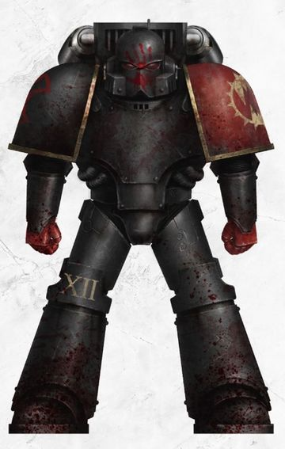
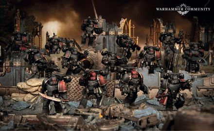

# 0541 红手 Red Hand

精校状态：中文行文已逐段精校，部分术语仍为暂定

分类：概念

原文来源：https://www.bilibili.com/opus/1032883044247142402

原作者：帝国神选罐头

原文时间：2025年02月12日 09:53

[返回分类目录](目录.md) · [全书目录](../../目录.md)

<!-- A0541-B0001 -->
**英文原文**

The Red Hand, also known as the Ravagers, were the elite of the World Eaters Destroyer Squads, during the Great Crusade and Horus Heresy.

<!-- /A0541-B0001 -->

<!-- A0541-B0002 -->

原译文

红手，也被称为掠夺者，是大远征和荷鲁斯叛乱期间吞世者毁灭者小队的精英。

**校订译文**

红手，也被称为掠夺者，是大远征和荷鲁斯之乱期间吞世者毁灭者小队的精英。

<!-- /A0541-B0002 -->

<!-- A0541-B0003 图片 -->

<!-- A0541-B0004 -->

原译文

Red-Hand Destroyer 红手毁灭者

**校订译文**

Red-Hand Destroyer 红手毁灭者

<!-- /A0541-B0004 -->

<!-- A0541-B0005 -->
## Description 描述

<!-- /A0541-B0005 -->

<!-- A0541-B0006 -->
**英文原文**

Only those Destroyers who bore the World Eaters' Blood Hand on their power armor could have the right to enter its ranks. This mark was earned by those who had demonstrated exemplary ferocity or violence in the name of their Legion. In battle, the Red Hand were consistently in the World Eaters' vanguard, as they sought to prove themselves ever-worthy of bearing the Blood Hand. This led them to fire their Destroyer weaponry at their foes, even if their fellow World Eaters would be caught in the blast. Thus the Red Hand were not drawn together through brotherhood or camaraderie, but instead through rivalry and enmity. As the Horus Heresy developed they were always found in the vanguard, reaping a bloody toll and dressing themselves in gory embellishments.

<!-- /A0541-B0006 -->

<!-- A0541-B0007 -->

原译文

只有那些在他们的动力盔甲上带有吞世者血手的毁灭者才有权进入其队伍。这一标志是由那些以军团名义表现出堪称楷模的凶猛或暴力的人获得的。在战斗中，红手一直是吞世者的先锋，因为他们试图证明自己永远值得拥有血手。这导致他们向敌人发射毁灭者的武器，即使他们的吞世者者同伴也在爆炸中。因此，红手不是通过兄弟情谊或同志情谊团结在一起的，而是通过竞争和敌意。随着荷鲁斯叛乱的发展，他们总是处于先锋地位，收获血腥的代价，并用骇人听闻的装饰打扮自己。

**校订译文**

只有动力护甲上获准绘有吞世者血手徽记的毁灭者，才有资格加入红手。战士须以军团之名展现非凡的凶猛与暴力，才能赢得这一标志。红手总冲在先锋，力图不断证明自己配得上血手。他们向敌人发射毁灭者武器时，甚至不顾同袍也会被爆炸吞没。因此，维系他们的并非兄弟情谊，而是竞争与敌意。荷鲁斯之乱不断升级时，他们始终在前锋大肆屠戮，并用血腥饰物装扮自身。

<!-- /A0541-B0007 -->

<!-- A0541-B0008 图片 -->

<!-- A0541-B0009 -->

原译文

The Red Hand 红手

**校订译文**

The Red Hand 红手

<!-- /A0541-B0009 -->

<!-- A0541-B0010 -->
**英文原文**

In battle, they could be equipped with Jump Packs and carried melee weapons, that were reminiscent of the ritualistic gladiatorial weapons of ancient Romanii. Also as a result of their Destroyer weaponry which included Phosphex, Melta, and Radiation Grenades, the Red Hand's power armors were left heavily damaged, though were also still operational. When they were grouped in squadrons, the Red Hand were individually referred to as Ravagers and were led by officers known as the Blood Bonded.

<!-- /A0541-B0010 -->

<!-- A0541-B0011 -->

原译文

在战斗中，他们可以配备跳跃背包并携带近战武器，这让人想起古代罗马尼亚人的仪式性角斗士武器。此外，由于他们的毁灭者武器包括磷化、热熔和辐射手榴弹，红手的动力盔甲严重受损，但仍在运行。当他们被分成中队时，红手被单独称为掠夺者，并由被称为血契的军官领导。

**校订译文**

作战时，红手可装备跳跃背包，携带类似古代罗马人仪式角斗兵器的近战武器。他们使用磷化武器、热熔武器与辐射手榴弹等毁灭者装备，连自身动力护甲也因此严重受损，却仍能运作。编为小队后，成员称为掠夺者，由称作血契者的军官率领。

**校注：** Romanii在此指向古罗马式角斗传统，原译罗马尼亚人混淆名称。Phosphex沿本书1178/1365磷化武器，不作为化学工艺“磷化”；Blood Bonded为军官称号，补者以免与血契组织混淆。

<!-- /A0541-B0011 -->

本篇核心术语与暂定项

以下列出本篇出现的英文原形及核心术语表用词。同形词可能指不同对象，具体词义以本篇正文和校注为准；单复数、别名和仅见于图注的名称可能尚未列入。完整候选见[术语表](../../术语表/双语术语候选.csv)。

| 英文 | 采用中文 | 状态 |
| --- | --- | --- |
| World Eaters | 吞世者 | 官方已核对 |
| Horus Heresy | 荷鲁斯之乱 | 官方已核对 |
| Great Crusade | 大远征 | 暂定·官方待核 |
| Horus | 荷鲁斯 | 暂定·官方待核 |
| Brotherhood | 兄弟会 | 暂定·官方待核 |
| Ancient | 旗手 | 官方已核对 |
| Destroyer | 毁灭者 | 暂定·官方待核 |
| Red Hand | 血手 | 暂定·官方待核 |
| Vanguard | 先锋 | 暂定·官方待核 |
| Destroyers | 毁灭者 | 暂定·官方待核 |
| Blood Bonded | 血契者 | 暂定·官方待核 |
| Ferocity | 凶猛 | 暂定·官方待核 |
| The Blood | 鲜血 | 暂定·官方待核 |
| Phosphex | 磷化燃剂 | 暂定·官方待核 |

