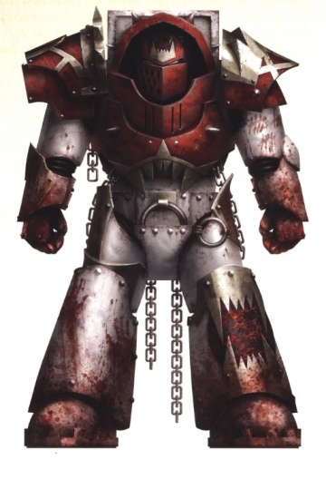
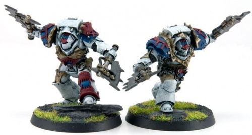

# 0542 红屠夫 Red Butcher

精校状态：中文行文已逐段精校，部分术语仍为暂定

分类：概念

原文来源：https://www.bilibili.com/opus/1032514518840770580

原作者：帝国神选罐头

原文时间：2025年02月11日 10:03

[返回分类目录](目录.md) · [全书目录](../../目录.md)

<!-- A0542-B0001 -->
**英文原文**

The Red Butchers was a specialized World Eaters infantry formation during the Horus Heresy.

<!-- /A0542-B0001 -->

<!-- A0542-B0002 -->

原译文

红屠夫是荷鲁斯叛乱时期专业的吞世者步兵编队。

**校订译文**

红屠夫是荷鲁斯之乱时期吞世者的一种特殊步兵编制。

<!-- /A0542-B0002 -->

<!-- A0542-B0003 图片 -->

<!-- A0542-B0004 -->

原译文

Red Butcher Zhukel Dror 红屠夫朱克尔·德罗尔

**校订译文**

Red Butcher Zhukel Dror 红屠夫朱克尔·德罗尔

<!-- /A0542-B0004 -->

<!-- A0542-B0005 -->
## Overview 概述

<!-- /A0542-B0005 -->

<!-- A0542-B0006 -->
**英文原文**

During the Battle of Isstvan III many World Eaters went completely berserk with rage and bloodlust and only left the battlefield in chains. The Techmarines of the World Eaters later made customized suits of Terminator Armour to serve as both wargear and a means of confinement. These suits were, in effect, mechanical prison cells that could be immobilized with the press of a button.

<!-- /A0542-B0006 -->

<!-- A0542-B0007 -->

原译文

在伊斯塔万三号战役中，许多吞世者因愤怒和嗜血而完全发狂，背束缚着离开了战场。吞世者的技术军士后来制作了定制的终结者盔甲套装，既可以作为战争装备，也可以作为监禁手段。这些套装实际上是机械监狱牢房，只需按下按钮即可使其固定。

**校订译文**

伊斯塔万三号之战中，许多吞世者因狂怒与嗜血彻底失控，只有用锁链绑缚，才能将其带离战场。此后，军团科技战士制作了专用终结者护甲，既作装备，也作牢笼。它们实际上是机械囚室，按下按钮就能锁死动作。

**校注：** Techmarine采用官方科技战士。in chains为被锁链捆住，原“背束缚着”为病句。

<!-- /A0542-B0007 -->

<!-- A0542-B0008 图片 -->

<!-- A0542-B0009 -->

原译文

Red Butchers 红屠夫

**校订译文**

Red Butchers 红屠夫

<!-- /A0542-B0009 -->

<!-- A0542-B0010 -->
**英文原文**

The Red Butchers were unleashed for the first time during the Dropsite Massacre. Few survived the engagement, but they nonetheless ripped through loyalist formations. Moreover, World Eaters that went completely mad in later battles could be imprisoned within recovered suits.

<!-- /A0542-B0010 -->

<!-- A0542-B0011 -->

原译文

在登陆点大屠杀期间，红屠夫首次被释放。虽然很少有人在交战中幸存下来，但他们还是突破了忠诚者的编队。此外，在后来的战斗中完全发疯的吞世者可能会被关进回收的套装里。

**校订译文**

红屠夫首次投入作战，是在登陆点大屠杀中。虽然几乎无人幸存，他们仍撕裂了忠诚派阵线。回收的护甲随后还可用于囚禁其他在战斗中彻底发狂的吞世者。

<!-- /A0542-B0011 -->

<!-- A0542-B0012 -->
**英文原文**

The Red Butchers were adorned in Cataphractii Pattern Terminator Armour and armed with twin power axes. Their squad leaders were known as The Devoured, who often wielded two chainfists.

<!-- /A0542-B0012 -->

<!-- A0542-B0013 -->

原译文

红屠夫身着铁骑型终结者盔甲，装备有双持动力斧。他们的队长被称为被吞噬者，经常挥舞着两个链锯拳。

**校订译文**

红屠夫身披铁骑型终结者护甲，双持动力斧。小队长被称为被吞噬者，常装备一对链锯拳。

<!-- /A0542-B0013 -->

<!-- A0542-B0014 -->
**英文原文**

Millennia later, the Red Butchers still exist, but it is a title given to the World Eaters's elite members. They are all vicious killers, who have committed atrocities beyond number in the Chaos God Khorne's name.

<!-- /A0542-B0014 -->

<!-- A0542-B0015 -->

原译文

几千年后，红屠夫仍然存在，但这是吞世者精英成员的头衔。他们都是凶残的杀手，以混沌之神恐虐的名义犯下了无数暴行。

**校订译文**

数千年后，红屠夫仍然存在，但此时它已成为吞世者精英的头衔。这些凶残杀手以混沌神恐虐之名，犯下无数暴行。

**校注：** 保留单位含义随时代改变：早期为锁入护甲的狂人，后期为精锐头衔；不将两阶段强行等同。

<!-- /A0542-B0015 -->

<!-- A0542-B0016 -->
## Known Red Butchers 著名红屠夫

<!-- /A0542-B0016 -->

<!-- A0542-B0017 -->
**英文原文**

Zhukel Dror - Horus Heresy-era

<!-- /A0542-B0017 -->

<!-- A0542-B0018 -->

原译文

朱克尔·德罗尔 - 荷鲁斯叛乱时期

**校订译文**

朱克尔·德罗尔 - 荷鲁斯之乱时期

<!-- /A0542-B0018 -->

本篇核心术语与暂定项

以下列出本篇出现的英文原形及核心术语表用词。同形词可能指不同对象，具体词义以本篇正文和校注为准；单复数、别名和仅见于图注的名称可能尚未列入。完整候选见[术语表](../../术语表/双语术语候选.csv)。

| 英文 | 采用中文 | 状态 |
| --- | --- | --- |
| World Eaters | 吞世者 | 官方已核对 |
| Terminator | 终结者 | 官方已核对 |
| Horus Heresy | 荷鲁斯之乱 | 官方已核对 |
| Khorne | 恐虐 | 官方已核对 |
| Horus | 荷鲁斯 | 暂定·官方待核 |
| Isstvan III | 伊斯塔万三号 | 暂定·官方待核 |
| Isstvan | 伊斯塔万 | 暂定·官方待核 |
| Terminator Armour | 终结者盔甲 | 暂定·官方待核 |
| Cataphractii Pattern | 铁骑型 | 暂定·官方待核 |

