# 0545 XIV - 死亡守卫 Death Guard

精校状态：中文行文已逐段精校，部分术语仍为暂定

分类：概念

原文来源：https://www.bilibili.com/opus/1100027968786268162

原作者：帝国神选罐头

原文时间：2025年08月12日 08:30

[返回分类目录](目录.md) · [全书目录](../../目录.md)

<!-- A0545-B0001 -->
**英文原文**

The Death Guard, formerly known as the Dusk Raiders and known amongst themselves as the Unbroken, were the XIV Legion of the original twenty Space Marine Legions. Their Primarch is Mortarion, who relocated their base to his homeworld of Barbarus after his discovery by the Emperor. During the Horus Heresy, Mortarion and the majority of the Legion swore allegiance to Horus, becoming one of the nine Traitor Legions who betrayed the Emperor. After Barbarus was destroyed during the Heresy, they relocated to Munificence inside the Eye of Terror.

<!-- /A0545-B0001 -->

<!-- A0545-B0002 -->

原译文

死亡守卫，前身为黄昏突袭者，在它们之间被称为不破者，是最初的二十个星际战士军团中的第十四军团。他们的原体是莫塔里安，在帝皇发现他后，他将基地迁至他的家园世界巴巴鲁斯。在荷鲁斯叛乱期间，莫塔里安和军团的大多数宣誓效忠荷鲁斯，成为背叛帝皇的九个叛徒军团之一。巴巴鲁斯在叛乱期间被摧毁后，他们搬到了恐惧之眼内的慷慨星。

**校订译文**

死亡守卫前身为黄昏突袭者，内部自称不破者，是最初二十支星际战士军团中的第十四军团。其原体莫塔里安被帝皇发现后，将军团基地迁至自己的母星巴巴鲁斯。荷鲁斯之乱期间，他与军团多数成员向荷鲁斯宣誓效忠，成为背叛帝皇的九支叛徒军团之一。巴巴鲁斯在叛乱中毁灭后，他们迁至恐惧之眼内的慷慨星。

<!-- /A0545-B0002 -->

<!-- A0545-B0003 -->
**英文原文**

Because of Barbarus's toxic environment, the Death Guard took great pride in their resistance to poisons, disease, and mortality in general. This fascination led them to worship the Chaos God Nurgle and in return he infests their armour with pestilence and disease, and elevated Mortarion to a Daemon Prince.

<!-- /A0545-B0003 -->

<!-- A0545-B0004 -->

原译文

由于巴巴鲁斯的有毒环境，死亡守卫对他们抵抗毒药、疾病和死亡的能力感到非常自豪。这种迷恋促使他们崇拜混沌之神纳垢，作为回报，他用瘟疫和疾病感染了他们的盔甲，并将莫塔里安升格为恶魔王子。

**校订译文**

巴巴鲁斯的剧毒环境，使死亡守卫以抵御毒物、疾病乃至死亡的能力为傲。对这种耐受力的执迷，将他们引向对混沌神纳垢的崇拜。作为回报，纳垢让其护甲遍布瘟疫与疾病，并将莫塔里安升格为恶魔亲王。

**校注：** 本段以耐受力崇拜解释堕落，后文87则叙述瘟疫胁迫，保留不同叙述侧重，不把因果关系擅自统一。

<!-- /A0545-B0004 -->

<!-- A0545-B0005 图片 -->
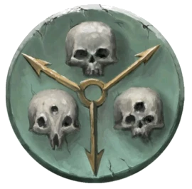

<!-- A0545-B0006 图片 -->
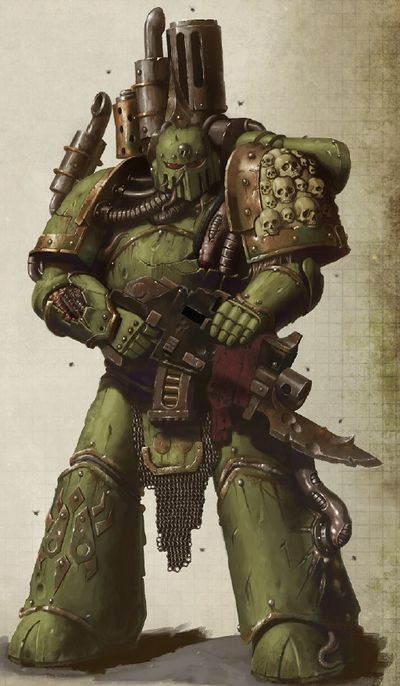

<!-- A0545-B0007 -->
**英文原文**

Legion Number:XIV

<!-- /A0545-B0007 -->

<!-- A0545-B0008 -->

原译文

军团编号：XIV

**校订译文**

军团编号：XIV

<!-- /A0545-B0008 -->

<!-- A0545-B0009 -->
**英文原文**

Primarch:Mortarion

<!-- /A0545-B0009 -->

<!-- A0545-B0010 -->

原译文

原体：莫塔里安

**校订译文**

原体：莫塔里安

<!-- /A0545-B0010 -->

<!-- A0545-B0011 -->
**英文原文**

Homeworld:Barbarus

<!-- /A0545-B0011 -->

<!-- A0545-B0012 -->

原译文

家园世界：巴巴鲁斯

**校订译文**

家园世界：巴巴鲁斯

<!-- /A0545-B0012 -->

<!-- A0545-B0013 -->
**英文原文**

Current Base:Munificence in the Eye of Terror

<!-- /A0545-B0013 -->

<!-- A0545-B0014 -->

原译文

当前基地：恐惧之眼内的慷慨星

**校订译文**

当前基地：恐惧之眼内的慷慨星

<!-- /A0545-B0014 -->

<!-- A0545-B0015 -->
**英文原文**

Chaos Affiliation:Nurgle

<!-- /A0545-B0015 -->

<!-- A0545-B0016 -->

原译文

混沌隶属：纳垢

**校订译文**

混沌隶属：纳垢

<!-- /A0545-B0016 -->

<!-- A0545-B0017 -->
**英文原文**

Colours:Putrid Green, Rusty Iron trim

<!-- /A0545-B0017 -->

<!-- A0545-B0018 -->

原译文

颜色：腐绿色，铁锈色镶边

**校订译文**

颜色：腐绿色，铁锈色镶边

<!-- /A0545-B0018 -->

<!-- A0545-B0019 -->
**英文原文**

Specialty:Chemical & Biological Warfare, Bombardment, Heavy assault and attrition

<!-- /A0545-B0019 -->

<!-- A0545-B0020 -->

原译文

专业：化学和生物战、轰炸、重型突击和消耗

**校订译文**

专长：化学战与生物战、炮击、重型突击、消耗战。

<!-- /A0545-B0020 -->

<!-- A0545-B0021 -->
**英文原文**

Known Warbands:

<!-- /A0545-B0021 -->

<!-- A0545-B0022 -->

原译文

著名战帮：

**校订译文**

著名战帮：

<!-- /A0545-B0022 -->

<!-- A0545-B0023 -->

原译文

Apostles of Contagion 传染使徒

**校订译文**

Apostles of Contagion 传染使徒

<!-- /A0545-B0023 -->

<!-- A0545-B0024 -->
**英文原文**

Bilious Ones, Bringers of Putrid Salvation, Brotherhood of Reaping

<!-- /A0545-B0024 -->

<!-- A0545-B0025 -->

原译文

胆汁众，腐烂救赎使者，收割兄弟会

**校订译文**

胆汁众，腐烂救赎使者，收割兄弟会

<!-- /A0545-B0025 -->

<!-- A0545-B0026 -->
**英文原文**

Carrion Brotherhood, Carrion Hounds, Children of Blain, Congregation of the Blessed Foul, Corpsemakers

<!-- /A0545-B0026 -->

<!-- A0545-B0027 -->

原译文

腐尸兄弟会，腐肉猎犬，布莱恩之子，受祝污秽会，尸体制造者

**校订译文**

腐尸兄弟会，腐肉猎犬，布莱恩之子，受祝污秽会，尸体制造者

<!-- /A0545-B0027 -->

<!-- A0545-B0028 -->
**英文原文**

Disciples of Pustulence, Dolorous Gnaw, Drowned Lords

<!-- /A0545-B0028 -->

<!-- A0545-B0029 -->

原译文

脓疮使徒，悲哀之噬，溺水领主

**校订译文**

脓疮使徒，悲哀之噬，溺水领主

<!-- /A0545-B0029 -->

<!-- A0545-B0030 -->

原译文

Empyrion's Blight 帝国之疫

**校订译文**

Empyrion's Blight 埃姆皮里昂之疫

<!-- /A0545-B0030 -->

<!-- A0545-B0031 -->
**英文原文**

Favoured Sons, Fecund Ones, Festering Scar, Festerlung Brotherhood, Fifth Sept, Filthfavoured

<!-- /A0545-B0031 -->

<!-- A0545-B0032 -->

原译文

受宠之子，肥沃众，溃烂疤痕，溃烂之肺兄弟会，第五氏族，污秽偏爱

**校订译文**

受宠之子，肥沃众，溃烂疤痕，溃烂之肺兄弟会，第五氏族，污秽偏爱

<!-- /A0545-B0032 -->

<!-- A0545-B0033 -->

原译文

Glooming Lords 悲观领主

**校订译文**

Glooming Lords 悲观领主

<!-- /A0545-B0033 -->

<!-- A0545-B0034 -->
**英文原文**

Hand of Filth, Heralds of Despair, Heralds of the Fly, Hollow Ones

<!-- /A0545-B0034 -->

<!-- A0545-B0035 -->

原译文

污秽之手，绝望使者，苍蝇使者，空洞众

**校订译文**

污秽之手，绝望使者，苍蝇使者，空洞众

<!-- /A0545-B0035 -->

<!-- A0545-B0036 -->

原译文

Infested Brethren 感染兄弟

**校订译文**

Infested Brethren 感染兄弟

<!-- /A0545-B0036 -->

<!-- A0545-B0037 -->
**英文原文**

Legion Host, Lords of Decay , Lords of Silence

<!-- /A0545-B0037 -->

<!-- A0545-B0038 -->

原译文

军团宿主，腐朽领主，寂静领主

**校订译文**

军团大军、腐朽领主、寂静领主。

<!-- /A0545-B0038 -->

<!-- A0545-B0039 -->
**英文原文**

Missionaries of Putridity, Maggotborn, Maggot Lords, Mouldering Claw

<!-- /A0545-B0039 -->

<!-- A0545-B0040 -->

原译文

腐败传教士，蛆虫之裔，蛆虫领主，腐烂之爪

**校订译文**

腐败传教士，蛆虫之裔，蛆虫领主，腐烂之爪

<!-- /A0545-B0040 -->

<!-- A0545-B0041 -->

原译文

Neverdead 不死者

**校订译文**

Neverdead 不死者

<!-- /A0545-B0041 -->

<!-- A0545-B0042 -->
**英文原文**

Pallid Hand, Poisoned Chalice, Poxherders, Pox Mortis, Prophets of Plague, Prophets of the Seven, Pus Brothers, Putrid Brotherhood, Putrid Choir

<!-- /A0545-B0042 -->

<!-- A0545-B0043 -->

原译文

苍白之手，毒素圣杯，痘疹牧民，死亡痘疹，瘟疫先知，七人先知，脓液兄弟，腐烂兄弟会，腐烂唱诗班

**校订译文**

苍白之手、毒素圣杯、痘疹牧民、死亡痘疹、瘟疫先知、七之先知、脓液兄弟、腐烂兄弟会、腐烂唱诗班。

<!-- /A0545-B0043 -->

<!-- A0545-B0044 -->
**英文原文**

Rotworm Brotherhood, Rusted Claws, Rustwalkers

<!-- /A0545-B0044 -->

<!-- A0545-B0045 -->

原译文

蛔虫兄弟会，锈蚀之爪，锈蚀行者

**校订译文**

腐虫兄弟会、锈蚀之爪、锈蚀行者。

<!-- /A0545-B0045 -->

<!-- A0545-B0046 -->
**英文原文**

Selminster's Curse, Sevenfold Filth, Seventh Knell, Seventh-day Morbidians, Sevens, Smogrot Brotherhood, Sons of Glorious Decay, Sons of the Maggot, Sons of Rot, Sons of Sorrow, Suppurant Sting

<!-- /A0545-B0046 -->

<!-- A0545-B0047 -->

原译文

塞尔明斯特的诅咒，七重污秽，第七钟声，七日死亡，七人，腐烟兄弟会，光荣腐朽之子，蛆虫之子，腐烂之子，悲伤之子，脓疮之刺

**校订译文**

塞尔明斯特的诅咒，七重污秽，第七钟声，七日死亡，七人，腐烟兄弟会，光荣腐朽之子，蛆虫之子，腐烂之子，悲伤之子，脓疮之刺

<!-- /A0545-B0047 -->

<!-- A0545-B0048 -->
**英文原文**

The Tainted , Tainted Cohort, Tainted Lung, Tainted Sons, Tide of Filth, The Tollguard

<!-- /A0545-B0048 -->

<!-- A0545-B0049 -->

原译文

污染者，污染大队，污染之肺，污染之子，污秽浪潮，征收守卫

**校订译文**

污染者，污染大队，污染之肺，污染之子，污秽浪潮，征收守卫

<!-- /A0545-B0049 -->

<!-- A0545-B0050 -->

原译文

Venomariners 毒液战士

**校订译文**

Venomariners 毒液战士

<!-- /A0545-B0050 -->

<!-- A0545-B0051 -->
**英文原文**

Weeping Legion, Wormrot Brotherhood

<!-- /A0545-B0051 -->

<!-- A0545-B0052 -->

原译文

哭泣军团，虫蛀兄弟会

**校订译文**

哭泣军团，虫蛀兄弟会

<!-- /A0545-B0052 -->

<!-- A0545-B0053 -->
## History 历史

<!-- /A0545-B0053 -->

<!-- A0545-B0054 -->
### Dusk Raiders 黄昏突袭者

<!-- /A0545-B0054 -->

<!-- A0545-B0055 -->
**英文原文**

The base gene-seed stock of the Dusk Raiders, originally known as the XIVth Legion, came from Terra or more specifically the warlike and tough clans of Albia. In the Unification Wars the XIVth Legion quickly developed the use of tactics and methods of warfare that their ironside fore-bearers would have found familiar. Operating in the role of heavy infantry, they were experts at survival, endurance, and stubborn defence. Their grey Power Armour began to carry battle decorations as well as the modified imagery of Albia. As the Unification Wars came to an end and the Great Crusade began, the Emperor gave them the title of the Dusk Raiders, a nod to their use of the ancient Albian tactic of conducting major ground attacks at twilight when the shift of light confused an enemy's watch and gathering shadow would advance across open ground.

<!-- /A0545-B0055 -->

<!-- A0545-B0056 -->

原译文

黄昏突袭者的基础基因种子库，最初被称为第十四军团，来自泰拉，或者更具体地说，来自阿尔比亚好战和强硬的氏族。在统一战争中，第十四军团迅速开发了他们的铁甲军前辈所熟悉的战术和战争方法。他们以重步兵的身份作战，是生存、耐力和顽强防御的专家。他们的灰色动力盔甲开始带有战斗装饰以及阿尔比亚的修改图像。随着统一战争的结束和大远征的开始，帝皇给了他们黄昏突袭者的称号，这是对他们使用古代阿尔比亚战术的认可，即在黄昏时分进行重大地面攻击，此时光线的变化会扰乱敌人的观察，聚集的阴影会穿过开阔的地面。

**校订译文**

黄昏突袭者最初称第十四军团，其早期战士来自泰拉，具体而言，是阿尔比亚好战而坚韧的氏族。统一战争中，军团很快发展出类似祖辈铁甲战士的作战方式。他们作为重步兵行动，善于生存、忍耐与顽强防守。灰色动力护甲逐渐添上战功饰物，以及改造后的阿尔比亚图案。统一战争结束、大远征开启时，帝皇赐予他们“黄昏突袭者”之名，表彰他们沿用的阿尔比亚古老战术：趁暮色发动大规模地面进攻，借光线变化干扰敌方哨兵观察，利用不断延伸的阴影穿过开阔地。

**校注：** 英文用base gene-seed stock指向泰拉氏族，与后文祖辈作战传统连读，语境实际在谈早期兵源；中文按兵源表达。未据此改写莫塔里安基因种子的生物学来源。

<!-- /A0545-B0056 -->

<!-- A0545-B0057 图片 -->
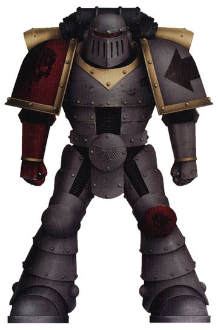

<!-- A0545-B0058 -->

原译文

Dusk Raider Space Marine 黄昏突袭者星际战士

**校订译文**

Dusk Raider Space Marine 黄昏突袭者星际战士

<!-- /A0545-B0058 -->

<!-- A0545-B0059 -->
**英文原文**

The Dusk Raiders' armour was originally unpainted, but with their right arm and both shoulders coloured crimson. This was done with the intent to show their enemies that they were the Emperor's red right hand, relentless and unstoppable. Many enemies simply threw down their weapons at nightfall so they didn't have to fight the terrifying Dusk Raiders.

<!-- /A0545-B0059 -->

<!-- A0545-B0060 -->

原译文

黄昏突袭者的盔甲最初没有上漆，但他们的右臂和双肩都涂成了深红色。这样做的目的是向他们的敌人表明，他们是帝皇的红色右手，无情而不可阻挡。许多敌人只是在夜幕降临时放下武器，这样他们就不必与可怕的黄昏突袭者作战。

**校订译文**

黄昏突袭者的护甲主体原本不上色，只有右臂与双肩涂成深红，以向敌人宣告：他们是帝皇的赤红右手，无情且不可阻挡。许多敌人一到夜幕降临便放下武器，不愿与可怕的军团交战。

<!-- /A0545-B0060 -->

<!-- A0545-B0061 -->
**英文原文**

For more then eight decades the Dusk Raiders fought across the Galaxy in the Great Crusade, earning a fierce reputation by failing to reunite with their Primarch.

<!-- /A0545-B0061 -->

<!-- A0545-B0062 -->

原译文

在80多年的时间里，黄昏突袭者在大远征中穿越银河系作战，在未能与他们的原体重聚的情况下赢得了激烈的声誉。

**校订译文**

此后八十余年，黄昏突袭者在大远征中征战银河，威名日盛，却始终未能与原体重聚。

**校注：** 英文earning ... by failing语法和因果不通，疑by误作but；按并列事实译为赢得威名但尚未重聚，未写成失败使其闻名。

<!-- /A0545-B0062 -->

<!-- A0545-B0063 -->
### The Great Crusade 大远征

<!-- /A0545-B0063 -->

<!-- A0545-B0064 -->
### Formation 形成

<!-- /A0545-B0064 -->

<!-- A0545-B0065 -->
**英文原文**

When Mortarion was found by the Emperor upon the troubled world of Barbarus, he was swiftly given control of his Legion. Upon first seeing them he told them, "You are my unbroken blades. You are the Death Guard." The Legion's name was then changed in accordance with this decree, and Mortarion's words engraved above the airlock door of the Battle Barge Reaper's Scythe in honour of the moment. While the Legion was known as the Death Guard formally, its older members referred to themselves as the Unbroken, after Mortarion's words, in a tradition that still continues. Mortarion based the new Death Guard on his armoured toxin-resistant fighters of the same name that had fought beside him on Barbarus in the Overlord Wars. Their armour's colour was changed, and whilst their main armour remained unpainted, the trim colour became dark green. Mortarion's veterans of Barbarus formed the core of his new Legion.

<!-- /A0545-B0065 -->

<!-- A0545-B0066 -->

原译文

当莫塔里安被帝皇发现在动荡的巴巴鲁斯世界时，他很快就控制了他的军团。第一次见到他们时，他告诉他们：“你们是我不可折断的刀刃。你们是死亡守卫。”然后，根据这项法令，军团的名字被更改了，莫塔里安的话刻在了战斗驳船收割之镰号的气闸门上方，以纪念这一刻。虽然军团正式被称为死亡守卫，但根据莫塔里安的话，其老成员称自己为不破者，这一传统至今仍在延续。莫塔里安以他的装甲抗毒战士为基础组建了新的死亡守卫，这些战士与他在霸主战争中与他并肩作战的巴巴鲁斯战士同名。他们的盔甲颜色发生了变化，虽然他们的主盔甲没有上漆，但装饰颜色变成了深绿色。莫塔里安在巴巴鲁斯的老兵组成了他的新军团的核心。

**校订译文**

帝皇在动荡的巴巴鲁斯找到莫塔里安后，很快将军团交给他。初次见面，他告诉战士们：“你们是我不折的利刃。你们是死亡守卫。”军团随即改名，这句话也刻在战斗驳船收割之镰号的气闸门上，纪念重逢。正式名称虽为死亡守卫，老成员仍依原体之言自称不破者，这一传统延续至今。莫塔里安以自己在巴巴鲁斯霸主战争中率领的同名武装为范本，塑造新军团；那支旧部身穿抗毒护甲，曾与他并肩作战。军团护甲主体仍保留未上色的金属外观，饰边则改为深绿。巴巴鲁斯老兵构成了新军团的核心。

<!-- /A0545-B0066 -->

<!-- A0545-B0067 图片 -->
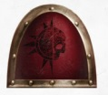

<!-- A0545-B0068 -->

原译文

Symbol of the Dusk Raiders 黄昏突袭者标志

**校订译文**

Symbol of the Dusk Raiders 黄昏突袭者标志

<!-- /A0545-B0068 -->

<!-- A0545-B0069 -->
### Combat Disposition and Record 作战部署和记录

<!-- /A0545-B0069 -->

<!-- A0545-B0070 -->
**英文原文**

Before the Horus Heresy, the Death Guard differed from the other 17 known Legions in that they had only seven Great Companies, although these held far more men than those of other Legions such as the Ultramarines or Space Wolves. There were three privileged titles held by captains of the Death Guard. The captain of the First Company was known as the First Captain, the captain of the Second Company was known as Commander, and the captain of the Seventh Company was known as Battle-Captain.

<!-- /A0545-B0070 -->

<!-- A0545-B0071 -->

原译文

在荷鲁斯叛乱之前，死亡守卫与其他17个已知军团的不同之处在于，他们只有7个大连，尽管这些连队的人数远远超过其他军团，如极限战士或太空野狼。死亡守卫连长有三个特权头衔。第一连队的连长被称为第一连长，第二连队的连长被称为指挥官，第七连队的连长则被称为战斗连长。

**校订译文**

荷鲁斯之乱前，死亡守卫与其他十七支已知军团不同，只设七个大连，但单连兵力远多于极限战士、太空野狼等军团的对应编制。其中三位连长享有特殊称号：第一连为第一连长，第二连为指挥官，第七连为战斗连长。

<!-- /A0545-B0071 -->

<!-- A0545-B0072 -->
**英文原文**

The Death Guard tended to be organised into units of foot-slogging infantry, rather than mechanised squads. Mortarion ensured that his men were well-equipped and highly-trained. He also ensured that they could fight in almost any kind of atmosphere, and placed little emphasis on specialised units using jump packs or bikes. The Death Guard did not have dedicated Assault and Tactical Squads. Every Marine was equipped with a bolter, bolt pistol and close combat weapon and told to fight with whatever weapon circumstance dictated. The Legion was also well known for its use of Terminator Armour. Possibly as a result of this, the Death Guard were highly successful at high-risk boarding and close-quarter operations such as space hulk clearance.

<!-- /A0545-B0072 -->

<!-- A0545-B0073 -->

原译文

死亡守卫倾向于组织成徒步步兵部队，而不是机械化小队。莫塔里安确保他的部下装备精良，训练有素。他还确保他们可以在几乎任何环境中作战，并且很少强调使用跳跃背包或摩托的特种部队。死亡卫队没有专门的突击小队和战术小队。每个星际战士都配备了一个爆矢枪、爆矢手枪和近战武器，并被告知要根据武器情况进行战斗。军团也以使用终结者盔甲而闻名。可能正是由于这一点，死亡守卫在高风险跳帮和近距离行动（如太空废船清理）中取得了巨大成功。

**校订译文**

死亡守卫以徒步步兵为主，少用机械化小队。莫塔里安要求部下装备精良、训练充分，能在几乎任何大气环境中战斗，却不特别重视跳跃背包或摩托等专门兵种。军团不设专职突击小队或战术小队，每名战士都携带爆矢枪、爆矢手枪及近战武器，根据形势自行选择。军团也以广泛使用终结者护甲著称；或许正因如此，他们尤其擅长高风险跳帮与太空废船清剿等近距离行动。

**校注：** 根据战况选武器，不是根据武器情况决定战斗；atmosphere强调大气环境。

<!-- /A0545-B0073 -->

<!-- A0545-B0074 -->
**英文原文**

By the time of the Horus Heresy, the Death Guard is known to have had roughly 95,000 Space Marines.

<!-- /A0545-B0074 -->

<!-- A0545-B0075 -->

原译文

到荷鲁斯叛乱时期，死亡守卫已经拥有大约95000名星际战士。

**校订译文**

到荷鲁斯之乱时期，死亡守卫已经拥有大约95000名星际战士。

<!-- /A0545-B0075 -->

<!-- A0545-B0076 -->
### The Horus Heresy 荷鲁斯之乱

原题：The Horus Heresy 荷鲁斯叛乱

<!-- /A0545-B0076 -->

<!-- A0545-B0077 -->
**英文原文**

At the beginning of the Horus Heresy, many Death Guard who remained loyal to the Emperor were massacred on Isstvan III by their fellow Space Marines, including Captain Ullis Temeter. Roughly a third of the Legion was still loyal to the Emperor. Shortly after, they battled Imperial forces in the Drop Site Massacre. During which the Death Guard would deploy the entirety of their armoured reserves to combat their loyalist counterparts. They suffered brutal losses against the loyalists, to such an extent that the Death Guards capacity to wage armoured war was left severely degraded. A number of Death Guard Marines, and one Luna Wolf who renounced his Sons of Horus status, led by Battle-Captain Nathaniel Garro of the 7th Company, remained loyal to the Emperor. They formed part of the crew of the Eisenstein, a frigate which ran the Traitor blockade in the Isstvan system in order to bring news of Horus' descent into Chaos to the Emperor on Terra.

<!-- /A0545-B0077 -->

<!-- A0545-B0078 -->

原译文

在荷鲁斯叛乱开始时，许多忠于帝皇的死亡守卫在伊斯塔万三号上被他们的星际战士同伴屠杀，其中包括乌尔里斯·特梅特连长。大约三分之一的军团仍然忠于帝皇。不久之后，他们在登陆点大屠杀中与帝国军队作战。在此期间，死亡守卫部署其全部预备装甲部队，与忠诚的对手作战。他们在与忠诚者的对抗中遭受了残酷的损失，以至于死亡卫队发动装甲战争的能力严重下降。由第七连队的战斗连长纳撒尼尔·伽罗领导的一些死亡守卫星际战士和一名仍然忠于帝皇的放弃荷鲁斯之子身份的影月苍狼。他们组成了爱森斯坦号护卫舰的一部分，这艘护卫舰在伊斯塔万星系中冲破叛徒封锁，以便将荷鲁斯堕入混沌的消息带给泰拉上的帝皇。

**校订译文**

荷鲁斯之乱初期，约三分之一死亡守卫仍忠于帝皇。包括乌尔里斯·特梅特连长在内的许多忠诚派，在伊斯塔万三号遭昔日同袍屠杀。不久后，军团叛军参加登陆点大屠杀，将全部装甲预备队投入与忠诚军团的交战，损失惨重，此后装甲作战能力严重削弱。另有一些死亡守卫，以及一名拒绝荷鲁斯之子身份、重称影月苍狼的战士，在第七连战斗连长纳撒尼尔·伽罗率领下坚守忠诚。他们登上爱森斯坦号护卫舰，冲破伊斯塔万星系叛军封锁，意图向泰拉的帝皇报告荷鲁斯已堕入混沌。

**校注：** 拆清忠诚派遇害、叛军参战、幸存忠诚派出逃三条线，原文相邻they易导致主语错接。

<!-- /A0545-B0078 -->

<!-- A0545-B0079 图片 -->
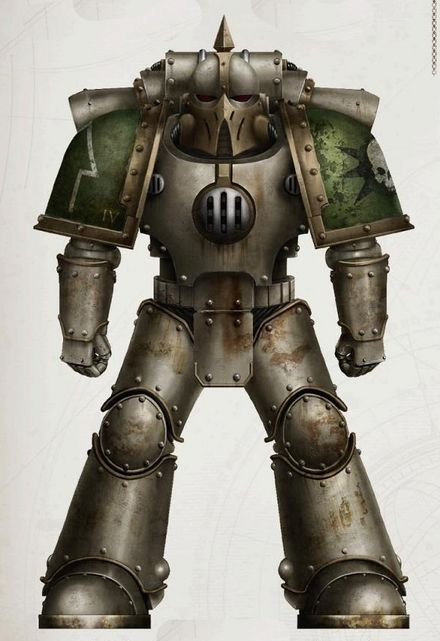

<!-- A0545-B0080 -->

原译文

Heresy-era Death Guard Marine 叛乱时期死亡守卫战士

**校订译文**

Heresy-era Death Guard Marine 叛乱时期死亡守卫战士

<!-- /A0545-B0080 -->

<!-- A0545-B0081 -->
**英文原文**

During the Horus Heresy, the Death Guard joined Warmaster Horus in many battles and raids on the Imperium. The Lord of Death split his fleet, commanding one himself and Calas Typhon the other. Mortarion's smaller fleet led a failed attempt on Prospero to convince Jaghatai Khan and the White Scars to join with them, and the Mortarion found himself in combat with the Great Khan. After the White Scars managed to abandon the Death Guard fleet, Mortarion had his Legion embark on a spiteful purge of the Prospero System. Mortarion then fought alongside Horus in the Battle of Dwell and Battle of Molech before rejoining Typhon's main fleet, which had been waging a campaign of misdirection and misery against the Dark Angels since the Battle of Perditus.

<!-- /A0545-B0081 -->

<!-- A0545-B0082 -->

原译文

在荷鲁斯叛乱期间，死亡守卫加入了战帅荷鲁斯，对帝国进行了多次战斗和突袭。死亡领主分裂了他的舰队，亲自指挥一支，卡拉斯·泰丰指挥另一支。莫塔里安的小舰队在普罗斯佩罗上失败了，试图说服察合台可汗和白色伤疤加入他们，莫塔里安发现自己与可汗战斗。在白色疤痕成功放弃死亡守卫舰队后，莫塔里安让他的军团开始对普洛斯彼罗星系进行恶意清洗。莫塔里安随后在德维尔之战和摩洛之战中与荷鲁斯并肩作战，然后重新加入了泰丰的主要舰队，该舰队自佩迪图斯之战以来一直在对黑暗天使发动误导和痛苦的战役。

**校订译文**

死亡守卫在叛乱中随战帅荷鲁斯多次攻袭帝国。莫塔里安将舰队一分为二，一支亲自指挥，另一支交给卡拉斯·提丰。他率规模较小的舰队前往普罗斯佩罗，试图劝察合台可汗与白疤倒戈，却未能成功，反而与大可汗交手。白疤摆脱舰队后，他为泄愤，下令清洗整个普罗斯佩罗星系。随后，莫塔里安在德维尔与摩洛两场战役中协助荷鲁斯，再与提丰的主舰队会合。提丰自佩迪图斯之战起，一直以迷惑、牵制和折磨敌人的方式对抗黑暗天使。

<!-- /A0545-B0082 -->

<!-- A0545-B0083 -->
**英文原文**

Later, Horus himself tasked Mortarion with finding and destroying the White Scars. Eager to settle the score with the Great Khan, the Death Guard and Emperor's Children allies under Eidolon cornered the Scars at the Dark Glass, but failed to destroy them in the Battle of Catallus. Angered, Mortarion realized that his divided legion was hampering his war effort and ordered Eidolon to find Typhon and his splinter fleet. On the world of Ynyx, Typhon again showed himself and was secretly disappointed that Mortarion and his forces had yet to embrace the Ruinious Powers.

<!-- /A0545-B0083 -->

<!-- A0545-B0084 -->

原译文

后来，荷鲁斯亲自委托莫塔里安寻找并摧毁白色疤痕。为了与可汗算账，死亡守卫和艾多隆领导的皇帝之子盟友将黑暗琉璃上的白色疤痕逼到了角落，但在卡塔洛斯之战中未能将其摧毁。莫塔里安感到愤怒，意识到他的分裂军团阻碍了他的战争努力，并命令艾多隆找到泰丰和他的分裂舰队。在依尼克斯世界，泰丰再次出现，并对莫塔里安和他的部队尚未接受毁灭之力感到失望。

**校订译文**

后来，荷鲁斯亲令莫塔里安追歼白疤。他急于向大可汗报仇，便与艾多隆率领的帝皇之子联手，在黑暗琉璃将白疤逼入绝境，却仍未能于卡塔洛斯之战中将其消灭。愤怒的莫塔里安意识到，兵力分散拖累了自己的行动，于是命艾多隆寻找提丰及其分舰队。提丰在依尼克斯再度现身，发现原体和军团主力仍未投向毁灭诸力，暗自失望。

<!-- /A0545-B0084 -->

<!-- A0545-B0085 -->
### Fall of the Death Guard 死亡守卫的堕落

<!-- /A0545-B0085 -->

<!-- A0545-B0086 -->
**英文原文**

When the Death Guard's fleet embarked for Terra Typhon made his move. The First Captain had his Grave Wardens frame and kill the Navigators, whom he alleged remained loyal to the Emperor, and assured his Primarch that he could lead the fleet to Terra without their help using his own corps of Librarians. Instead, he led them into a trap - becalming the Death Guard fleet in the warp, adrift, helpless and at the mercy of Chaos. Then came the Destroyer Plague and the Death Guard were struck down, but Typhon received his reward from "Grandfather Nurgle" and he absorbed the full power of the plague from Ignatius Grulgor. His body became home to the flies of Nurgle, his armour a hive of pestilence. He then became Typhus, Herald of Nurgle and the Host of the Destroyer Hive. Mortarion himself succumb to the Destroyer Plague, facing its agony with his sons. Nurgle himself came before Mortarion, stating that if he did not pledge himself to the Plague God they would be doomed to torturous undeath for all eternity. Mortarion broke and pledged himself to Nurgle. Though the agony ended, the Death Guard were remade into a shambling army of diseased Plague Marines, bearing little resemblance to what first entered the Warp. Mortarion himself was remade into a Daemon Prince.

<!-- /A0545-B0086 -->

<!-- A0545-B0087 -->

原译文

当死亡守卫的舰队出发前往泰拉时，泰丰采取了行动。第一连长让他的守墓人陷害并杀死了导航者，他声称这些导航者仍然忠于帝皇，并向他的原体保证，他可以在没有他们帮助的情况下，使用自己的智库队伍带领舰队前往泰拉。但相反，他把他们带进了一个陷阱 — 使死亡守卫舰队在亚空间中漂泊，无助，任由混沌摆布。然后毁灭瘟疫来了，死亡守卫被打倒了，但泰丰从“慈父纳垢”那里得到了奖励，他从伊格纳修斯·格鲁戈尔那里吸收了瘟疫的全部力量。他的身体成了纳垢蝇的家园，他的盔甲成了瘟疫的巢穴。然后，他成为了泰丰斯、纳垢先驱和毁灭巢穴宿主。莫塔里安自己屈服于毁灭瘟疫，与他的子嗣一起面对它的痛苦。纳垢亲自来到莫塔里安面前，表示如果他不向瘟疫之神发誓，他们将注定要成为永远折磨的亡灵。莫塔里安崩溃了并向纳垢宣誓。虽然痛苦结束了，但死亡守卫被改造成了一支由患病的瘟疫战士组成的摇摇欲坠的军队，与最初进入亚空间的部队几乎没有什么相似之处。莫塔里安本人被重塑为恶魔王子。

**校订译文**

舰队启程前往泰拉时，提丰终于动手。他命守墓人诬陷并杀害导航员，声称他们仍忠于帝皇，再向原体保证，自己可凭麾下智库员将舰队引至泰拉。他实际却将全军带进陷阱：舰队困于亚空间，漂流无助，任由混沌摆布。毁灭者瘟疫随即爆发，死亡守卫纷纷倒下。提丰得到慈父纳垢的奖赏，从伊格纳修斯·格鲁戈尔身上吸收瘟疫的全部力量；肉身成了纳垢魔蝇的居所，护甲成了疫病蜂巢。他自此化为泰弗斯，纳垢先驱、毁灭者蜂巢的宿主。莫塔里安也染上毁灭者瘟疫，与子嗣一同受苦。纳垢出现在他面前，宣告若不效忠，全军便将永世困于痛苦的不死状态。莫塔里安终于崩溃，向纳垢宣誓。痛苦虽告终，死亡守卫却被重塑成一支蹒跚的瘟疫战士大军，几乎不再有进入亚空间时的模样；莫塔里安本人也成为恶魔亲王。

**校注：** Typhon/Typhus区分提丰与泰弗斯；Navigator导航员、Librarian智库员。Host在此的确为寄生宿主，不套其他段军队Host。

<!-- /A0545-B0087 -->

<!-- A0545-B0088 图片 -->
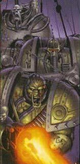

<!-- A0545-B0089 -->

原译文

Plague Marines 瘟疫战士

**校订译文**

Plague Marines 瘟疫战士

<!-- /A0545-B0089 -->

<!-- A0545-B0090 -->
**英文原文**

The forces of Horus besieged Terra and the Imperial Palace itself. After a breach in the Palace defensive wall was forced by Titans of the Legio Mortis Titan Legion, the Traitor Legions, including the Death Guard, poured into the breach only to be met by loyalist forces led by the Primarchs Rogal Dorn and Sanguinius. It is recorded that Mortarion personally led his pustulent Plague Marines into the thickest fighting that day. Following the departure of Perturabo and the Iron Warriors from the battle, Horus gave Mortarion command of the Lion's Gate Spaceport. However this was assailed in a sudden counterattack by Jaghatai Khan and the White Scars. At the height of the fighting, Mortarion and Jaghatai Khan dueled. At the end of the battle a badly wounded Jaghatai Khan managed to banish Mortarion to the Warp, while the loyalist Primarch himself grievously wounded. After the banishing of Mortarion command of the legion fell to Typhus.

<!-- /A0545-B0090 -->

<!-- A0545-B0091 -->

原译文

荷鲁斯的军队围攻了泰拉和皇宫。在死亡军团泰坦军团的泰坦强行突破皇宫防御墙后，包括死亡守卫在内的叛徒军团涌入缺口，却遭到了由原体罗格·多恩和圣吉列斯领导的忠诚部队的袭击。据记载，莫塔里安亲自带领他的脓疱瘟疫战士参加了当天最激烈的战斗。在佩图拉博和钢铁勇士离开战场后，荷鲁斯将狮门太空港的指挥权交给了莫塔里安。然而，这遭到了察合台可汗和白色伤疤的突然反击。在战斗最激烈的时候，莫塔里安和察合台可汗决斗。战斗结束时，察合台可汗设法将莫塔里安驱逐到亚空间，而忠诚的原体本人也受了重伤。驱逐莫塔里安后，军团的指挥权落到了泰丰斯手中。

**校订译文**

荷鲁斯军队围攻泰拉与皇宫。死亡军团的泰坦突破宫墙后，包括死亡守卫在内的叛军涌入缺口，迎战罗格·多恩与圣吉列斯率领的忠诚部队。记载称，莫塔里安当天亲率满身脓疱的瘟疫战士投入最激烈的战斗。佩图拉博与钢铁勇士退出后，荷鲁斯将狮门太空港交给他指挥。察合台可汗与白疤却突然反攻，战至高潮，两位原体展开决斗。可汗最终将莫塔里安放逐回亚空间，自己也身负重伤。死亡守卫的指挥权随之落到泰弗斯手中。

<!-- /A0545-B0091 -->

<!-- A0545-B0092 -->
### Horus Heresy Aftermath 荷鲁斯之乱余波

原题：Horus Heresy Aftermath 荷鲁斯叛乱余波

<!-- /A0545-B0092 -->

<!-- A0545-B0093 -->
**英文原文**

After Horus' defeat, Mortarion led his Death Guard in a campaign of destruction over a score of planets, until finally retreating into the Eye of Terror. Here he received Nurgle's ultimate reward and became a full-fledged Daemon Prince, ruling over one of Nurgle's greatest Plague Worlds in the Eye of Terror. Mortarion sends out fleets of Plague Ships into the Warp to carry their contagions throughout the galaxy. Concerned himself with matters of the Warp more and more, Mortarion has periodically returned to lead his Legion but in his absence it has largely splintered into many smaller warbands.

<!-- /A0545-B0093 -->

<!-- A0545-B0094 -->

原译文

荷鲁斯战败后，莫塔里安率领他的死亡守卫在数十颗行星上展开了一场毁灭性的战役，直到最终撤退到恐惧之眼。在这里，他获得了纳垢的终极奖励，并成为一名完全的恶魔王子，在恐惧之眼统治着纳垢最伟大的瘟疫世界之一。莫塔里安派遣瘟疫舰队进入亚空间，将他们的传染病带到整个银河系。莫塔里安越来越关注亚空间部队的事务，他定期回来领导他的军团，但在他缺席的情况下，军团在很大程度上分裂成了许多较小的战帮。

**校订译文**

荷鲁斯战败后，莫塔里安率军摧毁二十余颗行星，最终退入恐惧之眼。此处底稿称，他在那里得到纳垢的最高奖赏，成为完全升格的恶魔亲王，统治恐惧之眼内最强大的纳垢瘟疫世界之一。他派瘟疫舰队进入亚空间，将疫病散播至银河各地。莫塔里安本人日益专注亚空间事务，只间或亲自率军；在他缺席期间，军团大体分为许多较小战帮。

**校注：** 本段将完全升魔置于泰拉战败后，前文87已说进军泰拉前升魔；保留不同时间叙述并明确来自底稿，待版本来源核对。over a score为二十余，不泛化成数十。

<!-- /A0545-B0094 -->

<!-- A0545-B0095 图片 -->
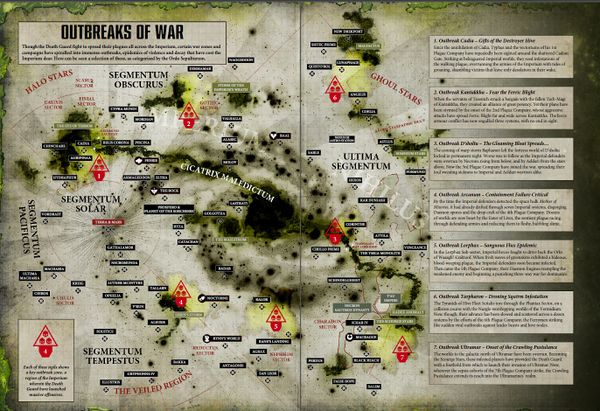

<!-- A0545-B0096 -->

原译文

Recent activity of the Death Guard 死亡守卫近期行动

**校订译文**

Recent activity of the Death Guard 死亡守卫近期行动

<!-- /A0545-B0096 -->

<!-- A0545-B0097 -->
**英文原文**

However though it was factionalized, the Death Guard never fully disintegrated as a cohesive force. Their fragments continued to fight under a singular purpose, and never resorted to the civil in-fighting of many other Traitor Legions. The Death Guard remains one of the most ordered and coherent of all the surviving Traitor Legions. At the end of the 41st Millennium, Mortarion senses his Brother Primarch's rebirth and reasserted direct control over the Death Guard once more. The Death Guard launched a major assault on Ultramar in what became known as the Plague Wars.

<!-- /A0545-B0097 -->

<!-- A0545-B0098 -->

原译文

然而，尽管存在派系分歧，但死亡守卫作为一支部队的凝聚力从未完全瓦解。他们的碎片继续在一个单一的目的下战斗，从未诉诸于许多其他叛徒军团的暗斗。死亡守卫仍然是所有幸存的叛徒军团中最有序、最团结的军团之一。在第41个千年末，莫塔里安感觉到他的兄弟原体的重生，并再次重申了对死亡守卫的直接控制。死亡守卫在后来被称为瘟疫战争中对奥特拉玛发动了一次重大袭击。

**校订译文**

尽管派系林立，死亡守卫从未完全失去作为整体的凝聚力。各分支仍为共同目标而战，也没有像许多其他叛徒军团那样陷入内战。他们仍是现存叛徒军团中组织最有序、联系最紧密者之一。M41末，莫塔里安察觉到兄弟原体复苏，重新亲自掌控军团，对奥特拉玛发动大举进攻，即后来的瘟疫战争。

<!-- /A0545-B0098 -->

<!-- A0545-B0099 -->
### Notable Engagements 著名交战

<!-- /A0545-B0099 -->

<!-- A0545-B0100 -->
### The Great Crusade 大远征

<!-- /A0545-B0100 -->

<!-- A0545-B0101 -->

原译文

???.M30 - Conquest of Galaspar 征服加拉斯帕

**校订译文**

???.M30 - Conquest of Galaspar 征服加拉斯帕

<!-- /A0545-B0101 -->

<!-- A0545-B0102 -->

原译文

???.M30 - Conquest of One-Five-Four Four 征服154·4

**校订译文**

???.M30 - Conquest of One-Five-Four Four 征服154·4

<!-- /A0545-B0102 -->

<!-- A0545-B0103 -->

原译文

???.M30 - Battle of Gyros-Thravian 杰罗斯-萨洛维安之战

**校订译文**

???.M30 - Battle of Gyros-Thravian 杰罗斯-萨洛维安之战

<!-- /A0545-B0103 -->

<!-- A0545-B0104 -->

原译文

???.M30 - Battle of Iota Horologii 时钟座九号之战

**校订译文**

???.M30 - Battle of Iota Horologii 时钟座约塔之战

<!-- /A0545-B0104 -->

<!-- A0545-B0105 -->

原译文

881.M30 - Emancipation of Drune 德鲁内解放

**校订译文**

881.M30 - Emancipation of Drune 德鲁内解放

<!-- /A0545-B0105 -->

<!-- A0545-B0106 -->
### The Horus Heresy 荷鲁斯之乱

原题：The Horus Heresy 荷鲁斯叛乱

<!-- /A0545-B0106 -->

<!-- A0545-B0107 -->

原译文

005.M31 -Battle of Isstvan III 伊斯塔万三号之战

**校订译文**

005.M31 -Battle of Isstvan III 伊斯塔万三号之战

<!-- /A0545-B0107 -->

<!-- A0545-B0108 -->

原译文

006.M31 - Dropsite Massacre 登陆点大屠杀

**校订译文**

006.M31 - Dropsite Massacre 登陆点大屠杀

<!-- /A0545-B0108 -->

<!-- A0545-B0109 -->

原译文

006-008.M31 - Manachean War 马纳契战争

**校订译文**

006-008.M31 - Manachean War 马纳契战争

<!-- /A0545-B0109 -->

<!-- A0545-B0110 -->

原译文

007.M31 - Second Battle of Prospero 第二次普罗斯佩罗之战

**校订译文**

007.M31 - Second Battle of Prospero 第二次普罗斯佩罗之战

<!-- /A0545-B0110 -->

<!-- A0545-B0111 -->

原译文

008.M31 - Battle of Molech 摩洛之战

**校订译文**

008.M31 - Battle of Molech 摩洛之战

<!-- /A0545-B0111 -->

<!-- A0545-B0112 -->

原译文

009.M31 - Battle of Perditus 佩迪图斯之战

**校订译文**

009.M31 - Battle of Perditus 佩迪图斯之战

<!-- /A0545-B0112 -->

<!-- A0545-B0113 -->

原译文

009-013.M31 - Siege of Inwit 因维特围城

**校订译文**

009-013.M31 - Siege of Inwit 因维特围城

<!-- /A0545-B0113 -->

<!-- A0545-B0114 -->

原译文

011.M31 - The Malagant Conflict 玛拉甘特冲突

**校订译文**

011.M31 - The Malagant Conflict 玛拉甘特冲突

<!-- /A0545-B0114 -->

<!-- A0545-B0115 -->

原译文

~011.M31 - The Battle of Catallus 卡塔洛斯之战

**校订译文**

~011.M31 - The Battle of Catallus 卡塔洛斯之战

<!-- /A0545-B0115 -->

<!-- A0545-B0116 -->

原译文

???.M31 - The Battle of Nocturne 夜曲星之战

**校订译文**

???.M31 - The Battle of Nocturne 夜曲星之战

<!-- /A0545-B0116 -->

<!-- A0545-B0117 -->

原译文

???.M31 - The War of Drakes 火龙战争

**校订译文**

???.M31 - The War of Drakes 火龙战争

<!-- /A0545-B0117 -->

<!-- A0545-B0118 -->

原译文

???.M31 - Treab's World Campaign 特里布世界战役

**校订译文**

???.M31 - Treab's World Campaign 特里布世界战役

<!-- /A0545-B0118 -->

<!-- A0545-B0119 -->

原译文

011.M31 - The Subjugation of Tyrinth 泰瑞斯征服

**校订译文**

011.M31 - The Subjugation of Tyrinth 泰瑞斯征服

<!-- /A0545-B0119 -->

<!-- A0545-B0120 -->

原译文

012-013.M31 - The Battle of Beta-Garmon 贝塔-伽蒙之战

**校订译文**

012-013.M31 - The Battle of Beta-Garmon 贝塔-伽蒙之战

<!-- /A0545-B0120 -->

<!-- A0545-B0121 -->

原译文

012.M31 - The Battle of Luth Tyre 卢斯·泰尔之战

**校订译文**

012.M31 - The Battle of Luth Tyre 卢斯·泰尔之战

<!-- /A0545-B0121 -->

<!-- A0545-B0122 -->

原译文

013.M31 - The Dawn of Desolation 荒芜黎明

**校订译文**

013.M31 - The Dawn of Desolation 荒芜黎明

<!-- /A0545-B0122 -->

<!-- A0545-B0123 -->

原译文

013.M31 - The Siege of Barbarus 巴巴鲁斯围城

**校订译文**

013.M31 - The Siege of Barbarus 巴巴鲁斯围城

<!-- /A0545-B0123 -->

<!-- A0545-B0124 -->

原译文

???.M31 - Purging of Ynyx 依尼克斯清洗

**校订译文**

???.M31 - Purging of Ynyx 依尼克斯清洗

<!-- /A0545-B0124 -->

<!-- A0545-B0125 -->

原译文

014.M31 - Battle of Terra 泰拉之战

**校订译文**

014.M31 - Battle of Terra 泰拉之战

<!-- /A0545-B0125 -->

<!-- A0545-B0126 -->
### Post Heresy 叛乱后

<!-- /A0545-B0126 -->

<!-- A0545-B0127 -->
**英文原文**

781.M31 - First Black Crusade - Death Guard Sorcerer Thagus Daravek leads forces against Abaddon's new Black Legion.

<!-- /A0545-B0127 -->

<!-- A0545-B0128 -->

原译文

第一次黑色远征 - 死亡守卫巫师塔古斯·达拉维克率领部队对抗阿巴顿的新黑色军团。

**校订译文**

781.M31：第一次黑色远征，死亡守卫巫师塔古斯·达拉维克率军对抗新成立的黑色军团。

<!-- /A0545-B0128 -->

<!-- A0545-B0129 -->

原译文

344.M33 - Blackstar Liberation 黑星解放

**校订译文**

344.M33 - Blackstar Liberation 黑星解放

<!-- /A0545-B0129 -->

<!-- A0545-B0130 -->

原译文

560.M33 - Second Mortis Gate Campaign 第二次死亡之门战役

**校订译文**

560.M33 - Second Mortis Gate Campaign 第二次死亡之门战役

<!-- /A0545-B0130 -->

<!-- A0545-B0131 -->

原译文

101.M34 - Bloodpox Campaign 血疹战役

**校订译文**

101.M34 - Bloodpox Campaign 血疹战役

<!-- /A0545-B0131 -->

<!-- A0545-B0132 -->
**英文原文**

437.M36 - Fall of Sanctia - Mortarion returns to lead his Legion in the planets fall.

<!-- /A0545-B0132 -->

<!-- A0545-B0133 -->

原译文

神圣星陷落 - 莫塔里安返回带领他的军团在行星降落。

**校订译文**

437.M36：神圣星陷落，莫塔里安归来，率领军团攻陷该世界。

**校注：** planets fall为攻陷行星，非在行星降落。

<!-- /A0545-B0133 -->

<!-- A0545-B0134 -->

原译文

301.M39 - The 11th Black Crusade 第11次黑色远征

**校订译文**

301.M39 - The 11th Black Crusade 第11次黑色远征

<!-- /A0545-B0134 -->

<!-- A0545-B0135 -->

原译文

620.M39 - The Dust War 灰尘战争

**校订译文**

620.M39 - The Dust War 灰尘战争

<!-- /A0545-B0135 -->

<!-- A0545-B0136 -->
**英文原文**

'142-160.M41 - The 12th Black Crusade - Typhus's Plague Fleet fights alongside Abaddon's Black Legion.

<!-- /A0545-B0136 -->

<!-- A0545-B0137 -->

原译文

第十二次黑色远征 — 泰丰斯的瘟疫舰队与阿巴顿的黑色军团并肩作战。

**校订译文**

142—160.M41：第十二次黑色远征，泰弗斯的瘟疫舰队与阿巴顿的黑色军团并肩作战。

<!-- /A0545-B0137 -->

<!-- A0545-B0138 -->
**英文原文**

747.M41 - The destruction of Hydra Minoris - Typhus unleashes the Zombie Plague on the world.

<!-- /A0545-B0138 -->

<!-- A0545-B0139 -->

原译文

小九头蛇的毁灭 - 泰丰斯在世界上引发了僵尸瘟疫。

**校订译文**

747.M41：小九头蛇毁灭，泰弗斯在当地释放僵尸瘟疫。

<!-- /A0545-B0139 -->

<!-- A0545-B0140 -->

原译文

???.M41 - The destruction of Nucon VI 努康六号的毁灭

**校订译文**

???.M41 - The destruction of Nucon VI 努康六号的毁灭

<!-- /A0545-B0140 -->

<!-- A0545-B0141 -->

原译文

???.M41 - The Battle of Shen'tzi Vo 申’茨·沃之战

**校订译文**

???.M41 - The Battle of Shen'tzi Vo 申’茨·沃之战

<!-- /A0545-B0141 -->

<!-- A0545-B0142 -->

原译文

???.M41 - The Scouring of Makenna VII 马克纳七号清洗

**校订译文**

???.M41 - The Scouring of Makenna VII 马金纳七号清洗

<!-- /A0545-B0142 -->

<!-- A0545-B0143 -->
**英文原文**

777.M41 - Achilus Crusade - Death Guard forces under Ussax took part in the conflict

<!-- /A0545-B0143 -->

<!-- A0545-B0144 -->

原译文

阿基里斯远征 - 乌萨克斯率领的死亡守卫参加了冲突

**校订译文**

777.M41：阿基里斯远征，乌萨克斯率死亡守卫参战。

<!-- /A0545-B0144 -->

<!-- A0545-B0145 -->
**英文原文**

813-830.M41 - Siege of Vraks - Several Death Guard affiliated warbands took part in the conflict

<!-- /A0545-B0145 -->

<!-- A0545-B0146 -->

原译文

围攻弗拉克斯 — 几支隶属于死亡守卫的武装部队参与了冲突

**校订译文**

813—830.M41：弗拉克斯围城，多个隶属死亡守卫的战帮参战。

<!-- /A0545-B0146 -->

<!-- A0545-B0147 -->
**英文原文**

901.M41 - Battle of Kornovin - Mortarion himself battles the Grey Knights

<!-- /A0545-B0147 -->

<!-- A0545-B0148 -->

原译文

科诺温之战 - 莫塔里安亲自与灰骑士作战

**校订译文**

901.M41：科诺温之战，莫塔里安亲自迎战灰骑士。

<!-- /A0545-B0148 -->

<!-- A0545-B0149 -->
**英文原文**

???.M41 - Battle of the Caliban System - the Plague Fleet of Typhus works together with the Fallen Angel Astelan

<!-- /A0545-B0149 -->

<!-- A0545-B0150 -->

原译文

卡利班星系之战 - 泰丰斯的瘟疫舰队与堕天使阿斯特兰合作

**校订译文**

???.M41：卡利班星系之战，泰弗斯的瘟疫舰队与堕天使阿斯特兰合作。

<!-- /A0545-B0150 -->

<!-- A0545-B0151 -->

原译文

999.M41 - 13th Black Crusade 第13次黑色远征

**校订译文**

999.M41 - 13th Black Crusade 第13次黑色远征

<!-- /A0545-B0151 -->

<!-- A0545-B0152 -->
**英文原文**

999.M41 - Death Guard forces take part in the Chaos armada under Kossolax that attacks Agripinaa.

<!-- /A0545-B0152 -->

<!-- A0545-B0153 -->

原译文

死亡守卫部队参加了科索拉克斯率领的混沌舰队，该舰队袭击了阿格里皮娜。

**校订译文**

999.M41：死亡守卫加入科索拉克斯率领的混沌舰队，袭击阿格里皮娜。

<!-- /A0545-B0153 -->

<!-- A0545-B0154 -->
**英文原文**

999.M41 - The Death Guard warband known as the Lords of Silence and Word Bearers allies from the Weeping Veil sack the White Consuls homeworld of Sabatine.

<!-- /A0545-B0154 -->

<!-- A0545-B0155 -->

原译文

被称为沉默领主的死亡守卫战帮和其怀言者盟友从哭泣帷幕中洗劫了白色执政官的家园世界萨巴蒂尼。

**校订译文**

999.M41：死亡守卫的寂静领主战帮，与来自哭泣帷幕战帮的怀言者盟军联手，洗劫白色执政官母星萨巴蒂尼。

**校注：** Weeping Veil是怀言者盟军所属战帮，原译误当成从帷幕中出击。Lords of Silence统一寂静领主。

<!-- /A0545-B0155 -->

<!-- A0545-B0156 -->
### Dark Imperium 黑暗帝国

<!-- /A0545-B0156 -->

<!-- A0545-B0157 -->
**英文原文**

~012.M42 - The Plague Wars. Mortarion reappeared at the front of the Death Guard in an invasion of Ultramar.

<!-- /A0545-B0157 -->

<!-- A0545-B0158 -->

原译文

瘟疫战争。在对奥特拉玛的入侵中，莫塔里安再次出现在死亡守卫的前线。

**校订译文**

约012.M42：瘟疫战争，莫塔里安重新亲率死亡守卫，入侵奥特拉玛。

<!-- /A0545-B0158 -->

<!-- A0545-B0159 -->

原译文

~012.M42 - The War in the Rift 裂隙战争

**校订译文**

~012.M42 - The War in the Rift 裂隙战争

<!-- /A0545-B0159 -->

<!-- A0545-B0160 -->

原译文

???.M42 - The Medusa Raid 美杜莎突袭

**校订译文**

???.M42 - The Medusa Raid 美杜莎突袭

<!-- /A0545-B0160 -->

<!-- A0545-B0161 -->

原译文

???.M42 - The Invasion of Konor 入侵康诺

**校订译文**

???.M42 - The Invasion of Konor 入侵康诺

<!-- /A0545-B0161 -->

<!-- A0545-B0162 -->

原译文

???.M42 - The Kellik Plague War 凯利克瘟疫战争

**校订译文**

???.M42 - The Kellik Plague War 凯利克瘟疫战争

<!-- /A0545-B0162 -->

<!-- A0545-B0163 -->
**英文原文**

???.M42 - The Battle of the Startide Nexus under Captain Oratius Glurtosk

<!-- /A0545-B0163 -->

<!-- A0545-B0164 -->

原译文

奥拉提乌斯·格鲁托斯克连长指挥的星潮枢纽之战

**校订译文**

???.M42：星潮枢纽之战，由奥拉提乌斯·格鲁托斯克连长指挥。

<!-- /A0545-B0164 -->

<!-- A0545-B0165 -->

原译文

???.M42 - The Battle of Korvon II 科尔文二号之战

**校订译文**

???.M42 - The Battle of Korvon II 科尔文二号之战

<!-- /A0545-B0165 -->

<!-- A0545-B0166 -->

原译文

???.M42 - The Cleansing of Ybrannis 伊布兰尼斯清洗

**校订译文**

???.M42 - The Cleansing of Ybrannis 伊布兰尼斯清洗

<!-- /A0545-B0166 -->

<!-- A0545-B0167 -->

原译文

???.M42 - Raid on Relthor Prime 突袭雷索尔主星

**校订译文**

???.M42 - Raid on Relthor Prime 突袭雷索尔主星

<!-- /A0545-B0167 -->

<!-- A0545-B0168 -->

原译文

???.M42 - Battles of the Kantakkha System 坎塔克哈星系之战

**校订译文**

???.M42 - Battles of the Kantakkha System 坎塔克哈星系之战

<!-- /A0545-B0168 -->

<!-- A0545-B0169 -->

原译文

???.M42 - The War of Rust and Ruin 铁锈与毁灭之战

**校订译文**

???.M42 - The War of Rust and Ruin 锈蚀与毁灭战争

<!-- /A0545-B0169 -->

<!-- A0545-B0170 -->

原译文

???.M42 - The War of Beasts on Vigilus 警戒星上的野兽战争

**校订译文**

???.M42 - The War of Beasts on Vigilus 警戒星上的野兽战争

<!-- /A0545-B0170 -->

<!-- A0545-B0171 -->

原译文

???.M42 - The War of the Spider 蜘蛛战争

**校订译文**

???.M42 - The War of the Spider 蜘蛛战争

<!-- /A0545-B0171 -->

<!-- A0545-B0172 -->

原译文

???.M42 - The Charadon Campaign 查拉顿战役

**校订译文**

???.M42 - The Charadon Campaign 查拉顿战役

<!-- /A0545-B0172 -->

<!-- A0545-B0173 -->

原译文

???.M42 - The Nachmund Rift War 纳克蒙德走廊战争

**校订译文**

???.M42 - The Nachmund Rift War 纳克蒙德裂隙战争

<!-- /A0545-B0173 -->

<!-- A0545-B0174 -->

原译文

Chromyd Front 克罗米德前线

**校订译文**

Chromyd Front 克罗米德前线

<!-- /A0545-B0174 -->

<!-- A0545-B0175 -->

原译文

???.M42 - The War for the Tri-forge Cluster 三铸造群之战

**校订译文**

???.M42 - The War for the Tri-forge Cluster 三铸造群之战

<!-- /A0545-B0175 -->

<!-- A0545-B0176 -->
**英文原文**

???.M42 - War against the Tyranids for Vermidium

<!-- /A0545-B0176 -->

<!-- A0545-B0177 -->

原译文

为争夺弗米迪姆而与泰伦作战

**校订译文**

???.M42：与泰伦争夺弗米迪姆。

<!-- /A0545-B0177 -->

<!-- A0545-B0178 -->

原译文

???.M42 - The Arks of Omen Campaign. 噩兆方舟战役

**校订译文**

???.M42 - The Arks of Omen Campaign. 噩兆方舟战役

<!-- /A0545-B0178 -->

<!-- A0545-B0179 -->

原译文

Undated: 无日期

**校订译文**

Undated: 无日期

<!-- /A0545-B0179 -->

<!-- A0545-B0180 -->

原译文

The Battle of the Borghesh Channel 博尔盖什海峡之战

**校订译文**

The Battle of the Borghesh Channel 博尔盖什海峡之战

<!-- /A0545-B0180 -->

<!-- A0545-B0181 -->

原译文

The Green Death 翠绿死亡

**校订译文**

The Green Death 翠绿死亡

<!-- /A0545-B0181 -->

<!-- A0545-B0182 -->

原译文

The Battle of Tsarvia II 塔萨维亚二号之战

**校订译文**

The Battle of Tsarvia II 塔萨维亚二号之战

<!-- /A0545-B0182 -->

<!-- A0545-B0183 -->

原译文

The Siege of Nebbus 内布斯围城

**校订译文**

The Siege of Nebbus 内布斯围城

<!-- /A0545-B0183 -->

<!-- A0545-B0184 -->

原译文

The Battle of Bosphodia 博斯弗迪亚之战

**校订译文**

The Battle of Bosphodia 博斯弗迪亚之战

<!-- /A0545-B0184 -->

<!-- A0545-B0185 -->

原译文

The Siege of Bellisos 贝里索斯围城

**校订译文**

The Siege of Bellisos 贝里索斯围城

<!-- /A0545-B0185 -->

<!-- A0545-B0186 -->

原译文

The Battle of Drogensul 德罗根苏尔之战

**校订译文**

The Battle of Drogensul 德罗根苏尔之战

<!-- /A0545-B0186 -->

<!-- A0545-B0187 -->

原译文

The Battle for Yultah 尤尔塔之战

**校订译文**

The Battle for Yultah 尤尔塔之战

<!-- /A0545-B0187 -->

<!-- A0545-B0188 -->

原译文

Waaagh! Badsmak 坏停的Waaagh！

**校订译文**

Waaagh! Badsmak 坏停的Waaagh！

<!-- /A0545-B0188 -->

<!-- A0545-B0189 -->

原译文

The Siege of Godorian 戈多里安围城

**校订译文**

The Siege of Godorian 戈多里安围城

<!-- /A0545-B0189 -->

<!-- A0545-B0190 -->

原译文

The Battle of Vindor 温多尔之战

**校订译文**

The Battle of Vindor 温多尔之战

<!-- /A0545-B0190 -->

<!-- A0545-B0191 -->

原译文

The Paradaxian War 帕拉达先战争

**校订译文**

The Paradaxian War 帕拉达先战争

<!-- /A0545-B0191 -->

<!-- A0545-B0192 -->

原译文

The Battle of Anvarheim 安瓦尔海姆星系之战

**校订译文**

The Battle of Anvarheim 安瓦尔海姆之战

**校注：** 英文未指明星系，删除原译自行增添的层级。

<!-- /A0545-B0192 -->

<!-- A0545-B0193 -->

原译文

The War of Slime and Metal 黏液与金属之战

**校订译文**

The War of Slime and Metal 黏液与金属之战

<!-- /A0545-B0193 -->

<!-- A0545-B0194 -->

原译文

The Yarant Wars 雅兰特战争

**校订译文**

The Yarant Wars 雅兰特战争

<!-- /A0545-B0194 -->

<!-- A0545-B0195 -->
## Gene-seed 基因种子

<!-- /A0545-B0195 -->

<!-- A0545-B0196 -->
**英文原文**

The Death Guard's genetic traits always reflect the gaunt, shadow-eyed quality of their Primarch. Known for their hardiness, stoicism, and ability to endure grievous wounds, while the XIVth Legion never were able to become an especially large legion their gene-seed was said to be stable during the Great Crusade.

<!-- /A0545-B0196 -->

<!-- A0545-B0197 -->

原译文

死亡守卫的基因特征总是反映出他们原体瘦削、目光阴暗的品质。他们以坚韧、坚忍和忍受严重创伤的能力而闻名，而第十四军团从未能够成为一个特别庞大的军团 — 据说他们的基因种子在大远征期间是稳定的。

**校订译文**

死亡守卫始终呈现原体的遗传特征：瘦削的面容与阴翳的眼眸。他们以坚韧、坚忍及承受重创的能力著称。第十四军团规模虽从未特别庞大，但据说在大远征时期，其基因种子相当稳定。

<!-- /A0545-B0197 -->

<!-- A0545-B0198 图片 -->
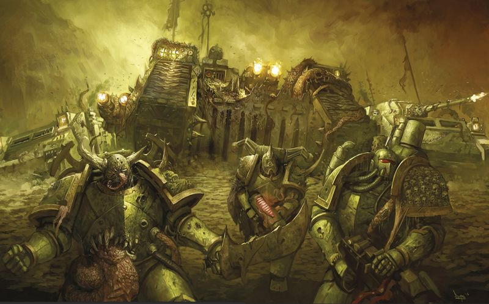

<!-- A0545-B0199 -->

原译文

Death Guard forces 死亡守卫部队

**校订译文**

Death Guard forces 死亡守卫部队

<!-- /A0545-B0199 -->

<!-- A0545-B0200 -->
**英文原文**

During the Horus Heresy, the contagion which led to their damnation corrupted them physically as well as spiritually. As a result the gene-seed of the Death Guard is putrid, infectious, and corrupted completely by Nurgle. Modern Death Guard Marines almost always spout extremely heavy mutation. Due to the original gene-seed of the Death Guard being lost or corrupted beyond salvaging, most of the marines created within the Eye of Terror are from stocks stolen from loyalist chapters. Plague Surgeons oversee the modern Death Guard gene-seed repositories and implementation on Munificence. The Legion's precious Gene-Seed is kept within a vault deep within the Black Manse, the greatest of Munificence's seven fortresses and the personal keep of Mortarion.

<!-- /A0545-B0200 -->

<!-- A0545-B0201 -->

原译文

在荷鲁斯叛乱期间，导致他们被诅咒的传染病在身体和精神上都腐化了他们。因此，死亡守卫的基因种子腐烂、具有传染性，并被纳垢完全破坏。现死亡守卫战士几乎总是滔滔不绝地讲述极其严重的突变。由于死亡守卫的原始基因种子丢失或损坏，无法挽救，恐惧之眼内创建的大多数星际战士都是从忠诚派战团偷来的库存。瘟疫军医监督现死亡守卫基因种子库和慷慨星的仪器。军团珍贵的基因种子被保存在黑宅的一个秘库里，这是慷慨星七座堡垒中最大的一座，也是莫塔里安的私人领地。

**校订译文**

荷鲁斯之乱中，使军团堕落的疫病同时腐化了肉体与心灵。死亡守卫的基因种子因而腐败、传染性极强，彻底受纳垢污染。如今，军团战士几乎总有严重突变。由于原有基因种子已经遗失，或腐化至无法挽救，在恐惧之眼新造的多数战士都采用从忠诚派战团盗来的储备。瘟疫军医管理慷慨星上的基因种子库与植入作业。珍贵种子存放于黑宅深处的密库；黑宅是当地七座堡垒中最大的一座，也是莫塔里安的私人堡垒。

**校注：** spout mutation在本段语境指显露突变，原译滔滔不绝讲述突变错误；implementation为基因种子的使用/植入，不是仪器。

<!-- /A0545-B0201 -->

<!-- A0545-B0202 -->
**英文原文**

Today, Death Guard members who either are preexisting Space Marines that defected from the Imperium or were given geneseed from elsewhere are called "Unchanged", as they have yet to transform into the diseased demigods that the original Space Marines of the XIVth Legion became.

<!-- /A0545-B0202 -->

<!-- A0545-B0203 -->

原译文

今天，死亡守卫成员要么是已经从帝国叛逃的星际战士成员，要么是从其他地方获得基因种子的成员，他们被称为“不变者”，因为他们还没有变成第十四军团最初的星际战士所成的病态半神。

**校订译文**

如今，那些原已是星际战士、随后背叛帝国加入死亡守卫的人，以及植入了外来基因种子的成员，被称为未变者。他们尚未像第十四军团的老兵那样，化为满身疫病的半神。

**校注：** 此处Unchanged指新加入、尚未充分疫变的星际战士，与第9篇战帮对凡人仆役的同名称呼不同；中文均沿未变者，但实体分开登记。

<!-- /A0545-B0203 -->

<!-- A0545-B0204 图片 -->
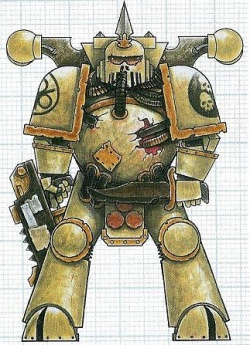

<!-- A0545-B0205 -->

原译文

Death Guard Chaos Space Marine 死亡守卫混沌星际战士

**校订译文**

Death Guard Chaos Space Marine 死亡守卫混沌星际战士

<!-- /A0545-B0205 -->

<!-- A0545-B0206 -->
## Home World 家园世界

<!-- /A0545-B0206 -->

<!-- A0545-B0207 -->
**英文原文**

The Pre-Heresy Homeworld of the Death Guard was the toxic world of Barbarus. After exile into the Eye of Terror the Death Guard made the Plague Planet their new home.

<!-- /A0545-B0207 -->

<!-- A0545-B0208 -->

原译文

死亡守卫的叛乱前家园世界是毒素世界巴巴鲁斯。在流放到恐惧之眼后，死亡守卫将瘟疫行星作为他们的新家。

**校订译文**

荷鲁斯之乱前，死亡守卫的母星是剧毒世界巴巴鲁斯。退入恐惧之眼后，他们以瘟疫行星为新家园。

<!-- /A0545-B0208 -->

<!-- A0545-B0209 -->
## Culture & Tactics 文化&战术

<!-- /A0545-B0209 -->

<!-- A0545-B0210 -->
**英文原文**

Originally the Death Guard believed that humans should be free of oppression and that hardship should be faced with faith in inner strength, strong will and stern resolution. During the Heresy, these beliefs were twisted into contempt for the weak and the conviction that individuals were not fit to judge for themselves what was best for them. When the Legion was trapped and infected by Nurgle in the warp, their arrogance and contempt for weakness turned against them. Their surrender to Nurgle caused them to become self loathing and now they seek to spread ruin and decay in order to let their own fate appear less shameful in comparison.

<!-- /A0545-B0210 -->

<!-- A0545-B0211 -->

原译文

起初，死亡守卫认为人类应该摆脱压迫，面对困难应该相信内在的力量、坚强的意志和坚定的决心。在叛乱时期，这些信仰被扭曲成对弱者的蔑视，以及认为个人不适合自己判断什么对他们最好的信念。当军团被困在亚空间中并被纳垢感染时，他们的傲慢和对软弱的蔑视转而反对他们。他们向纳垢的投降导致他们变得自我厌恶，现在他们试图传播毁灭和腐朽，以便让自己的命运看起来不那么可耻。

**校订译文**

死亡守卫最初相信，人类应摆脱压迫，并凭内在力量、坚定意志与决心面对苦难。叛乱期间，这些理念扭曲为对弱者的蔑视，以及“个人无权自行判断什么对自己最好”的信条。军团被困亚空间、遭纳垢感染时，这份傲慢和鄙薄软弱的态度反噬了他们。屈服纳垢令他们憎恨自身；如今，他们散播毁灭与腐朽，只为让别人的惨状衬得自己的命运不那么羞耻。

<!-- /A0545-B0211 -->

<!-- A0545-B0212 -->
**英文原文**

A modern Death Guard force is largely made up of Plague Marines, and still follows the doctrines that their Primarch Mortarion taught them. Their tactics are based on the use of foot-slogging infantry and their Bolters. Any vehicles that were in possession of the Death Guard at the time of the Horus Heresy have since fallen into disrepair or been commandeered by cheeky Nurglings. The Death Guard make full use of Nurgle's gifts, seeking to attract their God's attention with their plague colonies, spreading turmoil, advancing solidly amidst a mist of choking disease, surrounded by Nurglings at their feet and summoning horrific Plaguebearers from the Warp. In larger battles where the outcome is of dire importance, a decaying Daemon Prince may take the reigns of the army, or a Great Unclean One may possess a Champion.

<!-- /A0545-B0212 -->

<!-- A0545-B0213 -->

原译文

现死亡守卫主要由瘟疫战士组成，仍然遵循他们的原体莫塔里安教给他们的教义。他们的战术基于使用徒步步兵和他们的爆矢枪。在荷鲁斯叛乱时期，死亡守卫拥有的任何载具都已经年久失修，或者被无礼的纳垢灵强占。死亡守卫充分利用了纳垢的天赋，试图通过他们的瘟疫殖民地吸引神的注意，传播混沌，在令人窒息的疾病迷雾中稳步前进，被纳垢灵包围在脚下，并从亚空间召唤可怕的瘟疫携带者。在更大的战斗中，如果结果非常重要，一个腐朽的恶魔王子可能会接管军队，或者一个大不净者可能会控制一个冠军。

**校订译文**

如今，死亡守卫以瘟疫战士为主，仍遵循莫塔里安传授的战术，以徒步步兵和爆矢枪稳步作战。本段旧记述称，军团在叛乱时拥有的载具如今或年久失修，或被顽皮的纳垢灵霸占。他们充分运用纳垢赐福，培育瘟疫菌落以博取神祇关注，散播动乱，在令人窒息的病雾中稳步前进，脚边簇拥纳垢灵，并召唤可怖的瘟疫使降临。规模更大、胜负至关重要的战斗中，腐烂的恶魔亲王可能亲自统军，或有大不净者附身一位勇士。

**校注：** 本段称旧载具全部破败，与后文第二连庞大坦克部队并列，疑版本侧重不同，保留旧说并标出；plague colonies依瘟疫语境译菌落，不是殖民地。

<!-- /A0545-B0213 -->

<!-- A0545-B0214 -->
**英文原文**

As with all aspects of the Death Guard, Mortarion has retained an iron grip upon the doctrines and dispositions of his champions. He expects even his most gifted sons to choose the path that best suits their talents, and then cling to it. In this way Mortarion ensures that even as the Lords of the Death Guard win the favour of Nurgle and progress along the path to glory, they still integrate with the pragmatic, infantry-based tactics of their warriors. Several specialties known collectively as the Mantles of Corruption are practiced throughout the Death Guard, in particular their Chaos Lords.

<!-- /A0545-B0214 -->

<!-- A0545-B0215 -->

原译文

与死亡卫队的各个方面一样，莫塔里安对他的拥护者的教义和性格保持着铁一般的控制。他希望即使是他最有天赋的子嗣也能选择最适合他们才能的道路，然后坚持下去。通过这种方式，莫塔里安确保即使死亡守卫的领主赢得了纳垢的青睐，并在通往荣耀的道路上取得了进步，他们仍然与战士们务实的、以步兵为基础的战术相结合。死亡守卫，特别是他们的混沌领主，练习了几种统称为腐败职责的专长。

**校订译文**

莫塔里安对军团各方面都保持严密控制，勇士的战术理念与作战安排也不例外。即使最具天赋的子嗣，也须选择最适合自己的道路，始终坚持。如此一来，死亡守卫领主纵使赢得纳垢宠爱、沿荣耀之路攀升，仍能融入军团务实的步兵战术。军团，尤其混沌领主中，存在数类统称为腐化职分的专门道路。

**校注：** Mantles of Corruption为特定专长道路，暂作腐化职分，原腐败职责过于行政字面。

<!-- /A0545-B0215 -->

<!-- A0545-B0216 -->
**英文原文**

Lords of Contagion - The most aggressive and belligerent Lords, clad in Terminator Armour and not valuing cunning or subtly.

<!-- /A0545-B0216 -->

<!-- A0545-B0217 -->

原译文

疫病领主 - 最具侵略性和好战性的领主，身穿终结者盔甲，不重视灵巧或狡猾。

**校订译文**

疫病领主——最富攻击性、最好战的领主，身披终结者护甲，不重谋略与含蓄手段。

<!-- /A0545-B0217 -->

<!-- A0545-B0218 -->

原译文

Lords of Flux 流动领主

**校订译文**

Lords of Flux 流动领主

<!-- /A0545-B0218 -->

<!-- A0545-B0219 -->

原译文

Lords of Parasitism 寄生领主

**校订译文**

Lords of Parasitism 寄生领主

<!-- /A0545-B0219 -->

<!-- A0545-B0220 -->
**英文原文**

Lords of Poxes - Favor spreading diseases to erode the enemy through attrition.

<!-- /A0545-B0220 -->

<!-- A0545-B0221 -->

原译文

痘疹领主 - 通过消耗来传播疾病以侵蚀敌人。

**校订译文**

痘疹领主——偏爱散播疫病，以持续消耗削弱敌人。

<!-- /A0545-B0221 -->

<!-- A0545-B0222 -->
**英文原文**

Lords of Virulence - Masters of massed bombardment.

<!-- /A0545-B0222 -->

<!-- A0545-B0223 -->

原译文

烈毒领主 - 大规模轰炸的大师。

**校订译文**

病毒领主——集中炮击的大师。

<!-- /A0545-B0223 -->

<!-- A0545-B0224 -->

原译文

Lords of Withering 枯萎领主

**校订译文**

Lords of Withering 枯萎领主

<!-- /A0545-B0224 -->

<!-- A0545-B0225 -->

原译文

There is a rumoured seventh mantle 据传有第七职责。

**校订译文**

There is a rumoured seventh mantle 据传还存在第七种职分。

<!-- /A0545-B0225 -->

<!-- A0545-B0226 -->
**英文原文**

Some Mantles of Corruption are taken up only rarely, and by the most unusually gifted individuals. The Mantles of Parasitism, Withering, and Flux are some such infrequently bestowed rewards. It is further rumoured that one mantle exists which none have ever been worthy of, and that it would transform its bearer into a being of pure, malefic entropy.

<!-- /A0545-B0226 -->

<!-- A0545-B0227 -->

原译文

一些腐败职责很少被戴上，而且是由最有天赋的人戴上的。寄生、枯萎和流动职责是一些不常被授予的奖励。还有传言说，存在一个从未有人配得上的职责，它会把它的承载者变成一个纯粹的、有害的熵的存在。

**校订译文**

某些腐化职分极少授予，只有天赋非凡者才能承受，例如寄生、枯萎和流动。据说还存在一种从未有人配得上的职分，能将承载者化为纯粹恶意熵增的存在。

<!-- /A0545-B0227 -->

<!-- A0545-B0228 -->
## Organisation 组织

<!-- /A0545-B0228 -->

<!-- A0545-B0229 -->
### Pre-Heresy 叛乱前

<!-- /A0545-B0229 -->

<!-- A0545-B0230 -->
**英文原文**

Following the discovery of Mortarion, the Death Guard Legion was based on their Primarch's army of the same name on Barbarus. The Legion was divided into seven Great Companies, each with a nominal strength of 70,000 marines (though it's noted this number was never reached in practice) and divided into smaller battle companies. Some captains of the Great Companies had their own honorific titles based on Barbaran tradition; as such, the leader of the 2nd Company was known as 'Commander' while the leader of the 7th was known as 'Battle-Captain'. The Legion favoured heavy infantry above all else, usually equipped for extended operations without resupply or support.

<!-- /A0545-B0230 -->

<!-- A0545-B0231 -->

原译文

在发现莫塔里安之后，死亡守卫军团以他们的原体在巴巴鲁斯的同名军队为基础。军团分为七个大连，每个大连的名义兵力为70000名星际战士（尽管值得注意的是，这个数字在实践中从未达到），并分为更小的战斗连队。一些大连的连长根据巴巴鲁斯传统有自己的尊称；因此，第二连队的领导人被称为“指挥官”，而第七连队的领导人则被称为”战斗连长“。军团最喜欢重步兵，通常有能力在没有补给或支援的情况下进行长时间作战。

**校订译文**

莫塔里安归队后，以自己在巴巴鲁斯率领的同名武装为范本塑造军团。军团分为七个大连，每连名义上可有七万名星际战士，但从未真正达到这一数目；下辖更小的战斗连。部分大连指挥官依巴巴鲁斯传统享有尊称：第二连长称指挥官，第七连长称战斗连长。军团尤其倚重重步兵，配装通常足以在缺乏补给和支援时长期作战。

**校注：** 每连名义七万人、七个连，与前文全军团实有约九万五千人并不直接矛盾：英文明确名义编制从未满额，保留区别。

<!-- /A0545-B0231 -->

<!-- A0545-B0232 图片 -->
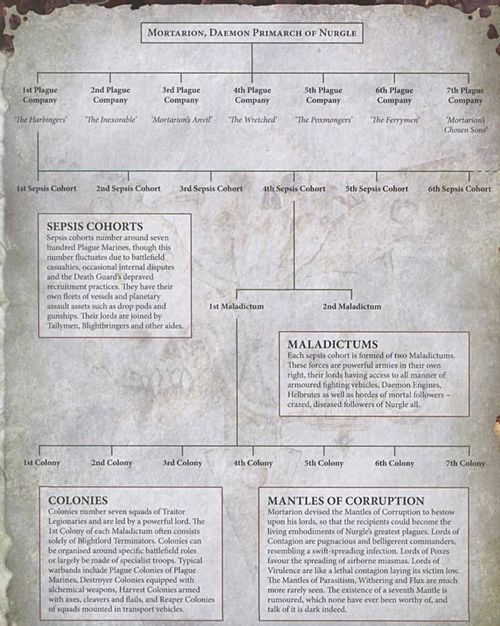

<!-- A0545-B0233 -->

原译文

Organisation of the Post-Heresy Death Guard 叛乱后死亡守卫的组织

**校订译文**

Organisation of the Post-Heresy Death Guard 叛乱后死亡守卫的组织

<!-- /A0545-B0233 -->

<!-- A0545-B0234 -->
**英文原文**

Besides line infantry, the Legion also made heavy use of Dreadnoughts and Terminators. Despite a few exceptions such as the Grave Wardens, the Death Guard Legion lacked extensive elite units. The fleet of the Death Guard was composed of approximately 70 capital vessels, and perhaps 210 smaller escort and attack craft. Although not as numerically large as the dedicated warfleets of certain Legions (notably the Imperial Fists, Sons of Horus and Dark Angels), the Death Guard possessed a high proportion of heavy capital units, many of which were not only of considerable size and power but in several cases unique-being relics of the lost Dark Age of Technology. The names of these vessels had entered into legend well before the Great Betrayal and would live on in infamy long afterward, such as the Battle-Barge Reaper's Scythe which often served as Mortarion's flagship and the stage for much of the Legion's rituals and rites. Others included the Terminus Est, a Dark Age survivor believed the better of any Imperial vessel of its class in service, while the Fourth Horseman was configured as a ramship able to make orbital descent attacks despite its tremendous size. Perhaps most ill-reputed before the Heresy was the Goliath Class Battleship Mia Donna Mori - an engine of destruction known to carry enough Exterminatus-class alchem and bio-kill weaponry within her armoured vaults to end life in an entire sector if unleashed.

<!-- /A0545-B0234 -->

<!-- A0545-B0235 -->

原译文

除了线列步兵，军团还大量使用无畏和终结者。尽管有一些例外，如守墓人，但死亡守卫军团缺乏广泛的精英部队。死亡守卫的舰队由大约70艘主力舰组成，也许还有210艘较小的护卫舰和攻击艇。虽然死亡守卫的数量不如某些军团（特别是帝国之拳、荷鲁斯之子和黑暗天使）的专职战舰多，但它拥有很大比例的重型主力单位，其中许多不仅规模和力量相当大，而且在某些情况下是独特的，是失落的黑暗技术时代的遗物。这些战舰的名字早在大背叛之前就已经进入了传说，并在此后很长一段时间内一直存在于耻辱之中，比如经常作为莫塔里安旗舰的战斗驳船收割之镰号，以及军团大部分仪式和典礼的舞台。其他包括东部终点号，一艘黑暗时代的幸存者，认为它是同类帝国船只中最好的一艘，而第四骑士号则被配置为一艘能够进行轨道下降攻击的撞击舰，尽管它体型巨大。在叛乱之前，最臭名昭著的可能是歌利亚级战舰我的女士莫里号，这是一艘毁灭引擎，已知其装甲库中携带了足够的灭绝武器和生物杀伤武器，如果释放，可以令整个星区的生命终结。

**校订译文**

除战列步兵外，军团也大量运用无畏与终结者，但除守墓人等少数例外，没有庞大的精锐单位体系。舰队约有七十艘主力舰，以及约两百一十艘较小的护航舰与攻击舰艇。总数虽不及帝国之拳、荷鲁斯之子和黑暗天使等军团的专属战争舰队，重型主力舰占比却很高。其中许多规模庞大、威力惊人，甚至是科技黑暗时代遗留的孤品。大背叛前，这些舰船就已闻名；此后又长期恶名昭著。例如战斗驳船收割之镰号，既常作莫塔里安旗舰，也承载军团许多仪典。终焉号同样来自黑暗时代，据认为胜过现役所有同类帝国舰船。第四骑士号虽体型巨大，仍被改装为可从轨道俯冲攻击的撞击舰。叛乱前最臭名昭著者，或许是歌利亚级战列舰我的女士莫里号：其装甲库内的灭绝级炼金与生物杀伤武器，一旦释放，足以终结整个星区的生命。

**校注：** Terminus Est暂译终焉号；Est非英文east，不译东部。Mia Donna Mori暂沿原稿我的女士莫里号，外语短语确切释义待核。补回Exterminatus-class alchem炼金杀伤武器。

<!-- /A0545-B0235 -->

<!-- A0545-B0236 -->
### Post-Heresy 叛乱后

<!-- /A0545-B0236 -->

<!-- A0545-B0237 -->
**英文原文**

Due to Mortarion's traditionalism, the modern Death Guard uses roughly the same organization as it did before and during the Heresy. The primary force of the Death Guard consists of seven Plague Companies, each with its own mountain fortress on the Plague Planet and are led by Lord Commanders. These Companies consist of thousands of warriors and their own fleets, aircraft, tanks, daemonic cohorts, and super-heavy vehicles, dwarfing modern Space Marine Chapters. Each Plague Company consists of Sepsis Cohorts of roughly seven hundred Plague Marines. A Sepsis Cohort is divided among two Maladictums, each with seven Colonies which in turn are broken up into seven squads. The current organization of the Death Guard consists of:

<!-- /A0545-B0237 -->

<!-- A0545-B0238 -->

原译文

由于莫塔里安的传统主义，现死亡守卫使用的组织与叛乱之前和期间大致相同。死亡守卫的主要部队由七个瘟疫连队组成，每个瘟疫连队在瘟疫行星上都有自己的山堡，由领主指挥官领导。这些连队由数千名战士和他们自己的舰队、飞机、坦克、恶魔军团和超重型载具组成，使现代星际战士相形见绌。每个瘟疫连队由大约700名瘟疫战士组成的败血大队组成。败血大队分为两个恶言，每个恶言有七个菌落，这些菌落又分为七个小队。死亡守卫目前的组织结构包括：

**校订译文**

莫塔里安崇尚传统，因而如今死亡守卫的组织，仍大体延续叛乱前后的框架。军团主力分为七个瘟疫连，各在瘟疫行星拥有一座山中堡垒，由领主指挥官统率。每连有数千战士，另具独立舰队、航空力量、坦克、恶魔部队与超重型载具，规模远超如今的星际战士战团。瘟疫连下辖败血大队，每队约七百名瘟疫战士；一个大队再分两个恶言单位，每个恶言下辖七个菌落，每个菌落又分七个小队。各瘟疫连如下：

**校注：** dwarfing的比较对象是现代战团，原译成普通星际战士；七百为约数，不按后文编制格数反推强改。

<!-- /A0545-B0238 -->

<!-- A0545-B0239 图片 -->
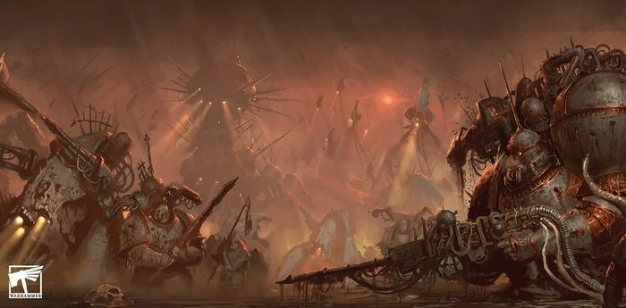

<!-- A0545-B0240 -->

原译文

The Death Guard advances 死亡守卫行军

**校订译文**

The Death Guard advances 死亡守卫行军

<!-- /A0545-B0240 -->

<!-- A0545-B0241 -->
**英文原文**

The 1st Plague Company - Known as The Harbingers. Ruled by Typhus and consists of the infamous Plague Fleet. Its ranks are infested with hundreds of strains of Zombie Plague.

<!-- /A0545-B0241 -->

<!-- A0545-B0242 -->

原译文

第一瘟疫连队 - 被称为先驱。由泰丰斯统治，由臭名昭著的瘟疫舰队组成。它的队伍中充斥着数百种僵尸瘟疫。

**校订译文**

第一瘟疫连——先驱。由泰弗斯统领，包含臭名昭著的瘟疫舰队。成员体内寄生着数百种僵尸瘟疫。

<!-- /A0545-B0242 -->

<!-- A0545-B0243 -->
**英文原文**

The 2nd Plague Company - Known as The Inexorable. Favors mechanized assaults and boasts huge formations of tanks. Its warriors bear the Ferric Blight, which speckles their armour and vehicles with a crawling rust that infest foes.

<!-- /A0545-B0243 -->

<!-- A0545-B0244 -->

原译文

第二瘟疫连队 - 被称为无情者。喜欢机械化攻击，拥有庞大的坦克编队。它的战士们身上带有铁瘟，这种病会在他们的盔甲和载具上留下爬行的铁锈，感染敌人。

**校订译文**

第二瘟疫连——无情者。偏爱机械化突击，拥有庞大坦克部队。战士携带铁瘟，使护甲和载具布满会蠕动、能感染敌人的锈蚀。

<!-- /A0545-B0244 -->

<!-- A0545-B0245 -->
**英文原文**

The 3rd Plague Company - Known as Mortarion's Anvil. Excels in digging in and letting their foes bleed themselves against their defenses. They carry the Gloaming Bloat, a plague of fever sweats that slicks their armour and causes them to speak in wet gurgles.

<!-- /A0545-B0245 -->

<!-- A0545-B0246 -->

原译文

第三瘟疫连队 - 被称为莫塔里安的铁砧。擅长挖掘并让敌人在防御中流血。他们携带着一种名为“暮色肿胀”的瘟疫，这会使他们的盔甲变得光滑，并导致他们发出湿漉漉的咯咯声。

**校订译文**

第三瘟疫连——莫塔里安的铁砧。擅长掘壕固守，让敌人在冲击防线时耗尽鲜血。他们携带暮色肿胀，这种疫病引起高烧与大量出汗，汗液使护甲湿滑，说话时也发出含水般的咕噜声。

**校注：** 补回fever sweats发热出汗，护甲湿滑为结果；digging in为构筑防御，不是一般挖掘。

<!-- /A0545-B0246 -->

<!-- A0545-B0247 -->
**英文原文**

The 4th Plague Company - Known as The Wretched. Ruled by the Daemon known as the Eater of Lives. Its members are wracked with the Eater Plague and prefer Sorcerers and summoning daemons.

<!-- /A0545-B0247 -->

<!-- A0545-B0248 -->

原译文

第四瘟疫连队 - 被称为悲惨者。由被称为生命吞噬者的恶魔统治。它的成员被吞噬瘟疫折磨，更喜欢巫师和召唤恶魔。

**校订译文**

第四瘟疫连——悲惨者。由恶魔生命吞噬者统领，成员深受吞噬瘟疫折磨，格外倚重巫师与恶魔召唤。

<!-- /A0545-B0248 -->

<!-- A0545-B0249 -->
**英文原文**

The 5th Plague Company - Known as the Poxmongers, its members make great use of Daemon Engines. Its forces carry the Sanguous Flux, which causes endless half-clotted bleeding.

<!-- /A0545-B0249 -->

<!-- A0545-B0250 -->

原译文

第五瘟疫连队 - 被称为痘疹商人，其成员充分利用了恶魔引擎。它的部队携带着血液流动，这会导致无休止的半凝结出血。

**校订译文**

第五瘟疫连——痘疹商人。大量使用恶魔引擎，携带血涌症，不断流出半凝结的鲜血。

**校注：** Sanguous Flux在此为持续出血的疫病，暂定血涌症，原血液流动丢失病名含义。

<!-- /A0545-B0250 -->

<!-- A0545-B0251 -->

原译文

The Weeping Legion 哭泣军团

**校订译文**

The Weeping Legion 哭泣军团

<!-- /A0545-B0251 -->

<!-- A0545-B0252 -->
**英文原文**

The 6th Plague Company - Called the Ferrymen or Brethren of the Fly, the 6th Plague Company garrisons the Death Guards fleets and acquires new ships for their armadas. Their numbers boasts large numbers of Terminators riddled with the parasite known as the droning.

<!-- /A0545-B0252 -->

<!-- A0545-B0253 -->

原译文

第六瘟疫连队 - 被称为渡船主或苍蝇兄弟会，第六瘟疫连队驻扎着死亡守卫舰队，并为他们的舰队购买了新的舰船。他们的成员拥有大量被称为嗡嗡的寄生虫所困扰的终结者。

**校订译文**

第六瘟疫连——渡船主，又称苍蝇兄弟会。负责驻守死亡守卫舰队，并为其获取新舰。成员中有大量终结者，体内遍布称为嗡鸣的寄生虫。

**校注：** acquires仅指获取新舰，不代表花钱购买；garrisons指驻守舰队。

<!-- /A0545-B0253 -->

<!-- A0545-B0254 -->
**英文原文**

Venomariners - Raiding sub-formation

<!-- /A0545-B0254 -->

<!-- A0545-B0255 -->

原译文

毒液战士 - 突袭分支编队

**校订译文**

毒液战士 - 突袭分支编队

<!-- /A0545-B0255 -->

<!-- A0545-B0256 -->
**英文原文**

The 7th Plague Company - Known as Mortarion's Chosen Sons. These are plague brewers and alchemists, blessed with the Crawling Pustulance.

<!-- /A0545-B0256 -->

<!-- A0545-B0257 -->

原译文

第七瘟疫连队 - 被称为莫塔里安的亲选之子。这些是瘟疫制造者和炼金术士，有幸拥有龟裂脓疱。

**校订译文**

第七瘟疫连——莫塔里安的亲选之子。成员是瘟疫酿造者与炼金术士，蒙受蠕行脓疱的赐福。

**校注：** Crawling为蠕行，不是龟裂，Pustulance按原词保留脓疱。

<!-- /A0545-B0257 -->

<!-- A0545-B0258 -->
### Sub-factions 分支派系

<!-- /A0545-B0258 -->

<!-- A0545-B0259 -->
**英文原文**

Alongside the Black Legion and Word Bearers the Death Guard are one of the three traitor Legions that haven't fractured in the years since the Horus Heresy. The Legion fights for a singular purpose under the will of Mortarion, but until recently much of his rule had become remote due to his interest in the Warp.

<!-- /A0545-B0259 -->

<!-- A0545-B0260 -->

原译文

与黑色军团和怀言者一起，死亡守卫是荷鲁斯叛乱以来没有分裂的三个叛徒军团之一。军团在莫塔里安的意志下为一个独特的目的而战，但直到最近，由于他对亚空间的兴趣，他的大部分统治都变得遥不可及。

**校订译文**

死亡守卫与黑色军团、怀言者并列，属于荷鲁斯之乱后仍保持整体组织的三支叛徒军团。军团遵从莫塔里安意志，为同一目的而战；但直到不久前，由于原体醉心亚空间事务，他对军团大多只作远距离统治。

<!-- /A0545-B0260 -->

<!-- A0545-B0261 -->
**英文原文**

For all its theoretical cohesion, in reality the Death Guard Legion is broken up across thousands of galactic war zones, often at the whims of Chaos Lords, champions, and the like. These warbands vary hugely in size and composition, but all are known as vectoriums. Those that fight together for any length of time will be named by their leader, and will often adopt – or simply manifest – a unifying colour scheme. Most vectoriums are drawn from maladictums or colonies of the same plague company, but some can be more disparate still.

<!-- /A0545-B0261 -->

<!-- A0545-B0262 -->

原译文

尽管有着理论上的凝聚力，但实际上，死亡守卫军团在数千个银河系战区被拆分，这通常是由混沌领主、冠军等突发奇想造成的。这些战帮的大小和组成差异很大，但都被称为载体。那些在一起战斗了很长时间的人将由他们的领导人命名，并且通常会采用或只是表现出一种统一的配色方案。大多数载体来自同一瘟疫连队的恶言或菌落，但有些可能更加不同。

**校订译文**

尽管理论上统一，死亡守卫实际散布在银河数千个战区，常随混沌领主与各类勇士的心意行动。战帮规模、构成差异极大，却都统称传疫群。共同作战一段时间后，领袖会为其命名，成员往往采用统一配色，或自行显现相近的外观。多数传疫群由同一瘟疫连的恶言或菌落抽组，但有些来源更为混杂。

**校注：** vectoriums为战帮编制专称，原载体易与寄生宿主混淆，暂定传疫群；其名称保留媒介传播语义。

<!-- /A0545-B0262 -->

<!-- A0545-B0263 -->
**英文原文**

Following the Noctis Aeterna and formation of the Great Rift, Mortarion reasserted his control over the Death Guard and now leads it against the Imperium once more.

<!-- /A0545-B0263 -->

<!-- A0545-B0264 -->

原译文

在永恒之夜和大裂隙形成之后，莫塔里安重新控制了死亡守卫，现在再次领导它对抗帝国。

**校订译文**

永恒之夜与大裂隙之后，莫塔里安重新收紧控制，再次亲率死亡守卫进攻帝国。

<!-- /A0545-B0264 -->

<!-- A0545-B0265 图片 -->
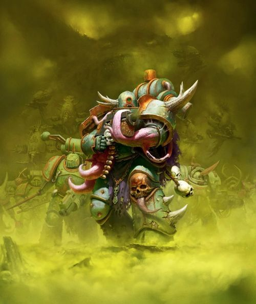

<!-- A0545-B0266 -->

原译文

Death Guard forces 死亡守卫部队

**校订译文**

Death Guard forces 死亡守卫部队

<!-- /A0545-B0266 -->

<!-- A0545-B0267 -->
## Noted Elements of the Death Guard 死亡守卫的著名力量

原题：Noted Elements of the Death Guard 死亡守卫著名成员

<!-- /A0545-B0267 -->

<!-- A0545-B0268 -->
### Legion Artifacts 军团遗物

原题：Legion Artifacts 军团造物

<!-- /A0545-B0268 -->

<!-- A0545-B0269 -->

原译文

Silence 寂静

**校订译文**

Silence 寂静

<!-- /A0545-B0269 -->

<!-- A0545-B0270 -->

原译文

Lantern 提灯

**校订译文**

Lantern 提灯

<!-- /A0545-B0270 -->

<!-- A0545-B0271 -->

原译文

Fugaris' Helm 弗加里斯之盔

**校订译文**

Fugaris' Helm 弗加里斯之盔

<!-- /A0545-B0271 -->

<!-- A0545-B0272 -->

原译文

Suppurating Plate 溃烂盔甲

**校订译文**

Suppurating Plate 溃烂盔甲

<!-- /A0545-B0272 -->

<!-- A0545-B0273 -->

原译文

Plague Skull of Glothila 格洛希拉瘟疫颅骨

**校订译文**

Plague Skull of Glothila 格洛希拉瘟疫颅骨

<!-- /A0545-B0273 -->

<!-- A0545-B0274 -->
### Fleet 舰队

<!-- /A0545-B0274 -->

<!-- A0545-B0275 -->
**英文原文**

Barbaros' Sting - Strike Craft

<!-- /A0545-B0275 -->

<!-- A0545-B0276 -->

原译文

巴巴鲁斯之刺号 - 打击艇

**校订译文**

巴巴鲁斯之刺号 - 打击艇

<!-- /A0545-B0276 -->

<!-- A0545-B0277 -->
**英文原文**

Fourth Horseman - Ramship configured for orbital descent attacks

<!-- /A0545-B0277 -->

<!-- A0545-B0278 -->

原译文

第四骑士号 - 撞击舰配置用于轨道下降攻击

**校订译文**

第四骑士号——经过特殊配置，可实施轨道俯冲攻击的撞击舰。

<!-- /A0545-B0278 -->

<!-- A0545-B0279 -->
**英文原文**

Reaper's Shroud - Vengeance Class Grand Cruiser

<!-- /A0545-B0279 -->

<!-- A0545-B0280 -->

原译文

收割寿衣号 - 复仇级大巡洋舰

**校订译文**

收割寿衣号 - 复仇级大巡洋舰

<!-- /A0545-B0280 -->

<!-- A0545-B0281 -->

原译文

Rotbringer 腐烂使者号

**校订译文**

Rotbringer 腐烂使者号

<!-- /A0545-B0281 -->

<!-- A0545-B0282 -->
**英文原文**

Terminus Est - Capital Ship

<!-- /A0545-B0282 -->

<!-- A0545-B0283 -->

原译文

东部终点号 - 主力舰

**校订译文**

终焉号——主力舰。

<!-- /A0545-B0283 -->

<!-- A0545-B0284 -->
**英文原文**

Undying - Capital Ship

<!-- /A0545-B0284 -->

<!-- A0545-B0285 -->

原译文

不死号 - 主力舰

**校订译文**

不死号 - 主力舰

<!-- /A0545-B0285 -->

<!-- A0545-B0286 -->
**英文原文**

Writhing God - Space Hulk

<!-- /A0545-B0286 -->

<!-- A0545-B0287 -->

原译文

翻腾之神号 - 太空废船

**校订译文**

翻腾之神号 - 太空废船

<!-- /A0545-B0287 -->

<!-- A0545-B0288 -->
**英文原文**

All of the Legion's Heresy-era vessels are likely to have been stranded in the Warp following Typhon's treachery. The Terminus Est still exists, as does at least one other capital ship known as the Plagueclaw. Today, all vessels of the Death Guard are hideously mutated by the power of Nurgle and display unusual levels of endurance and even regenerate damage. They have since complimented their surviving Heresy-era vessels with new additions captured from the Imperium as well as Xenos.

<!-- /A0545-B0288 -->

<!-- A0545-B0289 -->

原译文

在泰丰的背叛之后，军团所有的叛乱时期战舰都可能被困在亚空间中。东部终点号仍然存在，至少还有一艘被称为瘟疫之爪号的主力舰。如今，死亡守卫的所有战舰都被纳垢的力量可怕地变异了，表现出不同寻常的耐力水平，甚至可以再生伤害。自那以后，他们用从帝国和异型缴获的新战舰来赞美他们幸存的叛乱时期战舰。

**校订译文**

提丰背叛之后，军团当时的舰船很可能全部受困亚空间。终焉号至今仍存，另至少有一艘名为瘟疫之爪号的主力舰留存。如今，所有死亡守卫舰船都遭纳垢力量扭曲，变异骇人，却也异常坚韧，甚至能自行修复损伤。他们还夺取帝国与异形舰船，补充从叛乱时代留存的舰队。

**校注：** 英文complimented疑为complemented之误，结合captured new additions明确指补充舰队，不是赞美旧舰；regenerate damage为修复损伤，非再生伤害。

<!-- /A0545-B0289 -->

<!-- A0545-B0290 -->
**英文原文**

By the time of the 13th Black Crusade, Typhus was in command of a powerful Death Guard fleet. This included the vessels Plagueclaw and Terminus Est as well as two other Battleships, three Heavy Cruisers, five Cruiser squadrons, and twelve Escort squadrons.

<!-- /A0545-B0290 -->

<!-- A0545-B0291 -->

原译文

到第13次黑色远征时，泰丰斯已经指挥了一支强大的死亡守卫舰队。这包括瘟疫之爪号和东部终点号，以及另外两艘战列舰、三艘重型巡洋舰、五个巡洋舰中队和十二个护卫舰中队。

**校订译文**

第十三次黑色远征时，泰弗斯统领一支强大的死亡守卫舰队，包括瘟疫之爪号、终焉号，另有两艘战列舰、三艘重型巡洋舰、五个巡洋舰中队与十二个护航舰中队。

<!-- /A0545-B0291 -->

<!-- A0545-B0292 -->
### Notable Members 著名成员

<!-- /A0545-B0292 -->

<!-- A0545-B0293 -->
### Heresy Era 叛乱时期

<!-- /A0545-B0293 -->

<!-- A0545-B0294 -->
**英文原文**

Mortarion — Primarch.

<!-- /A0545-B0294 -->

<!-- A0545-B0295 -->

原译文

莫塔里安 — 原体

**校订译文**

莫塔里安 — 原体

<!-- /A0545-B0295 -->

<!-- A0545-B0296 -->
**英文原文**

Caipha Morarg — member of the 24th Breacher Squad, Mortarion's Equerry.

<!-- /A0545-B0296 -->

<!-- A0545-B0297 -->

原译文

凯法·莫拉格 — 莫塔里安的侍从官，第24破坏者小队的成员。

**校订译文**

凯法·莫拉格——莫塔里安侍从官，第24攻坚小队成员。

**校注：** Breacher统一攻坚者，与Devastator破坏者分开。

<!-- /A0545-B0297 -->

<!-- A0545-B0298 -->
**英文原文**

Calas Typhon — First Captain

<!-- /A0545-B0298 -->

<!-- A0545-B0299 -->

原译文

卡拉斯·泰丰 — 第一连长

**校订译文**

卡拉斯·提丰——第一连长。

<!-- /A0545-B0299 -->

<!-- A0545-B0300 -->
**英文原文**

Crysos Morturg — Lieutenant, remained loyal to the Emperor.

<!-- /A0545-B0300 -->

<!-- A0545-B0301 -->

原译文

克莱索斯·莫图格 — 副官，仍然忠于帝皇。

**校订译文**

克莱索斯·莫图格 — 副官，仍然忠于帝皇。

<!-- /A0545-B0301 -->

<!-- A0545-B0302 -->
**英文原文**

Durak Rask — Siegemaster, Marshal of Ordnance.

<!-- /A0545-B0302 -->

<!-- A0545-B0303 -->

原译文

杜拉克·拉斯克 — 攻城大师，军械元帅。

**校订译文**

杜拉克·拉斯克 — 攻城大师，军械元帅。

<!-- /A0545-B0303 -->

<!-- A0545-B0304 -->
**英文原文**

Ignatius Grulgor — Commander, 2nd Company.

<!-- /A0545-B0304 -->

<!-- A0545-B0305 -->

原译文

伊格纳修斯·格鲁戈尔 — 第二连队指挥官。

**校订译文**

伊格纳修斯·格鲁戈尔 — 第二连队指挥官。

<!-- /A0545-B0305 -->

<!-- A0545-B0306 -->
**英文原文**

Gremus Kalgaro — Siegemaster.

<!-- /A0545-B0306 -->

<!-- A0545-B0307 -->

原译文

格雷穆斯·卡尔加洛 — 攻城大师。

**校订译文**

格雷穆斯·卡尔加洛 — 攻城大师。

<!-- /A0545-B0307 -->

<!-- A0545-B0308 -->
**英文原文**

Malig Laestygon — Commander.

<!-- /A0545-B0308 -->

<!-- A0545-B0309 -->

原译文

马利格·莱斯蒂贡 — 指挥官。

**校订译文**

马利格·莱斯蒂贡 — 指挥官。

<!-- /A0545-B0309 -->

<!-- A0545-B0310 -->
**英文原文**

Meric Voyen — Apothecary, 7th Company.

<!-- /A0545-B0310 -->

<!-- A0545-B0311 -->

原译文

梅里克·沃延 — 第七连队药剂师。

**校订译文**

梅里克·沃延 — 第七连队药剂师。

<!-- /A0545-B0311 -->

<!-- A0545-B0312 -->
**英文原文**

Nathaniel Garro — Battle-Captain, 7th Company, remained loyal to the Emperor.

<!-- /A0545-B0312 -->

<!-- A0545-B0313 -->

原译文

纳撒尼尔·伽罗 — 第七连队的战斗连长，仍然忠于帝皇。

**校订译文**

纳撒尼尔·伽罗 — 第七连队的战斗连长，仍然忠于帝皇。

<!-- /A0545-B0313 -->

<!-- A0545-B0314 -->
**英文原文**

Ullis Temeter — Captain, 4th Company, remained loyal to the Emperor.

<!-- /A0545-B0314 -->

<!-- A0545-B0315 -->

原译文

乌尔里斯·特梅特 — 第四连队连长，仍然忠于帝皇。

**校订译文**

乌尔里斯·特梅特 — 第四连队连长，仍然忠于帝皇。

<!-- /A0545-B0315 -->

<!-- A0545-B0316 -->
**英文原文**

Hadrabulus Vioss — Captain of the Grave Wardens.

<!-- /A0545-B0316 -->

<!-- A0545-B0317 -->

原译文

哈德拉布鲁斯·维奥斯 — 守墓人连长。

**校订译文**

哈德拉布鲁斯·维奥斯 — 守墓人连长。

<!-- /A0545-B0317 -->

<!-- A0545-B0318 -->
**英文原文**

Antavus Barrazin — First Captain (Great Crusade).

<!-- /A0545-B0318 -->

<!-- A0545-B0319 -->

原译文

安塔武斯·巴拉津 — 第一连长（大远征）

**校订译文**

安塔武斯·巴拉津 — 第一连长（大远征）

<!-- /A0545-B0319 -->

<!-- A0545-B0320 -->
**英文原文**

Malek Vos — Commander.

<!-- /A0545-B0320 -->

<!-- A0545-B0321 -->

原译文

马利克·沃斯 — 指挥官。

**校订译文**

马利克·沃斯 — 指挥官。

<!-- /A0545-B0321 -->

<!-- A0545-B0322 -->
**英文原文**

Huron-Fal — Dreadnought.

<!-- /A0545-B0322 -->

<!-- A0545-B0323 -->

原译文

休伦·法尔 — 无畏。

**校订译文**

休伦·法尔 — 无畏。

<!-- /A0545-B0323 -->

<!-- A0545-B0324 -->
**英文原文**

Haldon-Tal — Contemptor Dreadnought.

<!-- /A0545-B0324 -->

<!-- A0545-B0325 -->

原译文

哈尔登·塔尔 — 蔑视者无畏。

**校订译文**

哈尔登·塔尔 — 蔑视者无畏。

<!-- /A0545-B0325 -->

<!-- A0545-B0326 -->
**英文原文**

Holgoarg — Captain.

<!-- /A0545-B0326 -->

<!-- A0545-B0327 -->

原译文

霍尔高格 — 连长

**校订译文**

霍尔高格 — 连长

<!-- /A0545-B0327 -->

<!-- A0545-B0328 -->
**英文原文**

Erud Vahn — Blackshield.

<!-- /A0545-B0328 -->

<!-- A0545-B0329 -->

原译文

埃鲁德·瓦恩 — 黑盾。

**校订译文**

埃鲁德·瓦恩 — 黑盾。

<!-- /A0545-B0329 -->

<!-- A0545-B0330 -->
### Post Heresy 叛乱后

<!-- /A0545-B0330 -->

<!-- A0545-B0331 -->
**英文原文**

Mortarion — Daemon Prince.

<!-- /A0545-B0331 -->

<!-- A0545-B0332 -->

原译文

莫塔里安 — 恶魔原体

**校订译文**

莫塔里安——恶魔亲王。

**校注：** 英文此处Daemon Prince按恶魔亲王译，原体身份见此前正文。

<!-- /A0545-B0332 -->

<!-- A0545-B0333 -->
**英文原文**

Festardius — Warband leader.

<!-- /A0545-B0333 -->

<!-- A0545-B0334 -->

原译文

费斯塔迪厄斯 — 战帮领袖

**校订译文**

费斯塔迪厄斯 — 战帮领袖

<!-- /A0545-B0334 -->

<!-- A0545-B0335 -->
**英文原文**

Gideous Krall — Warband leader.

<!-- /A0545-B0335 -->

<!-- A0545-B0336 -->

原译文

吉迪厄斯·克拉尔 — 战帮领袖

**校订译文**

吉迪厄斯·克拉尔 — 战帮领袖

<!-- /A0545-B0336 -->

<!-- A0545-B0337 -->
**英文原文**

Thagus Daravek — Warband leader and rival of Abaddon.

<!-- /A0545-B0337 -->

<!-- A0545-B0338 -->

原译文

塔古斯·达拉维克 — 战帮领袖和阿巴顿的对手。

**校订译文**

塔古斯·达拉维克 — 战帮领袖和阿巴顿的对手。

<!-- /A0545-B0338 -->

<!-- A0545-B0339 -->
**英文原文**

Typhus — Herald of Nurgle.

<!-- /A0545-B0339 -->

<!-- A0545-B0340 -->

原译文

泰丰斯 — 纳垢先驱

**校订译文**

泰弗斯——纳垢先驱。

<!-- /A0545-B0340 -->

<!-- A0545-B0341 -->
**英文原文**

Porphyricus — former Librarian, later Chaos Sorcerer.

<!-- /A0545-B0341 -->

<!-- A0545-B0342 -->

原译文

泼费里库斯 — 前智库，后混沌巫师。

**校订译文**

泼费里库斯——原为智库员，后来成为混沌巫师。

<!-- /A0545-B0342 -->

<!-- A0545-B0343 -->
**英文原文**

Ignatius Grulgor — Daemon Prince.

<!-- /A0545-B0343 -->

<!-- A0545-B0344 -->

原译文

伊格纳修斯·格鲁戈尔 — 恶魔王子

**校订译文**

伊格纳修斯·格鲁戈尔——恶魔亲王。

<!-- /A0545-B0344 -->

<!-- A0545-B0345 -->
**英文原文**

Necrosius — Sorcerer of Nurgle.

<!-- /A0545-B0345 -->

<!-- A0545-B0346 -->

原译文

内克罗修斯 — 纳垢巫师。

**校订译文**

内克罗修斯 — 纳垢巫师。

<!-- /A0545-B0346 -->

<!-- A0545-B0347 -->
**英文原文**

Ilyaster Faylech — Became a member of the Black Legion.

<!-- /A0545-B0347 -->

<!-- A0545-B0348 -->

原译文

伊利亚斯特尔·费里奇 — 成为黑色军团的一员。

**校订译文**

伊利亚斯特尔·费里奇 — 成为黑色军团的一员。

<!-- /A0545-B0348 -->

<!-- A0545-B0349 -->
**英文原文**

Eater of Lives — Daemon and commander.

<!-- /A0545-B0349 -->

<!-- A0545-B0350 -->

原译文

生命吞噬者 — 恶魔和指挥官

**校订译文**

生命吞噬者 — 恶魔和指挥官

<!-- /A0545-B0350 -->

<!-- A0545-B0351 -->
**英文原文**

Vorx — Chaos Lord.

<!-- /A0545-B0351 -->

<!-- A0545-B0352 -->

原译文

沃克斯 — 混沌领主

**校订译文**

沃克斯 — 混沌领主

<!-- /A0545-B0352 -->

<!-- A0545-B0353 -->
**英文原文**

Skarrovectis - Daemon Prince

<!-- /A0545-B0353 -->

<!-- A0545-B0354 -->

原译文

斯卡罗维克托斯 - 恶魔王子

**校订译文**

斯卡罗维克托斯——恶魔亲王。

<!-- /A0545-B0354 -->

<!-- A0545-B0355 -->
### Unique Troops 独特部队

<!-- /A0545-B0355 -->

<!-- A0545-B0356 -->

原译文

Lord of Contagion 疫病领主

**校订译文**

Lord of Contagion 疫病领主

<!-- /A0545-B0356 -->

<!-- A0545-B0357 -->

原译文

Lord of Virulence 烈毒领主

**校订译文**

Lord of Virulence 病毒领主

**校注：** GW09/GW10第18页完整单位对应：Lord of Virulence病毒领主。

<!-- /A0545-B0357 -->

<!-- A0545-B0358 -->

原译文

Lord of Poxes 痘疹领主

**校订译文**

Lord of Poxes 痘疹领主

<!-- /A0545-B0358 -->

<!-- A0545-B0359 图片 -->
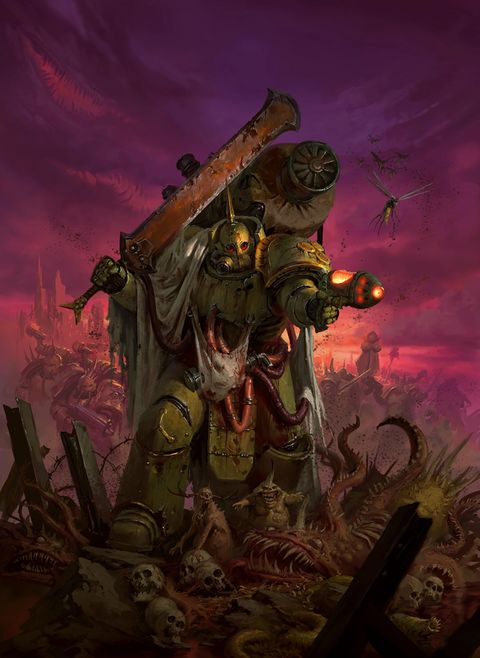

<!-- A0545-B0360 -->

原译文

Lord of Poxes 痘疹领主

**校订译文**

Lord of Poxes 痘疹领主

<!-- /A0545-B0360 -->

<!-- A0545-B0361 -->

原译文

Malignant Plaguecaster 恶疾使者

**校订译文**

Malignant Plaguecaster 恶瘟投放者

**校注：** GW09/GW10第18页完整单位官译：恶瘟投放者、剧毒疫病使者、腐毒领主终结者、恶臭病原体、生物腐化者、恶臭肿胀机兵、恶臭疫病引擎、瘟爆履带战车、书记官、瘴毒机；原稿各旧称仅留对照。

<!-- /A0545-B0361 -->

<!-- A0545-B0362 -->

原译文

Noxious Blightbringer 丧钟使者

**校订译文**

Noxious Blightbringer 剧毒疫病使者

<!-- /A0545-B0362 -->

<!-- A0545-B0363 -->

原译文

Deathshroud 死亡寿衣

**校订译文**

Deathshroud 死亡寿衣

<!-- /A0545-B0363 -->

<!-- A0545-B0364 图片 -->
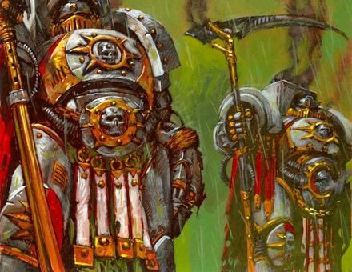

<!-- A0545-B0365 -->

原译文

Deathshroud 死亡寿衣

**校订译文**

Deathshroud 死亡寿衣

<!-- /A0545-B0365 -->

<!-- A0545-B0366 -->

原译文

Blightlord Terminator 枯萎领主终结者

**校订译文**

Blightlord Terminator 腐毒领主终结者

<!-- /A0545-B0366 -->

<!-- A0545-B0367 -->

原译文

Plague Surgeon 瘟疫军医

**校订译文**

Plague Surgeon 瘟疫军医

<!-- /A0545-B0367 -->

<!-- A0545-B0368 -->

原译文

Foul Blightspawn 瘟疫散播者

**校订译文**

Foul Blightspawn 恶臭病原体

<!-- /A0545-B0368 -->

<!-- A0545-B0369 -->

原译文

Biologus Putrifier 病毒精炼者

**校订译文**

Biologus Putrifier 生物腐化者

<!-- /A0545-B0369 -->

<!-- A0545-B0370 -->
**英文原文**

Grave Wardens (Heresy-era)

<!-- /A0545-B0370 -->

<!-- A0545-B0371 -->

原译文

守墓人（叛乱时期）

**校订译文**

守墓人（叛乱时期）

<!-- /A0545-B0371 -->

<!-- A0545-B0372 -->
**英文原文**

Mortus Poisoners (Heresy-era)

<!-- /A0545-B0372 -->

<!-- A0545-B0373 -->

原译文

莫图斯毒杀者（叛乱时期）

**校订译文**

莫图斯毒杀者（叛乱时期）

<!-- /A0545-B0373 -->

<!-- A0545-B0374 -->

原译文

Foetid Bloat-Drone 恶臭肿胀机蜂

**校订译文**

Foetid Bloat-Drone 恶臭肿胀机兵

<!-- /A0545-B0374 -->

<!-- A0545-B0375 -->

原译文

Myphitic Blight-Hauler 恶臭枯萎传播者

**校订译文**

Myphitic Blight-Hauler 恶臭疫病引擎

<!-- /A0545-B0375 -->

<!-- A0545-B0376 -->

原译文

Plagueburst Crawler 瘟疫爆裂爬行者

**校订译文**

Plagueburst Crawler 瘟爆履带战车

<!-- /A0545-B0376 -->

<!-- A0545-B0377 -->

原译文

Tallymen 记患官

**校订译文**

Tallymen 书记官

**校注：** 书记官为死亡守卫Tallyman单位官译，不能跨用到Epidemius的计数者称号。

<!-- /A0545-B0377 -->

<!-- A0545-B0378 -->

原译文

Miasmic Malignifier 污浊恶源

**校订译文**

Miasmic Malignifier 瘴毒机

<!-- /A0545-B0378 -->

本篇核心术语与暂定项

以下列出本篇出现的英文原形及核心术语表用词。同形词可能指不同对象，具体词义以本篇正文和校注为准；单复数、别名和仅见于图注的名称可能尚未列入。完整候选见[术语表](../../术语表/双语术语候选.csv)。

| 英文 | 采用中文 | 状态 |
| --- | --- | --- |
| Space Marines | 星际战士 | 官方已核对 |
| Dark Angels | 黑暗天使 | 官方已核对 |
| Grey Knights | 灰骑士 | 官方已核对 |
| Space Wolves | 太空野狼 | 官方已核对 |
| Death Guard | 死亡守卫 | 官方已核对 |
| Tyranids | 泰伦虫族 | 官方已核对 |
| Librarian | 智库员 | 官方已核对 |
| Terminator | 终结者 | 官方已核对 |
| Bolt Pistol | 爆矢手枪 | 官方已核对 |
| Ultramar | 奥特拉玛 | 官方已核对 |
| Ultramarines | 极限战士 | 官方已核对 |
| Horus Heresy | 荷鲁斯之乱 | 官方已核对 |
| Warp | 亚空间 | 官方已核对 |
| Great Rift | 大裂隙 | 官方已核对 |
| Imperium | 帝国 | 暂定·简称 |
| Dark Age of Technology | 黑暗科技时代 | 暂定 |
| Sorcerer | 巫师 | 官方已核对 |
| Nurgle | 纳垢 | 官方已核对 |
| Eye of Terror | 恐惧之眼 | 官方已核对 |
| Imperial Fists | 帝国之拳 | 暂定 |
| Emperor | 帝皇 | 官方已核对 |
| Primarch | 原体 | 官方已核对 |
| Battle Barge | 战斗驳船 | 暂定·官方待核 |
| Goliath | 歌利亚 | 暂定·官方待核 |
| Word Bearers | 怀言者 | 暂定·官方待核 |
| Daemon Prince | 恶魔亲王 | 官方已核对 |
| Black Legion | 黑色军团 | 暂定·官方待核 |
| Emperor's Children | 帝皇之子 | 官方已核对 |
| Lords of Silence | 寂静领主 | 暂定·官方待核 |
| Unbroken | 不屈者 | 暂定·官方待核 |
| Unchanged | 未变者 | 暂定·官方待核 |
| Iron Warriors | 钢铁勇士 | 暂定·官方待核 |
| Great Crusade | 大远征 | 暂定·官方待核 |
| Mortarion | 莫塔里安 | 官方已核对 |
| Barbarus | 巴巴鲁斯 | 暂定·官方待核 |
| Terra | 泰拉 | 暂定·官方待核 |
| Horus | 荷鲁斯 | 暂定·官方待核 |
| Sons of Horus | 荷鲁斯之子 | 暂定·官方待核 |
| Isstvan III | 伊斯塔万三号 | 暂定·官方待核 |
| Navigators | 导航员 | 官方已核对 |
| Plague Wars | 瘟疫战争 | 暂定·官方待核 |
| Unification Wars | 统一战争 | 暂定·官方待核 |
| Sector | 星区 | 暂定·官方待核 |
| Endurance | 坚韧 | 暂定·官方待核 |
| Brotherhood | 兄弟会 | 暂定·官方待核 |
| Agripinaa | 阿格里皮娜 | 暂定·官方待核 |
| Caliban | 卡利班 | 暂定·官方待核 |
| Banish | 巴尼什 | 暂定·官方待核 |
| Luna | 月球 | 暂定·官方待核 |
| Molech | 摩洛 | 暂定·官方待核 |
| Titan | 泰坦 | 暂定·官方待核 |
| Nod | 诺德 | 暂定·官方待核 |
| Dark Glass | 黑暗琉璃 | 暂定·官方待核 |
| Apothecary | 药剂师 | 官方已核对 |
| Ancient | 旗手 | 官方已核对 |
| Veil | 韦尔 | 暂定·官方待核 |
| Lieutenant | 副官 | 暂定·官方待核 |
| White Scars | 白疤 | 官方已核 |
| The Primarchs | 原体 | 暂定·官方待核 |
| Scars | 伤疤 | 暂定·官方待核 |
| The Battle of Perditus | 佩迪图斯之战 | 暂定·官方待核 |
| Erud Vahn | 埃鲁德·梵恩 | 暂定·官方待核 |
| Crysos Morturg | 克瑞索斯·莫特格 | 暂定·官方待核 |
| Isstvan | 伊斯塔万 | 暂定·官方待核 |
| Nathaniel Garro | 纳撒尼尔·伽罗 | 暂定·官方待核 |
| First Captain | 第一连长 | 暂定·官方待核 |
| Astelan | 阿斯特兰 | 暂定·官方待核 |
| Eidolon | 艾多隆 | 暂定·官方待核 |
| Calas Typhon | 卡拉斯·提丰 | 暂定·官方待核 |
| Caipha Morarg | 凯法·莫拉格 | 暂定·官方待核 |
| Durak Rask | 杜拉克·拉斯克 | 暂定·官方待核 |
| Champion | 冠军 | 暂定·官方待核 |
| Herald | 传令官 | 暂定·官方待核 |
| Power Armour | 动力盔甲 | 暂定·官方待核 |
| Destroyer | 毁灭者 | 暂定·官方待核 |
| Mortus Poisoners | 莫图斯毒杀者 | 暂定·官方待核 |
| Space Marine | 星际战士 | 暂定·官方待核 |
| Captain | 连长 | 暂定·官方待核 |
| Terminators | 终结者 | 暂定·官方待核 |
| Brother | 修士 | 暂定·官方待核 |
| White Consuls | 白色执政官 | 暂定·官方待核 |
| Tactical Squads | 战术小队 | 暂定·官方待核 |
| Overlord | 霸主 | 官方已核对 |
| Harbingers | 凶兆 | 暂定·官方待核 |
| Gene-seed | 基因种子 | 暂定·官方待核 |
| Vengeance Class Grand Cruiser | 复仇级大型巡洋舰 | 暂定·官方待核 |
| Battle Companies | 战斗连队 | 暂定·官方待核 |
| Equerry | 近侍 | 暂定·官方待核 |
| Cohort | 大队 | 暂定·官方待核 |
| Powers | 能天使 | 暂定·官方待核 |
| Host | 天军 | 暂定·官方待核 |
| Xenos | 异形 | 暂定·官方待核 |
| Breacher Squad | 攻坚小队 | 暂定·官方待核 |
| Great Unclean One | 大不净者 | 官方已核对 |
| Nurglings | 纳垢灵 | 官方已核对 |
| Plaguebearers | 瘟疫使 | 官方已核对 |
| Legion Host | 军团大军 | 暂定·官方待核 |
| Rotworm Brotherhood | 腐虫兄弟会 | 暂定·官方待核 |
| Typhus | 泰弗斯 | 官方已核对 |
| Plague Marines | 瘟疫战士 | 官方已核对 |
| Contagion | 传播者 | 暂定·官方待核 |
| Bilious Ones | 胆汁众 | 暂定·官方待核 |
| Bringers of Putrid Salvation | 腐烂救赎使者 | 暂定·官方待核 |
| Brotherhood of Reaping | 收割兄弟会 | 暂定·官方待核 |
| Carrion Hounds | 腐肉猎犬 | 暂定·官方待核 |
| Children of Blain | 布莱恩之子 | 暂定·官方待核 |
| Corpsemakers | 尸体制造者 | 暂定·官方待核 |
| Dolorous Gnaw | 悲哀之噬 | 暂定·官方待核 |
| Favoured Sons | 受宠之子 | 暂定·官方待核 |
| Fecund Ones | 丰饶众 | 暂定·官方待核 |
| Festerlung Brotherhood | 烂肺兄弟会 | 暂定·官方待核 |
| Festering Scar | 溃烂疤痕 | 暂定·官方待核 |
| Filthfavoured | 污秽眷者 | 暂定·官方待核 |
| Hand of Filth | 污秽之手 | 暂定·官方待核 |
| Heralds of Despair | 绝望使者 | 暂定·官方待核 |
| Lords of Decay | 腐朽领主 | 暂定·官方待核 |
| Mouldering Claw | 腐烂之爪 | 暂定·官方待核 |
| Pallid Hand | 苍白之手 | 暂定·官方待核 |
| Poisoned Chalice | 剧毒圣杯 | 暂定·官方待核 |
| Pox Mortis | 死亡痘疹 | 暂定·官方待核 |
| Prophets of the Seven | 七之先知 | 暂定·官方待核 |
| Putrid Choir | 腐烂唱诗班 | 暂定·官方待核 |
| Rusted Claws | 锈爪 | 暂定·官方待核 |
| Selminster's Curse | 塞尔明斯特的诅咒 | 暂定·官方待核 |
| Sevenfold Filth | 七重污秽 | 暂定·官方待核 |
| Seventh-day Morbidians | 七日死亡 | 暂定·官方待核 |
| Smogrot Brotherhood | 腐烟兄弟会 | 暂定·官方待核 |
| Sons of the Maggot | 蛆虫之子 | 暂定·官方待核 |
| Suppurant Sting | 脓疮之刺 | 暂定·官方待核 |
| The Tainted | 污染者 | 暂定·官方待核 |
| Tainted Lung | 污染之肺 | 暂定·官方待核 |
| Tainted Sons | 污染之子 | 暂定·官方待核 |
| The Tollguard | 征收守卫 | 暂定·官方待核 |
| Tide of Filth | 污秽浪潮 | 暂定·官方待核 |
| Weeping Legion | 哭泣军团 | 暂定·官方待核 |
| Jaghatai Khan | 察合台可汗 | 暂定·官方待核 |
| Munificence | 慷慨星 | 暂定·官方待核 |
| Destroyer Plague | 毁灭者瘟疫 | 暂定·官方待核 |
| Nightfall | 夜幕降临号 | 暂定·官方待核 |
| Gaunt | 兵虫 | 暂定·官方待核 |
| Sept | 家门 | 暂定·官方待核 |
| Startide Nexus | 星潮枢纽 | 暂定·官方待核 |
| Marshal | 元帅 | 官方已核对 |
| Kossolax | 科索拉克斯 | 暂定·官方待核 |
| Dusk Raiders | 黄昏突袭者 | 暂定·官方待核 |
| Destroyer Hive | 毁灭者蜂巢 | 暂定·官方待核 |
| Terminus Est | 终焉号 | 暂定·官方待核 |
| Mia Donna Mori | 我的女士莫里号 | 暂定·官方待核 |
| Mantles of Corruption | 腐化职分 | 暂定·官方待核 |
| Sanguous Flux | 血涌症 | 暂定·官方待核 |
| Crawling Pustulance | 蠕行脓疱 | 暂定·官方待核 |
| Droning | 嗡鸣 | 暂定·官方待核 |
| Sepsis Cohort | 败血大队 | 暂定·官方待核 |
| Black Manse | 黑宅 | 暂定·官方待核 |
| Terminus | 终点站 | 暂定·官方待核 |
| Dreadnought | 无畏机甲 | 暂定·官方待核 |
| Vengeance | 复仇号 | 暂定·官方待核 |
| Bikes | 摩托 | 暂定·官方待核 |
| Ignatius | 伊格纳修斯 | 暂定·官方待核 |
| Reaper | 收割者号 | 暂定·官方待核 |
| Ferrymen | 摆渡人 | 暂定·官方待核 |
| Thagus Daravek | 塔古斯·达拉维克 | 暂定·官方待核 |
| The Great Khan | 大汗 | 暂定·官方待核 |
| Bear | 熊 | 暂定·官方待核 |
| Dwell | 德威尔 | 暂定·官方待核 |
| Ignatius Grulgor | 伊格纳修斯·格鲁戈尔 | 暂定·官方待核 |
| Catallus | 卡塔鲁斯 | 暂定·官方待核 |
| Mercy | 仁慈 | 暂定·官方待核 |
| The Dark | 《黑暗》 | 暂定·官方待核 |
| Kornovin | 科尔诺温 | 暂定·官方待核 |
| System | 星系（恒星系统） | 暂定·官方待核 |
| Shroud | 裹尸布 | 暂定·官方待核 |
| Noctis Aeterna | 永恒之夜 | 暂定·官方待核 |
| Ironside | 铁边号 | 暂定·官方待核 |
| Albia | 阿尔比亚 | 暂定·官方待核 |
| Fourth Horseman | 第四骑士号 | 暂定·官方待核 |
| Antavus Barrazin | 安塔维斯·巴拉津 | 暂定·官方待核 |
| Legio Mortis | 死亡军团 | 暂定·官方待核 |
| Corruption | 腐败 | 暂定·官方待核 |
| Ynyx | 伊尼克斯 | 暂定·官方待核 |
| Meric Voyen | 梅里克·沃延 | 暂定·官方待核 |
| Malig Laestygon | 马利格·莱斯提贡 | 暂定·官方待核 |
| Plagueclaw | 瘟疫之爪号 | 暂定·官方待核 |
| Ullis Temeter | 乌利斯·特梅特 | 暂定·官方待核 |
| claw | 利爪分队 | 暂定·官方待核 |
| Bolt | 爆矢 | 暂定·官方待核 |
| Bolter | 爆矢枪 | 暂定·官方待核 |
| Skarrovectis | 斯卡罗维克提斯 | 暂定·官方待核 |
| The Lords of Silence | 寂静领主 | 暂定·官方待核 |
| Sons of Rot | 腐烂之子 | 暂定·官方待核 |
| Invasion of Ultramar | 入侵奥特拉玛 | 暂定·官方待核 |
| Terminator Armour | 终结者盔甲 | 暂定·官方待核 |
| Eisenstein | 艾森斯坦号 | 暂定·官方待核 |
| Goliath Class Battleship | 歌利亚级战列舰 | 暂定·官方待核 |
| Plague Planet | 瘟疫星 | 暂定·官方待核 |
| Lion's Gate Spaceport | 狮门太空港 | 暂定·官方待核 |
| Lion's Gate | 狮门 | 暂定·官方待核 |

