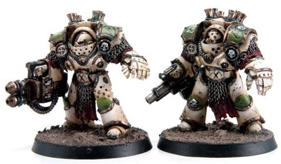

# 0546 守墓人 Grave Warden

精校状态：中文行文已逐段精校，部分术语仍为暂定

分类：概念

原文来源：https://www.bilibili.com/opus/1023298094569095200

原作者：帝国神选罐头

原文时间：2025年01月17日 13:59

[返回分类目录](目录.md) · [全书目录](../../目录.md)

<!-- A0546-B0001 -->
**英文原文**

Grave Wardens were the term given to Death Guard biological and chemical warfare formations during the Great Crusade and Horus Heresy.

<!-- /A0546-B0001 -->

<!-- A0546-B0002 -->

原译文

守墓人是指大远征和荷鲁斯叛乱时期死亡守卫的生物和化学战编队。

**校订译文**

守墓人是大远征与荷鲁斯之乱时期死亡守卫生物战、化学战部队的统称。

<!-- /A0546-B0002 -->

<!-- A0546-B0003 图片 -->

<!-- A0546-B0004 -->

原译文

Grave Warden Terminators 守墓人终结者

**校订译文**

Grave Warden Terminators 守墓人终结者

<!-- /A0546-B0004 -->

<!-- A0546-B0005 -->
**英文原文**

Originally used as an informal name for variously armed battalions of Death Guard Terminators in the service of Calas Typhon on the Terminus Est, they soon became synonymous with chemical weapon-equipped Terminators unique to the Death Guard.

<!-- /A0546-B0005 -->

<!-- A0546-B0006 -->

原译文

最初作为一个非正式的名称，用于在终焉号上为卡拉斯·泰丰斯服务的各种武装的死亡守卫终结者营，它们很快成为死亡守卫独有的配备化学武器的终结者的代名词。

**校订译文**

起初，这只是终焉号上效力于卡拉斯·提丰、装备各异的死亡守卫终结者营的非正式称呼。后来，守墓人逐渐专指死亡守卫特有的化学战终结者。

**校注：** 本篇原稿已将Terminus Est译为终焉号，可供545原东部终点号统一的现稿依据。Calas Typhon非Typhus，统一卡拉斯·提丰。

<!-- /A0546-B0006 -->

<!-- A0546-B0007 -->
**英文原文**

The Grave Wardens were outfitted in modified Cataphractii Terminator Armour the Grave Wardens were unique among the Legiones Astartes. The Death Guard made frequent use of alchemical weapons such as Phosphex Bombs, the flesh-eating Vastogox virus, and deadly Cullegene gas. Grave Wardens were specially equipped with Astartes Grenade Launchers to disperse these deadly materials over the battlefield as well as continually emitting them with Death Cloud Projector units. They were ultimately unleashed upon loyalist Imperial forces during the Horus Heresy.

<!-- /A0546-B0007 -->

<!-- A0546-B0008 -->

原译文

守墓人配备了改良的铁骑终结者盔甲，守墓人在老兵中是独一无二的。死亡守卫经常使用炼金武器，如磷化炸弹、食肉瓦斯托戈克斯病毒和致命的基因崩溃毒气。守墓人特别配备了阿斯塔特榴弹发射器，将这些致命物质散布到战场上，并用死亡云雾投射器不断发射。在荷鲁斯叛乱期间，它们最终被释放到忠诚的帝国军队上。

**校订译文**

守墓人身披改装铁骑型终结者护甲，在阿斯塔特各军团中独树一帜。死亡守卫常用磷化炸弹、蚀肉的瓦斯托戈克斯病毒，以及致命的基因崩溃毒气等炼金武器。守墓人专门配备阿斯塔特榴弹发射器，将这些致命物质散布战场，同时以死亡云雾投射器持续释放毒雾。荷鲁斯之乱中，他们最终将这些武器对准帝国忠诚派。

**校注：** Legiones Astartes指阿斯塔特军团，原译老兵错误。Cullegene gas沿原稿基因崩溃毒气，属于专名暂定，不凭字面新造设定。

<!-- /A0546-B0008 -->

<!-- A0546-B0009 -->
## Known Grave Wardens 著名守墓人

<!-- /A0546-B0009 -->

<!-- A0546-B0010 -->

原译文

Calas Typhon 卡拉斯·泰丰斯

**校订译文**

Calas Typhon 卡拉斯·提丰

<!-- /A0546-B0010 -->

<!-- A0546-B0011 -->

原译文

Hadrabulus Vioss 哈德拉布鲁斯·维奥斯

**校订译文**

Hadrabulus Vioss 哈德拉布鲁斯·维奥斯

<!-- /A0546-B0011 -->

<!-- A0546-B0012 -->

原译文

Khorag Sinj 霍拉格·辛杰

**校订译文**

Khorag Sinj 霍拉格·辛杰

<!-- /A0546-B0012 -->

本篇核心术语与暂定项

以下列出本篇出现的英文原形及核心术语表用词。同形词可能指不同对象，具体词义以本篇正文和校注为准；单复数、别名和仅见于图注的名称可能尚未列入。完整候选见[术语表](../../术语表/双语术语候选.csv)。

| 英文 | 采用中文 | 状态 |
| --- | --- | --- |
| Death Guard | 死亡守卫 | 官方已核对 |
| Terminator | 终结者 | 官方已核对 |
| Horus Heresy | 荷鲁斯之乱 | 官方已核对 |
| Great Crusade | 大远征 | 暂定·官方待核 |
| Horus | 荷鲁斯 | 暂定·官方待核 |
| Legiones Astartes | 阿斯塔特军团 | 暂定·官方待核 |
| Calas Typhon | 卡拉斯·提丰 | 暂定·官方待核 |
| Terminators | 终结者 | 暂定·官方待核 |
| Terminus Est | 终焉号 | 暂定·官方待核 |
| Death Cloud Projector | 死亡云雾投射器 | 暂定·官方待核 |
| Cullegene gas | 基因崩溃毒气 | 暂定·官方待核 |
| Vastogox virus | 瓦斯托戈克斯病毒 | 暂定·官方待核 |
| Terminus | 终点站 | 暂定·官方待核 |
| Phosphex | 磷化燃剂 | 暂定·官方待核 |
| Grenade | 手榴弹 | 暂定·官方待核 |
| Terminator Armour | 终结者盔甲 | 暂定·官方待核 |

