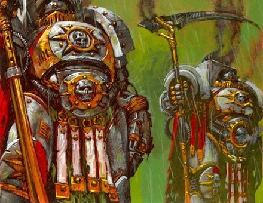
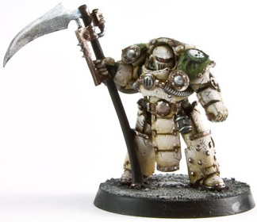
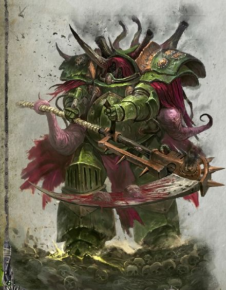
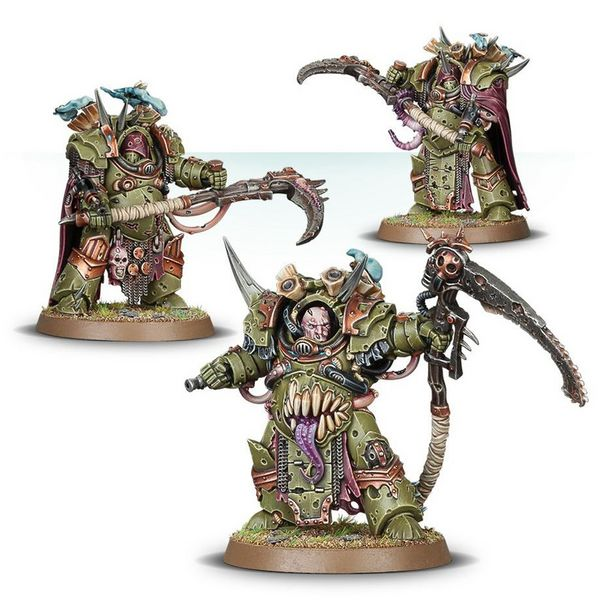

# 0547 死亡寿衣 Deathshroud

精校状态：中文行文已逐段精校，部分术语仍为暂定

分类：概念

原文来源：https://www.bilibili.com/opus/1021347973242552321

原作者：帝国神选罐头

原文时间：2025年01月12日 07:51

[返回分类目录](目录.md) · [全书目录](../../目录.md)

<!-- A0547-B0001 -->
**英文原文**

The Deathshroud were the elite bodyguard unit of the Death Guard Space Marine Legion during the Great Crusade.

<!-- /A0547-B0001 -->

<!-- A0547-B0002 -->

原译文

死亡寿衣是大远征期间死亡守卫星际战士的精英护卫部队。

**校订译文**

死亡寿衣是大远征时期死亡守卫星际战士军团的精锐亲卫。

<!-- /A0547-B0002 -->

<!-- A0547-B0003 -->
## History 历史

<!-- /A0547-B0003 -->

<!-- A0547-B0004 -->
### Pre-Heresy 叛乱前

<!-- /A0547-B0004 -->

<!-- A0547-B0005 -->
**英文原文**

Great secrecy surrounded them; they were chosen from the rank-and-file of the Death Guard by their Primarch, Mortarion, personally for their skill at arms, fearlessness and proven endurance - often being the sole survivor when the rest of their squad has perished. Their identities were a mystery, since, after being inducted into the Deathshroud, they never spoke, never removed their helmets even in death, and were officially listed as being killed in action.

<!-- /A0547-B0005 -->

<!-- A0547-B0006 -->

原译文

他们周围笼罩着巨大的秘密；他们是由他们的原体莫塔里安亲自从死亡守卫的普通士兵中挑选出来的，因为他们的武器技能、无畏精神和久经考验的耐力——当他们的小队其他成员死亡时，他们往往是唯一的幸存者。他们的身份是个谜，因为在被纳入死亡寿衣后，他们从未说话，即使在死亡后也从未摘下头盔，并被正式列为在行动中被杀。

**校订译文**

死亡寿衣笼罩在严密保密之中。莫塔里安亲自从普通战士中选拔，以武艺、无畏和经受考验的耐力为标准；入选者往往是整支小队阵亡后的唯一幸存者。加入后，他们不再开口，即便战死也不摘下头盔，而官方名册早已将其列为阵亡。因此，他们的身份始终成谜。

<!-- /A0547-B0006 -->

<!-- A0547-B0007 图片 -->

<!-- A0547-B0008 -->

原译文

Heresy-era Deathshroud 叛乱前死亡寿衣

**校订译文**

Heresy-era Deathshroud 荷鲁斯之乱时期的死亡寿衣

**校注：** Heresy-era指叛乱时期，原译叛乱前错误。

<!-- /A0547-B0008 -->

<!-- A0547-B0009 -->
**英文原文**

Deathshroud bodyguards were clad in highly artificed Terminator armour that gave them a tall and barrel-chested appearance. They were armed with hand flamers with chem-munitions and, like their master, they wielded large power scythes known as Manreapers. They never strayed more than 49 paces from their Primarch. An intimidating presence, they were capable of achieving a uniformity so perfect that when at rest they gave the impression of grand statues, and when in motion, of mechanical automatons. Mortarion was customarily attended by two Deathshroud at any one time, but there may have been more.

<!-- /A0547-B0009 -->

<!-- A0547-B0010 -->

原译文

死亡寿衣护卫身穿高度精工的终结者盔甲，使他们看起来高大宽阔。他们手持火焰枪和化学武器，像他们的主人一样，他们挥舞着被称为“收割者”的大威力镰刀。他们从未偏离过他们的原体49步。他们是一种令人生畏的存在，能够实现如此完美的统一性，以至于在静止时给人一种宏伟雕像的印象，在运动时给人以机械自动机的印象。莫塔里安通常在任何时候都有两个死亡寿衣守卫，但可能还有更多。

**校订译文**

死亡寿衣身披精工终结者护甲，身形高大，胸甲浑厚。他们装备使用化学燃料的手持火焰喷射器，并像原体一样，挥舞称为收割者的大型动力镰刀。他们与原体的距离从不超过四十九步。姿态与动作整齐划一，静止时宛如巨大雕像，移动时又像机械自动机，令人望而生畏。莫塔里安身边通常随时有两名死亡寿衣，也可能更多。

**校注：** power scythes为动力镰刀，不是笼统大威力镰刀；49为不得超出的距离，不是固定必须相隔49步。

<!-- /A0547-B0010 -->

<!-- A0547-B0011 图片 -->

<!-- A0547-B0012 -->

原译文

Deathshroud Terminator 死亡寿衣终结者

**校订译文**

Deathshroud Terminator 死亡寿衣终结者

<!-- /A0547-B0012 -->

<!-- A0547-B0013 -->
**英文原文**

In the Battle of Iota Horologi, the Deathshroud accompanied their lord in a boarding action of a cylindrical Jorgall worldship.

<!-- /A0547-B0013 -->

<!-- A0547-B0014 -->

原译文

在约塔·霍罗洛吉战役中，死亡寿衣陪伴他们的主人登上了一艘圆柱形的乔加尔世界飞船。

**校订译文**

时钟座约塔之战中，死亡寿衣随原体跳帮一艘圆柱形的乔加尔世界舰。

**校注：** Iota Horologi/545 Horologii拼写略异，暂统一时钟座约塔；Iota为希腊字母名约塔，不将其硬当作第九号行星，旧545时钟座九号/547约塔·霍罗洛吉。

<!-- /A0547-B0014 -->

<!-- A0547-B0015 -->
**英文原文**

Before an attack on the Knight world of Molech, Mortarion killed all seven of his Deathshroud bodyguards with a single stroke of his Manreaper, Silence, inside the gene-vault aboard his flagship, Endurance, in order to feed the emerging daemon essence of Ignatius Grulgor, who had been killed on Isstvan III by the the Life-eater virus.

<!-- /A0547-B0015 -->

<!-- A0547-B0016 -->

原译文

在袭击摩洛骑士世界之前，莫塔里安在其旗舰忍耐号的基因库内，用他的收割者缄默一击杀死了他的七名死亡寿衣护卫，以喂养伊格内修斯·格鲁戈尔显现的恶魔本质，他在伊斯塔万三号上被生命吞噬病毒杀死。

**校订译文**

进攻骑士世界摩洛前，莫塔里安在旗舰忍耐号的基因库中，挥动收割者动力镰刀寂静，一击杀死身旁全部七名死亡寿衣。他以此滋养正在显化的伊格纳修斯·格鲁戈尔的恶魔精魄；后者此前在伊斯塔万三号死于噬生命病毒。

**校注：** 武器Silence与545寂静统一，原缄默；Endurance此处为舰名忍耐号，不套23同形技能坚韧。Ignatius统一伊格纳修斯。

<!-- /A0547-B0016 -->

<!-- A0547-B0017 -->
### Post-Heresy 叛乱后

<!-- /A0547-B0017 -->

<!-- A0547-B0018 -->
**英文原文**

As a Daemon Prince of Nurgle, Mortarion was still accompanied by his Deathshroud ten thousand years later, notably when he confronted the Grey Knights at the Battle of Kornovin.

<!-- /A0547-B0018 -->

<!-- A0547-B0019 -->

原译文

作为纳垢的恶魔王子，莫塔里安在一万年后仍然伴随着他的死亡寿衣，特别是当他在科诺温战役中与灰骑士对峙时。

**校订译文**

一万年后，已经成为纳垢恶魔亲王的莫塔里安，身旁仍有死亡寿衣相随，科诺温之战对抗灰骑士时便是如此。

<!-- /A0547-B0019 -->

<!-- A0547-B0020 图片 -->

<!-- A0547-B0021 -->

原译文

Post-Heresy Deathshroud Terminators 荷鲁斯叛乱后死亡寿衣终结者

**校订译文**

Post-Heresy Deathshroud Terminators 荷鲁斯之乱后死亡寿衣终结者

<!-- /A0547-B0021 -->

<!-- A0547-B0022 -->
**英文原文**

Today, the Deathshroud serve as Mortarion's representatives, and while they still often fight by his side they also form the honour guard for Chaos Lords, Plague Surgeons, and other champions of Chaos which have garnered Mortarion's favor. Their presence is a mixed blessing at best. The Deathshroud will fight with all their skill and strength in support of their assigned champion, and prove to be an undeniable asset in battle. Yet all the while the Deathshroud are judging upon their master’s behalf. If the champion is successful, the Deathshroud depart at battle’s end, leaving as silently as they came. If their charge fails in his duties, however, the judgement of Mortarion is swift, deadly and utterly inescapable.

<!-- /A0547-B0022 -->

<!-- A0547-B0023 -->

原译文

今天，死亡寿衣是莫塔里安的代表，虽然他们仍然经常在他身旁战斗，但他们也为混沌领主、瘟疫军医以及其他获得莫塔里安青睐的混沌冠军组成荣誉卫队。死亡寿衣将以他们所有的技能和力量为指定的冠军而战，并被证明是战斗中不可否认的资产。然而，死亡寿衣一直在代表他们的主人进行评判。如果冠军获胜，死亡寿衣将在战斗结束时离开，像他们来时一样悄无声息地离开。然而，如果他们未能履行职责，莫塔里安的审判将是迅速、致命和完全不可避免的。

**校订译文**

如今，死亡寿衣也是莫塔里安的代表。除了常伴原体作战，他们还为得到其青睐的混沌领主、瘟疫军医和其他勇士担任荣誉卫队。但这份眷顾喜忧参半：他们会倾尽武艺与力量保护指定对象，成为战场上的强大助力，同时也始终替主人观察、评判。若受护者成功完成使命，死亡寿衣便在战后悄然离去；若其失职，莫塔里安的裁决将迅速降临，致命且无从逃避。

**校注：** 补回mixed blessing喜忧参半；末句失败的主语为受护勇士，原译他们易误指死亡寿衣。

<!-- /A0547-B0023 -->

<!-- A0547-B0024 图片 -->

<!-- A0547-B0025 -->

原译文

Deathshroud Terminators 死亡寿衣终结者

**校订译文**

Deathshroud Terminators 死亡寿衣终结者

<!-- /A0547-B0025 -->

<!-- A0547-B0026 -->
## Notable Deathshroud Members 著名死亡寿衣成员

<!-- /A0547-B0026 -->

<!-- A0547-B0027 -->

原译文

Khorak 霍拉克

**校订译文**

Khorak 霍拉克

<!-- /A0547-B0027 -->

<!-- A0547-B0028 -->

原译文

Slaunn 斯拉恩

**校订译文**

Slaunn 斯拉恩

<!-- /A0547-B0028 -->

本篇核心术语与暂定项

以下列出本篇出现的英文原形及核心术语表用词。同形词可能指不同对象，具体词义以本篇正文和校注为准；单复数、别名和仅见于图注的名称可能尚未列入。完整候选见[术语表](../../术语表/双语术语候选.csv)。

| 英文 | 采用中文 | 状态 |
| --- | --- | --- |
| Grey Knights | 灰骑士 | 官方已核对 |
| Death Guard | 死亡守卫 | 官方已核对 |
| Terminator | 终结者 | 官方已核对 |
| Nurgle | 纳垢 | 官方已核对 |
| Primarch | 原体 | 官方已核对 |
| Daemon Prince | 恶魔亲王 | 官方已核对 |
| Great Crusade | 大远征 | 暂定·官方待核 |
| Mortarion | 莫塔里安 | 官方已核对 |
| Isstvan III | 伊斯塔万三号 | 暂定·官方待核 |
| Endurance | 坚韧 | 暂定·官方待核 |
| Molech | 摩洛 | 暂定·官方待核 |
| Master | 导师（审判庭职衔）／舰务官（舰员职务） | 语境定译·官方待核 |
| Space Marine Legion | 星际战士军团 | 暂定·官方待核 |
| Honour Guard | 荣誉卫队 | 暂定·官方待核 |
| Isstvan | 伊斯塔万 | 暂定·官方待核 |
| Champion | 冠军 | 暂定·官方待核 |
| Space Marine | 星际战士 | 暂定·官方待核 |
| Flamers | 火妖（奸奇单位）／火焰喷射器（武器） | 语境定译·对应官译已核 |
| Manreaper | 收割者 | 暂定·官方待核 |
| Ignatius | 伊格纳修斯 | 暂定·官方待核 |
| Ignatius Grulgor | 伊格纳修斯·格鲁戈尔 | 暂定·官方待核 |
| Life-Eater Virus | 噬生病毒 | 暂定·官方待核 |
| Kornovin | 科尔诺温 | 暂定·官方待核 |
| Knight World | 骑士世界 | 暂定·官方待核 |
| Jorgall | 乔格尔 | 暂定·官方待核 |
| Terminator Armour | 终结者盔甲 | 暂定·官方待核 |

