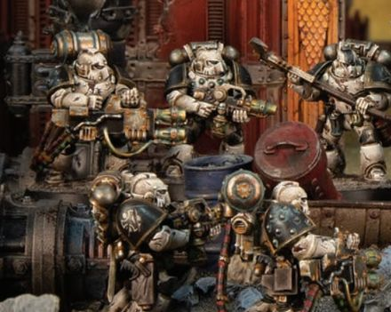

# 0548 莫图斯毒杀者 Mortus Poisoner

精校状态：中文行文已逐段精校，部分术语仍为暂定

分类：概念

原文来源：https://www.bilibili.com/opus/1030761575195082774

原作者：帝国神选罐头

原文时间：2025年02月06日 16:41

[返回分类目录](目录.md) · [全书目录](../../目录.md)

<!-- A0548-B0001 -->
**英文原文**

The Mortus Poisoners were the Death Guard's specially trained and equipped cadre of Flamer-wielding Destroyer Squads, during the Great Crusade and Horus Heresy.

<!-- /A0548-B0001 -->

<!-- A0548-B0002 -->

原译文

在大远征和荷鲁斯叛乱期间，莫图斯毒杀者小队是死亡守卫经过特殊训练和装备的火焰扫射毁灭者小队。

**校订译文**

莫图斯毒杀者是大远征与荷鲁斯之乱时期死亡守卫经过特殊训练、配有专门装备的毁灭者部队，以火焰喷射器作战。

**校注：** Flamer-wielding指使用火焰喷射器，不是火焰扫射动作。

<!-- /A0548-B0002 -->

<!-- A0548-B0003 -->
## Overview 概述

<!-- /A0548-B0003 -->

<!-- A0548-B0004 -->
**英文原文**

Kept aboard the Death Guard's Poison Ships, the Poisoners wielded a high proportion of chemical munitions, even by the standards of their Legion. Frequently deployed in support of more conventional troops, their formidable weapons were a valuable asset in clearing defensive positions. However, the horrifying alchemical flame the Poisoners' weapons spread would be the scourge of many battlefields throughout the galaxy.

<!-- /A0548-B0004 -->

<!-- A0548-B0005 -->

原译文

在死亡守卫的毒船上，毒杀者挥舞着很大比例的化学弹药，即使按照他们军团的标准也是如此。他们经常部署以支援更常规的部队，他们强大的武器是清理防御阵地的宝贵资产。然而，毒杀者的武器所发射的可怕炼金火焰将成为整个银河系许多战场的灾害。

**校订译文**

毒杀者平时驻于军团毒船，化学弹药的配备比例甚至远超死亡守卫自身的通常标准。他们常支援常规部队，以强大火力清除防御阵地。但这些武器释放的可怕炼金火焰，也成为银河无数战场的灾祸。

<!-- /A0548-B0005 -->

<!-- A0548-B0006 图片 -->

<!-- A0548-B0007 -->

原译文

Mortus Poisoners squad 莫图斯毒杀者小队

**校订译文**

Mortus Poisoners squad 莫图斯毒杀者小队

<!-- /A0548-B0007 -->

<!-- A0548-B0008 -->
**英文原文**

Eventually, though, their close exposure to such deadly chemical and biological weapons inevitably took a toll on the Poisoners. If they did not die at the hands of their enemies, then Poisoners faced an unavoidable demise: either by withering away or being consumed by flames when chemicals ate through the protective seals of their weapons' fuel canisters. The Death Guard were well aware of this, and it became an unofficial act of censure or punishment to be assigned to the Poisoners. This was reserved for members of the Legion that failed to achieve what was asked of them by their command. Despite this, however, there were Poisoners who embraced serving within the Destroyer cadre enthusiastically. These Poisoners sought to close with their enemies in order to unleash toxic death. They did so, though, with disturbingly little heed for their own longevity.

<!-- /A0548-B0008 -->

<!-- A0548-B0009 -->

原译文

然而，最终，他们与这种致命的化学和生物武器的密切接触不可避免地对毒杀者造成了伤害。如果他们没有死于敌人之手，那么毒杀者将面临不可避免的死亡：要么逐渐枯萎，要么当化学物质腐蚀他们武器燃料罐的防护密封时被火焰吞噬。死亡守卫非常清楚这一点，这成为了一种非正式的责难或惩罚行为，被分配给毒杀者。这是为未能实现其指挥要求的军团成员保留的。然而，尽管如此，仍有毒杀者热情地接受在毁灭者骨干队伍中服役。这些毒杀者试图与敌人接近，以释放有毒的死亡。然而，他们这样做，却令人不安地很少考虑自己的长命。

**校订译文**

长期近距离接触致命生化武器，终究会损害毒杀者。即便不死于敌手，他们也难逃衰竭死亡，或因腐蚀性药剂蚀穿燃料罐密封、引发大火而被烧死。军团深知这种结局，因此将未完成上级要求的战士调入毒杀者，逐渐成为一种非正式惩罚。但仍有人热衷于在这支毁灭者部队中服役，急于贴近敌人、释放致命毒火，对自身寿命的漠视令人不安。

<!-- /A0548-B0009 -->

<!-- A0548-B0010 -->
## Armaments 军备

<!-- /A0548-B0010 -->

<!-- A0548-B0011 -->
**英文原文**

The Poisoners' flamers unleashed hissing emerald fire, due to their fuel canister's chemical cocktail. They also carried rad grenades as part of their Destroyer arsenal and Poisoner squads were led into battle by Poison-masters. Due to years of exposure from deadly biological agents, their power armor was eroded and no longer displayed the original colours of the Death Guard.

<!-- /A0548-B0011 -->

<!-- A0548-B0012 -->

原译文

由于燃料罐中的化学混合物，毒杀者的火焰释放出是嘶嘶作响的祖母绿火焰。作为毁灭者军械库的一部分，他们还携带了辐射手榴弹，毒杀者小队被毒药大师带入战斗。由于多年暴露在致命的生物制剂中，他们的动力装甲被侵蚀，不再显示出死亡卫队原始的颜色。

**校订译文**

燃料罐中的化学混合物，使毒杀者的火焰喷射器吐出嘶嘶作响的翠绿火焰。他们还携带辐射手榴弹，作为毁灭者标准军械的一部分。毒杀小队由毒药大师率领。多年接触致命生物制剂，使其动力护甲遭到侵蚀，再看不出死亡守卫原有的涂装。

<!-- /A0548-B0012 -->

本篇核心术语与暂定项

以下列出本篇出现的英文原形及核心术语表用词。同形词可能指不同对象，具体词义以本篇正文和校注为准；单复数、别名和仅见于图注的名称可能尚未列入。完整候选见[术语表](../../术语表/双语术语候选.csv)。

| 英文 | 采用中文 | 状态 |
| --- | --- | --- |
| Death Guard | 死亡守卫 | 官方已核对 |
| Horus Heresy | 荷鲁斯之乱 | 官方已核对 |
| Great Crusade | 大远征 | 暂定·官方待核 |
| Horus | 荷鲁斯 | 暂定·官方待核 |
| Cadre | 骨干连（寂静修女）／核心队（钛族） | 语境定译·钛族词根参考 |
| Destroyer | 毁灭者 | 暂定·官方待核 |
| Mortus Poisoners | 莫图斯毒杀者 | 暂定·官方待核 |
| Flamers | 火妖（奸奇单位）／火焰喷射器（武器） | 语境定译·对应官译已核 |
| Flamer | 火焰喷射器（武器）／火妖（奸奇单位） | 语境定译·对应官译已核 |
| Heed | 希德 | 暂定·官方待核 |

