# 0549 XV - 千子 Thousand Sons

精校状态：中文行文已逐段精校，部分术语仍为暂定

分类：概念

原文来源：https://www.bilibili.com/opus/1100774227904036869

原作者：帝国神选罐头

原文时间：2025年08月14日 08:46

[返回分类目录](目录.md) · [全书目录](../../目录.md)

<!-- A0549-B0001 -->
**英文原文**

The Thousand Sons were the XV Legion of the original twenty Space Marine Legions. Their Primarch is Magnus, oft called Magnus the Red. The Legion turned traitor during the Horus Heresy, after which it relocated to Sortiarius, the Planet of Sorcerers, in the Eye of Terror, and dedicated itself to the Chaos God of change, sorcery and magic, Tzeentch. For a time it appeared that Tzeentch protected the Thousand Sons from the corruption and fragmentation that most of the other Traitor Legions underwent, but eventually the Legion went through a crisis of mutation and de-evolution, seemingly at the wish of their patron-God. Aghast at this development, their chief sorcerer, Ahriman, cast a powerful spell designed to render the Thousand Sons immune to the warping effects of Chaos. While the spell succeeded in this goal, it had an unforseen consequence of transforming the mutated Thousand Sons into little more than mystically animated suits of armour barely capable of being termed as anything more sentient than automata.

<!-- /A0549-B0001 -->

<!-- A0549-B0002 -->

原译文

千子军团是最初的二十个星际战士军团中的第十五军团。他们的原体是马格努斯，通常被称为赤红之马格努斯。在荷鲁斯叛乱期间，军团变成了叛徒，之后它搬到了恐惧之眼的巫师星索提尔瑞斯，并献身于变化、巫术和魔法的混沌之神奸奇。有一段时间，奸奇似乎保护了千子免受大多数其他叛徒军团所经历的腐化和分裂，但最终军团经历了一场突变和退化的危机，这似乎是他们的守护神的意愿。在这一发展过程中，他们的首席巫师阿里曼施展了一个强大的咒语，旨在使千子免受混沌的扭曲影响。虽然这个咒语成功地实现了这一目标，但它产生了一个意想不到的后果，即把变异的千子变成了神秘的活动盔甲，几乎不能被称为比自动机兵更有知觉的东西。

**校订译文**

千子是最初二十支星际战士军团中的第十五军团，原体为马格努斯，常称红魔马格努斯。军团在荷鲁斯之乱中背叛帝国，随后迁往恐惧之眼内的巫师之星索提尔瑞斯，奉献于掌管变化、巫术与魔法的混沌神奸奇。一度看来，奸奇保护了他们，使其免遭其他叛徒军团普遍经历的腐化与分裂。然而，军团最终仍陷入突变和退化危机，仿佛这正是庇护神的意愿。首席巫师阿里曼为之骇然，施展强大法术，企图使千子免疫混沌的扭曲。法术虽然达成这一目的，却带来意外后果：发生突变的战士化为仅靠秘法驱动的护甲，残存意识几乎与自动机兵无异。

<!-- /A0549-B0002 -->

<!-- A0549-B0003 -->
**英文原文**

With the only surviving cognisant members being those incredibly strong in heretical psychic powers, the Thousand Sons are now a legion of ghosts led by the damned.

<!-- /A0549-B0003 -->

<!-- A0549-B0004 -->

原译文

由于唯一幸存的有认知成员是那些在异端灵能力量方面非常强大的人，千子现在是一个由被诅咒者领导的幽灵军团。

**校订译文**

如今，只有异端灵能极其强大的成员仍保有清醒心智。千子成了一支由受诅者率领的幽魂军团。

<!-- /A0549-B0004 -->

<!-- A0549-B0005 图片 -->
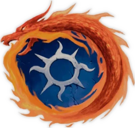

<!-- A0549-B0006 图片 -->

<!-- A0549-B0007 -->
**英文原文**

Legion Number:XV

<!-- /A0549-B0007 -->

<!-- A0549-B0008 -->

原译文

军团变化：XV

**校订译文**

军团编号：XV

**校注：** 原“军团变化”为错字，修编号。

<!-- /A0549-B0008 -->

<!-- A0549-B0009 -->
**英文原文**

Primarch:Magnus

<!-- /A0549-B0009 -->

<!-- A0549-B0010 -->

原译文

原体：马格努斯

**校订译文**

原体：马格努斯

<!-- /A0549-B0010 -->

<!-- A0549-B0011 -->
**英文原文**

Homeworld:Prospero

<!-- /A0549-B0011 -->

<!-- A0549-B0012 -->

原译文

家园世界：普罗斯佩罗

**校订译文**

家园世界：普罗斯佩罗

<!-- /A0549-B0012 -->

<!-- A0549-B0013 -->
**英文原文**

Current Base:Sortiarius

<!-- /A0549-B0013 -->

<!-- A0549-B0014 -->

原译文

当前基地：索提尔瑞斯

**校订译文**

当前基地：索提尔瑞斯

<!-- /A0549-B0014 -->

<!-- A0549-B0015 -->
**英文原文**

Chaos Affiliation:Tzeentch

<!-- /A0549-B0015 -->

<!-- A0549-B0016 -->

原译文

混沌隶属：奸奇

**校订译文**

混沌隶属：奸奇

<!-- /A0549-B0016 -->

<!-- A0549-B0017 -->
**英文原文**

Colours:Blue, yellow/gold

<!-- /A0549-B0017 -->

<!-- A0549-B0018 -->

原译文

颜色：蓝色，黄色/金色

**校订译文**

颜色：蓝色，黄色/金色

<!-- /A0549-B0018 -->

<!-- A0549-B0019 -->
**英文原文**

Specialty:Psychic Warfare, Sorcerers

<!-- /A0549-B0019 -->

<!-- A0549-B0020 -->

原译文

专业：灵能战，巫师

**校订译文**

专长：灵能战、巫师作战。

<!-- /A0549-B0020 -->

<!-- A0549-B0021 -->
**英文原文**

Battle Cry"All is dust!"

<!-- /A0549-B0021 -->

<!-- A0549-B0022 -->

原译文

战吼：“皆为尘土！”

**校订译文**

战吼：“皆为尘土！”

<!-- /A0549-B0022 -->

<!-- A0549-B0023 -->
**英文原文**

Known Warbands:

<!-- /A0549-B0023 -->

<!-- A0549-B0024 -->

原译文

著名战帮：

**校订译文**

著名战帮：

<!-- /A0549-B0024 -->

<!-- A0549-B0025 -->
**英文原文**

Ahriman's Razor, Apophitar's Ghosts

<!-- /A0549-B0025 -->

<!-- A0549-B0026 -->

原译文

阿里曼的剃刀，阿波菲斯塔的幽灵

**校订译文**

阿里曼的剃刀，阿波菲斯塔的幽灵

<!-- /A0549-B0026 -->

<!-- A0549-B0027 -->
**英文原文**

Blades Of Magnus, Blades Sinister, Brotherhood of Dust — the warband of Amon, Brothers of Retaliation — the warband of Laudren Thalarn

<!-- /A0549-B0027 -->

<!-- A0549-B0028 -->

原译文

马格努斯之刃，险恶之刃，尘埃兄弟会 — 阿蒙的战帮，复仇兄弟——劳德伦·塔拉恩的战帮

**校订译文**

马格努斯之刃，险恶之刃，尘埃兄弟会 — 阿蒙的战帮，复仇兄弟——劳德伦·塔拉恩的战帮

<!-- /A0549-B0028 -->

<!-- A0549-B0029 -->
**英文原文**

Coils Infernum, Coven of Tolbek Shen, Crimson Sons, Crystal Harbingers

<!-- /A0549-B0029 -->

<!-- A0549-B0030 -->

原译文

炼狱缠绕，托尔贝克·沈的集会，深红之子，水晶先驱

**校订译文**

炼狱缠绕，托尔贝克·沈的集会，深红之子，水晶先驱

<!-- /A0549-B0030 -->

<!-- A0549-B0031 -->
**英文原文**

Followers of Amarhotep, Fractal Blades

<!-- /A0549-B0031 -->

<!-- A0549-B0032 -->

原译文

阿玛霍特普的追随者，分型之刃

**校订译文**

阿玛霍特普的追随者、分形之刃。

**校注：** Fractal数学概念为分形，非分型。

<!-- /A0549-B0032 -->

<!-- A0549-B0033 -->

原译文

Grand Order of Hermetic Blades 奥秘之刃大密会

**校订译文**

Grand Order of Hermetic Blades 奥秘之刃大密会

<!-- /A0549-B0033 -->

<!-- A0549-B0034 -->

原译文

Illogisticarae 无逻辑者

**校订译文**

Illogisticarae 无逻辑者

<!-- /A0549-B0034 -->

<!-- A0549-B0035 -->
**英文原文**

Keepers of As'trakh, Kha'Sherhan — the warband of Iskandar Khayon, Kindled Spirits

<!-- /A0549-B0035 -->

<!-- A0549-B0036 -->

原译文

阿斯特拉赫的守护者，卡哈’谢罕 — 伊斯坎达尔·卡扬的战帮，点燃精神

**校订译文**

阿斯特拉赫的守护者、卡哈’谢罕——伊斯坎达尔·卡扬的战帮、燃魂者。

**校注：** Kindled Spirits是群体称号，不是点燃精神这一动作；暂作燃魂者。

<!-- /A0549-B0036 -->

<!-- A0549-B0037 -->

原译文

Lorehost of Apoketh 阿波凯斯传说承载者

**校订译文**

Lorehost of Apoketh 阿波凯斯秘学大军

<!-- /A0549-B0037 -->

<!-- A0549-B0038 -->
**英文原文**

Masters of Magnus' Will, Masters of the Crystal Serpent, Mind Eaters

<!-- /A0549-B0038 -->

<!-- A0549-B0039 -->

原译文

马格努斯意志之主、水晶毒蛇之主、思维吞噬者

**校订译文**

马格努斯意志之主、水晶毒蛇之主、思维吞噬者

<!-- /A0549-B0039 -->

<!-- A0549-B0040 -->
**英文原文**

Phosis' Sckolasticar Infernum, Prism of Fate, Prismatic Ninefold, Prodigal Sons — the warband of Ahriman

<!-- /A0549-B0040 -->

<!-- A0549-B0041 -->

原译文

佛西斯的炼狱学者、命运棱镜、九重棱镜、挥霍之子 — 阿里曼的战帮

**校订译文**

佛西斯的炼狱学者、命运棱镜、九重棱镜、浪子——阿里曼的战帮。

<!-- /A0549-B0041 -->

<!-- A0549-B0042 -->

原译文

Reflected Ones 倒影之人

**校订译文**

Reflected Ones 倒影之人

<!-- /A0549-B0042 -->

<!-- A0549-B0043 -->
**英文原文**

Scions of the Great Architect, Sect of the Red Echo, Sectai Prosperine, Seth's Chosen — the warband of Seth the Gatekeeper, Silver Sons, Silvered Sons, Six-Cursed, Sons of the Cyclops

<!-- /A0549-B0043 -->

<!-- A0549-B0044 -->

原译文

大创造者之裔、鲜红回响教派、繁荣教派、赛特神选 — 守门人赛特的战帮、银色之子、镀银之子、六重诅咒、独眼巨人之子

**校订译文**

大创造者之裔、鲜红回响教派、普罗斯佩罗教派、赛特神选——守门人赛特的战帮、银色之子、镀银之子、六重诅咒、独眼巨人之子。

<!-- /A0549-B0044 -->

<!-- A0549-B0045 -->
**英文原文**

Thralls of Magnus, Tizcan Host, Triad Temporis

<!-- /A0549-B0045 -->

<!-- A0549-B0046 -->

原译文

马格努斯之奴，提兹卡天军，三元时间

**校订译文**

马格努斯之奴，提兹卡天军，三元时间

<!-- /A0549-B0046 -->

<!-- A0549-B0047 -->
**英文原文**

Warband of Sektoth — the warband of Sektoth

<!-- /A0549-B0047 -->

<!-- A0549-B0048 -->

原译文

塞克托斯战帮 — 塞克托斯的战帮

**校订译文**

塞克托斯战帮 — 塞克托斯的战帮

<!-- /A0549-B0048 -->

<!-- A0549-B0049 -->

原译文

Warp Gheists 亚空间旅客

**校订译文**

Warp Gheists 亚空间幽魂

<!-- /A0549-B0049 -->

<!-- A0549-B0050 -->

原译文

Xenash Capensis' Rubric Phalanx 克萨纳什·卡彭西斯的红字方阵

**校订译文**

Xenash Capensis' Rubric Phalanx 克萨纳什·卡彭西斯的红字方阵

<!-- /A0549-B0050 -->

<!-- A0549-B0051 -->
## Homeworld 家园世界

<!-- /A0549-B0051 -->

<!-- A0549-B0052 -->
**英文原文**

The homeworld of the Thousand Sons was Prospero, a world populated by a small commune of outcast psykers. Once a world of great beauty, it was attacked by Imperial forces utilising planet-busting weapons during the Battle of Prospero, with the result that it became a blasted ruin, declared Purgatus by the Inquisition. Prospero would ultimately suffer the indignity of Imperial planetary bombardment a second time, ordered by the Inquisition in response to a large-scale gathering of Thousand Sons forces upon the planet as part of a sorcerous ritual. While the first bombardment (the one that took place during the first Battle of Prospero) ruined the planet's eco-system and tumbled all the works of both man and nature, it still left Prospero more-or-less recognisable. The second scoured the world with firestorms so intense that the surface of Prospero was turned into featureless black glass.

<!-- /A0549-B0052 -->

<!-- A0549-B0053 -->

原译文

千子的家园世界是普罗斯佩罗，一个由被排斥的灵能者组成的公社。曾经是一个美丽的世界，在普罗斯佩罗之战中，帝国军队使用破坏行星的武器袭击了它，结果它变成了一片废墟，审判庭宣布净化。普罗斯佩罗最终遭受帝国第二次行星轰炸的侮辱，这是审判庭为回应作为巫术仪式一部分的千子部队在行星上的大规模集会而下令的。虽然第一次轰炸（发生在第一次普罗斯佩罗之战期间）破坏了行星的生态系统，并摧毁了人类和自然的所有造物，但它仍然或多或少地让普罗斯佩罗变得知名。第二场大火席卷了世界，猛烈到普罗斯佩罗的表面变成了毫无特色的黑色玻璃。

**校订译文**

千子的母星普罗斯佩罗，原居住着一小群遭放逐的灵能者社群。这个曾经美丽的世界，在普罗斯佩罗之战中遭帝国毁星武器轰击，化为焦土，并被审判庭宣布为净化对象。后来，千子在当地大规模集结，施行巫术仪式，审判庭又下令第二次轰炸。首次袭击摧毁了生态系统和人类、自然的一切造物，行星却还大致能辨认出原貌。第二次轰炸掀起的火风暴更为猛烈，将整个地表熔成毫无地貌起伏的黑色玻璃。

**校注：** recognisable指尚能辨认原貌，原译变得知名错误；Purgatus的审判庭具体分类含义待源版本核，暂沿净化语义，不扩写成当时已完全毁灭。

<!-- /A0549-B0053 -->

<!-- A0549-B0054 -->
## History 历史

<!-- /A0549-B0054 -->

<!-- A0549-B0055 -->
### The Great Crusade 大远征

<!-- /A0549-B0055 -->

<!-- A0549-B0056 -->
### Formation 形成

<!-- /A0549-B0056 -->

<!-- A0549-B0057 -->
**英文原文**

The Fifteenth Legion was formed on Terra, their gene-seed being created and implanted in the first legionaries during a brief resurgence of warp-storms within the boundaries of the Sol system itself. This brief warp-storm was said to have generated psychic flashpoints all across Terra's globe, resulting in outbreaks of madness, suicide and random violence. Whether it had any effect on the legion's gene-seed is doubtful, but upon learning of it years later Magnus himself considered it to be a poor omen.

<!-- /A0549-B0057 -->

<!-- A0549-B0058 -->

原译文

第十五军团在泰拉上成立，他们的基因种子在太阳星系本身边界内亚空间短暂复苏期间被创造并加入第一批军团。据说这场短暂的亚空间风暴在泰拉的全球范围内引发了灵能爆发点，导致疯狂、自杀和随机暴力的爆发。它是否对军团的基因种子有任何影响是值得怀疑的，但几年后，马格努斯本人得知此事后认为这是一个不祥的预兆。

**校订译文**

第十五军团组建于泰拉。其基因种子被制造、植入首批战士时，太阳系内部恰逢亚空间风暴短暂复起。据说，这场风暴在泰拉各地触发灵能爆发，造成疯狂、自杀与无端暴力。它究竟是否影响了基因种子，尚有疑问；多年后，马格努斯获知此事，却将其视为不祥预兆。

<!-- /A0549-B0058 -->

<!-- A0549-B0059 图片 -->
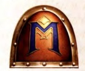

<!-- A0549-B0060 -->

原译文

Symbol of the XV Legion pre-Magnus 马格努斯前第15军团标志

**校订译文**

Symbol of the XV Legion pre-Magnus 马格努斯前第15军团标志

<!-- /A0549-B0060 -->

<!-- A0549-B0061 -->
**英文原文**

At least part of the initial crop of legionaries—termed student-aspirants—were found amongst the population of the once geo-political entity known as the Achaemenid Empire. This area of Terra had been under the rule of the Emperor for at least a century at this point, and as a result had suffered little during the just-completed Wars of Unification. The Emperor himself, accompanied by a retinue of scientists, visited the region and had each and every family tested for compatibility with the Legion XV gene-seed. Those that were found suitable were taken to the gene-laboratories underneath the Himalayas to begin their transformation into Astartes. Present as one of these first student-aspirants was Ahzek Ahriman and his twin brother, Ohrmuzd. Upon completion of this process the Fifteenth Legion was used to quell what few pockets of isolated resistance to the Emperor's rule remained upon Terra, before being named the Thousand Sons by the Emperor himself and sent out into the galaxy as part of his Great Crusade. Their name is believed to originate from the first step of the Legion's creation process; for unknown (but presumably notable, if the Legion was named because of them) reasons, exactly one thousand Marines were created and trained first, with the Fifteenth brought up to full Legion numbers afterwards. There only being one thousand Thousand Sons in existence at a point in time is a fact that, tragically, would repeat itself in the future on more than one occasion...

<!-- /A0549-B0061 -->

<!-- A0549-B0062 -->

原译文

最初的军团中至少有一部分人 — 被称为学者有志者 — 是在曾经被称为阿契美尼德帝国的地缘政治实体的人口中发现的。此时，泰拉的这一地区已经在帝皇的统治下至少一个世纪了，因此在刚刚结束的统一战争中几乎没有受到什么影响。帝皇本人在一批科学家的陪同下访问了该地区，并对每个家庭进行了与第十五军团基因种子的兼容性测试。那些被发现合适的被带到喜马拉雅山下的基因实验室，开始转化为阿斯塔特。阿扎克·阿里曼和他的双胞胎兄弟奥尔穆兹德是首批成为学者有志者的人之一。在完成这一过程后，第十五军团被用来平息泰拉上仅存的少数对帝皇统治的孤立抵抗，然后被帝皇命名为千子军团，并作为其大远征的一部分被派往银河系。他们的名字被认为源于军团创建过程的第一步；由于未知的（但可能值得注意的是，如果军团是因为他们而命名的）原因，首先创建和训练了1000名星际战士，之后将第15军团星际战士提升到完整的军团人数。在一个时间点上，只有一千个千子存在，这是一个事实，可悲的是，它将在未来不止一次地重演...

**校订译文**

首批战士被称为学徒候选者，其中至少一部分来自泰拉上曾称阿契美尼德帝国的地区。当地此时已归帝皇统治逾百年，因而在刚结束的统一战争中少受损害。帝皇亲率科学家来到此地，逐户检测是否适配第十五军团基因种子。合格者被带往喜马拉雅山下的基因实验室，接受阿斯塔特改造。阿扎克·阿里曼及其孪生兄弟奥尔穆兹德，便在第一批候选者之中。改造完成后，第十五军团先平定泰拉残存的少数反抗据点，再由帝皇赐名千子，投入大远征。这个名字据认为源自军团创建之初：最先改造并训练的战士，恰好只有一千人，之后才扩至完整军团规模。为何如此安排，原因不详；若军团确实因此得名，想必自有其特殊意义。悲剧在于，全军团仅存一千人的境况，后来还会不止一次重演。

**校注：** student-aspirants是学徒候选者，不是学者有志者。

<!-- /A0549-B0062 -->

<!-- A0549-B0063 图片 -->
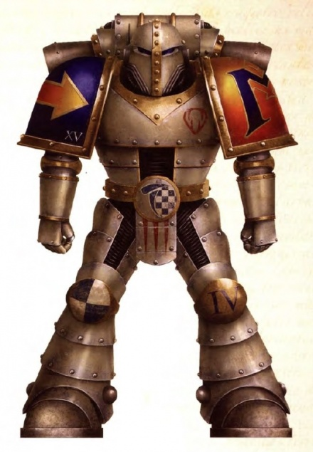

<!-- A0549-B0064 -->

原译文

Thousand Son before the coming of Magnus 马格努斯归来前的千子

**校订译文**

Thousand Son before the coming of Magnus 马格努斯归来前的千子

<!-- /A0549-B0064 -->

<!-- A0549-B0065 -->
### Combat Disposition and Record 作战部署和记录

<!-- /A0549-B0065 -->

<!-- A0549-B0066 -->
### Early Crusade 远征早期

<!-- /A0549-B0066 -->

<!-- A0549-B0067 -->
**英文原文**

At the beginning of the Crusade, they fought as tenacious and energetic expanders of the Imperium, and were not considered particularly distinct from the main body of the Legiones Astartes. Five years into the Crusade however, the warriors of the legion—much to their delight—all began to spontaneously develop psychic abilities. This development however, was followed by a wave of horrific, unwilling degenerative mutations. This mutative process became referred to as the flesh-change, and was much feared by the Thousand Sons after it first appeared during the Compliance of Bezant. Most of those afflicted were secured in stasis chambers in the hope that some future cure would be found for them, and the numbers of active Thousand Sons began to dwindle as a result.

<!-- /A0549-B0067 -->

<!-- A0549-B0068 -->

原译文

大远征开始时，他们作为帝国顽强而充满活力的扩张者作战，被认为与阿斯塔特军团的主体没有特别的区别。然而，远征五年后，军团的战士们 — 让他们非常高兴 — 都开始自发地发展出灵能能力。然而，这一发展之后是一波可怕的、不情愿的退行性突变。这种变异过程被称为血肉转变，在贝赞特征服期间首次出现后，千子非常害怕。大多数受影响的人都被关在停滞舱里，希望未来能找到治愈他们的方法，因此活跃的千子的数量开始减少。

**校订译文**

大远征初期，千子顽强而积极地为帝国开拓疆域，与其他阿斯塔特军团没有明显区别。五年后，全军团战士都开始自发觉醒灵能，令他们欣喜不已；随之而来的，却是一波无法自控的骇人退化突变。它首次现身于贝赞特征服行动，被称为血肉异变，从此让千子深感恐惧。多数患者被封入静滞舱，等待未来或许出现的疗法，能继续服役的人数因而不断减少。

**校注：** flesh-change统一暂作血肉异变，原血肉转变；stasis静滞不是停滞。

<!-- /A0549-B0068 -->

<!-- A0549-B0069 图片 -->
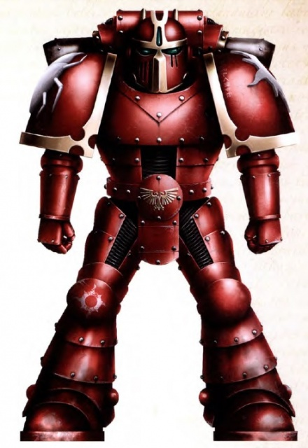

<!-- A0549-B0070 -->

原译文

Great Crusade era Thousand Sons Astartes 大远征时期千子阿斯塔特

**校订译文**

Great Crusade era Thousand Sons Astartes 大远征时期千子阿斯塔特

<!-- /A0549-B0070 -->

<!-- A0549-B0071 -->
**英文原文**

Over the next several decades some of the then-discovered primarchs found the notion of psychic mutants being allowed to exist as part of the Emperor's Crusade distasteful at best and downright impossible at worst and began to variously move for their censure or spread rumours and condemnations about them. Chief amongst these detractors were Mortarion, Rogal Dorn and Corax. As the years passed, more and more of the Thousand Sons devolved into mutantcy, while those that survived grew stronger and stronger in the use of their powers. Meanwhile, the detractors had managed to raise enough voices to empower a proposal that the Fifteenth Legion be disbanded and expunged from Imperial records altogether.

<!-- /A0549-B0071 -->

<!-- A0549-B0072 -->

原译文

在接下来的几十年里，一些当时被发现的原体发现，允许灵能变种人作为帝皇远征的一部分存在的想法往好了说是令人厌恶的，往坏了说是完全不可能的，他们开始采取各种行动来谴责他们，或者散布关于他们的谣言和谴责。这些批评者中最主要的是莫塔里安、罗格·多恩和科拉克斯。随着岁月的流逝，千子中越来越多的人变得反复无常，而那些幸存下来的人在使用他们的力量时变得越来越强大。与此同时，批评者设法提高了足够的声音，提出了一项建议，即解散第十五军团并将其从帝国记录中完全删除。

**校订译文**

接下来数十年，一些已被寻回的原体反感帝皇远征军中竟容纳灵能变种者，有的甚至认为绝不可容忍。他们推动惩处，或传播谣言、公开谴责，其中以莫塔里安、罗格·多恩与科拉克斯为首。越来越多千子退化为变种体，幸存者的灵能却日趋强大。反对者也聚拢足够声势，提出解散第十五军团、从帝国档案中彻底抹去其存在的建议。

**校注：** mutantcy为突变状态，原译反复无常改变概念。

<!-- /A0549-B0072 -->

<!-- A0549-B0073 -->
**英文原文**

It was shortly after this that the Great Crusade arrived at Prospero and found Magnus, primarch of the Thousand Sons. The entire legion was transported to Prospero to meet their gene-sire, and there was much rejoicing even though the flesh-change had become a pandemic within their ranks. After the initial celebrations the Emperor and the main body of his fleet left Prospero, but the Thousand Sons remained behind, the numbers of them degenerating into mutantcy seeming to go completely out of control within a day of the Emperor's departure. Soon, the entire legion was afflicted. It was at this time that Magnus stepped in to save his gene-sons, enacting a mysterious procedure that was able to stabilise the genetic structure of the least-affected legionaries. The procedure turned out to involve agreeing to an open ended bargain with a Warp creature called Choronzon, the Dweller in the Abyss and the Daemon of Dispersion. At the end of the procedure, barely a thousand of the Thousand Sons lived.

<!-- /A0549-B0073 -->

<!-- A0549-B0074 -->

原译文

不久之后，大远征抵达普罗斯佩罗，找到了千子原体马格努斯。整个军团都被运送到普罗斯佩罗去见他们的基因之主，尽管血肉转变在他们的队伍中已经成为一种流行病，但他们还是非常高兴。在最初的庆祝活动之后，帝皇和他的舰队主体离开了普罗斯佩，但千子留下来了，他们的数量在帝皇离开后的一天内似乎完全失控了。很快，整个军团都受到了折磨。正是在这个时候，马格努斯介入拯救他的基因之子，制定了一项神秘的手术，能够稳定受影响最小的军团士兵的遗传结构。该手术最终涉及与一种名为克罗佐的亚空间生物、深渊中的居民和分散恶魔达成开放式交易。手术结束时，千子中只有一千人活着。

**校订译文**

不久，大远征抵达普罗斯佩罗，发现千子原体马格努斯。全军团前来与基因之父重逢，即使血肉异变已广泛蔓延，仍欢欣鼓舞。庆典后，帝皇与主舰队离去，千子留下。仅一天内，突变便似乎完全失控，很快波及全军。马格努斯此时介入，施行神秘手段，稳定病情最轻者的基因结构。后来得知，这涉及与亚空间存在克罗佐订立一项代价未定的契约；祂又称深渊居者、离散恶魔。过程结束时，千子仅约一千人存活。

**校注：** 帝皇离去后失控的是突变人数与过程，不是全军团人数；Choronzon及两个称号指同一个存在，不是三种生物。open-ended bargain强调代价未定，而非现代开放式交易。

<!-- /A0549-B0074 -->

<!-- A0549-B0075 -->
### Prosperine 普罗斯佩罗人

<!-- /A0549-B0075 -->

<!-- A0549-B0076 -->
**英文原文**

With this stabilisation of the gene-seed, the Fifteenth Legion got its second chance. Recruiting from Prospero, they were able to rebuild their numbers – though would never become numerous – and return to the Great Crusade, this time led by their primarch.

<!-- /A0549-B0076 -->

<!-- A0549-B0077 -->

原译文

随着基因种子的稳定，第十五军团获得了第二次机会。从普罗斯佩罗招募，他们能够重建自己的人数 — 尽管永远不会变得很多 — 并回到大远征，这次是由他们的原体领导的。

**校订译文**

基因种子稳定后，第十五军团获得了重来的机会。他们从普罗斯佩罗征募新兵，逐渐恢复人数，虽仍算不上兵力庞大，却已能重返大远征，这一次由原体亲自率领。

<!-- /A0549-B0077 -->

<!-- A0549-B0078 图片 -->
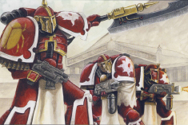

<!-- A0549-B0079 -->

原译文

The Thousand Sons on crusade 远征中的千子

**校订译文**

The Thousand Sons on crusade 远征中的千子

<!-- /A0549-B0079 -->

<!-- A0549-B0080 -->
**英文原文**

While little is known about how the Thousand Sons were organised before the coming of Magnus, it is recorded that they were not considered particularly different from a typical Legiones Astartes apart from their psychic abilities (which resulted in the legion possessing the most powerful Librarians of the era). When Magnus took command, his directions (influenced by his development on Prospero, as well as Prosperine culture itself) would cause some organisational and hierarchical changes within the legion. Chapters were referred to as Fellowships within the Thousand Sons, of which there were a maximum of 10. However, at the conclusion of one particularly bloody campaign, the Thousand Sons had lost almost 900 Astartes, effectively wiping out an entire Fellowship. Rather than rebuild it, Magnus decided to reorganise and maintain the legion as one of 9 Fellowships, an organisation he referred to as the Pesedjet. Two special units were created within the legion; the elite Scarab Occult Terminators and the Hidden Ones of the Scout Auxillia. The legion's command structure was adapted to include Prosperine philosphy in the form of the Rehati (the coven of Magnus), a second command-track in which the legion's senior officers were ranked according to psychic ability and influence.

<!-- /A0549-B0080 -->

<!-- A0549-B0081 -->

原译文

虽然人们对马格努斯到来之前千子军团是如何组织的知之甚少，但据记录，除了他们的灵能能力（这导致该军团拥有当时最强大的智库）外，他们被认为与典型的阿斯塔特军团没有特别不同。当马格努斯掌权时，他的指示（受他在普罗斯佩罗的发展以及普罗斯佩罗文化本身的影响）将导致军团内部的一些组织和等级变化。战团被称为千子学会，最多有10个。然而，在一场特别血腥的战役结束时，千子失去了近900名阿斯塔特，有效地消灭了整个学会。马格努斯没有重建它，而是决定重组并维持该军团，作为他称之为九柱神的9个学会组织之一。军团内成立了两个特种部队；精英圣甲虫密会终结者和侦察辅助军的隐藏者。军团的指挥结构进行了调整，以静修者（马格努斯集会）的形式纳入了普罗斯佩罗哲学，这是第二条指挥轨道，军团的高级军官根据灵能能力和影响力进行排名。

**校订译文**

马格努斯归来前的组织状况，记录不多；已知除灵能突出、拥有当时最强大的智库员外，千子与标准阿斯塔特军团并无显著不同。他接掌后，受普罗斯佩罗成长经历及当地文化影响，改变了军团的组织与等级体系。千子将战团称为学会，最多曾有十个。一场极其惨烈的战役令近九百名战士丧生，几乎抹去整个学会。马格努斯没有重建它，而是将军团固定为九大学会的架构，称为九柱神。军团另设两支特殊力量：精锐圣甲虫终结者，以及侦察辅助军的隐者。同时，指挥体系增设体现普罗斯佩罗哲学的静修者议会，即马格努斯的集会；这是一条并行的权力序列，高级军官在其中依灵能实力与影响力排列。

**校注：** 九大学会合为军团架构，原译误成军团是九个学会之一。Hidden Ones沿58隐者；圣甲虫终结者采用GW09第36/GW10第35页官译。

<!-- /A0549-B0081 -->

<!-- A0549-B0082 -->
**英文原文**

The resurgent Thousand Sons brought their fair share of worlds into compliance with the Imperium of Man, and as such their main method of victory (diplomatic guile and trickery) was not questioned by the body Imperial. However, as the Crusade entered wilder regions of space, more and more hostile forces were encountered that deployed powers similar to those that the psychic warriors of the Thousand Sons wielded. This event, along with the ever-present rumours of 'witchcraft' and 'sorcery' surrounding the legion, resulted in Mortarion once more raising his voice in condemnation of the Thousand Sons. This time he was joined by Leman Russ, whose long-held distrust of the legion came to a head after he witnessed the return of the flesh-change in the Thousand Sons during a joint action on the world of Shrike. It was decided that Magnus and his legion would be called to account, and the whole matter of Astartes employing psychic powers at all would be ruled upon. This event was known as the Council of Nikea, and at it – after much deliberation – the Emperor announced that no Astartes must ever again employ the use of psychic powers, upon pain of destruction visited upon them by the Emperor himself.

<!-- /A0549-B0082 -->

<!-- A0549-B0083 -->

原译文

复兴的千子使他们在世界上的合理份额符合人类帝国的要求，因此他们的主要胜利方法（外交诡计和欺骗）没有受到帝国的质疑。然而，随着大远征进入更荒凉的空域，遇到了越来越多的敌对势力，他们部署了类似于千子灵能战士所使用的力量。这一事件，再加上围绕军团的“巫师造物”和“巫术”的谣言，导致莫塔里安再次提高了对千子的谴责。这一次，黎曼·鲁斯加入了他的行列，他长期以来对军团的不信任在目睹了千子军团在对伯劳世界的联合行动中血肉转变的回归后达到了顶峰。已经决定，马格努斯和他的军团将被追究责任，阿斯塔特使用灵能力量的整个事情将被裁决。这一事件被称为尼凯亚会议，经过深思熟虑，帝皇在会上宣布，任何阿斯塔特都不得再次使用灵能力量，否则将遭受帝皇亲自带来的毁灭之痛。

**校订译文**

重振后的千子为帝国征服了不少世界，因此其主要取胜手段——外交权谋与欺骗——未受帝国质疑。但随着远征进入更荒蛮的疆域，越来越多敌军使用类似千子的力量。再加上军团始终背负巫术流言，莫塔里安重新发难。这次，黎曼·鲁斯也加入反对者：他原就不信任千子，在伯劳世界共同作战时，又亲眼见到血肉异变复发，终于不再容忍。帝国决定召见马格努斯及其军团，追究责任，并裁定阿斯塔特究竟能否使用灵能。尼凯亚会议由此召开。经过长时间审议，帝皇宣布，任何阿斯塔特都不得再动用灵能，违者将由他亲自毁灭。

**校注：** their fair share of worlds为征服了不少世界，不是世界的合理份额。

<!-- /A0549-B0083 -->

<!-- A0549-B0084 -->
**英文原文**

Stunned, the Thousand Sons effectively withdrew from the Crusade, returning to Prospero. It was during the period that followed that Magnus discerned the approach of the Horus Heresy and employed both his own powers and that of his senior legionaries to try to save his brother's soul. Failing, he once again marshalled the powers available to him and attempted to psychically warn the Emperor of his favourite son's betrayal. News of this sanction fleet, meanwhile, had previously reached the ears of the now-corrupted Horus himself. Sensing an opportunity, the Warmaster contacted Leman Russ, commander of the fleet, during the trip to Prospero. Speaking with his brother, he was able to convince him that "to return Magnus to Terra would be a waste of time and effort". Horus confirmed to his traitorous council of war that he believed this interjection of his into the Emperor's own decree would result in Magnus never leaving Prospero alive. This action, which went so catastrophically wrong, would doom the Thousand Sons as, in accord with the Judgement of Nikea, the Emperor visited destruction upon Magnus and the Thousand Sons in the form of Leman Russ and his Space Wolves.

<!-- /A0549-B0084 -->

<!-- A0549-B0085 -->

原译文

震惊之下，千子实际上退出了大远征，回到了普罗斯佩罗。在接下来的时期里，马格努斯察觉到荷鲁斯叛乱的逼近，并利用自己和高级军团士兵的力量试图拯救他兄弟的灵魂。失败后，他再次调动了可用的力量，并试图在灵能上警告帝皇他最喜欢的儿子的背叛。与此同时，这个制裁舰队的消息此前已经传到了现在腐化的荷鲁斯本人的耳朵里。在前往普罗斯佩罗的途中，战帅感觉到了一个机会，于是联系了舰队指挥官黎曼·鲁斯。通过与他的兄弟交谈，他能够说服他“将马格努斯带回泰拉将是浪费时间和精力”。荷鲁斯向他的叛徒战争议会证实，他相信将他插入帝皇自己的法令将导致马格努斯永远不会活着离开普罗斯佩罗。这一行动大错特错，将毁灭千子，因为根据尼凯亚的判决，帝皇以黎曼·鲁斯和他的太空野狼的形式毁灭了马格努斯和千子。

**校订译文**

千子震惊之余，实际上退出了大远征，返回普罗斯佩罗。此后，马格努斯察觉荷鲁斯之乱将至，集结自己与高级战士的力量，试图挽救兄弟的灵魂。失败后，他再次动用灵能，向帝皇警告最受宠之子的背叛。帝国随后派出惩戒舰队，其消息也传到已经堕落的荷鲁斯耳中。舰队前往普罗斯佩罗途中，荷鲁斯联系指挥官黎曼·鲁斯，劝他相信：“把马格努斯带回泰拉，只会徒费时间与精力。”他向叛军战争议会表示，相信自己对帝皇命令的这番干预，会令马格努斯无法活着离开普罗斯佩罗。马格努斯试图警告帝皇的行动最终酿成灾难：按尼凯亚判决而来的鲁斯与太空野狼，将毁灭带给千子。

**校注：** 英文提前引入this sanction fleet而未在此交代出征，且This action指代紊乱；中文按段内警告、惩戒命令、荷鲁斯干预三层关系疏通，未擅增网道等源文未提事件。

<!-- /A0549-B0085 -->

<!-- A0549-B0086 -->
**英文原文**

Magnus had realised his grave mistake in warning the Emperor in the method he chose, and had also been confronted with the stark reality that he was not as in control of the warp or his powers as he thought. Additionally, a power of the warp had spoken to him, revealing to him that Magnus had been its pawn since the time it had helped him save his legion from the flesh-change...and perhaps even long before that. Distraught, Magnus resolved to accept whatever punishment the Emperor saw fit. Thus, to prevent his legion from defending Prospero he dispersed the Thousand Sons fleet from orbit, shut down the orbital defences and wrapped his homeworld in a 'psychic cocoon' which prevented anyone from communicating or using their powers beyond its boundaries. Thus the Space Wolves managed to attack Prospero completely by surprise. The Thousand Sons legionaires themselves, however, did not share Magnus' acceptance of defeat and punishment, and so took up arms against the invaders. The Thousand Sons managed to hold Tizca (the only surviving city on the planet) for a period of time before they were eventually pushed back, the assault of the Space Wolves led by their primarch, as well as forces from the Sisters of Silence and the Adeptus Custodes proving too much. Magnus eventually joined the battle when it appeared that the final moment of extermination for his legion had arrived. Leman Russ engaged Magnus in a devastating duel in which the Russ was ultimately victorious. In response Magnus finally, consciously gave in to the daemonic voice that had been tempting him and invoked ancient sorceries in order to escape Prospero with the remnants of his legion. In the Eye of Terror, a Daemon World had been prepared for them by their new patron.

<!-- /A0549-B0086 -->

<!-- A0549-B0087 -->

原译文

马格努斯已经意识到，他以自己选择的方法警告帝皇是一个严重的错误，他也面临着一个残酷的现实，即他并没有像他想象的那样控制亚空间或他的力量。此外，亚空间的力量对他说话，向他透露，自从它帮助他从血肉转变中拯救了他的军团以来，马格努斯一直是亚空间的棋子.…甚至可能早在那之前。马格努斯心烦意乱，决定接受帝皇认为合适的任何惩罚。因此，为了防止他的军团保卫普罗斯佩罗，他将千子舰队从轨道上驱散，关闭了轨道防御，并将他的家园世界包裹在一个“灵能防护层”中，阻止任何人在其边界之外交流或使用他们的力量。因此，太空野狼出人意料地袭击了普罗斯佩罗。然而，千子军团本身并没有像马格努斯那样接受失败和惩罚，因此拿起武器对抗侵略者。千子成功地控制了提兹卡（行星上唯一幸存的城市）一段时间，然后他们最终被击退，由他们的原体领导的太空野狼的攻击，以及寂静修女和禁军的力量证明了太多。马格努斯最终加入了战斗，因为他的军团似乎已经到了灭绝的最后时刻。黎曼·鲁斯与马格努斯展开了一场毁灭性的决斗，鲁斯最终获胜。作为回应，马格努斯终于有意识地屈服于一直在诱惑他的恶魔般的声音，并施展了古代巫术，以便带着他的军团残余逃离普罗斯佩罗。在恐惧之眼，他们的新赞助人为他们准备了一个恶魔世界。

**校订译文**

马格努斯已意识到，以自己选择的方式警告帝皇，犯下了严重错误；他也终于直面事实：自己远未像想象中那样掌握亚空间与灵能。一股亚空间力量更向他揭示，自协助他抑制血肉异变之时，甚至更早以前，他就一直是它的棋子。悲痛绝望的马格努斯决定接受帝皇任何惩罚。为阻止军团抵抗，他遣散轨道舰队、关闭防御，并用灵能茧包裹母星，隔绝对外通信和灵能感知。太空野狼因而得以完全出其不意地袭击普罗斯佩罗。但千子战士不愿像原体那样坐待惩罚，拿起武器抵抗。他们坚守行星唯一幸存城市提兹卡一段时间，最终仍敌不过鲁斯亲率的太空野狼，以及寂静修女和禁军的联合进攻。眼见军团将被彻底消灭，马格努斯终于参战，与鲁斯展开惨烈决斗，却落败。他这才清醒而主动地屈从于一直诱惑自己的恶魔低语，施展古老巫术，带残军逃离普罗斯佩罗。新的庇护神，已在恐惧之眼为他们备好一颗恶魔世界。

<!-- /A0549-B0087 -->

<!-- A0549-B0088 图片 -->
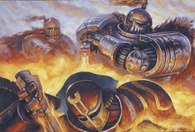

<!-- A0549-B0089 -->

原译文

The Burning of Prospero 普罗斯佩罗之焚

**校订译文**

The Burning of Prospero 普罗斯佩罗之焚

<!-- /A0549-B0089 -->

<!-- A0549-B0090 -->
### The Horus Heresy 荷鲁斯之乱

原题：The Horus Heresy 荷鲁斯叛乱

<!-- /A0549-B0090 -->

<!-- A0549-B0091 -->
**英文原文**

Having been thus deliberately removed from the board by the machinations of Chaos, the Thousand Sons played no part in the birth of the Horus Heresy. In fact, exactly when and why they chose to ally themselves with Horus and his traitorous rebellion is not clear, although it is believed that their chief motivation was to gain sanctuary and protection from further Imperial attack. Of course, considering how Tzeentch had orchestrated events so far, it is likely that they had little choice in the matter at all.

<!-- /A0549-B0091 -->

<!-- A0549-B0092 -->

原译文

由于被混沌的阴谋故意从舞台上除名，千子在荷鲁斯叛乱的诞生中没有发挥任何作用。事实上，他们选择与荷鲁斯及其叛徒叛乱结盟的确切时间和原因尚不清楚，尽管据信他们的主要动机是获得庇护和保护，免受帝国的进一步攻击。当然，考虑到奸奇迄今为止是如何策划事件的，他们在这件事上很可能别无选择。

**校订译文**

混沌以阴谋将千子提前逐出棋局，使其没有参与荷鲁斯之乱的最初爆发。他们究竟何时、为何正式选择与荷鲁斯结盟，记载并不明确。据信主要动机，是寻求庇护，免遭帝国继续追击。不过，考虑到奸奇此前对局势的操纵，他们或许根本没有多少选择。

<!-- /A0549-B0092 -->

<!-- A0549-B0093 图片 -->
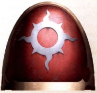

<!-- A0549-B0094 -->

原译文

Thousand Sons symbol during the Heresy 叛乱时期千子标志

**校订译文**

Thousand Sons symbol during the Heresy 叛乱时期千子标志

<!-- /A0549-B0094 -->

<!-- A0549-B0095 -->
**英文原文**

After their escape from Prospero, the Thousand Sons discovered that – once again – they had been reduced to only around one thousand living members. However later, they were joined by at least 3,000 lost members of the Legion that were dispatched before the Burning of Prospero. By the time of the Siege of Terra, the Legion's strength stood at 9,000. The actions of the Thousand Sons' main faction during the bulk of the Heresy remained unclear, though a portion of the Legion did engage the Space Wolves at the Battle of Yarant. Known records mention fragments of the XVth Legion active elsewhere in the galaxy during the latter years of the Horus Heresy, such as Prism, Chbal, Logan's World and Yamnan, each one an independent warband rather than a strike force of a unified Legion. Loyalties proved split in such groups, with some fighting for the Warmaster and others siding with the Emperor and frequently in the company of other orphaned forces, including Blackshields elements, despite the censure he had brought down upon them. Notable self-proclaimed loyalist factions included the Fifth Fellowship under Sul Kontep, which had escaped Prospero and would later align with the Imperial Fists, a group based on Zhao-Arkhad, Korsiron's followers, and the Thousand Sons of the 209th Expeditionary Fleet.

<!-- /A0549-B0095 -->

<!-- A0549-B0096 -->

原译文

在逃离普罗斯佩罗后，千子发现 — 再一次 — 他们已经减少到只有大约一千名活着的成员。然而，后来，他们加入了至少3000名在普罗斯佩罗被焚毁之前被派遣的失踪军团成员。到泰拉围城时，军团的兵力为9000人。千子主要派系在叛乱期间的行动仍不清楚，尽管军团的一部分确实在雅兰特之战中与太空野狼交战。已知的记录提到了在荷鲁斯叛乱后期活跃在银河系其他地方的第十五军团的碎片，如棱镜、赤巴尔、洛根世界和亚姆南，每一个都是独立的战区，而不是统一军团的打击力量。事实证明，忠诚在这些群体中是分裂的，一些人为战帅而战，另一些人则站在帝皇一边，尽管他对他们进行了谴责，但他们经常与其他独立部队，包括黑盾成员并肩作战。著名的自称忠诚派包括苏尔·孔泰普领导的第五学会，该学会逃离了普鲁斯佩罗，后来与帝国之拳结盟，是一个以赵-阿卡达、科尔西隆的追随者和第209远征舰队的千子为基础的团体。

**校订译文**

逃离普罗斯佩罗后，千子发现自己再次只剩约一千名活着的成员。后来，至少三千名早于母星焚毁前就奉命外出的失散战士归队；到泰拉围城时，军团已有九千人。叛乱大部分时期，主力行动仍不明确，仅知部分部队在雅兰特对抗太空野狼。另有记录表明，叛乱后期，第十五军团的零散力量在棱镜、赤巴尔、洛根世界与亚姆南等地活动，均以独立战帮行事，而非统一军团的突击队。这些群体效忠对象不一：有的追随战帅，有的虽受帝皇惩戒仍选择忠诚，并与黑盾等失去原属组织的部队共同作战。自称忠诚派的已知力量，包括逃离普罗斯佩罗、后与帝国之拳结盟的苏尔·孔泰普第五学会，驻赵-阿卡达的一支部队，科尔西隆的追随者，以及第209远征舰队中的千子。

**校注：** 末句为四支并列忠诚派力量，原译连成第五学会下属的一个混合团体。each one independent warband不是独立战区。

<!-- /A0549-B0096 -->

<!-- A0549-B0097 -->
**英文原文**

The Thousand Sons' main faction ultimately discovered that Magnus had broken into Shards since his near-death on Prospero, and Ahriman and his Cabal devoted much of their time to discovering the shards and restoring their Primarch. Ultimately they were able to discover nearly all of the shards, but Magnus revealed that his remaining portion dwelt on Terra.

<!-- /A0549-B0097 -->

<!-- A0549-B0098 -->

原译文

千子的主要派系最终发现，马格努斯在普罗斯佩罗险些去世后，已经碎成碎片，阿里曼和他的秘会花了大量时间发现碎片并恢复他们的原体。最终，他们能够发现几乎所有的碎片，但马格努斯透露，他剩下的部分住在泰拉上。

**校订译文**

主力部队后来发现，马格努斯在普罗斯佩罗濒死后，灵魂已碎裂成多个碎片。阿里曼与其秘会投入大量时间寻找碎片，试图重塑原体。他们最终几乎集齐所有碎片，但马格努斯透露，最后一部分仍在泰拉。

**校注：** Shards按此处原体濒死、重塑语境指灵魂碎片，不是把肉身割成几块。

<!-- /A0549-B0098 -->

<!-- A0549-B0099 -->
**英文原文**

Thus when Horus's forces fell on Terra itself some years later, Magnus and most of the Thousand Sons were with him. Noted to be a very small contingent of the Chaos forces, the Thousand Sons contented themselves with summoning daemonic reinforcements and casting supporting spells rather than engaging in pitched battle for most of the Siege of Terra. However, once the outer walls of the Imperial Palace had been breached, the Thousand Sons found themselves required to break down the final wards and fortifications of the inner palace itself. Advancing to the Ultimate Gate, part of the legion held off Imperial counter-attacks while the senior sorcerers attempted to destroy the defences with psychic power and sorcerous ritual. This assault came to naught however, as a contingent of Imperial Fists led by Rogal Dorn arrived in the combat zone and drove the Thousand Sons off at much the same time as the Emperor himself directed the surviving Librarians of the Blood Angels and Imperial Fists to block the attacks of the Thousand Sons sorcerers. Later a group of Thousand Sons led by Magnus himself infiltrated the Palace to recover a lost shard, but after learning this was now beyond his reach the Crimson King changed the mission to instead slay the Emperor upon the Golden Throne. Thanks to the intervention of Vulkan, his Draaksward, and the pack of Bodvar Bjarki the attempt failed, and at the height of the battle Magnus fully gave himself over to the powers of chaos before vanishing from the Imperial Dungeon alongside his men. After the battle the Thousand Sons were fully committed to Horus' cause on Terra. Magnus next enacted a ritual in the Webway to sap the Emperor's strength and lower his anti-Daemonic psychic shield, but Vulkan journeyed into the realm to again do battle with his brother as the Thousand Sons took part in the attack on the Eternity Gate. After Magnus' defeat at the hands of Vulkan, the Thousand Sons' forces broke.

<!-- /A0549-B0099 -->

<!-- A0549-B0100 -->

原译文

因此，几年后，当荷鲁斯的军队攻陷泰拉时，马格努斯和大多数千子都和他在一起。千子被认为是混沌部队中的一支非常小的队伍，他们满足于召唤恶魔援军并施放辅助法术，而不是在大部分的泰拉围城中进行激战。然而，一旦皇宫的外墙被攻破，千子发现他们需要摧毁皇宫内部的最后一道防线和防御工事。向极限之门前进时，部分军团抵御了帝国的反击，而高级巫师则试图用灵能能力和巫术仪式摧毁防御工事。然而，这次袭击毫无结果，因为罗格·多恩率领的一支帝国之拳抵达了战区，并在帝皇亲自指示幸存的圣血天使和帝国之拳智库阻止千子巫师袭击的同时，将千子赶走。后来，由马格努斯亲自率领的千子潜入皇宫，找回了一块丢失的碎片，但在得知这已经超出了他的能力范围后，深红之王改变了任务，转而准备杀死黄金王座上的帝皇。多亏了沃坎、他的火龙之刃和博德瓦尔·比亚尔基一伙人的干预，这次尝试失败了，在战斗最激烈的时候，马格努斯完全屈服于混沌的力量，然后与他的部下一起从帝国地牢消失。战斗结束后，千子完全致力于荷鲁斯在泰拉的事业。马格努斯接下来在网道制定了一项仪式，以削弱帝皇的力量并降低他的反恶魔灵能屏障，但随着千子参与对永恒之门的攻击，沃坎再次进入领域与他的兄弟作战。马格努斯在沃坎手中战败后，千子崩溃了。

**校订译文**

因此，数年后荷鲁斯进攻泰拉时，马格努斯与千子主力也随军而来。他们在混沌大军中人数很少，围城大部分时间以召唤恶魔、施放辅助法术为主，鲜少正面会战。宫殿外墙被攻破后，他们奉命破解内宫最后的结界与工事。部队向极限之门推进，一部分抵挡帝国反击，高级巫师则以灵能和仪式摧毁防御。罗格·多恩率帝国之拳赶到，将其击退；帝皇也同时指挥幸存的圣血天使与帝国之拳智库员，抵御千子巫术。后来，马格努斯亲率一队战士潜入皇宫，企图寻回遗失碎片。得知再也无法取回后，深红之王改而要杀死黄金王座上的帝皇。沃坎、火龙之剑护卫及博德瓦尔·比亚尔基小队出手阻止，使暗杀失败。激战中，马格努斯彻底投向混沌，与部下一同从帝国地牢消失。此后，千子全力支持荷鲁斯在泰拉的战事。马格努斯又在网道施行仪式，消耗帝皇力量，削弱其阻挡恶魔的灵能屏障。千子参与进攻永恒之门时，沃坎进入网道，再度与兄弟交战。马格努斯败于沃坎后，千子部队也随之溃散。

**校注：** to recover为行动目的，不表示已取回；原译先取回后又说不可得，造成自相矛盾。Draaksward沿75火龙之剑护卫，非单纯武器。

<!-- /A0549-B0100 -->

<!-- A0549-B0101 图片 -->
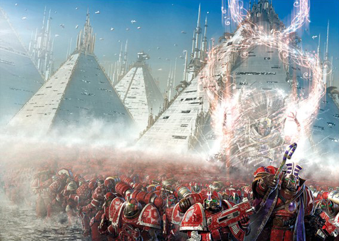

<!-- A0549-B0102 -->

原译文

The Thousand Sons: Red Sorcerers of Prospero 千子：普罗斯佩罗的红色巫师

**校订译文**

The Thousand Sons: Red Sorcerers of Prospero 千子：普罗斯佩罗的红色巫师

<!-- /A0549-B0102 -->

<!-- A0549-B0103 -->
**英文原文**

The Thousand Sons retreated from Terra after the death of Horus alongside the other Chaos forces, before using their sorcerous powers to open a warp route that would transport their fleet directly to the Planet of Sorcerers.

<!-- /A0549-B0103 -->

<!-- A0549-B0104 -->

原译文

荷鲁斯死后，千子与其他混沌部队一起从泰拉撤退，然后利用他们的魔法力量开辟了一条亚空间路线，将他们的舰队直接运送到巫师星。

**校订译文**

荷鲁斯死后，千子与其他混沌军队撤离泰拉，以巫术开辟亚空间航路，将舰队直接送回巫师之星。

<!-- /A0549-B0104 -->

<!-- A0549-B0105 -->
### Horus Heresy Aftermath 荷鲁斯之乱余波

原题：Horus Heresy Aftermath 荷鲁斯叛乱余波

<!-- /A0549-B0105 -->

<!-- A0549-B0106 -->
**英文原文**

The dedication to the Chaos God Tzeentch resulted in several changes to the organisation of the legion, but had little direct effect on their combat doctrine. Previously known to avoid close combat in favour of psychic trickery and the use of ranged weaponry, their development into a legion of Chaos Sorcerers and the effect of the Rubric of Ahriman only increased reliance on this approach. Those marines affected by the Rubric are used to anchor an attack's firepower, while the sorcerers deploy their psychic powers, the whole event orchestrated in accordance with a previously constructed plan of deceit or guile. While showing no overt favouring of vehicles or heavy armour, the loyalist Thousand Sons did appear to deploy significant Legio Cybernetica assets in battle, although, in a fore-echo of what would come to pass with the use of Rubric Marines, they psychically controlled the robots to act as a mobile bulwark, rather than letting them operate as normal. The transition into a Chaos Legion did little to change the Thousand Sons' lack of interest in vehicular or heavy armour support; the discipline of machinery is one that most Sorcerers apparently care little for...although now and again one will take enough of an interest to produce something unusual. The existing Legion stock of vehicles and equipment has rarely been remarked upon since the end of the Thousand Sons' Imperial loyalty (indeed, it is not actually known if the Legion managed to retain anything other than those Legionaries who were transported from Prospero to the Planet of Sorcerers), but it is known that they sometimes scavenge or steal such items during raids. However, as the Thousand Sons show markedly little interest in properly maintaining their traditional armoury, these repurposed goods never last long and certainly do not appear in large numbers.

<!-- /A0549-B0106 -->

<!-- A0549-B0107 -->

原译文

对混沌之神奸奇的奉献导致了军团组织的几次变化，但对他们的战斗理论几乎没有直接影响。以前人们知道，他们避免近身格斗，而更喜欢灵能诡计和远程武器的使用，他们发展成为一支混沌巫师军团，而阿里曼红字法术的影响只会增加对这种方法的依赖。那些受红字法术影响的星际战士被用来锚定攻击的火力，而巫师则部署他们的灵能力量，整个事件都是根据之前构建的欺骗或诡计计划精心策划的。虽然没有表现出对载具或重型装甲的明显偏爱，但忠诚的千子似乎确实在战斗中部署了大量的军团智控资产，尽管他们在灵能上控制了机器人作为移动堡垒，而不是让它们正常运作，这与使用红字战士的情况相呼应。过渡到混沌军团并没有改变千子对载具或重型装甲支援的兴趣；机械的训练显然是大多数巫师不太关心的...尽管人们偶尔会产生足够的兴趣来制作一些不同寻常的东西。自千子对帝国的忠诚结束以来，现有的军团载具和装备很少被提及（事实上，除了从普罗斯佩罗运送到巫师星的军团成员外，我们实际上不知道军团是否保留了其他任何东西），但众所周知，他们有时会在突袭中清理或偷走这些物品。然而，由于千子对妥善维护其传统军械库表现出不明显的兴趣，这些重新使用的物品从未持续太久，当然也不会大量出现。

**校订译文**

奉献奸奇改变了军团组织，却未直接颠覆其战术。千子原就偏爱灵能诡计与远程武器，避免近战；成为巫师军团、经历阿里曼红字法术后，更加依赖这种方式。红字战士提供稳定火力，巫师运用灵能，整场战斗依预先布下的欺敌计划展开。忠诚时期，他们虽不偏爱载具与重型装甲，却曾大量部署智控军团机械兵力，并以灵能直接控制机器人作移动壁垒，而非任其照常自主行动，仿佛预演了后来的红字战士战法。堕入混沌后，他们对机械仍兴趣缺缺，多数巫师懒于钻研这门学问，偶尔才有人造出奇异作品。军团旧有车辆装备，此后少见记载；甚至无法确定，除传送至巫师之星的战士之外，当初究竟还保住了什么。不过，他们有时会在袭击中拾取或盗走装备。由于不愿认真维护传统军械，这些缴获品往往用不长久，也从不大量出现。

**校注：** Legio Cybernetica为智控军团；discipline为学科，不是机械训练。原文载具整体不足的历史叙述按本段保留。

<!-- /A0549-B0107 -->

<!-- A0549-B0108 图片 -->
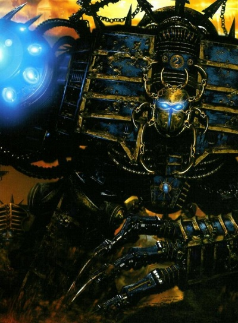

<!-- A0549-B0109 -->

原译文

Dreadnought of the Thousand Sons 千子的无畏

**校订译文**

Dreadnought of the Thousand Sons 千子的无畏

<!-- /A0549-B0109 -->

<!-- A0549-B0110 -->
**英文原文**

While they avoided dissolution as a legion for some time, the Thousand Sons now only seem to operate abroad as small warbands. These warbands are said to seek out conglomerations of psykers, or traces of sorcerous techniques using artefacts known as Seer Stones. Whilst the plans of the Thousand Sons are never easy to discern, being chosen as Tzeentch's favoured agents results in the actions of their warbands being varied and often curious; by raiding a particular planet, location or killing even a single, specific individual, the manipulations of Tzeentch are furthered. The most well-known of these warbands is the Prodigal Sons warband led by Ahriman.

<!-- /A0549-B0110 -->

<!-- A0549-B0111 -->

原译文

虽然千子军团在一段时间内避免了解散，但现在似乎只在以小战帮作战。据说这些战帮会使用被称为先知之石的造物寻找灵能者的聚集地或巫术技术的痕迹。虽然千子的计划从来都不容易辨别，但被选为奸奇宠爱的神选会导致他们的战士的行动多种多样，而且往往很奇怪；通过袭击特定的星球、地点，甚至杀死一个特定的人，奸奇的操纵得到了进一步的推进。其中最著名的是阿里曼领导的挥霍之子。

**校订译文**

千子曾在一段时间内维持军团整体，如今对外行动却似乎多依靠小型战帮。据说，他们借先知之石寻找灵能者聚集地或巫术痕迹。身为奸奇青睐的代理人，他们的行动多变且诡异，意图难以看透；袭击某颗行星、某处地点，甚至杀死一个特定人物，都可能进一步推进奸奇的布局。最著名者，是阿里曼率领的浪子战帮。

<!-- /A0549-B0111 -->

<!-- A0549-B0112 -->
### The Rubric of Ahriman 阿里曼的红字法术

<!-- /A0549-B0112 -->

<!-- A0549-B0113 -->
**英文原文**

With the embrace of Chaos, comes mutation. Once the Thousand Sons had retreated back to the Planet of Sorcerers within the Eye of Terror members of the legion began to suffer the flesh-change; horrendous physical mutations, their bodies and minds twisted in ways only Chaos can achieve. Although some dedicated Tzeentch worshippers saw these changes as a sign of their god’s favour, those of higher understanding knew better, and decided that the Thousand Sons' search for enlightenment and knowledge could not end in the dreaded transformations they would inevitably suffer. Ahriman, once Chief Librarian of the Legion, and second only to Magnus in power, united a conclave of his most trusted sorcerers, and together they cast a spell, known as the Rubric of Ahriman, of tremendous magnitude that would save the legion from the fate of mutation. The results were not what Ahriman expected...but he was satisfied with them none the less. The Thousand Sons were now safe from the taint of chaos, but at a terrible price. Those untouched by the flesh change had their psychic powers greatly strengthened, but those who had already mutated had their physical bodies reduced to dust and their animate spirits damned to live inside their armour forever. Most of the legion were therefore changed into Rubric Marines, little more than mindless automatons. When Magnus heard about the terrible failure, he banished Ahriman and his group from the Planet of the Sorcerers, and now they wander through the Eye of Terror and beyond, still pursuing magical knowledge and seeking arcane artifacts. Ahriman’s current goal is to enter the Black Library of the Eldar, and rumour has it that if he succeeds in his quest, his power will grow beyond imagination.

<!-- /A0549-B0113 -->

<!-- A0549-B0114 -->

原译文

随着混沌的拥抱，突变也随之而来。一旦千子撤退回恐惧之眼的巫师星，军团成员就开始遭受血肉转变；可怕的物理突变，他们的身体和思想以只有混沌才能实现的方式扭曲。尽管一些虔诚的奸奇信徒认为这些变化是他们神青睐的标志，但那些有更高理解力的人知道得更多，并决定千子寻求启蒙和知识不会以他们不可避免地遭受的可怕转变而告终。阿里曼，曾经是军团的首席智库，仅次于马格努斯，联合了他最信任的巫师组成的秘会，他们一起施展了一个巨大的咒语，被称为阿里曼的红字法术，将军团从突变的命运中拯救出来。结果与阿里曼的预期不符...但他仍然对他们很满意。千子现在已经摆脱了混沌的阴影，但付出了可怕的代价。那些未受血肉转变影响的人的灵能力量大大增强，但那些已经发生变异的人的身体被化为尘土，他们的灵魂被诅咒永远生活在盔甲里。因此，军团中的大多数人都变成了红字战士，只不过是无意识的机器人。当马格努斯听说这场可怕的失败时，他将阿里曼和他的团队驱逐出了巫师星，现在他们在恐惧之眼和其他地方游荡，仍然在追求魔法知识和寻求奥术造物。阿里曼目前的目标是进入灵族的黑色图书馆，有传言说，如果他成功地完成了任务，他的力量将超越想象。

**校订译文**

接纳混沌，也意味着接纳突变。千子退回恐惧之眼的巫师之星后，血肉异变再次发作，身心遭到唯有混沌才能造成的可怕扭曲。一些虔诚信徒视之为奸奇宠爱，但另一些看得更深的人，拒绝让求知与启蒙之路终结于这种命运。前首席智库员阿里曼，其力量仅次于马格努斯，召集最信任的巫师组成秘会，共同施展规模惊人的红字法术，意在拯救军团。结果出乎预料，却仍令他满意：千子不再受混沌突变威胁，代价却极为惨重。未受血肉异变者灵能大幅增强；已突变者肉身化尘，灵魂永困护甲。军团大多数成员由此成为红字战士，近乎无思维的自动机。马格努斯得知这场惨剧，将阿里曼与其同党放逐。此后，他们游荡于恐惧之眼内外，继续搜求魔法知识与秘法遗物。阿里曼当前意图进入灵族黑色图书馆，据传若成功，便将获得难以想象的力量。

**校注：** 本段红字法术按是否已突变区分结果，可能与其他段按灵能强弱的说法不同；均忠于对应原文，不混改为一种筛选机制。

<!-- /A0549-B0114 -->

<!-- A0549-B0115 图片 -->

<!-- A0549-B0116 -->

原译文

Ouroboros symbol 食尾蛇标志

**校订译文**

Ouroboros symbol 食尾蛇标志

<!-- /A0549-B0116 -->

<!-- A0549-B0117 -->
### Vendetta 仇杀

<!-- /A0549-B0117 -->

<!-- A0549-B0118 -->
**英文原文**

After the destruction of Prospero at their hands, the Thousand Sons have been long time arch-enemies with the Space Wolves chapter. They have tried several times to uproot and destroy the Wolves, ranging from a full-scale invasion of the Space Wolves' homeworld of Fenris to plots such as those spearheaded by the sorcerer Madox.

<!-- /A0549-B0118 -->

<!-- A0549-B0119 -->

原译文

在普罗斯佩罗被他们摧毁后，千子一直是太空野狼战团的宿敌。他们曾多次试图铲除和摧毁野狼，从全面入侵太空野狼的家园世界芬里斯到巫师马多克斯带头的阴谋。

**校订译文**

太空野狼毁灭普罗斯佩罗后，便与千子结成宿敌。千子多次试图将其连根拔起，从全面入侵母星芬里斯，到巫师马多克斯策动的各式阴谋，无所不用。

**校注：** 摧毁普罗斯佩罗者是太空野狼，原代词“他们”容易误指千子。

<!-- /A0549-B0119 -->

<!-- A0549-B0120 图片 -->
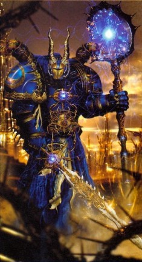

<!-- A0549-B0121 -->

原译文

Chaos Sorcerer of the Thousand Sons 千子混沌巫师

**校订译文**

Chaos Sorcerer of the Thousand Sons 千子混沌巫师

<!-- /A0549-B0121 -->

<!-- A0549-B0122 -->
**英文原文**

This vendetta would have an irrevocable effect upon the legion. The Thousand Sons had largely retained their legion organisation and structure after the Heresy, even raising and maintaining a large body of mortal troops they referred to as Spireguard in an echo of the Crusade-era Imperial Army regiments of Prospero. However, the last known act of the Thousand Sons as a legion was the Battle of the Fang, in which Magnus committed almost all of their remaining assets. At that time, there were approximately 700 members of the Thousand Sons left (not including the coven of Ahriman). Their defeat resulted in the loss of several of the remaining senior legion members, several squads of Rubric Marines, much of their fleet, and nearly all of their mortal minions.

<!-- /A0549-B0122 -->

<!-- A0549-B0123 -->

原译文

这场仇杀将对军团产生不可挽回的影响。千子军团在叛乱之后基本上保留了他们的军团组织和结构，甚至培养和维持了一大批他们称之为尖塔守卫的凡人军队，这与大远征时代的普罗斯佩罗帝国陆军兵团呼应。然而，千子军团最后一次为人所知的行动是长牙之战，马格努斯在这场战斗中几乎动用了他们所有的剩余资产。当时，千子大约有700名成员（不包括阿里曼的秘会）。他们的失败导致了剩下的几名高级军团成员、几个红字战士小队、他们的大部分舰队以及几乎所有的凡人下属的损失。

**校订译文**

这场宿怨对军团造成不可逆转的影响。叛乱后，千子一度保留大体完整的组织，甚至征募大量凡人军队，沿大远征时期普罗斯佩罗帝国军的称谓，称其为尖塔守卫。本段旧记载将长牙之战称为千子最后一次全军团行动：马格努斯几乎投入全部剩余力量，当时除阿里曼秘会外，军团只余约七百人。战败使数名高级成员、数个红字战士小队、舰队大部及几乎所有凡人仆从尽失。

**校注：** “最后一次全军团行动”属本段时期的旧记载，后文另有更晚大规模动员，标明叙述时间限制。七百是否含红字战士，原句未解释，不自行添加统计口径。

<!-- /A0549-B0123 -->

<!-- A0549-B0124 -->
### Notable Engagements 著名交战

<!-- /A0549-B0124 -->

<!-- A0549-B0125 图片 -->
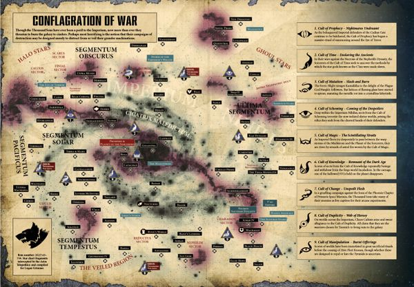

<!-- A0549-B0126 -->

原译文

Current deployments of the Thousand Sons 千子当前交战

**校订译文**

Current deployments of the Thousand Sons 千子当前交战

<!-- /A0549-B0126 -->

<!-- A0549-B0127 -->
### The Great Crusade 大远征

<!-- /A0549-B0127 -->

<!-- A0549-B0128 -->
**英文原文**

???.M30 — Terra — Pacification of the Boeotian Lowlands.

<!-- /A0549-B0128 -->

<!-- A0549-B0129 -->

原译文

泰拉 — 波奥提亚低地的征服。

**校订译文**

???.M30：泰拉，平定波奥提亚低地。

<!-- /A0549-B0129 -->

<!-- A0549-B0130 -->
**英文原文**

???.M30 — The Acceredine Defiance — One of the XV Legion's first engagements after its foundation. The Acceredine Enclave on the world of Castus is defeated by the 1st Brigade of the 2nd Regiment of the XV Legion and troops of the Imperial Army Auxiliary.

<!-- /A0549-B0130 -->

<!-- A0549-B0131 -->

原译文

阿塞雷丁反抗 — 是第十五军团成立后的首批行动之一。卡斯图斯世界上的Acc阿塞雷丁飞地被第十五军团的第二兵团第一旅和帝国陆军辅助军击败。

**校订译文**

???.M30：阿塞雷丁反抗，第十五军团成立后的最早几场战斗之一。军团第二团第一旅与帝国军辅助部队联手，击败卡斯图斯的阿塞雷丁飞地。

**校注：** 移除中文误残留的Acc；Imperial Army为帝国军，不是帝国陆军。

<!-- /A0549-B0131 -->

<!-- A0549-B0132 -->
**英文原文**

???.M30 — Ostratis — Compliance Action. The 1st Millennial of the III Legion withdraw their ships when a company of the XV Legion joined the mustering to take the colonies of the Cyn Stars

<!-- /A0549-B0132 -->

<!-- A0549-B0133 -->

原译文

奥斯特拉蒂斯 — 征服行动。当第十五军团的一个连队加入了夺取辛群星殖民地的集结时，第三军团的第一千人队撤回了他们的战舰

**校订译文**

???.M30：奥斯特拉蒂斯征服行动。第十五军团一个连加入夺取辛群星殖民地的集结时，第三军团第一千人队撤走舰船。

<!-- /A0549-B0133 -->

<!-- A0549-B0134 -->
**英文原文**

???.M30 — Colgren Campaign alongside the Dusk Raiders, who refused to look at, listen to or speak to any of the Thousand Sons, dealing only through intermediaries and servitors

<!-- /A0549-B0134 -->

<!-- A0549-B0135 -->

原译文

科尔格伦战役与黄昏突袭者并肩作战，他们拒绝看、听或和千子中的任何一个人说话，只通过中间人和仆从进行来往

**校订译文**

???.M30：科尔格伦战役，与黄昏突袭者共同作战。后者拒绝与千子见面、交谈或听其言语，只通过中间人与机仆联系。

<!-- /A0549-B0135 -->

<!-- A0549-B0136 -->
**英文原文**

???.M30 — Necordo — Compliance Action. Two hundred warrior lead by Captain Ohrmuzd subdue the planet of Necordo in only six hours.

<!-- /A0549-B0136 -->

<!-- A0549-B0137 -->

原译文

内科多 — 征服行动。由奥尔穆兹德连长率领的200名战士在短短六个小时内征服了内科多行星。

**校订译文**

???.M30：内科多征服行动。奥尔穆兹德连长率两百名战士，仅六小时便征服行星。

<!-- /A0549-B0137 -->

<!-- A0549-B0138 -->
**英文原文**

???.M30 — Rout of Megorania — The now lost Legio Lacrimae gives oaths of perpetual kinship to the Thousand Sons for driving back a force of countless Orks from their crippled Titans.

<!-- /A0549-B0138 -->

<!-- A0549-B0139 -->

原译文

梅戈拉尼亚溃退 — 现已失踪的泣泪军团宣誓与千子永远有血亲关系，因为他们从残废的泰坦手中击退了无数欧克。

**校订译文**

???.M30：梅戈拉尼亚溃敌行动。千子击退围攻受损泰坦的无数欧克蛮人，令如今已失落的泣泪军团发誓与之永结盟谊。

**校注：** 千子从受损泰坦身边击退欧克蛮人，不是从泰坦手中击退欧克；kinship为永恒盟谊，不是宣誓创造生物血缘。

<!-- /A0549-B0139 -->

<!-- A0549-B0140 -->
**英文原文**

823.M30 — Bezant — The Flesh Change manifests for the first time.

<!-- /A0549-B0140 -->

<!-- A0549-B0141 -->

原译文

贝赞特 — 血肉转变首次显现。

**校订译文**

823.M30：贝赞特，血肉异变首次显现。

<!-- /A0549-B0141 -->

<!-- A0549-B0142 -->
**英文原文**

866.M30 — Riohbia — The Thousand Sons secure the world and the Grael Library.

<!-- /A0549-B0142 -->

<!-- A0549-B0143 -->

原译文

里奥比亚 — 千子保卫世界和格雷尔图书馆。

**校订译文**

866.M30：里奥比亚，千子夺取该世界与格雷尔图书馆。

<!-- /A0549-B0143 -->

<!-- A0549-B0144 -->
**英文原文**

???.M30 — The Devastation of Zoah. Waged alongside the Night Lords

<!-- /A0549-B0144 -->

<!-- A0549-B0145 -->

原译文

琐亚的毁灭。与午夜领主并肩作战

**校订译文**

???.M30：佐亚毁灭，与午夜领主共同作战。

**校注：** Zoah沿537佐亚，原琐亚。

<!-- /A0549-B0145 -->

<!-- A0549-B0146 -->
**英文原文**

???.M30 — Valnum — Compliance Action. Captain Ohrmuzd leads only sixty legionaries to the plains of Valnum. They defeat the entire House Cratax in a battle lasted for five hundred seconds, losing only three warriors. The planet is renamed 72-9.

<!-- /A0549-B0146 -->

<!-- A0549-B0147 -->

原译文

瓦尔努姆 — 征服行动。奥尔穆兹德连长只率领60名军团士兵前往瓦尔努姆的平原。他们在一场持续五百秒的战斗中击败了整个克拉塔克斯家族，只损失了三名战士。这颗行星被重新命名为72-9。

**校订译文**

???.M30：瓦尔努姆征服行动。奥尔穆兹德仅率六十人，在当地平原以五百秒击败整个克拉塔克斯家族，己方仅损失三人。行星改名72-9。

<!-- /A0549-B0147 -->

<!-- A0549-B0148 -->
**英文原文**

???.M30 — Mih'savoh — Compliance Action. Part of the Priosa Campaign. Battle happened a decade before the re-unification with the Primarch Magnus.

<!-- /A0549-B0148 -->

<!-- A0549-B0149 -->

原译文

米赫’萨沃 — 征服行动。普里奥萨战役的一部分。这场战役发生在与原体马格努斯重新联合的十年前。

**校订译文**

???.M30：米赫’萨沃征服行动，属普里奥萨战役的一部分，发生于与马格努斯重逢前十年。

<!-- /A0549-B0149 -->

<!-- A0549-B0150 -->
**英文原文**

???.M30 — The Kamenka Troika — Extermination of Greenskin infestation. Loss of 873 Astartes; Legion reorganised as a result.

<!-- /A0549-B0150 -->

<!-- A0549-B0151 -->

原译文

卡缅卡三巨头 — 消灭绿皮侵扰。873名阿斯塔特损失；因此，军团进行了重组。

**校订译文**

???.M30：卡缅卡三巨头，清除绿皮势力。军团损失八百七十三名阿斯塔特，并因此重组。

**校注：** Kamenka Troika沿原稿暂定卡缅卡三巨头，地名确义待核；此处873与前文近900为精确数与约数，保留。

<!-- /A0549-B0151 -->

<!-- A0549-B0152 -->

原译文

???.M30 — Seristanus Campaign 塞里斯塔努斯战役

**校订译文**

???.M30 — Seristanus Campaign 塞里斯塔努斯战役

<!-- /A0549-B0152 -->

<!-- A0549-B0153 -->

原译文

???.M30 — Relief of Keene's Landing 基恩登陆救援

**校订译文**

???.M30 — Relief of Keene's Landing 基恩登陆救援

<!-- /A0549-B0153 -->

<!-- A0549-B0154 -->

原译文

???.M30 — Last Stand on Rakotis 拉科提斯最后一站

**校订译文**

???.M30 — Last Stand on Rakotis 拉科提斯最后坚守

**校注：** Last Stand为最后坚守/抵抗，不是最后一站。

<!-- /A0549-B0154 -->

<!-- A0549-B0155 -->
**英文原文**

???.M30 — The Turning of the Golden Apostles — Compliance Action. Magnus leads a force made up of five Circles from three different Fellowships against the Golden Apostles, a string of star systems strung between the Sol system and the outer reaches of the galactic core.

<!-- /A0549-B0155 -->

<!-- A0549-B0156 -->

原译文

黄金使徒的转向 — 征服行动。马格努斯带领一支由来自三个不同学会的五个环组成的队伍对抗黄金使徒，黄金使徒是一系列恒星系统，连接在太阳系和银河系核心的外围。

**校订译文**

???.M30：黄金使徒归顺——征服行动。马格努斯率来自三个学会的五个环，进攻黄金使徒；这是分布在太阳系与银河核心外围之间的一系列恒星系。

**校注：** Golden Apostles在英文此处指一串星系，不直接当作一群使徒人物；Turning依compliance语境作归顺。

<!-- /A0549-B0156 -->

<!-- A0549-B0157 -->
**英文原文**

???.M30 — Cazhat — Compliance Action. A detachment of the Fifth Fellowship attached to the 493rd Expeditionary Fleet commanded by Shai-Captain Tachus Makt take the desert world of Cazhar without firing a single shot.

<!-- /A0549-B0157 -->

<!-- A0549-B0158 -->

原译文

卡扎特 — 征服行动。由沙伊连长塔赫斯·马克特指挥的第493远征舰队第五学会的一支分遣队在没有开一枪的情况下占领了沙漠世界卡扎特。

**校订译文**

???.M30：卡扎特征服行动。沙伊连长塔赫斯·马克特指挥编入第493远征舰队的第五学会分遣队，不发一枪便夺取这颗沙漠行星。

**校注：** 英文标题Cazhat、同句Cazhar两种拼写，中文沿卡扎特，不把一字母差异另造行星。Tachus Makt指挥对象的修饰范围略含混，中文保留其与分遣队的关系，不额外认定他统率整支远征舰队。

<!-- /A0549-B0158 -->

<!-- A0549-B0159 -->
**英文原文**

???.M30 — 28-16/Aghoru — Compliance Action. Compliance achieved by diplomacy; secondary combat against apparent warp corruption.

<!-- /A0549-B0159 -->

<!-- A0549-B0160 -->

原译文

28-16/阿古茹 — 征服行动。通过外交手段实现征服；对明显亚空间腐化的二次打击。

**校订译文**

???.M30：28-16／阿古茹征服行动。通过外交使其归顺，随后又对付疑似亚空间腐化。

<!-- /A0549-B0160 -->

<!-- A0549-B0161 -->
**英文原文**

999.M30 — Ark Reach Cluster — Compliance Action. Compliance achieved in concert with forces of the Space Wolves and the Word Bearers. The return of the flesh-change occurred at the conclusion of this campaign.

<!-- /A0549-B0161 -->

<!-- A0549-B0162 -->

原译文

方舟河段星群 — 征服行动。与太空野狼和怀言者的部队协同实现了征服。血肉转变的回归发生在这场战役结束时。

**校订译文**

999.M30：方舟疆域星群征服行动，与太空野狼和怀言者共同完成。战役末，血肉异变再度出现。

<!-- /A0549-B0162 -->

<!-- A0549-B0163 -->
### The Horus Heresy 荷鲁斯之乱

原题：The Horus Heresy 荷鲁斯叛乱

<!-- /A0549-B0163 -->

<!-- A0549-B0164 -->
**英文原文**

004-005.M31 — The Burning of Prospero; defence of the legion homeworld against the Space Wolves; defeated.

<!-- /A0549-B0164 -->

<!-- A0549-B0165 -->

原译文

普罗斯佩罗之焚；保卫军团家园世界对抗太空野狼；败了。

**校订译文**

004—005.M31：普罗斯佩罗之焚，抵抗太空野狼、保卫军团母星，战败。

<!-- /A0549-B0165 -->

<!-- A0549-B0166 -->
**英文原文**

004.M31 — Maktor VIII. Even before news of Prospero's destruction, 300 veterans of the Seventh Fellowship are abandoned to their deaths during the assault on Maktor VIII by the Imperial Fists.

<!-- /A0549-B0166 -->

<!-- A0549-B0167 -->

原译文

马克托尔八号。甚至在普罗斯佩罗被摧毁的消息传出之前，300名第七学会的老兵就在帝国之拳对马克托尔八号的袭击中被遗弃致死。

**校订译文**

004.M31：马克托尔八号。普罗斯佩罗毁灭的消息尚未传来，帝国之拳便在当地进攻中遗弃了第七学会三百名老兵，任其战死。

<!-- /A0549-B0167 -->

<!-- A0549-B0168 -->
**英文原文**

???.M31 — The Battle of Yarant; Legion elements ally with Traitor forces in an attempt to exterminate the Space Wolves; defeated.

<!-- /A0549-B0168 -->

<!-- A0549-B0169 -->

原译文

雅兰特之战；军团成员与叛徒部队结盟，试图消灭太空野狼；败了。

**校订译文**

???.M31：雅兰特之战，部分军团战士与叛军结盟，试图消灭太空野狼，最终战败。

<!-- /A0549-B0169 -->

<!-- A0549-B0170 -->
**英文原文**

???.M31 — Unknown Location. 2,000 members of the ninth fellowship led by Sentor Rahme are killed in their encampments by their Ultramarines allies.

<!-- /A0549-B0170 -->

<!-- A0549-B0171 -->

原译文

未知位置。由森托尔·拉赫梅领导的第九学会的2000名成员在他们的营地被他们的极限战士盟友杀害。

**校订译文**

???.M31：地点不详。森托尔·拉赫梅率领的第九学会两千名战士，在营地中被极限战士盟军杀害。

<!-- /A0549-B0171 -->

<!-- A0549-B0172 -->
**英文原文**

012.M31 - The Axandrian Incident. Raided Axandria IV for data-cores possessing traitor knowledge.

<!-- /A0549-B0172 -->

<!-- A0549-B0173 -->

原译文

阿克桑德里安事件。突袭阿克桑德里安四号，寻找拥有叛徒知识的数据核心。

**校订译文**

012.M31：阿克桑德里安事件，突袭阿克桑德里安四号，夺取记载叛军知识的数据核心。

<!-- /A0549-B0173 -->

<!-- A0549-B0174 -->
**英文原文**

009-013.M31 — The Siege of Inwit. Companies drawn from the Thousand Sons, Iron Warriors and World Eaters alongside significant numbers of Cthonian Headhunter Cohorts attack the homeworld of the Imperial Fists.

<!-- /A0549-B0174 -->

<!-- A0549-B0175 -->

原译文

因维特围城。来自千子、钢铁勇士和吞世者的连队，以及大量的科索尼亚猎头者大队，袭击了帝国之拳的家园世界。

**校订译文**

009—013.M31：因维特围城。千子、钢铁勇士与吞世者抽调连队，会同大批科索尼亚猎头者大队，进攻帝国之拳母星。

<!-- /A0549-B0175 -->

<!-- A0549-B0176 -->
**英文原文**

013.M31 - The Battle of Zhao-Arkhad. Thousand Sons still apparently loyal to the Emperor protect the Forge World of Zhao-Arkhad from a fleet of Dark Angels.

<!-- /A0549-B0176 -->

<!-- A0549-B0177 -->

原译文

赵-阿卡达之战。千子显然仍然忠于帝皇，保护着赵-阿卡达的铸造世界不受黑暗天使舰队的伤害。

**校订译文**

013.M31：赵-阿卡达之战。一支看来仍忠于帝皇的千子部队，保卫铸造世界赵-阿卡达，对抗黑暗天使舰队。

**校注：** apparently表示看来如此，不表示确定无疑；本句仅该部队，不是全体千子。

<!-- /A0549-B0177 -->

<!-- A0549-B0178 -->
**英文原文**

???.M31 — Raid on Perdoxon V orbital supply platform. A strike force comprised of White Scars, Iron Hands and Thousand Sons elements attack an orbital supply platform held by a Word Bearers garrison.

<!-- /A0549-B0178 -->

<!-- A0549-B0179 -->

原译文

袭击珀多森五号轨道补给平台。一支由白色伤疤、钢铁之手和千子组成的打击部队袭击了一个由怀言者驻军持有的轨道补给平台。

**校订译文**

???.M31：袭击珀多森五号轨道补给平台。白疤、钢铁之手与千子组成联合打击部队，进攻怀言者驻守的平台。

<!-- /A0549-B0179 -->

<!-- A0549-B0180 -->
**英文原文**

013-014.M31 - Siege of Cthonia. Remnants of the Fifth Fellowship still loyal to the Emperor under the command of Sul Kontep support the Imperial Fists against the forces of the Sons of Horus.

<!-- /A0549-B0180 -->

<!-- A0549-B0181 -->

原译文

科索尼亚围城。在苏尔·孔特普的指挥下，仍然忠于帝皇的第五学会的残余分子支援帝国之拳对抗荷鲁斯之子的部队。

**校订译文**

013—014.M31：科索尼亚围城。苏尔·孔泰普率仍忠于帝皇的第五学会残部，支援帝国之拳，对抗荷鲁斯之子。

<!-- /A0549-B0181 -->

<!-- A0549-B0182 -->
**英文原文**

014.M31 — The Solar War & Siege of the Emperor's Palace. Took part in the Chaos grand assault; defeated.

<!-- /A0549-B0182 -->

<!-- A0549-B0183 -->

原译文

太阳战争和帝皇宫殿的围攻。参加了混沌大突击；打败了。

**校订译文**

014.M31：太阳战争及帝皇皇宫围攻，参加混沌总攻，战败。

<!-- /A0549-B0183 -->

<!-- A0549-B0184 -->
### Post Heresy 叛乱后

<!-- /A0549-B0184 -->

<!-- A0549-B0185 -->
**英文原文**

???.M31 — Kha'Sherhan warband allies with Ezekyle Abaddon to destroy the clone of Horus.

<!-- /A0549-B0185 -->

<!-- A0549-B0186 -->

原译文

卡哈’谢罕战帮与以泽凯尔·阿巴顿结盟，摧毁了荷鲁斯的克隆人。

**校订译文**

???.M31：卡哈’谢罕战帮与以泽凯尔·阿巴顿结盟，消灭荷鲁斯克隆体。

<!-- /A0549-B0186 -->

<!-- A0549-B0187 -->
**英文原文**

???.M31 — Garm — Fought the Space Wolves in the aftermath of the Horus Heresy; driven off.

<!-- /A0549-B0187 -->

<!-- A0549-B0188 -->

原译文

加姆 — 荷鲁斯叛乱事件后与太空野狼作战；被赶走了。

**校订译文**

???.M31：加姆，荷鲁斯之乱后与太空野狼交战，被击退。

<!-- /A0549-B0188 -->

<!-- A0549-B0189 -->
**英文原文**

???.M32 — The Battle of the Fang. Full scale planetary invasion of the Space Wolves' homeworld; defeated.

<!-- /A0549-B0189 -->

<!-- A0549-B0190 -->

原译文

长牙之战。太空野狼家园世界的全面行星入侵；败了。

**校订译文**

???.M32：长牙之战，全面入侵太空野狼母星，战败。

<!-- /A0549-B0190 -->

<!-- A0549-B0191 -->
**英文原文**

112.M33 — The Feral War; Rubric Marines left by Ahriman destroy an Adeptus Mechanicus and Relictors force on the Feral World Aggaros.

<!-- /A0549-B0191 -->

<!-- A0549-B0192 -->

原译文

野蛮战争；阿里曼留下的红字战士在蛮荒世界阿加罗斯摧毁了一支机械神教和遗物部队。

**校订译文**

112.M33：野蛮战争。阿里曼留在蛮荒世界阿加罗斯的红字战士，消灭一支机械修会与遗物守护者联合部队。

**校注：** Relictors为战团遗物守护者，非普通遗物；Adeptus Mechanicus统一机械修会。

<!-- /A0549-B0192 -->

<!-- A0549-B0193 -->
**英文原文**

???.M33 — The Assault on Apollonia. The Prodigal Sons battle the Inquisition over the Athenaeum of Kallimakus.

<!-- /A0549-B0193 -->

<!-- A0549-B0194 -->

原译文

阿波罗尼亚袭击。挥霍之子与审判庭争夺卡利马库斯的雅典娜神庙。

**校订译文**

???.M33：阿波罗尼亚袭击，浪子战帮与审判庭争夺卡利马库斯学宫。

**校注：** Athenaeum为学宫/藏书机构，非雅典娜神庙；参照核心Tower Athenaeum学宫之塔用词。

<!-- /A0549-B0194 -->

<!-- A0549-B0195 -->
**英文原文**

579.M37 — The War in the Webway; A coven of Thousand Sons Sorcerers attempt to gain access to Commorragh.

<!-- /A0549-B0195 -->

<!-- A0549-B0196 -->

原译文

网道战争；千子巫师试图进入科摩罗。

**校订译文**

579.M37：网道战争，一个千子巫师秘会试图进入科摩罗。

<!-- /A0549-B0196 -->

<!-- A0549-B0197 -->
**英文原文**

???.M41 — Calliope — The harvesting of the planets souls, overseen by Ahriman

<!-- /A0549-B0197 -->

<!-- A0549-B0198 -->

原译文

卡利奥普 — 阿里曼监督的对行星灵魂的收割

**校订译文**

???.M41：卡利奥普，阿里曼监督收割行星居民的灵魂。

<!-- /A0549-B0198 -->

<!-- A0549-B0199 -->
**英文原文**

???.M41 — Dianixis — The destruction of the planet, overseen by Ahriman

<!-- /A0549-B0199 -->

<!-- A0549-B0200 -->

原译文

达尼西斯 — 行星的毁灭，由阿里曼监督

**校订译文**

???.M41：达尼西斯，在阿里曼监督下毁灭该行星。

<!-- /A0549-B0200 -->

<!-- A0549-B0201 -->
**英文原文**

???.M41 — Etiamnun III — The warband of Mordant Hex gains access to the Eldar webway.

<!-- /A0549-B0201 -->

<!-- A0549-B0202 -->

原译文

伊塔米昂三号 — 莫丹特·海克斯的战帮获得了通往灵族网道的通道。

**校订译文**

???.M41：伊塔米昂三号，莫丹特·海克斯的战帮成功进入灵族网道。

<!-- /A0549-B0202 -->

<!-- A0549-B0203 -->
**英文原文**

???.M41 — Arcadia — Ahriman and the Prodigal Sons plunder a Harlequin-guarded library amidst Blood Raven interference.

<!-- /A0549-B0203 -->

<!-- A0549-B0204 -->

原译文

阿卡迪亚 — 阿里曼和挥霍之子在血鸦的干扰下掠夺了一个由丑角守卫的图书馆。

**校订译文**

???.M41：阿卡迪亚，阿里曼与浪子战帮在血鸦干预下，洗劫一座由丑角守卫的图书馆。

<!-- /A0549-B0204 -->

<!-- A0549-B0205 -->
**英文原文**

???.M41 — Issajur — Sorcerer Mordant Hex battles the Space Wolves.

<!-- /A0549-B0205 -->

<!-- A0549-B0206 -->

原译文

伊萨朱 — 巫师莫丹特·海克斯与太空野狼作战。

**校订译文**

???.M41：伊萨朱，巫师莫丹特·海克斯迎战太空野狼。

<!-- /A0549-B0206 -->

<!-- A0549-B0207 -->
**英文原文**

???.M41 — Garm — Attempted mass resurrection of deceased Thousand Sons; plan almost totally foiled by the actions of the Space Wolves.

<!-- /A0549-B0207 -->

<!-- A0549-B0208 -->

原译文

加姆 — 试图让死去的千子复活；该计划几乎完全被太空野狼的行动所挫败。

**校订译文**

???.M41：加姆，试图大规模复活死去的千子，计划几乎被太空野狼彻底挫败。

<!-- /A0549-B0208 -->

<!-- A0549-B0209 -->
**英文原文**

999.M41 — The Siege of the Fenris System. Magnus the Red reappears at the head of a massive invasion of Fenris. Though Magnus was banished back to the Warp by Logan Grimnar and the Grey Knights and the Thousand Sons and their Daemonic allies seemingly defeated, in truth this was part of an elaborate plan by Magnus to transport the Planet of the Sorcerers to the Materium over Prospero. A giant Warp Rift accompanies it.

<!-- /A0549-B0209 -->

<!-- A0549-B0210 -->

原译文

芬里斯星系围攻。赤红之马格努斯再次出现在对芬里斯的大规模入侵中。尽管马格努斯的千子及其恶魔盟友被罗根·格里姆纳尔、灰骑士驱逐回亚空间，看似被击败，但事实上，这是马格努斯将巫师星运送到普罗斯佩罗上空的物质界空域的精心策划的一部分。一个巨大的亚空间裂隙伴随着它。

**校订译文**

999.M41：芬里斯星系围攻。红魔马格努斯再度率大军入侵芬里斯。洛根·格里姆纳尔与灰骑士将他放逐回亚空间，千子及恶魔盟军表面上败退；实际上，这却是马格努斯精密计划的一环，旨在将巫师之星移至普罗斯佩罗上空的物质宇宙。行星出现时，伴随一条巨大的亚空间裂隙。

**校注：** 被放逐的主语是马格努斯本人，不是他的全军；Logan Grimnar沿GW09p34/GW10p33洛根·格里姆纳尔。

<!-- /A0549-B0210 -->

<!-- A0549-B0211 -->
**英文原文**

999.M41 — 13th Black Crusade — Thousand Sons fighting alongside Abaddon the Despoiler invade territory near Prospero. Ahriman and the Prodigal Sons also attempt to raid the Eldar Black Library.

<!-- /A0549-B0211 -->

<!-- A0549-B0212 -->

原译文

第13次黑色远征 — 与掠夺者阿巴顿并肩作战的千子入侵普罗斯佩罗附近的领土。阿里曼和挥霍之子也试图突袭灵族黑色图书馆。

**校订译文**

999.M41：第十三次黑色远征。千子与掠夺者阿巴顿并肩作战，入侵普罗斯佩罗附近疆域；阿里曼和浪子战帮另试图袭击灵族黑色图书馆。

<!-- /A0549-B0212 -->

<!-- A0549-B0213 -->
**英文原文**

999.M41 — In the aftermath of the 13th Black Crusade Thousand Sons forces assist the World Eaters-led armada under Kossolax in invading Agripinaa.

<!-- /A0549-B0213 -->

<!-- A0549-B0214 -->

原译文

在第13次黑色远征之后，千子协助科索拉克斯率领的吞世者舰队入侵阿格里皮娜。

**校订译文**

999.M41：第十三次黑色远征后，千子协助科索拉克斯率领、由吞世者主导的联合舰队，入侵阿格里皮娜。

**校注：** World Eaters-led不是整个舰队仅由吞世者构成，明确其主导地位。

<!-- /A0549-B0214 -->

<!-- A0549-B0215 -->
**英文原文**

999.M41 — The War in the Labyrinth. Ahriman battles the Ynnari in the Webway.

<!-- /A0549-B0215 -->

<!-- A0549-B0216 -->

原译文

迷宫战争。阿里曼在网道与死神军作战。

**校订译文**

999.M41：迷宫战争，阿里曼在网道迎战死神军。

<!-- /A0549-B0216 -->

<!-- A0549-B0217 -->
**英文原文**

~999.M41 — The Terran Crusade — Magnus leads the Thousand Sons against the reborn Roboute Guilliman and his Eldar allies, temporarily trapping them in the Maelstrom. Magnus and his warriors eventually chase Guilliman to Luna, engaging in a fierce battle on the moon until the Daemon Primarch is forced back into the Webway.

<!-- /A0549-B0217 -->

<!-- A0549-B0218 -->

原译文

泰拉远征 — 马格努斯带领千子对抗重生的罗伯特·基里曼和他的灵族盟友，暂时将他们困在漩涡中。马格努斯和他的战士最终将基里曼追到了月球，在月球上进行了一场激烈的战斗，直到恶魔原体被迫回到网道。

**校订译文**

约999.M41：泰拉远征。马格努斯率千子迎战复苏的罗保特·基里曼与灵族盟军，一度将他们困于大漩涡，随后追至月球。激战后，恶魔原体被迫退回网道。

**校注：** Maelstrom是大漩涡专名，不是任意漩涡。

<!-- /A0549-B0218 -->

<!-- A0549-B0219 -->
**英文原文**

???.M42 — The Invasion of the Stygius Sector — Magnus leads a great Tzeentchian host against the Imperium.

<!-- /A0549-B0219 -->

<!-- A0549-B0220 -->

原译文

入侵冥河星区 — 马格努斯率领一支巨大奸奇军队对抗帝国。

**校订译文**

???.M42：冥河星区入侵，马格努斯率庞大奸奇军队进攻帝国。

<!-- /A0549-B0220 -->

<!-- A0549-B0221 -->

原译文

???.M42 — Battle for the Aspis System 阿斯匹斯星系之战

**校订译文**

???.M42 — Battle for the Aspis System 阿斯匹斯星系之战

<!-- /A0549-B0221 -->

<!-- A0549-B0222 -->

原译文

???.M42 — The purging of Gassima 加斯玛的净化

**校订译文**

???.M42 — The purging of Gassima 加斯玛的净化

<!-- /A0549-B0222 -->

<!-- A0549-B0223 -->

原译文

???.M42 — The Battle for Antoria 安托里亚战争

**校订译文**

???.M42 — The Battle for Antoria 安托里亚战争

<!-- /A0549-B0223 -->

<!-- A0549-B0224 -->

原译文

???.M42 - Raids on Monai Landing 袭击莫奈登陆

**校订译文**

???.M42 - Raids on Monai Landing 袭击莫奈登陆

<!-- /A0549-B0224 -->

<!-- A0549-B0225 -->
**英文原文**

???.M42 — The War of Beasts on Vigilus. Rubricae teams are spotted among the forces of Haarken Worldclaimer.

<!-- /A0549-B0225 -->

<!-- A0549-B0226 -->

原译文

警戒星野兽战争。红字小队出现在夺世者哈肯的部队中。

**校订译文**

???.M42：警戒星野兽战争，夺星者哈尔肯的部队中出现了红字战士小队。

<!-- /A0549-B0226 -->

<!-- A0549-B0227 -->
**英文原文**

???.M42 - The Prosperan Rift War. The Thousand Sons expand their holdings in Imperial space from Sortiarius.

<!-- /A0549-B0227 -->

<!-- A0549-B0228 -->

原译文

普罗斯佩罗裂隙战争。千子扩大了他们在帝国星域从索提尔瑞斯的占领。

**校订译文**

???.M42：普罗斯佩罗裂隙战争。千子以索提尔瑞斯为基地，向帝国疆域扩张。

<!-- /A0549-B0228 -->

<!-- A0549-B0229 -->
**英文原文**

???.M42 - Battle for Pluus-Kambor against the Space Wolves

<!-- /A0549-B0229 -->

<!-- A0549-B0230 -->

原译文

普鲁斯-坎博尔之战对抗太空野狼

**校订译文**

???.M42：普鲁斯-坎博尔之战，对抗太空野狼。

<!-- /A0549-B0230 -->

<!-- A0549-B0231 -->
**英文原文**

???.M42 - The Assault on Sortiarius. Magnus the Red attempts a great ritual on the Planet of the Sorcerers and is attacked by the Dark Angels and Grey Knights. This is the one of many battles of the Prosperan Rift War.

<!-- /A0549-B0231 -->

<!-- A0549-B0232 -->

原译文

对索提尔瑞斯的袭击。赤红之马格努斯试图在巫师星上举行一场盛大的仪式，却遭到了黑暗天使和灰骑士的袭击。这是普罗斯佩罗裂隙战争的众多战斗之一。

**校订译文**

???.M42：索提尔瑞斯袭击。红魔马格努斯试图在巫师之星举行大仪式，遭黑暗天使与灰骑士进攻。这是普罗斯佩罗裂隙战争的一场战斗。

<!-- /A0549-B0232 -->

<!-- A0549-B0233 -->
**英文原文**

???.M42 - The Battle of Prospero (M42) against the Space Wolves.

<!-- /A0549-B0233 -->

<!-- A0549-B0234 -->

原译文

普洛斯佩罗之战（M42）对抗太空野狼。

**校订译文**

???.M42：普罗斯佩罗之战，对抗太空野狼。

<!-- /A0549-B0234 -->

<!-- A0549-B0235 -->

原译文

???.M42 - The War for the Tri-Forge Cluster 三铸造星群战争

**校订译文**

???.M42 - The War for the Tri-Forge Cluster 三铸造星群战争

<!-- /A0549-B0235 -->

<!-- A0549-B0236 -->

原译文

???.M42 - Charadon Campaign 查拉顿战役

**校订译文**

???.M42 - Charadon Campaign 查拉顿战役

<!-- /A0549-B0236 -->

<!-- A0549-B0237 -->

原译文

???.M42 - The Battle for Hexenfast 赫克森法斯特之战

**校订译文**

???.M42 - The Battle for Hexenfast 赫克森法斯特之战

<!-- /A0549-B0237 -->

<!-- A0549-B0238 -->

原译文

???.M42 - The Fall of Ultimatus 乌尔蒂玛图斯陷落

**校订译文**

???.M42 - The Fall of Ultimatus 乌尔蒂玛图斯陷落

<!-- /A0549-B0238 -->

<!-- A0549-B0239 -->

原译文

???.M42 - The Arks of Omen Campaign 噩兆方舟战役

**校订译文**

???.M42 - The Arks of Omen Campaign 噩兆方舟战役

<!-- /A0549-B0239 -->

<!-- A0549-B0240 -->
**英文原文**

???.M42 - The Pariah Crusade. Magnus dispatches both the Cult of Prophecy and Cult of Knowledge to foil the ascension of Vashtorr to godhood.

<!-- /A0549-B0240 -->

<!-- A0549-B0241 -->

原译文

被遗弃者远征。马格努斯派遣预言学派和知识学派来阻止瓦什托尔升神。

**校订译文**

???.M42：被遗弃者远征。马格努斯遣预言学派与知识学派，阻止瓦什托尔升格为神。

**校注：** Pariah Crusade为战役专名，暂沿原稿被遗弃者远征，不因Pariah一词便认定为灵能贱民组成的部队；与驱灵死域有关的最终命名待主审。

<!-- /A0549-B0241 -->

<!-- A0549-B0242 -->
## Organisation 组织

<!-- /A0549-B0242 -->

<!-- A0549-B0243 -->
### Pre-Heresy 叛乱前

<!-- /A0549-B0243 -->

<!-- A0549-B0244 -->
**英文原文**

Magnus placed great emphasis on ensuring that legion officers could operate independently from him, going to lengths to ensure they were taught all that he believed they would need to succeed at command, including otherworldly skills. Before the Heresy, the individual Thousand Sons squads were led not by established veteran warriors, but by those who showed the most psychic potential. These junior officers were also effectively apprenticed to more experienced officers for cult training. As a result of the emphasis on leaders having strong psychic ability, senior officers of the legion typically became considerably experienced in both typical battlefield combat and in the use of their powers.

<!-- /A0549-B0244 -->

<!-- A0549-B0245 -->

原译文

马格努斯非常重视确保军团军官能够独立于他运作，不遗余力地确保他们学到了他认为他们成功指挥所需的一切，包括超凡脱俗的技能。在叛乱之前，千子小队不是由经验丰富的战士领导的，而是由那些表现出最大灵能潜力的人领导的。这些初级军官也有效地接受了更有经验的军官的狂热训练。由于强调领导者具有很强的灵能能力，军团的高级军官通常在典型的战场战斗和力量使用方面都变得相当有经验。

**校订译文**

马格努斯极重视军官能否独立指挥，竭力传授自己认为他们所需的一切，包括超自然技艺。叛乱前，千子小队指挥权不依资深战士身份授予，而交给灵能潜力最强者。这些初级军官还拜更有经验的军官为师，接受学派训练。因领导者须具强大灵能，军团高层往往既熟悉常规战斗，也娴熟掌握自身力量。

**校注：** cult training是千子学派训练，不是狂热训练。

<!-- /A0549-B0245 -->

<!-- A0549-B0246 图片 -->
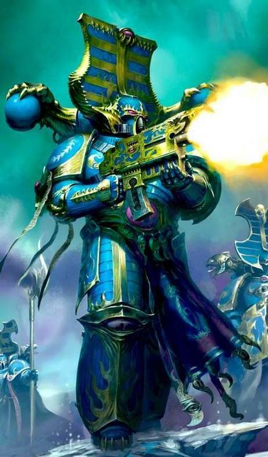

<!-- A0549-B0247 -->

原译文

Post-Heresy Thousand Sons 叛乱后千子

**校订译文**

Post-Heresy Thousand Sons 叛乱后千子

<!-- /A0549-B0247 -->

<!-- A0549-B0248 -->
**英文原文**

During the Great Crusade and Horus Heresy, Veterans of the Thousand Sons wore the Achean Pattern MkIV Power Armour with distinctive helmets and shoulder pads. Achean Pattern Helmets and Shoulder Pads were a variant Mk IV ‘Maximus’ battle plate design of the Thousand Sons Legion during the Great Crusade and Horus Heresy. They were produced by the forges local to Prospero exclusively for this Legion and used often by Legion veterans.

<!-- /A0549-B0248 -->

<!-- A0549-B0249 -->

原译文

在大远征和荷鲁斯叛乱期间，千子的老兵穿着带有独特头盔和肩甲的亚该亚型Mk.IV动力盔甲。亚该亚型头盔和肩甲是大远征和荷鲁斯叛乱期间千子军团Mk.IV“马克西姆斯”战斗盔甲设计的变体。它们是由普罗斯佩罗当地的铸造厂专门为该军团生产的，经常被军团老兵使用。

**校订译文**

在大远征和荷鲁斯之乱期间，千子老兵常穿戴配有独特头盔和肩甲的亚该亚型 Mk.IV 动力盔甲。这些头盔和肩甲采用 Mk.IV“马克西姆斯”战斗盔甲的变体设计，由普罗斯佩罗当地的铸造厂专为千子军团生产。

<!-- /A0549-B0249 -->

<!-- A0549-B0250 -->
**英文原文**

Always a numerically small legion, the Thousand Sons rarely ever took to the field in great numbers. They would normally operate in small detachments, whose leader could effectively hold much more independent authority than officers in comparable positions in other Legions. With the events following the Heresy, this habit has become more pronounced. The Legion fleet was comprised of some 40 capital class vessels, and perhaps 120 smaller vessels of various classes at their disposal. The most potent of these was known as the Photep, the Thousand Sons Primarch’s flagship: a heavily modified Gloriana Class Vessel that was believed to have been augmented by a significant number of psychically augmented weapons and defenses of Magnus’ own unique design.

<!-- /A0549-B0250 -->

<!-- A0549-B0251 -->

原译文

千子军团一直是一个规模较小的军团，很少有大批人投入战场。他们通常以小分队的形式行动，其领导人可以有效地拥有比其他军团类似职位的军官更独立的权力。随着叛乱事件的发生，这种习惯变得更加明显。军团舰队由大约40艘主力级战舰组成，也许还有120艘不同级别的小型舰船可供使用。其中最强大的被称为万丈光芒号，千子原体的旗舰：一艘经过大幅改装的荣光女王级战舰，据信已经通过大量灵能增强武器和马格努斯自己独特设计的防御进行了增强。

**校订译文**

千子军团的规模一直较小，很少大举出战。他们通常以小型分遣队行动，指挥官享有的独立指挥权远大于其他军团中同级军官。叛乱后的种种变故又强化了这一习惯。军团舰队拥有约 40 艘主力舰，以及可能多达 120 艘各型小型舰船。其中最强大的是原体旗舰万丈光芒号：一艘经过大幅改装的荣光女王级战舰。据信，马格努斯为它亲自设计了大量以灵能强化的武器和防御系统。

<!-- /A0549-B0251 -->

<!-- A0549-B0252 -->
**英文原文**

Before the Heresy, the Thousand Sons operated several Fellowships roughly equivalent to Companies. While there were originally ten, after the events in the Kamenka Troika the legion was reorganised into nine Fellowships. Each Fellowship was led by a powerful Psyker. Spread out among these Fellowships were several Cults that specialised in different Psychic disciplines.

<!-- /A0549-B0252 -->

<!-- A0549-B0253 -->

原译文

在叛乱之前，千子会经营着几个与连队大致相当的学会。虽然最初有十个，但在卡缅卡三巨头事件后，军团被重组为九个学会。每个学会都由一位强大的灵能者领导。在这些学会中分布着几个专门从事不同灵能学派的学派。

**校订译文**

叛乱前，千子下辖若干大致相当于连队的学会。学会最初共有十个，卡缅卡三巨头事件后重组为九个，各由一位强大的灵能者领导。与此同时，专精不同灵能领域的多个学派横跨这些学会。

**校注：** 本篇前文将 Fellowship 比作 Chapter，此段却写 roughly equivalent to Companies。两处比喻编制不一致，按各段英文保留，未强行统一；后列每学会约数千人也不宜直接等同常规百人连。

<!-- /A0549-B0253 -->

<!-- A0549-B0254 -->
**英文原文**

The Thousand Sons by the Battle of Prospero consisted of roughly 89,000-90,000 Space Marines, with approximately 62,000 legionaries present on Prospero with representatives from all of the nine Fellowships, as well as the commanders of all except the Fourth Fellowship:

<!-- /A0549-B0254 -->

<!-- A0549-B0255 -->

原译文

普罗斯佩罗之战中的千子由大约89000-90000名星际战士组成，大约62000名军团士兵与来自所有九个学会的代表以及除第四学会外的所有学会的指挥官一起出席了普罗斯佩罗：

**校订译文**

普罗斯佩罗之战时，千子军团总兵力约为 89,000—90,000 名星际战士，其中约 62,000 人在普罗斯佩罗。驻留人员来自全部九个学会，除第四学会外，其余学会的指挥官也都在场：

<!-- /A0549-B0255 -->

<!-- A0549-B0256 -->
**英文原文**

First Fellowship — 9,000 legionaries, comprised at the time the majority of the Thousand Sons Terminator units and at full strength.

<!-- /A0549-B0256 -->

<!-- A0549-B0257 -->

原译文

第一学会 — 9000名军团士兵，当时是千子终结者部队的大多数，兵力充足。

**校订译文**

第一学会——9,000 名军团战士，当时处于满编状态，集中了千子军团的大多数终结者部队。

<!-- /A0549-B0257 -->

<!-- A0549-B0258 -->
**英文原文**

Second Fellowship — 7,800 legionaries, comprised of a mix of unit types divided along Cult and Order lines.

<!-- /A0549-B0258 -->

<!-- A0549-B0259 -->

原译文

第二学会 — 7800名军团士兵，由按学派和教团划分的部队类型组成。

**校订译文**

第二学会——7,800 名军团战士，由多种类型的部队混编，依照学派和教团归属划分。

<!-- /A0549-B0259 -->

<!-- A0549-B0260 -->
**英文原文**

Third Fellowship — 8,200 legionaries, near at full strength at the time.

<!-- /A0549-B0260 -->

<!-- A0549-B0261 -->

原译文

第三学会 — 8200名军团士兵，当时已接近满员。

**校订译文**

第三学会——8,200 名军团战士，当时接近满编。

<!-- /A0549-B0261 -->

<!-- A0549-B0262 -->
**英文原文**

Fourth Fellowship — A small honor guard of 200 legionaries was present at the Burning of Prospero while 5,000 legionaries were on campaign.

<!-- /A0549-B0262 -->

<!-- A0549-B0263 -->

原译文

第四学会 — 一支由200名军团士兵组成的小型荣誉卫队出席了普罗斯佩罗之焚，而5000名军团士兵正在参加战役。

**校订译文**

第四学会——普罗斯佩罗焚毁时，仅有一支 200 人的小型荣誉卫队在场，另有 5,000 名军团战士在外征战。

<!-- /A0549-B0263 -->

<!-- A0549-B0264 -->
**英文原文**

Fifth Fellowship — 6,200 legionaries, reduced in strength after recent campaigns and with some companies operating on campaign at the time.

<!-- /A0549-B0264 -->

<!-- A0549-B0265 -->

原译文

第五学会 — 6200名军团士兵，在最近的战役后兵力有所减少，当时一些连队正在进行战役。

**校订译文**

第五学会——6,200 名军团战士。近期战役造成了一定减员，部分连队当时仍在外作战。

<!-- /A0549-B0265 -->

<!-- A0549-B0266 -->
**英文原文**

Sixth Fellowship — 4,000 legionaries, a full half of the fellowship was deployed to the sectors around Zhao-Arkhad in the galactic south.

<!-- /A0549-B0266 -->

<!-- A0549-B0267 -->

原译文

第六学会 - 4000名军团士兵，整整一半的学会被部署到银河系南部的赵-阿卡达周围地区。

**校订译文**

第六学会——4,000 名军团战士；该学会有整整一半兵力部署在银河系南部、赵-阿卡达周边的星区。

**校注：** 英文未明确所列 4,000 人是总额还是在普罗斯佩罗的兵力；结合清单语境保留原数字与“一半部署外地”的说法，不据此另算全学会总额。

<!-- /A0549-B0267 -->

<!-- A0549-B0268 -->
**英文原文**

Seventh Fellowship — 7,200 legionaries, reduced in strength after recent campaigns and with some companies operating on campaign at the time.

<!-- /A0549-B0268 -->

<!-- A0549-B0269 -->

原译文

第七学会 — 7200名军团士兵，在最近的战役后人数减少，当时一些连队正在战役。

**校订译文**

第七学会——7,200 名军团战士。近期战役造成了一定减员，部分连队当时仍在外作战。

<!-- /A0549-B0269 -->

<!-- A0549-B0270 -->
**英文原文**

Eighth Fellowship — 8,400 legionaries, reinforced from recent campaigns to near full strength at the time.

<!-- /A0549-B0270 -->

<!-- A0549-B0271 -->

原译文

第八学会 — 8400名军团士兵，从最近的战役中加强到当时几乎满员。

**校订译文**

第八学会——8,400 名军团战士。在近期战役后获得补充，当时已接近满编。

<!-- /A0549-B0271 -->

<!-- A0549-B0272 -->
**英文原文**

Ninth Fellowship — 7,900 legionaries, reduced in strength at the time after recent campaigns and with some companies operating on other warzones.

<!-- /A0549-B0272 -->

<!-- A0549-B0273 -->

原译文

第九学会 — 7900名军团士兵，在最近的战役后，人数有所减少，一些连队在其他战区开展战役。

**校订译文**

第九学会——7,900 名军团战士。近期战役造成了一定减员，部分连队正在其他战区作战。

<!-- /A0549-B0273 -->

<!-- A0549-B0274 -->
**英文原文**

In addition to the Fellowships three Red Orders were also fielded by the Legion before the Heresy. These Orders were more devoted to military matters rather than psychic craft or knowledge. The three orders were the Order of Ruin, known as the Unmakers, which specialised in siegecraft and logistics. The second was the Order of the Jackal, known as the Measure of Life and Death, which operated the Legion's Dreadnoughts and Khenetai Occult. The third was the Order of Blindness, known as the Hidden Ones, which fell under the command of Amon and operated the Hidden Ones and Ammitara Occult of the Legion.

<!-- /A0549-B0274 -->

<!-- A0549-B0275 -->

原译文

除了学会外，在叛乱之前，军团还派出了三个红色教团。这些教团更致力于军事事务，而不是灵能技能或知识。这三个修会是毁灭教团，被称为抹除者，专门从事攻城和物流。第二个是豺狼教团，被称为生死衡量，负责管理军团的无畏和肯特泰密会。第三个是盲目教团，被称为隐藏者，由阿蒙指挥，运行着军团的隐藏者和阿米塔拉密会。

**校订译文**

叛乱前，军团除各学会外，还设有三个红色教团。它们专注于军事事务，而非灵能技艺或知识研究。毁灭教团又称“抹除者”，擅长攻城和后勤；豺狼教团又称“生死衡量”，统辖军团的无畏和肯特泰密会；盲目教团又称“隐者”，由阿蒙指挥，统辖军团的隐者和阿米塔拉密会。

**校注：** Unmakers 是毁灭教团的别称，沿稿“抹除者”；与 The Redacted 战帮不是同一组织。Hidden Ones 沿本书“隐者”，此段既用作教团别称，也指其下辖人员。

<!-- /A0549-B0275 -->

<!-- A0549-B0276 -->
### The Cults of the Thousand Sons 千子的学派

<!-- /A0549-B0276 -->

<!-- A0549-B0277 -->
**英文原文**

Every legion venerated their primarch in some regard, but to the Thousand Sons Magnus was their literal saviour. With his arrival they were not only (apparently) saved from the horrors of physical degradation but also presented with the person who could teach them how to master their developing psychic abilities. Drawing from his experiences on Prospero, Magnus instituted his Cult system within his legion, five teaching institutions that would allow his warrior-scholars to expand their knowledge, principally from him, at his position as master of all the cults; the rank of Magus. From this position atop a pyramidal teaching structure, Magnus was able to direct and control his legion's psychic and philosophical development; as the most knowledgeable, powerful and as their genetic forefather and saviour, all Thousand Sons looked to him for example and guidance.

<!-- /A0549-B0277 -->

<!-- A0549-B0278 -->

原译文

每个军团在某些方面都尊敬他们的原体，但对于千子军团来说，马格努斯是他们真正的救世主。随着他的到来，他们不仅（显然）从身体退化的恐怖中获救，而且还遇到了可以教他们如何掌握自己发展中的灵能能力的人。根据他在普罗斯佩罗的经历，马格努斯在他的军团中建立了他的学派体系，这五个教学机构将允许他的战士学者在他作为所有学派之主的职位上扩展他们的知识，主要是从他那里；魔术师的等级。在金字塔形教学结构的顶端，马格努斯能够指导和控制他的军团的灵能和哲学发展；作为最有知识、最强大的人，作为他们的祖先和救世主，所有千子都以他为榜样和指导。

**校订译文**

每个军团都以各自的方式尊崇原体，而对千子而言，马格努斯确实是救命恩人。他的到来不仅让他们从肉体退化的恐怖中获救——至少表面上如此——还带来了一位能够教他们掌握日益增长的灵能力量的导师。马格努斯依据在普罗斯佩罗的经验，在军团内设立了五个学派，供这些战士学者增进知识。他本人以“法师”（Magus）的职衔统领全部学派，也是最主要的授业者。身居这一金字塔式教学体系的顶端，他得以引导并掌控军团在灵能和哲学方面的发展。作为最博学、最强大的人，同时也是全体千子的基因之父和救主，他是所有人效法并寻求指引的对象。

**校注：** Magus 此处指马格努斯统领诸学派的职衔，暂译“法师”（原译“魔术师”）；与基因窃取者单位 Magus 的官方译名“占星师”、本篇 Magister“魔导师”分别登记。apparently 意为“表面上”，并非断言血肉异变已经彻底消除。

<!-- /A0549-B0278 -->

<!-- A0549-B0279 图片 -->
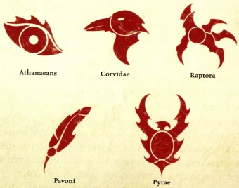

<!-- A0549-B0280 -->

原译文

Cult icons of the Thousand Sons 千子学派图标

**校订译文**

Cult icons of the Thousand Sons 千子学派图标

<!-- /A0549-B0280 -->

<!-- A0549-B0281 -->
**英文原文**

All members of the legion were cult members and outside their military rankings, would most likely associate with their fellow cult members in their own headquarters pyramids in Tizca. These cults, in tandem with Magnus' more direct teachings (like the invention of the Enumerations), promulgated the methods of control the Thousand Sons developed over their powers and came to be an essential factor of the Marines' existence.

<!-- /A0549-B0281 -->

<!-- A0549-B0282 -->

原译文

军团的所有成员都是学派成员，在他们的军事等级之外，他们很可能会在提兹卡总部金字塔里与学派成员交往。这些学派与马格努斯更直接的教义（如心境的发明）相结合，颁布了千子对其力量控制的方法，并成为星际战士生存的重要因素。

**校订译文**

每一名军团成员都隶属于某个学派。在军事等级体系之外，他们通常会在提兹卡各自学派的金字塔总部中与同门往来。各学派与马格努斯的直接教导——例如他创立的“心境”修行法——共同传授千子掌控自身力量的方法，逐渐成为军团战士生活中不可或缺的一部分。

<!-- /A0549-B0282 -->

<!-- A0549-B0283 -->
### Post-Heresy 叛乱后

<!-- /A0549-B0283 -->

<!-- A0549-B0284 -->
**英文原文**

While Magnus himself remains the ruler of the Planet of the Sorcerers, for a time he was increasingly aloof with the affairs of the Materium and is spending much of his attention waging the Great Game of the Ruinous Powers. Thus since the events of the Heresy the Thousand Sons largely operated as independent warbands under the control of Sorcerers. However this all changed around the time of the Thirteenth Black Crusade when Magnus reasserted his rule over the Legion, reconciling and reforming it.

<!-- /A0549-B0284 -->

<!-- A0549-B0285 -->

原译文

虽然马格努斯本人仍然是巫师星的统治者，但有一段时间，他对物质世界的事务越来越疏远，并将大部分注意力花在了发动毁灭之力的伟大游戏上。因此，自叛乱事件以来，千子在很大程度上是在巫师的控制下作为独立的战帮运作的。然而，这一切都在第十三次黑色远征前后发生了变化，当时马格努斯重申了他对军团的统治，并对其进行了调和和改革。

**校订译文**

马格努斯始终统治着巫师星，但有一段时间，他日益疏离物质宇宙的事务，将大部分精力投入毁灭诸力的伟大游戏。因此，叛乱后的千子大多分散为巫师统领的独立战帮。第十三次黑色远征前后，情况发生了变化：马格努斯重新确立对军团的统治，调解内部分歧，并将军团重组。

<!-- /A0549-B0285 -->

<!-- A0549-B0286 图片 -->
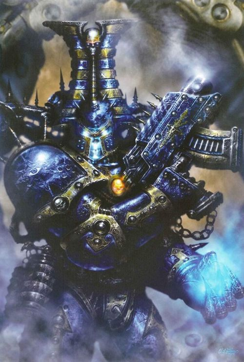

<!-- A0549-B0287 -->

原译文

Rubric Marine 红字战士

**校订译文**

Rubric Marine 红字战士

<!-- /A0549-B0287 -->

<!-- A0549-B0288 -->
**英文原文**

The modern Thousand Sons are built around Nine Cults, each of which is overseen by a member of the Rehati, a coven of nine Exalted Sorcerers and Daemon Princes favored by Tzeentch that hold the rank of Magister Templi. The nine cults are currently:

<!-- /A0549-B0288 -->

<!-- A0549-B0289 -->

原译文

现在的千子是围绕九个学派建立的，每个学派都由静修者的一名成员监督，静修者是一个由九位至尊巫师和恶魔王子组成的小团体，受到奸奇的青睐，拥有圣堂讲师的军衔。目前有九个学派：

**校订译文**

如今的千子以九大学派为核心，每个学派都由一名静修者成员掌管。静修者是由九位受奸奇青睐的高阶巫师和恶魔亲王组成的密会，其成员拥有“圣堂讲师”（Magister Templi）的职衔。目前九大学派如下：

<!-- /A0549-B0289 -->

<!-- A0549-B0290 -->
**英文原文**

The Cult of Change — The great unravellers, launching their armies wherever order, civilisation, and reason exist. They seek to impose their will in areas where anarchy exists.

<!-- /A0549-B0290 -->

<!-- A0549-B0291 -->

原译文

变化学派 — 大崩溃者，在秩序、文明和理性存在的地方发动军队。他们试图在存在无政府状态的地区强加自己的意志。

**校订译文**

变化学派——他们善于瓦解一切，凡有秩序、文明和理性之处，便会派军进攻；而在陷入无政府状态的地区，他们又力图推行自己的意志。

<!-- /A0549-B0291 -->

<!-- A0549-B0292 -->
**英文原文**

The Cult of Duplicity — Unique in that they both are and are not unified by a desire. Its Sorcerers are deceivers and it is unknown if they are acting independently or as part of a singular unifying plan.

<!-- /A0549-B0292 -->

<!-- A0549-B0293 -->

原译文

二重学派 — 独特之处在于它们都是欲望统一的，也不是欲望统一的。它的巫师是骗子，不知道他们是独立行动还是作为单一统一计划的一部分。

**校订译文**

二重学派——其独特之处在于：成员仿佛由共同的欲望联结，却又并非如此。这里的巫师都是欺诈者，无人知道他们究竟各行其是，还是在执行同一项总体计划。

**校注：** Duplicity 有欺诈、两面性之意；沿现稿学派名“二重学派”，以正文明确其欺诈属性，暂待官方译名核对。

<!-- /A0549-B0293 -->

<!-- A0549-B0294 -->
**英文原文**

The Cult of Knowledge — Seeks to uncover hidden knowledge particularly tomes of eldritch learnings, dark secrets, and paradoxical logic.

<!-- /A0549-B0294 -->

<!-- A0549-B0295 -->

原译文

知识学派 — 寻求发现隐藏的知识，尤其是深奥的学问、黑暗的秘密和矛盾的逻辑。

**校订译文**

知识学派——追寻隐秘知识，尤其是记载诡秘学问、黑暗秘密和悖论逻辑的典籍。

<!-- /A0549-B0295 -->

<!-- A0549-B0296 -->
**英文原文**

The Cult of Magic — Embraces pure sorcery and seek to obtain arcane objects across the Galaxy.

<!-- /A0549-B0296 -->

<!-- A0549-B0297 -->

原译文

魔法学派 — 拥抱纯粹的魔法，寻求在银河系中获得奥术物品。

**校订译文**

魔法学派——崇尚纯粹巫术，在银河各地搜求奥秘之物。

<!-- /A0549-B0297 -->

<!-- A0549-B0298 -->
**英文原文**

The Cult of Manipulation — Operating vast networks of spies, they oversee acts of mass manipulation to destabilise worlds and sway their enemies.

<!-- /A0549-B0298 -->

<!-- A0549-B0299 -->

原译文

操纵学派 — 他们操纵着庞大的间谍网络，监督大规模操纵行为，破坏世界稳定，动摇敌人。

**校订译文**

操纵学派——经营庞大的间谍网络，组织大规模操控行动，破坏各个世界的稳定，并影响敌人的行动。

<!-- /A0549-B0299 -->

<!-- A0549-B0300 -->
**英文原文**

The Cult of Mutation — Embrace the warping of flesh and transforming planets into Daemon Worlds

<!-- /A0549-B0300 -->

<!-- A0549-B0301 -->

原译文

突变学派 — 拥抱肉体的扭曲，将行星变成恶魔世界

**校订译文**

突变学派——热衷于扭曲血肉，将行星转化为恶魔世界。

<!-- /A0549-B0301 -->

<!-- A0549-B0302 -->
**英文原文**

The Cult of Prophecy — Prophets and soothsayers

<!-- /A0549-B0302 -->

<!-- A0549-B0303 -->

原译文

预言学派 — 先知和预言家

**校订译文**

预言学派——由先知和占卜者组成。

<!-- /A0549-B0303 -->

<!-- A0549-B0304 -->
**英文原文**

The Cult of Scheming — Consists of master planners. Every action taken by this cult is a perfectly planned manoeuvre leading to a unseen master stroke.

<!-- /A0549-B0304 -->

<!-- A0549-B0305 -->

原译文

阴谋学派 — 由规划大师组成。这个学派组织采取的每一个行动都是一个精心策划的策略，导致看不见的大师打击。

**校订译文**

阴谋学派——由谋划大师组成。每一步行动都经过周密设计，最终指向尚未显露的决定性一击。

<!-- /A0549-B0305 -->

<!-- A0549-B0306 -->
**英文原文**

The Cult of Time — They view the flow of time as an unwrought resource that can be shaped into a weapon. By their victories, ripples are sent both forwards and backwards in time, so that their enemies may be defeated before they are even engaged.

<!-- /A0549-B0306 -->

<!-- A0549-B0307 -->

原译文

时间学派 — 他们认为时间的流动是一种未铸造的资源，可以被塑造成武器。通过他们的胜利，涟漪在时间上向前和向后传播，这样他们的敌人甚至可以在交战前被击败。

**校订译文**

时间学派——他们将时间之流视为尚待加工的资源，可以将其塑造成武器。他们的胜利会在时间中激起同时向过去与未来扩散的涟漪，使敌人在交战之前便已落败。

<!-- /A0549-B0307 -->

<!-- A0549-B0308 -->
**英文原文**

Each Cult in turn is divided into nine Sects commanded by lesser Sorcerers and Daemon Princes. These in turn are divided into Thrallbands, which make up the basic fighting units of the Thousand Sons.

<!-- /A0549-B0308 -->

<!-- A0549-B0309 -->

原译文

每个学派又分为九个教派，由较小的巫师和恶魔王子指挥。这些又分为束缚小队，组成了千子的基本战斗单位。

**校订译文**

每个学派又分为九个教派，由级别较低的巫师和恶魔亲王指挥。教派进一步划分为束缚小队，构成千子的基本作战单位。

<!-- /A0549-B0309 -->

<!-- A0549-B0310 -->
**英文原文**

At the core of the war assemblies of the Thousand Sons are the thrallbands. These primarily consist of a champion known as a Magister and up to nine thralls, each a lesser Sorcerer-champion of Tzeentch. This cabalistic gathering usually manifests as an Exalted Sorcerer and nine Aspiring Sorcerers – or Scarab Occult Sorcerers – who lead the Rubric Marines and Scarab Occult Terminators into battle. In the rarest thrallbands, the thralls might instead be powerful Sorcerers or Exalted Sorcerers themselves. The Exalted Sorcerers and Daemon Princes who rule the Silver Towers each command many of these thrallbands, which may be gathered together into hundreds-strong task forces called Exalted Thrallbands. Their followers comprise the raiding forces through which Tzeentch enacts some of his most violent schemes upon the Galaxy. While the warbands of Tzeentch’s champions manifest in countless ways, the sorcerous thrallbands of the Thousand Sons are the most favoured by the Changer of the Ways. Each thrallband is bolstered by the mutated warrior auxiliaries of the Planet of the Sorcerers, or by Chaos Cultist forces drawn from the Imperium. In addition, the Legion maintains a small number of tanks and Daemon Engines. Some Space Marine equipment is captured during their raids, but as very few of these weapons or vehicles are properly maintained, they rarely last for long and so are never numerous.

<!-- /A0549-B0310 -->

<!-- A0549-B0311 -->

原译文

千子战争集会的核心是被束缚小队。这些主要由一名被称为魔导师的冠军和最多九名奴仆组成，每个奴仆都是奸奇的低级巫师冠军。这个密会的聚会通常表现为一位至尊巫师和九位巫师学徒，或圣甲虫密会巫师，他们带领红字战士和圣甲虫密会终结者投入战斗。在最稀有的束缚小队中，奴仆可能是强大的巫师或至尊巫师。统治银塔的至尊巫师和恶魔王子各自指挥着许多这些束缚小队，这些追随者可以聚集在一起，组成数百支强大的特遣部队，称为至尊束缚小队。他们的追随者组成了突袭部队，奸奇通过这些部队对银河系实施了一些最暴力的计划。虽然奸奇的战士们以无数种方式表现出来，但千子的巫师束缚小队最受万变之主的青睐。每个束缚小队都得到了巫师星上变异的战士辅助军的支持，或者来自帝国的混沌邪教徒的支持。此外，军团还维护着少量的坦克和恶魔引擎。一些星际战士装备在突袭中被缴获，但由于这些武器或载具很少得到适当的维护，它们很少能持续很长时间，因此数量也很少。

**校订译文**

束缚小队是千子作战编组的核心，通常由一名职称为“魔导师”（Magister）的勇士和最多九名奴仆组成；每名奴仆都是级别较低的奸奇巫师勇士。这一秘术团体通常由一位高阶巫师带领九位巫师学徒或圣甲虫密会巫师，率领红字战士和圣甲虫终结者投入战斗。在极少数束缚小队中，奴仆本身也可能是强大的巫师，乃至高阶巫师。统治银塔的高阶巫师和恶魔亲王各自掌握许多束缚小队，必要时将其集结为数百人规模的特遣部队，称为“至尊束缚小队”。这些追随者组成突袭大军，为奸奇在银河中推行某些最血腥的阴谋。奸奇勇士统领的战帮形形色色，而千子的巫术束缚小队尤其受到万变之主的青睐。每个小队都有巫师星上的突变战士辅助部队，或从帝国招募的混沌教徒增援。此外，军团还保有少量坦克和恶魔引擎。他们会在劫掠中缴获星际战士装备，但这些武器和载具极少得到妥善维护，通常无法长期使用，因此数量始终不多。

**校注：** hundreds-strong task forces 指数百人规模的特遣部队，原译“数百支”误将人数变成部队数量。

<!-- /A0549-B0311 -->

<!-- A0549-B0312 图片 -->
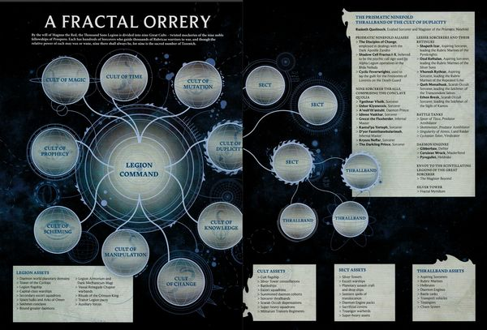

<!-- A0549-B0313 -->

原译文

Modern Thousand Sons organization 现千子组织

**校订译文**

Modern Thousand Sons organization 现代千子组织结构

<!-- /A0549-B0313 -->

<!-- A0549-B0314 -->
## Strategy and Tactics 战略与战术

<!-- /A0549-B0314 -->

<!-- A0549-B0315 -->
### Pre-Heresy 叛乱前

<!-- /A0549-B0315 -->

<!-- A0549-B0316 -->
**英文原文**

Before the Burning of Prospero, the Thousand Sons were a small but formidable Legion of warrior-scholars. Unlike more martial Legions, the Thousand Sons sought not to simply conquer worlds but rather to transform them into the enlightened vision of the Imperial Truth. Wherever they went, they culled lore with an insatiable hunger and sought to learn everything they could about the history of the Galaxy. Many worlds were conquered and studied by the Thousand Sons in this manner, while worlds already taken by the Great Crusade were similarly visited by Legion expeditions in search of new lore. It is said that Magnus himself, accompanied by Perturabo, personally journeyed into the depths of Terra in order to learn the secrets of its ancient history. Sometimes campaigns fought by the Thousand Sons made little strategic sense, and they would often leave a conflict or join another seemingly at random, drawing criticism and hostility from other Imperial forces.

<!-- /A0549-B0316 -->

<!-- A0549-B0317 -->

原译文

在普罗斯佩罗之焚之前，千子军团是一个规模虽小但强大的战士学者军团。与更多的军事军团不同，千子不仅试图征服世界，而且试图将它们转化为帝国真理的开明愿景。无论他们走到哪里，他们都会带着永不满足的渴望挑选知识，并试图尽可能地了解银河系的历史。千子以这种方式征服和研究了许多世界，而军团考察队也以类似的方式访问了大远征已经占领的世界，以寻找新的知识。据说，马格努斯本人在佩图拉博的陪同下，亲自前往泰拉深处，以了解其古代历史的秘密。有时，千子的战役的战略意义不大，他们经常会留下冲突，或者看似随意地加入另一场冲突，招致其他帝国军队的批评和敌意。

**校订译文**

普罗斯佩罗焚毁前，千子是一个规模不大却实力强悍的战士学者军团。与更崇尚武力的军团相比，他们不满足于单纯征服世界，还希望依照帝国真理描绘的开明愿景改造这些世界。他们无论走到哪里，都如饥似渴地搜集知识，竭力了解银河的历史。许多世界就这样被千子征服并研究；对于已被大远征征服的世界，军团同样会派出考察队，搜求未知的学问。据说，马格努斯曾由佩图拉博陪同，亲自深入泰拉地下，探寻其远古历史的秘密。千子的某些战役在战略上似乎毫无道理：他们时常看似随意地退出一场战争，又加入另一场，因此招致其他帝国部队的批评和敌意。

<!-- /A0549-B0317 -->

<!-- A0549-B0318 -->
**英文原文**

At a base tactical level, the Thousand Sons resembled those of their brother Legions. These included units of armored Space Marines support by heavy weapons, Sky Hunters squadrons, armored vehicles, and aircraft. While known for their extensive use of Librarians, the Thousand Sons still waged war in a conventional manner and were known for there preference for mechanized infantry and Tactical Squads. The Legion made heavy use of Land Speeders, Jetbikes, and aircraft to support these mobile units. The Legion also was known for its reconnaissance capabilities, and this combined with their psychic abilities allowed them to rapidly overrun heavily fortified or armored enemies without the heavy weapons and vehicles seen in other Legions. Unlike other Legions such as the Iron Warriors or Death Guard, the Thousand Sons avoided attrition warfare and meat grinder assaults at all costs. Regardless of the prize at stake, they would never allow themselves to become encircled or undertake symbolic sacrificial actions.

<!-- /A0549-B0318 -->

<!-- A0549-B0319 -->

原译文

在基础战术层面上，千子与他们的兄弟军团相似。其中包括由重型武器、天空猎手中队、装甲载具和飞行器提供支援的星际战士装甲部队。虽然千子以广泛使用智库而闻名，但他们仍然以传统方式发动战争，并以偏爱机械化步兵和战术小队而闻名。军团大量使用兰德速攻艇、悬浮摩托和飞行器来支援这些机动部队。军团还以其侦察能力而闻名，这与他们的灵能能力相结合，使他们能够在没有其他军团所见的重型武器和载具的情况下，迅速击败重兵或装甲敌人。与钢铁勇士或死亡守卫等其他军团不同，千子军团不惜一切代价避免了消耗战和绞肉战。无论奖品如何，他们永远不会让自己被包围或采取象征性的牺牲行动。

**校订译文**

在基本战术层面，千子与兄弟军团并无太大差别：身披动力盔甲的星际战士由重武器、天空猎手中队、装甲载具和飞行器支援。尽管以广泛运用智库员闻名，他们依然采用常规作战方式，尤其偏好机械化步兵和战术小队，并大量使用兰德速攻艇、悬浮摩托和飞行器支援这些机动部队。军团的侦察能力同样出色；结合灵能，他们无需依赖其他军团惯用的大批重武器和载具，就能迅速突破坚固阵地或装甲部队。与钢铁勇士、死亡守卫等军团不同，千子竭力避免消耗战和绞肉机式强攻。无论目标多么重要，他们都不会容许自己陷入包围，也不会为象征性的意义作出牺牲。

<!-- /A0549-B0319 -->

<!-- A0549-B0320 -->
### Post-Heresy 叛乱后

<!-- /A0549-B0320 -->

<!-- A0549-B0321 -->
**英文原文**

Since their betrayal at Prospero, the Thousand Sons have been radically transformed and wage war in an entirely different manner. Where the Legion now walks, terrible Warp-based calamities and abnormalities follow. While still utilizing Rubric Marines and their support vehicles, the Thousand Sons now go to war alongside large numbers of Daemon Engines, Daemons, Chaos Spawns, and mortal followers in the form of Cultists, Mutants, and Tzaangor Beastmen. While individually they wage battles that seem random or simply to reap carnage upon their foes, in truth each is part of an intricate ploy that is in turn apart of a millennia-spanning stratagem. Each world they burn is but a single component in yet another unfathomable ritual.

<!-- /A0549-B0321 -->

<!-- A0549-B0322 -->

原译文

自从他们在普罗斯佩罗被背叛以来，千子已经发生了根本性的转变，并以一种完全不同的方式发动战争。在军团现在行走的地方，可怕的基于亚空间的灾难和异常随之而来。虽然仍在使用红字战士及其支援载具，但千子现在与大量的恶魔引擎、恶魔、混沌卵和以凡人信徒、变种人和奸角兽野兽人形式出现的凡人追随者一起作战。虽然他们各自发动看似随机的战斗，或者只是为了对敌人进行屠杀，但事实上，每一场战斗都是一个复杂策略的一部分，而这个策略又是千个战略的一部分。他们烧毁的每个世界都只是另一个深不可测的仪式中的一个组成部分。

**校订译文**

自普罗斯佩罗的背叛之后，千子发生了根本变化，作战方式也截然不同。军团所到之处，可怕的亚空间灾难与异常现象随之而来。他们仍然使用红字战士及其支援载具，同时也与大量恶魔引擎、恶魔、混沌魔物，以及教徒、突变者和奸角兽等凡人追随者并肩作战。单看每场战斗，似乎毫无章法，或只是为了屠戮敌人；实际上，每一战都是复杂计谋的一环，而这些计谋又服务于横跨数千年的总体布局。他们焚毁的每个世界，也只是另一场难以理解的仪式中的一部分。

**校注：** 本段称 large numbers of Daemon Engines，前文组织段则称 small number，可能出自不同版本或描述阶段；分别保留，未凭记忆统一数量。

<!-- /A0549-B0322 -->

<!-- A0549-B0323 -->
**英文原文**

One manner in which the Thousand Sons retain their old Legion culture is their philosophy on war, viewing it not as an end in and of itself in a way the likes of the World Eaters do. Instead, they see each campaign as a way to further their knowledge and eldritch power. In battle, they are able to use their sorcerous prophetic abilities to divine the currents of fast and identify moments of calamitous upheaval that can be wrought for the sake of their patron god Tzeentch. As part of these grand designs, the Thousand Sons utilize large numbers of arcane and forbidden technologies that would have previously been seen as taboo.

<!-- /A0549-B0323 -->

<!-- A0549-B0324 -->

原译文

千子保留其旧军团文化的一种方式是他们的战争哲学，他们认为战争本身并不像吞世者那样是一种目的。相反，他们认为每一场战役都是一种增进知识和力量的方式。在战斗中，他们能够利用他们的魔法预言能力来预测快速的潮流，并确定为了他们的守护神奸奇而可能造成的灾难性动荡的时刻。作为这些宏伟设计的一部分，千子使用了大量以前被视为禁忌的奥术和禁忌技术。

**校订译文**

千子仍保留着旧军团的一项传统：他们不像吞世者那样以战争本身为目的，而是将每场战役视为增进知识与秘术力量的途径。在战斗中，他们以巫术预见命运的流向，寻找能够为守护神奸奇制造灾难与剧变的时机。为了实现这些宏大计划，千子使用大量曾被视为禁忌的神秘技术。

**校注：** 英文 currents of fast 疑为 currents of fate 的笔误；结合预言能力及后文时机，中文按“命运的流向”修复，英文原样保留。

<!-- /A0549-B0324 -->

<!-- A0549-B0325 图片 -->
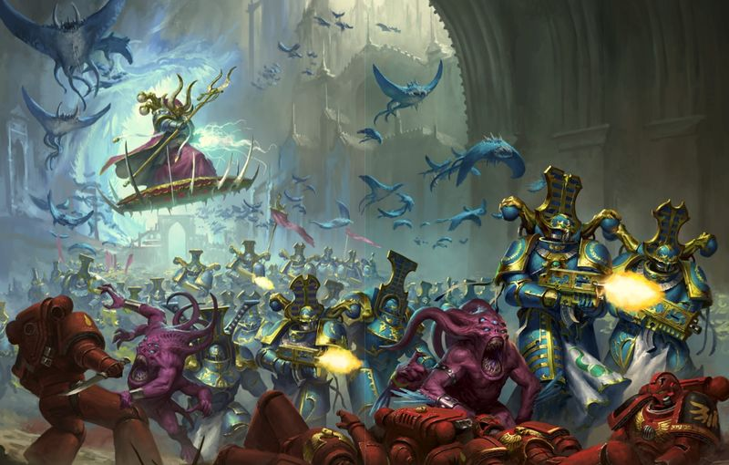

<!-- A0549-B0326 -->

原译文

The Post-Heresy Thousand Sons at war 叛乱后战争中的千子

**校订译文**

The Post-Heresy Thousand Sons at war 叛乱后战争中的千子

<!-- /A0549-B0326 -->

<!-- A0549-B0327 -->
**英文原文**

In their modern campaigns, the Thousand Sons conquer vast tracts of Realspace from which they draw the resources for their arcane war efforts. While any world may be a target, they often display a preference for worlds with ritual, arcane, or sorcerous significance. Once a world has been pacified, the Thousnad Sons get to work etching it with hexes and warp-based glyphs. These planets then serve as anchor points to which the Sorcerer Lords and Daemon Princes of the modern Thousand Sons tether their enormous system-spanning spells. The end-result of these rituals is often that entire regions of space are consumed by the Warp or give birth to vast armies of Daemons.

<!-- /A0549-B0327 -->

<!-- A0549-B0328 -->

原译文

在他们的现战役中，千子征服了广阔的现实空域，他们从中汲取资源进行神秘的战争。虽然任何世界都可能成为目标，但他们往往表现出对具有仪式、神秘或巫术意义的世界的偏好。一旦一个世界被征服，千子就可以用六边形和基于亚空间的字形来蚀刻它。然后，这些行星成为锚点，现千子的巫师领主和恶魔王子将他们巨大的跨越星系的咒语系在这些锚点上。这些仪式的最终结果往往是整个空域被亚空间消耗或产生庞大的恶魔军队。

**校订译文**

如今，千子在征战中征服广阔的现实宇宙疆土，从中获取支持秘术战争的资源。任何世界都可能成为目标，但他们尤其偏爱具有仪式、秘术或巫术意义的世界。征服一颗行星后，他们便在各处刻下咒符和亚空间符文，使其成为锚点。千子的巫师领主和恶魔亲王以这些行星为支点，维系横跨整个恒星系的巨大法术。这些仪式往往导致整片空域被亚空间吞噬，或催生出庞大的恶魔军队。

**校注：** hexes 在巫术语境中指咒符或诅咒，并非几何学的六边形。

<!-- /A0549-B0328 -->

<!-- A0549-B0329 -->
**英文原文**

On a tactical level, the Thousand Sons are extremely unpredictable and their battle style depends on what thrallbands or Cults are taking part. Some may utilize brute forces with direct assaults by their armies, while many more often prefer a more subtle and subversive approach through agents and proxies however willing or unwilling. While the Thousands Sons numbers remain small, Sorcerers can continually resurrect their Rubricae infantry to ensure they are able to still effectively wage war even ten millennia later.

<!-- /A0549-B0329 -->

<!-- A0549-B0330 -->

原译文

在战术层面上，千子是极其不可预测的，他们的战斗风格取决于什么束缚小队或学派参与。有些人可能会利用蛮力直接攻击他们的军队，而更多的人则更喜欢通过特工和代理人采取更微妙和颠覆性的方法，无论他们愿意还是不愿意。虽然千子的数量仍然很小，但巫师可以不断地复活他们的红字步兵，以确保他们即使在一万年后也能有效地发动战争。

**校订译文**

在战术层面，千子极难预测；具体作战风格取决于参战的束缚小队或学派。有些会驱使大军以蛮力正面进攻，更多则偏好隐秘的颠覆手段，利用自愿或被迫为其效力的密探和代理人。尽管千子人数始终不多，巫师却能不断复活麾下的红字步兵，使军团在一万年后依然能够有效作战。

<!-- /A0549-B0330 -->

<!-- A0549-B0331 -->
## Gene-seed 基因种子

<!-- /A0549-B0331 -->

<!-- A0549-B0332 -->
**英文原文**

Magnus was unquestionably the most profoundly mutated of the Emperor's Primarchs, both physically and psychically, and the Legion imprinted with his geneseed reflected that with a high percentage of Thousand Sons manifesting some level of psychic ability. Unfortunately the legacy of Magnus also brought with it a curse: a debilitating flaw in the geneseed known to the Thousand Sons as the Flesh Change (also Flesh change, Flesh-change), a degeneration—sometimes sudden and extreme—into mindless, mutated, monstrosities. The Flesh Change was not detected during the Legion's inception and early years on Terra and, indeed, did not manifest within the Thousand Sons until a little over 10 years into the Great Crusade, after a seeming mass-"awakening" of apparently dormant psychic abilities in the majority of the Legion. The Emperor, Malcador The Sigillite, and the Selenar gene-cult all expended much labour to isolate the flaw in the Thousand Sons' geneseed, but unfortunately Malcador and the Emperor concluded it was beyond their ability to cure, and it was hoped that reuniting the Legion with its Primarch would eliminate the flaw.

<!-- /A0549-B0332 -->

<!-- A0549-B0333 -->

原译文

毫无疑问，马格努斯在身体和灵能上都是帝皇的原体中最深刻的变异者，印有他的基因种子的军团反映出，千子中有很高比例的人表现出某种程度的灵能能力。不幸的是，马格努斯的遗产也带来了诅咒：千子们所知的基因种子中的一个令人衰弱的缺陷，即血肉转变（也称为血肉变化，血肉变异），一种退化 — 有时是突然的和极端的 — 变成了无脑的、变异的、怪物。血肉转变在军团成立期间和在泰拉的早期没有被发现，事实上，直到大远征10多年后，在军团大多数人似乎大规模“觉醒”了明显处于休眠状态的灵能能力之后，才在千子军团中显现出来。帝皇、掌印者马卡多和赛琳娜基因教派都花费了大量精力来隔离千子基因中的缺陷，但不幸的是，马卡多与帝皇得出结论，这是他们无法治愈的，希望将军团与其原体重新团结起来可以消除这一缺陷。

**校订译文**

无论肉体还是灵能，马格努斯无疑都是帝皇诸原体中变异最深者。继承他基因种子的军团也体现了这一点：很大比例的千子都具备不同程度的灵能。然而，他的遗产还带来了一种诅咒——基因种子中令身体衰败的缺陷，千子称之为“血肉异变”。患者会退化成失去理智的畸形怪物，发作有时突然且剧烈。在军团建立及早年驻留泰拉期间，这一缺陷并未被发现。大远征开始十余年后，军团多数成员原本似乎沉睡的灵能大规模“觉醒”，血肉异变才开始出现。帝皇、掌印者马卡多和赛琳娜基因教派为查明这一缺陷耗费了大量心力；但帝皇与马卡多最终认定，以他们的能力也无法治愈，只能寄望于军团与原体团聚后能消除这一缺陷。

**校注：** Flesh Change、Flesh change、Flesh-change 仅是英文大小写、连字符的写法差异，中文统一为“血肉异变”，不另造三个同义病名。

<!-- /A0549-B0333 -->

<!-- A0549-B0334 图片 -->
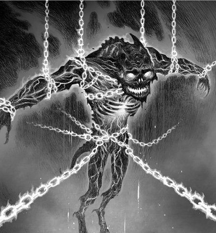

<!-- A0549-B0335 -->

原译文

victim of the Flesh-Change 血肉转变的受害者

**校订译文**

victim of the Flesh-Change 血肉异变的受害者

<!-- /A0549-B0335 -->

<!-- A0549-B0336 -->
**英文原文**

The exact cause of the Flesh Change, and what triggered its onset, was not known. Malcador The Sigilite initially believed it was due to an error in the XVth's "gene encoding", a belief he clung to for many years before he and the Emperor ultimately realised they could not cure the Thousand Sons. There may be a link with sustained, heavy, use of psychic powers, as the Thousand Sons fell en mass to the Flesh Change during the burning of Prospero, when the Thousand Sons desperately unleashed ever more powerful "sorceries" at the Space Wolves and Custodes of the Censure Host to try and defeat them. Another victim who fell under similar circumstances was Revuel Arvida, who continuously used his powers to assist the White Scars, during their campaigns against the Death Guard and other Traitor forces. However, this may simply be correlation and not causation, as Thousand Sons legionaries who completely lacked psychic ability were just as susceptible to the Flesh Change.

<!-- /A0549-B0336 -->

<!-- A0549-B0337 -->

原译文

血肉转变的确切原因以及引发其发生的原因尚不清楚。掌印者马卡多最初认为这是由于第十六军团的“基因编码”错误造成的，在他和帝皇最终意识到他们无法治愈千子之前，他坚持了多年。这可能与持续、大量使用灵能力量有关，因为千子在普罗斯佩罗之焚期间集体陷入了血肉转变，当时千子拼命地向太空野狼和惩戒天军的禁军释放了越来越强大的“魔法”，试图击败他们。另一位在类似情况下倒下的受害者是雷韦尔·阿维达，他在对抗死亡守卫和其他叛徒部队的战役中不断利用自己的力量协助白色伤疤。然而，这可能只是相关性，而不是因果关系，因为完全缺乏灵能能力的千子军团士兵同样容易受到血肉转变的影响。

**校订译文**

血肉异变的确切成因及诱发机制始终不明。掌印者马卡多最初认为，这是第十五军团的“基因编码”错误所致；他坚持这一判断多年，直到与帝皇一同承认无法治愈千子。血肉异变可能与持续、大量使用灵能有关：普罗斯佩罗焚毁期间，千子为了击退惩戒天军中的太空野狼和禁军，拼命释放越来越强大的“巫术”，随即大批发生异变。雷韦尔·阿维达也在类似情况下发病；当时他持续使用灵能，协助白疤对抗死亡守卫及其他叛军。然而，这也可能只有相关性而无因果关系，因为完全没有灵能的千子战士同样容易发生血肉异变。

**校注：** 英文 XVth 为第十五军团，原译第十六错误；此处保持原文对相关性与因果性的明确区分。

<!-- /A0549-B0337 -->

<!-- A0549-B0338 -->
**英文原文**

Before the discovery of Prospero, and the Legion's reunification with Magnus, the Thousand Sons had attempted to hold the Flesh Change at bay with retro-virals, alchemy, meditative techniques, and sheer willpower, but all of these techniques eventually failed in time. Legionaries who became aware of the onset of the condition—or who had to be subdued by their brother legionaries when the change was sudden and overwhelming - were put into stasis, in the hopes a future cure could be found.

<!-- /A0549-B0338 -->

<!-- A0549-B0339 -->

原译文

在普罗斯佩罗被发现以及军团与马格努斯联合之前，千子曾试图用古代病毒、炼金术、冥想技巧和纯粹的意志力来阻止血肉转变，但所有这些技巧最终都失败了。意识到病情发作的军团士兵 — 或者在变化突然和压倒性时不得不被他们的兄弟军团士兵制服的军团士兵 — 被置于停滞状态，希望能在未来找到治疗方法。

**校订译文**

在发现普罗斯佩罗、军团与马格努斯团聚之前，千子曾试图以逆转录病毒制剂、炼金术、冥想技巧和纯粹的意志力压制血肉异变，但这些方法最终都告失败。察觉病情开始发作的战士，以及因突然剧烈异变而被兄弟制服的战士，都会被置入静滞状态，等待未来找到治疗方法。

**校注：** retro-virals 此处指逆转录病毒制剂或相关处理，原译“古代病毒”误拆了词义。

<!-- /A0549-B0339 -->

<!-- A0549-B0340 -->
**英文原文**

When the Flesh Change was a gradual onset, afflicted Legionaries could feel their flesh rebelling beneath their skin, and their appearance often took on a pallid, waxy, look. When the change took over suddenly, the results were immediate and spectacular: the flesh and blood of the legionary was in complete flux, with power armour shattering and mutating flesh spewing out as the former Space Marine grew larger and monstrous. Phosis T'Kar's changing form at the Burning of Prospero grew to such proportions he dwarfed Constantin Valdor. In addition to the riot of change that wreaked havoc with their flesh when the condtion took over, in the overwhelming majority of cases when a legionary was lost to the Flesh Change, he devolved into a mindless monstrosity—an especially horrific fate for the Thousand Sons, who took pride in their learning and culture. When the Flesh Change struck the ranks of the Thousand Sons during the final stages of the Burning of Prospero, legionaries who succumbed to the Flesh Change attacked anything within reach, regardless of whether they were Space Wolves or Thousand Sons.

<!-- /A0549-B0340 -->

<!-- A0549-B0341 -->

原译文

当血肉转变逐渐开始时，受折磨的军团士兵可以感觉到他们的血肉在皮肤下反抗，他们的外表往往呈现出苍白、蜡质的外观。当这一变化突然接管时，结果是立竿见影的：军团士兵的血肉之躯完全处于变化之中，随着这位前星际战士变得越来越大、越来越可怕，动力盔甲破碎，不断变异的肉体喷涌而出。弗西斯·塔'卡在普罗斯佩罗之焚时的形态变化如此之大，以至于他让康斯坦丁·瓦尔多相形见绌。除了在条件接管时对他们的肉体造成严重破坏的转换暴乱外，在绝大多数情况下，当一名军团士兵输给血肉转变时，他变成了一个没有思维的怪物 — 这对以他们的学习和文化为荣的千子来说是一个特别可怕的命运。在普罗斯佩罗之焚的最后阶段，当血肉转变袭击了千子军团时，屈服于血肉转变的军团攻击了触手可及的任何东西，无论他们是太空野狼还是千子。

**校订译文**

当血肉异变缓慢发作时，患者能感到皮肤下的血肉正在反叛，外表往往变得苍白而蜡黄。若突然发作，变化则立刻显现，触目惊心：战士的血肉翻腾变形，动力盔甲崩裂，突变组织从中涌出，原本的星际战士膨胀成巨大的怪物。普罗斯佩罗焚毁时，弗西斯·塔'卡异变后的体型甚至令康斯坦丁·瓦尔多显得渺小。除了肉体遭受失控突变的摧残，绝大多数患者还会丧失理智，沦为怪物；对以学识和文化为荣的千子而言，这尤其可怖。普罗斯佩罗焚毁的最后阶段，大批千子发生血肉异变，袭击身边一切目标，无论对方是太空野狼还是千子同袍。

<!-- /A0549-B0341 -->

<!-- A0549-B0342 图片 -->
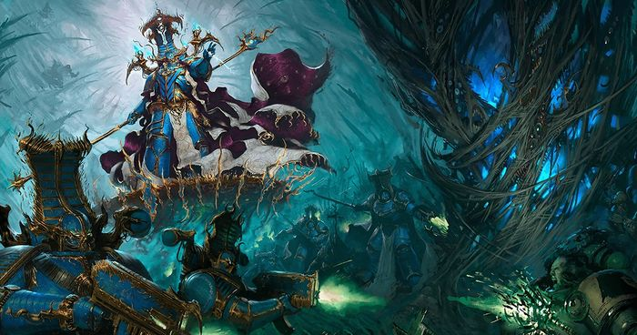

<!-- A0549-B0343 -->

原译文

The Thousand Sons battle the Space Wolves 千子与太空野狼战斗

**校订译文**

The Thousand Sons battle the Space Wolves 千子与太空野狼战斗

<!-- /A0549-B0343 -->

<!-- A0549-B0344 -->
**英文原文**

When Ahriman cast his infamous Rubric, the Thousand Sons were cured of the Flesh-change at a stroke, albeit with a heavy price paid - those Legionaries with little to no psychic ability were reduced to dust and sealed within their power armour, little more than automata, while those Thousand Sons with greater psychic ability had their power greatly amplified. It was noted by one of Ahriman's cabal, however, that while the Rubric cured the Legion of the Flesh Change, it did not grant immunity to mutation, as Thousand Sons (such as Ichneumon) who had pledged themselves to Tzeentch, often looked on the mutations granted by their patron god as a 'blessing'.

<!-- /A0549-B0344 -->

<!-- A0549-B0345 -->

原译文

当阿里曼施展他臭名昭著的红字法术时，千子一下子就治愈了血肉转变，尽管付出了沉重的代价 — 那些几乎没有灵能能力的军团士兵被化为尘埃，被密封在他们的动力盔甲里，只不过是自动机兵强一些，而那些灵能能力更强的千子则大大增强了他们的力量。然而，阿里曼的一个密会注意到，虽然红字法术治愈了军团的血肉转变，但它并没有对突变产生免疫力，因为曾向奸奇宣誓的千子（如伊希诺蒙）经常将他们的守护神授予的突变视为“赐福”。

**校订译文**

阿里曼施展臭名昭著的红字法术后，军团的血肉异变被一举治愈，代价却极其惨重：灵能微弱或全无灵能的战士化为尘埃，被封在动力盔甲中，几乎成了自动傀儡；灵能较强者的力量则大幅提升。不过，阿里曼密会中的一名成员指出，红字法术虽然消除了血肉异变，却没有让军团免疫一切突变。例如伊希诺蒙等向奸奇效忠的千子，往往仍将守护神赐下的突变视为“祝福”。

**校注：** little more than automata 描述心智沦为近乎自动傀儡，并非战力“比自动机兵强一些”；one of Ahriman’s cabal 是密会的一名成员。

<!-- /A0549-B0345 -->

<!-- A0549-B0346 -->
## Culture 文化

<!-- /A0549-B0346 -->

<!-- A0549-B0347 -->
**英文原文**

For the Thousand Sons, knowledge is power, and the most knowledgeable, the most powerful. Arising from the origins of their first recruits and being driven by the early legion's need to discover a cure for the flesh-change and gain deeper understanding and control of their psychic abilities, these linked beliefs resulted in two major cultural factors developing in the Thousand Sons; veneration of the text and veneration of their Primarch.

<!-- /A0549-B0347 -->

<!-- A0549-B0348 -->

原译文

对于千子来说，知识就是力量，最有知识的人，最有力量。这些相互关联的信仰源于他们第一批新兵的起源，并受到早期军团需要发现治疗血肉转变的方法并对他们的灵能能力有更深入的理解和控制的驱使，导致了千子军团发展出两个主要的文化因素；对文稿的崇拜和对他们的原体的崇拜。

**校订译文**

对千子而言，知识就是力量，最博学者也最强大。这一观念既源于首批新兵的文化背景，也受到早期军团现实需要的推动：他们必须寻找治愈血肉异变的方法，并更深入地理解、掌控灵能。由此逐渐形成两大文化支柱：尊崇典籍，以及尊崇原体。

<!-- /A0549-B0348 -->

<!-- A0549-B0349 -->
**英文原文**

As a result, the Thousand Sons, while sworn to the Emperor and the Imperium in word and duty, found that at the moment of testing, their loyalty to their primarch and their desire to preserve their acquired knowledge was enough to lead them down the path of damnation.

<!-- /A0549-B0349 -->

<!-- A0549-B0350 -->

原译文

因此，千子在宣誓效忠帝皇和帝国的同时，发现在考验的时刻，他们对原体的忠诚和保存所获知识的愿望足以让他们走上诅咒之路。

**校订译文**

因此，尽管千子在誓言和职责上效忠帝皇与帝国，真正的考验到来时，对原体的忠诚和保存所学知识的愿望，仍足以将他们引上毁灭之路。

<!-- /A0549-B0350 -->

<!-- A0549-B0351 -->
### The Pursuit of Knowledge 对知识的追求

<!-- /A0549-B0351 -->

<!-- A0549-B0352 -->
**英文原文**

The legion's desire to learn how to control their powers developed into a hunger for any and all knowledge. Driven from an origin of self-interest, their desire to know as much as possible and master every discipline available to learn caused them to seek shortcuts or explore morally perilous paths, especially once Magnus and his own insatiable hunger for knowledge encouraged them to progress from simple scholarship into the practice of sorcerous techniques. As a result, they have long held every record of information as a valuable item in itself, as well as a resource to be drained. Ahriman in particular has, since the Heresy, dedicated himself to this desire seemingly above loyalty to his primarch and even to Chaos itself.

<!-- /A0549-B0352 -->

<!-- A0549-B0353 -->

原译文

军团渴望学习如何控制自己的力量，这变成了对任何和所有知识的渴望。出于自身利益的驱使，他们渴望尽可能多地了解并掌握每一门可供学习的学科，这促使他们寻求捷径或探索道德上危险的道路，尤其是当马格努斯和他自己对知识的贪得无厌的渴望鼓励他们从简单的学术进步到巫术技术的实践时。因此，长期以来，他们一直将每一条信息记录本身视为有价值的物品，也是一种需要消耗的资源。自叛乱以来，阿里曼尤其致力于这种欲望，似乎高于对他的原体甚至混沌本身的忠诚。

**校订译文**

军团最初只想学会掌控自己的力量，后来却逐渐渴求一切知识。这种源于自身需求的求知欲，促使他们尽可能多地学习，掌握每一门可接触的学问；也使他们追逐捷径，探索道德上危险的道路。马格努斯同样永不满足的求知欲尤其助长了这一趋势，鼓励他们从单纯的学术研究走向巫术实践。因此，千子长期以来既将每份知识记录视为本身就值得珍藏的宝物，也将其视为必须充分汲取的资源。叛乱之后，阿里曼尤其执着于这一追求，甚至似乎将其置于对原体乃至混沌本身的忠诚之上。

<!-- /A0549-B0353 -->

<!-- A0549-B0354 -->
**英文原文**

While the Thousand Sons have an interest in all forms of knowledge, they particularly pursue items or places that may hold sorcerous power or reference arcane secrets. As a result, it is not unusual at all for a Thousand Sons warband to raid a museum, library or private art collection rather than a military target. And while many Legions sponsor Chaos-worshipping cults, the Thousand Sons tend to use theirs not to overthrow or destabilise Imperial power, but more rather as collectors of items and people they are interested in; much to the chagrin of cult leaders, as when a Thousand Sons warband finally answers a summons, they tend to simply leave with the cult's artefacts and best sorcerous practitioners not long after.

<!-- /A0549-B0354 -->

<!-- A0549-B0355 -->

原译文

虽然千子对各种形式的知识都感兴趣，但他们特别追求可能拥有魔法力量或涉及神秘秘密的物品或地点。因此，千子袭击博物馆、图书馆或私人艺术收藏而不是军事目标的情况并不罕见。虽然许多军团支持崇拜混沌的教派，但千子倾向于利用他们，不是推翻或破坏帝国权力，而是作为他们感兴趣的物品和人的收藏家；令教派领袖懊恼的是，当千子最终接到召唤时，他们往往会在不久后带着教派的造物和最好的巫师离开。

**校订译文**

千子对各种知识都感兴趣，尤其追寻可能蕴藏巫术力量或记载秘术的物品与地点。因此，千子战帮突袭博物馆、图书馆或私人艺术收藏，而非军事目标，并不稀奇。许多军团都会扶植崇拜混沌的教派，千子却往往不靠它们推翻或动摇帝国统治，而是让它们搜集自己感兴趣的物品和人才。令教派首领恼火的是，千子战帮好不容易响应召唤现身，往往不久便带着教派的宝物和最优秀的巫术修习者扬长而去。

<!-- /A0549-B0355 -->

<!-- A0549-B0356 -->
## Recruitment 招募

<!-- /A0549-B0356 -->

<!-- A0549-B0357 -->
**英文原文**

Like all of the Legiones Astartes the Thousand Sons were initially made up of Terran marines. In the aftermath of Magnus' deal with Tzeentch to save their lives, only around a thousand of them were left. For the rest of the Crusade, the Thousand Sons recruited from Prospero, a planet of only limited population (although many of them were psychically active). As a result the Thousand Sons were never a large legion.

<!-- /A0549-B0357 -->

<!-- A0549-B0358 -->

原译文

像所有的阿斯塔特军团一样，千子最初是由泰拉战士组成的。在马格努斯与奸奇达成协议以挽救他们的生命后，只剩下大约一千人。在大远征的剩余时间里，千子从人口有限的普罗斯佩罗行星招募了人员（尽管他们中的许多人在灵能上很活跃）。因此，千子军团从来不是一个庞大的军团。

**校订译文**

和所有阿斯塔特军团一样，千子最初由泰拉出身的战士组成。马格努斯与奸奇达成拯救他们性命的协议后，幸存者只剩约一千人。此后的大远征中，千子从普罗斯佩罗招募新兵。该星球人口有限，虽然其中许多人具有灵能，仍使千子始终难以发展成规模庞大的军团。

<!-- /A0549-B0358 -->

<!-- A0549-B0359 图片 -->
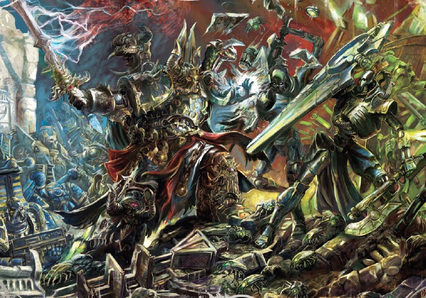

<!-- A0549-B0360 -->

原译文

The Thousand Sons battle Necrons 千子与死灵作战

**校订译文**

The Thousand Sons battle Necrons 千子与太空死灵作战

<!-- /A0549-B0360 -->

<!-- A0549-B0361 -->
**英文原文**

Currently, most of the Thousand Sons Sorcerers arise from the ranks of the Aspiring Sorcerers. These low mages are taken from the ranks of Tzeentchian cult psykers from different planets. They are taken to Tizca, where they conduct the complicated and most dangerous rituals to test their body and mind. Most are torn apart by the sudden influx of empyric energy or are driven mad; others die when their body begins to change, under the influence of ancient technologies and Warp influences. Those few who survive are born anew and become newly made Chaos Space Marines - Aspiring Sorcerers of the Thousand Sons.

<!-- /A0549-B0361 -->

<!-- A0549-B0362 -->

原译文

目前，千子巫师大多来自巫师学徒。这些低级法师来自不同行星的奸奇教派灵能者。他们被带到提兹卡，在那里他们进行复杂而最危险的仪式来测试他们的身心。大多数人被突然涌入的岩浆般能量撕裂或发疯；其他人在古代技术和亚空间的影响下，当他们的身体开始发生变化时就会死亡。那些幸存下来的少数人重生了，成为了新形成的混沌星际战士 — 千子的巫师学徒。

**校订译文**

如今，千子的巫师大多从巫师学徒中晋升而来。这些初阶术士原本是不同行星上奸奇教派中的灵能者，被带到提兹卡，接受复杂而极其危险的仪式，考验身心。多数人被骤然涌入的亚空间能量撕碎，或因此发疯；另一些则在古老技术和亚空间力量促使身体变化时死去。极少数幸存者由此脱胎换骨，成为新生的混沌星际战士——千子的巫师学徒。

**校注：** empyric energy 指亚空间能量，原译“岩浆般能量”无依据。

<!-- /A0549-B0362 -->

<!-- A0549-B0363 -->
**英文原文**

How the Thousand Sons currently maintain their numbers is unknown, although they have been observed carrying out an apparent resurrection ritual at least once. On this occasion the spirits of deceased Thousand Sons were summoned from the warp into mortal bodies (whether living or dead making no particular difference), bodies which then transformed themselves into reborn Thousand Sons.

<!-- /A0549-B0363 -->

<!-- A0549-B0364 -->

原译文

千子目前如何保持他们的数量尚不清楚，尽管有人观察到他们至少进行过一次明显的复活仪式。在这一次，死去的千子的精神被从亚空间召唤到凡人的身体中（无论是活着的还是死去的，都没有特别的区别），这些身体随后转化为重生的千子。

**校订译文**

千子如今如何维持兵力仍不完全清楚，不过至少有一次，人们观察到他们举行疑似复活仪式：死去千子的灵魂被从亚空间召回，注入凡人躯体。躯体原本是死是活似乎并无影响，随后都会转化为重获新生的千子。

**校注：** 本节既详细描述巫师新兵的形成，又称维持人数方式不明；属于原文信息范围或资料阶段不同，保留两种表述，不删去已知招募流程。

<!-- /A0549-B0364 -->

<!-- A0549-B0365 -->
**英文原文**

At least one Imperial commentator on the subject believes that the Thousand Sons have a cult network that provides potential recruits for the legion.

<!-- /A0549-B0365 -->

<!-- A0549-B0366 -->

原译文

至少有一位帝国评论员认为，千子军有一个教派网络，为军团提供了潜在的新兵。

**校订译文**

至少有一位研究此事的帝国论者认为，千子通过遍布各地的教派网络，为军团搜罗潜在新兵。

<!-- /A0549-B0366 -->

<!-- A0549-B0367 -->
## Noted Elements of the Thousand Sons 千子知名人物与单位

原题：Noted Elements of the Thousand Sons 千子著名成员

<!-- /A0549-B0367 -->

<!-- A0549-B0368 -->
### Thousand Sons Armoury 千子军械库

<!-- /A0549-B0368 -->

<!-- A0549-B0369 -->
### Artifacts 圣物与秘宝

原题：Artifacts 造物

<!-- /A0549-B0369 -->

<!-- A0549-B0370 -->

原译文

The Black Staff of Ahriman 阿里曼的黑杖

**校订译文**

The Black Staff of Ahriman 阿里曼的黑杖

<!-- /A0549-B0370 -->

<!-- A0549-B0371 -->

原译文

The Book of Magnus 马格努斯之书

**校订译文**

The Book of Magnus 马格努斯之书

<!-- /A0549-B0371 -->

<!-- A0549-B0372 -->

原译文

Seer Stones 先知之石

**校订译文**

Seer Stones 先知之石

<!-- /A0549-B0372 -->

<!-- A0549-B0373 -->

原译文

Blade of Magnus 马格努斯之刃

**校订译文**

Blade of Magnus 马格努斯之刃

<!-- /A0549-B0373 -->

<!-- A0549-B0374 -->

原译文

Crown of the Crimson King 深红之王之冠

**校订译文**

Crown of the Crimson King 深红之王之冠

<!-- /A0549-B0374 -->

<!-- A0549-B0375 -->

原译文

Coruscator 闪耀者

**校订译文**

Coruscator 闪耀者

<!-- /A0549-B0375 -->

<!-- A0549-B0376 -->

原译文

Helm of the Third Eye 三眼头盔

**校订译文**

Helm of the Third Eye 三眼头盔

<!-- /A0549-B0376 -->

<!-- A0549-B0377 -->

原译文

Astral Grimoire 星界魔法书

**校订译文**

Astral Grimoire 星界魔法书

<!-- /A0549-B0377 -->

<!-- A0549-B0378 -->
### Vessels 战舰

<!-- /A0549-B0378 -->

<!-- A0549-B0379 -->
**英文原文**

Photep — Battle Barge. Flagship (pre-Heresy)

<!-- /A0549-B0379 -->

<!-- A0549-B0380 -->

原译文

万丈光芒号 — 战斗驳船，旗舰（叛乱前）

**校订译文**

万丈光芒号——战斗驳船，叛乱前的旗舰。

**校注：** 正文舰队段称 Photep 为改装荣光女王级，此清单称 Battle Barge。两者可能分别是舰级与职能分类，按原文分别保留。

<!-- /A0549-B0380 -->

<!-- A0549-B0381 -->
**英文原文**

Tizca's Revenge — Current Flagship of Magnus the Red

<!-- /A0549-B0381 -->

<!-- A0549-B0382 -->

原译文

提兹卡的复仇 — 赤红之马格努斯目前的旗舰

**校订译文**

提兹卡的复仇号——红魔马格努斯现用的旗舰。

<!-- /A0549-B0382 -->

<!-- A0549-B0383 -->
**英文原文**

Hekaton - Current flagship of Azhek Ahriman and the Prodigal Sons.

<!-- /A0549-B0383 -->

<!-- A0549-B0384 -->

原译文

赫卡顿号 - 阿扎克·阿里曼和挥霍之子目前的旗舰

**校订译文**

赫卡顿号——阿扎克·阿里曼及浪子战帮现用的旗舰。

**校注：** 此行英文 Azhek 与正文及人物表 Ahzek 拼写不同；中文沿统一人名“阿扎克·阿里曼”，英文不改。

<!-- /A0549-B0384 -->

<!-- A0549-B0385 -->
### Known Vehicles 著名载具

<!-- /A0549-B0385 -->

<!-- A0549-B0386 -->
**英文原文**

Scarab Prime — Stormhawk Transporter

<!-- /A0549-B0386 -->

<!-- A0549-B0387 -->

原译文

圣甲虫之首 — 风暴鹰运输机

**校订译文**

圣甲虫之首——风暴鹰运输机。

**校注：** 原文明确写 Stormhawk Transporter，保留“运输机”；不得因现行官方 Stormhawk Interceptor“风暴鹰拦截者战机”而擅改舰种。

<!-- /A0549-B0387 -->

<!-- A0549-B0388 -->
### Known Titans 著名泰坦

<!-- /A0549-B0388 -->

<!-- A0549-B0389 -->
**英文原文**

Canis Vertex — Warlord Class Titan

<!-- /A0549-B0389 -->

<!-- A0549-B0390 -->

原译文

犬之顶点号 — 军阀级泰坦

**校订译文**

犬之顶点号 — 战将级泰坦

<!-- /A0549-B0390 -->

<!-- A0549-B0391 -->
**英文原文**

Czetherrtihor — Warlord Class Titan

<!-- /A0549-B0391 -->

<!-- A0549-B0392 -->

原译文

泽瑟提霍尔号 — 军阀级泰坦

**校订译文**

泽瑟提霍尔号 — 战将级泰坦

<!-- /A0549-B0392 -->

<!-- A0549-B0393 -->
### Notable Members 著名成员

<!-- /A0549-B0393 -->

<!-- A0549-B0394 -->
### Heresy Era 叛乱时期

<!-- /A0549-B0394 -->

<!-- A0549-B0395 -->
**英文原文**

Magnus — Primarch of the Thousand Sons

<!-- /A0549-B0395 -->

<!-- A0549-B0396 -->

原译文

马格努斯 — 千子原体

**校订译文**

马格努斯 — 千子原体

<!-- /A0549-B0396 -->

<!-- A0549-B0397 -->
**英文原文**

Ahzek Ahriman — Chief Librarian, Captain of the 1st Fellowship and Magister Templi of the Corvidae

<!-- /A0549-B0397 -->

<!-- A0549-B0398 -->

原译文

阿扎克·阿里曼 — 首席智库、第一学会连长和黑鸦学派圣堂讲师

**校订译文**

阿扎克·阿里曼——首席智库员、第一学会连长、黑鸦学派圣堂讲师。

<!-- /A0549-B0398 -->

<!-- A0549-B0399 -->
**英文原文**

Phosis T'Kar — Captain of the 2nd Fellowship and Magister Templi of the Raptora

<!-- /A0549-B0399 -->

<!-- A0549-B0400 -->

原译文

弗西斯·塔'卡 — 第二学会连长和猎鹰学派圣堂讲师

**校订译文**

弗西斯·塔'卡 — 第二学会连长和猎鹰学派圣堂讲师

<!-- /A0549-B0400 -->

<!-- A0549-B0401 -->
**英文原文**

Hathor Maat — Captain of the 3rd Fellowship and Magister Templi of the Pavoni

<!-- /A0549-B0401 -->

<!-- A0549-B0402 -->

原译文

哈索尔·玛特 — 第三学会连长和亮羽学派圣堂讲师

**校订译文**

哈索尔·玛特 — 第三学会连长和亮羽学派圣堂讲师

<!-- /A0549-B0402 -->

<!-- A0549-B0403 -->
**英文原文**

Menes Kalliston — Captain of the 4th Fellowship

<!-- /A0549-B0403 -->

<!-- A0549-B0404 -->

原译文

梅内斯·卡利斯顿 — 第四学会连长

**校订译文**

梅内斯·卡利斯顿 — 第四学会连长

<!-- /A0549-B0404 -->

<!-- A0549-B0405 -->
**英文原文**

Baleq Uthizzar — Captain of the 5th Fellowship and Magister Templi of the Athanaeans

<!-- /A0549-B0405 -->

<!-- A0549-B0406 -->

原译文

巴莱克·乌希萨尔 — 第五学会连长和天枭学派圣堂讲师

**校订译文**

巴莱克·乌希萨尔 — 第五学会连长和天枭学派圣堂讲师

<!-- /A0549-B0406 -->

<!-- A0549-B0407 -->
**英文原文**

Khalophis — Captain of the 6th Fellowship and Magister Templi of the Pyrae

<!-- /A0549-B0407 -->

<!-- A0549-B0408 -->

原译文

卡洛菲斯 — 第六学会的连长和火凤学派圣堂讲师

**校订译文**

卡洛菲斯——第六学会连长、火凤学派圣堂讲师。

<!-- /A0549-B0408 -->

<!-- A0549-B0409 -->
**英文原文**

Phael Toron — Captain of the 7th Fellowship

<!-- /A0549-B0409 -->

<!-- A0549-B0410 -->

原译文

费尔·托伦 — 第七学会连长

**校订译文**

费尔·托伦 — 第七学会连长

<!-- /A0549-B0410 -->

<!-- A0549-B0411 -->
**英文原文**

Auramagma — Captain of the 8th Fellowship

<!-- /A0549-B0411 -->

<!-- A0549-B0412 -->

原译文

奥拉玛玛 — 第八学会连长

**校订译文**

奥拉玛玛 — 第八学会连长

<!-- /A0549-B0412 -->

<!-- A0549-B0413 -->
**英文原文**

Amon — Captain of the 9th Fellowship and Equerry to Magnus

<!-- /A0549-B0413 -->

<!-- A0549-B0414 -->

原译文

阿蒙 — 第九学会连队和马格努斯的侍从官

**校订译文**

阿蒙——第九学会连长，兼马格努斯的侍从官。

<!-- /A0549-B0414 -->

<!-- A0549-B0415 -->
**英文原文**

Ankhu Anen — Guardian of the Great Library

<!-- /A0549-B0415 -->

<!-- A0549-B0416 -->

原译文

安库·埃南 — 大图书馆的守护者

**校订译文**

安库·埃南 — 大图书馆的守护者

<!-- /A0549-B0416 -->

<!-- A0549-B0417 -->
**英文原文**

Revuel Arvida — Sergeant

<!-- /A0549-B0417 -->

<!-- A0549-B0418 -->

原译文

雷韦尔·阿维达 — 军士

**校订译文**

雷韦尔·阿维达 — 军士

<!-- /A0549-B0418 -->

<!-- A0549-B0419 -->
**英文原文**

Menkaura — War-Seer

<!-- /A0549-B0419 -->

<!-- A0549-B0420 -->

原译文

门卡乌拉 — 战争先知

**校订译文**

门卡乌拉 — 战争先知

<!-- /A0549-B0420 -->

<!-- A0549-B0421 -->
**英文原文**

Ignis — Adept of the Order of Ruin

<!-- /A0549-B0421 -->

<!-- A0549-B0422 -->

原译文

伊格尼斯 — 毁灭教团专家

**校订译文**

伊格尼斯 — 毁灭教团专家

<!-- /A0549-B0422 -->

<!-- A0549-B0423 -->
**英文原文**

Aqhet Hakoris — Captain of the Ninth Fellowship's Amenta-Ninety-Nine Circle and proposed Magister-Templi of a proposed Sixth Cult, the Aquilae

<!-- /A0549-B0423 -->

<!-- A0549-B0424 -->

原译文

阿赫特·哈科里斯 — 第九学会阿门塔九十九环的连长，以及提议的第六学会天鹰学派圣堂讲师

**校订译文**

阿赫特·哈科里斯——第九学会阿门塔九十九环的连长，并被提名担任拟议中的第六学派“天鹰学派”的圣堂讲师。

<!-- /A0549-B0424 -->

<!-- A0549-B0425 -->
### Post-Heresy 叛乱后

<!-- /A0549-B0425 -->

<!-- A0549-B0426 -->
**英文原文**

Magnus the Red — Daemon Primarch of the Thousand Sons

<!-- /A0549-B0426 -->

<!-- A0549-B0427 -->

原译文

赤红之马格努斯 — 千子恶魔王子

**校订译文**

红魔马格努斯——千子的恶魔原体。

**校注：** 英文 Daemon Primarch 是恶魔原体，原译恶魔王子混淆身份。

<!-- /A0549-B0427 -->

<!-- A0549-B0428 -->
**英文原文**

Ahzek Ahriman — Sorcerer Lord, exile.

<!-- /A0549-B0428 -->

<!-- A0549-B0429 -->

原译文

阿扎克·阿里曼 — 巫师领主，流放。

**校订译文**

阿扎克·阿里曼——巫师领主，流亡者。

<!-- /A0549-B0429 -->

<!-- A0549-B0430 -->
**英文原文**

Iskandar Khayon — Sorcerer Lord, sword-brother to Abaddon the Despoiler. Founding member of the Black Legion

<!-- /A0549-B0430 -->

<!-- A0549-B0431 -->

原译文

伊斯坎达尔·卡扬 — 巫师领主，掠夺者阿巴顿的剑刃兄弟。 黑色军团创始成员

**校订译文**

伊斯坎达尔·卡扬——巫师领主，掠夺者阿巴顿的剑刃兄弟，黑色军团创始成员。

<!-- /A0549-B0431 -->

<!-- A0549-B0432 -->
**英文原文**

Herume Aphael — Sorcerer and commander during the Battle of the Fang

<!-- /A0549-B0432 -->

<!-- A0549-B0433 -->

原译文

赫鲁姆·阿菲尔 — 长牙之战中的巫师和指挥官

**校订译文**

赫鲁姆·阿菲尔 — 长牙之战中的巫师和指挥官

<!-- /A0549-B0433 -->

<!-- A0549-B0434 -->
**英文原文**

Amarhotep — Daemon Prince

<!-- /A0549-B0434 -->

<!-- A0549-B0435 -->

原译文

阿玛霍特普 — 恶魔王子

**校订译文**

阿玛霍特普——恶魔亲王。

<!-- /A0549-B0435 -->

<!-- A0549-B0436 -->
**英文原文**

Hasakh Atahli — Magister Templi of the Cult of Scheming

<!-- /A0549-B0436 -->

<!-- A0549-B0437 -->

原译文

哈萨克·阿塔利 — 阴谋学派的圣堂讲师

**校订译文**

哈萨克·阿塔利 — 阴谋学派的圣堂讲师

<!-- /A0549-B0437 -->

<!-- A0549-B0438 -->
**英文原文**

Coven of Three — Trio of Sorcerers of the Cult of Scheming

<!-- /A0549-B0438 -->

<!-- A0549-B0439 -->

原译文

三人集会 — 阴谋学派的三重巫师

**校订译文**

三人集会——阴谋学派中由三名巫师组成的团体。

<!-- /A0549-B0439 -->

<!-- A0549-B0440 -->
**英文原文**

Korskaris — Magister Templi of the Cult of Magic

<!-- /A0549-B0440 -->

<!-- A0549-B0441 -->

原译文

科尔斯卡里斯 — 魔法学派的圣堂讲师

**校订译文**

科尔斯卡里斯 — 魔法学派的圣堂讲师

<!-- /A0549-B0441 -->

<!-- A0549-B0442 -->
**英文原文**

Kataklystis — Exalted Sorcerer of the Cult of Magic

<!-- /A0549-B0442 -->

<!-- A0549-B0443 -->

原译文

卡塔克利斯蒂斯 — 魔法学派的至尊巫师

**校订译文**

卡塔克利斯蒂斯——魔法学派的高阶巫师。

<!-- /A0549-B0443 -->

<!-- A0549-B0444 -->
**英文原文**

Astorthas the Inconstant — Exalted Sorcerer of the Cult of Mutation

<!-- /A0549-B0444 -->

<!-- A0549-B0445 -->

原译文

不忠者阿斯特萨斯 — 突变学派的至尊巫师

**校订译文**

不忠者阿斯特萨斯——突变学派的高阶巫师。

**校注：** the Inconstant 可指反复无常或不忠；暂沿原稿“不忠者”称号，尚待官方译名。

<!-- /A0549-B0445 -->

<!-- A0549-B0446 -->
**英文原文**

T'sathis Vhorr — Exalted Sorcerer of the Cult of Time

<!-- /A0549-B0446 -->

<!-- A0549-B0447 -->

原译文

特’斯萨斯·沃赫尔 — 时间学派的至尊巫师

**校订译文**

特’斯萨斯·沃赫尔——时间学派的高阶巫师。

<!-- /A0549-B0447 -->

<!-- A0549-B0448 -->
**英文原文**

Mordant Hex — Sorcerer

<!-- /A0549-B0448 -->

<!-- A0549-B0449 -->

原译文

莫丹特·海克斯 — 魔法师

**校订译文**

莫丹特·海克斯——巫师。

<!-- /A0549-B0449 -->

<!-- A0549-B0450 -->
**英文原文**

Madox — Sorcerer

<!-- /A0549-B0450 -->

<!-- A0549-B0451 -->

原译文

马多克斯 — 魔法师

**校订译文**

马多克斯——巫师。

<!-- /A0549-B0451 -->

<!-- A0549-B0452 -->
**英文原文**

Imurah — Sorcerer Lord, led an invasion on the Hive World of Avarax.

<!-- /A0549-B0452 -->

<!-- A0549-B0453 -->

原译文

伊穆拉 — 巫师领主，领导了对阿瓦拉克斯巢都世界的入侵。

**校订译文**

伊穆拉 — 巫师领主，领导了对阿瓦拉克斯巢都世界的入侵。

<!-- /A0549-B0453 -->

<!-- A0549-B0454 -->
### Unique Troops 独特部队

<!-- /A0549-B0454 -->

<!-- A0549-B0455 -->

原译文

Exalted Sorcerer 至尊巫师

**校订译文**

Exalted Sorcerer 高阶巫师

<!-- /A0549-B0455 -->

<!-- A0549-B0456 -->

原译文

Scarab Occult Sorcerer 圣甲虫密会巫师

**校订译文**

Scarab Occult Sorcerer 圣甲虫密会巫师

<!-- /A0549-B0456 -->

<!-- A0549-B0457 -->

原译文

Infernal Master 炼狱之主

**校订译文**

Infernal Master 炼狱之主

<!-- /A0549-B0457 -->

<!-- A0549-B0458 -->

原译文

Rubric Marine 红字战士

**校订译文**

Rubric Marine 红字战士

<!-- /A0549-B0458 -->

<!-- A0549-B0459 -->

原译文

Scarab Occult 圣甲虫密会

**校订译文**

Scarab Occult 圣甲虫密会

<!-- /A0549-B0459 -->

<!-- A0549-B0460 -->
**英文原文**

Hidden Ones (Heresy-era)

<!-- /A0549-B0460 -->

<!-- A0549-B0461 -->

原译文

隐藏者（叛乱时期）

**校订译文**

隐者（叛乱时期）。

<!-- /A0549-B0461 -->

<!-- A0549-B0462 -->
**英文原文**

Ammitara Occult (Heresy-era)

<!-- /A0549-B0462 -->

<!-- A0549-B0463 -->

原译文

阿米塔拉密会（叛乱时期）

**校订译文**

阿米塔拉密会（叛乱时期）

<!-- /A0549-B0463 -->

<!-- A0549-B0464 -->
**英文原文**

Khenetai Occult (Heresy-era)

<!-- /A0549-B0464 -->

<!-- A0549-B0465 -->

原译文

肯特泰密会（叛乱时期）

**校订译文**

肯特泰密会（叛乱时期）

<!-- /A0549-B0465 -->

<!-- A0549-B0466 -->
**英文原文**

Corvidae Initiate (Heresy-era)

<!-- /A0549-B0466 -->

<!-- A0549-B0467 -->

原译文

黑鸦信徒（叛乱时期）

**校订译文**

黑鸦信徒（叛乱时期）

<!-- /A0549-B0467 -->

<!-- A0549-B0468 -->
**英文原文**

Numerologists (Heresy-era)

<!-- /A0549-B0468 -->

<!-- A0549-B0469 -->

原译文

数命学者（叛乱时期）

**校订译文**

数命学者（叛乱时期）

<!-- /A0549-B0469 -->

<!-- A0549-B0470 -->

原译文

Osiron Dreadnought 奥希隆级无畏

**校订译文**

Osiron Dreadnought 奥希隆级无畏

<!-- /A0549-B0470 -->

<!-- A0549-B0471 -->

原译文

Vulcan Self-Propelled Gun 火神自行火炮

**校订译文**

Vulcan Self-Propelled Gun 火神自行火炮

<!-- /A0549-B0471 -->

<!-- A0549-B0472 -->

原译文

Castellax-Achea Class Robot 堡星-阿奇雅级机兵

**校订译文**

Castellax-Achea Class Robot 堡星-阿奇雅级机兵

<!-- /A0549-B0472 -->

<!-- A0549-B0473 -->

原译文

Sekhetar Robot 塞赫塔机兵

**校订译文**

Sekhetar Robot 塞克塔机器人

**校注：** GW09 中文第36页列“塞克塔机器人”；所存 GW10 英文旧版第35页尚无此新增单位，按官方中文参考记录，对应待进一步双语核实。

<!-- /A0549-B0473 -->

<!-- A0549-B0474 -->

原译文

Thrall Wizard 奴隶巫师

**校订译文**

Thrall Wizard 奴隶巫师

<!-- /A0549-B0474 -->

<!-- A0549-B0475 -->

原译文

Tzaangors 奸角兽

**校订译文**

Tzaangors 奸角兽

<!-- /A0549-B0475 -->

<!-- A0549-B0476 -->
## Trivia and Notes 琐事和注释

<!-- /A0549-B0476 -->

<!-- A0549-B0477 -->
**英文原文**

The Achaemenid Empire, the legion's first recruiting ground on Terra, is a reference to the historical Achaemenid Empire, i.e. the Persian Empire at the time of Classical Greece.

<!-- /A0549-B0477 -->

<!-- A0549-B0478 -->

原译文

阿契美尼德帝国是军团在泰拉上的第一个招募地，是指历史上的阿契美尼帝国，即古希腊时期的波斯帝国。

**校订译文**

军团在泰拉上的最初征兵地“阿契美尼德帝国”，影射现实历史中的阿契美尼德帝国，即古希腊时代的波斯帝国。

<!-- /A0549-B0478 -->

<!-- A0549-B0479 -->
**英文原文**

The Thousand Sons being used to pacify Boeotia (itself a reference to the region of the same name in ancient Greece) during the Unification of Terra is a reference to the Greco-Persian wars.

<!-- /A0549-B0479 -->

<!-- A0549-B0480 -->

原译文

在统一泰拉期间，千子被用来征服博奥提亚（它本身是指古希腊同名地区），这是指希腊-波斯战争。

**校订译文**

千子在泰拉统一战争中被派去征服博奥提亚，这一情节影射希波战争；博奥提亚之名也取自古希腊的同名地区。

<!-- /A0549-B0480 -->

<!-- A0549-B0481 -->
**英文原文**

Ahriman and Ohrmuzd are the names of the evil and good deities, respectively, of Zoroastrianism.

<!-- /A0549-B0481 -->

<!-- A0549-B0482 -->

原译文

阿里曼和奥尔穆兹德分别是琐罗亚斯德教中恶和善神的名字。

**校订译文**

阿里曼和奥尔穆兹德分别取自琐罗亚斯德教中的恶神与善神之名。

<!-- /A0549-B0482 -->

<!-- A0549-B0483 -->
**英文原文**

Prospero is the name of the exiled noble, scholar and sorcerer forced to cast aside his works and turn his back on magic in Shakespeare's The Tempest.

<!-- /A0549-B0483 -->

<!-- A0549-B0484 -->

原译文

普罗斯佩罗是莎士比亚 暴风雨 中被迫抛弃作品、背弃魔法的流亡贵族、学者和巫师的名字。

**校订译文**

普罗斯佩罗之名取自莎士比亚的《暴风雨》：剧中这位流亡贵族兼学者、巫师，最终被迫放下自己的研究并放弃魔法。

<!-- /A0549-B0484 -->

<!-- A0549-B0485 -->
**英文原文**

In Egyptian mythology a pesedjet—Magnus' term for the structure of his legion—was a grouping of nine deities.

<!-- /A0549-B0485 -->

<!-- A0549-B0486 -->

原译文

在埃及神话中，九柱神（马格努斯对其军团结构的称呼）是由九位神灵组成的团体。

**校订译文**

在埃及神话中，九柱神（马格努斯对其军团结构的称呼）是由九位神灵组成的团体。

<!-- /A0549-B0486 -->

<!-- A0549-B0487 -->
### Conflicting sources 来源冲突

<!-- /A0549-B0487 -->

<!-- A0549-B0488 -->
**英文原文**

In older source material—pre-dating the addition of the Rubric of Ahriman to the background—not all Thousand Sons were said to be psykers, though all had sorcerous knowledge and various minor levels of magic ability. They operated in effectively the same way—individuals of great power supported by line troops—but for completely different reasons. In addition, earlier edition models and artwork made much use of the trope of Tzeentch gifting physical mutations upon his followers. This trope vanished from the background with the introductions of the Thousand Sons' distinctive visual design, their own unique miniatures and the concept of Rubric Marines, but has since been reincorporated into the background as the Flesh-change.

<!-- /A0549-B0488 -->

<!-- A0549-B0489 -->

原译文

在更古老的原始资料中 — 在阿里曼的红字法术被添加到背景之前 — 并不是所有的千子都被认为是灵能者，尽管他们都有巫术知识和各种次要的魔法能力。他们以同样的方式有效地运作 — 由一线部队支援的强大个人 — 但原因完全不同。此外，早期版本的模型和艺术大量使用了奸奇向追随者赠送物理突变的比喻。随着千子独特的视觉设计、他们自己独特的微型模型和红字战士的概念的引入，这种比喻从背景中消失了，但随着血肉转变，它被重新融入了背景中。

**校订译文**

在较早的资料中——当时阿里曼红字法术尚未加入背景设定——千子并非人人都是灵能者，但全体成员都掌握巫术知识，并拥有程度不一的微弱魔法能力。他们的作战结构与后来的设定大致相同，都是强大个体由普通战列部队支援，形成这一结构的原因却完全不同。此外，早期模型和插画大量表现奸奇赐予追随者肉体突变的主题。随着千子的独特视觉风格、专属模型及红字战士概念确立，这一主题曾从其背景中消失，后来又以“血肉异变”的形式重新纳入设定。

<!-- /A0549-B0489 -->

<!-- A0549-B0490 -->
**英文原文**

In the novel A Thousand Sons, it is stated that the Thousand Sons Legion is 10,000 strong by the time of the Burning of Prospero. However numbers later provided by the Forge World rulebooks stated their size to be 89,000-90,000. The subsequent Siege of Terra novella Fury of Magnus shows even their post-Burning of Prospero strength to be 9,000.

<!-- /A0549-B0490 -->

<!-- A0549-B0491 -->

原译文

在小说千子中，有人说，到普罗斯佩罗之焚时，千子军团已经有一万人了。然而，FW规则书后来提供的数字表明，他们的规模为89000-90000。随后的泰拉围城中篇小说 马格努斯之怒 显示，他们在普鲁斯佩罗之焚后的力量甚至在9000人。

**校订译文**

小说《千子》称，普罗斯佩罗焚毁时，千子军团拥有约一万名战士；但 Forge World 后来的规则书将其兵力设定为 89,000—90,000 人。再后来的《泰拉围城》系列中篇小说《马格努斯之怒》，则记述他们在普罗斯佩罗焚毁之后仍有 9,000 人。

**校注：** 本段明确说明不同作品的兵力设定互有出入；不以任何一个数字覆盖其余来源。

<!-- /A0549-B0491 -->

本篇核心术语与暂定项

以下列出本篇出现的英文原形及核心术语表用词。同形词可能指不同对象，具体词义以本篇正文和校注为准；单复数、别名和仅见于图注的名称可能尚未列入。完整候选见[术语表](../../术语表/双语术语候选.csv)。

| 英文 | 采用中文 | 状态 |
| --- | --- | --- |
| Space Marines | 星际战士 | 官方已核对 |
| Blood Angels | 圣血天使 | 官方已核对 |
| Dark Angels | 黑暗天使 | 官方已核对 |
| Grey Knights | 灰骑士 | 官方已核对 |
| Space Wolves | 太空野狼 | 官方已核对 |
| Adeptus Custodes | 帝皇禁军 | 官方已核对 |
| Adeptus Mechanicus | 机械修会 | 官方已核对 |
| Imperial Army | 帝国军 | 暂定·官方待核 |
| Chaos Space Marines | 混沌星际战士 | 官方已核对 |
| Death Guard | 死亡守卫 | 官方已核对 |
| Thousand Sons | 千子 | 官方已核对 |
| World Eaters | 吞世者 | 官方已核对 |
| Eldar | 灵族 | 暂定·语境区分 |
| Orks | 欧克蛮人 | 官方已核对 |
| Psyker | 灵能者 | 官方已核对 |
| Librarian | 智库员 | 官方已核对 |
| Terminator | 终结者 | 官方已核对 |
| Roboute Guilliman | 罗保特·基里曼 | 官方已核对 |
| Ultramarines | 极限战士 | 官方已核对 |
| Horus Heresy | 荷鲁斯之乱 | 官方已核对 |
| Warp | 亚空间 | 官方已核对 |
| Inquisition | 审判庭 | 暂定 |
| Imperium of Man | 人类帝国 | 官方已核对 |
| Imperium | 帝国 | 暂定·简称 |
| Legio Cybernetica | 智控军团 | 暂定 |
| Webway | 网道 | 暂定 |
| Sorcerer | 巫师 | 官方已核对 |
| Tzeentch | 奸奇 | 官方已核对 |
| Commorragh | 科摩罗 | 官方已核对 |
| Harlequin | 丑角 | 暂定 |
| History | 历史 | 编辑用语已统一 |
| Equipment | 装备 | 编辑用语已统一 |
| Eye of Terror | 恐惧之眼 | 官方已核对 |
| Maelstrom | 大漩涡 | 官方已核对 |
| Imperial Fists | 帝国之拳 | 暂定 |
| Emperor | 帝皇 | 官方已核对 |
| Primarch | 原体 | 官方已核对 |
| Battle Barge | 战斗驳船 | 暂定·官方待核 |
| Hive World | 巢都世界 | 暂定·官方待核 |
| Forge World | 铸造世界 | 暂定·官方待核 |
| Word Bearers | 怀言者 | 暂定·官方待核 |
| Daemon Prince | 恶魔亲王 | 官方已核对 |
| Black Legion | 黑色军团 | 暂定·官方待核 |
| Iron Warriors | 钢铁勇士 | 暂定·官方待核 |
| Night Lords | 午夜领主 | 暂定·官方待核 |
| Tzaangor | 奸角兽 | 官方已核对 |
| Planet of Sorcerers | 巫师之星 | 暂定·官方待核 |
| The Order | 秩序 | 暂定·官方待核 |
| Great Crusade | 大远征 | 暂定·官方待核 |
| Mortarion | 莫塔里安 | 官方已核对 |
| Compliance | 归顺；纳入帝国统治 | 暂定·官方待核 |
| Terra | 泰拉 | 暂定·官方待核 |
| Horus | 荷鲁斯 | 暂定·官方待核 |
| Sons of Horus | 荷鲁斯之子 | 暂定·官方待核 |
| Iron Hands | 钢铁之手 | 暂定·官方待核 |
| Sisters of Silence | 寂静修女 | 暂定·官方待核 |
| Magnus the Red | 红魔马格努斯 | 官方已核对 |
| War of Beasts | 野兽之战 | 暂定·官方待核 |
| Prosperan Rift | 普罗斯佩罗裂隙 | 暂定·官方待核 |
| Golden Throne | 黄金王座 | 暂定·官方待核 |
| Legiones Astartes | 阿斯塔特军团 | 暂定·官方待核 |
| Sector | 星区 | 暂定·官方待核 |
| Perpetual | 永生者 | 暂定·官方待核 |
| Cabal | 密教 | 暂定·官方待核 |
| Malcador the Sigillite | 掌印者马卡多 | 暂定·官方待核 |
| Vulkan | 沃坎 | 暂定·官方待核 |
| Brotherhood | 兄弟会 | 暂定·官方待核 |
| Beastmen | 野兽人 | 暂定·官方待核 |
| Deeper | 深人 | 暂定·官方待核 |
| Agripinaa | 阿格里皮娜 | 暂定·官方待核 |
| Fenris | 芬里斯 | 暂定·官方待核 |
| Luna | 月球 | 暂定·官方待核 |
| Cthonia | 科索尼亚 | 暂定·官方待核 |
| Titan | 泰坦 | 暂定·官方待核 |
| Vigilus | 警戒星 | 暂定·官方待核 |
| Pariah | 贱民 | 暂定·官方待核 |
| Imperial Truth | 帝国真理 | 暂定·官方待核 |
| Clear | 清明 | 暂定·官方待核 |
| Hidden Ones | 隐者 | 暂定·官方待核 |
| Chief Librarian | 首席智库员 | 暂定·官方待核 |
| Master | 导师（审判庭职衔）／舰务官（舰员职务） | 语境定译·官方待核 |
| Mission | 教团／传教机构 | 暂定 |
| Ancient | 旗手 | 官方已核对 |
| Adept | 帝国任职者（广义）／文吏（行政语境） | 语境定译·官方待核 |
| Draaksward | 火龙之剑护卫 | 暂定·官方待核 |
| Khenetai Occult | 肯特泰密会 | 暂定·官方待核 |
| Order of the Jackal | 豺狼教团 | 暂定·官方待核 |
| Ammitara Occult | 阿米塔拉密会 | 暂定·官方待核 |
| Corvidae Initiate | 黑鸦信徒 | 暂定·官方待核 |
| White Scars | 白疤 | 官方已核 |
| The Sigillite | 掌印者 | 暂定·官方待核 |
| Scars | 伤疤 | 暂定·官方待核 |
| Fury of Magnus | 马格努斯之怒 | 暂定·官方待核 |
| Blackshields | 黑盾 | 暂定·官方待核 |
| Founding | 建军 | 暂定·官方待核 |
| Sol | 太阳系 | 暂定·官方待核 |
| Revuel Arvida | 雷韦尔·阿维达 | 暂定·官方待核 |
| Ahzek Ahriman | 阿扎克·阿里曼 | 暂定·官方待核 |
| Phosis T'Kar | 弗西斯·塔'卡 | 暂定·官方待核 |
| Hathor Maat | 哈索尔·玛特 | 暂定·官方待核 |
| Menes Kalliston | 梅内斯·卡利斯顿 | 暂定·官方待核 |
| Baleq Uthizzar | 巴莱克·乌希萨尔 | 暂定·官方待核 |
| Khalophis | 卡洛菲斯 | 暂定·官方待核 |
| Amon | 阿蒙 | 暂定·官方待核 |
| Ezekyle Abaddon | 以泽凯尔·阿巴顿 | 暂定·官方待核 |
| Champion | 冠军 | 暂定·官方待核 |
| Despoiler | 劫掠者 | 暂定·官方待核 |
| Power Armour | 动力盔甲 | 暂定·官方待核 |
| Space Marine | 星际战士 | 暂定·官方待核 |
| Chapter | 战团 | 暂定·官方待核 |
| Captain | 连长 | 暂定·官方待核 |
| Veteran | 老兵 | 暂定·官方待核 |
| Terminators | 终结者 | 暂定·官方待核 |
| Sergeant | 军士 | 暂定·官方待核 |
| Brother | 修士 | 暂定·官方待核 |
| Scout | 侦察兵 | 暂定·官方待核 |
| Logan Grimnar | 洛根·格里姆纳尔 | 官方已核 |
| Constantin Valdor | 康斯坦丁·瓦尔多 | 暂定·官方待核 |
| Armoury | 军械库 | 暂定·官方待核 |
| Land Speeders | 兰德速攻艇 | 暂定·官方待核 |
| Tactical Squads | 战术小队 | 暂定·官方待核 |
| Harbingers | 凶兆 | 暂定·官方待核 |
| Invaders | 侵略者 | 暂定·官方待核 |
| Reborn | 复生者（战团）／重生者（死神军自称） | 语境定译·官方待核 |
| Remnants | 残骸 | 暂定·官方待核 |
| Gene-seed | 基因种子 | 暂定·官方待核 |
| Stormhawk | 风暴隼 | 暂定·官方待核 |
| Equerry | 近侍 | 暂定·官方待核 |
| Mortal | 凡人 | 暂定·官方待核 |
| Relictors | 遗物守护者 | 暂定·官方待核 |
| Powers | 能天使 | 暂定·官方待核 |
| Host | 天军 | 暂定·官方待核 |
| Great Game | 伟大游戏 | 暂定·官方待核 |
| Initiate | 正式成员 | 暂定·官方待核 |
| Abaddon the Despoiler | 掠夺者阿巴顿 | 官方已核对 |
| Ruinous Powers | 毁灭诸力 | 暂定·官方待核 |
| Prodigal Sons | 浪子 | 暂定·官方待核 |
| Sectai Prosperine | 普罗斯佩罗教派 | 暂定·官方待核 |
| Ynnari | 死神军 | 暂定·官方待核 |
| Sortiarius | 索提尔瑞斯 | 暂定·官方待核 |
| Haarken Worldclaimer | 夺星者哈尔肯 | 官方已核对 |
| Scarab Occult Terminators | 圣甲虫终结者 | 官方已核对 |
| Exalted Sorcerer | 高阶巫师 | 官方已核对 |
| Selenar | 赛琳娜基因教派 | 暂定·官方待核 |
| Magus | 占星师 | 官方已核对 |
| Hex | 施法号 | 暂定·官方待核 |
| Kossolax | 科索拉克斯 | 暂定·官方待核 |
| Dusk Raiders | 黄昏突袭者 | 暂定·官方待核 |
| flesh-change | 血肉异变 | 暂定·官方待核 |
| Fractal Blades | 分形之刃 | 暂定·官方待核 |
| Kindled Spirits | 燃魂者 | 暂定·官方待核 |
| Choronzon | 克罗佐 | 暂定·官方待核 |
| Pesedjet | 九柱神 | 暂定·官方待核 |
| Rehati | 静修者 | 暂定·官方待核 |
| Sul Kontep | 苏尔·孔泰普 | 暂定·官方待核 |
| Seer Stones | 先知之石 | 暂定·官方待核 |
| Spireguard | 尖塔守卫 | 暂定·官方待核 |
| Battle of the Fang | 长牙之战 | 暂定·官方待核 |
| Rout of Megorania | 梅戈拉尼亚溃敌行动 | 暂定·官方待核 |
| Legio Lacrimae | 泣泪军团 | 暂定·官方待核 |
| Athenaeum of Kallimakus | 卡利马库斯学宫 | 暂定·官方待核 |
| Ark Reach Cluster | 方舟疆域星群 | 暂定·官方待核 |
| Pariah Crusade | 被遗弃者远征 | 暂定·官方待核 |
| Cazhat | 卡扎特 | 暂定·官方待核 |
| Combat Doctrine | 作战理论 | 暂定·官方待核 |
| Bulwark | 壁垒号 | 暂定·官方待核 |
| Achean Pattern | 亚该亚型 | 暂定·官方待核 |
| Photep | 万丈光芒号 | 暂定·官方待核 |
| Red Orders | 红色教团 | 暂定·官方待核 |
| Order of Ruin | 毁灭教团 | 暂定·官方待核 |
| Unmakers | 抹除者 | 暂定·官方待核 |
| Measure of Life and Death | 生死衡量 | 暂定·官方待核 |
| Order of Blindness | 盲目教团 | 暂定·官方待核 |
| Enumerations | 心境 | 暂定·官方待核 |
| Magister Templi | 圣堂讲师 | 暂定·官方待核 |
| Cult of Change | 变化学派 | 暂定·官方待核 |
| Cult of Duplicity | 二重学派 | 暂定·官方待核 |
| Cult of Knowledge | 知识学派 | 暂定·官方待核 |
| Cult of Magic | 魔法学派 | 暂定·官方待核 |
| Cult of Manipulation | 操纵学派 | 暂定·官方待核 |
| Cult of Mutation | 突变学派 | 暂定·官方待核 |
| Cult of Prophecy | 预言学派 | 暂定·官方待核 |
| Cult of Scheming | 阴谋学派 | 暂定·官方待核 |
| Cult of Time | 时间学派 | 暂定·官方待核 |
| Thrallband | 束缚小队 | 暂定·官方待核 |
| Hekaton | 赫卡顿号 | 暂定·官方待核 |
| Scarab Prime | 圣甲虫之首 | 暂定·官方待核 |
| Canis Vertex | 犬之顶点号 | 暂定·官方待核 |
| Czetherrtihor | 泽瑟提霍尔号 | 暂定·官方待核 |
| Ichneumon | 伊希诺蒙 | 暂定·官方待核 |
| Censure Host | 惩戒天军 | 暂定·官方待核 |
| Raptora | 猎鹰学派 | 暂定·官方待核 |
| Pavoni | 亮羽学派 | 暂定·官方待核 |
| Athanaeans | 天枭学派 | 暂定·官方待核 |
| Pyrae | 火凤学派 | 暂定·官方待核 |
| Phael Toron | 费尔·托伦 | 暂定·官方待核 |
| Auramagma | 奥拉玛玛 | 暂定·官方待核 |
| Ankhu Anen | 安库·埃南 | 暂定·官方待核 |
| Menkaura | 门卡乌拉 | 暂定·官方待核 |
| Ignis | 伊格尼斯 | 暂定·官方待核 |
| Aqhet Hakoris | 阿赫特·哈科里斯 | 暂定·官方待核 |
| Aquilae | 天鹰学派 | 暂定·官方待核 |
| Iskandar Khayon | 伊斯坎达尔·卡扬 | 暂定·官方待核 |
| Herume Aphael | 赫鲁姆·阿菲尔 | 暂定·官方待核 |
| Amarhotep | 阿玛霍特普 | 暂定·官方待核 |
| Hasakh Atahli | 哈萨克·阿塔利 | 暂定·官方待核 |
| Coven of Three | 三人集会 | 暂定·官方待核 |
| Korskaris | 科尔斯卡里斯 | 暂定·官方待核 |
| Kataklystis | 卡塔克利斯蒂斯 | 暂定·官方待核 |
| Astorthas the Inconstant | 不忠者阿斯特萨斯 | 暂定·官方待核 |
| Mordant Hex | 莫丹特·海克斯 | 暂定·官方待核 |
| Madox | 马多克斯 | 暂定·官方待核 |
| Imurah | 伊穆拉 | 暂定·官方待核 |
| Avarax | 阿瓦拉克斯 | 暂定·官方待核 |
| Numerologists | 数命学者 | 暂定·官方待核 |
| Scarab Occult | 圣甲虫密会 | 暂定·官方待核 |
| Arcadia | 阿卡迪亚 | 暂定·官方待核 |
| Bodvar Bjarki | 博德瓦尔·比亚尔基 | 暂定·官方待核 |
| Wrought | 锻造秘库 | 暂定·官方待核 |
| Arkhad | 阿尔哈德 | 暂定·官方待核 |
| The Dark | 《黑暗》 | 暂定·官方待核 |
| The Blood | 鲜血 | 暂定·官方待核 |
| Price | 普莱斯 | 暂定·官方待核 |
| System | 星系（恒星系统） | 暂定·官方待核 |
| Galactic Core | 银心 | 暂定·官方待核 |
| Dianixis | 迪亚尼克斯 | 暂定·官方待核 |
| Feral World | 蛮荒世界 | 暂定·官方待核 |
| Achaemenid Empire | 阿契美尼德帝国 | 暂定·官方待核 |
| Boeotia | 维奥蒂亚 | 暂定·官方待核 |
| Defiance | 反抗号 | 暂定·官方待核 |
| Corruption | 腐败 | 暂定·官方待核 |
| Purgatus | 净化者 | 暂定·官方待核 |
| Zhao-Arkhad | 赵-阿尔克哈德 | 暂定·官方待核 |
| Terran Crusade | 泰拉远征 | 暂定·官方待核 |
| Omen | 预兆号 | 暂定·官方待核 |
| Sons of the Cyclops | 独眼巨人之子 | 暂定·官方待核 |
| Masters of Magnus' Will | 马格努斯意志之主 | 暂定·官方待核 |
| Scions of the Great Architect | 伟大建筑师之裔 | 暂定·官方待核 |
| Aphael | 阿菲尔 | 暂定·官方待核 |
| Prosperan Rift War | 普罗斯佩罗裂隙战争 | 暂定·官方待核 |
| Masters of the Crystal Serpent | 晶蛇之主 | 暂定·官方待核 |
| Black Library | 黑图书馆 | 暂定·官方待核 |
| Tizca | 提兹卡 | 暂定·官方待核 |
| Stygius Sector | 冥河星区 | 暂定·官方待核 |
| The Loss | 失落 | 暂定·官方待核 |
| Sol System | 太阳系 | 暂定·官方待核 |
| Imperial Dungeon | 帝国地牢 | 暂定·官方待核 |
| Inner Palace | 内殿 | 暂定·官方待核 |
| Ultimate Gate | 极限之门 | 暂定·官方待核 |
| Eternity Gate | 永恒之门 | 暂定·官方待核 |

