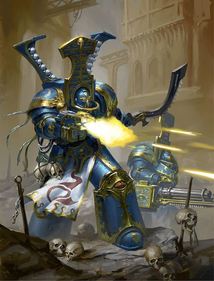
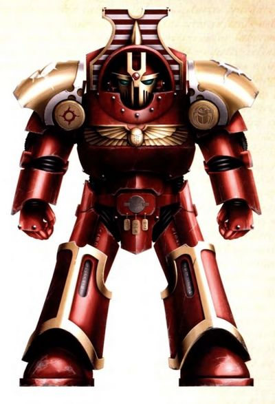
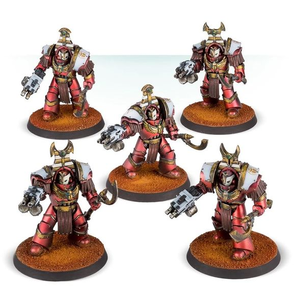
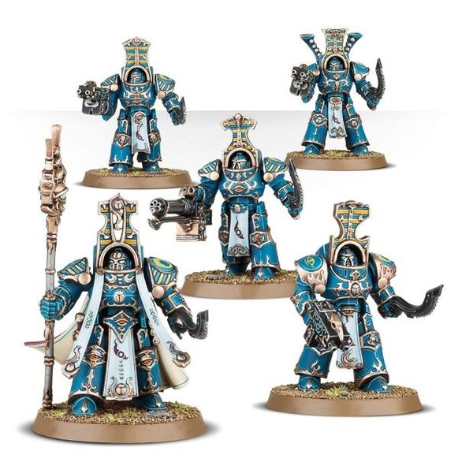

# 0550 圣甲虫密会 Scarab Occult

精校状态：中文行文已逐段精校，部分术语仍为暂定

分类：概念

原文来源：https://www.bilibili.com/opus/1033270003620642854

原作者：帝国神选罐头

原文时间：2025年02月13日 10:55

[返回分类目录](目录.md) · [全书目录](../../目录.md)

<!-- A0550-B0001 -->
**英文原文**

The Scarab Occult, also known as the Sekhmet or Magnus's Veterans, are the Tactical Dreadnought Armour-equipped Terminator elite of the Thousand Sons and a part of Scarab Occult (as an organization) of this Space Marine Legion. They were active for much of the Great Crusade and the Horus Heresy. Today the Scarab Occult includes Scarab Occult Sorcerers who direct the ranks of automatons of Scarab Occult Terminators.

<!-- /A0550-B0001 -->

<!-- A0550-B0002 -->

原译文

圣甲虫密会，也称为塞赫麦特或马格努斯的老兵，是千子中装备战术无畏装甲的终结者精英，也是该星际战士军团圣甲虫密会（作为一个组织）的一部分。他们在大远征和荷鲁斯叛乱的大部分时间里都很活跃。如今，圣甲虫密会包括圣甲虫密会巫师，他们指挥机械般的圣甲虫密会终结者队伍。

**校订译文**

圣甲虫密会精英又称塞赫麦特或“马格努斯的老兵”，是千子军团身穿战术无畏装甲的精锐终结者，隶属于同名的圣甲虫密会组织。他们在大远征及荷鲁斯之乱的大部分时期都很活跃。如今，这一组织中还有圣甲虫密会巫师，负责指挥如自动傀儡般的圣甲虫终结者。

**校注：** Scarab Occult 在本篇同时指组织及其精英部队，组织名沿“圣甲虫密会”；完整单位名 Scarab Occult Terminators 按 GW09第36/GW10第35 页统一“圣甲虫终结者”，避免把组织名与现行单位官译混为一条。

<!-- /A0550-B0002 -->

<!-- A0550-B0003 图片 -->

<!-- A0550-B0004 -->

原译文

Post-Heresy Scarab Occult Terminators 叛乱后圣甲虫密会终结者

**校订译文**

Post-Heresy Scarab Occult Terminators 叛乱后的圣甲虫终结者

<!-- /A0550-B0004 -->

<!-- A0550-B0005 -->
## Overview 概述

<!-- /A0550-B0005 -->

<!-- A0550-B0006 -->
**英文原文**

Belonging to the 1st Fellowship of the legion, they were under the command of 1st Fellowship Captain Ahzek Ahriman. Proud and devoted warriors, they were veterans of both battle and the Thousand Sons' psychic discipline system, with no member being of lower cult grade than Philosophus. This meant that each warrior was able to mentally transcend their personal tastes, likes, and dislikes to achieve a form of emotional purity that resulted in warriors both extremely loyal and calm, perfectly willing to obey every order given to them. This practice was commented on by some of the primarchs who witnessed them fight during the Great Crusade; Jaghatai Khan called them "automatons," Leman Russ decried their fighting spirit, while Ferrus Manus called them "robots" - thought in a complimentary way.

<!-- /A0550-B0006 -->

<!-- A0550-B0007 -->

原译文

他们属于军团的第一学会，由第一学会连长阿扎克·阿里曼指挥。他们是自豪而忠诚的战士，是战斗和千子灵能修炼体系的老兵，没有任何成员的灵能等级低于哲人。这意味着每个战士都能够在精神上超越自己的个人品味、喜好和厌恶，达到一种情感上的纯洁，使战士既忠诚又冷静，完全愿意服从给他们的每一个命令。一些目睹他们在大远征期间战斗的原体对这种做法进行了评论；察合台可汗称他们为“机械行事之人”，黎曼·鲁斯谴责他们的战斗精神，而费鲁斯·马努斯称他们为”机器人“-赞美的方面。

**校订译文**

他们隶属军团第一学会，由连长阿扎克·阿里曼指挥。这些自豪而忠诚的战士既久经战阵，也在千子的灵能修行体系中造诣深厚，所有人的学派位阶都至少达到“哲人”。这意味着他们能够在精神上超越个人的口味、喜好与厌恶，达到一种情感纯净的状态，因而极为忠诚、冷静，甘愿服从收到的每一道命令。大远征期间，数位目睹他们作战的原体曾对此作出评价：察合台可汗称他们为“自动傀儡”，黎曼·鲁斯批评他们缺乏战斗精神；费鲁斯·马努斯则称他们为“机器人”，不过在他口中，这是一种赞许。

**校注：** cult grade 指学派修行位阶，不直接等于灵能强度等级；原文 thought in a complimentary way 疑为 though 的笔误，中文按上下文表转折。

<!-- /A0550-B0007 -->

<!-- A0550-B0008 图片 -->

<!-- A0550-B0009 -->

原译文

Pre-Heresy Scarab Occult Terminator 叛乱前圣甲虫密会终结者

**校订译文**

Pre-Heresy Scarab Occult Terminator 叛乱前的圣甲虫终结者

<!-- /A0550-B0009 -->

<!-- A0550-B0010 -->
**英文原文**

The total number of the Sekhmet is unknown, but the force present with Ahriman on Aghoru numbered eighty-one. Aghoru was one of the first times that they deployed their newly issued rotary cannons, although they deliberately chose to continue to refer to the weapon by the name of the previous Terminator-issue support cannon, the Reaper. This was due to the numerological significance of the word reaper, which fitted perfectly with the philosophy of the Thousand Sons. Following the Council of Nikaea, the Scarab Occult Terminators took to cutting a vertical scar through the right lenses of their helmets in their primarch's image.

<!-- /A0550-B0010 -->

<!-- A0550-B0011 -->

原译文

塞赫麦特的总数尚不清楚，但阿里曼在阿格鲁的兵力为81人。阿格鲁是他们第一次部署新供给的旋转炮，尽管他们故意选择继续用终结者供给的前一代支援炮收割者的名字来称呼这种武器。这是由于“收割者”一词的数字意义，它与千子哲学完美契合。在尼凯亚会议之后，圣甲虫密会终结者开始按照他们的原体形象，通过头盔的右镜片切割一个垂直的疤痕。

**校订译文**

塞赫麦特的总人数不详，但随阿里曼部署在阿格鲁的部队有 81 人。阿格鲁之战是他们最早使用新配发转管炮的几场战斗之一；他们却刻意继续以旧式终结者支援炮的名称“收割者”来称呼它。原因在于 reaper 一词的数秘学意义与千子的哲学完全契合。尼凯亚会议之后，圣甲虫终结者开始在头盔右眼镜片上刻出一道竖直伤痕，仿效原体的形象。

**校注：** one of the first times 并非唯一的第一次；numerological significance 指数秘学上的含义，而非一般“数字意义”。

<!-- /A0550-B0011 -->

<!-- A0550-B0012 图片 -->

<!-- A0550-B0013 -->

原译文

Heresy-era Scarab Occult Terminators 叛乱前圣甲虫密会终结者

**校订译文**

Heresy-era Scarab Occult Terminators 叛乱时期的圣甲虫终结者

**校注：** Heresy-era 为叛乱时期，原译“叛乱前”错误。

<!-- /A0550-B0013 -->

<!-- A0550-B0014 -->
**英文原文**

After the Heresy and the Rubric of Ahriman, the Scarab Occult Terminators were reduced to mere Rubicae along with most of the Legion. However, unlike ordinary Rubricae, their armour were engraved with arcane formulae and potent spells, so when the Rubric struck them, the energies of these cursed inscriptions blended with remnants of the Terminators' souls, wreathing Scarab Occult Terminators forever in shimmering shields of sorcerous energy, making them resistant to perils of empyric transfer, and therefore ideally suited to teleportation assault. In the 41st millennium, they wage war at the side of Thousand Sons Sorcerers though they still kept the old name - Scarab Occult Terminators.

<!-- /A0550-B0014 -->

<!-- A0550-B0015 -->

原译文

在叛乱和阿里曼的红字法术之后，圣甲虫密会终结者与大部分军团一起沦为纯粹的红字战士。然而，与普通的红字战士不同，他们的盔甲上刻有晦涩的公式和强大的咒语，因此当红字法术击中他们时，这些被诅咒的铭文的能量与终结者灵魂的残余混合在一起，将圣甲虫密会终结者永远笼罩在闪闪发光的魔能盾牌中，使他们能够抵抗秘火转移的危险，因此非常适合进行传送攻击。在第41个千年，他们与千子巫师并肩作战，尽管他们仍然保留着旧名字——圣甲虫密会终结者。

**校订译文**

叛乱及阿里曼红字法术之后，圣甲虫终结者与军团多数成员一样化为红字傀儡。不过，他们与普通红字战士有所不同：盔甲上镌刻的秘术公式与强大咒文，在红字法术降临时释放能量，与终结者残存的灵魂交融，使其永远笼罩在闪烁的巫术能量护盾中。这层护盾让他们更能抵御经由亚空间传送的危险，因此格外适合传送突击。到了第 41 个千年，他们仍以“圣甲虫终结者”之名，在千子巫师身旁作战。

**校注：** empyric transfer 指经由亚空间的传送，原译“秘火转移”不合语境。

<!-- /A0550-B0015 -->

<!-- A0550-B0016 图片 -->

<!-- A0550-B0017 -->

原译文

M41 Scarab Occult Terminators Squad M41圣甲虫密会终结者小队

**校订译文**

M41 Scarab Occult Terminators Squad M41 圣甲虫终结者小队

<!-- /A0550-B0017 -->

<!-- A0550-B0018 -->
## Weapons 武器

<!-- /A0550-B0018 -->

<!-- A0550-B0019 -->
**英文原文**

Scarab Occults Terminators usually equipped with Inferno Combi-Bolters and Power Swords (made in a special Khopesh style). Also except the above mentioned rotary cannon, one of the unit's Scarab Terminators can have a Hellfyre Missile Rack or Heavy Warpflamer.

<!-- /A0550-B0019 -->

<!-- A0550-B0020 -->

原译文

圣甲虫密会终结者通常配备炼狱复合爆矢枪和动力剑（以特殊的埃及弯刀风格制造）。除上述旋转炮外，该部队的一个圣甲虫终结者还可以配备地狱之火导弹架或重型魔焰喷射器。

**校订译文**

圣甲虫终结者通常装备炼狱复合爆矢枪和动力剑，后者采用独特的埃及镰形弯刀样式。除上述转管炮外，部队中的一名圣甲虫终结者还可携带地狱之火导弹架或重型魔焰喷射器。

<!-- /A0550-B0020 -->

<!-- A0550-B0021 -->
## Known Formations 著名编队

<!-- /A0550-B0021 -->

<!-- A0550-B0022 -->
**英文原文**

Sekhmet Conclave - consists of a sorcerer or a Daemon Prince and a detachment of Scarab Occult Terminators these Conclaves are a magical force like no other. The collective power of sigil-wards of the Scarab Occult magnify their protective power to great heights and the arcane spells of their commander-lords protect them even more from enemy shells and attacks.

<!-- /A0550-B0022 -->

<!-- A0550-B0023 -->

原译文

塞赫麦特秘阵 - 由一名巫师或一名恶魔王子和一支圣甲虫密会终结者组成，这些秘阵是一种与众不同的神奇力量。圣甲虫密会集体的铭文防护的力量将他们的保护力放大到了很高的高度，他们的指挥官领主的神秘咒语更能保护他们免受敌人的炮击和攻击。

**校订译文**

塞赫麦特秘阵——由一名巫师或恶魔亲王率领一支圣甲虫终结者分遣队组成，是独具威力的巫术战斗编组。圣甲虫终结者身上的防护符印汇聚力量，大幅增强其防御；指挥他们的领主所施展的秘术，又进一步抵御敌人的炮火与攻击。

<!-- /A0550-B0023 -->

<!-- A0550-B0024 -->
## Known Units 著名单位

<!-- /A0550-B0024 -->

<!-- A0550-B0025 -->

原译文

The Fractal Blades 碎裂之刃

**校订译文**

The Fractal Blades 分形之刃

**校注：** Fractal 指分形；与第549篇同一单位统一为“分形之刃”，原稿此处“碎裂之刃”、549“分型之刃”。

<!-- /A0550-B0025 -->

本篇核心术语与暂定项

以下列出本篇出现的英文原形及核心术语表用词。同形词可能指不同对象，具体词义以本篇正文和校注为准；单复数、别名和仅见于图注的名称可能尚未列入。完整候选见[术语表](../../术语表/双语术语候选.csv)。

| 英文 | 采用中文 | 状态 |
| --- | --- | --- |
| Thousand Sons | 千子 | 官方已核对 |
| Terminator | 终结者 | 官方已核对 |
| Horus Heresy | 荷鲁斯之乱 | 官方已核对 |
| Teleportation | 传送 | 暂定 |
| Sorcerer | 巫师 | 官方已核对 |
| Primarch | 原体 | 官方已核对 |
| Daemon Prince | 恶魔亲王 | 官方已核对 |
| Great Crusade | 大远征 | 暂定·官方待核 |
| Ferrus Manus | 费鲁斯·马努斯 | 暂定·官方待核 |
| Horus | 荷鲁斯 | 暂定·官方待核 |
| Council of Nikaea | 尼凯亚会议 | 暂定·官方待核 |
| Space Marine Legion | 星际战士军团 | 暂定·官方待核 |
| The Primarchs | 原体 | 暂定·官方待核 |
| Ahzek Ahriman | 阿扎克·阿里曼 | 暂定·官方待核 |
| Space Marine | 星际战士 | 暂定·官方待核 |
| Captain | 连长 | 暂定·官方待核 |
| Terminators | 终结者 | 暂定·官方待核 |
| Remnants | 残骸 | 暂定·官方待核 |
| Jaghatai Khan | 察合台可汗 | 暂定·官方待核 |
| Scarab Occult Terminators | 圣甲虫终结者 | 官方已核对 |
| Dreadnought | 无畏机甲 | 暂定·官方待核 |
| Reaper | 收割者号 | 暂定·官方待核 |
| Scarab Occult | 圣甲虫密会 | 暂定·官方待核 |
| Sekhmet | 塞赫麦特 | 暂定·官方待核 |
| Philosophus | 哲人 | 暂定·官方待核 |
| Sekhmet Conclave | 塞赫麦特秘阵 | 暂定·官方待核 |
| Hellfyre Missile Rack | 地狱之火导弹架 | 暂定·官方待核 |
| Heavy Warpflamer | 重型魔焰喷射器 | 暂定·官方待核 |
| The Weapon | 武器 | 暂定·官方待核 |
| System | 星系（恒星系统） | 暂定·官方待核 |
| Nikaea | 尼凯亚 | 暂定·官方待核 |

