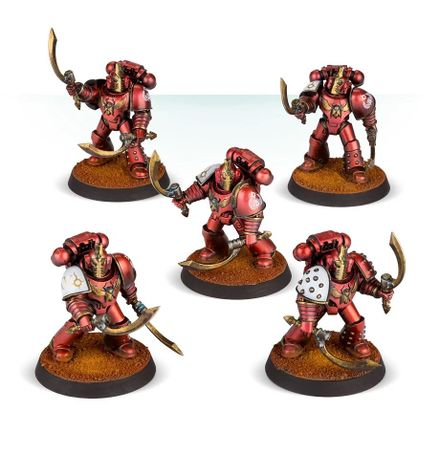

# 0551 肯特泰密会 Khenetai Occult

精校状态：中文行文已逐段精校，部分术语仍为暂定

分类：概念

原文来源：https://www.bilibili.com/opus/1025492371852230662

原作者：帝国神选罐头

原文时间：2025年01月23日 11:54

[返回分类目录](目录.md) · [全书目录](../../目录.md)

<!-- A0551-B0001 -->
**英文原文**

The Khenetai Occult were an elite force of the Thousand Sons during the Great Crusade and Horus Heresy.

<!-- /A0551-B0001 -->

<!-- A0551-B0002 -->

原译文

肯特泰密会是大远征和荷鲁斯叛乱期间千子的精英力量。

**校订译文**

肯特泰密会是大远征与荷鲁斯之乱期间千子军团的一支精锐部队。

<!-- /A0551-B0002 -->

<!-- A0551-B0003 图片 -->

<!-- A0551-B0004 -->

原译文

Warrior of the Khenetai Occult 肯特泰密会战士

**校订译文**

Warrior of the Khenetai Occult 肯特泰密会战士

<!-- /A0551-B0004 -->

<!-- A0551-B0005 -->
## Overview 概述

<!-- /A0551-B0005 -->

<!-- A0551-B0006 -->
**英文原文**

These warriors were part of the Order of the Jackal and served as the guardians of the five Prosperine Cults. The Khenetai Blade warriors were psychically bound to one another, and their elite were the initiates of the Cult's inner secrets and arts.

<!-- /A0551-B0006 -->

<!-- A0551-B0007 -->

原译文

这些战士是豺狼教团的一员，是五个普罗斯佩罗学派的守护者。肯特泰刀锋战士在灵能上相互联系，他们的精英是学派内部秘密和艺术的信徒。

**校订译文**

这些战士隶属豺狼教团，守护普罗斯佩罗的五大学派。肯特泰刀锋战士彼此通过灵能紧密相连；其中的精锐，则得以研习学派内部的秘密与秘术。

<!-- /A0551-B0007 -->

<!-- A0551-B0008 -->
**英文原文**

The foremost warriors of the Khenetai formed cabals of blades, each led by a Blade Master. As befitting their name, their primary weapon were two Force Swords.

<!-- /A0551-B0008 -->

<!-- A0551-B0009 -->

原译文

肯特泰最重要的战士组成了刀锋阴谋团，每个集团都由一位刀锋大师领导。与他们的名字相称，他们的主要武器是两把动力剑。

**校订译文**

肯特泰最出众的战士组成一个个刀锋结社，每个结社由一位刀锋大师率领。正如其名，他们的主要武器是成对的灵能剑。

**校注：** Force Swords 为灵能剑，不是 Power Swords 动力剑；cabals 此处指小型结社，不是黑暗灵族的 Kabal 阴谋团，也不是异形组织密教。

<!-- /A0551-B0009 -->

<!-- A0551-B0010 -->
## Notable Members of the Khenetai Occult 著名肯特泰密会成员

<!-- /A0551-B0010 -->

<!-- A0551-B0011 -->

原译文

Iskandar Khayon 伊斯坎达尔·卡杨

**校订译文**

Iskandar Khayon 伊斯坎达尔·卡杨

<!-- /A0551-B0011 -->

本篇核心术语与暂定项

以下列出本篇出现的英文原形及核心术语表用词。同形词可能指不同对象，具体词义以本篇正文和校注为准；单复数、别名和仅见于图注的名称可能尚未列入。完整候选见[术语表](../../术语表/双语术语候选.csv)。

| 英文 | 采用中文 | 状态 |
| --- | --- | --- |
| Thousand Sons | 千子 | 官方已核对 |
| Horus Heresy | 荷鲁斯之乱 | 官方已核对 |
| The Order | 秩序 | 暂定·官方待核 |
| Great Crusade | 大远征 | 暂定·官方待核 |
| Horus | 荷鲁斯 | 暂定·官方待核 |
| Master | 导师（审判庭职衔）／舰务官（舰员职务） | 语境定译·官方待核 |
| Khenetai Occult | 肯特泰密会 | 暂定·官方待核 |
| Order of the Jackal | 豺狼教团 | 暂定·官方待核 |
| Initiates | 进阶者 | 官方已核 |

