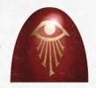

# 0552 阿米塔拉密会 Ammitara Occult

精校状态：中文行文已逐段精校，部分术语仍为暂定

分类：概念

原文来源：https://www.bilibili.com/opus/1018378548802486280

原作者：帝国神选罐头

原文时间：编辑于 2025年01月16日 14:47

[返回分类目录](目录.md) · [全书目录](../../目录.md)

<!-- A0552-B0001 -->
**英文原文**

The Ammitara Occult were fast attack troops used by the Thousand Sons during the Great Crusade and Horus Heresy.

<!-- /A0552-B0001 -->

<!-- A0552-B0002 -->

原译文

阿米塔拉密会是千子在大远征和荷鲁斯叛乱期间使用的快速进攻部队。

**校订译文**

阿米塔拉密会是大远征与荷鲁斯之乱期间，千子军团采用的快速攻击部队。

<!-- /A0552-B0002 -->

<!-- A0552-B0003 图片 -->

<!-- A0552-B0004 -->

原译文

Ammitara Occult Symbol 阿米塔拉修会标志

**校订译文**

Ammitara Occult Symbol 阿米塔拉密会标志

<!-- /A0552-B0004 -->

<!-- A0552-B0005 -->
**英文原文**

A highly secretive order, they answered to the shadowy Order of the Blind. The Ammitara specialized in fast attack, reconnaissance, espionage, assassination, and misdirection. As such, they were most frequently equipped with Sniper Rifles. The lowest ranked warriors were given the rank of Intercessor, while the squad commanders were known as Fates.

<!-- /A0552-B0005 -->

<!-- A0552-B0006 -->

原译文

这是一个高度秘密的密会，他们对鲜为人知的盲目教团做出了回应。阿米塔拉擅长快速攻击、侦察、间谍、暗杀和误导。因此，他们最常配备狙击步枪。等级最低的战士被授予“代祷者”的称号，而队长则被称为“命运”。

**校订译文**

这是一个高度隐秘的团体，听命于神秘的盲者教团。阿米塔拉擅长快速突袭、侦察、谍报、刺杀与误导敌人，因此最常配备狙击步枪。最低阶战士称为代祷者，小队指挥官则称为命运者。

**校注：** Intercessor 此处是军团时代阿米塔拉密会的低阶职衔，暂沿用代祷者，不能套用原铸仲裁者单位译名。Fates 暂译命运者；Order of the Blind 暂译盲者教团。

<!-- /A0552-B0006 -->

本篇核心术语与暂定项

以下列出本篇出现的英文原形及核心术语表用词。同形词可能指不同对象，具体词义以本篇正文和校注为准；单复数、别名和仅见于图注的名称可能尚未列入。完整候选见[术语表](../../术语表/双语术语候选.csv)。

| 英文 | 采用中文 | 状态 |
| --- | --- | --- |
| Thousand Sons | 千子 | 官方已核对 |
| Horus Heresy | 荷鲁斯之乱 | 官方已核对 |
| Great Crusade | 大远征 | 暂定·官方待核 |
| Horus | 荷鲁斯 | 暂定·官方待核 |
| Ammitara Occult | 阿米塔拉密会 | 暂定·官方待核 |
| Order of the Blind | 盲者教团 | 暂定·官方待核 |
| Fates | 命运者 | 暂定·官方待核 |
| Intercessor | 仲裁者 | 暂定·官方待核 |

