# 0554 XVI - 荷鲁斯之子 Sons of Horus

精校状态：中文行文已逐段精校，部分术语仍为暂定

分类：概念

原文来源：https://www.bilibili.com/opus/1101509874197463044

原作者：帝国神选罐头

原文时间：2025年08月16日 08:20

[返回分类目录](目录.md) · [全书目录](../../目录.md)

<!-- A0554-B0001 -->
**英文原文**

The Sons of Horus, originally known as the Luna Wolves, were the XVI Legion of the original twenty Space Marine Legions. Their Primarch was Horus, known to them as Horus Lupercal, and to Imperial history as the instigator of the Horus Heresy, the first great Imperial civil war. Following the Horus Heresy most of the Sons of Horus escaped into the Eye of Terror, where they were largely shattered during the Legion Wars. Following the Battle of Harmony large amounts of the Legion were later absorbed into former First Captain Ezekyle Abaddon's Black Legion. A few warbands, later known as the "Thrice-Cursed Traitors‎", were able to remain independent and still operate as Sons of Horus.

<!-- /A0554-B0001 -->

<!-- A0554-B0002 -->

原译文

荷鲁斯之子，最初被称为影月苍狼，是最初的二十个星际战士军团中的第十六军团。他们的原体是荷鲁斯，他们称之为牧狼神荷鲁斯，在帝国历史上，他是荷鲁斯叛乱的煽动者，这是第一次巨大的帝国内战。在荷鲁斯叛乱之后，荷鲁斯的大多数子嗣都逃到了恐惧之眼，在那里他们在军团战争中基本上被粉碎了。在和谐星之战之后，大量的军团成员后来被前第一连长以泽凯尔·阿巴顿的黑色军团吸收。一些战帮，后来被称为“三重诅咒叛徒”‎“，能够保持独立，仍然作为荷鲁斯之子运作。

**校订译文**

荷鲁斯之子原名影月苍狼，是最初二十个星际战士军团中的第十六军团。其原体荷鲁斯，被军团成员称为荷鲁斯·卢佩卡尔；在帝国史上，他因发动帝国第一次大规模内战——荷鲁斯之乱——而闻名。叛乱结束后，大多数荷鲁斯之子逃入恐惧之眼，又在随后的军团战争中遭到重创。和谐星之战后，大批残部被前第一连长以泽凯尔·阿巴顿组建的黑色军团吸收。少数后来被称为“三重诅咒叛徒”的战帮，则保持独立，至今仍以荷鲁斯之子的名义活动。

**校注：** Horus Lupercal 与资料栏统一为荷鲁斯·卢佩卡尔；原译牧狼神荷鲁斯保留在对照中。

<!-- /A0554-B0002 -->

<!-- A0554-B0003 图片 -->
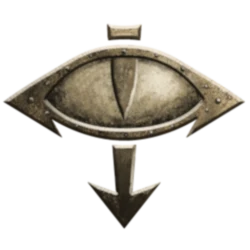

<!-- A0554-B0004 图片 -->
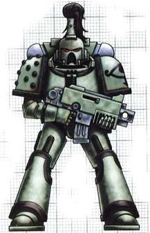

<!-- A0554-B0005 -->
**英文原文**

Legion Number:XVI

<!-- /A0554-B0005 -->

<!-- A0554-B0006 -->

原译文

军团编号：XVI

**校订译文**

军团编号：XVI

<!-- /A0554-B0006 -->

<!-- A0554-B0007 -->
**英文原文**

Primarch:Horus Lupercal

<!-- /A0554-B0007 -->

<!-- A0554-B0008 -->

原译文

原体：荷鲁斯·卢佩卡尔

**校订译文**

原体：荷鲁斯·卢佩卡尔

<!-- /A0554-B0008 -->

<!-- A0554-B0009 -->
**英文原文**

Homeworld:Cthonia

<!-- /A0554-B0009 -->

<!-- A0554-B0010 -->

原译文

家园世界：科索尼亚

**校订译文**

家园世界：科索尼亚

<!-- /A0554-B0010 -->

<!-- A0554-B0011 -->
**英文原文**

Chaos Affiliation:Chaos Undivided,Worship of Horus as a god

<!-- /A0554-B0011 -->

<!-- A0554-B0012 -->

原译文

混沌隶属：混沌无分，将荷鲁斯作为神崇拜

**校订译文**

混沌隶属：混沌无分，将荷鲁斯作为神崇拜

<!-- /A0554-B0012 -->

<!-- A0554-B0013 -->
**英文原文**

Colours:Green (Sons of Horus), White (Luna Wolves)

<!-- /A0554-B0013 -->

<!-- A0554-B0014 -->

原译文

颜色：绿色（荷鲁斯之子），白色（影月苍狼）

**校订译文**

颜色：绿色（荷鲁斯之子），白色（影月苍狼）

<!-- /A0554-B0014 -->

<!-- A0554-B0015 -->
**英文原文**

Specialty:Flexible Organisation, Eliminating Command Structures, Planetary Assault

<!-- /A0554-B0015 -->

<!-- A0554-B0016 -->

原译文

专业：灵活组织、消除指挥结构、行星突击

**校订译文**

专长：灵活编组、摧毁敌方指挥体系、行星突击

<!-- /A0554-B0016 -->

<!-- A0554-B0017 -->
**英文原文**

Battle Cry:Lupercal!, For the Warmaster!

<!-- /A0554-B0017 -->

<!-- A0554-B0018 -->

原译文

战吼：牧狼神!,为了战帅！

**校订译文**

战吼：“卢佩卡尔！”“为了战帅！”

**校注：** 战吼 Lupercal 与本篇人物姓名保持同一音译，原稿采用意译牧狼神；均指荷鲁斯的称呼，不另列为神祇。

<!-- /A0554-B0018 -->

<!-- A0554-B0019 -->
## Homeworld 家园世界

<!-- /A0554-B0019 -->

<!-- A0554-B0020 -->
**英文原文**

The Luna Wolves are said to have originated from a world called Cthonia; this planet allegedly existed in one of Terra's closest neighbouring star systems. Being within reach even for non-warp spacecraft, Cthonia had been colonised, built upon, tunneled and mined out most likely since the dawn of space travel. As such, all natural resources had been stripped away and used up millennia before the arrival of the Primarch Horus Lupercal, and the ancient mining technology had long since been rediscovered and removed by the Adepts of Mars. The planet that remained was largely redundant and abandoned, completely riddled with catacombs, crumbling industrial plants and exhausted mine-workings. It is noted as no longer extant in current Imperial records, believed to have cataclysmically lost geo-structural integrity in the centuries after the Horus Heresy. Many put this down to the fact that the planet was tunneled and mined right though to the (dead) planetary core, but there is much conjecture that Cthonia was deliberately destroyed, by person or persons unknown.

<!-- /A0554-B0020 -->

<!-- A0554-B0021 -->

原译文

据说影月苍狼起源于一个名为科索尼亚的世界；据称，这颗行星存在于泰拉最近的邻近恒星系之一中。即使对于非亚空间航天器来说，科索尼亚也触手可及，自太空航行开始以来，它很可能已经被殖民、建造、挖掘和开采。因此，在原体荷鲁斯·卢佩卡尔到来之前的数千年里，所有的自然资源都被剥夺并耗尽了，古老的采矿技术早已被火星专家重新发现并移除。剩下的行星基本上是多余和废弃的，完全布满了地下墓穴、摇摇欲坠的工业厂房和枯竭的矿井。它在目前的帝国记录中已不复存在，据信在荷鲁斯叛乱之后的几个世纪里，它已经灾难性地失去了地质结构的完整性。许多人将此归因于这颗行星一直被挖掘到（死亡的）行星核心，但有很多猜测认为科索尼亚是被一个或多个未知的人故意摧毁的。

**校订译文**

相传，影月苍狼起源于科索尼亚。这颗行星据说位于距离泰拉最近的邻近星系之一，即使不用亚空间航行也能抵达。因此，很可能从人类开始太空旅行之初，这里就已遭到殖民开发，人们营建城市、开凿地道、采掘矿藏。早在荷鲁斯·卢佩卡尔到来前数千年，自然资源便已枯竭；古老采矿技术也早被火星的技术人员重新发现并带走。残存的世界失去用途，几乎被彻底遗弃，只剩遍布全球的地下墓道、摇摇欲坠的工业设施与废弃矿井。帝国现存记录称科索尼亚已不复存在，据信它在荷鲁斯之乱后数百年间发生灾难性的地质结构崩溃。许多人将其归咎于过度开采——坑道一直深入到死寂的地核——但也有大量猜测认为，是身份不明的人蓄意摧毁了这颗行星。

**校注：** 关于科索尼亚毁灭的时间、原因，所给英文采用推测性叙述，中文保留其不确定程度；与后文黑暗天使摧毁该星的记载存在差异，均照录并提示。

<!-- /A0554-B0021 -->

<!-- A0554-B0022 图片 -->
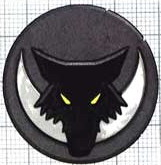

<!-- A0554-B0023 -->

原译文

Symbol of the Luna Wolves 影月苍狼标志

**校订译文**

Symbol of the Luna Wolves 影月苍狼标志

<!-- /A0554-B0023 -->

<!-- A0554-B0024 -->
**英文原文**

Cthonia was so close to Terra that it appears that at least one Cthonian native was able to travel to Terra during the Unification Era, before becoming one of the first Luna Wolves.

<!-- /A0554-B0024 -->

<!-- A0554-B0025 -->

原译文

科索尼亚与泰拉的距离如此之近，以至于在统一时期，至少有一名科索尼亚原住民能够前往泰拉，然后成为第一批影月苍狼之一。

**校订译文**

科索尼亚离泰拉如此之近，似乎至少有一名当地人在统一时代便已抵达泰拉，后来成为最早的影月苍狼之一。

<!-- /A0554-B0025 -->

<!-- A0554-B0026 -->
## History 历史

<!-- /A0554-B0026 -->

<!-- A0554-B0027 -->
### Unification 统一

<!-- /A0554-B0027 -->

<!-- A0554-B0028 -->
**英文原文**

During the Unification Wars the initial recruitment pool of the XVIth Legion was believed to made up of members of the 'hunter clans' of both the Jutrigan Bowl and Samsatian sub-plate slums of Terra. These areas were reckoned to be harsh places to live, with their inhabitants noted for their ruthless, independent character. Whether it was this nature, or the Emperor's genetic design for the legion template, or a mixture of both, the nascent Terran XVIth soon became known for being exemplar shock troops during the initial Imperial expansion campaigns, used successfully to both quickly start and finish fights, either in an initial, fully successful blow, or in being deployed from reserve to enact the killing strike.

<!-- /A0554-B0028 -->

<!-- A0554-B0029 -->

原译文

在统一战争期间，第十六军团的最初招募地被认为是由泰拉尤特里根盆地和萨姆萨提亚板块贫民窟的“猎人氏族”成员组成的。这些地区被认为是生活条件恶劣的地方，其居民以无情、独立的性格而闻名。无论是这种性质，还是帝皇对军团模板的基因设计，还是两者的混合，新生的泰拉第十六军团很快就以在最初的帝国扩张运动中成为模范突击部队而闻名，成功地用于快速开始和结束战斗，无论是在最初的、完全成功的打击中，还是从预备部署以实施杀戮打击。

**校订译文**

统一战争期间，第十六军团最初的兵源，据信来自泰拉尤特里根盆地与萨姆萨提亚板下贫民窟的“猎人氏族”。这些地区生存条件恶劣，居民以冷酷、自立的性格著称。无论源于这种天性，还是帝皇为军团设计的基因模板，抑或两者共同作用，新生的第十六军团很快就在帝国早期扩张中成为突击部队的典范。他们既能以首轮攻势直接结束战斗，也能作为预备队投入，给予敌人最后一击。

<!-- /A0554-B0029 -->

<!-- A0554-B0030 图片 -->
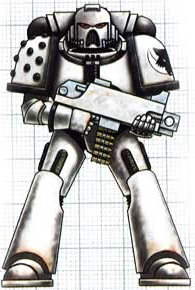

<!-- A0554-B0031 -->

原译文

Pre-Heresy Luna Wolves Space Marine 叛乱前影月苍狼星际战士

**校订译文**

Pre-Heresy Luna Wolves Space Marine 叛乱前影月苍狼星际战士

<!-- /A0554-B0031 -->

<!-- A0554-B0032 -->
**英文原文**

One of their earliest campaigns proved important to the development and formation of the XVIth as a legion was the First Pacification of Luna. Playing the most important role in the action, the XVIth achieved both the critical objective and notoriety during the conflict, gaining the unofficial moniker of the Emperor's Wolves. As a result, they were tithed the bulk of the output of the captured gene-labs for a time, allowing them to rapidly build their numbers. This, in turn, necessitated more recruiting stock.

<!-- /A0554-B0032 -->

<!-- A0554-B0033 -->

原译文

他们最早的战役之一被证明对第十六军团的发展和形成很重要，那就是第一次月球平定。作为行动中最重要的角色，十六军团在冲突中实现了关键目标和名声，获得了帝皇之狼的非正式绰号。因此，他们在一段时间内获得了俘获的基因实验室的大部分产出，使他们能够快速建立自己的成员。这反过来又需要更多的征募人员。

**校订译文**

第一次月球平定战，是第十六军团最早参与的战役之一，对其成长与成形至关重要。军团在行动中发挥决定性作用，不仅达成关键目标，也赢得赫赫声名，获称“帝皇之狼”。作为回报，他们在一段时间内获得了从被占领基因实验室征收的大部分产出，得以迅速扩充兵力；而扩编又要求更多新兵。

<!-- /A0554-B0033 -->

<!-- A0554-B0034 -->
**英文原文**

Thus, many of the original XVIth are believed to have had a separate, somewhat unusual origin; they were effectively kidnapped from the world of Cthonia by 'recruitment squads' sent from Terra charged with the task of rounding up thousands of individuals from the violent gangs that infested the ancient world. These 'recruits' were then taken to the geno-laboratories on Luna for the modification and indoctrination required to become Space Marines.

<!-- /A0554-B0034 -->

<!-- A0554-B0035 -->

原译文

因此，许多最初的十六军团被认为有一个单独的、有点不同寻常的起源；他们实际上是被泰拉派出的“招募小队”从科索尼亚世界绑架的，这些招募小队的任务是捕获来自古代世界暴力帮派的数千人。这些“新兵”随后被带到月球上的基因实验室，接受成为星际战士所需的改造和灌输。

**校订译文**

因此，据信许多早期第十六军团战士有着另一种颇为特殊的出身：他们实际上是被泰拉派出的“招募小队”，从科索尼亚绑架而来。这些小队的任务，是从遍布这个古老世界的暴力帮派中抓走数千人，再将这些“新兵”送往月球基因实验室，接受成为星际战士所需的改造与思想灌输。

<!-- /A0554-B0035 -->

<!-- A0554-B0036 -->
**英文原文**

Upon the discovery of Horus, the Emperor officially renamed them the Luna Wolves in honor of their past victories and baptism of fire on Terra's moon. Despite this somewhat unusual beginning, the end results were reckoned to be exemplary loyal and ferociously motivated troops. By the time Horus was placed in charge of them, the Luna Wolves were ten thousand strong.

<!-- /A0554-B0036 -->

<!-- A0554-B0037 -->

原译文

在发现荷鲁斯后，帝皇正式将他们重新命名为影月苍狼，以纪念他们过去在泰拉卫星上的胜利和战火的洗礼。尽管这一开始有些不同寻常，但最终的结果被认为是忠诚和积极性极强的部队的典范。当荷鲁斯接管他们时，影月苍狼已经有一万人了。

**校订译文**

寻回荷鲁斯后，帝皇正式赐名“影月苍狼”，以纪念军团在泰拉卫星上取得的胜利和经历的战火洗礼。尽管起源不同寻常，这些战士最终成为忠诚无比、斗志旺盛的典范。荷鲁斯接掌军团时，影月苍狼已有一万人。

<!-- /A0554-B0037 -->

<!-- A0554-B0038 -->
### The Great Crusade 大远征

<!-- /A0554-B0038 -->

<!-- A0554-B0039 -->
**英文原文**

Horus, the Primarch of the Luna Wolves, was the first of the Primarchs to be recovered by the Emperor, having been cast much closer to Terra than the others. Horus was for many years the Emperor's only discovered son, and there was a great affinity between them. The Emperor spent much time with his protege, teaching and encouraging him, and soon gave him command of the legion created from his own genetic code. With these warriors to lead, Horus accompanied the Emperor for the first thirty years of the Great Crusade, and together they forged the initial expansion of the young Imperium.

<!-- /A0554-B0039 -->

<!-- A0554-B0040 -->

原译文

影月苍狼的原体荷鲁斯是第一个被帝皇寻回的原体，他比其他原体更靠近泰拉。荷鲁斯多年来一直是帝皇唯一被发现的儿子，他们之间有着深厚的感情。帝皇花了很多时间和他的门徒在一起，教导和鼓励他，很快就让他指挥由他自己的遗传编码创建的军团。在这些战士的带领下，荷鲁斯陪伴帝皇进行了大远征的前三十年，他们共同打造了年轻帝国的初步扩张。

**校订译文**

影月苍狼的原体荷鲁斯，是帝皇最早寻回的原体：他被抛落的地点比其他原体更靠近泰拉。在很长一段时间里，他都是帝皇唯一寻回的儿子，父子二人感情深厚。帝皇花了许多时间教导、鼓励这位亲传弟子，很快便将以荷鲁斯自身基因为蓝本创造的军团交给他统率。荷鲁斯率领这些战士，陪伴帝皇走过大远征最初的三十年，共同完成了新生帝国的最初扩张。

**校注：** 原译“在这些战士的带领下”颠倒了指挥关系；英文是荷鲁斯率领战士。

<!-- /A0554-B0040 -->

<!-- A0554-B0041 -->
### Combat Disposition and Record 作战部署和记录

<!-- /A0554-B0041 -->

<!-- A0554-B0042 -->
**英文原文**

Unlike almost all other Legions, the Luna Wolves were led by their Primarch almost from inception. Not only that, they spent decades fighting under the direct supervision of the Emperor himself. This led to them thinking of themselves as the pre-eminent Legion and led to a prideful and confident mentality. They strove to be the best; to conquer more than the other Legions, faster than them, and better than them. It is arguable that they succeeded in these aims, but equally arguable that their 'successful' combat records do not exactly stand up to close scrutiny.

<!-- /A0554-B0042 -->

<!-- A0554-B0043 -->

原译文

与几乎所有其他军团不同，影月苍狼几乎从一开始就由他们的原体领导。不仅如此，他们还在帝皇本人的直接监督下战斗了几十年。这导致他们认为自己是杰出的军团，并产生了自豪和自信的心态。他们努力做到最好；征服比其他军团更多，比他们更快，比他们更好。他们成功实现了这些目标是有争议的，但同样有争议的是，他们的“成功”战斗记录并不能完全经得起仔细审查。

**校订译文**

与几乎所有其他军团不同，影月苍狼几乎从建军之初就由原体统率，并在帝皇亲自督导下作战数十年。这段经历让他们自视为军团之首，养成了骄傲而自信的心态。他们力求事事争先：比其他军团征服更多世界，推进得更快，战绩也更出色。可以说，他们确实做到了；但同样也可以说，那些“辉煌”的战绩未必经得起仔细推敲。

<!-- /A0554-B0043 -->

<!-- A0554-B0044 -->
### The Early Crusade 远征早期

<!-- /A0554-B0044 -->

<!-- A0554-B0045 -->
**英文原文**

As Horus and the Emperor spent much of the initial Great Crusade together, the Luna Wolves were present at all of the Emperor's early victories, winning great glory for themselves. Incidents from these early campaigns that highlighted the bond between the ruler of the Imperium and their commander would become legend throughout the galaxy. At the Siege of Reillis, Horus was knocked senseless by a plasma blast that sent him sprawling to the floor; the Emperor stood over his downed son and slew all that came near until reinforcements arrived. Horus was able to repay this life-debt later, on the Ork world of Gorro, when the Emperor found himself being choked by a huge Ork warlord in hand-to-hand combat; Horus stepped in and struck the Ork's arm from his body.

<!-- /A0554-B0045 -->

<!-- A0554-B0046 -->

原译文

由于荷鲁斯和帝皇在大远征初期中大部分时间都在一起，影月苍狼参加了帝皇的所有早期胜利，为自己赢得了巨大的荣耀。这些早期战役中的事件突显了帝国统治者与其指挥官之间的联系，这些事件将成为整个银河系的传奇。在莱利斯围城中，荷鲁斯被等离子爆炸击倒，四肢瘫倒在地；帝皇站在他倒下的儿子身边，杀死了所有靠近的人，直到援军到达。荷鲁斯后来在戈罗的欧克世界偿还了这一命债，当时帝皇在肉搏战中被一个巨大的欧克军阀掐住；荷鲁斯冲了过来，把欧克的手臂从其身体上打了下来。

**校订译文**

大远征初期，荷鲁斯与帝皇大多并肩行动，因此帝皇早期的每一场胜利都有影月苍狼参与，为军团赢得了无上荣耀。这些战役中，彰显帝国统治者与军团统帅深厚情谊的事迹，后来传遍银河，成为传奇。在莱利斯围攻战中，一发等离子轰击将荷鲁斯击倒在地，震得他失去了意识。帝皇守在倒下的儿子身前，杀死所有逼近的敌人，直到援军抵达。后来在欧克蛮人世界戈罗，荷鲁斯报答了这份救命之恩：帝皇在近身搏斗中被一名巨大的欧克军阀扼住喉咙，荷鲁斯及时上前，斩断了对方的手臂。

**校注：** 已核同一人物、组织、型号或事件，与全书核心术语及后续专篇统一；原译保留对照。

<!-- /A0554-B0046 -->

<!-- A0554-B0047 图片 -->
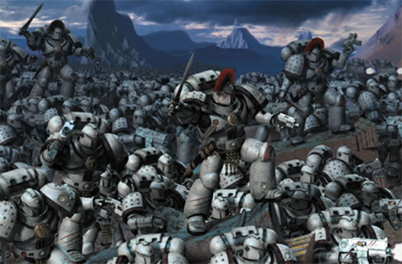

<!-- A0554-B0048 -->

原译文

The Luna Wolves advance 影月苍狼进军

**校订译文**

The Luna Wolves advance 影月苍狼进军

<!-- /A0554-B0048 -->

<!-- A0554-B0049 -->
**英文原文**

Eventually, however, the Emperor received word that another Primarch had been discovered, and left the side of Horus and the Luna Wolves to meet his newly found son. Horus was given temporary command of all the Imperial Legions during this time, an indicator of how highly he was esteemed. While Horus was pleased that one of his missing brothers had been found, the thirty years spent as the Emperor's only child had made their mark; he determined that he would always make the Emperor proudest of his and his legion's achievements.

<!-- /A0554-B0049 -->

<!-- A0554-B0050 -->

原译文

然而，最终，帝皇收到了另一位原体被发现的消息，并离开了荷鲁斯和影月苍狼的身边，去迎接他新发现的儿子。在此期间，荷鲁斯临时指挥所有帝国军团，这表明他受到了高度尊重。荷鲁斯很高兴找到了他失踪的兄弟之一，但作为帝皇独生子度过的三十年却留下了印记；他决心永远让帝皇为他和他的军团的成就感到骄傲。

**校订译文**

后来，帝皇得知又一位原体已被发现，便离开荷鲁斯与影月苍狼，前去迎接新寻回的儿子。期间，他让荷鲁斯暂时统率帝国的全部军团，足见对他的器重。荷鲁斯虽为一位失散兄弟的归来感到高兴，但独享父爱三十年的经历已在心中留下印记：他决心始终让自己和军团的成就，成为帝皇最引以为豪的事。

<!-- /A0554-B0050 -->

<!-- A0554-B0051 -->
**英文原文**

As more and more Primarchs were discovered, and other business of the growing Imperium required the Emperor's direct attention, Horus found himself placed in overall strategic command of large swathes of the Imperial Crusade forces on several occasions. His excellence in this role drew praise not only from his father, but from his brothers; Horus was apparently universally respected by the other Space Marine Legions and their Primarchs. One of the reasons for this was that Horus appeared able to use his forces in flexible ways; able to unleash his Luna Wolves if required, but also able to use them as diplomats. He developed a habit of partaking in local customs whenever bringing a new world into the Imperium, and the Luna Wolves were exposed to many such traditions as a result. The most important of these would be the practice of warrior-lodges. While a form of warrior-lodge had existed in the legion since its early days, after the compliance of a world known as Davin, it became more popular and even somewhat ritualized. This would be something that would have serious implications in the legion's future.

<!-- /A0554-B0051 -->

<!-- A0554-B0052 -->

原译文

随着越来越多的原体被发现，以及日益壮大的帝国的其他事务需要帝皇的直接关注，荷鲁斯发现自己多次被置于帝国远征大片部队的总体战略指挥之下。他在这个角色上的卓越表现不仅得到了父亲的赞扬，也得到了兄弟们的赞扬；荷鲁斯显然受到其他星际战士及其原体的普遍尊重。其中一个原因是荷鲁斯似乎能够灵活地使用他的部队；如果需要，他可以释放他的影月苍狼，但也可以将其用作外交官。他养成了一种习惯，每当把一个新世界带到帝国时，他都会参加当地的习俗，因此影月苍狼接触到了许多这样的传统。其中最重要的是战士结社的实践。虽然一种形式的战士结社从早期就存在于军团中，但在一个被称为戴文的世界被征服之后，它变得更加流行，甚至有些仪式化。这将对军团的未来产生严重影响。

**校订译文**

随着更多原体被寻回，日益壮大的帝国也有越来越多事务需要帝皇亲自处理，荷鲁斯多次获命，从战略上统筹指挥规模庞大的远征部队。他的出色表现不仅赢得父亲赞许，也得到兄弟们的认可；其他星际战士军团及其原体似乎无不敬重他。其中一个原因，是荷鲁斯懂得灵活运用麾下力量：需要时放手让影月苍狼征战，也能让他们充当外交使节。每当将一个新世界纳入帝国，他都习惯亲身参与当地习俗，军团因此接触了许多传统，其中影响最深远的便是战士结社。某种形式的战士结社在军团早期便已存在，但戴文归顺后，这种风气越发普及，甚至逐渐形成仪式。这为军团日后的命运埋下了重大隐患。

<!-- /A0554-B0052 -->

<!-- A0554-B0053 -->
**英文原文**

The Luna Wolves also acquired all the glory of being the greatest Primarch's personal guard, and they shared Horus' credo of fighting to be the best. Under his ambitious command, the Luna Wolves were always at the forefront of the latest campaign, energetically pushing the boundaries of the Imperium ever wider, driving further and further into the galaxy and striving to conquer and liberate more worlds than the other Legions, destroying all enemies of humanity in their way.

<!-- /A0554-B0053 -->

<!-- A0554-B0054 -->

原译文

影月苍狼也获得了作为最伟大的原体的个人卫队的所有荣耀，他们分享了荷鲁斯的战斗信条。在他雄心勃勃的指挥下，影月苍狼始终站在最新战役的最前沿，积极推动帝国的边界越来越宽，越来越深入银河系，努力征服和解放比其他军团更多的世界，摧毁所有挡在他们面前的人类之敌。

**校订译文**

身为最伟大原体的亲卫，影月苍狼尽享荣耀，也秉持荷鲁斯力争第一的战斗信条。在这位雄心勃勃的统帅领导下，他们始终冲在每场新战役的最前线，不断拓展帝国疆界，向银河深处推进，力求比其他军团征服、解放更多世界，并消灭一切挡路的人类之敌。

<!-- /A0554-B0054 -->

<!-- A0554-B0055 -->
**英文原文**

"I thought the Luna Wolves were supposed to be the most aggressive of us all. That's how you like the other legions to think of you, isn't it? The most feared of mankind's warrior classes?"

<!-- /A0554-B0055 -->

<!-- A0554-B0056 -->

原译文

“我以为影月苍狼应该是我们所有人中最具侵略性的。这就是你喜欢其他军团对你的看法，不是吗？人类最害怕的战士阶层？”

**校订译文**

“我还以为，影月苍狼是我们之中最悍勇好战的呢。你们希望其他军团这么看待自己，对吧？人类战士中最令人畏惧的那一群？”

<!-- /A0554-B0056 -->

<!-- A0554-B0057 -->
**英文原文**

"Our reputation speaks for itself, sir."

<!-- /A0554-B0057 -->

<!-- A0554-B0058 -->

原译文

“我们的声誉不言自明，先生。”

**校订译文**

“我们的声誉不言自明，先生。”

<!-- /A0554-B0058 -->

<!-- A0554-B0059 -->
**英文原文**

--Sigismund of the Imperial Fists in conversation with Garviel Loken of the Luna Wolves.

<!-- /A0554-B0059 -->

<!-- A0554-B0060 -->

原译文

--帝国之拳的西吉斯蒙德与影月苍狼的加维尔·洛肯的对话。

**校订译文**

——帝国之拳的西吉斯蒙德与影月苍狼的加维尔·洛肯的对话。

<!-- /A0554-B0060 -->

<!-- A0554-B0061 -->
### The Ullanor Crusade 乌兰诺远征

<!-- /A0554-B0061 -->

<!-- A0554-B0062 -->
**英文原文**

Perhaps the greatest achievement of the Luna Wolves, the Ullanor Crusade became a feted military campaign of the Imperium and to many is seen as the high watermark of the Great Crusade itself. The Ullanor sector was the domain of the Ork Overlord Urlakk Urg, who ruled over dozens of human-founded worlds. Determined to exterminate the Orks, Horus distracted them by ordering secondary attacks on the outlying worlds by other Space Marine Legions and Imperial Army regiments. With the focus of the Orks on these invasions of their borders, the Luna Wolves dove straight for the throat, initiating a surprise orbital drop directly onto Urlakk Urg's capital world. Horus led his 1st Company Terminator elite into a personal teleport attack on Urg's palace. With the majority of the Terminators dealing with the Ork defenders, Horus led ten of the best into combat with Urg and his own forty-strong retinue. The fight was a hard one, but Horus eventually slew the Ork, casting his broken body out from the battlements of his tower, demoralising his Ork followers. Of the fight between the ten Terminators and the forty Orks, there was only one survivor: First Captain Ezekyle Abaddon.

<!-- /A0554-B0062 -->

<!-- A0554-B0063 -->

原译文

也许是影月苍狼最伟大的成就，乌兰诺远征成为帝国备受赞誉的军事行动，对许多人来说，它被视为大远征本身的最高标志。乌兰诺星区是欧克霸主乌尔拉克·乌尔格的领地，他统治着数十个人类建立的世界。为了消灭兽人，荷鲁斯下令其他星际战士和帝国陆军兵团对边远世界进行二次攻击，分散他们的注意力。随着欧克的注意力集中在对其边界的入侵上，影月苍狼直冲咽喉，开始了一次令人惊讶的轨道空降，直接降落到乌尔拉克·乌尔格的首都世界。荷鲁斯率领他的第一连队终结者精英对乌尔格的宫殿进行了个人传送攻击。由于大多数终结者都在与欧克守军打交道，荷鲁斯率领十名最优秀的战士与乌尔格和他自己的四十名随从作战。这场战斗很艰难，但荷鲁斯最终杀死了欧克，将他破碎的身体从塔楼的城垛中扔了出来，使他的欧克追随者士气低落。在十个终结者和四十个兽人之间的战斗中，只有一个幸存者：第一连长以泽凯尔·阿巴顿。

**校订译文**

乌兰诺远征或许是影月苍狼最辉煌的成就。这场军事行动备受帝国赞颂，也被许多人视为大远征的巅峰。乌兰诺星区由欧克霸主乌尔拉克·乌尔格统治，辖下有数十个人类建立的世界。荷鲁斯决意消灭这些欧克蛮人，便命其他星际战士军团与帝国军兵团进攻外围世界，实施牵制。趁敌军注意力集中在边境入侵上，影月苍狼直取要害，突然从轨道空降乌尔格的首都世界。荷鲁斯亲率第一连的终结者精锐，传送突袭乌尔格的宫殿。大部分终结者负责对付守军，荷鲁斯则带领其中最优秀的十人，迎战乌尔格及其四十名亲随。战斗极其艰苦，但荷鲁斯最终杀死了这位欧克霸主，将其残破尸身从高塔城垛抛下，令敌军士气崩溃。与四十名欧克亲随交战的十名终结者中，只有第一连长以泽凯尔·阿巴顿幸存。

**校注：** secondary attacks 此处为外围牵制攻击，不是第二次攻击；personal teleport attack 指荷鲁斯亲率传送突击。 Imperial Army 沿第18篇定译帝国军；旧制包括后来拆出的海军，与普通陆军及后世帝国卫队区分。

<!-- /A0554-B0063 -->

<!-- A0554-B0064 -->
**英文原文**

At the successful conclusion of the Ullanor Crusade a year later, the Emperor declared it the greatest victory yet for his mighty Imperium and was said to bestow much praise upon the Luna Wolves and Horus for their part in the campaign. At the subsequent Triumph of Ullanor, the Emperor himself bestowed upon Horus the title of Warmaster, making him the supreme commander of the Emperor's forces and effectively giving him complete military control of the Great Crusade. The Emperor also suggested, before he returned to Terra and left the rest of the Crusade to Horus, that Horus should rename his legion to cement his position as Warmaster. The suggested name was the Sons of Horus. Horus initially declined this honour and his Legion continued as the Luna Wolves.

<!-- /A0554-B0064 -->

<!-- A0554-B0065 -->

原译文

一年后，乌兰诺远征成功结束，帝皇宣布这是他强大的帝国迄今为止最大的胜利，据说他非常赞扬影月苍狼和荷鲁斯在战役中的作用。在随后的乌兰诺大捷中，帝皇亲自授予荷鲁斯战帅的称号，使他成为帝皇军队的最高指挥官，并有效地让他完全控制了大远征。帝皇还建议，在他返回泰拉并将大远征的剩余部分留给荷鲁斯之前，荷鲁斯应该重新命名他的军团，以巩固他作为战帅的地位。建议的名字是荷鲁斯之子。荷鲁斯最初拒绝了这一荣誉，他的军团继续作为影月苍狼。

**校订译文**

一年后，乌兰诺远征胜利结束。帝皇宣布，这是强盛帝国迄今最伟大的胜利，据说还盛赞了荷鲁斯与影月苍狼的功绩。在随后的乌兰诺凯旋庆典上，帝皇亲授荷鲁斯“战帅”之衔，使他成为帝国军队的最高统帅，实际上将大远征的全部军事指挥权交给了他。帝皇返回泰拉、将余下远征托付荷鲁斯之前，还建议他把军团改名为“荷鲁斯之子”，以巩固战帅的地位。荷鲁斯起初婉拒这份殊荣，军团仍沿用“影月苍狼”之名。

<!-- /A0554-B0065 -->

<!-- A0554-B0066 图片 -->
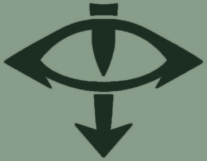

<!-- A0554-B0067 -->

原译文

The Eye of Horus, the Symbol of the Sons of Horus 荷鲁斯之眼，荷鲁斯之子的标志

**校订译文**

The Eye of Horus, the Symbol of the Sons of Horus 荷鲁斯之眼，荷鲁斯之子的标志

<!-- /A0554-B0067 -->

<!-- A0554-B0068 -->
### Transformation - The Sons of Horus 转变 - 荷鲁斯之子

<!-- /A0554-B0068 -->

<!-- A0554-B0069 -->
**英文原文**

Increasingly concerned, however, with a belief that some of the other Primarchs and their Legions did not show him and his Wolves enough honour in their roles as the Warmaster and his personal Legion, Horus, at the suggestion of Sanguinius, eventually took up the offer made to him by the Emperor to change the name and iconography of Legion XVI. Shortly after the Interex campaign the Luna Wolves became the Sons of Horus.

<!-- /A0554-B0069 -->

<!-- A0554-B0070 -->

原译文

然而，荷鲁斯越来越担心，其他一些原体及其军团在他担任战帅和他的个人军团时，他和他的影月苍狼没有展示足够的荣誉，在圣吉列斯的建议下，荷鲁斯最终接受了帝皇的提议，更改了第十六军团的名称和标志。英特雷斯战役后不久，影月苍狼成为了荷鲁斯之子。

**校订译文**

然而，荷鲁斯渐渐觉得，一些原体及其军团没有给予他和影月苍狼足够的敬重——他们理应尊重战帅，以及战帅亲自统率的军团。为此，在圣吉列斯的建议下，他最终接受帝皇先前的提议，更改第十六军团的名称与徽记。英特雷斯战役结束后不久，影月苍狼便更名为荷鲁斯之子。

**校注：** 英文指其他军团未给予荷鲁斯足够敬重，原译误作荷鲁斯未展示足够荣誉。

<!-- /A0554-B0070 -->

<!-- A0554-B0071 图片 -->
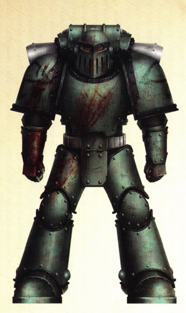

<!-- A0554-B0072 -->

原译文

Heresy-era Sons of Horus Space Marine 叛乱时期荷鲁斯之子战士

**校订译文**

Heresy-era Sons of Horus Space Marine 叛乱时期荷鲁斯之子战士

<!-- /A0554-B0072 -->

<!-- A0554-B0073 -->
**英文原文**

Not long after the change, Horus was wounded on the moon of Davin by Eugen Temba, an old subordinate who was under the influence of the Chaos Power Nurgle. Horus recovered in the Temple of the Serpent Lodge, a warrior and healing lodge on the planet. During his convalescence, he took part in the induction ceremony of the lodge. In the days that followed, some of Horus' officers detected a change in his character. It is now known that the warrior lodge was in fact a Chaos coven, which somehow managed to ensnare the Warmaster, allegedly due to scheming from Lorgar, Primarch of the Word Bearers.

<!-- /A0554-B0073 -->

<!-- A0554-B0074 -->

原译文

改变后不久，荷鲁斯在戴文的卫星上被受混沌之力纳垢影响的老部下欧根·坦巴打伤。荷鲁斯在蛇屋神庙中康复，这是一个行星上的战士和治疗结社。在康复期间，他参加了结社的入职仪式。在接下来的几天里，荷鲁斯的一些军官发现他的性格发生了变化。现在知道，战士结社实际上是一个混沌集会，它以某种方式设法诱捕了战帅，据称是由于怀言者原体洛加的阴谋。

**校订译文**

更名后不久，荷鲁斯在戴文的卫星上被旧部欧根·坦巴击伤；后者当时已受混沌神纳垢影响。荷鲁斯随后被送入戴文的蛇之结社神庙疗养。这一结社兼具战士组织与疗愈团体的性质，荷鲁斯在养伤期间参加了入会仪式。此后数日，一些军官察觉他的性情发生了变化。如今已知，这个战士结社实为混沌教团，并以某种手段诱使战帅堕落；据说这一切出自怀言者原体珞珈的谋划。

<!-- /A0554-B0074 -->

<!-- A0554-B0075 -->
**英文原文**

A similar warrior lodge already existed in his own Legion, started after the Luna Wolves' first visit to Davin - this was an example of the Primarch's well-tried practice to develop ties with local populations at work; feral natives were more easily recruited into the Imperial fold when the 'Warriors from the Stars' had become brothers - and it is believed it was subsequently used by the Primarch to aid in the corruption of his Marines. Warrior lodges in other legions under his command were similarly used. Horus' fealty had changed; his Legion eventually came to believe that he was actually possessed by a Daemon. Whether or not this is true, it is certain that he was now allied body and soul to the Powers of Chaos, and he had a new vision for the Imperium with himself at its head.

<!-- /A0554-B0075 -->

<!-- A0554-B0076 -->

原译文

在他自己的军团中已经存在着一个类似的战士结社，这是在影月苍狼第一次访问戴文之后开始的 — 这是原体与当地工作人员建立联系的良好实践的一个例子；当“来自群星的勇士”成为兄弟时，野蛮的土著更容易被招募到帝国的怀抱中 — 据信，这后来被原体用来帮助他的战士腐化。在他指挥下的其他军团中的战士结社也得到了类似的使用。荷鲁斯的忠诚已经改变；他的军团最终相信他实际上被一个恶魔附身了。不管这是不是真的，可以肯定的是，他现在全身心地与混沌力量结盟，他对帝国有了一个新的愿景，而他自己就是帝国之首。

**校订译文**

影月苍狼初访戴文后，军团内部便建立了类似的战士结社。这正是荷鲁斯惯用的怀柔手段：一旦“来自群星的战士”与当地人结为兄弟，那些蛮荒居民便更容易归入帝国。据信，荷鲁斯后来利用这一结社腐化麾下战士，并以同样手段利用受他指挥的其他军团中的战士结社。荷鲁斯已改变效忠对象；其军团最终甚至相信，他已被恶魔附身。无论这是否属实，可以确定的是，他已全身心投向混沌诸神，并开始构想一个由自己统治的帝国。

<!-- /A0554-B0076 -->

<!-- A0554-B0077 -->
**英文原文**

By the beginning of the Horus Heresy, the Sons of Horus numbered between 130,000 and 170,000 Space Marines and were considered one of the larger Legions of the Legio Astartes.

<!-- /A0554-B0077 -->

<!-- A0554-B0078 -->

原译文

在荷鲁斯叛乱开始时，荷鲁斯之子拥有13万至17万名星际战士，被认为是阿斯塔特军团中规模较大的军团之一。

**校订译文**

荷鲁斯之乱爆发时，荷鲁斯之子拥有十三万至十七万名星际战士，是阿斯塔特军团中规模较大的军团之一。

<!-- /A0554-B0078 -->

<!-- A0554-B0079 -->
### The Horus Heresy 荷鲁斯之乱

<!-- /A0554-B0079 -->

<!-- A0554-B0080 -->
**英文原文**

The majority of the Sons of Horus, already fiercely loyal and proud of their Warmaster, had no hesitation at the outbreak of the Horus Heresy. They quickly renounced their oaths to the Emperor and started to worship Horus and his new gods. The remaining portion of the Legion was betrayed and wiped out by their brothers on the world of Isstvan III, but not before reverting to the use of their original name, the Luna Wolves. Few loyalist Sons of Horus survived this purge. The best known was Iacton Qruze who fled the Isstvan III system on the Eisenstein; he too reverted to the name and even the iconography of the Luna Wolves. Other Sons of Horus had not been present at Isstvan III, and some of these stayed loyal, becoming Blackshields.

<!-- /A0554-B0080 -->

<!-- A0554-B0081 -->

原译文

荷鲁斯之子的大多数人已经非常忠诚，并为他们的战帅感到自豪，他们对荷鲁斯叛乱的爆发毫不犹豫。他们很快放弃了对帝皇的誓言，开始崇拜荷鲁斯和他的新神。军团的剩余部分在伊斯塔万三号世界上被他们的兄弟背叛并消灭，但在此之前，他们恢复了原来的名字影月苍狼。在这场清洗中，很少有忠诚的荷鲁斯之子幸存下来。最著名的是亚克顿·克鲁兹，他通过艾森斯坦号逃离了伊斯塔万三号星系；他也恢复了影月苍狼之名，甚至是它的标志。其他荷鲁斯之子没有出现在伊斯塔万三号，其中一些人保持忠诚，成为了黑盾。

**校订译文**

荷鲁斯之乱爆发时，大多数荷鲁斯之子对战帅忠心耿耿，以他为傲，因而毫不犹豫地追随叛乱。他们迅速背弃对帝皇的誓言，转而崇拜荷鲁斯及其新奉的诸神。军团中其余战士则在伊斯塔万三号遭到同袍背叛与屠杀；在覆灭之前，他们重新使用了“影月苍狼”的旧名。极少数忠诚派荷鲁斯之子逃过清洗，其中最著名的是乘艾森斯坦号逃离伊斯塔万三号星系的亚克顿·克鲁兹。他也恢复了影月苍狼的名称与徽记。另一些荷鲁斯之子当时不在伊斯塔万三号，其中部分人坚守忠诚，成为黑盾。

<!-- /A0554-B0081 -->

<!-- A0554-B0082 图片 -->
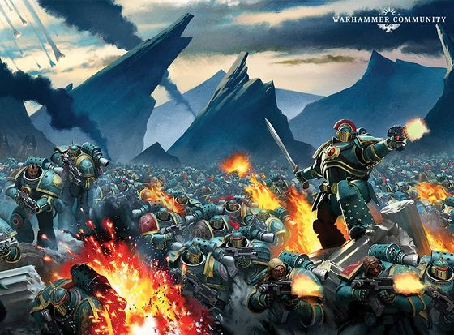

<!-- A0554-B0083 -->

原译文

The Sons of Horus attack 荷鲁斯之子攻击

**校订译文**

The Sons of Horus attack 荷鲁斯之子攻击

<!-- /A0554-B0083 -->

<!-- A0554-B0084 -->
**英文原文**

Outside the Legion, Horus' corruption spread to every organisation with which he had dealings, including a division of the Adeptus Mechanicus, and from there to the Collegia Titanica and the Legio Cybernetica. The other Primarchs Horus knew like brothers, and he was already well practiced at motivating them. Appealing to their pride, martial prowess and courage while playing upon past grudges and favours, the Warmaster gained the loyalty of fully half the Primarchs. The war that followed was the most terrible in the history of the Imperium and came close to shattering it forever. Space Marines fought Space Marines and Titans fought Titans. Horus carved out a vast swathe of the Northern Imperium which became known as the Dark Empire.

<!-- /A0554-B0084 -->

<!-- A0554-B0085 -->

原译文

在军团之外，荷鲁斯的腐化蔓延到他与之打交道的每个组织，包括机械神教的一个部分，并从那里蔓延到泰坦修会和智控军团。对其他的原体荷鲁斯就像兄弟一样，他已经很善于激励他们了。在利用过去的怨恨和恩惠的同时，战帅吸引了他们的骄傲、军事实力和勇气，赢得了整整一半的原体的忠诚。随后发生的战争是帝国历史上最可怕的战争，几乎将其永远粉碎。星际战士与星际战士作战，泰坦与泰坦作战。荷鲁斯开辟了一大片北方帝国，后来被称为黑暗帝国。

**校订译文**

在军团之外，荷鲁斯的腐化也蔓延至与他往来的各个组织，包括机械修会的一部分势力，并由此波及泰坦修会和智控军团。他对其他原体十分熟悉，深知如何打动这些兄弟。战帅以他们的骄傲、武勇与胆识为突破口，同时利用往日的恩怨，最终赢得了整整半数原体的效忠。随之而来的战争，是帝国历史上最惨烈的浩劫，几乎将帝国彻底撕碎。星际战士与星际战士相残，泰坦与泰坦交战。荷鲁斯从帝国北部割据了大片疆域，形成后来所谓的“黑暗帝国”。

<!-- /A0554-B0085 -->

<!-- A0554-B0086 -->
**英文原文**

On Molech, the Sons of Horus scored a major victory and Horus was able to acquire the same powers of the Emperor. During this same battle, the pre-Heresy Mournival was reunited aboard the Vengeful Spirit after an infiltration team of Knights-Errant including Garviel Loken was captured and brought before Horus in Lupercal's Court. After a fierce battle that saw the Warmaster slay Iacton Qruze, the Knights-Errant managed to escape. Horus was later confronted by Leman Russ, and was badly wounded by the Spear of Russ during the Battle of Trisolian despite the traitor military victory.

<!-- /A0554-B0086 -->

<!-- A0554-B0087 -->

原译文

在摩洛，荷鲁斯之子取得了重大胜利，荷鲁斯得以获得与帝皇相同的力量。在同一场战斗中，叛乱前的四王议会在复仇之魂号上重聚，此前包括加维尔·洛肯在内的游侠骑士渗透小队被捕并被带到卢佩卡尔王庭的荷鲁斯面前。经过一场激烈的战斗，战帅杀死了亚克顿·克鲁兹，游侠骑士设法逃脱了。荷鲁斯后来遇到了黎曼·鲁斯，尽管叛徒取得了军事胜利，但在特里索兰之战中，他还是被鲁斯之矛重伤。

**校订译文**

在摩洛，荷鲁斯之子取得重大胜利，荷鲁斯也获得了与帝皇相同的力量。在这场战役期间，包括加维尔·洛肯在内的一支游侠骑士渗透小队被俘，被带到复仇之魂号的卢佩卡尔王庭，面见荷鲁斯，叛乱前的四王议会因此重聚。一场激战随即爆发，亚克顿·克鲁兹被战帅杀死，其余游侠骑士设法脱身。后来，荷鲁斯又与黎曼·鲁斯交锋。尽管叛军赢得了特里索兰之战，荷鲁斯却被鲁斯之矛重创。

<!-- /A0554-B0087 -->

<!-- A0554-B0088 -->
**英文原文**

Horus' wound by Russ proved severe, sending the Warmaster into a comatose-like state as his soul was fought over by the Gods of Chaos. Without his guidance the war effort faltered, with many Primarchs refusing to listen and Horus Aximand and Falkus Kibre proving indecisive and stubborn despite Maloghurst's best attempts to retain cohesion and enact Horus' will. At Heta-Gladius, the Vengeful Spirit itself faced destruction under the leadership of Aximand as Maloghurst enacted a ritual to try and restore Horus. Thanks to the sacrifice of Maloghurst, Horus' soul was restored, and the Sons of Horus arrived at Ullanor for the general muster of traitor forces before the move on Terra. Meanwhile, the Sons of Horus' own homeworld of Cthonia was besieged and conquered by the Imperial Fists.

<!-- /A0554-B0088 -->

<!-- A0554-B0089 -->

原译文

鲁斯对荷鲁斯的伤害很严重，当他的灵魂被混沌诸神争夺时，战帅陷入了类似昏迷的状态。没有他的指导，战争的努力步履蹒跚，许多原体拒绝听令，尽管马洛赫斯特尽最大努力保持凝聚并制定荷鲁斯的意志，但荷鲁斯·阿西曼德和法库斯·凯博表现出犹豫不决和固执。在赫塔-格拉迪厄斯，复仇之魂号在阿西曼德的领导下面临毁灭，马洛赫斯特制定了一项仪式，试图恢复荷鲁斯。由于马洛赫斯特的牺牲，荷鲁斯的灵魂得以恢复，荷鲁斯之子在前往泰拉之前抵达乌兰诺，召集叛徒部队。与此同时，荷鲁斯之子自己的家园世界科索尼亚被帝国之拳围困并征服。

**校订译文**

鲁斯造成的创伤十分严重。混沌诸神争夺荷鲁斯的灵魂，令战帅陷入近乎昏迷的状态。失去他的指引，叛军战局停滞不前：许多原体拒绝听令，荷鲁斯·阿西曼德和法库斯·凯博则优柔寡断、固执己见；马洛赫斯特虽竭力维持团结、贯彻荷鲁斯的意志，也难以扭转局面。在赫塔-格拉迪厄斯，阿西曼德的指挥让复仇之魂号也面临覆灭，马洛赫斯特于是举行仪式，试图唤醒荷鲁斯。最终，他以自身的牺牲恢复了荷鲁斯的灵魂。荷鲁斯之子随后抵达乌兰诺，参加进军泰拉前的叛军总集结。与此同时，军团的母星科索尼亚遭到帝国之拳围攻，并被其征服。

<!-- /A0554-B0089 -->

<!-- A0554-B0090 -->
**英文原文**

At the climax of the war, the traitors struck towards the Sol System and brought closure to the Solar War. By this point, the Sons of Horus had begun deploying Newborn Legionaries, new Space Marines hastily created during the Heresy itself. A large splinter Sons of Horus force, called the "True Sons of Cthonia", was allowed by Horus to attempt to retake Cthonia. This group, led by Captain Vheren Ashurhaddon, remained loyal to their Primarch, but believed that the Legion was losing itself due to the influence of Chaos, seeing salvation in the old traditions of their homeworld.

<!-- /A0554-B0090 -->

<!-- A0554-B0091 -->

原译文

在战争的高潮，叛徒向太阳系发起进攻，带来了太阳战争的终结。此时，荷鲁斯之子已经开始部署新血军团士兵，这是叛乱时期匆忙创建的新星际战士。荷鲁斯允许一支名为“科索尼亚真实之子”的荷鲁斯之子部队试图夺回科索尼亚。这个由维伦·阿舒哈顿连长领导的团体仍然忠于他们的原体，但认为由于混沌的影响，军团正在失去自我，在他们家园世界的旧传统中看到了救赎。

**校订译文**

战争进入高潮时，叛军攻向太阳系，并最终结束了太阳战争。此时，荷鲁斯之子已开始部署“新血军团士兵”——这些星际战士是在叛乱期间仓促改造而成的。荷鲁斯还允许一支规模庞大的分遣部队“科索尼亚真子”尝试夺回母星。该部由维伦·阿舒哈顿连长率领，仍然忠于原体，却认为混沌正在侵蚀军团的本色；他们相信，母星的古老传统才是救赎之道。

**校注：** True Sons of Cthonia 暂沿原稿真子之义规范为科索尼亚真子；不据此赋予额外忠诚派含义。

<!-- /A0554-B0091 -->

<!-- A0554-B0092 -->
**英文原文**

After his victory in the Solar War, Terra was invaded by Horus, and the Emperor's Palace itself was besieged and breached. However by this point the constant pull of the Ruinous Powers had seen Horus' mental state deteroriate, and he became increasingly withdrawn from the day-to-day affairs of the siege as his emissary Argonis became horrified by his apparent senility. In a bid to end the war to save the ever-decaying Horus, Abaddon and the Mournival led a subterranean assault on the Saturnine Gate. However the assault failed due to preparations by Rogal Dorn, and all the Mournival save Abaddon himself died in the assault. Following the disaster figures such as Indras Archeta, Azelas Baraxa, and Xhofar Beruddin rose to prominence, but these were poor copies of their predecessors and the Legion began to fracture into warlordism amidst Terra's ruins.

<!-- /A0554-B0092 -->

<!-- A0554-B0093 -->

原译文

在太阳战争胜利后，泰拉被荷鲁斯入侵，帝皇的宫殿本身被围困和破坏。然而，到了这一点，毁灭力量的不断拉扯已经让荷鲁斯的精神状态变得不稳定，随着他的密使阿尔戈尼斯对他明显的衰老感到震惊，他越来越远离围城的日常事务。为了结束战争以拯救不断衰败的荷鲁斯，阿巴顿和四王议会领导了对土星之门的地下进攻。然而，由于罗格·多恩的准备，袭击失败了，除了阿巴顿本人，所有的四王议会都在袭击中丧生。灾难发生后，因德拉斯·亚克塔、艾泽拉斯·巴拉夏和寇法尔·贝鲁丁等人物崭露头角，但这些都是对他们前任的拙劣复制，军团开始在泰拉的废墟中分裂成军阀割据。

**校订译文**

赢得太阳战争后，荷鲁斯入侵泰拉，围攻并突破了帝皇的宫殿。然而此时，毁灭诸神不断拉扯着他的心智，使其精神状态日益恶化。他越来越少过问围城的日常战事，其密使阿尔戈尼斯对他表现出的衰颓与昏聩深感恐惧。阿巴顿与四王议会为尽快结束战争、挽救不断衰败的荷鲁斯，率军从地下突袭土星之门。但罗格·多恩早有准备，突袭以失败告终，四王议会成员除阿巴顿外全部阵亡。惨败之后，因德拉斯·阿切塔、阿兹拉斯·巴拉克萨、寇法尔·贝鲁丁等人崛起，却远不及前任。军团在泰拉废墟中逐渐分裂，陷入军阀割据。

**校注：** 对照本段英文确认同一实体，与全书核心译名统一；不改变同形异义词或省略称呼。 对照本段英文确认同一实体，与全书核心译名统一；不改变同形异义词或省略称呼。

<!-- /A0554-B0093 -->

<!-- A0554-B0094 -->
**英文原文**

In the end, it was Horus who was slain, and with him died the rebellion. On the 55th day of the siege, Horus, in a bid to end the campaign quickly, lowered the shields around his flagship, daring the Emperor to board it. He did so, and although the Emperor was brought low in their resultant duel, Horus was killed. It was a traumatic and devastating blow for the Sons of Horus, who immediately broke off from their assault upon the planet below. However, they launched a costly counter-attack to retake their fallen Primarch's body. The remnants of the Imperial boarding party who had not already left were thus scoured from the vessel by Abaddon and his 1st Company Terminators.

<!-- /A0554-B0094 -->

<!-- A0554-B0095 -->

原译文

最后，荷鲁斯被杀，叛乱也随之而去。在围城的第55天，荷鲁斯为了迅速结束战役，降下了旗舰周围的护盾，让帝皇登上旗舰。他这样做了，尽管帝皇在决斗中被击败，荷鲁斯还是被杀了。这对荷鲁斯之子来说是一个创伤和毁灭性的打击，他们立即停止了对下面行星的攻击。然而，他们发动了代价高昂的反击，夺回了倒下的原体的尸体。帝国跳帮小队尚未离开的残余人员被阿巴顿和他的第一连队终结者从船上赶出。

**校订译文**

最终，荷鲁斯战死，叛乱也随之瓦解。在围城的第五十五天，他为迅速结束战役，主动撤下旗舰护盾，诱帝皇登舰决战。帝皇应战，虽在随后对决中遭受重创，仍杀死了荷鲁斯。这一毁灭性打击震垮了荷鲁斯之子，他们立即停止对下方行星的进攻，却又不惜重大伤亡，发起反击，夺回原体的遗体。阿巴顿与第一连终结者随后清剿了仍未撤离旗舰的帝国跳帮部队。

**校注：** 第五十五天及帝皇登舰对决的叙述均按本篇所给英文保留；brought low 译为遭受重创，不扩写为帝皇被击败。

<!-- /A0554-B0095 -->

<!-- A0554-B0096 -->
### Post-Heresy 叛乱后

<!-- /A0554-B0096 -->

<!-- A0554-B0097 -->
### Degradation 退化

<!-- /A0554-B0097 -->

<!-- A0554-B0098 -->
**英文原文**

Horus' death broke the Sons of Horus' morale, and they began to retreat from Terra after recovering Horus' corpse. This act further undermined the Traitors' cohesion, as they were left leaderless. Several factions of the other Traitor legions would come to blame the Sons of Horus for the ultimate failure of the Siege of Terra, claiming that victory could still have been achieved. Meanwhile, Vheren Ashurhaddon's attempt to retake Cthonia was foiled when the Dark Angels destroyed the planet, killing most of the still-fighting traitors and loyalists on it. However, Ashurhaddon and some of his followers were able to escape, hoping to use the memory of Cthonia to eventually reforge their Legion.

<!-- /A0554-B0098 -->

<!-- A0554-B0099 -->

原译文

荷鲁斯之死打击了荷鲁斯之子的士气，他们在找到荷鲁斯的尸体后开始从泰拉撤退。这一行为进一步削弱了叛徒的凝聚力，因为他们失去了领导者。其他叛徒军团的几个派系指责荷鲁斯之子导致了泰拉围城的最终失败，声称胜利仍然可以实现。与此同时，当黑暗天使摧毁了行星，杀死了行星上大多数仍在战斗的叛徒和忠诚者时，维伦·阿舒哈顿夺回科索尼亚的企图被挫败了。然而，阿舒哈顿和他的一些追随者得以逃脱，希望利用科索尼亚的记忆最终重建他们的军团。

**校订译文**

荷鲁斯之死彻底击溃了军团的士气。夺回原体遗体后，荷鲁斯之子开始撤离泰拉，使本已群龙无首的叛军更加涣散。其他叛徒军团中的一些派系，将泰拉围城的最终失败归咎于荷鲁斯之子，坚称当时仍有取胜的可能。与此同时，黑暗天使摧毁了科索尼亚，仍在星球上交战的大多数叛军与忠诚派随之覆灭，维伦·阿舒哈顿收复母星的计划也宣告失败。不过，阿舒哈顿和部分追随者成功逃脱，希望凭借对科索尼亚的共同记忆，终有一日重建军团。

**校注：** 本段明确称黑暗天使在叛乱末期摧毁科索尼亚，与篇首推测性旧记载不一致；两处均保留并交叉提示。

<!-- /A0554-B0099 -->

<!-- A0554-B0100 图片 -->
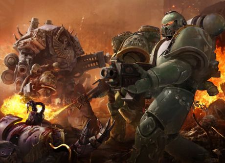

<!-- A0554-B0101 -->

原译文

The Sons of Horus fight in the Legion Wars 军团战争中战斗的荷鲁斯之子

**校订译文**

The Sons of Horus fight in the Legion Wars 军团战争中战斗的荷鲁斯之子

<!-- /A0554-B0101 -->

<!-- A0554-B0102 -->
**英文原文**

With the Great Scouring's conclusion, the entire Legion regrouped on the world of Maeleum inside the Eye of Terror. There they built a fortress-tomb for the safe-keeping of the Warmaster's corpse and even in death still revered him as their commander. Nobody was appointed in his place and the Captains of the Legion would offer sacrifices and pray for guidance in his shrine. Many Sons of Horus venetrated their dead Primarch as a god, believing that he would eventually be resurrected to return them to greatness. Some Sons of Horus rejected this devotion outright, however, leaving Maeleum and deciding that they would never again bow down to anyone, be it mortals or gods.

<!-- /A0554-B0102 -->

<!-- A0554-B0103 -->

原译文

随着大清洗的结束，整个军团在恐惧之眼内重新集结在玛勒姆世界。在那里，他们建造了一座堡垒坟墓，用于安全保管战帅的尸体，即使在死亡时，他们仍然尊他为指挥官。没有人被任命接替他的位置，军团连长会在他的圣地献祭并祈祷指引。许多荷鲁斯之子将他们死去的原体传颂为神，相信他最终会复活，让他们恢复伟大。然而，一些荷鲁斯之子彻底拒绝了这种奉献，离开了梅勒姆，并决定他们再也不会向任何人低头，无论是凡人还是神。

**校订译文**

大清洗结束后，整个军团在恐惧之眼内的玛勒姆重新集结。他们修建堡垒陵墓，安放战帅的遗体，死后仍尊他为统帅。无人受命继任，军团连长们则在他的神龛前献祭，祈求指引。许多荷鲁斯之子将亡故的原体奉为神明，相信他终将复活，带领军团重现荣光。然而，也有人断然拒绝这种崇拜，离开玛勒姆，发誓从此不再向任何人屈膝，无论凡人还是神祇。

**校注：** Maeleum 与本篇 Maleum 拼写指同一行星，中文统一玛勒姆；保留原始英文字形。

<!-- /A0554-B0103 -->

<!-- A0554-B0104 -->
**英文原文**

The Sons of Horus were initially the most aggressive Legion against the Imperium, as if to atone for their previous cowardice on Terra or perhaps to attempt to 're-prove' that they were still the best Legion. The Sons dedicated themselves not to one single Chaos Power but constantly shifted their allegiance to whatever god suited them at the time. Marines willingly became possessed by the Chaos Gods' daemons; with every change in loyalty, the daemons of the rejected god abandoned the hosts, leaving them lifeless husks. The once great Legion constantly dwindled in number, until they neared extinction. Eventually the desperate experimentation and research by the Legion's Sorcerer-Librarians uncovered a method of possession that did not destroy the mortal host, saving the Legion. Soon, the Sons of Horus were regrowing in strength, and intended to reassert their former position as predominant legion among the Traitors.

<!-- /A0554-B0104 -->

<!-- A0554-B0105 -->

原译文

荷鲁斯之子最初是对抗帝国最具侵略性的军团，似乎是为了弥补他们之前在泰拉上的懦弱，或者试图“重新证明”他们仍然是最好的军团。荷鲁斯之子没有献身于一种混沌之力，而是不断地将他们的忠诚转移到当时适合他们的任何神之上。战士心甘情愿地被混沌诸神的恶魔附身；随着忠诚的每一次改变，被拒绝的神的恶魔都抛弃了主人，留下了没有生命的外壳。曾经伟大的军团成员不断减少，直到他们濒临灭绝。最终，军团的巫师智库进行了绝望的实验和研究，发现了一种不会摧毁凡人宿主的占据方法，从而拯救了军团。很快，荷鲁斯之子的力量正在恢复，并打算重新确立他们以前在叛徒中占主导地位的军团地位。

**校订译文**

起初，荷鲁斯之子对帝国发动的攻势比其他军团更为猛烈，仿佛要弥补在泰拉的怯懦，或再次证明自己仍是最优秀的军团。他们并不专奉某一位混沌神，而是随时转向最符合当下需要的神祇。战士们甘愿接受混沌诸神的恶魔附身，但每次改变效忠对象，遭到背弃的神祇麾下的恶魔便会离开宿主，留下毫无生机的躯壳。这个曾经强盛的军团人数不断减少，几乎灭绝。最终，军团的巫师智库员在绝境中反复实验、研究，找到了不会摧毁凡人宿主的附身方法，才挽救了军团。荷鲁斯之子很快恢复实力，打算重夺昔日在叛徒军团中的首位。

<!-- /A0554-B0105 -->

<!-- A0554-B0106 -->
**英文原文**

The Traitor Legions, along with the restored but still numerically inferior Sons of Horus, then became embroiled in a series of internecine wars triggered by the Emperor's Children legion. These conflicts dragged on for centuries, and particularily weakened the Sons of Horus, culminating in the destruction of their fortress on Maleum. The legion was shattered during this battle, and suffered massive losses. To the horror of the surviving Sons of Horus, the Warmaster's corpse was taken by the Emperor's Children and several clones were created by their self-styled 'Primogenitor', Fabius Bile. Meanwhile, the other Traitor Legions hunted down the remnants of the Sons of Horus, bringing the legion close to extinction.

<!-- /A0554-B0106 -->

<!-- A0554-B0107 -->

原译文

叛徒军团，以及恢复但数量仍然较低的荷鲁斯之子，随后卷入了由帝皇之子军团引发的一系列自相残杀的战争。这些冲突持续了几个世纪，尤其削弱了荷鲁斯之子，最终摧毁了他们在玛勒姆的堡垒。军团在这场战斗中被击溃，遭受了巨大的损失。令幸存的荷鲁斯之子们震惊的是，战帅的尸体被帝皇之子带走了，他们自封的“始祖”法比乌斯·拜尔创造了几个克隆人。与此同时，其他叛徒军团追捕了荷鲁斯之子的残余势力，使军团濒临灭绝。

**校订译文**

此后，叛徒军团卷入帝皇之子挑起的一连串内战，实力虽已恢复、人数仍处劣势的荷鲁斯之子也未能幸免。冲突延续数百年，尤以荷鲁斯之子受创最深，最终连玛勒姆的堡垒也遭摧毁。军团在这一战中四分五裂，伤亡惨重。更令幸存者惊骇的是，帝皇之子夺走了战帅的遗体，其自封为“始祖”的法比乌斯·拜尔制造了数个荷鲁斯克隆体。与此同时，其他叛徒军团继续追杀荷鲁斯之子残部，使其再次濒临灭绝。

<!-- /A0554-B0107 -->

<!-- A0554-B0108 -->
### Fate 命运

<!-- /A0554-B0108 -->

<!-- A0554-B0109 -->
**英文原文**

It was at this point that the old Sons of Horus Justaerin Captain Falkus Kibre was able to track down the Vengeful Spirit and Abaddon deep inside the Eye of Terror. Abaddon revealed his intent to destroy the clone of Horus and reform the Sons of Horus into a Legion to finish the war Horus had begun. After smashing the Emperor's Children fortress and killing the clone of Horus, Abaddon declared himself the rightful successor of the Warmaster. Painting their armor black, Abaddon renamed his forces the Black Legion, rejecting Horus' name and all the failure that went with it. Abaddon managed to reunify the bulk of the old surviving Sons of Horus under his banner. In addition, he gathered disparate warbands which had originated in the other Traitor Legions, thus transforming the Black Legion into an entirely new force which now continues the Long War against the Imperium in the form of Black Crusades.

<!-- /A0554-B0109 -->

<!-- A0554-B0110 -->

原译文

正是在这一点上，荷鲁斯之子加斯塔林连长法库斯·凯博能够在恐惧之眼深处追踪到复仇之魂号和阿巴顿。阿巴顿透露，他打算摧毁荷鲁斯的克隆人，并将荷鲁斯之子改造成一个军团，以结束自荷鲁斯开始的战争。在粉碎了帝皇之子的堡垒并杀死了荷鲁斯的克隆人之后，阿巴顿宣布自己是战帅的合法继承人。阿巴顿将他们的盔甲涂成黑色，将他的部队重新命名为“黑色军团”，拒绝了荷鲁斯的名字以及随之而来的所有失败。阿巴顿设法将大部分幸存的荷鲁斯之子统一在他的旗帜下。此外，他召集了来自其他叛徒军团的不同兵种，从而将黑色军团转变为一支全新的力量，现在以黑色远征的形式继续与帝国的长期战争。

**校订译文**

就在此时，昔日荷鲁斯之子加斯塔林连长法库斯·凯博，在恐惧之眼深处找到了复仇之魂号与阿巴顿。阿巴顿透露，他打算摧毁荷鲁斯的克隆体，将荷鲁斯之子重组为一支军团，完成荷鲁斯开启却未竟的战争。在攻破帝皇之子堡垒、杀死荷鲁斯克隆体后，阿巴顿宣称自己是战帅的正统继承者。他让麾下战士把护甲涂成黑色，并将部队更名为“黑色军团”，舍弃荷鲁斯之名及其象征的全部失败。他成功将大多数幸存的荷鲁斯之子重新集结在自己旗下，又吸纳来自其他叛徒军团的各支战帮，将黑色军团塑造成一支全新的力量。如今，它以一次次黑色远征，延续对帝国的万古长战。

**校注：** warbands 为战帮，不是兵种；Long War 与0526专篇统一为万古长战。

<!-- /A0554-B0110 -->

<!-- A0554-B0111 图片 -->
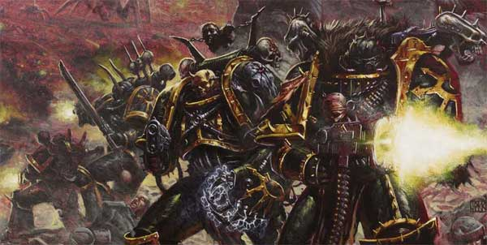

<!-- A0554-B0112 -->

原译文

The Black Legion invades 黑色军团侵略

**校订译文**

The Black Legion invades 黑色军团侵略

<!-- /A0554-B0112 -->

<!-- A0554-B0113 -->
**英文原文**

Not all of the surviving Sons of Horus ended up joining the Black Legion willingly. Many actually opposed Abaddon's rule at first, and Sons of Horus warbands such as Korosan Myrlath‎'s force were among his earliest enemies. Most of these groups did not survive, however, being either wiped out or ultimately agreeing to bend the knee to Abaddon. A few, such as the Sons of the Eye, Wolves of Horus, and True Sons were able to evade him, and continued to operate independently. Known as the "Thrice-Cursed Traitors‎", these last remnants of the Sons of Horus now face persecution by Abaddon's hands.

<!-- /A0554-B0113 -->

<!-- A0554-B0114 -->

原译文

并非所有幸存的荷鲁斯之子最终都自愿加入了黑色军团。起初，许多人实际上反对阿巴顿的统治，以及科罗桑·米拉斯的部队等荷鲁斯之子战帮是他最早的敌人之一。然而，这些团体中的大多数都没有幸存下来，要么被消灭，要么最终同意向阿巴顿屈膝。少数人，如“眼之子”、“荷鲁斯之狼”和“真实之子”，能够躲避他，并继续独立行动。被称为“三重诅咒叛徒”‎，这些荷鲁斯之子的最后残余现在面临着阿巴顿的迫害。

**校订译文**

并非所有幸存的荷鲁斯之子都自愿加入黑色军团。许多人起初反对阿巴顿的统治，科罗桑·米拉斯麾下等荷鲁斯之子战帮，甚至是他最早的一批敌人。大多数反对势力最终不是被消灭，就是向阿巴顿屈膝臣服；只有眼之子、荷鲁斯之狼和真子等少数战帮成功避开追剿，继续独立活动。这些最后的荷鲁斯之子残部被称为“三重诅咒叛徒”，至今仍遭阿巴顿迫害。

**校注：** True Sons 战帮暂规范为真子；不与前文 True Sons of Cthonia 科索尼亚真子自动合并为同一组织。

<!-- /A0554-B0114 -->

<!-- A0554-B0115 -->
### Notable Engagements 著名交战

<!-- /A0554-B0115 -->

<!-- A0554-B0116 -->
### The Great Crusade 大远征

<!-- /A0554-B0116 -->

<!-- A0554-B0117 -->

原译文

???.M30: First Pacification of Luna 第一次月球平定

**校订译文**

???.M30: First Pacification of Luna 第一次月球平定

<!-- /A0554-B0117 -->

<!-- A0554-B0118 -->

原译文

???.M30: Battle of Luhman 卢赫曼之战

**校订译文**

???.M30: Battle of Luhman 卢赫曼之战

<!-- /A0554-B0118 -->

<!-- A0554-B0119 -->

原译文

???.M30: Siege of Reillis 莱利斯围城

**校订译文**

???.M30: Siege of Reillis 莱利斯围城

<!-- /A0554-B0119 -->

<!-- A0554-B0120 -->

原译文

???.M30: Battle of Gorro 戈罗之战

**校订译文**

???.M30: Battle of Gorro 戈罗之战

<!-- /A0554-B0120 -->

<!-- A0554-B0121 -->

原译文

???.M30: Astranii Campaign 阿斯特拉尼战役

**校订译文**

???.M30: Astranii Campaign 阿斯特拉尼战役

<!-- /A0554-B0121 -->

<!-- A0554-B0122 -->

原译文

???.M30: Overseer War 监工战争

**校订译文**

???.M30: Overseer War 监工战争

<!-- /A0554-B0122 -->

<!-- A0554-B0123 -->

原译文

???.M30: Melchior Compliance 梅尔基奥尔征服

**校订译文**

???.M30: Melchior Compliance 梅尔基奥尔征服

<!-- /A0554-B0123 -->

<!-- A0554-B0124 -->

原译文

???.M30: Battle of Hell's Anvil 地狱铁砧之战

**校订译文**

???.M30: Battle of Hell's Anvil 地狱铁砧之战

<!-- /A0554-B0124 -->

<!-- A0554-B0125 -->

原译文

???.M30: Battle of Gyros-Thravian 杰罗斯-萨洛维安之战

**校订译文**

???.M30: Battle of Gyros-Thravian 杰罗斯-萨洛维安之战

<!-- /A0554-B0125 -->

<!-- A0554-B0126 -->
**英文原文**

???.M30: The Night Crusade — The Legion fights alongside the Imperial Fists, Dark Angels, and Emperor's Children.

<!-- /A0554-B0126 -->

<!-- A0554-B0127 -->

原译文

午夜远征 — 军团与帝国之拳、黑暗天使和帝皇之子并肩作战。

**校订译文**

???.M30：午夜远征——军团与帝国之拳、黑暗天使及帝皇之子并肩作战。

<!-- /A0554-B0127 -->

<!-- A0554-B0128 -->

原译文

???.M30: Castigation of Terentius 特兰提乌斯惩罚

**校订译文**

???.M30: Castigation of Terentius 特兰提乌斯惩罚

<!-- /A0554-B0128 -->

<!-- A0554-B0129 -->

原译文

???.M30: Defeat of the Omakkad Princes 击败奥马卡德王子

**校订译文**

???.M30: Defeat of the Omakkad Princes 击败奥马卡德王子

<!-- /A0554-B0129 -->

<!-- A0554-B0130 -->

原译文

881.M30: Emancipation of Drune 德鲁内解放

**校订译文**

881.M30: Emancipation of Drune 德鲁内解放

<!-- /A0554-B0130 -->

<!-- A0554-B0131 -->

原译文

???.M30: Battle of Keylek 凯莱克之战

**校订译文**

???.M30: Battle of Keylek 凯莱克之战

<!-- /A0554-B0131 -->

<!-- A0554-B0132 -->

原译文

???.M30: Battle of Gate Forty-Two 四十二之门之战

**校订译文**

???.M30: Battle of Gate Forty-Two 四十二之门之战

<!-- /A0554-B0132 -->

<!-- A0554-B0133 -->
**英文原文**

???.M30: Dagonet — Compliance action. Victorious.

<!-- /A0554-B0133 -->

<!-- A0554-B0134 -->

原译文

达戈尼特 — 征服行动，胜利

**校订译文**

???.M30：达戈尼特——归顺作战，获胜。

<!-- /A0554-B0134 -->

<!-- A0554-B0135 -->
**英文原文**

???.M30: Battle of Davin — Compliance action. Undertaken in concert with the Word Bearers. Victorious.

<!-- /A0554-B0135 -->

<!-- A0554-B0136 -->

原译文

戴文之战 — 征服行动。与怀言者合作进行。胜利。

**校订译文**

???.M30：戴文之战——与怀言者共同实施的归顺作战，获胜。

<!-- /A0554-B0136 -->

<!-- A0554-B0137 -->
**英文原文**

000.M31: Ullanor Crusade — Liberation action against an Ork Empire. Victorious.

<!-- /A0554-B0137 -->

<!-- A0554-B0138 -->

原译文

乌兰诺远征 — 对欧克帝国的解放行动。胜利。

**校订译文**

000.M31：乌兰诺远征——针对一个欧克帝国的解放作战，获胜。

<!-- /A0554-B0138 -->

<!-- A0554-B0139 -->
**英文原文**

001.M31: Battle of 63-19 — Compliance action. Victorious.

<!-- /A0554-B0139 -->

<!-- A0554-B0140 -->

原译文

63-19之战 — 征服行动。胜利。

**校订译文**

001.M31：63-19之战——归顺作战，获胜。

<!-- /A0554-B0140 -->

<!-- A0554-B0141 -->
**英文原文**

???.M31: War on Murder — Extermination action. Campaign abandoned.

<!-- /A0554-B0141 -->

<!-- A0554-B0142 -->

原译文

谋杀战争 — 灭绝行动。战役被放弃。

**校订译文**

???.M31：谋杀星战争——灭绝作战，后放弃战役。

**校注：** Murder 此处是行星名，原译谋杀战争漏掉地名含义。 已核同一人物、组织、型号或事件，与全书核心术语及后续专篇统一；原译保留对照。

<!-- /A0554-B0142 -->

<!-- A0554-B0143 -->
**英文原文**

???.M31: Compliance action against the Interex empire on Xenobia. Compliance attempted by negotiation. Campaign abandoned.

<!-- /A0554-B0143 -->

<!-- A0554-B0144 -->

原译文

针对英特雷斯帝国在芝诺比亚问题上的征服行动。通过谈判尝试征服。战役被放弃。

**校订译文**

???.M31：在泽诺比娅对英特雷斯帝国开展归顺行动，试图通过谈判使其归顺，后放弃行动。

<!-- /A0554-B0144 -->

<!-- A0554-B0145 -->
**英文原文**

004.M31: Battle of Davin's Moon — Police action against an apparent rebellion by Imperial forces; combated daemons. While victory was achieved, Horus was gravely wounded.

<!-- /A0554-B0145 -->

<!-- A0554-B0146 -->

原译文

戴文卫星之战 — 治安行动对抗帝国军队明显叛乱的行动；对抗恶魔。虽然取得了胜利，但荷鲁斯受了重伤。

**校订译文**

004.M31：戴文卫星之战——针对一场表面上的帝国军队叛乱开展治安行动，并与恶魔交战。虽取得胜利，荷鲁斯却身负重伤。

<!-- /A0554-B0146 -->

<!-- A0554-B0147 -->
**英文原文**

???.M31: Compliance action against the Auretian Technocracy. Victorious.

<!-- /A0554-B0147 -->

<!-- A0554-B0148 -->

原译文

针对奥瑞提亚科技联盟的征服行动。胜利。

**校订译文**

???.M31：对奥瑞提安技术联盟实施归顺作战，获胜。

<!-- /A0554-B0148 -->

<!-- A0554-B0149 -->

原译文

???.M31: Battle with the Eldar on the Tza-Chao 在扎-潮与灵族战斗

**校订译文**

???.M31: Battle with the Eldar on the Tza-Chao 在扎-潮与灵族战斗

<!-- /A0554-B0149 -->

<!-- A0554-B0150 -->
### The Horus Heresy 荷鲁斯之乱

原题：The Horus Heresy 荷鲁斯叛乱

<!-- /A0554-B0150 -->

<!-- A0554-B0151 -->
**英文原文**

004-005.M31: The Burning of Prospero — The 16th Independent Battalion, 5000 legionaries in total, under the command of Boros Kurn takes part in the conflict.

<!-- /A0554-B0151 -->

<!-- A0554-B0152 -->

原译文

普罗斯佩罗之焚 - 第16独立营，共5000名军团士兵，在博罗斯·库恩的指挥下参加了冲突。

**校订译文**

004—005.M31：普罗斯佩罗之焚——博洛斯·科恩率领第十六独立营的五千名军团战士参战。

**校注：** 对照本段英文确认同一实体，与全书核心译名统一；不改变同形异义词或省略称呼。

<!-- /A0554-B0152 -->

<!-- A0554-B0153 -->
**英文原文**

005.M31: The Battle of Isstvan III — Legion split; Horusian faction ultimately victorious.

<!-- /A0554-B0153 -->

<!-- A0554-B0154 -->

原译文

伊斯塔万三号之战 — 军团分裂；荷鲁斯派最终获胜。

**校订译文**

005.M31：伊斯塔万三号之战——军团分裂，效忠荷鲁斯的一方最终获胜。

<!-- /A0554-B0154 -->

<!-- A0554-B0155 -->

原译文

006.M31: Battle of Diamat 迪亚马特之战

**校订译文**

006.M31: Battle of Diamat 迪亚马特之战

<!-- /A0554-B0155 -->

<!-- A0554-B0156 -->
**英文原文**

006.M31: The Drop Site Massacre — Victorious.

<!-- /A0554-B0156 -->

<!-- A0554-B0157 -->

原译文

登陆点大屠杀 — 胜利。

**校订译文**

006.M31：登陆点大屠杀——获胜。

<!-- /A0554-B0157 -->

<!-- A0554-B0158 -->
**英文原文**

???.M31: The Battle of Oqueth Minor — A united fleet of Iron Hands, Raven Guard and Salamanders were ambushed by a Sons of Horus fleet under Tybalt Marr and the Iron Hands Clan-Fathers were killed, allowing Shadrak Meduson to rise to the position of Warleader.

<!-- /A0554-B0158 -->

<!-- A0554-B0159 -->

原译文

奥奎斯次星之战 — 钢铁之手、暗鸦守卫和火蜥蜴组成的联合舰队遭到提伯特·玛尔率领的荷鲁斯之子舰队的伏击，钢铁之手的氏族之父被杀，沙德拉克·梅杜森得以升任战争领袖。

**校订译文**

???.M31：奥克丝次星之战——钢铁之手、暗鸦守卫与火蜥蜴的联合舰队，遭到提伯特·玛尔率领的荷鲁斯之子舰队伏击。钢铁之手的氏族之父们战死，沙德拉克·梅杜森由此升任战争领袖。

**校注：** 对照本段英文确认同一实体，与全书核心译名统一；不改变同形异义词或省略称呼。

<!-- /A0554-B0159 -->

<!-- A0554-B0160 -->

原译文

???.M31: Battle of the Ultinian Rings 奥提尼安星环之战

**校订译文**

???.M31: Battle of the Ultinian Rings 奥提尼安星环之战

<!-- /A0554-B0160 -->

<!-- A0554-B0161 -->
**英文原文**

???.M31: Great Siege of Lesser Damantyne — Captain Hasdrubal Serapis is taken prisoner by the loyalist Iron Warriors forces under the command of Barabas Dantioch.

<!-- /A0554-B0161 -->

<!-- A0554-B0162 -->

原译文

小达曼坦大围攻 — 哈斯德鲁巴·塞拉皮斯连长被巴拉巴斯·丹提欧克指挥的忠诚派钢铁勇士部队俘虏。

**校订译文**

???.M31：小达曼坦大围攻——哈斯德鲁巴·塞拉皮斯连长，被巴拉巴斯·丹提欧克麾下的忠诚派钢铁勇士俘虏。

<!-- /A0554-B0162 -->

<!-- A0554-B0163 -->
**英文原文**

006.M31: Treachery at Advex-Mors — The Sons of Horus try to steal powerful relics from the Dark Angels.

<!-- /A0554-B0163 -->

<!-- A0554-B0164 -->

原译文

阿德维克斯·莫尔斯背叛 — 荷鲁斯之子试图从黑暗天使那里偷走强大的遗物。

**校订译文**

006.M31：阿德维克斯-莫尔斯背叛事件——荷鲁斯之子企图窃取黑暗天使的强大遗物。

<!-- /A0554-B0164 -->

<!-- A0554-B0165 -->

原译文

???.M31: The Scarato Uprising 斯卡拉托叛乱

**校订译文**

???.M31: The Scarato Uprising 斯卡拉托叛乱

<!-- /A0554-B0165 -->

<!-- A0554-B0166 -->
**英文原文**

???.M31: Raid on the asteroid base of Kapel-5642A, where the Raven Guard led by Corvus Corax attacked a Sons of Horus garrison guarding the shipyards constructing battleships for the war, ultimately destroying the whole production.

<!-- /A0554-B0166 -->

<!-- A0554-B0167 -->

原译文

突袭卡佩尔-5642A小行星基地，由科沃斯·科拉克斯领导的暗鸦守卫袭击了守卫为战争建造战舰的造船厂的荷鲁斯之子驻军，最终摧毁了整个生产线。

**校订译文**

???.M31：卡佩尔-5642A小行星基地突袭——科沃斯·科拉克斯率暗鸦守卫进攻荷鲁斯之子驻军，摧毁了由其守卫、为战争建造战舰的整套造船设施。

<!-- /A0554-B0167 -->

<!-- A0554-B0168 -->

原译文

006.M31: First Siege of Cthonia 第一次科索尼亚围城

**校订译文**

006.M31: First Siege of Cthonia 第一次科索尼亚围城

<!-- /A0554-B0168 -->

<!-- A0554-B0169 -->

原译文

006-008.M31: Battle of the Coronid Deeps 王冠深渊之战

**校订译文**

006-008.M31: Battle of the Coronid Deeps 王冠深渊之战

<!-- /A0554-B0169 -->

<!-- A0554-B0170 -->

原译文

008.M31: Death of Canopus 老人星之死

**校订译文**

008.M31: Death of Canopus 老人星之死

<!-- /A0554-B0170 -->

<!-- A0554-B0171 -->
**英文原文**

008.M31: Horus survives an assassination attempt on Dagonet and purges the planet. Victorious.

<!-- /A0554-B0171 -->

<!-- A0554-B0172 -->

原译文

荷鲁斯在达戈尼特的暗杀企图中幸存下来，并清洗了这个行星。胜利。

**校订译文**

008.M31：荷鲁斯在达戈尼特逃过暗杀，随后清洗该星，获胜。

<!-- /A0554-B0172 -->

<!-- A0554-B0173 -->

原译文

008-013.M31: Siege of Baal 巴尔围城

**校订译文**

008-013.M31: Siege of Baal 巴尔围城

<!-- /A0554-B0173 -->

<!-- A0554-B0174 -->

原译文

009.M31: Battle of Arissak 阿里萨克之战

**校订译文**

009.M31: Battle of Arissak 阿里萨克之战

<!-- /A0554-B0174 -->

<!-- A0554-B0175 -->

原译文

009.M31: Battle of Dwell 德维尔之战

**校订译文**

009.M31: Battle of Dwell 德维尔之战

<!-- /A0554-B0175 -->

<!-- A0554-B0176 -->
**英文原文**

009.M31: Battle of Molech — Assault on the Knight World of Molech. Victorious.

<!-- /A0554-B0176 -->

<!-- A0554-B0177 -->

原译文

摩洛之战 — 对摩洛骑士世界的袭击。胜利。

**校订译文**

009.M31：摩洛之战——进攻骑士世界摩洛，获胜。

<!-- /A0554-B0177 -->

<!-- A0554-B0178 -->

原译文

010.M31: The Burning of Ohmn-Mat. 欧姆-马特之焚

**校订译文**

010.M31: The Burning of Ohmn-Mat. 欧姆-马特之焚

<!-- /A0554-B0178 -->

<!-- A0554-B0179 -->
**英文原文**

010-14.M31: Solar War — Horus begins his march on the Sol System. Victorious.

<!-- /A0554-B0179 -->

<!-- A0554-B0180 -->

原译文

太阳战争 — 荷鲁斯开始向太阳系进军。胜利。

**校订译文**

010—014.M31：太阳战争——荷鲁斯开始向太阳系进军，获胜。

<!-- /A0554-B0180 -->

<!-- A0554-B0181 -->
**英文原文**

???.M31: The Battle of Hamart III — Meduson's forces overwhelmed Sons of Horus garrisoning the planet and recovered a large amount of supplies they had gathered.

<!-- /A0554-B0181 -->

<!-- A0554-B0182 -->

原译文

哈马特三号之战 — 梅杜森的部队击败了驻扎在行星上的荷鲁斯之子，并收回了他们收集的大量物资。

**校订译文**

???.M31：哈马特三号之战——梅杜森的部队击溃当地荷鲁斯之子驻军，缴获其囤积的大量物资。

<!-- /A0554-B0182 -->

<!-- A0554-B0183 -->
**英文原文**

???.M31: The Battle of the Zanaeh Gulf — Meduson led a large Shattered Legions fleet in ambushing a Sons of Horus convoy whose position was given away by intelligence recovered from Hamart III. The convoy turned out to be bait for an ambush, but Meduson still managed to achieve a hard-fought victory.

<!-- /A0554-B0183 -->

<!-- A0554-B0184 -->

原译文

扎奈赫湾之战 — 梅杜森率领一支庞大的破碎军团伏击了一支荷鲁斯之子舰队，该舰队的位置被哈马特三号的情报泄露。该舰队最终成为伏击的诱饵，但梅杜森仍取得了艰难的胜利。

**校订译文**

???.M31：扎奈赫湾之战——梅杜森根据在哈马特三号获取的情报，率领庞大的破碎军团舰队，伏击一支荷鲁斯之子运输船队。船队实际上是诱饵，意在将他引入埋伏；但他仍经苦战取得胜利。

<!-- /A0554-B0184 -->

<!-- A0554-B0185 -->
**英文原文**

???.M31: The Battle of the Aragna Chain — Tybalt Marr defeats and executes Shadrak Meduson

<!-- /A0554-B0185 -->

<!-- A0554-B0186 -->

原译文

阿拉贡纳星链之战 — 提伯特·玛尔击败并处决沙德拉克·梅杜森

**校订译文**

???.M31：阿拉格纳星链之战——提伯特·玛尔击败并处决沙德拉克·梅杜森。

**校注：** 对照本段英文确认同一实体，与全书核心译名统一；不改变同形异义词或省略称呼。

<!-- /A0554-B0186 -->

<!-- A0554-B0187 -->
**英文原文**

???.M31: Battle of lantana Minor — Loyalist Sons of Horus launch a suicidal attack with captured stasis weapons on the legion's 38th Company, destroying both armies.

<!-- /A0554-B0187 -->

<!-- A0554-B0188 -->

原译文

兰塔纳次星之战 — 忠诚派荷鲁斯之子用缴获的停滞武器对军团的第38连队发动自杀式袭击，摧毁了两支军队。

**校订译文**

???.M31：兰塔纳次星之战——忠诚派荷鲁斯之子使用缴获的停滞武器，对军团第三十八连发动自杀式袭击，双方同归于尽。

<!-- /A0554-B0188 -->

<!-- A0554-B0189 -->
**英文原文**

???.M31: Battle of Roshan — The 23rd Company alongside the 3rd Millennial of the Emperor's Children invade the world of Roshan in order to acquire slaves and supplies. However, Lord Commander Eidolon attacks the Sons of Horus and the two forces clash against each other.

<!-- /A0554-B0189 -->

<!-- A0554-B0190 -->

原译文

罗山之战 — 第23连队与帝皇之子的第三千人队一起入侵罗山世界，以获取奴隶和物资。然而，领主指挥官艾多隆袭击了荷鲁斯之子，两支部队发生了冲突。

**校订译文**

???.M31：罗山之战——第二十三连与帝皇之子第三千人队共同入侵罗山，掠夺奴隶和物资。然而，领主指挥官艾多隆转而攻击荷鲁斯之子，双方爆发冲突。

<!-- /A0554-B0190 -->

<!-- A0554-B0191 -->
**英文原文**

011.M31: The Second Battle of Paramar. Victorious.

<!-- /A0554-B0191 -->

<!-- A0554-B0192 -->

原译文

第二次帕拉马尔之战。胜利。

**校订译文**

011.M31：第二次帕拉马尔之战——获胜。

<!-- /A0554-B0192 -->

<!-- A0554-B0193 -->

原译文

011.M31: The Reaving of the Xibana Reaches. 希巴纳河段劫掠。

**校订译文**

011.M31: The Reaving of the Xibana Reaches. 希巴纳边域劫掠。

**校注：** Reaches 此处指星际区域，暂作边域，不是河段。

<!-- /A0554-B0193 -->

<!-- A0554-B0194 -->
**英文原文**

~011.M31: The Battle of Trisolian — The Vengeful Spirit is boarded by Leman Russ and Horus engages his brother in a vicious duel.

<!-- /A0554-B0194 -->

<!-- A0554-B0195 -->

原译文

特里索兰之战 — 复仇之魂号被黎曼·鲁斯跳帮，荷鲁斯与他的兄弟展开了一场激烈的决斗。

**校订译文**

约011.M31：特里索兰之战——黎曼·鲁斯登上复仇之魂号，与荷鲁斯展开激烈决斗。

<!-- /A0554-B0195 -->

<!-- A0554-B0196 -->

原译文

~011.M31: The Battle of Yarant 雅兰特之战

**校订译文**

~011.M31: The Battle of Yarant 雅兰特之战

<!-- /A0554-B0196 -->

<!-- A0554-B0197 -->

原译文

011-13.M31: The Lorin Alpha Campaign 洛林·阿尔法战役

**校订译文**

011-13.M31: The Lorin Alpha Campaign 洛林·阿尔法战役

<!-- /A0554-B0197 -->

<!-- A0554-B0198 -->

原译文

012-13.M31: The Battle of Beta-Garmon. 贝塔-伽蒙之战

**校订译文**

012-13.M31: The Battle of Beta-Garmon. 贝塔-伽蒙之战

<!-- /A0554-B0198 -->

<!-- A0554-B0199 -->

原译文

~013.M31: The Battle of Heta-Gladius 赫塔-格拉迪厄斯之战

**校订译文**

~013.M31: The Battle of Heta-Gladius 赫塔-格拉迪厄斯之战

<!-- /A0554-B0199 -->

<!-- A0554-B0200 -->

原译文

013.M31: The Siege of Barbarus 巴巴鲁斯围城

**校订译文**

013.M31: The Siege of Barbarus 巴巴鲁斯围城

<!-- /A0554-B0200 -->

<!-- A0554-B0201 -->
**英文原文**

013.M31: The Sentinel System defended by an Imperial Fists garrison is attacked by a small force of Sons of Horus and Solar Auxilia.

<!-- /A0554-B0201 -->

<!-- A0554-B0202 -->

原译文

由帝国之拳部队防守的哨兵星系遭到荷鲁斯之子和太阳辅助军的小规模袭击。

**校订译文**

013.M31：一支由荷鲁斯之子与太阳辅助军组成的小型部队，攻击帝国之拳驻军防守的哨兵星系。

<!-- /A0554-B0202 -->

<!-- A0554-B0203 -->
**英文原文**

013-14.M31: The Second Siege of Cthonia — Captain Vheren Ashurhaddon leads a sizable force to retake the legion's Homeworld from the loyalists.

<!-- /A0554-B0203 -->

<!-- A0554-B0204 -->

原译文

第二次科索尼亚围城 — 维伦·阿舒哈顿上尉率领一支庞大的部队从忠诚者手中夺回军团的家园世界。

**校订译文**

013—014.M31：第二次科索尼亚围城——维伦·阿舒哈顿连长率领大军，试图从忠诚派手中夺回军团母星。

<!-- /A0554-B0204 -->

<!-- A0554-B0205 -->
**英文原文**

014.M31: The Solar War — The Sons of Horus take part in the conquest of the Sol System before the drive on Terra. Victory.

<!-- /A0554-B0205 -->

<!-- A0554-B0206 -->

原译文

太阳战争 — 荷鲁斯之子在登陆泰拉之前参与了对太阳系的征服。胜利。

**校订译文**

014.M31：太阳战争——进军泰拉前，荷鲁斯之子参与征服太阳系，获胜。

<!-- /A0554-B0206 -->

<!-- A0554-B0207 -->
**英文原文**

014.M31: The Siege of the Emperor's Palace — Death of Horus. Defeated.

<!-- /A0554-B0207 -->

<!-- A0554-B0208 -->

原译文

帝皇宫殿围攻 — 荷鲁斯死亡。败了。

**校订译文**

014.M31：帝皇宫殿围攻——荷鲁斯战死，军团战败。

<!-- /A0554-B0208 -->

<!-- A0554-B0209 -->
### Post Heresy 叛乱后

<!-- /A0554-B0209 -->

<!-- A0554-B0210 -->
**英文原文**

???.M31: Legion Wars — Against the other Traitor Legions. The Sons of Horus are ultimately shattered at Maeleum by the Emperor's Children, and their remanant warbands face persecution. Most eventually join the Black Legion, though a few continue to operate on their own.

<!-- /A0554-B0210 -->

<!-- A0554-B0211 -->

原译文

军团战争 — 对抗其他叛徒军团。荷鲁斯之子最终在玛勒姆被帝皇之子击溃，他们的残余战士面临迫害。大多数人最终加入了黑色军团，但也有少数人继续独立行动。

**校订译文**

???.M31：军团战争——与其他叛徒军团交战。荷鲁斯之子最终在玛勒姆被帝皇之子击溃，残存战帮遭到追剿。大多数最终加入黑色军团，少数仍独立活动。

<!-- /A0554-B0211 -->

<!-- A0554-B0212 -->
**英文原文**

892.M32: Battle of the Keening Deep — The Sons of the Eye defeat a World Eaters warband.

<!-- /A0554-B0212 -->

<!-- A0554-B0213 -->

原译文

恸哭深渊之战 — 眼之子击败了一支吞世者战帮。

**校订译文**

892.M32：恸哭深渊之战——眼之子击败一支吞世者战帮。

<!-- /A0554-B0213 -->

<!-- A0554-B0214 -->
**英文原文**

901.M36: 6th Black Crusade — The Sons of the Eye and the Black Legion cooperate before Abaddon betrayed the former's leader and absorbed his group.

<!-- /A0554-B0214 -->

<!-- A0554-B0215 -->

原译文

第六次黑色远征 — 眼之子和黑色军团在阿巴顿背叛了前者的领袖并吸收了他的队伍之前进行了合作。

**校订译文**

901.M36：第六次黑色远征——眼之子起初与黑色军团合作，后来阿巴顿背叛其首领，并吞并了这支战帮。

<!-- /A0554-B0215 -->

<!-- A0554-B0216 -->
## Gene-Seed 基因种子

<!-- /A0554-B0216 -->

<!-- A0554-B0217 -->
**英文原文**

The gene-seed of the Luna Wolves was always considered reliably pure. However, following their dedications to Chaos, the Space Marines of the Sons of Horus started to exhibit random mutations, and it is likely that this taint went right down to the gene-seed level. The regular practice of seeking Daemonic possession may also have accelerated the effect.

<!-- /A0554-B0217 -->

<!-- A0554-B0218 -->

原译文

影月苍狼的基因种子一直被认为是可靠的纯洁。然而，在他们致力于混沌之后，荷鲁斯之子的星际战士开始表现出随机突变，这种污染很可能直接进入了基因种子水平。寻求恶魔占据的常规做法也可能加速了这种效果。

**校订译文**

影月苍狼的基因种子向来被认为纯净、可靠。但投向混沌后，荷鲁斯之子开始出现各种随机变异，污染很可能已深入基因种子本身。他们频繁寻求恶魔附身的做法，也可能加快了这一过程。

<!-- /A0554-B0218 -->

<!-- A0554-B0219 -->
**英文原文**

One unique feature of the Luna Wolves pre-heresy was the high incidence of battle-brothers bearing a strong physical resemblance to Horus. These "Sons of Horus", as they were so nicknamed, were prone to rising through the ranks faster than their brothers.

<!-- /A0554-B0219 -->

<!-- A0554-B0220 -->

原译文

影月苍狼在叛乱之前的一个独特之处是，与荷鲁斯有着强烈身体相似性的战斗兄弟的发生率很高。这些绰号为“荷鲁斯之子”的人，往往比他们的兄弟更快地晋升。

**校订译文**

叛乱前，影月苍狼有一个独特现象：相当多战斗兄弟的外貌酷似荷鲁斯。这些被戏称为“荷鲁斯之子”的战士，往往比其他同袍晋升得更快。

<!-- /A0554-B0220 -->

<!-- A0554-B0221 -->
## Culture and Organization 文化和组织

<!-- /A0554-B0221 -->

<!-- A0554-B0222 -->
**英文原文**

The Luna Wolves were a highly efficient military force that thrived on the personal charisma, ambition and pride of their Primarch. These traits carry on into both their organisation and their motivation, with ambition, brotherhood and pride all being notable features of their inner workings.

<!-- /A0554-B0222 -->

<!-- A0554-B0223 -->

原译文

影月苍狼是一支高效的军事力量，依靠其原体的个人魅力、野心和自豪感而蓬勃发展。这些特质会影响他们的组织和动机，野心、兄弟情谊和自豪感都是他们内部工作的显著特征。

**校订译文**

影月苍狼是一支效率极高的军事力量，因原体的个人魅力、雄心与骄傲而兴盛。这些特质也塑造了军团的组织形式与行动动力；野心、兄弟情谊和自豪感，都是其内部运作的鲜明特征。

<!-- /A0554-B0223 -->

<!-- A0554-B0224 -->
**英文原文**

The Luna Wolves/Sons of Horus excelled at the application of precise force against a specific weakness, with its warriors favoring close-ranged fire saturation and landing the killing blow on a weakened outnumbered foe. This was drawn from the experiences of brutal gang warfare of Cthonia. To facilitate this means of warfare, Horus preferred to avoid numerous layers of fixed organization and emphasized a highly flexible, informal order of individual units that worked together for the execution of a particular campaign. While overseen by senior commanders, these formations rarely had formal titles and but were commonly referred to as "Speartips".

<!-- /A0554-B0224 -->

<!-- A0554-B0225 -->

原译文

影月苍狼/荷鲁斯之子擅长对特定弱点施加精确的武力，其战士倾向于近距离饱和射击，并对被削弱的寡不敌众者进行致命打击。这是从科索尼亚残酷的帮派战争的经验中得出的。为了促进这种战争手段，荷鲁斯倾向于避免多层固定的组织，并强调了一种高度灵活、非正式的单个部队的秩序，这些部队共同执行特定的战役。在高级指挥官的监督下，这些编队很少有正式头衔，但通常被称为“矛尖”。

**校订译文**

影月苍狼及后来的荷鲁斯之子，擅长集中兵力精准打击敌方弱点。战士偏好近距离饱和射击，先削弱敌人，再以兵力优势给予致命一击。这种战法源于科索尼亚残酷的帮派战争。为便于作战，荷鲁斯尽量避免层层固定的编制，转而强调灵活、非正式的任务编组：不同部队为一场特定战役协同作战。这些编组虽由高级指挥官统率，却很少拥有正式名称，通常统称为“矛尖”。

<!-- /A0554-B0225 -->

<!-- A0554-B0226 -->
**英文原文**

The Sons of Horus tended to apply gang markings to their armor and vehicles. These contained a hidden meaning understood only to those of Cthonian descent. In some cases it even supplanted the rank insignia of the Legion in significance.

<!-- /A0554-B0226 -->

<!-- A0554-B0227 -->

原译文

荷鲁斯之子倾向于在他们的盔甲和载具上涂上帮派标记。这些包含着一种只有科索尼亚血统的人才能理解的隐藏意义。在某些情况下，它甚至在意义上取代了军团的军衔徽章。

**校订译文**

荷鲁斯之子常在护甲和载具上绘制帮派标记，其中隐藏的含义只有科索尼亚出身者才能理解。有时，这些标记甚至比军团正式的军衔徽记更具分量。

<!-- /A0554-B0227 -->

<!-- A0554-B0228 -->
### The Speartip 矛尖

<!-- /A0554-B0228 -->

<!-- A0554-B0229 -->
**英文原文**

The overriding belief of the Legion prior to the death of Horus and their defeat at Terra was their complete superiority above all the other Legions, and indeed any and all enemies. In continually seeking to prove themselves as the greatest Legion, they did indeed achieve most in terms of sheer numbers of worlds brought into compliance prior to the outbreak of the Heresy; the Legion in its loyalist incarnation was a flexible fighting force that performed well and adapted quickly to almost any combat situation. It was trained to respond sharply and decisively to the tactical orders of its Warmaster and consequently the chain of command within the Legion was very efficient.

<!-- /A0554-B0229 -->

<!-- A0554-B0230 -->

原译文

在荷鲁斯死去并在泰拉战败之前，军团的首要信念是他们完全优于所有其他军团，甚至任何和所有敌人。在不断寻求证明自己是最伟大的军团的过程中，他们确实在叛乱爆发前征服的世界数量方面取得了最大的成就；忠诚的军团是一支灵活的战斗力量，表现良好，能够迅速适应几乎任何战斗情况。它经过训练，能够对战帅的战术命令做出敏锐而果断的反应，因此军团内部的指挥链非常高效。

**校订译文**

在荷鲁斯战死、军团于泰拉战败之前，他们始终坚信，自己凌驾于其他一切军团乃至所有敌人之上。他们不断力求证明这一点；单看叛乱爆发前使多少世界归顺帝国，军团的成绩确实无人能及。尚且忠于帝国时，他们是一支灵活精干的力量，几乎能够迅速适应任何战况。战士受过严格训练，能对战帅的战术命令作出迅速而果断的反应，因此军团指挥体系运转高效。

<!-- /A0554-B0230 -->

<!-- A0554-B0231 图片 -->
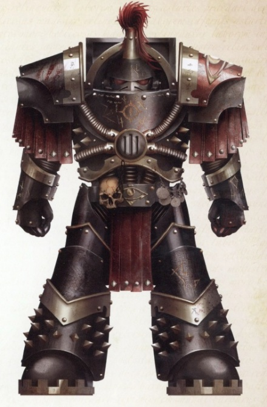

<!-- A0554-B0232 -->

原译文

Sons of Horus Justaerin Terminator Ekron Fal 荷鲁斯之子加斯塔林终结者埃克伦·法尔

**校订译文**

Sons of Horus Justaerin Terminator Ekron Fal 荷鲁斯之子加斯塔林终结者埃克伦·法尔

<!-- /A0554-B0232 -->

<!-- A0554-B0233 -->
**英文原文**

Each Company was commanded by a Captain, but not all Captains commanded a Company: The 1st Company was considered the elite unit in the legion and sported at least two renowned squads led by senior officers, the Justaerin Terminator Squad commanded by Captain Falkus Kibre and Catulan Reaver (Assault) Squad, commanded by Captain Kalus Ekaddon. These squads, and possibly all of 1st Company, wore black-painted armour, in contrast to the white and later pale green of the rest of the legion. Companies contained mixed squad-types, to ensure tactical flexibility. This included fielding Terminator Squads outside of the 1st Company. Squads commonly had their own honorific titles, such as the Illuminators, Death Makers, Jerrok's Reavers, First Sons, etc..

<!-- /A0554-B0233 -->

<!-- A0554-B0234 -->

原译文

每个连队都由一名连长指挥，但并非所有连长都指挥一个连队：第一连队被认为是军团中的精英部队，至少有两个由高级军官领导的著名小队，即由法库斯·凯博连长指挥的加斯塔林终结者小队和由卡鲁斯·埃卡顿连长指挥的卡图兰掠夺者（突击）小队。这些小队，可能还有第一连队的所有小队，都穿着黑色涂漆的盔甲，与军团其他成员的白色和后来的淡绿色形成鲜明对比。连队包含混合小队类型，以确保战术灵活性。这包括在第一连队之外部署终结者小队。小队通常有自己的荣誉称号，如启明者、致死者、杰洛克的掠夺者、长子等。

**校订译文**

每个连队都由一名连长统率，但并非所有拥有连长军衔的人都独掌一个连队。第一连是军团精锐，其中至少有两支声名显赫的小队，由高级军官指挥：法库斯·凯博连长率领的加斯塔林终结者小队，以及卡鲁斯·埃卡顿连长率领的卡图兰掠夺者突击小队。这两支小队，甚至可能整个第一连，都身披黑甲，与军团其他部队先前的白甲、后来的浅绿护甲形成鲜明对比。各连混编不同类型的小队，以保持战术灵活；第一连以外也配属终结者小队。小队往往拥有各自的荣誉称号，如“启明者”“致死者”“杰洛克的掠夺者”和“长子”等。

<!-- /A0554-B0234 -->

<!-- A0554-B0235 -->
**英文原文**

The principle tactic of the legion - one illustrative of their overall attitude - was a decisive surgical assault aimed directly at the command element of the enemy. A compact but hard-hitting force of marines up to several companies strong would compose the initial (and ideally total) thrust of the effort; this battle philosophy was referred to as the Speartip.

<!-- /A0554-B0235 -->

<!-- A0554-B0236 -->

原译文

军团的主要战术 — 一个说明他们整体态度的战术 — 是直接针对敌人指挥成员的决定性手术式攻击。一支由战士组成的紧凑但强有力的部队，最多可达数个连队，将构成这项努力的最初（理想情况下是全部）推动力；这种战斗哲学被称为矛尖。

**校订译文**

军团的主要战术鲜明体现了其作风：直接突击敌军指挥中枢，以精准斩首决定战局。一支编组紧凑、打击力强，规模可达数个连的部队，负责发动首轮攻势；理想情况下，这一击便足以结束战斗。这套作战理念被称为“矛尖”。

<!-- /A0554-B0236 -->

<!-- A0554-B0237 -->
**英文原文**

Their defeat and exile was a crushing blow to the collective ego of the Legion, and they broke down and fragmented easily without a purpose or powerful leader to act as the point of their spear. The Legion suffered significantly during the early years of exile when it was leaderless, though since Abaddon's overlordship it has regained a sense of discipline and purpose. Horus' favoured doctrine of 'tearing the throat out of the enemy' by eliminating their high command in a swift strike remains a well-used tactic. After the death of Horus, proper structure within the squads and companies disintegrated, and their later dispersal in various spacecraft further fragmented the Legion.

<!-- /A0554-B0237 -->

<!-- A0554-B0238 -->

原译文

他们的失败和流亡是对军团集体自尊心的沉重打击，他们很容易崩溃和分裂，没有一个目标或强大的领导者来充当他们的矛尖。在流亡的早期，军团在没有领导人的情况下遭受了巨大的痛苦，尽管自阿巴顿掌权以来，它已经重新获得了纪律和目标感。荷鲁斯所推崇的通过在快速打击中消灭敌人的最高指挥部来“撕裂敌人的喉咙”的学说仍然是一种被广泛使用的战术。荷鲁斯死后，小队和连队内部的适当结构瓦解，他们后来分散在各种航天器中，进一步分裂了军团。

**校订译文**

战败与流亡重创了军团的集体自尊。失去明确目标，也没有强大领袖充当“矛尖”，他们迅速崩溃分裂。流亡初期的群龙无首令军团损失惨重，直到阿巴顿掌权后，才重获纪律与共同目标。荷鲁斯所推崇的“撕开敌人喉咙”——迅速摧毁其最高指挥中枢——仍是常用战术。荷鲁斯死后，小队与连队原有的组织结构瓦解，部队后来又分散到各艘舰船上，使军团更加支离破碎。

<!-- /A0554-B0238 -->

<!-- A0554-B0239 -->
### The Mournival 四王议会

<!-- /A0554-B0239 -->

<!-- A0554-B0240 -->
**英文原文**

With the Primarch as the apex of the legion's order-of-battle, the next step downwards was filled by the Mournival. Although not an official institution, in practice it was this advisory council that helped the Warmaster finalize and execute his strategies. The four Mournival brothers were seen as the senior Captains of the legion.

<!-- /A0554-B0240 -->

<!-- A0554-B0241 -->

原译文

由于原体是军团战斗序列的顶点，下一步由四王议会填补。虽然不是一个官方机构，但在实践中，正是这个咨询议会帮助战帅最终确定并执行了他的战略。四王议会的四个修士被视为军团的高级连长。

**校订译文**

原体处于军团指挥体系的顶端，其下便是四王议会。这个顾问议会虽非正式机构，却实际协助战帅敲定并实施战略。四名议会成员被视为军团资历与地位最高的连长。

<!-- /A0554-B0241 -->

<!-- A0554-B0242 -->
### The Lodge 结社

<!-- /A0554-B0242 -->

<!-- A0554-B0243 -->
**英文原文**

Within the Legion's command structure existed the secretive warrior-lodge, where marines of all ranks and placements could mingle freely and talk openly without having to follow customary rank discipline. Membership was by invite only, and the lodge-members identified each other by the wearing of a silver medallion emblazoned with the Luna Wolf symbol. This system brought individual marines even closer together and increased their bonds of brotherhood and loyalty toward each other, likely increasing combat performance. However, it would eventually aid in the dissolution of the legion's organisation.

<!-- /A0554-B0243 -->

<!-- A0554-B0244 -->

原译文

在军团的指挥结构中，存在着一个秘密的战士结社，在那里，各级和不同职位的星际战士可以自由来往，公开交谈，而不必遵循习惯的军衔纪律。成员资格仅限受邀者，结社成员通过佩戴印有影月苍狼标志的银色标志相互识别。这个系统使各个战帅更加紧密地联系在一起，增强了他们之间的兄弟情谊和忠诚，可能会提高战斗表现。然而，这最终将成为有助于军团分裂的组织。

**校订译文**

军团内部还存在秘密的战士结社。不论军衔与职务，成员都能在这里平等交往、坦诚交谈，无须拘泥于平日的上下级礼制。结社只接纳受邀者，成员佩戴印有影月苍狼徽记的银质徽章，以彼此识别。这种制度拉近了战士之间的距离，加深了兄弟情谊与相互忠诚，可能也增强了战斗力；但最终，它也助长了军团组织的瓦解。

**校注：** 原译把 individual marines 误写为各个战帅，已改回战士；银质饰物为徽章。

<!-- /A0554-B0244 -->

<!-- A0554-B0245 -->
### Recruitment 招募

<!-- /A0554-B0245 -->

<!-- A0554-B0246 -->
**英文原文**

During their time as both the Luna Wolves and Sons of Horus, the Legion recruited first from Terra and then following the discovery of Horus, Cthonia. Cthonian gang-culture still was present within the Legion by the time of the Heresy, often in the form of gang tattoos.

<!-- /A0554-B0246 -->

<!-- A0554-B0247 -->

原译文

在他们作为影月苍狼和荷鲁斯之子的时期，军团首先从泰拉招募，然后在荷鲁斯被发现后在科索尼亚招募。到叛乱时期，科索尼亚帮派文化仍然存在于军团内部，通常以帮派纹身的形式出现。

**校订译文**

从影月苍狼到荷鲁斯之子时期，军团最初在泰拉招募，寻回荷鲁斯后则转向科索尼亚。直到叛乱爆发，科索尼亚帮派文化仍深植军团，常以帮派纹身的形式呈现。

**校注：** 本节概述称寻回荷鲁斯后才转往科索尼亚招募，与早期历史中先行绑架科索尼亚人的说法存在出入；均按英文保留。

<!-- /A0554-B0247 -->

<!-- A0554-B0248 -->
### Known units of the Great Crusade and Horus Heresy 大远征与荷鲁斯之乱时期的已知单位

原题：Known units of the Great Crusade and Horus Heresy 大远征和荷鲁斯叛乱的已知单位

<!-- /A0554-B0248 -->

<!-- A0554-B0249 -->
### Chapters 战团

<!-- /A0554-B0249 -->

<!-- A0554-B0250 -->

原译文

1st Chapter 第一战团

**校订译文**

1st Chapter 第一战团

<!-- /A0554-B0250 -->

<!-- A0554-B0251 -->

原译文

5th Chapter 第五战团

**校订译文**

5th Chapter 第五战团

<!-- /A0554-B0251 -->

<!-- A0554-B0252 -->

原译文

7th Chapter 第七战团

**校订译文**

7th Chapter 第七战团

<!-- /A0554-B0252 -->

<!-- A0554-B0253 -->

原译文

12th Chapter 第12战团

**校订译文**

12th Chapter 第12战团

<!-- /A0554-B0253 -->

<!-- A0554-B0254 -->

原译文

18th Chapter 第18战团

**校订译文**

18th Chapter 第18战团

<!-- /A0554-B0254 -->

<!-- A0554-B0255 -->
**英文原文**

19th Chapter ("the Iron Wolves")

<!-- /A0554-B0255 -->

<!-- A0554-B0256 -->

原译文

第19战团（“铁狼”）

**校订译文**

第19战团（“铁狼”）

<!-- /A0554-B0256 -->

<!-- A0554-B0257 -->

原译文

20th Chapter 第20战团

**校订译文**

20th Chapter 第20战团

<!-- /A0554-B0257 -->

<!-- A0554-B0258 -->

原译文

23rd Chapter 第23战团

**校订译文**

23rd Chapter 第23战团

<!-- /A0554-B0258 -->

<!-- A0554-B0259 -->

原译文

34th Chapter 第34战团

**校订译文**

34th Chapter 第34战团

<!-- /A0554-B0259 -->

<!-- A0554-B0260 -->

原译文

68th Chapter 第68战团

**校订译文**

68th Chapter 第68战团

<!-- /A0554-B0260 -->

<!-- A0554-B0261 -->
### Battalions 营

<!-- /A0554-B0261 -->

<!-- A0554-B0262 -->

原译文

2nd Battalion 第二营

**校订译文**

2nd Battalion 第二营

<!-- /A0554-B0262 -->

<!-- A0554-B0263 -->

原译文

16th Independent Battalion 第16独立营

**校订译文**

16th Independent Battalion 第16独立营

<!-- /A0554-B0263 -->

<!-- A0554-B0264 -->

原译文

201st Assault Battalion 第201突击营

**校订译文**

201st Assault Battalion 第201突击营

<!-- /A0554-B0264 -->

<!-- A0554-B0265 -->
### Companies 连队

<!-- /A0554-B0265 -->

<!-- A0554-B0266 -->

原译文

1st Company 第一连队

**校订译文**

1st Company 第一连队

<!-- /A0554-B0266 -->

<!-- A0554-B0267 -->

原译文

2nd Company 第二连队

**校订译文**

2nd Company 第二连队

<!-- /A0554-B0267 -->

<!-- A0554-B0268 -->

原译文

3rd Company 第三连队

**校订译文**

3rd Company 第三连队

<!-- /A0554-B0268 -->

<!-- A0554-B0269 -->

原译文

4th Company 第四连队

**校订译文**

4th Company 第四连队

<!-- /A0554-B0269 -->

<!-- A0554-B0270 -->

原译文

5th Company 第五连队

**校订译文**

5th Company 第五连队

<!-- /A0554-B0270 -->

<!-- A0554-B0271 -->

原译文

7th Company 第七连队

**校订译文**

7th Company 第七连队

<!-- /A0554-B0271 -->

<!-- A0554-B0272 -->

原译文

9th Company 第九连队

**校订译文**

9th Company 第九连队

<!-- /A0554-B0272 -->

<!-- A0554-B0273 -->

原译文

10th Company 第十连队

**校订译文**

10th Company 第十连队

<!-- /A0554-B0273 -->

<!-- A0554-B0274 -->

原译文

13th Company 第13连队

**校订译文**

13th Company 第13连队

<!-- /A0554-B0274 -->

<!-- A0554-B0275 -->

原译文

16th Company 第16连队

**校订译文**

16th Company 第16连队

<!-- /A0554-B0275 -->

<!-- A0554-B0276 -->

原译文

17th Company 第17连队

**校订译文**

17th Company 第17连队

<!-- /A0554-B0276 -->

<!-- A0554-B0277 -->

原译文

18th Company 第18连队

**校订译文**

18th Company 第18连队

<!-- /A0554-B0277 -->

<!-- A0554-B0278 -->

原译文

19th Company 第19连队

**校订译文**

19th Company 第19连队

<!-- /A0554-B0278 -->

<!-- A0554-B0279 -->

原译文

21st Company 第21连队

**校订译文**

21st Company 第21连队

<!-- /A0554-B0279 -->

<!-- A0554-B0280 -->

原译文

23rd Company 第23连队

**校订译文**

23rd Company 第23连队

<!-- /A0554-B0280 -->

<!-- A0554-B0281 -->

原译文

25th Company 第25连队

**校订译文**

25th Company 第25连队

<!-- /A0554-B0281 -->

<!-- A0554-B0282 -->
**英文原文**

27th Company - Refered to as XXVII Company in the text

<!-- /A0554-B0282 -->

<!-- A0554-B0283 -->

原译文

第27连队 - 文中称为XXVII连队

**校订译文**

第二十七连——原文使用罗马数字，写作 XXVII 连。

<!-- /A0554-B0283 -->

<!-- A0554-B0284 -->
**英文原文**

28th Company ("the Back Breakers")

<!-- /A0554-B0284 -->

<!-- A0554-B0285 -->

原译文

第28连队（“破背者”）

**校订译文**

第28连队（“破背者”）

<!-- /A0554-B0285 -->

<!-- A0554-B0286 -->

原译文

29th Company 第29连队

**校订译文**

29th Company 第29连队

<!-- /A0554-B0286 -->

<!-- A0554-B0287 -->

原译文

38th Company 第38连队

**校订译文**

38th Company 第38连队

<!-- /A0554-B0287 -->

<!-- A0554-B0288 -->

原译文

68th Company 第68连队

**校订译文**

68th Company 第68连队

<!-- /A0554-B0288 -->

<!-- A0554-B0289 -->

原译文

71st Company 第71连队

**校订译文**

71st Company 第71连队

<!-- /A0554-B0289 -->

<!-- A0554-B0290 -->

原译文

84th Company 第84连队

**校订译文**

84th Company 第84连队

<!-- /A0554-B0290 -->

<!-- A0554-B0291 -->

原译文

345th Company 第345连队

**校订译文**

345th Company 第345连队

<!-- /A0554-B0291 -->

<!-- A0554-B0292 -->
### Known post-Heresy warbands 荷鲁斯之乱后已知战帮

原题：Known post-Heresy warbands 著名叛乱后战帮

<!-- /A0554-B0292 -->

<!-- A0554-B0293 -->
**英文原文**

After the Siege of Terra, the Sons of Horus fractured into many warbands. Most of these were eventually destroyed or absorbed by the Black Legion.

<!-- /A0554-B0293 -->

<!-- A0554-B0294 -->

原译文

在泰拉围城之后，荷鲁斯之子分裂成许多战帮。其中大部分最终被黑色军团摧毁或吸收。

**校订译文**

在泰拉围城之后，荷鲁斯之子分裂成许多战帮。其中大部分最终被黑色军团摧毁或吸收。

<!-- /A0554-B0294 -->

<!-- A0554-B0295 -->

原译文

Sons of the Eye 眼之子

**校订译文**

Sons of the Eye 眼之子

<!-- /A0554-B0295 -->

<!-- A0554-B0296 -->

原译文

Wolves of Horus 荷鲁斯之狼

**校订译文**

Wolves of Horus 荷鲁斯之狼

<!-- /A0554-B0296 -->

<!-- A0554-B0297 -->

原译文

True Sons 真实之子

**校订译文**

True Sons 真子

<!-- /A0554-B0297 -->

<!-- A0554-B0298 -->
**英文原文**

Duraga Kal Esmejhak - commanded by Falkus Kibre

<!-- /A0554-B0298 -->

<!-- A0554-B0299 -->

原译文

杜拉加·卡尔·埃斯梅哈克 - 法库斯·凯博指挥

**校订译文**

杜拉加·卡尔·埃斯梅哈克 - 法库斯·凯博指挥

<!-- /A0554-B0299 -->

<!-- A0554-B0300 -->

原译文

Vaithan Reaver Squad 韦特罕掠夺者小队

**校订译文**

Vaithan Reaver Squad 韦特罕掠夺者小队

<!-- /A0554-B0300 -->

<!-- A0554-B0301 -->
**英文原文**

Skyrar's Dark Wolves - mixed force of Sons of Horus and Space Wolves

<!-- /A0554-B0301 -->

<!-- A0554-B0302 -->

原译文

斯卡拉的暗狼 - 荷鲁斯之子和太空野狼的混合部队

**校订译文**

斯卡拉的暗狼 - 荷鲁斯之子和太空野狼的混合部队

<!-- /A0554-B0302 -->

<!-- A0554-B0303 -->
## Noted Elements of the Sons of Horus 荷鲁斯之子著名成员

<!-- /A0554-B0303 -->

<!-- A0554-B0304 -->
### Sons of Horus Armoury 荷鲁斯之子军械库

<!-- /A0554-B0304 -->

<!-- A0554-B0305 -->
### Vessels 战舰

<!-- /A0554-B0305 -->

<!-- A0554-B0306 -->
**英文原文**

Vengeful Spirit — Flagship/Gloriana Class Battleship

<!-- /A0554-B0306 -->

<!-- A0554-B0307 -->

原译文

复仇之魂号 — 旗舰/荣光女王级战列舰

**校订译文**

复仇之魂号 — 旗舰/荣光女王级战列舰

<!-- /A0554-B0307 -->

<!-- A0554-B0308 -->
**英文原文**

Magna Tyranis — Gloriana Class Battleship

<!-- /A0554-B0308 -->

<!-- A0554-B0309 -->

原译文

大暴君号 — 荣光女王级战列舰

**校订译文**

大暴君号 — 荣光女王级战列舰

<!-- /A0554-B0309 -->

<!-- A0554-B0310 -->
**英文原文**

Triumph of Reason — Legatus Class Battleship. Former flagship of Port Maw's Armada, captured by the Sons of Horus and renamed as the Lash.

<!-- /A0554-B0310 -->

<!-- A0554-B0311 -->

原译文

胜利之因号 —副将级战列舰。巨口港舰队的前旗舰，被荷鲁斯之子俘虏，并更名为鞭笞号。

**校订译文**

理性凯旋号——特使级战列舰，原为巨口港舰队旗舰，被荷鲁斯之子俘获后改名鞭笞号。

**校注：** Triumph of Reason 原译胜利之因把 Reason 的理性义误作原因，暂修正理性凯旋号；舰级 Legatus 沿现稿副将级待核。 对照本段英文确认同一实体，与全书核心译名统一；不改变同形异义词或省略称呼。

<!-- /A0554-B0311 -->

<!-- A0554-B0312 -->
**英文原文**

Aggressor - Horus Aximand's Command Ship during the Battle for Beta Garmon

<!-- /A0554-B0312 -->

<!-- A0554-B0313 -->

原译文

侵略者号 - 贝塔·伽蒙之战中荷鲁斯·阿西曼德的指挥舰

**校订译文**

侵略者号 - 贝塔-伽蒙之战中荷鲁斯·阿西曼德的指挥舰

**校注：** 与同一战役专篇统一地名词根及分隔符。

<!-- /A0554-B0313 -->

<!-- A0554-B0314 -->
**英文原文**

King Eater — Battle Barge.

<!-- /A0554-B0314 -->

<!-- A0554-B0315 -->

原译文

吞噬之王号 — 战斗驳船。

**校订译文**

噬王者号——战斗驳船。

**校注：** King Eater 为吞噬王者者，原译吞噬之王颠倒修饰关系，暂修正噬王者号。

<!-- /A0554-B0315 -->

<!-- A0554-B0316 -->
**英文原文**

Throne of the Underworld - Battle Barge

<!-- /A0554-B0316 -->

<!-- A0554-B0317 -->

原译文

地下王座号 - 战斗驳船

**校订译文**

冥界王座号——战斗驳船。

<!-- /A0554-B0317 -->

<!-- A0554-B0318 -->
**英文原文**

War Oath - Battle Barge

<!-- /A0554-B0318 -->

<!-- A0554-B0319 -->

原译文

战争誓言号 - 战斗驳船

**校订译文**

战争誓言号 - 战斗驳船

<!-- /A0554-B0319 -->

<!-- A0554-B0320 -->
**英文原文**

Warmaster's Mercy - Battle Barge.

<!-- /A0554-B0320 -->

<!-- A0554-B0321 -->

原译文

战帅慈悲号 - 战斗驳船

**校订译文**

战帅慈悲号 - 战斗驳船

<!-- /A0554-B0321 -->

<!-- A0554-B0322 -->
**英文原文**

Conqueror's Pride — Heavy Cruiser.

<!-- /A0554-B0322 -->

<!-- A0554-B0323 -->

原译文

征服者之傲号 — 重型巡洋舰

**校订译文**

征服者之傲号 — 重型巡洋舰

<!-- /A0554-B0323 -->

<!-- A0554-B0324 -->
**英文原文**

Tomb of Gold — Heavy Cruiser.

<!-- /A0554-B0324 -->

<!-- A0554-B0325 -->

原译文

黄金之墓号 — 重型巡洋舰。

**校订译文**

黄金之墓号 — 重型巡洋舰。

<!-- /A0554-B0325 -->

<!-- A0554-B0326 -->
**英文原文**

His Chosen Son — Battlecruiser.

<!-- /A0554-B0326 -->

<!-- A0554-B0327 -->

原译文

他选之子号 — 战列巡洋舰。

**校订译文**

祂的选中之子号——战列巡洋舰。

<!-- /A0554-B0327 -->

<!-- A0554-B0328 -->
**英文原文**

Ikon — Eclipse Class Battlecruiser.

<!-- /A0554-B0328 -->

<!-- A0554-B0329 -->

原译文

伊康号 — 日蚀级战列巡洋舰。

**校订译文**

伊康号 — 日蚀级战列巡洋舰。

<!-- /A0554-B0329 -->

<!-- A0554-B0330 -->
**英文原文**

Lupercal's Spear — Eclipse Class Battlecruiser.

<!-- /A0554-B0330 -->

<!-- A0554-B0331 -->

原译文

牧狼神之矛号 — 日蚀级战列巡洋舰。

**校订译文**

卢佩卡尔之矛号——日蚀级战列巡洋舰。

<!-- /A0554-B0331 -->

<!-- A0554-B0332 -->
**英文原文**

Bone Jackal — Heavy Warship

<!-- /A0554-B0332 -->

<!-- A0554-B0333 -->

原译文

骨豺号 — 重型战舰

**校订译文**

骨豺号 — 重型战舰

<!-- /A0554-B0333 -->

<!-- A0554-B0334 -->
**英文原文**

Desolation — Heavy Warship

<!-- /A0554-B0334 -->

<!-- A0554-B0335 -->

原译文

荒芜号 — 重型战舰

**校订译文**

荒芜号 — 重型战舰

<!-- /A0554-B0335 -->

<!-- A0554-B0336 -->
**英文原文**

Gore Prow — Heavy Warship

<!-- /A0554-B0336 -->

<!-- A0554-B0337 -->

原译文

血首号 — 重型战舰

**校订译文**

血首号 — 重型战舰

<!-- /A0554-B0337 -->

<!-- A0554-B0338 -->
**英文原文**

Chariot of the Gods — Warship

<!-- /A0554-B0338 -->

<!-- A0554-B0339 -->

原译文

众神战车号 — 战舰

**校订译文**

众神战车号 — 战舰

<!-- /A0554-B0339 -->

<!-- A0554-B0340 -->
**英文原文**

Baleful Eye - Cruiser and flagship of the Duraga Kal Esmejhak

<!-- /A0554-B0340 -->

<!-- A0554-B0341 -->

原译文

恶意之眼号 - 杜拉加·卡尔·埃斯梅哈克的巡洋舰和旗舰

**校订译文**

恶意之眼号 - 杜拉加·卡尔·埃斯梅哈克的巡洋舰和旗舰

<!-- /A0554-B0341 -->

<!-- A0554-B0342 -->
**英文原文**

Lupercal Pursuivant — Cruiser

<!-- /A0554-B0342 -->

<!-- A0554-B0343 -->

原译文

牧狼神随从号 — 巡洋舰

**校订译文**

卢佩卡尔传令官号——巡洋舰。

**校注：** Pursuivant 此处暂按传令职衔翻译；Lupercal 与本篇人物及其他舰名统一为卢佩卡尔。

<!-- /A0554-B0343 -->

<!-- A0554-B0344 -->
**英文原文**

Horus Triumphant — Cruiser

<!-- /A0554-B0344 -->

<!-- A0554-B0345 -->

原译文

荷鲁斯胜利号 — 巡洋舰

**校订译文**

荷鲁斯胜利号 — 巡洋舰

<!-- /A0554-B0345 -->

<!-- A0554-B0346 -->
**英文原文**

Fourfold Wolf — Cruiser

<!-- /A0554-B0346 -->

<!-- A0554-B0347 -->

原译文

四狼号 — 巡洋舰

**校订译文**

四重之狼号——巡洋舰。

<!-- /A0554-B0347 -->

<!-- A0554-B0348 -->
**英文原文**

Oblivion — Strike Cruiser.

<!-- /A0554-B0348 -->

<!-- A0554-B0349 -->

原译文

遗忘号 — 打击巡洋舰。

**校订译文**

遗忘号 — 打击巡洋舰。

<!-- /A0554-B0349 -->

<!-- A0554-B0350 -->

原译文

Cthonia Rising 科索尼亚崛起号

**校订译文**

Cthonia Rising 科索尼亚崛起号

<!-- /A0554-B0350 -->

<!-- A0554-B0351 -->
**英文原文**

Cthonic Blood — Dauntless Class Light Cruiser.

<!-- /A0554-B0351 -->

<!-- A0554-B0352 -->

原译文

科索尼亚鲜血号 — 无畏级轻型巡洋舰。

**校订译文**

科索尼亚鲜血号 — 无畏级轻型巡洋舰。

<!-- /A0554-B0352 -->

<!-- A0554-B0353 -->
**英文原文**

Requiem of Antmura — Siluria Class Light Cruiser.

<!-- /A0554-B0353 -->

<!-- A0554-B0354 -->

原译文

安特穆拉安魂曲 — 志留亚级轻型巡洋舰

**校订译文**

安特穆拉安魂曲号——志留亚级轻型巡洋舰。

<!-- /A0554-B0354 -->

<!-- A0554-B0355 -->
**英文原文**

Conquest — Firestorm Frigate.

<!-- /A0554-B0355 -->

<!-- A0554-B0356 -->

原译文

征服号 — 火风暴护卫舰。

**校订译文**

征服号 — 火风暴护卫舰。

<!-- /A0554-B0356 -->

<!-- A0554-B0357 -->
**英文原文**

Raksha — Frigate.

<!-- /A0554-B0357 -->

<!-- A0554-B0358 -->

原译文

拉克萨号 — 护卫舰

**校订译文**

拉克萨号 — 护卫舰

<!-- /A0554-B0358 -->

<!-- A0554-B0359 -->
**英文原文**

Rise of the Three Suns - Frigate.

<!-- /A0554-B0359 -->

<!-- A0554-B0360 -->

原译文

三日同辉号 - 护卫舰。

**校订译文**

三日同辉号 - 护卫舰。

<!-- /A0554-B0360 -->

<!-- A0554-B0361 -->
**英文原文**

Son of Victory - Sword Class Frigate.

<!-- /A0554-B0361 -->

<!-- A0554-B0362 -->

原译文

胜利之子号 - 剑级护卫舰。

**校订译文**

胜利之子号 - 剑级护卫舰。

<!-- /A0554-B0362 -->

<!-- A0554-B0363 -->
**英文原文**

Talon — Nova Frigate.

<!-- /A0554-B0363 -->

<!-- A0554-B0364 -->

原译文

鹰爪号 — 新星护卫舰。

**校订译文**

鹰爪号 — 新星级护卫舰。

**校注：** 对照本段英文确认同一实体，与全书核心译名统一；不改变同形异义词或省略称呼。

<!-- /A0554-B0364 -->

<!-- A0554-B0365 -->
**英文原文**

Blood of Cthonia — Havoc Destroyer.

<!-- /A0554-B0365 -->

<!-- A0554-B0366 -->

原译文

克索尼亚之血 — 浩劫驱逐舰。

**校订译文**

科索尼亚之血号——浩劫级驱逐舰。

<!-- /A0554-B0366 -->

<!-- A0554-B0367 -->
**英文原文**

Cthonian Scion - Hunter Class Destroyer

<!-- /A0554-B0367 -->

<!-- A0554-B0368 -->

原译文

科索尼亚之裔 - 猎手级驱逐舰

**校订译文**

科索尼亚之裔号——猎手级驱逐舰。

<!-- /A0554-B0368 -->

<!-- A0554-B0369 -->
### Vehicles 载具

<!-- /A0554-B0369 -->

<!-- A0554-B0370 -->
**英文原文**

Akhaten — Spartan Assault Tank

<!-- /A0554-B0370 -->

<!-- A0554-B0371 -->

原译文

艾卡坦 — 斯巴达突击坦克

**校订译文**

艾卡坦 — 斯巴达突击坦克

<!-- /A0554-B0371 -->

<!-- A0554-B0372 -->
**英文原文**

Cthonian Wolf — Rhino

<!-- /A0554-B0372 -->

<!-- A0554-B0373 -->

原译文

科索尼亚之狼 — 犀牛

**校订译文**

科索尼亚之狼——犀牛战车。

<!-- /A0554-B0373 -->

<!-- A0554-B0374 -->
### Notable Members 著名成员

<!-- /A0554-B0374 -->

<!-- A0554-B0375 -->
**英文原文**

Horus — Primarch of the Luna Wolves

<!-- /A0554-B0375 -->

<!-- A0554-B0376 -->

原译文

荷鲁斯 — 影月苍狼原体

**校订译文**

荷鲁斯 — 影月苍狼原体

<!-- /A0554-B0376 -->

<!-- A0554-B0377 -->
**英文原文**

Ezekyle Abaddon — First Captain, 1st Company.

<!-- /A0554-B0377 -->

<!-- A0554-B0378 -->

原译文

以泽凯尔·阿巴顿 — 第一连长，第一连队

**校订译文**

以泽凯尔·阿巴顿 — 第一连长，第一连队

<!-- /A0554-B0378 -->

<!-- A0554-B0379 -->
**英文原文**

Tarik Torgaddon - Captain of the 2nd Company

<!-- /A0554-B0379 -->

<!-- A0554-B0380 -->

原译文

塔里克·托加顿 - 第二连队连长

**校订译文**

塔里克·托加顿 - 第二连队连长

<!-- /A0554-B0380 -->

<!-- A0554-B0381 -->
**英文原文**

Horus Aximand - Captain of the 5th Company

<!-- /A0554-B0381 -->

<!-- A0554-B0382 -->

原译文

荷鲁斯·阿西曼德 - 第五连队连长

**校订译文**

荷鲁斯·阿西曼德 - 第五连队连长

<!-- /A0554-B0382 -->

<!-- A0554-B0383 -->
**英文原文**

Garviel Loken - Captain of the 10th Company

<!-- /A0554-B0383 -->

<!-- A0554-B0384 -->

原译文

加维尔·洛肯 - 第十连队连长

**校订译文**

加维尔·洛肯 - 第十连队连长

<!-- /A0554-B0384 -->

<!-- A0554-B0385 -->
**英文原文**

Maloghurst - Equerry to Horus

<!-- /A0554-B0385 -->

<!-- A0554-B0386 -->

原译文

马洛赫斯特 - 荷鲁斯的侍从官

**校订译文**

马洛赫斯特 - 荷鲁斯的侍从官

<!-- /A0554-B0386 -->

<!-- A0554-B0387 -->
**英文原文**

Falkus Kibre - Captain of the Justaerin

<!-- /A0554-B0387 -->

<!-- A0554-B0388 -->

原译文

法库斯·凯博 - 加斯塔林连长

**校订译文**

法库斯·凯博 - 加斯塔林连长

<!-- /A0554-B0388 -->

<!-- A0554-B0389 -->
**英文原文**

Maral Lupus - Praetor, de facto Legion commander before Horus' discovery

<!-- /A0554-B0389 -->

<!-- A0554-B0390 -->

原译文

马拉尔·卢普斯 - 执政官，在荷鲁斯被发现之前是事实上的军团指挥官

**校订译文**

马拉尔·卢普斯 - 执政官，在荷鲁斯被发现之前是事实上的军团指挥官

<!-- /A0554-B0390 -->

<!-- A0554-B0391 -->
### Unique Troops 独特单位

<!-- /A0554-B0391 -->

<!-- A0554-B0392 -->

原译文

Justaerin 加斯塔林

**校订译文**

Justaerin 加斯塔林

<!-- /A0554-B0392 -->

<!-- A0554-B0393 -->

原译文

Reaver Attack Squad 掠夺者攻击小队

**校订译文**

Reaver Attack Squad 掠夺者攻击小队

<!-- /A0554-B0393 -->

<!-- A0554-B0394 -->

原译文

Luperci 狼之兄弟

**校订译文**

Luperci 狼之兄弟

<!-- /A0554-B0394 -->

<!-- A0554-B0395 -->
### Trivia and Notes 琐事与注释

<!-- /A0554-B0395 -->

<!-- A0554-B0396 -->
**英文原文**

Cthonia is presumably a reference to the Greek Chthonia a complex word with connotations to dead domains under the earth and the spirits of the underworld. Cthonic spirits can be both fruitful and destructive; in the positive sense they are referred to as part of the concept of rebirth - the earth that nurtures. In the negative, they are akin to the revenants of the dead come to claim more souls for hell. Compare to the dead, mined-out state of the Luna Wolves homeworld and the role it had in birthing Chaos Space Marines.

<!-- /A0554-B0396 -->

<!-- A0554-B0397 -->

原译文

科索尼亚大概是指希腊语克托尼亚，这是一个复杂的词，内涵是地下死亡的领域和冥界的灵魂。灵魂可以是富有成效的，也可以是破坏性的；从积极的意义上讲，它们被称为重生概念的一部分，即滋养大地。从消极的角度来看，他们类似于死者的复仇者来为地狱索取更多的灵魂。与影月苍狼家园世界的死亡、开采状态及其在混沌星际战士诞生中的作用相比。

**校订译文**

科索尼亚之名，很可能取自希腊语 Chthonia。这个词含义复杂，关联地底的亡者领域与冥界精灵。冥界精灵既可带来丰饶，也可造成毁灭：从正面看，它们属于重生的意象，象征滋养万物的大地；从负面看，则如重返人间的亡灵，为冥府索取更多灵魂。可以将这种双重寓意，与影月苍狼母星被采掘殆尽、死气沉沉的状态，以及它孕育混沌星际战士的作用相对照。

**校注：** 本段是词源推测，保留 presumably 的不确定性；不将词源解读标为官方确认设定。

<!-- /A0554-B0397 -->

<!-- A0554-B0398 -->
**英文原文**

The Luna Wolves/Sons of Horus were considered a large Space Marine Legion and had at least 25 Companies at one point during the Great Crusade. While no maximum headcount for the legion has been given, when the Luna Wolves 10th Company was deployed in entirety during the Whisperhead action on Sixty-Three-Nineteen it numbered approximately 600 marines. If 25 companies existed with the same strength, the Legion at one point could have numbered around 15,000 marines. This is worth noting as the generally perceived sizes of Legions have fluctuated over the years; for some time the 'small legions' concept presented by the Index Astartes articles was prevalent, and the initial novels in the Horus Heresy Series were written with it in mind. This was later quietly retconned during the series to fit in with the 'large legions' concept put forth by such works as Collected Visions. When the baseline number for legions was 10,000, there being 15,000 Luna Wolves would indeed make them one of the larger legions, and would fit in with numbers presented later in the series (for the number of combatants present at the Drop Site Massacre as given in Fulgrim, for example). Since the move to the legion baseline being 100,000, the Luna Wolves must be thought of as having between 100,000 and 150,000 (the number of Word Bearers, the 2nd biggest legion) marines and the amount of Legionaries in Loken's company becomes merely an illustrative number rather than a useful statistic.

<!-- /A0554-B0398 -->

<!-- A0554-B0399 -->

原译文

影月苍狼/荷鲁斯之子被认为是一个庞大的星际战士军团，在大远征期间至少有25个连队。虽然没有给出军团的最大人数，但当影月苍狼第10连队在63-19的低语之首行动中全部部署时，其战士人数约为600人。如果存在25个兵力相同的连队，那么军团一度可能拥有约15000名战士。值得注意的是，多年来，人们普遍认为的军团规模一直在波动；一段时间以来，阿斯塔特索引文章提出的“小军团”概念很流行，荷鲁斯叛乱系列的最初小说也考虑到了这一点。后来，在系列中，这一点被悄悄地重新调整，以符合 背景图录 等作品提出的“大军团”概念。当军团的基线数量为10000时，有15000名影月苍狼确实会使他们成为更大的军团之一，并且会符合该系列后面提供的数字（例如，福格瑞姆 中给出的登陆点大屠杀中的战斗人员数量）。由于转移到军团基线的人数为10万，因此必须将影月苍狼视为拥有10万至15万（第二大军团 — 怀言者的数量）的战士，而洛肯的连队的军团士兵数量只是一个说明性的数字，而不是一个有用的统计数据。

**校订译文**

影月苍狼及后来的荷鲁斯之子，一直被描述为规模较大的星际战士军团，大远征期间某一阶段至少拥有二十五个连。当时资料虽未给出军团总人数上限，但在六十三—十九星球的低语之首行动中，全员出动的第十连约有六百名战士。若二十五个连规模相同，军团当时便可能约有一万五千人。这里需要留意，出版物对军团规模的设定，多年来曾有变动。一度由《阿斯塔特索引》文章确立的“小军团”概念占据主流，《荷鲁斯之乱》系列早期小说也以此为基础；后来，系列逐步修订设定，转向《背景图录》等作品提出的“大军团”概念。以一万人为军团基准时，一万五千人的影月苍狼确属较大的军团，也能与系列后续提供的数字相符，例如小说《福格瑞姆》所述登陆点大屠杀的参战人数。但基准改为十万人后，依此推算，影月苍狼应有十万至十五万人；十五万是此处所举第二大军团怀言者的人数。于是，洛肯连队的六百人只能作为个别描写，不能再据此估算军团总兵力。

**校注：** 本段为所给原文关于不同出版时期兵力设定的分析，不是独立核实后的定论；其十万至十五万推算与篇首十三万至十七万并不一致，保留两处并说明。 Sixty-Three-Nineteen沿第18篇定译六十三—十九；英文数字编号不改。

<!-- /A0554-B0399 -->

本篇核心术语与暂定项

以下列出本篇出现的英文原形及核心术语表用词。同形词可能指不同对象，具体词义以本篇正文和校注为准；单复数、别名和仅见于图注的名称可能尚未列入。完整候选见[术语表](../../术语表/双语术语候选.csv)。

| 英文 | 采用中文 | 状态 |
| --- | --- | --- |
| Space Marines | 星际战士 | 官方已核对 |
| Dark Angels | 黑暗天使 | 官方已核对 |
| Space Wolves | 太空野狼 | 官方已核对 |
| Adeptus Mechanicus | 机械修会 | 官方已核对 |
| Imperial Army | 帝国军 | 暂定·官方待核 |
| Chaos Space Marines | 混沌星际战士 | 官方已核对 |
| World Eaters | 吞世者 | 官方已核对 |
| Orks | 欧克蛮人 | 官方已核对 |
| Terminator | 终结者 | 官方已核对 |
| Horus Heresy | 荷鲁斯之乱 | 官方已核对 |
| Warp | 亚空间 | 官方已核对 |
| Imperium | 帝国 | 暂定·简称 |
| Legio Cybernetica | 智控军团 | 暂定 |
| Sorcerer | 巫师 | 官方已核对 |
| Nurgle | 纳垢 | 官方已核对 |
| History | 历史 | 编辑用语已统一 |
| Eye of Terror | 恐惧之眼 | 官方已核对 |
| Imperial Fists | 帝国之拳 | 暂定 |
| Emperor | 帝皇 | 官方已核对 |
| Primarch | 原体 | 官方已核对 |
| Battle Barge | 战斗驳船 | 暂定·官方待核 |
| Word Bearers | 怀言者 | 暂定·官方待核 |
| Black Legion | 黑色军团 | 暂定·官方待核 |
| Emperor's Children | 帝皇之子 | 官方已核对 |
| Legion Wars | 军团战争 | 暂定·官方待核 |
| Iron Warriors | 钢铁勇士 | 暂定·官方待核 |
| Great Crusade | 大远征 | 暂定·官方待核 |
| Compliance | 归顺；纳入帝国统治 | 暂定·官方待核 |
| Interex | 英特雷斯 | 暂定·官方待核 |
| Terra | 泰拉 | 暂定·官方待核 |
| Murder | 谋杀 | 暂定·官方待核 |
| Luna Wolves | 影月苍狼 | 暂定·官方待核 |
| Horus | 荷鲁斯 | 暂定·官方待核 |
| Xenobia | 泽诺比娅 | 暂定·官方待核 |
| Garviel Loken | 加维尔·洛肯 | 暂定·官方待核 |
| Auretian Technocracy | 奥瑞提安技术联盟 | 暂定·官方待核 |
| Vengeful Spirit | 复仇之魂号 | 暂定·官方待核 |
| Sons of Horus | 荷鲁斯之子 | 暂定·官方待核 |
| Isstvan III | 伊斯塔万三号 | 暂定·官方待核 |
| Iron Hands | 钢铁之手 | 暂定·官方待核 |
| Fulgrim | 福格瑞姆 | 官方已核对 |
| Collegia Titanica | 泰坦修会 | 暂定·官方待核 |
| Solar Auxilia | 太阳辅助军 | 暂定·官方待核 |
| Unification Wars | 统一战争 | 暂定·官方待核 |
| Sector | 星区 | 暂定·官方待核 |
| Salamanders | 火蜥蜴 | 暂定·官方待核 |
| Brotherhood | 兄弟会 | 暂定·官方待核 |
| Port Maw | 巨口港 | 暂定·官方待核 |
| Mars | 火星 | 暂定·官方待核 |
| Sixty-Three-Nineteen | 六十三—十九 | 暂定·官方待核 |
| Davin | 戴文 | 暂定·官方待核 |
| Luna | 月球 | 暂定·官方待核 |
| Molech | 摩洛 | 暂定·官方待核 |
| Cthonia | 科索尼亚 | 暂定·官方待核 |
| Barabas Dantioch | 巴拉巴斯·丹提欧克 | 暂定·官方待核 |
| Fabius Bile | 法比乌斯·拜尔 | 官方已核对 |
| Ancient | 旗手 | 官方已核对 |
| Rhino | 犀牛战车 | 官方已核对 |
| Terminator Squad | 终结者小队 | 官方已核对 |
| Horus Lupercal | 荷鲁斯·卢佩卡尔 | 暂定·官方待核 |
| Lupercal | 卢佩卡尔 | 暂定·官方待核 |
| Maeleum | 玛勒姆 | 暂定·官方待核 |
| Maleum | 玛勒姆 | 暂定·官方待核 |
| Mournival | 四王议会 | 暂定·官方待核 |
| Justaerin | 加斯塔林 | 暂定·官方待核 |
| Thrice-Cursed Traitors | 三重诅咒叛徒 | 暂定·官方待核 |
| Sons of the Eye | 眼之子 | 暂定·官方待核 |
| Wolves of Horus | 荷鲁斯之狼 | 暂定·官方待核 |
| True Sons | 真子 | 暂定·官方待核 |
| True Sons of Cthonia | 科索尼亚真子 | 暂定·官方待核 |
| Serpent Lodge | 蛇之结社 | 暂定·官方待核 |
| Speartip | 矛尖 | 暂定·官方待核 |
| Long War | 万古长战 | 暂定·官方待核 |
| Magna Tyranis | 大暴君号 | 暂定·官方待核 |
| Triumph of Reason | 理性凯旋号 | 暂定·官方待核 |
| Lash | 鞭笞号 | 暂定·官方待核 |
| King Eater | 噬王者号 | 暂定·官方待核 |
| Throne of the Underworld | 冥界王座号 | 暂定·官方待核 |
| War Oath | 战争誓言号 | 暂定·官方待核 |
| Warmaster's Mercy | 战帅慈悲号 | 暂定·官方待核 |
| Conqueror's Pride | 征服者之傲号 | 暂定·官方待核 |
| Tomb of Gold | 黄金之墓号 | 暂定·官方待核 |
| His Chosen Son | 祂的选中之子号 | 暂定·官方待核 |
| Ikon | 伊康号 | 暂定·官方待核 |
| Lupercal's Spear | 卢佩卡尔之矛号 | 暂定·官方待核 |
| Bone Jackal | 骨豺号 | 暂定·官方待核 |
| Gore Prow | 血首号 | 暂定·官方待核 |
| Chariot of the Gods | 众神战车号 | 暂定·官方待核 |
| Baleful Eye | 恶意之眼号 | 暂定·官方待核 |
| Lupercal Pursuivant | 卢佩卡尔传令官号 | 暂定·官方待核 |
| Horus Triumphant | 荷鲁斯胜利号 | 暂定·官方待核 |
| Fourfold Wolf | 四重之狼号 | 暂定·官方待核 |
| Cthonic Blood | 科索尼亚鲜血号 | 暂定·官方待核 |
| Requiem of Antmura | 安特穆拉安魂曲号 | 暂定·官方待核 |
| Raksha | 拉克萨号 | 暂定·官方待核 |
| Rise of the Three Suns | 三日同辉号 | 暂定·官方待核 |
| Son of Victory | 胜利之子号 | 暂定·官方待核 |
| Blood of Cthonia | 科索尼亚之血号 | 暂定·官方待核 |
| Cthonian Scion | 科索尼亚之裔号 | 暂定·官方待核 |
| Akhaten | 艾卡坦 | 暂定·官方待核 |
| Cthonian Wolf | 科索尼亚之狼 | 暂定·官方待核 |
| Falkus Kibre | 法库斯·凯博 | 暂定·官方待核 |
| Kalus Ekaddon | 卡鲁斯·埃卡顿 | 暂定·官方待核 |
| Horus Aximand | 荷鲁斯·阿西曼德 | 暂定·官方待核 |
| Tarik Torgaddon | 塔里克·托加顿 | 暂定·官方待核 |
| Maloghurst | 马洛赫斯特 | 暂定·官方待核 |
| Maral Lupus | 马拉尔·卢普斯 | 暂定·官方待核 |
| Vheren Ashurhaddon | 维伦·阿舒哈顿 | 暂定·官方待核 |
| Iacton Qruze | 亚克顿·克鲁兹 | 暂定·官方待核 |
| Tybalt Marr | 提伯特·玛尔 | 暂定·官方待核 |
| Shadrak Meduson | 沙德拉克·梅杜森 | 暂定·官方待核 |
| Urlakk Urg | 乌尔拉克·乌尔格 | 暂定·官方待核 |
| Eugen Temba | 欧根·坦巴 | 暂定·官方待核 |
| Duraga Kal Esmejhak | 杜拉加·卡尔·埃斯梅哈克 | 暂定·官方待核 |
| Skyrar's Dark Wolves | 斯卡拉的暗狼 | 暂定·官方待核 |
| Gorro | 戈罗 | 暂定·官方待核 |
| Ullanor | 乌兰诺 | 暂定·官方待核 |
| Saturnine Gate | 土星之门 | 暂定·官方待核 |
| Space Marine Legion | 星际战士军团 | 暂定·官方待核 |
| Lord Commander | 领主指挥官 | 暂定·官方待核 |
| Raven Guard | 暗鸦守卫 | 官方已核 |
| The Primarchs | 原体 | 暂定·官方待核 |
| Warrior Lodges | 战士结社 | 暂定·官方待核 |
| Shattered Legions | 破碎军团 | 暂定·官方待核 |
| The Battle of Oqueth Minor | 奥克丝次星之战 | 暂定·官方待核 |
| The Battle of Hamart III | 哈马特三号之战 | 暂定·官方待核 |
| The Battle of the Zanaeh Gulf | 扎奈赫湾之战 | 暂定·官方待核 |
| The Battle of the Aragna Chain | 阿拉格纳星链之战 | 暂定·官方待核 |
| Blackshields | 黑盾 | 暂定·官方待核 |
| Knights-Errant | 游侠骑士 | 暂定·官方待核 |
| Sol | 太阳系 | 暂定·官方待核 |
| Isstvan | 伊斯塔万 | 暂定·官方待核 |
| First Captain | 第一连长 | 暂定·官方待核 |
| Praetor | 执政官 | 暂定·官方待核 |
| Sigismund | 西吉斯蒙德 | 暂定·官方待核 |
| Eidolon | 艾多隆 | 暂定·官方待核 |
| Ezekyle Abaddon | 以泽凯尔·阿巴顿 | 暂定·官方待核 |
| Korosan Myrlath | 科罗桑·米拉斯 | 暂定·官方待核 |
| Destroyer | 毁灭者 | 暂定·官方待核 |
| Space Marine | 星际战士 | 暂定·官方待核 |
| Chapter | 战团 | 暂定·官方待核 |
| Captain | 连长 | 暂定·官方待核 |
| Terminators | 终结者 | 暂定·官方待核 |
| Brother | 修士 | 暂定·官方待核 |
| Aggressor | 侵略者 | 暂定·官方待核 |
| Overlord | 霸主 | 官方已核对 |
| Emperor's Wolves | 帝皇之狼 | 暂定·官方待核 |
| Iron Wolves | 铁狼 | 暂定·官方待核 |
| Remnants | 残骸 | 暂定·官方待核 |
| Gene-seed | 基因种子 | 暂定·官方待核 |
| Gloriana Class Battleship | 荣光女王级战列舰 | 暂定·官方待核 |
| Strike Cruiser | 打击巡洋舰 | 暂定·官方待核 |
| Dauntless Class Light Cruiser | 无畏级轻型巡洋舰 | 暂定·官方待核 |
| Nova Frigate | 新星级护卫舰 | 暂定·官方待核 |
| Sword Class Frigate | 剑级护卫舰 | 暂定·官方待核 |
| Terminator Squads | 终结者小队 | 暂定·官方待核 |
| Equerry | 近侍 | 暂定·官方待核 |
| Mortal | 凡人 | 暂定·官方待核 |
| Lorgar | 珞珈 | 暂定·官方待核 |
| Chaos Undivided | 混沌无分 | 暂定·官方待核 |
| Powers | 能天使 | 暂定·官方待核 |
| Host | 天军 | 暂定·官方待核 |
| Ruinous Powers | 毁灭诸力 | 暂定·官方待核 |
| Reavers | 劫掠者 | 官方已核对 |
| Harmony | 和谐星 | 暂定·官方待核 |
| Boros Kurn | 博洛斯·科恩 | 暂定·官方待核 |
| Great Scouring | 大清洗 | 暂定·官方待核 |
| Corvus Corax | 科沃斯·科拉克斯 | 暂定·官方待核 |
| Reillis | 莱利斯 | 暂定·官方待核 |
| Fealty | 忠诚 | 暂定·官方待核 |
| Azelas Baraxa | 阿兹拉斯·巴拉克萨 | 暂定·官方待核 |
| Argonis | 阿尔戈尼斯 | 暂定·官方待核 |
| Aragna Chain | 阿拉贡纳星链 | 暂定·官方待核 |
| Newborn | 新血 | 暂定·官方待核 |
| Indras Archeta | 因德拉斯·阿切塔 | 暂定·官方待核 |
| Mercy | 仁慈 | 暂定·官方待核 |
| The Dark | 《黑暗》 | 暂定·官方待核 |
| Trisolian | 特里索兰 | 暂定·官方待核 |
| System | 星系（恒星系统） | 暂定·官方待核 |
| Knight World | 骑士世界 | 暂定·官方待核 |
| Battle of the Aragna Chain | 阿拉格纳星链之战 | 暂定·官方待核 |
| First Pacification of Luna | 第一次月球平定 | 暂定·官方待核 |
| War on Murder | 谋杀星战争 | 暂定·官方待核 |
| Siege of Reillis | 莱利斯围攻战 | 暂定·官方待核 |
| Corruption | 腐败 | 暂定·官方待核 |
| Spear of Russ | 鲁斯之矛 | 暂定·官方待核 |
| Battle of Trisolian | 特里索兰之战 | 暂定·官方待核 |
| Advex-Mors | 阿德维克斯-莫尔斯 | 暂定·官方待核 |
| Beta | 贝塔号 | 暂定·官方待核 |
| Heta-Gladius | 赫塔-格拉迪厄斯 | 暂定·官方待核 |
| Temple of the Serpent Lodge | 蛇之结社神庙 | 暂定·官方待核 |
| Davin's Moon | 戴文之月 | 暂定·官方待核 |
| Eisenstein | 艾森斯坦号 | 暂定·官方待核 |
| Lupercal's Court | 卢佩卡尔王庭 | 暂定·官方待核 |
| Legatus Class Battleship | 特使级战列舰 | 暂定·官方待核 |
| Legatus Class | 特使级 | 暂定·官方待核 |
| Spartan Assault Tank | 斯巴达突击坦克 | 暂定·官方待核 |
| Sol System | 太阳系 | 暂定·官方待核 |

