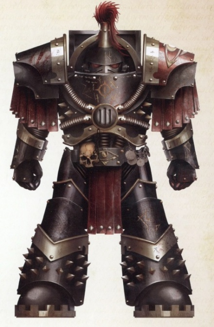
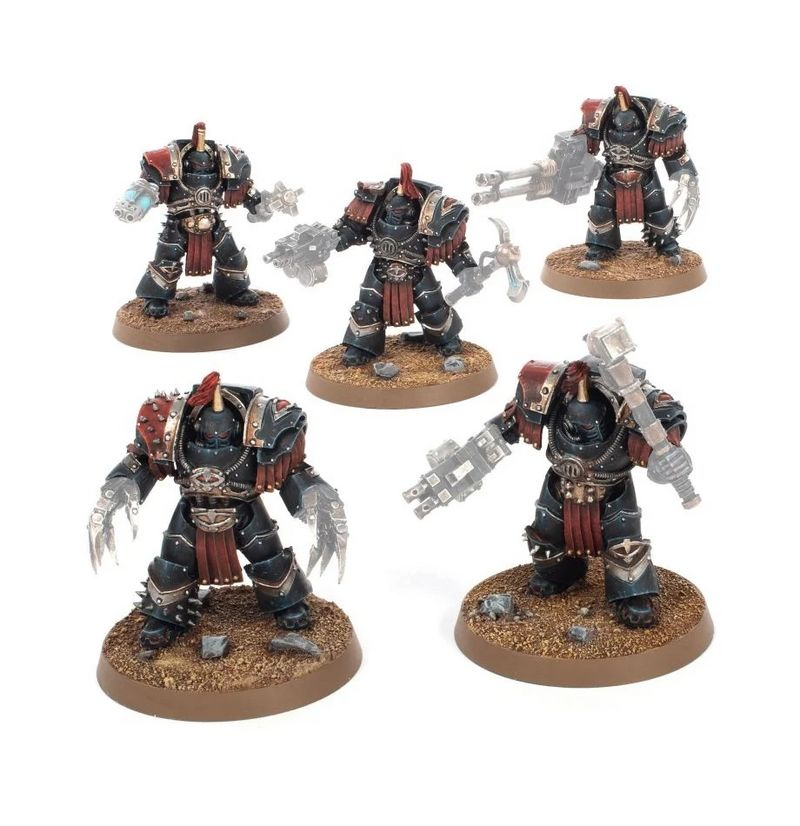

# 0556 加斯塔林 Justaerin

精校状态：中文行文已逐段精校，部分术语仍为暂定

分类：概念

原文来源：https://www.bilibili.com/opus/1025143216791355416

原作者：帝国神选罐头

原文时间：2025年01月22日 13:19

[返回分类目录](目录.md) · [全书目录](../../目录.md)

<!-- A0556-B0001 -->
**英文原文**

The Justaerin were the Terminator elite of the Luna Wolves and later the Sons of Horus.

<!-- /A0556-B0001 -->

<!-- A0556-B0002 -->

原译文

加斯塔林是影月苍狼和后来的荷鲁斯之子的终结者精英。

**校订译文**

加斯塔林是影月苍狼和后来的荷鲁斯之子的终结者精英。

<!-- /A0556-B0002 -->

<!-- A0556-B0003 图片 -->

<!-- A0556-B0004 -->

原译文

Justaerin Terminator 加斯塔林终结者

**校订译文**

Justaerin Terminator 加斯塔林终结者

<!-- /A0556-B0004 -->

<!-- A0556-B0005 -->
## Overview 概述

<!-- /A0556-B0005 -->

<!-- A0556-B0006 -->
**英文原文**

These black-armored Terminators were the pride of their legion, tasked with being the 'tip of the spear' of assaults where the fighting was hardest. Making up the prestigious 1st Company, they were usually directed at destroying the heart of an opposing target or conducting a decapitation strike of enemy command-and-control. These warriors were the favored of Horus, and under the direct command of First Captain Ezekyle Abaddon. The name Justerin is itself derived from a powerful gang on Cthonia in the days before the Imperium.

<!-- /A0556-B0006 -->

<!-- A0556-B0007 -->

原译文

这些黑甲终结者是他们军团的骄傲，他们的任务是在战斗最激烈的地方成为攻击的“矛尖”。他们组成了著名的第一连，通常旨在摧毁敌方目标的心脏或对敌方指挥和控制进行斩首打击。这些战士受到荷鲁斯的青睐，并在第一连长以泽凯尔·阿巴顿的直接指挥下。加斯塔林这个名字本身来源于帝国统治科索尼亚几天前的一个强大帮派。

**校订译文**

这些黑甲终结者是军团的骄傲，担任突击的“矛尖”，专攻战斗最激烈之处。他们组成声名显赫的第一连，通常负责摧毁敌方核心，或对其指挥与控制体系实施斩首打击。他们深受荷鲁斯青睐，由第一连长以泽凯尔·阿巴顿直接统率。“加斯塔林”之名，源于帝国建立之前科索尼亚的一个强大帮派。

**校注：** in the days before the Imperium 指帝国出现前的年代，原译几天前过度字面化。

<!-- /A0556-B0007 -->

<!-- A0556-B0008 图片 -->

<!-- A0556-B0009 -->

原译文

squad of Justaerin 加斯塔林小队

**校订译文**

squad of Justaerin 加斯塔林小队

<!-- /A0556-B0009 -->

<!-- A0556-B0010 -->
**英文原文**

The Justaerin suffered heavy losses during the Battle for Terra, after a large number of them were destroyed by Loyalists, in Abaddon's failed attempt to attack the Saturnine Gate. Following Horus' defeat at the hands of the Emperor, the remaining Justaerin sane enough to still obey commands were led by Hellas Sycar and evacuated the Sol System under Abaddon's command.

<!-- /A0556-B0010 -->

<!-- A0556-B0011 -->

原译文

在阿巴顿袭击泰拉之门的失败尝试中，加斯塔林在泰拉战役中遭受了重大损失，被忠诚派大量摧毁。在荷鲁斯被帝皇击败后，剩下的神智清醒、仍能服从命令的加斯塔林由赫拉斯·赛卡领导，在阿巴顿的指挥下撤离了太阳系。

**校订译文**

泰拉之战中，阿巴顿突袭土星之门失败，大批加斯塔林被忠诚派消灭，部队损失惨重。荷鲁斯败于帝皇之后，赫拉斯·赛卡率领尚能保持神志、服从命令的加斯塔林残部，遵照阿巴顿的命令撤离太阳系。

<!-- /A0556-B0011 -->

<!-- A0556-B0012 -->
**英文原文**

Since the end of the Heresy, the Justaerin have been replaced within the Black Legi on by the Bringers of Despair. The Justaerin, or at least their remnants, still serve as part of the Black Legion's Terminator elite.

<!-- /A0556-B0012 -->

<!-- A0556-B0013 -->

原译文

自叛乱结束以来，加斯塔林在黑色军团中被绝望使者所取代。加斯塔林，或者至少是他们的残余，仍然是黑色军团终结者精英的一部分。

**校订译文**

荷鲁斯之乱结束后，加斯塔林在黑色军团中的地位由绝望使者接替。不过，加斯塔林本身，至少其残部，仍是黑色军团终结者精锐的一部分。

**校注：** 本段原英文 Black Legi on 内部空格异常，读作 Black Legion；英文原貌保留，中文正常翻译。

<!-- /A0556-B0013 -->

<!-- A0556-B0014 -->
## Known Justaerin 著名加斯塔林

<!-- /A0556-B0014 -->

<!-- A0556-B0015 -->
**英文原文**

First Captain Ezekyle Abaddon - Commander

<!-- /A0556-B0015 -->

<!-- A0556-B0016 -->

原译文

第一连长以泽凯尔·阿巴顿 - 指挥官

**校订译文**

第一连长以泽凯尔·阿巴顿 - 指挥官

<!-- /A0556-B0016 -->

<!-- A0556-B0017 -->
**英文原文**

Captain Falkus Kibre

<!-- /A0556-B0017 -->

<!-- A0556-B0018 -->

原译文

连长法尔库斯·凯博

**校订译文**

法库斯·凯博连长。

<!-- /A0556-B0018 -->

<!-- A0556-B0019 -->
**英文原文**

Captain Hellas Sycar - Commander after Kibre's apparent death in the Siege of Terra.

<!-- /A0556-B0019 -->

<!-- A0556-B0020 -->

原译文

连长赫拉斯·赛卡 - 在凯博在泰拉围城假死之后的指挥官

**校订译文**

赫拉斯·赛卡连长——凯博在泰拉围城中被认为阵亡后，接掌部队。

**校注：** apparent death 为看来已经死亡或被认为阵亡，不等于有意假死。

<!-- /A0556-B0020 -->

<!-- A0556-B0021 -->

原译文

Ekron Fal 埃克伦·法尔

**校订译文**

Ekron Fal 埃克伦·法尔

<!-- /A0556-B0021 -->

<!-- A0556-B0022 -->

原译文

Trastevere 特拉斯泰韦雷

**校订译文**

Trastevere 特拉斯泰韦雷

<!-- /A0556-B0022 -->

<!-- A0556-B0023 -->

原译文

Urran Gauk 乌尔兰·高克

**校订译文**

Urran Gauk 乌尔兰·高克

<!-- /A0556-B0023 -->

<!-- A0556-B0024 -->

原译文

Arbras Haax 阿布拉斯·哈克斯

**校订译文**

Arbras Haax 阿布拉斯·哈克斯

<!-- /A0556-B0024 -->

<!-- A0556-B0025 -->

原译文

Volkus Goraddin 沃尔克斯·戈拉丁

**校订译文**

Volkus Goraddin 沃尔克斯·戈拉丁

<!-- /A0556-B0025 -->

本篇核心术语与暂定项

以下列出本篇出现的英文原形及核心术语表用词。同形词可能指不同对象，具体词义以本篇正文和校注为准；单复数、别名和仅见于图注的名称可能尚未列入。完整候选见[术语表](../../术语表/双语术语候选.csv)。

| 英文 | 采用中文 | 状态 |
| --- | --- | --- |
| Terminator | 终结者 | 官方已核对 |
| Imperium | 帝国 | 暂定·简称 |
| Emperor | 帝皇 | 官方已核对 |
| Black Legion | 黑色军团 | 暂定·官方待核 |
| Terra | 泰拉 | 暂定·官方待核 |
| Luna Wolves | 影月苍狼 | 暂定·官方待核 |
| Horus | 荷鲁斯 | 暂定·官方待核 |
| Sons of Horus | 荷鲁斯之子 | 暂定·官方待核 |
| Luna | 月球 | 暂定·官方待核 |
| Cthonia | 科索尼亚 | 暂定·官方待核 |
| Justaerin | 加斯塔林 | 暂定·官方待核 |
| Falkus Kibre | 法库斯·凯博 | 暂定·官方待核 |
| Saturnine Gate | 土星之门 | 暂定·官方待核 |
| Sol | 太阳系 | 暂定·官方待核 |
| First Captain | 第一连长 | 暂定·官方待核 |
| Ezekyle Abaddon | 以泽凯尔·阿巴顿 | 暂定·官方待核 |
| Captain | 连长 | 暂定·官方待核 |
| Terminators | 终结者 | 暂定·官方待核 |
| Remnants | 残骸 | 暂定·官方待核 |
| Hellas Sycar | 赫拉斯·赛卡 | 暂定·官方待核 |
| Bringers of Despair | 绝望使者 | 暂定·官方待核 |
| System | 星系（恒星系统） | 暂定·官方待核 |
| Sol System | 太阳系 | 暂定·官方待核 |

