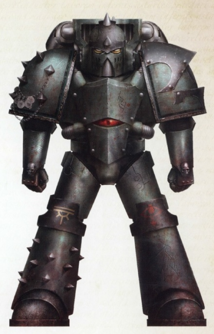
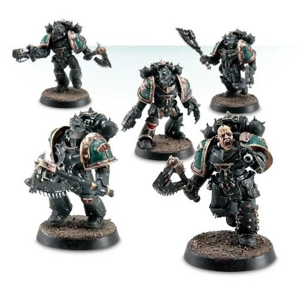

# 0557 掠夺者攻击小队 Reaver Attack Squad

精校状态：中文行文已逐段精校，部分术语仍为暂定

分类：概念

原文来源：https://www.bilibili.com/opus/1032513917590437892

原作者：帝国神选罐头

原文时间：2025年02月11日 10:01

[返回分类目录](目录.md) · [全书目录](../../目录.md)

原篇名：收割者攻击小队 Reaver Attack Squad

<!-- A0557-B0001 -->
**英文原文**

Reaver Attack Squads were specialized Space Marine formations used during the Great Crusade and Horus Heresy era by the Sons of Horus.

<!-- /A0557-B0001 -->

<!-- A0557-B0002 -->

原译文

收割者攻击小队是荷鲁斯之子在远征和荷鲁斯叛乱时期使用的专业的星际战士编队。

**校订译文**

掠夺者攻击小队，是荷鲁斯之子在大远征与荷鲁斯之乱时期使用的特种星际战士编队。

**校注：** 与0554部队表统一 Reaver 为掠夺者，原收割者在原译对照保留；不同于原铸 Reiver，英文拼写分别保存。

<!-- /A0557-B0002 -->

<!-- A0557-B0003 -->
## Overview 概述

<!-- /A0557-B0003 -->

<!-- A0557-B0004 -->
**英文原文**

Symbolizing the Legion's own way of war, they were heavily influenced by tribal warfare on Cthonia. Reaver units specialized in swift assaults which maimed and disabled their foes, striking down leaders, and mercilessly cutting down any isolated enemies. Acting in the tradition of Cthonian gangs, each Reaver unit was effectively an independent warband in its own right and its warriors fought more as individuals than soldiers.

<!-- /A0557-B0004 -->

<!-- A0557-B0005 -->

原译文

他们象征着军团自己的战争方式，深受科索尼亚部落战争的影响。收割者部队专门从事快速攻击，使敌人致残和重伤，击倒领导人，无情地消灭任何单独的敌人。按照科索尼亚帮派的传统，每个收割者部队实际上都是一个独立的战争组织，其战士更多的是作为个人而不是士兵作战。

**校订译文**

他们体现了军团独有的作战方式，深受科索尼亚部落战争影响。掠夺者擅长迅猛突袭，以重创敌人、瘫痪其战斗力，击杀首领，并无情消灭落单之敌。遵循科索尼亚帮派传统，每支掠夺者部队实际上都是独立战帮，成员更多依靠个人发挥，而非严整的士兵式协同。

<!-- /A0557-B0005 -->

<!-- A0557-B0006 图片 -->

<!-- A0557-B0007 -->

原译文

Sons of Horus Reaver Chieftain 荷鲁斯之子收割者首领

**校订译文**

Sons of Horus Reaver Chieftain 荷鲁斯之子掠夺者首领

<!-- /A0557-B0007 -->

<!-- A0557-B0008 -->
**英文原文**

Reaver Marines were sometimes equipped with jump packs, similarly to Assault Marines.

<!-- /A0557-B0008 -->

<!-- A0557-B0009 -->

原译文

收割者战士有时会配备跳跃背包，类似于突击战士。

**校订译文**

掠夺者战士有时会像突击战士一样，配备跳跃背包。

<!-- /A0557-B0009 -->

<!-- A0557-B0010 图片 -->

<!-- A0557-B0011 -->

原译文

Reaver Attack Squad 收割者攻击小队

**校订译文**

Reaver Attack Squad 掠夺者攻击小队

<!-- /A0557-B0011 -->

<!-- A0557-B0012 -->
**英文原文**

A number of Reaver Squads were destroyed by Loyalists, in Abaddon's failed attempt to attack the Saturnine Gate, during the Battle for Terra. Later during the siege, a Reaver assault by Malabreux captured Rogal Dorn's command center known as the Bhab Bastion.

<!-- /A0557-B0012 -->

<!-- A0557-B0013 -->

原译文

在泰拉战役中，阿巴顿试图袭击永恒之门，但失败了，许多收割者小队被忠诚派摧毁。在围城的后期，马拉博发动的收割者突袭占领了罗格·多恩的指挥中心，即巴布要塞。

**校订译文**

泰拉之战中，阿巴顿突袭土星之门失败，多支掠夺者小队被忠诚派消灭。围城后期，马拉博率掠夺者发动突袭，攻占了罗格·多恩的指挥中心巴布要塞。

**校注：** Saturnine Gate 统一土星之门，原译永恒之门误认地点；0556原译泰拉之门同样改正。

<!-- /A0557-B0013 -->

<!-- A0557-B0014 -->
## Notable Reavers 著名掠夺者战士

原题：Notable Reavers 著名收割者战士

<!-- /A0557-B0014 -->

<!-- A0557-B0015 -->
**英文原文**

DeRall — Line Captain and Chief, during the Battle for Terra

<!-- /A0557-B0015 -->

<!-- A0557-B0016 -->

原译文

德拉尔 — 泰拉战役中担任列队长和首领

**校订译文**

德拉尔——泰拉之战期间担任作战连长与首领。

<!-- /A0557-B0016 -->

<!-- A0557-B0017 -->
**英文原文**

Kalus Ekaddon — Captain of Catulan Reaver Squad.

<!-- /A0557-B0017 -->

<!-- A0557-B0018 -->

原译文

卡鲁斯·伊卡顿 — 卡图兰收割者小队队长

**校订译文**

卡鲁斯·埃卡顿——卡图兰掠夺者小队连长。

<!-- /A0557-B0018 -->

<!-- A0557-B0019 -->

原译文

Malabreux 马拉博

**校订译文**

Malabreux 马拉博

<!-- /A0557-B0019 -->

<!-- A0557-B0020 -->

原译文

Raxhal Koraddon 拉克沙尔·柯拉登

**校订译文**

Raxhal Koraddon 拉克沙尔·柯拉登

<!-- /A0557-B0020 -->

<!-- A0557-B0021 -->

原译文

Xan Ekosa 赞·埃科萨

**校订译文**

Xan Ekosa 赞·埃科萨

<!-- /A0557-B0021 -->

<!-- A0557-B0022 -->
**英文原文**

Skalagrim Phar — Apothecary.

<!-- /A0557-B0022 -->

<!-- A0557-B0023 -->

原译文

斯卡拉格姆·法尔 — 药剂师

**校订译文**

斯卡拉格姆·法尔 — 药剂师

<!-- /A0557-B0023 -->

<!-- A0557-B0024 -->
**英文原文**

Kovarny — Chieftain.

<!-- /A0557-B0024 -->

<!-- A0557-B0025 -->

原译文

科瓦尼 — 首领

**校订译文**

科瓦尼 — 首领

<!-- /A0557-B0025 -->

<!-- A0557-B0026 -->
## Known Squads 著名小队

<!-- /A0557-B0026 -->

<!-- A0557-B0027 -->

原译文

Catulan Reaver Squad 卡图兰收割者小队

**校订译文**

Catulan Reaver Squad 卡图兰掠夺者小队

<!-- /A0557-B0027 -->

<!-- A0557-B0028 -->

原译文

Cthonae Reaver Squad 科索尼亚收割者小队

**校订译文**

Cthonae Reaver Squad 科索尼亚掠夺者小队

<!-- /A0557-B0028 -->

<!-- A0557-B0029 -->

原译文

Heathens Reaver Squad 异教徒收割者小队

**校订译文**

Heathens Reaver Squad 异教徒掠夺者小队

<!-- /A0557-B0029 -->

本篇核心术语与暂定项

以下列出本篇出现的英文原形及核心术语表用词。同形词可能指不同对象，具体词义以本篇正文和校注为准；单复数、别名和仅见于图注的名称可能尚未列入。完整候选见[术语表](../../术语表/双语术语候选.csv)。

| 英文 | 采用中文 | 状态 |
| --- | --- | --- |
| Horus Heresy | 荷鲁斯之乱 | 官方已核对 |
| Great Crusade | 大远征 | 暂定·官方待核 |
| Terra | 泰拉 | 暂定·官方待核 |
| Horus | 荷鲁斯 | 暂定·官方待核 |
| Sons of Horus | 荷鲁斯之子 | 暂定·官方待核 |
| Cthonia | 科索尼亚 | 暂定·官方待核 |
| Apothecary | 药剂师 | 官方已核对 |
| Catulan Reaver Squad | 卡图兰掠夺者小队 | 暂定·官方待核 |
| Kalus Ekaddon | 卡鲁斯·埃卡顿 | 暂定·官方待核 |
| Saturnine Gate | 土星之门 | 暂定·官方待核 |
| Space Marine | 星际战士 | 暂定·官方待核 |
| Captain | 连长 | 暂定·官方待核 |
| The Bhab Bastion | 巴布要塞 | 暂定·官方待核 |

