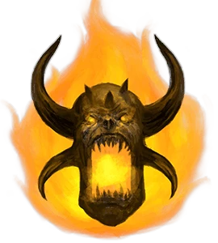
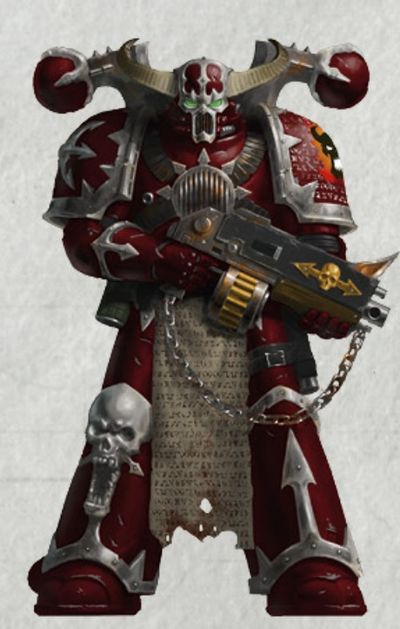
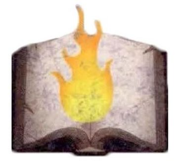
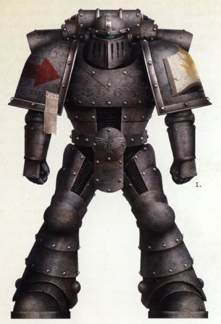
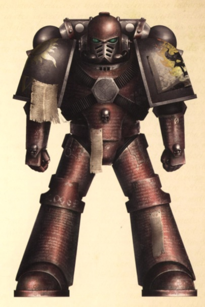
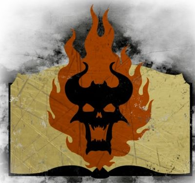
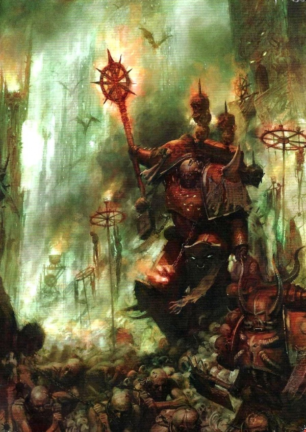
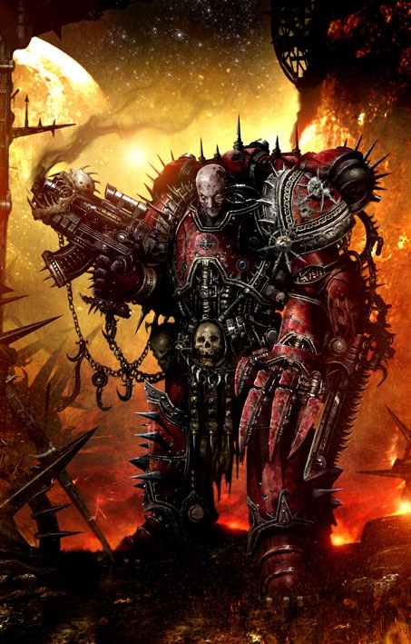
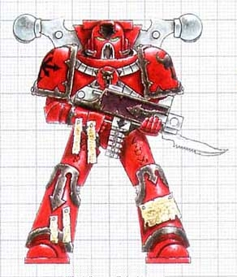

# 0558 XVII - 怀言者 Word Bearers

精校状态：中文行文已逐段精校，部分术语仍为暂定

分类：概念

原文来源：https://www.bilibili.com/opus/1102264753385897987

原作者：帝国神选罐头

原文时间：编辑于 2025年08月18日 15:36

[返回分类目录](目录.md) · [全书目录](../../目录.md)

<!-- A0558-B0001 -->
**英文原文**

The Word Bearers, originally known as the Imperial Heralds and the Iconoclasts, is the XVII Legion of the original twenty Space Marine Legions. They were the first of the nine Legions which betrayed the Emperor, becoming the first known Chaos Space Marines, pledging their allegiance to their Primarch Lorgar and to Chaos Undivided.

<!-- /A0558-B0001 -->

<!-- A0558-B0002 -->

原译文

怀言者，最初被称为帝国传道者和圣像破坏者，是最初的二十个星际战士军团中的第十七军团。他们是背叛帝皇的九个军团中的第一个，成为第一个已知的混沌星际战士，宣誓效忠他们的原体珞珈和混沌无分。

**校订译文**

怀言者原名“帝国先驱”，又称“圣像破坏者”，是最初二十个星际战士军团中的第十七军团。在背叛帝皇的九个军团中，他们最先堕落，成为已知最早的混沌星际战士，效忠于原体珞珈与混沌无分。

<!-- /A0558-B0002 -->

<!-- A0558-B0003 图片 -->

<!-- A0558-B0004 图片 -->

<!-- A0558-B0005 -->
**英文原文**

Legion Number:XVII

<!-- /A0558-B0005 -->

<!-- A0558-B0006 -->

原译文

军团编号：XVII

**校订译文**

军团编号：XVII

<!-- /A0558-B0006 -->

<!-- A0558-B0007 -->
**英文原文**

Primarch:Lorgar Aurelian

<!-- /A0558-B0007 -->

<!-- A0558-B0008 -->

原译文

原体：珞珈·奥瑞利安

**校订译文**

原体：珞珈·奥瑞利安

<!-- /A0558-B0008 -->

<!-- A0558-B0009 -->
**英文原文**

Homeworld:Colchis (Destroyed)

<!-- /A0558-B0009 -->

<!-- A0558-B0010 -->

原译文

家园世界：科尔基斯（毁灭）

**校订译文**

家园世界：科尔基斯（毁灭）

<!-- /A0558-B0010 -->

<!-- A0558-B0011 -->
**英文原文**

Current Base:Sicarus,Ghalmek

<!-- /A0558-B0011 -->

<!-- A0558-B0012 -->

原译文

当前基地：西卡鲁斯，加尔梅克

**校订译文**

当前基地：西卡鲁斯，加尔梅克

<!-- /A0558-B0012 -->

<!-- A0558-B0013 -->
**英文原文**

Chaos Affiliation:Chaos Undivided

<!-- /A0558-B0013 -->

<!-- A0558-B0014 -->

原译文

混沌隶属：混沌无分

**校订译文**

混沌隶属：混沌无分

<!-- /A0558-B0014 -->

<!-- A0558-B0015 -->
**英文原文**

Colours:Crimson with gunmetal trim (Post-Heresy),Grey (Pre-Heresy)

<!-- /A0558-B0015 -->

<!-- A0558-B0016 -->

原译文

颜色：深红色，带炮铜镶边（叛乱后），灰色（叛乱前）

**校订译文**

配色：深红色配枪铁色镶边（叛乱后）；灰色（叛乱前）。

**校注：** gunmetal 此处是深灰金属色，译枪铁色；原译炮铜易让人误认铜色。

<!-- /A0558-B0016 -->

<!-- A0558-B0017 -->
**英文原文**

Specialty:Daemonancy, Dark Apostles, Combined arms & garrisoning (Pre-Heresy)

<!-- /A0558-B0017 -->

<!-- A0558-B0018 -->

原译文

专业：恶魔学、黑暗使徒、联合兵种与驻军（叛乱前）

**校订译文**

专长：恶魔巫术、黑暗使徒；合成兵种作战与驻防（叛乱前）。

<!-- /A0558-B0018 -->

<!-- A0558-B0019 -->
**英文原文**

Battle Cry:An appropriate passage from their sacred texts and dolorous roars.

<!-- /A0558-B0019 -->

<!-- A0558-B0020 -->

原译文

战吼：他们神圣的经文和悲伤的咆哮中的一段恰当的段落。

**校订译文**

战吼：选自圣典、切合当下情境的经文，以及悲怆的咆哮。

<!-- /A0558-B0020 -->

<!-- A0558-B0021 -->
**英文原文**

Known Warbands:

<!-- /A0558-B0021 -->

<!-- A0558-B0022 -->

原译文

著名战帮：

**校订译文**

著名战帮：

<!-- /A0558-B0022 -->

<!-- A0558-B0023 -->

原译文

The Blessed 受祝者

**校订译文**

The Blessed 受祝者

<!-- /A0558-B0023 -->

<!-- A0558-B0024 -->

原译文

Bringers of Enlightenment 启蒙使者

**校订译文**

Bringers of Enlightenment 启蒙使者

<!-- /A0558-B0024 -->

<!-- A0558-B0025 -->

原译文

The Brotherhood 兄弟会

**校订译文**

The Brotherhood 兄弟会

<!-- /A0558-B0025 -->

<!-- A0558-B0026 -->

原译文

The Eightfold Architects 八重设计师

**校订译文**

The Eightfold Architects 八重设计师

<!-- /A0558-B0026 -->

<!-- A0558-B0027 -->

原译文

The Faithful 忠实信徒

**校订译文**

The Faithful 忠实信徒

<!-- /A0558-B0027 -->

<!-- A0558-B0028 -->

原译文

The Foresworn 弃誓者

**校订译文**

The Foresworn 弃誓者

<!-- /A0558-B0028 -->

<!-- A0558-B0029 -->

原译文

Holy Sons of Lorgar 珞珈的神圣之子

**校订译文**

Holy Sons of Lorgar 珞珈的神圣之子

<!-- /A0558-B0029 -->

<!-- A0558-B0030 -->

原译文

Iconoclastic Brotherhood 破像兄弟会

**校订译文**

Iconoclastic Brotherhood 破像兄弟会

<!-- /A0558-B0030 -->

<!-- A0558-B0031 -->

原译文

Infernal Host of Kor Megron 科尔·梅格隆的炼狱天军

**校订译文**

Infernal Host of Kor Megron 科尔·梅格隆的炼狱天军

<!-- /A0558-B0031 -->

<!-- A0558-B0032 -->

原译文

Ivory Fang 乳白长牙

**校订译文**

Ivory Fang 乳白长牙

<!-- /A0558-B0032 -->

<!-- A0558-B0033 -->

原译文

Lords of Desolation 荒芜领主

**校订译文**

Lords of Desolation 荒芜领主

<!-- /A0558-B0033 -->

<!-- A0558-B0034 -->

原译文

Prophets of the Blighted Path 枯萎之路先知

**校订译文**

Prophets of the Blighted Path 枯萎之路先知

<!-- /A0558-B0034 -->

<!-- A0558-B0035 -->

原译文

Runic Blazon 如尼纹章

**校订译文**

Runic Blazon 如尼纹章

<!-- /A0558-B0035 -->

<!-- A0558-B0036 -->

原译文

The Sanctified 神圣者

**校订译文**

The Sanctified 神圣者

<!-- /A0558-B0036 -->

<!-- A0558-B0037 -->

原译文

Screaming Mind 尖啸头脑

**校订译文**

Screaming Mind 尖啸头脑

<!-- /A0558-B0037 -->

<!-- A0558-B0038 -->

原译文

Sons of Damnation 诅咒之子

**校订译文**

Sons of Damnation 诅咒之子

<!-- /A0558-B0038 -->

<!-- A0558-B0039 -->

原译文

Weeping Veil 哭泣面纱

**校订译文**

Weeping Veil 哭泣面纱

<!-- /A0558-B0039 -->

<!-- A0558-B0040 -->
**英文原文**

Known for their extreme religious fervor even before their conversion to Chaos, the Word Bearers are some of the most fanatical Chaos Marines, notable for using Dark Apostles, a corrupted version of Space Marine Chaplains, to inspire their Marines and their cultist allies in battle.

<!-- /A0558-B0040 -->

<!-- A0558-B0041 -->

原译文

即使在他们皈依混沌之前，怀言者就以极端的宗教热情而闻名，他们是最狂热的混沌混沌星际战士之一，以使用黑暗使徒，一种堕落的星际战士牧师，在战斗中激励他们的战士和他们的邪教徒盟友而闻名。

**校订译文**

怀言者早在皈依混沌之前，就以极端的宗教狂热闻名。如今，他们是最狂热的混沌星际战士之一，常由黑暗使徒——堕落的星际战士教士——在战场上鼓舞麾下战士与邪教徒盟军。

<!-- /A0558-B0041 -->

<!-- A0558-B0042 -->
## History 历史

<!-- /A0558-B0042 -->

<!-- A0558-B0043 -->
### Unification Wars 统一战争

<!-- /A0558-B0043 -->

<!-- A0558-B0044 -->
**英文原文**

The Primarch of the Word Bearers, Lorgar, vanished while still an infant, just like all of the other Primarchs. The earliest days say the XVIIth Legion stand apart from their brother Legiones Astartes in duty and outlook. They fought with utter devotion and a fanatical zeal. Their original recruits were drawn from the sons of defeated enemies, raised to know the crimes of their fathers and the price of the Emperor's forgiveness. Thus while the other Legions went to war with righteousness, the XVIIth fought with the cold fury that only the condemned and redeemed could know. While other Legions took some time to acquire formal names, the XVIIth was named the Imperial Heralds almost immediately after their founding. This was due to their early role to deliver the Emperor's ultimatum, delivered by a lone herald in black armour with a skull-faced helmet and a winged mace: submission or destruction.

<!-- /A0558-B0044 -->

<!-- A0558-B0045 -->

原译文

怀言者的原体珞珈在婴儿时期就消失了，就像所有其他原体一样。最早的时候，第十七军团在职责和观点上与他们的兄弟军团阿斯塔特不同。他们以完全的献身精神和狂热的热情战斗。他们最初的新兵来自战败敌人的子嗣，他们从小就知道父亲的罪行和帝皇宽恕的代价。因此，当其他军团以正义而战时，第十七军团却以只有被定罪和被救赎的人才知道的冷酷愤怒作战。虽然其他军团需要一些时间才能获得正式名称，但第十七军团在成立后几乎立即被命名为帝国传道者。这是由于他们早期的角色是传达帝皇的最后通牒，由一名身穿黑色盔甲、头戴骷髅头头盔和带翼权杖的单独使者传达：要么屈服，要么毁灭。

**校订译文**

如同其他原体，珞珈在婴儿时期便已失散。第十七军团自创立之初，职责与精神面貌便有别于其他阿斯塔特军团：他们作战时全心奉献，狂热无比。最早的新兵来自战败敌人的子嗣，自幼就被教导父辈的罪行，以及获得帝皇宽恕所需付出的代价。因此，其他军团怀着正义感出征，第十七军团却怀着唯有曾被定罪、又获救赎者才能体会的冷酷愤怒。其他军团经过一段时间才获得正式名称，第十七军团却几乎一成立就被称作“帝国先驱”。这是因为他们早期负责传达帝皇的最后通牒：一名身披黑甲、头戴骷髅面盔、手持翼饰钉头锤的使者，孤身前来宣告——臣服，或毁灭。

<!-- /A0558-B0045 -->

<!-- A0558-B0046 图片 -->

<!-- A0558-B0047 -->

原译文

Pre-Heresy Word Bearers symbol 叛乱前怀言者标志

**校订译文**

Pre-Heresy Word Bearers symbol 叛乱前怀言者标志

<!-- /A0558-B0047 -->

<!-- A0558-B0048 -->
**英文原文**

Upon defeating an enemy, the Imperial Heralds would empty their libraries and records of any contents deemed heretical or sorcerous. Condemned works, individuals, and buildings would be destroyed in the name of the Imperial Truth. The Imperial Heralds repeated this process all across Terra during the Unification Wars. This gave the Imperial Heralds a rarely-spoken nickname among the greater Imperium: the Iconoclasts.

<!-- /A0558-B0048 -->

<!-- A0558-B0049 -->

原译文

击败敌人后，帝国传道者会清空他们的图书馆和记录中任何被视为异端或巫术的内容。被谴责的作品、个人和建筑将以帝国真理的名义被摧毁。统一战争期间，帝国传道者在整个泰拉上重复了这一过程。这给了帝国传道者一个在更大帝国中很少被提及的绰号：圣像破坏者。

**校订译文**

击败敌人后，帝国先驱会清查其图书馆与档案，剔除一切被认定涉及异端或巫术的内容。遭到判罪的著作、人物与建筑，都以帝国真理之名被抹除。统一战争期间，他们在泰拉各地反复执行这种清洗，由此在帝国中得到一个鲜有人公开提起的绰号：“圣像破坏者”。

<!-- /A0558-B0049 -->

<!-- A0558-B0050 -->
### The Great Crusade 大远征

<!-- /A0558-B0050 -->

<!-- A0558-B0051 -->
**英文原文**

Eventually, Lorgar was discovered on a Feudal World named Colchis, which he had eventually unified in a series of brutal religious wars in response to his visions of the Emperor's coming arrival. When the Emperor did arrive, as Lorgar had foreseen, the Primarch dropped to his knee, leading the population of his world in rejoicing and worship of the Emperor as a god. At the conclusion of these festivities, the Emperor bade Lorgar take his best warriors and induct them into his Space Marine Legion (at that time known as the Imperial Heralds) and join him on the Great Crusade. Lorgar appointed trustworthy regents to rule over Colchis and devoutly complied with his father's direction.

<!-- /A0558-B0051 -->

<!-- A0558-B0052 -->

原译文

最终，珞珈在一个名为科尔基斯的封建世界被发现，他最终在一系列残酷的宗教战争中统一了这个世界，以回应他对帝皇即将到来的愿景。当帝皇真的到达时，正如珞珈所预见的那样，原体跪倒在地，带领全世界的人民欢庆和崇拜帝皇作为神。在这些庆祝活动结束时，帝皇命令珞珈带上他最好的战士，将他们编入他的星际战士军团（当时被称为帝国传道者），并加入他的大远征。珞珈任命了值得信赖的摄政王来统治科尔基斯，并虔诚地听从了父亲的指示。

**校订译文**

帝皇最终在封建世界科尔基斯找到了珞珈。为迎接幻象中预示的帝皇降临，珞珈已发动一连串残酷的宗教战争，将星球统一。当帝皇如预言般到来时，珞珈跪地迎接，带领全体民众欢庆，并将他当作神明膜拜。庆典结束后，帝皇命珞珈带上最优秀的战士，加入以他为原体的星际战士军团——当时的帝国先驱——共同投身大远征。珞珈任命可信赖的摄政者治理科尔基斯，虔诚地遵从父亲的指示。

<!-- /A0558-B0052 -->

<!-- A0558-B0053 图片 -->

<!-- A0558-B0054 -->

原译文

Pre-Heresy Word Bearer color scheme 叛乱前怀言者配色方案

**校订译文**

Pre-Heresy Word Bearer color scheme 叛乱前怀言者配色方案

<!-- /A0558-B0054 -->

<!-- A0558-B0055 -->
**英文原文**

Lorgar was an unusually pious Primarch. While other Legions were rapidly conquering planet after planet, the Word Bearers proceeded much more slowly, as they would build temples and shrines in veneration of the Emperor, who was also deemed the God of the Imperium by Lorgar, on each newly conquered planet. All forms of blasphemy and heresy that threatened the Emperor's realm, all manner of ancient scrolls, books, artworks and icons were burned and smashed before the advancing ranks of the Legion. In their place, vast monuments and cathedrals, all dedicated to the Emperor, were erected upon the mounds of dead of those who had resisted conversion. The greatest Chaplains of the Legion produced enormous works on the divinity and righteousness of the Emperor, and Lorgar himself delivered countless speeches and sermons, converting millions to the Emperor with his words alone.

<!-- /A0558-B0055 -->

<!-- A0558-B0056 -->

原译文

珞珈是一位异常虔诚的原体。当其他军团迅速征服一个又一个行星时，怀言者的进展要慢得多，因为他们会在每个新征服的行星上建造神殿和圣地来供奉帝皇，而帝皇也被珞珈视为帝国之神。所有形式的亵渎和异端威胁着帝皇的王国，各种古代卷轴、书籍、艺术品和圣像在军团前进的队伍面前被烧毁和砸碎。取而代之的是，巨大的纪念碑和大教堂，都是献给帝皇的，建在那些拒绝皈依的人的坟墓上。军团最伟大的牧师们就帝皇的神性和正义创作了大量作品，珞珈本人发表了无数演讲和布道，仅凭他的话就让数百万人皈依了帝皇。

**校订译文**

珞珈是一位异乎寻常地虔诚的原体。其他军团迅速征服一个又一个星球时，怀言者的进展却慢得多：每征服一地，他们都要兴建神殿与圣所，膜拜被珞珈尊为帝国之神的帝皇。凡是被视为威胁帝皇疆域的亵渎与异端，无论古卷、书籍、艺术品还是圣像，都在军团的推进中遭到焚毁、砸碎。在拒绝皈依者堆积如山的尸骸上，他们修建宏伟纪念碑与大教堂，尽数献给帝皇。军团最杰出的教士撰写大量著作，宣扬帝皇的神性与正义；珞珈本人则以无数演说和布道，仅凭言语就使数百万人皈依。

<!-- /A0558-B0056 -->

<!-- A0558-B0057 -->
**英文原文**

One of the conflicts during the Great Crusade was the Corrinos Campaign where the Word Bearers fought with renegade Psykers that didn't want to join the Imperium.

<!-- /A0558-B0057 -->

<!-- A0558-B0058 -->

原译文

大远征期间的一场冲突是科里诺斯战役，怀言者与不想加入帝国的叛徒灵能者作战。

**校订译文**

大远征期间的一场冲突是科里诺斯战役，怀言者与不想加入帝国的叛徒灵能者作战。

<!-- /A0558-B0058 -->

<!-- A0558-B0059 -->
### A Legion Kneels 军团下跪

<!-- /A0558-B0059 -->

<!-- A0558-B0060 -->
**英文原文**

Despite being pledged to the Great Crusade for around a century, the Emperor had never once rebuked Lorgar or his Legion for their zealous worship even though such doctrine clashed with the Emperor's Imperial Truth. However 43 years prior to the events of Isstvan V the Emperor brought his wrath to bear on the Word Bearers. The Emperor ordered the Ultramarines to utterly destroy the city of Monarchia, a perfect city that was testament to all that Lorgar and the Word Bearers stood for, and the capital of Khur. In the ashes of the city the entire Word Bearers legion gathered to be reprimanded by the Emperor, Roboute Guilliman and Malcador the Sigilite. The Legion in its entirety was forced to kneel in the ashes of their greatest achievement and re-pledge themselves to the Great Crusade and to the Emperor.

<!-- /A0558-B0060 -->

<!-- A0558-B0061 -->

原译文

尽管在大约一个世纪的时间里，帝皇一直承诺参加大远征，但他从未因为珞珈或他的军团的狂热崇拜而谴责过他们，尽管这种教义与帝皇的帝国真理相冲突。然而，在伊斯塔万五号事件发生的43年前，帝皇将他的愤怒释放到了怀言者身上。帝皇命令极限战士彻底摧毁摩纳齐亚，这是一座完美的城市，证明了珞珈和怀言者所代表的一切，也是库尔的首都。在这座城市的灰烬中，整个怀言者军团聚集在一起，接受帝皇、罗伯特·基里曼和掌印者马卡多的谴责。整个军团被迫跪在他们最伟大成就的灰烬中，并再次向大远征和帝皇宣誓。

**校订译文**

尽管怀言者已投身大远征近一个世纪，帝皇从未因其狂热崇拜而斥责珞珈或军团，即使这套教义与帝国真理相悖。然而，伊斯塔万五号事件发生前四十三年，帝皇终于向怀言者降下怒火。他命极限战士彻底摧毁库尔的首都摩纳齐亚——这座完美之城，凝聚了珞珈与怀言者的一切信念与追求。整个军团被召集到废墟中，接受帝皇、罗保特·基里曼与掌印者马卡多的训斥。他们被迫跪在自己最伟大成就的灰烬里，再次向帝皇与大远征宣誓效忠。

**校注：** 英文近百年投身远征的主语是怀言者，原译错误改为帝皇一直承诺参加远征。

<!-- /A0558-B0061 -->

<!-- A0558-B0062 -->
**英文原文**

In time, Lorgar came to realise that his worship of the Emperor as a god had been false. He still however maintained his view that faith was central to the human psyche and that it was still plausible that his views could be validated. His search began by investigating the Old Faith of his homeworld, which in his certainty that the Emperor was a god he had destroyed during the First Purge of the Brotherhood prior to being discovered by the Emperor. He returned to Colchis to seek the answers he so desperately needed and sought the council of Magnus the Red, the wisest among the Primarchs.

<!-- /A0558-B0062 -->

<!-- A0558-B0063 -->

原译文

随着时间的推移，珞珈逐渐意识到，他对帝皇作为神的崇拜是错误的。然而，他仍然坚持认为信仰是人类心理的核心，他的观点仍然有可能得到验证。他首先调查了他家乡的旧信仰，他确信帝皇是他在第一次兄弟会清洗中摧毁的神，然后被帝皇发现。他回到科尔基斯寻求他迫切需要的答案，并寻求赤红之马格努斯的讨论，他是最聪明的原体。

**校订译文**

渐渐地，珞珈认识到，将帝皇奉为神明的信仰是错误的。但他仍坚信，信仰是人类心灵的核心，而自己的观念仍有可能得到证实。他首先转向母星的旧信仰：在被帝皇寻回之前，他曾笃信帝皇就是神，因而在“第一次兄弟会清洗”中摧毁了这些古老信仰。如今，他重返科尔基斯，急切地寻找答案，并向原体中最睿智的红魔马格努斯求教。

**校注：** 被珞珈在早期清洗中摧毁的是母星旧信仰，原译句法错位，误称他摧毁帝皇。

<!-- /A0558-B0063 -->

<!-- A0558-B0064 -->
### The Pilgrimage 朝圣

<!-- /A0558-B0064 -->

<!-- A0558-B0065 -->
**英文原文**

Encouraged by Erebus and Kor Phaeron, who had in truth already fallen to worship of the Ruinous Powers, Lorgar came to realise that all of the belief systems which featured in countless other human cultures across the galaxy shared a common origin and underlying message. He believed that because all the countless legends of divinity, from so many disparate cultures, all agreed on other powers than exist beyond the veil, that the human species' most natural instinct could not be false. Thus he took The Pilgrimage, a mythological journey to the place where gods and mortals meet in an attempt to discover the universal truth of the universe and enlighten humanity and his father.

<!-- /A0558-B0065 -->

<!-- A0558-B0066 -->

原译文

在艾瑞巴斯和科尔·法伦的鼓励下，他们实际上已经开始崇拜毁灭之力，珞珈意识到，银河系无数其他人类文化中的所有信仰体系都有一个共同的起源和潜在的信息。他认为，由于来自如此多不同文化的无数神性传说都同意存在于帷幕之外的其他力量，人类最自然的本能不可能是假的。因此，他踏上了朝圣之旅，这是一次神话般的旅程，前往众神和凡人相遇的地方，试图发现宇宙的普遍真理，启蒙人类和他的父亲。

**校订译文**

在艾瑞巴斯与科尔·法伦的鼓动下——两人其实早已崇拜毁灭诸神——珞珈认定，银河系无数人类文化的信仰体系拥有共同起源，也传递着同一条深层信息。各异文化的无数神话，都提及帷幕之外存在其他力量；他因此相信，人类最本能的信仰冲动不可能全然虚假。于是，他踏上“朝圣之旅”，前往神话中凡人与诸神相会之地，企图发现宇宙普遍的真理，并以此启迪人类，乃至自己的父亲。

<!-- /A0558-B0066 -->

<!-- A0558-B0067 图片 -->

<!-- A0558-B0068 -->

原译文

Word Bearers Heresy-era Marine 叛乱时期怀言者战士

**校订译文**

Word Bearers Heresy-era Marine 叛乱时期怀言者战士

<!-- /A0558-B0068 -->

<!-- A0558-B0069 -->
**英文原文**

The Word Bearers Legion rejoined the Great Crusade as a front for the Pilgrimage and scattered itself across the stars, bringing more worlds into compliance than any other Legion in the last fifty years of the Crusade. Lorgar himself joined the 1,301st Expedition Fleet and eventually came to Cadia where they received validation for their theories that all of the Old Faiths across the galaxy shared similar origins, and thus shared a universal truth. Ingethel, a native of Cadia was anointed by the gods as Lorgar's guide in revealing the Primordial Truth and undertook a ritual to do so which elevated her to the ranks of the daemonic as Ingethel the Ascended.

<!-- /A0558-B0069 -->

<!-- A0558-B0070 -->

原译文

怀言者军团重新加入了大远征，作为朝圣的前线，并分散在各个行星上，在大远征的最后五十年里，他们带来了比任何其他军团都多的世界。珞珈本人加入了第1301远征舰队，最终来到卡迪亚，在那里他们的理论得到了验证，即银河系中的所有旧信仰都有相似的起源，因此共享一个普遍真理。英格泰尔是卡迪亚人，被众神指定为向珞珈揭示原初真理的向导，并为此举行了一场仪式，将她升格为恶魔升天者英格泰尔。

**校订译文**

怀言者重返大远征，以征战掩护朝圣，分散至群星之间。在大远征的最后五十年里，他们使之归顺的世界，比任何其他军团都多。珞珈随第一千三百零一远征舰队来到卡迪亚，并在那里找到了他所认定的证据：银河各地的旧信仰具有相近起源，因此蕴含共同真理。卡迪亚当地人英格泰尔被诸神选为向导，负责向珞珈揭示“原初真理”。她为此接受仪式，升格为恶魔“升天者英格泰尔”。

**校注：** as a front 指以大远征为掩护，不是朝圣的前线。

<!-- /A0558-B0070 -->

<!-- A0558-B0071 -->
**英文原文**

Ingethel the Ascended led the Serrated Sun Chapter of the Word Bearers into the Great Eye where the failure of the Eldar Empire was witnessed first hand. Ingethel informed the Word Bearers that the Eldar failed and suffered the Fall because at the moment of their ascension they were unable to accept the Primordial Truth. They gave birth to a god of pleasure and promise, yet they felt no joy. Their new god awoke to find its worshipers abandoning it out of ignorance and fear, thus was the endless storm of the Great Eye formed, an echo of the birth-cries of the Eldar's new god. The nature of the Primordial Truth was revealed to the Word Bearers in the ashes of the Eldar Empire, they learned that in order for humanity as a species to survive they must not commit the same sins the Eldar did, they must instead accept Chaos.

<!-- /A0558-B0071 -->

<!-- A0558-B0072 -->

原译文

升天者英格泰尔带领怀言者中的锯齿烈阳战团进入了恐惧之眼，在那里亲眼目睹了灵族帝国的陨落。英格泰尔告知怀言者，灵族失败并遭受了陨落，因为在他们升格的那一刻，他们无法接受原初真理。他们诞下了一位快乐和应许之神，但他们没有感到快乐。他们的新神醒来，发现它的崇拜者出于无知和恐惧而抛弃了它，于是形成了恐惧之眼的无尽风暴，这是灵族新神诞生哭声的回响。原初真理的本质在灵族帝国的灰烬中被揭示给了怀言者，他们了解到，为了人类作为一个物种的生存，他们不能犯下与灵族相同的罪行，他们必须接受混沌。

**校订译文**

升天者英格泰尔率领怀言者的锯齿烈阳战团进入大眼，即恐惧之眼，亲眼见证灵族帝国覆亡的遗迹。她告诉怀言者，灵族之所以失败并遭受陨落，是因为在升华之际无法接受原初真理。他们孕育了掌管欢愉、许诺恩赐的新神，却没有因此喜悦；新神醒来后，发现崇拜者因无知和恐惧背弃自己，于是大眼的无尽风暴形成，成为祂诞生啼哭的回响。在灵族帝国的灰烬中，怀言者听取了这套关于原初真理的启示，并相信：若想让人类存续，就不能重蹈灵族覆辙，而必须拥抱混沌。

**校注：** 灵族陨落的因果解读是恶魔英格泰尔向怀言者传授的说法，保留叙述归属，不提升为中立旁白认定。

<!-- /A0558-B0072 -->

<!-- A0558-B0073 -->
**英文原文**

The Pilgrimage ultimately proved that the Emperor's Imperial Truth was in fact a lie and that gods truly did exist. Secretly pledging themselves to new Dark Gods, the Word Bearers hid their true allegiance for the next four decades. To do so, the Legion covertly purged loyalist elements in its ranks, mostly older Legionaries who remembered the days of the Imperial Heralds. The purge was largely successful, though a few loyalist Word Bearers avoided its impact due to being on far-off missions during the late Great Crusade.

<!-- /A0558-B0073 -->

<!-- A0558-B0074 -->

原译文

朝圣最终证明了帝皇的帝国真理实际上是一个谎言，神确实存在。在接下来的四十年里，怀言者秘密地向新的黑暗诸神宣誓，隐藏了他们真正的忠诚。为了做到这一点，军团秘密清除了其队伍中的忠诚分子，其中大多数是记得帝国传道者时代的年长军团士兵。这次清洗在很大程度上是成功的，尽管一些忠诚的怀言者在大远征后期执行了遥远的任务，避免了它的影响。

**校订译文**

朝圣之旅最终使怀言者确信，帝国真理实为谎言，诸神确实存在。他们秘密向新的黑暗诸神宣誓效忠，此后四十年始终掩藏真实立场。为此，军团暗中清洗内部忠诚派，其中大多是仍记得帝国先驱时代的老兵。清洗大体成功，只有少数忠诚派因在大远征末期远赴他处执行任务而幸免。

<!-- /A0558-B0074 -->

<!-- A0558-B0075 -->
**英文原文**

Lorgar and the Word Bearers spent the remaining years of the Great Crusade attempting to enlighten humanity about the universal truths of the universe, and began the long process of sending their forces throughout the rest of the Astartes Legions to establish Warrior Lodges and subvert them from within. Through this subterfuge they eventually managed to sway several Primarchs to their cause, the most notable being Horus Lupercal. Meanwhile, the Word Bearers avoided suspicion by loyally waging a great many campaigns, soon becoming one of the most militarily successful Legions in the Crusade and seemingly making up for their past failures. In command of the 2nd largest Legion after the Ultramarines, Lorgar's campaigns against predominately Human empires became vicious, brutal, and seemingly spiteful, perhaps a way for the Legion to vent its hidden frustrations.

<!-- /A0558-B0075 -->

<!-- A0558-B0076 -->

原译文

珞珈和怀言者在大远征的剩余几年里试图启发人类了解宇宙的普遍真理，并开始了一个漫长的过程，将他们的部队派往阿斯塔特军团的其他地方，建立战士结社并从内部颠覆它们。通过这个诡计，他们最终成功地说服了几位原体支持他们的事业，其中最著名的是荷鲁斯·卢佩卡尔。与此同时，怀言者通过忠诚地发动许多战役来避免怀疑，很快成为大远征中军事上最成功的军团之一，似乎弥补了他们过去的失败。在极限战士之后的第二大军团的指挥下，珞珈对以人类的帝国为主的战争变得恶毒、残酷，似乎充满恶意，这可能是军团发泄隐藏的挫败感的一种方式。

**校订译文**

在大远征余下的岁月中，珞珈与怀言者试图向人类传播他们所信奉的宇宙真理，并逐步将人手派往其他阿斯塔特军团，建立战士结社，从内部实施颠覆。通过这套隐秘手段，他们最终说服数位原体加入自己的事业，其中最关键的便是荷鲁斯·卢佩卡尔。与此同时，怀言者以忠诚之姿接连发动战役，掩人耳目，很快成为大远征中战功最显赫的军团之一，仿佛在弥补昔日过失。珞珈统率这支规模仅次于极限战士的第二大军团，对主要由人类组成的诸帝国发动战争，手段日益凶狠残暴，甚至带着泄愤意味，或许是为了宣泄军团隐忍的屈辱与怨愤。

<!-- /A0558-B0076 -->

<!-- A0558-B0077 -->
**英文原文**

When it became clear that humanity could not be enlightened without bloodshed whilst it remained shackled to the lies of the Emperor, Lorgar and Erebus helped orchestrate the corruption of Horus himself, initiating the Horus Heresy.

<!-- /A0558-B0077 -->

<!-- A0558-B0078 -->

原译文

当人们清楚地认识到，人类在不流血的情况下无法开悟，同时仍被帝皇的谎言所束缚时，珞珈和艾瑞巴斯辅助策划了荷鲁斯本人的腐化，引发了荷鲁斯叛乱。

**校订译文**

珞珈与艾瑞巴斯最终认定，只要人类仍受帝皇的谎言束缚，就不可能在不流血的情况下得到启蒙。于是，两人参与策划了荷鲁斯的堕落，掀起荷鲁斯之乱。

<!-- /A0558-B0078 -->

<!-- A0558-B0079 -->
### The Horus Heresy 荷鲁斯之乱

原题：The Horus Heresy 荷鲁斯叛乱

<!-- /A0558-B0079 -->

<!-- A0558-B0080 -->
**英文原文**

After the Drop Site Massacre on Isstvan V, the Word Bearers abandoned all their past pretenses of loyalty. They openly preached the Primordial Truth, changed their armor to crimson red, and utilized Daemonically Space Marines known as the Gal Vorbak. At the time of the Horus Heresy, it is estimated that the Word Bearers legion numbered some 150,000 combat troops.

<!-- /A0558-B0080 -->

<!-- A0558-B0081 -->

原译文

在伊斯塔万五号的登陆点大屠杀之后，怀言者放弃了他们过去所有的忠诚伪装。他们公开宣扬原初真理，将盔甲换成深红色，并使用被称为受祝之子的恶魔化星际战士。在荷鲁斯叛乱时期，据估计，怀言者军团约有15万作战部队。

**校订译文**

伊斯塔万五号的登陆点大屠杀后，怀言者彻底撕下忠诚的伪装。他们公开宣扬原初真理，将护甲涂成深红色，并投入被称为“受祝之子”的恶魔化星际战士。荷鲁斯之乱期间，军团估计约有十五万名作战人员。

<!-- /A0558-B0081 -->

<!-- A0558-B0082 图片 -->

<!-- A0558-B0083 -->

原译文

Possessed Word Bearers battle the Adeptus Custodes during the Horus Heresy 荷鲁斯叛乱时期，附魔怀言者者与禁军作战

**校订译文**

Possessed Word Bearers battle the Adeptus Custodes during the Horus Heresy 荷鲁斯之乱期间，附魔怀言者与禁军交战

<!-- /A0558-B0083 -->

<!-- A0558-B0084 -->
### Ultramar 奥特拉玛

<!-- /A0558-B0084 -->

<!-- A0558-B0085 -->
**英文原文**

As the Heresy unfolded, the Word Bearer ship Furious Abyss set off for Ultramar right after its construction was completed on the Jovian moon of Thule. The Furious Abyss's first kill was the Ultramarines ship Fist of Macragge as it was heading in for repairs in the Vangelis space port. The astropaths of the Fist of Macragge managed to send out a warning, ultimately received as a very powerful psychic scream at the Vangelis space port. Seeing visions of Macragge and the impending terror, Captain Cestus, Fleet Commander of the Ultramarines, quickly gathered a force of ships at the main Vangelis hub of Coralis. He managed to find seven ships: the Wrathful (which Cestus commandeered and commanded from) and her escorts, the Fearless, the Ferox, the Ferocious, the Fireblade, along with the Thousand Sons ship Waning Moon. Captain Vorlov of the ship Boundless also requested to join Captain Cestus, and was accepted. The fleet pursued the Furious Abyss and battled with it, suffering heavy casualties (all ships but the Wrathful and Fireblade were destroyed), ending when the Furious Abyss entered the warp to continue its journey to Ultramar. The Wrathful and Fireblade made the transition as well, but the Furious Abyss deployed a psionic mine which disturbed the Warp, causing the Fireblade's Gellar Field to fail, and the ship was torn apart by the forces of the Immaterium.

<!-- /A0558-B0085 -->

<!-- A0558-B0086 -->

原译文

随着叛乱的展开，怀言者战舰狂怒深渊号在木星的卫星图勒上建造完成后，立即出发前往奥特拉玛。狂怒深渊号的第一次杀戮是前往范吉利斯太空港进行维修的极限战士战舰马库拉格之拳号。马库拉格之拳的星语者设法发出了一个警告，最终在范吉利斯太空港以一种非常强大的灵能尖啸的形式被接收到。看到马库拉格的幻象和即将到来的恐怖，极限战士舰队指挥官塞斯图斯连长迅速在科拉利斯的主要范吉利斯枢纽集结了一支舰队。他设法找到了七艘战舰：愤怒号（赛斯图斯从中征用和指挥）及其护卫舰、无畏号、菲洛克斯号、凶猛号、火刃号，以及千子战舰残月号。无限号的沃尔沃舰长也请求加入塞斯图斯连长的行列，并被接受。舰队追击狂怒深渊号并与之作战，伤亡惨重（除愤怒号和火刃号外，所有战舰都被摧毁），当狂怒深渊号进入亚空间继续前往奥特拉玛时结束。愤怒号和火刃号也进行了转移，但狂怒深渊号部署了一枚灵能地雷，扰乱了亚空间，导致火刃号的盖勒力场失效，战舰被非物质界的力量撕裂。

**校订译文**

叛乱爆发后，怀言者战舰狂怒深渊号刚在木星卫星图勒建成，便启程前往奥特拉玛。它击毁的第一艘战舰，是正在前往范吉利斯太空港维修的极限战士舰船马库拉格之拳号。遇袭舰上的星语者成功发出警报，范吉利斯太空港收到的却是一声极其强烈的灵能尖啸。极限战士舰队指挥官塞斯图斯连长看见马库拉格及即将降临的恐怖景象，立即在范吉利斯的主要枢纽科拉利斯集结舰船。他设法找到了七艘：被他征用为指挥舰的愤怒号及其护航舰，以及无畏号、菲洛克斯号、凶猛号、火刃号和千子的残月号。无限号的沃尔沃舰长也请求加入，得到批准。舰队追击狂怒深渊号，与之交战后损失惨重，只剩愤怒号和火刃号。狂怒深渊号随后跃入亚空间，继续驶向奥特拉玛，两舰紧追而入。然而，狂怒深渊号布下一枚灵能水雷，扰乱亚空间，使火刃号的盖勒力场失效，整艘舰船被非物质界的力量撕碎。

**校注：** 原文称最初有七艘，却只列出六个明确舰名并另提护航舰；随后又加入无限号。保留原数量与列举，不自行补造舰名。

<!-- /A0558-B0086 -->

<!-- A0558-B0087 -->
**英文原文**

When the Word Bearers launched their attack against the Ultramarines, the strike against Calth was led by Lorgar's greatest champion, the former Master of the Faith, Kor Phaeron. He swore to utterly destroy the planet, and was very nearly successful. From his personal battle barge, now renamed Infidus Imperator, Kor Phaeron directed a full-scale invasion of the Calth System. Calth's three sister planets were all destroyed, massive geo-nuclear strikes ripping them apart at the core. Its once gentle sun was laced with deadly metals and substances that increased the star's radiation output tenfold; within a century after the Heresy's end, the final elements of Calth's atmosphere were burned off and the world left airless, its populace forced to live in gigantic underground caverns.

<!-- /A0558-B0087 -->

<!-- A0558-B0088 -->

原译文

当怀言者对极限战士发起攻击时，对考斯的攻击是由珞珈最伟大的冠军、前信仰之主科尔·法伦领导的。他发誓要彻底摧毁行星，而且几乎成功了。科尔·法伦从他的个人战斗驳船（现已更名为伪帝号）上指挥了对考斯星系的全面入侵。考斯的三颗姐妹行星都被摧毁了，巨大的地核打击将它们的核心撕裂。它曾经温和的太阳上镶嵌着致命的金属和物质，使恒星的辐射输出增加了十倍；叛乱结束后的一个世纪内，考斯大气层的最后元素被烧毁，世界失去了空气，其民众被迫生活在巨大的地下洞穴中。

**校订译文**

怀言者向极限战士发动进攻时，珞珈麾下最出众的勇将、前信仰之主科尔·法伦，负责突袭考斯。他发誓彻底毁灭这颗星球，并几乎得逞。坐镇已更名为伪帝号的私人战斗驳船，他指挥部队全面入侵考斯星系。考斯的三颗姊妹行星遭到大规模地核核打击，自核心崩解；原本温和的恒星也被注入致命金属与其他物质，辐射输出增至十倍。荷鲁斯之乱结束后不到一个世纪，考斯残存的大气便被烧蚀殆尽，地表再无空气，居民被迫迁入巨大的地下洞窟。

**校注：** increased tenfold 指变为原来的十倍，不是增加十倍后成为十一倍；人数和数量单位另已按英文修正。

<!-- /A0558-B0088 -->

<!-- A0558-B0089 图片 -->

<!-- A0558-B0090 -->

原译文

Heresy-era Symbol of the Word Bearers after their fall to Chaos 叛乱时期怀言者堕入混沌后的标志

**校订译文**

Heresy-era Symbol of the Word Bearers after their fall to Chaos 叛乱时期怀言者堕入混沌后的标志

<!-- /A0558-B0090 -->

<!-- A0558-B0091 -->
**英文原文**

The war on Calth was devastating and horrific. The Ultramarines were shocked by the millions of cultists the Word Bearers used as human shields and disgusted by the hordes of daemons they unleashed. The Word Bearers, in turn, had underestimated the tenacity and resolve of their foe. In the end, Lord Kor Phaeron was defeated when reinforcements from Macragge drove the Word Bearers from the surface of Calth. Kor Phaeron retreated all the way to the Maelstrom, a turbulent region of the galaxy where the Immaterium of Chaos seeps through into the material realm of the universe. Meanwhile, Lorgar led his own Shadow Crusade in conjunction with the World Eaters, hoping to create a gigantic Warp storm to cut off Ultramar from Terra.

<!-- /A0558-B0091 -->

<!-- A0558-B0092 -->

原译文

对考斯的战争是毁灭性的和可怕的。极限战士被数百万信徒用作人肉盾牌震惊了，并对他们释放的成群恶魔感到厌恶。反过来，怀言者低估了敌人的坚韧和决心。最终，当来自马库拉格的援军将怀言者从考斯的表面赶走时，科尔·法伦领主被击败。科尔·法伦一直撤退到大漩涡，这是银河系的一个动荡区域，混沌的非物质界渗透到宇宙的物质领域。与此同时，珞珈与吞世者一起领导了暗影远征，希望制造一场巨大的亚空间风暴，将奥特拉玛与泰拉隔绝。

**校订译文**

考斯之战惨烈而恐怖。怀言者驱使数百万邪教徒充当肉盾，令极限战士震惊；他们释放的恶魔群，也让忠诚战士深感憎恶。但怀言者同样低估了敌人的韧性与决心。最终，马库拉格援军将怀言者逐出考斯地表，科尔·法伦败退。他一路逃往大漩涡——那里星域动荡，混沌的非物质界渗入现实宇宙。与此同时，珞珈与吞世者共同发动暗影远征，企图制造巨大的亚空间风暴，将奥特拉玛与泰拉隔绝。

<!-- /A0558-B0092 -->

<!-- A0558-B0093 -->
**英文原文**

Following the Shadow Crusade, the Word Bearers were ordered to muster at Ullanor for Horus' planned drive on Terra. By this point Lorgar had come to view Horus as weak for resisting the embrace of the Gods, and secretly planned to usurp him as Warmaster. Nonetheless, Lorgar, Zardu Layak, and a small force journeyed into the Webway to find Fulgrim under the guise of returning him to the war. After successfully binding Fulgrim with his True Name, Lorgar planned to use him in a coup to dispose of Horus. However in the end, Lorgar's treachery was exposed and the plan fell apart. Lorgar was exiled from Horus' sight, but 5,000 Word Bearers under Zardu Layak agreed to follow the Warmaster to Terra. Meanwhile, a few scattered bands of loyalist Word Bearers continued to fight for the Emperor across the Galaxy.

<!-- /A0558-B0093 -->

<!-- A0558-B0094 -->

原译文

在暗影远征之后，怀言者被命令在乌兰诺集合，准备荷鲁斯的计划前往泰拉。此时，珞珈已经认为荷鲁斯抵抗众神的拥抱是软弱的，并秘密计划篡夺他作为战帅。尽管如此，珞珈、扎度·拉亚克和一小队人还是以让福格瑞姆重返战场为幌子，前往网道寻找他。在成功地将福格瑞姆与他的真名绑定后，珞珈计划利用他发动政变来处置荷鲁斯。然而，最终珞珈的背信弃义暴露了出来，计划也失败了。珞珈被逐出荷鲁斯的视线，但扎度·拉亚克领导下的5000名怀言者同意跟随战帅前往泰拉。与此同时，一些分散的忠诚派怀言者继续在银河系各地为帝皇而战。

**校订译文**

暗影远征结束后，怀言者奉命在乌兰诺集结，准备随荷鲁斯进攻泰拉。此时，珞珈认为荷鲁斯拒绝彻底投入诸神怀抱，足见其软弱，因而密谋夺取战帅之位。他与扎度·拉亚克率一支小部队进入网道，以召回福格瑞姆参战为名寻找对方，随后用真名成功将其束缚，打算利用他发动政变，推翻荷鲁斯。然而，密谋最终败露，计划破产。荷鲁斯放逐了珞珈，不许他再现身面前；扎度·拉亚克麾下的五千名怀言者却同意继续追随战帅，进军泰拉。与此同时，银河各处仍有少量分散的忠诚派怀言者，为帝皇奋战。

<!-- /A0558-B0094 -->

<!-- A0558-B0095 -->
**英文原文**

While Lorgar and Layak went separete ways, a force of Word Bearers led by Zedak Mordakar would aid the Sons of Horus in the recapture of their home planet.

<!-- /A0558-B0095 -->

<!-- A0558-B0096 -->

原译文

当珞珈和拉亚克分道扬镳时，由泽达克·莫达卡尔领导的一支怀言者部队将帮助荷鲁斯之子夺回他们的家园行星。

**校订译文**

珞珈与拉亚克分道扬镳之际，泽达克·莫达卡尔率领另一支怀言者部队，协助荷鲁斯之子收复母星。

<!-- /A0558-B0096 -->

<!-- A0558-B0097 -->
### Terra 泰拉

<!-- /A0558-B0097 -->

<!-- A0558-B0098 -->
**英文原文**

The Word Bearers under Layak would take part in the Siege of Terra. In the end, Horus was defeated, and the legions of Chaos were forced to flee. Shortly after the defeat at Terra, the Word Bearers were defeated in the Bitter War and their homeworld of Colchis was destroyed. The Word Bearers were also forced to retreat to the Eye of Terror, and there they have remained, returning to the Imperium to raid, pillage, and destroy.

<!-- /A0558-B0098 -->

<!-- A0558-B0099 -->

原译文

拉亚克领导下的怀言者参加对泰拉的围攻。最终，荷鲁斯被击败，混沌军团被迫逃离。在泰拉战败后不久，怀言者在苦战中战败，他们的家园科尔基斯被摧毁。怀言者也被迫撤退到恐惧之眼，他们一直留在那里，回到帝国进行突袭、掠夺和摧毁。

**校订译文**

拉亚克麾下的怀言者参加了泰拉围城。荷鲁斯最终战败，混沌军团被迫撤退。不久，怀言者又在“苦难战争”中败北，母星科尔基斯遭到摧毁。他们也被逐入恐惧之眼，此后一直盘踞其间，不时重返帝国，发动袭击、劫掠与破坏。

**校注：** Bitter War 为战役专名，暂译苦难战争，原译苦战遗漏专名性质。

<!-- /A0558-B0099 -->

<!-- A0558-B0100 -->
### Post-Heresy 叛乱后

<!-- /A0558-B0100 -->

<!-- A0558-B0101 -->
**英文原文**

"Speak the words of Lorgar and you shall live forever in the glory of Chaos. Speak them not and every one of you shall die today."/Ultimatum made at the gates of Moergh IV prior to it's destruction by Kor Phaeron.

<!-- /A0558-B0101 -->

<!-- A0558-B0102 -->

原译文

“说出珞珈之言，你将永远生活在混沌的荣耀中。不说出这些话，你们每个人今天都会死。”/在科尔·法伦摧毁莫尔格四号之前，在莫尔格四号之门制作的最后通牒。

**校订译文**

“诵念珞珈之言，你们便将在混沌的荣耀中永生。若不诵念，今日便是你们所有人的死期。”——科尔·法伦摧毁莫尔格四号前，在其城门外发出的最后通牒。

<!-- /A0558-B0102 -->

<!-- A0558-B0103 -->
**英文原文**

From the Daemon World of Sicarus, Lorgar watches over his Legion and orchestrates the vast corruption from within that the Imperium suffers at the hands of his cults and covens. Unlike many of the other Traitor Legions, the Word Bearers have remained a unified, if loosely organised, military force, the main ruling body of which is known as the Dark Council, which rules in Lorgar's absence.

<!-- /A0558-B0103 -->

<!-- A0558-B0104 -->

原译文

在西卡鲁斯恶魔世界，珞珈监视着他的军团，并策划了帝国在他的教派和集会手中遭受的巨大腐化。与许多其他叛徒军团不同，怀言者仍然是一支统一的、组织松散的军事力量，其主要统治机构被称为黑暗议会，在珞珈缺席的情况下进行统治。

**校订译文**

珞珈坐镇恶魔世界西卡鲁斯，统御军团，策划由麾下教派与秘密结社从内部大规模腐化帝国。与许多叛徒军团不同，怀言者虽组织相对松散，仍保持统一；其主要统治机构“黑暗议会”，在珞珈不亲理事务时代行统治。

<!-- /A0558-B0104 -->

<!-- A0558-B0105 图片 -->

<!-- A0558-B0106 -->

原译文

A Daemon World ruled by the Word Bearers 被怀言者统治的恶魔世界

**校订译文**

A Daemon World ruled by the Word Bearers 被怀言者统治的恶魔世界

<!-- /A0558-B0106 -->

<!-- A0558-B0107 -->
**英文原文**

From the two primary bases of the Legion, Sicarus and the factory-world of Ghalmek, located within the Maelstrom, the Word Bearers launch twisted wars of faith against the Imperium. On each world they attack, they incubate a seed of heresy that will one day contribute to their ever-expanding web of cults. Sometimes however, this brings them into competition with the efforts of the Alpha Legion. Though the Alpha Legion and the Word Bearers have united several times to take part in the Black Crusades of Ezekyle Abaddon, they are more usually in states of bitter division and rivalry. However, these things are but distractions as their war against the Imperium of Man is total, and they do not intend for it to end until every icon of the Emperor lies shattered at their feet.

<!-- /A0558-B0107 -->

<!-- A0558-B0108 -->

原译文

从军团的两个主要基地，西卡鲁斯和位于大漩涡内的加尔梅克工厂世界，怀言者对帝国发动了扭曲的信仰战争。在他们攻击的每一个世界上，他们都孕育着异端的种子，总有一天会助长他们不断扩大的教派网络。然而，有时这会使他们与阿尔法军团的努力展开竞争。尽管阿尔法军团和怀言者曾多次联合参加以泽凯尔·阿巴顿的黑色远征，但他们通常处于激烈的分裂和竞争状态。然而，这些事情只是消遣，因为他们与人类帝国的战争是全面的，他们不打算在帝皇的每一个圣像都躺在他们脚下之前结束这场战争。

**校订译文**

怀言者以西卡鲁斯和大漩涡内的工厂世界加尔梅克为两大基地，对帝国发动扭曲的信仰战争。每攻击一颗星球，他们都会播下异端种子，等待其日后融入不断扩张的邪教网络。这有时也使他们与阿尔法军团相互争夺影响力。两者虽曾数度联合，参加以泽凯尔·阿巴顿的黑色远征，但更多时候仍彼此敌视、激烈竞争。不过，这些争端终究只是枝节：怀言者对人类帝国发动的是全面战争，在帝皇的每一座圣像都碎裂于脚下之前，绝不会罢手。

<!-- /A0558-B0108 -->

<!-- A0558-B0109 -->
### Notable Engagements Post-Heresy 叛乱后著名交战

<!-- /A0558-B0109 -->

<!-- A0558-B0110 -->

原译文

???.M31 — The Cleansing of the Orbstar 法球星清洗

**校订译文**

???.M31 — The Cleansing of the Orbstar 法球星清洗

<!-- /A0558-B0110 -->

<!-- A0558-B0111 -->

原译文

597.M32 - The 2nd Black Crusade 第二次黑色远征

**校订译文**

597.M32 - The 2nd Black Crusade 第二次黑色远征

<!-- /A0558-B0111 -->

<!-- A0558-B0112 -->

原译文

344.M33 — The Blackstar Liberation 黑星解放

**校订译文**

344.M33 — The Blackstar Liberation 黑星解放

<!-- /A0558-B0112 -->

<!-- A0558-B0113 -->

原译文

???.M36 - The Battle of Gerio 格里奥之战

**校订译文**

???.M36 - The Battle of Gerio 格里奥之战

<!-- /A0558-B0113 -->

<!-- A0558-B0114 -->

原译文

537.M38 - The 9th Black Crusade 第九次黑色远征

**校订译文**

537.M38 - The 9th Black Crusade 第九次黑色远征

<!-- /A0558-B0114 -->

<!-- A0558-B0115 -->

原译文

734.M38 — The Bissan Ambush 比桑伏击

**校订译文**

734.M38 — The Bissan Ambush 比桑伏击

<!-- /A0558-B0115 -->

<!-- A0558-B0116 -->

原译文

???.M41 — The Crusade of Fire 火焰远征

**校订译文**

???.M41 — The Crusade of Fire 火焰远征

<!-- /A0558-B0116 -->

<!-- A0558-B0117 -->

原译文

???.M41 — The Battle of Naemloch 纳姆洛赫之战

**校订译文**

???.M41 — The Battle of Naemloch 纳姆洛赫之战

<!-- /A0558-B0117 -->

<!-- A0558-B0118 -->

原译文

???.M41 — The Kapua Campaign 卡普亚战役

**校订译文**

???.M41 — The Kapua Campaign 卡普亚战役

<!-- /A0558-B0118 -->

<!-- A0558-B0119 -->

原译文

???.M41 — The Scouring of Makenna VII 马肯纳七号清洗

**校订译文**

???.M41 — The Scouring of Makenna VII 马肯纳七号清洗

<!-- /A0558-B0119 -->

<!-- A0558-B0120 -->

原译文

???.M41 — The Oceania Campaign 大洋洲战役

**校订译文**

???.M41 — The Oceania Campaign 大洋洲战役

<!-- /A0558-B0120 -->

<!-- A0558-B0121 -->

原译文

???.M41 — The Ur-Clemait Civil War 乌尔-克莱迈特内战

**校订译文**

???.M41 — The Ur-Clemait Civil War 乌尔-克莱迈特内战

<!-- /A0558-B0121 -->

<!-- A0558-B0122 -->

原译文

???.M41 — The Invasion of Tanakreg 塔纳克雷格入侵

**校订译文**

???.M41 — The Invasion of Tanakreg 塔纳克雷格入侵

<!-- /A0558-B0122 -->

<!-- A0558-B0123 -->

原译文

???.M41 — The Siege of Thanatos 塔纳托斯围城

**校订译文**

???.M41 — The Siege of Thanatos 塔纳托斯围城

<!-- /A0558-B0123 -->

<!-- A0558-B0124 -->

原译文

???.M41 - The Fall of Kanak 卡纳克陷落

**校订译文**

???.M41 - The Fall of Kanak 卡纳克陷落

<!-- /A0558-B0124 -->

<!-- A0558-B0125 -->

原译文

455.M41 — The Siege of Goddeth Hive 戈德斯巢都围城

**校订译文**

455.M41 — The Siege of Goddeth Hive 戈德斯巢都围城

<!-- /A0558-B0125 -->

<!-- A0558-B0126 -->

原译文

679-760.M41 — The Siege of Hermetica 何米狄克围城

**校订译文**

679-760.M41 — The Siege of Hermetica 何米狄克围城

<!-- /A0558-B0126 -->

<!-- A0558-B0127 -->

原译文

777.M41 — The Achilus Crusade 阿基里斯远征

**校订译文**

777.M41 — The Achilus Crusade 阿基里斯远征

<!-- /A0558-B0127 -->

<!-- A0558-B0128 -->

原译文

888.M41 — Crusade of Wrath 愤怒远征

**校订译文**

888.M41 — Crusade of Wrath 愤怒远征

<!-- /A0558-B0128 -->

<!-- A0558-B0129 -->

原译文

946.M41 — The Battle of Eagle Gate 雄鹰之门之战

**校订译文**

946.M41 — The Battle of Eagle Gate 雄鹰之门之战

<!-- /A0558-B0129 -->

<!-- A0558-B0130 -->

原译文

999.M41 — The Battle of the Boros Gate 波罗斯门之战

**校订译文**

999.M41 — The Battle of the Boros Gate 波罗斯门之战

<!-- /A0558-B0130 -->

<!-- A0558-B0131 -->
**英文原文**

999.M41 — The 13th Black Crusade and the Diamor Campaign

<!-- /A0558-B0131 -->

<!-- A0558-B0132 -->

原译文

第13次黑色远征和迪亚莫尔战役

**校订译文**

999.M41——第十三次黑色远征及迪亚莫尔战役。

<!-- /A0558-B0132 -->

<!-- A0558-B0133 -->

原译文

999.M41 — The sacking of Sabatine 萨巴蒂尼劫掠

**校订译文**

999.M41 — The sacking of Sabatine 萨巴蒂尼劫掠

<!-- /A0558-B0133 -->

<!-- A0558-B0134 -->

原译文

???.M41 - The War in Gheldrith's Eye 盖尔德里斯之眼战争

**校订译文**

???.M41 - The War in Gheldrith's Eye 盖尔德里斯之眼战争

<!-- /A0558-B0134 -->

<!-- A0558-B0135 -->
**英文原文**

M42 - With the formation of the Great Rift and Noctis Aeterna, the Word Bearers began a wave of unprecedented activity in Segmentum Solar which included instigating large uprisings. Even by the 5th year into the Indomitus Crusade, a sizable force of World Bearers continued to operate perilously close to Terra.

<!-- /A0558-B0135 -->

<!-- A0558-B0136 -->

原译文

随着大裂隙和永恒之夜的形成，怀言者在太阳星域开始了前所未有的活动，其中包括煽动大规模叛乱。即使到了不屈远征的第五年，一支相当大的怀言者部队仍在泰拉附近危险地行动。

**校订译文**

M42——大裂隙出现、永恒之夜降临后，怀言者在太阳星域空前活跃，煽动多场大规模起义。直到不屈远征第五年，仍有一支规模可观的怀言者部队在危险地逼近泰拉的区域活动。

**校注：** 原文 World Bearers 应为 Word Bearers 的笔误；译文按本篇明确主体怀言者处理。

<!-- /A0558-B0136 -->

<!-- A0558-B0137 -->

原译文

???.M42 — The Battle of Gathalamor 加塔拉莫之战

**校订译文**

???.M42 — The Battle of Gathalamor 加塔拉莫之战

<!-- /A0558-B0137 -->

<!-- A0558-B0138 -->

原译文

???.M42 - The Invasion of Almace 阿尔玛斯入侵

**校订译文**

???.M42 - The Invasion of Almace 阿尔玛斯入侵

<!-- /A0558-B0138 -->

<!-- A0558-B0139 -->

原译文

???.M42 - The Battle of Srinagar 斯利那加之战

**校订译文**

???.M42 - The Battle of Srinagar 斯利那加之战

<!-- /A0558-B0139 -->

<!-- A0558-B0140 -->

原译文

~12.M42 — The Battle of Raukos 劳科斯之战

**校订译文**

~12.M42 — The Battle of Raukos 劳科斯之战

<!-- /A0558-B0140 -->

<!-- A0558-B0141 -->

原译文

???.M42 — The Betrayal on Donatos 多纳托斯背叛

**校订译文**

???.M42 — The Betrayal on Donatos 多纳托斯背叛

<!-- /A0558-B0141 -->

<!-- A0558-B0142 -->

原译文

???.M42 - The Invasion of the Odoacer System 奥多亚克星系入侵

**校订译文**

???.M42 - The Invasion of the Odoacer System 奥多亚克星系入侵

<!-- /A0558-B0142 -->

<!-- A0558-B0143 -->

原译文

???.M42 - The War of Beasts on Vigilus 警戒星野兽战争

**校订译文**

???.M42 - The War of Beasts on Vigilus 警戒星野兽战争

<!-- /A0558-B0143 -->

<!-- A0558-B0144 -->
**英文原文**

???.M42 - The Talledus War. Kor Phaeron himself leads the invasion of Benediction.

<!-- /A0558-B0144 -->

<!-- A0558-B0145 -->

原译文

塔列多斯战争。科尔·法伦亲自领导了祝福入侵。

**校订译文**

???.M42——塔勒都斯战争。科尔·法伦亲率部队入侵祝福星。

**校注：** Benediction 为遭入侵的世界名，暂译祝福星，原译祝福入侵未体现地名。 对照本段英文确认同一实体，与全书核心译名统一；不改变同形异义词或省略称呼。

<!-- /A0558-B0145 -->

<!-- A0558-B0146 -->

原译文

???.M42 - The Charadon Campaign 查拉顿战役

**校订译文**

???.M42 - The Charadon Campaign 查拉顿战役

<!-- /A0558-B0146 -->

<!-- A0558-B0147 -->

原译文

???.M42 - The Battle for Budor V 布多尔五号之战

**校订译文**

???.M42 - The Battle for Budor V 布多尔五号之战

<!-- /A0558-B0147 -->

<!-- A0558-B0148 -->

原译文

???.M42 - The Battle of Besel V 贝泽尔五号之战

**校订译文**

???.M42 - The Battle of Besel V 贝泽尔五号之战

<!-- /A0558-B0148 -->

<!-- A0558-B0149 -->

原译文

???.M42 - The Nachmund Rift War 纳克蒙德走廊战争

**校订译文**

???.M42 - The Nachmund Rift War 纳克蒙德裂隙战争

<!-- /A0558-B0149 -->

<!-- A0558-B0150 -->
**英文原文**

???.M42 - The battle for Fidem IV against the Exorcists

<!-- /A0558-B0150 -->

<!-- A0558-B0151 -->

原译文

信任四号与驱魔者的战斗

**校订译文**

???.M42——信任四号之战，对抗驱魔者。

<!-- /A0558-B0151 -->

<!-- A0558-B0152 -->

原译文

???.M42 - The Arks of Omen Campaign. Battling in opposition to the Black Legion. 噩兆方舟战役。与黑色军团作战。

**校订译文**

???.M42 - The Arks of Omen Campaign. Battling in opposition to the Black Legion. 噩兆方舟战役。与黑色军团作战。

<!-- /A0558-B0152 -->

<!-- A0558-B0153 -->

原译文

???.M42 - The Pariah Crusade 被遗弃者远征

**校订译文**

???.M42 - The Pariah Crusade 被遗弃者远征

<!-- /A0558-B0153 -->

<!-- A0558-B0154 -->

原译文

??? - The Drakon Crusade 龙蛇远征

**校订译文**

??? - The Drakon Crusade 龙蛇远征

<!-- /A0558-B0154 -->

<!-- A0558-B0155 -->

原译文

??? — The Thorados Crusade 索拉多斯远征

**校订译文**

??? — The Thorados Crusade 索拉多斯远征

<!-- /A0558-B0155 -->

<!-- A0558-B0156 -->

原译文

??? — The War of Statues 雕像战争

**校订译文**

??? — The War of Statues 雕像战争

<!-- /A0558-B0156 -->

<!-- A0558-B0157 -->

原译文

??? — The Battle of Nepthys Madrigal 奈芙蒂斯牧歌之战

**校订译文**

??? — The Battle of Nepthys Madrigal 奈芙蒂斯牧歌之战

<!-- /A0558-B0157 -->

<!-- A0558-B0158 -->

原译文

??? — The sacrifice of Gruelbowl 粥碗献祭

**校订译文**

??? — The sacrifice of Gruelbowl 粥碗献祭

<!-- /A0558-B0158 -->

<!-- A0558-B0159 -->

原译文

??? — The Battle of Irradium Alpha 伊拉迪姆·阿尔法之战

**校订译文**

??? — The Battle of Irradium Alpha 伊拉迪姆·阿尔法之战

<!-- /A0558-B0159 -->

<!-- A0558-B0160 -->

原译文

??? — The War of False Prophets 虚假先知战争

**校订译文**

??? — The War of False Prophets 虚假先知战争

<!-- /A0558-B0160 -->

<!-- A0558-B0161 -->

原译文

??? — The Blood Tithe 鲜血什一税

**校订译文**

??? — The Blood Tithe 鲜血什一税

<!-- /A0558-B0161 -->

<!-- A0558-B0162 -->
## Organisation 组织

<!-- /A0558-B0162 -->

<!-- A0558-B0163 -->
### Great Crusade and Horus Heresy 大远征与荷鲁斯之乱

原题：Great Crusade and Horus Heresy 大远征和荷鲁斯叛乱

<!-- /A0558-B0163 -->

<!-- A0558-B0164 -->
**英文原文**

During the Great Crusade and ensuing Horus Heresy, the Word Bearers Legion, 100,000 strong, was divided into many different Chapters, each bearing a name and icon representing one of the constellations of Colchis. Typically a Chapter consisted of several companies with an overall strength of 500-3,000 warriors. While each Chapter maintained a formal military structure consisting of a Chapter Master, Captains and so on there was also a parallel hierarchy based around Chaplains and spiritual authority. The Word Bearers had recruited swiftly in the decades leading up to the Horus Heresy, and while nominally their strength at that point numbered 140,000, the opening actions of the Heresy indicated far greater numbers - potentially rivalling even the Ultramarines, and with few others able to rival them.

<!-- /A0558-B0164 -->

<!-- A0558-B0165 -->

原译文

在大远征和随后的荷鲁斯叛乱期间，有10万人的怀言者军团被分为许多不同的战团，每个战团都有一个代表科尔基斯星座之一的名字和图标。通常，一个战团由几个连队组成，总兵力为500-3000名战士。虽然每个战团都维持着一个由战团长、连长等组成的正式军事结构，但也有一个围绕牧师和精神权威的平行等级制度。在荷鲁斯叛乱之前的几十年里，怀言者迅速招募了人员，虽然名义上他们当时的兵力为14万人，但叛乱的开场白表明了更大的人数 — 甚至可能与极限战士相媲美，而且很少有其他人能与他们相匹敌。

**校订译文**

大远征与随后的荷鲁斯之乱时期，十万人的怀言者军团分为多个战团，各自以科尔基斯的一组星座命名，并采用相应徽记。战团通常下辖数个连，总兵力约五百至三千人。除战团长、连长等构成的正式军事体系外，军团还有一套以教士及宗教权威为核心的平行等级结构。叛乱前数十年，怀言者迅速扩军，届时名义兵力为十四万人；但叛乱初期的作战行动显示，实际人数可能远超此数，甚至足以比肩极限战士，鲜有其他军团能够匹敌。

**校注：** 本段列出十万、名义十四万与可能更多等不同阶段或估计值，与前文约十五万并列保留，不机械统一数值。

<!-- /A0558-B0165 -->

<!-- A0558-B0166 图片 -->

<!-- A0558-B0167 -->

原译文

A Post-Heresy Word Bearer 叛乱后怀言者

**校订译文**

A Post-Heresy Word Bearer 叛乱后怀言者

<!-- /A0558-B0167 -->

<!-- A0558-B0168 -->
**英文原文**

During the Great Crusade the legion fleet was known to be composed of an armada of a mere 116 warships. However by the time of the Horus heresy and in the aftermath of the titanic void battles that had taken place at Isstvan, by some accounts the Word Bearers fleet numbered over a hundred capital class ships, including nine Gloriana class battleships, several of which had once borne the colours of other Legions, and the three Abyss class kingships.

<!-- /A0558-B0168 -->

<!-- A0558-B0169 -->

原译文

在大远征期间，已知军团舰队由仅116艘战舰组成的舰队组成。然而，到荷鲁斯叛乱时期，以及在伊斯塔万发生的巨大虚空战之后，据一些人说，怀言者舰队拥有100多艘主力级舰艇，其中包括9艘荣光女王级战列舰，其中几艘曾经带有其他军团的颜色，以及3艘深渊级战列舰。

**校订译文**

大远征期间，军团舰队已知仅有一百一十六艘战舰。但到荷鲁斯之乱时期，经历伊斯塔万的惨烈虚空战后，一些记载称怀言者拥有一百多艘主力舰，包括九艘荣光女王级战列舰，以及三艘深渊级巨舰。其中数艘荣光女王级战列舰，曾涂装其他军团的配色。

<!-- /A0558-B0169 -->

<!-- A0558-B0170 -->
### Known Chapters 著名战团

<!-- /A0558-B0170 -->

<!-- A0558-B0171 -->

原译文

Akrak Jal 阿克拉克·贾尔

**校订译文**

Akrak Jal 阿克拉克·贾尔

<!-- /A0558-B0171 -->

<!-- A0558-B0172 -->

原译文

Ark of Testimony 证言方舟

**校订译文**

Ark of Testimony 证言方舟

<!-- /A0558-B0172 -->

<!-- A0558-B0173 -->
**英文原文**

Asps of the Sacred Sands — Destroyed on Calth.

<!-- /A0558-B0173 -->

<!-- A0558-B0174 -->

原译文

圣沙的阿斯匹斯 — 在考斯被摧毁。

**校订译文**

圣沙之蛇——在考斯被歼灭。

**校注：** Asps 为蛇类，原译阿斯匹斯误作专名音译；部队名暂译圣沙之蛇。

<!-- /A0558-B0174 -->

<!-- A0558-B0175 -->

原译文

Black Comet 黑色彗星

**校订译文**

Black Comet 黑色彗星

<!-- /A0558-B0175 -->

<!-- A0558-B0176 -->
**英文原文**

Bloodied Visage — 3,855th Expedition Fleet.

<!-- /A0558-B0176 -->

<!-- A0558-B0177 -->

原译文

流血面容 — 第3855远征舰队

**校订译文**

流血面容 — 第3855远征舰队

<!-- /A0558-B0177 -->

<!-- A0558-B0178 -->

原译文

The Brazenhead Chapter 铜首战团

**校订译文**

The Brazenhead Chapter 铜首战团

<!-- /A0558-B0178 -->

<!-- A0558-B0179 -->

原译文

Broken Scythe 破碎之镰

**校订译文**

Broken Scythe 破碎之镰

<!-- /A0558-B0179 -->

<!-- A0558-B0180 -->

原译文

Burning Hand 燃烧之手

**校订译文**

Burning Hand 燃烧之手

<!-- /A0558-B0180 -->

<!-- A0558-B0181 -->

原译文

Coiled Lash 盘绕鞭笞

**校订译文**

Coiled Lash 盘绕鞭笞

<!-- /A0558-B0181 -->

<!-- A0558-B0182 -->
**英文原文**

Crescent Moon — 3,855th Expedition Fleet.

<!-- /A0558-B0182 -->

<!-- A0558-B0183 -->

原译文

新月 — 第3855远征舰队

**校订译文**

新月 — 第3855远征舰队

<!-- /A0558-B0183 -->

<!-- A0558-B0184 -->

原译文

Crimson Mask 深红面具

**校订译文**

Crimson Mask 深红面具

<!-- /A0558-B0184 -->

<!-- A0558-B0185 -->

原译文

Ebon Branch 乌木树枝

**校订译文**

Ebon Branch 乌木树枝

<!-- /A0558-B0185 -->

<!-- A0558-B0186 -->

原译文

Ebony Serpent 黑檀毒蛇

**校订译文**

Ebony Serpent 黑檀毒蛇

<!-- /A0558-B0186 -->

<!-- A0558-B0187 -->
**英文原文**

Exalted Gate — Consumed by a unaligned greater daemon.

<!-- /A0558-B0187 -->

<!-- A0558-B0188 -->

原译文

崇高之门 — 被一个未结盟的大魔消耗

**校订译文**

崇高之门——被一头不隶属任何混沌神的大魔吞噬。

<!-- /A0558-B0188 -->

<!-- A0558-B0189 -->
**英文原文**

Flayed Hand — Destroyed by an Ultramarines ambush under Ventanus on Calth.

<!-- /A0558-B0189 -->

<!-- A0558-B0190 -->

原译文

剥皮之手 — 在考斯被文坦努斯下的极限战士伏击摧毁

**校订译文**

剥皮之手——在考斯遭文坦努斯率领的极限战士伏击，覆灭。

<!-- /A0558-B0190 -->

<!-- A0558-B0191 -->
**英文原文**

Graven Star — Destroyed in the caverns of Calth.

<!-- /A0558-B0191 -->

<!-- A0558-B0192 -->

原译文

坟墓之星 — 在考斯的洞穴中被摧毁

**校订译文**

镌刻之星——在考斯地下洞窟中覆灭。

**校注：** Graven 是镌刻、雕刻之义，不是 grave 坟墓；战团名暂修正镌刻之星。

<!-- /A0558-B0192 -->

<!-- A0558-B0193 -->
**英文原文**

Inscribed — Destroyed by an Ultramarines counter-assault on Calth.

<!-- /A0558-B0193 -->

<!-- A0558-B0194 -->

原译文

铭文 — 被极限战士对考斯的反击摧毁

**校订译文**

铭文——在考斯被极限战士的反击歼灭。

<!-- /A0558-B0194 -->

<!-- A0558-B0195 -->

原译文

Iron Veil 钢铁帷幕

**校订译文**

Iron Veil 钢铁帷幕

<!-- /A0558-B0195 -->

<!-- A0558-B0196 -->

原译文

Night's Chalice 午夜圣杯

**校订译文**

Night's Chalice 午夜圣杯

<!-- /A0558-B0196 -->

<!-- A0558-B0197 -->

原译文

Onyx Maw 玛瑙之喉

**校订译文**

Onyx Maw 玛瑙之喉

<!-- /A0558-B0197 -->

<!-- A0558-B0198 -->

原译文

Opening Eye 开放之眼

**校订译文**

Opening Eye 睁开之眼

<!-- /A0558-B0198 -->

<!-- A0558-B0199 -->

原译文

Osseous Throne 骸骨王座

**校订译文**

Osseous Throne 骸骨王座

<!-- /A0558-B0199 -->

<!-- A0558-B0200 -->

原译文

Perpetual Spiral 永恒螺旋

**校订译文**

Perpetual Spiral 永恒螺旋

<!-- /A0558-B0200 -->

<!-- A0558-B0201 -->
**英文原文**

Quillborn — Specialists in ship-to-ship fighting.

<!-- /A0558-B0201 -->

<!-- A0558-B0202 -->

原译文

奎尔之裔 — 舰对舰战斗专家

**校订译文**

奎尔之裔 — 舰对舰战斗专家

<!-- /A0558-B0202 -->

<!-- A0558-B0203 -->

原译文

Scold's Bridle 责骂缰绳

**校订译文**

Scold's Bridle 禁言嚼口

**校注：** Scold’s bridle 为束缚口部的惩罚器具，战团名暂译禁言嚼口；原译责骂缰绳逐词直译不通。

<!-- /A0558-B0203 -->

<!-- A0558-B0204 -->

原译文

Secret Boon 秘密恩惠

**校订译文**

Secret Boon 秘密恩惠

<!-- /A0558-B0204 -->

<!-- A0558-B0205 -->
**英文原文**

Serrated Sun — Commanded by Argel Tal and included the original Gal Vorbak.

<!-- /A0558-B0205 -->

<!-- A0558-B0206 -->

原译文

锯齿烈阳 — 由安格尔·塔尔指挥，包括最初的受祝之子。

**校订译文**

锯齿烈阳 — 由阿格尔·塔尔指挥，包括最初的受祝之子。

**校注：** 对照本段英文确认同一实体，与全书核心译名统一；不改变同形异义词或省略称呼。

<!-- /A0558-B0206 -->

<!-- A0558-B0207 -->

原译文

Star of Judgement 审判之星

**校订译文**

Star of Judgement 审判之星

<!-- /A0558-B0207 -->

<!-- A0558-B0208 -->

原译文

Sundered Tower 分离之塔

**校订译文**

Sundered Tower 破碎之塔

<!-- /A0558-B0208 -->

<!-- A0558-B0209 -->

原译文

Tainted Solstice 污染至日

**校订译文**

Tainted Solstice 污染至日

<!-- /A0558-B0209 -->

<!-- A0558-B0210 -->

原译文

Third Hand 第三之手

**校订译文**

Third Hand 第三之手

<!-- /A0558-B0210 -->

<!-- A0558-B0211 -->

原译文

Tri-Fold Crown 三折王冠

**校订译文**

Tri-Fold Crown 三重王冠

<!-- /A0558-B0211 -->

<!-- A0558-B0212 -->
**英文原文**

Twisting Rune — Destroyed in the caverns of Calth.

<!-- /A0558-B0212 -->

<!-- A0558-B0213 -->

原译文

扭曲符文 — 在考斯的洞穴中被摧毁

**校订译文**

扭曲符文 — 在考斯的洞穴中被摧毁

<!-- /A0558-B0213 -->

<!-- A0558-B0214 -->
**英文原文**

Unspeaking — Fought an Ultramarines company to mutual annihilation on Calth.

<!-- /A0558-B0214 -->

<!-- A0558-B0215 -->

原译文

无言者 — 在考斯与一支极限战士连队作战，最终相互歼灭。

**校订译文**

无言者——在考斯与极限战士的一个连同归于尽。

<!-- /A0558-B0215 -->

<!-- A0558-B0216 -->

原译文

Veiled Eye 帷幕之眼

**校订译文**

Veiled Eye 帷幕之眼

<!-- /A0558-B0216 -->

<!-- A0558-B0217 -->

原译文

Venomous Thorns 剧毒荆棘

**校订译文**

Venomous Thorns 剧毒荆棘

<!-- /A0558-B0217 -->

<!-- A0558-B0218 -->
**英文原文**

Void — A reserve formation, the smallest Chapter of the Word Bearers.

<!-- /A0558-B0218 -->

<!-- A0558-B0219 -->

原译文

虚空 — 一个预备编队，是怀言者者中最小的战团。

**校订译文**

虚空——预备队编制，也是怀言者规模最小的战团。

<!-- /A0558-B0219 -->

<!-- A0558-B0220 -->

原译文

Weeping Hand 哭泣之手

**校订译文**

Weeping Hand 哭泣之手

<!-- /A0558-B0220 -->

<!-- A0558-B0221 -->

原译文

Weeping Veil 哭泣面纱

**校订译文**

Weeping Veil 哭泣面纱

<!-- /A0558-B0221 -->

<!-- A0558-B0222 -->
**英文原文**

In addition to the Chapters, there were a number of other bodies within the Legion's organisational structure, including the Annunake - the Legion's Dreadnoughts.

<!-- /A0558-B0222 -->

<!-- A0558-B0223 -->

原译文

除了战团，军团的组织结构中还有许多其他机构，包括军团的无畏 - 安努纳克。

**校订译文**

除战团外，军团还设有其他组织，包括统称“安努纳克”的无畏机甲部队。

<!-- /A0558-B0223 -->

<!-- A0558-B0224 -->
### Unique Formations 独特编队

<!-- /A0558-B0224 -->

<!-- A0558-B0225 -->
**英文原文**

Annunake — The Legion's Dreadnoughts.

<!-- /A0558-B0225 -->

<!-- A0558-B0226 -->

原译文

安努纳克 — 军团的无畏

**校订译文**

安努纳克——军团的无畏机甲。

<!-- /A0558-B0226 -->

<!-- A0558-B0227 -->

原译文

The Ashen Circle 灰烬之环

**校订译文**

The Ashen Circle 灰烬之环

<!-- /A0558-B0227 -->

<!-- A0558-B0228 -->

原译文

The Brotherhood 兄弟会

**校订译文**

The Brotherhood 兄弟会

<!-- /A0558-B0228 -->

<!-- A0558-B0229 -->
**英文原文**

Harbingers of Death — Bodyguards of Erebus.

<!-- /A0558-B0229 -->

<!-- A0558-B0230 -->

原译文

死亡先驱 — 艾瑞巴斯的护卫

**校订译文**

死亡先驱 — 艾瑞巴斯的护卫

<!-- /A0558-B0230 -->

<!-- A0558-B0231 -->
**英文原文**

Zar Hraval — Pilot cadre.

<!-- /A0558-B0231 -->

<!-- A0558-B0232 -->

原译文

扎尔·赫拉瓦尔 — 飞行员干部

**校订译文**

扎尔·赫拉瓦尔——飞行员编队。

<!-- /A0558-B0232 -->

<!-- A0558-B0233 -->
### Post-Heresy 叛乱后

<!-- /A0558-B0233 -->

<!-- A0558-B0234 -->
**英文原文**

The Word Bearers do not worship Chaos Gods individually. Instead, they are venerated and regarded as a Dark Pantheon of Chaos Gods. The sons of Lorgar view those who limit their worship to a single Chaos God with contempt and are partially at odds with the Emperor's Children for their decadence. Word Bearers rely on Daemons as shock troops, meatshields, and as the bulk of their armies. Their elite Chaos Space Marines are used to accomplish vital tasks. The Word Bearers have been known to have a massive cultist base, and have used cultists and insurgents since the Great Crusade. However, unlike the Alpha Legion, the primary use of cultists is as cannon fodder and distractions.

<!-- /A0558-B0234 -->

<!-- A0558-B0235 -->

原译文

怀言者不会单独崇拜混沌诸神。相反，他们被尊为混沌诸神的黑暗万神殿。珞珈的子嗣蔑视那些只崇拜一位混沌之神的人，并因为他们的堕落而与帝皇之子产生了部分分歧。怀言者依靠恶魔作为突击部队、肉盾，以及他们的大部分军队。他们的精英混沌星际战士被用来完成重要任务。众所周知，怀言者拥有庞大的邪教徒基础，自大远征以来，他们一直使用邪教徒和叛乱分子。然而，与阿尔法军团不同，邪教徒的主要用途是作为炮灰和干扰。

**校订译文**

怀言者不专奉某一位混沌神，而是将诸神作为完整的黑暗神系共同崇拜。珞珈的子嗣鄙夷那些只信奉一位神祇的人，也因帝皇之子的放纵堕落而与之不睦。怀言者依赖恶魔充当突击兵、肉盾以及军队主体，将精锐混沌星际战士留用于关键任务。他们拥有庞大的邪教徒基础，自大远征以来便驱使邪教徒和叛乱者参战。但与阿尔法军团不同，他们主要把这些人当作炮灰，或用来牵制敌人。

<!-- /A0558-B0235 -->

<!-- A0558-B0236 -->
**英文原文**

The Word Bearers are notable for being the only Traitor Legion who still have a corps of Chaplains, now known as Dark Apostles. The Word Bearers follow the words of their Dark Apostles with total faith in battle. The Dark Apostles divine through many ways how a battle is to be fought and won, and the warriors of the Host obey unquestioningly. A Host may also be led by a Chaos Lord, with the same devotion from his troops should he speak as the Voice of Lorgar, under fearsome influence should he be titled Master of the Union. Before battle, the Word Bearers gather in ritual prayer, chanting hymns and cult doctrine to affirm their faith in the power of Chaos. Such battle chants, which may predate the Word Bearers' fall to Chaos, include the Martio Imprimis and Martio Secundus. Often these chants will be answered and it is common for the Word Bearers to fight alongside daemonic entities.

<!-- /A0558-B0236 -->

<!-- A0558-B0237 -->

原译文

怀言者是唯一一个仍然有牧师部队的叛徒军团，现在被称为黑暗使徒。怀言者在战斗中完全相信黑暗使徒的话。黑暗使徒通过多种方式预言了一场战斗是如何进行和胜利的，而天军的战士毫无疑问地服从了。一个天军也可能由一位混沌领主领导，如果他以珞珈之声的身份发言，他的军队也会同样忠诚，如果他被授予联盟领袖的称号，他会受到可怕的影响。在战斗之前，怀言者聚集在一起进行仪式祈祷，吟唱赞美诗和教派教义，以确认他们对混沌力量的信仰。这种战斗颂歌可能早于怀言者堕入混沌之前，包括第一征战和第二征战。通常，这些圣歌会得到回应，而且怀言者与恶魔实体并肩作战是很常见的。

**校订译文**

怀言者是唯一仍保有成体系教士团体的叛徒军团，只是这些教士如今被称为“黑暗使徒”。战斗中，军团对黑暗使徒的话深信不疑。使徒通过多种方式占卜战法与胜利之道，天军战士则毫无保留地服从。天军也可由混沌领主率领：以“珞珈之声”身份发号施令者，同样得到部众虔诚效忠；号称“联合之主”者，则以令人畏惧的威势支配麾下。开战前，怀言者会聚集祈祷，吟唱圣歌与教义，重申对混沌力量的信仰。有些战歌或许在军团堕落前便已存在，如《第一征战》与《第二征战》。这些吟唱常能引来回应，因此怀言者与恶魔并肩作战的景象并不罕见。

**校注：** Master of the Union 为特定职衔，暂作联合之主；原译把施加威势的统帅误作受到可怕影响的人。

<!-- /A0558-B0237 -->

<!-- A0558-B0238 -->
**英文原文**

Alongside the Black Legion and Death Guard, the Word Bearers are one of the three traitor Legions that did not fracture in the aftermath of the Horus Heresy. The legion is ruled centrally from the Dark Council of Sicarus. This evil priesthood enforces a strict regime of worship of the Chaos pantheon upon their fellow Word Bearers and are also highly likely to be found leading the Legion in battle. Each is gifted an army of their own, known as a Host. The numbers vary, with the smallest typical size roughly analogous to that of a Space Marine Company, and the largest exceeding the manpower of a Space Marine Chapter.

<!-- /A0558-B0238 -->

<!-- A0558-B0239 -->

原译文

与黑色军团和死亡守卫并列，怀言者是荷鲁斯叛乱事件后没有分裂的三个叛徒军团之一。该军团由西卡鲁斯黑暗议会集中统治。这种邪恶的神职人员对他们的怀言者同伴实施了严格的混沌万神殿崇拜制度，并且极有可能在战斗中领导军团。每个人都有一支自己的军队，被称为天军。这些数字各不相同，最小的典型规模大致类似于星际战士连队，最大的规模超过了星际战士战团的人力。

**校订译文**

怀言者与黑色军团、死亡守卫并列，是荷鲁斯之乱后未曾分裂的三大叛徒军团之一。怀言者由西卡鲁斯的黑暗议会集中统治；这些邪恶神职人员严令同袍崇拜整个混沌神系，也常亲自率军出战。每人都获赐一支自己的军队，称为“天军”。天军规模不一，常见的较小编制约相当于一个星际战士连，较大者人数则超过一个星际战士战团。

**校注：** 本段把黑色军团计作叛乱后未分裂的军团，是源文概括；与0554所记荷鲁斯之子先破碎、后被重组的过程需区分。

<!-- /A0558-B0239 -->

<!-- A0558-B0240 图片 -->

<!-- A0558-B0241 -->

原译文

Post-Heresy Word Bearer 叛乱后怀言者

**校订译文**

Post-Heresy Word Bearer 叛乱后怀言者

<!-- /A0558-B0241 -->

<!-- A0558-B0242 -->
**英文原文**

The organisational make-up of each Host differs wildly as well, and can change depending on the whims of the Dark Apostle that leads it. Often they will suddenly alter the hierarchy of their Host for reasons known only to themselves. These changes often result in seemingly unwieldy or tactically inflexible formations. The Word Bearers themselves accept these changes without question.

<!-- /A0558-B0242 -->

<!-- A0558-B0243 -->

原译文

每个天军的组织结构也大不相同，并且可以根据领导它的黑暗使徒的突发奇想而改变。他们通常会突然改变天军的等级制度，原因只有他们自己知道。这些变化往往导致看似笨拙或战术上不灵活的编队。怀言者自己毫无疑问地接受了这些变化。

**校订译文**

各支天军的组织形式差异极大，也会随统率它的黑暗使徒心意而变。使徒常突然调整内部等级结构，理由只有自己知道；调整结果往往看起来笨重难用，缺乏战术灵活性。怀言者却从不质疑，照单接受。

<!-- /A0558-B0243 -->

<!-- A0558-B0244 -->
**英文原文**

The largest known Host numbered over two thousand Chaos Marines at its peak. The size of this force required that the Dark Apostle be served by two chief lieutenants, his First Acolyte and a champion, entitled as the Coryphaus. The role of the Coryphaus is to be the intermediary between the Dark Apostle and his host. This allows the Dark Apostle to be seen primarily as a spiritual and distant figure. Furthermore, the Coryphaus is essentially in charge of the majority of tactical decisions on the battlefield, freeing the Dark Apostle to commune with the Darker powers, fuel the hatred of the host and ponder strategic matters. Additionally, the Host possessed an Icon Bearer and an elite unit of over two hundred Terminators known as the Anointed.

<!-- /A0558-B0244 -->

<!-- A0558-B0245 -->

原译文

已知最大的天军在其巅峰时期拥有2000多名混沌星际战士。这支部队的规模要求黑暗使徒由两名首席副官服务，即他的第一侍僧和一名被称为领唱者的冠军。领唱者的角色是黑暗使徒和他的主人之间的中介。这使得黑暗使徒主要被视为一个精神上和遥远的人物。此外，领唱者基本上负责战场上的大多数战术决策，使黑暗使徒能够与更黑暗的力量交流，助长天军的仇恨，并思考战略问题。此外，天军还拥有一名圣像承载者和一支由200多名终结者组成的精英部队，被称为受膏者。

**校订译文**

已知最大的一支天军，在鼎盛时拥有两千多名混沌星际战士。为统率如此规模的部队，黑暗使徒麾下设两名首要副手：第一侍僧，以及获授“领唱者”称号的勇士。领唱者负责联系黑暗使徒与其天军，让使徒得以保持超然、遥远的精神领袖形象。他也实际承担战场上大部分战术决策，使黑暗使徒能专注于沟通黑暗力量、煽动天军仇恨，并思考战略。此外，这支天军还配有圣像承载者，以及一支两百多名终结者组成的精锐部队“受膏者”。

**校注：** his host 为他麾下的天军，不是他的主人；the largest known 是本段所引资料的范围，不扩为全时段绝对上限。

<!-- /A0558-B0245 -->

<!-- A0558-B0246 -->
**英文原文**

The most commonly occurring structure is that roughly equating to a Space Marine company, with the Host broken down into units of about twelve warriors. Each is commanded by a champion of the Word Bearers who strives to become as devout a war leader as the Dark Apostle in the hope of one day being chosen to succeed him on the occasion of his death.

<!-- /A0558-B0246 -->

<!-- A0558-B0247 -->

原译文

最常见的结构大致相当于一个星际战士连队，天军分为大约十二个战士的单位。每个人都由一位怀言者的冠军指挥，他努力成为像黑暗使徒一样虔诚的战争领袖，希望有一天能在他死亡时被选中接替他。

**校订译文**

最常见的天军规模约相当于一个星际战士连，下分若干十二人左右的小队。每队由一名怀言者勇士率领；他们力求成为如黑暗使徒一般虔诚的战争领袖，盼望终有一日，在使徒死后获选继任。

<!-- /A0558-B0247 -->

<!-- A0558-B0248 -->
### Known Hosts 著名天军

<!-- /A0558-B0248 -->

<!-- A0558-B0249 -->
**英文原文**

The 1st Host - Commanded by Kor Phaeron

<!-- /A0558-B0249 -->

<!-- A0558-B0250 -->

原译文

第一天军 - 科尔·法伦指挥

**校订译文**

第一天军 - 科尔·法伦指挥

<!-- /A0558-B0250 -->

<!-- A0558-B0251 -->
**英文原文**

The 3rd Host - Commanded by Pridor Vrakon

<!-- /A0558-B0251 -->

<!-- A0558-B0252 -->

原译文

第三天军 - 普里多·弗拉肯指挥

**校订译文**

第三天军 - 普里多·弗拉肯指挥

<!-- /A0558-B0252 -->

<!-- A0558-B0253 -->
**英文原文**

The 7th Host - Commanded by Ekodas

<!-- /A0558-B0253 -->

<!-- A0558-B0254 -->

原译文

第七天军 - 埃科达斯指挥

**校订译文**

第七天军 - 埃科达斯指挥

<!-- /A0558-B0254 -->

<!-- A0558-B0255 -->
**英文原文**

The 11th Host - Commanded by Ankh-Heloth

<!-- /A0558-B0255 -->

<!-- A0558-B0256 -->

原译文

第11天军 - 安赫-赫洛斯指挥

**校订译文**

第11天军 - 安赫-赫洛斯指挥

<!-- /A0558-B0256 -->

<!-- A0558-B0257 -->
**英文原文**

The 18th Host - Commanded by Sarabdal

<!-- /A0558-B0257 -->

<!-- A0558-B0258 -->

原译文

第18天军 - 萨拉布达尔指挥

**校订译文**

第18天军 - 萨拉布达尔指挥

<!-- /A0558-B0258 -->

<!-- A0558-B0259 -->
**英文原文**

The 30th Host - Commanded by Belagosa

<!-- /A0558-B0259 -->

<!-- A0558-B0260 -->

原译文

第30天军 - 贝拉戈萨指挥

**校订译文**

第30天军 - 贝拉戈萨指挥

<!-- /A0558-B0260 -->

<!-- A0558-B0261 -->
**英文原文**

The 34th Host - Currently commanded by Grand Apostle Marduk.

<!-- /A0558-B0261 -->

<!-- A0558-B0262 -->

原译文

第34天军 - 目前由大使徒马杜克指挥。

**校订译文**

第34天军 - 目前由大使徒马杜克指挥。

<!-- /A0558-B0262 -->

<!-- A0558-B0263 -->
**英文原文**

The Word Bearers then march into battle beneath their standards, bellowing catechisms of hatred at their foe as drums beat out a dolorous thunder. The relentless advance of the Word Bearers is a terrifying sight, as the monotonous chant and beat of drums can break even the strongest will. The unshakeable belief of the Word Bearers in the truth of their cause has seen them marching into certain death, yet unwilling to take a single step backwards. A battle ends either in victory or the utter destruction of the Word Bearer host.

<!-- /A0558-B0263 -->

<!-- A0558-B0264 -->

原译文

然后，怀言者按照他们的标准进军战场，在鼓声响起悲伤之雷时，向敌人咆哮着仇恨的教义。怀言者无情的进军是一个可怕的景象，因为单调的吟唱和鼓声甚至可以打破最坚强的意志。怀言者对他们事业的真理坚定不移的信念，使他们走向死亡，却不愿后退一步。一场战斗要么以胜利告终，要么以怀言者天军的彻底毁灭告终。

**校订译文**

怀言者随后在战旗下列阵进军，战鼓奏出悲怆的雷鸣，他们则向敌人怒诵仇恨经文。军团步步逼近的景象令人胆寒，单调反复的吟唱与鼓点，甚至能击垮最坚强的意志。怀言者坚信自己事业的真理，即便前路必死，也绝不后退半步。对一支天军而言，战斗只会以胜利或彻底覆灭告终。

**校注：** standards 此处为军旗，不是标准。

<!-- /A0558-B0264 -->

<!-- A0558-B0265 -->
## Gene-Seed 基因种子

<!-- /A0558-B0265 -->

<!-- A0558-B0266 -->
**英文原文**

During the Great Crusade, the gene-seed of the Word Bearers was seen as stable and easily mass-produced, making the Word Bearers one of the largest Space Marine Legions even before the coming of Lorgar. By the time of the Heresy's outbreak, they were second in size only to the Ultramarines. However those implanted with Word Bearers gene-seed were marked by a dogged, unquestioning belief and stubbornness that bordered on insane fanaticism. This has been described as a inherent flaw which made them easily corruptible by Chaos. They were also said to possess the handsome and serene features of their Primarch Lorgar.

<!-- /A0558-B0266 -->

<!-- A0558-B0267 -->

原译文

在大远征期间，怀言者的基因种子被视为稳定且易于大规模生产，这使得怀言者在珞珈到来之前就成为了最大的星际战士军团之一。到叛乱爆发时，它的体量仅次于极限战士。然而，那些植入了怀言者基因种子的人的特点是固执、无条件的信仰和近乎疯狂狂热的固执。这被描述为一个固有的缺陷，使他们很容易被混沌腐化。据说他们还拥有其原体珞珈英俊而平静的特征。

**校订译文**

大远征期间，怀言者的基因种子以稳定、易于大规模培育著称，因此早在珞珈归来前，他们便已是最大的星际战士军团之一。叛乱爆发时，其规模仅次于极限战士。然而，植入这套基因种子的人往往信仰执拗、从不质疑，固执得近乎疯狂狂热。这被描述为一种先天缺陷，使他们容易被混沌腐化。据说，他们还继承了珞珈英俊、安详的面容。

<!-- /A0558-B0267 -->

<!-- A0558-B0268 -->
**英文原文**

Over ten thousand years inside the Eye of Terror, much of the Word Bearers' gene-seed has become corrupted and many of its members now sport mutations. However this is seen as a blessing by the Chaos Gods.

<!-- /A0558-B0268 -->

<!-- A0558-B0269 -->

原译文

在恐惧之眼的一万多年里，许多怀言者的基因种子已经被破坏，许多成员现在都发生了突变。然而，这被视为混沌诸神的祝福。

**校订译文**

在恐惧之眼度过一万多年后，怀言者的大量基因种子已被污染，许多成员也出现变异。但军团将这些变化视为混沌诸神的赐福。

<!-- /A0558-B0269 -->

<!-- A0558-B0270 -->
## Notable Elements 著名成员

<!-- /A0558-B0270 -->

<!-- A0558-B0271 -->
### Word Bearers Armoury 怀言者军械库

<!-- /A0558-B0271 -->

<!-- A0558-B0272 -->
### Fleet 舰队

<!-- /A0558-B0272 -->

<!-- A0558-B0273 -->
### Pre-Heresy 叛乱前

<!-- /A0558-B0273 -->

<!-- A0558-B0274 -->
**英文原文**

Fidelitas Lex — Flagship of the Word Bearers Legion, shot down over Armatura.

<!-- /A0558-B0274 -->

<!-- A0558-B0275 -->

原译文

信仰之律号 — 怀言者军团的旗舰，在阿马图拉上空被击落。

**校订译文**

信仰之律号 — 怀言者军团的旗舰，在阿马图拉上空被击落。

<!-- /A0558-B0275 -->

<!-- A0558-B0276 -->
**英文原文**

Infidus Imperator - Battle Barge of Kor Phaeron

<!-- /A0558-B0276 -->

<!-- A0558-B0277 -->

原译文

伪帝号 - 科尔·法伦的战斗驳船

**校订译文**

伪帝号 - 科尔·法伦的战斗驳船

<!-- /A0558-B0277 -->

<!-- A0558-B0278 -->
**英文原文**

Destiny's Hand - Battle Barge of Erebus

<!-- /A0558-B0278 -->

<!-- A0558-B0279 -->

原译文

命运之手号 - 艾瑞巴斯的战斗驳船

**校订译文**

命运之手号 - 艾瑞巴斯的战斗驳船

<!-- /A0558-B0279 -->

<!-- A0558-B0280 -->
**英文原文**

Kamiel — Battleship.

<!-- /A0558-B0280 -->

<!-- A0558-B0281 -->

原译文

卡米尔号 — 战列舰。

**校订译文**

卡米尔号 — 战列舰。

<!-- /A0558-B0281 -->

<!-- A0558-B0282 -->
**英文原文**

Furious Abyss — Specially-built Abyss Class Battleship. Commanded by Fleet Captain Zadkiel. Crippled before it could strike at Macragge.

<!-- /A0558-B0282 -->

<!-- A0558-B0283 -->

原译文

狂怒深渊号 — 特制的深渊级战列舰。由舰队连长扎德基尔指挥。在它袭击马库拉格之前就瘫痪了。

**校订译文**

狂怒深渊号——特制的深渊级战列舰，由舰队连长扎德基尔指挥；尚未抵达马库拉格发动攻击，便已被重创而失去行动能力。

<!-- /A0558-B0283 -->

<!-- A0558-B0284 -->
**英文原文**

Trisagion - Abyss Class Battleship

<!-- /A0558-B0284 -->

<!-- A0558-B0285 -->

原译文

三圣颂号 - 深渊级战列舰

**校订译文**

三圣颂号 - 深渊级战列舰

<!-- /A0558-B0285 -->

<!-- A0558-B0286 -->
**英文原文**

Blessed Lady - Abyss Class Battleship

<!-- /A0558-B0286 -->

<!-- A0558-B0287 -->

原译文

受祝女士号 - 深渊级战列舰

**校订译文**

受祝女士号 - 深渊级战列舰

<!-- /A0558-B0287 -->

<!-- A0558-B0288 -->
**英文原文**

De Profundis — Flagship of the 1,301st Expedition Fleet.

<!-- /A0558-B0288 -->

<!-- A0558-B0289 -->

原译文

来自深渊号 — 第1301远征舰队的旗舰。

**校订译文**

来自深渊号 — 第1301远征舰队的旗舰。

<!-- /A0558-B0289 -->

<!-- A0558-B0290 -->
**英文原文**

After the Horus Heresy the Word Bearers are known to possess the following vessels:

<!-- /A0558-B0290 -->

<!-- A0558-B0291 -->

原译文

在荷鲁斯叛乱之后，已知怀言者人拥有以下战舰：

**校订译文**

荷鲁斯之乱后，怀言者已知拥有以下舰船：

<!-- /A0558-B0291 -->

<!-- A0558-B0292 -->
**英文原文**

Infidus Imperator - Battle Barge of Kor Phaeron.

<!-- /A0558-B0292 -->

<!-- A0558-B0293 -->

原译文

伪帝号 - 科尔·法伦的战斗驳船

**校订译文**

伪帝号 - 科尔·法伦的战斗驳船

<!-- /A0558-B0293 -->

<!-- A0558-B0294 -->
**英文原文**

Dark Chorus — Desolator Battleship.

<!-- /A0558-B0294 -->

<!-- A0558-B0295 -->

原译文

黑暗圣歌号 — 荒芜使者战列舰

**校订译文**

黑暗圣歌号——荒芜使者级战列舰。

<!-- /A0558-B0295 -->

<!-- A0558-B0296 -->
**英文原文**

Anarchus — Battleship under Ankh-Heloth.

<!-- /A0558-B0296 -->

<!-- A0558-B0297 -->

原译文

无秩号 — 安赫-赫洛斯手下的战列舰

**校订译文**

无秩号 — 安赫-赫洛斯手下的战列舰

<!-- /A0558-B0297 -->

<!-- A0558-B0298 -->
**英文原文**

Crucius Maledictus — Massive Bulk transport capable of holding Titans.

<!-- /A0558-B0298 -->

<!-- A0558-B0299 -->

原译文

十字诅咒号 — 能够容纳泰坦的大体积运输舰。

**校订译文**

十字诅咒号——可容纳泰坦的巨型货运舰。

<!-- /A0558-B0299 -->

<!-- A0558-B0300 -->
**英文原文**

Vox Dominus — Carrion-class. An extremely huge ship, commanded by Dark Apostle Nahren. Lost in the warp for a few seconds while most of the 3rd host were aboard, and returned to real space with all the ship's crew dead and with the Garden of Nurgle taken root on the ship.

<!-- /A0558-B0300 -->

<!-- A0558-B0301 -->

原译文

神音号 — 腐尸级。一艘极其巨大的船，由黑暗使徒纳赫伦指挥。在亚空间中迷失了几秒钟，而第三天军的大部分人都在船上，回到真实宇宙，所有船员都死了，纳垢花园在船上扎根。

**校订译文**

神音号——腐尸级巨舰，由黑暗使徒纳赫伦指挥。第三天军的大部分成员在舰上时，它曾在亚空间中失踪数秒。重返现实空间后，舰上船员全部死亡，纳垢花园也已在舰内生根。

<!-- /A0558-B0301 -->

<!-- A0558-B0302 -->
**英文原文**

Ayamandar — Styx Class Heavy Cruiser.

<!-- /A0558-B0302 -->

<!-- A0558-B0303 -->

原译文

阿亚曼达尔号 — 冥河级重型巡洋舰。

**校订译文**

阿亚曼达尔号 — 冥河级重型巡洋舰。

<!-- /A0558-B0303 -->

<!-- A0558-B0304 -->
**英文原文**

Infidus Diabolus — Strike Cruiser under the command of Jarulek/Marduk.

<!-- /A0558-B0304 -->

<!-- A0558-B0305 -->

原译文

背信恶魔号 — 贾鲁克/马杜克指挥的打击巡洋舰

**校订译文**

背信恶魔号 — 贾鲁克/马杜克指挥的打击巡洋舰

<!-- /A0558-B0305 -->

<!-- A0558-B0306 -->
**英文原文**

Firebrand — Vessel of The Blessed.

<!-- /A0558-B0306 -->

<!-- A0558-B0307 -->

原译文

火焰烙印号 — 受祝者的战舰。

**校订译文**

火焰烙印号 — 受祝者的战舰。

<!-- /A0558-B0307 -->

<!-- A0558-B0308 -->
### Notable Word Bearers 著名怀言者

<!-- /A0558-B0308 -->

<!-- A0558-B0309 -->
### Heresy-Era 叛乱时期

<!-- /A0558-B0309 -->

<!-- A0558-B0310 -->
**英文原文**

Lorgar Aurelian — Primarch of the Word Bearers.

<!-- /A0558-B0310 -->

<!-- A0558-B0311 -->

原译文

珞珈·奥瑞利安 — 怀言者原体

**校订译文**

珞珈·奥瑞利安 — 怀言者原体

<!-- /A0558-B0311 -->

<!-- A0558-B0312 -->
**英文原文**

Erebus — First Chaplain of the Word Bearers.

<!-- /A0558-B0312 -->

<!-- A0558-B0313 -->

原译文

艾瑞巴斯 — 怀言者第一牧师

**校订译文**

艾瑞巴斯——怀言者首席教士。

**校注：** First Chaplain 统一首席教士，与0013艾瑞巴斯条目一致。

<!-- /A0558-B0313 -->

<!-- A0558-B0314 -->
**英文原文**

Kor Phaeron — Black Cardinal and First Captain of the Word Bearers.

<!-- /A0558-B0314 -->

<!-- A0558-B0315 -->

原译文

科尔·法伦 — 黑色红衣主教和怀言者的第一连长

**校订译文**

科尔·法伦 — 黑色红衣主教和怀言者的第一连长

<!-- /A0558-B0315 -->

<!-- A0558-B0316 -->
**英文原文**

Zardu Layak - The Crimson Apostle

<!-- /A0558-B0316 -->

<!-- A0558-B0317 -->

原译文

扎度·拉亚克 - 深红使徒

**校订译文**

扎度·拉亚克 - 深红使徒

<!-- /A0558-B0317 -->

<!-- A0558-B0318 -->
**英文原文**

Amyric Kel — Techmarine

<!-- /A0558-B0318 -->

<!-- A0558-B0319 -->

原译文

阿米里克·凯尔 — 技术军士

**校订译文**

阿米里克·凯尔——科技战士。

<!-- /A0558-B0319 -->

<!-- A0558-B0320 -->
**英文原文**

Argel Tal — Crimson Lord of the Gal Vorbak.

<!-- /A0558-B0320 -->

<!-- A0558-B0321 -->

原译文

安格尔·塔尔 — 受祝之子的深红领主

**校订译文**

阿格尔·塔尔 — 受祝之子的深红领主

**校注：** 对照本段英文确认同一实体，与全书核心译名统一；不改变同形异义词或省略称呼。

<!-- /A0558-B0321 -->

<!-- A0558-B0322 -->
**英文原文**

Xaphen — Chaplain and later member of the Gal Vorbak

<!-- /A0558-B0322 -->

<!-- A0558-B0323 -->

原译文

夏芬 — 牧师和受祝之子的最后成员

**校订译文**

夏芬——教士，后来加入受祝之子。

**校注：** later member 为后来加入的成员，不是最后一名成员。

<!-- /A0558-B0323 -->

<!-- A0558-B0324 -->
**英文原文**

Zadkiel — Fleet Captain of the Furious Abyss.

<!-- /A0558-B0324 -->

<!-- A0558-B0325 -->

原译文

扎德基尔 — 狂怒深渊号的舰队连长

**校订译文**

扎德基尔 — 狂怒深渊号的舰队连长

<!-- /A0558-B0325 -->

<!-- A0558-B0326 -->
**英文原文**

Jarulek — Dark Apostle.

<!-- /A0558-B0326 -->

<!-- A0558-B0327 -->

原译文

贾鲁克 — 黑暗使徒

**校订译文**

贾鲁克 — 黑暗使徒

<!-- /A0558-B0327 -->

<!-- A0558-B0328 -->
**英文原文**

Kol Badar — Captain

<!-- /A0558-B0328 -->

<!-- A0558-B0329 -->

原译文

科尔·巴达尔 — 牧师

**校订译文**

科尔·巴达尔——连长。

**校注：** Captain 为连长，原译牧师误认职务。

<!-- /A0558-B0329 -->

<!-- A0558-B0330 -->
**英文原文**

Morpal Cxir — Commander

<!-- /A0558-B0330 -->

<!-- A0558-B0331 -->

原译文

莫帕尔·克希尔 — 指挥官

**校订译文**

莫帕尔·西尔 — 指挥官

**校注：** 对照本段英文确认同一实体，与全书核心译名统一；不改变同形异义词或省略称呼。

<!-- /A0558-B0331 -->

<!-- A0558-B0332 -->
**英文原文**

Foedral Fell — Commander

<!-- /A0558-B0332 -->

<!-- A0558-B0333 -->

原译文

弗德拉·费尔 — 指挥官

**校订译文**

弗德拉·费尔 — 指挥官

<!-- /A0558-B0333 -->

<!-- A0558-B0334 -->
**英文原文**

Sor Talgron — Dark Apostle

<!-- /A0558-B0334 -->

<!-- A0558-B0335 -->

原译文

索尔·塔格隆 — 黑暗使徒

**校订译文**

索尔·塔格隆 — 黑暗使徒

<!-- /A0558-B0335 -->

<!-- A0558-B0336 -->
**英文原文**

Barthusa Narek — Reconnaissance Marine

<!-- /A0558-B0336 -->

<!-- A0558-B0337 -->

原译文

巴图萨·纳瑞克 — 侦查战士

**校订译文**

巴图萨·纳瑞克——侦察战士。

<!-- /A0558-B0337 -->

<!-- A0558-B0338 -->
**英文原文**

Quor Vondar — Chief Librarian

<!-- /A0558-B0338 -->

<!-- A0558-B0339 -->

原译文

库尔·旺达 — 首席智库

**校订译文**

库尔·旺达——首席智库员。

<!-- /A0558-B0339 -->

<!-- A0558-B0340 -->
### Post-Heresy 叛乱后

<!-- /A0558-B0340 -->

<!-- A0558-B0341 -->
**英文原文**

Lorgar Aurelian — Daemon Prince

<!-- /A0558-B0341 -->

<!-- A0558-B0342 -->

原译文

珞珈·奥瑞利安 — 恶魔王子

**校订译文**

珞珈·奥瑞利安 — 恶魔亲王

<!-- /A0558-B0342 -->

<!-- A0558-B0343 -->
**英文原文**

Erebus — Dark Apostle and member of the Dark Council

<!-- /A0558-B0343 -->

<!-- A0558-B0344 -->

原译文

艾瑞巴斯 — 黑暗使徒和黑暗议会的成员

**校订译文**

艾瑞巴斯 — 黑暗使徒和黑暗议会的成员

<!-- /A0558-B0344 -->

<!-- A0558-B0345 -->
**英文原文**

Kor Phaeron — Dark Apostle and Member of the Dark Council

<!-- /A0558-B0345 -->

<!-- A0558-B0346 -->

原译文

科尔·法伦 — 黑暗使徒和黑暗议会的成员

**校订译文**

科尔·法伦 — 黑暗使徒和黑暗议会的成员

<!-- /A0558-B0346 -->

<!-- A0558-B0347 -->
**英文原文**

Paristur — Dark Apostle and member of the Dark Council

<!-- /A0558-B0347 -->

<!-- A0558-B0348 -->

原译文

帕里斯图尔 — 黑暗使徒和黑暗议会的成员

**校订译文**

帕里斯图尔 — 黑暗使徒和黑暗议会的成员

<!-- /A0558-B0348 -->

<!-- A0558-B0349 -->
**英文原文**

Mothac — Dark Apostle and member of the Dark Council

<!-- /A0558-B0349 -->

<!-- A0558-B0350 -->

原译文

莫塔奇 — 黑暗使徒和黑暗议会的成员

**校订译文**

莫塔奇 — 黑暗使徒和黑暗议会的成员

<!-- /A0558-B0350 -->

<!-- A0558-B0351 -->
**英文原文**

Pridor Vrakon - Dark Apostle of the Third Host.

<!-- /A0558-B0351 -->

<!-- A0558-B0352 -->

原译文

普里多·弗拉肯 - 第三天军的黑暗使徒。

**校订译文**

普里多·弗拉肯 - 第三天军的黑暗使徒。

<!-- /A0558-B0352 -->

<!-- A0558-B0353 -->
**英文原文**

Burias Drak'Shal — Former possessed marine and Icon Bearer for the 34th Host, now Chaos Dreadnought.

<!-- /A0558-B0353 -->

<!-- A0558-B0354 -->

原译文

布里亚斯·德拉克’沙尔 — 前第34天军战士和圣像承载者，现在是混沌无畏。

**校订译文**

布里亚斯·德拉克沙尔——曾是第三十四天军的附魔战士兼圣像承载者，现为混沌无畏机甲。

**校注：** 原译遗漏 possessed，已补附魔战士；该人物后来成为无畏机甲，按源文时间关系保留。

<!-- /A0558-B0354 -->

<!-- A0558-B0355 -->
**英文原文**

Eliphas the Inheritor - Dark Apostle, leader of the Dark Crusade on Kronus. Defected to the Black Legion.

<!-- /A0558-B0355 -->

<!-- A0558-B0356 -->

原译文

继承者艾里法斯 - 黑暗使徒，克罗努斯黑暗远征的领袖。叛逃到黑色军团。

**校订译文**

继承者艾里法斯 - 黑暗使徒，克罗努斯黑暗远征的领袖。叛逃到黑色军团。

<!-- /A0558-B0356 -->

<!-- A0558-B0357 -->
**英文原文**

Enusat — Replaced Ashkanez as first acolyte of the 34th host, left behind on the Vox Dominus at the Garden of Nurgle. Later rescued by Marduk and Sabtec.

<!-- /A0558-B0357 -->

<!-- A0558-B0358 -->

原译文

埃努萨特 - 取代阿什卡内兹成为第34天军的第一侍僧，留在神音号的纳垢花园上。后来被马杜克和萨博泰克救出。

**校订译文**

埃努萨特——接替阿什卡内兹担任第三十四天军第一侍僧，曾被遗留在神音号上蔓生的纳垢花园中，后由马尔杜克与萨博泰克救出。

<!-- /A0558-B0358 -->

<!-- A0558-B0359 -->
**英文原文**

Jarulek — Dark Apostle.

<!-- /A0558-B0359 -->

<!-- A0558-B0360 -->

原译文

贾鲁克 — 黑暗使徒。

**校订译文**

贾鲁克 — 黑暗使徒。

<!-- /A0558-B0360 -->

<!-- A0558-B0361 -->
**英文原文**

Marduk — Dark Apostle, former First Acolyte of Jarulek.

<!-- /A0558-B0361 -->

<!-- A0558-B0362 -->

原译文

马杜克 — 黑暗使徒，前贾鲁克的第一侍僧

**校订译文**

马尔杜克——黑暗使徒，曾任贾鲁克的第一侍僧。

<!-- /A0558-B0362 -->

<!-- A0558-B0363 -->
**英文原文**

Kol Badar — Coryphaus of Jarulek and then Marduk.

<!-- /A0558-B0363 -->

<!-- A0558-B0364 -->

原译文

科尔·巴达尔 — 贾鲁克和马杜克的领唱者。

**校订译文**

科尔·巴达尔——先后担任贾鲁克与马尔杜克的领唱者。

<!-- /A0558-B0364 -->

<!-- A0558-B0365 -->
**英文原文**

Sor Talgron — Dark Apostle and Chaos Dreadnought

<!-- /A0558-B0365 -->

<!-- A0558-B0366 -->

原译文

索尔·塔格隆 — 黑暗使徒与混沌无畏

**校订译文**

索尔·塔格隆——黑暗使徒，亦为混沌无畏机甲。

<!-- /A0558-B0366 -->

<!-- A0558-B0367 -->
**英文原文**

Sargon Eregesh — Chaplain and ally of Abaddon

<!-- /A0558-B0367 -->

<!-- A0558-B0368 -->

原译文

萨尔贡·埃雷格什 — 牧师和阿巴顿的盟友

**校订译文**

萨尔贡·埃雷格什——教士，阿巴顿的盟友。

<!-- /A0558-B0368 -->

<!-- A0558-B0369 -->
**英文原文**

Maloq Kartho — Dark Apostle, now the Daemon Prince M'kar.

<!-- /A0558-B0369 -->

<!-- A0558-B0370 -->

原译文

马洛克·卡尔托 — 黑暗使徒，现在是恶魔王子姆’卡。

**校订译文**

马洛克·卡尔托 — 黑暗使徒，现在是恶魔亲王姆’卡。

<!-- /A0558-B0370 -->

<!-- A0558-B0371 -->
**英文原文**

Anchorite - Dreadnought, loyal to the Emperor

<!-- /A0558-B0371 -->

<!-- A0558-B0372 -->

原译文

隐修士 - 无畏，忠于帝皇

**校订译文**

隐修士——忠于帝皇的无畏机甲。

<!-- /A0558-B0372 -->

<!-- A0558-B0373 -->
### Unique Troops 独特单位

<!-- /A0558-B0373 -->

<!-- A0558-B0374 -->

原译文

Dark Apostles 黑暗使徒

**校订译文**

Dark Apostles 黑暗使徒

<!-- /A0558-B0374 -->

<!-- A0558-B0375 -->

原译文

Diabolist 恶魔学者

**校订译文**

Diabolist 恶魔学者

<!-- /A0558-B0375 -->

<!-- A0558-B0376 -->

原译文

Anointed 受膏者

**校订译文**

Anointed 受膏者

<!-- /A0558-B0376 -->

<!-- A0558-B0377 -->
**英文原文**

Anakatis Kul (Heresy-era)

<!-- /A0558-B0377 -->

<!-- A0558-B0378 -->

原译文

阿纳卡蒂斯剑奴（叛乱时期）

**校订译文**

阿纳卡蒂斯剑奴（叛乱时期）

<!-- /A0558-B0378 -->

<!-- A0558-B0379 -->
**英文原文**

Gal Vorbak (Heresy-era, became Possessed Chaos Space Marines)

<!-- /A0558-B0379 -->

<!-- A0558-B0380 -->

原译文

受祝之子（叛乱时期，成为附魔混沌星际战士）

**校订译文**

受祝之子（叛乱时期，成为附魔混沌星际战士）

<!-- /A0558-B0380 -->

<!-- A0558-B0381 -->
**英文原文**

Ashen Circle (Heresy-era)

<!-- /A0558-B0381 -->

<!-- A0558-B0382 -->

原译文

灰烬之环（叛乱时期）

**校订译文**

灰烬之环（叛乱时期）

<!-- /A0558-B0382 -->

<!-- A0558-B0383 -->
**英文原文**

Mhara Gal (Heresy-era)

<!-- /A0558-B0383 -->

<!-- A0558-B0384 -->

原译文

附魔无畏（叛乱时期）

**校订译文**

附魔无畏机甲（荷鲁斯之乱时期）。

<!-- /A0558-B0384 -->

<!-- A0558-B0385 -->
**英文原文**

Procurator (Heresy-era)

<!-- /A0558-B0385 -->

<!-- A0558-B0386 -->

原译文

检察官（叛乱时期）

**校订译文**

检察官（叛乱时期）

<!-- /A0558-B0386 -->

本篇核心术语与暂定项

以下列出本篇出现的英文原形及核心术语表用词。同形词可能指不同对象，具体词义以本篇正文和校注为准；单复数、别名和仅见于图注的名称可能尚未列入。完整候选见[术语表](../../术语表/双语术语候选.csv)。

| 英文 | 采用中文 | 状态 |
| --- | --- | --- |
| Space Marines | 星际战士 | 官方已核对 |
| Chaos Space Marines | 混沌星际战士 | 官方已核对 |
| Death Guard | 死亡守卫 | 官方已核对 |
| Thousand Sons | 千子 | 官方已核对 |
| World Eaters | 吞世者 | 官方已核对 |
| Eldar | 灵族 | 暂定·语境区分 |
| Librarian | 智库员 | 官方已核对 |
| Roboute Guilliman | 罗保特·基里曼 | 官方已核对 |
| Ultramar | 奥特拉玛 | 官方已核对 |
| Ultramarines | 极限战士 | 官方已核对 |
| Horus Heresy | 荷鲁斯之乱 | 官方已核对 |
| Warp | 亚空间 | 官方已核对 |
| Great Rift | 大裂隙 | 官方已核对 |
| Imperium of Man | 人类帝国 | 官方已核对 |
| Imperium | 帝国 | 暂定·简称 |
| Webway | 网道 | 暂定 |
| Gellar Field | 盖勒力场 | 暂定 |
| Nurgle | 纳垢 | 官方已核对 |
| Indomitus | 不屈学派 | 暂定·学派语境 |
| Eye of Terror | 恐惧之眼 | 官方已核对 |
| Maelstrom | 大漩涡 | 官方已核对 |
| Techmarine | 科技战士 | 官方已核对 |
| Emperor | 帝皇 | 官方已核对 |
| Primarch | 原体 | 官方已核对 |
| Battle Barge | 战斗驳船 | 暂定·官方待核 |
| Word Bearers | 怀言者 | 暂定·官方待核 |
| Dark Apostle | 黑暗使徒 | 官方已核对 |
| Daemon Prince | 恶魔亲王 | 官方已核对 |
| Black Legion | 黑色军团 | 暂定·官方待核 |
| Emperor's Children | 帝皇之子 | 官方已核对 |
| Great Crusade | 大远征 | 暂定·官方待核 |
| Compliance | 归顺；纳入帝国统治 | 暂定·官方待核 |
| Terra | 泰拉 | 暂定·官方待核 |
| Horus | 荷鲁斯 | 暂定·官方待核 |
| Erebus | 艾瑞巴斯 | 暂定·官方待核 |
| The Brotherhood | 兄弟会 | 暂定·官方待核 |
| Sons of Horus | 荷鲁斯之子 | 暂定·官方待核 |
| Fulgrim | 福格瑞姆 | 官方已核对 |
| Magnus the Red | 红魔马格努斯 | 官方已核对 |
| Indomitus Crusade | 不屈远征 | 暂定·官方待核 |
| Legiones Astartes | 阿斯塔特军团 | 暂定·官方待核 |
| Unification Wars | 统一战争 | 暂定·官方待核 |
| Segmentum Solar | 太阳星域 | 暂定·官方待核 |
| Segmentum | 星域 | 暂定·官方待核 |
| Redeemed | 被救赎者 | 暂定·官方待核 |
| Brotherhood | 兄弟会 | 暂定·官方待核 |
| Kronus | 克洛诺斯 | 暂定·官方待核 |
| Calth | 考斯 | 暂定·官方待核 |
| Cadia | 卡迪亚 | 暂定·官方待核 |
| Macragge | 马库拉格 | 暂定·官方待核 |
| Imperial Truth | 帝国真理 | 暂定·官方待核 |
| Clear | 清明 | 暂定·官方待核 |
| Chief Librarian | 首席智库员 | 暂定·官方待核 |
| Master | 导师（审判庭职衔）／舰务官（舰员职务） | 语境定译·官方待核 |
| Cardinal | 红衣主教 | 暂定 |
| Marduk | 马尔杜克 | 暂定·官方待核 |
| Argel Tal | 阿格尔·塔尔 | 暂定·官方待核 |
| Imperial Heralds | 帝国先驱 | 暂定·官方待核 |
| Chaplain | 教士 | 官方已核对 |
| Ancient | 旗手 | 官方已核对 |
| Veil | 韦尔 | 暂定·官方待核 |
| Cadre | 骨干连（寂静修女）／核心队（钛族） | 语境定译·钛族词根参考 |
| Ferox | 凶猛号 | 暂定·官方待核 |
| Horus Lupercal | 荷鲁斯·卢佩卡尔 | 暂定·官方待核 |
| Lupercal | 卢佩卡尔 | 暂定·官方待核 |
| Ullanor | 乌兰诺 | 暂定·官方待核 |
| Space Marine Legion | 星际战士军团 | 暂定·官方待核 |
| Alpha Legion | 阿尔法军团 | 暂定·官方待核 |
| The Primarchs | 原体 | 暂定·官方待核 |
| Warrior Lodges | 战士结社 | 暂定·官方待核 |
| Gal | 加尔 | 暂定·官方待核 |
| Founding | 建军 | 暂定·官方待核 |
| Isstvan | 伊斯塔万 | 暂定·官方待核 |
| First Captain | 第一连长 | 暂定·官方待核 |
| Ezekyle Abaddon | 以泽凯尔·阿巴顿 | 暂定·官方待核 |
| Kor Phaeron | 科尔·法伦 | 暂定·官方待核 |
| Zardu Layak | 扎度·拉亚克 | 暂定·官方待核 |
| Champion | 冠军 | 暂定·官方待核 |
| Herald | 传令官 | 暂定·官方待核 |
| Barthusa Narek | 巴图萨·纳瑞克 | 暂定·官方待核 |
| Space Marine | 星际战士 | 暂定·官方待核 |
| Chapter | 战团 | 暂定·官方待核 |
| Chapter Master | 战团长 | 暂定·官方待核 |
| Captain | 连长 | 暂定·官方待核 |
| Terminators | 终结者 | 暂定·官方待核 |
| Brother | 修士 | 暂定·官方待核 |
| Exorcists | 驱魔者 | 暂定·官方待核 |
| Harbingers | 凶兆 | 暂定·官方待核 |
| Space Marine Company | 星际战士连队 | 暂定·官方待核 |
| Gene-seed | 基因种子 | 暂定·官方待核 |
| Abyss Class Battleship | 深渊级战列舰 | 暂定·官方待核 |
| Strike Cruiser | 打击巡洋舰 | 暂定·官方待核 |
| Procurator | 检察官 | 暂定·官方待核 |
| Diamor | 迪亚莫尔 | 暂定·官方待核 |
| Lorgar | 珞珈 | 暂定·官方待核 |
| Lorgar Aurelian | 珞珈·奥瑞利安 | 暂定·官方待核 |
| Iconoclasts | 圣像破坏者 | 暂定·官方待核 |
| Chaos Undivided | 混沌无分 | 暂定·官方待核 |
| Colchis | 科尔基斯 | 暂定·官方待核 |
| Sicarus | 西卡鲁斯 | 暂定·官方待核 |
| Ghalmek | 加尔梅克 | 暂定·官方待核 |
| Gal Vorbak | 受祝之子 | 暂定·官方待核 |
| Serrated Sun | 锯齿烈阳 | 暂定·官方待核 |
| Primordial Truth | 原初真理 | 暂定·官方待核 |
| Ingethel the Ascended | 升天者英格泰尔 | 暂定·官方待核 |
| Ingethel | 英格泰尔 | 暂定·官方待核 |
| Monarchia | 摩纳齐亚 | 暂定·官方待核 |
| Khur | 库尔 | 暂定·官方待核 |
| Corrinos Campaign | 科里诺斯战役 | 暂定·官方待核 |
| Shadow Crusade | 暗影远征 | 暂定·官方待核 |
| Bitter War | 苦难战争 | 暂定·官方待核 |
| Dark Council | 黑暗议会 | 暂定·官方待核 |
| Master of the Union | 联合之主 | 暂定·官方待核 |
| Voice of Lorgar | 珞珈之声 | 暂定·官方待核 |
| Coryphaus | 领唱者 | 暂定·官方待核 |
| First Acolyte | 第一侍僧 | 暂定·官方待核 |
| Martio Imprimis | 第一征战 | 暂定·官方待核 |
| Martio Secundus | 第二征战 | 暂定·官方待核 |
| Anointed | 受膏者 | 暂定·官方待核 |
| Annunake | 安努纳克 | 暂定·官方待核 |
| Harbingers of Death | 死亡先驱 | 暂定·官方待核 |
| Zar Hraval | 扎尔·赫拉瓦尔 | 暂定·官方待核 |
| Fidelitas Lex | 信仰之律号 | 暂定·官方待核 |
| Infidus Imperator | 伪帝号 | 暂定·官方待核 |
| Destiny's Hand | 命运之手号 | 暂定·官方待核 |
| Kamiel | 卡米尔号 | 暂定·官方待核 |
| Furious Abyss | 狂怒深渊号 | 暂定·官方待核 |
| Trisagion | 三圣颂号 | 暂定·官方待核 |
| Blessed Lady | 受祝女士号 | 暂定·官方待核 |
| De Profundis | 来自深渊号 | 暂定·官方待核 |
| Dark Chorus | 黑暗圣歌号 | 暂定·官方待核 |
| Crucius Maledictus | 十字诅咒号 | 暂定·官方待核 |
| Vox Dominus | 神音号 | 暂定·官方待核 |
| Ayamandar | 阿亚曼达尔号 | 暂定·官方待核 |
| Infidus Diabolus | 背信恶魔号 | 暂定·官方待核 |
| Firebrand | 火焰烙印号（舰船）／纵火者（福格瑞姆的枪械） | 语境定译·官方待核 |
| Amyric Kel | 阿米里克·凯尔 | 暂定·官方待核 |
| Xaphen | 夏芬 | 暂定·官方待核 |
| Zadkiel | 扎德基尔 | 暂定·官方待核 |
| Jarulek | 贾鲁克 | 暂定·官方待核 |
| Kol Badar | 科尔·巴达尔 | 暂定·官方待核 |
| Sor Talgron | 索尔·塔格隆 | 暂定·官方待核 |
| Quor Vondar | 库尔·旺达 | 暂定·官方待核 |
| Paristur | 帕里斯图尔 | 暂定·官方待核 |
| Mothac | 莫塔奇 | 暂定·官方待核 |
| Pridor Vrakon | 普里多·弗拉肯 | 暂定·官方待核 |
| Burias Drak'Shal | 布里亚斯·德拉克沙尔 | 暂定·官方待核 |
| Eliphas the Inheritor | 继承者艾里法斯 | 暂定·官方待核 |
| Enusat | 埃努萨特 | 暂定·官方待核 |
| Ashkanez | 阿什卡内兹 | 暂定·官方待核 |
| Sabtec | 萨博泰克 | 暂定·官方待核 |
| Sargon Eregesh | 萨尔贡·埃雷格什 | 暂定·官方待核 |
| Maloq Kartho | 马洛克·卡尔托 | 暂定·官方待核 |
| Anchorite | 隐修士 | 暂定·官方待核 |
| Anakatis Kul | 阿纳卡蒂斯剑奴 | 暂定·官方待核 |
| Mhara Gal | 附魔无畏机甲 | 暂定·官方待核 |
| Ashen Circle | 灰烬之环 | 暂定·官方待核 |
| Asps of the Sacred Sands | 圣沙之蛇 | 暂定·官方待核 |
| Graven Star | 镌刻之星 | 暂定·官方待核 |
| Benediction | 祝福星 | 暂定·官方待核 |
| Powers | 能天使 | 暂定·官方待核 |
| Host | 天军 | 暂定·官方待核 |
| Ruinous Powers | 毁灭诸力 | 暂定·官方待核 |
| The Purge | 净世疫军 | 暂定·官方待核 |
| Talledus War | 塔勒都斯战争 | 暂定·官方待核 |
| Phaeron | 法皇 | 暂定·官方待核 |
| Zedak Mordakar | 泽达克·莫达卡 | 暂定·官方待核 |
| Dreadnought | 无畏机甲 | 暂定·官方待核 |
| Cestus | 塞斯图斯号 | 暂定·官方待核 |
| Chaplains | 教士 | 暂定·官方待核 |
| Armatura | 阿玛图拉 | 暂定·官方待核 |
| Thule | 图勒 | 暂定·官方待核 |
| Dark Crusade | 黑暗远征 | 暂定·官方待核 |
| Sargon | 萨尔贡 | 暂定·官方待核 |
| Daemonancy | 唤魔术 | 暂定·官方待核 |
| Morpal Cxir | 莫帕尔·西尔 | 暂定·官方待核 |
| Fireblade | 火焰剑 | 暂定·官方待核 |
| Bear | 熊 | 暂定·官方待核 |
| Master of the Faith | 信仰之主 | 暂定·官方待核 |
| First Chaplain | 首席教士 | 暂定·官方待核 |
| Forgiveness | 宽恕 | 暂定·官方待核 |
| The Dark | 《黑暗》 | 暂定·官方待核 |
| Price | 普莱斯 | 暂定·官方待核 |
| Warp Storm | 亚空间风暴 | 暂定·官方待核 |
| Real Space | 现实空间 | 暂定·官方待核 |
| System | 星系（恒星系统） | 暂定·官方待核 |
| Noctis Aeterna | 永恒之夜 | 暂定·官方待核 |
| Ashen | 灰白星 | 暂定·官方待核 |
| Feudal World | 封建世界 | 暂定·官方待核 |
| Styx | 斯提克斯河 | 暂定·官方待核 |
| Corruption | 腐败 | 暂定·官方待核 |
| Waning Moon | 残月号 | 暂定·官方待核 |
| Fist of Macragge | 马库拉格之拳号 | 暂定·官方待核 |

