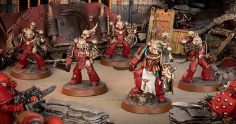

# 0559 检察官教团 Order of the Procurators

精校状态：中文行文已逐段精校，部分术语仍为暂定

分类：概念

原文来源：https://www.bilibili.com/opus/1033270128183083046

原作者：帝国神选罐头

原文时间：2025年02月13日 10:55

[返回分类目录](目录.md) · [全书目录](../../目录.md)

<!-- A0559-B0001 -->
**英文原文**

The Order of the Procurators, or Vor Nergeth, were Horus Heresy-era Word Bearers Apothecaries. Instead of being healers, however, the Procurators searched for dead or wounded Loyalist Legionaries in battles, so they could be ritually desecrated in order to summon forth Daemons.

<!-- /A0559-B0001 -->

<!-- A0559-B0002 -->

原译文

检察官教团，或称洗劫者，是荷鲁斯叛乱时期的怀言者药剂师。然而，检察官并没有成为治疗者，而是在战斗中寻找死亡或受伤的忠诚派军团士兵，这样他们就可以被仪式性地亵渎，以召唤恶魔。

**校订译文**

检察官教团，又称“洗劫者”（Vor Nergeth），是荷鲁斯之乱时期怀言者的药剂师组织。然而，这些检察官并不以医治伤员为职志，而是在战场上搜寻阵亡或负伤的忠诚派军团战士，利用亵渎他们的仪式召唤恶魔。

**校注：** Procurator／Procurant 暂沿现稿检察官／检察员，属于怀言者仪式职衔，不能据字面误认为帝国司法官；Vor Nergeth 沿洗劫者待核。

<!-- /A0559-B0002 -->

<!-- A0559-B0003 图片 -->

<!-- A0559-B0004 -->

原译文

A Procurator and his attending Procurants 一名检察官和他的主治检查员

**校订译文**

A Procurator and his attending Procurants 一名检察官及随侍的检察员

<!-- /A0559-B0004 -->

<!-- A0559-B0005 -->
## Description 描述

<!-- /A0559-B0005 -->

<!-- A0559-B0006 -->
**英文原文**

Of particular allure to the Procurators, were the Loyalist's Progenoid Glands as they which proved particularly potent in attracting the most powerful and aggressive beings of the Warp. In order for the summoning to occur, the Procurators tore out the Progenoids of their sacrifices, as they muttered catechisms of damnation in order to secure the Daemons' aid. While this occurred, the Procurators were helped by Word Bearers known as Procurants, who served as their apprentices. They also served as zealous bodyguards, who were fanatically devoted to the Procurators for the blessed atrocities they committed. As their masters chanted over the dying sacrifices, the Procurants would hack arcane ruins into their victims, which caused the veil to the Warp to weaken. This allowed the Daemons the Procurators had bargained with, to enter Realspace and fall upon the Word Bearers' foes. The ritual would also imbue the Procurators and Procurants with the stolen life force of their victims, which reinvigorated them. However sometimes the summoned Daemons would reject their sacrifices as being unworthy and they would then attack the Traitor Legion and anyone else that was around them.

<!-- /A0559-B0006 -->

<!-- A0559-B0007 -->

原译文

对检察官特别有吸引力的是忠诚派的基因收存腺，因为它们被证明在吸引最强大和最具侵略性的亚空间生物方面特别有效。为了召唤发生，检察官撕下了他们祭品的腺体，当他们念出诅咒之语时，以确保恶魔的援助。当这种情况发生时，检察官得到了被称为检察员的怀言者的帮助，他们是检察官的学徒。他们还担任热诚的护卫，狂热地忠于检察官犯下的暴行。当他们的主人为垂死的祭品吟唱时，检察员们会在受害者身上砍下神秘的废墟，这会导致亚空间的遮掩减弱。这使得检察官与其谈判的恶魔进入了现实空间，并落到怀言者的敌人之中。仪式还将为检察官和检察员注入受害者被盗的生命力，使他们重新焕发活力。然而，有时被召唤的恶魔会拒绝他们的祭品，认为这些祭品是不足够的，然后他们会攻击叛徒军团和周围的任何人。

**校订译文**

检察官尤其觊觎忠诚派的基因存收腺，因为它们对最强大、最凶暴的亚空间生灵格外有吸引力。召唤时，检察官一边撕出祭品的基因存收腺，一边低诵诅咒经文，祈求恶魔相助。被称为“检察员”的怀言者学徒会在旁协助。他们也是狂热的护卫，将导师犯下的暴行视为蒙受赐福之举，因此对导师忠心耿耿。当检察官向着垂死祭品吟诵时，检察员便在受害者身上刻出秘奥符文，削弱隔绝亚空间的帷幕。如此一来，与检察官达成交易的恶魔便能进入现实空间，扑向怀言者的敌人。仪式还会把窃取的生命力灌注给检察官与检察员，使他们恢复活力。但有时，受召恶魔会嫌祭品不配献给自己，转而攻击叛徒军团以及周围所有人。

**校注：** 英文 arcane ruins 结合在祭品身上刻画及召唤语境，显系 runes 的拼写错误，中文修正为秘奥符文，并保留英文原字。

<!-- /A0559-B0007 -->

<!-- A0559-B0008 -->
**英文原文**

Besides using their victims as sacrifices to Daemons, the Procurators would also take body parts as trophies to adorn their power armor with. The Procurators and Procurants could also go to battle equipped with Warhawk Jump Packs.

<!-- /A0559-B0008 -->

<!-- A0559-B0009 -->

原译文

除了将受害者作为对恶魔的祭品外，检察官还将把身体部位作为战利品来装饰他们的动力盔甲。检察官和检察员也可以携带战鹰跳跃背包参加战斗。

**校订译文**

检察官除将受害者献祭给恶魔，也会割取其肢体作为战利品，装饰动力甲。检察官及其检察员还可装备战鹰跳跃背包参战。

<!-- /A0559-B0009 -->

本篇核心术语与暂定项

以下列出本篇出现的英文原形及核心术语表用词。同形词可能指不同对象，具体词义以本篇正文和校注为准；单复数、别名和仅见于图注的名称可能尚未列入。完整候选见[术语表](../../术语表/双语术语候选.csv)。

| 英文 | 采用中文 | 状态 |
| --- | --- | --- |
| Horus Heresy | 荷鲁斯之乱 | 官方已核对 |
| Warp | 亚空间 | 官方已核对 |
| Word Bearers | 怀言者 | 暂定·官方待核 |
| The Order | 秩序 | 暂定·官方待核 |
| Horus | 荷鲁斯 | 暂定·官方待核 |
| Progenoid glands | 基因存收腺 | 暂定·官方待核 |
| Veil | 韦尔 | 暂定·官方待核 |
| Progenoids | 基因存收腺 | 暂定·官方待核 |
| Order of the Procurators | 检察官教团 | 暂定·官方待核 |
| Vor Nergeth | 洗劫者 | 暂定·官方待核 |

