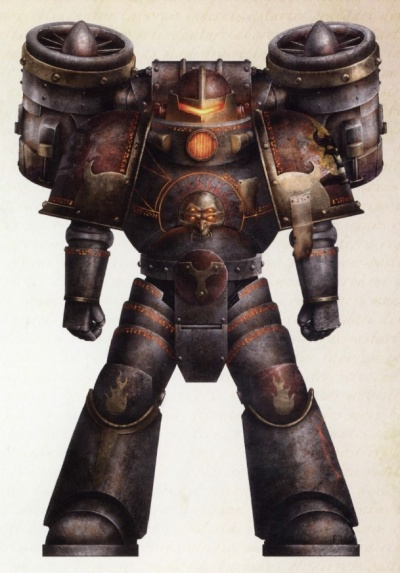
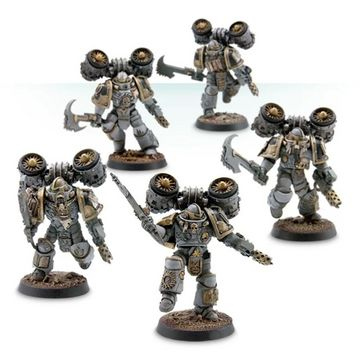

# 0560 灰烬之环 Ashen Circle

精校状态：中文行文已逐段精校，部分术语仍为暂定

分类：概念

原文来源：https://www.bilibili.com/opus/1018747005486235656

原作者：帝国神选罐头

原文时间：2025年01月05日 07:38

[返回分类目录](目录.md) · [全书目录](../../目录.md)

<!-- A0560-B0001 -->
**英文原文**

The Ashen Circle was a unique Word Bearers formation during the Great Crusade and Horus Heresy.

<!-- /A0560-B0001 -->

<!-- A0560-B0002 -->

原译文

灰烬之环是大远征和荷鲁斯叛乱时期怀言者的一种独特编队。

**校订译文**

灰烬之环，是大远征与荷鲁斯之乱时期怀言者特有的部队编制。

<!-- /A0560-B0002 -->

<!-- A0560-B0003 图片 -->

<!-- A0560-B0004 -->

原译文

Ashen Circle Legionnaire 灰烬之环军团士兵

**校订译文**

Ashen Circle Legionnaire 灰烬之环军团士兵

<!-- /A0560-B0004 -->

<!-- A0560-B0005 -->
**英文原文**

The Ashen Circle was created to oversee the destruction of culture, learning and faith. Serving alongside Destroyers, these Space Marines were iconoclasts charged with hunting down individuals, works, and relics considered to be of false doctrine, eradicating them with their Hand Flamers. In addition to their flame weapons, Ashen Circle Legionaries were equipped with Jump Packs and Axe-Rake Chain Weapons similar to Assault Marines.

<!-- /A0560-B0005 -->

<!-- A0560-B0006 -->

原译文

灰烬之环的创建是为了监督文化、学习和信仰的破坏。这些星际战士与毁灭者并肩作战，他们是反传统者，负责追捕被认为是错误教条的个人、作品和圣物，用喷火手枪将其消灭。除了火焰武器，灰烬之环军团士兵还配备了类似于突击星际战士的跳跃背包和耙斧链锯武器。

**校订译文**

灰烬之环的设立，是为督行对文化、学识与信仰的摧毁。他们与毁灭者并肩作战，充当圣像破坏者，追索被判为异端教义的人物、著作与圣物，再用喷火手枪将其焚灭。除火焰武器外，灰烬之环战士还配备跳跃背包与耙斧链锯武器，装备方式与突击战士相似。

**校注：** learning 指知识与学术，不是学习动作；iconoclasts 在本军团沿用圣像破坏者。Destroyers 军团毁灭者，不与40K Devastators破坏者小队混同。

<!-- /A0560-B0006 -->

<!-- A0560-B0007 图片 -->

<!-- A0560-B0008 -->

原译文

Word Bearers of the Ashen Circle 怀言者的灰烬之环

**校订译文**

Word Bearers of the Ashen Circle 怀言者的灰烬之环

<!-- /A0560-B0008 -->

本篇核心术语与暂定项

以下列出本篇出现的英文原形及核心术语表用词。同形词可能指不同对象，具体词义以本篇正文和校注为准；单复数、别名和仅见于图注的名称可能尚未列入。完整候选见[术语表](../../术语表/双语术语候选.csv)。

| 英文 | 采用中文 | 状态 |
| --- | --- | --- |
| Space Marines | 星际战士 | 官方已核对 |
| Horus Heresy | 荷鲁斯之乱 | 官方已核对 |
| Word Bearers | 怀言者 | 暂定·官方待核 |
| Great Crusade | 大远征 | 暂定·官方待核 |
| Horus | 荷鲁斯 | 暂定·官方待核 |
| Destroyers | 毁灭者 | 暂定·官方待核 |
| Iconoclasts | 圣像破坏者 | 暂定·官方待核 |
| Ashen Circle | 灰烬之环 | 暂定·官方待核 |
| Axe-rake | 耙斧 | 暂定·官方待核 |
| Flamers | 火妖（奸奇单位）／火焰喷射器（武器） | 语境定译·对应官译已核 |
| Ashen | 灰白星 | 暂定·官方待核 |
| Flame Weapons | 火焰武器 | 暂定·官方待核 |
| Chain Weapons | 链锯武器 | 暂定·官方待核 |

