# 0561 XX - 阿尔法军团 Alpha Legion

精校状态：中文行文已逐段精校，部分术语仍为暂定

分类：概念

原文来源：https://www.bilibili.com/opus/1104490620176564241

原作者：帝国神选罐头

原文时间：2025年08月24日 09:07

[返回分类目录](目录.md) · [全书目录](../../目录.md)

<!-- A0561-B0001 -->
**英文原文**

"Our name is Legion, for we are many."

<!-- /A0561-B0001 -->

<!-- A0561-B0002 -->

原译文

“吾等名为群，因吾等众多。”

**校订译文**

“吾等名为群，因吾等众多。”

<!-- /A0561-B0002 -->

<!-- A0561-B0003 -->
**英文原文**

The Book of Malignancies, The Apocrypha Terra, Origin date unknown

<!-- /A0561-B0003 -->

<!-- A0561-B0004 -->

原译文

恶性之书，泰拉伪经，起源日期不详

**校订译文**

《邪恶之书》，《泰拉伪经》，成书年代不详。

**校注：** The Book of Malignancies 暂译邪恶之书；原译恶性之书未能表达此处著作名称语气。成书年代不详照录。

<!-- /A0561-B0004 -->

<!-- A0561-B0005 -->
**英文原文**

The Alpha Legion, also known as the Ghost Legion during the early Great Crusade, is the XX Legion of the original twenty Space Marine Legions. They turned against the Emperor during the Horus Heresy, becoming Chaos Space Marines. Even before they turned to Chaos, the Alpha Legion were renowned as the most secretive of all the Legions. The Alpha Legion's most closely guarded secret, unbeknownst to all but a few outside the Legion, is that they had two primarchs; Alpharius and his twin Omegon (sometimes referred to collectively as just 'Alpharius Omegon').

<!-- /A0561-B0005 -->

<!-- A0561-B0006 -->

原译文

阿尔法军团，在大远征早期也被称为幽灵军团，是最初的二十个星际战士军团中的第二十军团。在荷鲁斯叛乱期间，他们转而对抗帝皇，成为混沌星际战士。甚至在他们转向混沌之前，阿尔法军团就被认为是所有军团中最神秘的。阿尔法军团最严密的秘密，除了少数军团外，其他人都不知道，那就是他们有两个原体；阿尔法瑞斯和他的双胞胎欧米伽（有时统称为“阿尔法瑞斯·欧米伽”）。

**校订译文**

阿尔法军团在大远征早期也被称为幽灵军团，是最初二十个星际战士军团中的第二十军团。他们在荷鲁斯之乱期间背叛帝皇，成为混沌星际战士。早在投向混沌之前，阿尔法军团就以行事最隐秘著称。他们守得最严的秘密，是自己拥有两位原体：阿尔法瑞斯与孪生兄弟欧米伽，两人有时合称“阿尔法瑞斯·欧米伽”。军团之外，只有极少数人知道此事。

**校注：** 原文是军团外只有少数人知晓，不是少数其他军团知晓。

<!-- /A0561-B0006 -->

<!-- A0561-B0007 -->
**英文原文**

The Alpha Legion's veterans are experts in infiltration, covert operations, and manipulating events in their favour without revealing themselves or engaging in open warfare. Alpha Legionaries have been known to disguise themselves as loyalist Space Marines. Their armies also contain regular Humans known as Operatives.

<!-- /A0561-B0007 -->

<!-- A0561-B0008 -->

原译文

阿尔法军团的老兵是渗透、秘密行动和操纵事件的专家，他们不会暴露自己或参与公开战争。众所周知，阿尔法军团会伪装成忠诚的星际战士。他们的军队中也有被称为特工的普通人。

**校订译文**

阿尔法军团的老兵精通渗透与秘密行动，善于在不暴露身份、不直接开战的情况下，操纵局势向有利于自身的方向发展。他们也曾伪装成忠诚派星际战士。军中还包括被称为“特工”的普通人类。

<!-- /A0561-B0008 -->

<!-- A0561-B0009 图片 -->
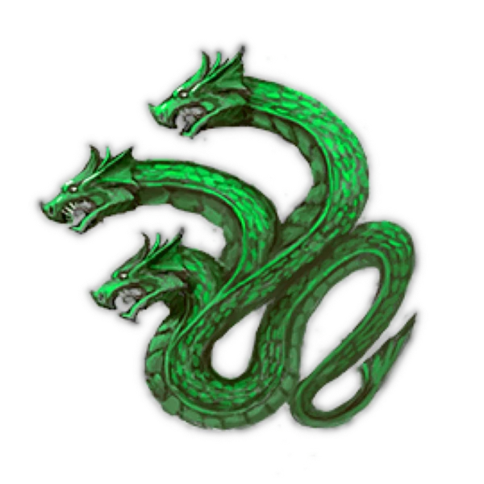

<!-- A0561-B0010 图片 -->
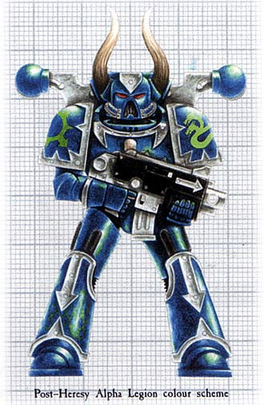

<!-- A0561-B0011 -->
**英文原文**

Legion Number:XX

<!-- /A0561-B0011 -->

<!-- A0561-B0012 -->

原译文

军团编号：XX

**校订译文**

军团编号：XX

<!-- /A0561-B0012 -->

<!-- A0561-B0013 -->
**英文原文**

Primarch:Alpharius and Omegon (twins)

<!-- /A0561-B0013 -->

<!-- A0561-B0014 -->

原译文

原体：阿尔法瑞斯和欧米伽（双胞胎）

**校订译文**

原体：阿尔法瑞斯和欧米伽（双胞胎）

<!-- /A0561-B0014 -->

<!-- A0561-B0015 -->
**英文原文**

Homeworld:No record

<!-- /A0561-B0015 -->

<!-- A0561-B0016 -->

原译文

家园世界：无记录

**校订译文**

家园世界：无记录

<!-- /A0561-B0016 -->

<!-- A0561-B0017 -->
**英文原文**

Current Base:They have no known central base of operations, but are known to have set up secret positions within Imperial space

<!-- /A0561-B0017 -->

<!-- A0561-B0018 -->

原译文

当前基地：他们没有已知的中央作战基地，但已知在帝国空域内设立了秘密阵地

**校订译文**

当前基地：他们没有已知的中央作战基地，但已知在帝国空域内设立了秘密阵地

<!-- /A0561-B0018 -->

<!-- A0561-B0019 -->
**英文原文**

Chaos Affiliation:Diverse, ranging from secretly loyalist to none to Chaos Undivided; most make use of Daemons and Chaos Sorcerers

<!-- /A0561-B0019 -->

<!-- A0561-B0020 -->

原译文

混沌隶属：多样，从秘密的忠诚者到无忠诚者再到混沌无分；大多数人使用恶魔和混沌巫师

**校订译文**

混沌立场：各异，既有暗中忠于帝皇者，也有不效忠混沌者，以及信奉混沌无分者；多数势力会使用恶魔与混沌巫师。

<!-- /A0561-B0020 -->

<!-- A0561-B0021 -->
**英文原文**

Colours:Silver, blue and green

<!-- /A0561-B0021 -->

<!-- A0561-B0022 -->

原译文

颜色：银色，蓝色和绿色

**校订译文**

颜色：银色，蓝色和绿色

<!-- /A0561-B0022 -->

<!-- A0561-B0023 -->
**英文原文**

Specialty:Infiltration & Covert Operations, Cultists and Operatives

<!-- /A0561-B0023 -->

<!-- A0561-B0024 -->

原译文

专长：渗透与秘密行动、邪教徒与特工

**校订译文**

专长：渗透与秘密行动、邪教徒与特工

<!-- /A0561-B0024 -->

<!-- A0561-B0025 -->
**英文原文**

Battle Cry:Hydra Dominatus

<!-- /A0561-B0025 -->

<!-- A0561-B0026 -->

原译文

战吼：九头蛇不朽

**校订译文**

战吼：九头蛇不朽

<!-- /A0561-B0026 -->

<!-- A0561-B0027 -->
**英文原文**

Known Warbands:

<!-- /A0561-B0027 -->

<!-- A0561-B0028 -->

原译文

著名战帮：

**校订译文**

著名战帮：

<!-- /A0561-B0028 -->

<!-- A0561-B0029 -->

原译文

20th Alpharians 第20阿尔法

**校订译文**

20th Alpharians 第20阿尔法

<!-- /A0561-B0029 -->

<!-- A0561-B0030 -->

原译文

Armoured Serpents 装甲巨蛇

**校订译文**

Armoured Serpents 装甲巨蛇

<!-- /A0561-B0030 -->

<!-- A0561-B0031 -->
**英文原文**

Daggerfangs, Darganti Revenants

<!-- /A0561-B0031 -->

<!-- A0561-B0032 -->

原译文

匕首尖牙，达甘蒂归来者

**校订译文**

匕首尖牙，达甘蒂归来者

<!-- /A0561-B0032 -->

<!-- A0561-B0033 -->

原译文

Eight Stolen Truths 八窃真理

**校订译文**

Eight Stolen Truths 八窃真理

<!-- /A0561-B0033 -->

<!-- A0561-B0034 -->
**英文原文**

The Faceless, The Faithless, First Strike

<!-- /A0561-B0034 -->

<!-- A0561-B0035 -->

原译文

无面者，无信者，首击

**校订译文**

无面者，无信者，首击

<!-- /A0561-B0035 -->

<!-- A0561-B0036 -->

原译文

Guns of Freedom 自由之枪

**校订译文**

Guns of Freedom 自由之枪

<!-- /A0561-B0036 -->

<!-- A0561-B0037 -->

原译文

Honourless 无誉者

**校订译文**

Honourless 无誉者

<!-- /A0561-B0037 -->

<!-- A0561-B0038 -->

原译文

Ironhydras 钢铁九头蛇

**校订译文**

Ironhydras 钢铁九头蛇

<!-- /A0561-B0038 -->

<!-- A0561-B0039 -->

原译文

Penitent Sons 忏悔之子

**校订译文**

Penitent Sons 忏悔之子

<!-- /A0561-B0039 -->

<!-- A0561-B0040 -->
**英文原文**

The Redacted, The Rustbloods

<!-- /A0561-B0040 -->

<!-- A0561-B0041 -->

原译文

修订者，锈血者

**校订译文**

抹除者，锈血者

**校注：** 对照本段英文确认同一实体，与全书核心译名统一；不改变同形异义词或省略称呼。

<!-- /A0561-B0041 -->

<!-- A0561-B0042 -->
**英文原文**

Scaled Fang, Serpentine Scourge, The Serpent's Teeth, The Shadowed Ones, Shrouded Hand, Sons of Deception, Sons of the Hydra, Sons of Venom, Soulfangs, Splintered Sentients, Subtle Blades

<!-- /A0561-B0042 -->

<!-- A0561-B0043 -->

原译文

鳞片尖牙，蛇纹天灾，巨蛇之牙，阴影众，笼罩之手，欺骗之子，九头蛇之子，毒液之子，灵魂尖牙，裂痕情感，狡猾之刃

**校订译文**

鳞牙、蛇形灾祸、巨蛇之牙、阴影众、蔽影之手、欺骗之子、九头蛇之子、毒液之子、魂牙、破碎智灵、隐秘之刃。

**校注：** Splintered Sentients 指破碎的智慧存在，原译裂痕情感混淆 sentient 与 sentiment，暂译破碎智灵；其余战帮名保持对应。

<!-- /A0561-B0043 -->

<!-- A0561-B0044 -->

原译文

Third Harrow 第三折磨

**校订译文**

Third Harrow 第三折磨

<!-- /A0561-B0044 -->

<!-- A0561-B0045 -->

原译文

Voldorius' Warband 沃尔多里乌斯的战帮

**校订译文**

Voldorius' Warband 沃尔多里乌斯的战帮

<!-- /A0561-B0045 -->

<!-- A0561-B0046 -->

原译文

The Unsung 未颂者

**校订译文**

The Unsung 未颂者

<!-- /A0561-B0046 -->

<!-- A0561-B0047 -->

原译文

Whispering Forge 低语锻造

**校订译文**

Whispering Forge 低语锻造

<!-- /A0561-B0047 -->

<!-- A0561-B0048 -->
## History 历史

<!-- /A0561-B0048 -->

<!-- A0561-B0049 -->
### Pre-Heresy 叛乱前

<!-- /A0561-B0049 -->

<!-- A0561-B0050 -->
**英文原文**

The last Legion created during the First Founding, work on the XXth Legion was begun only some few decades before the discovery of their Primarch, Alpharius. However, other reports claim that the Legion existed in a prototype form long before that. Indeed, Remembrancers seem to give contradictory reports on when exactly the Alpha Legion was formed. Regardless, it seems the Legion was created in total secrecy on the Emperor's order. Information on the Legion's own Gene-seed was made top secret. Like the Salamanders and Space Wolves, the XXth Legion was formed and established largely in separation from the rest of the Legiones Astartes, likely for a very specific purpose. These three specific legions were obliquely called "Trefoil" by some sources. The earliest known activities of the Legion saw it conduct abductions, targeted strikes and assassinations of the Imperium's enemies on Terra and beyond. The designation for this mysterious special operations units, taking orders from none of the Primarchs who had been discovered at the time, was simply "Alpha". For reasons unknown, approval to rapidly expand the Alpha Units gene-seed group was denied by the Emperor, limiting the force to only around 1,000-2,000 Legionaries. There is some suspicion that this was done because there was a potential problem or flaw within the Legion's gene-seed that the Emperor was not able to rectify. Others speculate that the Legion was deliberately preserved separately as an isolated unit by the Emperor for special gene-seed augmentation in the future that no other Space Marine Legion would ever undergo.

<!-- /A0561-B0050 -->

<!-- A0561-B0051 -->

原译文

第二十军团是在初次建军期间创建的最后一个军团，在他们的原体阿尔法瑞斯被发现之前的几十年里，第二十军团的工作才开始。然而，其他报告声称，军团早在那之前就以原型形式存在了。事实上，对于阿尔法军团究竟是什么时候成立的，回忆录似乎给出了相互矛盾的报告。无论如何，军团似乎是在帝皇的命令下完全秘密创建的。关于军团自己的基因种子的信息被列为最高机密。与火蜥蜴和太空野狼一样，第二十军团在很大程度上是与阿斯塔特军团的其他成员分开组建和建立的，可能是为了一个非常具体的目的。这三个特定的军团被一些消息来源间接地称为“三叶草”。军团最早的已知活动是在泰拉和其他地方对帝国的敌人进行绑架、有针对性的袭击和暗杀。这个神秘的特种作战部队的名称只是“阿尔法”，当时没有发现任何一位原体的命令。由于未知的原因，帝皇拒绝了迅速扩大阿尔法单位基因种子组的批准，将部队限制在1000-2000左右。有人怀疑，这是因为军团的基因种子中存在潜在的问题或缺陷，帝皇无法修正。其他人推测，该军团被帝皇故意单独保存为一个独立的单位，用于未来特殊的基因种子扩增，这是其他星际战士军团永远不会经历的。

**校订译文**

作为初次建军中最后建立的军团，第二十军团据称直到阿尔法瑞斯被寻回前数十年才开始组建；另一些记载却称，其雏形早已存在。记述者对建军时间的记录似乎彼此矛盾。无论如何，军团应是在帝皇密令下秘密建立，连基因种子资料也被列为绝密。与火蜥蜴、太空野狼一样，第二十军团大体独立于其他阿斯塔特军团进行组建，可能各有特定使命；一些资料将这三个军团隐晦地合称“三叶草”。第二十军团最早的已知行动，是在泰拉及其以外针对帝国之敌实施绑架、定点突袭与暗杀。这支神秘的特种部队只以“阿尔法”为代号，不接受当时任何已寻回原体的指挥。出于未知原因，帝皇没有批准迅速扩大阿尔法部队的基因种子群体，将其兵力限制在约一千至两千名军团战士。有人怀疑，他们的基因种子存在帝皇无法修复的潜在缺陷；也有人推测，帝皇刻意将军团单独保留，准备日后进行其他军团从未接受过的特殊基因强化。

**校注：** Remembrancers 是记述者，不是回忆录；无人向已寻回原体领命的关系也已修复。军团成立年代多种说法均照录。

<!-- /A0561-B0051 -->

<!-- A0561-B0052 图片 -->
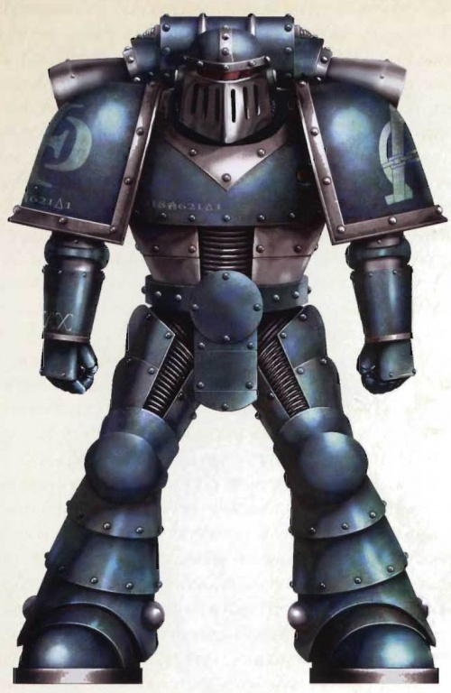

<!-- A0561-B0053 -->

原译文

Pre-Heresy Alpha Legion Unnamed Veteran Legionary, Unknown Legion Sub-unit, Cryptosi Purgation 叛乱前阿尔法军团无名老兵军团士兵，未知军团分队，隐生清洗

**校订译文**

Pre-Heresy Alpha Legion Unnamed Veteran Legionary, Unknown Legion Sub-unit, Cryptosi Purgation 叛乱前阿尔法军团无名老兵军团士兵，未知军团分队，隐生清洗

<!-- /A0561-B0053 -->

<!-- A0561-B0054 -->
**英文原文**

The Legion all but disappeared from Imperial records in the Great Crusade, but some reports of small Alpha units operating far from the front lines of the Crusade in special missions do exist. These warriors were clearly Astartes, but carried no heraldry and sometimes even operated under the 'false flag' of another Legion. The operations they undertook were assassinations, subterfuge, espionage, sabotage and the recovery of unknown artifacts. They also abducted important individuals from anti-Imperial groups. They made it a policy to never leave any witnesses to their activities. However, rumours still spread across the Galaxy of a Ghost Legion. This force became known to bleed enemy forces through black operations and subterfuge before striking from a hundred directions in a mass lightning attack known as The Harrowing. A dubious account given by Alpharius himself states that he was in fact recovered by the Emperor on Terra himself shortly after the scattering of the Primarchs, and was put in command of his Ghost Legion from its onset. During this time, his existence was kept a total secret from all save the Emperor, Malcador, and later Constantin Valdor.

<!-- /A0561-B0054 -->

<!-- A0561-B0055 -->

原译文

在大远征中，军团几乎从帝国记录中消失了，但确实存在一些关于阿尔法小队在远离大远征前线执行特殊任务的记录。这些战士显然是阿斯塔特，但没有纹章，有时甚至在另一个军团的“假旗”下作战。他们采取的行动包括暗杀、诡计、间谍、破坏和追回未知造物。他们还绑架了反帝国组织的重要人物。他们制定了一项政策，即永远不要留下任何证人来见证他们的行动。然而，关于幽灵军团的谣言仍在银河系中传播。这支部队通过黑色行动和诡计让敌军流血，然后从一百个方向发动被称为折磨的大规模闪电袭击。阿尔法瑞斯本人给出的一个可疑的说法是，在原体分散后不久，他实际上就被帝皇在泰拉上找到了，并从一开始就指挥着他的幽灵军团。在此期间，除了帝皇，马卡多和后来的康斯坦丁·瓦尔多，他的存在对所有人都是完全保密的。

**校订译文**

大远征期间，军团几乎从帝国档案中消失，但仍有零星记录，提到小股阿尔法部队远离远征前线执行特殊任务。他们显然是阿斯塔特，却不佩戴军团徽记，有时甚至冒用其他军团的旗号。其任务包括暗杀、欺骗、间谍活动、破坏与回收不明遗物，也会绑架反帝国组织的重要人物，并以不留目击者为原则。然而，“幽灵军团”的传闻依旧传遍银河。据说，这支部队会先用秘密行动与诡计不断消耗敌军，再从上百个方向发动大规模闪电突袭，称为“折磨”。阿尔法瑞斯本人的一份存疑自述则称，原体失散后不久，他其实就被帝皇在泰拉寻回，并从一开始便统率幽灵军团。彼时，除帝皇、马卡多及后来得知此事的康斯坦丁·瓦尔多外，无人知道他的存在。

**校注：** 本段明确将阿尔法瑞斯自述标为存疑，不因是人物自述而改写为确认史实。

<!-- /A0561-B0055 -->

<!-- A0561-B0056 -->
**英文原文**

During the Rangdan Xenocides, a representative of the XXth Legion appeared before Lion El'Jonson. Though identifying himself as Alpharius, the representative acknowledged that their Primarch had not yet been found but that he would be in time. This Alpharius (who in a contradictory account, may have in fact been the actual Alpharius) offered aid to Lion El'Jonson against the Rangdan in the hope that one day The Lion could be made Warmaster. Another account states that Alpharius used this objective as cover as a way to make his way into the Rangdan warzone to recover his long-lost brother Omegon. Whatever the truth, this Alpharius revealed that the XXth Legion preferred El'Jonson as Warmaster over someone like Roboute Guilliman as they shared similar views on war and secrecy. Though a Primarch, not even El 'Jonson had been explicitly aware of the XXth's existence, though he had been privy to rumours of a "Ghost Legion".

<!-- /A0561-B0056 -->

<!-- A0561-B0057 -->

原译文

在冉丹大屠杀期间，第二十军团的一名代表出现在莱昂·艾尔庄森面前。虽然自称为阿尔法瑞斯，但该代表承认，他们的原体尚未找到，但他会及时找到的。这个阿尔法瑞斯（在一个相互矛盾的说法中，他可能实际上就是真正的阿尔法瑞斯）向莱昂·艾尔庄森提供了对抗冉丹的援助，希望有一天莱昂能成为战帅。另一种说法是，阿尔法瑞斯利用这一目标作为掩护，进入冉丹战区，寻找失散多年的兄弟欧米伽。无论真相如何，这位阿尔法瑞斯透露，第二十军团更喜欢艾尔庄森成为战帅，而不是像罗伯特·基里曼这样的人，因为他们对战争和保密有着相似的看法。尽管艾尔庄森是一位原体，但他并没有明确意识到第二十军团的存在，尽管他知道“幽灵军团”的谣言。

**校订译文**

冉丹灭绝战争期间，第二十军团的一名代表拜见莱昂·艾尔’庄森。他自称阿尔法瑞斯，却承认军团原体尚未被寻回，只表示时机到来便会找到。这位“阿尔法瑞斯”提出援助雄狮对抗冉丹，希望将来拥立他为战帅。另一份相互冲突的记载认为，他可能就是真正的阿尔法瑞斯；还有一种说法称，他只是以此为掩护，进入冉丹战区寻找失散已久的欧米伽。无论真相如何，他表示，比起罗保特·基里曼等人，第二十军团更愿拥护艾尔庄森出任战帅，因为双方对战争与保密抱有相似看法。即便身为原体，雄狮当时也并不确知第二十军团的存在，只听闻过“幽灵军团”的传说。

<!-- /A0561-B0057 -->

<!-- A0561-B0058 -->
**英文原文**

Later when Alpharius-Omegon took open command of the Legion, it was young, zealous and completely committed to embracing the Primarch's directions. Alpharius believed that secrecy and fluidity brought success, and taught his Legion to apply all such military techniques to both their training and their operations. The Legion's victories in the Great Crusade all feature some form of subterfuge, misdirection or rapid, unexpected movement. Such victories required great skill and dedication to achieve, and the Alpha Legion quickly became an insular and proud formation. It was this martial pride that led to a number of clashes and fights with members of the other Legions, particularly the Imperial Fists, Ultramarines, and Death Guard. Also, Konrad Curze of the Night Lords openly criticised the Alpha Legion's tactics by calling them "sinners in a shroud of lies". The Thousand Sons Legion discreetly shunned and tried to avoid any contact with the Alpha Legion, although the true cause for this is unknown. However, at the side of Horus' Luna Wolves the Alpha Legion successfully campaigned without incident, together with the Dark Angels and the Iron Hands.

<!-- /A0561-B0058 -->

<!-- A0561-B0059 -->

原译文

后来，当阿尔法瑞斯·欧米伽公开指挥军团时，军团年轻、热情，完全致力于接受原体的指示。阿尔法瑞斯认为，秘密和流动性带来了成功，并教导他的军团将所有这些军事技术应用于他们的训练和行动。军团在大远征中的胜利都以某种形式的诡计、误导或快速、意外的行动为特征。这样的胜利需要高超的技能和奉献精神才能实现，阿尔法军团很快就变成了一个独立而自豪的编队。正是这种军事自豪感导致了与其他军团成员的一系列冲突和战斗，特别是帝国之拳、极限战士和死亡守卫。此外，午夜领主的康拉德·科兹公开批评阿尔法军团的战术，称他们为“谎言裹尸布中的罪人”。千子军团谨慎地避开并试图避免与阿尔法军团的任何接触，尽管其真正原因尚不清楚。然而，在荷鲁斯的影月苍狼身边，阿尔法军团与黑暗天使和钢铁之手一起成功地进行了战役，没有发生任何事件。

**校订译文**

阿尔法瑞斯与欧米伽公开接掌军团时，这支年轻部队充满热情，一心遵循原体的教导。阿尔法瑞斯相信，保密与灵活应变是制胜之道，要求军团将相关技法贯彻于训练和实战。其大远征胜绩，无不涉及诡计、误导，或迅速而出人意料的机动。这些胜利需要极高的技巧与投入，阿尔法军团也很快变得封闭自矜。这份武人的骄傲使他们屡屡与其他军团发生冲突，尤其是帝国之拳、极限战士与死亡守卫。午夜领主的康拉德·科兹更公开抨击他们的战术，称其为“披着谎言裹尸布的罪人”。千子则悄然疏远他们，尽量避免往来，原因不明。不过，阿尔法军团与荷鲁斯的影月苍狼，以及黑暗天使、钢铁之手共同作战时，却能合作顺利，未生事端。

<!-- /A0561-B0059 -->

<!-- A0561-B0060 -->
**英文原文**

After Alpharius' disagreements with Roboute Guilliman, the Alpha Legion threw themselves even further into their preferred method of operations, largely cutting themselves off from standard Imperial practices and orchestrating greater and greater victorious examples of their approach to the Great Crusade, even when more conventional attacks would have been more efficient. The most notorious example of this took place on the world of Tesstra Prime, where the Alpha Legion, instead of taking the opportunity to capture the planetary capital to force the world's surrender, allowed the enemy to dig in and defend it so that they could then expertly take the defending forces apart in a number of different ways. After a week of suffering seemingly random mishaps as well as brutal ambushes, the defenders were forced to capitulate, having taken 90% casualties. When asked why the Legion had not taken the simpler strategy, Alpharius is reported to have replied that they avoided it as "it would have been too easy". This campaign brought him censure from almost all of his brother Primarchs; only Horus, always impressed by Alpharius and his work, praised the Alpha Legion's skill. In the later stages of the Great Crusade, the Alpha Legion withdrew into the empty space on the Imperium's frontiers.

<!-- /A0561-B0060 -->

<!-- A0561-B0061 -->

原译文

在阿尔法瑞斯与罗伯特·基里曼发生分歧后，阿尔法军团更加投入他们喜欢的作战方法，在很大程度上切断了与标准帝国常规的联系，并策划了越来越多的胜利例子来证明他们对大远征的态度，即使更常规的攻击会更有效率。最臭名昭著的例子发生在特斯特拉主星世界，阿尔法军团没有抓住机会占领行星首都迫使世界投降，而是允许敌人挖掘并防御它，这样他们就可以以多种不同的方式熟练地将防御部队分开。在经历了一周看似随机的事故和残酷的伏击之后，守军被迫投降，伤亡了90%。当被问及为什么军团没有采取更简单的策略时，据报告，阿尔法瑞斯回答说，他们避免了这种策略，因为“这太容易了”。这场战役给他带来了几乎所有兄弟原体的谴责；只有荷鲁斯总是对阿尔法瑞斯和他的工作印象深刻，称赞阿尔法军团的技能。在大远征的后期，阿尔法军团撤退到帝国边境的空白空域。

**校订译文**

与罗保特·基里曼发生争执后，阿尔法军团更加执着于自己偏爱的战法，大体背离帝国的常规作战方式，刻意制造越来越辉煌的胜绩，以证明自身理念，哪怕正面攻击本会更加高效。最臭名昭著的例子发生在特斯特拉主星：军团本可迅速占领首都、迫使全星投降，却故意让敌军筑垒固守，再以种种手段逐一瓦解其防御。守军经历整整一周看似偶发的灾祸与残酷伏击，伤亡达九成，最终投降。据说，当有人问为何不采用更简单的策略时，阿尔法瑞斯回答：“那样未免太容易了。”此役招来几乎所有兄弟原体的责难，只有一向欣赏他的荷鲁斯赞许军团的本领。大远征后期，阿尔法军团退入帝国边境外的空旷星域。

<!-- /A0561-B0061 -->

<!-- A0561-B0062 -->
**英文原文**

With such examples existing in the Imperial records, it is perhaps easy to see why the Alpha Legion sided with Horus when the Warmaster made his pact with Chaos; their martial pride and Alpharius' avoidance of all his brothers apart from Horus seemingly led to their downfall. However, another given reason is that, a scant two years before the Horus Heresy began, Alpharius Omegon was contacted by a Xenos organisation known as the Cabal, which presented the Primarch with visions of the Heresy to come and other predictions of the future as well as knowledge about the nature of Chaos. They were shown that the only outcomes of the Heresy were that, if the Emperor won, Humanity's existence would be ensured for ten or twenty thousand years of decay before they and the Galaxy were consumed by Chaos and that, if Horus won, Humanity would perish inside two generations, taking the Chaos powers into oblivion with them, thus saving the rest of the Galaxy. The Alpha Legion was asked to take on their greatest challenge; to defect to the side of Horus and ensure the final destruction of Chaos. Alpharius Omegon appeared to accede to this request.

<!-- /A0561-B0062 -->

<!-- A0561-B0063 -->

原译文

有了帝国记录中的这些例子，也许很容易理解为什么当战帅与混沌签订协议时，阿尔法军团站在了荷鲁斯一边；他们的军事自豪感和阿尔法瑞斯对除荷鲁斯之外的所有兄弟的回避似乎导致了他们的堕落。然而，另一个给定的原因是，在荷鲁斯叛乱开始前不到两年，一个被称为秘会的异型组织联系了阿尔法瑞斯·欧米伽，该组织向原体展示了叛乱即将到来的幻象、对未来的其他预测以及对混沌本质的了解。他们被证明，叛乱的唯一结果是，如果帝皇获胜，人类的存在将在他们和银河系被混沌吞噬之前得到一万或两万年的保证，如果荷鲁斯获胜，人类将在两代人内灭亡，混沌力量将被他们遗忘，从而拯救银河系的其他部分。阿尔法军团被要求接受他们最大的挑战；叛逃到荷鲁斯一边，确保混沌的最终毁灭。阿尔法瑞斯·欧米伽似乎同意了这一请求。

**校订译文**

从这些帝国记录来看，阿尔法军团为何在战帅与混沌结盟时投向荷鲁斯，似乎不难理解：对自身武艺的骄傲，加上阿尔法瑞斯疏远其他兄弟、唯独亲近荷鲁斯，仿佛共同促成了堕落。然而，还有另一种说法。荷鲁斯之乱爆发前不到两年，异形组织“密教”接触了阿尔法瑞斯与欧米伽，向他们展示即将到来的叛乱及其他未来景象，并传授混沌本质的知识。按照这些预示，叛乱只会有两种结局：若帝皇获胜，人类将在衰败中延续一两万年，最终与银河一同被混沌吞噬；若荷鲁斯获胜，人类则将在两代之内灭亡，并把混沌诸神一同拖入毁灭，从而保全银河其他种族。密教要求阿尔法军团接受最艰难的使命：投向荷鲁斯，确保混沌最终灭亡。阿尔法瑞斯与欧米伽似乎答应了。

**校注：** 密教所展示的两种结局是该组织的预言；原译遗漏人类将在衰败中延续，并把混沌共同灭亡误译成被遗忘。

<!-- /A0561-B0063 -->

<!-- A0561-B0064 -->
### The Horus Heresy 荷鲁斯之乱

原题：The Horus Heresy 荷鲁斯叛乱

<!-- /A0561-B0064 -->

<!-- A0561-B0065 -->
**英文原文**

After the virus-bombing of Isstvan III, the presumed loyal Alpha Legion was one of the Legions sent by the Emperor to destroy Horus at his base on Isstvan V. Assigned to the second wave, the Legion instead turned on the loyalist first wave.

<!-- /A0561-B0065 -->

<!-- A0561-B0066 -->

原译文

在病毒轰炸伊斯塔万三号后，假定忠诚的阿尔法军团是帝皇派来摧毁伊斯塔万五号荷鲁斯基地的军团之一。该军团被分配到第二波，转而攻击了忠诚的第一波。

**校订译文**

伊斯塔万三号遭病毒轰炸后，仍被视为忠诚的阿尔法军团奉帝皇之命，与其他军团一同前往伊斯塔万五号，摧毁荷鲁斯的据点。他们被编入第二波攻势，却转而袭击了第一波进攻的忠诚派。

<!-- /A0561-B0066 -->

<!-- A0561-B0067 图片 -->
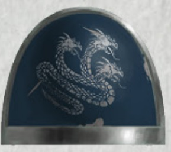

<!-- A0561-B0068 -->

原译文

Heresy-era Alpha Legion shoulderpad symbol 叛乱时期阿尔法军团肩甲标志

**校订译文**

Heresy-era Alpha Legion shoulderpad symbol 叛乱时期阿尔法军团肩甲标志

<!-- /A0561-B0068 -->

<!-- A0561-B0069 -->
**英文原文**

When Raven Guard Commander Branne Nev arrived at Istvaan V to retrieve several of what remained of the Loyalist forces including his Primarch Corax, the Alpha Legion tried to help Corax escape, going as far as killing the commander of a World Eaters Battle Barge which could have delayed the superior Raven Guard fleet. The Alpha Legion had Apothecarii that were masters of face transplantation. They took the faces of fallen Raven Guard Marines to transplant them onto their own Astartes. Together with the knowledge gained by digesting the brains of the dead Raven Guard, three Alpha Legion Astartes were able to infiltrate the Raven Guard Legion. Later about 50 Alpha Legion Astartes in the colours of the Raven Guard were sent as reinforcements for these agents. While Omegon could retrieve the data these infiltrators obtained, all of them were killed by the Raven Guard. Learning of the infiltration of the Raven Guard, Horus ordered Ezekyle Abaddon to find Alpha Legion agents inside his own Legion at all costs.

<!-- /A0561-B0069 -->

<!-- A0561-B0070 -->

原译文

当暗鸦守卫指挥官布兰·涅夫抵达伊斯塔万五号，接回包括他的原体科拉克斯在内的几支忠诚派部队时，阿尔法军团试图帮助科拉克斯逃跑，甚至杀死了一艘吞世者战斗驳船的指挥官，这可能会延误更高级别的暗鸦守卫舰队。阿尔法军团拥有面部移植大师级的药剂师。他们把倒下的暗鸦守卫战士的脸移植到他们自己的阿斯塔特身上。再加上通过消化死去的暗鸦守卫的大脑获得的知识，三名阿尔法军团阿斯塔特得以渗透到暗鸦守卫军团。后来，大约50名身穿暗鸦守卫盔甲的阿尔法军团阿斯塔特被派往增援这些特工。虽然欧米伽可以检索到这些渗透者获得的数据，但他们都被暗鸦守卫杀死了。荷鲁斯得知暗鸦守卫的渗透后，命令以泽凯尔·阿巴顿不惜一切代价在自己的军团中找到阿尔法军团特工。

**校订译文**

暗鸦守卫指挥官布兰尼·涅夫抵达伊斯塔万五号，接应原体科拉克斯及其他忠诚派残部时，阿尔法军团暗中帮助他们撤离，甚至杀死一艘吞世者战斗驳船的指挥官，以免该舰拖住占优势的暗鸦守卫舰队。阿尔法军团的药剂师精通面部移植，将阵亡暗鸦守卫的面容移植到自己战士身上；再凭借吞食死者大脑获得的知识，三名阿尔法战士成功混入暗鸦守卫。之后，又有约五十名伪装成暗鸦守卫的战士前来支援。欧米伽成功取回了渗透者获取的情报，但这些潜伏者最终都被暗鸦守卫杀死。得知此事后，荷鲁斯命以泽凯尔·阿巴顿不惜代价，找出潜藏在自己军团中的阿尔法特工。

**校注：** superior 指舰队实力占优，不是行政级别更高；杀死舰长的目的为排除追阻，不是使暗鸦守卫被耽搁。

<!-- /A0561-B0070 -->

<!-- A0561-B0071 -->
**英文原文**

During the Horus Heresy, the Alpha Legion split off from the main body of Horus' forces early and did not attack Terra, instead embarking upon a series of delaying actions in an attempt to hold Imperial reinforcements in place. A notable earlier example was attempting to block the White Scars at the Chondax System, but Jaghatai Khan was able to manoeuvre out of their trap. Alpharius' or Omegon's dubious agenda came to light at Chondax, where they were under orders from Horus to recruit the White Scars. Instead, the Alpha Legion fleet there engaged in hostile actions to seemingly provoke the Scars into a fight after blockading them long enough for them to get word from Rogal Dorn of Horus' treachery. Indeed this message was only delivered because Omegon had despatched forces to destroy an Alpha Legion-occupied Pylon array blocking the White Scars' communications. Subtly, the Alpha Legion or at least elements of it made sure that Jaghatai Khan would join the Emperor. Not even the Alpha Legion itself was spared from their own schemes. Alpharius was able to manipulate a strikeforce of members of the Shattered Legions under Shadrak Meduson into eliminating a cell of seemingly loyalist Alpha Legion.

<!-- /A0561-B0071 -->

<!-- A0561-B0072 -->

原译文

在荷鲁斯叛乱期间，阿尔法军团很早就从荷鲁斯部队的主体中分裂出来，没有攻击泰拉，而是采取了一系列拖延行动，试图将帝国增援部队留在原地。一个值得注意的早期例子是试图阻止香德克斯星系的白疤，但察合台可汗能够摆脱他们的陷阱。阿尔法瑞斯或欧米伽的可疑议程在香德克斯曝光，在那里他们接到荷鲁斯的命令，招募白疤。但相反，阿尔法军团舰队在那里进行了敌对行动，似乎是在封锁白色疤痕足够长的时间，让他们从罗格·多恩那里得到荷鲁斯背叛的消息后，挑起了一场战斗。事实上，这条信息之所以被传递，是因为欧米伽已经派遣部队摧毁了阿尔法军团占领的阻碍白疤通信的电缆塔阵列。微妙的是，阿尔法军团或至少是其中的一些成员确保了察合台可汗会加入帝皇。就连阿尔法军团本身也未能幸免于他们自己的计划。阿尔法瑞斯能够操纵沙德拉克·梅杜森领导下的破碎军团成员的打击部队，消灭一个看似忠诚的阿尔法军团。

**校订译文**

荷鲁斯之乱期间，阿尔法军团很早便脱离叛军主力，没有直接进攻泰拉，而是实施一连串迟滞行动，牵制帝国援军。较早的一次行动发生在香德克斯星系，他们企图困住白疤，却被察合台可汗设法摆脱。阿尔法瑞斯与欧米伽难以捉摸的意图，也在此显露：荷鲁斯本命他们争取白疤，但阿尔法舰队却采取敌对行动，先封锁白疤，直到对方收到罗格·多恩揭露荷鲁斯背叛的消息，再仿佛刻意挑起战斗。而消息之所以能够送达，恰是因为欧米伽派人摧毁了由阿尔法部队控制、阻断白疤通讯的塔式阵列。阿尔法军团，至少其中一部分人，便以如此隐晦的方式，确保察合台可汗站在帝皇一边。连军团自身也会成为计谋的牺牲品：阿尔法瑞斯曾操纵沙德拉克·梅杜森麾下的破碎军团突击部队，消灭一支看似忠于帝皇的阿尔法秘密小组。

**校注：** Pylon 在所给句中未说明是电缆塔，暂按塔式阵列处理；cell 指秘密行动小组，不是整个军团。

<!-- /A0561-B0072 -->

<!-- A0561-B0073 图片 -->
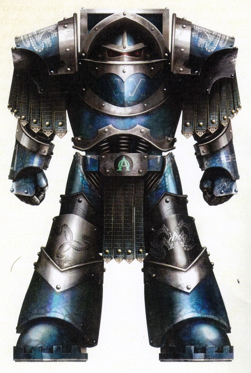

<!-- A0561-B0074 -->

原译文

Alpha Legion unknown Terminator Strike Leader who led the initial orbital raid on the Panopticon Complex of the Paramar Terminus facility 阿尔法军团未知终结者打击领袖，领导了对帕拉马尔终点战的全景监狱综合体设施的首次轨道突袭

**校订译文**

Alpha Legion unknown Terminator Strike Leader who led the initial orbital raid on the Panopticon Complex of the Paramar Terminus facility 阿尔法军团一名身份不详的终结者突击指挥官，曾率领首轮轨道突袭，攻击帕拉马尔终点站的全视综合设施

**校注：** Paramar Terminus 原译终点战为错字，修正终点站；Panopticon Complex 暂译全视综合设施，所给句未确认其为监狱。

<!-- /A0561-B0074 -->

<!-- A0561-B0075 -->
**英文原文**

During the Horus Heresy the Alpha Legion also engaged in smaller actions, defeating a White Scars force on Tallarn. During the Battle of the Alaxxes Nebula, the Alpha Legion nearly succeeded in destroying the Space Wolves until the loyalists were saved by the Dark Angels. In addition, a squad of Alpha Legionaries disguised as Ultramarines under Aeonid Thiel nearly succeeded in assassinating Roboute Guilliman on Macragge.

<!-- /A0561-B0075 -->

<!-- A0561-B0076 -->

原译文

在荷鲁斯叛乱期间，阿尔法军团也参与了较小的行动，在塔兰击败了一支白色伤疤部队。在阿拉克斯星云之战中，阿尔法军团几乎成功摧毁了太空野狼，直到忠诚者被黑暗天使拯救。此外，一队伪装成在伊奥尼德·希尔的带领下的极限战士的阿尔法军团几乎成功地在马库拉格刺杀了罗伯特·基里曼。

**校订译文**

荷鲁斯之乱期间，阿尔法军团也参与了较小规模的行动，例如在塔兰击败一支白疤部队。阿拉克斯星云之战中，他们险些歼灭太空野狼，直到黑暗天使赶来救援，忠诚派才幸免覆灭。此外，一队阿尔法战士伪装成伊奥尼德·希尔麾下的极限战士，差一点就在马库拉格刺杀了罗保特·基里曼。

**校注：** 伪装成希尔麾下战士的是阿尔法渗透者，不据此把希尔本人列为刺客。

<!-- /A0561-B0076 -->

<!-- A0561-B0077 -->
**英文原文**

Alpharius was eventually charged by and with Horus himself to spearhead the traitor advance into the Sol System. Alpharius himself led a large fleet against Pluto in the opening shots of the Solar War. During the battle, Alpharius was seemingly killed by Rogal Dorn but Omegon effectively took over his responsibilities.

<!-- /A0561-B0077 -->

<!-- A0561-B0078 -->

原译文

阿尔法瑞斯最终被荷鲁斯亲自指控，带领叛徒进入太阳系。阿尔法瑞斯本人在太阳战争的开场中率领一支庞大的舰队对抗冥王星。在战斗中，阿尔法瑞斯似乎被罗格·多恩杀死，但欧米伽实际上接管了他的职责。

**校订译文**

后来，荷鲁斯亲自命阿尔法瑞斯担任叛军进攻太阳系的先锋。太阳战争初起时，他率庞大舰队攻击冥王星，似乎在战斗中被罗格·多恩杀死；欧米伽随后实际接替了他的职责。

**校注：** charged 此处为授命、责成，原译被亲自指控误判词义。原体是否战死按 seemingly 保留不确定性。

<!-- /A0561-B0078 -->

<!-- A0561-B0079 图片 -->
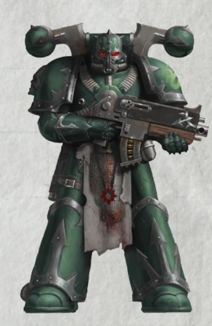

<!-- A0561-B0080 -->

原译文

Post-Heresy Alpha Legion Space Marine 叛乱后阿尔法军团星际战士

**校订译文**

Post-Heresy Alpha Legion Space Marine 叛乱后阿尔法军团星际战士

<!-- /A0561-B0080 -->

<!-- A0561-B0081 -->
**英文原文**

Alpharius later reappeared during the muster of traitor forces on Ullanor in the prelude to the Siege of Terra, giving Horus a detailed map of the Sol System's defenses before quitting the war effort. After the setback at Pluto, the Alpha Legion defied Horus' orders to muster for the Siege of Terra and instead delayed Roboute Guilliman's advance as he attempted to reach the Throneworld. In order to delay Guilliman's advance, the Alpha Legion's strategy was focused on seeking loyalist vessels, especially from the Ultramarines, and appear in overwhelming numbers to forcibly redirect them into perilous Warp translations, all the while avoiding being drawn into open conflict. Guilliman's fleet was forced to intercede to allow supporting Loyalist forces to advance, further delaying him from intervening at the Siege of Terra. Despite Alpharius's absence from the Siege of Terra, scattered Alpha Legion elements are known to have taken part in the traitor effort. In addition, an Alpha Legionnaire identifying himself as Alpharius was seen alongside Actaea in her attempts to aid Ollanius Persson and John Grammaticus in their quest. This Alpha Legionnaire informed the group that his other brothers on the planet that were now activated would aid them in fulfilling their objective.

<!-- /A0561-B0081 -->

<!-- A0561-B0082 -->

原译文

阿尔法瑞斯后来在泰拉围城的前奏中，在乌兰诺的叛徒部队集结期间再次出现，在退出战争之前，他给了荷鲁斯一张太阳系防御的详细地图。在冥王星遭遇挫折后，阿尔法军团违抗了荷鲁斯召集围攻泰拉的命令，反而推迟了罗伯特·基里曼前往王座世界的进军。为了拖延基里曼的进军，阿尔法军团的战略重点是寻找忠诚派的舰船，特别是来自极限战士的舰船，并以压倒性的数量出现，强行将它们重新定向到危险的亚空间转化中，同时避免卷入公开冲突。基里曼的舰队被迫进行调解，以允许支援他的忠诚派部队前进，进一步拖延了他干预泰拉围城的时间。尽管阿尔法瑞斯没有参加泰拉围城，但众所周知，分散的阿尔法军团成员参与了叛徒的行动。此外，有人看到一名自称阿尔法瑞斯的阿尔法军团成员与阿克泰一起试图帮助欧兰尼奥斯·佩松和约翰·格拉马迪库斯完成他们的任务。这位阿尔法老兵告诉该小队，他在这个行星上的其他兄弟现在被激活，将帮助他们实现目标。

**校订译文**

泰拉围城前夕，叛军在乌兰诺集结时，“阿尔法瑞斯”再度现身，将一份详尽的太阳系防御图交给荷鲁斯，随后退出了这场战争。冥王星受挫后，阿尔法军团违抗赴泰拉集结的命令，转而阻滞罗保特·基里曼赶赴王座世界。他们专门寻觅忠诚派舰船，尤其是极限战士舰船，以压倒性的数量现身，逼迫目标改道并冒险跃入亚空间，同时避免正面交战。基里曼的舰队不得不介入掩护，让其他忠诚派援军得以推进，这进一步耽搁了他救援泰拉的时机。尽管“阿尔法瑞斯”本人未参与围城，仍有零散的阿尔法部队为叛军作战。另有一名自称阿尔法瑞斯的军团战士，与阿克泰一同行动，协助欧良尼乌斯·佩松和约翰·格拉马迪库斯完成任务。他告诉众人，星球上其他已经启动的潜伏同袍，也会帮助他们达成目标。

**校注：** intercede 为介入掩护，原译调解不合舰队战情；前段阵亡与本段再现均按身份难辨的原文叙述保留。

<!-- /A0561-B0082 -->

<!-- A0561-B0083 -->
### Post-Heresy 叛乱后

<!-- /A0561-B0083 -->

<!-- A0561-B0084 -->
**英文原文**

In the aftermath of the Horus Heresy, the Alpha Legion did not retreat to the Eye of Terror like the other Traitor Legions; instead they moved on into the Galactic East, following new objectives of their own. Whether or not being brought into battle with the Ultramarines was one of these objectives is unknown, but it occurred all the same.

<!-- /A0561-B0084 -->

<!-- A0561-B0085 -->

原译文

在荷鲁斯叛乱之后，阿尔法军团并没有像其他叛徒军团那样撤退到恐惧之眼；相反，他们按照自己的新目标，继续前往银河系东部。与极限战士作战是否是这些目标之一尚不清楚，但它还是发生了。

**校订译文**

荷鲁斯之乱后，阿尔法军团并未像其他叛徒军团那样撤入恐惧之眼，而是转向银河东部，执行自己的新目标。不知与极限战士交战是否也在计划之内，但这场冲突终究发生了。

<!-- /A0561-B0085 -->

<!-- A0561-B0086 图片 -->
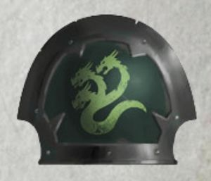

<!-- A0561-B0087 -->

原译文

Alpha Legion shoulderpad symbol post-Heresy 叛乱后阿尔法军团肩甲标志

**校订译文**

Alpha Legion shoulderpad symbol post-Heresy 叛乱后阿尔法军团肩甲标志

<!-- /A0561-B0087 -->

<!-- A0561-B0088 -->
**英文原文**

On the world of Eskrador, the Alpha Legion was assaulted by Ultramarine forces. Alpharius (or Omegon, who had since assumed his mantle since the Battle of Pluto) was reportedly happy with such a development, as it allowed him to demonstrate the superiority of his flexible, multitudinous and unexpected military strategies on the notoriously precise, methodical and perhaps even moribund Ultramarines. However, the Alpha Legion Primarch was apparently taken by surprise when Roboute Guilliman departed from his own strictures and led a surprise assault by his elite units on the Alpha Legion headquarters. In the resulting personal combat between Alpharius-Omegon and Guilliman, it is believed that Alpharius-Omegon was killed. The Alpha Legion responded, not by breaking and fleeing as Guilliman expected, but by turning on the Ultramarine detachment and harrying them so mercilessly that by the time they had returned to the main body of the Ultramarine force their casualties were almost total. The Ultramarines were driven from the planet in the subsequent battle.

<!-- /A0561-B0088 -->

<!-- A0561-B0089 -->

原译文

在埃斯卡多世界里，阿尔法军团遭到了极限战士的袭击。据报告，阿尔法瑞斯（或欧米伽，自冥王星之战以来一直担任他的衣钵）对这样的发展感到满意，因为这使他能够展示出他灵活、众多和意想不到的军事战略在著名的精确、有条不紊甚至可能垂死的极限战士上的优势。然而，当罗伯特·基里曼脱离自己的束缚，率领他的精英部队对阿尔法军团总部进行突袭时，阿尔法军团原体显然感到惊讶。在阿尔法瑞斯·欧米伽和基里曼之间的决斗中，据信阿尔法瑞斯·欧米伽被杀。阿尔法军团的回应，不是像基里曼所期望的那样破碎并逃跑，而是转向了极限战士分遣队，无情地折磨他们，以至于当他们回到极限战士部队的主体时，他们的伤亡几乎是全部。在随后的战斗中，极限战士被赶出了行星。

**校订译文**

在埃斯卡多，阿尔法军团遭到极限战士进攻。据说，阿尔法瑞斯——或是在冥王星之战后继承其身份的欧米伽——乐见其成，正好借此证明，自己灵活多变、出人意料的战略，胜过极限战士那套精确、严整，甚至可能已然僵化的战法。然而，罗保特·基里曼一反常规，亲率精锐突袭军团总部，显然让阿尔法原体措手不及。据信，在随后的亲身对决中，这位以阿尔法瑞斯·欧米伽之名出现的原体被基里曼杀死。但阿尔法军团并未如基里曼预料般溃散，而是反击其突击部队，穷追猛打。等这些极限战士退回主力，已几乎伤亡殆尽。随后的战斗中，极限战士被逐出星球。

**校注：** 原文对死亡使用 reportedly、apparently、it is believed 等限定；未将阿尔法原体死亡的传闻升级为定论。

<!-- /A0561-B0089 -->

<!-- A0561-B0090 -->
**英文原文**

Following the battle on Eskrador, the Alpha Legion fractured in order to hide from the Imperium. Small, autonomous warbands were left in Imperial space where they set up secret bases in asteroid fields, Space hulks and on barren worlds. These units launched frequent attacks against military targets that were weakened by the Horus Heresy and still pose a threat to ships, settlements and garrisons. They further spread and coordinate Chaos Cults throughout the galaxy in order to instigate massive revolts against Imperial rule. These insurrections are often used to lure Imperial forces away from worlds the Alpha Legion wants to attack, paving the way for large scale assault from inside the Eye of Terror.

<!-- /A0561-B0090 -->

<!-- A0561-B0091 -->

原译文

在埃斯卡多之战之后，阿尔法军团为了躲避帝国而分崩离析。小规模的自主作战部队留在了帝国空域，在那里他们在小行星带、太空废船和贫瘠世界上建立了秘密基地。这些部队对荷鲁斯叛乱削弱的军事目标发动了频繁的袭击，这些目标仍然对舰船、定居点和驻军构成威胁。他们进一步在整个银河系传播和协调混沌教派，以煽动大规模反抗帝国统治。这些叛乱经常被用来引诱帝国军队远离阿尔法军团想要攻击的世界，为恐惧之眼内部的大规模攻击铺平了道路。

**校订译文**

埃斯卡多之战后，阿尔法军团为躲避帝国追踪，分散成小型自治战帮，留在帝国境内，在小行星带、太空废船与荒芜世界建立秘密基地。他们频繁袭击那些因荷鲁斯之乱而削弱的军事目标，至今仍威胁着舰船、聚居地和驻军。他们还在银河各地传播、协调混沌教派，煽动反抗帝国统治的大规模起义。这些叛乱常被用来调走守军，使阿尔法军团预定攻击的世界失去防备，为从恐惧之眼发动的大规模攻势铺路。

**校注：** 持续威胁舰船与据点的是阿尔法战帮，不是遭其攻击的军事目标。

<!-- /A0561-B0091 -->

<!-- A0561-B0092 图片 -->
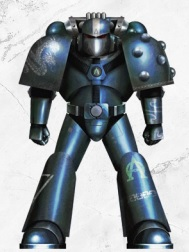

<!-- A0561-B0093 -->

原译文

Alpha Legionnaire in MKVI armour MKVI盔甲阿尔法军团士兵

**校订译文**

Alpha Legionnaire in MKVI armour MKVI盔甲阿尔法军团士兵

<!-- /A0561-B0093 -->

<!-- A0561-B0094 -->
**英文原文**

The Alpha Legion's role in spreading heretical cults has earned them the loathing of the Inquisition, which has devoted considerable resources to finding and destroying their secret bases. So far, the Alpha Legion has been declared wiped out by the High Lords of Terra no less than three times, in M31, M32 and M39. These claims have always been disproved by the continued assaults of the Legion.

<!-- /A0561-B0094 -->

<!-- A0561-B0095 -->

原译文

阿尔法军团在传播异端教派方面的作用使他们受到了审判庭的厌恶，审判庭投入了大量资源来寻找和摧毁他们的秘密基地。到目前为止，阿尔法军团已经在M31、M32和M39被泰拉的高领主宣布消灭了至少三次。这些说法一直被军团的持续攻击所推翻。

**校订译文**

阿尔法军团在传播异端教派方面的作用使他们受到了审判庭的厌恶，审判庭投入了大量资源来寻找和摧毁他们的秘密基地。到目前为止，阿尔法军团已经在M31、M32和M39被泰拉的高领主宣布消灭了至少三次。这些说法一直被军团的持续攻击所推翻。

<!-- /A0561-B0095 -->

<!-- A0561-B0096 -->
**英文原文**

Despite their many heinous acts, at least some elements within the Alpha Legion still view themselves as loyal sons of the Emperor. These Alpha Legionaries, such as Occam, see themselves as the most loyal sons for it is they that damn themselves to work from within traitor cells to purge both weak elements of the Imperium while dealing with serious heretical threats. They see themselves as the "Emperor's test", challenging his servants to see if they are worthy to serve him.

<!-- /A0561-B0096 -->

<!-- A0561-B0097 -->

原译文

尽管阿尔法军团中有许多令人发指的行为，但至少有一些人仍然认为自己是帝皇的忠诚子嗣。这些阿尔法军团，如奥卡姆，认为自己是最忠诚的子嗣，因为正是他们诅咒自己在叛徒体制内工作，在处理严重的叛乱威胁的同时清除帝国的虚弱成员。他们把自己看作是“帝皇的考验”，挑战他的仆人，看看他们是否值得为他服务。

**校订译文**

尽管犯下累累恶行，军团内部至少仍有一部分人，自认为是帝皇的忠诚子嗣。奥卡姆等人甚至认定自己才最为忠诚：他们甘愿自陷沉沦，潜伏叛徒组织内部，既铲除帝国的软弱者，也应对真正危险的异端威胁。他们将自己视为“帝皇的考验”，试炼帝皇的仆从，判断其是否配得上侍奉祂。

<!-- /A0561-B0097 -->

<!-- A0561-B0098 图片 -->
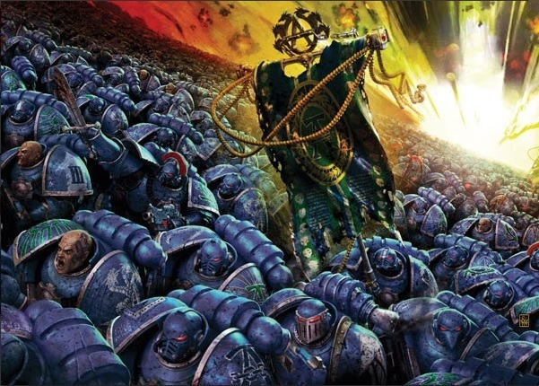

<!-- A0561-B0099 -->

原译文

Heresy Alpha Legion attacks en masse 叛乱阿尔法军团大规模袭击

**校订译文**

Heresy Alpha Legion attacks en masse 叛乱阿尔法军团大规模袭击

<!-- /A0561-B0099 -->

<!-- A0561-B0100 -->
### Notable Engagements 著名交战

<!-- /A0561-B0100 -->

<!-- A0561-B0101 -->
### Pre-Heresy 叛乱前

<!-- /A0561-B0101 -->

<!-- A0561-B0102 -->

原译文

???.M30 — The Hunting of the Ak'Haireth 阿克’海瑞斯狩猎

**校订译文**

???.M30 — The Hunting of the Ak'Haireth 阿克’海瑞斯狩猎

<!-- /A0561-B0102 -->

<!-- A0561-B0103 -->

原译文

???.M30 — The Tesstra Compliance 泰斯塔征服

**校订译文**

???.M30 — The Tesstra Compliance 特斯特拉归顺作战

<!-- /A0561-B0103 -->

<!-- A0561-B0104 -->

原译文

???.M31 — The Cryptosi Purgation 隐生清洗

**校订译文**

???.M31 — The Cryptosi Purgation 隐生清洗

<!-- /A0561-B0104 -->

<!-- A0561-B0105 -->

原译文

???.M30 — The Castigation of Terentius 泰伦提乌斯惩罚

**校订译文**

???.M30 — The Castigation of Terentius 特兰提乌斯惩戒

<!-- /A0561-B0105 -->

<!-- A0561-B0106 -->

原译文

890.M30 — The Third Rangdan Xenocide 第三次冉丹大屠杀

**校订译文**

890.M30 — The Third Rangdan Xenocide 第三次冉丹灭绝战争

<!-- /A0561-B0106 -->

<!-- A0561-B0107 -->

原译文

999.M30 — The World Prince Campaign 王子世界战役

**校订译文**

999.M30 — The World Prince Campaign 世界王子战役

**校注：** World Prince 按修饰关系暂译世界王子，原译王子世界颠倒词序；专名待官方核对。

<!-- /A0561-B0107 -->

<!-- A0561-B0108 -->

原译文

???.M31 — The Kayvas Initiative 凯瓦斯方案

**校订译文**

???.M31 — The Kayvas Initiative 凯瓦斯方案

<!-- /A0561-B0108 -->

<!-- A0561-B0109 -->
### Heresy-Era 叛乱时期

<!-- /A0561-B0109 -->

<!-- A0561-B0110 -->

原译文

006.M31 — The Drop Site Massacre 登陆点大屠杀

**校订译文**

006.M31 — The Drop Site Massacre 登陆点大屠杀

<!-- /A0561-B0110 -->

<!-- A0561-B0111 -->

原译文

???.M31 — The Isessos Genocide 伊塞索斯种族灭绝

**校订译文**

???.M31 — The Isessos Genocide 伊塞索斯种族灭绝

<!-- /A0561-B0111 -->

<!-- A0561-B0112 -->

原译文

006.M31 — Invasion of Paramar V 帕拉马尔五号入侵

**校订译文**

006.M31 — Invasion of Paramar V 帕拉马尔五号入侵

<!-- /A0561-B0112 -->

<!-- A0561-B0113 -->

原译文

~007.M31 — The Battle of Ravendelve 鸦巢之战

**校订译文**

~007.M31 — The Battle of Ravendelve 鸦巢之战

<!-- /A0561-B0113 -->

<!-- A0561-B0114 -->

原译文

007.M31 — The Tenebrae Mission 黑暗任务

**校订译文**

007.M31 — The Tenebrae Mission 黑暗任务

<!-- /A0561-B0114 -->

<!-- A0561-B0115 -->

原译文

007.M31 — Chondax Campaign 香德克斯战役

**校订译文**

007.M31 — Chondax Campaign 香德克斯战役

<!-- /A0561-B0115 -->

<!-- A0561-B0116 -->

原译文

007.M31 - The Pale Stars Campaign 苍白群星战役

**校订译文**

007.M31 - The Pale Stars Campaign 苍白群星战役

<!-- /A0561-B0116 -->

<!-- A0561-B0117 -->

原译文

007.M31 — Battle of the Alaxxes Nebula 阿拉克斯星云之战

**校订译文**

007.M31 — Battle of the Alaxxes Nebula 阿拉克斯星云之战

<!-- /A0561-B0117 -->

<!-- A0561-B0118 -->

原译文

???.M31 — The Siege of Epsilon-Stranivar IX 斯特拉尼瓦尔九号围城

**校订译文**

???.M31 — The Siege of Epsilon-Stranivar IX 艾普西隆-斯特拉尼瓦尔九号围城

<!-- /A0561-B0118 -->

<!-- A0561-B0119 -->

原译文

???.M31 — The Harrowing of Callistra Mundi 卡利斯特拉世界的折磨

**校订译文**

???.M31 — The Harrowing of Callistra Mundi 卡利斯特拉世界的折磨

<!-- /A0561-B0119 -->

<!-- A0561-B0120 -->

原译文

008.M31 — Mezoan Campaign 梅佐亚战役

**校订译文**

008.M31 — Mezoan Campaign 梅佐亚战役

<!-- /A0561-B0120 -->

<!-- A0561-B0121 -->

原译文

010.M31 — Azurine Conflict 阿祖林冲突

**校订译文**

010.M31 — Azurine Conflict 阿祖林冲突

<!-- /A0561-B0121 -->

<!-- A0561-B0122 -->

原译文

010-011.M31 — Battle of Tallarn 塔兰之战

**校订译文**

010-011.M31 — Battle of Tallarn 塔兰之战

<!-- /A0561-B0122 -->

<!-- A0561-B0123 -->

原译文

010-015.M31 — Solar War 太阳战争

**校订译文**

010-015.M31 — Solar War 太阳战争

**校注：** 本篇年表太阳战争记010—015.M31，与0554的010—014.M31范围不同，保留源文版本差异。

<!-- /A0561-B0123 -->

<!-- A0561-B0124 -->

原译文

Battle of Pluto 冥王星之战

**校订译文**

Battle of Pluto 冥王星之战

<!-- /A0561-B0124 -->

<!-- A0561-B0125 -->

原译文

~011.M31 — Battle of Trisolian 特里索兰之战

**校订译文**

~011.M31 — Battle of Trisolian 特里索兰之战

<!-- /A0561-B0125 -->

<!-- A0561-B0126 -->

原译文

~011.M31 — Battle of Yarant 雅兰特之战

**校订译文**

~011.M31 — Battle of Yarant 雅兰特之战

<!-- /A0561-B0126 -->

<!-- A0561-B0127 -->

原译文

013.M31 - Battle of Vezdell Secundus 韦兹德尔次星之战

**校订译文**

013.M31 - Battle of Vezdell Secundus 韦兹德尔次星之战

<!-- /A0561-B0127 -->

<!-- A0561-B0128 -->

原译文

13-14.M31 - Second Siege of Cthonia 第二次科索尼亚围城

**校订译文**

13-14.M31 - Second Siege of Cthonia 第二次科索尼亚围城

<!-- /A0561-B0128 -->

<!-- A0561-B0129 -->
**英文原文**

13-14.M31 - Despite the apparent death of Alpharius, the Alpha Legion defies Horus' orders to attack Terra and instead seek to delay Roboute Guilliman's army as it attempts to reach the Throneworld.

<!-- /A0561-B0129 -->

<!-- A0561-B0130 -->

原译文

· 尽管阿尔法瑞斯显然已经死亡，阿尔法军团还是违抗了荷鲁斯攻击泰拉的命令，转而试图拖延罗伯特·基里曼的军队前往王座世界

**校订译文**

013—014.M31——尽管阿尔法瑞斯似已阵亡，阿尔法军团仍违抗荷鲁斯进攻泰拉的命令，转而阻滞罗保特·基里曼赶赴王座世界的军队。

<!-- /A0561-B0130 -->

<!-- A0561-B0131 -->
**英文原文**

014.M31 - Disparate elements of the Alpha Legion take part in the Siege of Terra.

<!-- /A0561-B0131 -->

<!-- A0561-B0132 -->

原译文

阿尔法军团的不同成员参加了泰拉围城。

**校订译文**

014.M31——阿尔法军团的零散部队参加泰拉围城。

<!-- /A0561-B0132 -->

<!-- A0561-B0133 -->
### Post-Heresy 叛乱后

<!-- /A0561-B0133 -->

<!-- A0561-B0134 -->

原译文

???.M31 — The battle on Eskrador 埃斯卡多之战

**校订译文**

???.M31 — The battle on Eskrador 埃斯卡多之战

<!-- /A0561-B0134 -->

<!-- A0561-B0135 -->

原译文

883.M37 — The Zambeque Rebellion 赞班克叛乱

**校订译文**

883.M37 — The Zambeque Rebellion 赞班克叛乱

<!-- /A0561-B0135 -->

<!-- A0561-B0136 -->

原译文

814.M39 — Relief of Rael's World 救援赖尔世界

**校订译文**

814.M39 — Relief of Rael's World 救援赖尔世界

<!-- /A0561-B0136 -->

<!-- A0561-B0137 -->
**英文原文**

198-485.M40 — The subversion and destruction of the Emperor's Swords

<!-- /A0561-B0137 -->

<!-- A0561-B0138 -->

原译文

颠覆和摧毁帝皇之剑

**校订译文**

198—485.M40——颠覆并摧毁帝皇之剑战团。

<!-- /A0561-B0138 -->

<!-- A0561-B0139 -->
**英文原文**

400-470.M41 — The Macharian Heresy (Cultist activity)

<!-- /A0561-B0139 -->

<!-- A0561-B0140 -->

原译文

马卡里安叛乱（邪教徒行动）

**校订译文**

400—470.M41——马卡里安叛乱，参与邪教徒活动。

<!-- /A0561-B0140 -->

<!-- A0561-B0141 -->

原译文

742.M41 — The destruction of the Crimson Consuls 摧毁深红执政官

**校订译文**

742.M41 — The destruction of the Crimson Consuls 摧毁深红执政官

<!-- /A0561-B0141 -->

<!-- A0561-B0142 -->

原译文

???.M41 — The Assault on Zoran 佐兰突袭

**校订译文**

???.M41 — The Assault on Zoran 佐兰突袭

<!-- /A0561-B0142 -->

<!-- A0561-B0143 -->

原译文

???.M41 — The Crusade of Fire 火焰远征

**校订译文**

???.M41 — The Crusade of Fire 火焰远征

<!-- /A0561-B0143 -->

<!-- A0561-B0144 -->

原译文

???.M41 — The Scouring of Makenna VII 马克纳七号清洗

**校订译文**

???.M41 — The Scouring of Makenna VII 马肯纳七号清洗

<!-- /A0561-B0144 -->

<!-- A0561-B0145 -->

原译文

812.M41 — The Luxor Uprising 卢克索起义

**校订译文**

812.M41 — The Luxor Uprising 卢克索起义

<!-- /A0561-B0145 -->

<!-- A0561-B0146 -->

原译文

813-830.M41 — The Siege of Vraks 弗拉克斯围城

**校订译文**

813-830.M41 — The Siege of Vraks 弗拉克斯围城

<!-- /A0561-B0146 -->

<!-- A0561-B0147 -->

原译文

???.M41 — The Siege of Kaenis V 凯尼斯五号围城

**校订译文**

???.M41 — The Siege of Kaenis V 凯尼斯五号围城

<!-- /A0561-B0147 -->

<!-- A0561-B0148 -->

原译文

861-922.M41 — The Orpheus Revolt 俄耳甫斯起义

**校订译文**

861-922.M41 — The Orpheus Revolt 俄耳甫斯起义

<!-- /A0561-B0148 -->

<!-- A0561-B0149 -->

原译文

???.M41 — The Ghorvenfal Raid 戈文法尔袭击

**校订译文**

???.M41 — The Ghorvenfal Raid 戈文法尔袭击

<!-- /A0561-B0149 -->

<!-- A0561-B0150 -->

原译文

???.M41 — The Hunt for Voldorius 狩猎沃尔多里乌斯

**校订译文**

???.M41 — The Hunt for Voldorius 狩猎沃尔多里乌斯

<!-- /A0561-B0150 -->

<!-- A0561-B0151 -->

原译文

???.M41 — The Tartarus Campaign 塔尔塔罗斯战役

**校订译文**

???.M41 — The Tartarus Campaign 塔尔塔罗斯战役

<!-- /A0561-B0151 -->

<!-- A0561-B0152 -->
**英文原文**

999.M41 - The Sons of the Hydra and their allies lead a vicious attack on Ultramarine successor chapters around the Maelstrom Zone.

<!-- /A0561-B0152 -->

<!-- A0561-B0153 -->

原译文

九头蛇之子和他们的盟友对大漩涡区域周围的极限战士的子战团发动了恶毒的攻击。

**校订译文**

999.M41——九头蛇之子与盟军，对大漩涡周边的极限战士子战团发动猛烈袭击。

<!-- /A0561-B0153 -->

<!-- A0561-B0154 -->

原译文

999.M41 — The Siege of the Fenris System 芬里斯星系围攻

**校订译文**

999.M41 — The Siege of the Fenris System 芬里斯星系围攻

<!-- /A0561-B0154 -->

<!-- A0561-B0155 -->

原译文

999.M41 — The 13th Black Crusade 第13次黑色远征

**校订译文**

999.M41 — The 13th Black Crusade 第13次黑色远征

<!-- /A0561-B0155 -->

<!-- A0561-B0156 -->

原译文

999.M41 — Caligari Sector campaign in support of the 13th Black Crusade 卡利加里星区战役支援第13次黑色远征

**校订译文**

999.M41 — Caligari Sector campaign in support of the 13th Black Crusade 卡利加里星区战役支援第13次黑色远征

<!-- /A0561-B0156 -->

<!-- A0561-B0157 -->

原译文

???.M41 — The Khovan Incident 科文事件

**校订译文**

???.M41 — The Khovan Incident 科文事件

<!-- /A0561-B0157 -->

<!-- A0561-B0158 -->

原译文

???.M42 - The War of Beasts on Vigilus 警戒星野兽战争

**校订译文**

???.M42 - The War of Beasts on Vigilus 警戒星野兽战争

<!-- /A0561-B0158 -->

<!-- A0561-B0159 -->

原译文

???.M42 - The Battle of San Leor 圣莱奥尔之战

**校订译文**

???.M42 - The Battle of San Leor 圣莱奥尔之战

<!-- /A0561-B0159 -->

<!-- A0561-B0160 -->

原译文

???.M42 - The Battle of the Ophelia System 奥菲利亚星系之战

**校订译文**

???.M42 - The Battle of the Ophelia System 奥菲利亚星系之战

<!-- /A0561-B0160 -->

<!-- A0561-B0161 -->

原译文

??? - The Battle of Brax 布拉克斯之战

**校订译文**

??? - The Battle of Brax 布拉克斯之战

<!-- /A0561-B0161 -->

<!-- A0561-B0162 -->

原译文

???.M42 - War on Nolth Prime 诺尔斯主星战争

**校订译文**

???.M42 - War on Nolth Prime 诺尔斯主星战争

<!-- /A0561-B0162 -->

<!-- A0561-B0163 -->

原译文

???.M42 — The Invasion of Tsadrekha 赛德瑞卡入侵

**校订译文**

???.M42 — The Invasion of Tsadrekha 赛德瑞卡入侵

<!-- /A0561-B0163 -->

<!-- A0561-B0164 -->

原译文

???.M42 - The Charadon Campaign 查拉顿战役

**校订译文**

???.M42 - The Charadon Campaign 查拉顿战役

<!-- /A0561-B0164 -->

<!-- A0561-B0165 -->

原译文

???.M42 - The Nachmund Rift War 纳克蒙德走廊战争

**校订译文**

???.M42 - The Nachmund Rift War 纳克蒙德裂隙战争

<!-- /A0561-B0165 -->

<!-- A0561-B0166 -->

原译文

???.M42 - The Arks of Omen Campaign 噩兆方舟战役

**校订译文**

???.M42 - The Arks of Omen Campaign 噩兆方舟战役

<!-- /A0561-B0166 -->

<!-- A0561-B0167 -->

原译文

???.M42 - Ambushing the Salamanders at Zero. 在零号伏击火蜥蜴

**校订译文**

???.M42 - Ambushing the Salamanders at Zero. 在零号伏击火蜥蜴

<!-- /A0561-B0167 -->

<!-- A0561-B0168 -->

原译文

??? — The destruction of Seer's Rest 先知之眠的毁灭

**校订译文**

??? — The destruction of Seer's Rest 先知之眠的毁灭

<!-- /A0561-B0168 -->

<!-- A0561-B0169 -->

原译文

??? — The ravaging of Avernia 阿维尼亚毁坏

**校订译文**

??? — The ravaging of Avernia 阿维尼亚毁坏

<!-- /A0561-B0169 -->

<!-- A0561-B0170 -->

原译文

??? — The invasion of Scintil-Novax 闪烁新星入侵

**校订译文**

??? — The invasion of Scintil-Novax 闪烁新星入侵

<!-- /A0561-B0170 -->

<!-- A0561-B0171 -->

原译文

??? — The Battle of Safehaven 安全港之战

**校订译文**

??? — The Battle of Safehaven 安全港之战

<!-- /A0561-B0171 -->

<!-- A0561-B0172 -->
## Tactics 战术

<!-- /A0561-B0172 -->

<!-- A0561-B0173 -->
**英文原文**

Extensive preparations are made before actually attacking an Imperial target, including the use of espionage and corruption to weaken an enemy's resolve. Not only is an enemy attacked from every angle, but every attack is often coordinated to achieve the most destructive results. Many actions are planned to exploit and support local Cultist activity. These cults go to considerable efforts to spread propaganda, perform sabotage and carry out acts of unrest and rebellion, providing a distraction and weakening the enemy before the Alpha Legion strikes. Furthermore, the Legion has been known to ally themselves with anti-Imperial forces including other Traitor Legions and Xenos. On worlds far away from the Eye of Terror, Daemons are relied upon less since they cannot remain stable for long enough to be useful. If the Alpha Legion succeeds in securing the allegiance of a local Chaos cult they are summoned to add to the Legion's tactical repertoire.

<!-- /A0561-B0173 -->

<!-- A0561-B0174 -->

原译文

在实际攻击帝国目标之前，会进行广泛的准备，包括使用间谍活动和腐化来削弱敌人的决心。敌人不仅从各个角度受到攻击，而且每次攻击往往都是协调一致的，以达到最具破坏性的结果。计划采取许多行动来利用和支持当地的邪教徒活动。这些教派付出了巨大的努力来传播宣传，进行破坏，并实施动乱和叛乱行为，在阿尔法军团发动袭击之前分散注意力并削弱敌人。此外，众所周知，该军团与包括其他叛徒军团和异型在内的反帝国势力结盟。在远离恐惧之眼的世界里，对恶魔的依赖程度较低，因为它们不能保持稳定足够长的时间来发挥作用。如果阿尔法军团成功获得当地混沌教派的忠诚，它们将被召唤加入军团的战术项目。

**校订译文**

真正攻击帝国目标之前，阿尔法军团会进行周密准备，以间谍活动与腐化削弱敌人的意志。他们从各个方向发动袭击，并协调每一击，力求造成最大破坏。许多行动都旨在利用、支援当地邪教徒：教派大力散布宣传、实施破坏、煽动骚乱与叛乱，在军团出击前分散敌方注意、消耗其力量。阿尔法军团也会与其他反帝国势力结盟，包括叛徒军团和异形。远离恐惧之眼时，他们较少倚仗恶魔，因为恶魔难以长时间稳定存在，发挥的作用有限；但若成功控制当地混沌教派，军团便可借其召唤恶魔，增添战术手段。

**校注：** 末句被召唤的是恶魔，不是被招募的教派本身。

<!-- /A0561-B0174 -->

<!-- A0561-B0175 图片 -->
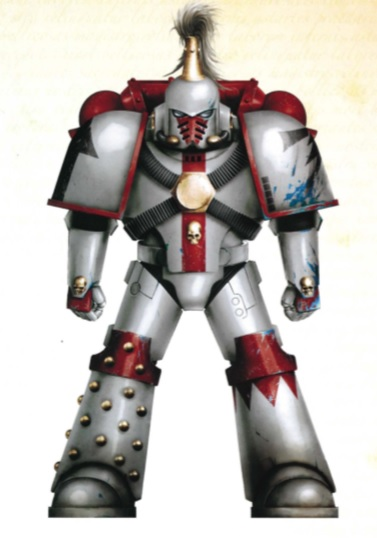

<!-- A0561-B0176 -->

原译文

Alpha Legion member dressed in the colours of the White Scars during the Horus Heresy 在荷鲁斯叛乱期间，阿尔法军团成员身着白色伤疤的涂装

**校订译文**

Alpha Legion member dressed in the colours of the White Scars during the Horus Heresy 荷鲁斯之乱期间，伪装为白疤涂装的阿尔法军团战士

<!-- /A0561-B0176 -->

<!-- A0561-B0177 -->
**英文原文**

The Alpha Legion does not fight like any other Chaos Space Marine Legion or warband. They prefer to avoid direct combat, using subterfuge, infiltration, sabotage, brainwashing and meticulous multi-year plans to destroy their enemies as opposed to a simple attack. The very identities of Alpha Legion Marines are the subject of mystery. Their supposed identities are frequently aliases which are shared by cell members, meaning the name and identity of one Alpha Legion Marine could actually refer to many. Genetic face-changing technology is utilised to change the appearance of Legionnaires to confound Imperial authorities as to their real identity. Due to this habit of shared aliases, members of the Alpha Legion often refer to themselves as part of a greater collective identity. When they do show themselves, Alpha Legion Marines prefer to let their cultists and underlings do most of the combat while they themselves wait for the decisive moment to strike or make their escape.

<!-- /A0561-B0177 -->

<!-- A0561-B0178 -->

原译文

阿尔法军团不像其他混沌星际战士军团或战帮那样战斗。他们更喜欢避免直接战斗，使用诡计、渗透、破坏、洗脑和细致的多年计划来摧毁敌人，而不是简单的攻击。阿尔法军团战士的身份一直是个谜。他们所谓的身份通常是由基层成员共享的别名，这意味着一个阿尔法军团战士的名字和身份实际上可以指代许多人。基因变脸技术被用来改变军团士兵的外观，以混淆帝国当局对他们真实身份的认识。由于这种共享别名的习惯，阿尔法军团的成员经常将自己称为更大集体身份的一部分。当他们真的出现时，阿尔法军团战士更愿意让他们的邪教徒和下属做大部分的战斗，而他们自己则等待决定性的时刻发动攻击或逃跑。

**校订译文**

阿尔法军团的战法与其他混沌星际战士军团、战帮截然不同。他们偏好避开正面交战，以诡计、渗透、破坏、洗脑和筹划多年的周密计划摧毁敌人。连战士的身份本身都是谜：他们使用的往往是秘密小组成员共用的化名，因此一个人的姓名与身份，可能实际对应多人。军团还用基因易容技术改变外貌，让帝国当局难辨真身。共用化名的习惯，也使成员常将自己看作更大集体身份的一部分。即使公开现身，他们也多让邪教徒与下属承担主要战斗，自己等待决胜一击或脱身的时机。

**校注：** cell members 为秘密小组成员，不是军衔较低的基层成员。

<!-- /A0561-B0178 -->

<!-- A0561-B0179 -->
**英文原文**

Perhaps the most infamous stratagem used by the Alpha Legion is "The Harrowing", by which the user wields a devastating mixture of subtlety and overwhelming force, reveling in both meticulous planning and imaginative cruelty. While such assaults begin with various operative or Cultist uprisings and sabotage, the Alpha Legion then infiltrates a world to spread further confusion and panic while bleeding the enemy of its main strategic assets and command. This continues until it is time for the final kill, The Harrowing itself, which is a final overwhelming push from a hundred different directions. These final devastating attacks are often led by elite Terminators and heavy armor. The Harrowing was core to Alpha Legion strategy, as reflected by the prestigious rank of Harrowmaster at the time of the Heresy. While the Alpha Legion developed The Harrowing during the Great Crusade under Alpharius, the warbands of today continue to still revere its use.

<!-- /A0561-B0179 -->

<!-- A0561-B0180 -->

原译文

也许阿尔法军团使用的最臭名昭著的策略是“折磨”，通过这种策略，使用者挥舞着微妙和压倒性力量的毁灭性混合，陶醉于细致的计划和富有想象力的残忍。虽然这种攻击始于各种行动或邪教徒起义和破坏，但阿尔法军团随后渗透到一个世界，在流血牺牲敌人的主要战略资产和指挥的同时，进一步制造混乱和恐慌。这种情况会一直持续到最后一次杀戮的时候，即折磨本身，这是来自一百个不同方向的最后一次压倒性的推进。这些最后的毁灭性攻击通常由精英终结者和重型装甲领导。折磨是阿尔法军团战略的核心，叛乱时期折磨大师的声望就反映了这一点。虽然阿尔法军团在阿尔法瑞斯的大远征期间开发了折磨战术，但今天的战士们仍然尊重它的使用。

**校订译文**

阿尔法军团最臭名昭著的战术，或许便是“折磨”：将隐秘谋划与压倒性武力结合，既讲究精密计划，也沉迷于别出心裁的残酷。行动先由特工或邪教徒发动起义与破坏，随后军团渗入目标世界，进一步制造混乱和恐慌，逐步摧毁敌人的关键战略资源与指挥能力。时机成熟，才实施“折磨”本身——从上百个方向同时发动压倒性的终结攻势，通常由精锐终结者与重装甲部队领衔。这一战法处于军团战略核心，叛乱时期享有崇高地位的“折磨大师”职衔便体现了这一点。它由阿尔法瑞斯麾下的军团在大远征期间创立，至今仍受各战帮推崇。

<!-- /A0561-B0180 -->

<!-- A0561-B0181 -->
**英文原文**

Unlike most of the other Chaos Space Marine Legions, the Alpha Legion rarely operates within the Eye of Terror itself. As a result, they have not been subjected to the time distortion that the Warp has affected other Traitor Marines with, leading many in the Inquisition to debate how the Legion, now ten thousand years after the Horus Heresy, can still be active. According to Inquisitor Kravin, the Alpha Legion acquires new recruits, genetically modifies them and then trains them for missions all within Imperial territory itself.

<!-- /A0561-B0181 -->

<!-- A0561-B0182 -->

原译文

与大多数其他混沌星际战士不同，阿尔法军团很少在恐惧之眼内部活动。因此，他们没有受到亚空间对其他叛徒战士造成的时间扭曲的影响，导致许多审判庭的人争论，在荷鲁斯叛乱一万年后，军团如何仍然活跃。根据审判官克莱文的说法，阿尔法军团招募新兵，对他们进行基因改造，然后训练他们执行帝国领土内的任务。

**校订译文**

与大多数混沌星际战士军团不同，阿尔法军团很少在恐惧之眼内部活动，因此没有像其他叛徒战士那样经历亚空间的时间扭曲。荷鲁斯之乱已过去一万年，他们却依然活跃，令许多审判官争论不休。按审判官克莱文的说法，军团招募新兵、实施基因改造，并训练他们执行任务，整套过程都在帝国境内进行。

**校注：** all within Imperial territory 修饰招募、改造和训练全过程，原译将地点仅接到任务范围上。

<!-- /A0561-B0182 -->

<!-- A0561-B0183 -->

原译文

Known special units: 著名特殊单位

**校订译文**

Known special units: 著名特殊单位

<!-- /A0561-B0183 -->

<!-- A0561-B0184 -->

原译文

Seeker Squad 追踪者小队

**校订译文**

Seeker Squad 追踪者小队

<!-- /A0561-B0184 -->

<!-- A0561-B0185 -->

原译文

Lernaen Terminator Squad 勒拿终结者小队

**校订译文**

Lernaen Terminator Squad 勒拿终结者小队

<!-- /A0561-B0185 -->

<!-- A0561-B0186 -->
**英文原文**

Effrit Stealth Squad - led by Omegon

<!-- /A0561-B0186 -->

<!-- A0561-B0187 -->

原译文

埃弗里特潜行小队 - 欧米伽领导

**校订译文**

埃弗里特潜行小队 - 欧米伽领导

<!-- /A0561-B0187 -->

<!-- A0561-B0188 -->
**英文原文**

Even before the Horus Heresy, the Alpha Legion was known to develop special weapons and technologies in secret without Imperial approval or knowledge. Alpha Legion forces were known to operate secret arms factories and caches both inside and outside Imperial space. The Alpha Legion was the first Legion to produce Bolter shells specifically designed to penetrate Ceramite Power Armour, which gave them an early advantage during the Drop Site Massacre. The Legion was also able to acquire small numbers of Mark 6 Corvus Pattern Power Armour and reverse engineer it as the "Corvus-Alpha" pattern.

<!-- /A0561-B0188 -->

<!-- A0561-B0189 -->

原译文

甚至在荷鲁斯叛乱之前，阿尔法军团就已经知道在没有帝国批准或知情的情况下秘密开发特殊武器和技术。众所周知，阿尔法军团在帝国空域内外都经营着秘密武器工厂和藏匿处。阿尔法军团是第一个生产专门设计用于穿透陶钢动力盔甲的爆矢弹药的军团，这使他们在登陆点大屠杀中获得了早期优势。军团还能够获得少量的Mark 6 渡鸦型动力盔甲，并将其逆向工程为“渡鸦-阿尔法”型。

**校订译文**

荷鲁斯之乱前，阿尔法军团便已在帝国不知情、未批准的情况下，秘密研发特殊武器与技术。他们在帝国境内外经营隐蔽军工厂与武器储藏点，也是首个制造专门穿透陶钢动力甲的爆矢弹的军团，因此在登陆点大屠杀初期占得先机。他们还取得少量 Mk VI 渡鸦型动力甲，通过逆向工程，仿制出“渡鸦-阿尔法”型。

<!-- /A0561-B0189 -->

<!-- A0561-B0190 -->
**英文原文**

The Alpha Legion is known to possess chameleon technologies that allow them to outwardly change their appearances and mimic not only other legionnaires but also unaugmented humans.

<!-- /A0561-B0190 -->

<!-- A0561-B0191 -->

原译文

众所周知，阿尔法军团拥有变化技术，使他们能够改变外表，不仅模仿其他军团成员，还模仿未经审计的人类。

**校订译文**

阿尔法军团掌握变色龙式的伪装技术，能够改变外在形貌，不仅可冒充其他军团战士，甚至能伪装为未经强化的普通人类。

**校注：** unaugmented 是未经强化改造，原译未经审计属于明显词义错误。

<!-- /A0561-B0191 -->

<!-- A0561-B0192 -->
## Organisation 组织

<!-- /A0561-B0192 -->

<!-- A0561-B0193 -->
### Pre-Heresy 叛乱前

<!-- /A0561-B0193 -->

<!-- A0561-B0194 -->
**英文原文**

All Space Marine Legions set arduous tasks and trials for potential recruits, but prior to the Horus Heresy the Alpha Legion set these initiation tests for squads, not individuals. Squads succeeded as a group or not at all - foolhardy heroics were frowned upon. The overall plan was paramount and more valuable than any one Space Marine. This was an extension of the Legion's philosophy that they were a body of one that could strike in many places at once. This complete solidarity with each other expressed itself in other ways. Decisions within the Legion were made in a fairly open and reasonably democratic way, with all ranks – including the Alpha Legions' non-Astartes Operatives – allowed to interject and comment freely during planning sessions. This freedom was allowed not just on military matters: the Alpha Legion internally discussed matters of philosophy and galactic policy that would have been forbidden or frowned upon in other Imperial institutions. Later recruits for the Legion were selected by the Primarch primarily based on high intelligence and personal initiative.

<!-- /A0561-B0194 -->

<!-- A0561-B0195 -->

原译文

所有星际战士军团都为潜在的新兵设定了艰巨的任务和考验，但在荷鲁斯叛乱之前，阿尔法军团为小队而不是个人设定了这些入门测试。小队作为一个整体取得了成功，或者根本没有成功 — 鲁莽的英雄主义是不受欢迎的。总体计划是最重要的，比任何一个星际战士都更有价值。这是军团哲学的延伸，即他们是一个可以同时在多个地方发动袭击的团体。这种完全的团结以其他方式表现出来。军团内部的决定是以一种相当公开和合理民主的方式做出的，所有级别的人 — 包括阿尔法军团的非阿斯塔特特工 — 都可以在规划会议上自由插话和发表评论。这种自由不仅在军事问题上被允许：阿尔法军团在内部讨论了其他帝国机构禁止或不赞成的哲学和银河政策问题。后来，军团的新兵主要是由原体根据高智商和个人主动性挑选的。

**校订译文**

所有星际战士军团都会为新兵安排艰苦考验，但叛乱前的阿尔法军团以小队为单位考核：要么全队通过，要么全队失败；鲁莽逞英雄不受欢迎。整体计划高于一切，其价值超过任何一名战士。这体现了军团的核心理念：他们是一个整体，却能同时在多处出击。这份团结也表现在其他方面。军团决策相当公开，并具有一定民主性，任何军衔的人，包括非阿斯塔特特工，都可在筹划会议上自由发言。这种自由不限于军事事务：他们也会讨论哲学与银河政治，而同类讨论在其他帝国机构常被禁止或压制。后来，原体挑选新兵时，尤为看重智力与主动性。

<!-- /A0561-B0195 -->

<!-- A0561-B0196 图片 -->
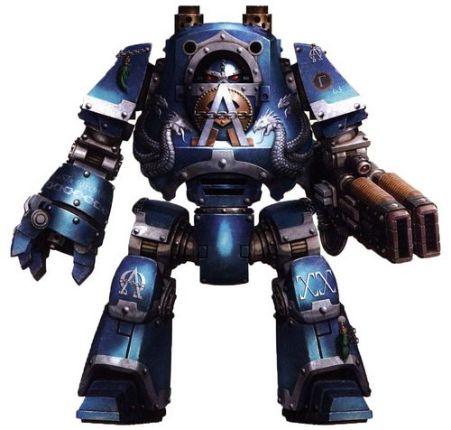

<!-- A0561-B0197 -->

原译文

Pre-Horus Heresy Alpha Legion Contemptor Dreadnought Nehalen 荷鲁斯叛乱前阿尔法军团蔑视者无畏尼哈伦

**校订译文**

Pre-Horus Heresy Alpha Legion Contemptor Dreadnought Nehalen 荷鲁斯之乱前阿尔法军团蔑视者无畏尼哈伦

<!-- /A0561-B0197 -->

<!-- A0561-B0198 -->
**英文原文**

Alpha Legion equivalents of companies, battalions and chapters were known as "Harrows", "Cohorts", "Hosts" and "Instruments". However, those structures have never stayed permanent and were formulated and broken down on an as-needed basis. At the top of the Legion hierarchy were the Harrowmasters, which was a title issued to the designated commander of Alpha Legion forces in any given theatre.

<!-- /A0561-B0198 -->

<!-- A0561-B0199 -->

原译文

阿尔法军团相当于连队、营和战团，被称为“折磨”、“大队”、“天军”和“仪器”。然而，这些结构从来不是永久性的，而是根据需要制定和分解的。在军团等级制度的顶端是折磨之主，这是颁发给任何特定战区阿尔法军团部队指定指挥官的头衔。

**校订译文**

军团中与常规连、营、战团相当的部队编制，有“折磨”“大队”“天军”和“仪器”等称呼。这些结构并不固定，而是按任务需要组建或拆分。军团层级的顶端，是获授“折磨大师”之衔的人；这一头衔用于指定某一战区阿尔法部队的总指挥。

**校注：** 三种常规军制与四个阿尔法称呼在源文中未逐一对应，译文不强配；Instruments 暂沿仪器，明确为部队代号。Harrowmaster统一折磨大师。

<!-- /A0561-B0199 -->

<!-- A0561-B0200 -->
**英文原文**

The Alpha Legion literally saw itself as "legion", capable of operating even if the "head" were to be severed. Standard Space Marines assumed the mantle of their Primarch to confuse outsiders and even considered it of little consequence to their strength even if the "real" Alpharius were to be slain. When asked by non-Legion members, all Legionaries gave their names as "Alpharius", even when more than one was present.

<!-- /A0561-B0200 -->

<!-- A0561-B0201 -->

原译文

阿尔法军团将自己视为“群”，即使“头”被切断，也能运作。标准星际战士披上了他们的原体的外衣，以迷惑外界，甚至认为即使“真正的”阿尔法瑞斯被杀，这对他们的力量也没有什么影响。当非军团成员询问时，所有军团成员都将自己的名字命名为“阿尔法瑞斯”，即使不止一人在场。

**校订译文**

阿尔法军团将自己视作真正的“群”：即便斩去“头颅”，整体也能继续运作。普通战士会冒用原体身份，迷惑外人；他们甚至认为，哪怕“真正的”阿尔法瑞斯被杀，也不会显著损害军团实力。面对军团外的人询问时，每名战士都会自报姓名为“阿尔法瑞斯”，即使在场的不止一人。

<!-- /A0561-B0201 -->

<!-- A0561-B0202 -->
**英文原文**

The Legion also made a habit of recruiting non-Astartes specialists in every theatre and campaign they entered, commonly members of the Imperial armed forces. These operatives often remained in their original position, ready to respond to Alpha Legion commands. They were referred to as "Sparatoi", meaning "sown men", a reference to them being seeded into other organisations' ranks. Compromised operatives were not discarded if it could be avoided, and Alpha Legionaries would go to great lengths to retain them or hide their existence, lengths that included the fatal silencing of other Imperials. Operatives were tattooed with a small hydra symbol.

<!-- /A0561-B0202 -->

<!-- A0561-B0203 -->

原译文

军团还习惯于在他们进入的每个战区和战役中招募非阿斯塔特专家，通常是帝国武装部队的成员。这些特工经常留在原来的位置，随时准备响应阿尔法军团的命令。他们被称为“持剑者”，意思是“播种的人”，指的是他们被播种到其他组织的队伍中。如果可以避免，陷入危险的特工不会被抛弃，阿尔法军团会不遗余力地留住他们或隐藏他们的存在，包括致命地压制其他帝国。特工身上纹着一个小九头蛇符号。

**校订译文**

军团每到一个战区、参与一场战役，都会招募非阿斯塔特专家，通常选自帝国武装部队。这些特工常留在原职，随时听候阿尔法军团召唤。他们被称为“斯帕拉托伊”（Sparatoi），意为“播种之人”，指他们像种子一样被安插进其他组织。身份暴露的特工只要尚可保全，就不会被轻易舍弃；阿尔法战士会不惜代价保护他们，或掩藏其存在，甚至杀死其他帝国人员以灭口。特工身上都纹有小型九头蛇徽记。

**校注：** Sparatoi 原文释义是播种之人，与原译持剑者不符；暂保留音译斯帕拉托伊并附释义。compromised 指身份或安全遭破坏，按特工语境译暴露。

<!-- /A0561-B0203 -->

<!-- A0561-B0204 -->
### Post-Heresy 叛乱后

<!-- /A0561-B0204 -->

<!-- A0561-B0205 -->
**英文原文**

Even less is known about the internal organisation of the Alpha Legion since the Horus Heresy than was known before. On occasions there have been successful assassinations of members of the Legion thought to be high-ranking officers, but their removal has had little visible effect on Alpha Legion operations. The Legion's symbol, the hydra, is a multi-headed mythical beast which could keep fighting even if one of its heads was cut off. This legend seems to reflect the Alpha Legion's command structure, as well as echoing its doctrine of multiple attacks.

<!-- /A0561-B0205 -->

<!-- A0561-B0206 -->

原译文

自荷鲁斯叛乱以来，人们对阿尔法军团内部组织的了解比以前更少。有时，被认为是高级军官的军团成员被成功暗杀，但他们的清除对阿尔法军团的行动几乎没有明显影响。军团的象征九头蛇是一种多头神话野兽，即使其中一个头被砍下，它也能继续战斗。这个传说似乎反映了阿尔法军团的指挥结构，也呼应了其多次攻击的教义。

**校订译文**

荷鲁斯之乱后，外界对阿尔法军团内部结构的了解，比此前更加有限。曾有人成功刺杀被认为是高级军官的成员，却几乎看不出军团行动因此受损。其徽记九头蛇是一种多首神话生物，即便斩去一颗头仍能继续战斗。这既像是军团指挥结构的写照，也呼应了其多路出击的战术。

<!-- /A0561-B0206 -->

<!-- A0561-B0207 图片 -->
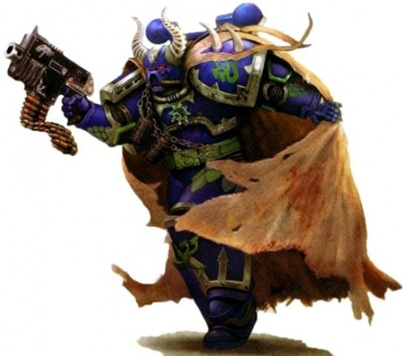

<!-- A0561-B0208 -->

原译文

Post-Horus Heresy Alpha Legionnaire 荷鲁斯叛乱后阿尔法军团士兵

**校订译文**

Post-Horus Heresy Alpha Legionnaire 荷鲁斯之乱后阿尔法军团士兵

<!-- /A0561-B0208 -->

<!-- A0561-B0209 -->
**英文原文**

It is believed that, since the Heresy, the Alpha Legion has been operating as independent cells hidden throughout the Imperium, coordinating various Chaos Cultist activities to subvert Imperial rule. While these cells operate independently of one another and destroying one will not affect the effort of their overall mission, the Legion still loosely coordinates its actions across the Galaxy. Who is coordinating these efforts and how they are doing so is largely a mystery to the Imperium, but many believe they achieve this through "Operatives". These figures are apparently human, but have undergone limited psycho-hypnotic therapy to make them absolutely loyal to the Legion. These operatives, fully infiltrated into Imperial society, act as the link between Alpha Legion cells and cultists and are their primary method of galaxy-wide communication.

<!-- /A0561-B0209 -->

<!-- A0561-B0210 -->

原译文

据信，自叛乱以来，阿尔法军团一直作为隐藏在整个帝国中的独立组织运作，协调各种混沌邪教徒活动以颠覆帝国统治。虽然这些组织彼此独立运作，摧毁一个组织不会影响它们的整体任务，但军团仍然在银河系范围内松散地协调其行动。谁在协调这些努力以及他们是如何做到的，对帝国来说很大程度上是一个谜，但许多人认为他们是通过“特工”来实现的。这些人物显然是人类，但经过了有限的心理催眠治疗，使他们对军团绝对忠诚。这些特工完全渗透到帝国社会，是阿尔法军团组织和邪教徒之间的纽带，是他们在银河系范围内沟通的主要方式。

**校订译文**

据信，叛乱后的阿尔法军团以独立秘密小组的形式，潜藏在帝国各处，协调混沌邪教徒活动，颠覆帝国统治。各组互不依赖，摧毁一组不会妨碍整体任务，但军团仍以松散方式协调银河范围内的行动。由谁协调、如何协调，对帝国而言大多仍是谜。许多人认为，关键在于那些“特工”：他们看起来是普通人类，却接受过有限的心理催眠处理，对军团绝对忠诚。他们深度融入帝国社会，联系阿尔法秘密小组与邪教徒，也是军团实现跨银河通信的主要途径。

<!-- /A0561-B0210 -->

<!-- A0561-B0211 -->
**英文原文**

Given their aptitude to subterfuge and deception, Alpha Legion forces rarely operate in large numbers for long, as they prefer not to draw attention to themselves. However despite being splintered into myriad warbands since the Heresy, they still operate with a unity of purpose that many of their fellow Traitor Legions lack. If an ambitious enough plan or especially tempting opportunity presents itself, multiple Alpha Legion cells and warbands may unite, at least temporarily, under the command of a single Harrowmaster that could command hundreds or even thousands of warriors.

<!-- /A0561-B0211 -->

<!-- A0561-B0212 -->

原译文

鉴于阿尔法军团的狡猾和欺骗倾向，他们很少长期大规模行动，因为他们不想引起人们的注意。然而，尽管自叛乱以来分裂成无数的战帮，他们仍然以许多叛徒军团缺乏的统一目标运作。如果有一个足够雄心勃勃的计划或特别诱人的机会出现，多个阿尔法军团的组织和战帮可能会在一个可以指挥数百甚至数千名战士的单一折磨大师的指挥下联合起来，至少是暂时的。

**校订译文**

阿尔法军团长于谋略与欺骗，为免引人注目，很少长期大规模集结。虽在叛乱后分化为无数战帮，他们仍保有许多其他叛徒军团所缺乏的共同目标。若有足够宏大的计划，或极具诱惑的机会，多支秘密小组与战帮便可能暂时联合，服从一名折磨大师的指挥，集结数百甚至数千名战士。

<!-- /A0561-B0212 -->

<!-- A0561-B0213 -->
**英文原文**

Alpharius believed in planning and coordination; he always sought alternatives and multiple solutions to any given problem, with different elements working together for the end result. These doctrines, thoroughly embraced by the Legion as a whole, have apparently been continued by the traitors and have proved effective, especially in the disparate and secretive way they now operate. Thus is one of their Chaos Lords liable to be called Master of Diversion when he proves himself a expert deceiver of the enemy.

<!-- /A0561-B0213 -->

<!-- A0561-B0214 -->

原译文

阿尔法瑞斯相信计划和协调；他总是寻求任何给定问题的替代方案和多种解决方案，不同的成员共同作用以获得最终结果。这些学说，被整个军团彻底接受，显然被叛徒继续推行，并被证明是有效的，特别是在他们现在以不同和秘密的方式运作的情况下。因此，当他们的一位混沌领主证明自己是欺骗敌人的专家时，他可能会被称为转移大师。

**校订译文**

阿尔法瑞斯重视计划与协调，处理任何问题都会寻求替代方案与多重解法，让不同部队共同实现最终目标。这些理念被整个军团接受，叛乱后似乎仍在延续，尤其适合如今分散、隐秘的行动方式，成效显著。因此，军团中的混沌领主若展现出高超的欺敌本领，便可能获称“佯动大师”。

**校注：** Diversion 在战术语境为牵制、佯动，原译转移大师过于字面，暂译佯动大师。

<!-- /A0561-B0214 -->

<!-- A0561-B0215 图片 -->
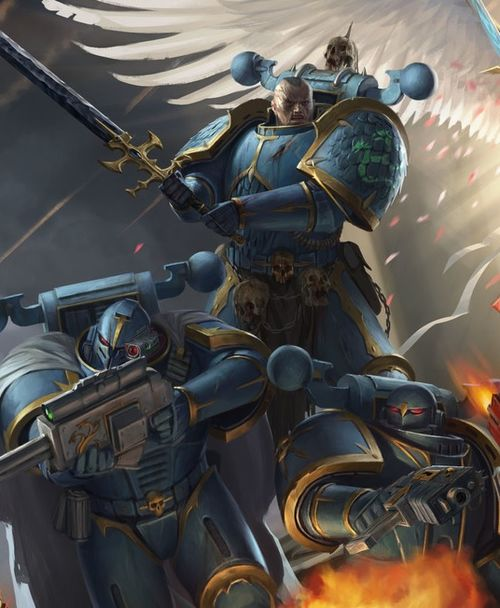

<!-- A0561-B0216 -->

原译文

Alpha Legion Space Marines of the Unsung 未颂者阿尔法军团星际战士

**校订译文**

Alpha Legion Space Marines of the Unsung 未颂者阿尔法军团星际战士

<!-- /A0561-B0216 -->

<!-- A0561-B0217 -->
**英文原文**

In M42 Harrowmaster Solomon Akurra was able to establish a significant coalition of Alpha Legion warbands dubbed the Ghost Legion with the goal of seriously threatening Imperial rule. It consists of not only his own Serpent's Teeth but also the Guns of Freedom, Shrouded Hand, Penitent Sons, Faceless, Sons of Venom, First Strike, and Rustbloods.

<!-- /A0561-B0217 -->

<!-- A0561-B0218 -->

原译文

在M42，折磨大师所罗门·阿库拉能够建立一个被称为幽灵军团的阿尔法军团战帮的重要联盟，其目标是严重威胁帝国统治。它不仅包括他自己的巨蛇之牙，还包括自由之枪、笼罩之手、忏悔之子、无面者、毒液之子、首击和锈血者。

**校订译文**

M42，折磨大师所罗门·阿库拉组建了规模可观的战帮联盟“幽灵军团”，意图对帝国统治构成实质威胁。联盟除他自己的巨蛇之牙外，还包括自由之枪、蔽影之手、忏悔之子、无面者、毒液之子、首击与锈血者。

**校注：** M42战帮联盟与早期秘密军团同名 Ghost Legion，但为不同时期的组织形态，不能视为组织史从未改变。

<!-- /A0561-B0218 -->

<!-- A0561-B0219 -->
### Known Chaos Cults 著名混沌教派

<!-- /A0561-B0219 -->

<!-- A0561-B0220 -->

原译文

Brotherhood of the Serpent's Eye 巨蛇之眼兄弟会

**校订译文**

Brotherhood of the Serpent's Eye 巨蛇之眼兄弟会

<!-- /A0561-B0220 -->

<!-- A0561-B0221 -->
## Gene-Seed and Appearance 基因种子和外观

<!-- /A0561-B0221 -->

<!-- A0561-B0222 -->
**英文原文**

Alongside the Space Wolves and Salamanders, Alpha Legion were one of the original "Trefoil" Legions, endowed with notably distinct and isolated Gene-Seed that was highly classified by the Emperor Himself. The exact details of what this entails is not known, though it is known that the Alpha Legion Gene-Seed was the last strain created for the Legiones Astartes at the end of the Unification Wars.

<!-- /A0561-B0222 -->

<!-- A0561-B0223 -->

原译文

除了太空野狼和火蜥蜴，阿尔法军团是最初的“三叶草”军团之一，被赋予了明显独特和独立的基因种子，这些种子被帝皇本人高度保密。这需要什么的确切细节尚不清楚，尽管众所周知，阿尔法军团基因种子是统一战争结束时为阿斯塔特军团创造的最后一种品种。

**校订译文**

阿尔法军团与太空野狼、火蜥蜴并列，属于最初的“三叶草”军团，拥有特点鲜明、单独培育的基因种子，其资料由帝皇亲自列为高度机密。具体特殊之处尚不清楚，只知这是统一战争末期，为阿斯塔特军团创造的最后一个基因种子品系。

<!-- /A0561-B0223 -->

<!-- A0561-B0224 -->
**英文原文**

One of the most notable anomalies of the Alpha Legion was the near-identical appearances of its members. During the Great Crusade most if not all Alpha Legionnaires possessed white skin, a bald head and similar facial features to their Primarch, Alpharius.

<!-- /A0561-B0224 -->

<!-- A0561-B0225 -->

原译文

阿尔法军团最显著的异常之一是其成员的外表几乎完全相同。在大远征期间，大多数（如果不是全部的话）阿尔法军团士兵都拥有白色皮肤、秃头和与他们的原体阿尔法瑞斯相似的面部特征。

**校订译文**

阿尔法军团最显著的异常之一，是成员外貌近乎一致。大远征期间，大多数，甚至可能所有军团战士，都肤色白皙、头部无发，面容近似原体阿尔法瑞斯。

**校注：** bald head 只描述无发外观，不单独推断原因。

<!-- /A0561-B0225 -->

<!-- A0561-B0226 -->
**英文原文**

During the era of the Great Crusade, some Alpha Legionaries were notably tall even for members of the Astartes, physical attributes which suited Alpharius' focus on misdirection, for the Primarch put into place a directive that, as far as possible, all Alpha Legion Marines had to attempt to look alike; and the face on which they patterned themselves was that of Alpharius and Omegon.

<!-- /A0561-B0226 -->

<!-- A0561-B0227 -->

原译文

在大远征时期，一些阿尔法军团的士兵甚至对阿斯塔特的成员来说都特别高大，这些身体特征适合阿尔法瑞斯对误导的关注，因为原体制定了一项指令，要求所有阿尔法军团战士尽可能地看起来相似；他们模仿自己的脸是阿尔法瑞斯和欧米伽的脸。

**校订译文**

大远征时期，有些阿尔法战士即使以阿斯塔特标准衡量也格外高大，这有利于阿尔法瑞斯混淆视听。原体下令，所有军团战士都应尽量容貌一致，而他们模仿的蓝本，正是阿尔法瑞斯与欧米伽。

<!-- /A0561-B0227 -->

<!-- A0561-B0228 -->
**英文原文**

Today, the Gene-Seed of the Alpha Legion is thought to be largely uncorrupted by the Warp due to their operations mainly residing outside of the Eye of Terror. However some Alpha Legionnaires still display outward mutations and warped body parts, but if this is the result of a original flaw or something that has come about during the ten thousand years of the Long War is unknown.

<!-- /A0561-B0228 -->

<!-- A0561-B0229 -->

原译文

今天，阿尔法军团的基因种子被认为基本上没有被亚空间破坏，因为他们的行动主要位于恐惧之眼之外。然而，一些阿尔法军团仍然表现出向外突变和扭曲的身体部位，但这是原始缺陷的结果还是万古长战期间发生的事情尚不清楚。

**校订译文**

由于主要在恐惧之眼以外活动，阿尔法军团的基因种子如今被认为大体未遭亚空间污染。不过，部分成员仍有可见变异与肢体扭曲。究竟源自最初的缺陷，还是在延续万年的“万古长战”中形成，尚不得而知。

<!-- /A0561-B0229 -->

<!-- A0561-B0230 -->
## Noted Elements of the Alpha Legion 阿尔法军团著名成员

<!-- /A0561-B0230 -->

<!-- A0561-B0231 -->
### Alpha Legion Armoury 阿尔法军团军械库

<!-- /A0561-B0231 -->

<!-- A0561-B0232 -->
### Fleet 舰队

<!-- /A0561-B0232 -->

<!-- A0561-B0233 -->
**英文原文**

Alpha — Gloriana Class Battleship

<!-- /A0561-B0233 -->

<!-- A0561-B0234 -->

原译文

阿尔法号 — 荣光女王级战列舰

**校订译文**

阿尔法号 — 荣光女王级战列舰

<!-- /A0561-B0234 -->

<!-- A0561-B0235 -->
**英文原文**

Beta — Gloriana Class Battleship

<!-- /A0561-B0235 -->

<!-- A0561-B0236 -->

原译文

贝塔号 — 荣光女王级战列舰

**校订译文**

贝塔号 — 荣光女王级战列舰

<!-- /A0561-B0236 -->

<!-- A0561-B0237 -->
**英文原文**

Delta — Battleship

<!-- /A0561-B0237 -->

<!-- A0561-B0238 -->

原译文

德尔塔号 — 战列舰

**校订译文**

德尔塔号 — 战列舰

<!-- /A0561-B0238 -->

<!-- A0561-B0239 -->
**英文原文**

Anarchy's Heart — Despoiler Class Battleship

<!-- /A0561-B0239 -->

<!-- A0561-B0240 -->

原译文

无序之心号 — 掠夺者级战列舰

**校订译文**

无序之心号 — 掠夺者级战列舰

<!-- /A0561-B0240 -->

<!-- A0561-B0241 -->
**英文原文**

Gama Mu - Dominus Class Grand Cruiser (Horus Heresy-era)

<!-- /A0561-B0241 -->

<!-- A0561-B0242 -->

原译文

伽马·穆号 - 统御级大巡洋舰（荷鲁斯叛乱时期）

**校订译文**

伽马·穆号——领主级大型巡洋舰，荷鲁斯之乱时期。

**校注：** 对照本段英文确认同一实体，与全书核心译名统一；不改变同形异义词或省略称呼。

<!-- /A0561-B0242 -->

<!-- A0561-B0243 -->
**英文原文**

Zeta Telios — Capital ship

<!-- /A0561-B0243 -->

<!-- A0561-B0244 -->

原译文

泽塔终极号 — 主力舰

**校订译文**

泽塔终极号 — 主力舰

<!-- /A0561-B0244 -->

<!-- A0561-B0245 -->
**英文原文**

Omega-Echidnax - Flagship of the Sons of the Hydra

<!-- /A0561-B0245 -->

<!-- A0561-B0246 -->

原译文

欧米伽-厄喀德那号 - 九头蛇之子的旗舰

**校订译文**

欧米伽-厄喀德那号 - 九头蛇之子的旗舰

<!-- /A0561-B0246 -->

<!-- A0561-B0247 -->
**英文原文**

Gamma Lycurgus — Capital ship

<!-- /A0561-B0247 -->

<!-- A0561-B0248 -->

原译文

伽马·莱库古号 — 主力舰

**校订译文**

伽马·莱库古号 — 主力舰

<!-- /A0561-B0248 -->

<!-- A0561-B0249 -->
**英文原文**

Theta — Destroyed during the Drop Site Massacre

<!-- /A0561-B0249 -->

<!-- A0561-B0250 -->

原译文

西塔号 — 登陆点大屠杀期间被毁

**校订译文**

西塔号 — 登陆点大屠杀期间被毁

<!-- /A0561-B0250 -->

<!-- A0561-B0251 -->

原译文

Notable Members of the Alpha Legion 阿尔法军团著名成员

**校订译文**

Notable Members of the Alpha Legion 阿尔法军团著名成员

<!-- /A0561-B0251 -->

<!-- A0561-B0252 -->
### Heresy Era 叛乱时期

<!-- /A0561-B0252 -->

<!-- A0561-B0253 -->
**英文原文**

Alpharius — Primarch

<!-- /A0561-B0253 -->

<!-- A0561-B0254 -->

原译文

阿尔法瑞斯 — 原体

**校订译文**

阿尔法瑞斯 — 原体

<!-- /A0561-B0254 -->

<!-- A0561-B0255 -->
**英文原文**

Omegon — Leader of the Effrit Stealth Squad / Primarch

<!-- /A0561-B0255 -->

<!-- A0561-B0256 -->

原译文

欧米伽 — 埃弗里特潜行小队领导者/原体

**校订译文**

欧米伽 — 埃弗里特潜行小队领导者/原体

<!-- /A0561-B0256 -->

<!-- A0561-B0257 -->
**英文原文**

Ingo Pech — First Captain

<!-- /A0561-B0257 -->

<!-- A0561-B0258 -->

原译文

因格·佩克 — 第一连长

**校订译文**

英戈·佩奇 — 第一连长

**校注：** 对照本段英文确认同一实体，与全书核心译名统一；不改变同形异义词或省略称呼。

<!-- /A0561-B0258 -->

<!-- A0561-B0259 -->
**英文原文**

Mathias Herzog — Captain of the 2nd Company

<!-- /A0561-B0259 -->

<!-- A0561-B0260 -->

原译文

马蒂亚斯·赫尔佐格 — 第二连队连长

**校订译文**

马蒂亚斯·赫尔佐格 — 第二连队连长

<!-- /A0561-B0260 -->

<!-- A0561-B0261 -->
**英文原文**

Armillus Dynat — Harrowmaster

<!-- /A0561-B0261 -->

<!-- A0561-B0262 -->

原译文

阿尔梅琉斯·迪纳特 — 折磨大师

**校订译文**

阿尔梅琉斯·迪纳特 — 折磨大师

<!-- /A0561-B0262 -->

<!-- A0561-B0263 -->
**英文原文**

Exodus — Assassin

<!-- /A0561-B0263 -->

<!-- A0561-B0264 -->

原译文

伊克索底斯 — 刺客

**校订译文**

伊克索底斯 — 刺客

<!-- /A0561-B0264 -->

<!-- A0561-B0265 -->
**英文原文**

Phocron — Headhunter Prime

<!-- /A0561-B0265 -->

<!-- A0561-B0266 -->

原译文

弗克伦 — 猎头者之首

**校订译文**

弗克伦 — 猎头者之首

<!-- /A0561-B0266 -->

<!-- A0561-B0267 -->
**英文原文**

Siridor Vhen - Praetor

<!-- /A0561-B0267 -->

<!-- A0561-B0268 -->

原译文

希瑞多·维恩 - 执政官

**校订译文**

希瑞多·维恩 - 执政官

<!-- /A0561-B0268 -->

<!-- A0561-B0269 -->
**英文原文**

Sheed Ranko — Captain of the Lernaen Terminator Squad. Killed during the Tenebrae Mission.

<!-- /A0561-B0269 -->

<!-- A0561-B0270 -->

原译文

谢德·兰科 — 勒拿终结者小队连长。黑暗任务期间被杀

**校订译文**

谢德·兰科 — 勒拿终结者小队连长。黑暗任务期间被杀

<!-- /A0561-B0270 -->

<!-- A0561-B0271 -->
**英文原文**

Autilon Skorr — "The Hydra's Headman" — Consul Delegatus of the Alpha Legion

<!-- /A0561-B0271 -->

<!-- A0561-B0272 -->

原译文

奥帝隆·斯考尔 — “九头蛇之首” — 阿尔法军团领事使节

**校订译文**

奥帝隆·斯考尔 — “九头蛇之首” — 阿尔法军团领事使节

<!-- /A0561-B0272 -->

<!-- A0561-B0273 -->
### Post-Heresy 叛乱后

<!-- /A0561-B0273 -->

<!-- A0561-B0274 -->
**英文原文**

Arkos — Lord

<!-- /A0561-B0274 -->

<!-- A0561-B0275 -->

原译文

阿尔科斯 — 领主

**校订译文**

阿尔科斯 — 领主

<!-- /A0561-B0275 -->

<!-- A0561-B0276 -->
**英文原文**

Arkturion — Warpsmith

<!-- /A0561-B0276 -->

<!-- A0561-B0277 -->

原译文

阿克图里翁 — 亚空间铁匠

**校订译文**

阿克图里翁——次元铁匠。

**校注：** Warpsmith 采用已核官方完整单位译名次元铁匠。

<!-- /A0561-B0277 -->

<!-- A0561-B0278 -->
**英文原文**

Quetzel Carthach — Arch-Lord and Harrowmaster

<!-- /A0561-B0278 -->

<!-- A0561-B0279 -->

原译文

奎泽尔·卡尔萨克 — 大领主和折磨大师

**校订译文**

奎泽尔·卡尔萨克 — 大领主和折磨大师

<!-- /A0561-B0279 -->

<!-- A0561-B0280 -->
**英文原文**

Sindri Myr — Sorcerer, Daemon Prince

<!-- /A0561-B0280 -->

<!-- A0561-B0281 -->

原译文

辛德里·米尔 — 巫师，恶魔王子

**校订译文**

辛德里·米尔 — 巫师，恶魔亲王

<!-- /A0561-B0281 -->

<!-- A0561-B0282 -->
**英文原文**

Occam — The Untrue, warband leader of The Redacted

<!-- /A0561-B0282 -->

<!-- A0561-B0283 -->

原译文

奥卡姆 — 不实者，修订者的战帮领袖

**校订译文**

奥卡姆 — 不实者，抹除者的战帮领袖

**校注：** 对照本段英文确认同一实体，与全书核心译名统一；不改变同形异义词或省略称呼。

<!-- /A0561-B0283 -->

<!-- A0561-B0284 -->
**英文原文**

Vykus Skayle — Lord

<!-- /A0561-B0284 -->

<!-- A0561-B0285 -->

原译文

维库斯·斯凯尔 — 领主

**校订译文**

维库斯·斯凯尔 — 领主

<!-- /A0561-B0285 -->

<!-- A0561-B0286 -->
**英文原文**

Kassar — Warband leader of the Unsung

<!-- /A0561-B0286 -->

<!-- A0561-B0287 -->

原译文

卡萨尔 — 未颂者的战帮领袖

**校订译文**

卡萨尔 — 未颂者的战帮领袖

<!-- /A0561-B0287 -->

<!-- A0561-B0288 -->
**英文原文**

Solomon Akurra — Harrowmaster of the Ghost Legion

<!-- /A0561-B0288 -->

<!-- A0561-B0289 -->

原译文

所罗门·阿库拉 — 幽灵军团的折磨之主

**校订译文**

所罗门·阿库拉——幽灵军团的折磨大师。

<!-- /A0561-B0289 -->

<!-- A0561-B0290 -->
**英文原文**

Kernax Voldorius — Daemon Prince

<!-- /A0561-B0290 -->

<!-- A0561-B0291 -->

原译文

克纳克斯·沃尔多里乌斯 — 恶魔王子

**校订译文**

克纳克斯·沃尔多里乌斯 — 恶魔亲王

<!-- /A0561-B0291 -->

<!-- A0561-B0292 -->
**英文原文**

Bale — Lord

<!-- /A0561-B0292 -->

<!-- A0561-B0293 -->

原译文

贝尔 — 领主

**校订译文**

贝尔 — 领主

<!-- /A0561-B0293 -->

<!-- A0561-B0294 -->
**英文原文**

Firaeveus Carron — Lord

<!-- /A0561-B0294 -->

<!-- A0561-B0295 -->

原译文

弗里维斯·卡伦 — 领主

**校订译文**

弗里维斯·卡伦 — 领主

<!-- /A0561-B0295 -->

<!-- A0561-B0296 -->
**英文原文**

Cacadius Siron — Intelligence chief of the Black Legion

<!-- /A0561-B0296 -->

<!-- A0561-B0297 -->

原译文

卡卡迪乌斯·西隆 — 黑色军团情报部长

**校订译文**

卡卡迪乌斯·西隆 — 黑色军团情报部长

<!-- /A0561-B0297 -->

<!-- A0561-B0298 -->
**英文原文**

Deathrow the Warblind — Member of Eisenhorn's team

<!-- /A0561-B0298 -->

<!-- A0561-B0299 -->

原译文

战盲死囚 — 艾森霍恩小队的成员

**校订译文**

战盲死囚 — 艾森霍恩小队的成员

<!-- /A0561-B0299 -->

<!-- A0561-B0300 -->
### Unique Troops 独特部队

<!-- /A0561-B0300 -->

<!-- A0561-B0301 -->
**英文原文**

Lernaean (Horus Heresy-era)

<!-- /A0561-B0301 -->

<!-- A0561-B0302 -->

原译文

勒拿（荷鲁斯叛乱时期）

**校订译文**

勒拿终结者——荷鲁斯之乱时期。

**校注：** 本篇使用 Lernaen 与 Lernaean 两种英文拼形，按同一勒拿终结者编制处理，英文原字均保留。

<!-- /A0561-B0302 -->

<!-- A0561-B0303 -->
**英文原文**

Headhunter (Horus Heresy-era)

<!-- /A0561-B0303 -->

<!-- A0561-B0304 -->

原译文

猎头者（荷鲁斯叛乱时期）

**校订译文**

猎头者——荷鲁斯之乱时期。

<!-- /A0561-B0304 -->

<!-- A0561-B0305 -->

原译文

Saboteur 破坏者

**校订译文**

Saboteur 破坏专家

<!-- /A0561-B0305 -->

<!-- A0561-B0306 -->

原译文

Operative 密探

**校订译文**

Operative 特工

**校注：** Operative 与本篇前文统一特工，原密探保留在对照。

<!-- /A0561-B0306 -->

本篇核心术语与暂定项

以下列出本篇出现的英文原形及核心术语表用词。同形词可能指不同对象，具体词义以本篇正文和校注为准；单复数、别名和仅见于图注的名称可能尚未列入。完整候选见[术语表](../../术语表/双语术语候选.csv)。

| 英文 | 采用中文 | 状态 |
| --- | --- | --- |
| Space Marines | 星际战士 | 官方已核对 |
| Dark Angels | 黑暗天使 | 官方已核对 |
| Space Wolves | 太空野狼 | 官方已核对 |
| Chaos Space Marines | 混沌星际战士 | 官方已核对 |
| Death Guard | 死亡守卫 | 官方已核对 |
| Thousand Sons | 千子 | 官方已核对 |
| World Eaters | 吞世者 | 官方已核对 |
| Terminator | 终结者 | 官方已核对 |
| Roboute Guilliman | 罗保特·基里曼 | 官方已核对 |
| Ultramarines | 极限战士 | 官方已核对 |
| Horus Heresy | 荷鲁斯之乱 | 官方已核对 |
| Warp | 亚空间 | 官方已核对 |
| Inquisition | 审判庭 | 暂定 |
| Inquisitor | 审判官 | 官方已核对 |
| Imperium | 帝国 | 暂定·简称 |
| Warpsmith | 次元铁匠 | 官方已核 |
| Sorcerer | 巫师 | 官方已核对 |
| Eye of Terror | 恐惧之眼 | 官方已核对 |
| Maelstrom | 大漩涡 | 官方已核对 |
| Imperial Fists | 帝国之拳 | 暂定 |
| Emperor | 帝皇 | 官方已核对 |
| Primarch | 原体 | 官方已核对 |
| Battle Barge | 战斗驳船 | 暂定·官方待核 |
| Daemon Prince | 恶魔亲王 | 官方已核对 |
| Black Legion | 黑色军团 | 暂定·官方待核 |
| Night Lords | 午夜领主 | 暂定·官方待核 |
| Great Crusade | 大远征 | 暂定·官方待核 |
| Terra | 泰拉 | 暂定·官方待核 |
| Luna Wolves | 影月苍狼 | 暂定·官方待核 |
| Horus | 荷鲁斯 | 暂定·官方待核 |
| Lion El'Jonson | 莱昂·艾尔’庄森 | 官方已核对 |
| Isstvan III | 伊斯塔万三号 | 暂定·官方待核 |
| Iron Hands | 钢铁之手 | 暂定·官方待核 |
| High Lords of Terra | 泰拉高领主 | 暂定·官方待核 |
| Legiones Astartes | 阿斯塔特军团 | 暂定·官方待核 |
| Unification Wars | 统一战争 | 暂定·官方待核 |
| Cabal | 密教 | 暂定·官方待核 |
| John Grammaticus | 约翰·格拉马迪库斯 | 暂定·官方待核 |
| Ollanius Persson | 欧良尼乌斯·佩松 | 官方词根参考·全名待核 |
| Salamanders | 火蜥蜴 | 暂定·官方待核 |
| Konrad Curze | 康拉德·科兹 | 暂定·官方待核 |
| Tallarn | 塔兰 | 暂定·官方待核 |
| Luna | 月球 | 暂定·官方待核 |
| Macragge | 马库拉格 | 暂定·官方待核 |
| Master | 导师（审判庭职衔）／舰务官（舰员职务） | 语境定译·官方待核 |
| Mission | 教团／传教机构 | 暂定 |
| Rangdan Xenocides | 冉丹灭绝战争 | 暂定·官方待核 |
| Terminator Squad | 终结者小队 | 官方已核对 |
| Long War | 万古长战 | 暂定·官方待核 |
| Shadrak Meduson | 沙德拉克·梅杜森 | 暂定·官方待核 |
| Ullanor | 乌兰诺 | 暂定·官方待核 |
| Space Marine Legion | 星际战士军团 | 暂定·官方待核 |
| White Scars | 白疤 | 官方已核 |
| Alpha Legion | 阿尔法军团 | 暂定·官方待核 |
| Raven Guard | 暗鸦守卫 | 官方已核 |
| Chaos Space Marine Legions | 混沌星际战士军团 | 暂定·官方待核 |
| The Primarchs | 原体 | 暂定·官方待核 |
| Scars | 伤疤 | 暂定·官方待核 |
| Penitent | 忏悔 | 暂定·官方待核 |
| Shattered Legions | 破碎军团 | 暂定·官方待核 |
| Branne Nev | 布兰尼·涅夫 | 暂定·官方待核 |
| Founding | 建军 | 暂定·官方待核 |
| Sol | 太阳系 | 暂定·官方待核 |
| Isstvan | 伊斯塔万 | 暂定·官方待核 |
| Mathias | 马蒂亚斯 | 暂定·官方待核 |
| First Captain | 第一连长 | 暂定·官方待核 |
| Praetor | 执政官 | 暂定·官方待核 |
| Ezekyle Abaddon | 以泽凯尔·阿巴顿 | 暂定·官方待核 |
| Armillus Dynat | 阿尔梅琉斯·迪纳特 | 暂定·官方待核 |
| Ingo Pech | 英戈·佩奇 | 暂定·官方待核 |
| Autilon Skorr | 奥帝隆·斯考尔 | 暂定·官方待核 |
| Consul | 领事 | 暂定·官方待核 |
| Delegatus | 代表 | 暂定·官方待核 |
| Despoiler | 劫掠者 | 暂定·官方待核 |
| Power Armour | 动力盔甲 | 暂定·官方待核 |
| Space Marine | 星际战士 | 暂定·官方待核 |
| Captain | 连长 | 暂定·官方待核 |
| Terminators | 终结者 | 暂定·官方待核 |
| Brother | 修士 | 暂定·官方待核 |
| Constantin Valdor | 康斯坦丁·瓦尔多 | 暂定·官方待核 |
| First Founding | 初次建军 | 暂定·官方待核 |
| Emperor's Swords | 帝皇之剑 | 暂定·官方待核 |
| Gene-seed | 基因种子 | 暂定·官方待核 |
| Gloriana Class Battleship | 荣光女王级战列舰 | 暂定·官方待核 |
| Dominus Class Grand Cruiser | 领主级大型巡洋舰 | 暂定·官方待核 |
| Chaos Undivided | 混沌无分 | 暂定·官方待核 |
| Powers | 能天使 | 暂定·官方待核 |
| Alpharius | 阿尔法瑞斯 | 暂定·官方待核 |
| Omegon | 欧米伽 | 暂定·官方待核 |
| Alpharius Omegon | 阿尔法瑞斯·欧米伽 | 暂定·官方待核 |
| Ghost Legion | 幽灵军团 | 暂定·官方待核 |
| Hydra Dominatus | 九头蛇不朽 | 暂定·官方待核 |
| The Book of Malignancies | 邪恶之书 | 暂定·官方待核 |
| The Apocrypha Terra | 泰拉伪经 | 暂定·官方待核 |
| The Harrowing | 折磨 | 暂定·官方待核 |
| Harrowmaster | 折磨大师 | 暂定·官方待核 |
| Master of Diversion | 佯动大师 | 暂定·官方待核 |
| Sparatoi | 斯帕拉托伊 | 暂定·官方待核 |
| Operative | 特工 | 暂定·官方待核 |
| Effrit Stealth Squad | 埃弗里特潜行小队 | 暂定·官方待核 |
| Lernaen Terminator Squad | 勒拿终结者小队 | 暂定·官方待核 |
| Lernaean | 勒拿终结者 | 暂定·官方待核 |
| Corvus-Alpha | 渡鸦-阿尔法 | 暂定·官方待核 |
| Tesstra Prime | 特斯特拉主星 | 暂定·官方待核 |
| Chondax | 香德克斯 | 暂定·官方待核 |
| Eskrador | 埃斯卡多 | 暂定·官方待核 |
| Alaxxes Nebula | 阿拉克斯星云 | 暂定·官方待核 |
| Actaea | 阿克泰 | 暂定·官方待核 |
| Aeonid Thiel | 伊奥尼德·希尔 | 暂定·官方待核 |
| Mathias Herzog | 马蒂亚斯·赫尔佐格 | 暂定·官方待核 |
| Exodus | 伊克索底斯 | 暂定·官方待核 |
| Phocron | 弗克伦 | 暂定·官方待核 |
| Siridor Vhen | 希瑞多·维恩 | 暂定·官方待核 |
| Sheed Ranko | 谢德·兰科 | 暂定·官方待核 |
| Arkos | 阿尔科斯 | 暂定·官方待核 |
| Arkturion | 阿克图里翁 | 暂定·官方待核 |
| Quetzel Carthach | 奎泽尔·卡尔萨克 | 暂定·官方待核 |
| Sindri Myr | 辛德里·米尔 | 暂定·官方待核 |
| Occam | 奥卡姆 | 暂定·官方待核 |
| Vykus Skayle | 维库斯·斯凯尔 | 暂定·官方待核 |
| Kassar | 卡萨尔 | 暂定·官方待核 |
| Solomon Akurra | 所罗门·阿库拉 | 暂定·官方待核 |
| Kernax Voldorius | 克纳克斯·沃尔多里乌斯 | 暂定·官方待核 |
| Bale | 贝尔 | 暂定·官方待核 |
| Firaeveus Carron | 弗里维斯·卡伦 | 暂定·官方待核 |
| Cacadius Siron | 卡卡迪乌斯·西隆 | 暂定·官方待核 |
| Deathrow the Warblind | 战盲死囚 | 暂定·官方待核 |
| Anarchy's Heart | 无序之心号 | 暂定·官方待核 |
| Gama Mu | 伽马·穆号 | 暂定·官方待核 |
| Zeta Telios | 泽塔终极号 | 暂定·官方待核 |
| Omega-Echidnax | 欧米伽-厄喀德那号 | 暂定·官方待核 |
| Gamma Lycurgus | 伽马·莱库古号 | 暂定·官方待核 |
| Guns of Freedom | 自由之枪 | 暂定·官方待核 |
| The Faceless | 无面者 | 暂定·官方待核 |
| The Faithless | 无信者 | 暂定·官方待核 |
| First Strike | 首击 | 暂定·官方待核 |
| Penitent Sons | 忏悔之子 | 暂定·官方待核 |
| The Redacted | 抹除者 | 暂定·官方待核 |
| The Rustbloods | 锈血者 | 暂定·官方待核 |
| Scaled Fang | 鳞牙 | 暂定·官方待核 |
| Serpentine Scourge | 蛇形灾祸 | 暂定·官方待核 |
| The Serpent's Teeth | 巨蛇之牙 | 暂定·官方待核 |
| The Shadowed Ones | 阴影众 | 暂定·官方待核 |
| Shrouded Hand | 蔽影之手 | 暂定·官方待核 |
| Sons of Deception | 欺骗之子 | 暂定·官方待核 |
| Sons of the Hydra | 九头蛇之子 | 暂定·官方待核 |
| Sons of Venom | 毒液之子 | 暂定·官方待核 |
| Soulfangs | 魂牙 | 暂定·官方待核 |
| Splintered Sentients | 破碎智灵 | 暂定·官方待核 |
| Subtle Blades | 隐秘之刃 | 暂定·官方待核 |
| The Unsung | 未颂者 | 暂定·官方待核 |
| Xenos | 异形 | 暂定·官方待核 |
| Rangdan | 冉丹 | 暂定·官方待核 |
| Jaghatai Khan | 察合台可汗 | 暂定·官方待核 |
| Venom | 毒液飞艇 | 官方已核对 |
| Pech | 佩什 | 暂定·官方待核 |
| Strain | 群系 | 暂定·官方待核 |
| The Dark | 《黑暗》 | 暂定·官方待核 |
| Kravin | 克拉文 | 暂定·官方待核 |
| System | 星系（恒星系统） | 暂定·官方待核 |
| Shroud | 裹尸布 | 暂定·官方待核 |
| Solomon | 所罗门 | 暂定·官方待核 |
| Macharian Heresy | 马卡里安叛乱 | 暂定·官方待核 |
| Chondax System | 香德克斯星系 | 暂定·官方待核 |
| Corruption | 腐败 | 暂定·官方待核 |
| Beta | 贝塔号 | 暂定·官方待核 |
| Bolter | 爆矢枪 | 暂定·官方待核 |
| Despoiler Class Battleship | 掠夺者级战列舰 | 暂定·官方待核 |
| Dominus Class | 统御级 | 暂定·官方待核 |
| Sol System | 太阳系 | 暂定·官方待核 |

