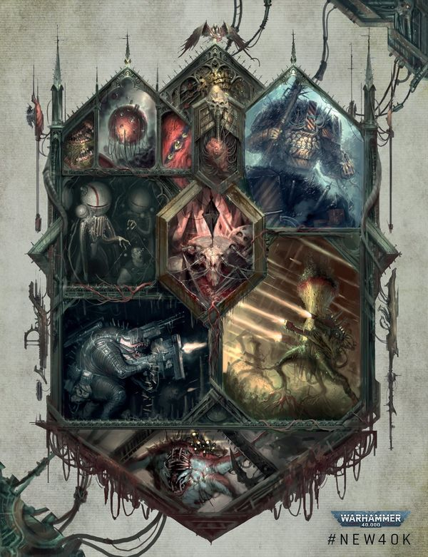
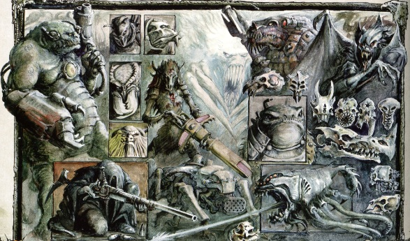

# 0562 异形 Xenos

精校状态：中文行文已逐段精校，部分术语仍为暂定

分类：概念 / 异型 Xenos

原文来源：https://www.bilibili.com/opus/1057106406402949144

原作者：帝国神选罐头

原文时间：2025年04月18日 16:32

[返回分类目录](目录.md) · [全书目录](../../目录.md)

原篇名：异型 Xenos

<!-- A0562-B0001 -->
**英文原文**

Xenos is an Imperial term synonymous with "alien" (from the human perspective), and refers to all non-human and extraterrestrial sentient species.

<!-- /A0562-B0001 -->

<!-- A0562-B0002 -->

原译文

异型是一个帝国术语，与“外星人”同义（从人类的角度来看），指的是所有非人类和外星有情物种。

**校订译文**

“异形”（Xenos）是帝国使用的术语，从人类立场看，相当于“外星异族”，泛指非人类、来自地外的智慧物种。

**校注：** Xenos 全书统一异形，原异型为异写；sentient species 为智慧物种，不是佛学意义的有情。

<!-- /A0562-B0002 -->

<!-- A0562-B0003 图片 -->

<!-- A0562-B0004 -->

原译文

Various races of Xenos 不同异型种族

**校订译文**

Various races of Xenos 不同的异形种族

<!-- /A0562-B0004 -->

<!-- A0562-B0005 -->
## Overview 概述

<!-- /A0562-B0005 -->

<!-- A0562-B0006 -->
**英文原文**

The major alien races are the Orks, Eldar, Dark Eldar, Tyranids, Necrons and the T'au. All these races pose a considerable threat to the survival and continued dominance of mankind. There are countless other races but all are trivial by comparison.

<!-- /A0562-B0006 -->

<!-- A0562-B0007 -->

原译文

主要的外星种族是欧克、灵族、黑暗灵族，泰伦、死灵和钛。所有这些种族都对人类的生存和持续统治构成了相当大的威胁。还有无数其他种族，但相比之下都微不足道。

**校订译文**

主要的异形种族包括欧克蛮人、灵族、黑暗灵族、泰伦虫族、太空死灵与钛族。它们都对人类的生存及其统治地位构成重大威胁。银河还存在无数其他种族，但相较这些主要势力，影响都小得多。

<!-- /A0562-B0007 -->

<!-- A0562-B0008 -->
**英文原文**

The Imperium considers humanity the rightful rulers of the whole galaxy. Part of the Imperial Creed is that all aliens judged to pose a threat to mankind's survival must be contained or destroyed. Aliens, along with mutants, heretics and deviants, are all considered enemies of mankind, for they threaten the very survival of the human race.

<!-- /A0562-B0008 -->

<!-- A0562-B0009 -->

原译文

帝国认为人类是整个银河系的合法统治者。帝国信条的一部分是，所有被认为对人类生存构成威胁的外星人都必须被遏制或摧毁。外星人，连同变种人、异端和叛逆者，都被认为是人类的敌人，因为他们威胁着人类的生存。

**校订译文**

帝国认定，人类才是整个银河的正统统治者。帝国教义要求，凡被视为威胁人类生存的异形，都必须受到遏制或遭到消灭。异形与变种人、异端、离经叛道者一样，被帝国视为人类之敌，因为帝国认为他们威胁着人类存续。

**校注：** 对照本段英文确认同一实体，与全书核心译名统一；不改变同形异义词或省略称呼。

<!-- /A0562-B0009 -->

<!-- A0562-B0010 -->
**英文原文**

Many new alien races and civilisations are discovered by Imperial Explorators every year. For the most part, these aliens are ignored, contained, or if they present a threat to mankind or the Imperium, eradicated. Throughout its history the Imperium has fought many long wars with dangerous alien species. In most cases the Imperium has eventually won, but in some, the threat has only managed to be contained.

<!-- /A0562-B0010 -->

<!-- A0562-B0011 -->

原译文

帝国探索者每年都会发现许多新的外星种族和文明。在大多数情况下，这些外星人被忽视、被遏制，或者如果他们对人类或帝国构成威胁，则被根除。纵观其历史，帝国与危险的外来物种进行了许多长期战争。在大多数情况下，帝国最终获胜，但在某些情况下，威胁只得到了遏制。

**校订译文**

帝国探索者每年都会发现新的异形种族与文明。对其中大部分，帝国或置之不理，或加以封锁；若构成威胁，则予以清除。帝国历史上曾与许多危险异形展开旷日持久的战争，大多最终取胜，但有时也只能遏制威胁，无法根除。

<!-- /A0562-B0011 -->

<!-- A0562-B0012 图片 -->

<!-- A0562-B0013 -->

原译文

Various races of Xenos 不同异型种族

**校订译文**

Various races of Xenos 不同的异形种族

<!-- /A0562-B0013 -->

<!-- A0562-B0014 -->
### Interactions with Xenos 与异形的往来

原题：Interactions with Xenos 与异型的交互

<!-- /A0562-B0014 -->

<!-- A0562-B0015 -->
**英文原文**

Although friendly dealings with aliens is almost unthinkable, Rogue Traders are allowed to barter and trade with aliens.

<!-- /A0562-B0015 -->

<!-- A0562-B0016 -->

原译文

尽管与外星人的友好交易几乎是不可想象的，但行商浪人被允许与外星人进行物物交换和贸易。

**校订译文**

虽然与异形友好往来几乎不可想象，行商浪人却获准与它们交换货物、开展贸易。

<!-- /A0562-B0016 -->

<!-- A0562-B0017 -->
### Military alliances 军事同盟

<!-- /A0562-B0017 -->

<!-- A0562-B0018 -->
**英文原文**

Despite all the fear and hatred, on certain occasions, short-termed military alliances have been established with the Eldar. These temporary alliances are somewhat uncommon but not unheard of. They are made against a common enemy like the forces of Chaos, Tyranids or Orks. The Imperial Navy, units of the Imperial Guard, and even detachments of Space Marines have, on certain occasions, fought beside Eldar forces. A fine example for this is the Gothic War, during which the Imperium allied itself with the Eldar of the An-Iolus Craftworld against the forces of Abaddon the Despoiler. No temporary alliances with the T'au have been made, but short-term truces have happened.

<!-- /A0562-B0018 -->

<!-- A0562-B0019 -->

原译文

尽管存在恐惧和仇恨，但在某些情况下，与灵族建立了短期军事联盟。这些临时联盟有些罕见，但并非闻所未闻。它们是为了对抗一个共同的敌人，如混沌势力、泰伦或欧克。帝国海军、帝国卫队部队，甚至星际战士的分队，在某些情况下都会与灵族部队并肩作战。哥特战争就是一个很好的例子，在这场战争中，帝国与安-伊奥卢斯 方舟世界的灵族结盟，对抗掠夺者阿巴顿的军队。并没有与钛建立临时联盟，但短期的停战已经发生。

**校订译文**

尽管充满恐惧与仇恨，帝国偶尔仍会与灵族缔结短期军事联盟。此事不常见，却也并非没有先例，通常是为对抗混沌、泰伦虫族或欧克蛮人等共同敌人。帝国海军、帝国卫队，甚至星际战士分遣队，都曾与灵族并肩作战。哥特战争便是一例：帝国与安-伊奥卢斯方舟世界结盟，共同对抗掠夺者阿巴顿。关于钛族，本篇记载双方曾短暂停战，但没有结成临时联盟。

**校注：** 关于钛族没有军事联盟的断言仅保留为本篇所引资料的范围，不扩写为覆盖所有出版时期的结论。

<!-- /A0562-B0019 -->

<!-- A0562-B0020 -->
### Secret pacts 秘密协议

<!-- /A0562-B0020 -->

<!-- A0562-B0021 -->
**英文原文**

Some human organisations, including some factions of the Inquisition, individual Navigator families, the Illuminati brotherhood, etc., even have certain secret dealings and alliances with the Eldar. All these agreements are carefully guarded secrets, as they would be considered treason by other more conservative factions of the Imperium. One such pact is the Coven of Isha.

<!-- /A0562-B0021 -->

<!-- A0562-B0022 -->

原译文

一些人类组织，包括审判庭的一些派别、个别导航者家族、先觉者兄弟会等，甚至与灵族有某些秘密交易和联盟。所有这些协议都是严格保密的秘密，因为它们会被帝国其他更保守的派系视为叛国。其中一个协议是伊莎女巫会。

**校订译文**

一些人类组织，包括审判庭的某些派系、个别导航员家族与光照会，甚至同灵族维系着秘密交易和联盟。这些协定受到严密保密，因为帝国内更保守的势力会将其视为叛国。“伊莎女巫会”便是其中一例。

**校注：** Illuminati 与0023统一光照会；Navigator统一导航员，Coven of Isha 暂沿伊莎女巫会待核。

<!-- /A0562-B0022 -->

<!-- A0562-B0023 -->
### Individual cases 个案

<!-- /A0562-B0023 -->

<!-- A0562-B0024 -->
**英文原文**

Certain individuals, like Captain Gabriel Angelos of the Blood Ravens have had friendlier contact with certain Eldar. The Blood Ravens Chapter in particular has had unclear contacts with the Eldar throughout its history. This is, for obvious reasons, kept secret by all parties involved. Ironically, the secrecy surrounding the Blood Ravens' actions with the Eldar could possibly be one contributing factor to the Chapter being largely unaware of its history.

<!-- /A0562-B0024 -->

<!-- A0562-B0025 -->

原译文

某些人，比如血鸦的加百列·安杰洛斯连长，与某些灵族有过更友好的接触。特别是血鸦战团在其整个历史中与灵族有着不明确的联系。出于显而易见的原因，所有相关方都对此保密。具有讽刺意味的是，围绕血鸦与灵族的行动的保密性可能是该战团基本上不了解其历史的一个因素。

**校订译文**

某些人物，如血鸦的加百列·安杰罗斯连长，与特定灵族有过较友好的接触。血鸦尤其如此：战团历来与灵族维系着性质不明的往来，参与各方出于显而易见的原因，都严格保密。讽刺的是，这种保密也可能反过来，成为血鸦对自身历史所知甚少的原因之一。

**校注：** Gabriel Angelos 与0318统一加百列·安杰罗斯；Captain是原文此处采用的当时职衔，不用后来的战团长身份替换。

<!-- /A0562-B0025 -->

<!-- A0562-B0026 -->
## Trade, smuggling, mercenaries and treason 贸易、走私、雇佣军和叛国

<!-- /A0562-B0026 -->

<!-- A0562-B0027 -->
**英文原文**

Unlawful friendlier contact on a larger scale can happen, as some Imperial governors simply ignore Imperial law if the potential rewards are great enough and will trade with some xeno-races. Many items of xeno-origin are smuggled into and within the Imperium. Exotic weapons, tomes of knowledge, poisons, certain xeno-devices to dispose of one's rivals, etc., seem to be craved by certain members of the jaded elite and commonly used in some quarters. A known example is the Jokaero death spider, which uses zarthax, one of the deadliest poisons in the galaxy. Certain Imperial factions use xeno-weaponry on occasion.

<!-- /A0562-B0027 -->

<!-- A0562-B0028 -->

原译文

更大规模的非法友好接触可能会发生，因为如果潜在的回报足够大，一些帝国统治者就会无视帝国法律，并与一些异型种族进行贸易。许多来自异型的物品被走私到帝国内部。奇异的武器、知识巨著、毒药、某些用来对付对手的异型装置等，似乎是疲惫的精英阶层的某些成员所渴望的，在某些方面也很常用。一个已知的例子是太空猿猴死亡蜘蛛，它使用银河系中最致命的毒药之一扎塔克斯。某些帝国派系偶尔会使用异型武器。

**校订译文**

非法的友好往来也可能扩大规模。只要收益足够诱人，一些帝国总督便会无视法律，与异形贸易。许多异形物品被走私入帝国，并在境内流通。异域武器、知识典籍、毒药，以及用来除掉政敌的异形装置，都深受部分见惯奢靡、追求新刺激的权贵追捧，在某些圈子里颇为常见。太空猿猴制造的“死亡蜘蛛”便是一例，它使用银河中最致命的毒药之一——扎塔克斯。某些帝国派系也会偶尔使用异形武器。

**校注：** jaded elite 指厌倦既有享乐的权贵，原译疲惫的精英阶层失去社会语境；Jokaero不是死亡蜘蛛本身的动物种类。

<!-- /A0562-B0028 -->

<!-- A0562-B0029 -->
**英文原文**

Some governors have even hired alien mercenaries to maintain their grip on power.

<!-- /A0562-B0029 -->

<!-- A0562-B0030 -->

原译文

一些总督甚至雇佣了异型雇佣兵来维持对权力的控制。

**校订译文**

有些总督甚至雇用异形佣兵，以巩固自己的统治。

<!-- /A0562-B0030 -->

<!-- A0562-B0031 -->
**英文原文**

The T'au deliberately foster such developments, trading with nearby Imperial systems and preaching the ideals of the Greater Good. As a result, a very small number of Imperial governors on the frontiers of the Ultima Segmentum have recently seceded from the Imperium, pledging their allegiance and the loyalty of their respective worlds and star-systems to the T'au Empire.

<!-- /A0562-B0031 -->

<!-- A0562-B0032 -->

原译文

钛有意促进这种发展，与附近的帝国星系进行贸易，宣扬上上善道的理想。因此，在极限星域边境的极少数帝国总督最近脱离了帝国，宣誓效忠他们以及他们各自的世界和星系对钛的忠诚。

**校订译文**

钛族有意助长这类往来，同邻近帝国星系贸易，并传播上上善道的理念。因此，极限星域边疆已有极少数帝国总督脱离帝国，率领自己治下的世界与星系，转而效忠钛帝国。

<!-- /A0562-B0032 -->

<!-- A0562-B0033 -->
## Xenos and Chaos 异形与混沌

原题：Xenos and Chaos 异型与混沌

<!-- /A0562-B0033 -->

<!-- A0562-B0034 -->
**英文原文**

The relationship between particular alien races and Chaos varies from case to case. Some are by their nature completely immune, such as the Necrons. Others, such as the T'au, appear to be largely immune to Chaos corruption, although much of this immunity is of social nature. Others have been completely corrupted. Races influenced and corrupted by Chaos include the Bale Childer, Yu'vath, Saruthi, Grell, and Xenarch.

<!-- /A0562-B0034 -->

<!-- A0562-B0035 -->

原译文

特定外星种族与混沌之间的关系因情况而异。有些天生就完全免疫，比如死灵。其他的，如钛，似乎在很大程度上对混沌腐化免疫，尽管这种免疫在很大程度上将是社会性质的。其他人已经完全堕落了。受混沌影响和腐蚀的种族包括灾祸之子、尤瓦斯、萨鲁提、格雷尔和泽纳克。

**校订译文**

不同异形种族与混沌的关系，各有差异。太空死灵等种族，由其本质决定，完全不受混沌腐化影响。钛族则似乎在很大程度上不易遭腐化，不过这种抵抗力多与其社会性质有关。另一些种族已彻底堕落。受到混沌影响、腐化的种族，包括灾祸之子、尤瓦斯、萨鲁提、格雷尔与泽纳克。

<!-- /A0562-B0035 -->

本篇核心术语与暂定项

以下列出本篇出现的英文原形及核心术语表用词。同形词可能指不同对象，具体词义以本篇正文和校注为准；单复数、别名和仅见于图注的名称可能尚未列入。完整候选见[术语表](../../术语表/双语术语候选.csv)。

| 英文 | 采用中文 | 状态 |
| --- | --- | --- |
| Space Marines | 星际战士 | 官方已核对 |
| Imperial Guard | 帝国卫队 | 暂定·语境区分 |
| Eldar | 灵族 | 暂定·语境区分 |
| Dark Eldar | 黑暗灵族 | 暂定·旧称对应 |
| Tyranids | 泰伦虫族 | 官方已核对 |
| Necrons | 太空死灵 | 官方已核对 |
| Orks | 欧克蛮人 | 官方已核对 |
| T'au Empire | 钛帝国 | 官方已核对 |
| Navigator | 导航员 | 官方已核对 |
| Inquisition | 审判庭 | 暂定 |
| Imperium | 帝国 | 暂定·简称 |
| Imperial Navy | 帝国海军 | 暂定 |
| Craftworld | 方舟世界 | 官方已核对 |
| History | 历史 | 编辑用语已统一 |
| Blood Ravens | 血鸦 | 暂定 |
| Imperial Creed | 帝国教义 | 暂定·官方待核 |
| Ultima Segmentum | 极限星域 | 暂定·官方待核 |
| Segmentum | 星域 | 暂定·官方待核 |
| Illuminati | 光照会 | 暂定·官方待核 |
| Brotherhood | 兄弟会 | 暂定·官方待核 |
| Despoiler | 劫掠者 | 暂定·官方待核 |
| Chapter | 战团 | 暂定·官方待核 |
| Captain | 连长 | 暂定·官方待核 |
| Gabriel Angelos | 加百列·安杰罗斯 | 暂定·官方待核 |
| Bale | 贝尔 | 暂定·官方待核 |
| Xenos | 异形 | 暂定·官方待核 |
| T'au | 钛族 | 暂定·官方待核 |
| Greater Good | 上上善道 | 官方已核对 |
| An-Iolus | 安-伊奥卢斯 | 暂定·官方待核 |
| Coven of Isha | 伊莎女巫会 | 暂定·官方待核 |
| Jokaero | 太空猿猴 | 暂定·官方待核 |
| Jokaero death spider | 太空猿猴死亡蜘蛛 | 暂定·官方待核 |
| zarthax | 扎塔克斯 | 暂定·官方待核 |
| Bale Childer | 灾祸之子 | 暂定·官方待核 |
| Yu'vath | 尤瓦斯 | 暂定·官方待核 |
| Saruthi | 萨鲁提 | 暂定·官方待核 |
| Grell | 格雷尔 | 暂定·官方待核 |
| Xenarch | 泽纳克 | 暂定·官方待核 |
| Abaddon the Despoiler | 掠夺者阿巴顿 | 官方已核对 |
| The Blood | 鲜血 | 暂定·官方待核 |
| Corruption | 腐败 | 暂定·官方待核 |
| Iolus | 伊奥劳斯 | 暂定·官方待核 |

