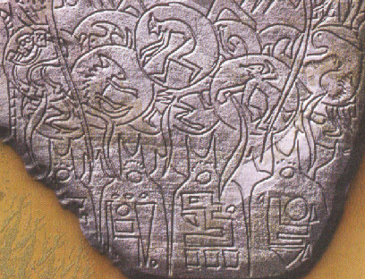
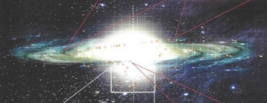
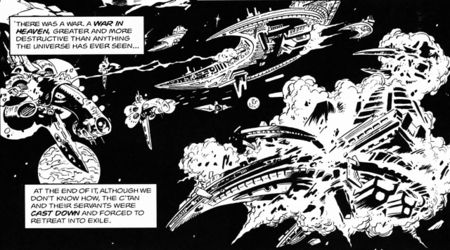
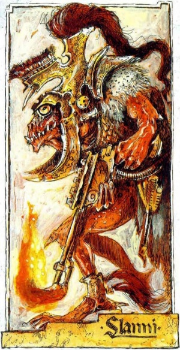

# 0563 古圣 The Old Ones

精校状态：中文行文已逐段精校，部分术语仍为暂定

分类：概念 / 异型 Xenos

原文来源：https://www.bilibili.com/opus/1207621503767543816

原作者：帝国神选罐头

原文时间：2026年05月29日 07:08

[返回分类目录](目录.md) · [全书目录](../../目录.md)

<!-- A0563-B0001 -->
**英文原文**

The Old Ones were an ancient, space-faring, reptilian race who had an advanced civilisation before the development of the Young Races in the current age. They are notable for being the first of all the Galaxy's sentient life as well as being the first race to cross the sea of stars, making them the oldest space-faring species in the Galaxy.

<!-- /A0563-B0001 -->

<!-- A0563-B0002 -->

原译文

古圣是一个古老的、太空旅行的爬行动物种族，在当代年轻种族发展之前，他们已经拥有了先进的文明。它们是银河系中第一个有知觉的生命，也是第一个穿越星海的种族，这使它们成为银河系中最古老的太空旅行物种。

**校订译文**

古圣是古老的爬行类星际种族。如今的年轻种族尚未发展起来时，他们便已建立先进文明。他们被描述为银河最早的智慧生命，也是最先横渡星海的种族，因此是银河中最古老的星际航行文明。

<!-- /A0563-B0002 -->

<!-- A0563-B0003 图片 -->

<!-- A0563-B0004 -->

原译文

Eldar Exodite carving speculated to depict ancient creators with the various species they created 蛮荒灵族雕刻推测描绘了古代创造者及其创造的各种物种

**校订译文**

Eldar Exodite carving speculated to depict ancient creators with the various species they created 蛮荒灵族雕刻，据推测描绘了古老创造者及其创造的各个种族

<!-- /A0563-B0004 -->

<!-- A0563-B0005 -->
## History 历史

<!-- /A0563-B0005 -->

<!-- A0563-B0006 -->
**英文原文**

The Old Ones are said to have had a slow, cold-blooded wisdom, studying the stars and raising astrology and astronomy to an arcane science. It was their understanding of the universe that allowed them to manipulate alternate dimensions and it was known that they undertook great works of psychic engineering. At some unknown point, they crafted the Webway to serve as a conduit through which they could travel to far-flung worlds without suffering from the tides of the Warp. Such was their advanced science that they had the capacity to cross vast tracts of space with a single step by way of Webway portals and through such means they managed to spread their spawn to many other places.

<!-- /A0563-B0006 -->

<!-- A0563-B0007 -->

原译文

据说古圣有着缓慢而冷血的智慧，他们研究群星，将占星术和天文学提升为一门神秘的科学。正是他们对宇宙的理解使他们能够操纵其他维度，众所周知，他们进行了伟大的通灵能工程。在某个未知的时刻，他们精心设计了网道，作为一个通道，通过它他们可以前往遥远的世界，而不会受到亚空间潮汐的影响。这是他们先进的科学，他们有能力通过网道门户一步穿越广阔的太空，并通过这种方式将他们的后代传播到许多其他地方。

**校订译文**

据说，古圣拥有从容而冷静的智慧。他们研究群星，将占星术与天文学发展为深奥的科学。凭借对宇宙的理解，他们能够操纵其他维度，完成宏大的灵能工程。在年代不详的某个时期，他们创造了网道，使自己能避开亚空间潮汐，通达遥远世界。其科学如此先进，只需跨过网道之门，便可一步越过浩瀚星空；他们也借此将后裔散布到各地。

**校注：** cold-blooded wisdom 按爬行种族叙述译为从容冷静的智慧，不额外引申为残酷无情；psychic engineering 修正灵能工程。

<!-- /A0563-B0007 -->

<!-- A0563-B0008 图片 -->

<!-- A0563-B0009 -->

原译文

distant view of the Galaxy 银河系的远景

**校订译文**

distant view of the Galaxy 银河系的远景

<!-- /A0563-B0009 -->

<!-- A0563-B0010 -->
**英文原文**

The Old Ones believed that all life was useful and they are known to have brought about the rise of numerous new species and impregnated thousands of worlds which they made their own. The Old Slann believed that the object of life itself was to perfect their mortal souls, and learned that if an individual's mind was sufficiently powerful that it would remain whole within the Warp after death where it could reincarnate as it wished, provided they were able to resist the diseased consciousnesses of the Powers of Chaos which could consume their identity.

<!-- /A0563-B0010 -->

<!-- A0563-B0011 -->

原译文

古圣相信所有的生命都是有用的，众所周知，他们带来了许多新物种的崛起，并使他们自己创造的数千个世界充满活力。古史兰认为，生命本身的目的是完善他们凡人的灵魂，并了解到，如果一个人的思想足够强大，在死后仍能保持完整，在那里它可以随心所欲地转世，只要他们能够抵抗可能吞噬他们身份的混沌之力的病态意识。

**校订译文**

古圣相信，一切生命皆有其用途。他们促成许多新物种诞生，让数千颗属于自己的世界孕育生命。古史兰则认为，生命的目的在于完善凡人的灵魂。他们发现，若个体心智足够强大，死后便能在亚空间中保持完整，随心转世；前提是能够抵御混沌诸神那些病态意识，免遭其吞噬而失去自我。

**校注：** Old Slann（古史兰）与 Old Ones（古圣）在不同版本材料中角色相近，按本篇末尾版本说明分列，不消去术语差异。

<!-- /A0563-B0011 -->

<!-- A0563-B0012 -->
**英文原文**

As the Old Ones passed through the cosmos, a number of younger and fiercer races developed within their wake, including the Necrontyr, who struggled in their colonisation of other worlds. During this encounter, the ultra-intelligent races of mystics known as the Old Ones were seen to have swiftly colonised other worlds with far greater ease and had an immense longevity to the point of immortality.

<!-- /A0563-B0012 -->

<!-- A0563-B0013 -->

原译文

随着古圣穿越宇宙，许多更年轻、更凶猛的种族在他们的身后发展起来，包括在殖民其他世界中挣扎的惧亡者。在这次相遇中，被称为古圣的超智能神秘主义种族被认为以更大的便利迅速殖民了其他世界，并拥有了不朽的长寿。

**校订译文**

古圣穿行宇宙的同时，许多更年轻、更好战的种族相继崛起，其中便有惧亡者。他们殖民其他星球时举步维艰，却见到古圣这般智慧超群、精通秘术的种族，能轻易迅速地拓殖群星，而且寿命漫长，近乎不朽。

<!-- /A0563-B0013 -->

<!-- A0563-B0014 -->
## The War in Heaven 天堂之战

<!-- /A0563-B0014 -->

<!-- A0563-B0015 -->
**英文原文**

The Necrontyr are known to have petitioned the Old Ones for the secret of eternal life but they refused. This kindled a burning hatred within the Necrontyr, whose harsh sun cursed them with diseased bodies and difficulties in colonising the stars. At this time, the Necrontyr empire was suffering from the Wars of Secession with the various Dynasties battling one another. The ruling council known as the Triarch believed that an external foe would unify their species and their enmity with the Old Ones led to them declaring war upon this ancient race. The temptation of the spoils of victory along with the secrets of immortality saw the separatist kingdoms unite, bringing about a conflict that would become known as the War in Heaven. The jealousy grew, eventually leading to the ancient Necrontyr dedicating their entire civilisation single-mindedly to the goal of the extermination of the Old Ones and their spawn.

<!-- /A0563-B0015 -->

<!-- A0563-B0016 -->

原译文

众所周知，惧亡者曾向古圣祈求永生的秘密，但他们拒绝了。这在惧亡者内部激起了强烈的仇恨，他们严酷的阳光诅咒他们病态的身体和殖民群星的困难。此时，惧亡者帝国正遭受着各王朝之间的分裂战争。被称为三圣的统治议会认为，外部敌人会统一他们的种族，他们与古圣的敌意导致他们向这个古老的种族宣战。胜利战利品的诱惑以及不朽的秘密使分离的王国联合起来，引发了一场被称为天堂之战的冲突。嫉妒心越来越强，最终导致古代惧亡者一心一意地将整个文明奉献给消灭古圣及其后代的目标。

**校订译文**

惧亡者曾向古圣求取永生秘密，遭到拒绝。他们的母星恒星酷烈异常，使族人身患疾病，难以拓殖群星；古圣的拒绝更点燃了他们的仇恨。彼时，惧亡者帝国正陷于各王朝争斗的分裂战争。统治议会“三圣”认为，共同的外敌可以让整个种族重新团结，便借对古圣的敌意向其宣战。战利品与永生秘密的诱惑，使分离的王国再度联合，掀起后来所谓的“天堂之战”。嫉妒日渐加深，最终，惧亡者将整个文明的力量，都投入消灭古圣及其后裔的事业。

<!-- /A0563-B0016 -->

<!-- A0563-B0017 图片 -->

<!-- A0563-B0018 -->

原译文

The War in Heaven 天堂之战

**校订译文**

The War in Heaven 天堂之战

<!-- /A0563-B0018 -->

<!-- A0563-B0019 -->
**英文原文**

Terrible wars were known to have followed this chain of events but all ended with the Necrontyr's inability to vanquish their foes. Despite their advanced technology, they found themselves constantly outmanoeuvred by the Old Ones due to their mastery of Webway portals. Eventually, the Necrontyr were vanquished to such an extent that they were considered little more than an irritation to the Old Ones and forced back to the outer dark of the halo stars where they were forgotten. This imprisonment lasted for centuries. As they sought to find a suitable weapon to unleash upon their foes, the Necrontyr began to study their sun, whereupon they discovered ancient entities that resided on the star. These they made manifest and named C'tan, or star-gods in their language, and used them as their new weapon against the Old Ones. Through the C'tan, the Necrontyr were transformed into a cold machine race of beings that became known as the Necrons. They were now able to pursue their vengeance against their ancient foes. This time, the conflict was far different from the previous wars as the Old Ones' mastery of the Warp was now countered by the C'tan's supremacy of the material universe. In time, the C'tan began to dominate the Galaxy whilst the Old Ones' bastions were besieged and their nurtured races were fed upon like cattle by the eternal hunger of the star-gods. Entire worlds were razed, suns extinguished and entire star systems devoured whole by the terrible C'tan.

<!-- /A0563-B0019 -->

<!-- A0563-B0020 -->

原译文

众所周知，在这一连串事件之后发生了可怕的战争，但所有战争都以惧亡者无法击败敌人而告终。尽管他们拥有先进的技术，但由于他们对网道门户的掌握，他们发现自己不断被古圣所超越。最终，惧亡者被征服到了这样的程度，以至于他们被认为只不过是对古圣的一种烦心事，并被迫回到光环群星的外部黑暗中，在那里他们被遗忘了。这种监禁持续了几个世纪。当他们试图找到一种合适的武器来攻击敌人时，惧亡者开始研究他们的太阳，于是他们发现了居住在恒星上的古代实体。他们把这些显现，并用他们的语言命名为西'坦或星神，并将其作为对抗古圣的新武器。通过星神，惧亡者变成了一个冷酷的机器种族，被称为死灵。他们现在能够对宿敌进行复仇。这一次，这场冲突与之前的战争大不相同，因为古圣对亚空间的掌握现在被星神对物质宇宙的霸权所抵消。随着时间的推移，星神开始统治银河系，而古圣的堡垒被围困，他们培育的种族像牲畜一样被星神永恒的饥饿所吞噬。整个世界被夷为平地，太阳熄灭，整个恒星系统被可怕的星神吞噬。

**校订译文**

惨烈的战争接踵而至，惧亡者却始终无法战胜对手。他们虽技术先进，仍被精通网道传送的古圣一次次抢占先机。最终，惧亡者惨败，沦为古圣眼中不值一提的烦扰，被逐回光环群星边缘的黑暗地带，遭人遗忘。这种困守持续数百年。为寻找足以报复的武器，惧亡者开始研究自己的恒星，并发现栖息其中的古老存在。他们让这些存在获得实体，以本族语言称之为“星神”（C’tan），将其用作对抗古圣的武器。借助星神，惧亡者转化为冰冷的机械种族——太空死灵，重新向宿敌复仇。这次，古圣操控亚空间的力量，遇上了星神支配物质宇宙的权能，战局与从前截然不同。星神逐渐称霸银河，围困古圣堡垒，将其培育的种族当作牲畜吞食，填补永恒的饥渴。一个个世界遭焚毁，恒星被熄灭，整片星系被可怖的星神吞噬。

<!-- /A0563-B0020 -->

<!-- A0563-B0021 -->
**英文原文**

During the war, Necron legions are known to have breached the Webway and assaulted the Old Ones in every corner of the Galaxy. Despite their legendary patience and implacability, the Old Ones began to grow desperate and began breeding new forms of life with an even stronger connection to the Warp, with the intention that these manipulated species would have the power to channel their psychic might to defend themselves. Many warrior races were created in this manner; it is believed that the Eldar, K'nib and Rashan ranked among their number. It took millennia before these new creations were ready and in that time, the C'tan along with their Necron armies extinguished even more life in the cosmos.

<!-- /A0563-B0021 -->

<!-- A0563-B0022 -->

原译文

在战争期间，众所周知，死灵军团已经突破了网道，并在银河系的每个角落袭击了古圣。尽管他们有着传奇般的耐心和执拗，但古圣开始变得绝望，并开始培育与亚空间有着更紧密联系的新生命形态，目的是让这些被操纵的物种有能力引导他们的灵能力量来保护自己。许多战士种族都是以这种方式创造的；据信，灵族、克'尼卜和拉杉在他们的成员中名列前茅。这些新的造物需要数千年的时间才能准备就绪，在那段时间里，星神和他们的死灵军队消灭了宇宙中更多的生命。

**校订译文**

战争中，太空死灵军团攻入网道，在银河各处打击古圣。即便有着传说般的耐性与坚毅，古圣也渐感绝望，开始培育与亚空间联系更紧密的新生命，希望这些经过改造的种族，能驾驭灵能保护自己。许多战士种族由此诞生，据信包括灵族、克尼卜与拉杉。这些造物花了数千年才准备就绪，其间星神与太空死灵大军又抹去了宇宙中更多生命。

**校注：** ranked among their number 指属于其列，原译名列前茅错误增加优劣排名。

<!-- /A0563-B0022 -->

<!-- A0563-B0023 -->
**英文原文**

The Eldar were their greatest students, learning to master the Webway and developing the ability to themselves achieve perfect minds and achieve immortality within the warp: the Eldar were unafraid to die. According to Eldar legend, the paradise the Old Ones had created was now desecrated by the C'tan, whom the Eldar knew as the Yngir. Among their creations also were early Mankind, tree beasts that were part of their ecosystem but otherwise had no greater role defined for them by the Old Ones. This was the time that the Eldar referred to as the God War, fought between the C'tan-supported Necrons and the Old Ones aided by their successor races.

<!-- /A0563-B0023 -->

<!-- A0563-B0024 -->

原译文

灵族是他们最伟大的学生，学习掌握网道，培养自己实现完美心灵和在亚空间中实现不朽的能力：灵族不怕死。根据灵族的传说，古圣创造的天堂现在被星神亵渎了，灵族称星神为因吉尔。他们的造物中还包括早期人类，这些树兽是他们生态系统的一部分，但在其他方面并没有被古圣定义为更大的角色。这是灵族称之为神战的时候，在星神支持下的死灵和在他们的继任者种族帮助下的古圣之间进行。

**校订译文**

灵族是古圣最出色的学生，学会驾驭网道、磨炼完美心智，并在亚空间中保持不朽，因而不畏死亡。按灵族传说，古圣创造的乐土被星神亵渎；灵族将这些存在称为“因吉尔”。古圣的造物还包括早期人类——当时只是生态系统中栖息树间的野兽，古圣未赋予他们更重要的使命。灵族将这个时代称作“神战”：一方是星神支持的太空死灵，另一方是得到后继种族援助的古圣。

**校注：** 早期人类与古圣的关系照所给英文记载；tree beasts 为树栖生物，不把当前人类直接等同现代动物物种。

<!-- /A0563-B0024 -->

<!-- A0563-B0025 -->
**英文原文**

By the time the Old Ones marshalled their forces, there were only four C'tan in existence, but much of life in the Galaxy had already been extinguished. Eventually, the hot-blooded Young Races were unleashed, sending the Necrons reeling as the power of the Warp was an anathema to them and they struggled to contain the advance of this new offensive. In response, the C'tan unified for the first time in millions of years and began the great warding, which was to seal the Empyrean from the material universe forever, thus countering the magicks of the Old Ones.

<!-- /A0563-B0025 -->

<!-- A0563-B0026 -->

原译文

当古圣集结他们的部队时，只有四个星神存在，但银河系中的大部分生命已经灭绝。最终，热血的年轻种族被释放出来，让死灵摇摇欲坠，因为亚空间的力量对他们来说是一种诅咒，他们努力遏制这场新攻势的推进。作为回应，星神在数百万年来首次统一，并开始了大保护，这是为了将至高天永远与物质宇宙隔绝，从而反击古圣的魔法。

**校订译文**

古圣终于集结反攻力量时，星神只剩四位，银河的大部分生命却已被抹灭。热血的年轻种族投入战场，令太空死灵节节败退：亚空间之力是他们的克星，使其难以挡住新攻势。作为回应，星神数百万年来首次联合，启动“大封印”，试图将至高天与物质宇宙永远隔绝，彻底抵消古圣的秘术。

**校注：** 大封印暂译 great warding，明确其意图为隔绝亚空间；仅剩四位星神为该段采用的叙述阶段与版本口径，不概括为全设定恒定数量。

<!-- /A0563-B0026 -->

<!-- A0563-B0027 -->
**英文原文**

However, a seemingly unforeseen side effect of the Old Ones began to manifest in this era as the Young Races' growing pains disturbed the Warp itself with this formless energy coalescing and older warp entities became predatory as the Empyrean began to transform into a more hostile environment. From cracks in reality, the denizens of the Warp sought entry into the material universe which forced the Old Ones to bring about the emergence of new species to defend their last strongholds. Among their creations included the green-skinned, hardy Krork and the technology-mimicking Jokaero. Unfortunately, it was too late by this point with their intergalactic network being breached and with their greatest works and places of power being overrun by the horrors of the Warp brought forth by their own creations. Among the most insidious of these entities were the Enslavers, who dominated the minds of the Young Races in order to create portals for more of their kind. The Enslaver Plague became the final blow for the reign of the Old Ones; they scattered, their power forever broken.

<!-- /A0563-B0027 -->

<!-- A0563-B0028 -->

原译文

然而，在这个时代，随着年轻种族的成长痛苦以这种无形的能量凝聚扰乱了亚空间本身，亚空间的一个看似不可预见的副作用开始显现出来，随着至高天开始转变为一个更加敌对的环境，旧亚空间实体变得具有掠夺性。从现实的裂隙中，亚空间的居民寻求进入物质宇宙，这迫使古圣出现新物种来保卫他们最后的据点。他们的创作包括绿皮、适应力强的古兽人和技术模仿的太空猿猴。不幸的是，到目前为止已经太晚了，他们的星际网络被破坏了，他们的伟大作品和力量之地被他们自己创造的亚空间的恐怖所淹没。其中最阴险的实体是奴役者，他们统治着年轻种族的思想，为更多的同类创造门户。奴役者瘟疫成为古圣统治的最后一击；他们被分散了，他们的力量永远被打破了。

**校订译文**

然而，古圣似乎未曾预料的后果也在此时显现。年轻种族成长中的痛苦扰动亚空间，无形能量汇聚，古老的亚空间生灵变得凶残嗜掠，至高天日益险恶。它们试图穿过现实裂隙，侵入物质宇宙，迫使古圣继续创造新种族，保卫最后据点，其中便有绿皮、强韧的古兽人，以及善于仿造技术的太空猿猴。但此时为时已晚，古圣的星际网络已遭突破，最伟大的工程与力量枢纽，也被自身造物招来的亚空间恐怖吞没。其中最阴险的存在之一是奴役者：它们控制年轻种族的心智，为更多同类打开门户。奴役者瘟疫最终击垮了古圣的统治，使他们四散奔逃，其力量从此一蹶不振。

<!-- /A0563-B0028 -->

<!-- A0563-B0029 -->
## Fate 命运

<!-- /A0563-B0029 -->

<!-- A0563-B0030 -->
**英文原文**

It would be the implacable onslaught of the C'tan combined with the mistakenly unleashed Warp-spawned perils that ultimately led to the Old Ones being defeated, scattered and destroyed. The surviving C'tan and Necrons had the pleasure of seeing the demise of the Old Ones' civilisation, and while the Star Gods feasted on both its remains and one another Szarekh, the Silent King, launched his revolt that shattered the C'tan. In the power vacuum following the war, the lesser creations of the Old Ones such as Mankind were known to have continued to develop but in unforeseen ways. The mantle of galactic dominion would eventually pass to the Eldar, who had fought alongside the Old Ones during the war. This species would survive where the Old Ones did not and would see the Necrons depart into the Great Sleep after they had turned against the C'tan. Legends continued to speak of the Old Ones with the rune-singers of Craftworld Kaelor depicting the Webway as being a construct of this ancient progenitor race who used it to travel through the stars. It is rumoured that the Empathic Obliterator used by the Necron Lord Trazyn the Infinite may be constructed from technology designed by the Old Ones.

<!-- /A0563-B0030 -->

<!-- A0563-B0031 -->

原译文

这是星神的无情攻击，再加上错误释放的亚空间引发的危险，最终导致古圣被击败、分散和摧毁。幸存的星神和死灵很高兴看到古圣的灭亡，当星神享用其遗迹和彼此时，寂静王斯扎拉克发动了叛乱，粉碎了星神。在战争后的权力真空中，众所周知，人类等古圣的较小造物仍在继续发展，但以不可预见的方式发展。银河系的统治权最终将移交给灵族，在战争期间曾与古圣并肩作战。这个物种将在没有古圣的地方生存下来，并将看到死灵在对抗星神后进入大休眠。传说继续谈论古圣，方舟世界凯洛尔的符文歌手将网道描述为这个古老祖先种族的建筑，他们用它来穿越群星。据传，死灵领主无限者塔拉辛使用的移情湮灭杖可能是由古圣设计的技术制造的。

**校订译文**

星神无休止的进攻，加上意外释放的亚空间灾祸，最终令古圣败亡、离散。幸存星神与太空死灵眼看着古圣文明覆灭，得偿夙愿。而在星神吞噬残存生命、又彼此相食之际，寂静王斯扎拉克发动反叛，将星神击碎。战后的权力真空中，人类等古圣未曾重视的造物，继续以出乎意料的方式发展。银河霸权最终落入曾与古圣并肩作战的灵族手中。他们在创造者灭亡后幸存，也见证太空死灵反抗星神，随后进入大休眠。关于古圣的传说仍在流传：凯洛尔方舟世界的符文歌者称，网道由这一古老始祖种族创造，用以穿行群星。另有传闻称，太空死灵领主无尽者塔拉辛所用的移情泯灭杖，可能采用古圣设计的技术制成。

**校注：** Trazyn the Infinite采用官方无尽者塔拉辛；Empathic Obliterator与词表统一移情泯灭杖。

<!-- /A0563-B0031 -->

<!-- A0563-B0032 -->
## List of Young Races 年轻种族列表

<!-- /A0563-B0032 -->

<!-- A0563-B0033 -->
**英文原文**

The Old Ones bio-engineered many of the species of the galaxy, this is a short list of the young races known to have been their creation:

<!-- /A0563-B0033 -->

<!-- A0563-B0034 -->

原译文

古圣生物工程了银河系的许多物种，这是他们创造的年轻种族的简短列表：

**校订译文**

古圣以生物工程培育了银河中的许多物种。已知由其创造的年轻种族，简列如下：

<!-- /A0563-B0034 -->

<!-- A0563-B0035 -->

原译文

Aeldari 灵族

**校订译文**

Aeldari 艾达灵族

<!-- /A0563-B0035 -->

<!-- A0563-B0036 -->

原译文

Jokaero 太空猿猴

**校订译文**

Jokaero 太空猿猴

<!-- /A0563-B0036 -->

<!-- A0563-B0037 -->

原译文

K'nib 克'尼卜

**校订译文**

K'nib 克尼卜

<!-- /A0563-B0037 -->

<!-- A0563-B0038 -->

原译文

Krork 古兽人

**校订译文**

Krork 古兽人

<!-- /A0563-B0038 -->

<!-- A0563-B0039 -->

原译文

Mankind 人类

**校订译文**

Mankind 人类

<!-- /A0563-B0039 -->

<!-- A0563-B0040 -->

原译文

Rashan 拉杉

**校订译文**

Rashan 拉杉

<!-- /A0563-B0040 -->

<!-- A0563-B0041 -->

原译文

Hrud 赫鲁德

**校订译文**

Hrud 赫鲁德

<!-- /A0563-B0041 -->

<!-- A0563-B0042 -->
## Trivia 琐事

<!-- /A0563-B0042 -->

<!-- A0563-B0043 -->
**英文原文**

The Old Ones did not appear in the first edition material of Warhammer 40,000. There was a similar race in their place in the form of the Slann or Old Slann that featured in Warhammer 40,000: Rogue Trader and Codex Titanicus (1st Edition), in which they made early contact with the Eldar and taught them the technology to create the Webway. The former source also states that the Slann were responsible for the genetic manipulation of various races and suggested that the Jokaero are one of their creations. In third edition material, starting with Codex: Necrons, the Old Ones are first mentioned and their backstory elaborated by stating they genetically manipulated early life and fought an ancient war against the Necrons. Future material such as Codex: Eldar (4th Edition) and Codex: Chaos Daemons (4th Edition) also stated that the Old Ones had a hand in teaching the Eldar to make use of the Webway whilst Codex: Dark Eldar (5th Edition) claimed that they actually created it in the first place.

<!-- /A0563-B0043 -->

<!-- A0563-B0044 -->

原译文

《战锤40000》的第一版资料中没有出现古圣。在他们的位置上有一个类似的种族，即《战锤40000：行商浪人和泰坦圣典》（第1版）中出现的史兰或古史兰，他们在早期与灵族接触，并教他们创造网道的技术。前一个消息来源还指出，史兰对各个种族的基因操纵负有责任，并暗示太空猿猴是他们的造物之一。在第三版材料中，从《圣典：太空死灵》开始，首先提到了古圣，并阐述了他们的背景故事，称他们通过基因操纵了早期生命，并与死灵进行了一场古老的战争。《圣典：艾达灵族》（第4版）和《圣典：混沌恶魔》（第4版）等未来的材料也指出，古圣参与了教灵族使用网道，而《圣典:黑暗灵族（第5版）》则声称他们实际上首先创造了网道。

**校订译文**

《战锤40,000》第一版资料中，尚未出现古圣这一设定。当时在《战锤40,000：行商浪人》及第一版《泰坦圣典》中，承担相近角色的是史兰或古史兰：他们曾早期接触灵族，传授建造网道的技术。前一本还称，史兰曾对多个种族进行基因改造，并暗示太空猿猴也是其造物。第三版从《圣典：太空死灵》开始提及古圣，进一步说明他们改造早期生命、与太空死灵展开远古战争的背景。第四版《圣典：灵族》与《圣典：混沌恶魔》也记述古圣教导灵族使用网道；第五版《圣典：黑暗灵族》则明确称，网道最初便由古圣创造。

**校注：** 原译将 Warhammer 40,000: Rogue Trader 与 Codex Titanicus 两本书误合为一个书名；已拆分，保留各版本差别。Eldar旧版书名对应灵族，Aeldari对应艾达灵族。

<!-- /A0563-B0044 -->

<!-- A0563-B0045 图片 -->

<!-- A0563-B0046 -->

原译文

Slanni warrior as depicted in the Warhammer 40,000 4th Edition Rulebook 《战锤40000》第4版规则书中描绘的史兰尼战士

**校订译文**

Slanni warrior as depicted in the Warhammer 40,000 4th Edition Rulebook 《战锤40000》第4版规则书中描绘的史兰尼战士

<!-- /A0563-B0046 -->

<!-- A0563-B0047 -->
**英文原文**

The Old Ones also get a partial mention in the Liber Chaotica "Slaanesh" in the chapter "Echoes of the Birth" where they are called the "First Ones". This section covers the Eldar race, stating that they were raised by figures of shadow and light that were an ancient as well as powerful race. These First Ones are said to be the first to have reached into the starry night and to be older than gods yet mortal as well as subject to time. They are said to have left the Eldar and returned to the sky in order to allow their charges to develop over millennia. Afterwards, they returned in strange, vast vessels that were worn and scarred whilst light dim along with their shadows dispersing. This is because they were engaged in an unending war against the Yngir with the First Ones returning to inspect the Eldar and determine whether they were fit for the battle that lay ahead. The First Ones are known to have encouraged their younger race to focus their psychic abilities in order to create warp-derived beings as weapons against the vampiric gods of starlight. The battle that continued was long and the First Ones dwindled in number to the point that they lost influence among the Eldar. Without their creators' wisdom, the Eldar's warp-beings changed from sentient weapons into living gods of the Immaterium who were the first of their kind. After the absence of the First Ones, the Eldar heroes Eldanesh and Ulthanash proved to be the only beings that could harness the power of the warp gods to battle against their foes until they fled from a daemonic plague. In the aftermath, the Eldar are said to have adapted, refined and perfected the First Ones' skill in measuring the Warp and predicting its movements.

<!-- /A0563-B0047 -->

<!-- A0563-B0048 -->

原译文

在《混沌圣典》的“色孽”的“诞生回响”一章中，也部分提到了古圣，他们被称为“初代”。本节涵盖了灵族种族，指出他们是由一个古老而强大的种族的暗影和光明之人提升的。据说这些初代是第一个进入星光灿烂的夜晚的人，他们比神更古老，但也会死亡，也会受时间的支配。据说他们离开了灵族，回到了天空，以便让他们发展数千年。之后，他们乘坐奇怪的巨大战舰返回，这些战舰已经磨损和伤痕累累，光线昏暗，暗影也渐渐消散。这是因为他们与因吉尔进行了无休止的战争，初代返回审视灵族，并确定他们是否适合未来的战斗。众所周知，初代鼓励他们的年轻种族集中他们的灵能能力，以创造亚空间衍生作为对抗吸血鬼般的星光之神的武器。战斗持续了很长时间，初代的数量逐渐减少，以至于他们在灵族中失去了影响力。没有创造者的智慧，灵族的亚空间生物从有知觉的武器变成了非物质界的活生生的神，他们是同类中的第一个。在初代缺席之后，灵族英雄埃尔达纳什和乌斯拉纳什被证明是唯一能够利用亚空间诸神的力量与敌人作战的，直到他们逃离恶魔瘟疫。之后，据说灵族已经适应、改进和完善了初代在测量亚空间和预测其行动方面的技艺。

**校订译文**

《混沌圣典》的“色孽”卷，在“诞生回响”一章中，也以“初代”之名部分提及古圣。该节讲述灵族由一道道光影般的身影扶植成长；这些身影属于古老而强大的种族。据说，初代最先伸手触及群星，比诸神更古老，却仍会死亡，仍受时间约束。他们离开灵族，回归星空，让这些受其看护的后辈自行发展数千年。后来，初代乘着奇异巨舰归来，舰身破败、伤痕累累，光芒黯淡，阴影消散。他们正与因吉尔鏖战不休，此番返回，是为检视灵族是否已准备好迎接战争。初代鼓励后辈凝聚灵能，创造源自亚空间的生灵，用作对抗那些吸血般吞噬生命的星光之神的武器。战争漫长，初代日渐稀少，在灵族中的影响也随之衰退。失去创造者的智慧引导后，这些有意识的亚空间武器，逐渐变成非物质界中活生生的诸神，是这一类存在中最早的一批。初代消失后，只有灵族英雄埃尔达纳什与乌斯拉纳什能够驾驭这些亚空间诸神，对抗敌人，直到他们被迫躲避一场恶魔瘟疫。此后，据说灵族继承、改进并完善了初代测量亚空间、预判其变化的技艺。

**校注：** 该段叙述出自特定出版物的神话视角，并非独立核实后的唯一历史。

<!-- /A0563-B0048 -->

<!-- A0563-B0049 -->
**英文原文**

Xenology also makes a potential reference to the Old Ones. They are referred to as the Old Gods who lived prior to the birth of Slaanesh when they fought a war in heaven and hell against Star Devils. According to the author Kurdo Salvador, the Star Devils emerged victorious in this war and killed all the Old Gods, though one managed to survive. This survivor hid away where he continued his Old Ways of tweaking, dabbling, poking and prodding. When he was done with his work, he departed into the Warp in order to hide and watch. When "She's" born by the longears, Slaanesh chopped the remaining Old One into millions of pieces with the shards kicked into the cold void in order "to linger like always..." These shattered remnants, according to Salvador, became known as the Umbra. This entity that was sent to linger also shares many qualities to that of Qah, a deity within the Hrud pantheon.

<!-- /A0563-B0049 -->

<!-- A0563-B0050 -->

原译文

异型学也可能为古圣提供潜在的参考。他们被称为古神，生活在色孽诞生之前，当时他们在天堂和地狱与星魔作战。根据作者库尔多·萨尔瓦多的说法，星魔在这场战争中取得了胜利，杀死了所有的古神，尽管有一个设法幸存下来。这位幸存者躲在那里，继续他的旧方法 — 调整、涉猎、探出和催促。当他完成工作后，他离开了亚空间，以便躲藏和观察。当“她”由长耳朵诞生时，色孽将剩下的古圣切成数百万块，碎片踢入寒冷的虚空中，以便“像往常一样苟延残喘……”据萨尔瓦多说，这些破碎的残骸被称为本影。这个被送去苟延残喘的实体也与赫鲁德万神殿中的卡赫有许多共同的品质。

**校订译文**

《异形学》也可能影射古圣。书中称，色孽诞生前曾有“古神”，在天堂与地狱同“星魔”交战。按书内作者库尔多·萨尔瓦多的说法，星魔最终获胜，古神尽被屠戮，唯有一位幸存。他躲藏起来，继续照旧东改西试，摆弄生命与事物。完成工作后，他遁入亚空间，隐匿观察。等“长耳朵”们孕育出“她”——色孽——新神便把这位残存古圣斩成数百万块，将碎片踢入冰冷虚空，让它们“像往常一样苟延残喘……”萨尔瓦多称，这些残片后来被称为“本影”。这位被迫残存的存在，也与赫鲁德神系中的卡赫有许多相似之处。

**校注：** departed into the Warp 指进入亚空间，原译离开亚空间方向相反；Kurdo Salvador是该书叙事中的作者身份，不能当作现实出版作者。

<!-- /A0563-B0050 -->

<!-- A0563-B0051 -->
**英文原文**

Its explained that the C'tan still hold an unbending hatred of the Old Ones despite their civilisation being no more and actively seek out any degenerate descendants that may possibly exist on backwater worlds. Codex: Necrons even suggests that a Lizardmen army can be used as a placeholder for the Old Ones' descendants.

<!-- /A0563-B0051 -->

<!-- A0563-B0052 -->

原译文

它解释说，尽管他们的文明已经不复存在，但星神仍然对古圣怀有坚定不移的仇恨，并积极寻找可能存在于死水世界的任何退化后代。《圣典：太空死灵》甚至建议蜥蜴人的军队可以作为古圣后代的占位者。

**校订译文**

相关资料称，即使古圣文明已经覆灭，星神仍对其怀有顽固的仇恨，积极搜寻偏远世界上可能残存的退化后裔。《圣典：太空死灵》甚至建议，在桌面战棋中，可以用蜥蜴人军队的模型代替这些古圣后裔。

**校注：** backwater worlds 指偏远落后世界，不是死水世界；placeholder指桌面模型替代用途，不是在设定中断言蜥蜴人就是古圣后代。

<!-- /A0563-B0052 -->

本篇核心术语与暂定项

以下列出本篇出现的英文原形及核心术语表用词。同形词可能指不同对象，具体词义以本篇正文和校注为准；单复数、别名和仅见于图注的名称可能尚未列入。完整候选见[术语表](../../术语表/双语术语候选.csv)。

| 英文 | 采用中文 | 状态 |
| --- | --- | --- |
| Chaos Daemons | 混沌恶魔 | 官方已核对 |
| Eldar | 灵族 | 暂定·语境区分 |
| Dark Eldar | 黑暗灵族 | 暂定·旧称对应 |
| Necrons | 太空死灵 | 官方已核对 |
| Warp | 亚空间 | 官方已核对 |
| Webway | 网道 | 暂定 |
| Craftworld | 方舟世界 | 官方已核对 |
| Trazyn the Infinite | 无尽者塔拉辛 | 官方已核对 |
| Empathic Obliterator | 移情泯灭杖 | 暂定 |
| Old Ones | 古圣 | 暂定 |
| Enslaver | 奴役者 | 暂定 |
| Rogue Trader | 行商浪人 | 暂定 |
| Obliterator | 泯灭者 | 官方已核对 |
| Slaanesh | 色孽 | 官方已核对 |
| Halo Stars | 光环群星 | 暂定·官方待核 |
| War in Heaven | 天堂之战 | 暂定·官方待核 |
| Master | 导师（审判庭职衔）／舰务官（舰员职务） | 语境定译·官方待核 |
| Ancient | 旗手 | 官方已核对 |
| Chapter | 战团 | 暂定·官方待核 |
| Remnants | 残骸 | 暂定·官方待核 |
| Mortal | 凡人 | 暂定·官方待核 |
| Powers | 能天使 | 暂定·官方待核 |
| Dominion | 主天使 | 暂定·官方待核 |
| Jokaero | 太空猿猴 | 暂定·官方待核 |
| Old Slann | 古史兰 | 暂定·官方待核 |
| Slann | 史兰 | 暂定·官方待核 |
| Necrontyr | 惧亡者 | 暂定·官方待核 |
| Triarch | 三圣（太空死灵统治议会）／三叉戟成员（钢铁勇士职衔） | 语境定译·官方待核 |
| C'tan | 星神 | 暂定·官方待核 |
| K'nib | 克尼卜 | 暂定·官方待核 |
| Rashan | 拉杉 | 暂定·官方待核 |
| Yngir | 因吉尔 | 暂定·官方待核 |
| God War | 神战 | 暂定·官方待核 |
| great warding | 大封印 | 暂定·官方待核 |
| Krork | 古兽人 | 暂定·官方待核 |
| Enslaver Plague | 奴役者瘟疫 | 暂定·官方待核 |
| Szarekh | 斯扎拉克 | 暂定·官方待核 |
| Kaelor | 凯洛尔 | 暂定·官方待核 |
| First Ones | 初代 | 暂定·官方待核 |
| Liber Chaotica | 混沌圣典 | 暂定·官方待核 |
| Xenology | 异形学 | 暂定·官方待核 |
| Kurdo Salvador | 库尔多·萨尔瓦多 | 暂定·官方待核 |
| Umbra | 本影 | 暂定·官方待核 |
| Qah | 卡赫 | 暂定·官方待核 |
| Hrud | 赫鲁德 | 暂定·官方待核 |
| Great Sleep | 大休眠 | 暂定·官方待核 |
| Necron Lord | 死灵领主 | 暂定·官方待核 |
| The Silent King | 寂静王 | 官方已核对 |
| Vengeance | 复仇号 | 暂定·官方待核 |
| Warhammer 40,000: Rogue Trader | 战锤40000：行商浪人 | 暂定·官方待核 |

