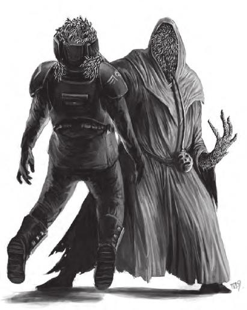
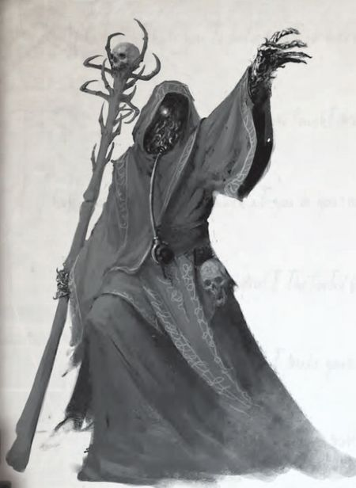
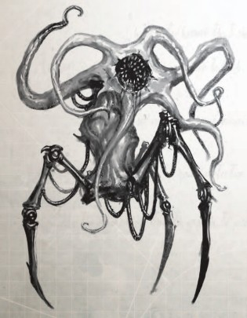

# 0566 史洛斯 Slaugth

精校状态：中文行文已逐段精校，部分术语仍为暂定

分类：概念 / 异型 Xenos

原文来源：https://www.bilibili.com/opus/1181387001708937235

原作者：帝国神选罐头

原文时间：2026年03月19日 14:24

[返回分类目录](目录.md) · [全书目录](../../目录.md)

<!-- A0566-B0001 -->
**英文原文**

The Slaugth are a xenos race, vaguely humanoid in shape, covered in hundreds of half-melded maggot-like worms. Covered in viscous mucus, they are impervious to all but the most extreme injury.

<!-- /A0566-B0001 -->

<!-- A0566-B0002 -->

原译文

史洛斯是一个异型种族，形状有点像人，身上覆盖着数百条半融合的蛆状蠕虫。它们身上覆盖着粘稠的粘液，除了最严重的伤害外，对其他一切都不受影响。

**校订译文**

史洛斯是一种外形近似人类的异形，躯体覆盖着数百条半融为一体的蛆状蠕虫，表面裹有黏稠的黏液。只有最严重的创伤才能伤及它们。

<!-- /A0566-B0002 -->

<!-- A0566-B0003 图片 -->

<!-- A0566-B0004 -->

原译文

A Slaugth consuming a human victim 史洛斯吞吃人类受害者

**校订译文**

A Slaugth consuming a human victim 史洛斯吞吃人类受害者

<!-- /A0566-B0004 -->

<!-- A0566-B0005 -->
## History 历史

<!-- /A0566-B0005 -->

<!-- A0566-B0006 -->
**英文原文**

The Slaugth are believed to be impossibly ancient, likely native to the Calixis Sector long before the arrival of Mankind. Much of their known activity takes place around the region of the Hazeroth Abyss that consists of cursed space and dead stars. Their true homeworld is, however, unknown and may not be located within the Abyss. Their origins are largely unknown to the Imperium though Rogue Traders and xeno-savants believe that any empire that they hold lies far out the Trailing Halo Stars. The circumstances of the first contact between mankind and the Slaugth is unknown, though some sources claim that they have been encountered on the edge of Imperial space as far back as the Age of Strife. The abundance of humans in the galaxy has led to them becoming the favoured prey of the Slaugth. Despite this, they seem content to use infiltration and human agents to bring about their incomprehensible plans.

<!-- /A0566-B0006 -->

<!-- A0566-B0007 -->

原译文

史洛斯被认为古老的不可思议，可能早在人类到来之前就已经是卡利西斯星区的原住民。他们的大部分已知活动都发生在哈冼录深渊周围，该地区由被诅咒的空域和死星组成。然而，他们真正的家园世界是未知的，可能不在深渊内。他们的起源在很大程度上是帝国所不知道的，尽管行商浪人和异型学者认为，他们所拥有的任何帝国都远在光环群星尾部之外。人类与史洛斯第一次接触的情况尚不清楚，尽管一些消息来源声称，早在纷争时代，他们就在帝国空域的边缘遇到过。银河系中大量的人类使他们成为史洛斯最喜欢的猎物。尽管如此，他们似乎满足于使用渗透和人类代理来实现他们难以理解的计划。

**校订译文**

史洛斯被认为古老得难以想象，很可能在人类到来之前，便已生活在卡利西斯星区。已知活动大多集中在哈冼录深渊周边，那是一片遍布诅咒空域与死亡恒星的地区。不过，它们真正的母星尚不为人知，也可能位于深渊之外。帝国对其起源所知甚少，行商浪人与异形学者则推测：如果它们拥有帝国，其疆域应在星系旋转后方的光环群星之外、极为遥远的地方。人类何时首次接触史洛斯，已无从确定；部分资料称，早在纷争时代，人类便在后来帝国疆域的边缘遭遇过它们。银河中人类数量众多，因而成为史洛斯最钟爱的猎物。即便如此，它们似乎仍乐于依靠渗透与人类代理人，实施那些难以理解的计划。

**校注：** Trailing 为银河方位，按星系旋转后方解释，不误读恒星实体尾部；纷争时代早于帝国，Imperial space 在此按后来帝国疆域理解。Hazeroth Abyss 暂沿本稿哈冼录深渊，待官方核对。

<!-- /A0566-B0007 -->

<!-- A0566-B0008 图片 -->

<!-- A0566-B0009 -->

原译文

Intendant Recusant, a former Slaugth leader in charge of portions of the Amaranthine Syndicate for decades 异见监督者，前史洛斯领袖，几十年来负责不凋花企业联合的部分业务

**校订译文**

Intendant Recusant, a former Slaugth leader in charge of portions of the Amaranthine Syndicate for decades 异见监督者：这名史洛斯首领曾掌管不凋花企业联合的部分业务，长达数十年

<!-- /A0566-B0009 -->

<!-- A0566-B0010 -->
**英文原文**

Many of the encounters with these xenos follow the same pattern, with black, tenebrous vessels entering into Imperial space, where they wreak havoc on isolated outposts or shipping lines. The Slaugth's victims are either left behind as mutilated bodies or disappear altogether. In other encounters, the Slaugth give their vile technologies to renegade humans in exchange for slaves. Those Imperial worlds that border the Hazeroth Abyss often tell the stories describing the Slaugth as the "worms that walk", a nightmare that emerges from the depths of the Abyss to kill the living and feast on the dead. Ultimately, however, the upper echelons of the Imperium dismiss them as little more than a myth.

<!-- /A0566-B0010 -->

<!-- A0566-B0011 -->

原译文

许多与这些异型的遭遇都遵循同样的模式，黑色，晦涩的战舰进入帝国空域，在那里它们对孤立的前哨或航运线造成严重破坏。史洛斯的受害者要么留下残缺不全的尸体，要么完全消失。在其他遭遇中，史洛斯将他们肮脏的技术交给变节人类，以换取奴隶。那些与哈冼录深渊接壤的帝国世界经常讲述这样的故事，将史洛斯描述为“行走的蠕虫”，这是一场从深渊深处出现的噩梦，目的是杀死活着的人，吃掉死去的人。然而，最终，帝国高层认为它们只不过是一个虚构的东西。

**校订译文**

与史洛斯的许多遭遇有着相似的经过：幽暗的黑色舰船进入帝国空域，袭击孤立的前哨与航运线路。受害者或只留下残缺的尸体，或消失得无影无踪。还有些时候，史洛斯会向叛离帝国的人类提供邪恶技术，换取奴隶。在哈冼录深渊边缘的帝国世界上，人们常把它们称为“行走的蠕虫”——从深渊中爬出的噩梦，杀戮生者、吞食死者。然而，帝国高层多半将这些传闻视作虚构的怪谈。

<!-- /A0566-B0011 -->

<!-- A0566-B0012 -->
**英文原文**

However, the Inquisition knows that the Slaugth exist. Sealed Inquisitorial archives claim that several frontier worlds in the Segmentum Obscurus have, over millennia, been intentionally thrown into civil war in order to allow the Slaugth to invade and feed on the inhabitants. But even to those that are aware of the Slaugth, the ultimate goal of these inscrutable schemes remains a complete mystery. All that is known is that all the Slaugth seem to abide by this method.

<!-- /A0566-B0012 -->

<!-- A0566-B0013 -->

原译文

然而，审判庭知道史洛斯的存在。密封的审判庭档案声称，数千年来，朦胧星域的几个边境世界被故意投入内战，以便允许史洛斯入侵并以居民为食。但即使对于那些知道史洛斯的人来说，这些难以捉摸的计划的最终目标仍然是一个完全的谜。众所周知，所有的史洛斯似乎都遵循这种方法。

**校订译文**

审判庭却知道，史洛斯确实存在。封存的审判庭档案称，数千年来，朦胧星域的若干边境世界遭人蓄意挑起内战，目的是让史洛斯趁虚而入，吞食居民。但即便是知晓其存在的人，也无法解释这些诡秘计划的最终目的；他们只知道，史洛斯似乎都在采用同一种手段。

<!-- /A0566-B0013 -->

<!-- A0566-B0014 -->
**英文原文**

In truth, the real reason the Slaugth avoid direct confrontation with the Imperium is that Mankind greatly outnumbers them. Whilst individual Humans are no match for a Slaugth, their greater numbers would mean that their kind would suffer a rapid defeat if the Imperium was provoked into open warfare. Despite this being the case, they are known to be preparing for the day when they will attack the Calixis Sector more openly.

<!-- /A0566-B0014 -->

<!-- A0566-B0015 -->

原译文

事实上，史洛斯避免与帝国直接对抗的真正原因是人类的数量远远超过了他们。虽然个体人类不是史洛斯的对手，但如果帝国被挑起公开战争，他们的数量越多意味着他们的同类将迅速失败。尽管如此，众所周知，他们正在为更公开地攻击卡利西斯星区的那一天做准备。

**校订译文**

事实上，史洛斯避免与帝国正面交战，是因为人类在数量上远远超过它们。单个人类固然不是史洛斯的对手，但一旦激怒帝国、引发全面战争，人类的数量优势便足以使史洛斯迅速败北。即便如此，已有迹象表明，它们正为日后公然进攻卡利西斯星区做准备。

**校注：** 原译代词导致败者颠倒；原文明确人类数量占优，全面战争中会迅速失败的是史洛斯。

<!-- /A0566-B0015 -->

<!-- A0566-B0016 -->
**英文原文**

The Storm Wardens Space Marine Chapter is known to have engaged Slaugth and their warrior constructs on Vigil during the events known as the Cleansing of Vigil. This conflict consisted of a series of bloody, close-range firefights, where conditions were so confined that it was impossible to deploy heavy armour. Whilst the Storm Wardens advanced cautiously and methodically, the Slaugth proved to be adept at provoking the Astartes out of such careful tactics. Casualties grew high as the battle raged on and the Storm Wardens morale was sorely tested but, ultimately, they succeeded in cleansing Vigil of the Slaugth threat, though at great cost to themselves.

<!-- /A0566-B0016 -->

<!-- A0566-B0017 -->

原译文

众所周知，风暴守望者星际战士战团在被称为守夜星清洗的事件中，与史洛斯及其战士构造体在守夜星上交战。这场冲突包括一系列血腥的近距离交火，条件非常有限，无法部署重型装甲。虽然风暴守望者谨慎而有条不紊地前进，但事实证明，史洛斯擅长挑起阿斯塔特放弃这种谨慎的战术。随着战斗的持续，伤亡人数越来越多，风暴守望者的士气也受到了严峻的考验，但最终，他们成功地清除了守夜星的史洛斯威胁，尽管为此付出了巨大的代价。

**校订译文**

在“守夜星清洗”中，风暴看守者星际战士战团曾在守夜星与史洛斯及其战士构造体交战。战斗由一连串血腥的近距离交火组成，战场过于狭窄，重型装甲单位无法展开。风暴看守者原本谨慎而有序地推进，史洛斯却擅长挑衅、诱使阿斯塔特放弃稳健的战术。战事持续，伤亡攀升，战团士气也受到严峻考验。最终，风暴看守者付出沉重代价，才将史洛斯的威胁从守夜星清除。

**校注：** Vigil 在此为行星守夜星，区别静默修女警戒团与红蝎空间站警戒堡。 对照本段英文确认同一实体，与全书核心译名统一；不改变同形异义词或省略称呼。

<!-- /A0566-B0017 -->

<!-- A0566-B0018 -->
**英文原文**

In order to feed their constant hunger, the Slaugth have begun to turn their attention to the Calixis Sector and have begun to destabilize the region by fomenting civil war and anarchy. They began by infiltrating the Amaranthine Syndicate when it was a fledgling trade cartel and slowly moved in to control it completely. This patient approach may take several human generations to come to fruition, but it is a plan brilliant in its simplicity, relying on basic human greed. The Slaugth provide humans with technology, wealth, and trinkets, encouraging mankind to tear itself apart over these items. When their plans have sufficiently advanced, they intend to further infiltrate the major criminal, political, and economic organizations of the Imperium, with the Ecclesiarchy and Adeptus Administratum being likely targets. When the appointed time approaches, the Slaugth intend to see the sector collapse in on itself whereupon they will sweep through the region and have their way.

<!-- /A0566-B0018 -->

<!-- A0566-B0019 -->

原译文

为了满足他们持续的饥饿，史洛斯开始将注意力转向卡利西斯星区，并开始通过煽动内战和无政府状态来破坏该地区的稳定。当不凋花企业联合还是一个初出茅庐的贸易企业联盟时，他们开始渗透进来，慢慢地完全控制了它。这种耐心的方法可能需要几代人才能实现，但它是一个简单而巧妙的计划，依赖于人类的基本贪婪。史洛斯为人类提供技术、财富和小饰品，鼓励人类为这些物品而撕裂自己。当他们的计划充分推进时，他们打算进一步渗透帝国的主要犯罪、政治和经济组织，国教和内务部可能是目标。当指定时间临近时，史洛斯打算看着该星区自行崩溃，然后他们将席卷该地区并为所欲为。

**校订译文**

为满足无休止的饥饿，史洛斯将目光投向卡利西斯星区，通过煽动内战、制造混乱，逐步瓦解当地秩序。不凋花企业联合尚是新兴贸易垄断集团时，它们便开始渗透，最终将其完全控制。这项计划可能要经历数代人才能见效，却简单而巧妙：只需利用人类固有的贪婪。史洛斯给予人类技术、财富和奇巧玩物，诱使他们为争夺这些东西自相残杀。等计划推进到一定阶段，它们便准备渗透帝国主要的犯罪、政治与经济组织，国教和内政部很可能成为目标。待时机成熟，整个星区将从内部崩溃，史洛斯便可席卷而来，任意宰割。

**校注：** Adeptus Administratum 统一内政部；贸易组织沿用本稿不凋花企业联合。

<!-- /A0566-B0019 -->

<!-- A0566-B0020 -->
**英文原文**

Many regard these xenos as a nightmarish myth, born as a void-born tale by mad Rogue Traders. The Inquisition knows them to be a real threat, though it has suppressed all knowledge of them for millennia. However, the Holy Ordos remain unaware of the fact that the Amarantine Syndicate is now under the command of the Slaugth. Slaugth activity within the Calixis Sector has also dramatically increased, spreading a network of their agents throughout the region. There is, however, some dissension amongst their ranks with a splinter faction formed by a Slaugth known as Intendant Recusant who has become consumed by his addictive hunger. This entity is known to have broken free from his dark masters, and now leads Slaugth infiltrators, a cadre of constructs and a faction of Humans from the Amaranthine Syndicate, in pursuit of his own goals.

<!-- /A0566-B0020 -->

<!-- A0566-B0021 -->

原译文

许多人认为这些异型是一个梦魇般的神话，是由疯狂的行商浪人编造的一个虚空诞生的故事。审判庭知道他们是一个真正的威胁，尽管几千年来一直压制着对他们的所有了解。然而，神圣修会仍然不知道不凋花企业联合现在由史洛斯指挥。卡利西斯星区内的史洛斯活动也大幅增加，其代理网络遍布整个地区。然而，他们的队伍中存在一些分歧，由一个被称为异见监督者的史洛斯组成的分裂派系已经被他令人上瘾的饥饿所吞噬。众所周知，这个实体已经摆脱了他的黑暗主人，现在领导着来自不凋花企业联合的史洛斯渗透者、一队构造体和一个人类派系，追求自己的目标。

**校订译文**

许多人把史洛斯视为可怕的神话，认为它们不过是疯癫行商浪人在星际航行中编出的怪谈。审判庭知道这一威胁真实存在，却已封锁相关消息数千年。然而，各审判庭仍不知道，不凋花企业联合如今已受史洛斯控制。史洛斯在卡利西斯星区的活动也愈发频繁，代理人网络遍布各地。它们内部并非毫无分歧：一名被称为“异见监督者”的史洛斯，因沉迷于无法满足的饥饿而脱离上级，自立派系。如今，它率领史洛斯渗透者、一支构造体队伍，以及不凋花企业联合中的一批人类，追逐自己的目标。

**校注：** Holy Ordos 指各审判庭，不是神圣修会；英文 Amarantine 为同篇 Amaranthine 的异拼。

<!-- /A0566-B0021 -->

<!-- A0566-B0022 -->
## Overview 概述

<!-- /A0566-B0022 -->

<!-- A0566-B0023 -->
**英文原文**

The Slaugth are known as "maggot men","dream eaters" and the "carrion lords" whose bodies and minds are completely alien to humanity. Their roughly humanoid form stands roughly as large as three meters in height. This body has hundreds of writhing maggot-like worms covered in a viscous, necrotic mucus. These traits allow them to stretch and reform their bodies at will whilst allowing them to move with on obscene boneless fluidity along with the capacity to regenerate at startling speed. Slaugth are impervious to age, disease, poison and are vulnerable to only the most extreme of injuries. Their alien minds are coldly savage and are psychic voids filled with a monstrous hunger for the dead. They are able to produce necrotic fluids from their body tissues, consisting of flesh-eating bacteria and molecular acids able to liquefy flesh or even burn through metal. The strange technology of the Slaugth combined with their unusual appearance has led many to mistakenly believe them to be daemonic beings. They are one of the xenos that conceal their true selves and walk amongst Mankind as if they were Humans themselves.

<!-- /A0566-B0023 -->

<!-- A0566-B0024 -->

原译文

史洛斯被称为“蛆虫人”、“食梦者”和“腐尸领主”，他们的身体和思维与人类完全不相容。它们大致呈人形，身高约三米。这个身体有数百条扭动的蛆状蠕虫，上面覆盖着粘稠的腐败粘液。这些特征使他们能够随意伸展和改造自己的身体，同时使他们能够以惊人的速度以惊人的无骨流动性和再生能力移动。史洛斯不受年龄、疾病、毒药的影响，只容易受到最极端的伤害。他们的异型思维冷酷而野蛮，是充满对死者的巨大饥饿的精神空虚。它们能够从身体组织中产生腐败液体，由食肉细菌和能够液化血肉甚至烧穿金属的分子酸组成。史洛斯的奇怪技术与他们不同寻常的外表相结合，导致许多人错误地认为他们是恶魔。他们是隐藏真实自我并在人类中行走的异型之一，就像他们自己就是人类一样。

**校订译文**

史洛斯又被称为“蛆虫人”“食梦者”和“腐尸领主”，其身体与心智都与人类迥异。它们近似人形，身高可达约三米；躯体由数百条不断蠕动的蛆状蠕虫构成，裹着黏稠、会使组织坏死的黏液。这种结构让它们能随意伸展、重塑身体，以令人作呕的无骨姿态流动，伤口也会迅速再生。衰老、疾病与毒物都无法伤害史洛斯，只有最严重的创伤才对其构成威胁。它们的心智冷酷凶残，在灵能感知中如同一片虚无，却又充满对尸体的无边渴望。它们的身体组织能够分泌致坏死液体，其中含有噬肉细菌与分子酸，足以溶解血肉，甚至蚀穿金属。诡异的技术与骇人的外表，使许多人误以为它们是恶魔。史洛斯也会掩盖真貌，伪装成人类，混迹于人群之中。

**校注：** psychic voids 指灵能层面的空白或虚无，不是精神空虚；保留所给英文证据范围，不额外断言具体基因起源。

<!-- /A0566-B0024 -->

<!-- A0566-B0025 -->
**英文原文**

They are known to be an ageless and patient race with a psyche that is incomprehensible to the human mind though they do share one characteristic that others can understand - namely an addictive hunger. Above all other kinds, the Slaugth crave the dead flesh of other sentient beings, with a particular fetish for consuming cranial matter, which gives them a narcotic experience. Some say that this allows them to consume the memories and knowledge of their victims, and this theory is based in truth. Thus, while the Slaugth gain a more pleasurable narcotic experience from consuming rotting brain matter, they prefer to consume fresher brains for the purpose of gathering information. The memories gained from this process fade within weeks unless reinforced, repeatedly used or externally recorded.

<!-- /A0566-B0025 -->

<!-- A0566-B0026 -->

原译文

众所周知，他们是一个永恒和有耐心的种族，他们的心理是人类无法理解的，尽管他们确实有一个其他人可以理解的特征，即令人上瘾的饥饿。最重要的是，史洛斯渴望其他有情众生的死者血肉，特别迷恋吃颅骨，这给了他们一种麻醉品的体验。有人说，这使他们能够吃受害者的记忆和知识，这一理论是基于事实的。因此，虽然史洛斯从食用腐烂的大脑物质中获得了更愉快的麻醉品体验，但他们更喜欢食用新鲜的大脑来收集信息。从这个过程中获得的记忆会在几周内消失，除非得到加固、反复使用或外部记录。

**校订译文**

史洛斯不受衰老所限，耐心漫长，其心理对人类而言难以理解。不过，它们至少有一种容易辨认的欲望：成瘾般的饥饿。它们尤其渴求其他智慧生物的尸肉，最迷恋吞食脑组织，从中获得类似吸食毒品的快感。有人认为，它们还能借此攫取受害者的记忆与知识，而这种说法确有其事。因此，腐烂的脑组织虽然能带来更强烈的快感，若是为了获取情报，史洛斯仍会选择较新鲜的大脑。除非不断强化、反复调用，或以外部方式记录，这些窃来的记忆会在数周内消退。

**校注：** cranial matter 由后文 brain matter 明确为脑组织，原译颅骨错误；sentient beings 为智慧生物，不是佛教有情众生。

<!-- /A0566-B0026 -->

<!-- A0566-B0027 -->
**英文原文**

Restraint is not considered a virtue within the racial hubris of the Slaugth, and so they do not see their obsessive hunger as interfering with their intellect. They are known to be extremely intelligent, highly resilient and - by human standards - completely evil.

<!-- /A0566-B0027 -->

<!-- A0566-B0028 -->

原译文

在史洛斯的种族傲慢中，克制不被认为是一种美德，因此他们不认为自己的痴迷饥饿会干扰他们的智力。众所周知，他们非常聪明，适应力强，而且按照人类的标准，他们是完全邪恶的。

**校订译文**

傲慢的史洛斯并不将克制视为美德，也不认为对进食的痴迷会妨碍思考。它们极其聪明，生命力顽强，而且依人类的标准而言，邪恶透顶。

<!-- /A0566-B0028 -->

<!-- A0566-B0029 -->
**英文原文**

Among the known Slaugth are the Principals who serve as Overseers of the Amarantine Syndicate though whether they are a leadership caste or particular cabal is unknown. Destructors are capable of taking a human guise and have dedicated themselves to the art of destruction above all other pursuits. Destructors are able to revert to their true forms, a nightmarish mass of writing white forms. Another known rank is the Intendents who also serve as leaders in Slaugth field operations.

<!-- /A0566-B0029 -->

<!-- A0566-B0030 -->

原译文

在已知的史洛斯中，有担任不凋花企业联合监督者的首席，尽管他们是领导阶层还是特定的阴谋团尚不清楚。破坏者能够伪装成人类，并致力于破坏艺术，而不是其他所有追求。破坏者能够恢复到他们的真实形态，一堆噩梦般的白色形态。另一个已知的等级是监督者，他们也是史洛斯现场行动的领导者。

**校订译文**

已知史洛斯中有一类称作“首席”，担任不凋花企业联合的监管者；但它们究竟是统治阶层，还是某个特定的密谋集团，尚不得而知。“破坏者”能够伪装成人类，将钻研毁灭之道置于一切追求之上。它们也能恢复真貌，化作一团噩梦般蠕动的白色虫体。另一个已知职衔是“监督者”，负责领导史洛斯的实地行动。

**校注：** 英文 writing white forms 疑为 writhing white forms 的笔误，按前后文译为蠕动白色虫体。Destructor 是史洛斯成员类别，不机械套用其他阵营兵种官译。

<!-- /A0566-B0030 -->

<!-- A0566-B0031 -->
**英文原文**

The Slaugth have some sort of connection to the vicious Rangdan of the Great Crusade. During the Rangdan Xenocides, they were observed following in the wake of the Rangdan, harvesting the dead and any survivors for their own obscene purposes. The Rangdan have also been described as "Slaugth Murder-Minds".

<!-- /A0566-B0031 -->

<!-- A0566-B0032 -->

原译文

史洛斯与大远征的恶毒的冉丹有某种联系。在冉丹大屠杀期间，人们看到他们紧随冉丹大屠杀之后，为自己的骇人听闻的目的收割死者和幸存者。冉丹也被描述为“史洛斯谋杀思维”。

**校订译文**

史洛斯与大远征期间凶残的冉丹之间，存在某种联系。在冉丹灭绝战争中，人们曾发现它们尾随冉丹行动，收集死者与幸存者，用于不可告人的骇人目的。资料中也曾以“史洛斯杀戮心智”称呼冉丹。

**校注：** follow in the wake of the Rangdan 指尾随冉丹，而非尾随大屠杀；联系程度保持原文不确定性。

<!-- /A0566-B0032 -->

<!-- A0566-B0033 -->
## Technology 技术

<!-- /A0566-B0033 -->

<!-- A0566-B0034 -->
**英文原文**

The Slaugth possess a mastery of biomechanical technology and elemental physics which exceeds that of mankind and perhaps even the Eldar. Among their more mysterious capabilities is the capacity to travel interstellar distances without making use of the Warp. Many of their devices are actually grown or augmented pseudo-living machines which blend both flesh and metal in a functional symbiosis. Their weapons and artefacts appear as products of warp craft to the uninitiated. This keen and terrible grasp of the biosciences allows them to grow entire armies instead of training them. Their array of constructs can be adapted to serve as guards, spies and even as labourers.

<!-- /A0566-B0034 -->

<!-- A0566-B0035 -->

原译文

史洛斯对生物力学技术和元素物理学的掌握超过了人类，甚至可能超过了灵族。它们更神秘的能力之一是能够在不使用亚空间的情况下穿越星际距离。他们的许多设备实际上是生长或增强的伪活机器，将血肉和金属融合在一起，形成功能共生。他们的武器和造物对不熟悉的人来说是亚空间技艺的产物。这种对生物科学的敏锐而可怕的掌握使他们能够培养整个军队，而不是训练他们。他们的一系列构造体可以用来充当守卫、间谍，甚至是劳工。

**校订译文**

史洛斯在生物机械技术与基本物理学方面的造诣，超过人类，甚至可能凌驾于灵族之上。它们最神秘的能力之一，是无需借助亚空间，便能横渡星际。许多设备实为培育或强化而成的半生命机械，让血肉与金属共生、协同运作。不明就里的人，很容易将这些武器与造物误认为亚空间巫术的产物。凭借对生物科学精准而可怕的掌握，史洛斯能够直接培育出整支军队，而无须训练士兵。它们还会改造各种构造体，使其担任卫兵、间谍，乃至劳工。

**校注：** biomechanical 为生物机械，不是生物力学；grow armies 指培育造物军队。

<!-- /A0566-B0035 -->

<!-- A0566-B0036 图片 -->

<!-- A0566-B0037 -->

原译文

Slaugth warrior vassal construct 史洛斯战士奴仆构造体

**校订译文**

Slaugth warrior vassal construct 史洛斯战士奴仆构造体

<!-- /A0566-B0037 -->

<!-- A0566-B0038 -->
**英文原文**

When they desire to pass unseen and conceal their terrifying form, the Slaugth make use of multi-layered robes and mantles known as Shroud Cloaks which absorb as well as refract light. These cloaks seem to writhe and move as if alive, yet they allow their wearers to pass, at a distance, as misshapen humans.

<!-- /A0566-B0038 -->

<!-- A0566-B0039 -->

原译文

当它们想要隐匿行踪，遮掩其骇人形态时，史洛斯会使用多层长袍和被称为寿衣斗篷的斗篷，它们吸收和折射光线。这些斗篷似乎像活着一样扭动和移动，但它们允许穿着者在远处作为畸形人类通过。

**校订译文**

需要隐藏行踪、遮掩骇人真貌时，史洛斯会披上层层长袍，以及被称为“寿衣斗篷”的罩衣。这种织物能够吸收、折射光线，似乎有生命般扭动，让穿戴者从远处看起来，不过是身形畸曲的人类。

<!-- /A0566-B0039 -->

<!-- A0566-B0040 -->
**英文原文**

Shroud Armour is another form of ragged cloak that allows its wearer to disappear from sight by projecting a strange effect that clouds the perceptions of outsiders thus making them practically invisible.

<!-- /A0566-B0040 -->

<!-- A0566-B0041 -->

原译文

寿衣盔甲是另一种形式的破旧斗篷，它通过投射一种奇怪的效果来掩盖外人的感知，从而使他们几乎看不见，从而让穿着者从视线中消失。

**校订译文**

“寿衣护甲”则是另一种褴褛斗篷。它能产生奇异效果，干扰旁人的感知，使穿戴者几乎从视线中消失。

<!-- /A0566-B0041 -->

<!-- A0566-B0042 -->
**英文原文**

Their known weapons include a Necrotic Sceptre, a corroded-looking device that pulses with sickly light and unleashes arcs of eerie moaning energy when fired. Though a potent long-ranged device, it is equally capable of being used as a melee weapon. Other weapons include the little understood Necrotic Beams used on shock-constructs that can turn their targets into dust. A weapon of rank is the Necrotic Lance used by Intendents, a long-bladed spear made of swirling strands of bilious energy. With a simple command, these lances project devastating bolts of energy that can destroy battle tanks.

<!-- /A0566-B0042 -->

<!-- A0566-B0043 -->

原译文

他们已知的武器包括一种坏死权杖，这是一种看起来被腐蚀的装置，发射时会发出病态的光，并释放出可怕的呼啸能量。虽然它是一种强大的远程装备，但同样可以用作近战武器。其他武器包括鲜为人知的坏死光束，用于震荡结构，可以将目标变成灰尘。一种等级武器是监督者使用的坏死长枪，这是一种由旋转的刺眼能量线制成的长刃矛。只需一个简单的命令，这些长枪就会投射出毁灭性的能量，摧毁战斗坦克。

**校订译文**

已知史洛斯武器包括“坏死权杖”：外表如遭腐蚀，闪烁病态的光芒，开火时射出弧状能量，伴随诡异的呜咽声。它既是威力强大的远程武器，也能用于近战。另有一种原理鲜为人知的“坏死光束”，装备于突击构造体，能将目标化为尘埃。监督者还持有象征其地位的“坏死长枪”，长刃由旋绕、色泽病态的能量丝构成。只需一道指令，长枪便能射出毁灭性的能量束，击毁战斗坦克。

**校注：** weapon of rank 表示职衔地位的标志，不是游戏等级武器；shock-construct 按突击用途理解。

<!-- /A0566-B0043 -->

<!-- A0566-B0044 -->
**英文原文**

The Slaught's biomechanical constructs induce revulsion in humans, though they differ widely in appearance; in general, most "Vassals" are asymmetrical floating columns of mottled, fungal-looking flesh, covered with pulsing veins, lattices of metal threadwork, and crystalline studs. Their heads are clusters of waving, frond-like sensory growths with skeletal pincer-limbs forming from the body mass when needed.

<!-- /A0566-B0044 -->

<!-- A0566-B0045 -->

原译文

史洛斯的生物力学构造体引起了人类的反感，尽管它们在外观上差异很大；一般来说，大多数“奴仆”是不对称的漂浮柱，由斑驳的、看起来像真菌的血肉组成，覆盖着脉动的脉络、金属线格和晶体钉。它们的首部是一簇簇挥舞的、叶状的感知器官，在需要时，主体会形成骨骼状的钳肢。

**校订译文**

史洛斯的生物机械构造体外形各异，却都令人类作呕。多数“奴仆”呈不对称的悬浮柱状，由斑驳、宛如真菌的血肉构成，表面遍布搏动的血管、交织的金属线网，以及凸起的晶体。它们的头部是一簇摇曳的叶状感官组织，必要时，躯体还能伸出骨架般的钳肢。

<!-- /A0566-B0045 -->

<!-- A0566-B0046 -->
**英文原文**

A "Harvest" construct appears as a vehicle-sized, amorphous mass of rippling wet flesh that silently floats above the ground. Its mission is to search for sentient matter to consume for its masters, and it pursues this goal with near-mindless persistence, never tiring or relenting. Upon finding a target, a Harvester uses its metallic, pincer-tipped tendrils to pull its prey into its lamprey-like mouth. During this "feeding," the prey's head is separated and preserved in a semi-transparent sack located at the construct's back, storing the brain matter safely for future Slaugth feeding.

<!-- /A0566-B0046 -->

<!-- A0566-B0047 -->

原译文

一个“收割”构造体看起来像一个载具大小的、无定形的、波纹状的湿润血肉，静静地漂浮在地面上。它的使命是寻找有情物质供其主人吃，它以近乎无意识的坚持追求这一目标，永不疲倦或松懈。在找到目标后，收割者会用其金属的、尖钳状的卷须将猎物拉进类似七鳃鳗的嘴里。在这种“进食”过程中，猎物的头部被分开并保存在位于构造体后部的半透明袋中，安全地储存大脑物质，以备将来史洛斯进食。

**校订译文**

“收割者”构造体像一团载具大小、没有固定形状的湿润血肉，表面不断起伏，无声地悬浮在地面上方。它以近乎机械的执着，永不疲倦地寻找智慧生物，为主人搜集食物。发现猎物后，收割者便用末端带有金属钳的触须，将其拖进七鳃鳗般的口器。吞食过程中，猎物头部会被分离，存入构造体背部的半透明囊袋，将脑组织完好保存，留待史洛斯享用。

<!-- /A0566-B0047 -->

<!-- A0566-B0048 -->
**英文原文**

Warrior Vassal Constructs are a more militant version of these biomechnical creations. These pale, oval masses of fungal flesh are filled with purple veins and metal lattices. Movement is provided through three skeletal, spider-like legs with their upper torso consisting of thick, stumpy tubes filled with a mass of tendrils surrounding a radial, fang-filled maw. Each tendril is surprisingly strong and able to stretch into sharp bone blades. These warrior constructs are not limited to their tendrils alone but are also equipped with a beam weapon embedded within their body. This device fires a necrotising beam that is capable of disintegrating a man in seconds.

<!-- /A0566-B0048 -->

<!-- A0566-B0049 -->

原译文

战士奴仆构造体是这些生物力学造物的更激进的版本。这些苍白的椭圆形真菌血肉充满了紫色的脉络和金属格子。运动是通过三条蜘蛛般的骨瘦如柴的腿提供的，它们的上半身由粗壮的短管组成，短管里充满了卷须，卷须围绕着一个充满尖牙的放射状胃。每个卷须都出奇地强壮，能够伸展成锋利的骨刃。这些战士构造体不仅限于它们的触须，还配备了嵌入体内的光束武器。该装置发射的坏死光束能够在几秒钟内解体一个人。

**校订译文**

战士奴仆构造体则是专为战斗培育的生物机械造物。它们由苍白的椭圆形菌状血肉构成，内部布满紫色血管与金属网架，依靠三条蜘蛛般、形似骨架的腿移动。上半身有粗短的管状结构，其中伸出大量触须，环绕着布满尖牙的辐射状巨口。每根触须都异常有力，还能伸展为锋利的骨刃。除触须外，这些战士构造体体内还嵌有光束武器，可发射坏死光束，在数秒内将一名人类分解。

**校注：** maw 是巨口，原译为胃；militant 指战斗用途，不是政治立场激进。

<!-- /A0566-B0049 -->

<!-- A0566-B0050 -->
**英文原文**

Slaugth warships are extremely potent, with their vessels weaponry capable of seriously damaging even a Gloriana Class Battleship in quick order.

<!-- /A0566-B0050 -->

<!-- A0566-B0051 -->

原译文

史洛斯战舰非常强大，他们的战舰武器能够快速重伤荣光女王级战列舰。

**校订译文**

史洛斯战舰火力极其强大，甚至能在短时间内重创荣光女王级战列舰。

<!-- /A0566-B0051 -->

<!-- A0566-B0052 -->
## Known Slaugth 已知史洛斯

<!-- /A0566-B0052 -->

<!-- A0566-B0053 -->

原译文

Intendant Recusant 异见监督者

**校订译文**

Intendant Recusant 异见监督者

<!-- /A0566-B0053 -->

<!-- A0566-B0054 -->

原译文

Miss Book 书籍女士

**校订译文**

Miss Book 书籍女士

<!-- /A0566-B0054 -->

本篇核心术语与暂定项

以下列出本篇出现的英文原形及核心术语表用词。同形词可能指不同对象，具体词义以本篇正文和校注为准；单复数、别名和仅见于图注的名称可能尚未列入。完整候选见[术语表](../../术语表/双语术语候选.csv)。

| 英文 | 采用中文 | 状态 |
| --- | --- | --- |
| Eldar | 灵族 | 暂定·语境区分 |
| Warp | 亚空间 | 官方已核对 |
| Inquisition | 审判庭 | 暂定 |
| Imperium | 帝国 | 暂定·简称 |
| Administratum | 内政部 | 暂定 |
| Adeptus Administratum | 内政部 | 暂定 |
| Ecclesiarchy | 国教会 | 暂定 |
| Great Crusade | 大远征 | 暂定·官方待核 |
| Age of Strife | 纷争时代 | 暂定·官方待核 |
| Murder | 谋杀 | 暂定·官方待核 |
| Segmentum Obscurus | 朦胧星域 | 暂定·官方待核 |
| Segmentum | 星域 | 暂定·官方待核 |
| Sector | 星区 | 暂定·官方待核 |
| Halo Stars | 光环群星 | 暂定·官方待核 |
| Cabal | 密教 | 暂定·官方待核 |
| Obscurus | 朦胧星 | 暂定·官方待核 |
| Mission | 教团／传教机构 | 暂定 |
| Rangdan Xenocides | 冉丹灭绝战争 | 暂定·官方待核 |
| Ancient | 旗手 | 官方已核对 |
| Adept | 帝国任职者（广义）／文吏（行政语境） | 语境定译·官方待核 |
| Lance | 骑士矛阵 | 暂定·官方待核 |
| Vigil | 警戒团（静默修女编制）／警戒堡（红蝎空间站）／守夜星（行星） | 语境定译·官方待核 |
| Cadre | 骨干连（寂静修女）／核心队（钛族） | 语境定译·钛族词根参考 |
| Space Marine | 星际战士 | 暂定·官方待核 |
| Chapter | 战团 | 暂定·官方待核 |
| Storm Wardens | 风暴看守者 | 暂定·官方待核 |
| Gloriana Class Battleship | 荣光女王级战列舰 | 暂定·官方待核 |
| Xenos | 异形 | 暂定·官方待核 |
| Rangdan | 冉丹 | 暂定·官方待核 |
| Slaugth | 史洛斯 | 暂定·官方待核 |
| Hazeroth Abyss | 哈冼录深渊 | 暂定·官方待核 |
| Amaranthine Syndicate | 不凋花企业联合 | 暂定·官方待核 |
| Intendant Recusant | 异见监督者 | 暂定·官方待核 |
| Cleansing of Vigil | 守夜星清洗 | 暂定·官方待核 |
| Shroud Armour | 寿衣护甲 | 暂定·官方待核 |
| Necrotic Sceptre | 坏死权杖 | 暂定·官方待核 |
| Necrotic Lance | 坏死长枪 | 暂定·官方待核 |
| Hubris | 傲慢星 | 暂定·官方待核 |
| Calixis Sector | 卡利西斯星区 | 暂定·官方待核 |
| Shroud | 裹尸布 | 暂定·官方待核 |
| Resilient | 坚韧号 | 暂定·官方待核 |

