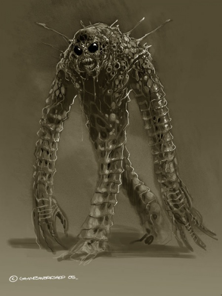
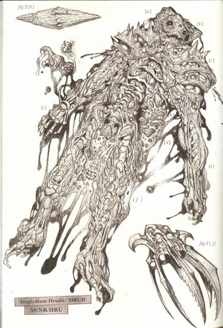
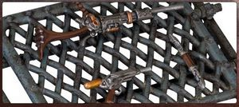
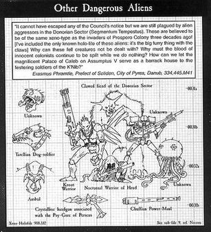
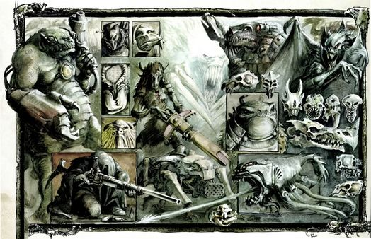
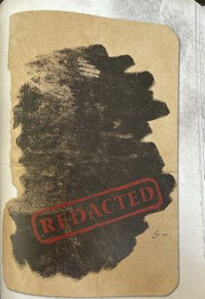

# 0567 赫鲁德 Hrud

精校状态：中文行文已逐段精校，部分术语仍为暂定

分类：概念 / 异型 Xenos

原文来源：https://www.bilibili.com/opus/1180924734353702921

原作者：帝国神选罐头

原文时间：2026年03月18日 08:31

[返回分类目录](目录.md) · [全书目录](../../目录.md)

<!-- A0567-B0001 -->
**英文原文**

The Hrud, (also spelt H'rud) also known as the Temporaferrox or to the Eldar as Those Who Evade the Crone and by the scientific name Troglydium hrudii) are a mysterious xenos race. Described with terms such as chronomantic and chronophagic, they have the ability to manipulate the flow of time through both technological and biological means.

<!-- /A0567-B0001 -->

<!-- A0567-B0002 -->

原译文

赫鲁德（也拼写为赫'鲁德），也被称为铁颞或被灵族称为躲避老妪者，学名为赫鲁迪穴居者）是一个神秘的异型种族。用时间法和时间吞噬等术语描述，它们能够通过技术和生物手段操纵时间流。

**校订译文**

赫鲁德（Hrud，亦拼作 H’rud）是一个神秘的异形种族，又称 Temporaferrox，学名为 Troglydium hrudii。灵族称其为“躲避老妪者”。赫鲁德能通过技术手段与自身的生物特性操纵时间流，因此常被描述为掌握时间秘术、能够吞噬时间的生物。

**校注：** Temporaferrox 与学名暂保留英文，原铁颞和赫鲁迪穴居者均缺乏足以认定正式译名的依据；chronomantic 与 chronophagic 分别指时间秘术与吞噬时间。

<!-- /A0567-B0002 -->

<!-- A0567-B0003 图片 -->

<!-- A0567-B0004 -->

原译文

Speculative artist's impression of a Hrud, minus typical shroud, as taken from various supposed eye witness accounts. 根据各种所谓的目击者描述，艺术家推测出的赫鲁德形象，去掉了其典型的覆盖。

**校订译文**

Speculative artist's impression of a Hrud, minus typical shroud, as taken from various supposed eye witness accounts. 艺术家根据若干自称目击者的描述，推测绘制的赫鲁德形象，未画出其通常披戴的罩衣

<!-- /A0567-B0004 -->

<!-- A0567-B0005 -->
## History 历史

<!-- /A0567-B0005 -->

<!-- A0567-B0006 -->
**英文原文**

The Imperium first encountered the Hrud during the Great Crusade. The earliest Imperial reports labeled them as the 'nocturnal warriors of Hrud', however Xenologist Janus Draik describes the Imperial records as being unclear on whether Hrud was intended as the name of their homeworld or the name of their species. Some describe them as a nocturnal species.

<!-- /A0567-B0006 -->

<!-- A0567-B0007 -->

原译文

帝国在大远征期间首次遇到了赫鲁德。最早的帝国报告将他们标记为“赫鲁德夜行战士”，但异型学家贾纳斯·德雷克将帝国记录描述为不清楚赫鲁德是作为他们家园世界的名称还是他们物种的名称。有人将它们描述为夜行性物种。

**校订译文**

帝国在大远征期间首次遭遇赫鲁德。最早的报告称它们为“赫鲁德夜行战士”；但异形学家贾纳斯·德雷克指出，帝国记录并未说清，“赫鲁德”究竟是该物种的名称，还是其母星之名。部分记述将它们描述为夜行性种族。

<!-- /A0567-B0007 -->

<!-- A0567-B0008 -->
## Timeline of known Hrud encounters 已知遭遇赫鲁德的时间线

<!-- /A0567-B0008 -->

<!-- A0567-B0009 -->
**英文原文**

In 999.M30, the Iron Warriors were tasked with the Sak'trada Deeps Campaign to cleanse and secure the Sak'trada Deeps from Hrud warrens.

<!-- /A0567-B0009 -->

<!-- A0567-B0010 -->

原译文

999.M30，钢铁勇士的任务是进行萨克'特拉达深渊战役，从赫鲁德巢手中清理并保护萨克'特拉达深渊。

**校订译文**

999.M30，钢铁勇士奉命发起萨克特拉达深渊战役，清除该地区的赫鲁德巢穴，确保这一空域安全。

<!-- /A0567-B0010 -->

<!-- A0567-B0011 -->
**英文原文**

In 980.M35, a major Hrud war against the Imperium took place known as the Hrud Rising. The infestations led to the Dark Angels Chapter being deployed against them, but after clearing two of the designated three sectors they withdrew for their own mysterious reasons.

<!-- /A0567-B0011 -->

<!-- A0567-B0012 -->

原译文

980.M35，发生了一场对抗帝国的大规模赫鲁德战争，称为赫鲁德叛乱。这些侵扰导致黑暗天使战团被部署来对付他们，但在清理了指定的三个区域中的两个后，他们出于自己的神秘原因退出了。

**校订译文**

980.M35，赫鲁德与帝国爆发大规模战争，史称“赫鲁德叛乱”。黑暗天使战团受命清除侵扰，却在清理指定的三个星区中的两个后，出于不为外人所知的原因撤走。

<!-- /A0567-B0012 -->

<!-- A0567-B0013 -->
**英文原文**

In 101.M40, a Hrud migration forced an Ork Freeboota Klan from the Edge Void to desperately send their forces at the world of Haakonath where they engaged the Star Phantoms Chapter. The Space Marine forces fought against the Ork attackers and eliminated them thus believing that they had achieved a victory in the defence of their homeworld. However, the Hrud threat began to manifest with a vast temporal-warp rift that was surging into the star system from the outer void. At its vanguard came the massive Hrud migration force that were trapped within the rifts event horizon. Despite putting up a valiant defence, the Star Phantoms were fighting a lost cause. Every misshapen Hrud struck down after coalescing from the shadows was replaced by another dozen, distorting space with their very presence. The presence of the Hrud had notable impacts on Haakonath. The Astartes were forced to evacuate their homeworld, and they remain one of only a handful of Chapters who survived a full-scale Hrud migration alone.

<!-- /A0567-B0013 -->

<!-- A0567-B0014 -->

原译文

101.M40，赫鲁德的迁移迫使来自边缘虚空的欧克海盗氏族绝望地将他们的部队派往哈科纳特世界，在那里他们与星辰幻影战团交战。星际战士与欧克攻击者作战并将其消灭，从而相信他们在保卫家园世界方面取得了胜利。然而，赫鲁德的威胁开始显现，一个巨大的时间扭曲裂隙从外部虚空涌入恒星系统。它的先锋是被困在裂隙事件视界内的大规模赫鲁德移民部队。尽管进行了英勇的防御，星辰幻影仍在为失败的事业而战。每当从阴影中凝聚而成的畸形赫鲁德被击倒，就会有十几只新的出现，它们的存在扭曲了空间。赫鲁德的存在对哈科纳特产生了显著的影响。阿斯塔特被迫撤离他们的家园世界，他们仍然是仅有的几个独自经历了全面赫鲁德迁徙的战团之一。

**校订译文**

101.M40，一次赫鲁德迁徙迫使边缘虚空的欧克海盗氏族走投无路，进攻哈科内斯，与星辰幻影战团交战。星际战士消灭了欧克，一度以为保卫母星的战斗已告胜利。然而，真正的威胁随后显现：一道巨大的时间扭曲裂隙，自星系外围涌来。庞大的赫鲁德迁徙群受困于裂隙的事件视界，却也随之成为攻势的先锋。星辰幻影虽奋勇抵抗，仍无法扭转败局：每杀死一只从阴影中凝聚而出的畸形赫鲁德，便有十余只接替出现，仅凭存在就能扭曲空间。赫鲁德给哈科内斯带来巨大灾变，迫使阿斯塔特撤离母星。星辰幻影也成为极少数独力承受全面赫鲁德迁徙、仍得以幸存的战团之一。

**校注：** Haakonath 与后文 Haakoneth 视为同一母星的异拼，统一哈科内斯，保留英文各自拼写。

<!-- /A0567-B0014 -->

<!-- A0567-B0015 -->
**英文原文**

In M41, Hrud overran the shrine world of Damhal, attracted by the rich veins of crystallised time held in the planet's stasis-crypts. Regiments of Mordian Iron Guard along with Sons of Medusa were dispatched. However, both were overcome by the Hrud's entropic fields. Two Deathwatch Watch Companies from Keep Extremis attacked the Hrud next and were led into battle by eight Deathwatch Dreadnoughts. It was these ancients who lead the final strike upon the Hrud's world warren and endured the accelerated ageing affects of the Hrud's entropic fields long enough to kill their leaders and collapse their tunnels. All eight of the Dreadnoughts were killed - recovered rusted with their biological remains inside reduced to nothing but dust.

<!-- /A0567-B0015 -->

<!-- A0567-B0016 -->

原译文

M41，赫鲁德征服了达姆哈尔圣地世界，被行星静滞地穴中丰富的结晶时间脉所吸引。莫迪安铁卫和美杜莎之子被派遣。然而，这两者都被赫鲁德的熵场所解决。接下来，极端城堡的两个死亡守望连队袭击了赫鲁德，带着八名死亡守望无畏加入战斗。正是这些长者领导了对赫鲁德世界巢的最后一次打击，并忍受了赫鲁德熵场加速老化的影响，时间之长足以杀死他们的领导者并摧毁他们的隧道。所有八名无畏都被杀死了 — 被发现时已经生锈，里面的生物残骸只剩下灰尘。

**校订译文**

M41，赫鲁德被达姆哈尔静滞地穴中丰富的“结晶时间”矿脉吸引，攻陷了这座圣地世界。莫迪安铁卫的多个团与美杜莎之子先后驰援，却都败于赫鲁德的熵场。随后，极端堡派出两个死亡守望守望连，由八台死亡守望无畏机甲率领进攻。正是这些古老战士向遍及星球的赫鲁德巢穴发起最后突击，在加速衰老的熵场中坚持到足以杀死首领、摧毁隧道。然而，八台无畏机甲中的战士也尽数牺牲。回收时，机体已锈蚀不堪，内部的生物遗体只剩尘埃。

<!-- /A0567-B0016 -->

<!-- A0567-B0017 -->
**英文原文**

The Battle of Tavalar occurred from 592-602 M41 where a Hrud infestation was combatted by Imperial Guard on Tavalar. The Kashann Xeno Riders played a pivotal role in defeating the xenos.

<!-- /A0567-B0017 -->

<!-- A0567-B0018 -->

原译文

发生在592-602 M41的塔瓦拉之战，帝国卫队在塔瓦拉与赫鲁德的侵扰战斗。卡尚异型骑兵在击败异型方面发挥了关键作用。

**校订译文**

592—602.M41，帝国卫队在塔瓦拉对抗赫鲁德侵扰，史称塔瓦拉之战。卡尚异形骑兵在击败敌军的过程中发挥了关键作用。

<!-- /A0567-B0018 -->

<!-- A0567-B0019 -->
**英文原文**

A notable engagement with the Hrud came in 783.M41 during the Infestation of Ursula Spinal. The agri-world became subject to a migration. It quickly became infested with its plantations of hydro-crops turning to dust and its defenders ageing fifty years over the span of a few months due to the Hrud's innate entropic fields. To combat the threat, six regiments of Valhallan Ice Warriors made planetfall in order to purge the colony from the infestation. However, a full half of the regiments suffered premature ageing due to contact with the Hrud and were declared unfit for further duty.

<!-- /A0567-B0019 -->

<!-- A0567-B0020 -->

原译文

783.M41，在乌苏拉之脊感染期间与赫鲁德进行了一次引人注目的接触。农业世界成为移民的对象。由于赫鲁德天生的熵场，它的种植园很快便布满了水生作物而后化为尘土，而它的防御者在几个月内老化了50年。为了对抗这一威胁，瓦尔哈拉冰雪战士的六个兵团登陆行星，以清除殖民地的侵扰。然而，由于与赫鲁德接触，整整一半的兵团过早衰老，被宣布不适合继续服役。

**校订译文**

783.M41，赫鲁德大举迁入农业世界乌苏拉之脊。它们天生的熵场迅速席卷当地，种植园中的水培作物化作尘埃，守军更在短短数月内衰老了五十年。六个瓦尔哈拉冰雪战士团登陆行星，清剿侵入殖民地的赫鲁德；但在与它们接触后，整整半数团因过早衰老，被判定无法继续服役。

<!-- /A0567-B0020 -->

<!-- A0567-B0021 -->
**英文原文**

In 0.257.790.M41, a Hrud managed to infest the Emperor Class Battleship Paternus Gloriem. Indentured crewman Selebor Mathias managed to knock it unconscious, whereupon he was interrogated by the Inquisition with the specimen taken for study.

<!-- /A0567-B0021 -->

<!-- A0567-B0022 -->

原译文

0.257.790.M41，一名赫鲁德设法侵扰了帝皇级战列舰荣耀之父号。契约船员塞莱博尔·马蒂亚斯设法将其打昏，于是他被审判庭审讯，并带着进行研究的标本。

**校订译文**

0.257.790.M41，一只赫鲁德潜入帝皇级战列舰荣耀之父号。契约船员塞莱博尔·马蒂亚斯将其击昏；随后，审判庭审讯了这名船员，并带走赫鲁德标本进行研究。

**校注：** 受审讯的是船员，被带走研究的是赫鲁德标本，原译关系混乱。

<!-- /A0567-B0022 -->

<!-- A0567-B0023 -->
**英文原文**

In 844.M41, the Cinchare Hrud Infestation led to engagements with the 39th Cadian of the Imperial Guard on Cinchare This conflict saw the Hrud engage the 1st Company of the Dark Hands Chapter.

<!-- /A0567-B0023 -->

<!-- A0567-B0024 -->

原译文

844.M41，辛查尔赫鲁德入侵导致与辛查尔的帝国卫队第39卡迪亚兵团交战。这场冲突使赫鲁德与黑暗之手战团第一连队交战。

**校订译文**

844.M41，赫鲁德侵入辛查尔，与驻守当地的卡迪亚第三十九团交战。黑暗之手战团第一连也参加了这场冲突。

<!-- /A0567-B0024 -->

<!-- A0567-B0025 -->
**英文原文**

Between 938-985.M41, Commander Ursarkar E. Creed is known to have fought a Hrud migration.

<!-- /A0567-B0025 -->

<!-- A0567-B0026 -->

原译文

在938-985.M41间，指挥官乌萨卡·E·克里德曾与赫鲁德迁徙作战。

**校订译文**

938—985.M41之间，乌萨卡·E.克里德指挥官曾对抗一次赫鲁德迁徙。

<!-- /A0567-B0026 -->

<!-- A0567-B0027 -->
**英文原文**

In M42, during the Fourth Tyrannic War the Hrud are known to be one of the many xenos species caught in the invasion, and either fought against or fled from the advancing Tyranids. Hrud DNA has yet to integrate with a hive fleet.

<!-- /A0567-B0027 -->

<!-- A0567-B0028 -->

原译文

M42，在第四次泰伦战争期间，赫鲁德被认为是入侵中捕获的许多异型种族之一，他们要么与前进的泰伦作战，要么逃离。赫鲁德DNA尚未与虫巢舰队整合。

**校订译文**

M42，第四次泰伦战争期间，赫鲁德与许多异形种族一同卷入泰伦入侵，或抵抗逼近的虫群，或逃离其锋芒。据本篇所述，赫鲁德的 DNA 尚未被任何虫巢舰队吸收利用。

**校注：** caught in the invasion 为卷入入侵，不是被俘；尚未吸收 DNA 只表明此篇采用的记述时间点。

<!-- /A0567-B0028 -->

<!-- A0567-B0029 -->
**英文原文**

Six Craftworlds and four Harlequin Grand Masques came to the defense of Those Who Evade the Crone within the Laevenir Archipelago as Hive Fleet Ouroboros threatened to consume them. This battle continues as War Zone Laevenir.

<!-- /A0567-B0029 -->

<!-- A0567-B0030 -->

原译文

六个方舟世界和四个丑角大假面舞会来到拉维尼尔群岛保护那些逃离老妪的人，因为虫巢舰队乌洛波洛斯威胁要吞噬他们。这场战斗作为拉维尼尔战区继续进行。

**校订译文**

当乌洛波洛斯虫巢舰队威胁拉维尼尔群岛的“躲避老妪者”时，六个方舟世界与四支丑角大剧团前来援助。交战持续，形成了拉维尼尔战区。

**校注：** Grand Masques 在此为丑角作战组织，不是四场假面舞会。

<!-- /A0567-B0030 -->

<!-- A0567-B0031 -->
### Undated 未注明日期

<!-- /A0567-B0031 -->

<!-- A0567-B0032 -->
**英文原文**

The Liber Historica Vangelia accounts that noisome Hrud warrens were amongst the aliens cleansed by the Imperium during the early stages of the Great Crusade.

<!-- /A0567-B0032 -->

<!-- A0567-B0033 -->

原译文

《万杰利亚历史册》记载，在大远征的早期阶段，令人讨厌的赫鲁德巢是被帝国清洗的异型之一。

**校订译文**

《万杰利亚历史册》记载，大远征初期，帝国清剿的异形据点中，便有恶臭的赫鲁德巢穴。

<!-- /A0567-B0033 -->

<!-- A0567-B0034 -->
**英文原文**

At some point, the Hrud are known to had infested Mortenken's World. They were driven from the holy city by the hands of Daenyathos, a legendary philosopher soldier of the Soul Drinkers.

<!-- /A0567-B0034 -->

<!-- A0567-B0035 -->

原译文

在某个时刻，众所周知，赫鲁德已经侵扰了莫滕肯世界。他们被饮魂者的传奇哲学家战士戴尼亚索斯之手赶出了圣城。

**校订译文**

在某个未注明的时期，赫鲁德侵入莫滕肯世界；饮魂者的传奇哲人战士丹尼亚特斯将它们逐出了圣城。

<!-- /A0567-B0035 -->

<!-- A0567-B0036 -->
**英文原文**

The Ultramarines battled the Hrud in the Battle of Ortecha IX which saw Battle Brother Olfric perish. He would be avenged by his comrades that ate the heart of his killer.

<!-- /A0567-B0036 -->

<!-- A0567-B0037 -->

原译文

奥尔特查九号之战中，极限战士与赫鲁德作战，战斗兄弟奥弗里克死亡。他的战友会吃掉凶手的心脏，以此为他报仇。

**校订译文**

奥尔特查九号之战中，极限战士与赫鲁德交战，战斗兄弟奥弗里克阵亡。他的战友后来吃掉凶手的心脏，为他复仇。

<!-- /A0567-B0037 -->

<!-- A0567-B0038 -->
**英文原文**

A number of Hrud were present on Es'Tau and were encountered by the Last Chancers when they infiltrated the Tau Empire as mercenaries.

<!-- /A0567-B0038 -->

<!-- A0567-B0039 -->

原译文

许多赫鲁德出现在艾斯'钛，当他们作为雇佣军渗透到钛帝国时，被最后机会遇到。

**校订译文**

“最后机会”部队以雇佣军身份潜入钛帝国时，曾在艾斯钛遇到一批赫鲁德。

**校注：** 伪装成雇佣军潜入的是 Last Chancers，不是赫鲁德。

<!-- /A0567-B0039 -->

<!-- A0567-B0040 -->
**英文原文**

Farseer Eldrad Ulthran is known to have participated in the prevention of a Hrud infestation of Craftworld Saim-Hann which would have reduced the proud vessel to rotten mulch.

<!-- /A0567-B0040 -->

<!-- A0567-B0041 -->

原译文

众所周知，先知埃尔德拉德·乌斯兰参与了预防方舟世界塞姆-罕的赫鲁德侵扰，这将使这艘骄傲战舰变成腐烂的覆盖物。

**校订译文**

大先知艾尔德拉德·乌瑟兰曾协助阻止赫鲁德侵入塞姆罕方舟世界；若未加阻止，这艘宏伟的方舟便可能化为腐烂残渣。

**校注：** Eldrad Ulthran、Farseer 分别采用 GW-09/GW-10 第6页的艾尔德拉德·乌瑟兰、大先知；前稿别名埃尔德拉德·乌斯兰保留于原译栏。

<!-- /A0567-B0041 -->

<!-- A0567-B0042 -->
**英文原文**

The Ordo Xenos Inquisitor Helynna Valeria is known to have treated with Eldar, Ulumeathi, Draxians, Hrud and scores of other xenos species in order to expand humanity's stores of knowledge.

<!-- /A0567-B0042 -->

<!-- A0567-B0043 -->

原译文

众所周知，攘外修会审判官海伦娜·瓦莱里娅曾处理过灵族、乌鲁米亚、德拉西安、赫鲁德和许多其他异型物种，以扩大人类的知识储备。

**校订译文**

为扩充人类的知识储备，异形审判庭审判官海伦娜·瓦莱里娅曾与灵族、乌卢梅亚蒂人、德拉西安、赫鲁德，以及许多其他异形种族交涉。

**校注：** treated with 指交涉、磋商，不是处理或治疗；Ulumeathi 为种族，区别 Ulumeathic League 联盟名。

<!-- /A0567-B0043 -->

<!-- A0567-B0044 -->
**英文原文**

Numerous Hrud infestations are known to have plagued the region of the Maelstrom.

<!-- /A0567-B0044 -->

<!-- A0567-B0045 -->

原译文

众所周知，许多赫鲁德侵扰一直困扰着大漩涡地区。

**校订译文**

大漩涡地区也曾多次遭受赫鲁德侵扰。

<!-- /A0567-B0045 -->

<!-- A0567-B0046 -->
**英文原文**

At some point, Hrud infested the Delphic mines of Mordant Prime leading to the conflict known as the Plague of Delphic. The 303rd Mordant Acid Dogs engaged the aliens and managed to eliminate them but they suffered heavy losses in the process.

<!-- /A0567-B0046 -->

<!-- A0567-B0047 -->

原译文

在某一时刻，赫鲁德侵扰了莫丹特一号的德尔斐矿区，导致了被称为德尔菲瘟疫的冲突。第303莫丹特强酸狗与异型交战并设法消灭了他们，但在此过程中他们遭受了重大损失。

**校订译文**

赫鲁德曾侵入莫丹特主星的德尔斐矿区，引发“德尔斐瘟疫”。莫丹特强酸犬第三〇三团最终消灭了它们，但也付出沉重代价。

<!-- /A0567-B0047 -->

<!-- A0567-B0048 -->
**英文原文**

Fabius Bile stumbled into a Hrud migration aboard his ship the Vesalius. One of his most prominent New Men at the time, a gland-hound named Igori, slew one of the Hrud single-handed and took its skull as a trophy.

<!-- /A0567-B0048 -->

<!-- A0567-B0049 -->

原译文

法比乌斯·拜尔在他的舰船维萨里号上跌跌撞撞地进入了赫鲁德迁徙。他当时最杰出的新人类之一，一名叫伊戈里的腺体猎犬，单手杀死了一名赫鲁德，并拿走了它的头骨作为战利品。

**校订译文**

法比乌斯·拜尔乘坐维萨里号时，意外闯入一支赫鲁德迁徙群。他当时最出色的“新人类”之一、名叫伊戈里的腺体猎犬，独力杀死一只赫鲁德，并取下头骨作为战利品。

**校注：** single-handed 指独力完成，不是只用一只手。

<!-- /A0567-B0049 -->

<!-- A0567-B0050 -->
## Biology 生理

<!-- /A0567-B0050 -->

<!-- A0567-B0051 -->
**英文原文**

Imperial Xenologists disagree on the physical appearance of the Hrud, with reports varying wildly. The Hrud are notoriously difficult to observe or examine. They possess entropic fields which distort space and time around them, confounding attempts to observe them. Furthermore, upon death their entropic fields rapidly age and liquefy their bodies - making detailing the creatures next to impossible.

<!-- /A0567-B0051 -->

<!-- A0567-B0052 -->

原译文

帝国异型学家对赫鲁德的外貌意见不一，报告也大相径庭。众所周知，赫鲁德很难观察或考察。它们拥有熵场，扭曲了周围的空间和时间，混淆了观察它们的尝试。此外，在死亡后，它们的熵场会迅速老化并液化它们的身体，这使得详细描述这些生物几乎是不可能的。

**校订译文**

帝国异形学家对赫鲁德的外貌意见不一，各种报告差异极大。观察、检验赫鲁德素来困难：它们的熵场会扭曲周围时空，干扰观测；死后，熵场又会使尸体迅速老化、液化，几乎无法留下可供详查的遗体。

<!-- /A0567-B0052 -->

<!-- A0567-B0053 图片 -->

<!-- A0567-B0054 -->

原译文

Dissected remains of a female Hrud specimen 雌性赫鲁德标本的解剖遗骸

**校订译文**

Dissected remains of a female Hrud specimen 雌性赫鲁德标本的解剖遗骸

<!-- /A0567-B0054 -->

<!-- A0567-B0055 -->
**英文原文**

They have been described as being taller than a human, with bulging eyes occupied entirely by black pupils, mandibles in the corners of their mouths, clawed hands, moist skin with no hair, with articulated armour closely fitted to their flexible limbs.. The strange arms of the hrud are articulated like a spine. It is unclear whether these arms end in or are simply equipped with shovel-like digging claws. Unarmed attacks with their arms move in a similar manner to a lashing whip strike.

<!-- /A0567-B0055 -->

<!-- A0567-B0056 -->

原译文

他们被描述为比人类高，凸出的眼睛完全被黑色的瞳孔占据，嘴角含着下颌，带爪子的手，湿润的皮肤没有毛发，关节式盔甲紧密贴合在他们灵活的四肢上。赫鲁德奇怪的手臂像脊柱一样铰接在一起。目前尚不清楚这些手臂的末端是铲子状的挖掘爪，还是仅仅配备了铲子状的挖掘爪。用他们的手臂进行徒手攻击的方式类似于鞭打。

**校订译文**

有记述称，赫鲁德比人类更高，眼球凸出，黑色瞳孔占据整个眼部，嘴角生有颚状器官，双手带爪；皮肤湿润无毛，关节式护甲紧贴柔韧的四肢。它们的手臂如脊柱般由多节结构连接，末端或长有铲形掘爪，或只是装配了这种工具，尚无定论。徒手攻击时，手臂会像长鞭般抽击。

<!-- /A0567-B0056 -->

<!-- A0567-B0057 -->
**英文原文**

They have also been depicted as being crouched, diminutive creatures swathed in rags, their faces obscured by hoods, and possessing rat-like tails.

<!-- /A0567-B0057 -->

<!-- A0567-B0058 -->

原译文

它们也被描绘成蜷缩着的矮小生物，裹着破布，脸被兜帽遮住，拥有老鼠般的尾巴。

**校订译文**

它们也被描绘成蜷缩着的矮小生物，裹着破布，脸被兜帽遮住，拥有老鼠般的尾巴。

<!-- /A0567-B0058 -->

<!-- A0567-B0059 -->
**英文原文**

Making it even more difficult to see their true form, they habitually hide beneath ragged cloaks, made of a misshapen morass of decomposing filth.

<!-- /A0567-B0059 -->

<!-- A0567-B0060 -->

原译文

更难看清它们的真实形态，它们习惯性地躲在破旧的斗篷下，斗篷是由一堆腐烂的污秽组成的畸形沼泽。

**校订译文**

赫鲁德惯常披戴褴褛的斗篷，其上堆积着形状怪异的腐败污物，更让旁人难以看清真貌。

<!-- /A0567-B0060 -->

<!-- A0567-B0061 -->
**英文原文**

A dissection of an adult specimen by Magos Biologis Sharle Darvus revealed that their skeleton comprises few supporting bones but instead consists of multiple interlinked vertebrae-like structures, meaning their neck, spine, fingers and long limbs are all prehensile and can bend in any direction. Their skull was revealed to consist of a semi-silicone resin, with the rest of their skeleton showing evidence of a silicone compound.

<!-- /A0567-B0061 -->

<!-- A0567-B0062 -->

原译文

生物贤者莎尔·达维斯对成年标本的解剖表明，它们的骨骼几乎没有支撑骨，而是由多个相互连接的椎骨状结构组成，这意味着它们的颈部、脊柱、手指和四肢都是可抓握的，可以向任何方向弯曲。他们的头骨被发现是由半硅酮组成的，其余的骨骼显示出硅酮化合物的证明。

**校订译文**

生物贤者莎尔·达维斯对一具成年标本进行解剖，发现其骨架很少依赖长支撑骨，而主要由彼此连接的椎骨状结构组成。因此，颈部、脊柱、手指与长肢均可卷曲抓握，并向任意方向弯折。头骨由一种半硅酮树脂构成，其余骨架也显示出硅酮化合物的成分。

**校注：** 依原文区分 silicone 硅酮与后文 silicate 硅酸盐，不擅自改成现实生物学结论。

<!-- /A0567-B0062 -->

<!-- A0567-B0063 -->
**英文原文**

Dissection evidence reveals their bodies consist of multiple layers of tissue. The outer layers appear necrotic or artificial, consisting of dead skin, artificially introduced waste products, moulds and other organic matter. It was proposed this may serve multiple purposes, such as providing abundant heat from bacterial composting, providing protection as tissue layers act as absorptive padding against trauma, and allowing the production of toxic waste products.

<!-- /A0567-B0063 -->

<!-- A0567-B0064 -->

原译文

解剖证据显示，他们的身体由多层组织组成。外层呈现坏死或人造，由死皮、人为引入的废料、霉菌和其他有机物组成。有人提出，这可能有多种用途，例如从细菌堆肥中提供充足的热量，提供保护，因为组织层可以作为创伤的吸收垫，并允许产生有毒废料。

**校订译文**

解剖还显示，赫鲁德身体具有多层组织。外层似乎已坏死，或由人为添加的物质构成，包括死皮、废弃物、霉菌和其他有机物。研究者推测，这些组织兼有数种用途：细菌分解腐质时提供热量，厚实的组织层缓冲伤害，同时还能制造有毒代谢废物。

<!-- /A0567-B0064 -->

<!-- A0567-B0065 -->
**英文原文**

Dissection evidence also reveals Hrud have large scales, silicate in nature, forming armour. These are coated in fungal, bacterial and unknown structures. The scales appear to channel any toxic waste produced from dermal decomposition in other parts of the body, acting as a poison reservoir. Organic tubules then connect these scales to a Hrud’s fingers, presumably allowing excretion of poisons through the fingers.

<!-- /A0567-B0065 -->

<!-- A0567-B0066 -->

原译文

解剖证据还显示，赫鲁德具有较大的鳞片，本质上是硅酸盐，形成盔甲。这些被真菌、细菌和未知结构包裹。鳞片似乎将皮肤分解产生的任何有毒废料引导到身体的其他部位，充当毒素储备。然后，有机小管将这些鳞片连接到赫鲁德的手指上，可能允许毒素通过手指分泌。

**校订译文**

赫鲁德还有由硅酸盐构成的大型鳞片，形成天然护甲，表面覆盖真菌、细菌与未知结构。这些鳞片似乎会汇集身体其他部位皮层分解产生的有毒废物，充当毒素储库。生物细管将鳞片与手指相连，可能使它们能够从指端排出毒物。

**校注：** 毒物来自身体其他部位并汇入鳞片，原译运输方向相反。

<!-- /A0567-B0066 -->

<!-- A0567-B0067 -->
**英文原文**

The Hrud have four fingers with extreme dexterity. Their fingertips are the sole area of their body where their true dermis is exposed from underneath layers of decomposing matter.

<!-- /A0567-B0067 -->

<!-- A0567-B0068 -->

原译文

赫鲁德有四个手指，非常灵巧。它们的指尖是它们身体的唯一区域，在那里，它们的真皮层从分解物质的底层暴露出来。

**校订译文**

赫鲁德有四根极灵巧的手指。只有指尖露出真正的皮层，身体其余部分都被层层腐败物质覆盖。

<!-- /A0567-B0068 -->

<!-- A0567-B0069 -->
**英文原文**

The Hrud have been described as scuttling creatures, and have been observed to use three limbs for quicker movement, while carrying a weapon in their free hand.

<!-- /A0567-B0069 -->

<!-- A0567-B0070 -->

原译文

赫鲁德被描述为会四处逃窜的生物，有人观察到他们用三条腿移动得更快，同时用右手携带武器。

**校订译文**

赫鲁德移动时常显得急促而轻捷。目击者曾见到它们用三条肢体快速爬行，以余下的一只手持握武器。

**校注：** three limbs 为三条肢体，free hand 为腾出的手，不是三条腿加右手。

<!-- /A0567-B0070 -->

<!-- A0567-B0071 -->
**英文原文**

They are noted as being a nocturnal race, and are known to be attracted to darkness similar to the Dark Eldar. Dissection evidence suggests their eyes are adapted to a nocturnal and subterranean existence, displaying evidence of poor colour vision but extreme sensitivity to light. While they have an inferior smell compared to humans, evidence suggests they have superior hearing and balance.

<!-- /A0567-B0071 -->

<!-- A0567-B0072 -->

原译文

它们被认为是夜行性种族，已知会被类似于黑暗灵族的黑暗所吸引。解剖证据表明，它们的眼睛适应了夜间和地下的生活，显示出色觉不佳但对光线极度敏感的证据。虽然它们的嗅觉不如人类，但有证据表明它们的听力和平衡力更高。

**校订译文**

赫鲁德是夜行性种族，与黑暗灵族相似，偏爱幽暗之处。解剖显示，它们的眼睛适应夜间与地下生活：辨色能力较弱，却对光极其敏感。虽然嗅觉不及人类，其听觉与平衡能力似乎更强。

<!-- /A0567-B0072 -->

<!-- A0567-B0073 -->
**英文原文**

The female gender has a womb-like structure carried externally on a rudimentary tail.

<!-- /A0567-B0073 -->

<!-- A0567-B0074 -->

原译文

雌性有一个子宫状的结构，外部有一条未发育的尾巴。

**校订译文**

雌性赫鲁德的退化尾部外侧，承载着一个子宫状结构。

**校注：** 子宫状结构承载于体外的退化尾部，原译倒置二者关系。

<!-- /A0567-B0074 -->

<!-- A0567-B0075 -->
**英文原文**

The Hrud have reported as having psyker shamans amongst their populations who perform techno-heretical Warpcraft.

<!-- /A0567-B0075 -->

<!-- A0567-B0076 -->

原译文

据报道，赫鲁德在他们的人口中有灵能者萨满，他们使用技术异端巫术。

**校订译文**

据报告，赫鲁德族群中存在灵能萨满，会施展在帝国看来属于技术异端的亚空间秘术。

<!-- /A0567-B0076 -->

<!-- A0567-B0077 -->
## Ssaak 萨阿克

<!-- /A0567-B0077 -->

<!-- A0567-B0078 -->
**英文原文**

The most notable feature of the Hrud is their entropic fields known as Ssaak or "see mist". These mysterious distortion fields surround every Hrud, not just their warriors, are biologically generated from the Hrud themselves, have been labelled as parasitic in function, and alter the fabric of space-time with unpredictable effects.

<!-- /A0567-B0078 -->

<!-- A0567-B0079 -->

原译文

赫鲁德最显著的特征是它们的熵场，被称为萨阿克或“见雾”。这些神秘的扭曲立场围绕着每一个赫鲁德，而不仅仅是他们的战士，是由赫鲁德本身在生物学上产生的，在功能上被标记为依附性的，并以不可预测的效果改变了时空的结构。

**校订译文**

赫鲁德最显著的特征，是被称为“萨阿克”，意为“见雾”的熵场。这种神秘的扭曲力场源于赫鲁德自身的生理活动，环绕每一个个体，而非仅限战士。其作用被形容为具有寄生性质，能够改变时空结构，产生无法预测的影响。

<!-- /A0567-B0079 -->

<!-- A0567-B0080 -->
**英文原文**

The ssaak seem to serve multiple functions for the Hrud, including acting as a form of camouflage, ageing their surroundings and enfeebling their enemies, and providing a shield against attack. The ssaak bends light and time, making the Hrud appear as flickers of black at the heart of a column of shimmering air so that the Hrud can conceal themselves in darkness even while they’re in full light. This ability makes the Hrud appear virtually invisible when stationary.

<!-- /A0567-B0080 -->

<!-- A0567-B0081 -->

原译文

萨阿克似乎为赫鲁德提供了多种功能，包括作为一种伪装，使周围环境老化，削弱敌人，以及提供防御攻击的盾牌。萨阿克使光和时间弯曲，使赫鲁德在闪烁的空气柱的中心看起来像黑色的摇曳，这样即使在完全明亮的情况下，H赫鲁德也可以在黑暗中隐藏自己。这种能力使赫鲁德在静止时几乎看不见。

**校订译文**

萨阿克似乎具有多种用途：掩护赫鲁德的行踪，使周围事物老化、削弱敌人，并抵挡攻击。它扭曲光线与时间，让赫鲁德呈现为一柱闪烁空气中若隐若现的黑影。即便身处明亮环境，它们也能借阴影隐匿；静止时，更几乎无法察觉。

<!-- /A0567-B0081 -->

<!-- A0567-B0082 -->
**英文原文**

Other senses besides sight may be the most reliable for detecting a Hrud presence, as the ssaak appears to alter the composition of the atmosphere, thickening it with accelerated particular motion. Extreme temperature changes such as killing cold and unbearable heat are described as preceding the Hrud. While fighting the Hrud in the Sak'trada Deeps Campaign, the Iron Warriors noted that thermal vision was a more reliable method of detecting and targeting the Hrud, as the Hrud’s ssaak cause a massive heat bleed from their environment, although even in thermal vision, the Hrud were still found to be obscured by a thermal bloom of overclocked atomic activity. The bizzare time-dialatory effects have made the Hrud impossible for Farseers to track within their Skeins of Fate, earning them the name Those Who Evade the Crone in the Aeldari language.

<!-- /A0567-B0082 -->

<!-- A0567-B0083 -->

原译文

除了视觉之外的其他感官可能是检测赫鲁德存在的最可靠的方式，因为萨阿克似乎会改变大气的组成，通过加速的特定运动使其变稠。极端的温度变化，如致命寒冷和难以忍受的高温，被描述为先于赫鲁德。在萨克'特拉达深渊战役中与赫鲁德作战时，钢铁勇士指出，热成像是发现和瞄准赫鲁德的一种更可靠的方法，因为赫鲁德的萨阿克会从他们的环境中引起大量的热渗，尽管即使在热成像中，仍然发现赫鲁德被超频原子活动的热爆发所掩盖。奇怪的时延效应使先知无法在他们的命运之线中追踪到赫鲁德，这为他们赢得了灵族语中躲避老妪者的名字。

**校订译文**

判断赫鲁德是否在附近，视觉以外的感知方式或许更可靠。萨阿克似乎会改变大气构成，加快粒子运动，使空气变得黏稠。致命的寒冷或难以忍受的高热，往往先于赫鲁德出现。萨克特拉达深渊战役中，钢铁勇士发现，热成像较适合探测、瞄准赫鲁德，因为萨阿克会导致环境中的热量大量流失；但即便如此，异常加速的原子活动仍会形成一片热晕，遮蔽它们的身形。这些诡异的时间膨胀效应，甚至使大先知无法循命运之线追踪赫鲁德。因此，艾达灵族称它们为“躲避老妪者”。

**校注：** particular motion 疑为 particle motion，按原子活动上下文译为粒子运动；time-dialatory 为时间膨胀，避免读成普通延迟。

<!-- /A0567-B0083 -->

<!-- A0567-B0084 -->
**英文原文**

The ssaak have an extremely rapid ageing effect on the Hrud’s enemies. During the Sak'trada Deeps Campaign, when encountering the Hrud, the Iron Warrior Harrakis found the ceramite of his gauntlets pitting, as if left out in the elements for five thousand years. He fell down, as his disintegrating flesh poured from the rents opening up in his armour. His death was said to take place in less than a second. Fortreidon, another Iron Warrior who fought in the Sak'trada Deeps Campaign, found his armour underwent a century of decay in mere moments.

<!-- /A0567-B0084 -->

<!-- A0567-B0085 -->

原译文

萨阿克对赫鲁德的敌人有极其迅速的衰老作用。在萨克'特拉达深渊战役中，当遇到赫鲁德时，钢铁勇士哈拉基斯发现他的臂铠上的陶钢出现了凹痕，仿佛被遗弃了五千年。他倒下了，因为他破碎的肉体从盔甲上裂开的裂缝中倾泻而下。据说他的死亡发生在不到一秒钟的时间里。福特雷顿是另一位参加萨克'特拉达深渊战役的钢铁勇士，他发现自己的盔甲在短短几分钟内就经历了一个世纪的腐朽。

**校订译文**

萨阿克能令赫鲁德的敌人急速衰老。萨克特拉达深渊战役中，钢铁勇士哈拉基斯刚与赫鲁德接触，臂铠的陶钢便蚀出凹坑，仿佛已在风雨中暴露五千年。他随即倒下，崩解的血肉从护甲裂口中流出；据说，这一切还不到一秒。同样参加该战役的福特雷顿，也发现自己的护甲在转瞬之间，便经历了一个世纪的腐朽。

**校注：** mere moments 为转瞬，不是原译几分钟；第一位战士不到一秒死亡为独立事件。

<!-- /A0567-B0085 -->

<!-- A0567-B0086 -->
**英文原文**

The ssaak also age the Hrud’s surroundings leading to objects such as crops turning to dust and Humans suffering from premature ageing. The ageing effects are cumulative, growing stronger the more Hrud are in close proximity with one another. During mass migrations, the ssaak are capable of wreaking havoc on entire worlds just by the simple presence of the Hrud. During the Sak'trada Deeps Campaign, the Hrud were documented gathering in large numbers in natural watercourse tunnels which ran beneath an Iron Warriors fortress; this extended their combined ssaak to bathe the fortress in temporal radiation. The fortress rapidly aged and fell into disrepair, as if it had been left abandoned for long millennia. The Hrud then easily breached the worn, broken fortifications.

<!-- /A0567-B0086 -->

<!-- A0567-B0087 -->

原译文

萨阿克还会使赫鲁德周围的环境老化，导致农作物等物体变成灰尘，人类过早衰老。衰老效应是累积的，赫鲁德越靠近，衰老效应就越强。在大规模迁徙期间，萨阿克能够仅仅因为赫鲁德的存在就对整个世界造成严重破坏。在萨克'特拉达深渊战役期间，有记录显示，赫鲁德大量聚集在钢铁勇士堡垒下方的天然水道隧道中；这扩大了他们的联合萨阿克，使堡垒沐浴在时间辐射中。这座堡垒迅速老化，年久失修，仿佛被遗弃了数千年。然后，赫鲁德轻而易举地突破了破旧的防御工事。

**校订译文**

萨阿克也会使周遭环境老化，作物化为尘埃，人类过早衰老。其效应能够叠加：聚集在近处的赫鲁德越多，作用就越强。大规模迁徙时，赫鲁德仅凭自身存在，就足以摧残整个世界。萨克特拉达深渊战役中，大批赫鲁德聚集于钢铁勇士堡垒下方的天然水道，汇合后的萨阿克覆盖堡垒，将其浸没于时间辐射。工事迅速衰败，仿佛已荒废数千年，随后便被赫鲁德轻易突破。

**校注：** 原文叠加强度取决于近处聚集的赫鲁德数量，不只是个体之间距离变小。

<!-- /A0567-B0087 -->

<!-- A0567-B0088 -->
**英文原文**

During their invasion of Haakoneth Hrud forces were able to conjure a temporal rift that slew many Star Phantoms with cruel angles of distortion and even blinded the Chapter Master Omadon Tiresias when a rogue time eddy speared through the bridge of his Battle Barge's Command Deck.

<!-- /A0567-B0088 -->

<!-- A0567-B0089 -->

原译文

在入侵哈康内特期间，赫鲁德部队能够召唤出一个时间裂隙，以残酷的扭曲角度杀死了许多星辰幻影，甚至在一个失常时间漩涡刺穿他的战斗驳船指挥甲板的舰桥时，让战团长奥玛顿·提瑞西阿斯失明。

**校订译文**

入侵哈科内斯时，赫鲁德制造了一道时间裂隙。残酷扭曲的空间几何杀死许多星辰幻影；一道失控的时间涡流更刺穿战团长的战斗驳船舰桥，令奥玛顿·提瑞西阿斯双目失明。

<!-- /A0567-B0089 -->

<!-- A0567-B0090 -->
**英文原文**

The ssaak also act as a shield against attacks. Projectiles colliding with a ssaak will behave in unpredictable ways, often veering off course, accelerating to unbelievable speeds, detonating prematurely or coming apart in a rain of atoms.

<!-- /A0567-B0090 -->

<!-- A0567-B0091 -->

原译文

萨阿克还可以作为抵御攻击的盾牌。与萨阿克碰撞的弹丸将以不可预测的方向运行，通常会偏离轨道，加速到令人难以置信的速度，过早引爆或在原子雨中解体。

**校订译文**

萨阿克还能抵御攻击。进入其中的弹丸会发生无法预料的变化：偏离弹道、加速至匪夷所思的速度、提前引爆，或分解成一阵原子雨。

<!-- /A0567-B0091 -->

<!-- A0567-B0092 -->
**英文原文**

The Hruds own artifacts and bodies seem to be immune from any ageing effects of their ssaak. However, when a Hrud dies its body will rapidly age and liquefy, presumably as it’s no longer protected from its own ssaak.

<!-- /A0567-B0092 -->

<!-- A0567-B0093 -->

原译文

赫鲁德自己的造物和身体似乎对其萨阿克的任何衰老影响都免疫。然而，当赫鲁德死亡时，它的身体会迅速衰老和液化，可能是因为它不再受到自身萨阿克的保护。

**校订译文**

赫鲁德自身的身体与造物，似乎不受萨阿克加速老化的影响。但个体一旦死亡，尸体便会迅速衰败、液化，可能是因为失去了抵御自身熵场的保护。

<!-- /A0567-B0093 -->

<!-- A0567-B0094 -->
## Society 社会

<!-- /A0567-B0094 -->

<!-- A0567-B0095 -->
**英文原文**

The Hrud are a secretive race, often living in parallel with other races. In Imperial culture, rumours abound of secret societies beneath cities, beneath the engine-stacks of Imperial vessels and between the tiers of the most ancient hives. Such stories are often dismissed as tales of bogeymen meant to scare infants.

<!-- /A0567-B0095 -->

<!-- A0567-B0096 -->

原译文

赫鲁德是一个神秘的种族，经常与其他种族平行生活。在帝国文化中，关于城市下面、帝国战舰的发动机组下面和最古老的巢都层之间的秘密社团的谣言比比皆是。这些故事往往被视为旨在吓唬婴儿的妖怪故事而被忽视。

**校订译文**

赫鲁德行事隐秘，常与其他种族生活在同一地区，却不为对方所知。帝国流传着许多故事，声称城市地下、星舰引擎群下方、古老巢都的层间缝隙，隐藏着不为人知的族群。这类传闻往往被视为吓唬孩童的怪谈。

<!-- /A0567-B0096 -->

<!-- A0567-B0097 -->
**英文原文**

The Hrud live in tunnel-cities, known as "Juuntak", often near the greatest centres of human population. These subterranean tunnels stretch hundreds of kilometres through the rock of planets. Each chamber and tunnel of their warrens runs into the next, with doors rarely used. The walls of such tunnels have been described as glassily surfaced, seemingly impervious to the constant tremors that beset Hrud worlds. Within their warrens, known chambers built by the Hrud include worship chambers, family burrows, and archives.

<!-- /A0567-B0097 -->

<!-- A0567-B0098 -->

原译文

赫鲁德居住在被称为“朱恩塔克”的隧道城市，通常靠近人口最密集的中心。这些地下隧道穿过行星的岩石，绵延数百公里。他们巢穴的每个房间和隧道都通向下一个房间，很少使用门。这些隧道的墙壁被描述为玻璃表面，似乎不受困扰赫鲁德世界的持续震动的影响。在他们的巢穴中，赫鲁德建造的已知房间包括礼拜室、家庭洞穴和档案室。

**校订译文**

赫鲁德的隧道城市称为“朱恩塔克”，往往建在人类人口最密集的聚居中心附近。隧道穿过行星岩层，绵延数百公里，巢穴中的房室、通道彼此相接，很少设门。墙面被形容为玻璃般光滑，似乎不受赫鲁德世界持续震动的影响。已知内部设施包括礼拜室、家庭洞穴与档案室。

**校注：** 玻璃般光滑仅为表面描述，不擅自认定墙体材料是玻璃。

<!-- /A0567-B0098 -->

<!-- A0567-B0099 -->
**英文原文**

They are a migratory race. A "Poh-ha" is a mass migration triggered by population growth. When the population of a single tribe reaches a particular level of saturation, a number of members schism by stowing away in the spaces of transports and Space Hulks to form new tribes in some distant place. However, the Hrud also have migration ships of their own. The Hrud can also live a nomadic lifestyle, with entire nomadic nations having flourished in the areas between decks of Imperial vessels.

<!-- /A0567-B0099 -->

<!-- A0567-B0100 -->

原译文

他们是一个迁徙种族。“波-哈”是由人口增长引发的大规模移民。当一个部落的人口达到特定的饱和水平时，许多成员会通过在运输工具和太空废船的空间中躲藏起来，在某个遥远的地方形成新的部落，从而分裂。然而，赫鲁德也有自己的移民舰。赫鲁德也可以过着游牧的生活方式，整个游牧民族都在帝国战舰甲板之间的地区蓬勃发展。

**校订译文**

赫鲁德有迁徙的习性。“波哈”指人口增长触发的大规模迁徙：当部落成员超过一定数量，一部分个体便会离群，藏入运输船或太空废船，前往远方建立新部落。它们也拥有自己的迁徙舰。另有些赫鲁德终生漂泊，甚至在帝国星舰甲板之间，形成繁盛的游牧国度。

<!-- /A0567-B0100 -->

<!-- A0567-B0101 -->
**英文原文**

They are a scavenger race, as exemplified by the Respectable Salvager's Nocturnal Consortium, and experts at assembling a mongrel collection of weapons and devices from whatever resources they have at their disposal.

<!-- /A0567-B0101 -->

<!-- A0567-B0102 -->

原译文

他们是一个拾荒种族，如受人尊敬的打捞者夜行联合体，以及擅长利用手头一切资源，将各种武器和装置杂乱无章地组装在一起的专家。

**校订译文**

赫鲁德是拾荒种族，“受人尊敬的打捞者夜行联合体”便是例证。它们擅长利用手边的一切资源，拼装出五花八门的武器与装置。

<!-- /A0567-B0102 -->

<!-- A0567-B0103 -->
**英文原文**

They tend to be fiercely tribal, and ancestry and family-ties are all important to the Hrud. However, when groups split for a migration it is believed such groups rarely maintain contact, as they lack the means to do so. The Hrud are known to take other species such as Humans into their tribes where they're given the role of a "Zanhaad", a sort of slave-pet. Genestealer Contagii are known to exist within Hrud communities.

<!-- /A0567-B0103 -->

<!-- A0567-B0104 -->

原译文

他们往往具有强烈的部落色彩，祖先和家庭关系对赫鲁德来说都很重要。然而，当群体因迁徙而分裂时，人们认为这些群体很少保持联系，因为他们缺乏这样做的手段。众所周知，赫鲁德会将人类等其他物种带入他们的部落，在那里他们被赋予“赞哈德”的身份，一种奴隶宠物。已知基因窃取者感染者存在于赫鲁德社会内。

**校订译文**

赫鲁德具有强烈的部落意识，极重祖先与家族纽带。不过，据推测，迁徙时分出的群体通常缺乏远距离联络手段，此后便很少往来。赫鲁德也会将人类等其他种族带入部落，赋予其“赞哈德”的身份，即兼具奴隶与宠物性质的角色。其聚落中还发现过基因窃取者感染者。

<!-- /A0567-B0104 -->

<!-- A0567-B0105 -->
**英文原文**

The Hrud are known to build archives. They have demonstrated an unparalleled fastidiousness in the field of record-keeping where they compile vast stores of historical, cultural and technical records. These records are stored in their warrens within archive areas, which they treat as precious and will defend in battle against invaders. One of the items the Hrud will take on a migration is the "Raheed" or "Masstribe" which is the amassed knowledge of their tribe.

<!-- /A0567-B0105 -->

<!-- A0567-B0106 -->

原译文

众所周知，赫鲁德会建立档案。他们在记录保存领域表现出无与伦比的挑剔，他们汇编了大量的历史、文化和技术记录。这些记录存储在他们的巢穴中的档案区，他们认为这些很珍贵，并将在与入侵者的战斗中加以保护。赫鲁德人在迁徙时会携带的项目之一是“拉希德”或“大部落”，这是他们部落积累的知识。

**校订译文**

赫鲁德极重档案，对记录保存的细致近乎无以复加，积累了大量历史、文化与技术资料。它们将档案珍藏于巢穴中的专门区域，遭入侵时会奋力保卫。迁徙必带之物中，有一项叫“拉希德”，又称“大部落”，指的便是整个部落积累的知识。

<!-- /A0567-B0106 -->

<!-- A0567-B0107 -->
## Religion 宗教

<!-- /A0567-B0107 -->

<!-- A0567-B0108 -->
**英文原文**

According to the Hrud’s religion, their race were created by the Slah-haii who intended for them to bask in the sun and be fruitful, but were changed into a nocturnal scavenger race when their God Qah foresaw the dangers they would face.

<!-- /A0567-B0108 -->

<!-- A0567-B0109 -->

原译文

根据赫鲁德的宗教，他们的种族是由斯拉-哈伊创造的，他打算让他们沐浴在阳光下并繁衍生息，但当他们的神卡赫预见到他们将面临的危险时，他们变成了夜行拾荒种族。

**校订译文**

按赫鲁德的信仰，它们由斯拉哈伊诸神创造，原本应在阳光下生活、繁衍。后来，神祇卡赫预见到将来的危险，才将它们改造为夜间活动的拾荒种族。

<!-- /A0567-B0109 -->

<!-- A0567-B0110 -->
**英文原文**

Hrud religion worships a benevolent pantheon of gods known as the Slah-haii or "most ancient" including Qah, as well as a horned hunter, a red-handed figure, a laughing jester, and a hammer-weilding artisan. Their gods entered into a war against the Yaam-khoh or "Mirror Devils" which saw all Slah-haii but Qah either slain, crippled or forced to flee.

<!-- /A0567-B0110 -->

<!-- A0567-B0111 -->

原译文

赫鲁德宗教崇拜被称为斯拉-哈伊或“最古老者”的众神，包括卡赫，以及一个有角的猎手、一个红手的人物、一个笑着的弄臣和一个挥舞锤子的工匠。他们的神与雅姆-科或“镜像魔鬼”开战，他们看到除了卡赫之外的所有斯拉-哈伊都被杀害、残废或被迫逃离。

**校订译文**

赫鲁德崇拜仁慈的斯拉哈伊诸神，意为“最古老者”。其中包括卡赫、一名有角的猎手、一位赤手神祇、笑语弄臣，以及持锤的工匠。他们曾与雅姆科——“镜像魔鬼”——开战；除卡赫外，众神或遭杀戮，或被致残，或被迫逃亡。

**校注：** 红手、弄臣、工匠等保持神话描述，不无依据直接等同灵族具体神名。

<!-- /A0567-B0111 -->

<!-- A0567-B0112 -->
**英文原文**

Their legends say that only a single member of the Slah-haii still exists known as Qah or "He Who Lingers". Around 500,000 years ago, Qah is said to have told the Hrud that he had other great works to attend to and disappeared. However, he said that he would return to reunite at the time of the "Raheed-skeh" which was the appointed time when the tribes would come together for a final battle against the Yaam-khoh.

<!-- /A0567-B0112 -->

<!-- A0567-B0113 -->

原译文

他们的传说说，斯拉-哈伊中只有一个成员仍然存在，被称为卡赫或“徘徊者”。据说，大约50万年前，卡赫告诉赫鲁德，他还有其他伟大作品要处理，然后消失了。然而，他说，他将在“拉希德-斯凯”时返回团聚，这是诸部落联合起来与雅姆-科进行最后一场战斗的指定时间。

**校订译文**

赫鲁德传说称，斯拉哈伊诸神中，如今唯有卡赫尚存，又称“徘徊者”。约五十万年前，卡赫告诉赫鲁德，自己还有其他伟业要完成，随后便消失了。他曾许诺，将在“拉希德斯凯”到来时回归，重新召集各部落。届时，赫鲁德将合而为一，与雅姆科展开最后决战。

<!-- /A0567-B0113 -->

<!-- A0567-B0114 -->
**英文原文**

Inquisitor Maturin Ralei noted the similarity in the Hrud pantheon with other xenos species, including the Eldar.

<!-- /A0567-B0114 -->

<!-- A0567-B0115 -->

原译文

审判官马图林·拉莱指出，赫鲁德万神殿与包括灵族在内的其他异型物种有相似之处。

**校订译文**

审判官马图林·拉莱注意到，赫鲁德的神系与灵族等其他异形种族的神系存在相似之处。

<!-- /A0567-B0115 -->

<!-- A0567-B0116 -->
## Technology 技术

<!-- /A0567-B0116 -->

<!-- A0567-B0117 -->
**英文原文**

The Hrud are master scavengers, said to be able to assemble weapons and devices from whatever resources they have at their disposal.

<!-- /A0567-B0117 -->

<!-- A0567-B0118 -->

原译文

赫鲁德是拾荒大师，据说他们能够从手头的任何资源中组装武器和装置。

**校订译文**

赫鲁德是拾荒大师，据说他们能够从手头的任何资源中组装武器和装置。

<!-- /A0567-B0118 -->

<!-- A0567-B0119 -->
**英文原文**

The most common ranged weapon wielded by the Hrud is a Fusil, which is a form of musket that uses phasic plasma technology or warp-plasma. The plasma energy projected by such a weapon is green in colouration and blinks in and out of existence, phasing between realspace and the warp, able to materialise inside of its target in order to bypass armour and destroy its victim from within. According to Inquisitor Kryptman, fusils are a simple symbiosis between melta and plasma technology that are able to fire columns of fire hotter than a star. Fusils remain one of the few scant artifacts of the Hrud that occasionally come up for sale in the Imperium and were also in high demand. Those weapons that find themselves on the black market are modified to accept Imperial plasma cells though if the mechanism itself is badly damaged then it cannot be repaired by human hands.

<!-- /A0567-B0119 -->

<!-- A0567-B0120 -->

原译文

赫鲁德最常用的远程武器是连射枪，这是一种使用相位等离子技术或次元等离子的枪。这种武器投射的等离子能量呈绿色，在真实空间和亚空间之间闪烁，能够在目标内部显现，从而绕过盔甲并从内部摧毁受害者。根据审判官克里普特曼的说法，连射枪是热熔和等离子技术之间的简单共生关系，能够发射比恒星更热的火柱。连射枪仍然是赫鲁德为数不多的造物之一，偶尔在帝国中出售，需求量也很大。那些在黑市上发现的武器经过改装，可以接受帝国等离子容器，尽管如果该机械装置本身严重受损，那么它就无法用人手修复。

**校订译文**

赫鲁德最常用的远程武器是“相位火枪”（Fusil，原稿又称连射枪、连发枪），一种采用相位等离子或亚空间等离子技术的火枪。其射出的绿色能量在现实与亚空间间闪现，可在目标内部重新显现，绕过护甲，从体内摧毁受害者。审判官克瑞普特曼认为，这种武器只是将热熔与等离子技术结合，便能喷出比恒星更炽热的火柱。相位火枪是少数偶尔流入帝国市场的赫鲁德造物，需求甚高。黑市货品通常经过改装，可使用帝国等离子能量匣；但若内部机构严重损坏，人类便无法修复。

**校注：** Fusil 不含连射或连发之义，按此篇明确的相位技术暂定相位火枪，保留原别名；并非官方已核名。

<!-- /A0567-B0120 -->

<!-- A0567-B0121 -->
**英文原文**

During the Sak'trada Deeps Campaign, the Hrud were seen to use various forms of other weaponry that could distort space-time. The Hrud created focused temporal vortices which could rapidly age their targets, rotting them from the inside out. They also possessed cannons able to shunt targets thousandths of a second along their own time stream and out of synchronicity with the planet's motion, causing victims to become fused with objects around them. They deployed melee warriors who wielded weapons described as twin blades of light smoking with entropic dissolution. The Iron Warriors who attempted to block such blades saw their own weapons immediately age and disintegrate after contact, while those unfortunate enough to be stabbed by such blades exploded as their bodies forced themselves into impossible shapes. Some Iron Warriors stabbed by such blades were even witnessed to rapidly age backwards, causing their bodies to reject their Space Marine implants. The Hrud also deployed other mysterious warriors and weapons. These included odd, flexible-limbed walkers armed with bulbous cannons, warriors in suits of scabrous living armour, and strange things that may have been machine or flesh or both.

<!-- /A0567-B0121 -->

<!-- A0567-B0122 -->

原译文

在萨克'特拉达深渊战役中，人们看到赫鲁德使用了各种形式的其他武器，这些武器可能会扭曲时空。赫鲁德创造了集中时间漩涡，可以迅速使目标衰老，从内到外腐烂它们。他们还拥有炮，能够沿着自己的时间流让目标分流千分之一秒，与行星的运动不同步，导致受害者与周围的物体融合。他们部署了近战战士，他们挥舞着被描述为带有熵解的双刃轻烟武器。试图阻挡这种刀刃的钢铁勇士看到他们自己的武器在接触后立即老化并分解，而那些不幸被这种刀刃刺伤的人则在身体迫使自己变成不可能的形状时爆炸了。一些被这种刀刃刺伤的钢铁勇士甚至被目睹迅速回退，导致他们的身体排斥他们的星际战士植入物。赫鲁德还部署了其他神秘的战士和武器。这些包括奇怪的、四肢灵活的步行者，他们手持鳞茎状的大炮，穿着粗糙的活盔甲的战士，以及可能是机器或血肉或两者兼而有之的奇怪东西。

**校订译文**

萨克特拉达深渊战役中，赫鲁德还使用了许多能够扭曲时空的武器。它们制造集中的时间涡流，让目标迅速衰老、由内而外腐烂；一些火炮则将目标沿自身时间线推移千分之几秒，使其与行星运动失去同步，结果与周围物体嵌合在一起。近战战士持有成对的光刃，刃上烟雾翻卷，带着熵解之力。钢铁勇士试图格挡时，武器一经接触便老化崩毁；被刺中的战士，身体则扭成不可能的形状，随即爆裂。还有人急速返老还童，乃至身体排斥星际战士植入器官。赫鲁德还投入其他奇异兵员与兵器：配备球茎状火炮、肢体柔韧的步行机，身着粗糙活体护甲的战士，以及难辨究竟是机械、血肉还是二者混合的怪异造物。

**校注：** twin blades of light 为成对光刃，原译双刃轻烟错误；千分之几秒而非恰好千分之一秒；age backwards 指返老还童。

<!-- /A0567-B0122 -->

<!-- A0567-B0123 -->
**英文原文**

Hrud make use of crystaline prisms to store and convey information, etched through unknown means with internal character-glyphs.

<!-- /A0567-B0123 -->

<!-- A0567-B0124 -->

原译文

赫鲁德利用晶体棱镜来存储和传递信息，通过未知的方式蚀刻出内部字符形。

**校订译文**

赫鲁德以晶体棱镜储存、传递信息，并用未知手段，在晶体内部刻入文字与符号。

<!-- /A0567-B0124 -->

<!-- A0567-B0125 -->
**英文原文**

The Hrud also possess the ability to bottle their Ssaak and even barter it with other races in various non-Imperial interstellar markets.

<!-- /A0567-B0125 -->

<!-- A0567-B0126 -->

原译文

赫鲁德也有能力将他们的萨阿克装瓶，甚至在各种非帝国星际市场与其他种族进行交换。

**校订译文**

赫鲁德也有能力将他们的萨阿克装瓶，甚至在各种非帝国星际市场与其他种族进行交换。

<!-- /A0567-B0126 -->

<!-- A0567-B0127 -->
## Interstellar Travel 星际航行

<!-- /A0567-B0127 -->

<!-- A0567-B0128 -->
**英文原文**

The Hrud appear to utilise multiple forms of interstellar travel including a strange, warp-based technology that allows them to walk between worlds, and space ships including Migration Ships, weird agglomerations of plated fungal matter, and vessels possessing their own entropic fields, comparable to the ssaak and capable of distorting space-time, ageing their surroundings, and acting as a shield against attacks.

<!-- /A0567-B0128 -->

<!-- A0567-B0129 -->

原译文

赫鲁德似乎利用了多种形式的星际航行，包括一种奇怪的、基于亚空间的技术，使他们能够在世界之间行走，还有太空舰，包括移民舰、奇怪的镀层真菌物质块，以及拥有自己的熵场的战舰，与萨阿克相当，能够扭曲时空，老化周围环境，并充当抵御攻击的盾牌。

**校订译文**

赫鲁德似乎采用多种星际航行方式：一种奇异的亚空间技术，使它们能步行往来于不同世界；它们也使用迁徙舰、由覆甲菌质聚合成的怪船等星际船只。部分舰船具有类似萨阿克的熵场，可扭曲时空、使周围事物老化，并抵挡攻击。

<!-- /A0567-B0129 -->

<!-- A0567-B0130 -->
**英文原文**

The Hrud have a method of travel described as focused spears of temporal energy that propel themselves through space-time. During the Sak'trada Deeps Campaign as Gugann crumbled and the Hrud evacuated the planet, repeated Hrud foray parties boarded the Imperial ships as stowaways, traveling through space and entering the craft through some unknown means that breached the ship’s walls undetected. Imperial forces formed hourly purgation teams, sweeping out-of-the-way corners of the decks for infestations.

<!-- /A0567-B0130 -->

<!-- A0567-B0131 -->

原译文

赫鲁德有一种航行方式，被描述为时间能量的聚焦矛，推动自己穿越时空。在萨克'特拉达深渊战役中，随着古甘的崩溃和赫鲁德撤离行星，赫鲁德多次突袭，作为偷渡者登上帝国舰船，穿越太空，并通过一些未知的方式进入飞船，这些未知的方式在未被发现的情况下突破了飞船的墙壁。帝国部队每小时组建一支净化小队，清扫甲板角落的侵扰。

**校订译文**

赫鲁德还有一种交通方式，被形容为将时间能量聚成矛状，推动自身穿越时空。萨克特拉达深渊战役中，古甘濒临崩溃，赫鲁德撤离行星。它们的多支先遣队反复偷渡帝国舰船，穿越虚空，以某种未知手段悄无声息地穿过舰壁。帝国部队因此组织清剿小队，每小时巡查甲板的偏僻角落，搜捕潜入者。

<!-- /A0567-B0131 -->

<!-- A0567-B0132 -->
**英文原文**

Finally, a massive Hrud ship was witnessed erupting from Gugann as the Hrud evacuated the dying planet. The ship was described as the size of a continent, breaking free from the planet by using the substance of the world itself as fuel. As the giant vessel became space-bourne, the migration ships formed a formation around it resembling a hollow cube. Painfully bright arcs of light leapt from the migration ships and joined them to the giant vessel. A moment later, all the Hrud vessels blinked out of existence. In the fleet’s place was a temporal collapse as their departure tore a hole in space-time. The Iron Warriors ships caught in the temporal wave created by the collapse were hit by unpredictable time distortion, some aged a million years in a moment, others found their crews aged to dust in seconds, still others accelerated backwards at unimaginable speed until they vanished or disappeared into disassociated particles.

<!-- /A0567-B0132 -->

<!-- A0567-B0133 -->

原译文

最后，当赫鲁德撤离垂死的行星时，一艘巨大的赫鲁德舰从古甘喷出。这艘船被描述为大陆大小，通过使用世界本身的物质作为燃料，从行星上挣脱出来。当这艘巨型战舰前往太空边界时，移民船在它周围形成了一个类似空心立方体的编队。令人痛苦的光弧从移民船上骤增，将他们连接到这艘巨大的战舰上。片刻之后，所有的赫鲁德战舰都消失了。舰队的空间暂时崩溃，因为他们的离开在时空中撕开了一个洞。被坍塌产生的时间波困住的钢铁勇士舰船受到了不可预测的时间扭曲的打击，一些飞船瞬间老化了一百万年，另一些飞船发现船员在几秒钟内就化为尘土，还有一些飞船以难以想象的速度向后加速，直到它们不复存在或消失在分离的粒子中。

**校订译文**

撤离垂死的古甘时，一艘大陆般庞大的赫鲁德巨舰破土而出。它以行星本身的物质作燃料，挣脱大地。巨舰进入太空后，迁徙舰在其周围组成空心立方体般的阵列，刺眼的电弧状光芒跃出，将各舰与巨舰相连。转瞬之间，所有赫鲁德船只都消失了。它们离去时撕裂时空，原处随即发生时间坍缩。冲击波席卷钢铁勇士舰船，造成无法预料的时间畸变：有的舰体瞬间老化百万年；有的全体船员数秒内化为尘埃；还有的以难以想象的速度向后加速，直至消失，或离散为粒子。

**校注：** space-bourne 指进入太空，不是前往太空边界；temporal collapse 是时间坍缩，不是暂时崩溃。

<!-- /A0567-B0133 -->

<!-- A0567-B0134 -->
## Trivia 琐事

<!-- /A0567-B0134 -->

<!-- A0567-B0135 -->
**英文原文**

In the Necromunda Zone Mortalis Underhive Market set (released 2021) which included a gun rack with a musket very closely resembling the Hrud Fusil depicted in the 6th and 3rd Edition Rulebooks.

<!-- /A0567-B0135 -->

<!-- A0567-B0136 -->

原译文

在涅克罗蒙达死亡地带下巢市场套装（2021年发布）中，其中包括一个带步枪的枪架，与第6版和第3版规则书中描述的赫鲁德连发枪非常相似。

**校订译文**

2021年推出的《涅克罗蒙达》死亡区域下巢市场模型套装中，枪架上的一把火枪，与第三版及第六版规则书描绘的赫鲁德相位火枪十分相似。

**校注：** 模型与插画相似属于原文推测，未断言官方确认；apparent 因此译疑似。 对照本段英文确认同一实体，与全书核心译名统一；不改变同形异义词或省略称呼。

<!-- /A0567-B0136 -->

<!-- A0567-B0137 图片 -->

<!-- A0567-B0138 -->

原译文

An apparent Hrud Fusil 一个明显的赫鲁德连发枪

**校订译文**

An apparent Hrud Fusil 一把疑似赫鲁德相位火枪的模型

<!-- /A0567-B0138 -->

<!-- A0567-B0139 -->
## Conflicting sources 来源冲突

<!-- /A0567-B0139 -->

<!-- A0567-B0140 -->
**英文原文**

Sources conflict on the exact appearance of the Hrud. What is known singularly is the Hrud like to wear cloaks.

<!-- /A0567-B0140 -->

<!-- A0567-B0141 -->

原译文

消息来源对赫鲁德的确切外观存在冲突。众所周知，赫鲁德喜欢穿斗篷。

**校订译文**

不同资料对赫鲁德的具体外形说法不一；共同点是，它们习惯披戴斗篷。

<!-- /A0567-B0141 -->

<!-- A0567-B0142 图片 -->

<!-- A0567-B0143 -->

原译文

A 'Nocturnal Warrior of Hrud' from the Warhammer 40,000 3rd Edition Rulebook 《战锤40000第三版规则书》中的“赫鲁德夜行战士”

**校订译文**

A 'Nocturnal Warrior of Hrud' from the Warhammer 40,000 3rd Edition Rulebook 《战锤40000第三版规则书》中的“赫鲁德夜行战士”

<!-- /A0567-B0143 -->

<!-- A0567-B0144 -->
**英文原文**

The Warhammer 40,000 3rd Edition Rulebook (published 1998) was the first published image of a Hrud - depicted as a crouched, diminutive creature swathed in rags, and possessing a rat-like tail. This appearance recurred in the Warhammer 40,000 6th Edition Rulebook (published 2012) which included an image of a cloaked Hrud with rifle and tail.

<!-- /A0567-B0144 -->

<!-- A0567-B0145 -->

原译文

《战锤40000第三版规则书》（1998年出版）是第一本出版赫鲁德图片的，描绘的是一种蜷缩着的小生物，裹着破布，拥有老鼠般的尾巴。这种外观在《战锤40000第六版规则书》（2012年出版）中再次出现，其中包括一张带步枪和尾巴的隐形赫鲁德的图片。

**校订译文**

1998年出版的《战锤40,000》第三版规则书，首次刊登赫鲁德图像：一种弯腰蹲伏、身形矮小的生物，裹着破布，拖着鼠类般的尾巴。2012年的第六版规则书再次采用相近形象，画中赫鲁德披着斗篷，手持长枪，尾巴外露。

**校注：** cloaked 为披斗篷，不是隐形。

<!-- /A0567-B0145 -->

<!-- A0567-B0146 图片 -->

<!-- A0567-B0147 -->

原译文

A similar looking Nocturnal Warrior of Hrud (bottom left) from the Warhammer 40,000 6th Edition Rulebook 《战锤40000第六版规则书》中一位长相相似的赫鲁德夜行战士（左下）

**校订译文**

A similar looking Nocturnal Warrior of Hrud (bottom left) from the Warhammer 40,000 6th Edition Rulebook 《战锤40000第六版规则书》中一位长相相似的赫鲁德夜行战士（左下）

<!-- /A0567-B0147 -->

<!-- A0567-B0148 -->
**英文原文**

Xenology (Background Book)(published 2006) contradicts this appearance, with a tail-less upright swamp-monster style creature with long, flexible limbs said to hide its true form under a ragged cloak of decomposing filth. This appearance is corroborated in Perturabo: The Hammer of Olympia (Novel)(published 2017)

<!-- /A0567-B0148 -->

<!-- A0567-B0149 -->

原译文

《异型学》（背景书）（2006年出版）与这种外观相矛盾，它是一种没有尾巴的直立沼泽怪物式生物，有着长而灵活的四肢，据说它的真实形态隐藏在腐烂污垢的破旧斗篷下。《佩图拉博：奥林匹亚之锤》（小说）（2017年出版）证实了这一点

**校订译文**

2006年背景设定书《异形学》采用另一种相矛盾的外形：没有尾巴、直立行走的沼泽怪物，四肢细长柔韧，真貌藏在由腐败污物构成的褴褛斗篷之下。2017年小说《佩图拉博：奥林匹亚之锤》也采用这一描述。

<!-- /A0567-B0149 -->

<!-- A0567-B0150 -->
**英文原文**

Liber Xenologis (published 2021) incorporated this idea of conflicting sources into the in-universe lore, stating from an in-universe perspective that there are wildly varying Imperial reports on the Hrud's physical appearance, and displaying a redacted entry in place of a Hrud figure.

<!-- /A0567-B0150 -->

<!-- A0567-B0151 -->

原译文

《异型册》（2021年出版）将这种相互冲突的来源的想法融入了宇宙内的传说中，从宇宙内的角度指出，帝国对赫鲁德的外表有各种各样的报告，并显示了一个经过编辑的条目来代替赫鲁德的形象。

**校订译文**

2021年的《异形志》（Liber Xenologis）将资料冲突本身纳入设定：以书中人物的视角说明，帝国关于赫鲁德外形的报告差异极大，并用一则经过删隐处理的条目，取代明确的赫鲁德图像。

**校注：** redacted 指删隐信息，不是节选修订；Liber Xenologis 暂译异形志，区别 Xenology 异形学。不同版外形差异保留。

<!-- /A0567-B0151 -->

<!-- A0567-B0152 图片 -->

<!-- A0567-B0153 -->

原译文

Redacted Hrud in Liber Xenologis 在《异型册》中节选修订的赫鲁德

**校订译文**

Redacted Hrud in Liber Xenologis 《异形志》中经过删隐处理的赫鲁德条目

<!-- /A0567-B0153 -->

本篇核心术语与暂定项

以下列出本篇出现的英文原形及核心术语表用词。同形词可能指不同对象，具体词义以本篇正文和校注为准；单复数、别名和仅见于图注的名称可能尚未列入。完整候选见[术语表](../../术语表/双语术语候选.csv)。

| 英文 | 采用中文 | 状态 |
| --- | --- | --- |
| Dark Angels | 黑暗天使 | 官方已核对 |
| Deathwatch | 死亡守望 | 官方已核对 |
| Imperial Guard | 帝国卫队 | 暂定·语境区分 |
| Aeldari | 艾达灵族 | 官方已核对 |
| Eldar | 灵族 | 暂定·语境区分 |
| Dark Eldar | 黑暗灵族 | 暂定·旧称对应 |
| Tyranids | 泰伦虫族 | 官方已核对 |
| Psyker | 灵能者 | 官方已核对 |
| Ultramarines | 极限战士 | 官方已核对 |
| Warp | 亚空间 | 官方已核对 |
| Inquisition | 审判庭 | 暂定 |
| Inquisitor | 审判官 | 官方已核对 |
| Imperium | 帝国 | 暂定·简称 |
| Farseer | 大先知 | 官方已核对 |
| Craftworld | 方舟世界 | 官方已核对 |
| Harlequin | 丑角 | 暂定 |
| Conflicting sources | 来源冲突 | 编辑用语已统一 |
| Maelstrom | 大漩涡 | 官方已核对 |
| Emperor | 帝皇 | 官方已核对 |
| Battle Barge | 战斗驳船 | 暂定·官方待核 |
| Agri-World | 农业世界 | 暂定·官方待核 |
| Shrine World | 圣地世界 | 暂定·官方待核 |
| Necromunda | 涅克罗蒙达 | 暂定·官方待核 |
| Magos Biologis | 生物贤者 | 暂定·官方待核 |
| Iron Warriors | 钢铁勇士 | 暂定·官方待核 |
| Great Crusade | 大远征 | 暂定·官方待核 |
| Imperial Culture | 帝国文化 | 暂定·官方待核 |
| Kryptman | 克瑞普特曼 | 暂定·官方待核 |
| Fourth Tyrannic War | 第四次泰伦战争 | 暂定·官方待核 |
| Ordo Xenos | 异形审判庭 | 用户指定 |
| Mordian | 莫迪安 | 暂定·官方待核 |
| Olympia | 奥林匹亚 | 暂定·官方待核 |
| Mordant Prime | 莫丹特主星 | 暂定·官方待核 |
| Medusa | 美杜莎 | 暂定·官方待核 |
| Master | 导师（审判庭职衔）／舰务官（舰员职务） | 语境定译·官方待核 |
| Fabius Bile | 法比乌斯·拜尔 | 官方已核对 |
| Ancient | 旗手 | 官方已核对 |
| Artisan | 铸造士 | 暂定·官方待核 |
| Daenyathos | 丹尼亚特斯 | 暂定·官方待核 |
| Mathias | 马蒂亚斯 | 暂定·官方待核 |
| Space Marine | 星际战士 | 暂定·官方待核 |
| Chapter | 战团 | 暂定·官方待核 |
| Chapter Master | 战团长 | 暂定·官方待核 |
| Brother | 修士 | 暂定·官方待核 |
| Vanguard | 先锋 | 暂定·官方待核 |
| Soul Drinkers | 饮魂者 | 暂定·官方待核 |
| Star Phantoms | 星辰幻影 | 暂定·官方待核 |
| Dark Hands | 黑暗之手 | 暂定·官方待核 |
| Invaders | 侵略者 | 暂定·官方待核 |
| Sons of Medusa | 美杜莎之子 | 暂定·官方待核 |
| Emperor Class Battleship | 帝皇级战列舰 | 暂定·官方待核 |
| Haakonath | 哈科内斯 | 暂定·官方待核 |
| Xenos | 异形 | 暂定·官方待核 |
| Xenology | 异形学 | 暂定·官方待核 |
| Qah | 卡赫 | 暂定·官方待核 |
| Hrud | 赫鲁德 | 暂定·官方待核 |
| Cinchare | 辛查尔 | 暂定·官方待核 |
| Temporaferrox | Temporaferrox（暂保留英文） | 暂定·官方待核 |
| Troglydium hrudii | Troglydium hrudii（学名） | 暂定·官方待核 |
| Those Who Evade the Crone | 躲避老妪者 | 暂定·官方待核 |
| Janus Draik | 贾纳斯·德雷克 | 暂定·官方待核 |
| Hrud Rising | 赫鲁德叛乱 | 暂定·官方待核 |
| Damhal | 达姆哈尔 | 暂定·官方待核 |
| Keep Extremis | 极端堡 | 暂定·官方待核 |
| Tavalar | 塔瓦拉 | 暂定·官方待核 |
| Kashann Xeno Riders | 卡尚异形骑兵 | 暂定·官方待核 |
| Ursula Spinal | 乌苏拉之脊 | 暂定·官方待核 |
| Paternus Gloriem | 荣耀之父号 | 暂定·官方待核 |
| Selebor Mathias | 塞莱博尔·马蒂亚斯 | 暂定·官方待核 |
| Ursarkar E. Creed | 乌萨卡·E.克里德 | 暂定·官方待核 |
| Laevenir Archipelago | 拉维尼尔群岛 | 暂定·官方待核 |
| Ouroboros | 乌洛波洛斯 | 暂定·官方待核 |
| Liber Historica Vangelia | 万杰利亚历史册 | 暂定·官方待核 |
| Olfric | 奥弗里克 | 暂定·官方待核 |
| Last Chancers | 最后机会 | 暂定·官方待核 |
| Saim-Hann | 塞姆罕 | 暂定·官方待核 |
| Ulumeathi | 乌卢梅亚蒂人 | 暂定·官方待核 |
| Draxians | 德拉西安 | 暂定·官方待核 |
| Delphic | 德尔斐 | 暂定·官方待核 |
| Mordant Acid Dogs | 莫丹特强酸犬 | 暂定·官方待核 |
| Vesalius | 维萨里号 | 暂定·官方待核 |
| Igori | 伊戈里 | 暂定·官方待核 |
| Sharle Darvus | 莎尔·达维斯 | 暂定·官方待核 |
| Ssaak | 萨阿克 | 暂定·官方待核 |
| Harrakis | 哈拉基斯 | 暂定·官方待核 |
| Fortreidon | 福特雷顿 | 暂定·官方待核 |
| Omadon Tiresias | 奥玛顿·提瑞西阿斯 | 暂定·官方待核 |
| Juuntak | 朱恩塔克 | 暂定·官方待核 |
| Poh-ha | 波哈 | 暂定·官方待核 |
| Zanhaad | 赞哈德 | 暂定·官方待核 |
| Raheed | 拉希德 | 暂定·官方待核 |
| Masstribe | 大部落 | 暂定·官方待核 |
| Slah-haii | 斯拉哈伊 | 暂定·官方待核 |
| Yaam-khoh | 雅姆科 | 暂定·官方待核 |
| Raheed-skeh | 拉希德斯凯 | 暂定·官方待核 |
| Maturin Ralei | 马图林·拉莱 | 暂定·官方待核 |
| Fusil | 相位火枪 | 暂定·官方待核 |
| Gugann | 古甘 | 暂定·官方待核 |
| Liber Xenologis | 异形志 | 暂定·官方待核 |
| Eldrad Ulthran | 艾尔德拉德·乌瑟兰 | 官方已核对 |
| Tribe | 部落（欧克组织） | 暂定·官方待核 |
| Battle Brother | 战斗兄弟 | 暂定·官方待核 |
| Janus | 雅努斯 | 暂定·官方待核 |
| New Men | 新人类 | 暂定·官方待核 |
| Gun | 甘 | 暂定·官方待核 |
| The Dark | 《黑暗》 | 暂定·官方待核 |
| System | 星系（恒星系统） | 暂定·官方待核 |
| Mordian Iron Guard | 莫迪安铁卫 | 暂定·官方待核 |
| Valhallan Ice Warriors | 瓦尔哈拉冰雪战士 | 暂定·官方待核 |
| Zone Mortalis | 死亡区域 | 暂定·官方待核 |
| Tau Empire | 钛帝国 | 暂定·官方待核 |

