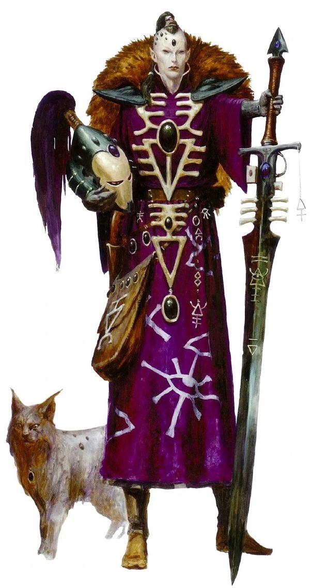
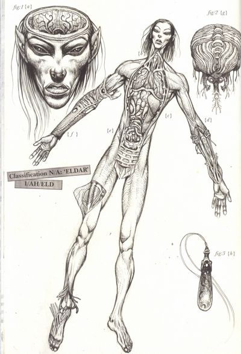
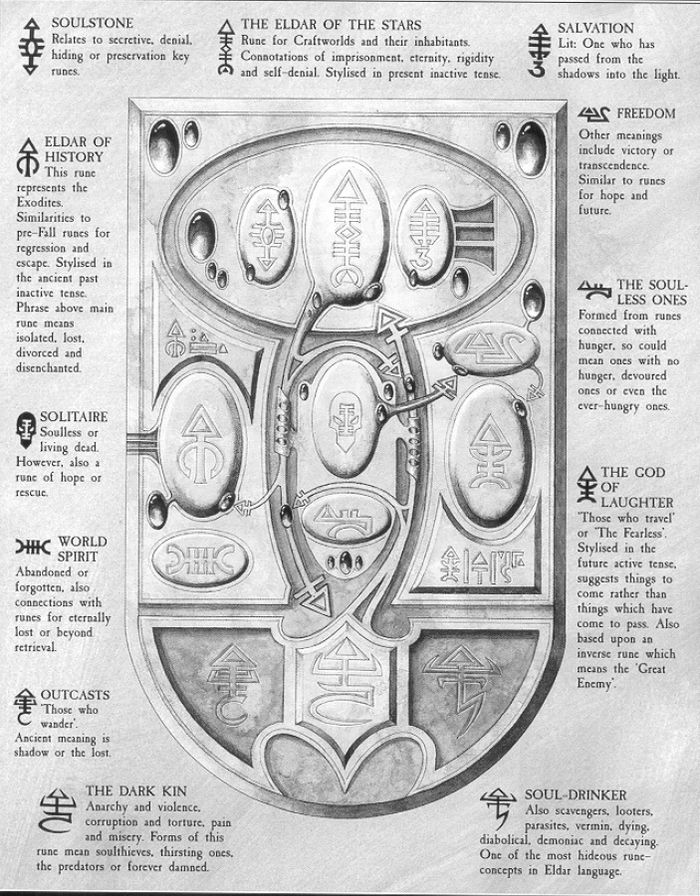
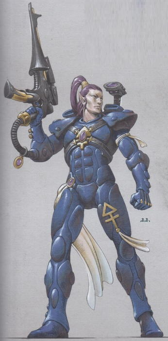
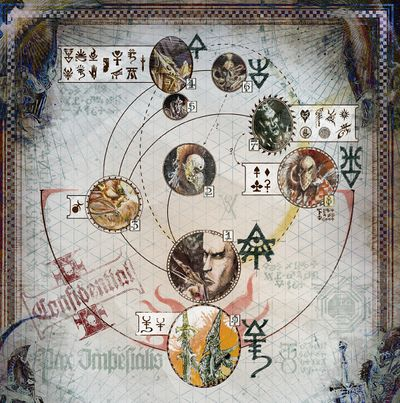
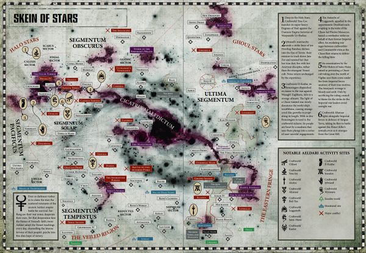
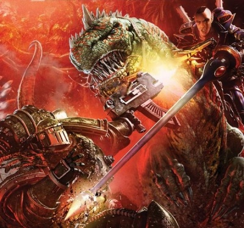
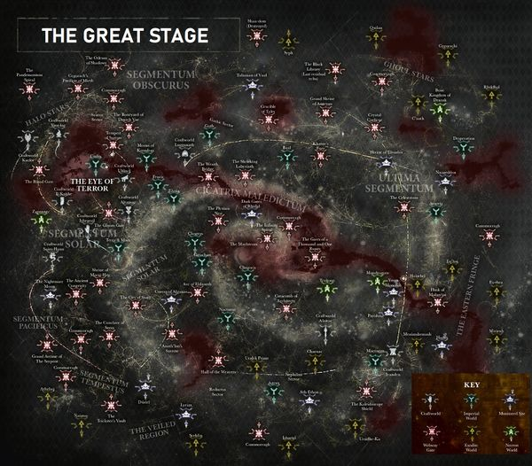
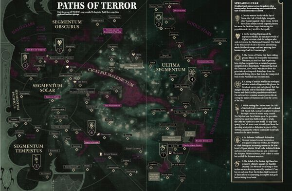
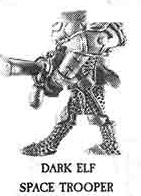

# 0571 艾达灵族 Aeldari

精校状态：中文行文已逐段精校，部分术语仍为暂定

分类：概念 / 异型 Xenos / 艾达灵族 Aeldari

原文来源：https://www.bilibili.com/opus/1055305427818905605

原作者：帝国神选罐头

原文时间：2025年04月13日 20:04

[返回分类目录](目录.md) · [全书目录](../../目录.md)

<!-- A0571-B0001 -->
**英文原文**

Aeldari, the Eldar term for their species are an ancient naturally psychic race of elf-like humanoids created as weapons by the Old Ones to win the War in Heaven in the aftermath of which their Empire dominated the Galaxy through it's use of the Webway, but their empire has collapsed and now they are currently a dying race.

<!-- /A0571-B0001 -->

<!-- A0571-B0002 -->

原译文

艾尔达里，灵族语中是指他们的种族，他们是一个古老的天然灵能种族，由精灵般的类人生物组成，由古圣创造作为武器，以赢得天堂之战。在这场战争之后，他们的帝国通过使用网道统治了银河系，但他们的帝国已经崩溃，现在他们是一支垂死的种族。

**校订译文**

艾达灵族（Aeldari）是灵族对自身种族的称呼。他们是古老的类人种族，外貌近似精灵，天生具有灵能。古圣为赢得天堂之战，将他们创造为武器；战后，灵族帝国借助网道统治银河。如今帝国早已崩溃，灵族也成为一个日渐衰亡的种族。

**校注：** Aeldari采用官方艾达灵族，Eldar旧称正文按灵族自然使用。

<!-- /A0571-B0002 -->

<!-- A0571-B0003 图片 -->

<!-- A0571-B0004 -->

原译文

Aeldari 灵族

**校订译文**

Aeldari 艾达灵族

<!-- /A0571-B0004 -->

<!-- A0571-B0005 -->
**英文原文**

After the Fall the Eldar homeworlds became the Crone Worlds of the Eye of Terror and their people were scattered throughout the Webway and among the stars into a myriad of different factions and allegiances including the Asuryani who fled the empire in it's final days and survive on planetoid-sized vessels known as Craftworlds, the Drukhari who hid away in the ancient city of Commoragh built in the Webway before the empire fell, the Exodites who fled early to verdant Maiden Worlds on the far edges of the galaxy, the secretive Harlequins who keep hidden the Black Library and keep alive the history of the Eldar, the death cult of the Ynnari, and the various bands of outcast corsairs, renegades, and pirates who make up the Anhrathe.

<!-- /A0571-B0005 -->

<!-- A0571-B0006 -->

原译文

堕落之后，灵族的家园变成了恐惧之眼的老妪世界，他们的人民分散在网道和群星之间，形成了无数不同的派别和效忠，包括在帝国最后几天逃离帝国并在被称为方舟世界的小行星大小的船只上生存的阿苏里亚尼/方舟灵族，在帝国灭亡前躲在网道建造的科摩罗古城的杜鲁卡里/黑暗灵族，早期逃往银河系远端蛮荒世界的流亡者/蛮荒灵族，隐藏在黑色图书馆并保存灵族历史的神秘丑角，死神伊纳里的死亡教派，以及各种人组成的弃民海盗、变节者和组成安赫拉特的海盗们。

**校订译文**

陨落之后，灵族昔日的母星群变成了恐惧之眼中的老妪世界。幸存者散落于网道与群星之间，分属许多派系：阿苏焉尼，即方舟灵族，在帝国末期逃出，栖身于小行星般庞大的方舟世界；黑暗灵族在帝国覆灭前，藏入网道中的古城科摩罗；蛮荒灵族则更早离去，迁往银河边缘绿意盎然的少女世界。另有守护隐秘黑图书馆、传承灵族历史的丑角，追随死神的死神军，以及被统称为安赫拉特的弃民、叛离者与各路海盗。

**校注：** Asuryani沿09核心阿苏焉尼；Ynnari为死神军而非死神名字，Ynnead为因尼德。Maiden Worlds少女世界与Exodite Worlds蛮荒灵族世界相关但不自动等同。 对照本段英文确认同一实体，与全书核心译名统一；不改变同形异义词或省略称呼。

<!-- /A0571-B0006 -->

<!-- A0571-B0007 -->
## Biology 生理

<!-- /A0571-B0007 -->

<!-- A0571-B0008 -->
**英文原文**

Superficially, the Eldar appear very similar to humans, though they are generally taller and slimmer, with sharp features and pointed ears. They are long-lived by human standards, and most will live more than a thousand years unless they die from accident or disease. The average Eldar lifespan is estimated at over two thousand years, as they record it having been five generations since the Fall of the Eldar. Eldar also have much faster metabolic rates than humans, and their cardiac and neurological systems are more advanced. These traits manifest in their vastly heightened reactions and agility compared to humans. To them humans seem to move in slow motion with a certain degree of awkwardness, while to humans the Eldar can move with distracting grace and can be blindingly fast in combat. As a race they have a high level of psychic ability, which serves as the foundation of their technology. The Eldar that actively cultivate their psyker potential seem to exhibit a much-extended lifespan as well, one proportional to their prowess. The Farseers of the Eldar can live for several thousand years. Eldar are mentally far superior to humans, and feel all emotions much more strongly, requiring the Eldar to exercise constant restraint to avoid mental breakdown.

<!-- /A0571-B0008 -->

<!-- A0571-B0009 -->

原译文

从表面上看，灵族看起来与人类非常相似，尽管他们通常更高更瘦，有着锋利的特征和尖尖的耳朵。按照人类的标准，它们的寿命很长，除非死于事故或疾病，否则大多数会活一千多年。据估计，灵族的平均寿命超过两千年，因为他们记录了自灵族陨落以来的五代人。灵族的代谢率也比人类快得多，他们的心脏和神经系统也更先进。这些特征表现在与人类相比，它们的反应和敏捷性大大提高。对他们来说，人类似乎以慢动作移动，有一定程度的尴尬，而对人类来说，灵族可以以令人分心的优雅移动，在战斗中可以快得令人眼花缭乱。作为一个种族，他们有很高的灵能能力，这是他们技术的基础。积极培养其灵能者潜力的灵族似乎也表现出更长的寿命，这与他们的能力成正比。灵族的先知可以活几千年。灵族在精神上远远优于人类，对所有情绪的感受都要强烈得多，这要求灵能不断克制自己，以避免精神崩溃。

**校订译文**

外表上，灵族与人类十分相似，但通常更高、更纤细，轮廓分明，耳尖突出。依人类标准，他们极为长寿；若不死于意外或疾病，多数能活过千年。有人根据“陨落至今仅历五代”的记载，估算其平均寿命超过两千年。灵族的新陈代谢远快于人类，心血管与神经系统也更为发达，赋予他们惊人的反应与敏捷。在灵族眼中，人类行动迟缓而笨拙；人类则觉得灵族举止优雅得令人出神，战斗时更快得目不暇接。整个种族都具有很强的灵能天赋，这也构成其技术基础。主动修炼灵能的个体，寿命似乎还会随造诣增长，大先知更能活数千年。灵族心智能力远超人类，情感体验也强烈得多，因此必须不断约束自己，以免精神崩溃。

**校注：** 五代推算寿命是所给材料的估计，不能把代际长度和个体寿命当作已验证等式；保留估计语气。

<!-- /A0571-B0009 -->

<!-- A0571-B0010 图片 -->

<!-- A0571-B0011 -->

原译文

Dissection of an Eldar Exodite 一位蛮荒灵族的解剖

**校订译文**

Dissection of an Eldar Exodite 一位蛮荒灵族的解剖

<!-- /A0571-B0011 -->

<!-- A0571-B0012 -->
**英文原文**

Eldar seem to reproduce in stages, with new genetic material being added by the father to the developing embryo over an extended period. This process is ill-understood, but Eldar autopsies are suggestive of it. It is however known that the Eldar gestation cycle is much longer than for most other races.

<!-- /A0571-B0012 -->

<!-- A0571-B0013 -->

原译文

灵族似乎是分阶段进行繁衍的，在一段很长的时间里，父亲会将新的遗传物质添加到正在发育的胚胎中。这一过程尚未被充分理解，但对灵族的尸体解剖暗示了这种情况的存在。不过，人们知道灵族的妊娠期比大多数其他种族要长得多。

**校订译文**

灵族似乎是分阶段进行繁衍的，在一段很长的时间里，父亲会将新的遗传物质添加到正在发育的胚胎中。这一过程尚未被充分理解，但对灵族的尸体解剖暗示了这种情况的存在。不过，人们知道灵族的妊娠期比大多数其他种族要长得多。

<!-- /A0571-B0013 -->

<!-- A0571-B0014 -->
## History 历史

<!-- /A0571-B0014 -->

<!-- A0571-B0015 -->
**英文原文**

The existing Eldar are essentially a refugee population, the scattered remnants of their former strength and power. Even in such straits, however, they are still a powerful force in the Galaxy. Once, ten thousand years ago, the Eldar were among the most powerful and prolific races, dominating a significant portion of the Galaxy and secure in their prosperity. Although there were other races of advanced technology and military power, none were in a position to seriously threaten the state of the Eldar nation. When it came, the disaster was internal. Consumed by arrogance and with no need for substantial work or labour, the Eldar began to pursue any curiosity or desire. Rapidly, cults devoted to exotic knowledge, physical pleasure, and ever-more outrageous entertainment sprang up. It did not take long for many of the Eldar to take a darker path, descending into dark study, instant fulfillment and unbridled violence, beginning the Fall of the Eldar.

<!-- /A0571-B0015 -->

<!-- A0571-B0016 -->

原译文

现有的灵族基本上是难民，是他们以前力量和权力的分散残余。然而，即使在这样的困境中，他们仍然是银河系中的一支强大力量。一万年前，灵族曾经是最强大、最众多的种族之一，统治着银河系的很大一部分，并确保了他们的繁荣。尽管还有其他拥有先进技术和军事力量的种族，但没有一个种族能够严重威胁灵族的国家。当灾难来临时，它是内部的。由于傲慢自大，不需要大量的工作或劳动，灵族开始追求满足任何好奇心或欲望。很快，致力于奇异知识、身体愉悦和越来越离谱的娱乐的教派兴起了。没过多久，许多灵族就走上了一条黑暗的道路，陷入黑暗学习、即时满足和肆无忌惮的暴力，开始了灵族陨落。

**校订译文**

今日的灵族，本质上是一群流离失所的幸存者，散落着昔日文明的余威；即便处境如此艰难，他们仍是银河中的强大力量。一万年前，灵族曾是最强盛、最繁荣的种族之一，掌控银河大片区域，安享富足。其他种族虽也拥有先进技术与强大军力，却无力真正威胁灵族文明。然而，灾难最终来自内部。傲慢使他们失去自制，繁荣又让他们无须从事多少劳动，于是任何好奇与欲望都成了追逐对象。钻研奇异知识、沉迷肉欲、追求愈发出格娱乐的教派，迅速兴起。许多人继而走向禁忌学问、即时享乐与无度暴力的深渊，灵族陨落由此开始。

<!-- /A0571-B0016 -->

<!-- A0571-B0017 图片 -->

<!-- A0571-B0018 -->

原译文

Eldar Runes 灵族符文

**校订译文**

Eldar Runes 灵族符文

<!-- /A0571-B0018 -->

<!-- A0571-B0019 -->
**英文原文**

Many of the Eldar grew uneasy with the actions of their comrades, and the wisest of the Seers warned that the path could lead only to evil. Disgusted, some of the Eldar left the central worlds of the Empire to settle on the outlying regions, while others stayed to try and alter the path their race had taken.

<!-- /A0571-B0019 -->

<!-- A0571-B0020 -->

原译文

许多灵族对他们同胞的行为感到不安，最聪明的先知警告说，这条路只会通向邪恶。出于厌恶，一些灵族离开了帝国的中心世界，定居在偏远地区，而另一些人则留下来试图改变他们种族的道路。

**校订译文**

许多灵族对他们同胞的行为感到不安，最聪明的先知警告说，这条路只会通向邪恶。出于厌恶，一些灵族离开了帝国的中心世界，定居在偏远地区，而另一些人则留下来试图改变他们种族的道路。

<!-- /A0571-B0020 -->

<!-- A0571-B0021 -->
**英文原文**

While this would have been destructive within any society, it was even more damaging for the Eldar. Within the parallel realm of the Warp, the psychic emanations of these activities began to gather, strengthened by the souls of departed followers and cultists. As the Eldar vices grew, this collection did as well, until it eventually came into a life of its own. It finally came to consciousness as Slaanesh, Devourer of Souls and doom to the Eldar, for the psychic scream of its birth tore the souls from all the Eldar within a thousand light years of it. Its awakening was so forceful that it tore a hole between physical space and the Warp, plunging the Eldar homeworlds into a limbo of partial existence. This region is now known as the Eye of Terror, and is now the home of the forces of Chaos. Many Eldar survived the Fall and remain trapped within the Eye on the homeworlds of the Eldar, the Crone World, and are enslaved to Slaanesh.

<!-- /A0571-B0021 -->

<!-- A0571-B0022 -->

原译文

虽然这在任何社会都是具有破坏性的，但对灵族来说更具破坏性。在亚空间的平行领域内，这些活动的精神释放开始聚集，并得到已故追随者和信徒灵魂的加强。随着灵族恶习的增长，这个聚集也在增长，直到它最终有了自己的生命。它终于意识到，作为灵魂吞噬者和灵族的毁灭者，色孽，因为它诞生的灵能尖啸在一千光年内将所有灵族的灵魂撕裂。它的觉醒是如此强烈，以至于在物理空间和亚空间之间撕开了一个洞，使灵族家园世界陷入了部分存在的困境。这个地区现在被称为恐惧之眼，现在是混沌势力的家园。许多灵族在陨落中幸存下来，并被困在灵族家园世界的眼中，即老妪世界，并被色孽奴役。

**校订译文**

这种行为足以摧毁任何社会，对灵族而言却尤其致命。在平行的亚空间中，放纵产生的灵能波动不断汇聚，死去的信徒与追随者的灵魂，又为之增添力量。恶习日益深重，这团力量也随之膨胀，终于孕育出独立的生命与意识：色孽，吞噬灵魂、毁灭灵族的存在。祂诞生时发出的灵能尖啸，将周围一千光年内所有灵族的灵魂撕离身体。觉醒的冲击撕开了现实与亚空间之间的裂口，使灵族母星群落入虚实之间。这里便是如今的恐惧之眼，混沌势力的巢穴。据本篇记述，还有许多灵族幸存于陨落，却被困在恐惧之眼的老妪世界，沦为色孽的奴隶。

**校注：** came to consciousness 为形成意识，不是意识到某项事实；tore souls from 指灵魂被撕离身体。

<!-- /A0571-B0022 -->

<!-- A0571-B0023 -->
**英文原文**

Since this time, which is known only as The Fall, the Eldar have been a broken and scattered people, lacking cohesion and purpose. The Eldar population is constantly dwindling.

<!-- /A0571-B0023 -->

<!-- A0571-B0024 -->

原译文

从被称为陨落的那时起，灵族已经支离破碎，缺乏凝聚力和目标。灵族人口不断减少。

**校订译文**

自这场被称为“陨落”的灾难后，灵族便分崩离析，失去共同的目标与凝聚力，人口持续减少。

<!-- /A0571-B0024 -->

<!-- A0571-B0025 -->
**英文原文**

Towards the end of the 41st Millennium, the Galaxy was all but split in half by the Great Rift. To the Eldar it was known as the Dathedian, and as a highly psychically attuned race, the aetheric phenomena that accompanied it affected them most of all. This calamity came among a great many changes for the Eldar, which included the birth of the Ynnari, the great Dysjunction of Commorragh, the Shattering of Biel-Tan, and the Psychic Awakening.

<!-- /A0571-B0025 -->

<!-- A0571-B0026 -->

原译文

在第41个千年末，银河系几乎被大裂隙一分为二。对于灵族来说，它被称为达瑟迪安，作为一个高度灵能协调的种族，伴随它的以太现象对他们的影响最大。这场灾难发生在灵族的许多变化中，其中包括死神军的诞生、科摩罗的大析离、比耶-坦的破碎和灵能觉醒。

**校订译文**

第41千年末，大裂隙几乎将银河一分为二，灵族称其为“达瑟迪安”。他们对灵能极为敏感，因此尤其深受伴随而来的以太异象影响。灾难降临前后，灵族还经历了许多巨变，包括死神军诞生、科摩罗大析离、比耶坦破碎，以及灵能觉醒。

<!-- /A0571-B0026 -->

<!-- A0571-B0027 -->
## Religion 信仰

<!-- /A0571-B0027 -->

<!-- A0571-B0028 -->
**英文原文**

The Eldar are known to be a very spiritual people, and much of their culture is based around their mythological cycles. The most famous of these cycles was the War in Heaven, an epic conflict between the Eldar deities, in two factions lead by Vaul, the god of the forge, and Kaela Mensha Khaine, the god of war.

<!-- /A0571-B0028 -->

<!-- A0571-B0029 -->

原译文

众所周知，灵族是一个非常精神化的民族，他们的大部分文化都是基于他们的神系。这些中最著名的是天堂之战，这是灵族诸神之间的史诗般的冲突，由铸造之神瓦尔和战神血手凯恩领导的两个派系。

**校订译文**

灵族极重精神信仰，文化深深扎根于一系列神话传说。其中最著名的是“天堂之战”：铸造之神瓦尔与战神血手凯恩分别率领诸神，展开史诗般的争斗。

**校注：** 此处天堂之战为灵族诸神神话，不消除其与古圣、太空死灵战争叙述的视角区别。

<!-- /A0571-B0029 -->

<!-- A0571-B0030 -->
**英文原文**

With two notable exceptions, the Pantheon of the Eldar is considered to have been destroyed by the birth of Slaanesh. While the Eldar still revere all the gods and preserve their stories within the mythic cycles, they do not call on them for aid or hope for their intervention any longer. Still, there is a prophecy telling of the return of the Eldar gods and how they will battle and destroy Slaanesh as a unified pantheon. Whether this is anything but an old myth remains to be seen.

<!-- /A0571-B0030 -->

<!-- A0571-B0031 -->

原译文

除了两个明显的例外，灵族万神殿被认为已被色孽的诞生摧毁。虽然灵族仍然敬畏所有的神，并将他们的故事保存在神系中，但他们不再向祂们寻求帮助或希望祂们的干预。尽管如此，还是有一个预言，讲述了灵族诸神的回归，以及他们将如何作为一个统一的万神殿与色孽作战并摧毁色孽。这是否只是一个古老的神话还有待观察。

**校订译文**

按本节所采用的记述，除两位著名的例外，灵族诸神已随色孽诞生而覆灭。灵族仍敬奉诸神，在神话中保存祂们的故事，却不再期待祂们回应祈求、出手相助。不过，一则预言称，诸神终将归来，团结一致，与色孽交战并将其毁灭。这究竟只是古老传说，还是未来的预示，仍不得而知。

**校注：** 两位神祇幸存为该段原始口径，与后续涉及伊莎、因尼德等内容的时期与定义可能不同，保留版本限定。

<!-- /A0571-B0031 -->

<!-- A0571-B0032 -->
## Technology 技术

<!-- /A0571-B0032 -->

<!-- A0571-B0033 图片 -->

<!-- A0571-B0034 -->

原译文

Asuryani warrior 灵族战士

**校订译文**

Asuryani warrior 阿苏焉尼战士

<!-- /A0571-B0034 -->

<!-- A0571-B0035 -->
**英文原文**

The Eldar Armoury includes the standard Shuriken weaponry that uses gravitic forces to fire monomolecular-thin discs at the enemy. The Eldar use these weapons in the form of Shuriken pistols, Shuriken cannons, and a light carbine known as the Shuriken catapult.

<!-- /A0571-B0035 -->

<!-- A0571-B0036 -->

原译文

灵族军械库包括标准的星镖武器，该武器使用重力向敌人发射单分子薄片。灵族使用这些武器的形式是星镖手枪、星镖炮和一种名为星镖枪的轻型卡宾枪。

**校订译文**

星镖武器——灵族的制式武器以重力驱动，向敌人射出单分子厚度的薄片。常见形式包括星镖手枪、星镖炮，以及一种名为星镖枪的轻型卡宾枪。

<!-- /A0571-B0036 -->

<!-- A0571-B0037 -->
**英文原文**

Spirit stones - When the Eldar die, their souls are in danger of being devoured by the Chaos god Slaanesh. To prevent this, the Eldar wear spirit stones, which capture and contain their souls at the moment of death. These stones are then collected and inserted into the Craftworld's "Infinity Circuit", where they may rest along with the spirits of their ancestors. In times of need, the spirit stones of the Craftworld's strongest warriors may be taken from the Infinity Circuit and placed inside Wraithbone automatons, such as the Wraithguard and Wraithlords, to once again fight for the Craftworld.

<!-- /A0571-B0037 -->

<!-- A0571-B0038 -->

原译文

魂石 - 当灵族死去时，他们的灵魂有被混沌之神色孽吞噬的危险。为了防止这种情况，灵族佩戴魂石，在死亡的那一刻捕捉并容纳他们的灵魂。然后，这些石头被收集起来并插入方舟世界的“无限回路”，在那里它们可以与先祖的灵魂一起安息。在需要的时候，方舟世界最强战士的魂石可能会从无限回路中取出，并放置在灵骨自动机兵内，如幽冥守卫和幽冥领主，再次为方舟世界而战。

**校订译文**

魂石——灵族死后，灵魂可能遭色孽吞噬。为避免这一命运，他们佩戴魂石，在死亡瞬间收容灵魂，再由同胞回收，嵌入方舟世界的无限回路，与先祖一同安息。危急时，最强大战士的魂石也会被取出，装入幽冥护卫、幽冥领主等灵骨机兵，再度为方舟世界而战。

**校注：** Wraithguard采用GW09/GW10第6页幽冥护卫，原幽冥守卫为异译。

<!-- /A0571-B0038 -->

<!-- A0571-B0039 -->
**英文原文**

Webway — The Eldar do not travel through the Warp in the same manner as other races, having long ago developed a much faster and safer method known as the "Webway". This is a system of ancient "tunnels" through the Warp which is completely isolated from its inherent dangers. It is best imagined as a vast and tangled network of doorways between fixed points in realspace, by which the Eldar can travel far more rapidly than most races. However, if there is no Warpgate near their destination, or the one present is not big enough to permit the necessary forces, they are at a disadvantage. Much of the Webway has fallen into obscurity and disrepair, with tunnels and doorways sealed or broken. This often forces the Eldar to make connecting stops on their way to their destination. Finally, it is said that the fabled Black Library of Chaos resides somewhere within the Webway, though only the Harlequins know where.

<!-- /A0571-B0039 -->

<!-- A0571-B0040 -->

原译文

网道—灵族在亚空间中的行进方式与其他种族不同，他们很久以前就发展了一种更快、更安全的方法，称为“网道”。这是一个穿越亚空间的古老“隧道”系统，与内在的危险完全隔离。它最好被想象成现实空间中固定点之间巨大而纠缠的门户网络，通过它，灵族可以比大多数种族更快地旅行。然而，如果他们的目的地附近没有亚空间门，或者现有的亚空间门不够大，无法容纳必要的兵力，他们就会处于劣势，网道的大部分地区已经变得默默无闻，年久失修，隧道和门户被封锁或破坏。这往往迫使灵族在前往目的地的途中中途停留。最后，据说传说中的混沌黑色图书馆就在网道的某个地方，尽管只有丑角们知道在哪里。

**校订译文**

网道——灵族很早便采用一种比直接穿行亚空间更快、更安全的航行方式。网道由穿越亚空间的古老“隧道”组成，隔绝其危险，连接现实空间中的固定门户，形成庞大而错综复杂的网络。然而，若目的地附近没有门户，或通道不足以让所需兵力通过，优势便无法发挥。如今，许多网道已被遗忘、荒废，隧道与门户遭封闭或损坏，往往迫使旅者辗转中转，才能抵达目的地。传说中的混沌黑图书馆就藏于网道某处，只有丑角知道它的位置。

**校注：** 网道安全性为原文概述；不引申为每条损毁通道绝对安全。Black Library of Chaos在此为灵族黑色图书馆，不是混沌阵营掌管的图书馆。 对照本段英文确认同一实体，与全书核心译名统一；不改变同形异义词或省略称呼。

<!-- /A0571-B0040 -->

<!-- A0571-B0041 -->
**英文原文**

Wraithbone — The main construction material of the Eldar, and the staple of their psycho-technic engineering. It is brought forth from the Warp and shaped by Bonesingers through psychic power. It is used to create the Craftworlds of the Eldar, their tanks and other vehicles, constructs such as the Wraithguard and Wraithlords, and weapons and armour. It is a psychic conductor and so not only provides the structure for the things built of it, but also power distribution and communications. Wraithbone is a highly resilient material, and capable of limited self-repair. It, and the other building materials of the Eldar, will grow and react more like tissue and plants than the building materials of other races.

<!-- /A0571-B0041 -->

<!-- A0571-B0042 -->

原译文

灵骨 — 灵族的主要建筑材料，也是他们灵能技术工程的主要组成部分。它由亚空间产生，由吟骨者通过灵能力量塑造。它被用来制造灵族的方舟世界、坦克和其他载具、幽冥守卫和幽冥领主等，以及武器和盔甲。它是一种灵能导体，因此不仅为用它建造的东西提供了结构，还提供了配能和通信。灵骨是一种高韧性材料，能够进行有限的自我修复。它和灵族的其他建筑材料将比其他种族的建筑材料更像组织和植物一样生长和反应。

**校订译文**

灵骨——灵族最主要的建材，也是灵能技术工程的基础。吟骨者以灵能从亚空间引出灵骨，再将其塑形，建造方舟世界、坦克与其他载具、幽冥护卫和幽冥领主等机兵，以及武器护甲。灵骨能够传导灵能，既提供结构支撑，也承担供能与通信。它极其坚韧，并有一定的自我修复能力。与灵族其他建材一样，它的生长与反应更像有机组织、植物，而非其他种族使用的死物材料。

<!-- /A0571-B0042 -->

<!-- A0571-B0043 -->
## Society 社会

<!-- /A0571-B0043 -->

<!-- A0571-B0044 -->
**英文原文**

Forced out of their homeworlds, now cast into the Eye of Terror following the birth of Slaanesh and the Fall of the Eldar, Aeldari society has culturally divided into new distinct ways of life. While there are subcultural divisions within each of these new societies, these are the primary divisions of Aeldari culture.

<!-- /A0571-B0044 -->

<!-- A0571-B0045 -->

原译文

在色孽诞生和灵族陨落后，他们被迫离开家园，现在被投进了恐惧之眼，灵族社会在文化上划分为新的独特生活方式。虽然这些新社会中的每一个都有亚文化分裂，但这些是灵族文化的主要分裂。

**校订译文**

色孽诞生、灵族陨落之后，母星群陷入恐惧之眼，幸存者被迫离乡。灵族社会由此分化为不同文化，各自发展出独特的生活方式。每个群体内部又有许多分支，以下所列则是主要类别。

**校注：** 坠入恐惧之眼的是母星群，非全体幸存者；原译指代错乱。

<!-- /A0571-B0045 -->

<!-- A0571-B0046 图片 -->

<!-- A0571-B0047 -->

原译文

Graph of Aeldari Factions and Races 灵族派系和种族图

**校订译文**

Graph of Aeldari Factions and Races 艾达灵族派系与族群示意图

<!-- /A0571-B0047 -->

<!-- A0571-B0048 -->
**英文原文**

The Eldar retain a shared language and mythology (albeit with differing degrees of reverence), and while it is not an easy transition it is possible for a member of any of these societies to eventually intermesh with another of these societies.

<!-- /A0571-B0048 -->

<!-- A0571-B0049 -->

原译文

灵族保留着共同的语言和神话（尽管有不同程度的崇敬），虽然这不是一个容易的过渡，但这些社会中的任何一个成员最终都有可能与另一个社会相互交织。

**校订译文**

灵族各群体仍共享语言与神话，只是敬奉程度各异。转换生活方式固然不易，但任何群体的成员，都有可能最终融入另一个群体。

<!-- /A0571-B0049 -->

<!-- A0571-B0050 -->
### Craftworld Eldar 方舟灵族

<!-- /A0571-B0050 -->

<!-- A0571-B0051 -->
**英文原文**

Craftworld Eldar, also known as Asuryani, are an entirely void-faring society of Aeldari.

<!-- /A0571-B0051 -->

<!-- A0571-B0052 -->

原译文

方舟灵族，也被称为阿苏里亚尼，是一个在虚空中生存的灵族社会。

**校订译文**

方舟灵族又称阿苏焉尼，是完全以星际航行为生存方式的艾达灵族社会。

<!-- /A0571-B0052 -->

<!-- A0571-B0053 图片 -->

<!-- A0571-B0054 -->

原译文

Recent Eldar activity across the galaxy 银河系最近的灵族活动

**校订译文**

Recent Eldar activity across the galaxy 银河系最近的灵族活动

<!-- /A0571-B0054 -->

<!-- A0571-B0055 -->
### The Eldar Paths 灵族道途

<!-- /A0571-B0055 -->

<!-- A0571-B0056 -->
**英文原文**

The Eldar who live on board the Craftworlds have undergone a complete social reform. Every Eldar chooses and follows a path, somewhat similar to a profession, until achieving mastery over it. Then he chooses another one and the process begins anew. There are an unknown number of paths, and all of them are dangerous for the Eldar; sometimes an Eldar can become so focused upon his path that he will never leave it .

<!-- /A0571-B0056 -->

<!-- A0571-B0057 -->

原译文

住在方舟世界上的灵族经历了彻底的社会改革。每个灵族都会选择并遵循一条类似于职业的道途，直到掌握它。然后，他选择另一条道途，这个过程重新开始。有数量未知的道途，所有这些道途对灵族来说都是危险的；有时，一个灵族会变得如此专注于他的道途，以至于他永远不会离开它。

**校订译文**

方舟世界的灵族经历了彻底的社会改革。每个人都会选择一条近似职业的“道途”，专心修习，直至精通，再转入另一条道途，重新开始。道途种类繁多，数量不详，却都潜藏危险：个体可能过度沉迷，从此无法离开。

<!-- /A0571-B0057 -->

<!-- A0571-B0058 -->
**英文原文**

Perhaps the most visible path to those outside their society is that of the Warrior, it's aspirants each taking on an aspect of their shattered god of war Khaine as Aspect Warriors, with those dangerously lost upon it's path are the Exarchs. Craftworld society is often guided by those on the path of the seer, especially those dangerously lost in the probable futures known as Farseers.

<!-- /A0571-B0058 -->

<!-- A0571-B0059 -->

原译文

也许对于那些社会之外的人来说，最明显的道途是战士之道，这是有抱负的人，每个人都扮演他们破碎的战神凯恩的一个方面，成为支派战士，而那些危险地迷失在这条道路上的人是主教。方舟世界社会往往由那些走在先知之道上的人引导，尤其是那些在可能的未来中危险地迷失的人，他们被称为先知。

**校订译文**

外界最熟悉的或许是战士道途。修习者以破碎战神凯恩的某一面相为典范，成为支派战士；深陷其中、无法自拔者，则成为主教。方舟社会通常受先知之道的修习者指引，尤其是那些迷失于无数可能未来、被称为“大先知”的灵族。

**校注：** Path of the Seer先知道途与Farseer大先知分别处理；Exarch暂沿主教，非人类宗教职衔。 对照本段英文确认同一实体，与全书核心译名统一；不改变同形异义词或省略称呼。

<!-- /A0571-B0059 -->

<!-- A0571-B0060 -->
### Craftworlds 方舟世界

<!-- /A0571-B0060 -->

<!-- A0571-B0061 -->
**英文原文**

In the time leading up to the Fall, not all the Eldar that remained on the homeworlds fell into the lure of Slaanesh. Many remained, struggling to turn their species from its doomed path. Unable to do so, many of the greatest Seers caught glimpses of the darkness to come, and undertook a titanic effort to save their people. For each Eldar homeworld a gigantic ship was created, sung from Wraithbone and so massive as to be nearly a planetoid itself. The last uncorrupted people from each world were loaded onto these ships, along with works of art, plant life and animals, all that could be saved. In these Craftworlds (as they came be known) the final Eldar Exodus began, and only barely in time. The psychic shockwave caught some of the Craftworlds and destroyed them, while others were pulled into orbit around the Eye of Terror. The rest drift through the galaxy, their exact number uncertain, as contact can be difficult and intermittent. There are several Craftworlds of particular fame:

<!-- /A0571-B0061 -->

<!-- A0571-B0062 -->

原译文

在陨落之前的时间里，并不是所有留在家园世界的灵族都受到了色孽的诱惑。许多人留下来，努力将他们的物种从注定的道路上扭转过来。由于无法做到这一点，许多最伟大的先知都瞥见了即将到来的黑暗，并做出了巨大的努力来拯救他们的人民。对于每一个灵族家园世界，都会创造一艘巨大的飞船，以灵骨为基，其巨大程度几乎相当于一颗小行星。来自每个世界的最后一批纯洁的人，连同艺术品、植物和动物，所有可以拯救的东西，都被装上了这些船。在这些被称为方舟世界的地方，最后的灵族撤离开始了，而且几乎没有时间。灵能冲击波抓住了一些方舟世界并摧毁了它们，而另一些则被拖入了恐惧之眼周围的轨道。其余的则在银河系中漂移，它们的确切数量不确定，因为接触它们可能很困难，而且是间歇性的。有几个特别出名的方舟世界：

**校订译文**

陨落前，留在母星的灵族并非都屈从于色孽的诱惑。许多人努力挽救同胞，却始终无法改变文明的命运。最杰出的先知瞥见将至的黑暗，遂倾尽全力组织救亡。据本篇叙述，各母星都建起巨舰，由吟唱塑成灵骨，规模几乎相当于小行星。最后一批未受腐化的居民登舰，尽可能带走艺术品、植物与动物。这些巨舰后来被称为方舟世界。最后的撤离勉强赶在灾难前开始：一些方舟遭灵能冲击波摧毁，另一些被引向恐惧之眼周边的轨道，其余则漂泊于银河。彼此联系困难且时断时续，因此总数难以确认。著名者包括：

**校注：** 各母星分别建方舟是本篇版本叙述，保留来源限定，不覆盖其他起源资料。

<!-- /A0571-B0062 -->

<!-- A0571-B0063 -->
**英文原文**

Alaitoc — Far out on the frontiers of the galaxy, on the edge of explored space, lies the Alaitoc Craftworld. The Alaitoc Eldar are zealous in their guard against the touch of Slaanesh, even more so than other Craftworld Eldar. For these two reasons many of its citizens will at one time or another decide to leave the strict confines of the ship and strike out on their own or in small groups. They will return in times of need, however, and so all Alaitoc armies will have a substantial force of scouts and rangers.

<!-- /A0571-B0063 -->

<!-- A0571-B0064 -->

原译文

阿莱托克 — 在银河系的边界探索宇宙的边缘，坐落着阿莱托克方舟世界。阿莱托克灵族热衷于防范色孽的触碰，甚至比其他方舟灵族更热情。出于这两个原因，许多公民会在某个时候决定离开船只的严格限制，独自或成群结队地出发。然而，他们会在需要的时候回来，因此所有阿莱托克军队都将拥有大量的侦察兵和游侠。

**校订译文**

阿莱托克——位于银河遥远边疆、已探索空域的边缘。当地灵族抵御色孽诱惑的戒律，比其他方舟更为严苛。边疆环境与严格生活，使许多居民在某个时期选择独自或结伴离舰游历；但危难时，他们仍会归来。因此，阿莱托克军队通常拥有大量侦察兵与游侠。

<!-- /A0571-B0064 -->

<!-- A0571-B0065 -->
**英文原文**

Altansar — A small Craftworld that had been on the edge of the shockwave, Altansar was long thought to have been lost in the Eye of Terror with the homeworlds of the Eldar. However, there were reports of its sighting and even active involvement in the recently conducted campaign against the Eye of Terror, and doubt now exists as to its fate.

<!-- /A0571-B0065 -->

<!-- A0571-B0066 -->

原译文

奥坦萨 — 一个一直处于冲击波边缘的小型方舟世界，奥坦萨长期以来被认为与灵族的家园世界一起迷失在恐惧之眼中。然而，有报道称，它被发现，甚至积极参与了最近开展的对抗恐惧之眼的运动，现在人们对它的命运存在怀疑。

**校订译文**

奥坦萨——这座小型方舟曾处于陨落冲击波边缘，长期被认为已与母星群一同失陷于恐惧之眼。不过，后来有报告称曾目击它出现，甚至参与针对恐惧之眼的战役，因此其最终命运再次成为疑问。

**校注：** 奥坦萨条目描述保留其资料时点，不把当时疑问概括为现行全设定未知。

<!-- /A0571-B0066 -->

<!-- A0571-B0067 -->
**英文原文**

Biel-tan — The most martial of the Craftworlds, Biel-tan has made the decision to re-forge the Eldar Empire. Its armies contain the highest percentages of elite troops of all the Craftworlds, and few of the staple citizen-militia that most worlds call upon in times of war. Their highly-trained forces are known as the Swordwind, and they often come to the aid of Exodite worlds.

<!-- /A0571-B0067 -->

<!-- A0571-B0068 -->

原译文

比耶-坦 — 比耶-坦是方舟世界中最具军事气息的，它决定重建灵族帝国。它的军队拥有所有方舟世界中最高比例的精英部队，而大多数世界在战争时期所需要的主要民兵却很少。他们训练有素的部队被称为剑风，他们经常帮助蛮荒世界。

**校订译文**

比耶坦——最崇尚武力的方舟之一，立志重建灵族帝国。其精锐部队占比在各方舟中最高，战争中依靠公民民兵的程度则较低。这支训练有素的大军称为“剑风”，经常援助蛮荒灵族世界。

<!-- /A0571-B0068 -->

<!-- A0571-B0069 -->
**英文原文**

Iyanden — The Iyanden Craftworld was once one of the largest and most prosperous of all the remaining ships. Its path brought it into the way of the Tyranid invasion, however, and the Craftworld was nearly destroyed in the following battles. Today many of its sections are still in ruins and the population is spread thin. This forces Iyanden to often call upon its fallen, raising more than the typical numbers of Wraithguard and Wraithlords to aid their dwindling warriors in battle.

<!-- /A0571-B0069 -->

<!-- A0571-B0070 -->

原译文

伊扬登 - 伊扬登方舟世界曾经是所有剩余方舟中最大、最繁荣的船只之一。然而，它的航线使它陷入了泰伦入侵的道路，在接下来的战斗中，方舟世界几乎被摧毁。今天，它的许多部分仍然是废墟，人口稀少。这迫使伊扬登经常召唤其倒下的战士，筹集了比一般数量更多的幽冥守卫和幽冥领主，以帮助他们在战斗中不断减少的战士。

**校订译文**

伊扬登——曾是幸存方舟中最大、最繁荣者之一，却因航线与泰伦入侵相交，险些覆灭。许多区域至今仍是废墟，人口稀少，迫使他们频繁唤醒亡者，投入远超其他方舟数量的幽冥护卫与幽冥领主，支援日渐凋零的生者军队。

<!-- /A0571-B0070 -->

<!-- A0571-B0071 -->
**英文原文**

Saim-Hann — One of the more barbaric and wild of the larger Craftworlds, the warriors of Saim-Hann favour rapid attacks and moving battles. It regularly organises its forces into ranks of skimmers and jetbikes, known as the Wild Riders, and is famed for the speed and ferocity of its attacks.

<!-- /A0571-B0071 -->

<!-- A0571-B0072 -->

原译文

萨姆-罕 — 是大型方舟世界中更野蛮、更狂野的一个，萨姆·罕的战士们喜欢快速攻击和移动战斗。它定期将其部队组织成悬浮艇和喷气摩托的队伍，被称为狂野骑士，以其攻击的速度和凶猛而闻名。

**校订译文**

塞姆罕——在大型方舟中，以粗犷、狂野著称。其战士偏爱迅猛突袭与机动作战，常将悬浮艇、喷气摩托编成“狂野骑士”部队，以速度与凶猛闻名。

<!-- /A0571-B0072 -->

<!-- A0571-B0073 -->
**英文原文**

Ulthwé — One of the largest Craftworlds, Ulthwé was caught in the pull of the Eye of Terror, and now orbits it. As such it faces the constant danger of attack by Chaos marauders and has served as a bastion against the dark powers for thousands of years. The constant war and risk of attack has hardened the Craftworld's citizens, and it maintains a standing militia force known as the Black Guardians. Its proximity to the Eye has also given it an unusual number of psychics.

<!-- /A0571-B0073 -->

<!-- A0571-B0074 -->

原译文

乌斯维 — 乌斯维是最大的方舟世界之一，曾被恐惧之眼吸引，现在绕着它运行。因此，它面临着混沌掠夺者不断攻击的危险，数千年来一直是对抗黑暗势力的堡垒。持续的战争和袭击风险使方舟世界的公民变得坚强，它维持着一支被称为黑色守护者的常备民兵部队。它靠近恐惧之眼也给了它不同寻常的灵能者数量。

**校订译文**

乌斯维——最大的方舟之一，受恐惧之眼牵引，如今环绕其运行。这里不断面对混沌掠夺者的威胁，数千年来始终是抵御黑暗力量的堡垒。长年战争磨炼了居民，也促使他们维持一支称为“黑色守护者”的常备民兵。紧邻恐惧之眼，还使当地灵能者数量异常众多。

<!-- /A0571-B0074 -->

<!-- A0571-B0075 -->
**英文原文**

The Craftworlds probably compose the majority of the surviving Eldar race, although it is impossible to say just how many this is. They are certainly the seat of the remaining Eldar industry, technology, and culture, as they contain the only vestiges of their original worlds. Most of the Craftworlds contain special biodomes that house plants and wildlife from their original world, and these are carefully tended. Although each Craftworld is essentially independent in its actions and governance, they will generally offer and accept aid and advice from one another. Although not common, sometimes Craftworld disagreements will cause two to clash on the field of battle, though this is always a last resort.

<!-- /A0571-B0075 -->

<!-- A0571-B0076 -->

原译文

方舟世界可能构成了幸存的灵族种族的大部分，尽管不可能说出这个种族有多少人。它们肯定是剩余的灵族工业、技术和文化的所在地，因为它们包含了原初世界的唯一遗迹。大多数方舟世界都有特殊的生物馆，里面有来自原初世界的植物和野生动物，这些生物馆都经过精心照料。尽管每个方舟世界在行动和治理方面基本上是独立的，但他们通常会提供和接受彼此的援助和建议。虽然不常见，但有时方舟世界的分歧会导致双方在战场上发生冲突，尽管这总是最后的手段。

**校订译文**

幸存灵族中，或许大多数生活在方舟世界，但实际人口无法确定。方舟保存着昔日母星仅存的遗产，是灵族工业、技术与文化的核心。多数方舟设有特殊生态穹顶，精心照料来自母星的植物与野生动物。各方舟行动、治理基本独立，却通常愿意相互援助、交换建议。分歧偶尔也会引发武装冲突，但这始终是最后的选择。

<!-- /A0571-B0076 -->

<!-- A0571-B0077 -->
**英文原文**

Every Craftworld contains an Infinity Circuit, which is essentially the Wraithbone skeleton of the Craftworld itself. Within this matrix the souls of all the Craftworld's dead reside in a form of group consciousness, providing both a well of psychic power for the ship and a massive ancestral mind to advise and guide the living. With the rise of Slaanesh, the Infinity Circuit is the closest thing that the Eldar have to an afterlife; if their souls are not caught and integrated into it, they will be lost into the Warp and devoured by the Great Enemy. For this reason the Eldar will defend their Craftworlds with a fury and tenacity almost unrivalled; they risk losing not only their home but the souls of their ancestors as well.

<!-- /A0571-B0077 -->

<!-- A0571-B0078 -->

原译文

每个方舟世界都包含一个无限回路，它本质上是方舟世界本身的灵骨骨架。在这个矩阵中，所有方舟世界死者的灵魂都以一种群体意识的形式存在，为飞船提供了强大的灵能力量，并为生者提供了巨量的先祖思想来建议和指导。随着色孽的崛起，无限回路是灵族最接近来世的东西；如果他们的灵魂没有被回收并融入其中，他们将迷失在亚空间中，被大敌吞噬。因此，灵族将以近乎无与伦比的愤怒和坚韧捍卫他们的方舟世界；他们不仅有失去家园的风险，还有失去先祖灵魂的风险。

**校订译文**

每座方舟世界都有无限回路，其本体便是方舟的灵骨骨架。亡者灵魂在其中以群体意识的形式存在，既为星舰提供灵能力量，也形成庞大的先祖心智，指引生者。色孽诞生后，这已是灵族最接近安宁来世的归宿；未能收容、融入其中的灵魂，将流落亚空间，被大敌吞噬。因此，灵族保卫方舟时的愤怒与坚韧，几乎无可比拟：他们可能失去的，不只是家园，还有先祖的灵魂。

<!-- /A0571-B0078 -->

<!-- A0571-B0079 -->
### Exodites 蛮荒灵族

原题：Exodites 流亡者/蛮荒灵族

<!-- /A0571-B0079 -->

<!-- A0571-B0080 -->
**英文原文**

The Exodites are a large group of Eldar who fled their homeworlds before the Fall and the creation of the Great Enemy. They preached out against the changes in Eldar society, but were ignored or treated as narrow-minded. As such, they were saved from the taint of Chaos and formed colonies on the edge of the galaxy, far from their homeworlds and the now-expanded Eye of Terror. Most have reverted to a more agricultural state of existence, and as such are mocked by many of the Craftworld Eldar as being backward, although they have maintained a certain level of technology. They are also generally a more accepting people, taking in Eldar Outcasts where Craftworld Eldar would push them away. They are supported mainly by Biel-tan and are often protected by the forces of that Craftworld.

<!-- /A0571-B0080 -->

<!-- A0571-B0081 -->

原译文

流亡者/蛮荒灵族是一大群灵族，他们在陨落和大敌的诞生之前逃离了家园。他们鼓吹反对灵族社会的变化，但被忽视或被视为心胸狭窄。因此，他们摆脱了混沌的污染，在银河系边缘形成了殖民地，远离他们的家园世界和现在扩大的恐惧之眼。大多数已经恢复到更农业的生存状态，因此被许多方舟世界的灵族嘲笑为落后，尽管他们保持了一定的技术水平。他们通常也是更为包容的群体，会接纳那些被方舟世界的灵族排斥在外的灵族弃民。他们主要得到比耶-坦方舟世界的支持，并且常常受到该方舟世界部队的保护。

**校订译文**

蛮荒灵族在陨落与大敌诞生前，就已大批逃离母星。他们曾公开反对灵族社会的变化，却被忽视，或遭斥为心胸狭隘。离去使他们免受混沌污染，并在银河边缘建立殖民地，远离故土与如今扩张的恐惧之眼。虽然仍保有一定技术，他们大多选择以农业为主的生活，常被方舟同胞嘲为落后。不过，蛮荒灵族通常更愿意接纳被方舟拒之门外的弃民。他们尤其受到比耶坦支持，也常由其军队保护。

<!-- /A0571-B0081 -->

<!-- A0571-B0082 图片 -->

<!-- A0571-B0083 -->

原译文

Exodite Eldar attacking Salamanders during the Horus Heresy 荷鲁斯叛乱期间蛮荒灵族攻击火蜥蜴

**校订译文**

Exodite Eldar attacking Salamanders during the Horus Heresy 荷鲁斯之乱期间，蛮荒灵族进攻火蜥蜴

<!-- /A0571-B0083 -->

<!-- A0571-B0084 -->
### Harlequins 丑角

<!-- /A0571-B0084 -->

<!-- A0571-B0085 -->
**英文原文**

Harlequins are followers of the Eldar god, the Great Harlequin (also known as Cegorach or "The Laughing God"), who was one of the only two Eldar gods to survive the Fall. They move throughout the Webway in groups and perform impressive displays of mime and acrobatics, telling the many strange and wonderful stories of the Eldar past, but also the dark and dangerous plays of the Fall. Harlequins are not only performing artists, but devastating fighters as well. They will appear to fight with their Eldar brethren, particularly in close combat. Their primary task however is to guard the Black Library of Chaos from intruders, and have done so ever since its inception thousands of years ago. They rarely communicate with members outside of their group but will call for help if intruders do overwhelm them.

<!-- /A0571-B0085 -->

<!-- A0571-B0086 -->

原译文

丑角是灵族神伟大丑角（也称为西高奇或“笑神”）的追随者，他是陨落幸存下来的仅有的两位灵族神之一。他们在网道成群结队地移动，表演令人印象深刻的哑剧和杂技，讲述了灵族过去的许多奇怪而精彩的故事，也讲述了陨落的黑暗和危险的戏剧。丑角不仅是表演艺术家，也是毁灭性的战士。他们似乎会与他们的灵族兄弟作战，特别是在近距离战斗中。然而，他们的主要任务是保护混沌黑色图书馆免受入侵者的侵扰，自数千年前成立以来，他们就一直这样做。他们很少与团队外的成员沟通，但如果入侵者确实压倒了他们，他们会寻求帮助。

**校订译文**

丑角追随灵族神祇“大丑角”，即西高奇，又称“笑神”。按本节采用的记述，祂是陨落后幸存的两位灵族神祇之一。丑角结伴穿行网道，以精湛的哑剧与杂技，演绎灵族往昔奇妙的故事，也呈现陨落那黑暗而危险的历史。他们不仅是艺人，更是致命的战士，会现身与同族并肩作战，尤其擅长近战。数千年来，丑角最主要的使命，始终是保护混沌黑图书馆，阻止入侵者。他们很少与团体外的人交流，但敌势实在无法抵挡时，也会求援。

**校注：** fight with 在此为并肩作战，原译与灵族兄弟作战容易造成敌我反转。 对照本段英文确认同一实体，与全书核心译名统一；不改变同形异义词或省略称呼。

<!-- /A0571-B0086 -->

<!-- A0571-B0087 图片 -->

<!-- A0571-B0088 -->

原译文

The Great Stage 大舞台

**校订译文**

The Great Stage 大舞台

<!-- /A0571-B0088 -->

<!-- A0571-B0089 -->
### Drukhari 黑暗灵族

原题：Drukhari 杜鲁卡里

<!-- /A0571-B0089 -->

<!-- A0571-B0090 -->
**英文原文**

Drukhari, the so-called Dark Eldar, are unique in the sense that they do not occupy any planets in Real Space, but rather occupy the sprawling dark city of Commorragh located deep within the labyrinth of the Webway placed their prior to the Fall. From their time in the webway has left them with paler skin and better night vision, their psychic abilities have atrophied to avoid Slaanesh's gaze, and they developed an all-consuming and ever-increasing need to revel in the pain of others and nourish their decrepit souls one avenue of which is in piracy, enslavement and torture. Dark Eldar raiding parties make use of advanced anti-gravity skimmers to launch high speed raids on their enemy while still transporting a large number of their warriors. Through their use of the webway they are extremely mobile, striking from seemingly nowhere with little or no warning and vanishing with their captives before significant military reaction can be mobilised.

<!-- /A0571-B0090 -->

<!-- A0571-B0091 -->

原译文

杜鲁卡里，即所谓的黑暗灵族，是独一无二的，因为它们不占据真实空间中的任何行星，而是占据了位于陨落之前设置的网道迷宫深处的庞大黑暗城市科摩罗。从他们在网道世界的时间开始，他们的皮肤变得更白，夜视能力更好，他们的灵能能力已经萎缩，以避免色孽的目光，他们产生了一种消耗一切、不断增长的需求，即陶醉于他人的痛苦，滋养他们衰老的灵魂，其中一条途径是海盗、奴役和酷刑。黑暗灵族突袭队利用先进的反重力悬浮艇对敌人发动高速突袭，同时仍运送大量战士。通过使用网道方式，他们具有极高的机动性，在几乎没有或根本没有任何警告的情况下从任何地方发动袭击，并在动员起大型军事反应之前与俘虏一起消失。

**校订译文**

按本篇描述，黑暗灵族与其他同族的不同之处，在于不占据现实宇宙中的行星，而是栖居于网道迷宫深处、陨落前就已存在的庞大暗城科摩罗。长居网道，使他们肤色更苍白、夜视更敏锐；为躲避色孽注视，灵能天赋则逐渐萎缩。他们对他人痛苦的渴求日益加深，只有沉醉其中，才能滋养衰败的灵魂，因而投身劫掠、奴役与酷刑。黑暗灵族突袭队使用先进反重力悬浮艇，大批运送战士，发动高速袭击。网道赋予他们极强的机动性：往往毫无预警地突然现身，在敌人来得及组织有效反击前，便携俘虏消失。

**校注：** 不占据现实行星是所给英文的概括叙述，保留其说法并加来源限定，不据此判断所有时代前哨及劫掠据点归属。

<!-- /A0571-B0091 -->

<!-- A0571-B0092 图片 -->

<!-- A0571-B0093 -->

原译文

Recent Dark Eldar activity 最近的黑暗灵族活动

**校订译文**

Recent Dark Eldar activity 最近的黑暗灵族活动

<!-- /A0571-B0093 -->

<!-- A0571-B0094 -->
### Outcasts and Pirates 弃民与海盗

<!-- /A0571-B0094 -->

<!-- A0571-B0095 -->
**英文原文**

Eldar outcasts and pirates consist of craftworld outcasts and exiles, corsair pirates, and drukhari raiders, and even former Harlequins, and are often confused for one another by the Imperium. To Craftworld Eldar, piracy is shunned, but outside of the protection of the craftworld there is safety in the mercenary bands of the Anhrathe, drawing from aeldari communities of all kinds. These pirate bands organize themselves around a leader, known as a Prince or Princess. These Anhrathe might hire themselves out as mercenaries to human or other xenos colaborators, and are well received by Rogue Traders and radical Inquisitors. Although pirates are self-serving, they might still feel a duty to aid a struggling craftworld, as the Eldritch Raiders were so called by Yriel to defend Iyanden.

<!-- /A0571-B0095 -->

<!-- A0571-B0096 -->

原译文

灵族弃民和海盗由方舟世界弃民和流亡者、海盗船海盗和黑暗灵族袭击者组成，甚至还有前丑角，他们经常被帝国混淆。对于方舟世界灵族来说，海盗是被回避的，但在方舟世界的保护之外，安赫拉特的雇佣兵队是安全的，他们来自各种各样的灵族团体。这些海盗团伙围绕着一个被称为王子或公主的领导者组织起来。这些安赫拉特可能会雇佣自己作为人类或其他异型的雇佣兵，并受到行商浪人和激进派审判官的欢迎。尽管海盗们是自私的，但他们可能仍然觉得有责任帮助一个苦苦挣扎的方舟世界，因为伊瑞尔召唤骇人突袭者来保卫伊扬登。

**校订译文**

灵族弃民与海盗中，有被方舟放逐者、自行出走者、各路海盗、黑暗灵族劫掠者，乃至退出丑角团体的成员，帝国常将他们混为一谈。方舟社会排斥海盗行径，但离开方舟庇护之后，来自各类灵族社群的人，可以投身安赫拉特佣兵团以求安全。这些海盗组织围绕被称为“王子”或“公主”的首领集结，会受雇于人类或其他异形，颇受行商浪人与激进派审判官欢迎。海盗虽以自身利益为先，有时仍感到援救方舟的责任，例如伊瑞尔曾召集骇人突袭者，保卫伊扬登。

<!-- /A0571-B0096 -->

<!-- A0571-B0097 -->
### Ynnari 死神军

<!-- /A0571-B0097 -->

<!-- A0571-B0098 -->
**英文原文**

The Ynnari, known to themselves as the Reborn, are the followers of the nascent god Ynnead, beleiving that the aeldari can be saved from the oblivion of Slaanesh through the rise of the God of the Dead who stirs within Infinity Circuits, and fight tirelessly to awaken their Whispering God. The Ynnari are dawn from every element of Aeldari civilization.

<!-- /A0571-B0098 -->

<!-- A0571-B0099 -->

原译文

死神军，他们自己被称为重生者，是新生神因尼德的追随者，他们相信通过在无限回路中搅动的死神的崛起，灵族可以从色孽的毁灭中被拯救出来，并不知疲倦地战斗以唤醒他们的低语神。死神军是来自灵族文明各个元素的黎明。

**校订译文**

死神军自称“重生者”，追随初生之神伊纳德。他们相信，沉眠于无限回路中的亡者之神一旦崛起，便能将艾达灵族从遭色孽吞噬的命运中解救出来，因此不懈战斗，试图唤醒这位“低语之神”。死神军的成员来自灵族文明的各个群体。

**校注：** 英文 dawn 疑为 drawn，按语境译成员来自各群体，原文明的黎明错误。Ynnead采用官方词根参考伊纳德：GW09第7页伊纳德信徒与GW10第7页Devoted of Ynnead对应；神名本身未作为独立全称认证。原因尼德存于对照。

<!-- /A0571-B0099 -->

<!-- A0571-B0100 -->
### Chaotic Eldar 混沌灵族

<!-- /A0571-B0100 -->

<!-- A0571-B0101 -->
**英文原文**

Chaotic Eldar are extremely rare, and by far the most damned of their race. Utterly at the mercy of their Chaos masters to prevent their soul being swallowed by Slaanesh, they are unacknowledged and forever forgotten by their kinfolk, their souls eternally barred from peace.

<!-- /A0571-B0101 -->

<!-- A0571-B0102 -->

原译文

混乱灵族极为罕见，也是他们种族中迄今为止最该死的。完全受制于他们的混沌主人，以防止他们的灵魂被色孽吞噬，他们得不到血亲的承认，永远被遗忘，他们的灵魂永远被禁止和平。

**校订译文**

混沌灵族极其罕见，也是同族中受诅咒最深的群体。为防止灵魂被色孽吞噬，他们完全听命于混沌主人。同胞拒绝承认他们，将他们永远遗忘；他们的灵魂也再无安宁可言。

<!-- /A0571-B0102 -->

<!-- A0571-B0103 -->
## The Eldar Genders 灵族性别

<!-- /A0571-B0103 -->

<!-- A0571-B0104 -->
**英文原文**

As a race, the sexes of Eldar seem to be very similar both psychologically and physically. Among such and androgynous race telling the sexes apart can be very difficult. Eldar females can reach any position in society and became warriors, pilots or great psykers as their male fellows.

<!-- /A0571-B0104 -->

<!-- A0571-B0105 -->

原译文

作为一个种族，灵族的两性在心理和生理上似乎都非常相似。在这样一个兼具两性特征的种族中，区分性别可能会非常困难。灵族女性能够在社会中担任任何职位，并且能像她们的男性同伴一样成为战士、驾驶员或强大的灵能者。

**校订译文**

作为一个种族，灵族的两性在心理和生理上似乎都非常相似。在这样一个兼具两性特征的种族中，区分性别可能会非常困难。灵族女性能够在社会中担任任何职位，并且能像她们的男性同伴一样成为战士、驾驶员或强大的灵能者。

<!-- /A0571-B0105 -->

<!-- A0571-B0106 -->
## Notable Aeldari 著名灵族

<!-- /A0571-B0106 -->

<!-- A0571-B0107 -->
### Notable Craftworld Eldar 著名方舟灵族

<!-- /A0571-B0107 -->

<!-- A0571-B0108 -->
**英文原文**

Amallyn Shadowguide, Ranger of Biel-tan

<!-- /A0571-B0108 -->

<!-- A0571-B0109 -->

原译文

阿玛琳·循影，比耶-坦游侠

**校订译文**

阿玛琳·循影——比耶坦游侠

<!-- /A0571-B0109 -->

<!-- A0571-B0110 -->
**英文原文**

Amon Harakht Phoenix Lord of the Eagle Pilots

<!-- /A0571-B0110 -->

<!-- A0571-B0111 -->

原译文

雄鹰领航凤凰领主，阿蒙·哈拉卡特

**校订译文**

阿蒙·哈拉卡特——雄鹰飞行员的凤凰领主

<!-- /A0571-B0111 -->

<!-- A0571-B0112 -->
**英文原文**

Asurmen the Hand of Asuryan, Phoenix Lord of the Dire Avengers

<!-- /A0571-B0112 -->

<!-- A0571-B0113 -->

原译文

凶暴复仇者凤凰领主，阿苏焉之手 阿苏曼

**校订译文**

阿苏曼，“阿苏焉之手”——凶暴复仇者的凤凰领主

<!-- /A0571-B0113 -->

<!-- A0571-B0114 -->
**英文原文**

Baharroth the Cry of the Wind, Phoenix Lord of the Swooping Hawks

<!-- /A0571-B0114 -->

<!-- A0571-B0115 -->

原译文

翔鹰凤凰领主，风泣 巴哈罗斯

**校订译文**

巴哈罗斯，“风泣”——翔鹰的凤凰领主

<!-- /A0571-B0115 -->

<!-- A0571-B0116 -->
**英文原文**

Drastanta the Tempest of Starlight, Phoenix Lord of the Shining Spears

<!-- /A0571-B0116 -->

<!-- A0571-B0117 -->

原译文

闪耀长矛凤凰领主，星光暴风 德拉斯坦塔

**校订译文**

德拉斯坦塔，“星光暴风”——闪矛的凤凰领主

**校注：** Shining Spears采用官方闪矛；Phoenix Lord职衔及尚无对应的人物名仍标暂定。

<!-- /A0571-B0117 -->

<!-- A0571-B0118 -->
**英文原文**

Eldrad Ulthran, Farseer late of Ulthwe, member in absentia of the Black Council

<!-- /A0571-B0118 -->

<!-- A0571-B0119 -->

原译文

黑色议会的缺席成员，前乌斯维先知，艾尔德拉德·乌索然

**校订译文**

艾尔德拉德·乌瑟兰——前乌斯维大先知，黑色议会的缺席成员

<!-- /A0571-B0119 -->

<!-- A0571-B0120 -->
**英文原文**

Eiladar Ys, Farseer of Craftworld Lugganath, member of the Black Council

<!-- /A0571-B0120 -->

<!-- A0571-B0121 -->

原译文

黑色议会成员，拉格奈什方舟世界先知，艾拉达尔·伊斯

**校订译文**

艾拉达尔·伊斯——拉格奈什方舟世界的大先知，黑色议会成员

<!-- /A0571-B0121 -->

<!-- A0571-B0122 -->
**英文原文**

Ffaid Karhedra Farseer of Craftworld Eyslk-Tan, member of the Black Council

<!-- /A0571-B0122 -->

<!-- A0571-B0123 -->

原译文

黑色议会成员，艾斯利可-坦方舟世界先知，法伊德·卡尔海德拉

**校订译文**

法伊德·卡尔海德拉——艾斯利可坦方舟世界的大先知，黑色议会成员

<!-- /A0571-B0123 -->

<!-- A0571-B0124 -->
**英文原文**

Fuegan the Burning Lance, Phoenix Lord of the Fire Dragons

<!-- /A0571-B0124 -->

<!-- A0571-B0125 -->

原译文

火龙凤凰领主，燃烧长枪 费甘

**校订译文**

弗甘，“燃烧长枪”——火龙的凤凰领主

<!-- /A0571-B0125 -->

<!-- A0571-B0126 -->
**英文原文**

Illic Nightspear, Ranger of Alaitoc

<!-- /A0571-B0126 -->

<!-- A0571-B0127 -->

原译文

伊利克·夜矛，阿莱托克游侠

**校订译文**

伊利克·夜矛，阿莱托克游侠

<!-- /A0571-B0127 -->

<!-- A0571-B0128 -->
**英文原文**

Iqbraesil Farseer of Craftworld Iyanden, member of the Black Council

<!-- /A0571-B0128 -->

<!-- A0571-B0129 -->

原译文

黑色议会成员，伊扬登方舟世界先知，伊克布雷西尔

**校订译文**

伊克布雷西尔——伊扬登方舟世界的大先知，黑色议会成员

<!-- /A0571-B0129 -->

<!-- A0571-B0130 -->
**英文原文**

Irillyth the Shade of Twilight, Phoenix Lord of the Shadow Spectres

<!-- /A0571-B0130 -->

<!-- A0571-B0131 -->

原译文

影灵凤凰领主，暮光阴影 伊瑞利斯

**校订译文**

伊瑞利斯，“暮光阴影”——影灵的凤凰领主

<!-- /A0571-B0131 -->

<!-- A0571-B0132 -->
**英文原文**

Iyanna Arienal, Spiritseer of Iyanden

<!-- /A0571-B0132 -->

<!-- A0571-B0133 -->

原译文

伊扬娜·阿里埃纳尔，伊扬登灵魂先知

**校订译文**

伊扬娜·阿里埃纳尔，伊扬登灵魂先知

<!-- /A0571-B0133 -->

<!-- A0571-B0134 -->
**英文原文**

Jain Zar the Storm of Silence, Phoenix Lord of the Howling Banshees

<!-- /A0571-B0134 -->

<!-- A0571-B0135 -->

原译文

狂嚎女妖凤凰领主，寂静风暴 贾恩·扎尔

**校订译文**

简恩·扎尔，“寂静风暴”——狂嚎女妖的凤凰领主

<!-- /A0571-B0135 -->

<!-- A0571-B0136 -->
**英文原文**

Karandras the Shadow Hunter, Phoenix Lord of the Striking Scorpions

<!-- /A0571-B0136 -->

<!-- A0571-B0137 -->

原译文

突击蝎凤凰领主，暗影猎手 卡兰德拉斯

**校订译文**

卡兰德拉斯，“暗影猎手”——突击战蝎的凤凰领主

<!-- /A0571-B0137 -->

<!-- A0571-B0138 -->
**英文原文**

Kelmon, Farseer of Craftworld Iyanden

<!-- /A0571-B0138 -->

<!-- A0571-B0139 -->

原译文

科洛蒙，伊扬登方舟世界先知

**校订译文**

科洛蒙——伊扬登方舟世界的大先知

<!-- /A0571-B0139 -->

<!-- A0571-B0140 -->
**英文原文**

Lhykhis the Whispering Web, Phoenix Lord of the Warp Spiders

<!-- /A0571-B0140 -->

<!-- A0571-B0141 -->

原译文

次元蜘蛛凤凰领主，低语之网 利基斯

**校订译文**

莱吉斯，“低语之网”——次元蜘蛛的凤凰领主

<!-- /A0571-B0141 -->

<!-- A0571-B0142 -->
**英文原文**

Maugan Ra the Harvester of Souls, Phoenix Lord of the Dark Reapers

<!-- /A0571-B0142 -->

<!-- A0571-B0143 -->

原译文

黑暗死神凤凰领主，灵魂收割者 莫甘·拉

**校订译文**

矛甘·拉，“灵魂收割者”——黑暗死神的凤凰领主

<!-- /A0571-B0143 -->

<!-- A0571-B0144 -->
**英文原文**

Morcan Fiorinintal Farseer of Craftworld Alaitoc, member of the Black Council

<!-- /A0571-B0144 -->

<!-- A0571-B0145 -->

原译文

黑色议会成员，阿莱托克方舟世界先知，莫坎·菲奥里宁塔尔

**校订译文**

莫坎·菲奥里宁塔尔——阿莱托克方舟世界的大先知，黑色议会成员

<!-- /A0571-B0145 -->

<!-- A0571-B0146 -->
**英文原文**

Nuadhu 'Fireheart', Windrider of Saim-Hann

<!-- /A0571-B0146 -->

<!-- A0571-B0147 -->

原译文

努阿杜‘火心’，萨姆-罕驭风者

**校订译文**

努阿杜，“火心”——塞姆罕的驭风者

<!-- /A0571-B0147 -->

<!-- A0571-B0148 -->
**英文原文**

Slau Dha, Member of the Cabal

<!-- /A0571-B0148 -->

<!-- A0571-B0149 -->

原译文

斯兰·达，密教成员

**校订译文**

斯劳·达——密教成员

<!-- /A0571-B0149 -->

<!-- A0571-B0150 -->
**英文原文**

Yriel, Autarch of Iyanden

<!-- /A0571-B0150 -->

<!-- A0571-B0151 -->

原译文

伊瑞尔，伊扬登司战

**校订译文**

伊瑞尔，伊扬登司战

<!-- /A0571-B0151 -->

<!-- A0571-B0152 -->
### Notable Exodites 著名蛮荒灵族

原题：Notable Exodites 著名流亡者/蛮荒灵族

<!-- /A0571-B0152 -->

<!-- A0571-B0153 -->
**英文原文**

Isarion Stormsmourn of Ephraeleon

<!-- /A0571-B0153 -->

<!-- A0571-B0154 -->

原译文

埃弗拉龙的伊萨里昂·风暴哀悼

**校订译文**

埃弗拉龙的伊萨里昂·风暴哀悼

<!-- /A0571-B0154 -->

<!-- A0571-B0155 -->
**英文原文**

Laryin Sil Cadaiyth, Worldsinger of Lileathanir and doom of El'Uriaq

<!-- /A0571-B0155 -->

<!-- A0571-B0156 -->

原译文

拉里因·西尔·卡戴伊思，利莱萨瑟尼尔的世界歌者，以及埃尔’乌里亚克的灾星。

**校订译文**

拉里因·西尔·卡戴伊思——利莱萨瑟尼尔的世界歌者，埃尔·乌里亚克的灾星

<!-- /A0571-B0156 -->

<!-- A0571-B0157 -->
**英文原文**

Wei-yannil of Halathel

<!-- /A0571-B0157 -->

<!-- A0571-B0158 -->

原译文

哈拉瑟尔的魏-亚尼尔

**校订译文**

魏亚尼尔——来自哈拉瑟尔

<!-- /A0571-B0158 -->

<!-- A0571-B0159 -->
### Notable Harlequins 著名丑角

<!-- /A0571-B0159 -->

<!-- A0571-B0160 -->
**英文原文**

Ailill Nuada, Shadowseer of the Conclave of Tears

<!-- /A0571-B0160 -->

<!-- A0571-B0161 -->

原译文

艾利尔·努阿达，泪之密会的暗影先知

**校订译文**

艾利尔·努阿达，泪之密会的暗影先知

<!-- /A0571-B0161 -->

<!-- A0571-B0162 -->
**英文原文**

Kyganil, companion to Ephrael Stern

<!-- /A0571-B0162 -->

<!-- A0571-B0163 -->

原译文

基加尼尔，埃弗雷尔·斯特恩的同伴

**校订译文**

基加尼尔，埃弗雷尔·斯特恩的同伴

<!-- /A0571-B0163 -->

<!-- A0571-B0164 -->
**英文原文**

Lathrangil, Solitaire

<!-- /A0571-B0164 -->

<!-- A0571-B0165 -->

原译文

兰吉尔，独角

**校订译文**

兰吉尔，独角

<!-- /A0571-B0165 -->

<!-- A0571-B0166 -->
**英文原文**

Lhaerial Rey, Shadowseer of the of the Masque of the Ceaseless Song

<!-- /A0571-B0166 -->

<!-- A0571-B0167 -->

原译文

勒亚尔·雷伊，不休之歌剧团的暗影先知

**校订译文**

勒亚尔·雷伊，不休之歌剧团的暗影先知

<!-- /A0571-B0167 -->

<!-- A0571-B0168 -->

原译文

Motley 莫特利

**校订译文**

Motley 莫特利

<!-- /A0571-B0168 -->

<!-- A0571-B0169 -->
**英文原文**

Sylandri Veilwalker, Shadowseer of the Masque of the Veiled Path

<!-- /A0571-B0169 -->

<!-- A0571-B0170 -->

原译文

西兰德里·帷幕行者，朦胧之路剧团的暗影先知

**校订译文**

西兰德里·帷幕行者，朦胧之路剧团的暗影先知

<!-- /A0571-B0170 -->

<!-- A0571-B0171 -->
### Notable Dark Eldar 著名黑暗灵族

<!-- /A0571-B0171 -->

<!-- A0571-B0172 -->
**英文原文**

Asdrubael Vect, Supreme Lord of the Kabal of the Black Heart and overlord of Commorragh

<!-- /A0571-B0172 -->

<!-- A0571-B0173 -->

原译文

阿斯鲁拜尔·维克特，黑心阴谋团的最高领主和科摩罗的霸主

**校订译文**

阿斯杜巴尔·维克特，黑心阴谋团的最高领主和科摩罗的霸主

**校注：** 对照本段英文确认同一实体，与全书核心译名统一；不改变同形异义词或省略称呼。

<!-- /A0571-B0173 -->

<!-- A0571-B0174 -->
**英文原文**

Lady Malys, Archon of the Kabal of the Poisoned Tongue

<!-- /A0571-B0174 -->

<!-- A0571-B0175 -->

原译文

玛勒丝女士，毒舌阴谋团的执政官

**校订译文**

玛勒丝女士，毒舌阴谋团的执政官

<!-- /A0571-B0175 -->

<!-- A0571-B0176 -->
**英文原文**

Baron Sathonyx, The Lord Hellion

<!-- /A0571-B0176 -->

<!-- A0571-B0177 -->

原译文

巴朗·萨索尼克斯，地狱行者领主

**校订译文**

萨索尼克斯男爵——滑板暴徒领主

**校注：** Baron为男爵，不是人名巴朗；Hellion采用官方滑板暴徒，完整领主头衔仍为语境定译。

<!-- /A0571-B0177 -->

<!-- A0571-B0178 -->
**英文原文**

Drazhar, the "Master of Blades", Incubi Champion

<!-- /A0571-B0178 -->

<!-- A0571-B0179 -->

原译文

德拉扎尔，“剑刃大师”，梦魇冠军

**校订译文**

达扎尔，“刀锋之主”——梦魇剑客冠军

**校注：** Drazhar达扎尔、Incubi梦魇剑客，来自GW09/GW10第20页。 对照本段英文确认同一实体，与全书核心译名统一；不改变同形异义词或省略称呼。

<!-- /A0571-B0179 -->

<!-- A0571-B0180 -->
**英文原文**

Kheradruakh, the Decapitator, Monarch of the Mandrakes

<!-- /A0571-B0180 -->

<!-- A0571-B0181 -->

原译文

坎杜拉克，斩首者，曼德拉之王

**校订译文**

坎杜拉克，“斩首者”——曼德拉之王

<!-- /A0571-B0181 -->

<!-- A0571-B0182 -->
**英文原文**

Lelith Hesperax, Succubus of the Wych Cult of Strife

<!-- /A0571-B0182 -->

<!-- A0571-B0183 -->

原译文

莉莉丝·赫斯拉佩科斯，纷争巫灵教团的女妖

**校订译文**

莉莉丝·海斯佩拉克斯——纷争巫灵教团的血腥魔女

**校注：** Lelith Hesperax莉莉丝·海斯佩拉克斯、Succubus血腥魔女，来自GW09/GW10第20页；不与Howling Banshees狂嚎女妖混同。

<!-- /A0571-B0183 -->

<!-- A0571-B0184 -->
**英文原文**

Duke Sliscus, the Serpent, Commander of the Sky Serpents

<!-- /A0571-B0184 -->

<!-- A0571-B0185 -->

原译文

斯里斯克斯公爵，毒蛇，天空之蛇的指挥官

**校订译文**

斯里斯克斯公爵，毒蛇，天空之蛇的指挥官

<!-- /A0571-B0185 -->

<!-- A0571-B0186 -->
**英文原文**

Urien Rakarth, Master Haemonculus

<!-- /A0571-B0186 -->

<!-- A0571-B0187 -->

原译文

乌瑞恩·拉卡斯，血伶人之主

**校订译文**

乌瑞恩·拉卡斯，血伶人之主

<!-- /A0571-B0187 -->

<!-- A0571-B0188 -->
**英文原文**

Vraesque, Archon of the Kabal of the Flayed Skull

<!-- /A0571-B0188 -->

<!-- A0571-B0189 -->

原译文

弗雷斯克，剥皮颅骨阴谋团执政官

**校订译文**

弗雷斯克，剥皮颅骨阴谋团执政官

<!-- /A0571-B0189 -->

<!-- A0571-B0190 -->
**英文原文**

El'uriaq, the Tyrant of Shaa-Dom

<!-- /A0571-B0190 -->

<!-- A0571-B0191 -->

原译文

埃尔’乌里亚克，沙多姆暴君

**校订译文**

埃尔·乌里亚克——沙多姆暴君

<!-- /A0571-B0191 -->

<!-- A0571-B0192 -->
### Notable Outcasts and Pirates 著名弃民与海盗

<!-- /A0571-B0192 -->

<!-- A0571-B0193 -->
**英文原文**

Amharoc, later known as Yvraine the Emissary of Ynnead

<!-- /A0571-B0193 -->

<!-- A0571-B0194 -->

原译文

阿姆哈洛克，后来被称为伊弗蕾妮，死神因尼德的使者

**校订译文**

阿姆哈洛克——后来被称为伊芙蕾妮，伊纳德的使者

<!-- /A0571-B0194 -->

<!-- A0571-B0195 -->
**英文原文**

Conanmaol, Prince of the Executioners

<!-- /A0571-B0195 -->

<!-- A0571-B0196 -->

原译文

科南莫尔，处刑者海盗王子

**校订译文**

科南莫尔，处刑者海盗王子

<!-- /A0571-B0196 -->

<!-- A0571-B0197 -->
**英文原文**

Count Erandael, one of the triplet Princes of the Sunblitz Brotherhood

<!-- /A0571-B0197 -->

<!-- A0571-B0198 -->

原译文

埃兰代尔伯爵，日闪兄弟会三位王子之一。

**校订译文**

埃兰代尔伯爵——日闪兄弟会三胞胎王子之一

**校注：** triplet修正三胞胎，不只是三位王子。

<!-- /A0571-B0198 -->

<!-- A0571-B0199 -->
**英文原文**

Duke Siriolas, one of the triplet Princes of the Sunblitz Brotherhood

<!-- /A0571-B0199 -->

<!-- A0571-B0200 -->

原译文

西里奥拉斯公爵，日闪兄弟会三位王子之一。

**校订译文**

西里奥拉斯公爵——日闪兄弟会三胞胎王子之一

<!-- /A0571-B0200 -->

<!-- A0571-B0201 -->
**英文原文**

Duke Sliscus, Commander of the Sky Serpents

<!-- /A0571-B0201 -->

<!-- A0571-B0202 -->

原译文

斯里斯克斯公爵，天空之蛇的指挥官

**校订译文**

斯里斯克斯公爵，天空之蛇的指挥官

<!-- /A0571-B0202 -->

<!-- A0571-B0203 -->
**英文原文**

Ebahn Lauma, Prince of the Baelstorm Avengers

<!-- /A0571-B0203 -->

<!-- A0571-B0204 -->

原译文

伊班·劳玛，巴力风暴复仇者海盗王子

**校订译文**

伊班·劳玛，巴力风暴复仇者海盗王子

<!-- /A0571-B0204 -->

<!-- A0571-B0205 -->
**英文原文**

Ferianwyr Greensteel, Emerald Princess of the Greensteel Warriors

<!-- /A0571-B0205 -->

<!-- A0571-B0206 -->

原译文

费里安维尔·绿钢，绿钢勇士海盗的翡翠公主

**校订译文**

费里安维尔·绿钢，绿钢勇士海盗的翡翠公主

<!-- /A0571-B0206 -->

<!-- A0571-B0207 -->

原译文

Galadhar the Grey of Duro 杜罗的灰袍加拉达

**校订译文**

Galadhar the Grey of Duro 杜罗的灰袍加拉达

<!-- /A0571-B0207 -->

<!-- A0571-B0208 -->
**英文原文**

Kaelis Carnelia, Princess of the Steeleye Reavers

<!-- /A0571-B0208 -->

<!-- A0571-B0209 -->

原译文

凯利斯·卡内利娅，钢眼掠夺者海盗公主

**校订译文**

凯利斯·卡内利娅，钢眼掠夺者海盗公主

<!-- /A0571-B0209 -->

<!-- A0571-B0210 -->
**英文原文**

Lady Hale'drithea, Princess of the Black Suns

<!-- /A0571-B0210 -->

<!-- A0571-B0211 -->

原译文

海尔德利西亚女士，黑日海盗公主

**校订译文**

海尔德利西亚女士，黑日海盗公主

<!-- /A0571-B0211 -->

<!-- A0571-B0212 -->
**英文原文**

Lord Phaendris, one of the triplet Princes of the Sunblitz Brotherhood

<!-- /A0571-B0212 -->

<!-- A0571-B0213 -->

原译文

芬德里斯领主，日闪兄弟会三位王子之一。

**校订译文**

芬德里斯领主——日闪兄弟会三胞胎王子之一

<!-- /A0571-B0213 -->

<!-- A0571-B0214 -->
**英文原文**

Saaraina, Princess of the Void Dragons

<!-- /A0571-B0214 -->

<!-- A0571-B0215 -->

原译文

萨拉伊娜，虚空之龙海盗公主

**校订译文**

萨拉伊娜，虚空之龙海盗公主

<!-- /A0571-B0215 -->

<!-- A0571-B0216 -->
**英文原文**

Yriel, Prince of the Eldritch Raiders

<!-- /A0571-B0216 -->

<!-- A0571-B0217 -->

原译文

伊瑞尔，骇人突袭者海盗王子

**校订译文**

伊瑞尔，骇人突袭者海盗王子

<!-- /A0571-B0217 -->

<!-- A0571-B0218 -->
### Notable Ynnari 著名死神军

<!-- /A0571-B0218 -->

<!-- A0571-B0219 -->
**英文原文**

The Visarch, Guardian of Yvraine

<!-- /A0571-B0219 -->

<!-- A0571-B0220 -->

原译文

千面，伊芙蕾妮的守护者

**校订译文**

维萨奇——伊芙蕾妮的守护者

**校注：** The Visarch采用维萨奇，原千面为别称；The Yncarne采用因卡恩，原死神化身为称谓。对应GW09第6页续至第7页与GW10第7页。

<!-- /A0571-B0220 -->

<!-- A0571-B0221 -->
**英文原文**

The Yncarne, Avatar of Ynnead

<!-- /A0571-B0221 -->

<!-- A0571-B0222 -->

原译文

死神化身，死神因尼德的化身

**校订译文**

因卡恩——伊纳德的化身

<!-- /A0571-B0222 -->

<!-- A0571-B0223 -->
**英文原文**

Yvraine, Emissary of Ynnead

<!-- /A0571-B0223 -->

<!-- A0571-B0224 -->

原译文

伊芙蕾妮，死神因尼德的使者

**校订译文**

伊芙蕾妮——伊纳德的使者

<!-- /A0571-B0224 -->

<!-- A0571-B0225 -->
## Development History 发展史

<!-- /A0571-B0225 -->

<!-- A0571-B0226 -->
**英文原文**

The earliest known appearance of the Eldar came shortly before the release of Warhammer 40,000: Rogue Trader in 1987 in the form of a limited edition by Games Workshop miniature dubbed the "Dark Elf Space Trooper".

<!-- /A0571-B0226 -->

<!-- A0571-B0227 -->

原译文

灵族最早的已知外观出现在1987年战锤40000：行商浪人发行前不久，当时是Games Workshop的限量版迷你模型，被称为“黑暗精灵太空部队”。

**校订译文**

目前已知最早的灵族形象，出现于1987年《战锤40,000：行商浪人》发行前不久，是 Games Workshop 推出的一款限量微缩模型，名为“黑暗精灵太空战士”。

<!-- /A0571-B0227 -->

<!-- A0571-B0228 图片 -->

<!-- A0571-B0229 -->

原译文

The original 1987 "Dark Elf Space Trooper" 起源1987“黑暗精灵太空部队”

**校订译文**

The original 1987 "Dark Elf Space Trooper" 1987年最初的“黑暗精灵太空战士”模型

<!-- /A0571-B0229 -->

<!-- A0571-B0230 -->
**英文原文**

In their earliest 1st Edition incarnation, the Eldar are shown to be genetically compatible with Humans and it is speculated they may even share a common ancestry. This led to Human-Eldar Hybrids, such as Illiyanne Natasé. While it is stated that the Eldar live on gigantic Craftworlds, no precise reason is given for this. The Eldar worked heavily as mercenaries and bodyguards for Imperial officials, and often wielded Imperial weaponry.

<!-- /A0571-B0230 -->

<!-- A0571-B0231 -->

原译文

在他们最早的第一版前身中，灵族被证明在基因上与人类相容，据推测他们甚至可能有共同的祖先。这导致了人类灵族混血，如伊利亚恩·纳塔塞。虽然据说灵族生活在巨大的方舟世界上，但没有给出确切的原因。灵族作为帝国官员的雇佣兵和保镖，经常挥舞着帝国的武器。

**校订译文**

第一版最早的设定中，灵族与人类被描述为基因相容，甚至被推测可能具有共同祖先。因此，曾出现伊利亚恩·纳塔塞这样的人类与灵族混血角色。该版本虽提到灵族生活在巨大的方舟世界，却未明确解释原因。当时，许多灵族为帝国官员担任雇佣兵、保镖，也经常使用帝国武器。

**校注：** 人类与灵族混血等为第一版早期设定，保留版本限定，不当作当前所有版本通则。

<!-- /A0571-B0231 -->

<!-- A0571-B0232 -->
**英文原文**

1990's Realm of Chaos: The Lost and the Damned introduced many changes to Eldar lore, establishing them as an ancient alien race that predated Humanity which fell to Slaanesh due to decadence.

<!-- /A0571-B0232 -->

<!-- A0571-B0233 -->

原译文

20世纪90年代的混沌领域：迷失者与被诅咒者给灵族传说带来了许多变化，将他们确立为一个古老的外星种族，早于人类，由于堕落而落入色孽之手。

**校订译文**

1990年出版的《混沌领域：迷失者与被诅咒者》大幅修改灵族背景，确立了他们早于人类、因腐化堕落而遭色孽毁灭的古老异形文明形象。

**校注：** 1990’s这里指1990年出版书目，原译20世纪90年代丢失具体年份。

<!-- /A0571-B0233 -->

<!-- A0571-B0234 -->
### Etymology 词源

<!-- /A0571-B0234 -->

<!-- A0571-B0235 -->
**英文原文**

The name "Eldar" comes from J.R.R. Tolkien's elves, who in their own language were called "the Eldar". The history of the Eldar in Warhammer 40,000 mimics that of Tolkien's elves, to the point that they are a "dwindling race" in the game universe, as the elves were in Middle-earth's Third Age. Incidentally, GW has actually copyrighted the term "Eldar".

<!-- /A0571-B0235 -->

<!-- A0571-B0236 -->

原译文

“灵族”这个名字来自J.R.R.托尔金的精灵，他们在自己的语言中被称为“艾达”。战锤40000中的灵族的历史模仿了托尔金的精灵，以至于他们在游戏宇宙中是一个“日渐减少的种族”，就像中土世界第三时代的精灵一样。顺便说一句，GW实际上已经获得了“灵族”一词的版权。

**校订译文**

英文名称 Eldar 源自 J. R. R. 托尔金笔下精灵的自称。原文认为，《战锤40,000》灵族的历史，与托尔金精灵的命运相似：如同中土第三纪元的精灵，他们也是逐渐衰退的种族。原文另称 GW 已取得 Eldar 一词的“版权”；这一权利表述尚待核实。

**校注：** 英文 copyrighted 将词语知识产权表述为版权，未提供权利依据；忠实记录原文主张并标待核，不将版权、商标概念自行混并或宣称法律结论。

<!-- /A0571-B0236 -->

<!-- A0571-B0237 -->
**英文原文**

Inspirations for aspects of the Eldar come from different real world ancient civilisations: Ancient Egypt, Celtic, Greece. There are also parallels between Eldar culture and that of feudal Japan, in particular the Samurai. For example, it is explained that "to the Eldar, war is an art." White Dwarf talks of the "Path of the Eldar", much like the "Way of the Samurai" (i.e. Bushido), and the use of Shuriken weapons. Khaine, the god of murder, is also analogous to the Hindu goddess Kali. It is likely the designers wanted to give the impression of an ancient culture to the Eldar.

<!-- /A0571-B0237 -->

<!-- A0571-B0238 -->

原译文

灵族各方面的灵感来自不同的现实世界古代文明：古埃及、凯尔特人、希腊。灵族文化与日本封建文化，特别是武士文化也有相似之处。例如，有人解释说，“对灵族来说，战争是一门艺术。”白矮人杂志谈到了“灵族道途”，就像“武士之道”（即武士道）一样，以及使用星标武器。谋杀之神凯恩也类似于印度教女神卡利。设计师们可能想给灵族一种古老文化的印象。

**校订译文**

原文认为，灵族设计借鉴了古埃及、凯尔特与古希腊等文明，也与日本封建时代、尤其武士文化存在相似之处。例如，“对灵族而言，战争是一门艺术”；《白矮人》提到的“灵族道途”，令人联想到武士道，星镖武器也带有相应意象。原文还将杀戮之神凯恩与印度教女神迦梨相类比，并推测设计者希望借此营造古老文明的印象。

**校注：** 文化来源与神话类比是原文观点及推测；不写成作者已确认的全部创作来源。

<!-- /A0571-B0238 -->

<!-- A0571-B0239 -->
**英文原文**

"Trust not in their appearance for the Eldar are as utterly alien to good, honest men as the vile Tyranids and savage Orks. They are capricious and fickle, attacking without cause or warning. There is no understanding them for there is nothing to understand - they are a random force in the universe."

<!-- /A0571-B0239 -->

<!-- A0571-B0240 -->

原译文

“不要相信他们的外表，因为对善良、正直的人来说，灵族就如同邪恶的泰伦虫族和野蛮的欧克一样，完全是异型。他们反复无常、变化多端，毫无缘由且毫无预警地发动攻击。根本无法理解他们，因为没有什么可理解的——他们是宇宙中一股难以捉摸、毫无规律的力量。 ”

**校订译文**

“不要被他们的外表蒙骗。对善良、正直的人类而言，灵族与邪恶的泰伦、野蛮的欧克一样，都是彻头彻尾的异形。他们反复无常，毫无缘由、毫无预警地发动袭击。你无法理解他们，因为根本没有什么可理解的——他们是宇宙中一股毫无规律的力量。”

**校注：** 引文为帝国人物立场，保留其排外语气，不作为全知叙述。

<!-- /A0571-B0240 -->

<!-- A0571-B0241 -->
**英文原文**

— Imperial Commander Abriel Hum

<!-- /A0571-B0241 -->

<!-- A0571-B0242 -->

原译文

— 帝国指挥官阿布里埃尔・休姆

**校订译文**

——帝国指挥官阿布里埃尔·休姆

<!-- /A0571-B0242 -->

<!-- A0571-B0243 -->
**英文原文**

In the sense that Warhammer 40,000 races are derived from the earlier Warhammer Fantasy game, Eldar are derived from High Elves, except for Exodites, who are the equivalent of the Wood Elves. Dark Eldar are the equivalent to Dark Elves.

<!-- /A0571-B0243 -->

<!-- A0571-B0244 -->

原译文

从某种意义上说，战锤40000的种族来自早期的战锤幻想游戏，灵族来自高等精灵，除了蛮荒灵族，他们相当于木精灵。黑暗灵族相当于黑暗精灵。

**校订译文**

若从《战锤40,000》各族与早期《战锤幻想》种族的设计关系来看，灵族对应高等精灵，蛮荒灵族近似木精灵，黑暗灵族则对应黑暗精灵。

<!-- /A0571-B0244 -->

本篇核心术语与暂定项

以下列出本篇出现的英文原形及核心术语表用词。同形词可能指不同对象，具体词义以本篇正文和校注为准；单复数、别名和仅见于图注的名称可能尚未列入。完整候选见[术语表](../../术语表/双语术语候选.csv)。

| 英文 | 采用中文 | 状态 |
| --- | --- | --- |
| Aeldari | 艾达灵族 | 官方已核对 |
| Eldar | 灵族 | 暂定·语境区分 |
| Drukhari | 黑暗灵族 | 官方已核对 |
| Dark Eldar | 黑暗灵族 | 暂定·旧称对应 |
| Tyranids | 泰伦虫族 | 官方已核对 |
| Orks | 欧克蛮人 | 官方已核对 |
| Psyker | 灵能者 | 官方已核对 |
| Warp | 亚空间 | 官方已核对 |
| Great Rift | 大裂隙 | 官方已核对 |
| Imperium | 帝国 | 暂定·简称 |
| Webway | 网道 | 暂定 |
| The Lost and the Damned | 迷失者与被诅咒者 | 暂定 |
| Path of the Seer | 先知之道 | 暂定 |
| Spiritseer | 灵魂先知 | 官方已核对 |
| Farseer | 大先知 | 官方已核对 |
| Ulthwé | 乌斯维 | 暂定 |
| Commorragh | 科摩罗 | 官方已核对 |
| Craftworld | 方舟世界 | 官方已核对 |
| Shadowseer | 暗影先知 | 官方已核对 |
| Harlequin | 丑角 | 暂定 |
| Old Ones | 古圣 | 暂定 |
| History | 历史 | 编辑用语已统一 |
| Eye of Terror | 恐惧之眼 | 官方已核对 |
| Rogue Trader | 行商浪人 | 暂定 |
| Slaanesh | 色孽 | 官方已核对 |
| Asdrubael Vect | 阿斯杜巴尔·维克特 | 暂定·官方待核 |
| Kabal | 阴谋团 | 暂定·官方待核 |
| Archon | 执政官 | 官方已核对 |
| Wych | 巫灵 | 官方已核对 |
| Haemonculus | 血伶人 | 官方已核对 |
| Wych Cult | 巫灵教团 | 官方词根参考·组织全称待核 |
| Asuryani | 阿苏焉尼 | 暂定·官方待核 |
| Exodite | 蛮荒灵族 | 暂定·官方待核 |
| Corsair | 海盗 | 暂定·官方待核 |
| Murder | 谋杀 | 暂定·官方待核 |
| Wraithguard | 幽冥护卫 | 官方已核对 |
| War in Heaven | 天堂之战 | 暂定·官方待核 |
| Cabal | 密教 | 暂定·官方待核 |
| Realm of Chaos | 混沌领域 | 暂定·官方待核 |
| Brotherhood | 兄弟会 | 暂定·官方待核 |
| Verdant | 青翠世界 | 暂定·官方待核 |
| Master | 导师（审判庭职衔）／舰务官（舰员职务） | 语境定译·官方待核 |
| Ancient | 旗手 | 官方已核对 |
| Lance | 骑士矛阵 | 暂定·官方待核 |
| Amon | 阿蒙 | 暂定·官方待核 |
| Champion | 冠军 | 暂定·官方待核 |
| Marauders | 掠夺者 | 暂定·官方待核 |
| Executioners | 处刑者 | 语境定译·官方待核 |
| Armoury | 军械库 | 暂定·官方待核 |
| Master of Blades | 刀锋之主 | 暂定·官方待核 |
| Overlord | 霸主 | 官方已核对 |
| Avengers | 复仇者 | 暂定·官方待核 |
| Reborn | 复生者（战团）／重生者（死神军自称） | 语境定译·官方待核 |
| Remnants | 残骸 | 暂定·官方待核 |
| Powers | 能天使 | 暂定·官方待核 |
| Exodus | 伊克索底斯 | 暂定·官方待核 |
| Xenos | 异形 | 暂定·官方待核 |
| Saim-Hann | 塞姆罕 | 暂定·官方待核 |
| Eldrad Ulthran | 艾尔德拉德·乌瑟兰 | 官方已核对 |
| Slau Dha | 斯劳·达 | 暂定·官方待核 |
| Iyanden | 伊扬登 | 暂定·官方待核 |
| Asurmen | 阿苏曼 | 官方已核对 |
| Autarch | 司战 | 官方已核对 |
| Baharroth | 巴哈罗斯 | 官方已核对 |
| Dark Reapers | 黑暗死神 | 官方已核对 |
| Dire Avengers | 凶暴复仇者 | 官方已核对 |
| Fire Dragons | 火龙 | 官方已核对 |
| Fuegan | 弗甘 | 官方已核对 |
| Howling Banshees | 狂嚎女妖 | 官方已核对 |
| Jain Zar | 简恩·扎尔 | 官方已核对 |
| Lhykhis | 莱吉斯 | 官方已核对 |
| Maugan Ra | 矛甘·拉 | 官方已核对 |
| Rangers | 游侠 | 官方已核对 |
| Shining Spears | 闪矛 | 官方已核对 |
| Solitaire | 独角 | 官方已核对 |
| Striking Scorpions | 突击战蝎 | 官方已核对 |
| Swooping Hawks | 翔鹰 | 官方已核对 |
| Warp Spiders | 次元蜘蛛 | 官方已核对 |
| Yvraine | 伊芙蕾妮 | 官方已核对 |
| The Visarch | 维萨奇 | 官方已核对 |
| The Yncarne | 因卡恩 | 官方已核对 |
| Drazhar | 达扎尔 | 官方已核对 |
| Lelith Hesperax | 莉莉丝·海斯佩拉克斯 | 官方已核对 |
| Incubi | 梦魇剑客 | 官方已核对 |
| Succubus | 血腥魔女 | 官方已核对 |
| Ynnead | 伊纳德 | 官方词根参考·单名待核 |
| Anhrathe | 安赫拉特 | 暂定·官方待核 |
| Maiden Worlds | 少女世界 | 暂定·官方待核 |
| Crone Worlds | 老妪世界 | 暂定·官方待核 |
| Dathedian | 达瑟迪安 | 暂定·官方待核 |
| Dysjunction | 析离 | 暂定·官方待核 |
| Biel-Tan | 比耶坦 | 暂定·官方待核 |
| Vaul | 瓦尔 | 暂定·官方待核 |
| Kaela Mensha Khaine | 血手凯恩 | 暂定·官方待核 |
| Shuriken | 星镖 | 暂定·官方待核 |
| Shuriken Catapult | 星镖枪 | 暂定·官方待核 |
| Infinity Circuit | 无限回路 | 暂定·官方待核 |
| Wraithbone | 灵骨 | 暂定·官方待核 |
| Alaitoc | 阿莱托克 | 暂定·官方待核 |
| Altansar | 奥坦萨 | 暂定·官方待核 |
| Swordwind | 剑风 | 暂定·官方待核 |
| Wild Riders | 狂野骑士 | 暂定·官方待核 |
| Black Guardians | 黑色守护者 | 暂定·官方待核 |
| Cegorach | 西高奇 | 暂定·官方待核 |
| Great Harlequin | 大丑角（神祇尊号） | 暂定·官方待核 |
| Eldritch Raiders | 骇人突袭者 | 暂定·官方待核 |
| Ynnari | 死神军 | 暂定·官方待核 |
| Whispering God | 低语之神 | 暂定·官方待核 |
| Amallyn Shadowguide | 阿玛琳·循影 | 暂定·官方待核 |
| Amon Harakht | 阿蒙·哈拉卡特 | 暂定·官方待核 |
| Eagle Pilots | 雄鹰飞行员 | 暂定·官方待核 |
| Phoenix Lord | 凤凰领主 | 暂定·官方待核 |
| Asuryan | 阿苏焉 | 暂定·官方待核 |
| Drastanta | 德拉斯坦塔 | 暂定·官方待核 |
| Eiladar Ys | 艾拉达尔·伊斯 | 暂定·官方待核 |
| Lugganath | 拉格奈什 | 暂定·官方待核 |
| Black Council | 黑色议会 | 暂定·官方待核 |
| Ffaid Karhedra | 法伊德·卡尔海德拉 | 暂定·官方待核 |
| Eyslk-Tan | 艾斯利可坦 | 暂定·官方待核 |
| Illic Nightspear | 伊利克·夜矛 | 暂定·官方待核 |
| Iqbraesil | 伊克布雷西尔 | 暂定·官方待核 |
| Irillyth | 伊瑞利斯 | 暂定·官方待核 |
| Shadow Spectres | 影灵 | 暂定·官方待核 |
| Iyanna Arienal | 伊扬娜·阿里埃纳尔 | 暂定·官方待核 |
| Karandras | 卡兰德拉斯 | 暂定·官方待核 |
| Kelmon | 科洛蒙 | 暂定·官方待核 |
| Morcan Fiorinintal | 莫坎·菲奥里宁塔尔 | 暂定·官方待核 |
| Nuadhu | 努阿杜 | 暂定·官方待核 |
| Yriel | 伊瑞尔 | 暂定·官方待核 |
| Isarion Stormsmourn | 伊萨里昂·风暴哀悼 | 暂定·官方待核 |
| Ephraeleon | 埃弗拉龙 | 暂定·官方待核 |
| Laryin Sil Cadaiyth | 拉里因·西尔·卡戴伊思 | 暂定·官方待核 |
| Worldsinger | 世界歌者 | 暂定·官方待核 |
| Lileathanir | 利莱萨瑟尼尔 | 暂定·官方待核 |
| Wei-yannil | 魏亚尼尔 | 暂定·官方待核 |
| Halathel | 哈拉瑟尔 | 暂定·官方待核 |
| Ailill Nuada | 艾利尔·努阿达 | 暂定·官方待核 |
| Conclave of Tears | 泪之密会 | 暂定·官方待核 |
| Kyganil | 基加尼尔 | 暂定·官方待核 |
| Ephrael Stern | 埃弗雷尔·斯特恩 | 暂定·官方待核 |
| Lathrangil | 兰吉尔 | 暂定·官方待核 |
| Lhaerial Rey | 勒亚尔·雷伊 | 暂定·官方待核 |
| Masque of the Ceaseless Song | 不休之歌剧团 | 暂定·官方待核 |
| Sylandri Veilwalker | 西兰德里·帷幕行者 | 暂定·官方待核 |
| Masque of the Veiled Path | 朦胧之路剧团 | 暂定·官方待核 |
| Kabal of the Black Heart | 黑心阴谋团 | 暂定·官方待核 |
| Lady Malys | 玛勒丝女士 | 暂定·官方待核 |
| Kabal of the Poisoned Tongue | 毒舌阴谋团 | 暂定·官方待核 |
| Baron Sathonyx | 萨索尼克斯男爵 | 暂定·官方待核 |
| Kheradruakh | 坎杜拉克 | 暂定·官方待核 |
| Wych Cult of Strife | 纷争巫灵教团 | 暂定·官方待核 |
| Duke Sliscus | 斯里斯克斯公爵 | 暂定·官方待核 |
| Sky Serpents | 天空之蛇 | 暂定·官方待核 |
| Urien Rakarth | 乌瑞恩·拉卡斯 | 暂定·官方待核 |
| Vraesque | 弗雷斯克 | 暂定·官方待核 |
| Kabal of the Flayed Skull | 剥皮颅骨阴谋团 | 暂定·官方待核 |
| Shaa-Dom | 沙多姆 | 暂定·官方待核 |
| Amharoc | 阿姆哈洛克 | 暂定·官方待核 |
| Conanmaol | 科南莫尔 | 暂定·官方待核 |
| Count Erandael | 埃兰代尔伯爵 | 暂定·官方待核 |
| Sunblitz Brotherhood | 日闪兄弟会 | 暂定·官方待核 |
| Duke Siriolas | 西里奥拉斯公爵 | 暂定·官方待核 |
| Ebahn Lauma | 伊班·劳玛 | 暂定·官方待核 |
| Baelstorm Avengers | 巴力风暴复仇者 | 暂定·官方待核 |
| Ferianwyr Greensteel | 费里安维尔·绿钢 | 暂定·官方待核 |
| Greensteel Warriors | 绿钢勇士 | 暂定·官方待核 |
| Kaelis Carnelia | 凯利斯·卡内利娅 | 暂定·官方待核 |
| Steeleye Reavers | 钢眼掠夺者 | 暂定·官方待核 |
| Black Suns | 黑日 | 暂定·官方待核 |
| Lord Phaendris | 芬德里斯领主 | 暂定·官方待核 |
| Saaraina | 萨拉伊娜 | 暂定·官方待核 |
| Void Dragons | 虚空之龙 | 暂定·官方待核 |
| Illiyanne Natasé | 伊利亚恩·纳塔塞 | 暂定·官方待核 |
| Abriel Hum | 阿布里埃尔·休姆 | 暂定·官方待核 |
| Cult of Strife | 纷争教团 | 暂定·官方待核 |
| Mandrakes | 曼德拉 | 官方已核对 |
| Reavers | 劫掠者 | 官方已核对 |
| Fireheart | 火焰之心 | 暂定·官方待核 |
| Sliscus | 斯里斯克斯 | 暂定·官方待核 |
| Ferocity | 凶猛 | 暂定·官方待核 |
| Mercy | 仁慈 | 暂定·官方待核 |
| The Dark | 《黑暗》 | 暂定·官方待核 |
| Real Space | 现实空间 | 暂定·官方待核 |
| System | 星系（恒星系统） | 暂定·官方待核 |
| Exodite Worlds | 蛮荒灵族世界 | 暂定·官方待核 |
| Shuriken Weapons | 星镖武器 | 暂定·官方待核 |
| Warhammer 40,000: Rogue Trader | 战锤40000：行商浪人 | 暂定·官方待核 |
| Black Library of Chaos | 混沌黑图书馆 | 暂定·官方待核 |
| Black Library | 黑图书馆 | 暂定·官方待核 |
| Resilient | 坚韧号 | 暂定·官方待核 |
| Games Workshop | Games Workshop | 暂定·官方待核 |
| Epic | 史诗 | 暂定·官方待核 |

