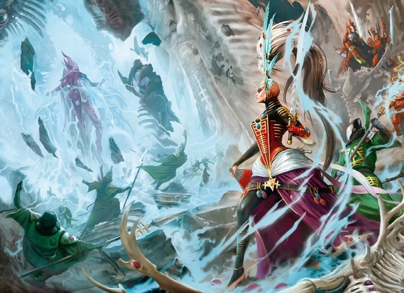

# 0572 伊纳德 Ynnead

精校状态：中文行文已逐段精校，部分术语仍为暂定

分类：概念 / 异型 Xenos / 艾达灵族 Aeldari

原文来源：https://www.bilibili.com/opus/1078628100962517046

原作者：帝国神选罐头

原文时间：2025年06月15日 16:27

[返回分类目录](目录.md) · [全书目录](../../目录.md)

原篇名：因尼德 Ynnead

<!-- A0572-B0001 -->
**英文原文**

Ynnead, also known as Whispering God or the God of the Dead, is a supposedly nascent unborn Eldar God growing in the collective Infinity Circuits of every Craftworld, from the souls of dead Eldar. Its relationship to Kaela Mensha Khaine is unclear. It has yet to manifest itself, but it is prohesised that he shall rise only when the last aeldari is slain and spell doom for She Who Thirsts. He is the patron deity of the Ynnari who seek to bring about his resurrection.

<!-- /A0572-B0001 -->

<!-- A0572-B0002 -->

原译文

因尼德，也被称为低语之神或死神，是一个据称新生的未诞生的灵族神，从死去的灵族的灵魂中生长在每个方舟世界的集体无限回路中。祂与凯拉·曼沙·凯恩的关系尚不清楚。它还没有显现出来，但有人怀疑，只有当最后一个方舟灵族被杀时，祂才会复活，并为饥渴女士带来厄运。祂是寻求实现祂的复活的死神军的守护神。

**校订译文**

伊纳德，又称“低语之神”或“亡者之神”，据说是一位尚在孕育中的灵族神祇，由各方舟世界无限回路中亡者的灵魂滋养壮大。祂与血手凯恩的关系尚不清楚。按早期预言，只有最后一名艾达灵族死去，祂才会完全觉醒，将毁灭带给饥渴女士。伊纳德也是死神军的守护神，其追随者正努力促成祂的苏醒。

**校注：** Ynnead沿官方完整名称“伊纳德信徒”采用词根伊纳德，原因尼德保留原篇名和原译；prohesised疑为prophesied，指预言，不是有人怀疑。Aeldari为整个种族，非只指方舟灵族。开头未显现与末尾已开始觉醒属于资料时期差异，以早期预言衔接。

<!-- /A0572-B0002 -->

<!-- A0572-B0003 图片 -->

<!-- A0572-B0004 -->

原译文

The rune of Ynnead 因尼德的符文

**校订译文**

The rune of Ynnead 伊纳德的符文

<!-- /A0572-B0004 -->

<!-- A0572-B0005 -->
## Eldar legend 灵族传说

<!-- /A0572-B0005 -->

<!-- A0572-B0006 -->
**英文原文**

Ynnead represents the last hope of the dwindling Eldar race. They believe that when the Infinity Circuits hold all the spirits of their race, all of the Craftworlds will unite into one Infinity Circuit, and the collective spirits of the Eldar will join to form a new Power in the Warp that will battle and subdue Slaanesh, so that Eldar spirits may once more be able to merge with it and form a single, balanced entity. By doing so, if such a thing is possible, they hope that this will allow the Eldar race to be reborn into a better form. Meanwhile, the Craftworlds and the spirit stones must be guarded from harm and continue to survive, so that all Eldar can see and form in their own minds a concept of the Eldar virtues that will enter along with their spirits into the Infinity Circuits.

<!-- /A0572-B0006 -->

<!-- A0572-B0007 -->

原译文

因尼德代表了灵族种族衰落的最后希望。他们相信，当无限回路容纳了他们种族的所有灵魂时，所有的方舟世界将团结成一个无限回路，灵族的集体灵魂将联合起来，在亚空间中形成一个新的力量，与色孽作战并征服色孽，这样灵族的灵魂就可以再次与之融合，形成一个单一的、平衡的实体。通过这样做，如果这样的事情是可能的，他们希望这将使灵族种族重生为更好的形态。与此同时，必须保护方舟世界和灵石免受伤害并继续生存，这样所有灵族都可以在自己的脑海中看到并形成灵族美德的概念，这些美德将与他们的灵魂一起进入无限回路。

**校订译文**

伊纳德寄托着衰亡灵族最后的希望。他们相信，当无限回路收容了全族灵魂，各方舟的回路便会合为一体。亡者共同凝聚出新的亚空间力量，与色孽交战并将其制服，让灵族灵魂再次融为平衡统一的存在。他们希望，若这一切能够实现，整个种族便可化为更好的形态重生。在此之前，方舟世界与魂石必须得到保护，继续存在；生者也必须理解、铭记灵族的美德，使这些理念随灵魂一同进入无限回路。

**校注：** 原英文 merge with it 代词所指含混，按后续single balanced entity表述为灵魂形成统一存在，不擅自断言与色孽融合。

<!-- /A0572-B0007 -->

<!-- A0572-B0008 -->
**英文原文**

As Eldar die and their souls become part of the Infinity Circuits, the god grows in power. A few Eldar Seers believe that once every single Eldar has died, Ynnead will awaken and have the strength to defeat Slaanesh forever. In 991.M41, the Eldar Mystic Kysaduras proclaimed that the only hope of Eldar survival in the End Times would lay with Ynnead.

<!-- /A0572-B0008 -->

<!-- A0572-B0009 -->

原译文

随着灵族的死亡，他们的灵魂成为无限回路的一部分，神的力量越来越大。一些灵族先知相信，一旦每个灵族都死了，因尼德就会醒来，并有力量永远击败色孽。991.M41，灵族秘者凯萨杜拉斯宣称，灵族在终焉之刻的唯一希望在于因尼德。

**校订译文**

灵族不断死去，灵魂汇入无限回路，伊纳德的力量也随之增长。少数先知相信，待全族最后一个个体死亡，祂便会觉醒，获得彻底击败色孽的力量。991.M41，灵族秘术师凯萨杜拉斯宣称，在终焉之刻，灵族唯一的生存希望便是伊纳德。

<!-- /A0572-B0009 -->

<!-- A0572-B0010 图片 -->

<!-- A0572-B0011 -->

原译文

The birth of Ynnead 因尼德的诞生

**校订译文**

The birth of Ynnead 伊纳德的诞生

<!-- /A0572-B0011 -->

<!-- A0572-B0012 -->
## Early awakening attempts 早期觉醒尝试

<!-- /A0572-B0012 -->

<!-- A0572-B0013 -->
**英文原文**

Eldrad Ulthran attempted to undertake a great ritual that would prematurely awaken Ynnead, involving channeling the remains of Farseers through every Infinity Circuit. The ritual would have rendered every Craftworld disabled and wreaked havoc on the Astronomican, but Slaanesh may have ultimately met its end. However, he was foiled by the Deathwatch in the Battle of Port Demesnus.

<!-- /A0572-B0013 -->

<!-- A0572-B0014 -->

原译文

埃尔德拉德·乌索然试图进行一个大仪式，过早地唤醒因尼德，包括通过每个无限回路引导先知的遗体。这个仪式会使每个方舟世界都瘫痪，并对星炬造成严重破坏，但色孽可能最终会走到尽头。然而，他在德梅斯努斯港战役中被死亡守望击败了。

**校订译文**

艾尔德拉德·乌瑟兰曾试图举行盛大仪式，借各无限回路汇聚大先知遗存的力量，提前唤醒伊纳德。仪式将使全部方舟世界陷于瘫痪，严重干扰星炬，却也可能最终终结色孽。然而，在德梅斯努斯港之战中，死亡守望挫败了这一计划。

**校注：** remains与channeling关系在英文中较简略，译遗存的力量而非把遗体实体运过每条回路；仪式结果保持would/may的未实现语气。

<!-- /A0572-B0014 -->

<!-- A0572-B0015 -->
**英文原文**

Later, the Ynnari were formed to once again attempt to bring about the resurrection of Ynnead. Led by Yvraine, they seek to use the Crone Swords to revive the God without having to sacrifice the Eldar race, a ritual known as the Seventh Path. Ynnead has begun to awaken, bringing about its Avatar known as the Yncarne.

<!-- /A0572-B0015 -->

<!-- A0572-B0016 -->

原译文

后来，死神军成立，再次试图使因尼德复活。在伊弗蕾妮的带领下，他们试图使用老妪之剑来复活神，而不必牺牲灵族种族，这是一种被称为第七道途的仪式。因尼德已经开始觉醒，带来了被称为因卡恩的化身。

**校订译文**

后来，死神军成立，再度寻求唤醒伊纳德。伊芙蕾妮率领他们寻找老妪之剑，希望借“第七道途”仪式，让亡者之神苏醒，而无须牺牲整个灵族。伊纳德已开始觉醒，其化身因卡恩也随之显现。

<!-- /A0572-B0016 -->

本篇核心术语与暂定项

以下列出本篇出现的英文原形及核心术语表用词。同形词可能指不同对象，具体词义以本篇正文和校注为准；单复数、别名和仅见于图注的名称可能尚未列入。完整候选见[术语表](../../术语表/双语术语候选.csv)。

| 英文 | 采用中文 | 状态 |
| --- | --- | --- |
| Deathwatch | 死亡守望 | 官方已核对 |
| Aeldari | 艾达灵族 | 官方已核对 |
| Eldar | 灵族 | 暂定·语境区分 |
| Astronomican | 星炬 | 暂定 |
| Warp | 亚空间 | 官方已核对 |
| Craftworld | 方舟世界 | 官方已核对 |
| Slaanesh | 色孽 | 官方已核对 |
| Mystic | 神秘者 | 暂定·官方待核 |
| Reborn | 复生者（战团）／重生者（死神军自称） | 语境定译·官方待核 |
| Virtues | 力天使 | 暂定·官方待核 |
| Eldrad Ulthran | 艾尔德拉德·乌瑟兰 | 官方已核对 |
| She Who Thirsts | 饥渴女士 | 暂定·官方待核 |
| Yvraine | 伊芙蕾妮 | 官方已核对 |
| The Yncarne | 因卡恩 | 官方已核对 |
| Ynnead | 伊纳德 | 官方词根参考·单名待核 |
| Kaela Mensha Khaine | 血手凯恩 | 暂定·官方待核 |
| Infinity Circuit | 无限回路 | 暂定·官方待核 |
| Ynnari | 死神军 | 暂定·官方待核 |
| Whispering God | 低语之神 | 暂定·官方待核 |
| Kysaduras | 凯萨杜拉斯 | 暂定·官方待核 |
| Port Demesnus | 德梅斯努斯港 | 暂定·官方待核 |
| Crone Swords | 老妪之剑 | 暂定·官方待核 |
| Seventh Path | 第七道途 | 暂定·官方待核 |

