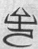
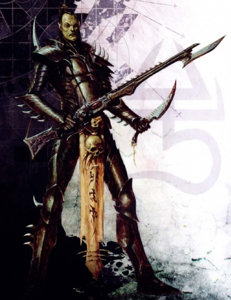
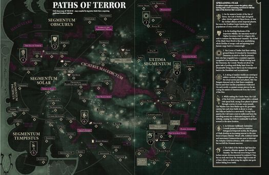
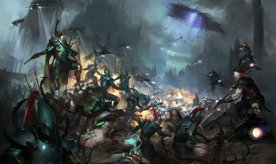
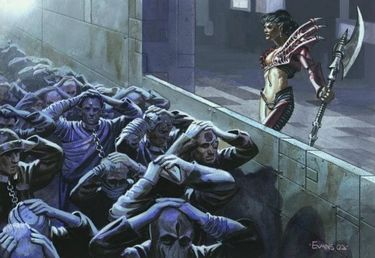
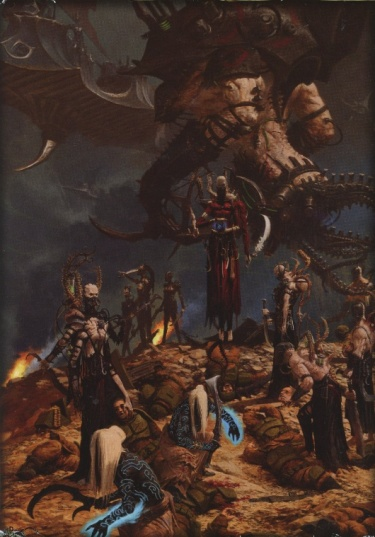

# 0573 黑暗灵族 Drukhari

精校状态：中文行文已逐段精校，部分术语仍为暂定

分类：概念 / 异型 Xenos / 艾达灵族 Aeldari

原文来源：https://www.bilibili.com/opus/1124221669857034272

原作者：帝国神选罐头

原文时间：2025年10月16日 13:14

[返回分类目录](目录.md) · [全书目录](../../目录.md)

<!-- A0573-B0001 -->
**英文原文**

The Drukhari or Dark Eldar are kindred to the Asuryani and other Aeldari, an ancient and advanced race of elf-like humanoids. Their armies usually have the advantages of speed and technology, though they are often lacking in resilience and numbers. The Dark Eldar revel in piracy, enslavement and torture, and are sadistic in the extreme. Dark Eldar raiding parties make use of advanced anti-gravity skimmers to launch high speed raids on their enemy while still transporting a large number of their warriors. Due to their use of the galaxy-spanning inter-dimensional labyrinth known as the Webway, they are extremely mobile, striking from seemingly nowhere, with little or no warning, and vanishing with their captives before significant military reaction can be mobilised.

<!-- /A0573-B0001 -->

<!-- A0573-B0002 -->

原译文

杜鲁卡里或黑暗灵族与阿苏里亚尼和其他艾尔达里有亲缘关系，这是一个古老而先进的类精灵类人种族。他们的军队通常具有速度和技术优势，尽管他们往往缺乏韧性和数量。黑暗灵族沉迷于海盗、奴役和酷刑，极端残忍。黑暗灵族突袭队利用先进的反重力悬浮艇对敌人发动高速突袭，同时仍运送大量战士。由于他们使用了被称为网道的横跨星系的跨维度迷宫，他们非常灵活，似乎可以在没有任何警告的情况下从任何地方发起攻击，在重大军事反应被动员之前，他们就带着俘虏消失了。

**校订译文**

黑暗灵族（Drukhari，旧称 Dark Eldar）与阿苏焉尼及其他艾达灵族同出一族，属于古老而先进、外貌近似精灵的类人种族。他们的军队通常以速度与技术见长，却相对缺乏人数和承受打击的能力。黑暗灵族沉迷劫掠、奴役与酷刑，残忍至极。他们乘先进的反重力悬浮艇，运送大批战士发起高速袭击；又借横跨银河、连通异维度的网道迷宫来去自如，常毫无预警地突然出现，在敌人组织有效反击之前，便带着俘虏消失。

<!-- /A0573-B0002 -->

<!-- A0573-B0003 图片 -->

<!-- A0573-B0004 -->

原译文

Rune of the Dark Eldar 黑暗灵族符文

**校订译文**

Rune of the Dark Eldar 黑暗灵族符文

<!-- /A0573-B0004 -->

<!-- A0573-B0005 -->
**英文原文**

The Dark Eldar are unique amongst the races in the sense that they do not occupy many planets, but rather one dark city called Commorragh. They are mainly pirates, though are sometimes used as mercenaries.

<!-- /A0573-B0005 -->

<!-- A0573-B0006 -->

原译文

黑暗灵族在种族中是独一无二的，因为他们不占据许多行星，而是位于一个名为科摩罗的黑暗之城。他们主要是海盗，但有时也被用作雇佣兵。

**校订译文**

黑暗灵族并不依靠占据大量行星维生，而主要聚居于暗城科摩罗。他们大多从事劫掠，有时也受雇为佣兵。

<!-- /A0573-B0006 -->

<!-- A0573-B0007 图片 -->

<!-- A0573-B0008 -->

原译文

Dark Eldar Warrior 黑暗灵族战士

**校订译文**

Dark Eldar Warrior 黑暗灵族战士

<!-- /A0573-B0008 -->

<!-- A0573-B0009 -->
**英文原文**

Asdrubael Vect is the supreme overlord of the dark city of Commorragh and of the Dark Eldar as a whole. The term "Dark Eldar" also comes from him, being the first one to openly refer himself with "Eladrith Ynneas" in M32.

<!-- /A0573-B0009 -->

<!-- A0573-B0010 -->

原译文

阿斯鲁拜尔·维克特是黑暗之城科摩罗和整个黑暗灵族的最高统治者。“黑暗灵族”一词也来自他，他是M32中第一个公开称自己为“艾拉德斯·伊涅阿斯”的人。

**校订译文**

阿斯杜巴尔·维克特是科摩罗及整个黑暗灵族的至高霸主。“黑暗灵族”一名也源于他：M32，他首次公开以“Eladrith Ynneas”自称，意即黑暗灵族。

<!-- /A0573-B0010 -->

<!-- A0573-B0011 -->
## History 历史

<!-- /A0573-B0011 -->

<!-- A0573-B0012 -->
### Origins 起源

<!-- /A0573-B0012 -->

<!-- A0573-B0013 -->
**英文原文**

The origins of the Dark Eldar can be found in the Fall of the Eldar, the great cataclysm that nearly destroyed the entire Eldar race. It was an event so terrible that not only did it kill trillions of Eldar, but it breached the gap between real space and the Warp, and gave birth to Slaanesh, a Chaos God.

<!-- /A0573-B0013 -->

<!-- A0573-B0014 -->

原译文

黑暗灵族的起源可以在灵族陨落中找到，这场大灾难几乎摧毁了整个灵族种族。这是一个如此可怕的事件，它不仅杀死了数万亿的灵族，而且打破了现实空间和亚空间之间的缺口，并诞生了混沌之神色孽。

**校订译文**

黑暗灵族的起源，要追溯到几乎毁灭整个种族的“灵族陨落”。这场灾难夺走数万亿灵族的生命，撕裂现实与亚空间之间的屏障，并使混沌之神色孽诞生。

<!-- /A0573-B0014 -->

<!-- A0573-B0015 -->
**英文原文**

To understand the reasons for the Fall, it is necessary to know something of the Eldar mind and soul.

<!-- /A0573-B0015 -->

<!-- A0573-B0016 -->

原译文

要理解陨落的原因，有必要了解灵族的思想和灵魂。

**校订译文**

要理解陨落的原因，有必要了解灵族的思想和灵魂。

<!-- /A0573-B0016 -->

<!-- A0573-B0017 -->
**英文原文**

An Eldar's mind is incredibly complex. Their senses are extremely sharp, able to perceive incredible levels of detail. Their emotions can be so strong that a human's are merely pale shadows by comparison. They are extremely intelligent; their thought processes are much faster than a human's. All of this means that an Eldar experiences the universe and all its sensations to a greatly heightened degree. Similarly, an Eldar's soul is much brighter in the Warp than those of "lesser" sentients. Eldar are able to affect the nether-realm much more than most other races. They are all latent psykers and have the ability to become very powerful with training. It is the strength of their souls that was one of the causes of their downfall. Before the Fall, the Eldar had an immense galaxy-spanning empire comprising millions of worlds, larger and more powerful than even the Imperium of Man at the height of its power. The Eldar lived in relative peace - barbarian races such as the Orks were kept at easily manageable numbers and never had the strength to threaten the might of the Eldar empire. The humans were not yet virulently xenophobic and did not have a large domain, and the Tyranid Hive Fleets were unknown. The C'tan and Necrons, ancient foes of the Eldar, were long ago defeated and still remained dormant.

<!-- /A0573-B0017 -->

<!-- A0573-B0018 -->

原译文

灵族的思维极其复杂。他们的感官非常敏锐，能够感知到令人难以置信的细节。他们的情绪可能非常强烈，相比之下，人类的情绪只是苍白的影子。他们非常聪明；他们的思维过程比人类快得多。所有这些都意味着灵族对宇宙及其所有感觉的体验程度大大提高。同样，在亚空间中，灵族的灵魂比“较小”的有情种族的灵魂要明亮得多。灵族比大多数其他种族更能影响下域。他们都是潜在的灵能者，有能力通过训练变得非常强大。正是他们灵魂的力量是他们陨落的原因之一。在陨落之前，灵族拥有一个巨大的跨星系帝国，由数百万个世界组成，甚至比人类帝国在其力量巅峰时更大、更强。灵族生活在相对和平的环境中 — 像欧克这样的野蛮种族被控制在易于管理的数量，从未有过威胁灵族帝国力量的力量。人类还没有强烈的仇外心理，也没有一个大的领地，泰伦虫巢舰队也不为人所知。星神和死灵，灵族的宿敌，早已被击败，至今仍处于休眠状态。

**校订译文**

灵族的心智极其复杂，感官敏锐得足以分辨人类难以察觉的细节，情感更强烈得让人类的体验相形见绌。他们聪慧异常，思考也远快于人类，因此对宇宙与一切感受的体验，都远为深刻。在亚空间中，灵族的灵魂也比所谓“低等”智慧生物明亮得多，更能影响这个非物质领域。所有灵族都有潜在的灵能天赋，经训练后可变得极其强大；而灵魂过于强盛，恰是其衰亡的原因之一。陨落前，灵族拥有横跨银河、包含数百万世界的帝国，规模与力量甚至超过鼎盛的人类帝国。他们生活相对安宁：欧克等野蛮种族的数量受控，无力威胁其霸权；人类尚未变得极度仇视异形，也没有广阔疆域；泰伦虫巢舰队尚未出现于其认知之中。古老宿敌星神与太空死灵，则已战败、沉眠。

**校注：** lesser 为轻蔑意义的低等，不是体型较小；早期人类疆域、星神和死灵战败叙述按原文时期与版本保留。

<!-- /A0573-B0018 -->

<!-- A0573-B0019 -->
**英文原文**

Life on the Eldar Worlds was idyllic, with fantastically sophisticated machines to take care of all labour and manufacturing required, leaving the Eldar free to indulge in other, more aesthetic pursuits. With all menial work taken care of for them, the Eldar became indolent and decadent. They began to explore more and more the arts of pleasure, delving ever deeper into hedonism. This descent into decadence spanned millennia. Tradition and order disintegrated, as they limited the pursuit of pleasure. Sects called Pleasure Cults were formed, dedicated to achieving the highest levels of hedonistic sensation, and their ceremonies and practices became ever more wild, eventually devolving into violence and sacrifice of their own kind. Some Eldar hated what their race had become and left the homeworlds for the virgin Maiden Worlds or left on the newly-constructed Craftworlds, leaving the Pleasure Cults to their madness. During this time the Eldar had also discovered the Webway and soon mastered it to further their galaxy-spanning civilisation. Building realms and outposts within the Webway to act as ports for inter-galactic travel, the city of Commorragh was founded. Isolated within the Webway, Commorragh itself soon became a bastion for pleasure cults and increasingly depraved acts.

<!-- /A0573-B0019 -->

<!-- A0573-B0020 -->

原译文

灵族世界的生活是田园诗般的，有极其复杂的机械来处理所需的所有劳动和制造业，让灵族可以自由地沉迷于其他更艺术的追求。由于所有枯燥的工作都得到了照顾，灵族变得懒散颓废。他们开始探索越来越多的欢愉艺术，越来越深入地研究享乐主义。这种衰落跨越了数千年。传统和秩序瓦解了，因为它们限制了对欢愉的追求。被称为“欢愉教派”的教派成立了，致力于达到最高水平的享乐主义感觉，他们的仪式和实践变得越来越狂野，最终演变成了他们自己的暴力和牺牲。一些灵族憎恨他们种族的现状，离开家园世界去了少女世界，或者离开了新建的方舟世界，让欢愉教派疯狂。在这段时间里，灵族还发现了网道，并很快掌握了它，以推进他们跨越银河系的文明。科摩罗城在网道内建立了王国和前哨，作为星际航行的港口，建立了。科摩罗被隔离在网道内，很快就成为了欢愉教派和日益堕落行为的堡垒。

**校订译文**

灵族世界宛如乐园。精密无比的机器承担劳动与生产，让居民自由追求艺术与审美。琐务尽被代劳，灵族渐趋懒散、腐化，在数千年间越来越沉溺享乐。传统与秩序妨碍欲望，便被逐步抛弃；“欢愉教派”应运而生，追逐极致感官刺激，仪式日渐狂野，最终沦为对同胞施暴、活祭。一些灵族厌恶这种堕落，离开母星，迁往未受开发的少女世界，或乘新建方舟远去，留下欢愉教派继续疯狂。按本节记述，灵族在这一时期发现、掌握网道，并于其中建立领地与前哨，作为跨越群星的港口，科摩罗由此兴起。与外界隔绝的暗城，很快成为欢愉教派与愈发堕落行径的温床。

**校注：** left on newly-constructed Craftworlds 指乘方舟离去，原译离开方舟方向错误。此段网道发现时间与571、563古圣传授的叙述不一致，保留出处差异。

<!-- /A0573-B0020 -->

<!-- A0573-B0021 -->
**英文原文**

Meanwhile, something terrible was stirring in the Warp. The millennia of Eldar hedonism had made a massive impact in the psychic realm of Chaos. Within the warp the decadent Eldar civilisation was giving shape to a Power of Chaos, which grew and grew over thousands of years, getting stronger and more defined until suddenly it sparked into an intelligence - a shatteringly huge and malign intelligence, with an immense and bottomless thirst for Eldar souls. This was the birth of Slaanesh. The process lasted for thousands of years, corresponding with mankind's Age of Strife, although when Slaanesh finally came into being, the results for the universe were apocalyptic and sudden. An almighty psychic shockwave scythed across the galaxy. The souls of almost every Eldar were stripped from them in an instant and devoured by the new-born Chaos god. There were few survivors. Most were driven mad, their minds trapped half in the real world and half in the swirling insanity of the Warp. A great Warp rift was created, encompassing the entire Eldar empire and creating the Eye of Terror.

<!-- /A0573-B0021 -->

<!-- A0573-B0022 -->

原译文

与此同时，亚空间中似乎有什么可怕的东西在搅动。数千年的灵族享乐主义对混沌的灵能领域产生了巨大的影响。在亚空间中，颓废的灵族文明正在形成一种混沌的力量，这种力量在数千年的时间里不断增长，变得越来越强大和明确，直到突然间它激发出一种智慧 — 一种巨大而邪恶的智慧，对灵族的灵魂有着巨大而无底的渴望。这就是色孽的诞生。这一过程持续了数千年，与人类的纷争时代相对应，尽管当色孽最终形成时，宇宙的结果是世界末日和突然的。一股强大的灵能冲击波横扫银河系。几乎每个灵族的灵魂都在一瞬间被剥夺，并被新生的混沌之神吞噬。幸存者很少。大多数人都疯了，他们的思维一半被困在现实世界中，一半被困于亚空间的疯狂漩涡中。一个巨大的亚空间裂缝被创造出来，包围了整个灵族帝国，并创造了恐惧之眼。

**校订译文**

与此同时，可怕的存在正在亚空间中孕育。数千年的放纵对灵能领域产生深远影响，使一种混沌力量逐渐成形。它不断壮大，轮廓日益清晰，最终迸发出意识——庞大、邪恶，对灵族灵魂有着无底的饥渴。这便是色孽。孕育过程历时数千年，与人类纷争时代大致相重合；真正诞生时，灾变却来得突如其来、毁天灭地。灵能冲击波横扫银河，几乎所有灵族的灵魂都在瞬间被剥离，由新生的混沌神吞噬。幸存者寥寥，且多数陷入疯狂，心智一半困于现实，一半陷于亚空间的混乱。巨大裂口吞没了灵族帝国，形成恐惧之眼。

<!-- /A0573-B0022 -->

<!-- A0573-B0023 -->
**英文原文**

The denizens of Commorragh, however, were tucked away safely in the Webway, protected from Slaanesh and its thirst. Though much of the Webway was in ruin, they had endured, and unlike their Craftworld counterparts, remained unrepentant. Though they discovered Slaanesh was still slowly claiming their souls, the denizens of Commorragh soon discovered that by absorbing the pain and torments of another's soul, they could rejuvenate themselves and cheat death. Assuming they could feed regularly, the Eldar of the Webway had become physically immune to the passage of time. Soon the Eldar of the Webway began raiding realspace in search of captives and slaves to rejuvenate themselves with. Moreover, despite the physical requirement for thirsting for souls, many Dark Eldar have discovered a thirst for absorbing the pain of others, a side-effect of Slaanesh picking at their souls. So it was that the Dark Eldar were born, a race of sadistic murderers who feed upon the anguish of others to prevent the death of their immortal souls. Into this city of horrors rose the ruthless Asdrubael Vect, who has purged his rivals and ruled Commorragh as its undisputed Overlord for millennia.

<!-- /A0573-B0023 -->

<!-- A0573-B0024 -->

原译文

然而，科摩罗的居民被安全地藏在网道里，免受色孽和它的饥渴。尽管网道的大部分地区都处于废墟之中，但他们坚持了下来，与他们的方舟世界同行不同，他们仍然不悔改。尽管他们发现色孽仍在慢慢地夺走自己的灵魂，但科摩罗的居民很快发现，通过吸收他人灵魂的痛苦和折磨，他们可以恢复活力并欺骗死亡。假设它们可以定期进食，网道的灵族已经对时间的流逝产生了身体免疫力。不久，网道的灵族开始突袭现实空间，寻找俘虏和奴隶来恢复活力。此外，尽管渴望灵魂的生理需求，但许多黑暗灵族发现了吸收他人痛苦的渴望，这是色孽攻击他们灵魂的副作用。就这样，黑暗灵族诞生了，这是一个虐待狂杀人犯的种族，他们以他人的痛苦为食，以防止他们不朽的灵魂死亡。无情的阿斯鲁拜尔·维克特进入了这座恐怖之城，他清洗了他的对手，并统治了科摩罗作为其无可争议的霸主长达数千年。

**校订译文**

科摩罗居民却藏在网道深处，避过色孽诞生时的吞噬。网道虽大面积损毁，他们仍活了下来，而且不同于方舟同胞，丝毫不愿悔改。不久，他们发现色孽仍在缓缓蚕食自身灵魂，也找到抵抗之法：吸收他人灵魂的痛苦与折磨，可以使自己重获活力、逃过死亡。只要能持续“进食”，网道居民的身体便可摆脱岁月侵蚀。他们遂开始劫掠现实宇宙，搜捕奴隶与俘虏。除维生需要外，色孽对灵魂的侵蚀也让许多人逐渐嗜好他人的苦难。黑暗灵族由此形成：一群虐杀成性的劫掠者，以受害者的痛苦维系自身灵魂。在这座恐怖之城中，残酷的阿斯杜巴尔·维克特崛起，清洗对手，成为数千年来无人能挑战的霸主。

<!-- /A0573-B0024 -->

<!-- A0573-B0025 图片 -->

<!-- A0573-B0026 -->

原译文

Recent Dark Eldar activity 近期黑暗灵族行动

**校订译文**

Recent Dark Eldar activity 近期黑暗灵族行动

<!-- /A0573-B0026 -->

<!-- A0573-B0027 -->
### Ages of the Dark City 黑暗之城时代

<!-- /A0573-B0027 -->

<!-- A0573-B0028 -->
**英文原文**

Since the founding of Commorragh, Dark Eldar history has been divided into four primary periods: the Age of Dark Genesis, the Age of Pain, the Age of Plenty, and the Age of the Living Muse.

<!-- /A0573-B0028 -->

<!-- A0573-B0029 -->

原译文

自科摩罗建立以来，黑暗灵族的历史分为四个主要时期：黑暗起源时代、痛苦时代、富裕时代和活缪斯时代。

**校订译文**

自科摩罗建立以来，黑暗灵族历史通常分为四个主要时期：黑暗起源时代、痛苦时代、丰饶时代，以及活体缪斯时代。

**校注：** Age of Plenty丰饶时代；Living Muse按活体缪斯理解，不将Muse当个人名。

<!-- /A0573-B0029 -->

<!-- A0573-B0030 -->
**英文原文**

Since the formation of the Great Rift (known to the Drukhari as the Dathedian), there have been tumutulous developments in Dark Eldar society. Massive Dysjunctions saw Commorragh beset by Daemons, the most notable of these was the Battle of Khaine's Gate. While this situation has largely stabilized, other developments such as the rise of the Ynnari order have further thrown Commorragh into turmoil. This culminated in the Dark Eldar Civil War, where Vect, now reborn as a living Dark Muse, attempted to purge the Dark City of the Ynnari's growing influence. Despite these setbacks, the Dark Eldar are conducting a level of raids unseen in their history and show no signs of stopping their campaign to sustain themselves with the torment of others.

<!-- /A0573-B0030 -->

<!-- A0573-B0031 -->

原译文

自大裂隙形成以来（杜鲁卡里称之为达瑟迪安），黑暗灵族社会出现了混乱的发展。大规模的连接异常使科摩罗被恶魔包围，其中最引人注目的是凯恩之门之战。虽然这种情况在很大程度上已经稳定下来，但其他事态发展，如死神教团的兴起，进一步使科摩罗陷入动荡。这在黑暗灵族内战中达到了高潮，维克特现在重生为活黑暗缪斯，试图清除黑暗之城中死神军日益增长的影响力。尽管遭遇了这些挫折，黑暗灵族正在进行他们历史上前所未见的突袭，并且没有迹象表明他们会停止用对他人的折磨来维持自己的运动。

**校订译文**

大裂隙形成后——黑暗灵族称其为“达瑟迪安”——科摩罗经历连番动荡。大规模析离使恶魔蜂拥而入，最著名的冲突是凯恩之门之战。局势虽渐趋稳定，死神军兴起等变化又带来新的纷争，最终引发黑暗灵族内战。维克特重生为活体黑暗缪斯，试图肃清死神军在暗城日益扩大的影响。尽管遭遇这些挫折，黑暗灵族的劫掠规模仍空前高涨，丝毫没有停止靠折磨他人维生的迹象。

**校注：** Dysjunction与571统一析离，而非笼统连接异常；Ynnari统一死神军。

<!-- /A0573-B0031 -->

<!-- A0573-B0032 -->
## Biology 生理

<!-- /A0573-B0032 -->

<!-- A0573-B0033 -->
**英文原文**

Dark Eldar are similar in many ways to the rest of the Eldar race - tall, lithe, humanoids with tapered ears and sharp eyes. However, generations of physical conflict combined with living inside the Dark City has led to a number of distinct variations. The skin of a Dark Eldar is almost translucent, an effect of the lack of sunlight within Commorragh. Due to being bred over the many millennia for combat, the strength and reflexes of your average Drukhari warrior are actually superior to that of their Craftworld Eldar counterparts. Pict-captures of the Evolus Massacre had to be slowed to one-fourth speed in order to follow the movements of individual Kabalites as they slaughtered Imperial civilians. Stories of Dark Eldar dodging shots from lasguns and kicking frag grenades back into the enemy's ranks are common, and within the gladiatorial arenas a single Wych is more than a match for any ten human warriors. Dark Eldar senses are also sharper, allowing them to see their enemies perfectly well even during pitch darkness.

<!-- /A0573-B0033 -->

<!-- A0573-B0034 -->

原译文

黑暗灵族在很多方面与灵族种族的其他人相似 — 高大、柔软、类人、锥形耳朵和锐利的眼睛。然而，几代人的身体冲突加上生活在黑暗之城中，导致了许多明显的变化。黑暗灵族的皮肤几乎是半透明的，这是科摩罗内部缺乏阳光的结果。由于经过数千年的战斗训练，普通杜鲁卡里战士的力量和反应能力实际上优于他们的方舟世界灵族对手。埃沃勒斯大屠杀的图片捕捉必须放慢到四分之一的速度，才能跟上阴谋团战士屠杀帝国平民的动作。黑暗灵族躲避激光枪射击并将破片手榴弹踢回敌人队伍的故事很常见，在角斗士竞技场中，一个巫灵比任何十个人类战士都要强大。黑暗灵族的感官也更敏锐，即使在漆黑中也能很好地看到敌人。

**校订译文**

黑暗灵族与其他同族一样，身材高挑、动作轻盈，耳朵尖细，目光锐利。不过，世代厮杀与暗城生活，使他们形成一些显著差异：缺乏阳光的科摩罗，让皮肤苍白得近乎透明；历经数千年的战斗性状选育，普通黑暗灵族战士的力量与反应，甚至超过方舟同胞。埃沃勒斯大屠杀的影像，须放慢到四分之一速度，才能看清阴谋团战士屠杀帝国平民的动作。关于他们闪避激光射击、将破片手榴弹踢回敌阵的故事屡见不鲜；角斗场中的一名巫灵，便足以胜过十名人类战士。他们的感官也更敏锐，即使在漆黑中，仍能清楚看见敌人。

**校注：** bred for combat 为长期选育，不只是训练；pict-captures为影像记录，不是需放慢的静态图片。

<!-- /A0573-B0034 -->

<!-- A0573-B0035 图片 -->

<!-- A0573-B0036 -->

原译文

The Dark Eldar at war 战争中的黑暗灵族

**校订译文**

The Dark Eldar at war 战争中的黑暗灵族

<!-- /A0573-B0036 -->

<!-- A0573-B0037 -->
**英文原文**

However, Dark Eldar psykers are virtually unheard-of. Partly due to their focus on physical athleticism the innate psychic abilities common to the Eldar race have atrophied within the Dark Eldar, in large part due to millenia of selective breeding as Asdrubael Vect the Master of Commoragh ordered the execution of psychically-gifted individuals lest they inadvertently provide a foothold for Daemons. Furthermore, to use any psychic powers would draw the attention of Slaanesh, and is one of the few things expressly forbidden even by outsiders within Commorragh. Because of their lack of psychic presence the Drukhari are often able to evade the visions of their Farseer cousins and are one of the few forces that can thus approach a Craftworld without warning. It is possible through the guidance of other kinds of Aeldari for Drukhari outside of Commoragh, such as those who live among the Corsairs, to slowly recover lesser psychic abilities.

<!-- /A0573-B0037 -->

<!-- A0573-B0038 -->

原译文

然而，黑暗灵族灵能者几乎闻所未闻。部分原因是他们专注于身体天赋，灵族种族常见的先天灵能能力在黑暗灵族已经萎缩，很大程度上是由于数千年的选择性繁殖，因为科摩罗之主阿斯鲁拜尔·维克特下令处决有灵能天赋的人，以免他们无意中为恶魔提供立足点。此外，使用任何灵能力量都会引起色孽的注意，这是科摩罗内部少数明确禁止的事情之一。由于他们缺乏灵能存在，杜鲁卡里经常能够避开他们的先知表亲的幻象，是少数能够毫无预警地接近方舟世界的部队之一。在科摩罗之外的杜鲁卡里，例如那些生活在海盗中的人，可以通过其他类型的艾尔达里的指导，慢慢恢复较低的灵能能力。

**校订译文**

然而，黑暗灵族灵能者几乎闻所未闻。一部分原因在于，他们注重肉体能力，天生的灵能逐渐萎缩；更重要的是，数千年的选择性繁衍，以及维克特对灵能者的处决，压制了这一天赋，以免有人无意间为恶魔打开入口。施展灵能还会引来色孽注意，因此成为科摩罗少数明确禁止的行为之一，外来者也不例外。灵能痕迹微弱，使黑暗灵族常能避开大先知的预见，成为少数可悄然接近方舟世界的势力。不过，生活在科摩罗之外、例如加入海盗的黑暗灵族，若得到其他同族指点，仍可能慢慢恢复较弱的灵能。

**校注：** even by outsiders补出禁令也适用于外来者；Farseer大先知与普通先知分开。

<!-- /A0573-B0038 -->

<!-- A0573-B0039 -->
## Technology 科技

<!-- /A0573-B0039 -->

<!-- A0573-B0040 -->
**英文原文**

Dark Eldar, like most Eldar kindreds, make use of advanced technology, including anti-gravity devices, darklight weapons, nanotechnology and psychic artefacts. However, this technology is manufactured instead of being psychically grown, and while Dark Eldar do make use of psychic devices, they do not use psychic powers themselves, for in order to use their gifts Psykers must channel the chaotic energies of the Warp. Such an act would attract the gaze of She Who Thirsts and invite disaster upon the entire race. As such, the use of the psychic pyrotechnics that are so familiar to their Craftworld kin is one of the few things forbidden in the dark spires of Commorragh.

<!-- /A0573-B0040 -->

<!-- A0573-B0041 -->

原译文

与大多数灵族表亲一样，黑暗灵族也使用先进的技术，包括反重力装置、暗光武器、纳米技术和灵能造物。然而，这项技术是制造出来的，而不是灵能培养出来的，虽然黑暗灵族确实使用了灵能装置，但他们自己并不使用灵能力量，因为为了使用他们的天赋，灵能者必须引导亚空间的混乱能量。这样的行为会吸引饥渴女士的目光，并给整个种族带来灾难。因此，在科摩罗的黑暗尖塔中，使用他们的方舟世界表亲所熟悉的灵能技巧是少数被禁止的事情之一。

**校订译文**

黑暗灵族与多数同族一样，掌握反重力、暗光武器、纳米技术及灵能造物等先进手段。但这些装备由制造工艺生产，而非以灵能催生。黑暗灵族虽使用灵能装置，却不亲自施展灵能，因为引导亚空间能量，会招来饥渴女士的注视，祸及整个种族。因此，方舟同胞习以为常的灵能技艺，在科摩罗的暗塔中属于少数禁忌之一。

<!-- /A0573-B0041 -->

<!-- A0573-B0042 -->
## Culture 文化

<!-- /A0573-B0042 -->

<!-- A0573-B0043 -->
**英文原文**

Over time, Dark Eldar begin to suffer more and more from The Thirst. They develop an all-consuming and ever-increasing need to drink the souls of other beings. It is postulated that the cause of this is the Chaos God Slaanesh, the Great Enemy of the Eldar, who leeches the soul-essence of the Dark Eldar while they still live. Dark Eldar drink souls to stave off this leeching - perhaps by sating the thirst of Slaanesh, or perhaps by replenishing the essence of their own souls with that of the consumed one. Slaanesh will also consume the souls of Dark Eldar whole should they die. Dark Eldar are long-lived but not immortal; drinking souls has a rejuvenating effect that reverses ageing, thus Dark Eldar need not fear falling into the clutches of Slaanesh due to death from old age, if they have a constant supply of souls. The usual source of souls is the many captives taken during Dark Eldar raids. However the Dark Eldar do not see the misery they inflict as mere necessity to survive, they relish in their cruelty.

<!-- /A0573-B0043 -->

<!-- A0573-B0044 -->

原译文

随着时间的推移，黑暗灵族开始越来越受饥渴的折磨。他们产生了一种消耗一切且不断增长的需求，即饮其他生物的灵魂。据推测，造成这种情况的原因是混沌之神色孽，灵族的大敌，他在黑暗灵族还活着的时候吸取了他们的灵魂精华。黑暗灵族饮魂来避免这种吸血 — 也许是通过满足色孽的饥渴，也许是通过用被消耗的灵魂来补充自己灵魂的本质。色孽也会吞噬黑暗灵族的灵魂，如果他们死了。黑暗灵族寿命很长，但不是不朽的；饮魂有一种恢复活力的效果，可以逆转衰老，因此，如果黑暗灵族有源源不断的灵魂供应，他们就不必担心因年老而死亡而落入色孽的魔爪。通常的灵魂来源是黑暗灵族突袭期间俘虏的许多人。然而，黑暗灵族并不认为他们造成的痛苦仅仅是生存的必需品，他们喜欢他们的残忍。

**校订译文**

岁月越久，黑暗灵族越受“饥渴”折磨，吞饮其他生灵灵魂的欲望愈发强烈，几乎压倒一切。据推测，大敌色孽在他们活着时，就不断抽取灵魂精髓。黑暗灵族通过饮魂抵御这种侵蚀：也许是暂时满足色孽，也许是用他人灵魂补足自身损失。若真正死去，他们的整个灵魂仍会被祂吞没。黑暗灵族寿命漫长，却并非绝对不死；饮魂能够恢复活力、逆转衰老，只要补给不断，便可避免因老死而落入色孽之手。受害者通常来自劫掠所获的俘虏。不过，他们并不把折磨视作无奈的生存手段，而是乐在其中。

<!-- /A0573-B0044 -->

<!-- A0573-B0045 图片 -->

<!-- A0573-B0046 -->

原译文

Wych observing various sacrificial slaves 巫灵观察各种祭祀奴隶

**校订译文**

Wych observing various sacrificial slaves 巫灵观察各种祭祀奴隶

<!-- /A0573-B0046 -->

<!-- A0573-B0047 -->
**英文原文**

The occupants of Commoragh are sadistic murderers all, abjectly self-serving and incapable of compassion. Violent infighting is common, but full-blown anarchy is prevented by the ruthless hand of Vect. To survive in such a society one must exemplify a ruthless self-sufficiency and embrace an attitude of survival of the fittest. Compassion of any sort is seen as not only disgusting in Dark Eldar society, but also self-damaging as it will inevitably lead to ones enemy's taking advantage of it. This lack of comradery extends even to ones own kin, betrayal, treachery, and power grabs are all common in Dark Eldar society and are even encouraged by its rulers - Vect most of all - as a way to keep any potential opposition divided.

<!-- /A0573-B0047 -->

<!-- A0573-B0048 -->

原译文

科摩罗的居住者都是虐待狂杀人犯，他们都是卑鄙的自私者，没有同情心。暴力内斗很常见，但维克特的无情之手阻止了全面的无政府状态。要在这样一个社会中生存，一个人必须表现出无情的自给自足，并采取适者生存的态度。任何形式的同情不仅在黑暗灵族社会中被视为令人厌恶的，而且会自我伤害，因为它不可避免地会导致敌人利用它。这种缺乏战友情谊的情况甚至延伸到自己的血亲，背叛、变节和夺权在黑暗灵族社会中都很常见，甚至被其统治者鼓励 — 最重要的是维克特 — 以此来分裂任何潜在的反对派。

**校订译文**

科摩罗居民残酷、自私，几无怜悯可言。暴力内斗司空见惯，只有维克特的铁腕，压住了全面失序。在这样的社会中求生，必须冷酷自立，奉行弱肉强食。任何同情都不只令人鄙夷，更会成为敌人可乘之机，反伤自身。即便血亲之间，也难言情谊：背叛、暗算、夺权随处可见，统治者甚至鼓励这种风气，尤其是维克特，以此使潜在反对者永远分裂。

<!-- /A0573-B0048 -->

<!-- A0573-B0049 -->
## Society 社会

<!-- /A0573-B0049 -->

<!-- A0573-B0050 -->
**英文原文**

Dark Eldar society is highly stratified. With a cruel and opulent nobility living in the highest spires of Commorragh, while the miserable and misbegotten underclasses dwell in near-savage conditions in its outermost districts and pocket dimensions. A myriad of other subcultures and factions dwell in the middle, all preying upon one another in a perpetual cycles of violence. Beneath them all are the throngs of slaves of the Dark City, who are little more than an omnipresent resource to be exploited and tormented.

<!-- /A0573-B0050 -->

<!-- A0573-B0051 -->

原译文

黑暗灵族社会是高度分层的。残酷而奢华的贵族生活在科摩罗的至高尖塔上，而悲惨而不幸的下层阶级则生活在最偏远地区和口袋维度里近乎野蛮的条件下。无数其他亚文化和派系都生活在其中，都在暴力的永久循环中相互掠夺。他们下面都是黑暗之城的成群奴隶，他们只不过是一种无处不在的资源，可以被剥削和折磨。

**校订译文**

黑暗灵族社会等级森严。残酷、奢靡的贵族居于科摩罗最高的尖塔；贫苦底层则蜷居最外围城区与口袋维度，生活近乎原始。两者之间，是无数亚文化群体与派系，在永不止息的暴力循环中相互掠夺。最底层则是成群的奴隶，在暗城眼中，不过是无处不在、可供剥削折磨的资源。

<!-- /A0573-B0051 -->

<!-- A0573-B0052 -->
**英文原文**

Within Dark Eldar society, the most important sub-factions are those that wield the most martial strength. These include:

<!-- /A0573-B0052 -->

<!-- A0573-B0053 -->

原译文

在黑暗精灵社会中，最重要的子派系是那些拥有最强军事力量的派系。这些包括：

**校订译文**

黑暗灵族最重要的派系，往往也是掌握最强武力的组织，主要包括：

**校注：** Dark Eldar为黑暗灵族，不是战锤幻想黑暗精灵。

<!-- /A0573-B0053 -->

<!-- A0573-B0054 -->
**英文原文**

Kabals - Essentially large autonomous armed syndicates, many of which are connected to the ruling nobility of High Commorragh. Kabals are led by powerful Archons and wield significant military forces. Essential to conducting realspace raids for more slaves, Kabals are the most powerful and numerous type of organization within Commorragh's complex web of power. The most powerful Kabal is Vect's own Kabal of the Black Heart, but other significant Kabals include the Flayed Skull, Poisoned Tongue, Obsidian Rose, Last Hatred, Dying Sun, Iron Thorn, Broken Sigil.

<!-- /A0573-B0054 -->

<!-- A0573-B0055 -->

原译文

阴谋团 - 本质上是大型的自主武装集团，其中许多与高科摩罗的统治贵族有关。阴谋团由强大的执政官领导，拥有强大的军事力量。阴谋团是科摩罗复杂权力网络中最强大、数量最多的组织，对于进行现实空间突袭获取更多奴隶至关重要。最强大的阴谋团是维克特自己的黑心阴谋团，但其他重要的阴谋团包括有剥皮颅骨、毒舌、黑曜玫瑰、最终仇恨、垂死之日、铁棘、破碎之印。

**校订译文**

阴谋团——规模庞大、独立行事的武装集团，许多与高科摩罗的统治贵族相连。它们由强大的执政官领导，拥有雄厚兵力，是进入现实宇宙捕掠奴隶的主力，也在科摩罗的权力网络中数量最多、势力最强。维克特的黑心阴谋团居于首位；其他重要组织包括剥皮颅骨、毒舌、黑曜玫瑰、最终仇恨、垂死之日、铁棘，以及破碎之印。

<!-- /A0573-B0055 -->

<!-- A0573-B0056 -->
**英文原文**

Wych Cults - Predominately female orders of gladiatorial fighters who specialize in making killing a spectacle. Their life-and-death performances in Commorragh's arenas emit such a level of torment and suffering that the audience members are left well-fed. Led by Succubi, Wych Cults are often frequently called upon to lend their service to realspace raids and can amass significant power and influence despite most of its initiates having once been slaves. The most prominent Wych Cult is the Cult of Strife, but other significant Cults include the Cursed Blade, Red Grief, Seventh Woe, Blade Denied, Wrath Unbound, Thirteenth Night, and Pain Eternal.

<!-- /A0573-B0056 -->

<!-- A0573-B0057 -->

原译文

巫灵教派 - 以女性为主的角斗士团体，专门从事杀戮表演。他们在科摩罗竞技场上的生死表演散发出如此程度的折磨和痛苦，以至于观众们吃得很饱。在魅魔的带领下，巫灵教派经常被要求为现实空间的突袭提供服务，尽管大多数信徒曾经是奴隶，但他们可以积累巨大的权力和影响力。最著名的巫灵教派是纷争教派，但其他重要的教派包括诅咒之刃、红色悲伤、七灾、否定之刃、无拘之怒、第十三夜和永恒痛苦。

**校订译文**

巫灵教团——以女性为主的角斗组织，将杀戮化作表演。竞技场上的生死搏斗散发出强烈痛苦，让观众得以从中“饱餐”。教团由血腥魔女领导，常受邀参加现实宇宙的劫掠；即使多数新入团者曾为奴隶，也能凭此积累巨大权力与影响。最显赫的是纷争教团，另有诅咒之刃、红色悲伤、七灾、拒绝之刃、无拘之怒、第十三夜，以及永恒痛苦。

**校注：** Succubi采用血腥魔女，Wych Cult统一巫灵教团；观众饱餐为吸收痛苦的设定，非普通饮食。

<!-- /A0573-B0057 -->

<!-- A0573-B0058 -->
**英文原文**

Haemonculi Covens - Are led by biotechnological masters dubbed Haemonculi, who are perhaps the most feared and sinister denizens of the Dark City. These diabolical figures are essential to any Kabal, providing not supreme arts of torture just radical military technologies but also biological enhancements. Most importantly, Haemonculi provide regenerative arts to those in their employ should a Drukhari be grievously wounded. In exchange for their services, Covens usually demand a certain tithe of slaves taken by the Kabal. The most notorious Covens of Commorragh are the Prophets of Flesh, Dark Creed, Coven of Twelve, Black Descent, The Hex, The Everspiral, and The Ebon Sting.

<!-- /A0573-B0058 -->

<!-- A0573-B0059 -->

原译文

血伶人巫会 - 由被称为血伶人的生物技术大师领导，他们可能是黑暗之城最可怕和最险恶的居民。这些恶魔般的人物对任何阴谋团来说都是必不可少的，他们不仅提供了至高的酷刑艺术，还提供了激进的军事技术，以及生物增强。最重要的是，如果杜鲁卡里重伤，血伶人为雇佣他们的人提供再生技艺。为了换取他们的服务，巫会通常要求阴谋团从奴隶中抽取一定的什一税。最著名的科摩罗巫会是血肉先知、黑暗信条、十二巫会、黑色血统、六头、永恒螺旋和黑檀之刺。

**校订译文**

血伶人巫会——由生物技术大师血伶人领导，成员或许是暗城最可怕、最阴险的居民。对阴谋团而言，它们不可或缺：既提供登峰造极的酷刑技艺、激进的军事技术，也实施生物强化。最重要的是，血伶人能以再生技术救回重伤的雇主。作为报酬，巫会通常从阴谋团掳来的奴隶中，收取一定份额。著名者包括血肉先知、黑暗信条、十二巫会、黑色血统、咒厄、永恒螺旋，以及黑檀之刺。

**校注：** 英文not...just句法残缺，按所列三类服务还原并列关系。The Hex为咒厄，原六头无依据；Black Descent沿黑色血统，与普通颜色下降区分。tithe原文未指定精确比例，不擅自写成恰好十分之一。

<!-- /A0573-B0059 -->

<!-- A0573-B0060 -->
**英文原文**

Mercenary orders that employ their services to any who can afford it. These include the elite Incubi Shrines, Lhamaean courtesans-poisoners, and terrifying extra-dimensional Mandrakes. Certain non-Drukhari species such as Sslyth are also known to act as mercenaries.

<!-- /A0573-B0060 -->

<!-- A0573-B0061 -->

原译文

雇佣他们为任何负担得起的人提供服务的雇佣兵组织。其中包括精英的梦魇神殿、蕾蜜恩毒妓和可怕的超维度曼德拉。某些非杜鲁卡里物种，如蛇人，也被称为雇佣军。

**校订译文**

雇佣组织——为任何出得起价钱的人效力，包括梦魇剑客神殿、精于用毒的蕾蜜恩交际花，以及来自异维度的可怕曼德拉。蛇人等其他种族，也会充当佣兵。

<!-- /A0573-B0061 -->

<!-- A0573-B0062 -->
**英文原文**

Gangs drawn from the lower regions of Commorragh. These include Reavers, Hellions, and Scourges. While crude and savage, they nonetheless can wield significant power in the more dangerous and destitute regions of the Dark City.

<!-- /A0573-B0062 -->

<!-- A0573-B0063 -->

原译文

来自科摩罗低区的帮派。这些包括掠夺者、地狱行者和天灾。虽然他们粗鲁野蛮，但他们仍然可以在黑暗之城更危险、更贫困的地区行使不可忽略的权力。

**校订译文**

下层帮派——来自科摩罗低层地区，包括劫掠者、滑板暴徒与天灾。他们虽粗野凶暴，在暗城最危险、最贫困的地带，仍可掌握相当权势。

**校注：** Reavers劫掠者与Raider掠袭者飞艇、Ravager破坏者飞艇分别定译，避免原文中掠夺者混用。

<!-- /A0573-B0063 -->

<!-- A0573-B0064 -->
**英文原文**

The Drukhari have a complex relationship with the rest of their Eldar kin. While sometimes targeting their Craftworld or Exodite cousins for raids, they are also known to cooperate with them if the situation demands. The Dark Eldar will also accompany Eldar Corsairs or Harlequins for realspace raids when united in purpose.

<!-- /A0573-B0064 -->

<!-- A0573-B0065 -->

原译文

杜鲁卡里与他们的其他灵族表亲有着复杂的关系。虽然有时会针对他们的方舟世界或蛮荒表亲进行突袭，但众所周知，如果情况需要，他们也会与他们合作。当目标一致时，黑暗灵族还将陪伴灵族海盗或丑角进行现实空间突袭。

**校订译文**

黑暗灵族与其他同族的关系十分复杂：他们有时劫掠方舟或蛮荒灵族，必要时也会合作。目标一致时，他们还会与灵族海盗、丑角一同袭击现实宇宙。

<!-- /A0573-B0065 -->

<!-- A0573-B0066 -->
## Military Forces 军事部队

<!-- /A0573-B0066 -->

<!-- A0573-B0067 -->
**英文原文**

Utilizing the Webway for realspace slave raids, the Dark Eldar way of war is defined by shock, speed, and sowing terror amongst the enemy. Utilizing swift Grav-vehicles such as Raiders, Ravagers, and Venoms backed by heavy airpower, the primary goal of any Drukhari attack is usually to simply scatter any opposition so slaves can be gathered to be taken back to Commorragh. As such, many of their weapons are designed to maim or incapacitate rather than kill. The Drukhari avoid extended campaigns or wars of attrition, unless the potential rewards in suffering are monumentally high.

<!-- /A0573-B0067 -->

<!-- A0573-B0068 -->

原译文

利用网道进行现实空间的奴隶袭击，黑暗灵族的战争方式是通过冲击、速度和在敌人中散播恐怖来定义的。利用由重型空中力量支持的突袭者、掠夺者和毒液等快速反重力再聚，任何杜鲁卡里攻击的主要目标通常都是简单地驱散任何反抗者，这样奴隶就可以被聚集起来带回科摩罗。因此，他们的许多武器旨在致残或重伤，而不是杀人。杜鲁卡里避免长时间的战役或消耗战，除非痛苦的潜在回报非常高。

**校订译文**

黑暗灵族借网道进入现实宇宙捕掠奴隶，作战以突袭、速度与恐惧为核心。掠袭者飞艇、破坏者飞艇、毒液飞艇等快速反重力载具，在强大空中火力支援下出击，通常只求击溃抵抗，抓获奴隶后带回科摩罗。因此，许多武器旨在致残或使敌人失去行动能力，而非立即杀死。除非预期能收获无比丰厚的痛苦，他们通常避免旷日持久的战役和消耗战。

**校注：** grav-vehicles修复原“反重力再聚”错字；三个载具完整名称依GW09/GW10第20页核对。

<!-- /A0573-B0068 -->

<!-- A0573-B0069 -->
**英文原文**

Despite the treacherous nature of Dark Eldar society, their military machine is a well-tuned machine and consist of coalitions of Kabals, Wych Cults, Haemonculi Covens, and other mercenaries all united in the potential for slaves and plunder. Only the most capable warriors are recruited for realspace raids, which makes them terrifying opponents. While acts of betrayal are common within Commorragh, on the battlefield Drukhari usually display uncharacteristic cooperation and discipline while conducting raids due to the value of slaves and torment.

<!-- /A0573-B0069 -->

<!-- A0573-B0070 -->

原译文

尽管黑暗灵族社会具有危险的性质，但他们的军事机械是一台经过精心调整的机械，由阴谋团、巫灵教派、血伶人巫会和其他雇佣兵的联盟组成，他们都团结起来，争夺奴隶和掠夺的潜力。只有最有能力的战士才会被招募到现实空间突袭中，这使他们成为可怕的对手。虽然背叛行为在科摩罗很常见，但在战场上，由于奴隶和折磨的价值，杜鲁卡里在进行突袭时通常表现出不同寻常的合作和纪律。

**校订译文**

尽管黑暗灵族社会充满背叛，其军队却运转精密。阴谋团、巫灵教团、血伶人巫会及各路佣兵，为奴隶与战利品的共同诱惑而结盟。只有最能干的战士才获准参与现实宇宙劫掠，因此格外危险。科摩罗内虽遍布阴谋，突袭时却因俘虏与痛苦的价值，往往展现出平日少有的合作与纪律。

**校注：** treacherous为背信弃义，不是笼统危险；coalition为共同逐利而结盟，不是彼此争夺潜力。

<!-- /A0573-B0070 -->

<!-- A0573-B0071 -->
**英文原文**

Much like Commorragh itself, Dark Eldar armies are anything but uniform and usually tailored to the specific needs of any raid. This exemplifies the Drukhari saying of K’lthrael Aht’Ynris Khlave, or "tailoring the toxin of the blade".

<!-- /A0573-B0071 -->

<!-- A0573-B0072 -->

原译文

就像科摩罗本身一样，黑暗灵族军队绝不是统一，通常是根据任何突袭的具体需求量身定制的。这体现了杜鲁卡里对 克尔特雷尔 阿特伊恩里斯 克莱夫 的说法，即“定制刀刃的毒素”。

**校订译文**

如同科摩罗本身，黑暗灵族军队并无统一编制，而会根据每次袭击的需要组建。这正体现其谚语“K’lthrael Aht’Ynris Khlave”所说的：“为刀刃调配合适的毒药。”

<!-- /A0573-B0072 -->

<!-- A0573-B0073 图片 -->

<!-- A0573-B0074 -->

原译文

Dark Eldar raiding party 黑暗灵族突袭队

**校订译文**

Dark Eldar raiding party 黑暗灵族突袭队

<!-- /A0573-B0074 -->

<!-- A0573-B0075 -->
## Notable Dark Eldar 著名黑暗灵族

<!-- /A0573-B0075 -->

<!-- A0573-B0076 -->
**英文原文**

Arhra, the former leader of the Striking Scorpion Aspect Warriors and founder of the Incubi Warrior Caste.

<!-- /A0573-B0076 -->

<!-- A0573-B0077 -->

原译文

阿赫拉，突击蝎支派战士的前领袖，梦魇战士阶级的创始人。

**校订译文**

阿赫拉——突击战蝎支派战士的前领袖，梦魇剑客阶层的创始者

**校注：** 创立者阿赫拉及达扎尔身份关系保留原文断言与推测各自强度，不把有人认为写成定论。

<!-- /A0573-B0077 -->

<!-- A0573-B0078 -->
**英文原文**

Asdrubael Vect, Supreme Lord of the Kabal of the Black Heart, and overlord of Commorragh.

<!-- /A0573-B0078 -->

<!-- A0573-B0079 -->

原译文

阿斯鲁拜尔·维克特，黑心阴谋团的至高领主，科摩罗的霸主。

**校订译文**

阿斯鲁拜尔·维克特，黑心阴谋团的至高领主，科摩罗的霸主。

<!-- /A0573-B0079 -->

<!-- A0573-B0080 -->
**英文原文**

Aurelia Malys, Leader of the Kabal of the Poisoned Tongue.

<!-- /A0573-B0080 -->

<!-- A0573-B0081 -->

原译文

奥瑞利亚·玛勒丝，毒舌阴谋团的领袖。

**校订译文**

奥瑞利亚·玛勒丝，毒舌阴谋团的领袖。

<!-- /A0573-B0081 -->

<!-- A0573-B0082 -->
**英文原文**

Kheradruakh the Decapitator, Mandrake Champion.

<!-- /A0573-B0082 -->

<!-- A0573-B0083 -->

原译文

斩首者坎杜拉克，曼德拉冠军

**校订译文**

斩首者坎杜拉克，曼德拉冠军

<!-- /A0573-B0083 -->

<!-- A0573-B0084 -->
**英文原文**

Drazhar, the "Master of Blades", Incubi Champion. Believed by some to be Arhra.

<!-- /A0573-B0084 -->

<!-- A0573-B0085 -->

原译文

德拉扎尔，“剑刃大师”，梦魇冠军。有些人认为是阿赫拉。

**校订译文**

达扎尔，“刀锋之主”——梦魇剑客冠军；有人认为他就是阿赫拉

**校注：** 对照本段英文确认同一实体，与全书核心译名统一；不改变同形异义词或省略称呼。

<!-- /A0573-B0085 -->

<!-- A0573-B0086 -->
**英文原文**

Lelith Hesperax, Leader of the Wych Cult of Strife.

<!-- /A0573-B0086 -->

<!-- A0573-B0087 -->

原译文

莉莉丝·赫斯帕克斯，巫灵纷争教派的领袖。

**校订译文**

莉莉丝·海斯佩拉克斯——纷争巫灵教团领袖

<!-- /A0573-B0087 -->

<!-- A0573-B0088 -->
**英文原文**

Baron Sathonyx, The Lord Hellion.

<!-- /A0573-B0088 -->

<!-- A0573-B0089 -->

原译文

萨索尼克斯男爵，地狱行者领主。

**校订译文**

萨索尼克斯男爵——滑板暴徒领主

<!-- /A0573-B0089 -->

<!-- A0573-B0090 -->
**英文原文**

Tahril of the Kabal of the Black Heart, an Archon who leads the Dark Eldar throughout the Kaurava campaign. He has a certain hatred for the Farseers of Ulthwé.

<!-- /A0573-B0090 -->

<!-- A0573-B0091 -->

原译文

黑心阴谋团的塔里尔，一位在整个考拉瓦战役中领导黑暗灵族的执政官。他对乌斯维的先知有一定的仇恨。

**校订译文**

塔里尔——黑心阴谋团执政官，在考拉瓦战役期间率领黑暗灵族。他对乌斯维的大先知怀有敌意。

<!-- /A0573-B0091 -->

<!-- A0573-B0092 -->
**英文原文**

"Duke" Traevelliath Sliscus, Commander of the Sky Serpents.

<!-- /A0573-B0092 -->

<!-- A0573-B0093 -->

原译文

“公爵”特拉维利亚斯·斯莱斯库斯，天蛇的指挥官。

**校订译文**

特拉维利亚斯·斯里斯克斯“公爵”——天空之蛇指挥官

**校注：** 斯里斯克斯与571统一，同一人物较长全名保留；天空之蛇与天蛇原译统一。

<!-- /A0573-B0093 -->

<!-- A0573-B0094 -->
**英文原文**

Urien Rakarth, Master Haemonculus.

<!-- /A0573-B0094 -->

<!-- A0573-B0095 -->

原译文

乌瑞恩·拉卡斯，血伶人之主

**校订译文**

乌瑞恩·拉卡斯，血伶人之主

<!-- /A0573-B0095 -->

<!-- A0573-B0096 -->
**英文原文**

Vraesque, Archon of the Kabal of the Flayed Skull.

<!-- /A0573-B0096 -->

<!-- A0573-B0097 -->

原译文

弗雷斯克，剥皮颅骨阴谋团的执政官

**校订译文**

弗雷斯克，剥皮颅骨阴谋团的执政官

<!-- /A0573-B0097 -->

<!-- A0573-B0098 -->
**英文原文**

El'uriaq, the Tyrant of Shaa-Dom.

<!-- /A0573-B0098 -->

<!-- A0573-B0099 -->

原译文

埃尔’乌里亚克，沙阿-杜姆的暴君

**校订译文**

埃尔·乌里亚克——沙多姆暴君

<!-- /A0573-B0099 -->

<!-- A0573-B0100 -->
## Development History 发展历史

<!-- /A0573-B0100 -->

<!-- A0573-B0101 -->
**英文原文**

The origins of the Dark Eldar as a concept first appeared in Games Workshop limited edition 1987 "Dark Elf Space Trooper", which slightly predated the release of Warhammer 40,000: Rogue Trader. Brutal Eldar Pirates and Corsairs are mentioned throughout the 1st Edition, but it took until 1998's 3rd Edition Codex for the Dark Eldar to receive their first fully fleshed out lore and army. They originally did not have much lore or models, leading to a "revamped" 3rd Edition Codex in 2002.

<!-- /A0573-B0101 -->

<!-- A0573-B0102 -->

原译文

黑暗灵族作为一个概念的起源最早出现在1987年的GW限量版“黑暗灵族太空部队”中，该版本比《战锤40000：行商浪人》的发布稍早。第一版中提到了野蛮的灵族海盗和海贼，但直到1998年的第三版的《黑暗灵族圣典》，他们才获得了第一个完整的传说和军队。他们最初没有太多的传说或模型，导致2002年“修订”了第三版圣典。

**校订译文**

黑暗灵族概念的早期源头，是 Games Workshop 于1987年推出的限量“黑暗精灵太空战士”模型，时间略早于《战锤40,000：行商浪人》发行。第一版中已多次提到凶残的灵族海盗，但直到1998年的第三版《圣典：黑暗灵族》，这一阵营才获得完整的背景与军队设定。最初的背景和模型仍相对有限，因此2002年又推出了修订后的第三版圣典。

**校注：** lore在此为背景设定，不是民间传说；早期模型名Elf按黑暗精灵保留，区别后来阵营Dark Eldar黑暗灵族。

<!-- /A0573-B0102 -->

<!-- A0573-B0103 图片 -->

<!-- A0573-B0104 -->

原译文

The original 1987 "Dark Elf Space Trooper" 1987年的最初“黑暗灵族太空部队”

**校订译文**

The original 1987 "Dark Elf Space Trooper" 1987年最初的“黑暗精灵太空战士”模型

<!-- /A0573-B0104 -->

本篇核心术语与暂定项

以下列出本篇出现的英文原形及核心术语表用词。同形词可能指不同对象，具体词义以本篇正文和校注为准；单复数、别名和仅见于图注的名称可能尚未列入。完整候选见[术语表](../../术语表/双语术语候选.csv)。

| 英文 | 采用中文 | 状态 |
| --- | --- | --- |
| Aeldari | 艾达灵族 | 官方已核对 |
| Eldar | 灵族 | 暂定·语境区分 |
| Drukhari | 黑暗灵族 | 官方已核对 |
| Dark Eldar | 黑暗灵族 | 暂定·旧称对应 |
| Necrons | 太空死灵 | 官方已核对 |
| Orks | 欧克蛮人 | 官方已核对 |
| Warp | 亚空间 | 官方已核对 |
| Great Rift | 大裂隙 | 官方已核对 |
| Imperium of Man | 人类帝国 | 官方已核对 |
| Imperium | 帝国 | 暂定·简称 |
| Webway | 网道 | 暂定 |
| Farseer | 大先知 | 官方已核对 |
| Ulthwé | 乌斯维 | 暂定 |
| Commorragh | 科摩罗 | 官方已核对 |
| Craftworld | 方舟世界 | 官方已核对 |
| History | 历史 | 编辑用语已统一 |
| Eye of Terror | 恐惧之眼 | 官方已核对 |
| Rogue Trader | 行商浪人 | 暂定 |
| Slaanesh | 色孽 | 官方已核对 |
| Asdrubael Vect | 阿斯杜巴尔·维克特 | 暂定·官方待核 |
| Kabal | 阴谋团 | 暂定·官方待核 |
| Archon | 执政官 | 官方已核对 |
| Wych | 巫灵 | 官方已核对 |
| Mandrake | 曼德拉 | 官方已核对 |
| Haemonculus | 血伶人 | 官方已核对 |
| Wych Cult | 巫灵教团 | 官方词根参考·组织全称待核 |
| Asuryani | 阿苏焉尼 | 暂定·官方待核 |
| Exodite | 蛮荒灵族 | 暂定·官方待核 |
| Age of Strife | 纷争时代 | 暂定·官方待核 |
| Perpetual | 永生者 | 暂定·官方待核 |
| Realm of Chaos | 混沌领域 | 暂定·官方待核 |
| Deeper | 深人 | 暂定·官方待核 |
| Kaurava Campaign | 考拉瓦战役 | 暂定·官方待核 |
| Master | 导师（审判庭职衔）／舰务官（舰员职务） | 语境定译·官方待核 |
| Ancient | 旗手 | 官方已核对 |
| Founding | 建军 | 暂定·官方待核 |
| Champion | 冠军 | 暂定·官方待核 |
| Frag Grenades | 破片手榴弹 | 暂定·官方待核 |
| The Kaurava Campaign | 考拉瓦战役 | 暂定·官方待核 |
| Master of Blades | 刀锋之主 | 暂定·官方待核 |
| Overlord | 霸主 | 官方已核对 |
| Reborn | 复生者（战团）／重生者（死神军自称） | 语境定译·官方待核 |
| Tormented | 煎熬 | 暂定·官方待核 |
| Initiates | 进阶者 | 官方已核 |
| Grief | 格里夫 | 暂定·官方待核 |
| Powers | 能天使 | 暂定·官方待核 |
| C'tan | 星神 | 暂定·官方待核 |
| She Who Thirsts | 饥渴女士 | 暂定·官方待核 |
| Drazhar | 达扎尔 | 官方已核对 |
| Lelith Hesperax | 莉莉丝·海斯佩拉克斯 | 官方已核对 |
| Incubi | 梦魇剑客 | 官方已核对 |
| Hellions | 滑板暴徒 | 官方已核对 |
| Maiden Worlds | 少女世界 | 暂定·官方待核 |
| Dathedian | 达瑟迪安 | 暂定·官方待核 |
| Ynnari | 死神军 | 暂定·官方待核 |
| Kabal of the Black Heart | 黑心阴谋团 | 暂定·官方待核 |
| Kabal of the Poisoned Tongue | 毒舌阴谋团 | 暂定·官方待核 |
| Baron Sathonyx | 萨索尼克斯男爵 | 暂定·官方待核 |
| Kheradruakh | 坎杜拉克 | 暂定·官方待核 |
| Wych Cult of Strife | 纷争巫灵教团 | 暂定·官方待核 |
| Sky Serpents | 天空之蛇 | 暂定·官方待核 |
| Urien Rakarth | 乌瑞恩·拉卡斯 | 暂定·官方待核 |
| Vraesque | 弗雷斯克 | 暂定·官方待核 |
| Kabal of the Flayed Skull | 剥皮颅骨阴谋团 | 暂定·官方待核 |
| Shaa-Dom | 沙多姆 | 暂定·官方待核 |
| Eladrith Ynneas | 艾拉德斯·伊涅阿斯 | 暂定·官方待核 |
| Pleasure Cults | 欢愉教派 | 暂定·官方待核 |
| Age of Dark Genesis | 黑暗起源时代 | 暂定·官方待核 |
| Age of Pain | 痛苦时代 | 暂定·官方待核 |
| Age of Plenty | 丰饶时代 | 暂定·官方待核 |
| Age of the Living Muse | 活体缪斯时代 | 暂定·官方待核 |
| Dark Muse | 黑暗缪斯 | 暂定·官方待核 |
| Evolus Massacre | 埃沃勒斯大屠杀 | 暂定·官方待核 |
| The Thirst | 饥渴（黑暗灵族灵魂饥渴） | 暂定·官方待核 |
| High Commorragh | 高科摩罗 | 暂定·官方待核 |
| Obsidian Rose | 黑曜玫瑰 | 暂定·官方待核 |
| Last Hatred | 最终仇恨 | 暂定·官方待核 |
| Dying Sun | 垂死之日 | 暂定·官方待核 |
| Iron Thorn | 铁棘 | 暂定·官方待核 |
| Broken Sigil | 破碎之印 | 暂定·官方待核 |
| Wych Cults | 巫灵教团 | 官方词根参考·组织全称待核 |
| Cult of Strife | 纷争教团 | 暂定·官方待核 |
| Cursed Blade | 诅咒之刃（巫灵教团） | 暂定·官方待核 |
| Red Grief | 红色悲伤 | 暂定·官方待核 |
| Seventh Woe | 七灾 | 暂定·官方待核 |
| Blade Denied | 拒绝之刃 | 暂定·官方待核 |
| Wrath Unbound | 无拘之怒 | 暂定·官方待核 |
| Thirteenth Night | 第十三夜 | 暂定·官方待核 |
| Pain Eternal | 永恒痛苦 | 暂定·官方待核 |
| Haemonculi Covens | 血伶人巫会 | 暂定·官方待核 |
| Prophets of Flesh | 血肉先知 | 暂定·官方待核 |
| Dark Creed | 黑暗信条 | 暂定·官方待核 |
| Coven of Twelve | 十二巫会 | 暂定·官方待核 |
| Black Descent | 黑色血统 | 暂定·官方待核 |
| The Hex | 咒厄 | 暂定·官方待核 |
| The Everspiral | 永恒螺旋 | 暂定·官方待核 |
| The Ebon Sting | 黑檀之刺 | 暂定·官方待核 |
| Incubi Shrines | 梦魇剑客神殿 | 暂定·官方待核 |
| Lhamaean | 蕾蜜恩 | 暂定·官方待核 |
| Sslyth | 蛇人 | 暂定·官方待核 |
| Arhra | 阿赫拉 | 暂定·官方待核 |
| Aurelia Malys | 奥瑞利亚·玛勒丝 | 暂定·官方待核 |
| Tahril | 塔里尔 | 暂定·官方待核 |
| Kaurava | 考拉瓦 | 暂定·官方待核 |
| Traevelliath Sliscus | 特拉维利亚斯·斯里斯克斯 | 暂定·官方待核 |
| Mandrakes | 曼德拉 | 官方已核对 |
| Reavers | 劫掠者 | 官方已核对 |
| Hex | 施法号 | 暂定·官方待核 |
| Kindred | 亲族 | 暂定·官方待核 |
| Dwell | 德威尔 | 暂定·官方待核 |
| Sliscus | 斯里斯克斯 | 暂定·官方待核 |
| The Dark | 《黑暗》 | 暂定·官方待核 |
| Real Space | 现实空间 | 暂定·官方待核 |
| Kin | 炉裔 | 暂定·官方待核 |
| Woe | 悲哀星 | 暂定·官方待核 |
| Unrepentant | 不悔号 | 暂定·官方待核 |
| Warhammer 40,000: Rogue Trader | 战锤40000：行商浪人 | 暂定·官方待核 |
| Games Workshop | Games Workshop | 暂定·官方待核 |

