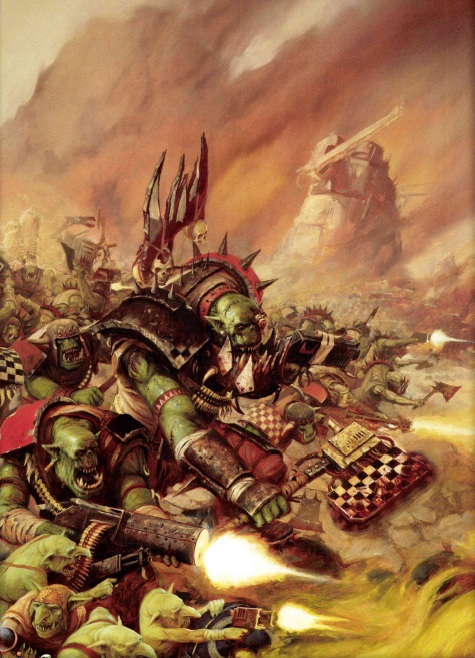
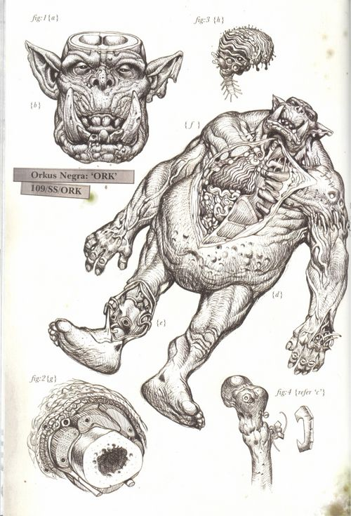
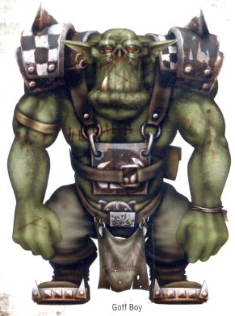
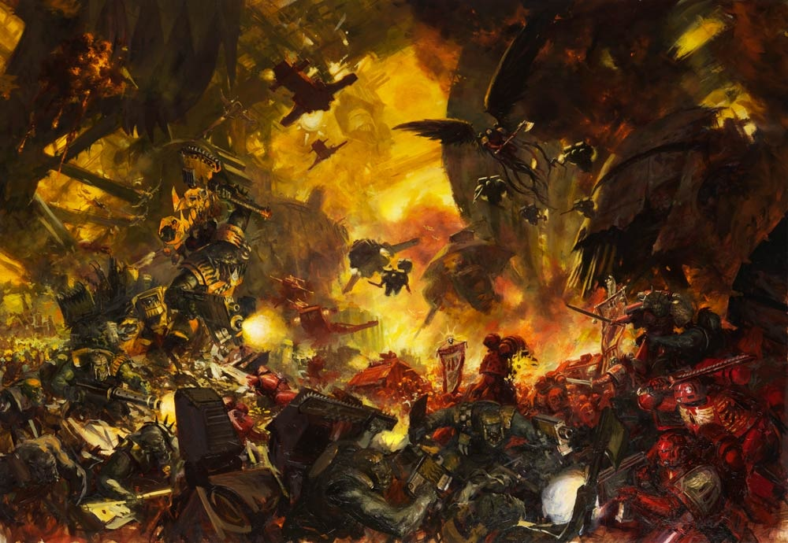
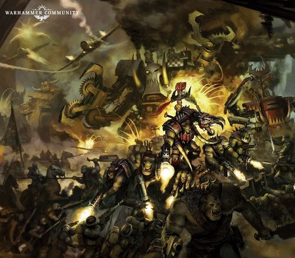
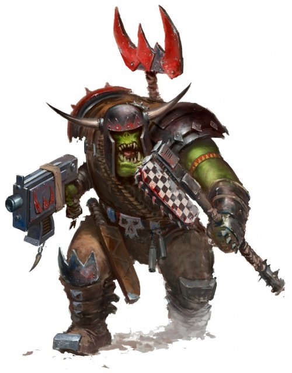
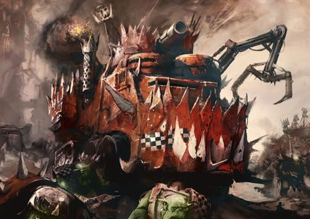
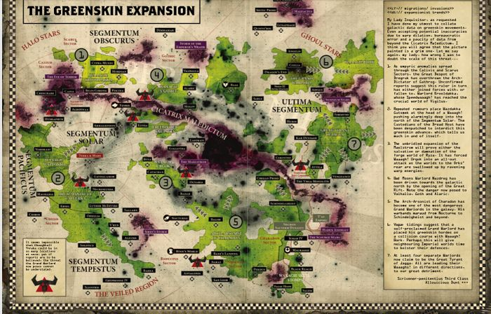
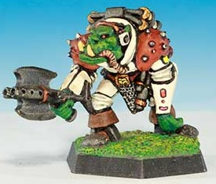

# 0574 欧克蛮人 Orks

精校状态：中文行文已逐段精校，部分术语仍为暂定

分类：概念 / 异型 Xenos / 欧克蛮人 Orks

原文来源：https://www.bilibili.com/opus/1057468381920231430

原作者：帝国神选罐头

原文时间：2025年04月19日 15:57

[返回分类目录](目录.md) · [全书目录](../../目录.md)

<!-- A0574-B0001 -->
**英文原文**

Orks are a warlike, crude, and highly aggressive green-skinned Xenos race. Orks are the dominant subspecies of the Orkoids, which includes the smaller Gretchin and Snotlings. Although their society is entirely primitive and brutal, the Orkoid race is also the most successful species in the whole Galaxy, outnumbering possibly every other race. However, due to their aggressive and warlike nature, this massive race is split into hundreds of tiny empires, warring as much between themselves as against other races. In the purely theoretical event all the Orks were to unite, they would undoubtedly crush all opposition.

<!-- /A0574-B0001 -->

<!-- A0574-B0002 -->

原译文

欧克是一个好战、粗鲁、极具侵略性的绿皮肤异型种族。兽人是欧克蛮人的主要亚种，其中包括较小的屁精和鼻涕精。尽管他们的社会完全是原始和残酷的，但欧克种族也是整个银河系中最成功的物种，可能超过了其他所有种族。然而，由于他们的侵略性和好战性，这个庞大的种族分裂成数百个小帝国，他们之间的战争与其他种族之间的战争一样多。在纯粹的理论事件中，所有的欧克团结起来，他们无疑会粉碎所有的反抗着。

**校订译文**

欧克是一种粗野、好战、极具攻击性的绿皮异形，也是欧克类族群中占主导地位的亚种；同属这一大类的，还有体型更小的屁精与鼻涕精。尽管社会原始残暴，欧克类却极其兴盛，数量可能超过银河中的任何其他种族。然而，好斗本性使他们分裂为数百个小帝国，自相残杀与对外战争一样频繁。倘若全体欧克真能统一，理论上足以碾碎一切敌手。

**校注：** Orkoids为包括多个亚种的欧克类族群，Orks为其中主导亚种，原译层级颠倒；数量优势为可能性，统一欧克而非与兽人来回混写。

<!-- /A0574-B0002 -->

<!-- A0574-B0003 图片 -->

<!-- A0574-B0004 -->

原译文

Ork Mob 欧克暴徒

**校订译文**

Ork Mob 欧克战群

<!-- /A0574-B0004 -->

<!-- A0574-B0005 -->
## History 历史

<!-- /A0574-B0005 -->

<!-- A0574-B0006 -->
**英文原文**

The Orkoid races are believed to have been genetically engineered millennia ago. Ork legend attributes their creation to the Brain Boyz, a diminutive but extremely intelligent subspecies of Orkoid, who bred the Gretchin to be servants and the Orks to be warriors. Later evidence establishes that the Ork races may have in fact been created by the Old Ones, who are described as creating the Krork as part of a last-ditch attempt to fight off their enemies such as the Necrons and Enslavers. Krorks were hulking brutes reaching nearly twelve meters tall that wore sophisticated armour great even by the standards of the Imperium during the Horus Heresy. The Orks have had a presence in the Galaxy since that time of War in Heaven, and are known to have first battled mankind long before the foundation of the Imperium, tens of thousands of years ago during the Dark Age of Technology. According to legend, the Orks were one of the very first alien races encountered by humanity - when the first ork and man met on some forgotten airless world long ago, they took one hard look at each other, drew pistols, and shot each other dead simultaneously. Humanity and the Orks have fought innumerable conflicts since then and are unlikely to ever stop. It is said that of all creatures, humans remain the Orks favorite enemy to this day.

<!-- /A0574-B0006 -->

<!-- A0574-B0007 -->

原译文

欧克种族被认为是在数千年前经过基因工程改造的。欧克传说将他们的创造归功于聪明小子，这是欧克的一个矮小但极其聪明的亚种，他们将屁精培养成仆人，将兽人培养成战士。后来的证据表明，欧克种族实际上可能是由古圣创造的，他们被描述为创造古兽人是为了击退他们的敌人，如死灵和奴役者，而做出的最后一搏。古兽人是体型庞大的野兽，身高近12米，穿着精致的盔甲，即使以荷鲁斯叛乱时期帝国的标准来看也是如此。自天堂之战以来，欧克一直存在于银河系，并且众所周知，早在帝国建立之前，即数万年前的黑暗技术时代，他们就第一次与人类作战。据传说，欧克是人类遇到的最早的外星种族之一—很久以前，当第一个欧克和人类在一个被遗忘的无空气世界相遇时，他们互相狠狠地看了一眼，拔出手枪，同时开枪打死了对方。自那以后，人类和欧克进行了无数次冲突，而且不太可能停止。据说，在所有生物中，人类直到今天仍然是欧克最喜欢的敌人。

**校订译文**

据推测，欧克类种族是远古基因工程的产物。欧克传说将其创造归功于“聪明小子”——一种体型矮小、智慧超群的同族亚种，培育出屁精作为仆役、欧克作为战士。后来的资料则显示，创造者可能是古圣：祂们为抵挡太空死灵、奴役者等敌人，孤注一掷地造出了古兽人。古兽人体型庞大，可达近十二米，护甲精良，即便以荷鲁斯之乱时期的帝国标准衡量，也堪称先进。自天堂之战起，欧克便活跃于银河；早在人类帝国诞生前、数万年前的科技黑暗时代，他们就已与人类交战。传说，欧克是人类最先遇见的异形之一：很久以前，双方在一颗早被遗忘、没有空气的星球上首次碰面，互瞪一眼，便各自拔枪，同时将对方击毙。自此，双方冲突无数，恐怕永无止境。据说，直到今天，人类仍是欧克最喜欢的敌人。

**校注：** 原文millennia ago与后文远古天堂之战时代跨度不一致，概述作远古，保留各具体时期，不自行定出新年代。古兽人近12米为本篇记述。

<!-- /A0574-B0007 -->

<!-- A0574-B0008 -->
**英文原文**

During the Age of Strife the power of the Ork race seemingly expanded to great lengths. During the Great Crusade, the Emperor led two major campaigns to smash major Ork empire. After defeating the empire of Urlakk Urg at Ullanor, the Ork race was thought to have been relegated to a minor threat by the Imperium. However, Imperial hopes were soon shattered. In 544.M32, an Ork Warlord known simply as The Beast succeeded in uniting much of the Ork race and nearly conquered the entire Galaxy. Leading the largest Waaagh! ever seen, in the end he was stopped in an apocalyptic struggle with the Imperium.

<!-- /A0574-B0008 -->

<!-- A0574-B0009 -->

原译文

在纷争时代，欧克种族的力量似乎扩展到了很大的程度。在大远征期间，帝皇领导了两次重大战役，粉碎了主要的欧克帝国。在乌兰诺击败乌尔拉克·乌尔格的帝国后，欧克种族被认为被帝国降级为次要威胁。然而，帝国的希望很快破灭了。544.M32年，一位被称为野兽的欧克军阀成功地团结了大部分兽人种族，几乎征服了整个银河系。领导最大的Waaagh！最终，他在与帝国的启示录级战斗中被阻止了。

**校订译文**

纷争时代，欧克势力似乎大幅扩张。大远征期间，帝皇率领两场重大战役，击碎强盛的欧克帝国。乌兰诺一役击败乌尔拉克·乌尔格后，帝国一度认为，欧克已不足以构成主要威胁。然而，这份乐观很快破灭。544.M32，名为“野兽”的军阀统一了大量欧克，掀起规模空前的 Waaagh!，险些征服整个银河。帝国经过一场灾难性的殊死大战，才终于将其阻止。

<!-- /A0574-B0009 -->

<!-- A0574-B0010 -->
**英文原文**

In the 41st Millennium another extremely powerful Ork warboss, Ghazghkull Mag Uruk Thraka, began wreaking havoc across the Galaxy by invading Armageddon twice. He leads the Great Waaagh! and has been spotted in several warzones across the Galaxy. The Ork race hails Ghazghkull as the prophet of the Ork Gods, Gork and Mork.

<!-- /A0574-B0010 -->

<!-- A0574-B0011 -->

原译文

在第41个千年，另一位极其强大的欧克战争头目碎骨者马格·乌鲁克·萨拉卡两次入侵阿玛吉多顿，开始在整个银河系造成严重破坏。他领导着大Waaagh！并在银河系的几个战区被发现。欧克将碎骨者誉为欧克神、搞哥和毛哥的先知。

**校订译文**

第41千年，强大的战争头目碎骨者·斯拉卡两度入侵阿玛吉多顿，继而肆虐银河。他率领“大 Waaagh!”，身影见于多个战区。欧克尊他为搞哥、毛哥两位神祇的先知。

**校注：** 完整英文人名Ghazghkull Mag Uruk Thraka统一既定官方短名碎骨者·斯拉卡，完整英文保留，不自造中间名。

<!-- /A0574-B0011 -->

<!-- A0574-B0012 -->
## Biology 生理

<!-- /A0574-B0012 -->

<!-- A0574-B0013 -->
**英文原文**

The Orkoid ecosystem includes several species, Gretchin, Snotlings, Squigs and Orkoid Fungus, as well as the Orks themselves. The Ork ecosystem, born from fungal spores, travels with the race itself, allowing the Orks to rapidly colonize and reproduce on worlds across the galaxy.

<!-- /A0574-B0013 -->

<!-- A0574-B0014 -->

原译文

欧克生态系统包括几个物种，屁精、鼻涕精、史古格和欧克真菌，以及兽人本身。由真菌孢子产生的欧克生态系统与种族本身一起旅行，使欧克能够在银河系的世界上迅速殖民和繁殖。

**校订译文**

欧克生态系统不仅包括欧克自身，还包括屁精、鼻涕精、史古格和欧克真菌。整套生态由真菌孢子衍生，随欧克传播，使他们能够在银河各地迅速繁衍、拓殖。

<!-- /A0574-B0014 -->

<!-- A0574-B0015 图片 -->

<!-- A0574-B0016 -->

原译文

Disection of an Ork 欧克的解剖图

**校订译文**

Disection of an Ork 欧克的解剖图

<!-- /A0574-B0016 -->

<!-- A0574-B0017 -->
**英文原文**

Orks are unusual in that they can continue to grow throughout their lives and that this growth is directly tied to their social standing - the largest Orks always being the most dominant.

<!-- /A0574-B0017 -->

<!-- A0574-B0018 -->

原译文

欧克的不同寻常之处在于，它们可以在一生中持续生长，这种生长与它们的社会地位直接相关—体型最大的欧克总是最具统治力。

**校订译文**

欧克的不同寻常之处在于，它们可以在一生中持续生长，这种生长与它们的社会地位直接相关—体型最大的欧克总是最具统治力。

<!-- /A0574-B0018 -->

<!-- A0574-B0019 -->
**英文原文**

Orkoid physiology is a symbiotic combination of animal and fungus, integrated such that each augments the operation of the other and both work in perfect harmony. This fungus makes individual Orks incredibly resilient, replacing several vital organs as well as adding padding around those which remain.

<!-- /A0574-B0019 -->

<!-- A0574-B0020 -->

原译文

欧克生理是动物和真菌的共生组合，两者相互融合，相互促进，完美和谐。这种真菌使欧克个体具有令人难以置信的韧性，取代了几个重要器官，并在剩下的器官周围添加了保护。

**校订译文**

欧克的身体由动物与真菌共生而成，两者紧密融合，互相支撑。真菌组织替代了部分重要器官，并在其余器官周围形成缓冲层，赋予个体惊人的生命力。

<!-- /A0574-B0020 -->

<!-- A0574-B0021 -->
**英文原文**

The fungus also fulfills the Ork species' reproductive function, and makes them one of the most proliferative species in the galaxy. Adult Orks are constantly releasing spores which lie in the ground, often for years, waiting to develop into Orks or Gretchin. Thus, a world invaded by Orks will be troubled by them for hundreds of years to come, and even if their initial attack is defeated, it is all but impossible to eradicate them completely.

<!-- /A0574-B0021 -->

<!-- A0574-B0022 -->

原译文

这种真菌还实现了欧克物种的繁殖功能，使它们成为银河系中增殖最快的物种之一。成年的兽人不断释放孢子，这些孢子通常会在地下潜伏多年，等待发育成兽人或屁精。因此，一个被欧克入侵的世界将在未来数百年内受到他们的困扰，即使他们最初的攻击被击败，也几乎不可能完全消灭他们。

**校订译文**

真菌还承担繁殖功能，使欧克成为银河中繁衍最旺盛的种族之一。成年欧克持续释放孢子，孢子可在土中潜伏多年，再发育成欧克或屁精。因此，遭过入侵的世界，往往会在此后数百年持续受扰；即使击退最初的攻势，也几乎无法根除他们。

<!-- /A0574-B0022 -->

<!-- A0574-B0023 -->
## Society 社会

<!-- /A0574-B0023 -->

<!-- A0574-B0024 -->
**英文原文**

Orks were genetically engineered to be tough, muscular, aggressive and primitive-minded. In addition to their warriors (by far the most populous group), gatherings of Orks are naturally divided into a caste of Oddboyz who are genetically predisposed to perform specific tasks exceedingly well. Indeed, the Orks' creators were apparently able to encode information on how to build and maintain technology in their genetic templates; Mekboyz, for example require very little training in their function, since they understand mechanical principles at an instinctive level.

<!-- /A0574-B0024 -->

<!-- A0574-B0025 -->

原译文

经过基因改造，欧克变得坚韧、肌肉发达、好斗、思维原始。除了他们的战士（到目前为止人口最多的群体）外，兽人的聚会自然也分为怪怪小子群体，他们的基因倾向于非常好地完成特定的任务。事实上，欧克的创造者显然能够在他们的基因模板中编码如何构建和维护技术的信息；例如，技师小子在他们的功能方面需要很少的训练，因为他们在本能层面上理解机械原理。

**校订译文**

基因工程赋予欧克强韧体魄、发达肌肉、好斗性情，以及简单直接的思维。聚落中，战士数量最多，此外还自然形成“怪怪小子”这一专业群体，天生特别擅长某些工作。创造者似乎已将技术制造与维护知识编码进遗传模板。例如，技师小子本能地理解机械原理，几乎无须培训便能干活。

<!-- /A0574-B0025 -->

<!-- A0574-B0026 图片 -->

<!-- A0574-B0027 -->

原译文

直立的高夫兽人

**校订译文**

直立的高夫欧克

<!-- /A0574-B0027 -->

<!-- A0574-B0028 -->
**英文原文**

The largest common Ork social unit is the Tribe, a horde usually comprised of numerous Warbands all under the command of a Warlord or Warboss. Even these groups cannot truly be classed as stable, as Ork tribes are constantly growing, conquering other tribes or being conquered themselves. A Warband is a smaller social group, usually led by a Warboss. Generally several such warbands together form a tribe under the leadership of the strongest Warboss. Warbands in turn are comprised of various mobz — groups of Orks bound together as social and fighting units, often grouped together by their preferred style of combat.

<!-- /A0574-B0028 -->

<!-- A0574-B0029 -->

原译文

最大的普通欧克社会单位是部落，部落通常由众多战帮组成，都在军阀或战争头目的指挥下。即使是这些群体也不能真正被归类为稳定的，因为欧克部落在不断壮大，征服其他部落或自己被征服。战帮是一个较小的社会团体，通常由战争头目领导。通常，几个这样的军阀在最强的军阀的领导下组成一个部落。战帮又由各种暴徒组成—一群兽人作为社会和战斗单位结合在一起，通常按照他们喜欢的战斗风格组合在一起。

**校订译文**

欧克最常见的大型社会单位是“部落”，通常由许多战帮组成，服从一名军阀或战争头目。部落也并不稳定，始终在扩张、吞并邻部，或反被征服。较小的“战帮”通常各有战争头目，多个战帮再聚于最强头目麾下，形成部落。战帮内部则由“战群”构成：这些兼具社交与作战性质的群体，通常依照成员偏爱的战斗方式聚合。

**校注：** 部落tribe、战帮warband、战群mobz逐级区分；原译把数个战帮误为数个军阀。

<!-- /A0574-B0029 -->

<!-- A0574-B0030 -->
**英文原文**

At the lowest level of Ork society are the Gretchins, who perform menial and tasks and act as slaves, though in truth most feel comfortable in this this role despite simultaneously despising their masters. Only the infantile Snotlings are below Gretchins on the social ladder.

<!-- /A0574-B0030 -->

<!-- A0574-B0031 -->

原译文

在欧克社会的最底层是屁精，他们从事卑微的工作，充当奴隶，尽管事实上，尽管屁精同时鄙视他们的主人，但大多数人在这个角色上都感到很舒服。在社会阶梯上，只有鼻涕精胎儿低于屁精。

**校订译文**

屁精处于社会底层，充当奴隶，承担杂役。尽管鄙视主人，多数屁精实际上仍习惯这种地位。比他们更低的，只有心智幼稚的鼻涕精。

**校注：** infantile指心智幼稚，不是鼻涕精胎儿；原英文and/this重复已按完整句意处理。

<!-- /A0574-B0031 -->

<!-- A0574-B0032 -->
## Kultur 文化

<!-- /A0574-B0032 -->

<!-- A0574-B0033 -->
**英文原文**

Ork "Kultur" above all else is based entirely around fighting and seeking ever-stronger or more entertaining foes. Orks always are looking for a fight, and while they prefer to fight non-Orky foes they will not shy away from fighting each other should no other enemy present itself. However, Orks do dislike fighting machines due to the lack of satisfying "feeling" or viseralness to it. The more the Ork fights, the bigger he becomes and the more respect and authority he recieves from Orks around him. Given enough enemies to fight and enough victories under his belt, an Ork can become truly gigantic, with The Beast reaching close to the size of an Imperial Knight. In place of fighting, Orks will sometimes test their mettle in various other ways including arm-wrestling, squig-eating contests, and ramshackle vehicle races.

<!-- /A0574-B0033 -->

<!-- A0574-B0034 -->

原译文

欧克“文化”最重要的是完全围绕战斗和寻找更强大或更有趣的敌人。欧克总是在寻找一场战斗，虽然他们更喜欢与非欧克的敌人作战，但如果没有其他敌人出现，他们也不会回避彼此的战斗。然而，由于缺乏令人满意的“感觉”或对机器的反感，欧克确实不喜欢战斗机器。欧克战斗得越多，变得越大，他从周围的欧克那里得到的尊重和权威也就越多。如果有足够多的敌人可以战斗，并且有足够的胜利，兽人可以变得真正巨大，野兽的体型接近帝国骑士。欧克有时会用各种其他方式来考验自己的勇气，包括摔跤、吃史古格比赛和松散的赛车比赛。

**校订译文**

欧克“文化”的核心就是打仗，寻找更强或更好玩的敌人。他们永远在找架打，虽更喜欢揍别族，实在没对手时也会互殴。不过，他们不太爱打机器，因为缺少那种血肉相搏的痛快感。打得越多，欧克长得越大，在同伴中越受尊重、越有权威。敌人够多、胜仗够多，个体便可能长成巨兽；“野兽”甚至接近一台帝国骑士的大小。不打仗时，他们也会掰手腕、比赛吃史古格，或驾驶东拼西凑的车辆竞速，较量本事。

**校注：** arm-wrestling为掰手腕，非一般摔跤；ramshackle指车辆破旧拼凑，不是松散赛事；visceralness为血肉战斗的直接刺激。

<!-- /A0574-B0034 -->

<!-- A0574-B0035 -->
**英文原文**

Orks have a short attention span and virtually no patience. While they do not require sleep will do it if there's nothing else better to do. Should even this get too dull and no bigger Ork boss is around to stop them, Ork society will fall apart and they will restort to self-destructive violence.

<!-- /A0574-B0035 -->

<!-- A0574-B0036 -->

原译文

欧克的注意力持续时间很短，几乎没有耐心。虽然他们不需要睡眠，但如果没有其他更好的事情可做，他们就会这样做。如果这一切变得太无聊，没有更大的欧克头目来阻止他们，欧克社会将分崩离析，他们将重新陷入自我毁灭的暴力。

**校订译文**

欧克注意力短暂，几乎没有耐心。他们虽然不需要睡眠，无事可做时也会睡一觉。倘若连睡觉都嫌无聊，又没有更大的头目镇住场面，整个群体便可能陷入自毁式暴力，分崩离析。

<!-- /A0574-B0036 -->

<!-- A0574-B0037 -->
**英文原文**

Orks have no concept of love, and find the concept of Human affection strange. However they do have a kind of battle-bliss, and will often associate this with both love and hate. Orkoid psychology is utterly different from that of Humans, to the point where they can simultaneously believe two contradictory facts.

<!-- /A0574-B0037 -->

<!-- A0574-B0038 -->

原译文

欧克没有爱情的概念，并发现人类感情的概念很奇怪。然而，他们确实有一种战斗的喜悦，并且经常将其与爱和恨联系在一起。欧克心理学与人类心理学完全不同，以至于他们可以同时相信两个相互矛盾的事实。

**校订译文**

欧克没有“爱”的概念，觉得人类的亲昵感情难以理解。他们倒有一种战斗的狂喜，常将之与爱恨相联系。其心理与人类迥异，甚至能同时相信两种互相矛盾的说法。

<!-- /A0574-B0038 -->

<!-- A0574-B0039 -->
### Clans 氏族

<!-- /A0574-B0039 -->

<!-- A0574-B0040 -->
**英文原文**

Whilst an Ork will belong to a tribe, they also belong to a Clan. Whilst tribes are constantly changing, breaking apart and reforming, clan ties are stable and enduring. Ork Clans are not communities but rather philosophical delineations representing the various aspects of the Orkish character. Each Clan has its own colours, markings, characteristics and ways of waging war.

<!-- /A0574-B0040 -->

<!-- A0574-B0041 -->

原译文

虽然兽人属于一个部落，但他们也属于一个氏族。虽然部落在不断变化、分裂和改革，但氏族关系是稳定和持久的。欧克氏族不是社区，而是代表欧克性格各个方面的哲学描述。每个氏族都有自己的颜色、标记、特征和发动战争的方式。

**校订译文**

每个欧克既属于一个部落，也属于一个氏族。部落不断分裂、重组，氏族纽带却稳定持久。氏族并非单独聚居的社群，而是体现不同性格与生活理念的分类。每个氏族都有自己的颜色、标志、习性和战法。

<!-- /A0574-B0041 -->

<!-- A0574-B0042 图片 -->

<!-- A0574-B0043 -->

原译文

Orks battle Blood Angels Space Marines 欧克大战圣血天使星际战士

**校订译文**

Orks battle Blood Angels Space Marines 欧克大战圣血天使星际战士

<!-- /A0574-B0043 -->

<!-- A0574-B0044 -->
**英文原文**

It is possible that Clan affiliation may, in part, be a genetic phenomenon, as members of the same Clan may have physical characteristics in common that distinguish them from members of other Clans - for instance, Bad Moons are identifiable by the faster growth rate of their teeth.

<!-- /A0574-B0044 -->

<!-- A0574-B0045 -->

原译文

氏族归属可能在一定程度上是一种遗传现象，因为同一氏族的成员可能有共同的身体特征，将他们与其他失踪的成员区分开来——例如，恶月可以通过牙齿更快的生长速度来识别。

**校订译文**

氏族归属可能部分受遗传影响：同氏族成员有时具有共同生理特征，与其他氏族区别开来。例如，恶月氏族的牙齿长得特别快。

**校注：** 原“其他失踪”修为其他氏族。

<!-- /A0574-B0045 -->

<!-- A0574-B0046 -->
**英文原文**

An Ork tribe usually contains Orks from many different clans, so when tribes fight each other Orks will often find themselves in combat with foes from the same clan. This is considered normal, as an individual Ork's allegiance is to his Warboss rather than his clan. Despite this, inter-clan rivalry is intense.

<!-- /A0574-B0046 -->

<!-- A0574-B0047 -->

原译文

一个欧克部落通常包含来自许多不同氏族的欧克，因此当部落之间发生战斗时，欧克经常会发现自己与来自同一氏族的敌人作战。这被认为是正常的，因为欧克个人的效忠对象是他的战争头目而不是他的氏族。尽管如此，氏族间的竞争仍然激烈。

**校订译文**

一个欧克部落通常包含来自许多不同氏族的欧克，因此当部落之间发生战斗时，欧克经常会发现自己与来自同一氏族的敌人作战。这被认为是正常的，因为欧克个人的效忠对象是他的战争头目而不是他的氏族。尽管如此，氏族间的竞争仍然激烈。

<!-- /A0574-B0047 -->

<!-- A0574-B0048 -->
**英文原文**

Although it has been stated that there are many Ork clans, there are only six large and truly significant ones:

<!-- /A0574-B0048 -->

<!-- A0574-B0049 -->

原译文

虽然有人说有许多欧克氏族，但只有六个大型且真正重要的氏族：

**校订译文**

虽然有人说有许多欧克氏族，但只有六个大型且真正重要的氏族：

<!-- /A0574-B0049 -->

<!-- A0574-B0050 -->
**英文原文**

Bad Moons: The richest Ork clan, due to their teef growing quicker. The Bad Moons are the closest thing Orks have to a merchant class.

<!-- /A0574-B0050 -->

<!-- A0574-B0051 -->

原译文

恶月：最富有的欧克氏族，因为他们的牙齿生长得更快。恶月是欧克最接近商人阶层的。

**校订译文**

恶月——牙齿生长更快，因而最为富有；他们是欧克社会中最接近商人阶层的群体。

<!-- /A0574-B0051 -->

<!-- A0574-B0052 -->
**英文原文**

Blood Axes: Distrusted by other clans, the Blood Axes make use of "un-orky" tactics such as camouflage and even battle plans.

<!-- /A0574-B0052 -->

<!-- A0574-B0053 -->

原译文

血斧：血斧不受其他氏族的信任，使用伪装甚至作战计划等“不欧克的”战术。

**校订译文**

血斧：血斧不受其他氏族的信任，使用伪装甚至作战计划等“不欧克的”战术。

<!-- /A0574-B0053 -->

<!-- A0574-B0054 -->
**英文原文**

Deathskulls: Famed looters and scavengers.

<!-- /A0574-B0054 -->

<!-- A0574-B0055 -->

原译文

死颅：著名的掠夺者和拾荒者。

**校订译文**

死颅：著名的掠夺者和拾荒者。

<!-- /A0574-B0055 -->

<!-- A0574-B0056 -->
**英文原文**

Evil Sunz: Epitomising the Orkish love of vehicles that go fast and make a lot of noise, the Evil Sunz have a high proportion of Speed Freeks.

<!-- /A0574-B0056 -->

<!-- A0574-B0057 -->

原译文

邪日：邪日代表了欧克对快速行驶和发出大量噪音的车辆的热爱，邪日有很高比例的急速怪胎。

**校订译文**

邪日——酷爱速度快、噪声大的载具，最能体现欧克对飙车的狂热，氏族中极速怪胎的比例也格外高。

<!-- /A0574-B0057 -->

<!-- A0574-B0058 -->
**英文原文**

Goffs: Close combat specialists.

<!-- /A0574-B0058 -->

<!-- A0574-B0059 -->

原译文

高夫：近战专家。

**校订译文**

高夫：近战专家。

<!-- /A0574-B0059 -->

<!-- A0574-B0060 -->
**英文原文**

Snakebites: Staunch traditionalists, who distrust many forms of technology.

<!-- /A0574-B0060 -->

<!-- A0574-B0061 -->

原译文

蛇咬：顽固的传统主义者，他们不信任多种形式的技术。

**校订译文**

蛇咬：顽固的传统主义者，他们不信任多种形式的技术。

<!-- /A0574-B0061 -->

<!-- A0574-B0062 -->
### Non-Clan Phenomena 无氏族现象

<!-- /A0574-B0062 -->

<!-- A0574-B0063 -->
**英文原文**

Even by Ork standards, some members of their species are fiercely anarchic and actively spurn affiliation with any clan. These Orks often organize into free-roaming hordes, notable examples of which include:

<!-- /A0574-B0063 -->

<!-- A0574-B0064 -->

原译文

即使按照欧克的标准，他们物种的一些成员也非常无政府主义，并积极拒绝与任何氏族建立联系。这些兽人经常组织成自由漫游的部落，其中著名的例子包括：

**校订译文**

有些欧克即便按同族标准，也极度桀骜不驯，主动拒绝加入任何氏族。他们常结成自由游荡的群体，著名类型包括：

<!-- /A0574-B0064 -->

<!-- A0574-B0065 图片 -->

<!-- A0574-B0066 -->

原译文

Orks 欧克

**校订译文**

Orks 欧克蛮人

<!-- /A0574-B0066 -->

<!-- A0574-B0067 -->
**英文原文**

Freebooterz: Space-faring pirates, formed of outcasts from their original tribes and clans

<!-- /A0574-B0067 -->

<!-- A0574-B0068 -->

原译文

流寇：太空海盗，由来自原初部落和氏族的弃民组成

**校订译文**

流寇——脱离原有部落、氏族的弃民，结成穿行太空的海盗团

<!-- /A0574-B0068 -->

<!-- A0574-B0069 -->
**英文原文**

Kult of Speed: Orks wholly addicted to the thrill of high-speed combat

<!-- /A0574-B0069 -->

<!-- A0574-B0070 -->

原译文

飚速教派：完全沉迷于高速战斗刺激的兽人

**校订译文**

飙速教派——彻底沉迷高速作战快感的欧克

<!-- /A0574-B0070 -->

<!-- A0574-B0071 -->
**英文原文**

Feral Orks: Primitive Orks cut off from broader Ork society.

<!-- /A0574-B0071 -->

<!-- A0574-B0072 -->

原译文

蛮荒兽人：原始的兽人与更广泛的欧克社会隔绝。

**校订译文**

蛮荒欧克——与广大欧克社会隔绝、生活原始的群体

<!-- /A0574-B0072 -->

<!-- A0574-B0073 -->
**英文原文**

Beast Snaggas: Hunters of great beasts who prefer a more simple lifestyle.

<!-- /A0574-B0073 -->

<!-- A0574-B0074 -->

原译文

兽霸：喜欢更简单生活方式的大型野兽猎手。

**校订译文**

兽霸——偏爱简单生活、专门猎杀巨兽的欧克

**校注：** Beast Snaggas为猎兽文化群体，暂沿兽霸；完整官方单位Beast Snagga Boyz另用豢兽师小子，不将词根泛称冒充完整官译。

<!-- /A0574-B0074 -->

<!-- A0574-B0075 -->
**英文原文**

Sneaky Gitz: Orks who love the art of stealth

<!-- /A0574-B0075 -->

<!-- A0574-B0076 -->

原译文

鬼祟小子：热爱隐形艺术的兽人

**校订译文**

鬼祟小子——喜爱潜行与隐蔽的欧克

<!-- /A0574-B0076 -->

<!-- A0574-B0077 -->
**英文原文**

Boom Boyz: Orks obsessed with explosives

<!-- /A0574-B0077 -->

<!-- A0574-B0078 -->

原译文

爆炸小子：痴迷于爆炸物的兽人

**校订译文**

爆炸小子——痴迷爆炸物的欧克

<!-- /A0574-B0078 -->

<!-- A0574-B0079 -->
**英文原文**

Pyromaniacs: Orks obsessed with flame weapons and fire in general

<!-- /A0574-B0079 -->

<!-- A0574-B0080 -->

原译文

纵火狂：对火焰武器和火痴迷的兽人

**校订译文**

纵火狂——痴迷火焰武器与一切烈焰的欧克

<!-- /A0574-B0080 -->

<!-- A0574-B0081 -->
**英文原文**

Big Krumpaz: Orks obsessed with getting up close and personal and using melee weapons such as Power Klawz.

<!-- /A0574-B0081 -->

<!-- A0574-B0082 -->

原译文

轰爪兽人：痴迷于近距离接触和使用近战武器的兽人，如动力爪

**校订译文**

轰爪欧克——热衷贴身厮杀，偏爱动力爪等近战武器

<!-- /A0574-B0082 -->

<!-- A0574-B0083 -->
**英文原文**

Trukk Boyz: Orks obsessed with their vehicles.

<!-- /A0574-B0083 -->

<!-- A0574-B0084 -->

原译文

卡车小子：痴迷于他们的车辆的兽人。

**校订译文**

卡车小子——痴迷自家载具的欧克

<!-- /A0574-B0084 -->

<!-- A0574-B0085 -->
### Religion 信仰

<!-- /A0574-B0085 -->

<!-- A0574-B0086 -->
**英文原文**

Orks believe in two gods: Gork, the god of cunning brutality and Mork, the god of brutal cunning (the subtle difference being that Mork hits you when you aren't looking, Gork hits you hard when you are). As such, sometimes Orks can't remember which is which and fight over it. They have no real priesthood, although the infamous mighty Goff Warlord Ghazghkull Mag Uruk Thraka claims to be receiving visions from them.

<!-- /A0574-B0086 -->

<!-- A0574-B0087 -->

原译文

欧克相信两个神：搞哥，狡猾的野蛮之神和毛哥，残忍的狡猾之神（微妙的区别是毛哥在你不看的时候打你，搞哥在你看的时候狠狠地打你）。因此，有时欧克记不清哪个是哪个，并为此而战。他们没有真正的祭司身份，尽管臭名昭著的强大的高夫军阀碎骨者马格·乌鲁克·萨拉卡声称从他们那里得到了幻象。

**校订译文**

欧克信奉两位神祇：搞哥，狡猾而野蛮；毛哥，野蛮而狡猾。微妙的区别在于，毛哥趁你不看时打你，搞哥则在你看着时狠狠揍你。有时欧克自己也分不清，甚至为此大打出手。他们没有真正的祭司阶层，不过，威名狼藉的高夫军阀碎骨者·斯拉卡声称，自己能收到两位神的启示。

<!-- /A0574-B0087 -->

<!-- A0574-B0088 -->
**英文原文**

The Ork believe in a concept of an afterlife called the Great Green, where all Ork souls go to one day be reincarnated should they please the Gods enough. At least one individual, the Grot Makari, has been reborn numerous times.

<!-- /A0574-B0088 -->

<!-- A0574-B0089 -->

原译文

欧克相信一种叫做大绿的来世概念，在那里，所有欧克的灵魂都有一天会转世，如果他们足够取悦神的话。至少有一个人，地精马卡利，已经多次重生。

**校订译文**

欧克相信，所有同族灵魂死后都会前往“大绿”。若足够讨两位神欢心，便有机会转世。至少屁精马卡利，就曾多次重生。

<!-- /A0574-B0089 -->

<!-- A0574-B0090 -->
### Currency 货币

<!-- /A0574-B0090 -->

<!-- A0574-B0091 -->
**英文原文**

Orks use their teeth ("teef") as currency. This is quite a natural solution to inflation and income support, as Orks regrow their "teef" in a similar manner to Terran sharks, replacing them quite frequently. They degrade over time so it is impossible to hoard them. This keeps prices constant, ensures all Orks have access to money and allows constant values to be placed on commodities. A toof will buy a good squig pie and a tankard of fungus beer, while a bag of teef will buy a cheap Warbuggy. A big flash Battlewagon could cost a Warboss hundreds of teef.

<!-- /A0574-B0091 -->

<!-- A0574-B0092 -->

原译文

欧克用他们的牙齿（“牙”）作为货币。这是解决通货膨胀和收入支持的一个很自然的方法，因为欧克以类似于人族鲨鱼的方式重新生长它们的“牙齿”，并且经常替换它们。它们会随着时间的推移而退化，因此无法囤积。这使价格保持不变，确保所有欧克都能获得资金，并允许对商品赋予恒定的价值。一个牙齿可以买到一个好的史古格派和一罐蘑菇啤酒，而一袋牙齿可以买到一辆便宜的战斗越野车。一辆大型闪光的战斗大卡车可能会让战争头目花费数百牙齿。

**校订译文**

欧克以牙齿为货币，称作“teef”，即牙币。他们像泰拉的鲨鱼一样不断换牙，因此人人都有收入来源；旧牙又会逐渐腐坏，无法长久囤积。这种机制自然限制通胀，维持物价。一颗牙可以买一份不错的史古格馅饼和一大杯真菌啤酒；一袋牙能换辆便宜的战斗越野车；一台又大又气派的战斗堡垒，则可能花掉战争头目几百颗牙。

**校注：** 牙齿货币的稳定物价论为原书世界观叙述，不是现实经济结论；Battlewagon官译战斗堡垒，区别Battle Fortress。

<!-- /A0574-B0092 -->

<!-- A0574-B0093 -->
### Language 语言

<!-- /A0574-B0093 -->

<!-- A0574-B0094 -->
**英文原文**

Orks speak their own language. It is very crude and has many dialects varying across the galaxy. Often it incorporates loan words from other languages, including Imperial Gothic. Writing is beyond the abilities of most greenskins, but they do use a limited range of pictograms and glyphs for, among other things, drawing crude maps.

<!-- /A0574-B0094 -->

<!-- A0574-B0095 -->

原译文

欧克说自己的语言。它非常粗鲁，有许多不同于银河系的方言。它通常包含其他语言的借词，包括帝国哥特语。写作超出了大多数绿皮的能力范围，但他们确实使用有限的象形图和字形来绘制粗略的地图。

**校订译文**

欧克有自己的语言，粗俗直接，方言遍布银河，也吸收帝国哥特语等其他语言的词汇。多数绿皮不会书写，但会用少量图形符号，绘制简陋地图等。

<!-- /A0574-B0095 -->

<!-- A0574-B0096 -->

原译文

The Waaagh! 吼！

**校订译文**

The Waaagh! Waaagh!现象

**校注：** Waaagh!兼指战争集结与群体灵能力量，不以单个中文“吼”替代。

<!-- /A0574-B0096 -->

<!-- A0574-B0097 -->
**英文原文**

Orks control a significant part of known space, but these territories are not a united or cohesive organisation - rather they are a collection of thousands of individual territories and empires. These independent factions are as likely to fight with each other as they are with any other species, although on occasion a particularly powerful Warlord will initiate a phenomenon known as a Waaagh! — a mass unification of various tribes and warbands. Fortunately these Waaagh!'s are not permanent alliances and will eventually disband either when they are defeated or when they run out of enemies to fight.

<!-- /A0574-B0097 -->

<!-- A0574-B0098 -->

原译文

欧克控制着已知空间的很大一部分，但这些领土不是一个统一或有凝聚力的组织，而是数千个独立领土和帝国的集合。这些独立的派系很可能会像与其他物种一样相互争斗，尽管有时一个特别强大的军阀会引发一种被称为Waaagh！— 令各部落和军阀大规模统一。幸运的是，这些Waaagh！”不是永久性的联盟，最终会在他们被击败或没有敌人作战时解散。

**校订译文**

欧克控制着已知空域的大片区域，但这片势力并未统一，而由成千上万个独立领地和帝国构成。各势力彼此厮杀，与对外战争一样频繁。偶尔，某个特别强大的军阀会掀起“Waaagh!”：大量部落与战帮集结起来，形成战争浪潮。所幸这种联盟不会永久维持，战败或再无敌可打时，最终便会解散。

<!-- /A0574-B0098 -->

<!-- A0574-B0099 -->
### Hierarchy 等级制度

<!-- /A0574-B0099 -->

<!-- A0574-B0100 -->
**英文原文**

Ork society is dominated by the strongest individuals, with the largest and most capable Orks forming the ruling elite. The only exception to this rule are the Oddboyz - specialist orks who have an innate talent in a specific field (such as medicine or technology) whose unique skills make them indispensable to their tribe.

<!-- /A0574-B0100 -->

<!-- A0574-B0101 -->

原译文

欧克社会由最强大的个人主导，最大、最有能力的欧克组成了统治精英。这条规则的唯一例外是怪怪小子，他们在特定领域（如医学或技术）具有天赋，其独特的技能使他们成为部落不可或缺的一员。

**校订译文**

欧克社会由最强大的个人主导，最大、最有能力的欧克组成了统治精英。这条规则的唯一例外是怪怪小子，他们在特定领域（如医学或技术）具有天赋，其独特的技能使他们成为部落不可或缺的一员。

<!-- /A0574-B0101 -->

<!-- A0574-B0102 图片 -->

<!-- A0574-B0103 -->

原译文

typical Ork Boy 典型欧克小子

**校订译文**

typical Ork Boy 典型欧克小子

<!-- /A0574-B0103 -->

<!-- A0574-B0104 -->
### Warboss 战争头目

<!-- /A0574-B0104 -->

<!-- A0574-B0105 -->
**英文原文**

The Warboss is the leader of an Ork warband or tribe; he is always the biggest, strongest and most cunning Ork in any given grouping of such creatures, and gets the best armour, weapons, and equipment. A particularly powerful warboss is often known as a "Warlord," though in practice they can take any title they choose:

<!-- /A0574-B0105 -->

<!-- A0574-B0106 -->

原译文

战争头目是欧克战帮或部落的领导者；在任何给定的这类生物中，他总是最大、最强、最狡猾的兽人，并拥有最好的盔甲、武器和装备。一个特别强大的战争头目通常被称为“军阀”，尽管在实际中他们可以选择任何头衔：

**校订译文**

战争头目统领欧克战帮或部落，通常是群体中最大、最强、最狡猾的个体，享用最好的护甲、武器与装备。格外强大的头目常被称作“军阀”，但实际上，他们爱取什么头衔都行。

<!-- /A0574-B0106 -->

<!-- A0574-B0107 -->
### Oddboyz 怪怪小子

<!-- /A0574-B0107 -->

<!-- A0574-B0108 -->
**英文原文**

The Oddboyz are Orks who are born with specific information programmed into their DNA. They specialise in doing things that most other Orks can't. The notable types of Oddboy are:

<!-- /A0574-B0108 -->

<!-- A0574-B0109 -->

原译文

怪怪小子是兽人，他们天生就有特定的信息编程到他们的DNA中。他们擅长做大多数其他欧克做不到的事情。著名的怪怪小子类型有：

**校订译文**

怪怪小子的 DNA 中，天生编入了特定知识，使他们能完成多数同族不会做的事。主要类型包括：

<!-- /A0574-B0109 -->

<!-- A0574-B0110 -->
**英文原文**

Mekboyz: Ork mechanics and inventors (also known as 'Mekaniaks' or 'Meks')

<!-- /A0574-B0110 -->

<!-- A0574-B0111 -->

原译文

技师小子：欧克机械师和发明家（也称为“机械小子”或“机器小子”）

**校订译文**

技师小子——欧克机械师与发明家，也称 Mekaniaks 或 Meks（蛮人技师）

<!-- /A0574-B0111 -->

<!-- A0574-B0112 -->
**英文原文**

Painboyz: Ork surgeons and doctors (also known as 'Mad Doks' or 'Doks')

<!-- /A0574-B0112 -->

<!-- A0574-B0113 -->

原译文

痛苦小子：欧克外科医生和医生（也称为“疯医”或“医生”）

**校订译文**

痛苦小子——欧克外科医生与医师，亦称“疯医”或“医生”

<!-- /A0574-B0113 -->

<!-- A0574-B0114 -->
**英文原文**

Weirdboys: Highly psychic Orks

<!-- /A0574-B0114 -->

<!-- A0574-B0115 -->

原译文

怪异小子：高度通灵的欧克

**校订译文**

灵能小子——拥有强大灵能的欧克

**校注：** Weirdboy灵能小子与Oddboyz怪怪小子不同：前者为灵能个体，后者为多类专才总称。

<!-- /A0574-B0115 -->

<!-- A0574-B0116 -->
**英文原文**

Runtherds: Slave-masters and breeders of Gretchin and snotlings (also known as 'Slavers')

<!-- /A0574-B0116 -->

<!-- A0574-B0117 -->

原译文

监工：屁精和鼻涕精的奴隶主和饲养者（也称为“奴隶主”）

**校订译文**

牧奴者——管理、饲养屁精与鼻涕精的奴隶监工，亦称“奴隶主”

<!-- /A0574-B0117 -->

<!-- A0574-B0118 -->
**英文原文**

Brewboyz: Brewers of alcoholic beverages.

<!-- /A0574-B0118 -->

<!-- A0574-B0119 -->

原译文

酿酒小子：酒精饮料的酿造者。

**校订译文**

酿酒小子：酒精饮料的酿造者。

<!-- /A0574-B0119 -->

<!-- A0574-B0120 -->
**英文原文**

Sloppers: Cooks

<!-- /A0574-B0120 -->

<!-- A0574-B0121 -->

原译文

做饭小子：厨师

**校订译文**

做饭小子：厨师

<!-- /A0574-B0121 -->

<!-- A0574-B0122 -->
### Nobz 强蛮人

原题：Nobz 老大

<!-- /A0574-B0122 -->

<!-- A0574-B0123 -->
**英文原文**

Nobz are the ruling class of the Ork race. Larger and more aggressive than other Orks they act a squad leaders or fight together in their own mobs. Nobz have access to the best equipment, weapons and armour and are often found fighting in groups with other similarly equipped Nobz. Thus there are often different types of Nob mob commonly found on the battlefield, these include:

<!-- /A0574-B0123 -->

<!-- A0574-B0124 -->

原译文

老大是欧克种族的统治阶级。比其他兽人更大、更具攻击性，他们扮演队长或在自己的暴徒中一起战斗。老大拥有最好的装备、武器和盔甲，经常与其他装备类似的老大组队作战。 因此，在战场上通常会发现不同类型的老大暴徒，其中包括：

**校订译文**

强蛮人（原稿又称“老大”）构成欧克的统治阶层，比其他同族更壮、更具攻击性。他们或担任小队领袖，或组成自己的战群。强蛮人享有优良装备、武器与护甲，也常与装备相近的同阶成员一同行动。因此，战场上可见多种不同的强蛮人战群，包括：

**校注：** Nobz采用官方强蛮人；原老大作为别称保留，不与Warboss战争头目混同。

<!-- /A0574-B0124 -->

<!-- A0574-B0125 -->
**英文原文**

Mega Nobz: Nobz wearing Mega Armour

<!-- /A0574-B0125 -->

<!-- A0574-B0126 -->

原译文

超重装老大：老大穿着超重装盔甲

**校订译文**

重甲强蛮人——身穿超重型护甲的强蛮人

**校注：** Mega Nobz与Meganobz为拼写差异，采用重甲强蛮人；Flash Gitz怪枪小子，来自GW09第30/GW10第29页。

<!-- /A0574-B0126 -->

<!-- A0574-B0127 -->
**英文原文**

Flash Gitz: Nobz equipped with the most exotic and expensive ranged weapons

<!-- /A0574-B0127 -->

<!-- A0574-B0128 -->

原译文

流弹恶棍:配备了最奇特、最昂贵的远程武器的老大

**校订译文**

怪枪小子——装备最奇异、最昂贵远程武器的强蛮人

<!-- /A0574-B0128 -->

<!-- A0574-B0129 -->
**英文原文**

Cyborks: Nobz who, either by choice or due to injury, have been extensively surgically altered by a Painboy

<!-- /A0574-B0129 -->

<!-- A0574-B0130 -->

原译文

赛博老大：老大，无论是出于选择还是由于受伤，都被痛苦老大进行了广泛的手术改造

**校订译文**

赛博欧克——本处指自愿接受、或因负伤而接受痛苦小子大规模外科改造的强蛮人

**校注：** Painboy为痛苦小子，原痛苦老大混入另一职衔；Cyborks类别不限于此处一句所列地位，因此表述“本处指”保留列表语境。

<!-- /A0574-B0130 -->

<!-- A0574-B0131 -->
**英文原文**

Nob Bikerz: Nobz who ride into battle on Warbikes.

<!-- /A0574-B0131 -->

<!-- A0574-B0132 -->

原译文

摩托老大：骑着战斗摩托投入战斗的老大。

**校订译文**

摩托强蛮人——骑战斗摩托投入战场的强蛮人

<!-- /A0574-B0132 -->

<!-- A0574-B0133 -->
### Boyz 蛮人小子

原题：Boyz 小子

<!-- /A0574-B0133 -->

<!-- A0574-B0134 -->
**英文原文**

Boyz are the most common form of Ork, although there are still many different types of sub-group that vary depending on status and equipment:

<!-- /A0574-B0134 -->

<!-- A0574-B0135 -->

原译文

小子是欧克最常见的形式，尽管仍有许多不同类型的分组，根据状态和设备而有所不同：

**校订译文**

蛮人小子是最常见的欧克。依照地位与装备，又可分成许多类别：

<!-- /A0574-B0135 -->

<!-- A0574-B0136 -->
**英文原文**

Boyz — the "standard" Orks, usually divided into mobs equipped for either ranged or close quarter combat.

<!-- /A0574-B0136 -->

<!-- A0574-B0137 -->

原译文

小子—“标准”的兽人，通常分为装备远程或近距离战斗的暴徒。

**校订译文**

蛮人小子——“标准”的欧克，通常依远程或近战装备编成战群

<!-- /A0574-B0137 -->

<!-- A0574-B0138 -->
**英文原文**

'Ard Boyz: Ardboyz are heavily-armoured Ork Boyz who wear 'Eavy Armour. In the Ork hierarchy, 'Ard Boyz tend to hold a position just below Nobz.

<!-- /A0574-B0138 -->

<!-- A0574-B0139 -->

原译文

硬皮小子：硬皮小子是身穿重甲的重型盔甲兽人小子。在欧克的等级制度中，硬皮小子的职位往往略低于老大。

**校订译文**

硬皮小子——身穿重型护甲的蛮人小子，地位通常仅次于强蛮人

<!-- /A0574-B0139 -->

<!-- A0574-B0140 -->
**英文原文**

Kommandoz: considered to be the epitome of Ork cunning, they work as units behind enemy lines in order to create havoc and confusion.

<!-- /A0574-B0140 -->

<!-- A0574-B0141 -->

原译文

特战小子：被认为是欧克狡猾的缩影，他们作为部队在敌后工作，以制造浩劫和混乱。

**校订译文**

特种兵——欧克狡诈本性的集中体现，编队潜入敌后，制造破坏与混乱

**校注：** Kommandoz／Kommandos对应特种兵；Burna Boyz喷火小子、Tankbustas坦克破坏者、Lootaz／Lootas蛮人拾荒者为官方单位名。

<!-- /A0574-B0141 -->

<!-- A0574-B0142 -->
**英文原文**

Burna Boyz: a type of Ork Boyz with a preference for flame weapons, normally led by a Mekboy rather than a Nob.

<!-- /A0574-B0142 -->

<!-- A0574-B0143 -->

原译文

烧烤小子：一种喜欢火焰武器的兽人小子，通常由技师小子而不是老大领导。

**校订译文**

喷火小子——偏爱火焰武器的欧克，通常由技师小子而非强蛮人领导

<!-- /A0574-B0143 -->

<!-- A0574-B0144 -->
**英文原文**

Tankbustas: a specialist Ork unit designed to take out enemy vehicles.

<!-- /A0574-B0144 -->

<!-- A0574-B0145 -->

原译文

坦爆小子：一支专门设计用来摧毁敌方车辆的兽人部队。

**校订译文**

坦克破坏者——专门摧毁敌方载具的欧克部队

<!-- /A0574-B0145 -->

<!-- A0574-B0146 -->
**英文原文**

Lootaz: Orks equipped with the heaviest weapons that they can find and who specialise in scavenging equipment from the battlefield or enemy camps.

<!-- /A0574-B0146 -->

<!-- A0574-B0147 -->

原译文

拾荒小子：装备有他们能找到的最重武器的兽人，专门从战场或敌方营地拾荒装备。

**校订译文**

蛮人拾荒者——装备搜罗来的最重型武器，擅长从战场或敌营中搜刮装备

<!-- /A0574-B0147 -->

<!-- A0574-B0148 -->
**英文原文**

Stormboyz: Orks equipped with Jump Packs, they are often young Orks with an uncharacteristic disciplined streak.

<!-- /A0574-B0148 -->

<!-- A0574-B0149 -->

原译文

风暴小子：配备跳跃背包的兽人，他们通常是年轻的兽人，有着不同寻常的纪律性。

**校订译文**

风暴小子——装备跳跃背包，多为年轻欧克，却有着同族少见的纪律性

<!-- /A0574-B0149 -->

<!-- A0574-B0150 -->
**英文原文**

Biker Boyz: Speed-loving Orks riding Warbikes.

<!-- /A0574-B0150 -->

<!-- A0574-B0151 -->

原译文

摩托小子：爱好速度的兽人骑着战斗摩托。

**校订译文**

摩托小子——酷爱速度，骑战斗摩托作战的欧克

<!-- /A0574-B0151 -->

<!-- A0574-B0152 -->
**英文原文**

Flyboyz: Speed Freeks that pilot aircraft.

<!-- /A0574-B0152 -->

<!-- A0574-B0153 -->

原译文

飞空小子：急速怪胎飞机驾驶员。

**校订译文**

飞空小子——驾驶飞行器的极速怪胎

<!-- /A0574-B0153 -->

<!-- A0574-B0154 -->
**英文原文**

Boarboyz: Ride Warboars into battle.

<!-- /A0574-B0154 -->

<!-- A0574-B0155 -->

原译文

野猪小子：骑着野猪投入战斗。

**校订译文**

野猪小子——骑战猪投入战斗的欧克

<!-- /A0574-B0155 -->

<!-- A0574-B0156 -->
**英文原文**

Squighog Boyz: Beast Snaggas that ride four-legged Squighogs into battle.

<!-- /A0574-B0156 -->

<!-- A0574-B0157 -->

原译文

战猪小子：骑着四足史古格战猪投入战斗兽霸兽人。

**校订译文**

跳跳猪小子——骑四足史古格战猪作战的兽霸

<!-- /A0574-B0157 -->

<!-- A0574-B0158 -->
**英文原文**

Beast Snagga Boyz: Beast Snaggas that fight on their two feet.

<!-- /A0574-B0158 -->

<!-- A0574-B0159 -->

原译文

兽霸小子：用两只脚打架的兽霸小子。

**校订译文**

豢兽师小子——步行作战的兽霸

**校注：** fight on their two feet为步行作战，不是用两只脚打架；Beast Snagga Boyz官方完整名豢兽师小子。

<!-- /A0574-B0159 -->

<!-- A0574-B0160 -->
## Technology 技术

<!-- /A0574-B0160 -->

<!-- A0574-B0161 -->
**英文原文**

Ork "teknologee" appears ramshackle and slapped-together, but is as potent as any weaponry used by the Imperium. Ork technology is characterised by a constant stream of poorly thought-out experimentation and constantly trying to outdo the competition to build the biggest gun, the largest Gargant, or the fastest Warbuggy. Therefore Ork technology is not uniform, lending Ork Warbands a cobbled together and random appearance. Ork Mekboyz are specialists in the field of producing powerful Force Fields that can protect against damage, and at battlefield improvisation of repairs. They can salvage almost any burnt-out wreck, and many Ork vehicles have been reported destroyed dozens of times, only to be cobbled back together, given a fresh lick of paint (if even that), and sent back into the fray. The tough, resilient nature of Orks means they accept crude bionic enhancements, transplants, and other medical shenanigans being performed on them with ease.

<!-- /A0574-B0161 -->

<!-- A0574-B0162 -->

原译文

欧克“技术”看起来摇摇欲坠，但和帝国使用的任何武器一样强大。欧克技术的特点是不断进行考虑不周的实验，并不断试图超越竞争对手，制造出最大的枪、最大的加冈特或最快的战车。因此，欧克技术并不统一，给欧克战帮带来了拼凑和随机的外观。欧克技术小子是生产强大的力场领域的专家，可以防止损坏，并在战场上即兴进行维修。他们几乎可以打捞出任何烧毁的残骸，据报道，许多欧克车辆被摧毁了几十次，只是被拼凑在一起，重新刷上一层油漆（如果有的话），然后被送回战场。欧克坚韧、有弹性的天性意味着他们可以轻松地接受粗糙的仿生增强、移植和其他恶劣的医疗。

**校订译文**

欧克的“技术”看似破烂、东拼西凑，威力却不逊于帝国兵器。技师不断进行欠缺周详考虑的实验，竞相制造更大的枪、更庞大的加冈特、更快的战斗越野车。因此，装备缺乏统一标准，战帮看起来总像杂乱的拼盘。技师小子擅长制造强大防护力场，也精于战场抢修，几乎任何烧毁残骸都能回收利用。许多欧克载具据报已被摧毁数十次，仍能拼回原样，随便刷层漆——有时连漆都省了——又开回战场。欧克身体强韧，也能轻易承受粗糙的机械义体强化、器官移植，以及种种胡来的医疗操作。

<!-- /A0574-B0162 -->

<!-- A0574-B0163 图片 -->

<!-- A0574-B0164 -->

原译文

Ork Battlewagon 欧克战斗大卡车

**校订译文**

Ork Battlewagon 欧克战斗堡垒

<!-- /A0574-B0164 -->

<!-- A0574-B0165 -->
**英文原文**

Much of Ork technology is unreliable and sometimes seemingly inoperable to other races, in some cases only working properly in the hands of an Ork. This has led to some members of the Adeptus Mechanicus to theorize that the psychic nature of the Orks has an impact on their technology, assisting in making it function as it should. However, whether this is actually the case or not is inconclusive.

<!-- /A0574-B0165 -->

<!-- A0574-B0166 -->

原译文

欧克的大部分技术都是不可靠的，有时似乎对其他种族来说是不可操作的，在某些情况下，只有在欧克手中才能正常工作。这导致一些机械神教的成员提出理论，认为欧克的精神本质对他们的技术有影响，有助于使其正常运作。然而，事实是否如此尚无定论。

**校订译文**

许多欧克技术不可靠，在其他种族看来甚至根本无法运转；有些设备确实只有落到欧克手中，才能正常工作。部分机械修会成员因此推测，欧克的灵能特性可能影响装备，帮助其运作。但这一理论是否成立，仍无定论。

**校注：** 装备受群体灵能影响在本篇中仍是机械修会理论，保留未定论，不扩写为欧克想什么就成真的通则。

<!-- /A0574-B0166 -->

<!-- A0574-B0167 -->
### Interstellar Travel 星际航行

<!-- /A0574-B0167 -->

<!-- A0574-B0168 -->
**英文原文**

Orks are capable of faster-than-light travel, using Warp Engines similar to that of an Imperial Warp Drive. Some are rebuilt from the ruins of salvaged Imperial warp drives, while others may be bizarre contraptions built around the disembodied brains of the Ork Weirdboys. Orks seem to not care that this technology is crude, dangerous, and prone to catastrophic failures.

<!-- /A0574-B0168 -->

<!-- A0574-B0169 -->

原译文

欧克能够比光速更快地旅行，使用类似于帝国亚空间驱动器的亚空间引擎。有些是从回收的帝国亚空间驱动器的废墟中重建的，而另一些可能是围绕欧克怪异小子的无实体大脑建造的奇怪装置。欧克似乎并不在乎这项技术是粗糙的、危险的，而且容易发生灾难性的故障。

**校订译文**

欧克能借类似帝国亚空间引擎的装置，实现超光速航行。有些引擎由回收的帝国残骸重建；另一些则是围绕取出体外的灵能小子大脑，拼成的诡异机器。技术粗糙、危险，随时可能酿成灾难，欧克似乎全不在乎。

**校注：** disembodied brain为脱离身体的大脑，不是无实体的大脑。

<!-- /A0574-B0169 -->

<!-- A0574-B0170 -->
## Orks in the Galaxy 银河系中的欧克

<!-- /A0574-B0170 -->

<!-- A0574-B0171 -->
**英文原文**

The Orks are the most widespread of the sentient races, inhabiting worlds across the whole of the galaxy. For the most part, their movements are erratic and their "domains" lack anything approaching cohesion, although there are some notable exceptions, including the Ork Empires of Octarius and Charadon.

<!-- /A0574-B0171 -->

<!-- A0574-B0172 -->

原译文

欧克是分布最广的有情种族，居住在整个银河系的各个世界。在大多数情况下，他们的行动是不稳定的，他们的“领域”缺乏任何接近凝聚力的东西，尽管也有一些明显的例外，包括奥克塔留斯和查拉顿的欧克帝国。

**校订译文**

欧克是分布最广的智慧种族，足迹遍及银河。多数时候，他们行动无定，“疆域”也缺乏统一组织。不过，奥克塔琉斯与查拉顿等强大欧克帝国，是显著的例外。

<!-- /A0574-B0172 -->

<!-- A0574-B0173 图片 -->

<!-- A0574-B0174 -->

原译文

Primary Ork Domains 主要欧克领域名

**校订译文**

Primary Ork Domains 主要欧克势力疆域

<!-- /A0574-B0174 -->

<!-- A0574-B0175 -->
## Notable Orks 著名欧克

<!-- /A0574-B0175 -->

<!-- A0574-B0176 -->
### Warlords 军阀

<!-- /A0574-B0176 -->

<!-- A0574-B0177 -->
**英文原文**

The most infamous and successful Warbosses, called "Warlords" or "Great Bosses", lead several tribes and have carved out their own, often petty, empire of Ork worlds. The most powerful are usually are known by a unique title of their own devising (such as Arch-Arsonist).

<!-- /A0574-B0177 -->

<!-- A0574-B0178 -->

原译文

最臭名昭著和最成功的战争头目，被称为“军阀”或“大头目”，领导着几个部落，并建立了自己的、往往很小的欧克世界帝国。最强大的通常以他们自己设计的独特头衔而闻名（如头号纵火狂）。

**校订译文**

最凶名远播、最成功的战争头目，被称作“军阀”或“大头目”。他们统率数个部落，占据若干世界，建立通常规模不大的帝国。格外强大者还会自封独有头衔，例如“头号纵火狂”。

<!-- /A0574-B0178 -->

<!-- A0574-B0179 -->
**英文原文**

Ghazghkull Mag Uruk Thraka — Goff Warlord, infamous for his two invasions of the Armageddon system

<!-- /A0574-B0179 -->

<!-- A0574-B0180 -->

原译文

碎骨者马格·乌鲁克·萨拉卡 — 高夫军阀，因两次入侵阿玛吉多顿星系而臭名昭著

**校订译文**

碎骨者·斯拉卡——高夫军阀，因两度入侵阿玛吉多顿星系而闻名

<!-- /A0574-B0180 -->

<!-- A0574-B0181 -->
**英文原文**

Nazdreg Ug Urdgrub — Bad Moon Warlord

<!-- /A0574-B0181 -->

<!-- A0574-B0182 -->

原译文

纳兹德雷格·乌骨·乌德格拉布 — 恶月军阀

**校订译文**

纳兹德雷格·乌骨·乌德格拉布 — 恶月军阀

<!-- /A0574-B0182 -->

<!-- A0574-B0183 -->
**英文原文**

The Overfiend of Octarius — Ruler of the Ork Empire of Octarius

<!-- /A0574-B0183 -->

<!-- A0574-B0184 -->

原译文

奥克塔琉斯的暴君 — 奥克塔留斯欧克帝国的统治者

**校订译文**

奥克塔琉斯暴君——奥克塔琉斯欧克帝国统治者

<!-- /A0574-B0184 -->

<!-- A0574-B0185 -->
**英文原文**

Snagrod — The Arch-Arsonist of Charadon

<!-- /A0574-B0185 -->

<!-- A0574-B0186 -->

原译文

斯纳哥罗德 — 查拉顿的头号纵火狂

**校订译文**

斯纳哥罗德 — 查拉顿的头号纵火狂

<!-- /A0574-B0186 -->

<!-- A0574-B0187 -->
**英文原文**

Grog Ironteef — Warchief of Alsanta

<!-- /A0574-B0187 -->

<!-- A0574-B0188 -->

原译文

格罗格·铁牙 — 阿尔桑塔大酋长

**校订译文**

格罗格·铁牙 — 阿尔桑塔大酋长

<!-- /A0574-B0188 -->

<!-- A0574-B0189 -->
**英文原文**

Tuska — The "Daemon-Killa"

<!-- /A0574-B0189 -->

<!-- A0574-B0190 -->

原译文

图斯卡 — “恶魔杀手”

**校订译文**

图斯卡 — “恶魔杀手”

<!-- /A0574-B0190 -->

<!-- A0574-B0191 -->
**英文原文**

Grukk Face-Rippa — Boss of the Red Waaagh!

<!-- /A0574-B0191 -->

<!-- A0574-B0192 -->

原译文

撕脸者格鲁克 — 红潮的头目

**校订译文**

撕脸者格鲁克 — 红潮的头目

<!-- /A0574-B0192 -->

<!-- A0574-B0193 -->
**英文原文**

Garaghak — The Overfiend of Tallarax

<!-- /A0574-B0193 -->

<!-- A0574-B0194 -->

原译文

加拉哈克 — 塔拉拉克斯的暴君

**校订译文**

加拉哈克 — 塔拉拉克斯的暴君

<!-- /A0574-B0194 -->

<!-- A0574-B0195 -->
**英文原文**

Klawjaw — The Mighty Mangler of Bork

<!-- /A0574-B0195 -->

<!-- A0574-B0196 -->

原译文

爪颚 — 博克的强大破坏狂

**校订译文**

爪颚 — 博克的强大破坏狂

<!-- /A0574-B0196 -->

<!-- A0574-B0197 -->

原译文

The Arch-Maniac of Calverna 卡尔维纳的头号疯子

**校订译文**

The Arch-Maniac of Calverna 卡尔维纳的头号疯子

<!-- /A0574-B0197 -->

<!-- A0574-B0198 -->
**英文原文**

The Beast — Warboss who nearly unified the Ork race

<!-- /A0574-B0198 -->

<!-- A0574-B0199 -->

原译文

野兽 — 几乎统一了欧克种族的战争头目

**校订译文**

野兽 — 几乎统一了欧克种族的战争头目

<!-- /A0574-B0199 -->

<!-- A0574-B0200 -->
**英文原文**

Gharkul Blackfang — Powerful Warboss slain by the Emperor

<!-- /A0574-B0200 -->

<!-- A0574-B0201 -->

原译文

伽尔库·黑牙 — 被帝皇杀死的强大战争头目

**校订译文**

伽尔库·黑牙 — 被帝皇杀死的强大战争头目

<!-- /A0574-B0201 -->

<!-- A0574-B0202 -->
**英文原文**

Urlakk Urg — Warboss defeated in the Ullanor Crusade

<!-- /A0574-B0202 -->

<!-- A0574-B0203 -->

原译文

乌尔拉克·乌尔格 — 乌兰诺远征中战败的战争头目

**校订译文**

乌尔拉克·乌尔格 — 乌兰诺远征中战败的战争头目

<!-- /A0574-B0203 -->

<!-- A0574-B0204 -->

原译文

Mekboss Buzzgob 技霸军阀巴兹戈布

**校订译文**

Mekboss Buzzgob 技师头目巴兹戈布

<!-- /A0574-B0204 -->

<!-- A0574-B0205 -->
### Others 其他

<!-- /A0574-B0205 -->

<!-- A0574-B0206 -->
**英文原文**

Kaptin Badrukk — one of the most infamous Freebooterz of all time

<!-- /A0574-B0206 -->

<!-- A0574-B0207 -->

原译文

烂赌鬼船长 — 有史以来最臭名昭著的流寇之一

**校订译文**

烂赌鬼船长 — 有史以来最臭名昭著的流寇之一

<!-- /A0574-B0207 -->

<!-- A0574-B0208 -->
**英文原文**

Kaptin Dedeye, see also his quotes

<!-- /A0574-B0208 -->

<!-- A0574-B0209 -->

原译文

死眼船长，另见他的语录

**校订译文**

死眼船长，另见他的语录

<!-- /A0574-B0209 -->

<!-- A0574-B0210 -->
**英文原文**

Mad Dok Grotsnik — famed painboy

<!-- /A0574-B0210 -->

<!-- A0574-B0211 -->

原译文

疯医戈斯尼克 — 著名痛苦小子

**校订译文**

疯医戈斯尼克 — 著名痛苦小子

<!-- /A0574-B0211 -->

<!-- A0574-B0212 -->
**英文原文**

Old Zogwort — a powerful Weirdboy

<!-- /A0574-B0212 -->

<!-- A0574-B0213 -->

原译文

老祖格沃特 — 一位强大的怪异小子

**校订译文**

老祖格沃特——强大的灵能小子

<!-- /A0574-B0213 -->

<!-- A0574-B0214 -->
**英文原文**

Snikrot — Ork Kommando boss

<!-- /A0574-B0214 -->

<!-- A0574-B0215 -->

原译文

鬼祟鼠 — 欧克特战小子头目

**校订译文**

鬼祟鼠——欧克特种兵头目

<!-- /A0574-B0215 -->

<!-- A0574-B0216 -->
**英文原文**

Wazdakka Gutsmek — legendary Ork biker

<!-- /A0574-B0216 -->

<!-- A0574-B0217 -->

原译文

哇兹哒咔·古茨梅克 — 传奇兽人骑手

**校订译文**

瓦兹达卡·古茨梅克——传奇欧克摩托骑手

**校注：** GW09中文第30页可见瓦兹达卡·古茨梅克，GW10旧版同栏未列，标官方中文参考，不伪称两版直接对照。

<!-- /A0574-B0217 -->

<!-- A0574-B0218 -->
**英文原文**

Zagstruk — Stormboy boss

<!-- /A0574-B0218 -->

<!-- A0574-B0219 -->

原译文

祖格斯图卡 — 风暴小子头目

**校订译文**

祖格斯图卡 — 风暴小子头目

<!-- /A0574-B0219 -->

<!-- A0574-B0220 -->
**英文原文**

Zodgrod Wortsnagga — renowned Runtherd

<!-- /A0574-B0220 -->

<!-- A0574-B0221 -->

原译文

驯菇师·祖德格罗德 — 著名鞭打小子

**校订译文**

佐德格罗德·沃茨纳加——著名牧奴者

**校注：** Zodgrod Wortsnagga佐德格罗德·沃茨纳加、Mozrog Skragbad莫兹罗格·斯夸格巴德直接对应GW09第30/GW10第29页；Runtherd沿早期核心牧奴者。

<!-- /A0574-B0221 -->

<!-- A0574-B0222 -->
**英文原文**

Mozrog Skragbad - Beast Snagga

<!-- /A0574-B0222 -->

<!-- A0574-B0223 -->

原译文

坏疤莫佐格 — 兽霸

**校订译文**

莫兹罗格·斯夸格巴德——兽霸

<!-- /A0574-B0223 -->

<!-- A0574-B0224 -->
## Development History 发展历史

<!-- /A0574-B0224 -->

<!-- A0574-B0225 -->
**英文原文**

Technically, Orks were the very first concept introduced into the universe that would become Warhammer 40,000. In 1985, Games Workshop released a Limited Edition 1" (LE1) "Space Orc" miniature shortly before the "Limited Edition 2" (LE2) Space Marine figure. Both of these releases predated the release of Warhammer 40,000: Rogue Trader in 1987.

<!-- /A0574-B0225 -->

<!-- A0574-B0226 -->

原译文

从技术上讲，欧克是第一个引入宇宙的概念，后来成为了战锤40000。1985年，Games Workshop在“限量版2”（LE2）星际战士形象之前不久发布了限量版1“（LE1）太空兽人”微型模型。这两个版本都早于1987年战锤40000：行商浪人的发布。

**校订译文**

严格说来，欧克是最早进入后来《战锤40,000》宇宙的概念。1985年，Games Workshop 推出编号 LE1 的“太空兽人”限量模型，略早于编号 LE2 的星际战士模型。两者都先于1987年《战锤40,000：行商浪人》发行。

**校注：** LE1、LE2为限量模型编号；原英文引号残缺，不按一英寸尺寸擅自解读。

<!-- /A0574-B0226 -->

<!-- A0574-B0227 图片 -->

<!-- A0574-B0228 -->

原译文

Space Orc 太空兽人

**校订译文**

Space Orc 太空兽人

<!-- /A0574-B0228 -->

<!-- A0574-B0229 -->
**英文原文**

"Space Ork Raiders" were included in the earliest incarnation of 1st Edition. They were depicted as smaller than modern Ork designs, though maintained their green skin, hunched posture, and toothy jaws. Most of the modern concepts associated with Orks such as their hyper-violent nature Gretchin slave class, and primitive but effective technology were established in the 1st Edition Rulebook. However their violence seemed to be more a result of hatred of all non-Ork life rather than a love of fighting in general.

<!-- /A0574-B0229 -->

<!-- A0574-B0230 -->

原译文

太空兽人突袭者被收录在第一版的最早版本中。它们被描绘成比现代欧克的设计更小，尽管保持了绿色的皮肤、驼背的姿势和有牙齿的下巴。与欧克相关的大多数现代概念，如他们的极端暴力本性—屁精奴隶阶级，以及原始但有效的技术，都是在第一版规则手册中确立的。然而，他们的暴力行为似乎更多的是对所有非欧克生活的仇恨，而不是对战斗的热爱。

**校订译文**

第一版最早的规则中，已经收录“太空欧克掠袭者”。他们比现代设计更矮小，却同样绿皮、佝偻，长着满口獠牙。极端暴力的天性、屁精奴隶阶层，以及原始却有效的技术等大多数基本设定，都已在第一版确立。不过，彼时他们的暴力似乎更源于对一切非欧克生命的仇恨，而非单纯享受打仗。

<!-- /A0574-B0230 -->

<!-- A0574-B0231 -->
**英文原文**

1990-1991's Waaargh: Orks, 'Ere We Go, and Freebooterz established most modern Ork lore such as their love of fighting, fungal nature, Gork and Mork, natural technological and subcultural affinities (i.e. Oddboyz, Kult of Speed, Clanz, etc.) and the enigmatic Brainboyz. In 1998 the release of Gorkamorka saw the Orks take on a more brutal and ramshackle appearance.

<!-- /A0574-B0231 -->

<!-- A0574-B0232 -->

原译文

1990-1991年的Waaargh:欧克、’让我们走 和 流寇 确立了最现代的欧克传说，如他们对战斗的热爱、真菌的本性、搞哥和毛哥、天生的技术和亚文化的亲和力（即怪异小子、飚速教派、氏族等）以及神秘的聪明小子。1998年，随着 搞哥的毛哥的 的公开，欧克族的形象变得更加残酷和放荡。

**校订译文**

1990—1991年出版的《Waaargh: Orks》《’Ere We Go》与《Freebooterz》，确立了多数现代欧克背景：热爱战斗、真菌本质、搞哥与毛哥、天生的技术能力与不同文化倾向，例如怪怪小子、飙速教派和各大氏族，以及神秘的聪明小子。按本篇记载，1998年推出《Gorkamorka》后，欧克的外观变得更凶悍，也更具破烂拼装的风格。

**校注：** 三个出版物保留英文正式书名，不将’ Ere We Go、Gorkamorka机械词译成乱码式中文。原文Gorkamorka的1998年日期待出版史核实，保留来源限定。Oddboyz应为怪怪小子，非Weirdboy灵能小子。

<!-- /A0574-B0232 -->

本篇核心术语与暂定项

以下列出本篇出现的英文原形及核心术语表用词。同形词可能指不同对象，具体词义以本篇正文和校注为准；单复数、别名和仅见于图注的名称可能尚未列入。完整候选见[术语表](../../术语表/双语术语候选.csv)。

| 英文 | 采用中文 | 状态 |
| --- | --- | --- |
| Adeptus Mechanicus | 机械修会 | 官方已核对 |
| Necrons | 太空死灵 | 官方已核对 |
| Orks | 欧克蛮人 | 官方已核对 |
| Horus Heresy | 荷鲁斯之乱 | 官方已核对 |
| Warp | 亚空间 | 官方已核对 |
| Imperium | 帝国 | 暂定·简称 |
| Dark Age of Technology | 黑暗科技时代 | 暂定 |
| Warp Drive | 亚空间驱动装置 | 暂定 |
| Faster-Than-Light | 超光速航行 | 暂定 |
| Weirdboy | 灵能小子 | 官方已核对 |
| Waaagh! | Waaagh! | 暂定·保留原文 |
| Old Ones | 古圣 | 暂定 |
| Equipment | 装备 | 编辑用语已统一 |
| Rogue Trader | 行商浪人 | 暂定 |
| Emperor | 帝皇 | 官方已核对 |
| Mekboy | 技师小子 | 暂定·官方待核 |
| Gretchin | 屁精 | 官方已核对 |
| Runtherd | 牧奴者 | 暂定·官方待核 |
| Squig | 史古格 | 暂定·官方待核 |
| teef | 牙币 | 暂定·官方待核 |
| Great Crusade | 大远征 | 暂定·官方待核 |
| Age of Strife | 纷争时代 | 暂定·官方待核 |
| Horus | 荷鲁斯 | 暂定·官方待核 |
| Ghazghkull Mag Uruk Thraka | 碎骨者·斯拉卡 | 暂定·官方短名对应 |
| Octarius | 奥克塔琉斯 | 暂定·官方待核 |
| War in Heaven | 天堂之战 | 暂定·官方待核 |
| Armageddon | 阿玛吉多顿 | 暂定·官方待核 |
| Imperial Gothic | 帝国哥特语 | 暂定·官方待核 |
| Battlewagon | 战斗堡垒 | 官方已核对 |
| Kommando | 特种兵 | 官方已核对 |
| Urlakk Urg | 乌尔拉克·乌尔格 | 暂定·官方待核 |
| Ullanor | 乌兰诺 | 暂定·官方待核 |
| Space Marine | 星际战士 | 暂定·官方待核 |
| Reborn | 复生者（战团）／重生者（死神军自称） | 语境定译·官方待核 |
| Xenos | 异形 | 暂定·官方待核 |
| Krork | 古兽人 | 暂定·官方待核 |
| Initiate | 正式成员 | 暂定·官方待核 |
| Horde | 部落 | 暂定·官方待核 |
| Beast Snagga Boyz | 豢兽师小子 | 官方已核对 |
| Boyz | 蛮人小子 | 官方已核对 |
| Burna Boyz | 喷火小子 | 官方已核对 |
| Flash Gitz | 怪枪小子 | 官方已核对 |
| Mozrog Skragbad | 莫兹罗格·斯夸格巴德 | 官方已核对 |
| Nobz | 强蛮人 | 官方已核对 |
| Painboy | 痛苦小子 | 官方已核对 |
| Squighog Boyz | 跳跳猪小子 | 官方已核对 |
| Stormboyz | 风暴小子 | 官方已核对 |
| Tankbustas | 坦克破坏者 | 官方已核对 |
| Warboss | 战争头目 | 官方已核对 |
| Zodgrod Wortsnagga | 佐德格罗德·沃茨纳加 | 官方已核对 |
| Wazdakka Gutsmek | 瓦兹达卡·古茨梅克 | 官方中文参考·英文对应待复核 |
| Orkoids | 欧克类 | 暂定·官方待核 |
| Brain Boyz | 聪明小子 | 暂定·官方待核 |
| Oddboyz | 怪怪小子 | 暂定·官方待核 |
| Mekboyz | 技师小子 | 暂定·官方待核 |
| Tribe | 部落（欧克组织） | 暂定·官方待核 |
| Mob | 战群（欧克组织） | 暂定·官方待核 |
| Bad Moons | 恶月 | 暂定·官方待核 |
| Blood Axes | 血斧 | 暂定·官方待核 |
| Deathskulls | 死颅 | 暂定·官方待核 |
| Evil Sunz | 邪日 | 暂定·官方待核 |
| Goffs | 高夫 | 暂定·官方待核 |
| Snakebites | 蛇咬 | 暂定·官方待核 |
| Speed Freeks | 极速怪胎 | 暂定·官方待核 |
| Freebooterz | 流寇 | 暂定·官方待核 |
| Kult of Speed | 飙速教派 | 暂定·官方待核 |
| Feral Orks | 蛮荒欧克 | 暂定·官方待核 |
| Beast Snaggas | 兽霸 | 暂定·官方待核 |
| Sneaky Gitz | 鬼祟小子 | 暂定·官方待核 |
| Boom Boyz | 爆炸小子 | 暂定·官方待核 |
| Pyromaniacs | 纵火狂 | 暂定·官方待核 |
| Big Krumpaz | 轰爪欧克 | 暂定·官方待核 |
| Trukk Boyz | 卡车小子 | 暂定·官方待核 |
| Gork | 搞哥 | 暂定·官方待核 |
| Mork | 毛哥 | 暂定·官方待核 |
| Great Green | 大绿 | 暂定·官方待核 |
| Makari | 马卡利 | 暂定·官方待核 |
| Warbuggy | 战斗越野车 | 暂定·官方待核 |
| Brewboyz | 酿酒小子 | 暂定·官方待核 |
| Sloppers | 做饭小子 | 暂定·官方待核 |
| Cyborks | 赛博欧克 | 暂定·官方待核 |
| Nob Bikerz | 摩托强蛮人 | 暂定·官方待核 |
| Flyboyz | 飞空小子 | 暂定·官方待核 |
| Boarboyz | 野猪小子 | 暂定·官方待核 |
| Warboars | 战猪 | 暂定·官方待核 |
| Squighog | 史古格战猪 | 暂定·官方待核 |
| Gargant | 加冈特 | 暂定·官方待核 |
| Charadon | 查拉顿 | 暂定·官方待核 |
| Arch-Arsonist | 头号纵火狂 | 暂定·官方待核 |
| Nazdreg Ug Urdgrub | 纳兹德雷格·乌骨·乌德格拉布 | 暂定·官方待核 |
| The Overfiend of Octarius | 奥克塔琉斯暴君 | 暂定·官方待核 |
| Snagrod | 斯纳哥罗德 | 暂定·官方待核 |
| Grog Ironteef | 格罗格·铁牙 | 暂定·官方待核 |
| Alsanta | 阿尔桑塔 | 暂定·官方待核 |
| Tuska | 图斯卡 | 暂定·官方待核 |
| Grukk Face-Rippa | 撕脸者格鲁克 | 暂定·官方待核 |
| Red Waaagh! | 红潮 | 暂定·官方待核 |
| Garaghak | 加拉哈克 | 暂定·官方待核 |
| Tallarax | 塔拉拉克斯 | 暂定·官方待核 |
| Klawjaw | 爪颚 | 暂定·官方待核 |
| Bork | 博克 | 暂定·官方待核 |
| The Beast | 野兽 | 暂定·官方待核 |
| Gharkul Blackfang | 伽尔库·黑牙 | 暂定·官方待核 |
| Kaptin Badrukk | 烂赌鬼船长 | 暂定·官方待核 |
| Kaptin Dedeye | 死眼船长 | 暂定·官方待核 |
| Mad Dok Grotsnik | 疯医戈斯尼克 | 暂定·官方待核 |
| Old Zogwort | 老祖格沃特 | 暂定·官方待核 |
| Zagstruk | 祖格斯图卡 | 暂定·官方待核 |
| Harmony | 和谐星 | 暂定·官方待核 |
| Ork Empire of Octarius | 奥克塔琉斯欧克帝国 | 暂定·官方待核 |
| Kaptin | 船长（欧克称号） | 暂定·官方待核 |
| Mega Armour | 超重型护甲 | 暂定·官方待核 |
| Gun | 甘 | 暂定·官方待核 |
| The Dark | 《黑暗》 | 暂定·官方待核 |
| The Blood | 鲜血 | 暂定·官方待核 |
| System | 星系（恒星系统） | 暂定·官方待核 |
| Gorkamorka | 搞卡莫卡 | 暂定·官方待核 |
| Flame Weapons | 火焰武器 | 暂定·官方待核 |
| Warhammer 40,000: Rogue Trader | 战锤40000：行商浪人 | 暂定·官方待核 |
| Resilient | 坚韧号 | 暂定·官方待核 |
| Games Workshop | Games Workshop | 暂定·官方待核 |

