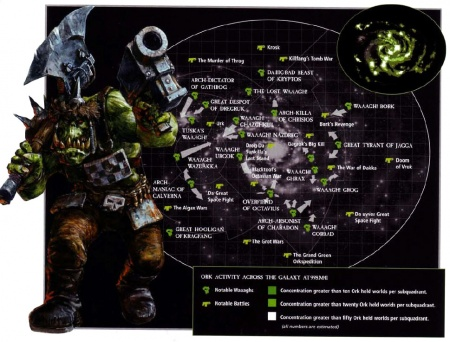

# 0575 Waaagh!

精校状态：中文行文已逐段精校，部分术语仍为暂定

分类：概念 / 异型 Xenos / 欧克蛮人 Orks

原文来源：https://www.bilibili.com/opus/1136396257204371464

原作者：帝国神选罐头

原文时间：2025年11月18日 08:37

[返回分类目录](目录.md) · [全书目录](../../目录.md)

<!-- A0575-B0001 -->
**英文原文**

The Orkish term Waaagh! refers to four related phenomena.

<!-- /A0575-B0001 -->

<!-- A0575-B0002 -->

原译文

欧克词语Waaagh！指四种相关现象。

**校订译文**

欧克语中的“Waaagh!”可指四种相互关联的现象。

<!-- /A0575-B0002 -->

<!-- A0575-B0003 图片 -->

<!-- A0575-B0004 -->

原译文

galactic map of Ork Waaaghs! in late M41 M41晚期的欧克Waaagh！的银河系地图

**校订译文**

galactic map of Ork Waaaghs! in late M41 第41千年末，银河中的欧克 Waaagh!分布图

<!-- /A0575-B0004 -->

<!-- A0575-B0005 -->
## Definitions 定义

<!-- /A0575-B0005 -->

<!-- A0575-B0006 -->

原译文

Waaagh! Energy Waaagh！能量

**校订译文**

Waaagh! Energy Waaagh!能量

<!-- /A0575-B0006 -->

<!-- A0575-B0007 -->
**英文原文**

A gathering of Orks generates a psychic field known as the Waaagh! (or Waaagh! Energy), which allows Orks to instinctively recognize who is "bigga" and therefore in charge. Waaagh! energy can also be manipulated by the Weirdboyz in an array of deadly psychic powers.

<!-- /A0575-B0007 -->

<!-- A0575-B0008 -->

原译文

一群欧克聚集在一起，产生了一个被称为Waaagh！（或Waaagh！能量）的灵能立场，这让欧克本能地认出谁是“更大的”，从而统领。Waaagh！能量也可以通过被怪异小子操纵为一系列致命的灵能力量。

**校订译文**

欧克聚集时，会产生一种称为“Waaagh!”或“Waaagh!能量”的灵能力场，使他们本能地认出谁“块头更大”，也就该由谁当头。灵能小子还能操纵这股能量，施展各种致命灵能。

**校注：** psychic field为灵能力场，原立场为错字；Weirdboy统一灵能小子，非Oddboy怪怪小子。

<!-- /A0575-B0008 -->

<!-- A0575-B0009 -->
**英文原文**

During the War of the Beast, members of the Adeptus Mechanicus noticed how Ork weapons only seemed to activate when they came into contact with a Greenskin.

<!-- /A0575-B0009 -->

<!-- A0575-B0010 -->

原译文

在野兽战争期间，机械教的成员注意到欧克武器似乎只有在与绿皮接触时才会激活。

**校订译文**

野兽战争期间，机械修会成员观察到，欧克武器似乎只有接触绿皮时，才会启动。

<!-- /A0575-B0010 -->

<!-- A0575-B0011 -->

原译文

Waaagh! as an Event 作为事件的Waaagh！

**校订译文**

Waaagh! as an Event 作为战争行动的 Waaagh!

<!-- /A0575-B0011 -->

<!-- A0575-B0012 -->
**英文原文**

Waaagh! also describes the rare occasions when Orks stop fighting amongst themselves and band together against other races. This undertaking combines the aspects of a mass migration, a holy war, a looting party and a pub crawl, with a bit of genocide thrown in for good measure. In a typical Waaagh!, millions of battle-hungry Orks invade their target and stomp everything in their way flat. Just who is invaded is a matter of supreme indifference to the Waaagh!; battle is battle.

<!-- /A0575-B0012 -->

<!-- A0575-B0013 -->

原译文

Waaagh！还描述了欧克很少停止相互争斗，联合起来对抗其他种族的情况。这项事业结合了大规模转移、圣战、劫掠派对和连续狂欢的各个方面，并在很大程度上加入了大屠杀的元素。在一个典型的Waaagh！里，数百万渴望战斗的欧克入侵他们的目标，把路上的一切都踏平。入侵谁对Waaagh！来说是一个极其无关紧要的问题！；战斗就是战斗。

**校订译文**

Waaagh!也指那种少见的时刻：欧克暂时停止内斗，联合攻击其他种族。这场行动既是大迁徙、圣战和劫掠聚会，也像挨家酒馆痛饮的狂欢，还会“顺便”灭绝几个种族。典型的 Waaagh!中，数百万渴战的欧克涌向目标，踏平沿途一切。至于打的是谁，他们根本不在乎——有仗打就行。

**校注：** pub crawl指接连出入酒馆饮酒，保留原文狂欢比喻；“顺便”保留原文黑色幽默语气，不增加现实价值判断。

<!-- /A0575-B0013 -->

<!-- A0575-B0014 -->
**英文原文**

Waaagh!s naturally gain in size and impetus as long as they're successful and have something to fight. As the Waaagh rages on, more Orks will hear of the fighting and travel to where the action is. Thus, the longer a Waaagh goes on the more numerous it becomes.

<!-- /A0575-B0014 -->

<!-- A0575-B0015 -->

原译文

只要Waaagh！成功了，有东西要打，他们的规模和动力自然会增加。随着Waaagh！的肆虐，更多的欧克将听到战斗并前往战斗地点。因此，Waaagh！持续的时间越长，它的数量就越多。

**校订译文**

只要不断获胜、还有敌人可打，Waaagh!的规模与声势便会持续增长。越来越多欧克听说这里在打仗，就会赶来凑热闹。因此，持续越久，聚集的欧克也越多。

<!-- /A0575-B0015 -->

<!-- A0575-B0016 -->

原译文

Waaagh! as a Group 作为队伍的Waaagh！

**校订译文**

Waaagh! as a Group 作为联军的 Waaagh!

<!-- /A0575-B0016 -->

<!-- A0575-B0017 -->
**英文原文**

The third use of Waaagh! is the name for the massive horde of Orks gathered under a single Warboss - an individual Ork who is invariably the largest, most dominating and physically intimidating, and therefore able to unite different warbands of Orks into a horde, almost always for the purpose and duration of undertaking a Waaagh! in the second sense of the word. Very often the Waaagh! is named after this warboss. The Waaagh! of The Beast was so powerful that its effect influenced all of his Orks to grow far larger and more aggressive than normal. Even a standard "Beast Ork" Boy towered above a normal Greenskin.

<!-- /A0575-B0017 -->

<!-- A0575-B0018 -->

原译文

第三个使用Waaagh！是聚集在一个战争头目之下的庞大的欧克部落的名字，这个欧克个体总是最大、最具统治力、身体最令人胆怯的，因此能够将不同的欧克部落团结成一个部落，几乎总是为了进行Waaagh！在这个词的第二种意义上。很多时候Waaagh！以这位军阀的名字命名。野兽的Waaagh！的力量是如此强大，以至于它的影响影响了他的所有欧克，使它们比正常情况长得更大、更具攻击性。即使是一个标准的“野兽欧克”小子，也比一个普通的绿皮高出许多。

**校订译文**

第三种含义，是汇聚在一名战争头目麾下的庞大欧克联军。头目总是块头最大、最有威势、最能吓住同族的个体，因而有能力将各个战帮聚拢，通常就是为发动并维持前述战争行动。联军往往以头目之名命名。“野兽”的 Waaagh!曾强大到使麾下所有欧克都长得异常巨大、更加凶暴；即便一名普通的“野兽欧克”小子，也比寻常绿皮高出一大截。

**校注：** horde泛指联军，warband战帮、tribe部落不得全部合并为部落；此处联军与战争事件是两个不同词义。

<!-- /A0575-B0018 -->

<!-- A0575-B0019 -->
**英文原文**

A Waaagh! is typically dispersed at its defeat, the death of its Warboss or simply when it runs out of enemies. The combined warbands and tribes will then break up through infighting and inter-clan rivalry. Exceptions do occur: a particularly dominant Warboss occasionally manages to hold his boyz together, forging a small empire for himself. The best example of this is the Ork empire of Charadon, which has survived for thousands of years under the rule of successive Warlords.

<!-- /A0575-B0019 -->

<!-- A0575-B0020 -->

原译文

一个Waaagh！通常在战败、战争头目死亡或敌人耗尽时分散。然后，合并后的军阀和部落将通过内斗和部族间的竞争而分裂。例外情况确实会发生：一个特别占主导地位的战争头目偶尔会设法把他的小子们团结在一起，为自己打造一个小帝国。这方面最好的例子是查拉顿的欧克帝国，它在连续的军阀统治下存活了数千年。

**校订译文**

Waaagh!通常会在战败、头目死亡，或再无敌可打时瓦解。战帮与部落因内斗、氏族竞争而分散。不过也有例外：某些威势极强的头目能维系队伍，建立小型帝国。典型例子是查拉顿欧克帝国，在历代军阀统治下延续了数千年。

<!-- /A0575-B0020 -->

<!-- A0575-B0021 -->
**英文原文**

The current most notable instigator of Waaagh!s is Warlord Ghazghkull Thraka, responsible for the Second and Third Wars for Armageddon as well as the Da Great Waaagh!.

<!-- /A0575-B0021 -->

<!-- A0575-B0022 -->

原译文

目前最著名的Waaagh！是军阀碎骨者萨拉卡，负责阿玛吉多顿的第二次和第三次战争以及大Waaagh！。

**校订译文**

本篇所述时期，最著名的 Waaagh!发起者是碎骨者·斯拉卡。他曾发动第二次、第三次阿玛吉多顿战争，以及“大 Waaagh!”。

**校注：** instigator为发起者，原译把人物本人说成Waaagh!；同一人物沿官译碎骨者·斯拉卡。

<!-- /A0575-B0022 -->

<!-- A0575-B0023 -->
### Warcry 战吼

<!-- /A0575-B0023 -->

<!-- A0575-B0024 -->
**英文原文**

Lastly,"Waaagh!" is the near-universal war cry roared by Orks in battle.

<!-- /A0575-B0024 -->

<!-- A0575-B0025 -->

原译文

最后，“Waaagh！”是欧克在战斗中发出的近乎普遍的战吼。

**校订译文**

最后，“Waaagh!”也是欧克在战场上几乎共同使用的吼声。

<!-- /A0575-B0025 -->

<!-- A0575-B0026 -->
**英文原文**

When used as a war cry, the length of the term used can vary, usually indicated in print by a greater number of "a"s.

<!-- /A0575-B0026 -->

<!-- A0575-B0027 -->

原译文

当用作战吼时，使用的术语长度可能会有所不同，通常在印刷品中用更多数量的“a”表示。

**校订译文**

作为战吼时，声音可以拖得长短不一；写出来时，通常会增加字母“a”的数量，表示延长的吼叫。

<!-- /A0575-B0027 -->

<!-- A0575-B0028 -->
**英文原文**

In earlier Games Workshop publications, the term Waaargh! is used.

<!-- /A0575-B0028 -->

<!-- A0575-B0029 -->

原译文

在早期的GW出版物中，使用过术语Waaargh！。

**校订译文**

早期 Games Workshop 出版物也采用过“Waaargh!”这一拼法。

<!-- /A0575-B0029 -->

本篇核心术语与暂定项

以下列出本篇出现的英文原形及核心术语表用词。同形词可能指不同对象，具体词义以本篇正文和校注为准；单复数、别名和仅见于图注的名称可能尚未列入。完整候选见[术语表](../../术语表/双语术语候选.csv)。

| 英文 | 采用中文 | 状态 |
| --- | --- | --- |
| Adeptus Mechanicus | 机械修会 | 官方已核对 |
| Orks | 欧克蛮人 | 官方已核对 |
| Waaagh! | Waaagh! | 暂定·保留原文 |
| Ghazghkull Thraka | 碎骨者·斯拉卡 | 官方已核对 |
| Armageddon | 阿玛吉多顿 | 暂定·官方待核 |
| Powers | 能天使 | 暂定·官方待核 |
| Horde | 部落 | 暂定·官方待核 |
| Boyz | 蛮人小子 | 官方已核对 |
| Warboss | 战争头目 | 官方已核对 |
| Charadon | 查拉顿 | 暂定·官方待核 |
| The Beast | 野兽 | 暂定·官方待核 |
| Da Great Waaagh! | 大 Waaagh! | 暂定·官方待核 |
| Games Workshop | Games Workshop | 暂定·官方待核 |

