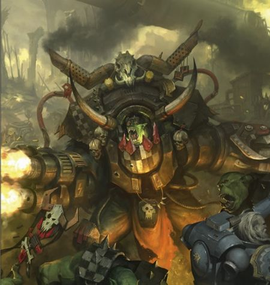

# 0576 大Waaagh! Da Great Waaagh!

精校状态：中文行文已逐段精校，部分术语仍为暂定

分类：概念 / 异型 Xenos / 欧克蛮人 Orks

原文来源：https://www.bilibili.com/opus/1136553006310883332

原作者：帝国神选罐头

原文时间：2025年11月18日 18:46

[返回分类目录](目录.md) · [全书目录](../../目录.md)

<!-- A0576-B0001 -->
**英文原文**

Da Great Waaagh! is an ongoing Ork campaign launched by Ghazghkull Mag Uruk Thraka. It is the largest Ork Waaagh! encountered in eight thousand years, on a scale not seen since the great Waaagh! of The Beast.

<!-- /A0576-B0001 -->

<!-- A0576-B0002 -->

原译文

大Waaagh！是由碎骨者马格·乌鲁克·萨拉卡发起的正在进行的欧克战役。这是在八千年的时间里，遇到的自野兽的大Waaagh！以来从未见过的规模的最大的欧克Waaagh！

**校订译文**

“大 Waaagh!”是碎骨者·斯拉卡发动、在本篇所述时期仍持续的欧克战争浪潮。自“野兽”以来，八千年间，从未出现过如此庞大的 Waaagh!。

<!-- /A0576-B0002 -->

<!-- A0576-B0003 图片 -->

<!-- A0576-B0004 -->

原译文

Ghazghkull during the "Da Great Waaagh" “大Waaagh！”期间的碎骨者

**校订译文**

Ghazghkull during the "Da Great Waaagh" “大 Waaagh!”期间的碎骨者·斯拉卡

<!-- /A0576-B0004 -->

<!-- A0576-B0005 -->
## Overview 概述

<!-- /A0576-B0005 -->

<!-- A0576-B0006 -->
**英文原文**

In 990998.M41, Ghazghkull’s visions become more frequent as his latest invasion of Armageddon drags on. They are now accompanied by blinding head pains and crackling green lights as Gork and Mork’s roars of displeasure boom through Ghazghkull’s mind. Leaving his generals to direct the war, Ghazghkull retreats to his command ship, Kill Wrecka, to brood. The Warlord surrounds himself with a mob of Warpheads, hoping the deranged Ork mystics can help to interpret his visions. Yet it is Ghazghkull himself who is finally struck by inspiration. He realises that no other Ork has his ambition. For the rest of the greenskin race, a good fight like Armageddon is enough to satisfy their bloodlust, but Ghazghkull can see beyond this to something greater. Possessed by a sudden, manic energy, the Warlord orders Kill Wrecka to break orbit. Scraping together a ragtag flotilla from whatever Ork warships are nearby, Ghazghkull makes for the edge of the system. He has no idea what he is searching for, only that it is not on Armageddon.

<!-- /A0576-B0006 -->

<!-- A0576-B0007 -->

原译文

在990998.M41，随着他最近一次对阿玛吉多顿的入侵持续下去，碎骨者的幻觉变得更加频繁。现在，伴随着令人眼花缭乱的头痛和噼啪作响的绿光，搞哥和毛哥的不满咆哮在碎骨者脑海中响起。让他的将军们指挥战争，碎骨者撤退到他的指挥舰，杀戮破坏者，沉思。军阀将自己包围在一群次元脑袋中，希望疯狂的欧克神秘者能够帮助解释他的幻象。然而，最终被灵感所击中的是碎骨者本人。他意识到，没有其他欧克有他的野心。对于绿皮种族的其他人来说，像阿玛吉多顿这样的精彩战斗足以满足他们的嗜血欲望，但碎骨者可以看到更大的东西。被一种突如其来的狂躁能量所占据，军阀命令杀死破坏者号打破轨道。从附近的任何欧克战舰上拼凑出一支破烂的舰队，碎骨者驶向星系的边缘。他不知道自己在寻找什么，只知道不是阿玛吉多顿。

**校订译文**

990998.M41，阿玛吉多顿入侵久拖不决，碎骨者的异象愈发频繁，伴随剧痛与闪烁绿光，搞哥、毛哥不满的怒吼在脑中回荡。他将战事交给诸将，回到指挥舰杀戮破坏者号独自思索，又召来一群次元脑袋，希望这些疯癫的灵能者解读异象。但最终想通的是他自己：其他欧克都没有这样的雄心，一场阿玛吉多顿式的痛快大战，便足以令他们满足；他却看见了更宏大的目标。突如其来的狂热驱使他下令离开轨道，召集附近能找到的欧克战舰，拼成一支杂乱舰队，驶向星系边缘。他不知道自己在找什么，只知道答案不在阿玛吉多顿。

**校注：** 990998.M41为底稿原有异常纪年格式，保留原样待原始出版物核实，不擅改成年份或补日期；Kill Wrecka统一杀戮破坏者号，非杀死破坏者。

<!-- /A0576-B0007 -->

<!-- A0576-B0008 -->
**英文原文**

Ghazghkull’s departure does not go unmarked. Deep space auger-stations identify Kill Wrecka moving out of the Armageddon system. High Command are notified, and both Commissar Yarrick and High Marshal Helbrecht of the Black Templars elect to give chase. These heroes of the Imperium depart Armageddon some days later, leading every warship that can be spared. The Imperium allowed Ghazghkull to escape once and it cost them dearly. Yarrick vows the same mistake will not be made again.

<!-- /A0576-B0008 -->

<!-- A0576-B0009 -->

原译文

碎骨者的离开并非没有标记。深空螺旋空间站识别出从阿玛吉多顿星系中移出的杀戮破坏者号。最高指挥部接到通知，亚瑞克政委和黑色圣堂的至高元帅赫尔布雷希特都选择追捕。帝国的这些英雄几天后离开阿玛吉多顿，率领每一艘幸免的战舰。帝国允许碎骨者逃脱一次，这让他们付出了沉重的代价。亚瑞克发誓不会再犯同样的错误。

**校订译文**

碎骨者的离去并未逃过监视。深空探测站发现杀戮破坏者号驶出星系，随即通知最高指挥部。雅瑞克政委与黑色圣堂至高元帅赫尔布雷彻决定追击，数日后率领所有能够抽调的战舰启程。帝国曾让碎骨者逃走一次，并为此付出惨重代价；雅瑞克发誓，同样的错误绝不会重演。

**校注：** auger-stations为探测站，不是螺旋空间站；can be spared为可抽调，不是战斗中幸免。High Marshal Helbrecht沿官方至高元帅赫尔布雷彻。Yarrick采用GW09第8页中文雅瑞克，英文旧版未列而标参考。

<!-- /A0576-B0009 -->

<!-- A0576-B0010 -->
## Cornered 陷入绝境

<!-- /A0576-B0010 -->

<!-- A0576-B0011 -->
**英文原文**

Despite a sizable head start, Ghazghkull is tracked unerringly by his pursuers. The faster, more efficient Imperial Navy warships catch the Ork fleet several weeks after leaving Armageddon. In a dead region of space known as the Haunted Gulf, Ghazghkull’s ships turn at bay for a last, desperate charge into the teeth of the Imperial Navy’s guns. The void comes alight with lance beams and blazing broadsides as the Ork ships thunder into the midst of their foes, yet they stand little chance. Though they cripple several Imperial cruisers, the Ork ships are torn apart one by one. Yarrick and Helbrecht prepare to board Kill Wrecka and ensure Ghazghkull’s demise once and for all. Yet even as they ready their assault, the ship is engulfed in a blaze of green energy and disappears without a trace. Left in Ghazghkull's wake is a rapidly expanding spatial anomaly from which his pursuers are forced to flee. Within days, this swells into a Warp Storm which in turns joins with others to form the Great Rift.

<!-- /A0576-B0011 -->

<!-- A0576-B0012 -->

原译文

尽管碎骨者领先一步，但他的追捕者仍能准确追踪到他。在离开阿玛吉多顿几周后，更快、更高效的帝国海军战舰赶上了欧克舰队。在一个被称为闹鬼湾的太空死区，碎骨者的船只在海湾转弯，最后绝望地冲向帝国海军的炮口。当欧克的船只轰隆隆地冲进敌人的中间时，光矛光束和燃烧的舷侧照亮了虚空，他们几乎没有机会。尽管他们摧毁了几艘帝国巡洋舰，但欧克战舰却一艘接一艘地被撕裂。亚瑞克和赫尔布雷希特准备跳帮杀戮破坏者号，并确保碎骨者一劳永逸地灭亡。然而，就在他们准备进攻时，这艘船被绿色能量的火焰吞没，消失得无影无踪。碎骨者身后留下的是一个迅速扩大的空间异常，他的追捕者被迫逃离。几天之内，它就会膨胀成亚空间风暴，然后与其他风暴汇合形成大裂隙。

**校订译文**

碎骨者虽抢先出发，追兵却始终准确掌握其行踪。离开阿玛吉多顿数周后，航速与效率更高的帝国海军追上欧克舰队。在“闹鬼湾”这片死寂空域，欧克走投无路，掉头迎着帝国炮火发起最后冲锋。光矛与舷炮照亮虚空，欧克舰船猛冲敌阵，却几无胜算：虽然重创数艘帝国巡洋舰，自己仍被逐一撕碎。雅瑞克与赫尔布雷彻正准备跳帮杀戮破坏者号，彻底除掉碎骨者，目标却突然被炽烈绿能包裹，消失无踪。原处留下一片迅速扩大的空间异常，迫使追兵撤离。数日内，异常膨胀为亚空间风暴，再与其他风暴连成一体，成为大裂隙的一部分。

**校注：** turn at bay为被逼入绝境后的反击，不是地理海湾转弯；cripple为重创，不必然摧毁。

<!-- /A0576-B0012 -->

<!-- A0576-B0013 -->
**英文原文**

Even as his fleet is torn apart, Ghazghkull stomps around his bridge bellowing orders. The great Warlord is incandescent with fury, possessed of a vision so powerful that green lightning arcs around him. Their brains overwhelmed by this sudden surge of energy, his entourage of Warpheads convulse as one and begin to howl and gibber madly. As the crackling green energy that haloes Ghazghkull’s skull lashes out to strike the Ork psykers, they are engulfed in green flames, their eyes bursting and skin sizzling. With ectoplasmic power gushing from their maws, the Warpheads speak as one, their combined voice the mighty roar of Gork and Mork that Ghazghkull has heard all these months. Every Ork within earshot falls to their knees in awe as the gods tell Ghazghkull that this is not his time to die. They tell him that the whole galaxy must echo with the roar of the Ork. They charge Ghazghkull with gathering a Waaagh! like no other, the Waaagh! of Gork and Mork themselves. To do this, he must defeat every other Warlord, bring every last greenskin under his sway, and unite them all in a crusade that will drown the stars in war. Ghazghkull must unite this Great Waaagh!, and in so doing call forth Gork and Mork to lead the Boyz in a glorious battle that will last forever. Their message delivered, the Weirdboyz explode in ripe showers of wet viscera, and a tide of green power rolls outward from them, frying every system on Ghazghkull’s ship and crippling his pursuers. Kill Wrecka is immediately hurled into Warp Space, emerging somewhere (and some-when) else entirely.

<!-- /A0576-B0013 -->

<!-- A0576-B0014 -->

原译文

就在他的舰队被撕裂之际，碎骨者在桥上跺着脚，大声发号施令。这位伟大的军阀怒不可遏，他拥有一种如此强大的幻象，以至于绿色的闪电在他周围划过。他们的大脑被这股突如其来的能量淹没了，他的次元脑袋随从们像一个人一样抽搐着，开始疯狂地嚎叫和胡言乱语。当碎骨者的头骨光环喷出噼啪作响的绿色能量袭击欧克灵能者时，他们被绿色火焰吞噬，眼睛爆裂，皮肤嘶嘶作响。随着灵质力量从他们的嘴里喷涌而出，次元脑袋们作为一个整体说话，他们共同的声音是碎骨者几个月来听到的搞哥和毛哥的巨大咆哮。当神告诉碎骨者，现在不是他死的时候时，听得见的每一个欧克都敬畏地跪倒在地。他们告诉他，整个银河系都必须与欧克的咆哮声呼应。他们让碎骨者聚集Waaagh！独一无二的，搞哥和毛哥的Waaagh！要做到这一点，他必须击败其他所有军阀，让每一个绿皮都处于他的统治之下，并将他们团结起来，发动一场将群星淹没在战争中的远征。碎骨者必须联合这个大Waaagh！通过这样做会唤起搞哥和毛哥领导小子进行一场将永远持续下去的光荣战斗。他们的信息传达后，怪异小子在难闻的潮湿的内脏雨中爆炸，一股绿色的力量从他们身上滚滚而出，炸掉了碎骨者船上的每一个系统，并使他的追捕者瘫痪。杀戮破坏者号会立即被投掷到亚空间，完全出现在其他地方（其他时间）。

**校订译文**

舰队遭撕碎时，碎骨者仍在舰桥大步来回，怒吼着下令。强烈异象令他怒火沸腾，绿色闪电环绕身体。突增的能量压垮随侍次元脑袋的心智，他们齐齐抽搐、嚎叫、胡言乱语。碎骨者头颅周围的绿光猛然抽向这些灵能者，将其吞入烈焰；眼球爆裂，皮肤焦灼，灵质力量从口中喷涌。他们齐声发出搞哥与毛哥的怒吼——正是碎骨者数月来听到的声音。神祇宣告，现在还不是他死的时候。听见神谕的欧克全都敬畏跪下。整个银河必须回荡欧克的战吼，而碎骨者受命集结前所未有的 Waaagh!，属于搞哥与毛哥自己的 Waaagh!。他须击败所有军阀，收服每一个绿皮，率全族远征，将群星淹没于战争。唯有完成这场“大 Waaagh!”，才能召来两位神，带领小子们投入永无终结的辉煌大战。神谕传毕，灵能小子们爆成一场血肉之雨，绿色能量向外席卷，烧毁杀戮破坏者号的全部系统，也使追兵受创瘫痪。巨舰随即被抛入亚空间，在全然不同的地点——甚至时间——重新出现。

**校注：** bridge为舰桥；charge with为赋予使命；some-when刻意强调时间也改变，保留叙事重点。

<!-- /A0576-B0014 -->

<!-- A0576-B0015 -->
## Arrival in Octaria 抵达奥克塔瑞亚

<!-- /A0576-B0015 -->

<!-- A0576-B0016 -->
**英文原文**

Kill Wrecka drops out of the Warp in the midst of the sprawling territory controlled by Ork Warlord Urgok Da Slayer in the year 694999.M41. Ghazghkull is revitalised, red eyes blazing with new purpose. Kill Wrecka makes straight for Urgok’s mighty space fortress. Knowing his only advantage is surprise, Ghazghkull fires up his ship’s tellyporta, transporting himself and a mob of his baddest Nobz in a roaring blast of light, directly into Urgok’s throne room. Urgok looks on in horror as Ghazghkull tears through his bodyguards as though they were rowdy grots. Then, trampling over their mangled corpses with his shoota still smoking, Ghazghkull looms over his cowed rival and ‘invites’ him to join Da Great Waaagh!.

<!-- /A0576-B0016 -->

<!-- A0576-B0017 -->

原译文

在694999.M41，杀戮破坏者号从亚空间中掉落，位于由欧克军阀杀戮者乌尔戈克控制的广阔领土之中。碎骨者恢复了活力，红眼睛闪烁着新的目标。杀戮破坏者号直奔乌尔戈克强大的太空堡垒。知道他唯一的优势就是出其不意，碎骨者点燃了飞船的传送器，在一道咆哮的光线中，将自己和一群最坏的老大直接带进了乌尔戈克的王座室。乌尔戈克惊恐地看着碎骨者撕裂他的护卫，仿佛他们是吵闹的屁精。然后，碎骨者踩着他们残缺不全的尸体，他的大枪还在冒烟，他隐约出现在他被吓倒的对手身上，“邀请”他加入大Waaagh！。

**校订译文**

694999.M41，杀戮破坏者号跃出亚空间，来到军阀“杀戮者”乌尔戈克的广阔领地。碎骨者精神大振，赤红双眼燃起新的目标，径直驶向对方的太空堡垒。他明白自己唯一的优势就是突然袭击，便启动传送器，带着最凶悍的一群强蛮人，在轰鸣光爆中直接闯入乌尔戈克的王座室。守卫被他轻易撕碎，如同一群吵闹的屁精。乌尔戈克惊恐地看着他踩过尸体逼近；大枪仍冒着烟，这位庞大军阀俯视着已被吓破胆的对手，“邀请”其加入大 Waaagh!。

**校注：** 694999.M41同样保留底稿异常格式；baddest为最凶悍，loom over为高大身形压迫，不是隐约出现。Nobz统一强蛮人。

<!-- /A0576-B0017 -->

<!-- A0576-B0018 -->
**英文原文**

Most of Urgok’s Boyz join the Waaagh! willingly, while those too slow to spot which way the wind is howling are quickly beaten into submission. Within weeks, news of Ghazghkull’s new Waaagh! spreads far and wide, the massive Warboss’ legend reaching the ears of Orks hundreds of light years away, sparking the first stirring of an Ork migration on a scale never seen before. With a whole new Waaagh! at his disposal and Urgok his personal toadie, Ghazghkull turns his attentions to the galactic southeast and the empire of Octarius. If the whole galaxy is going to be engulfed in war, Gork and Mork will need a lot more Orks for their Great Waaagh! Besides, Ghazghkull has decided to show the Ork ruler of Octarius what a real Overfiend looks like...

<!-- /A0576-B0018 -->

<!-- A0576-B0019 -->

原译文

乌尔戈克的大多数小子都心甘情愿的加入了Waaagh！而那些太慢而无法发现风在哪边咆哮的人很快就会屈服。几周内，碎骨者的新Waaagh！传播的又远又广，这个庞大的战争头目的传说传到了数百光年外的欧克的耳朵里，引发了前所未有的大规模欧克迁徙的第一次活动。全新的Waaagh！在他的处置和乌尔戈克他的个人马屁精，碎骨者将注意力转向银河东南部和奥克塔琉斯帝国。如果整个银河系都要被战争吞噬，搞哥和毛哥将需要更多的欧克来发动他们的大Waaagh！此外，碎骨者决定向奥克塔琉斯的欧克统治者展示一个真正的超级恶魔是什么样子的...

**校订译文**

乌尔戈克麾下大多数小子欣然加入，反应迟钝、看不清风向的，则很快被打到服从。数周内，碎骨者发起新 Waaagh!的消息传遍四方，连数百光年外的欧克也听到传说，一场空前规模的迁徙开始萌动。掌握新联军、收下乌尔戈克这个跟班后，碎骨者转而关注银河东南方的奥克塔琉斯帝国。若要让战争吞没银河，搞哥与毛哥还需要更多欧克。况且，他也想让当地统治者见识一下，真正的“暴君”该是什么模样……

<!-- /A0576-B0019 -->

<!-- A0576-B0020 -->
**英文原文**

Octarius had been Ork territory for many thousands of standard years. It was not as backwater a subsector as where Urk had been, and every so often a leader would rise up, call a Waaagh!, and lead an invasion off to wreck some part of the galaxy. Indeed, the old Warlord Gorsnik Magash had rushed off to join Ghazghkull in the Golgotha Sector and was currently heading a vast force of Orks on Armageddon, holding his own in the Dead Lands. Since Gorsnik's departure, a new leader had quickly risen to fill the power vacuum and claim the title Overfiend of Octarius -- a Deathskull Warlord named Zog Steeltoof. His rule had not been a stable one, the Empire was in the midst of a major war against the Tyranids. However Ghazghkull himself, seeing an opportunity for a good fight, led his forces against the alien horde. After slaying a mighty Mawloc, Ghazghkull became the de facto leader of the Ork forces fighting in the Octarius Sector and sees this fight as one with even more potential than Armageddon.

<!-- /A0576-B0020 -->

<!-- A0576-B0021 -->

原译文

奥克塔留斯在数千年的时间里一直是欧克的领地。这并不像乌尔戈克所在的地方那样是一个死水地带，每隔一段时间就会有一位领导人站起来，召唤Waaagh！并带领入侵摧毁银河系的一部分。事实上，老军阀格斯尼克·马加什已经赶往各各他星区加入碎骨者，目前正率领一支庞大的欧克部队在阿玛吉多顿上，在死地坚守自己的阵地。自从格斯尼克离开后，一位新的领导人迅速崛起，填补了权力真空，并声称自己是奥克塔琉斯的超级恶魔 — 一位名叫佐格·钢牙的死颅军阀。他的统治并不稳定，帝国正处于与泰伦的一场大战之中。然而，碎骨者自己看到了一个很好的战斗机会，带领他的部队对抗异型部落。在杀死了一个强大的沙蟒之后，碎骨者成为了在奥克塔琉斯星区作战的欧克部队的事实上的领导者，并认为这场战斗比阿玛吉多顿更有潜力。

**校订译文**

奥克塔琉斯已由欧克统治数千标准年。它不像乌尔克所在的星区分区那般偏僻，经常有头目崛起，召集 Waaagh!，向银河某处大举劫掠。老军阀戈尔斯尼克·马加什便曾赶赴各各他星区，追随碎骨者；此时正率大军在阿玛吉多顿死地坚守。自他离开，死颅军阀佐格·钢牙迅速填补权力真空，自封奥克塔琉斯暴君。但帝国正与泰伦大战，他的统治并不稳固。碎骨者见到如此痛快的战机，立刻率军迎击虫群。斩杀一头强大的沙蟒之后，他成为奥克塔琉斯战区欧克军队事实上的领袖，并认为这里比阿玛吉多顿还大有可为。

**校注：** Urk为乌尔克地名，原译误作前段人物乌尔戈克；subsector为星区分区，backwater为偏远落后。Overfiend为欧克统治者称号暴君，不是真正的超级恶魔。

<!-- /A0576-B0021 -->

<!-- A0576-B0022 -->
**英文原文**

Ghazghkull has since left the Octarius warzone, and is now leading a fleet of five million ships against the Imperium.

<!-- /A0576-B0022 -->

<!-- A0576-B0023 -->

原译文

碎骨者已经离开了奥克塔琉斯战区，现在正率领一支由500万艘舰船组成的舰队对抗帝国。

**校订译文**

此后，碎骨者离开奥克塔琉斯战区。据本篇记载，他正率领一支五百万艘舰船组成的舰队，进攻帝国。

**校注：** 五百万艘为所给英文的具体数量，保持原值并注明资料时点。

<!-- /A0576-B0023 -->

<!-- A0576-B0024 -->
## Psychic Awakening 灵能觉醒

<!-- /A0576-B0024 -->

<!-- A0576-B0025 -->
**英文原文**

Ghazghkull and allied forces came into battle with the Space Wolves during the Psychic Awakening. This culminated in the Battle of Krongar, where the Ork Warlord dueled Ragnar Blackmane. Though Ragnar was badly wounded, he managed to behead Ghazghkull. However through rapid surgery by Grotsnik, Ghazghkull endured and now is stronger than ever.

<!-- /A0576-B0025 -->

<!-- A0576-B0026 -->

原译文

碎骨者和盟友在灵能觉醒期间与太空野狼作战。这在克朗加之战中达到了高潮，欧克军阀在那里与拉格纳·黑鬃决斗。虽然拉格纳受了重伤，但他还是设法斩首了碎骨者。然而，通过戈斯尼克的快速手术，碎骨者坚持了下来，现在比以往任何时候都更强壮。

**校订译文**

灵能觉醒期间，碎骨者与盟军对上太空野狼，战事在克朗加达到高潮。他与拉格纳·黑鬃决斗，后者虽重伤，仍将其斩首。戈斯尼克紧急手术救回了碎骨者，使他比以往更强大。

<!-- /A0576-B0026 -->

<!-- A0576-B0027 -->
**英文原文**

While Ghazghkull was undergoing surgery, the ambitious Ork Kommando Deff-Kolonel Zogboss attempted to take control of the Great Waaagh!. Zogboss stormed Grotsnik's laboratory, though only he was able to reach its inner sanctum. Once there, the Deff-Kolonel destroyed Grotsnik's equipment before attempting to kill the Mad Dok himself. However Zogboss is too late and before he can strike Grotsnik, the resurrected Ghazghull grabs the Deff-Kolonel's head and easily crushed it.

<!-- /A0576-B0027 -->

<!-- A0576-B0028 -->

原译文

当碎骨者正在接受手术时，野心勃勃的欧克指挥官死亡上校佐格头目试图控制大Waaagh！。佐格头目猛攻了戈斯尼克的实验室，尽管只有他能够到达其内部的圣所。一到那里，死亡上校就摧毁了戈斯尼克的设备，然后试图杀死疯医本人。然而，佐格头目为时已晚，在他能够击中戈斯尼克之前，复活的碎骨者抓住了死亡上校的头，并轻松地将其粉碎。

**校订译文**

碎骨者接受手术时，野心勃勃的特种兵“死亡上校”佐格头目，试图夺取大 Waaagh!的领导权。他率众攻入戈斯尼克的实验室，却只有自己冲进最内层，随即摧毁设备，准备杀死疯医。然而，他来迟一步：尚未出手，复苏的碎骨者就一把攥住他的脑袋，轻易捏碎。

**校注：** Kommando为欧克特种兵身份，不是一般指挥官；Deff-Kolonel为带欧克口音的死亡上校称号。

<!-- /A0576-B0028 -->

<!-- A0576-B0029 -->
## Effects 影响

<!-- /A0576-B0029 -->

<!-- A0576-B0030 -->
**英文原文**

The Great Waaagh! is having dire effects across the entire Galaxy. So many Orks have gathered in Octaria that a great wave of Madboyz psychic energy has rippled across the entire Galaxy. This phenomenon has registered with every Warp-sensitive soul in the Imperium, echoing in the Immaterium and sending shivers of fear through those who recognize its significance. The wave acts as a psychic beacon, drawing Orks from all over the galaxy to Ghazghkull's banner.

<!-- /A0576-B0030 -->

<!-- A0576-B0031 -->

原译文

大Waaagh！正在整个银河系产生可怕的影响。如此多的欧克聚集在奥克塔瑞亚，以至于一股巨大的疯狂小子灵能能量席卷了整个银河系。这种现象在帝国中每一个对亚空间敏感的灵魂中都有所体现，在非物质界中回荡，并让那些认识到其重要性的人感到恐惧。这股浪潮就像一个灵能灯塔，将来自银河系各地的欧克吸引到碎骨者的旗帜。

**校订译文**

大 Waaagh!的影响遍及银河。欧克大量聚集于奥克塔瑞亚，激起疯小子的浩瀚灵能浪潮。帝国中，每一个对亚空间敏感的灵魂都感到它在非物质界回荡；明白其含义者，无不恐惧。这股浪潮又如灵能灯塔，将银河各地的欧克引向碎骨者麾下。

<!-- /A0576-B0031 -->

<!-- A0576-B0032 -->
**英文原文**

Conflicting reports by the Logis Strategos concerning the location of Ghazghkull is causing consternation at the highest levels of the Imperium. The Grand Warlord is documented to be within Octarius, yet simultaneously sacking Cantissa, upon the killing fields of Aurochtha, in the Imperium Nihilus, and fighting around Ryza. It is speculated that the Orks are using Warp Storms to 'navigate' the galaxy, and extreme empyric time dilation may also be to blame for the confusion.

<!-- /A0576-B0032 -->

<!-- A0576-B0033 -->

原译文

情报部关于碎骨者位置的相互矛盾的报告正在帝国最高层引起恐慌。据记载，这位大军阀在奥克塔琉斯内，但同时在帝国暗面的奥罗克塔杀戮区洗劫了坎蒂萨，并在瑞扎周围作战。据推测，欧克正在使用亚空间风暴来“导航”银河系，极端的至高天时间膨胀也可能是造成这种混乱的原因。

**校订译文**

情报部提交的报告，对碎骨者的位置说法互相冲突，令帝国高层不安。他似乎既在奥克塔琉斯，又同时洗劫坎蒂萨、现身奥罗克塔杀戮场、出没于帝国暗面，并在瑞扎附近作战。有推测称，欧克正借亚空间风暴穿行银河；极端的亚空间时间膨胀，也可能造成这些矛盾。

**校注：** 原句列举数个同时现身地点，原译把坎蒂萨、奥罗克塔与帝国暗面合成一个地点，已恢复并列关系。

<!-- /A0576-B0033 -->

本篇核心术语与暂定项

以下列出本篇出现的英文原形及核心术语表用词。同形词可能指不同对象，具体词义以本篇正文和校注为准；单复数、别名和仅见于图注的名称可能尚未列入。完整候选见[术语表](../../术语表/双语术语候选.csv)。

| 英文 | 采用中文 | 状态 |
| --- | --- | --- |
| Black Templars | 黑色圣堂 | 官方已核对 |
| Space Wolves | 太空野狼 | 官方已核对 |
| Tyranids | 泰伦虫族 | 官方已核对 |
| Orks | 欧克蛮人 | 官方已核对 |
| Commissar | 政委 | 官方已核对 |
| Warp | 亚空间 | 官方已核对 |
| Great Rift | 大裂隙 | 官方已核对 |
| Imperium | 帝国 | 暂定·简称 |
| Imperial Navy | 帝国海军 | 暂定 |
| Waaagh! | Waaagh! | 暂定·保留原文 |
| Equipment | 装备 | 编辑用语已统一 |
| Ghazghkull Mag Uruk Thraka | 碎骨者·斯拉卡 | 暂定·官方短名对应 |
| Imperium Nihilus | 帝国暗面 | 暂定·官方待核 |
| Octarius | 奥克塔琉斯 | 暂定·官方待核 |
| Logis Strategos | 情报部 | 暂定·官方待核 |
| Sector | 星区 | 暂定·官方待核 |
| Subsector | 次星区 | 暂定·官方待核 |
| Armageddon | 阿玛吉多顿 | 暂定·官方待核 |
| Ryza | 瑞扎 | 暂定·官方待核 |
| Kommando | 特种兵 | 官方已核对 |
| Logis | 逻辑士 | 暂定·官方待核 |
| Lance | 骑士矛阵 | 暂定·官方待核 |
| Ragnar Blackmane | 拉格纳·黑鬃 | 官方已核 |
| Helbrecht | 赫尔布雷彻 | 暂定·官方待核 |
| The Black Templars | 黑色圣堂 | 暂定·官方待核 |
| High Marshal Helbrecht | 至高元帅赫尔布雷彻 | 官方已核 |
| Risen | 赦天使 | 暂定·官方待核 |
| Horde | 部落 | 暂定·官方待核 |
| Boyz | 蛮人小子 | 官方已核对 |
| Nobz | 强蛮人 | 官方已核对 |
| Warboss | 战争头目 | 官方已核对 |
| Mob | 战群（欧克组织） | 暂定·官方待核 |
| Gork | 搞哥 | 暂定·官方待核 |
| Mork | 毛哥 | 暂定·官方待核 |
| The Beast | 野兽 | 暂定·官方待核 |
| Da Great Waaagh! | 大 Waaagh! | 暂定·官方待核 |
| Kill Wrecka | 杀戮破坏者号 | 暂定·官方待核 |
| Warpheads | 次元脑袋 | 暂定·官方待核 |
| Haunted Gulf | 闹鬼湾 | 暂定·官方待核 |
| Octaria | 奥克塔瑞亚 | 暂定·官方待核 |
| Urgok Da Slayer | 杀戮者乌尔戈克 | 暂定·官方待核 |
| Urk | 乌尔克 | 暂定·官方待核 |
| Gorsnik Magash | 戈尔斯尼克·马加什 | 暂定·官方待核 |
| Golgotha Sector | 各各他星区 | 暂定·官方待核 |
| Dead Lands | 死地 | 暂定·官方待核 |
| Zog Steeltoof | 佐格·钢牙 | 暂定·官方待核 |
| Krongar | 克朗加 | 暂定·官方待核 |
| Deff-Kolonel Zogboss | 死亡上校佐格头目 | 暂定·官方待核 |
| Madboyz | 疯小子 | 暂定·官方待核 |
| Cantissa | 坎蒂萨 | 暂定·官方待核 |
| Aurochtha | 奥罗克塔 | 暂定·官方待核 |
| Mawloc | 沙蟒 | 官方已核对 |
| Commissar Yarrick | 雅瑞克政委 | 官方中文参考·英文对应待复核 |
| Sanctum | 圣所星 | 暂定·官方待核 |
| Marshal | 元帅 | 官方已核对 |
| Warp Storm | 亚空间风暴 | 暂定·官方待核 |
| System | 星系（恒星系统） | 暂定·官方待核 |
| Zogboss | 佐格头目 | 暂定·官方待核 |
| Shoota | 欧克枪 | 暂定·官方待核 |

