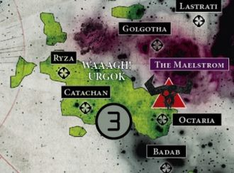

# 0577 奥克塔琉斯的欧克帝国 Ork Empire of Octarius

精校状态：中文行文已逐段精校，部分术语仍为暂定

分类：概念 / 异型 Xenos / 欧克蛮人 Orks

原文来源：https://www.bilibili.com/opus/1143095482726219796

原作者：帝国神选罐头

原文时间：2025年12月06日 09:54

[返回分类目录](目录.md) · [全书目录](../../目录.md)

<!-- A0577-B0001 -->
**英文原文**

The Ork Empire of Octarius is an Ork Empire covering the Octarius Sector, an area of space almost as large as Ultramar, in the Ultima Segmentum and is centered on the Ork World of Octarius. The title Overfiend of Octarius is taken by the Empire's ruler.

<!-- /A0577-B0001 -->

<!-- A0577-B0002 -->

原译文

奥克塔琉斯的欧克帝国是一个覆盖奥克塔琉斯星区的欧克帝国，该星区几乎与奥特拉玛一样大，位于极限星域，以奥克塔琉斯欧克世界为中心。奥克塔琉斯的暴君的头衔被帝国的统治者夺走。

**校订译文**

奥克塔琉斯欧克帝国位于极限星域，覆盖几乎与奥特拉玛同样广阔的奥克塔琉斯星区，以同名欧克世界为中心。其统治者采用“奥克塔琉斯暴君”的头衔。

**校注：** takes the title为采用头衔，不是头衔被夺走；本篇首段/首都表用Octarius，世界列表与后段用Octaria，保留英文差别及对应译名。

<!-- /A0577-B0002 -->

<!-- A0577-B0003 图片 -->

<!-- A0577-B0004 -->

原译文

Ork Empire of Octarius territory 奥克塔琉斯帝国领土

**校订译文**

Ork Empire of Octarius territory 奥克塔琉斯帝国领土

<!-- /A0577-B0004 -->

<!-- A0577-B0005 -->
**英文原文**

Capital:Octarius (former)

<!-- /A0577-B0005 -->

<!-- A0577-B0006 -->

原译文

首都：奥克塔琉斯（前）

**校订译文**

旧都：奥克塔琉斯

<!-- /A0577-B0006 -->

<!-- A0577-B0007 -->
**英文原文**

Official languages:Ork Language

<!-- /A0577-B0007 -->

<!-- A0577-B0008 -->

原译文

官方语言：欧克语

**校订译文**

官方语言：欧克语

<!-- /A0577-B0008 -->

<!-- A0577-B0009 -->
**英文原文**

Head of state:Overfiend of Octarius

<!-- /A0577-B0009 -->

<!-- A0577-B0010 -->

原译文

国家首脑：奥克塔琉斯的暴君

**校订译文**

最高统治者：奥克塔琉斯暴君

<!-- /A0577-B0010 -->

<!-- A0577-B0011 -->
**英文原文**

Governing body:Warbosses

<!-- /A0577-B0011 -->

<!-- A0577-B0012 -->

原译文

管理机构：战争头目们

**校订译文**

统治阶层：战争头目

<!-- /A0577-B0012 -->

<!-- A0577-B0013 -->
**英文原文**

State religious body:Gork and Mork

<!-- /A0577-B0013 -->

<!-- A0577-B0014 -->

原译文

国家宗教团体：搞哥和毛哥

**校订译文**

主要信仰：搞哥与毛哥

**校注：** Gork和Mork为神祇，不是宗教组织，原表头religious body不合实际所列内容，按主要信仰表述。

<!-- /A0577-B0014 -->

<!-- A0577-B0015 -->
**英文原文**

Clan affiliation:Probably Blood Axes clan

<!-- /A0577-B0015 -->

<!-- A0577-B0016 -->

原译文

氏族从属：可能是血斧氏族

**校订译文**

氏族从属：可能是血斧氏族

<!-- /A0577-B0016 -->

<!-- A0577-B0017 -->
**英文原文**

Major Species:Ork, Gretchin

<!-- /A0577-B0017 -->

<!-- A0577-B0018 -->

原译文

主要种族：欧克，屁精

**校订译文**

主要种族：欧克，屁精

<!-- /A0577-B0018 -->

<!-- A0577-B0019 -->
**英文原文**

Military forces:Orks

<!-- /A0577-B0019 -->

<!-- A0577-B0020 -->

原译文

军事部队：欧克

**校订译文**

军事部队：欧克

<!-- /A0577-B0020 -->

<!-- A0577-B0021 -->
## Known Worlds 已知世界

<!-- /A0577-B0021 -->

<!-- A0577-B0022 -->
**英文原文**

Octaria - Central world of the Empire. Captured by Hive Fleet Leviathan after the Swarmlord slew the Overfiend.

<!-- /A0577-B0022 -->

<!-- A0577-B0023 -->

原译文

奥克塔利亚 - 帝国的中心世界。在虫群领主杀死暴君后，被虫巢舰队利维坦捕获。

**校订译文**

奥克塔瑞亚——帝国的核心世界；虫群领主杀死暴君后，由利维坦虫巢舰队攻陷

<!-- /A0577-B0023 -->

<!-- A0577-B0024 -->
**英文原文**

Orrok/Orruk - Consumed by Hive Fleet Leviathan.

<!-- /A0577-B0024 -->

<!-- A0577-B0025 -->

原译文

奥罗克/奥鲁克 - 被虫巢舰队利维坦消耗。

**校订译文**

奥罗克／奥鲁克——遭利维坦虫巢舰队吞噬

<!-- /A0577-B0025 -->

<!-- A0577-B0026 -->
**英文原文**

Urmuk - Junka-Port. Consumed by Hive Fleet Leviathan

<!-- /A0577-B0026 -->

<!-- A0577-B0027 -->

原译文

乌尔穆克 - 废料港口。被虫巢舰队利维坦消耗

**校订译文**

乌尔穆克——废料港，遭利维坦虫巢舰队吞噬

<!-- /A0577-B0027 -->

<!-- A0577-B0028 -->
**英文原文**

Dakkazot - Largely consumed by Leviathan

<!-- /A0577-B0028 -->

<!-- A0577-B0029 -->

原译文

哒咔佐特 - 大部分被利维坦消耗

**校订译文**

哒咔佐特——大部分已遭利维坦吞噬

<!-- /A0577-B0029 -->

<!-- A0577-B0030 -->
**英文原文**

Badsquig - Largely consumed by Leviathan.

<!-- /A0577-B0030 -->

<!-- A0577-B0031 -->

原译文

坏史古格 - 大部分被利维坦消耗。

**校订译文**

坏史古格——大部分已遭利维坦吞噬

<!-- /A0577-B0031 -->

<!-- A0577-B0032 -->
**英文原文**

Ghorala - Consumed by Leviathan.

<!-- /A0577-B0032 -->

<!-- A0577-B0033 -->

原译文

戈拉勒 - 被利维坦消耗。

**校订译文**

戈拉勒——遭利维坦吞噬

<!-- /A0577-B0033 -->

<!-- A0577-B0034 -->
**英文原文**

Derragon - Consumed by Leviathan, after it consumed Ghorala.

<!-- /A0577-B0034 -->

<!-- A0577-B0035 -->

原译文

德拉贡 - 在消耗了戈拉勒之后，被利维坦消耗。

**校订译文**

德拉贡——利维坦吞噬戈拉勒后，又将其吞噬

<!-- /A0577-B0035 -->

<!-- A0577-B0036 -->
**英文原文**

Keltor - Consumed by Leviathan, after it consumed Ghorala.

<!-- /A0577-B0036 -->

<!-- A0577-B0037 -->

原译文

凯尔托 - 在消耗了戈拉勒之后，被利维坦消耗。

**校订译文**

凯尔托——利维坦吞噬戈拉勒后，又将其吞噬

<!-- /A0577-B0037 -->

<!-- A0577-B0038 -->

原译文

Janding's Reach 詹丁河段

**校订译文**

Janding's Reach 詹丁疆域

**校注：** Reach在星际地名语境不是河段，暂定疆域。

<!-- /A0577-B0038 -->

<!-- A0577-B0039 -->

原译文

Gryga XIII 格里加13号

**校订译文**

Gryga XIII 格里加十三号

<!-- /A0577-B0039 -->

<!-- A0577-B0040 -->

原译文

Deffspin 死旋星

**校订译文**

Deffspin 死旋星

<!-- /A0577-B0040 -->

<!-- A0577-B0041 -->

原译文

Rujikar 鲁吉卡尔

**校订译文**

Rujikar 鲁吉卡尔

<!-- /A0577-B0041 -->

<!-- A0577-B0042 -->

原译文

Thedna VII 瑟德纳七号

**校订译文**

Thedna VII 瑟德纳七号

<!-- /A0577-B0042 -->

<!-- A0577-B0043 -->

原译文

Darkmont 达克蒙特

**校订译文**

Darkmont 达克蒙特

<!-- /A0577-B0043 -->

<!-- A0577-B0044 -->

原译文

Phundil 方迪尔

**校订译文**

Phundil 方迪尔

<!-- /A0577-B0044 -->

<!-- A0577-B0045 -->

原译文

Derenden II 德兰登二号

**校订译文**

Derenden II 德兰登二号

<!-- /A0577-B0045 -->

<!-- A0577-B0046 -->
**英文原文**

Ghubelia - Site of Genestealer infestation

<!-- /A0577-B0046 -->

<!-- A0577-B0047 -->

原译文

古贝利亚 - 基因窃取者感染地点

**校订译文**

古贝利亚——曾遭基因窃取者侵染

<!-- /A0577-B0047 -->

<!-- A0577-B0048 -->

原译文

Fendatha 芬达塔

**校订译文**

Fendatha 芬达塔

<!-- /A0577-B0048 -->

<!-- A0577-B0049 -->
**英文原文**

Kraidak - Invaded by Hive Fleet Leviathan

<!-- /A0577-B0049 -->

<!-- A0577-B0050 -->

原译文

克莱达克 - 被虫巢舰队利维坦入侵

**校订译文**

克莱达克——遭利维坦虫巢舰队入侵

<!-- /A0577-B0050 -->

<!-- A0577-B0051 -->

原译文

Veloria 维洛里亚

**校订译文**

Veloria 维洛里亚

<!-- /A0577-B0051 -->

<!-- A0577-B0052 -->
## The Octarius War 奥克塔琉斯战争

<!-- /A0577-B0052 -->

<!-- A0577-B0053 -->
**英文原文**

In the closing years of the 41st Millennium, the Imperial Inquisitor Kryptman would redirect a portion of the Tyranid Hive Fleet Leviathan at the Octarian Empire. The resulting war has badly bled both the Tyranids and Orks, and it has yet to be determined which side will emerge victorious.

<!-- /A0577-B0053 -->

<!-- A0577-B0054 -->

原译文

在第41个千年的最后几年，帝国审判官克里普特曼将泰伦虫巢舰队利维坦的一部分重新定向到奥克塔利亚帝国。由此引发的战争使泰伦和欧克都付出了巨大的代价，目前还没有确定哪一方会取得胜利。

**校订译文**

第41千年末，审判官克瑞普特曼将利维坦虫巢舰队的一部分，引向奥克塔琉斯欧克帝国。由此爆发的战争，让泰伦与欧克都付出惨重代价。在这段早期记述中，胜负尚未分晓。

**校注：** 尚未分出胜负是旧段落的资料时点；后段已记首都覆灭，用早期记述衔接，避免同页现在时自相矛盾。

<!-- /A0577-B0054 -->

<!-- A0577-B0055 -->
**英文原文**

After the formation of the Great Rift, Khornate forces invaded the Octarius Sector, creating a three-way war. The Swarmlord eventually launched an all-out push that saw the Empire's capital of Octaria assailed. After an extended campaign Octaria was consumed after the Overfiend himself was slain by the Swarmlord. Now the Empire exists in a fragmented state, with multiple Warlords vying to become the new Overfiend.

<!-- /A0577-B0055 -->

<!-- A0577-B0056 -->

原译文

大裂隙形成后，恐虐军队入侵了奥克塔琉斯星区，引发了一场三方战争。虫群领主最终发起了一场全面的攻势，帝国的首都奥克塔利亚遭到了袭击。经过一场漫长的战役，奥克塔利亚在暴君本人被虫群领主杀死后被吞噬。现在帝国处于分裂状态，多个军阀争相成为新的暴君。

**校订译文**

大裂隙形成后，恐虐军队侵入奥克塔琉斯星区，战事演变为三方混战。虫群领主随后全面进攻，将矛头直指首都奥克塔瑞亚。经过长期战役，它亲自杀死暴君，整个首都世界随之遭吞噬。此后，欧克帝国分崩离析，多位军阀争夺新暴君之位。

<!-- /A0577-B0056 -->

本篇核心术语与暂定项

以下列出本篇出现的英文原形及核心术语表用词。同形词可能指不同对象，具体词义以本篇正文和校注为准；单复数、别名和仅见于图注的名称可能尚未列入。完整候选见[术语表](../../术语表/双语术语候选.csv)。

| 英文 | 采用中文 | 状态 |
| --- | --- | --- |
| Tyranids | 泰伦虫族 | 官方已核对 |
| Orks | 欧克蛮人 | 官方已核对 |
| Ultramar | 奥特拉玛 | 官方已核对 |
| Great Rift | 大裂隙 | 官方已核对 |
| Inquisitor | 审判官 | 官方已核对 |
| Gretchin | 屁精 | 官方已核对 |
| Octarius | 奥克塔琉斯 | 暂定·官方待核 |
| Kryptman | 克瑞普特曼 | 暂定·官方待核 |
| Hive Fleet Leviathan | 利维坦虫巢舰队 | 暂定·官方待核 |
| Ultima Segmentum | 极限星域 | 暂定·官方待核 |
| Segmentum | 星域 | 暂定·官方待核 |
| Sector | 星区 | 暂定·官方待核 |
| Blood Axes | 血斧 | 暂定·官方待核 |
| Gork | 搞哥 | 暂定·官方待核 |
| Mork | 毛哥 | 暂定·官方待核 |
| Octaria | 奥克塔瑞亚 | 暂定·官方待核 |
| Ork Empire of Octarius | 奥克塔琉斯欧克帝国 | 暂定·官方待核 |
| Orrok | 奥罗克 | 暂定·官方待核 |
| Orruk | 奥鲁克 | 暂定·官方待核 |
| Urmuk | 乌尔穆克 | 暂定·官方待核 |
| Junka-Port | 废料港 | 暂定·官方待核 |
| Dakkazot | 哒咔佐特 | 暂定·官方待核 |
| Badsquig | 坏史古格 | 暂定·官方待核 |
| Ghorala | 戈拉勒 | 暂定·官方待核 |
| Derragon | 德拉贡 | 暂定·官方待核 |
| Keltor | 凯尔托 | 暂定·官方待核 |
| Ghubelia | 古贝利亚 | 暂定·官方待核 |
| Kraidak | 克莱达克 | 暂定·官方待核 |
| The Swarmlord | 虫群领主 | 官方已核对 |

