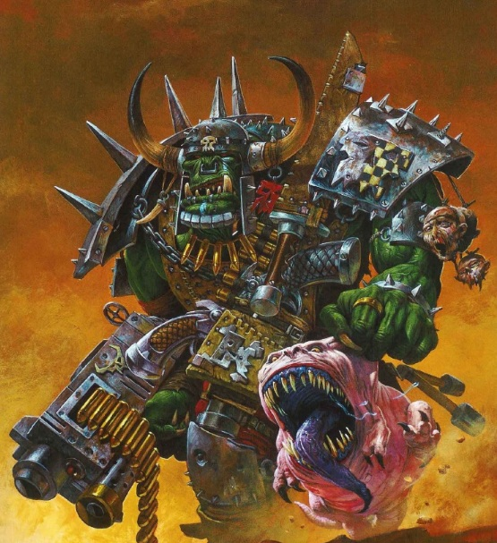
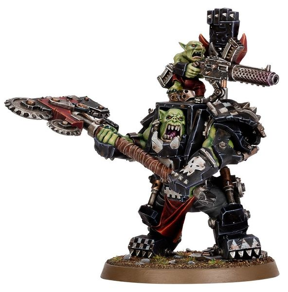
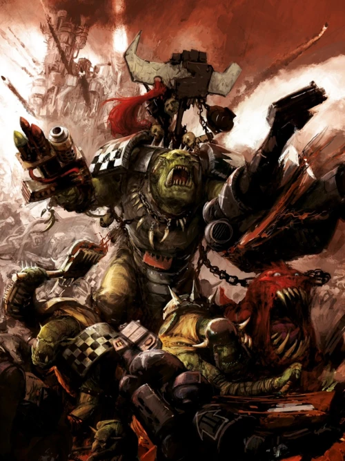
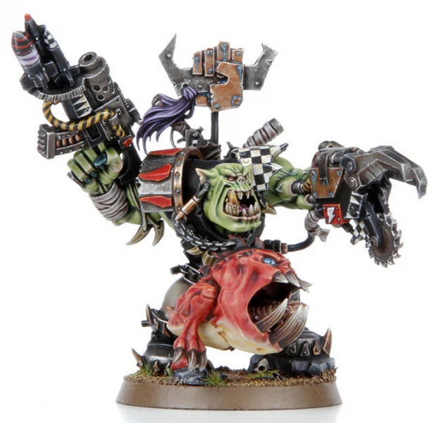
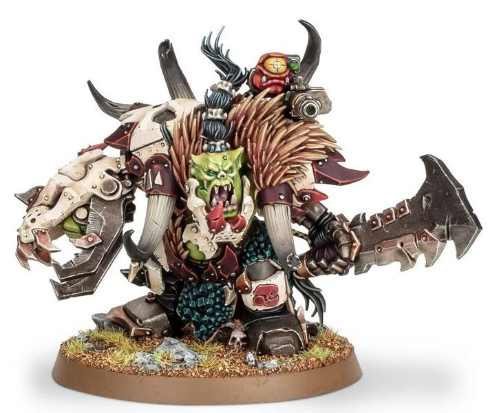

# 0578 战争头目 Warboss

精校状态：中文行文已逐段精校，部分术语仍为暂定

分类：概念 / 异型 Xenos / 欧克蛮人 Orks

原文来源：https://www.bilibili.com/opus/1057468446329012264

原作者：帝国神选罐头

原文时间：2025年04月19日 15:57

[返回分类目录](目录.md) · [全书目录](../../目录.md)

<!-- A0578-B0001 -->
**英文原文**

The Warboss is the highest position in a large Ork Waaagh!; he is always the biggest, strongest and most cunning Ork in any given grouping of such creatures, and gets the best armour, weapons, and equipment.

<!-- /A0578-B0001 -->

<!-- A0578-B0002 -->

原译文

战争头目是大型欧克Waaagh！中的最高职位；在任何给定的这类生物中，他总是最大、最强、最狡猾的兽人，并拥有最好的盔甲、武器和装备。

**校订译文**

战争头目居于大型欧克 Waaagh!的顶端，通常是所属群体中块头最大、力量最强、最狡猾的个体，享用最好的护甲、武器与装备。

<!-- /A0578-B0002 -->

<!-- A0578-B0003 图片 -->

<!-- A0578-B0004 -->

原译文

Ork Warboss 欧克战争头目

**校订译文**

Ork Warboss 欧克战争头目

<!-- /A0578-B0004 -->

<!-- A0578-B0005 -->
**英文原文**

He is easily distinguishable from his brethren because of his bossy nature and tendency to be over nine feet (3 meters) tall. As a general rule of thumb, the more successful a Warboss is, the larger he is.

<!-- /A0578-B0005 -->

<!-- A0578-B0006 -->

原译文

由于他专横的天性和身高超过9英尺（3米）的倾向，他很容易与他的兄弟们区分开来。一般来说，一个战争头目越成功，他的体型就越大。

**校订译文**

战争头目作风专横，身高常超过九英尺（约2.7米），在同族中十分醒目。通常，战绩越辉煌，体型也越庞大。

**校注：** 九英尺约2.743米；原括注3米粗略，现规范为约2.7米，不改变英文阈值。

<!-- /A0578-B0006 -->

<!-- A0578-B0007 -->
## Role 角色

<!-- /A0578-B0007 -->

<!-- A0578-B0008 -->
**英文原文**

In battle a Warboss often directly leads his tribe, and is a force to be reckoned with himself. Warbosses commonly keep a group of Nob bodyguards, Gretchin ammo haulers, and a pet Attack Squig around, making them even more formidable in combat.

<!-- /A0578-B0008 -->

<!-- A0578-B0009 -->

原译文

在战斗中，战争头目经常直接领导他的部落，是一支不可忽视的力量。战争头目通常会有一群老大保镖、屁精弹药运输员和一只宠物攻击史古格，这使他们在战斗中更加强大。

**校订译文**

战争头目常亲率部落作战，自身也是不可小觑的战力。身旁通常跟着一群强蛮人保镖、搬运弹药的屁精，以及作为战宠的攻击史古格，令他更加难以对付。

<!-- /A0578-B0009 -->

<!-- A0578-B0010 -->
**英文原文**

If a Warboss is killed, the largest Nob of the tribe will take the Warboss's place, usually only after brutally restoring order among the tribe and establishing himself as the new Warboss. This works effectively out of combat, as things have time to sort themselves out through duels and challenges by would-be successors, but sometimes Ork Nobs fall upon one another during a battle, effectively destroying any sort of cohesion that the original Warboss had among the tribes under his command. Many an Ork invasion has been repelled due to killing the Warboss combined with a swift counter-attack, but such an action should never be thought of as a perfected method of fighting greenskins.

<!-- /A0578-B0010 -->

<!-- A0578-B0011 -->

原译文

如果一个战争头目被杀，部落中最大的老大将接替战斗头目的位置，通常只有在残酷地恢复部落秩序并确立自己为新的战斗头目之后。这在战斗之外是有效的，因为事情有时间通过决斗和潜在继任者的挑战来解决，但有时欧克老大在战斗中会互相攻击，有效地破坏了原初战争头目在他指挥的部落之间的任何凝聚力。由于杀死了战争头目并进行了迅速的反击，许多欧克入侵都被击退了，但这样的行动永远不应该被认为是对抗绿皮的完美方法。

**校订译文**

头目战死后，部落中最大的强蛮人通常会接替，但须先以暴力镇服同族、恢复秩序，才能坐稳位置。非战斗时期，潜在继承者有时间通过决斗与挑战分出胜负，这套方式还算有效；可若在战场上爆发争位内斗，原头目维系的部落联军便可能顷刻失去凝聚力。杀死头目后迅速反击，确曾击退许多欧克入侵，但绝非百试百灵的制胜手段。

**校注：** 统一Warboss战争头目，原战斗头目为混写；Nobz采用强蛮人。

<!-- /A0578-B0011 -->

<!-- A0578-B0012 -->
### Variations 变化

<!-- /A0578-B0012 -->

<!-- A0578-B0013 -->
**英文原文**

Warbosses sometimes have a variation of titles depending on their place in Ork society.

<!-- /A0578-B0013 -->

<!-- A0578-B0014 -->

原译文

战斗头目有时会根据他们在欧克社会中的地位而有不同的头衔。

**校订译文**

战争头目依其在欧克社会中的身份，可能采用不同称号：

<!-- /A0578-B0014 -->

<!-- A0578-B0015 -->
**英文原文**

Speed Freek bosses are known as Speedbosses

<!-- /A0578-B0015 -->

<!-- A0578-B0016 -->

原译文

急速怪胎头目被称为急速头目

**校订译文**

极速怪胎的首领称“极速头目”

<!-- /A0578-B0016 -->

<!-- A0578-B0017 -->
**英文原文**

Mekboy bosses are known as Mekbosses

<!-- /A0578-B0017 -->

<!-- A0578-B0018 -->

原译文

技术小子头目被称为技术头目

**校订译文**

技师小子的首领称“技师头目”

<!-- /A0578-B0018 -->

<!-- A0578-B0019 -->
**英文原文**

Flyboy bosses are known as Flybosses

<!-- /A0578-B0019 -->

<!-- A0578-B0020 -->

原译文

飞空小子头目被称为飞空头目

**校订译文**

飞空小子头目被称为飞空头目

<!-- /A0578-B0020 -->

<!-- A0578-B0021 -->
**英文原文**

Painboy bosses are known as Painbosses

<!-- /A0578-B0021 -->

<!-- A0578-B0022 -->

原译文

痛苦小子头目被称为痛苦头目

**校订译文**

痛苦小子头目被称为痛苦头目

<!-- /A0578-B0022 -->

<!-- A0578-B0023 -->
**英文原文**

Freebooter bosses are known as Kaptins.

<!-- /A0578-B0023 -->

<!-- A0578-B0024 -->

原译文

流寇头目被称为船长

**校订译文**

流寇头目被称为船长

<!-- /A0578-B0024 -->

<!-- A0578-B0025 -->
**英文原文**

Boarboss Feral Boarboy bosses, who ride atop Warboars

<!-- /A0578-B0025 -->

<!-- A0578-B0026 -->

原译文

野猪头目，野猪小子头目，骑在战猪身上

**校订译文**

野猪头目——骑战猪作战的蛮荒野猪小子首领

<!-- /A0578-B0026 -->

<!-- A0578-B0027 -->
**英文原文**

Beast Snaggas Warbosses are known as Beastbosses and they are decked in the spoils of their greatest kills. Beastsbosses lead from the front lines and look for the biggest, meanest prey they can find to bring down with their klaws. Rippling with muscle, scar tissue, and bad attitudes, these hulking Warbosses either run or ride Squigosaurs into battle.

<!-- /A0578-B0027 -->

<!-- A0578-B0028 -->

原译文

兽霸战争头目被称为野兽头目，他们用他们最大的杀戮战利品打扮。野兽头目们从前线出发，寻找他们能找到的最大、最卑鄙的猎物，用他们的爪把它们打倒。这些庞大的战争头目浑身肌肉、疤痕和恶劣态度，要么奔跑，要么骑着史古格蜥投入战斗。

**校订译文**

兽霸的战争头目称为“野兽头目”，以最辉煌猎杀留下的战利品装饰自己。他们身先士卒，专挑最大、最凶暴的猎物，以利爪将其撕倒。这些壮硕头目肌肉虬结、伤疤累累，脾气恶劣，或奔跑冲锋，或骑着跳跳恐龙投入战场。

**校注：** meanest指凶悍，不是道德卑鄙；Squigosaur词根取GW09第30/GW10第29“骑跳跳恐龙的野兽头目”对应，通称标参考。

<!-- /A0578-B0028 -->

<!-- A0578-B0029 -->
## Warlords and other titles 军阀和其他头衔

<!-- /A0578-B0029 -->

<!-- A0578-B0030 -->
**英文原文**

Particularly dominant and successful Warbosses are called "Warlords" or "Great Bosses". Tribe after tribe will flock to such a prominent leader, forming a massive Ork horde. The most notorious Warlord is Ghazghkull Thraka, who almost all Orks revere, that is, if they are smart enough to.

<!-- /A0578-B0030 -->

<!-- A0578-B0031 -->

原译文

特别占主导地位和成功的战争头目被称为“军阀”或“大头目”。一个又一个部落会涌向这样一位杰出的领袖，形成一个庞大的欧克部落。最臭名昭著的军阀是碎骨者萨拉卡，几乎所有的兽人都崇拜他，也就是说，如果他们足够聪明的话。

**校订译文**

格外强悍、战绩显赫的战争头目，被称为“军阀”或“大头目”。一个个部落归附其麾下，集成庞大联军。其中最著名的是碎骨者·斯拉卡，几乎所有欧克都敬畏他——至少够聪明的都知道应该如此。

<!-- /A0578-B0031 -->

<!-- A0578-B0032 图片 -->

<!-- A0578-B0033 -->

原译文

Mega Armored Warboss 超重装战争头目

**校订译文**

Mega Armored Warboss 超重型护甲战争头目

<!-- /A0578-B0033 -->

<!-- A0578-B0034 -->
**英文原文**

The most powerful and successful Warbosses may instead refer to themselves by a unique and impressive title of their own devising, such as the "Arch-arsonist" of Charadon.

<!-- /A0578-B0034 -->

<!-- A0578-B0035 -->

原译文

最强大和最成功的战斗头目可能会用他们自己设计的独特而令人印象深刻的头衔来称呼自己，比如查拉顿的“头号纵火犯”。

**校订译文**

最强大的战争头目，也可能自取独一无二、足够威风的称号，例如查拉顿的“头号纵火狂”。

<!-- /A0578-B0035 -->

<!-- A0578-B0036 -->
## Wargear 战备

<!-- /A0578-B0036 -->

<!-- A0578-B0037 -->
**英文原文**

Warbosses wield a wide array of wargear, with little variation existing. He will always wield a formidable array of weaponry, a necessity to reinforce his position to other Boyz. As the biggest and meanest Ork, he will always have the best spoils of war and access to the best equipment Mekboyz can provide. Often, Warbosses will ride transports such as Battlewagons or Warbikes to the frontlines.

<!-- /A0578-B0037 -->

<!-- A0578-B0038 -->

原译文

战争头目们挥舞着各种各样的战争装备，几乎没有变化。他将永远使用一系列强大的武器，这是巩固他对其他小子地位的必要条件。作为最大和最卑鄙的欧克，他将永远拥有最好的战利品，并获得技师小子能提供的最好的装备。通常，战斗头目会乘坐战斗大卡或战斗摩托等运输工具前往前线。

**校订译文**

战争头目能使用种类繁多的装备，常见搭配却大致相近。无论如何，武器必须足够强悍，才能在小子们面前稳固地位。作为块头最大、最凶狠的欧克，他总能分得最好的战利品，获得技师小子能造出的最佳装备。上前线时，头目常乘战斗堡垒或骑战斗摩托。

**校注：** 原英文wide array与little variation表面矛盾，按装备种类多而常见组合近似理解；没有额外补出全新的装备限制。

<!-- /A0578-B0038 -->

<!-- A0578-B0039 图片 -->

<!-- A0578-B0040 -->

原译文

Ork Warboss 欧克战争头目

**校订译文**

Ork Warboss 欧克战争头目

<!-- /A0578-B0040 -->

<!-- A0578-B0041 -->
**英文原文**

Typical weaponry and wargear used by Warbosses include:

<!-- /A0578-B0041 -->

<!-- A0578-B0042 -->

原译文

战争头目使用的典型武器和战争装备包括：

**校订译文**

战争头目使用的典型武器和战争装备包括：

<!-- /A0578-B0042 -->

<!-- A0578-B0043 -->
**英文原文**

Kombi-Weapon (often a Shoota-Rokkit or Shoota-Skorcha combination)

<!-- /A0578-B0043 -->

<!-- A0578-B0044 -->

原译文

嵌合武器（通常是飞弹大枪或喷火大枪组合）

**校订译文**

嵌合武器——通常将大枪与火箭发射器或喷火器组合

<!-- /A0578-B0044 -->

<!-- A0578-B0045 -->

原译文

Kustom Shoota 重型改装大枪

**校订译文**

Kustom Shoota 改装大枪

**校注：** Kustom只是改装，不含原译重型；Kombi组合武器暂沿本稿嵌合武器，等待专项武器条目统核。

<!-- /A0578-B0045 -->

<!-- A0578-B0046 -->

原译文

Twin-linked Shoota 双联大枪

**校订译文**

Twin-linked Shoota 双联大枪

<!-- /A0578-B0046 -->

<!-- A0578-B0047 -->

原译文

Slugga 欧克手枪

**校订译文**

Slugga 欧克手枪

<!-- /A0578-B0047 -->

<!-- A0578-B0048 -->

原译文

Stikkbombz 棍子炸弹

**校订译文**

Stikkbombz 棍子炸弹

<!-- /A0578-B0048 -->

<!-- A0578-B0049 -->

原译文

Choppa 砍刀

**校订译文**

Choppa 砍刀

<!-- /A0578-B0049 -->

<!-- A0578-B0050 -->

原译文

Big Choppa 大砍刀

**校订译文**

Big Choppa 大砍刀

<!-- /A0578-B0050 -->

<!-- A0578-B0051 -->

原译文

Power Klaw 动力爪

**校订译文**

Power Klaw 动力爪

<!-- /A0578-B0051 -->

<!-- A0578-B0052 -->

原译文

Attack Squig 攻击史古格

**校订译文**

Attack Squig 攻击史古格

<!-- /A0578-B0052 -->

<!-- A0578-B0053 -->

原译文

Mega Armour 超重型盔甲

**校订译文**

Mega Armour 超重型护甲

<!-- /A0578-B0053 -->

<!-- A0578-B0054 -->

原译文

Cybork Body 赛博躯体

**校订译文**

Cybork Body 赛博躯体

<!-- /A0578-B0054 -->

<!-- A0578-B0055 -->

原译文

Bosspole 头目之旗

**校订译文**

Bosspole 头目之旗

<!-- /A0578-B0055 -->

<!-- A0578-B0056 -->
## Notable Warbosses 著名战争头目

<!-- /A0578-B0056 -->

<!-- A0578-B0057 -->

原译文

Ghazghkull Mag Uruk Thraka 碎骨者马格·乌鲁克·萨拉卡

**校订译文**

Ghazghkull Mag Uruk Thraka 碎骨者·斯拉卡

<!-- /A0578-B0057 -->

<!-- A0578-B0058 -->
**英文原文**

Klawjaw, the Mighty Mangler of Bork

<!-- /A0578-B0058 -->

<!-- A0578-B0059 -->

原译文

爪颚，博克的强大破坏狂

**校订译文**

爪颚，博克的强大破坏狂

<!-- /A0578-B0059 -->

<!-- A0578-B0060 -->
**英文原文**

Garaghak, Warlord of Forsarr

<!-- /A0578-B0060 -->

<!-- A0578-B0061 -->

原译文

加拉哈克，弗萨尔军阀

**校订译文**

加拉哈克，弗萨尔军阀

<!-- /A0578-B0061 -->

<!-- A0578-B0062 -->
**英文原文**

Snagrod the Arch-Arsonist

<!-- /A0578-B0062 -->

<!-- A0578-B0063 -->

原译文

头号纵火狂斯纳哥罗德

**校订译文**

头号纵火狂斯纳哥罗德

<!-- /A0578-B0063 -->

<!-- A0578-B0064 -->
**英文原文**

Grog Ironteef, Warchief of Alsanta

<!-- /A0578-B0064 -->

<!-- A0578-B0065 -->

原译文

格罗格·铁牙，阿尔桑塔大酋长

**校订译文**

格罗格·铁牙，阿尔桑塔大酋长

<!-- /A0578-B0065 -->

<!-- A0578-B0066 -->

原译文

Nazdreg Ug Urdgrub 纳兹德雷格·乌骨·乌德格拉布

**校订译文**

Nazdreg Ug Urdgrub 纳兹德雷格·乌骨·乌德格拉布

<!-- /A0578-B0066 -->

<!-- A0578-B0067 -->
**英文原文**

Tuska - The "Daemon Killa"

<!-- /A0578-B0067 -->

<!-- A0578-B0068 -->

原译文

图斯卡 - “恶魔杀手”

**校订译文**

图斯卡 - “恶魔杀手”

<!-- /A0578-B0068 -->

<!-- A0578-B0069 -->
**英文原文**

Grukk - Chief of the Red Waaagh!

<!-- /A0578-B0069 -->

<!-- A0578-B0070 -->

原译文

格鲁克 - 红潮酋长

**校订译文**

格鲁克 - 红潮酋长

<!-- /A0578-B0070 -->

<!-- A0578-B0071 图片 -->

<!-- A0578-B0072 -->

原译文

Grukk Face-Rippa 撕脸者格鲁克

**校订译文**

Grukk Face-Rippa 撕脸者格鲁克

<!-- /A0578-B0072 -->

<!-- A0578-B0073 -->
**英文原文**

Mozgrod Skragbad - Beast Snaggas Beastboss

<!-- /A0578-B0073 -->

<!-- A0578-B0074 -->

原译文

恶疤莫佐格 - 兽霸野兽头目

**校订译文**

莫兹罗格·斯夸格巴德——兽霸中的野兽头目

**校注：** 英文Mozgrod与已核Mozrog为同篇上下文中的异拼，采用同一官译，不另造新人物。

<!-- /A0578-B0074 -->

<!-- A0578-B0075 图片 -->

<!-- A0578-B0076 -->

原译文

Beast Snaggas Beastboss 兽霸野兽头目

**校订译文**

Beast Snaggas Beastboss 兽霸野兽头目

<!-- /A0578-B0076 -->

<!-- A0578-B0077 -->
### Notable Past Warbosses 著名前代战争头目

原题：Notable Past Warbosses 著名过去战争头目

<!-- /A0578-B0077 -->

<!-- A0578-B0078 -->
**英文原文**

Gharkul Blackfang - slain by the Emperor himself

<!-- /A0578-B0078 -->

<!-- A0578-B0079 -->

原译文

伽尔库·黑牙 - 被帝皇亲自杀害

**校订译文**

伽尔库·黑牙 - 被帝皇亲自杀害

<!-- /A0578-B0079 -->

<!-- A0578-B0080 -->
**英文原文**

Urlakk Urg - defeated in the Ullanor Crusade

<!-- /A0578-B0080 -->

<!-- A0578-B0081 -->

原译文

乌尔拉克·乌尔格 - 在乌兰诺远征中战败

**校订译文**

乌尔拉克·乌尔格 - 在乌兰诺远征中战败

<!-- /A0578-B0081 -->

<!-- A0578-B0082 -->
**英文原文**

The Beast - nearly conquered The Galaxy

<!-- /A0578-B0082 -->

<!-- A0578-B0083 -->

原译文

野兽 - 几乎统一银河

**校订译文**

野兽——险些征服银河

**校注：** conquer为征服，非实现政治统一。

<!-- /A0578-B0083 -->

本篇核心术语与暂定项

以下列出本篇出现的英文原形及核心术语表用词。同形词可能指不同对象，具体词义以本篇正文和校注为准；单复数、别名和仅见于图注的名称可能尚未列入。完整候选见[术语表](../../术语表/双语术语候选.csv)。

| 英文 | 采用中文 | 状态 |
| --- | --- | --- |
| Orks | 欧克蛮人 | 官方已核对 |
| Waaagh! | Waaagh! | 暂定·保留原文 |
| Equipment | 装备 | 编辑用语已统一 |
| Emperor | 帝皇 | 官方已核对 |
| Mekboy | 技师小子 | 暂定·官方待核 |
| Gretchin | 屁精 | 官方已核对 |
| Squig | 史古格 | 暂定·官方待核 |
| Freebooter | 流寇 | 暂定·官方待核 |
| Ghazghkull Thraka | 碎骨者·斯拉卡 | 官方已核对 |
| Urlakk Urg | 乌尔拉克·乌尔格 | 暂定·官方待核 |
| Ullanor | 乌兰诺 | 暂定·官方待核 |
| Horde | 部落 | 暂定·官方待核 |
| Boyz | 蛮人小子 | 官方已核对 |
| Painboy | 痛苦小子 | 官方已核对 |
| Warboss | 战争头目 | 官方已核对 |
| Mekboyz | 技师小子 | 暂定·官方待核 |
| Tribe | 部落（欧克组织） | 暂定·官方待核 |
| Beast Snaggas | 兽霸 | 暂定·官方待核 |
| Warboars | 战猪 | 暂定·官方待核 |
| Charadon | 查拉顿 | 暂定·官方待核 |
| Arch-Arsonist | 头号纵火狂 | 暂定·官方待核 |
| Snagrod | 斯纳哥罗德 | 暂定·官方待核 |
| Grog Ironteef | 格罗格·铁牙 | 暂定·官方待核 |
| Alsanta | 阿尔桑塔 | 暂定·官方待核 |
| Tuska | 图斯卡 | 暂定·官方待核 |
| Red Waaagh! | 红潮 | 暂定·官方待核 |
| Garaghak | 加拉哈克 | 暂定·官方待核 |
| Klawjaw | 爪颚 | 暂定·官方待核 |
| Bork | 博克 | 暂定·官方待核 |
| The Beast | 野兽 | 暂定·官方待核 |
| Gharkul Blackfang | 伽尔库·黑牙 | 暂定·官方待核 |
| Boarboss | 野猪头目 | 暂定·官方待核 |
| Attack Squig | 攻击史古格 | 暂定·官方待核 |
| Kombi-Weapon | 嵌合武器 | 暂定·官方待核 |
| Forsarr | 弗萨尔 | 暂定·官方待核 |
| Beastboss | 野兽头目 | 官方已核对 |
| Shoota | 欧克枪 | 暂定·官方待核 |

