# 0579 泰伦虫族 Tyranids

精校状态：中文行文已逐段精校，部分术语仍为暂定

分类：概念 / 异型 Xenos / 泰伦虫族 Tyranids

原文来源：https://www.bilibili.com/opus/1124185334465167395

原作者：帝国神选罐头

原文时间：编辑于 2025年11月15日 15:32

[返回分类目录](目录.md) · [全书目录](../../目录.md)

<!-- A0579-B0001 -->
**英文原文**

The Tyranids, also known as The Great Devourer are an extragalactic alien race, whose sole purpose is the consumption of all forms of genetic and biological material in order to evolve and reproduce. Tyranid technology is based entirely on biological engineering. Every function is carried out by living, engineered creatures, each of which collectively forms the Hive Fleet, directed by a single Hive Mind.

<!-- /A0579-B0001 -->

<!-- A0579-B0002 -->

原译文

泰伦虫族，也被称为大吞噬者，是一个银河系外的外星种族，其唯一目的是消耗各种形式的遗传和生物物质以进化和繁殖。泰伦技术完全基于生物工程。每个功能都是由活着的工程生物执行的，每个生物都共同组成了虫巢舰队，由一个虫巢思维指导。

**校订译文**

泰伦虫族又称“大吞噬者”，是来自银河系外的异形种族。它们唯一的目的，就是吞噬一切形式的遗传物质与生物质，以供进化和繁衍。泰伦的技术完全建立在生物工程之上：经过改造的活体生物承担各项功能，共同构成虫巢舰队，受统一的虫巢意志支配。

<!-- /A0579-B0002 -->

<!-- A0579-B0003 图片 -->
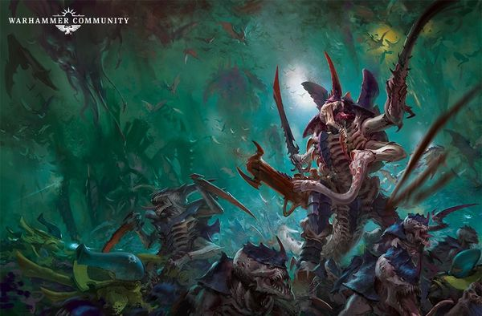

<!-- A0579-B0004 -->

原译文

Tyranid swarm 泰伦虫群

**校订译文**

Tyranid swarm 泰伦虫群

<!-- /A0579-B0004 -->

<!-- A0579-B0005 -->
**英文原文**

The Tyranids are seen as one of the gravest threats to the entire Galaxy. They seek only to consume all organic life and cannot be reasoned with or deterred in this quest. Worse still for the Galaxy, thus far the Tyranid Hive Fleets that have been encountered are merely the furthest stretched tendril of the main invasion fleet that is still traveling in the void of space.

<!-- /A0579-B0005 -->

<!-- A0579-B0006 -->

原译文

泰伦被视为对整个银河系最严重的威胁之一。他们只想消耗所有的有机生命，在这一追求中无法被说服或阻止。对银河系来说更糟糕的是，到目前为止，遇到的泰伦虫巢舰队只是仍在太空中航行的主要入侵舰队中最远的卷须。

**校订译文**

泰伦被视为整个银河系面临的最严重威胁之一。它们只求吞噬一切有机生命，既无法说服，也无法威慑。更糟的是，迄今遭遇的虫巢舰队，仅仅是仍在太空中航行的入侵主力伸得最远的触须。

<!-- /A0579-B0006 -->

<!-- A0579-B0007 -->
## History 历史

<!-- /A0579-B0007 -->

<!-- A0579-B0008 -->
**英文原文**

The exact origin of the Tyranids themselves is unclear, save the fact that they are not of this galaxy and have only recently arrived here after traveling countless millennia in the intergalactic void. It is unknown which galaxy they originated from, or for how long the Tyranid race has been on its genocidal rampage, but it is believed that it is the Astronomican that is drawing the Tyranid Hive Fleet to threaten the Galaxy. The Tyranids were first attracted to the Milky Way Galaxy when the Xenos communication device known as the Pharos was overloaded in the Battle of Sotha during the Horus Heresy. Indeed their very name is but a title given to them by the Imperium, named after the planet where they were first encountered (Tyran). It is possible that they have been preying on other galaxies since time immemorial. According to another source, they have consumed one thousand galaxies and are responsible for the annihilation of millions of intelligent species.

<!-- /A0579-B0008 -->

<!-- A0579-B0009 -->

原译文

泰伦本身的确切起源尚不清楚，除了他们不属于这个河系，并且是在河系间的虚空旅行了无数年后才到达这里的事实。目前尚不清楚它们来自哪个河系，也不清楚泰伦种族进行种族灭绝的时间有多长，但据信是星炬吸引了泰伦虫巢舰队来威胁银河系。泰伦第一次被银河系吸引是在荷鲁斯叛乱时期的索萨之战中，被称为法罗斯的异型通信设备过载。事实上，他们的名字只是帝国给他们的一个头衔，以他们第一次遇到的行星（泰兰）命名。它们可能自古以来就一直在捕食其他河系。根据另一个消息来源，它们已经吞噬了1000个河系，并导致数百万智慧物种的灭绝。

**校订译文**

泰伦的确切起源尚不清楚。可以确定的是，它们并非银河系的原生种族，而是在河系间虚空中跋涉了无数个千年，直到近来才抵达这里。它们来自哪个河系，灭绝众生的暴行又已持续多久，至今无人知晓。据信，如今正是星炬吸引着虫巢舰队，令其逼近银河；而最初引来它们注意的，是荷鲁斯之乱期间索萨之战中，被称为“灯塔”的异形通信装置发生过载。就连“泰伦”这个名字，也是帝国以首次遭遇它们的行星泰兰命名的。它们或许自远古便一直捕食其他河系；另一则资料甚至称，它们已吞噬一千个河系，使数百万个智慧物种灭绝。

**校注：** 星炬持续吸引与灯塔首次惊动是不同阶段；“一千个河系”保留为另一则资料的说法，不据此断言精确数量。

<!-- /A0579-B0009 -->

<!-- A0579-B0010 图片 -->
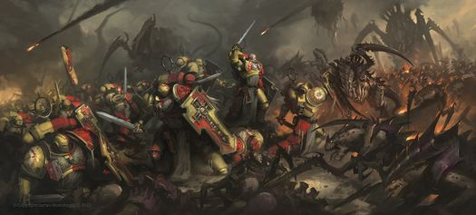

<!-- A0579-B0011 -->

原译文

Tyranids battle the Howling Griffons 泰伦与咆哮狮鹫战斗

**校订译文**

Tyranids battle the Howling Griffons 泰伦与咆哮狮鹫战斗

<!-- /A0579-B0011 -->

<!-- A0579-B0012 -->
**英文原文**

The Imperium's first official contact with the Tyranid race was in 741.M41, when the Hive Fleet later known as Behemoth invaded the Eastern Fringe and annihilated planet Tyran. However, reexamination of Imperial records has led to speculation that the Tyranids have been invading, or at least probing, the Galaxy for much longer. Some of the Galaxy's most notorious predatory beasts, such as the Catachan Devil or the Fenrisian Kraken, are guessed to be the descendants of ancient Hive Fleets. Records kept by the Ordo Xenos of the Inquisition suggest contact with Tyranid bio-forms as far back as M35; even more remarkable, in 937.M41, a Bio-ship was discovered beneath the surface of Nusquam Fundumentibus, where it had lain dormant since around M34. This discovery raised the disquieting possibility that other dormant Hive units are already "salted" around the Imperium as a whole, waiting for a new Hive Fleet to awaken them.

<!-- /A0579-B0012 -->

<!-- A0579-B0013 -->

原译文

帝国与泰伦种族的第一次正式接触是在741.M41，当时虫巢舰队（后来被称为贝希摩斯）入侵了东部边缘，毁灭了泰兰行星。然而，对帝国记录的重新审视引发了人们的猜测，即泰伦入侵或至少探测银河系的时间要长得多。银河系中一些最著名的掠食性动物，如卡塔昌恶魔或芬里斯海怪，被猜测是古代虫巢舰队的后代。审判庭保存的记录表明，早在M35，就与泰伦生物有过接触；更值得注意的是，在937.M41，一艘生物舰被发现在虚无之基的表面下，自M34左右以来，它一直处于休眠状态。这一发现提出了一种令人不安的可能性，即其他休眠的虫巢单位已经在整个帝国周围“腌制”，等待新的虫巢舰队唤醒它们。

**校订译文**

帝国首次正式接触泰伦，是在741.M41：后来被命名为贝希摩斯的虫巢舰队入侵东部边陲，毁灭了泰兰。然而，重新审视帝国档案后，有人推测，泰伦入侵银河——至少开始试探银河——的时间要早得多。卡塔昌恶魔、芬里斯海怪等恶名昭著的捕食生物，就被怀疑是古老虫巢舰队的后裔。异形审判庭保存的记录表明，接触泰伦生物的历史可能上溯至第35千年。更令人震惊的是，937.M41，人们在虚无之基地表下发现了一艘生物舰，它从第34千年前后便一直休眠于此。这意味着，其他休眠中的虫巢单位也可能早已散布于整个帝国，等待新的虫巢舰队将其唤醒。

**校注：** salted意为散布潜伏单位，原“腌制”误解；补回原文明确的Ordo Xenos异形审判庭。

<!-- /A0579-B0013 -->

<!-- A0579-B0014 图片 -->
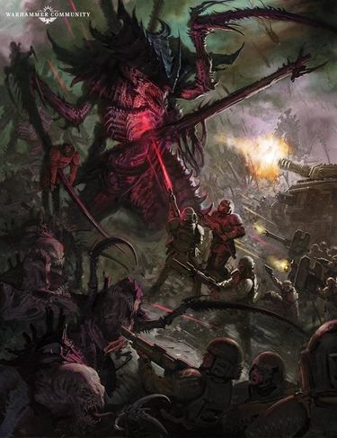

<!-- A0579-B0015 -->

原译文

Tyranids battle the Imperial Guard 泰伦与帝国卫队战斗

**校订译文**

Tyranids battle the Imperial Guard 泰伦与帝国卫队战斗

<!-- /A0579-B0015 -->

<!-- A0579-B0016 -->
**英文原文**

Hive Fleet Behemoth was largely defeated at the Battle of Macragge in 745.M41. However this was hardly the end of the Tyranid menace. After Behemoth, the next major Hive Fleet to move into the Galaxy was Kraken in 992.M41, though tendrils of this Hive Fleet were defeated by the Imperium Ichar IV Campaign and by the Eldar at the Battle of Iyanden. Despite these setbacks, the Tyranids continued to advance into the Galaxy through a variety of smaller Hive Fleets. In 997.M41 the largest Tyranid Hive Fleet encountered so far, Leviathan, moved into the Galaxy below the galactic plane. However, thanks to the formation of the Great Rift, much of Leviathan was cut off as it made its main assault on Baal, homeworld of the Blood Angels. Most of Leviathan was destroyed during the period known as the Blackness against the defenders of Baal, the Indomitus Crusade, and newly materialised Daemonic armies. Nonetheless, the Hive Fleet still has many tendrils remaining, which are now surging towards Segmentum Solar.

<!-- /A0579-B0016 -->

<!-- A0579-B0017 -->

原译文

虫巢舰队贝希摩斯在745.M41的马库拉格之战中基本被击败。然而，这并不是泰伦威胁的结束。在贝希摩斯之后，下一个进入银河系的主要虫巢舰队是992.M41的克拉肯，尽管这个虫巢舰队的卷须被帝国的伊卡尔四号战役和灵族的伊扬登之战击败。尽管遭遇了这些挫折，泰伦仍继续通过各种较小的虫巢舰队进入银河系。997.M41，迄今为止遇到的最大的泰伦虫巢舰队利维坦进入银河系平面以下的银河系。然而，由于大裂隙的形成，利维坦的大部分地区被切断，它主要攻击了圣血天使的家园世界巴尔。利维坦的大部分地区在被称为黑暗的时期被摧毁，以对抗巴尔的防御者、不屈远征和新出现的恶魔军队。尽管如此，虫巢舰队仍有许多卷须，现在正朝着太阳星域方向涌动。

**校订译文**

745.M41，贝希摩斯虫巢舰队在马库拉格之战中基本遭到击溃，但泰伦威胁远未结束。下一支大规模进入银河的舰队，是992.M41的克拉肯；其部分支脉分别在伊卡尔四号战役中被帝国击败，在伊扬登之战中被灵族击退。此后，多支较小的虫巢舰队仍不断深入银河。997.M41，迄今遭遇的最大虫巢舰队利维坦，从银河盘面下方侵入。它对圣血天使母星巴尔发动主攻时，大裂隙的形成切断了其大部分兵力之间的联系。在被称为“黑暗期”的阶段，利维坦主力在与巴尔守军、不屈远征军及新近现身的恶魔大军作战时覆灭。但它仍有许多支脉残存，正涌向太阳星域。

**校注：** 此段克拉肯到来记为992.M41，下方列表为993.M41，保留原文两处纪年并标疑，不自行选择年份。Blackness暂译黑暗期。

<!-- /A0579-B0017 -->

<!-- A0579-B0018 -->
**英文原文**

A report given by the Strategic Collective in 998.M41 stated their belief that their extrapolated findings indicated that Hive Fleets Behemoth, Kraken, and Leviathan were the vanguard of a yet unseen main force, likening them to talons of a claw. This main force was projected to be brought to bear against the Imperium within a century. The report also stated that an increase of mobilisation levels by a minimum of 500% would be needed to slow this main force. Additionally, the drafting of every able-bodied man and woman on every world of the Segmentae Solar, Obscurus, and Tempestus would be needed to have a chance at repelling said force.

<!-- /A0579-B0018 -->

<!-- A0579-B0019 -->

原译文

战略集团在998.M41发表的一份报告中表示，他们相信他们的推断结果表明，虫巢舰队贝希摩斯、克拉肯和利维坦是一支尚未见过的主力部队的先锋，将它们比作爪子。这支主力预计将在一个世纪内对抗帝国。报告还指出，需要将动员水平至少提高500%，以减缓这支主力部队的速度。此外，需要在太阳星域、朦胧星域和暴风星域的每个世界上征召每一个身体健全的男女，才能有机会击退所述部队。

**校订译文**

战略集团在998.M41提交的一份报告中认为，推算结果显示，贝希摩斯、克拉肯和利维坦只是尚未露面的主力前锋，犹如同一只巨爪伸出的几枚爪尖。预计这支主力将在一个世纪内向帝国发起攻势。报告称，要稍稍遏制其推进，动员水平至少须提高500%；而要有机会将其击退，就必须征召太阳、朦胧和暴风三大星域所有世界上每一名身体健全的男女。

<!-- /A0579-B0019 -->

<!-- A0579-B0020 -->
**英文原文**

In M42, the Tyranids sent shocks throughout the Imperium by unleashing a new, massive invasion throughout Segmentum Pacificus.

<!-- /A0579-B0020 -->

<!-- A0579-B0021 -->

原译文

在M42，泰伦在整个帝国发动了一场新的大规模入侵，对整个太平星域造成了冲击。

**校订译文**

第42千年，泰伦在太平星域发动了新一轮大规模入侵，震动整个帝国。

**校注：** 原文是太平星域遭入侵、整个帝国震动，原译颠倒两个范围。

<!-- /A0579-B0021 -->

<!-- A0579-B0022 -->
### Hive Fleets 虫巢舰队

<!-- /A0579-B0022 -->

<!-- A0579-B0023 -->
**英文原文**

Tyranid forces are broken up into huge Hive Fleets which appear to be moving independently of each other. In some cases, Hive Fleets have even been observed attacking one another.

<!-- /A0579-B0023 -->

<!-- A0579-B0024 -->

原译文

泰伦部队被分成巨大的虫巢舰队，它们似乎彼此独立地移动。在某些情况下，甚至观察到虫巢舰队相互攻击。

**校订译文**

泰伦兵力分属多个庞大的虫巢舰队，各舰队看起来独立行动，有时甚至会彼此交战。

<!-- /A0579-B0024 -->

<!-- A0579-B0025 图片 -->
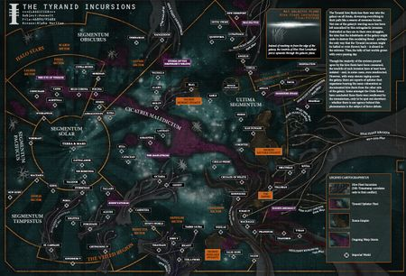

<!-- A0579-B0026 -->

原译文

Tyranid Incursions 泰伦入侵

**校订译文**

Tyranid Incursions 泰伦入侵

<!-- /A0579-B0026 -->

<!-- A0579-B0027 -->
**英文原文**

Some most of the major Hive Fleets include:

<!-- /A0579-B0027 -->

<!-- A0579-B0028 -->

原译文

一些主要的虫巢舰队包括：

**校订译文**

一些主要的虫巢舰队包括：

<!-- /A0579-B0028 -->

<!-- A0579-B0029 -->

原译文

Hive Fleet Ouroboros - M36 虫巢舰队乌洛波洛斯

**校订译文**

Hive Fleet Ouroboros - M36 乌洛波洛斯虫巢舰队——第36千年

<!-- /A0579-B0029 -->

<!-- A0579-B0030 -->
**英文原文**

Hive Fleet Behemoth - 741.M41 (the Imperium's first official contact with the Tyranid species)

<!-- /A0579-B0030 -->

<!-- A0579-B0031 -->

原译文

虫巢舰队贝希摩斯（帝国与泰伦的首次正式接触）

**校订译文**

贝希摩斯虫巢舰队——741.M41（帝国首次正式接触泰伦）

<!-- /A0579-B0031 -->

<!-- A0579-B0032 -->

原译文

Hive Fleet Naga - 801.M41 虫巢舰队娜迦

**校订译文**

Hive Fleet Naga - 801.M41 娜迦虫巢舰队——801.M41

<!-- /A0579-B0032 -->

<!-- A0579-B0033 -->

原译文

Hive Fleet Gorgon - 899.M41 虫巢舰队戈尔贡

**校订译文**

Hive Fleet Gorgon - 899.M41 戈尔贡虫巢舰队——899.M41

<!-- /A0579-B0033 -->

<!-- A0579-B0034 -->

原译文

Hive Fleet Kraken - 993.M41 虫巢舰队克拉肯

**校订译文**

Hive Fleet Kraken - 993.M41 克拉肯虫巢舰队——993.M41

<!-- /A0579-B0034 -->

<!-- A0579-B0035 -->

原译文

Hive Fleet Jormungandr - 995.M41 虫巢舰队耶梦加得

**校订译文**

Hive Fleet Jormungandr - 995.M41 耶梦加得虫巢舰队——995.M41

<!-- /A0579-B0035 -->

<!-- A0579-B0036 -->

原译文

Hive Fleet Leviathan - 997.M41 虫巢舰队利维坦

**校订译文**

Hive Fleet Leviathan - 997.M41 利维坦虫巢舰队——997.M41

<!-- /A0579-B0036 -->

<!-- A0579-B0037 -->

原译文

Hive Fleet Hydra - M41 虫巢舰队海德拉

**校订译文**

Hive Fleet Hydra - M41 海德拉虫巢舰队——第41千年

<!-- /A0579-B0037 -->

<!-- A0579-B0038 -->

原译文

Hive Fleet Kronos - M42 虫巢舰队克罗诺斯

**校订译文**

Hive Fleet Kronos - M42 克罗诺斯虫巢舰队——第42千年

<!-- /A0579-B0038 -->

<!-- A0579-B0039 -->
## Biology 生理

<!-- /A0579-B0039 -->

<!-- A0579-B0040 -->
**英文原文**

The Tyranids do not communicate with the other races of the Galaxy. The Tyranids cannot be reasoned with, appeased or surrendered to. There can be no hope of mercy from such a foe. To face the Tyranids is simply a matter of survival: kill or be consumed.

<!-- /A0579-B0040 -->

<!-- A0579-B0041 -->

原译文

泰伦不与银河系的其他种族交流。泰伦无法与之讲理、安抚或屈服。这样的敌人没有怜悯的希望。面对泰伦只是一个生存问题：要么杀死，要么被消灭。

**校订译文**

泰伦不与银河其他种族交流。讲理、安抚，甚至向它们投降，都毫无用处；面对这样的敌人，休想得到怜悯。与泰伦相遇，便只剩生存问题：杀死它们，或被吞噬。

<!-- /A0579-B0041 -->

<!-- A0579-B0042 图片 -->
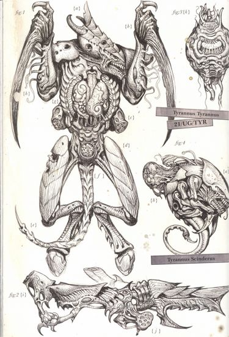

<!-- A0579-B0043 -->

原译文

Dissection of a Hive Tyrant, displayed with Spore Mine and Ripper 虫巢暴君的解剖，与孢子雷和撕裂虫一起展出

**校订译文**

Dissection of a Hive Tyrant, displayed with Spore Mine and Ripper 虫巢暴君的解剖，与孢子雷和撕裂虫一起展出

<!-- /A0579-B0043 -->

<!-- A0579-B0044 -->
**英文原文**

The Tyranid forces are constantly changing and evolving at an unnatural speed. It is unlikely that all types of Tyranids have been seen by the Imperium, and less likely still that they will ever all be seen. However a few key traits are identical to nearly all Tyranids, such as tough chitinous armour, a hexapodal anatomy, and multiple redundant organs which make them incredibly difficult to kill.

<!-- /A0579-B0044 -->

<!-- A0579-B0045 -->

原译文

泰伦的部队正在以一种不自然的速度不断变化和发展。帝国不太可能看到所有类型的泰伦，更不可能看到他们全部。然而，一些关键特征几乎与所有泰伦相同，例如坚硬的甲壳质盔甲、六足的解剖结构和多个冗余器官，这使得它们极难被杀死。

**校订译文**

泰伦以超乎自然的速度不断变化、进化。帝国不大可能已经见过所有类型，今后也未必能见全。不过，几乎所有泰伦都共有若干特征：坚韧的几丁质甲壳、六肢结构，以及多个可互为备用的器官。这使它们极难杀死。

**校注：** 六肢包括前肢/武器肢，不一概说六足；冗余器官按相互备用解释。

<!-- /A0579-B0045 -->

<!-- A0579-B0046 -->
### The Six Limbs 六肢

原题：The Six Limbs 六足

<!-- /A0579-B0046 -->

<!-- A0579-B0047 -->
**英文原文**

The terrestrial Tyranids of the 41st Millennium display unique adaptations, particularly in their limb structure. Their third set of limbs typically ends in hooves, resembling those of ungulates, with an elongated lower leg and a prominent ankle joint. These limbs are often specialised, featuring spurs for stabilisation, or additional weaponry. However, some Tyranids, like the Trygon, use alternative locomotion, freeing their limbs for weaponry.

<!-- /A0579-B0047 -->

<!-- A0579-B0048 -->

原译文

第41个千年的陆地泰伦表现出独特的适应性，特别是在肢体结构方面。它们的第三组肢体通常以蹄子结束，类似于有蹄类动物，有一条细长的小腿和一个突出的踝关节。这些肢体通常是专门的，具有稳定的靴刺或额外的武器。然而，一些泰伦，如掘蟒，使用另类的移动方式，将四肢解放出来用于武器。

**校订译文**

第41千年的陆生泰伦展现出独特的适应性，尤其体现在肢体结构上。第三对肢体通常末端生蹄，类似有蹄动物，拥有修长的小腿和突出的踝关节。这对肢体也常发生特化，长出用于稳定身体的骨刺，或兼作额外武器。掘蟒等泰伦则采用其他移动方式，将肢体腾出来用于攻击。

<!-- /A0579-B0048 -->

<!-- A0579-B0049 -->
**英文原文**

The first and second sets of limbs are highly mutable, adapting to the Hive Mind's needs. Close-combat variants often have Scything Talons for the first limbs, while larger species like Lictors have clawed middle limbs for grasping and tearing. Smaller creatures, such as Hormagaunts, typically have vestigial middle limbs. For ranged combat, projectile weapons are carried differently based on posture: upright walkers like Hive Tyrants use their middle limbs, whereas hunched-over species like Termagants and Tyrannofexes use their first limbs. Gun-beasts have reinforced limbs to manage bio-gun recoil.

<!-- /A0579-B0049 -->

<!-- A0579-B0050 -->

原译文

第一组和第二组肢体具有高度可变性，能够适应虫巢思维的需求。近战变种的第一肢通常是镰爪，而像利卡特这样的大型物种则有可抓握和撕裂的四肢。像刀虫这样的小型生物通常有退化的四肢。在远程作战中，投射武器的携带方式会根据姿势而有所不同：像虫巢暴君这样的直立行走者使用他们的四肢，而像枪虫和暴虐兽这样的弯腰驼背的物种使用他们的第一肢。枪炮群兽有强化的四肢来解决生物枪炮的后坐力。

**校订译文**

第一、第二对肢体的形态变化极大，以满足虫巢意志的需要。近战变种的第一对肢体常化为镰爪；刀斧虫等较大生物的中间一对则带有利爪，用于抓握、撕裂。刀虫等小型生物的中间一对肢体通常已经退化。远程武器的持握方式取决于体态：虫巢暴君等直立行走的生物用中间一对肢体持枪，枪虫、暴虐兽等俯身活动的生物则用第一对。炮兽的肢体经过强化，能够承受生物枪炮的后坐力。

<!-- /A0579-B0050 -->

<!-- A0579-B0051 -->
**英文原文**

Some Tyranids are spawned with bifurcated limbs to handle large bio-weapons. These specialised limbs feature an upper section to operate the firing mechanism and a lower section to hold the weapon, often supported by an additional digit for stability.

<!-- /A0579-B0051 -->

<!-- A0579-B0052 -->

原译文

一些泰伦天生就有分叉的四肢，可以处理大型生物武器。这些特殊的肢体有一个上部用于操作射击构造，一个下部用于固定武器，通常由额外的手指支撑以保持稳定性。

**校订译文**

一些泰伦生来就有分叉肢体，便于操作大型生物武器。特化肢体的上分支操纵击发机构，下分支托住武器，往往还有额外的指状结构辅助稳定。

<!-- /A0579-B0052 -->

<!-- A0579-B0053 -->
### Spore Chimneys and Heat Sinks 孢子烟囱和散热器

<!-- /A0579-B0053 -->

<!-- A0579-B0054 -->
**英文原文**

Smaller organisms, such as Termagants and Hormagaunts, feature ribbed, open slots on their limbs and weapons, acting as heat sinks to dissipate heat efficiently. Larger creatures, like Tyranid Warriors, have more heat sinks, while massive species such as Carnifexes and Tervigons include rows of fluted chimneys for enhanced heat distribution.

<!-- /A0579-B0054 -->

<!-- A0579-B0055 -->

原译文

较小的生物，如枪虫和刀虫，其四肢和武器上有肋状开口槽，作为散热器有效散热。较大的生物，如泰伦战士虫，有更多的散热器，而大型物种，如刽子手和恶妇虫，则包括成排的凹槽狭缝，以增强热量分布。

**校订译文**

枪虫、刀虫等较小生物的肢体和武器上，开有带肋纹的散热槽。泰伦武士等较大生物拥有更多散热结构；刽子手、母虫等巨型生物则长有成排带沟槽的烟囱状器官，以加强散热。

<!-- /A0579-B0055 -->

<!-- A0579-B0056 图片 -->
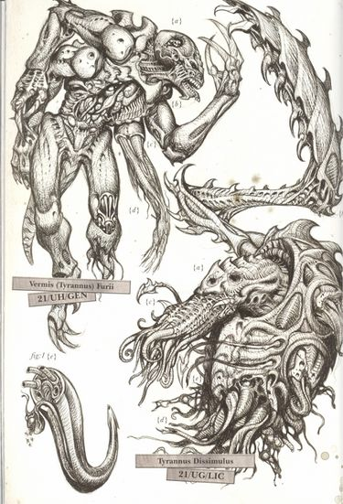

<!-- A0579-B0057 -->

原译文

Dissection of a Genestealer and Lictor 基因窃取者和利卡特的解剖

**校订译文**

Dissection of a Genestealer and Lictor 基因窃取者与刀斧虫的解剖

<!-- /A0579-B0057 -->

<!-- A0579-B0058 -->
**英文原文**

These chimneys scale with size and energy needs; for instance, Zoanthropes have large chimneys despite their smaller size due to their high energy output. Some organisms utilise chimneys for dual purposes: Toxicrenes and Venomthropes use them to release spores and toxins, while the Psychophage emits smog from its chimneys, showcasing its assimilator function.

<!-- /A0579-B0058 -->

<!-- A0579-B0059 -->

原译文

这些狭缝随着规模和能量需求而扩大；例如，由于其高能量输出，灵吸虫虽然体积较小，但狭缝很大。一些生物利用狭缝有双重目的：毒鞭虫和毒烟虫利用狭缝释放孢子和毒素，而噬灵虫则从狭缝中排放烟雾，展示其同化功能。

**校订译文**

这些烟囱状器官的规模，随体型与能量需求而变化。例如，脑虫虽然体型较小，却因能量输出很高而拥有巨大的烟囱。有些生物还让烟囱兼具其他用途：毒鞭兽和毒烟虫借此释放孢子、毒素；噬灵虫则从中喷出烟雾，体现其同化生物的职能。

**校注：** Zoanthrope(s)按GW09第37/GW10第36译脑虫；chimneys是烟囱状器官，非狭缝。

<!-- /A0579-B0059 -->

<!-- A0579-B0060 -->
### Chitinous Carapace 几丁质甲壳

<!-- /A0579-B0060 -->

<!-- A0579-B0061 -->
**英文原文**

Tyranids are equipped with an organic, armoured carapace that moves with their bodies. These overlapping plates feature striations along the edges, where battle damage typically occurs. The head always has five plates, which may merge into the torso or extend into elaborate crests or blades.

<!-- /A0579-B0061 -->

<!-- A0579-B0062 -->

原译文

泰伦装备了一个有机的装甲甲壳，可以随身体移动。这些重叠的板块边缘有条纹，通常会发生战斗损伤。头部总是有五个板，它们可以合并到躯干中，也可以延伸成复杂的羽冠或刀刃。

**校订译文**

泰伦的有机甲壳如同装甲，能够随身体活动。相互叠压的甲片边缘带有条纹，也最容易在战斗中受损。头部总有五块甲片，可以与躯干甲壳连成一体，也可以延展成复杂的冠饰或刃状结构。

<!-- /A0579-B0062 -->

<!-- A0579-B0063 -->
### Body Structure 身体结构

<!-- /A0579-B0063 -->

<!-- A0579-B0064 -->
**英文原文**

Beneath their carapace, Tyranids have a smooth, hard exoskeleton similar to that of insects or crustaceans, with ridges around flexible joints. This contrast between the striated carapace and the smooth exoskeleton highlights their layered anatomy, transitioning from hard to soft textures. Additional features include spiracles on their heads, necks, and tails for respiration, and umbilicals on some weapon symbiotes, like the Hive Tyrant's bonesword, for transferring bioelectric energy.

<!-- /A0579-B0064 -->

<!-- A0579-B0065 -->

原译文

在它们的甲壳之下，泰伦有一个光滑、坚硬的外骨骼，类似于昆虫或甲壳类动物，在柔性关节周围有脊。条纹甲壳和光滑外骨骼之间的这种对比突出了它们的分层解剖结构，从硬纹理过渡到软纹理。其他特征包括它们头上、脖子上和尾巴上的呼吸孔，以及一些共生体武器上的管道，如虫巢暴君的骨剑，用于传输生物电能。

**校订译文**

甲壳之下，泰伦还有一层光滑、坚硬的外骨骼，类似昆虫或甲壳动物；可屈伸的关节周围生有棱脊。带条纹的甲壳与光滑的外骨骼形成对比，显出由硬到软、层次分明的身体结构。头、颈和尾部还开有呼吸孔。一些共生武器则带有脐带状管道，例如虫巢暴君的骨剑，借此传输生物电能。

<!-- /A0579-B0065 -->

<!-- A0579-B0066 -->
### Adaptations 适应性

<!-- /A0579-B0066 -->

<!-- A0579-B0067 -->
**英文原文**

The Hive Mind continually adapts Tyranid organisms for specialised roles. Predatory creatures like Von Ryan's Leaper have extra eyes for enhanced vision, while Hive Guard and Neurogaunts lack eyes entirely, relying on synapse creatures for direction. The Zoanthrope possesses two additional necks to support its massive brain, and the Exocrine features dual spines to manage the recoil of its bio-plasmic cannon. Ymgarl Genestealers use feeder tendrils to extract knowledge from prey, and the Hive Crone wields a Drool Cannon instead of a mouth.

<!-- /A0579-B0067 -->

<!-- A0579-B0068 -->

原译文

虫巢思维不断地使泰伦生物体适应特殊的角色。像冯·瑞安跳跃者这样的掠食性生物有额外的眼睛来增强视力，而虫巢卫士和神经虫则完全没有眼睛，依靠突触生物来指引方向。灵吸虫拥有两个额外的颈部来支撑其巨大的大脑，而离子炮虫则具有双脊来控制其生物等离子炮的反冲。伊姆加尔基因窃取者使用进食卷须从猎物身上提取知识，而天巫则使用口水炮而不是嘴巴。

**校订译文**

虫巢意志不断调整泰伦生物，使其适应专门职能。冯·瑞恩跃袭者等捕食生物多生额外眼睛，以增强视力；虫巢护卫和神经虫则完全无眼，依赖突触生物指引。脑虫多出两个颈状结构，以支撑硕大的脑部；离子炮兽拥有双重脊柱，以承受生物等离子炮的后坐力。伊姆加尔基因窃取者通过摄食触须从猎物身上获取知识，而虫巢天妪的口部则被口涎炮取代。

**校注：** 原文说脑虫有two additional necks，保留两个额外颈状结构，不按常识删除；解剖事实依所给原文。Drool Cannon口涎炮暂定。

<!-- /A0579-B0068 -->

<!-- A0579-B0069 -->
### Bio-Weapons 生物武器

<!-- /A0579-B0069 -->

<!-- A0579-B0070 -->
**英文原文**

Every weapon and projectile used by the hive fleets is a living organism, grown from the reconstituted biomatter of previous invasions. The Tyranids have no form of mechanical technology and instead harness an advanced form of biotechnology. These creatures live in a highly symbiotic fashion, fusing into each other’s flesh so that it is often impossible to say where one Tyranid creature ends and another begins. This relationship is most obvious in the larger constructs, whose repurposed anatomies still retain recognisable biological shapes. However, this "forced parasitism" exists at every level, with examples such as "thinking blood", organs that can live separately from the creature they served, and subsidiary brains that serve as a "backup" in case of primary brain death or contain some specialist knowledge necessary for the current invasion.

<!-- /A0579-B0070 -->

<!-- A0579-B0071 -->

原译文

虫巢舰队使用的每一件武器和投射物都是一个活的有机体，由之前入侵的生物物质重组生长而成。泰伦没有机械技术，而是利用了先进的生物技术。这些生物以高度共生的方式生活，融合到彼此的肉体中，因此通常无法说出一个泰伦生物在哪里结束，另一个在哪里开始。这种关系在更大的构造中最为明显，其改造利用的解剖结构仍然保留了可识别的生物形状。然而，这种“强迫寄生”存在于各个层面，例如“思维血液”，可以与所服务的生物分开生活的器官，以及在原发性脑死亡的情况下作为“备份”或包含当前入侵所需的一些专业知识的辅助大脑。

**校订译文**

虫巢舰队使用的每一件武器、每一枚投射物，都是以历次入侵所获生物质重新构成并培育的活体。泰伦没有机械技术，而是运用极其先进的生物技术。这些生物高度共生，肉体彼此融合，往往难以辨认一个个体在哪里终止、另一个又从哪里开始。大型生物构造最能体现这种关系：身体虽经改造、另作他用，仍可辨认原有的生物形态。然而，这种“强制寄生”遍及各个层面，例如能思考的血液、离开宿主仍可独立存活的器官，以及在主脑死亡时接替工作，或储存本次入侵所需专门知识的辅助脑。

<!-- /A0579-B0071 -->

<!-- A0579-B0072 图片 -->
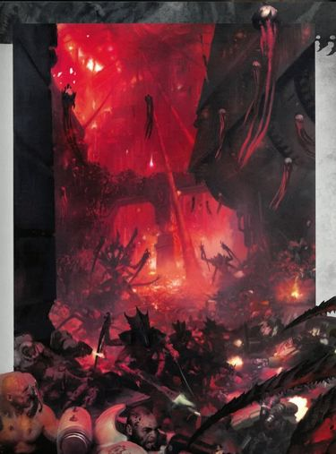

<!-- A0579-B0073 -->

原译文

Tyranids battle the Leagues of Votann 泰伦与沃坦联盟战斗

**校订译文**

Tyranids battle the Leagues of Votann 泰伦与沃坦联盟战斗

<!-- /A0579-B0073 -->

<!-- A0579-B0074 -->
**英文原文**

In this way, Tyranid warrior-beasts wield living weapons that are literally extensions of their own bodies, each one a killing machine, perfectly adapted to slaughter its victims. In addition, Tyranids are highly toxic to all forms of life, and many of their organisms expel toxic spores during invasions to make a world uninhabitable to non-Tyranid life.

<!-- /A0579-B0074 -->

<!-- A0579-B0075 -->

原译文

通过这种方式，泰伦的战士野兽挥舞着活体武器，这些武器实际上是它们自己身体的延伸，每一件都是一台杀人机器，完全适合屠杀受害者。此外，泰伦对所有形式的生命都有剧毒，他们的许多生物在入侵过程中会排出有毒孢子，使这个世界不适合非泰伦生命居住。

**校订译文**

因此，泰伦战兽使用的活体武器，确实就是自身躯体的延伸；每一件都是专为屠戮猎物而适应成形的杀戮机器。此外，泰伦对各种生命都具有剧毒，许多个体会在入侵时排放有毒孢子，使世界不再适合非泰伦生物生存。

<!-- /A0579-B0075 -->

<!-- A0579-B0076 -->
**英文原文**

The bio-construct nature of the Tyranids makes them a terrible foe to face, for their armies contain a creature specialised for every conceivable facet of warfare, which can be altered and regrown to suit a battle’s needs in a short space of time. Thus can a hive fleet adapt to generate a force capable of overwhelming any opposition, unleashing a vast throng of ferocious alien monsters that can fly, run, burrow and stalk through the defenses of any foe.

<!-- /A0579-B0076 -->

<!-- A0579-B0077 -->

原译文

泰伦的生物构造特性使他们成为一个可怕的敌人，因为他们的军队中有一种专门用于战争各个方面的生物，可以在短时间内改变和再生以适应战斗的需要。因此，虫巢舰队可以适应并产生一支能够压倒任何对手的部队，释放出一大群凶猛的外星怪物，它们可以飞行、奔跑、挖洞和潜行过任何敌人的防御。

**校订译文**

这种生物构造特性使泰伦成为可怕的敌人。它们的军队拥有应对各种作战需求的专门生物，还能迅速改造、重新培育，以适应战场。因此，虫巢舰队能够调整自身，产出足以压倒任何抵抗的兵力，释放大群会飞、会奔跑、会掘地、会潜行的凶暴异形，穿透敌人的防御。

<!-- /A0579-B0077 -->

<!-- A0579-B0078 -->
**英文原文**

Tyranid organisms can rapidly adapt to any threat presented against it. Tyranids that have battled the Dark Eldar have quickly developed a higher resistance to pain, those that battle the World Eaters have become even more bloodthirsty and savage, and those that have fought the Orks have become greatly enlarged.

<!-- /A0579-B0078 -->

<!-- A0579-B0079 -->

原译文

泰伦生物能够迅速适应任何威胁。与黑暗灵族作战的泰伦很快对疼痛产生了更高的抵抗力，与吞世者作战的泰伦变得更加嗜血和野蛮，与欧克作战的泰伦则变得更加庞大。

**校订译文**

泰伦生物能够迅速适应任何威胁。与黑暗灵族作战的泰伦很快对疼痛产生了更高的抵抗力，与吞世者作战的泰伦变得更加嗜血和野蛮，与欧克作战的泰伦则变得更加庞大。

<!-- /A0579-B0079 -->

<!-- A0579-B0080 -->
### Species 物种

<!-- /A0579-B0080 -->

<!-- A0579-B0081 -->
**英文原文**

The Tyranid swarm is endless and constantly evolving, and in any given Hive Fleet there are an endless variety of creatures that have been incorporated into the Swarm.

<!-- /A0579-B0081 -->

<!-- A0579-B0082 -->

原译文

泰伦虫群是无尽的，不断进化，在任何给定的虫巢舰队中，都有无数种生物被纳入虫群。

**校订译文**

泰伦虫群无穷无尽，且不断进化。每支虫巢舰队都纳入了种类繁多、几乎无可穷尽的生物。

<!-- /A0579-B0082 -->

<!-- A0579-B0083 图片 -->
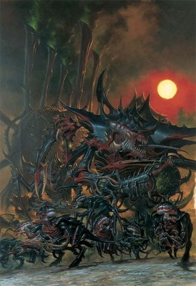

<!-- A0579-B0084 -->

原译文

Tyranid swarm 泰伦虫群

**校订译文**

Tyranid swarm 泰伦虫群

<!-- /A0579-B0084 -->

<!-- A0579-B0085 -->
**英文原文**

A list of all known Tyranid species and sub-species.

<!-- /A0579-B0085 -->

<!-- A0579-B0086 -->

原译文

所有已知泰伦物种和亚种的列表。

**校订译文**

所有已知泰伦物种和亚种的列表。

<!-- /A0579-B0086 -->

<!-- A0579-B0087 -->
**英文原文**

A Biomorph is an evolutionary adaptation of the Tyranid species developed by the Hive Mind to create the perfect killing beasts needed to defeat its current enemy. Biomorphs are symbiotic creatures organically attached to more complex Tyranid organisms, serving as their organisms primary means of attack.

<!-- /A0579-B0087 -->

<!-- A0579-B0088 -->

原译文

生物形态是由虫巢思维开发的泰伦物种的进化适应，以创造击败当前敌人所需的完美杀戮野兽。生物形态是与更复杂的泰伦生物体有机结合的共生生物，是其生物体的主要攻击手段。

**校订译文**

生物形态是虫巢意志为泰伦发展出的进化适应，旨在造出最适于击败当前敌人的杀戮生物。这些形态实际体现为共生生物，与更复杂的泰伦躯体有机相连，构成宿主的主要攻击手段。

<!-- /A0579-B0088 -->

<!-- A0579-B0089 -->
**英文原文**

Tyranid Fleets are massive swarms of spacegoing Tyranid Bio-ships.

<!-- /A0579-B0089 -->

<!-- A0579-B0090 -->

原译文

泰伦舰队是由泰伦生物舰组成的庞大编队。

**校订译文**

泰伦舰队是由泰伦生物舰组成的庞大编队。

<!-- /A0579-B0090 -->

<!-- A0579-B0091 -->
**英文原文**

Zoats have also appeared alongside Tyranid forces, but the nature of their relationship is presently unclear. Various theories have been proposed, from the Zoats being slaves or heralds of the Tyranids to them simply trying to escape them.

<!-- /A0579-B0091 -->

<!-- A0579-B0092 -->

原译文

龙蜥也与泰伦部队一起出现，但他们的关系性质目前尚不清楚。人们提出了各种各样的理论，从龙蜥是泰伦的奴隶或使者，到他们只是试图逃离他们。

**校订译文**

龙蜥也曾与泰伦部队一同出现，但双方关系尚不清楚。各种说法都有：龙蜥可能是泰伦的奴隶或先遣使者，也可能只是在设法逃离泰伦。

<!-- /A0579-B0092 -->

<!-- A0579-B0093 -->
## The Hive Mind 虫巢意志

原题：The Hive Mind 虫巢思维

<!-- /A0579-B0093 -->

<!-- A0579-B0094 -->
**英文原文**

Within the Tyranid swarm there is no idea of individualism as each unit is linked to the next in a form of swarm consciousness. There is only one reason for the creation of any of the forces involved in Tyranid armies: to implement the will of the swarm, be it a Hive Tyrant or Ripper Swarm. This gestalt consciousness is commonly referred to as the Hive Mind.

<!-- /A0579-B0094 -->

<!-- A0579-B0095 -->

原译文

在泰伦虫群中，没有个人主义的概念，因为每个单位都以群体意识的形式与下一个单位联系在一起。泰伦军队中任何一支部队的创建都只有一个原因：执行虫群的意志，无论是虫巢暴君还是撕裂虫群。这种格式塔意识通常被称为虫巢思维。

**校订译文**

泰伦虫群没有个体主义：每个单位都以群体意识与其他个体相连。无论虫巢暴君还是撕裂虫群，其存在都只有一个目的——执行整个虫群的意志。这种整体意识通常称为“虫巢意志”。

<!-- /A0579-B0095 -->

<!-- A0579-B0096 -->
### Synapse Creatures 突触生物

<!-- /A0579-B0096 -->

<!-- A0579-B0097 -->
**英文原文**

Certain Tyranid units are considered Synapse Creatures, whose job it is to control the lesser species within the swarm and exert the will of the Hive Mind. They are capable of receiving and sending orders via the Hive Mind and this connection is vital to the effective running of the Tyranid race for, without it, the swarm would collapse into disarray. Usually Synapse Creatures are fielded in relatively large numbers to allow a rapid advance of the lesser creatures to remain in range of a synapse creature.

<!-- /A0579-B0097 -->

<!-- A0579-B0098 -->

原译文

某些泰伦单位被认为是突触生物，他们的工作是控制虫群中较小的物种，并施加虫巢思维的意志。它们能够通过虫巢思维接收和发送命令，这种连接对于泰伦种族的有效运行至关重要，因为没有它，虫群就会陷入混乱。通常突触生物被部署在相对较大的数量上，以允许较小的生物快速前进，保持在突触生物的范围内。

**校订译文**

某些泰伦被称为突触生物，负责控制低阶虫群、贯彻虫巢意志。它们通过虫巢意志收发命令，这种联结对泰伦的有效运作至关重要；一旦失去，虫群便会陷入混乱。因此，战场上通常部署较多突触生物，确保低阶个体快速推进时，仍处于某个突触生物的控制范围内。

<!-- /A0579-B0098 -->

<!-- A0579-B0099 图片 -->
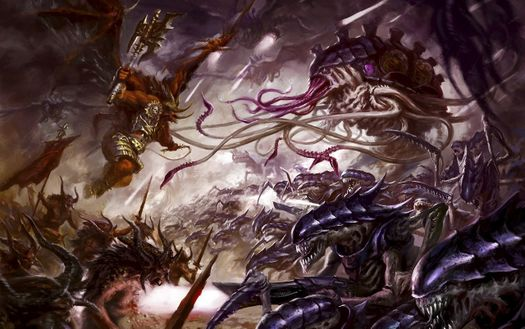

<!-- A0579-B0100 -->

原译文

Tyranids battle Daemons 泰伦与恶魔战斗

**校订译文**

Tyranids battle Daemons 泰伦与恶魔战斗

<!-- /A0579-B0100 -->

<!-- A0579-B0101 -->
## Individual Tyranids 泰伦个体

<!-- /A0579-B0101 -->

<!-- A0579-B0102 -->
**英文原文**

Though the Tyranids are wholly controlled by the Hive Mind and lack any sense of individuality, a number of individual organisms have been repeatedly encountered by the Imperium and others within the Galaxy. These genetic abnormalities have gone on to earn dreadful reputations for themselves.

<!-- /A0579-B0102 -->

<!-- A0579-B0103 -->

原译文

尽管泰伦完全由虫巢思维控制，缺乏任何个性，但银河系内的帝国和其他人一再遇到许多个体生物。这些基因反常者已经为自己赢得了可怕的声誉。

**校订译文**

虽然泰伦完全受虫巢意志控制，缺乏个体意识，帝国与银河其他势力却曾反复遭遇某些特定个体。这些异常的基因造物由此留下了令人胆寒的名声。

<!-- /A0579-B0103 -->

<!-- A0579-B0104 -->
**英文原文**

Notable individual Tyranids include:

<!-- /A0579-B0104 -->

<!-- A0579-B0105 -->

原译文

著名泰伦个体包括

**校订译文**

著名泰伦个体包括

<!-- /A0579-B0105 -->

<!-- A0579-B0106 -->
**英文原文**

The Swarmlord - Legendary Hive Tyrant who is the pinnacle of the Tyranid race.

<!-- /A0579-B0106 -->

<!-- A0579-B0107 -->

原译文

虫群领主 - 传说中的虫巢暴君，是泰伦种族的巅峰。

**校订译文**

虫群领主 - 传说中的虫巢暴君，是泰伦种族的巅峰。

<!-- /A0579-B0107 -->

<!-- A0579-B0108 -->
**英文原文**

Old One Eye - Carnifex

<!-- /A0579-B0108 -->

<!-- A0579-B0109 -->

原译文

老独眼 - 刽子手

**校订译文**

老独眼 - 刽子手

<!-- /A0579-B0109 -->

<!-- A0579-B0110 -->
**英文原文**

The Doom of Malan'tai - uniquely adapted Zoanthrope

<!-- /A0579-B0110 -->

<!-- A0579-B0111 -->

原译文

玛兰'泰的末日 - 唯一适应的灵吸虫

**校订译文**

玛兰泰之殇——具有独特适应性变异的脑虫

**校注：** uniquely adapted是发生独特适应性变异，非唯一适应；专名玛兰泰之殇暂定。

<!-- /A0579-B0111 -->

<!-- A0579-B0112 -->
**英文原文**

Deathleaper - Lictor

<!-- /A0579-B0112 -->

<!-- A0579-B0113 -->

原译文

死亡跳跃者 - 利卡特

**校订译文**

死亡跃袭者——刀斧虫

<!-- /A0579-B0113 -->

<!-- A0579-B0114 -->
**英文原文**

Parasite of Mortrex - Winged organism

<!-- /A0579-B0114 -->

<!-- A0579-B0115 -->

原译文

摩崔克斯的寄生者 - 有翼生物

**校订译文**

摩崔克斯寄生虫——有翼生物

<!-- /A0579-B0115 -->

<!-- A0579-B0116 -->
**英文原文**

The Red Terror - Ravener

<!-- /A0579-B0116 -->

<!-- A0579-B0117 -->

原译文

红色恐怖 - 蛇虫

**校订译文**

红色惧物——蛇虫

**校注：** The Red Terror中文参考GW09第37页“红色惧物”；所持GW10旧版无对应条目，未冒称双语核验。

<!-- /A0579-B0117 -->

<!-- A0579-B0118 -->
## Interstellar Travel 星际航行

<!-- /A0579-B0118 -->

<!-- A0579-B0119 -->
**英文原文**

The Tyranids seem able to achieve Faster-than-light travel through an organism known as a Narvhal, which is able to harness a targeted systems gravity and propel its accompanying Hive Fleet's Bio-Ships to its destination. The arrival of the Tyranids is often met by psychic disturbances dubbed the Shadow in the Warp.

<!-- /A0579-B0119 -->

<!-- A0579-B0120 -->

原译文

泰伦似乎能够通过一种名为角鲸舰的生物体实现超光速旅行，角鲸舰能够利用目标星系的重力，并将其随行的虫巢舰队的生物舰推进到目的地。泰伦的到来经常会遇到被称为“亚空间阴影”的灵能干扰。

**校订译文**

泰伦似乎通过一种名为角鲸舰的生物实现超光速航行。它能利用目标星系的引力，将随行的虫巢生物舰带往目的地。泰伦到来时，通常还伴随着称为“亚空间之影”的灵能扰动。

**校注：** 对照本段英文确认同一实体，与全书核心译名统一；不改变同形异义词或省略称呼。

<!-- /A0579-B0120 -->

<!-- A0579-B0121 图片 -->
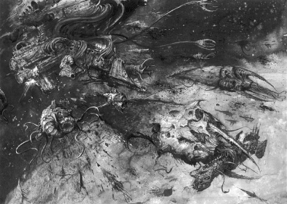

<!-- A0579-B0122 -->

原译文

Tyranid Bio-ships battling the Imperial Navy 泰伦生物舰与帝国海军战斗

**校订译文**

Tyranid Bio-ships battling the Imperial Navy 泰伦生物舰与帝国海军战斗

<!-- /A0579-B0122 -->

<!-- A0579-B0123 -->
**英文原文**

The Tyranid's form of interstellar travel draws upon the gravity of the targeted system's star and used to pull the fleet towards its goal. This often causes geological instability and seismic disruption on the targeted system's worlds.

<!-- /A0579-B0123 -->

<!-- A0579-B0124 -->

原译文

泰伦的星际航行形式利用了目标星系恒星的引力，并用于将舰队拉向目标。这通常会导致目标星系世界的地质不稳定和地震破坏。

**校订译文**

泰伦的星际航行借助目标星系恒星的引力，把舰队拉向目的地。这往往使目标星系的各个世界出现地质失稳与地震灾害。

<!-- /A0579-B0124 -->

<!-- A0579-B0125 -->
## Planetary Consumption 行星吞噬

原题：Planetary Consumption 行星消耗

<!-- /A0579-B0125 -->

<!-- A0579-B0126 -->
**英文原文**

Although the Tyranids will do minor harvesting from uninhabitable worlds, such as gas giants or comet clouds, living worlds are a hive fleet's primary prey. Tyranids will always seek genetic material over baser forms of sustenance. Tyranids are surface feeders that strip a planet's surface and move on. They do not delve deep to extract hidden resources locked deep beneath stone, such as promethium reserves or subsurface water reserves, unless it is easily accessible from the surface. The Tyranids’ favoured mode of attack is ground invasion. Imperial scholars theorise that it is the most economical means of offence and risked the least damage to their food source.

<!-- /A0579-B0126 -->

<!-- A0579-B0127 -->

原译文

尽管泰伦会从不适合居住的世界，如气态巨行星或彗星云，进行少量捕猎，但生命世界是虫巢舰队的主要猎物。泰伦总是寻求遗传物质，而不是更低级的食物。泰伦是地表觅食者，他们剥离行星表面并继续前进。他们不会深入挖掘以提取深藏在石头下的隐藏资源，如钷储量或地下水储量，除非很容易从地表接近。泰伦最喜欢的攻击方式是地面入侵。帝国学者认为，这是最经济的犯罪手段，对食物来源的损害最小。

**校订译文**

泰伦也会从气态巨行星、彗星云等不适宜生命居住的天体采收少量资源，但虫巢舰队的主要猎物始终是有生命的世界；比起较低等的营养来源，它们总是更偏爱遗传物质。泰伦主要在地表取食，剥空表层后便离开，通常不会深挖岩层，提取藏在地下的钷或水，除非这些资源能从地表轻易获得。它们偏好的攻击方式是地面入侵。帝国学者推测，这种进攻最为经济，也最不容易损坏食物来源。

**校注：** offence在作战语境是进攻，原“犯罪手段”误译。

<!-- /A0579-B0127 -->

<!-- A0579-B0128 -->
**英文原文**

In the process of assimilating a planet's biological and inorganic materials, the most important stage is the location of a suitable target. One method by which they accomplish this is the spectral analysis of distant stars to determine their likelihood of supporting life. However, the fastest and most common method is the use of vanguard organisms, millions of which range hundreds of light-years ahead of each Hive Fleet, investigating each star system they encounter for signs of life. Once a suitable world has been detected, these bio-vessels spawn infiltrator-organisms, such as Lictors, Genestealers, or specialised Gaunt strains, and launch them onto the world via Mycetic Spores. Once inserted, these organisms will seek out all life and target those of a highly-organised nature, such as humans, restricting themselves to lone targets so as to avoid revealing their presence. Genestealers in particular will seek to infiltrate communities and create cults, not only to signal the planet is ripe for consumption but to weaken its defenses against the Hive Fleet's arrival.

<!-- /A0579-B0128 -->

<!-- A0579-B0129 -->

原译文

在同化行星的生物和无机物质的过程中，最重要的阶段是找到合适的目标。他们实现这一目标的一种方法是对遥远恒星进行光谱分析，以确定它们支持生命的可能性。然而，最快和最常见的方法是使用先锋生物，其中数百万种生物比每个虫巢舰队领先数百光年，调查它们遇到的每个恒星系是否有生命迹象。一旦发现了一个合适的世界，这些生物战舰就会产生渗透生物，如利卡特、基因窃取者或专门的兵虫菌株，并通过菌丝孢子将它们发射到世界上。一旦被插入，这些生物将寻找所有生命，并瞄准那些高度组织化的生物，如人类，将自己限制在单独的目标上，以避免暴露它们的存在。特别是基因窃取者将寻求渗透社会并创建教派，这不仅是为了表明行星已经成熟，可以消耗，也是为了削弱其对虫巢舰队到来的防御。

**校订译文**

同化一颗行星的生物质与无机物之前，最重要的是找到合适的目标。泰伦可分析遥远恒星的光谱，判断其周边孕育生命的可能性；但最快、最常用的方法，是派出数百万先锋生物，在虫巢舰队前方数百光年的范围内，逐一搜查所遇星系的生命迹象。一旦发现适宜的世界，这些生物舰便产出刀斧虫、基因窃取者或特化兵虫等渗透生物，通过菌丝孢子将其投送到地表。登陆后，它们搜寻生命，尤其针对人类这样组织严密的群体，但只袭击落单目标，以免暴露。基因窃取者更会渗透社群、建立教派，既向虫巢舰队示意该星球已适于吞噬，也提前削弱其防御。

<!-- /A0579-B0129 -->

<!-- A0579-B0130 图片 -->
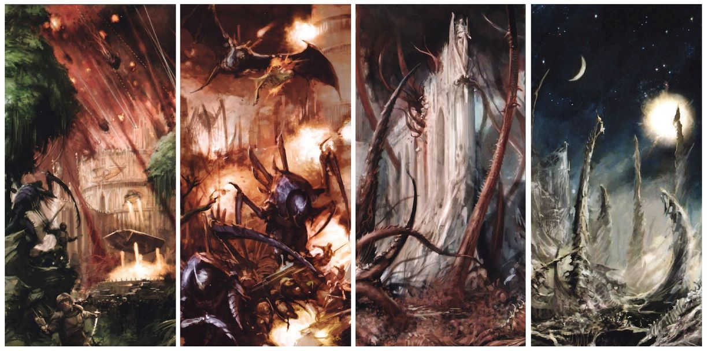

<!-- A0579-B0131 -->

原译文

Tyranids invasion stages: Invasion, Predation, Consumption, and Assimilation. 泰伦的入侵阶段：入侵、掠夺、消耗和同化。

**校订译文**

Tyranids invasion stages: Invasion, Predation, Consumption, and Assimilation. 泰伦入侵阶段：入侵、捕食、吞噬与同化。

<!-- /A0579-B0131 -->

<!-- A0579-B0132 -->
### Invasion & Predation 入侵与捕食

原题：Invasion & Predation 入侵 & 掠夺

<!-- /A0579-B0132 -->

<!-- A0579-B0133 -->
**英文原文**

As the psychic beacon of the infiltrator-organisms flourishes, indicating a rich feeding ground, so does the Hive Fleet home in on it, in the process cutting off all interstellar communications as the Shadow in the Warp blankets the target system as the hive fleet grows nearer. Upon arrival to the planet, the Hive Fleet will disperse within the planet's upper atmosphere and begin launching millions upon millions of Mycetic Spores. Prior to this genestealer cults, if present, typically lead civilian uprisings or attempt assassinations of those in authority to destabilize the world for the oncoming hive fleet. More subtle efforts might also be seismic instability, possibly causing minor shifts in the crust of worlds as the hive fleet pulls itself towards its target using the gravity of a system's star.

<!-- /A0579-B0133 -->

<!-- A0579-B0134 -->

原译文

随着渗透生物的灵能信标蓬勃发展，表明有一个丰富的觅食地，虫巢舰队也在那里安家，在这个过程中，随着虫巢舰队越来越近，亚空间阴影覆盖了目标星系，切断了所有的星际通信。抵达行星后，虫巢舰队将在行星高层大气中分散，并开始发射数百万枚菌丝孢子。在此之前，如果存在基因窃取者教派，通常会领导平民叛乱或试图暗杀当权者，为即将到来的虫巢舰队破坏世界稳定。更不易察觉的努力也可能是地震的不稳定状态，可能会导致世界地壳发生微小变化，因为虫巢舰队利用星系恒星的引力将自己拉向目标。

**校订译文**

渗透生物发出的灵能信标愈发强烈，昭示丰饶的猎场，虫巢舰队便循着信号逼近。随着舰队接近，亚空间之影笼罩目标星系，切断一切星际通信。抵达行星后，舰队散布于高层大气，开始投放数以百万计的菌丝孢子。若当地已有基因窃取者教派，它们通常会事先煽动平民起义，或刺杀当权者，瓦解世界的稳定。另一种不易察觉的影响，是地震与地壳的轻微位移：舰队借恒星引力拉动自身，也使目标世界出现地质失稳。

**校注：** 对照本段英文确认同一实体，与全书核心译名统一；不改变同形异义词或省略称呼。

<!-- /A0579-B0134 -->

<!-- A0579-B0135 图片 -->
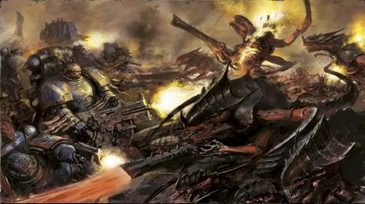

<!-- A0579-B0136 -->

原译文

The Ultramarines battle Tyranids during the Battle For Macragge 马库拉格之战期间极限战士与泰伦战斗

**校订译文**

The Ultramarines battle Tyranids during the Battle For Macragge 马库拉格之战期间极限战士与泰伦战斗

<!-- /A0579-B0136 -->

<!-- A0579-B0137 -->
**英文原文**

Once the hive fleet arrive and the first spores fall on a world, the dreadful process of Tyrannaforming begins. Vanguard bioforms such as Lictors and Warriors immediately begin culling and devouring the planet's top order predators, while xenophagic viruses and bacteria infect plant life, causing them to grow out of control, drawing nutrients from deep in the soil and concentrating them in more easily collected biomass on the surface. Swarms of Tyranids attack the most vulnerable and energy-rich settlements. On all ecological level, from mitragation patterns down to Tyrannoforming, the world's biosphere slowly succumbs to the Hive Mind's will. Areas of high Tyranid activity are thick with spores. Breathing such spores is a risk, even for a Space Marine, as the constantly adapting toxins can challenge any immune system.

<!-- /A0579-B0137 -->

<!-- A0579-B0138 -->

原译文

一旦虫巢舰队到达，第一批孢子落在一个世界上，可怕的泰伦形成过程就开始了。利卡特和战士虫等先锋生物形态立即开始扑杀和吞噬行星上的顶级掠食者，而异型病毒和细菌感染植物，导致它们生长失控，从土壤深处吸收营养，并将其集中在更容易收集的地表生物质中。成群的泰伦攻击最脆弱、能源最丰富的定居点。在所有生态层面上，从缓和模式到泰伦形成，世界的生物圈都在慢慢屈服于虫巢思维的意志。泰伦活性高的区域孢子密集。呼吸这种孢子是一种风险，即使对于星际战士来说也是如此，因为不断适应的毒素会挑战任何免疫系统。

**校订译文**

虫巢舰队一到，第一批孢子落地，可怕的“泰伦化改造”便开始了。刀斧虫、泰伦武士等先遣生物立即猎杀并吞食行星上的顶级捕食者；侵噬异种的病毒、细菌则感染植物，令其疯狂生长，把土壤深处的养分转化为更易采收的地表生物质。虫群袭击防御最脆弱、能源最丰富的聚居地。从迁徙模式到泰伦化改造，整个生态圈的各个层面逐渐受虫巢意志摆布。泰伦活动密集的地区，空气中充斥孢子。即使星际战士吸入它们也会有危险，因为不断适应变化的毒素足以挑战任何免疫系统。

**校注：** mitragation patterns疑为migration patterns误拼，暂按迁徙模式；Tyrannaforming/Tyrannoforming为同一泰伦化改造概念异拼。

<!-- /A0579-B0138 -->

<!-- A0579-B0139 -->
**英文原文**

Many Mycetic Spores will contain Tyranid warriors of various strains, from Rippers to Bio-Titans, and so come in a multitude of sizes. Others will deliver zoomorphic symbiotes and parasites, which target and mutate the planet's flora at a rapid rate. Within hours, verdant forests are replaced with highly-aggressive alien vegetation, including Capillary Towers, which begins the process of transforming the planet's atmosphere into a hothouse, turning the sky a sickly red and raising temperatures at an accelerating rate. Other spores are nothing more than giant cyst-bombs, filled with viral and poisonous organisms which burst over population centres, killing millions of people in the opening hours of the attack. Each one will cover an area many hundreds of metres across with acidic digestive bile, starting the process of future ingestion.

<!-- /A0579-B0139 -->

<!-- A0579-B0140 -->

原译文

许多菌丝孢子将包含从撕裂虫到生物泰坦的各种类型的泰伦战士，因此有多种尺寸。其他的将提供兽形共生体和寄生虫，它们以快速的速度靶向和变异行星上的植物群。几小时内，青翠的森林被极具侵略性的外来植被所取代，包括毛细管塔，它开始将行星的大气层转变为温床，使天空变成病态的红色，并加速升温。其他孢子只不过是巨大的囊肿炸弹，里面充满了病毒和有毒生物，在袭击发生后的几个小时内，它们在人口中心爆炸，造成数百万人死亡。每一个都将覆盖数百米宽的酸性消化胆汁区域，开始未来的吸收过程。

**校订译文**

许多菌丝孢子载有不同类型的泰伦战斗生物，从撕裂虫到生物泰坦都有，因此大小不一。另一些则携带兽形共生体与寄生虫，迅速侵染当地植物，诱发变异。数小时内，青翠森林便被极具侵略性的异形植被取代，其中包括毛细管塔；它们开始将大气变成温室般的环境，天空泛起病态的红色，气温越来越快地攀升。还有一些孢子只是巨大的囊状炸弹，满载病毒与有毒生物，在人口聚居地上空炸开，进攻开始后的数小时内便夺去数百万条性命。每枚孢子都会向宽达数百米的区域泼洒酸性消化液，预先分解未来的食物。

<!-- /A0579-B0140 -->

<!-- A0579-B0141 -->
**英文原文**

After the initial attack, vast swarms of flying Gargoyles will herd the native population into the path of fast-moving hordes of Gaunts to be viciously slaughtered. The defenders, often underestimating the Tyranids' intelligence, make fighting retreats to buy themselves time to regroup from the onslaught, only to be encircled and destroyed as it becomes apparent they were merely herded into prepared killing grounds. These last pockets of resistance will become the targets of larger Tyranid species, from Warriors to Carnifexes and Bio-Titans, which eradicate the defenders with sheer offensive power.

<!-- /A0579-B0141 -->

<!-- A0579-B0142 -->

原译文

在最初的攻击之后，大批飞行的石像鬼将把当地居民赶到快速移动的兵虫的道路上，遭到恶毒的屠杀。防御者往往低估了泰伦的情报，他们进行战斗撤退，为自己争取时间，从猛攻中重新集结，结果却被包围和摧毁，因为很明显他们只是被赶到了准备好的杀戮场。这些最后的抵抗力量将成为更大的泰伦物种的目标，从战士虫到刽子手和生物泰坦，他们用纯粹的进攻力量消灭防御者。

**校订译文**

首轮攻击后，成群的飞行石像鬼将本地居民驱赶到快速推进的兵虫群面前，任其屠戮。守军常低估泰伦的智慧，试图边打边退，为重整争取时间，却发现自己只是被赶进了预设的杀戮场，随即遭到包围歼灭。最后的抵抗据点则交由大型泰伦摧毁：从泰伦武士、刽子手到生物泰坦，以压倒性的攻击力彻底清除守军。

<!-- /A0579-B0142 -->

<!-- A0579-B0143 -->
### Consumption & Assimilation 吞噬与同化

原题：Consumption & Assimilation 消耗 & 同化

<!-- /A0579-B0143 -->

<!-- A0579-B0144 -->
**英文原文**

With resistance ended, consumption of the planet's resources begins. Bacterial agents and vast tracts of feeder organisms such as Rippers, pupated from the carcasses of native life forms, ravage the landscape of every ounce of biological matter. These are accompanied by other gargantuan consumption creatures, such as Eater Beasts. The creatures them descend into Reclamation Pools, where they and their consumed biomass is rendered into a thick, nutrient-rich gruel. This includes all mutated plant-life, which has finished altering the atmosphere into an oxygen-rich environment, and any infested organisms, who march blank-faced into pools' depths to be consumed by the Hive Fleet. As the digestion pools swell, the Hive Fleet's ships cluster in low orbit as vast capillary towers emerge to link with proboscis-like feeding tubes and pump the biomass into them. The final stage of the harvest is the consumption of the world's atmosphere and seas, with vast drone-ship haulers descending to low orbit and sucking up every useful element left. Eventually the Hive Fleet will depart, having left the world a desolate airless rock stripped down to the molecular level, to begin the consumption process on another world. The Tyranids will also consume metal, rocks, and other minerals for microscopic life, but usually can not obtain much biomass from this.

<!-- /A0579-B0144 -->

<!-- A0579-B0145 -->

原译文

随着抵抗的结束，行星资源的消耗开始了。细菌制剂和大片的饲养生物，如撕裂虫，从本土生命形式的尸体上化蛹而成，破坏了每一盎司生物质的地貌。这些动物还伴随着其他巨大的消耗生物，如吞食兽。这些生物会下降到回收池，在那里，它们和它们消耗的生物质被制成一种厚厚的、营养丰富的糊。这包括所有变异的植物，它们已经完成了将大气变成富氧环境的过程，以及任何被感染的生物，它们面无表情地行进到回收池深处，被虫巢舰队消耗。随着消化池的膨胀，虫巢舰队的舰船聚集在低空轨道上，巨大的毛细管塔出现，与像进食吸管一样的管状长管连接，并将生物质泵入其中。收割的最后阶段是消耗世界的大气和海洋，巨大的无人运输机下降到低空轨道，吸收掉剩下的所有有用元素。最终，虫巢舰队将离开，离开这个世界，留下一块被剥离到分子水平的荒凉无空气的岩石，开始在另一个世界上的消耗过程。泰伦也会消耗金属、岩石和其他矿物来维持微观生命，但通常无法从中获得太多的生物质。

**校订译文**

抵抗结束后，行星资源的吞噬随即开始。细菌与大片摄食生物席卷地表，搜尽每一点生物质；其中包括在本地生物尸体中化蛹长成的撕裂虫，以及吞食兽等巨型摄食生物。它们随后进入回收池，与吞下的生物质一同被化为浓稠、富含养分的浆液。此时，变异植物已将大气改造成富氧环境，也一并被吞噬；受侵染的其他生物同样面无表情地走入池底，成为舰队的食粮。消化池不断膨胀，虫巢生物舰聚集于低轨道，巨大的毛细管塔与舰上长鼻般的摄食管相接，把生物质泵入舰内。最后，巨型工役运输舰降至低轨道，抽走海洋与大气，吸尽剩余的有用物质。虫巢舰队随后离去，只留下一块连分子层面都遭剥掠、没有空气的荒凉岩石，转向下一个世界重复这一过程。泰伦也会吞食金属、岩石与其他矿物，以获取其中的微生物，但通常所得生物质很少。

**校注：** for microscopic life指为获取矿物中微小生命而吞食，不是以矿物维持微观生命；drone-ship haulers为生物运输舰，非无人机。

<!-- /A0579-B0145 -->

<!-- A0579-B0146 图片 -->
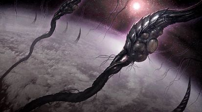

<!-- A0579-B0147 -->

原译文

Bio-ships feeding from capillary towers on a world in the final stages of assimilation 生物舰在同化的最后阶段从毛细塔进食

**校订译文**

Bio-ships feeding from capillary towers on a world in the final stages of assimilation 生物舰在同化末期，通过行星上的毛细管塔摄食

<!-- /A0579-B0147 -->

<!-- A0579-B0148 -->
**英文原文**

Below is a general outline of a typical Tyranid planetary assault (in particular, this data is collected from the Tyranid invasion of Dalki-Prime):

<!-- /A0579-B0148 -->

<!-- A0579-B0149 -->

原译文

以下是典型的泰伦行星攻击的概述（特别是，这些数据是从泰伦入侵达尔基主星时收集的）：

**校订译文**

以下是一场典型泰伦行星入侵的过程概要，具体数据取自达尔基主星遭入侵的记录：

<!-- /A0579-B0149 -->

<!-- A0579-B0150 -->
### Planetary Assimilation 行星同化

<!-- /A0579-B0150 -->

<!-- A0579-B0151 -->
**英文原文**

00,Initial mycetic spores are dropped, generally containing Lictors or Genestealers. Infiltration force led by a synapse creature of some kind; reproduction of Tyranid creatures likely begins immediately.

<!-- /A0579-B0151 -->

<!-- A0579-B0152 -->

原译文

00日，初始菌丝孢子被投下，通常含有利卡特或基因窃取者。由某种突触生物引导的渗透部队；泰伦生物的繁殖可能立即开始。

**校订译文**

第0日：首批菌丝孢子落地，通常携带刀斧虫或基因窃取者。渗透部队由某类突触生物指挥；泰伦很可能立即开始繁殖。

<!-- /A0579-B0152 -->

<!-- A0579-B0153 -->
**英文原文**

09,By day 9, Tyranids will have expanded to around 200 km from the drop point, and will likely present a significant threat to planetary defence and resident Imperial Guard forces.

<!-- /A0579-B0153 -->

<!-- A0579-B0154 -->

原译文

09日，到第9天，泰伦将扩大到距离投放点约200公里处，并可能对行星防御和常驻帝国卫队构成重大威胁。

**校订译文**

第9日：虫群扩散至距投放点约200公里处，可能已严重威胁行星防卫军与驻守的帝国卫队。

<!-- /A0579-B0154 -->

<!-- A0579-B0155 -->
**英文原文**

13,Tyranids will have expanded to 700 km from the drop point; may begin infesting local water sources.

<!-- /A0579-B0155 -->

<!-- A0579-B0156 -->

原译文

13日，泰伦将从降落点扩展到700公里；可能开始侵扰当地水源。

**校订译文**

第13日：扩散范围达到距投放点700公里，可能开始侵染当地水源。

<!-- /A0579-B0156 -->

<!-- A0579-B0157 -->
**英文原文**

37,Tyranids control area within 2000 km radius of the drop point; basolithic infestation to 5000 km radius.

<!-- /A0579-B0157 -->

<!-- A0579-B0158 -->

原译文

37日，泰伦控制降落点半径2000公里以内的地区；半径5000公里范围内有地质侵扰。

**校订译文**

第37日：泰伦控制投放点周围半径2000公里的区域；基岩层侵染范围达到半径5000公里。

**校注：** basolithic为罕见词，暂按基岩层侵染，仍待核原始出版资料。

<!-- /A0579-B0158 -->

<!-- A0579-B0159 -->
**英文原文**

48,Tyranid population growth skyrockets, with population doubling approximately every 2.5 days.

<!-- /A0579-B0159 -->

<!-- A0579-B0160 -->

原译文

48日，泰伦人口激增，人口大约每2.5天翻一番。

**校订译文**

第48日：虫群数量激增，大约每2.5天翻一倍。

<!-- /A0579-B0160 -->

<!-- A0579-B0161 -->
**英文原文**

50,Main Hive Fleet arrives, craft generally numbering around 1.5 billion. Psychic contact with planet is cut off by the shadow of the Hive Mind. Any attempts to escape are quickly stopped by the Hive Fleet.

<!-- /A0579-B0161 -->

<!-- A0579-B0162 -->

原译文

50日，主虫巢舰队抵达，飞行器数量通常约为15亿。虫巢思维的阴影切断了与行星的灵能联系。任何逃跑的企图都会被虫巢舰队迅速阻止。

**校订译文**

第50日：虫巢舰队主力抵达，舰只数量通常约15亿。虫巢意志的阴影切断了行星对外的灵能联系，任何逃离企图都会被迅速截断。

**校注：** 15亿艘为所给英文数值，保留不擅改；此表来自一个案例，不应视为所有舰队固定规模。

<!-- /A0579-B0162 -->

<!-- A0579-B0163 -->
**英文原文**

51,Primary consumption of bio-mass begins (resistance has generally been eliminated by day 51). Brood ships land, releasing Ripper swarms and Eater Beasts, which consume all remaining organic material and depositing them at the reclamation pools. Capillary Towers (and the Brood ships) send the material into orbit.

<!-- /A0579-B0163 -->

<!-- A0579-B0164 -->

原译文

51日，生物质的初级消耗开始（抵抗通常在第51天被消除）。幼虫舰登陆，释放撕裂虫群和吞食兽，它们消耗所有剩余的有机物质并将其沉积在改造池中。毛细管塔（和幼虫舰）将材料送入轨道。

**校订译文**

第51日：大规模吞噬生物质开始，抵抗通常至此已被消灭。育群舰登陆，放出撕裂虫群和吞食兽，吃尽残存有机物，并送入回收池。毛细管塔与育群舰再将这些物质运至轨道。

<!-- /A0579-B0164 -->

<!-- A0579-B0165 -->
**英文原文**

80,The hive ships descend into the upper atmosphere and begin collecting it. Reduction in atmospheric pressure causes oceans to boil away, which are also collected. Lack of oceans causes plate tectonic shifts, dramatically increasing volcanic activity. Upon completion, the Hive Fleet move out of the system in search of fresh prey.

<!-- /A0579-B0165 -->

<!-- A0579-B0166 -->

原译文

80日，虫巢舰下降到高层大气中并开始收集。大气压力的降低导致海洋沸腾，海洋也被收集起来。海洋的缺乏会导致板块构造变化，从而显著增加火山活动。完成后，虫巢舰队将离开星系寻找新的猎物。

**校订译文**

第80日：虫巢舰降至高层大气，开始将其采收。气压下降使海洋沸腾蒸发，蒸汽也被收走。海洋消失引发板块运动，火山活动急剧增强。采收完成后，舰队离开星系，寻找新猎物。

<!-- /A0579-B0166 -->

<!-- A0579-B0167 -->
**英文原文**

100,The Imperial Navy arrives in response to the distress call to find the world lifeless.

<!-- /A0579-B0167 -->

<!-- A0579-B0168 -->

原译文

100日，帝国海军接到求救信号，发现世界上已经没有生命。

**校订译文**

第100日：帝国海军响应求救信号赶来，发现整个世界已毫无生机。

<!-- /A0579-B0168 -->

<!-- A0579-B0169 -->
**英文原文**

According to Belisarius Cawl, the Tyranid consumption of a world is only surface-deep, water and microbes deep below the surface tend to be left untouched. Thus with the right terraforming technology and time, it is possible for worlds consumed by the Tyranids to return to life. Tyranids will however consume these resources if readily available. The wells of promethium rigs provide easy access to promethium reserves deep below the bedrock of a world.

<!-- /A0579-B0169 -->

<!-- A0579-B0170 -->

原译文

根据贝利撒留·考尔的说法，泰伦对世界的消耗只是表面-深处，水和表面下深处的微生物往往不会受到影响。因此，有了正确的地球化技术和时间，被泰伦消耗的世界就有可能恢复生机。然而，如果这些资源便捷可得，泰伦将消耗这些资源。钷钻井平台的井可以很容易地进入世界基岩深处的铁储量。

**校订译文**

据贝利萨留斯·考尔所述，泰伦对世界的吞噬主要止于地表，深藏地下的水与微生物往往幸存。因此，只要有适当的环境改造技术和足够时间，被吞噬的世界仍可能重获生机。不过，若这些深层资源易于取得，泰伦也会将其吃尽；例如，钷开采设施的井道就能让它们轻易触及基岩深处的钷储藏。

**校注：** surface-deep意为止于地表，原表面-深处机械拆词；末句promethium仍为钷，非铁。

<!-- /A0579-B0170 -->

<!-- A0579-B0171 -->
### Rear Guard 留守部队

原题：Rear Guard 后卫

<!-- /A0579-B0171 -->

<!-- A0579-B0172 -->
**英文原文**

After assimilating a world, the hive fleet leaves behind rear guard organisms, typically made up of genestealers. These creatures are scattered across a consumed world, laid up in a hunting net, buried in wait under stone and rubble. Such genestealers have a breathing symbiote creature attached that allows them to recycle air on the now barren worlds the hive fleets have stripped of atmosphere. Genestealers are believed to be able to already be able to survive weeks without taking a breath when active, and for centuries when in hibernation. They lay in wait before for attacking any non-Tyranid organisms that come near they're hibernation location. They can hibernate for an exceedingly long, if unspecified, amount of time.

<!-- /A0579-B0172 -->

<!-- A0579-B0173 -->

原译文

在同化了一个世界后，虫巢舰队留下了后卫生物，通常由基因窃取者组成。这些生物散布在一个被消耗的世界里，闲置在狩猎网里，埋在石头和瓦砾下等待。这种基因窃取者身上附着了一种呼吸共生生物，使他们能够在虫巢舰队剥夺了大气层的现在贫瘠的世界上回收空气。据信，基因窃取者在活动时已经能够存活数周而不呼吸，在休眠时可以存活数个世纪。它们会埋伏起来，等待攻击任何靠近休眠地点的非泰伦生物。它们可以休眠非常长的时间，如果未指定时间的话。

**校订译文**

同化一个世界后，虫巢舰队会留下生物守卫，通常是基因窃取者。它们散布在被吞噬后的世界，埋伏于岩石、瓦砾之下，组成狩猎网。这些个体附有呼吸共生生物，能够循环利用空气，在已被剥去大气的荒芜星球上存活。据说，基因窃取者即使处于活动状态，也能数周不呼吸；休眠时更可维持数百年。它们伏伺任何接近休眠地点的非泰伦生物，随时准备袭击。其休眠可持续极久，具体上限不详。

<!-- /A0579-B0173 -->

<!-- A0579-B0174 -->
**英文原文**

This rear guard largely dissuades any large-scale recolonization efforts on a world previously scoured by Tyranids. If sufficient biomass returns to a world the rear guard's purpose is to send out a psychic beacon or summoning call for a hive fleet to return to the world and feed again. However small expeditions parties typically aren't enough to trigger this.

<!-- /A0579-B0174 -->

<!-- A0579-B0175 -->

原译文

这个后卫在很大程度上阻止了对一个以前被泰伦洗劫过的世界进行任何大规模的再殖民化努力。如果足够的生物质返回到一个世界，后卫的目的是发出一个灵能信标或召唤一个虫巢舰队返回世界并再次进食。然而，小型探索队通常不足以引发这种情况。

**校订译文**

这些留守生物有效阻止了对泰伦肆虐过的世界进行大规模再殖民。若行星重新积累起足够生物质，它们便发出灵能信标，召唤虫巢舰队返回、再度摄食；小型探险队通常还不足以触发召唤。

<!-- /A0579-B0175 -->

<!-- A0579-B0176 -->
### Tyranids and Chaos 泰伦与混沌

<!-- /A0579-B0176 -->

<!-- A0579-B0177 -->
**英文原文**

The raw matter of Chaos offers no nourishment to Tyranids, and this is why the Hive Fleets normally avoid areas plagued by Warp Storms and Daemonic activity. This has become more difficult, as the impure essence of the Warp increasingly pours from the Great Rift and across the galaxy. This has caused vital resources to be denied to the Hive Fleets and Kronos appears to be the Hive Mind's solution to this problem. The Tyranids have demonstrated the ability to resist Warp Rifts by spawning large amounts of Psyker organisms.

<!-- /A0579-B0177 -->

<!-- A0579-B0178 -->

原译文

混沌的原始物质无法为泰伦提供营养，这就是为什么虫巢舰队通常会避开受亚空间风暴和恶魔活动困扰的地区。这变得更加困难，因为亚空间的不纯本质越来越多地从大裂隙和整个宇宙中倾泻而出。这导致虫巢舰队无法获得重要资源，而克罗诺斯似乎是虫巢思维解决这个问题的办法，泰伦已经证明了通过繁殖大量灵能者生物来抵抗亚空间裂隙的能力。

**校订译文**

混沌本身的原始物质无法为泰伦提供营养，因此虫巢舰队通常避开亚空间风暴和恶魔活动猖獗的区域。然而，大裂隙不断向银河倾泻污秽的亚空间本质，令回避越来越难，也使舰队无法取得重要资源。克罗诺斯虫巢舰队似乎就是虫巢意志为解决这一问题而生的应对。泰伦还展示过大量培育灵能生物、抵抗亚空间裂隙的能力。

<!-- /A0579-B0178 -->

<!-- A0579-B0179 -->
## Development History 创作沿革

原题：Development History 发展历史

<!-- /A0579-B0179 -->

<!-- A0579-B0180 -->
**英文原文**

Tyranids were one of the original factions introduced in 1987's Warhammer 40,000: Rogue Trader. At the time of their introduction they were the first faction without an exact Fantasy equivalent (i.e. Eldar = Elves, Squats = Dwarfs, etc.). While depicted as a strange extragalactic race that utilised grown bio-technology, they had a number of differences from modern Tyranids. They were less instinctual predators and utilised some mechanical technology, and were depicted as the ruling core of the Hive Fleets as opposed to its sole species. Tyranids also stripped planets of minerals, fuel, and technological components in addition to biomass.

<!-- /A0579-B0180 -->

<!-- A0579-B0181 -->

原译文

泰伦是1987年《战锤40000：行商浪人》中引入的原始派系之一。在他们被引入时，他们是第一个没有确切幻想等价的派系（即灵族=精灵，太空矮人=矮人等）。虽然他们被描绘成一个利用成熟生物技术的奇怪的河外种族，但他们与现代泰伦有许多不同之处。它们不是本能的掠食者，使用了一些机械技术，被描述为虫巢舰队的统治核心，而不是唯一的物种。除了生物质，泰伦还剥夺了行星上的矿物、燃料和技术部件。

**校订译文**

泰伦是1987年《战锤40,000：行商浪人》最初登场的阵营之一，也是当时第一个在《战锤幻想》中找不到直接对应的阵营；此前，灵族对应精灵，太空矮人对应矮人等。早期设定把它们描绘成来自河外、运用培育式生物技术的奇异种族，但与现代形象差别很大：它们没那么依赖捕食本能，还会使用一些机械技术，是虫巢舰队的统治核心，而非其中唯一的物种。除生物质外，它们也会从行星搜掠矿物、燃料与技术零件。

<!-- /A0579-B0181 -->

<!-- A0579-B0182 -->
**英文原文**

During the 1st Edition, the Tyranids engineered many slave races to fulfil their goals, such as the Zoats. Tyranids were also depicted as even taking prisoners, which included an early form of Marneus Calgar. During this era, Genestealers and Genestealer Cults were not explicitly stated to be a branch of the Tyranids. However, 1990's Advanced Space Crusade retconned Genestealers as being a vanguard to the Tyranid swarm.

<!-- /A0579-B0182 -->

<!-- A0579-B0183 -->

原译文

在第一版中，泰伦设计了许多奴隶种族来实现他们的目标，比如龙蜥。泰伦也被描绘为甚至携带俘虏，其中包括早期版本的马涅乌斯·卡尔加。在这个时代，基因窃取者和基因窃取者教派并没有明确表示为是泰伦的一个分支。然而，20世纪90年代的高空远征将基因窃取者重新定位为泰伦虫群的先锋。

**校订译文**

第一版中，泰伦改造出龙蜥等多个奴隶种族来实现目标，也会抓捕俘虏，其中甚至包括早期设定里的马涅乌斯·卡尔加。当时，基因窃取者与其教派尚未被明确归为泰伦分支。1990年的《高级太空远征》（Advanced Space Crusade）追溯修改了设定，将基因窃取者确立为虫群先锋。

**校注：** 1990's在此为1990年的作品，不是20世纪90年代；书名暂译，保留英文便于核验。

<!-- /A0579-B0183 -->

<!-- A0579-B0184 -->
**英文原文**

The 2nd Edition heavily revamped Tyranid lore into what it is today. 1995's Codex: Tyranids (2nd Edition) gave them a more insectoid and bestial appearance, perhaps inspired by the Alien film series. It also introduced the three primary Hive Fleets of Behemoth, Kraken, and Leviathan as well as the all-encompassing direction of the Hive Mind. The 3rd Edition Codex in 2001 cemented modern Tyranid aesthetic and model range.

<!-- /A0579-B0184 -->

<!-- A0579-B0185 -->

原译文

第二版对泰伦传说进行了重大改造，使其成为今天的样子。1995年的《圣典:泰伦虫族》（第二版）赋予了它们更像昆虫和野兽的外观，这可能是受到《异形》电影系列的启发。它还介绍了贝希摩斯、克拉肯和利维坦三个主要的虫巢舰队，以及虫巢思维的总括的方向。2001年的第三版圣典巩固了现代泰伦审美和模型范围。

**校订译文**

第二版大幅重写泰伦背景，奠定了今天的形象。1995年的《圣典：泰伦虫族》第二版，使其外形更像昆虫与野兽，可能受到《异形》电影系列启发；同时引入贝希摩斯、克拉肯、利维坦三大虫巢舰队，以及统御整个种族的虫巢意志。2001年的第三版圣典进一步确立了现代泰伦的视觉风格与模型阵容。

<!-- /A0579-B0185 -->

<!-- A0579-B0186 -->
**英文原文**

In some, very early sources, the Tyranids' name is spelled as Tyrannid.

<!-- /A0579-B0186 -->

<!-- A0579-B0187 -->

原译文

在一些非常早期的资料中，泰伦的名字拼写为泰兰尼德。

**校订译文**

在极早期的部分资料中，Tyranids 的拼写是 Tyrannid。

**校注：** 本段说明英文拼写变化，须保留Tyrannid，音译为泰兰尼德会丢失论点。

<!-- /A0579-B0187 -->

本篇核心术语与暂定项

以下列出本篇出现的英文原形及核心术语表用词。同形词可能指不同对象，具体词义以本篇正文和校注为准；单复数、别名和仅见于图注的名称可能尚未列入。完整候选见[术语表](../../术语表/双语术语候选.csv)。

| 英文 | 采用中文 | 状态 |
| --- | --- | --- |
| Blood Angels | 圣血天使 | 官方已核对 |
| Imperial Guard | 帝国卫队 | 暂定·语境区分 |
| World Eaters | 吞世者 | 官方已核对 |
| Eldar | 灵族 | 暂定·语境区分 |
| Dark Eldar | 黑暗灵族 | 暂定·旧称对应 |
| Tyranids | 泰伦虫族 | 官方已核对 |
| Genestealer Cults | 基因窃取者教派 | 官方已核对 |
| Orks | 欧克蛮人 | 官方已核对 |
| Psyker | 灵能者 | 官方已核对 |
| Horus Heresy | 荷鲁斯之乱 | 官方已核对 |
| Astronomican | 星炬 | 暂定 |
| Warp | 亚空间 | 官方已核对 |
| Great Rift | 大裂隙 | 官方已核对 |
| Inquisition | 审判庭 | 暂定 |
| Imperium | 帝国 | 暂定·简称 |
| Imperial Navy | 帝国海军 | 暂定 |
| Faster-Than-Light | 超光速航行 | 暂定 |
| Hive Tyrant | 虫巢暴君 | 官方已核对 |
| Hive Mind | 虫巢意志 | 官方已核对 |
| Zoanthrope | 脑虫 | 官方已核对 |
| Indomitus | 不屈学派 | 暂定·学派语境 |
| Shadow in the Warp | 亚空间之影 | 暂定 |
| Narvhal | 角鲸舰 | 暂定 |
| Rogue Trader | 行商浪人 | 暂定 |
| Horus | 荷鲁斯 | 暂定·官方待核 |
| Indomitus Crusade | 不屈远征 | 暂定·官方待核 |
| Ordo Xenos | 异形审判庭 | 用户指定 |
| Segmentum Solar | 太阳星域 | 暂定·官方待核 |
| Segmentum Pacificus | 太平星域 | 暂定·官方待核 |
| Segmentum | 星域 | 暂定·官方待核 |
| Eastern Fringe | 东部边缘 | 暂定·官方待核 |
| Squats | 矮人 | 暂定·官方待核 |
| Verdant | 青翠世界 | 暂定·官方待核 |
| Ichar IV | 伊卡尔四号 | 暂定·官方待核 |
| Catachan | 卡塔昌 | 暂定·官方待核 |
| Baal | 巴尔 | 暂定·官方待核 |
| Obscurus | 朦胧星 | 暂定·官方待核 |
| Macragge | 马库拉格 | 暂定·官方待核 |
| Sotha | 索萨 | 暂定·官方待核 |
| Blank | 空白者 | 暂定·官方待核 |
| Pharos | 灯塔 | 暂定·官方待核 |
| Carnifex | 刽子手 | 暂定·官方待核 |
| Ancient | 旗手 | 官方已核对 |
| Belisarius Cawl | 贝利萨留斯·考尔 | 官方已核对 |
| Space Marine | 星际战士 | 暂定·官方待核 |
| Vanguard | 先锋 | 暂定·官方待核 |
| Infiltrator | 渗透者 | 暂定·官方待核 |
| Marneus Calgar | 马涅乌斯·卡尔加 | 暂定·官方待核 |
| Predators | 掠食者 | 暂定·官方待核 |
| Xenos | 异形 | 暂定·官方待核 |
| Iyanden | 伊扬登 | 暂定·官方待核 |
| The Swarmlord | 虫群领主 | 官方已核对 |
| The Great Devourer | 大吞噬者 | 暂定·官方待核 |
| Tyran | 泰兰 | 暂定·官方待核 |
| Nusquam Fundumentibus | 虚无之基 | 暂定·官方待核 |
| The Blackness | 黑暗期 | 暂定·官方待核 |
| Strategic Collective | 战略集团 | 暂定·官方待核 |
| Biomorph | 生物形态 | 暂定·官方待核 |
| Scything Talons | 镰爪 | 暂定·官方待核 |
| Drool Cannon | 口涎炮 | 暂定·官方待核 |
| Mycetic Spores | 菌丝孢子 | 暂定·官方待核 |
| Tyrannaforming | 泰伦化改造 | 暂定·官方待核 |
| Tyrannoforming | 泰伦化改造 | 暂定·官方待核 |
| Gaunt | 兵虫 | 暂定·官方待核 |
| Reclamation Pools | 回收池 | 暂定·官方待核 |
| Capillary Towers | 毛细管塔 | 暂定·官方待核 |
| Eater Beasts | 吞食兽 | 暂定·官方待核 |
| Brood ships | 育群舰 | 暂定·官方待核 |
| Dalki-Prime | 达尔基主星 | 暂定·官方待核 |
| Advanced Space Crusade | 高级太空远征 | 暂定·官方待核 |
| Carnifexes | 刽子手 | 官方已核对 |
| Deathleaper | 死亡跃袭者 | 官方已核对 |
| Exocrine | 离子炮兽 | 官方已核对 |
| Gargoyles | 石像鬼 | 官方已核对 |
| Hive Crone | 虫巢天妪 | 官方已核对 |
| Hive Guard | 虫巢护卫 | 官方已核对 |
| Hormagaunts | 刀虫 | 官方已核对 |
| Lictor | 刀斧虫（泰伦单位）／侍从官（禁军职衔） | 语境定译·泰伦单位官译已核 |
| Neurogaunts | 神经虫 | 官方已核对 |
| Old One Eye | 老独眼 | 官方已核对 |
| Parasite of Mortrex | 摩崔克斯寄生虫 | 官方已核对 |
| Psychophage | 噬灵虫 | 官方已核对 |
| Ripper Swarms | 撕裂虫群 | 官方已核对 |
| Termagants | 枪虫 | 官方已核对 |
| Trygon | 掘蟒 | 官方已核对 |
| Venomthropes | 毒烟虫 | 官方已核对 |
| Zoanthropes | 脑虫 | 官方已核对 |
| The Red Terror | 红色惧物 | 官方中文参考·英文对名待核 |
| Tyranid Warriors | 泰伦武士 | 官方词根参考·通称待核 |
| The Weapon | 武器 | 暂定·官方待核 |
| Bear | 熊 | 暂定·官方待核 |
| Gun | 甘 | 暂定·官方待核 |
| Mercy | 仁慈 | 暂定·官方待核 |
| The Dark | 《黑暗》 | 暂定·官方待核 |
| The Blood | 鲜血 | 暂定·官方待核 |
| System | 星系（恒星系统） | 暂定·官方待核 |
| Milky Way Galaxy | 银河系 | 暂定·官方待核 |
| claw | 利爪分队 | 暂定·官方待核 |
| Promethium | 钷素 | 暂定·官方待核 |
| Warhammer 40,000: Rogue Trader | 战锤40000：行商浪人 | 暂定·官方待核 |
| Catachan Devil | 卡塔昌恶魔 | 暂定·官方待核 |
| Kraken | 克拉肯 | 暂定·官方待核 |

