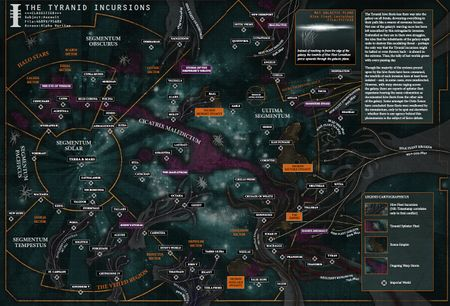
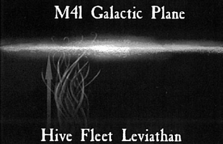
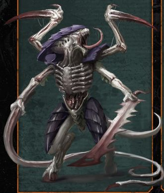
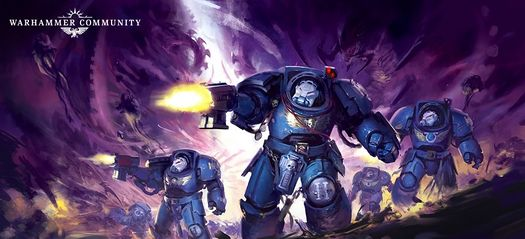
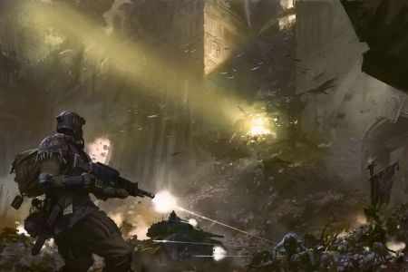
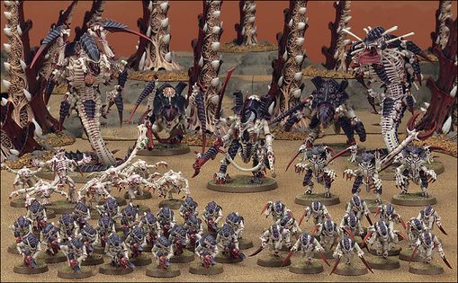
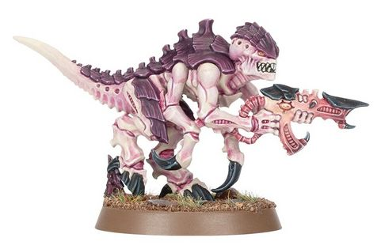

# 0580 利维坦 Leviathan

精校状态：中文行文已逐段精校，部分术语仍为暂定

分类：概念 / 异型 Xenos / 泰伦虫族 Tyranids

原文来源：https://www.bilibili.com/opus/1143085582849671174

原作者：帝国神选罐头

原文时间：2025年12月06日 09:15

[返回分类目录](目录.md) · [全书目录](../../目录.md)

<!-- A0580-B0001 -->
**英文原文**

Hive Fleet Leviathan is the largest and greatest Tyranid Hive Fleet to invade the Galaxy. It attacked in 997.M41 from the galactic south. Unlike the majority of previous Hive Fleets that attacked from the Eastern Fringe, Leviathan instead skirted under the galactic rim of the galaxy and then pushed upwards through the galactic plane, spreading its forces across a broad front that covered the Ultima Segmentum, Segmentum Tempestus and even into the Segmentum Solar. Leviathan's strategy was to form its forces into two giant tendrils hundreds of light years apart in such a way that it stretched the Shadow in the Warp over the vast distance between the two tendrils, stopping all psychic contact between the trapped worlds and the Imperium and also blocking Imperial reinforcements from navigating the Warp towards the beleaguered worlds.

<!-- /A0580-B0001 -->

<!-- A0580-B0002 -->

原译文

利维坦虫巢舰队是入侵银河系的最大、最多的泰伦虫巢舰队。它于997.M41从银河系南部袭击。与之前从东部边缘攻击的大多数虫巢舰队不同，利维坦而是绕过银河系的银河环，然后向上推过银河系平面，将其部队分散到覆盖极限星域、暴风星域甚至太阳星语的广阔战线上。利维坦的策略是将其部队组成两个相距数百光年的巨大卷须，将亚空间阴影延伸到两个卷须之间的巨大距离，阻止被困世界与帝国之间的所有灵能接触，并阻止帝国增援部队通过亚空间驶向被围困的世界。

**校订译文**

利维坦是侵入银河的泰伦虫巢舰队中规模最大、最强盛的一支。997.M41，它从银河南方发动进攻。此前，大多数舰队从东部边陲来袭；利维坦却绕至银河边缘下方，再向上穿过银河盘面，将兵力铺展在覆盖极限、暴风，乃至太阳星域的宽广战线上。它将主力分为两条相距数百光年的巨大支脉，使亚空间之影横跨二者之间的浩瀚区域，切断被夹在其中的世界与帝国的灵能联系，也令增援无法通过亚空间航行抵达。

**校注：** galactic rim指银河边缘，非银河环；修复太阳星语错字。 对照本段英文确认同一实体，与全书核心译名统一；不改变同形异义词或省略称呼。

<!-- /A0580-B0002 -->

<!-- A0580-B0003 图片 -->

<!-- A0580-B0004 -->

原译文

Leviathan's path into the galaxy from the galactic south. Other Hive Fleets are also shown 利维坦从银河系南部进入银河系的路径。还显示了其他虫巢舰队

**校订译文**

Leviathan's path into the galaxy from the galactic south. Other Hive Fleets are also shown 利维坦从银河系南部进入银河系的路径。还显示了其他虫巢舰队

<!-- /A0580-B0004 -->

<!-- A0580-B0005 -->
**英文原文**

One of Leviathan's main tendrils, which was on a projected course directly to Terra, was eventually stopped at Tarsis Ultra. However, Leviathan as a whole remained undefeated and continued to assault the galaxy. Leviathan consumed countless worlds. In response, the Imperium is reinforcing entire Systems, raising thousands of armies and dispatching dozens of Space Marine Chapters to troubled areas; meanwhile, several Craftworlds of Eldar used ancient destructive weaponry to reduce planets to Dead Worlds, and the Tau developed new technologies and weaponry to combat the Tyranids.

<!-- /A0580-B0005 -->

<!-- A0580-B0006 -->

原译文

利维坦的一根主要卷须，正沿着一条直接通往泰拉的预定航线，最终在塔西斯·极限被拦截。然而，利维坦作为一个整体保持不败，并继续攻击银河系。利维坦吞噬了无数世界。作为回应，帝国正在加强整个星系，组建数千支军队，并向动荡地区派遣数十个星际战士战团；与此同时，灵族的几个方舟世界使用古老的破坏性武器将行星还原到死亡世界，而钛则开发了新的技术和武器来对抗泰伦。

**校订译文**

其中一条预计将直扑泰拉的主支脉，最终在塔西斯·极限被挡住。但利维坦整体并未败亡，仍持续进攻、吞噬无数世界。帝国为此强化整座星系的防御，组建数千支军队，派出数十个星际战士战团驰援；部分灵族方舟世界则动用古老的毁灭兵器，将行星化为死寂世界，而钛族也研发新技术、新武器对抗泰伦。

<!-- /A0580-B0006 -->

<!-- A0580-B0007 -->
**英文原文**

Thanks to the formation of the Great Rift, much of Leviathan was cutoff as it made its main assault on Baal, homeworld of the Blood Angels. Most of Leviathan was destroyed during the period known as the Blackness against the defenders of Baal, the Indomitus Crusade, and newly materialized Daemonic armies.

<!-- /A0580-B0007 -->

<!-- A0580-B0008 -->

原译文

由于大裂隙的形成，利维坦的大部分被切断，它主要攻击了圣血天使的家园世界巴尔。利维坦的大部分在被称为黑暗的时期被摧毁，以对抗巴尔的守军、不屈远征和新出现的恶魔军队。

**校订译文**

利维坦主攻圣血天使母星巴尔时，大裂隙形成，切断了其大部分兵力之间的联系。在被称为“黑暗期”的阶段，其主力在与巴尔守军、不屈远征军及新近现身的恶魔大军作战时覆灭。

<!-- /A0580-B0008 -->

<!-- A0580-B0009 -->
**英文原文**

In M42 Leviathan shocked the Imperium by launching a massive new offensive consisting of several new tendrils into Segmentum Pacificus, threatening Segmentum Solar itself.

<!-- /A0580-B0009 -->

<!-- A0580-B0010 -->

原译文

在M42，利维坦向太平星域发动了一场大规模的新攻势，包括几条新的卷须，威胁到太阳星域本身，震惊了帝国。

**校订译文**

第42千年，利维坦以数条新的巨大支脉，对太平星域发动猛烈攻势，直接威胁太阳星域，震动了整个帝国。

<!-- /A0580-B0010 -->

<!-- A0580-B0011 -->
## History 历史

<!-- /A0580-B0011 -->

<!-- A0580-B0012 -->
**英文原文**

In late 997.M41 the Imperium first lost contact with several systems in the Segmentum Tempestus. Inquisitor Kryptman implemented a great astrotelepathic augury, which became known as the Kryptman Census, and eventually made contact with every documented planet on the southern fringe of the Imperium. The worlds that ceased to respond began to form a pattern, and Kryptman identified it as the approach of a hive fleet of terrifying size.

<!-- /A0580-B0012 -->

<!-- A0580-B0013 -->

原译文

997.M41末，帝国首次与暴风星域的几个星系失去联系。审判官克里普特曼实施了一项伟大的星语占卜，即克里普特曼统计，并最终与帝国南部边缘的每一颗有记录的行星取得了联系。停止反应的世界开始形成一个图案，克里普特曼将其确定为规模可怕的虫巢舰队的接近。

**校订译文**

997.M41末，帝国首先与暴风星域的几个星系失去联系。审判官克瑞普特曼展开大规模星语探测，后来被称为“克瑞普特曼统计”，最终将帝国南部边陲每颗在册行星都纳入联络排查。停止回应的世界逐渐显出某种分布规律，他据此判断：一支规模骇人的虫巢舰队正在逼近。

<!-- /A0580-B0013 -->

<!-- A0580-B0014 图片 -->

<!-- A0580-B0015 -->

原译文

Hive Fleet Leviathan attacked below the Galactic Plane, causing shock throughout the Imperium 虫巢舰队利维坦袭击了银河系平面以下，在整个帝国造成了震惊

**校订译文**

Hive Fleet Leviathan attacked below the Galactic Plane, causing shock throughout the Imperium 利维坦虫巢舰队从银河盘面下方来袭，震动整个帝国

<!-- /A0580-B0015 -->

<!-- A0580-B0016 -->
**英文原文**

Leviathan's principle attack formed two tendrils hundreds of light years apart. The Imperium lost contact with the worlds trapped between these two "jaws", and if these jaws closed they would devour all trapped inside.

<!-- /A0580-B0016 -->

<!-- A0580-B0017 -->

原译文

利维坦的主要攻击形成了两条相距数百光年的卷须。帝国与被困在这两个“下颚”之间的世界失去了联系，如果这两个下颚闭合，它们将吞噬所有被困在里面的人。

**校订译文**

利维坦的主攻分为两条相距数百光年的支脉。帝国与夹在这两片“巨颚”之间的世界失去联系；一旦巨颚合拢，其中一切都将被吞噬。

<!-- /A0580-B0017 -->

<!-- A0580-B0018 -->
### Tarsis Ultra 塔西斯·极限

<!-- /A0580-B0018 -->

<!-- A0580-B0019 -->
**英文原文**

The planet of Tarsis Ultra stood directly in the path of one of Leviathan's main tendrils, the tendril on a course towards Terra. Tarsis Ultra was defended by the Ultramarines led by Captain Uriel Ventris, along with the aid the Mortifactors led by Chaplain Astador, and supported by the 10th Logres led by Colonel Octavius Rebalaq, the 933rd Death Korps of Krieg led by Colonel Trymon Stagler, and PDF Regiments headed by Major Satria. Inquisitor Kryptman was also present to impart his extensive knowledge of the Tyranid threat. When the Tyranids arrived in the system, in 999.M41 or in 509997.M41 depending on the source, and consumed the planet Barbarus Prime, the Imperials launched an attack in space. Despite an initial victory in destroying a Hiveship, Kryptman wished to invoke Exterminatus upon the world Chordelis, as it was the next planet in the path of the Tyranids. Ventris was vehemently against this and supported an alternative solution to slow down the Tyranids by exploding a hydrogen-plasma refinery in space thereby destroying another Hiveship. However, Kryptman lied to Ventris and with the assistance of the Mortifactors invoked Exterminatus in spite of the Ultramarines' plan succeeding. The Imperials attempted the same space refinery trick again to destroy yet another Hiveship, but the Tyranids adapted to this ploy and the plan backfired on the Imperials, crippling their fleet and forcing the survivors to flee; Tarsis Ultra was left unprotected from space, allowing the Tyranids to launch their final planetary invasion.

<!-- /A0580-B0019 -->

<!-- A0580-B0020 -->

原译文

塔西斯·极限行星直接拦在利维坦的一根主要卷须的路径上，这根卷须正朝向泰拉。塔西斯·极限由乌瑞尔·文崔斯连长领导的极限战士以及阿斯塔多牧师领导的苦行者的援助进行防御，并得到屋大维·拉伯拉克上校领导的第10洛格斯团、特里蒙·斯塔格勒上校领导的第933克里格死亡军团和萨特里亚少校领导的行星防御部队兵团的支援。审判官克里普特曼也在场，传授了他对泰伦威胁的广泛知识。当泰伦于999.M41或50997.M41（取决于来源）抵达该星系，并吞噬了巴巴鲁斯一号时，帝国在太空发动了攻击。尽管在摧毁一艘虫巢舰方面取得了初步胜利，克里普特曼仍希望在科德里斯世界上召唤灭绝令，因为这是泰伦路径上的下一个行星。文崔斯强烈反对这一点，并支持一种替代方案，通过在太空中爆炸一个氢等离子体精炼厂来减缓泰伦的速度，从而摧毁另一艘虫巢舰。然而，克里普特曼对文崔斯撒了谎，并在苦行者的协助下调用了灭绝令，尽管极限战士的计划取得了成功。帝国再次试图用同样的太空精炼厂伎俩摧毁另一艘虫巢舰，但泰伦适应了这一策略，该计划对帝国适得其反，使他们的舰队瘫痪，迫使幸存者逃离；塔西斯·极限在太空中没有受到保护，这使得泰伦得以发动最后一次行星入侵。

**校订译文**

塔西斯·极限恰在利维坦一条直指泰拉的主支脉前方。乌瑞尔·文崔斯连长率极限战士守卫该星，阿斯塔多教士带领苦行者协防；屋大维·拉伯拉克上校的洛格斯第10团、特里蒙·斯塔格勒上校的克里格死亡军团第933团，以及萨特里亚少校指挥的行星防卫军各团，也提供支援。克瑞普特曼亲临当地，分享对泰伦的丰富了解。虫群于999.M41或509997.M41抵达星系——不同来源纪年不一——吞噬巴巴鲁斯一号后，帝国展开太空反击。虽然先击毁一艘虫巢舰，克瑞普特曼仍想对舰队前路上的科德里斯执行灭绝令。文崔斯坚决反对，转而支持引爆太空中的氢等离子精炼设施，以摧毁另一艘虫巢舰、拖慢攻势。尽管这项计划成功，克瑞普特曼仍欺骗文崔斯，在苦行者协助下执行了灭绝令。帝国试图再次用精炼设施设伏，却被已经适应此计的泰伦反制：舰队遭到重创，残部被迫逃离。塔西斯·极限失去太空掩护，虫群随即发动最后的地面入侵。

**校注：** 恢复英文509997.M41，原中文50997.M41漏一位；与999.M41并列差异沿原文，不擅改。Chaplain采用教士。

<!-- /A0580-B0020 -->

<!-- A0580-B0021 -->
**英文原文**

Tarsis Ultra was besieged for several weeks, only just managing to hold out under the command of Uriel Ventris and later Kryptman. The tides eventually turned in Imperial favour when Ventris and a Deathwatch Kill-team captured a Lictor from the original wave of the invasion. Magos Biologis Vianco Locard reverse engineered the Lictor's genetic code to design a biological plague that would send an early generation Tyranid into hyper-evolution and thus kill the creature. If delivered to the heart of the swarm it could destroy the entire tendril. Ventris then joined the Deathwatch team in infiltrating the final remaining Hiveship and delivered the plague to the Norn-Queen. Slowly at first, but with gathering speed, the Tyranids turned upon and attacked each other. Their synaptic control had been lost. At this point, the remaining Space Marine contingent of both the Ultramarines and Mortifactors were down to sixteen men. The majority of the remaining Tyranids froze to death under the harsh conditions of Tarsis Ultra with a minority surviving and taking refuge in warmer surroundings. The Imperial forces launched a counter-offensive which destroyed the swarm and stopped the invasion. Leviathan's tendril, on a course to Terra, was dissipated and the once-doomed worlds caught in between Leviathan's two main tendrils began to register on Imperial augurs again.

<!-- /A0580-B0021 -->

<!-- A0580-B0022 -->

原译文

塔西斯·极限被围困了几个星期，只是在乌瑞尔·文崔斯和后来的克里普特曼的指挥下勉强坚持了下来。当文崔斯和一个死亡守望杀戮小队从最初的入侵浪潮中捕获了一只利卡特时，局势最终转向了帝国。生物贤者维安科·洛卡德对利卡特的遗传编码进行了逆向工程，设计了一种生物瘟疫，使早代泰伦进入超进化，从而杀死该生物。如果被运送到虫群的中心，它可能会摧毁整个卷须。文崔斯随后加入了死亡守望小队，渗透到最后剩下的虫巢舰，并将瘟疫交给了诺恩女王。起初很慢，但速度越来越快，泰伦转身互相攻击。他们的突触控制已经丧失。在这一点上，剩下的极限战士和苦行者的星际战士特遣队都减少到了16人。剩下的大部分泰伦在塔西斯超恶劣的条件下冻死，少数幸存下来，在温暖的环境中避难。帝国发动了反攻，摧毁了虫群，阻止了入侵。在前往泰拉的途中，利维坦的卷须消散了，曾经注定要灭亡的世界被夹在利维坦的两个主要卷须之间，开始再次出现在帝国的占卜中。

**校订译文**

塔西斯·极限苦守数周，先后在文崔斯与克瑞普特曼指挥下勉强支撑。转机来自文崔斯和一支死亡守望杀戮小队：他们捕获了一只属于首轮登陆虫群的刀斧虫。生物贤者维安科·洛卡德逆向解析其遗传密码，设计出一种瘟疫，能迫使早代泰伦超速进化，最终致死；若将病原送至虫群核心，便可能摧毁整条支脉。文崔斯随死亡守望潜入最后一艘虫巢舰，将病原注入诺恩女王。虫群失去突触控制，开始自相残杀，起初缓慢，随后愈演愈烈。此时，极限战士与苦行者残部合计仅余十六人。多数泰伦在当地严寒中冻死，少数逃入温暖区域。帝国反攻清剿了虫群，终结这次入侵。直指泰拉的利维坦支脉瓦解后，原本夹在两条主支脉之间、看似无望的世界，重新出现在帝国的探测中。

**校注：** both...down to sixteen men按两战团合计十六人理解，非各十六；Tarsis Ultra为完整专名，非原译塔西斯超恶劣。

<!-- /A0580-B0022 -->

<!-- A0580-B0023 图片 -->

<!-- A0580-B0024 -->

原译文

Tyranid Warrior of Hive Fleet Leviathan 虫巢舰队利维坦的泰伦战士

**校订译文**

Tyranid Warrior of Hive Fleet Leviathan 利维坦虫巢舰队的泰伦武士

<!-- /A0580-B0024 -->

<!-- A0580-B0025 -->
### Galactic Cordon 银河封锁

<!-- /A0580-B0025 -->

<!-- A0580-B0026 -->
**英文原文**

The rest of Leviathan continued to rampage further into the galaxy and so Kryptman ordered a galactic cordon be established to slow the Tyranids' advance and buy time for Battlefleet Solar and Battlefleet Tempestus to muster. The cordon forced a band of worlds in Leviathan's path to be evacuated and many of them to be razed to the ground to deny Leviathan any bio-resources. Worlds already under invasion were destroyed with Exterminatus just as the Tyranids descended to feed upon the doomed planet, making them expend bio-resources to claim a world only to lose everything upon it. Kryptman's cordon condemned billions of Imperial citizens to death - the single largest act of genocide upon the Imperium since the Horus Heresy. His actions were met with outrage by many influential Inquisitors. He was labeled a radical, a traitor, a fool and the Inquisition ultimately issued a Carta Extremis that stripped him of his title and reduced him to a criminal. But his cordon did succeed in slowing Leviathan's advance to a crawl.

<!-- /A0580-B0026 -->

<!-- A0580-B0027 -->

原译文

利维坦的其余部分继续向银河系进一步横冲直撞，因此克里普特曼下令建立银河封锁，以减缓泰伦的前进，并为太阳舰队和暴风舰队争取时间。封锁迫使利维坦路径上的一群世界被疏散，其中许多被夷为平地，以剥夺利维坦的任何生物资源。就在泰伦降临到这个注定要灭亡的行星上觅食时，已经被入侵的世界被灭绝令所摧毁，这使得他们花费生物资源来索取一个世界，却失去了它的一切。克雷普特曼的封锁导致数十亿帝国公民死亡，这是自荷鲁斯叛乱以来帝国最大的一次灭绝行为。他的行为遭到了许多有影响力的审判官的愤怒。他被贴上了激进分子、叛徒、愚者的标签，审判庭所最终发布了极端文书，剥夺了他的头衔，并将他降级为罪犯。但他的封锁确实成功地减缓了利维坦的缓慢前进。

**校订译文**

利维坦其余兵力继续深入银河。克瑞普特曼为拖慢虫群、争取太阳和暴风两大战斗舰队集结的时间，下令建立横跨星际的隔离带。沿途一整片世界被强制撤离，许多遭到彻底摧毁，以免利维坦取得生物资源。已经遭入侵的世界，则在虫群登陆摄食时执行灭绝令：泰伦刚消耗资源夺取星球，便连投入的兵力与猎物一起尽失。这道封锁使数十亿帝国公民死亡，成为荷鲁斯之乱后帝国遭受的最大单次种族灭绝暴行。众多权势显赫的审判官愤怒谴责，将他视为激进派、叛徒和愚者。审判庭最终颁布“极端文书”，剥夺其头衔，将其定为罪犯。然而，这道封锁确实令利维坦的推进慢如爬行。

<!-- /A0580-B0027 -->

<!-- A0580-B0028 -->
### Octarius War 奥克塔琉斯战争

<!-- /A0580-B0028 -->

<!-- A0580-B0029 -->
**英文原文**

Kryptman, despite being cast out of the Inquisition, decided to harness the Tyranid swarm and turn it against the galaxy's other enemies. He planned to use a tendril of Leviathan to eliminate the Ork Empire of Octarius, as the Imperium was stuck in an ever-escalating war against Octarius that the Orks were dominating. Kryptman led several specially equipped Deathwatch teams into the caverns of Carpathia to attempt to capture a brood of live Genestealers in a stasis field. The mission was successful, although Kryptman's force suffered heavy casualties. He then planted the brood on board the Perdition's Flame, a Space Hulk that emerged from the warp in the path of Leviathan. As the Genestealers awoke, he destroyed the moon of Gheist in order to divert the hulk's trajectory directly towards the Octarius Empire. Despite the Ork's efforts to quash the Genestealer infestation, a tendril of Leviathan changed course towards the psychic signal of the Genestealers and invaded the Empire. Within weeks, a dozen worlds in the Octarius Empire became infected. Depending on the source, the date of Leviathan's invasion is either 989.M41 or 999.M41.

<!-- /A0580-B0029 -->

<!-- A0580-B0030 -->

原译文

克里普特曼，尽管被逐出审判庭，决定利用泰伦虫群并将其用于对抗银河系的其他敌人。他计划用利维坦的卷须来消灭奥克塔琉斯的欧克帝国，因为帝国陷入了一场不断升级的与奥克塔琉斯的战争中，而欧克正处于统治地位。克里普特曼带领几支装备精良的死亡守望小队进入卡柏菲亚的洞穴，试图在一个静滞力场中捕获一群活着的基因窃取者族裔。尽管克里普特曼的部队伤亡惨重，但任务还是成功了。然后，他将族裔放在毁灭之火号上，这是一艘从利维坦路径的亚空间中出现的太空废船。当基因窃取者醒来时，他摧毁了盖斯特的卫星，以便将船体的轨道直接转向奥克塔琉斯帝国。尽管欧克努力平息基因窃取者的侵扰，但利维坦的卷须还是改变了方向，向基因窃取者的灵能信号进发，入侵了帝国。几周内，奥克塔琉斯帝国的十几个世界被感染。根据消息来源，利维坦入侵的日期是989.M41或999.M41。

**校订译文**

即使被逐出审判庭，克瑞普特曼仍决定利用泰伦，令其攻击银河中的其他敌人。帝国与奥克塔琉斯欧克帝国的战争不断升级，且欧克占据上风，他便打算引来利维坦的一条支脉消灭它们。他率数支特殊装备的死亡守望小队深入卡柏菲亚洞窟，以静滞场捕获一群活体基因窃取者；任务成功，但伤亡惨重。随后，他把虫群安置在“毁灭之火号”上——这艘太空废船恰在利维坦前路脱离亚空间。基因窃取者苏醒之际，他又炸毁盖斯特卫星，改变废船轨迹，使其直奔欧克帝国。欧克虽尽力清除侵染，利维坦的一条支脉仍循着虫群的灵能信号转向，发动入侵。数周内，十二个世界遭到侵染。不同资料将这次入侵分别记为989.M41或999.M41。

**校注：** Gheist自身就是被炸毁的卫星，原“盖斯特的卫星”误加所有关系。989/999.M41源文已明示分歧。

<!-- /A0580-B0030 -->

<!-- A0580-B0031 -->
**英文原文**

Leviathan was nearly stopped by the Orks at Ghorala. When Leviathan's fleet arrived they were countered by every Ork vessel within a dozen light years, as well as extensive minefields hidden amongst Ghorala's asteroid belt which tore Bio-ships apart in cataclysmic explosions. Ork gunships assaulted the surviving vessels before they had time to react and the Tyranid fleet was all but destroyed. However, a single bio-ship managed to break through the Ork blockade and hurl itself at Ghorala, heedless of pain or injury. It launched thousands of Mycetic Spores onto the planet's equatorial planes. On the planet's surface, the small Tyranid swarm cunningly adapted its tactics in order to slowly but surely gather more bio-resources and increase their numbers. When Skarfang, the Ork's leader, was killed by Lictors, the Orks on Ghorala collapsed into infighting and became easy prey for the Tyranids. Each tribe was isolated and destroyed in quick succession until, within weeks, all the Orks on Ghorala had been killed. The bio-resources of the planet were turned into new bio-ships and the Tyranid infestation quickly grew again and spread to nearby Ork worlds. The war eventually spread to Octarius, the central world of the Empire. Never before had Octarius seen such bloodshed, and the war soon spread from the planet out to the entirety of the Octarius Sector. Other Ork worlds lost to the Tyranids include Orrok, Derragon and Keltor.

<!-- /A0580-B0031 -->

<!-- A0580-B0032 -->

原译文

利维坦在戈拉勒差点被欧克拦住。当利维坦的舰队到达时，他们遭到了十几光年内每一艘欧克战舰的反击，以及隐藏在戈拉勒小行星带中的广泛雷区，这些雷区在灾难性的爆炸中将生物舰撕裂。欧克炮艇在幸存的战舰有时间作出反应之前袭击了它们，泰伦舰队几乎被摧毁。然而，一艘生物舰不顾疼痛或伤害，设法突破了欧克封锁，向戈拉勒猛扑过去。它将数千枚菌丝孢子发射到行星的赤道平面上。在行星表面，小型的泰伦巧妙地调整了战术，以缓慢但肯定地收集更多的生物资源并增加其数量。当欧克的首领锐牙被利卡特杀死时，戈拉勒的欧克陷入了内斗，很容易成为泰伦的猎物。每个部落都被隔离并迅速连续摧毁，直到几周内，戈拉勒上的所有欧克都被杀死。行星上的生物资源被转化为新的生物舰，泰伦的侵扰迅速再次增长，并蔓延到附近的欧克世界。战争最终蔓延到帝国的中心世界奥克塔琉斯。奥克塔琉斯从未见过这样的流血事件，战争很快从行星蔓延到整个奥克塔琉斯星区。其他输给泰伦的欧克世界包括奥罗克、德拉贡和凯尔托。

**校订译文**

利维坦一度险些在戈拉勒被截停。舰队抵达时，方圆十二光年内的欧克战舰悉数迎击；藏在小行星带中的大片雷区爆炸，将生物舰撕碎。幸存舰只尚未反应过来，欧克炮艇便扑上前，几乎全歼舰队。唯有一艘生物舰不顾创痛，冲破封锁，向戈拉勒猛扑，向赤道地区投放数千枚菌丝孢子。少量登陆虫群灵活调整战术，逐步积累生物资源、扩增数量。刀斧虫杀死欧克首领锐牙后，当地欧克陷入内斗，成了易于捕食的猎物。各部落被逐个隔绝、歼灭，数周内全部欧克就遭杀尽。行星资源被用来培育新生物舰，虫群迅速壮大，蔓延至邻近世界，最终波及欧克帝国核心奥克塔琉斯。空前血战从该星扩散到整个星区；奥罗克、德拉贡、凯尔托也相继失守。

<!-- /A0580-B0032 -->

<!-- A0580-B0033 -->
**英文原文**

The Octarius war continues to escalate. Recent reports indicate that the Tyranid Swarmlord has joined the assault on the Orks of Octarius. Kryptman's plan to have both xenos species destroy each other at first appeared to be successful. However, his plan backfired. Orks from light years around are flocking to Octarius, and are growing bigger and stronger on their diet of conflict. And every Ork devoured gives more biomass to the growing Tyranid swarm, which is constantly learning and adapting new ways to defeat their foes. Kryptman started a series of events that is making both sides stronger. Whichever race wins the war will emerge stronger than before.

<!-- /A0580-B0033 -->

<!-- A0580-B0034 -->

原译文

奥克塔琉斯战争继续升级。最近的报告表明，泰伦虫群领主已经加入了对奥克塔琉斯的欧克的袭击。克里普特曼让两种异型物种互相毁灭的计划起初似乎是成功的。然而，他的计划适得其反。来自光年附近的欧克正涌向奥克塔琉斯，并在冲突的进食中变得越来越大、越来越强壮。每吞噬一只欧克，都会为不断增长的泰伦虫群提供更多的生物质，不断学习和适应击败敌人的新方法。克里普特曼发起了一系列事件，使双方都变得更加强大。无论哪个种族赢得战争，都会比以前更强大。

**校订译文**

在这段战事仍在持续的记述中，虫群领主也已加入对奥克塔琉斯的进攻。克瑞普特曼原希望两个异形种族同归于尽，起初似乎奏效，后来却适得其反：周边欧克纷纷赶来，在持续冲突中变得更大、更强；每个被吃掉的欧克，又为不断增长的虫群提供生物质，让它们继续学习、适应，寻找战胜敌人的新办法。他引发的一连串事件，反而使双方都愈发强盛。无论谁胜出，都会比战前更加可怕。

**校注：** 保留战争持续阶段的判断，577篇已有首都覆灭的后续，不能把不同资料时点混成同时。

<!-- /A0580-B0034 -->

<!-- A0580-B0035 -->
### Devastation of Baal 巴尔的毁灭

<!-- /A0580-B0035 -->

<!-- A0580-B0036 -->
**英文原文**

Leviathan continued its assault on the galaxy. Two dozen Space Marine Chapters were known to be involved in containment operations, with Captain Aajz Solari of the Raven Guard in overall command. As of 997.M41 Imperial Guard Army Group Twelve, comprised mainly of Catachan and Jornian forces, continued to hold out against a tendril as reinforcements were being raised. In 999.M41 a tendril of Leviathan was identified to be on a direct course to the Blood Angels' Homeworld of Baal.

<!-- /A0580-B0036 -->

<!-- A0580-B0037 -->

原译文

利维坦继续攻击银河系。已知有二十多个星际战士战团参与了遏制行动，暗鸦守卫的阿基兹·索拉里连长全面指挥。截至997.M41，帝国卫队第十二集团军，主要由卡塔昌和约尼安部队组成，在增援部队集结时继续抵抗卷须。999.M41，发现利维坦的卷须直接通往圣血天使的家园世界巴尔。

**校订译文**

利维坦继续袭击银河。已知有二十四个星际战士战团参与遏制，由暗鸦守卫的阿基兹·索拉里连长统筹指挥。997.M41，主要由卡塔昌和约尼安部队组成的帝国卫队第十二集团军群，仍在顶住一条支脉的进攻，等待增援组建。999.M41，人们确认另一条支脉正直奔圣血天使母星巴尔。

**校注：** two dozen为24，不是20多个；Army Group为集团军群。

<!-- /A0580-B0037 -->

<!-- A0580-B0038 -->
**英文原文**

Despite a delaying action in the Cryptus Campaign, Baal eventually came under Tyranid invasion. The Tyranids were on the verge of victory until the Great Rift formed as a result of the Thirteenth Black Crusade and its aftermath. The sudden Warp Storms cutoff most of Leviathan inside the Baal System, while great Daemonic hosts surged into the Materium. Nonetheless, the Tyranids were on the verge of victory on Baal until the arrival of the Indomitus Crusade led by Roboute Guilliman itself. After many battles, the devastated world of Baal and its two moons were won. What became of much of Leviathan remains mostly a mystery, swept up in the period of chaos known as The Blackness. What is gathered however is that newly formed Daemonic forces moved against the xenos. On Baal's moon of Baal Prime the symbol of the Bloodthirster Ka'Bandha was formed from the skulls of many fallen Tyranids.

<!-- /A0580-B0038 -->

<!-- A0580-B0039 -->

原译文

尽管在冥府战役中采取了拖延行动，但巴尔最终还是遭到了泰伦的入侵。在第十三次黑色远征及其后果导致大裂隙形成之前，泰伦一直处于胜利的边缘。突然的亚空间风暴切断了巴尔星系内的大部分利维坦，而巨大恶魔天军则涌入了物质界。尽管如此，在罗伯特·基里曼领导的不屈远征到来之前，泰伦即将在巴尔取得胜利。经过多次战斗，被摧毁的巴尔世界及其两个卫星获胜。利维坦的大部分情况仍然是一个谜，在被称为黑暗的混乱时期席卷而来。然而，我们得到的信息是，新形成的恶魔部队对异型采取了行动。在巴尔的卫星上，嗜血狂魔卡'班哈的标志是由许多死亡的泰伦的头骨形成的。

**校订译文**

冥府战役虽拖慢了虫群，巴尔最终仍遭入侵。泰伦已逼近胜利时，第十三次黑色远征及其余波导致大裂隙形成。骤起的亚空间风暴截断了巴尔星系内利维坦主力的联系，恶魔大军涌入物质宇宙。即便如此，直到罗保特·基里曼亲率不屈远征军抵达，虫群仍几乎取胜。多次战斗后，满目疮痍的巴尔及两颗卫星终于收复。利维坦大部分兵力在“黑暗期”的混乱中究竟遭遇了什么，仍鲜有人知；能够确定的是，新近显现的恶魔军队也攻击了它们。巴尔一号上，无数泰伦头骨被堆成嗜血狂魔卡’班哈的徽记。

**校注：** world...were won为巴尔及卫星被收复，非世界自己获胜；Baal Prime名称在原译漏掉。

<!-- /A0580-B0039 -->

<!-- A0580-B0040 -->
**英文原文**

In the wake of its defeat at Baal, Leviathan's remains have launched a vast offensive along the southern border of the Segmentum Solar. The Tyranid assault now reaches as far into the galactic core as Bloodfall, home world of the Red Wolves. Recently reinforced with Primaris Space Marines, the Red Wolves proved stubborn and deadly foes, until Leviathan unleashed its most fearsome weapons: broods of monstrous bio-titans, spawned in the brutal furnace of the Octarian War and glutted upon potent greenskin biomass. Diverted from the ongoing war with the Orks, these monsters are formidable siege organisms. With colossal, hooked fore-limbs they smashed great rents in the Red Wolves' fortifications, and swarms of Genestealers flocked into the breaches. Their fortress monastery hopelessly compromised, their losses horrific, the Red Wolves were forced to retreat, securing vital stocks of gene-seed and evacuating upon their remaining Battle Barges.

<!-- /A0580-B0040 -->

<!-- A0580-B0041 -->

原译文

在巴尔战败之后，利维坦的残余在太阳星域的南部边缘发动了大规模的进攻。泰伦的进攻现在已经深入到银河系核心，就像红狼的家园血落星一样。最近，在原铸星际战士的增援下，红狼被证明是顽固而致命的敌人，直到利维坦释放出其最可怕的武器：在奥克塔琉斯战争的残酷熔炉中产生的巨大生物泰坦族裔，并大量食用强效的绿皮生物质。与正在进行的与欧克的战争不同，这些怪物是可怕的攻城生物。他们用巨大的、钩状的前肢，在红狼的防御工事中粉碎出了巨大的裂缝，成群的基因窃取者虫群蜂拥而至。他们的堡垒修道院无可救药地遭到破坏，损失惨重，红狼被迫撤退，确保了重要的基因种子库存，并乘坐剩余的战斗驳船撤离。

**校订译文**

巴尔战败后，利维坦残部沿太阳星域南部边界发动大规模攻势，向银河核心深入，甚至抵达红狼母星血落星。新近得到原铸增援的红狼抵抗顽强、杀伤惊人，直到利维坦释放最可怕的武器：在奥克塔琉斯战争的残酷熔炉中诞生、饱食强韧绿皮生物质的成群生物泰坦。这些怪物从与欧克持续作战的前线调来，是可怕的攻坚生物。巨大的钩状前肢撕开防御工事，基因窃取者蜂拥穿过缺口。要塞修道院已无法保住，红狼损失惨重，只得护送关键的基因种子储备，登上残存战斗驳船撤离。

**校注：** Diverted from为从欧克战线调来，非“与战争不同”；as far...as Bloodfall为推进深度，非类比。 Fortress-monastery 与全书核心定译统一为要塞修道院。

<!-- /A0580-B0041 -->

<!-- A0580-B0042 -->
**英文原文**

The Blood Angels and their successors continue to be plagued with Leviathan, as seen with the Angel's Halo campaign.

<!-- /A0580-B0042 -->

<!-- A0580-B0043 -->

原译文

圣血天使及其子战团继续受到利维坦的困扰，正如天使光环战役所示。

**校订译文**

圣血天使及其子战团继续受到利维坦的困扰，正如天使光环战役所示。

<!-- /A0580-B0043 -->

<!-- A0580-B0044 -->
**英文原文**

Faced with the ever-evolving remnants of Leviathan, Lord Commander Roboute Guilliman has reinforced Segmentum Solar and has dispatched several Primaris Space Marine Chapters to the frontlines of the Tyrannic Wars.

<!-- /A0580-B0044 -->

<!-- A0580-B0045 -->

原译文

面对利维坦不断进化的残余，领主指挥官罗伯特基里曼加强了太阳星域，并派遣了几支原铸星际战士战团前往泰伦战争的前线。

**校订译文**

面对不断进化的利维坦残部，帝国统帅罗保特·基里曼加强了太阳星域的防御，并派遣多个原铸星际战士战团赶赴泰伦战争前线。

<!-- /A0580-B0045 -->

<!-- A0580-B0046 -->
### Fourth Tyrannic War 第四次泰伦战争

<!-- /A0580-B0046 -->

<!-- A0580-B0047 -->
**英文原文**

The Fourth Tyrannic War began in M42 with the largest invasion of Leviathan yet when it attacked the Western Reaches of Segmentum Pacificus. The assault began with the coordinated attack from above and below the galactic plane by two new tendrils, dubbed Nautilon and Promethor respectively. The two tendrils are moving in parallel towards Segmentum Solar, and with the Imperium distracted by the Indomitus Crusade few forces initially stood against it.

<!-- /A0580-B0047 -->

<!-- A0580-B0048 -->

原译文

第四次泰伦战争始于M42，这是利维坦迄今为止最大的入侵，当时它袭击了太平星域的西部河段。这次攻击始于两条新的卷须从银河系平面的上方和下方协同攻击，分别被称为诺提隆和普罗米索尔。这两根卷须正平行向太阳星域移动，由于帝国被不屈远征分散了注意力，最初很少有部队对抗它。

**校订译文**

第42千年，利维坦袭击太平星域西部疆域，发动迄今规模最大的一次入侵，第四次泰伦战争由此爆发。两条新支脉——诺提隆和普罗米索尔——分别从银河盘面上方、下方协同来袭，平行朝太阳星域推进。帝国正为不屈远征分散精力，起初能出面抵抗的兵力寥寥无几。

<!-- /A0580-B0048 -->

<!-- A0580-B0049 图片 -->

<!-- A0580-B0050 -->

原译文

Ultramarines Terminators battle Tyranids during the Fourth Tyrannic War 在第四次泰伦战争中，极限战士与泰伦作战

**校订译文**

Ultramarines Terminators battle Tyranids during the Fourth Tyrannic War 第四次泰伦战争中，极限战士终结者与泰伦作战

<!-- /A0580-B0050 -->

<!-- A0580-B0051 -->
### Discovery 发现

<!-- /A0580-B0051 -->

<!-- A0580-B0052 -->
**英文原文**

The first indication of the Tyranid thread was silence across much of Segmentum Pacificus as the Shadow in the Warp descended. The loss of communication with many outlying Systems initially went unnoticed by several Sector commands due to the typically slow wheels of Imperial bureaucracy, the presence of Warp Storms, as well as simultaneous Ork and Knydd threats. The scale of the threat was finally discovered in the Morpheum Sector command thanks to the horrific death of High Astropath Guideoth. Consumed by the Shadow in the Warp, the Astropath was transformed into a tendrilled monstrosity that wrought destruction across the Astropathic Choir before finally being put down. Simultaneously, reports finally began reaching Imperial authorities of a Tyranid attack of unprecedented scale. The Byroth Sub-sector was consumed by Tyranids as its Imperial Guard forces battled Orks. At the Trinary Reach Cluster, a Leagues of Votann fleet suddenly retreated as the Imperial defenders of several factory worlds rejoiced, only for the Tyranids to descend in their wake. Vast refugee fleets began arriving in the Haratus Stars, the Mytolian Belt, Templum II, and Gethsemanax. Despite security precautions and quarantines, Tyranid xenoforms and spores still got through and caused bloody uprisings in the aftermath.

<!-- /A0580-B0052 -->

<!-- A0580-B0053 -->

原译文

泰伦威胁的第一个迹象是，随着亚空间阴影降临，太平星域的大部分地区都陷入了沉默。由于帝国官僚机构的缓慢运作、亚空间风暴的存在以及同时存在的欧克和克尼德威胁，最初几个星区指挥部没有注意到与许多外围星系的通信中断。由于至高星语者吉德欧斯的可怕死亡，莫菲厄姆星区指挥部最终发现了威胁的规模。被亚空间阴影吞噬后，星语者变成了一个卷须怪物，在最终被放下之前，对整个星语者唱诗班造成了破坏。与此同时，帝国当局终于开始收到关于泰伦发动前所未有规模的袭击的报告。拜洛斯分区被泰伦消耗，因为其帝国卫队与欧克作战。在三叉戟河段，沃坦联盟的舰队突然撤退，几个工厂世界的帝国守军都很高兴，但泰伦却紧随其后。庞大的难民舰队开始抵达哈拉图斯群星、米托利亚带、坦普鲁姆二号和客西马尼克斯。尽管采取了安全预防措施和隔离措施，但泰伦异形体和孢子仍然通过，并在事后引发了血腥叛乱。

**校订译文**

亚空间之影降临，太平星域大片区域音讯全无，这是最早的征兆。但帝国官僚体系迟缓，加上亚空间风暴、欧克与克尼德的威胁，几个星区指挥部最初未留意外围星系通信中断。直到至高星语者吉德欧斯惨死，莫菲厄姆星区指挥部才意识到危机规模：亚空间之影吞没了他，使其变成触须丛生的怪物，在星语唱诗班内大肆杀戮，最终才被击杀。同时，各地陆续传来空前规模入侵的报告。拜洛斯次星区的帝国卫队正与欧克交战时，整个分区就被泰伦吞噬。在三重疆域星团，沃坦联盟舰队突然撤走，数颗工业星球的帝国守军还在庆幸，虫群便紧随而至。庞大的难民舰队涌向哈拉图斯群星、米托利亚带、坦普鲁姆二号与客西马尼克斯。即使采取安检与隔离，泰伦生物和孢子仍混入其中，随后引发血腥叛乱。

**校注：** put down指击杀变异怪物；Trinary Reach Cluster暂译三重疆域星团，非三叉戟河段。 对照本段英文确认同一实体，与全书核心译名统一；不改变同形异义词或省略称呼。

<!-- /A0580-B0053 -->

<!-- A0580-B0054 -->
**英文原文**

Gradually, Imperial commanders were able to put together a horrifying picture. Two new tendrils of Hive Fleet Leviathan of unprecedented size had invaded Imperial space in a coordinated effort. One, dubbed Nautilon, was moving into the Vynor Sector from above the galactic plane while the other, dubbed Promethor, was moving into the Morpheum Sector from below it. Worse still, these two tendrils were coordinating with one another in a roughly paralleled eastern advance. It was a route that, if unaltered, would take them into Segmentum Solar and towards Holy Terra itself. The Imperial response to this horror was typically inconsistent, with some Governors oversee total mobilization to conduct a defense while others simply led a mass abandonment. Some Space Marine and Imperial Navy elements sought to wage whatever defense they could while other Astra Militarum armies began to attempt to create defensive lines to stem the Xenos advance.

<!-- /A0580-B0054 -->

<!-- A0580-B0055 -->

原译文

渐渐地，帝国指挥官们能够拼凑出一幅恐怖的画面。规模空前的虫巢舰队利维坦的两只新卷须协同入侵了帝国空域。一个被称为诺提隆，从银河系平面上方进入维诺星区，而另一个被命名为普罗米索尔，从下方进入莫菲厄姆星区。更糟糕的是，这两个卷须在大致平行的向东推进中相互协调。这是一条路线，如果未改变，将把他们带到太阳星域和神圣泰拉本身。帝国对这一恐怖事件的反应是通常不一致的，一些总督监督全面动员以进行防御，而另一些总督则只是领导了大规模的放弃。一些星际战士和帝国海军部队试图尽其所能进行防御，而其他星界军部队则开始试图建立防线来阻止异型的推进。

**校订译文**

帝国指挥官逐渐拼出可怕的全貌：利维坦两条规模空前的新支脉正在协同入侵。诺提隆从银河盘面上方进入维诺星区，普罗米索尔从下方侵入莫菲厄姆星区；二者大致平行向东推进，互相配合。若不改变航向，它们将进入太阳星域，直逼神圣泰拉。帝国的应对却一如既往地缺乏统一：有的总督全面动员防御，有的带头大举弃守。部分星际战士与海军部队竭尽所能抵抗，星界军则试图建立防线，阻住异形。

<!-- /A0580-B0055 -->

<!-- A0580-B0056 -->
### Imperial Response 帝国响应

<!-- /A0580-B0056 -->

<!-- A0580-B0057 -->
**英文原文**

Soon enough, the Eyes of the Emperor of the Adeptus Custodes learned of the Tyranid threat and the danger it posed to Terra. The Frigate Pinion docked at Terra shortly after, bringing word of the threat to Captain-General Trajann Valoris himself. Valoris subsequently met with the rest of the High Lords of Terra. With the forces of the Imperium mostly committed to the Indomitus Crusade, many feared that Segmentum Solar was now defenseless to face the incoming threat. However Valoris and Lord Commander Solar Arcadian Leontus oversaw a massive mobilization effort to ensure that the Tyranid would be blunted. A policy of "aggressive defense" was formulated by the garrisons of the Imperial Guard while rapid-response strike forces known as Solblades were established for more elite forces. These Solblades would consist of a mix of Space Marines, Sisters of Battles, Militarum Tempestus, Knights, Mechanicum, Inquisition, and even Custodes and were given a wide range of strategic autonomy. It was hoped that while they were low in manpower, their highly mobile and autonomous nature could disrupt the Tyranid advance. By the time the first Solblades appeared, over half-a-dozen Sectors in Pacificus had been consumed by the Tyranids, but proved highly capable in disrupting the Xenos' progress in local counterattacks.

<!-- /A0580-B0057 -->

<!-- A0580-B0058 -->

原译文

很快，禁军修会的帝皇之眼了解到了泰伦的威胁及其对泰拉构成的危险。不久之后，护卫舰翼羽号停靠在泰拉，将威胁的消息传给了禁军元帅图拉真·瓦洛里斯本人。瓦洛里斯随后会见了泰拉的其他高领主。由于帝国的部队大多致力于不屈远征，许多人担心太阳星域现在无力应对即将到来的威胁。然而，瓦洛里斯和太阳领主指挥官雷昂图斯监督了大规模的动员工作，以确保泰伦被削弱。帝国卫队的驻军制定了“侵略性防御”的政策，同时为更多的精英部队建立了被称为太阳之刃的快速反应打击部队。这些太阳之刃将由星际战士、战斗修女、暴风军、骑士、机械教、审判庭，甚至禁军组成，并被赋予广泛的战略自主权。人们希望，虽然他们的人力不足，但他们高度机动和自主的天性可以扰乱泰伦的前进。当第一批太阳之刃出现时，太平星域的半数星区已被泰拉尼人消耗，但事实证明，他们非常有能力在当地反击中扰乱异型的进展。

**校订译文**

禁军的帝皇之眼很快获悉泰伦威胁，以及它对泰拉的危险。随后，护卫舰“翼羽号”靠泊泰拉，将消息直接送到禁军元帅图拉真·瓦洛瑞斯面前。他召集其他泰拉高领主商议。帝国主力大多投入不屈远征，许多人担心太阳星域已无力抵挡。但瓦洛瑞斯与太阳领主雷昂图斯主持大规模动员，决心挫败攻势。帝国卫队驻军采取“积极防御”，精锐力量则编成称为“太阳之刃”的快速反应部队，混编星际战士、战斗修女、风暴军、骑士、机械教、审判庭，甚至禁军，并获广泛战略自主权。虽然人数有限，高机动性与自主行动仍有望打乱虫群推进。首批太阳之刃投入战斗时，太平星域已有六个以上星区被吞噬；这些部队随后以局部反击展现出显著的迟滞能力。

**校注：** over half-a-dozen sectors为六个以上星区，非半数星区；aggressive defense为积极防御。Arcadian Leontus本句按已核完整单位名太阳领主雷昂图斯，英文名仍保留对照。

<!-- /A0580-B0058 -->

<!-- A0580-B0059 -->
**英文原文**

As the Solblades bought time, Valoris and Leontus oversaw the establishment of a defensive line to protect Segmentum Solar dubbed the Sanctus Line. This was based around key "Anchor Worlds", each of which lay on a major warp transit route. While the Tyranids did not use Warp travel, these worlds were still of vital importance logistically to the Imperium and it was hoped that using them as the lynchpin in the defensive network would allow for a unified and coordinated front against the incoming Tyranids. Each Anchor World was given a Sub-Sectors worth of resources, and in addition to their defensive role they also provided bases for Solblades to operate from.

<!-- /A0580-B0059 -->

<!-- A0580-B0060 -->

原译文

随着太阳之刃争取时间，瓦洛里斯和雷昂图斯监督建立了一条防御线来保护太阳星域，称为神圣防线。这是基于关键的“锚点世界”，每个锚点世界都位于一条主要的亚空间运输路线上。虽然泰伦没有使用亚空间航行，但这些世界在帝国的后勤上仍然至关重要，希望将它们作为防御网络中的关键，能够建立一个统一协调的战线来对抗即将到来的泰伦。每个锚点世界都被赋予了一个分区价值的资源，除了防御作用外，它们还为太阳之刃提供了行动基地。

**校订译文**

太阳之刃争取时间的同时，瓦洛瑞斯与雷昂图斯着手建立保护太阳星域的“神圣防线”。防线依托若干关键的“锚点世界”，各自扼守主要亚空间航路。泰伦虽不靠亚空间航行，这些世界对帝国后勤仍极为重要；将它们连成防御网络，便有望形成统一、协调的战线。每个锚点世界获得相当于一整个分区的资源，既是防御枢纽，也充当太阳之刃的行动基地。

<!-- /A0580-B0060 -->

<!-- A0580-B0061 -->
**英文原文**

Deploying into the paths of the tendrils of Promethor and Nautilon, the Solblades found themselves facing massive concentrations of Tyranids across a large multi-system front. The tendrils did not move swiftly however, and each comprised scores of smaller splinter fleets that broke away and sought out new prey. Sometimes, they would even double back to strike at enclaves of Human or other alien life. The Tyranids were taking their time, and this was something the Imperium sought to exploit. using their speed to their advantage, the Solblades emerged victorious in countless tactical engagements, though their own losses were also terrible. Gradually, under constant Imperial and other alien attack, the advances of Nautilon and Promethor stalled and began to fragment. Hope would prove to be short-lived, however.

<!-- /A0580-B0061 -->

<!-- A0580-B0062 -->

原译文

部署到普罗米索尔和诺提隆的卷须路径上，太阳之刃发现自己在一个大型的多星系前线面临着大量的泰伦。然而，卷须并没有迅速移动，每只卷须都由数十支较小的分裂舰队组成，它们挣脱出来寻找新的猎物。有时，他们甚至会加倍反击，袭击人类或其他异型生命的飞地。泰伦正在从容不迫，这是帝国试图利用的东西。凭借他们的速度优势，太阳之刃在无数战术交战中取得了胜利，尽管他们自己的损失也很可怕。渐渐地，在帝国和其他异型的不断攻击下，诺提隆和普罗米索尔的前进停滞不前，开始四分五裂。然而，希望将是短暂的。

**校订译文**

太阳之刃进入普罗米索尔和诺提隆前方，在横跨多个星系的战线上遭遇集结的庞大虫群。不过，两条支脉推进并不迅速，各自又分出数十支小舰队寻找猎物，有时甚至折返攻击人类或其他异形的聚居地。帝国试图利用虫群这种不疾不徐的推进方式。太阳之刃凭速度优势赢得无数局部交战，但自身伤亡也极其惨重。在帝国与其他异形持续打击下，两大支脉逐渐停滞、开始分散。然而，希望并未持续太久。

**校注：** double back为折返，原加倍反击误解；fragment并不等于舰只已摧毁。

<!-- /A0580-B0062 -->

<!-- A0580-B0063 -->
### Grendyllus 格伦迪勒斯

<!-- /A0580-B0063 -->

<!-- A0580-B0064 -->
**英文原文**

While the Solblades eventually proved successful in slowing Nautilon and Promethor's advance, the Hive Mind countered this by launching its third tendril dubbed Grendyllus up through the galactic plane and then attacking well behind the lines of the Solblades' advance. This allowed it to rampage through several sectors and Leagues of Votann territory before it invaded the Bastior Sub-sector. It was only when Groupmaster Tysen Yacobe's Battle Group Faustus encountered the tendril, that the Sub-sector became aware of the true extant of the invasion.

<!-- /A0580-B0064 -->

<!-- A0580-B0065 -->

原译文

虽然太阳之刃最终成功地减缓了诺提隆和普罗米索尔的推进，但虫巢思维通过将其名为格伦迪勒斯的第三根卷须发射到银河系平面，然后在太阳之刃推进的战线后面进行攻击，从而对此进行了反击。这使得它在入侵巴斯蒂奥分区之前，在沃坦领土的几个星区和联盟中横冲直撞。只有当集群司令泰森·雅各布的浮士德战斗群遇到卷须时，分区才意识到入侵的真实存在。

**校订译文**

太阳之刃虽成功拖慢诺提隆与普罗米索尔，虫巢意志却以第三条支脉“格伦迪勒斯”反击。它由下向上穿过银河盘面，直击太阳之刃推进战线的深远后方，横扫多个星区和沃坦联盟领土，随后侵入巴斯蒂奥次星区。直到集群司令泰森·雅各布的浮士德战斗群与其遭遇，当地才知晓入侵的真正规模。

**校注：** several sectors and Leagues of Votann territory为多个星区及联盟领土，非沃坦领土的几个联盟；extant疑误写extent，按规模。

<!-- /A0580-B0065 -->

<!-- A0580-B0066 图片 -->

<!-- A0580-B0067 -->

原译文

Imperial Guard battle the forces of Grendyllus 帝国卫队与格伦迪勒斯的部队作战

**校订译文**

Imperial Guard battle the forces of Grendyllus 帝国卫队与格伦迪勒斯的部队作战

<!-- /A0580-B0067 -->

<!-- A0580-B0068 -->
**英文原文**

At that time, Lord Commander Solar Leontus was located in the Sub-sector, as he had made the Anchor World Sanctum his base of operations. When he realized the full scale of the invasion, Leontus knew Bastior's Imperial forces were not enough to defend it. The Lord Commander Solar would then send out a plea for aid to the Solblades and any other Imperial forces outside the Sub-sector that could help. Afterwards, Leontus ordered Bastior's Imperial forces to retreat from their current positions and reinforce either the Formidyre, Pyremoat or Kastayl systems, which were named as Sanctuary Systems. However, this would not be possible for all of the Imperial forces, as they were already engaged with fighting Hive Fleet Grendyllus or were unable to reach the Sanctuary Systems. Meanwhile others, like Groupmaster Yacobe, refused to retreat and either struck at the Hive Fleet whenever possible, or defended the worlds and systems they were located in when the invasion began. Some Imperials even attempted to flee from the sub-sector, but only a few were successful. Species like the Leagues of Votann, Orks, Asuryani, Drukhari, Necrons, Hrud, Ghluthykk and Mebrii, also either fought or fled from Grendyllus. Soon the entire Sub-sector was invaded and several of Bastior's systems fell to the Hive Fleet. Sanctum itself seemed to be targeted by Grendyllus and some Imperials in the Sub-sector speculated this was because the Hive Fleet knew of the Anchor World's importance.

<!-- /A0580-B0068 -->

<!-- A0580-B0069 -->

原译文

当时，太阳领主指挥官雷昂图斯位于分区，因为他将锚点世界圣地星作为他的行动基地。当雷昂图斯意识到入侵的全面规模时，他知道巴斯蒂奥的帝国部队不足以保卫它。然后，太阳领主指挥官向太阳之刃和分区外任何其他可以提供帮助的帝国部队发出求援请求。之后，雷昂图斯命令巴斯蒂奥的帝国部队从目前的阵地撤退，并加强弗米迪尔、派雷莫特或卡斯泰尔星系，这些星系被称为圣所星系。然而，这对所有帝国部队来说都是不可能的，因为他们已经与虫巢舰队格伦迪勒斯交战，或者无法到达圣所星系。与此同时，其他人，如集群司令雅各布，拒绝撤退，要么尽可能地袭击虫巢舰队，要么在入侵开始时保卫他们所在的世界和星系。一些帝国人甚至试图逃离该分区，但只有少数成功。沃坦、欧克、阿苏焉尼、杜鲁卡里、死灵、赫鲁德、格鲁西克和梅布里等物种也要么与格伦迪勒斯作战，要么逃离。很快，整个分区被入侵，巴斯蒂奥的几个星系落入了虫巢舰队。圣地星本身似乎是格伦迪勒斯的目标，该分区的一些帝国人推测这是因为虫巢舰队知道锚点世界的重要性。

**校订译文**

当时，雷昂图斯正以锚点世界圣所星为基地，在巴斯蒂奥次星区指挥行动。意识到入侵规模后，他明白当地兵力不足以守住，便向太阳之刃及分区外一切可能援助的帝国力量求救，同时命令各部撤离原阵地，增援被指定为“庇护星系”的弗米迪尔、派雷莫特或卡斯泰尔。但不是所有部队都能做到：有些已与格伦迪勒斯缠斗，有些无法抵达。雅各布等人则拒绝撤退，或伺机袭击舰队，或继续保卫开战时驻守的世界和星系。也有人试图逃出分区，但成功者寥寥。沃坦联盟、欧克、阿苏焉尼、黑暗灵族、太空死灵、赫鲁德、格鲁西克和梅布里等势力，同样或战或逃。很快，入侵遍及整个分区，多个星系失守。格伦迪勒斯似乎特别针对圣所星，有人因此怀疑，虫巢舰队知道锚点世界的重要性。

**校注：** not possible for all为并非所有部队可行，非对所有部队都不可能；Sanctuary Systems暂译庇护星系，与行星Sanctum圣所星区分。

<!-- /A0580-B0069 -->

<!-- A0580-B0070 -->
**英文原文**

However, before the Bastior Sub-sector was completely lost, the Solblade fleets arrived and began to turn the tide against Grendyllus. Among them were commanders like the Ultramarines First Captain Severus Agemman and the Adeptus Custodes Captain-General Trajann Valoris, who aided in saving the life of Lord Commander Solar Leontus on Sanctum. Other Imperial forces also arrived to aid Bastior and together these reinforcements have kept the Hive Fleet from consuming the Sub-sector. The Imperium now fears, though, that with the Solblades fighting Grendyllus, the tendrils Nautilon and Promethor will be able to continue their advance upon Segmentum Solar.

<!-- /A0580-B0070 -->

<!-- A0580-B0071 -->

原译文

然而，在巴斯蒂奥分区完全陷落之前，太阳之刃舰队抵达并开始扭转局势，对抗格伦迪勒斯。其中包括极限战士第一连长西弗勒斯·阿格曼和禁军元帅图拉真·瓦洛里斯等指挥官，他们帮助拯救了圣地星上太阳领主指挥官雷昂图斯的生命。其他帝国部队也抵达协助巴斯蒂奥，这些增援部队共同阻止了虫巢舰队消耗该分区。然而，帝国现在担心，随着太阳之刃与格伦迪勒斯作战，卷须诺提隆和普罗米索尔将能够继续向太阳星域推进。

**校订译文**

巴斯蒂奥即将彻底失守之际，太阳之刃舰队赶到，开始扭转对格伦迪勒斯的战局。援军指挥官包括极限战士第一连长西弗勒斯·阿格曼和禁军元帅图拉真·瓦洛瑞斯，他们在圣所星协助救下雷昂图斯。其他帝国部队也接连抵达，共同阻止舰队吞噬整个分区。但帝国又担心，太阳之刃如今被格伦迪勒斯牵制，诺提隆和普罗米索尔将得以恢复向太阳星域的推进。

<!-- /A0580-B0071 -->

<!-- A0580-B0072 图片 -->

<!-- A0580-B0073 -->

原译文

Tyranid force with the white and purple colouring of Hive Fleet Leviathan 带有虫巢舰队利维坦白色和紫色色彩的泰伦部队

**校订译文**

Tyranid force with the white and purple colouring of Hive Fleet Leviathan 带有虫巢舰队利维坦白色和紫色色彩的泰伦部队

<!-- /A0580-B0073 -->

<!-- A0580-B0074 -->
### Known Campaigns of the Fourth Tyrannic War 第四次泰伦战争的已知战役

<!-- /A0580-B0074 -->

<!-- A0580-B0075 -->
**英文原文**

The Battle of Bastior - Key campaign against Grendyllus.

<!-- /A0580-B0075 -->

<!-- A0580-B0076 -->

原译文

巴斯蒂奥之战 - 对抗格伦迪勒斯的关键战役

**校订译文**

巴斯蒂奥之战 - 对抗格伦迪勒斯的关键战役

<!-- /A0580-B0076 -->

<!-- A0580-B0077 -->
**英文原文**

Defence of the Bastior Sub-sector's Formidyre System. Led by the White Templars and Imperial Fists

<!-- /A0580-B0077 -->

<!-- A0580-B0078 -->

原译文

防御巴斯蒂奥分区的弗米迪尔星系。由白色圣堂和帝国之拳领导

**校订译文**

防御巴斯蒂奥次星区的弗米迪尔星系。由白色圣堂和帝国之拳领导

**校注：** 对照本段英文确认同一实体，与全书核心译名统一；不改变同形异义词或省略称呼。

<!-- /A0580-B0078 -->

<!-- A0580-B0079 -->
**英文原文**

Defence of the Bastior Sub-sector's Stanghalde System by the Raven Guard Shadow Captain Sard Gaeron

<!-- /A0580-B0079 -->

<!-- A0580-B0080 -->

原译文

暗鸦守卫暗影连长萨德·加隆保卫巴斯蒂奥分区的斯坦海尔德星系

**校订译文**

暗鸦守卫暗影连长萨德·加隆保卫巴斯蒂奥次星区的斯坦海尔德星系

**校注：** 对照本段英文确认同一实体，与全书核心译名统一；不改变同形异义词或省略称呼。

<!-- /A0580-B0080 -->

<!-- A0580-B0081 -->

原译文

Battle for Oghram 奥格拉姆之战

**校订译文**

Battle for Oghram 奥格拉姆之战

<!-- /A0580-B0081 -->

<!-- A0580-B0082 -->
**英文原文**

War against the Mebrii and other Xenos species within the Bastior Sub-sector

<!-- /A0580-B0082 -->

<!-- A0580-B0083 -->

原译文

巴斯蒂奥分区内对梅布里和其他异型物种的战争

**校订译文**

巴斯蒂奥次星区内对梅布里和其他异形种族的战争

**校注：** 对照本段英文确认同一实体，与全书核心译名统一；不改变同形异义词或省略称呼。 对照本段英文确认同一实体，与全书核心译名统一；不改变同形异义词或省略称呼。

<!-- /A0580-B0083 -->

<!-- A0580-B0084 -->

原译文

Invasion of the Sanctus Line world Regium 入侵神圣防线世界区域

**校订译文**

Invasion of the Sanctus Line world Regium 入侵神圣防线上的雷吉乌姆世界

**校注：** Regium为星球专名，不译普通名词区域；暂定雷吉乌姆。

<!-- /A0580-B0084 -->

<!-- A0580-B0085 -->

原译文

Chalnath Expanse Campaign 查尔纳特扩区战役

**校订译文**

Chalnath Expanse Campaign 查尔纳斯广域战役

<!-- /A0580-B0085 -->

<!-- A0580-B0086 -->
**英文原文**

The Ultramarines battle against Genestealer Cults on Trygg

<!-- /A0580-B0086 -->

<!-- A0580-B0087 -->

原译文

特吕格上的极限战士与基因窃取者教派的战斗

**校订译文**

特吕格上的极限战士与基因窃取者教派的战斗

<!-- /A0580-B0087 -->

<!-- A0580-B0088 -->
### Other Conflicts 其他冲突

<!-- /A0580-B0088 -->

<!-- A0580-B0089 -->
**英文原文**

The Bio-Purge: Encouraged by their success against the Tyranids at the Battle of Duriel, the Eldar of Iyanden and Biel-tan bring the Fireheart to other worlds that lay in the path of the Tyranids. However their campaign of genocide to starve Leviathan brings Imperial retaliation, and forty Space Marine Chapters are mobilized to converge on the war zone. However some become embroiled with nearby Orks, who themselves have been displaced by the Eldar's purges. However the Invaders and Crimson Castellans assail Iyanden's forces as they move to destroy the Agri-worlds of the Verdox System. As the vanguard of Hive Fleet Leviathan descends upon Verdox II, Autarch Sunspear and his army of Ghost Warriors are caught between the vengeful Space Marines and the Tyranid swarm. Despite the odds, Sunspear's command ability pays off and the Eldar manage to draw the Space Marines into a fight with the Tyranids.

<!-- /A0580-B0089 -->

<!-- A0580-B0090 -->

原译文

生物净化：在杜里尔之战中成功对抗泰伦的鼓舞下，伊扬登和比耶-坦的灵族将火焰之心带到了泰伦前进道路上的其他世界。然而，他们为饿死利维坦而进行的灭绝战役带来了帝国的报复，40个星际战士战团被动员到战区。然而，一些人卷入了附近的欧克，他们自己也因灵族的进化而流离失所。然而，入侵者和深红堡主袭击了伊扬登的部队，因为他们正在摧毁韦多克斯星系的农业世界。当虫巢舰队利维坦的先锋降临到韦多克斯二号时，司战日矛和他的幽灵战士军队被困在复仇的星际战士和泰伦虫群之间。尽管困难重重，日矛的指挥能力还是得到了回报，灵族设法将星际战士拖入了与泰伦的战斗中。

**校订译文**

生物净化：受杜里尔之战胜利鼓舞，伊扬登与比耶坦灵族把“火焰之心”带往泰伦前路上的其他世界，试图以灭绝当地生命令利维坦饿死。这引来帝国报复，四十个星际战士战团奉命向战区集结；部分却被附近的欧克牵制，而这些欧克本身也是被灵族的净化行动驱逐至此。当伊扬登部队准备摧毁韦多克斯星系的农业世界时，入侵者与深红堡主向其发动攻击。利维坦先锋此时降临韦多克斯二号，将司战日矛和幽灵战士军队夹在虫群与复仇的星际战士之间。局势虽险恶，日矛仍凭指挥才能，引导星际战士转而与泰伦厮杀。

**校注：** purges为净化/灭绝行动，原进化误译。

<!-- /A0580-B0090 -->

<!-- A0580-B0091 -->
**英文原文**

Tesla Prime — A major Adeptus Mechanicus weapons testing facility. It was in Kryptman's cordon and was evacuated. While the Mechanicum attempted to remove as much material as possible some equipment proved too large, or too dangerous to move and so was abandoned. Shortly after the last ship departed Tesla Prime Ork looters proceeded to raid whatever had been left. The explosions from their 'experiments' could easily be seen from space. When Leviathan arrived the Orks had managed to master many of their new toys resulting in massive casualties on both sides and causing the conflict to spread to many nearby worlds. The resulting war proved to be extremely helpful to the Imperium allowing them to fortify or reclaim many smaller strongholds against further incursions. Kryptman, at this point no longer part of the Inquisition, monitored the events on the planet through the troubled dreams of Astropaths still loyal to him. The discovery that both xenos species were exacting huge losses upon each other led to his discussion to start the Octarius War.

<!-- /A0580-B0091 -->

<!-- A0580-B0092 -->

原译文

特斯拉一号 — 一个主要的机械神教武器测试设施。它在克里普特曼的封锁内，并被疏散。虽然机械教试图尽可能多地转移材料，但一些设备被证明太大，或者太危险而无法移动，因此被遗弃了。最后一艘船离开特斯拉一号后不久，欧克流寇就开始袭击剩下的东西。从太空中可以很容易地看到他们“实验”中的爆炸。当利维坦到达时，欧克已经设法掌握了他们的许多新玩具，导致双方伤亡惨重，并导致冲突蔓延到许多附近的世界。由此引发的战争对帝国极为有益，使他们能够巩固或夺回许多较小的据点，以抵御进一步的入侵。克里普特曼此时已不再是审判庭的一员，他通过仍然忠于他的星语者的噩梦来监视行星上的事件。发现这两种异型物种都在互相造成巨大损失，这促使他讨论开始奥克塔琉斯战争。

**校订译文**

特斯拉一号——机械修会的重要武器试验基地，处于克瑞普特曼封锁范围内，奉命撤离。机械教尽量带走物资，但部分设备太大，或搬运过于危险，只能遗弃。最后一艘撤离船刚走，欧克拾荒者便赶来搜掠，折腾新玩具引发的爆炸，在太空都清晰可见。利维坦抵达时，欧克已掌握许多装备的用法，双方血战、伤亡惨重，战火还蔓延至附近世界。这反而帮助帝国巩固或夺回一批小据点，抵御后续入侵。已经被逐出审判庭的克瑞普特曼，借仍忠于他的星语者的噩梦监视战况。两个异形种族彼此造成的巨大损失，促使他酝酿发动奥克塔琉斯战争。

**校注：** discussion to start疑与decision混写；中文按开始酝酿，不强称已下令。

<!-- /A0580-B0092 -->

<!-- A0580-B0093 -->
**英文原文**

The Battle for Kalevala — The home to the Gene-seed of the Steel Confessors comes under assault.

<!-- /A0580-B0093 -->

<!-- A0580-B0094 -->

原译文

卡勒瓦拉之战 — 钢铁神父的基因种子的家园遭到袭击。

**校订译文**

卡莱瓦拉之战——钢铁神父存放基因种子的家园遭到攻击。

<!-- /A0580-B0094 -->

<!-- A0580-B0095 -->
**英文原文**

Rigant — A once-peaceful planet of golden plains and little else. The war from Tesla Prime spread to the planet.

<!-- /A0580-B0095 -->

<!-- A0580-B0096 -->

原译文

里甘特 — 一个曾经和平的行星，只有金色的平原和其他东西。特斯拉一号的战争蔓延到了行星。

**校订译文**

里甘特——曾经宁静的行星，除金色平原外别无太多景物；特斯拉一号的战火蔓延至此。

<!-- /A0580-B0096 -->

<!-- A0580-B0097 -->
**英文原文**

Gryphonne IV — A Forge World located within Kryptman's cordon but the Adeptus Mechanicus refused to abandon their planet, one of the principle forge worlds in the galaxy, to Exterminatus. Alone in an abandoned system, they prepared for war. The planet was the home of the Legio Gryphonicus, fearsomely disciplined Skitarii legions, and could boast to have the finest defences of any world in the galactic south of the galaxy. However, within days, the planet was overrun by Leviathan; its Skitarii overwhelmed by hordes of Gaunts and the Legio Gryphonicus torn asunder by Tyrannofexes and Hierophants.

<!-- /A0580-B0097 -->

<!-- A0580-B0098 -->

原译文

格里芬四号 — 一个位于克雷普特曼封锁内的铸造世界，但机械教拒绝将他们的行星 — 银河系中主要的铸造世界之一 — 抛弃给灭绝令。他们独自生活在一个废弃的星系中，为战争做准备。这颗行星是狮鹫军团的家园，他们纪律严明，拥有银河系南部银河系中最精良的防御工事。然而，几天之内，这个行星就被利维坦占领了；它的护教军被成群的兵虫淹没，狮鹫军团被暴虐兽和圣师撕裂。

**校订译文**

格里芬四号——位于克瑞普特曼封锁带内的重要铸造世界。机械修会拒绝放弃这颗银河主要铸造星球之一、任其遭灭绝令毁灭，遂独守被放弃的星系、备战迎敌。该星是狮鹫军团的家园，还驻有纪律森严得可怕的护教军军团，防御号称银河南部最强。然而，利维坦仅用数日便攻陷该星；护教军淹没在兵虫洪流中，狮鹫军团则遭暴虐兽与圣师兽撕碎。

**校注：** 原文同时列泰坦军团与纪律严明的护教军，原译遗漏护教军主体，已补回。

<!-- /A0580-B0098 -->

<!-- A0580-B0099 -->
**英文原文**

Gorgo — In 996.M41 a tendril of Leviathan, designated 'Gorgo's Talon', invaded the planet of Gorgo. Despite the Cadian 23rd Lucky Dogs garrisoned on the planet, it fell to the Tyranids within a single week. Captain Sicarius arrived at Gorgo just as every living thing was being rendered down to bio-resources. He launched a devastating counter-invasion using the Spear of Sicarius formation to strike hard at the swarm's Synapse creatures.

<!-- /A0580-B0099 -->

<!-- A0580-B0100 -->

原译文

戈尔戈 — 996.M41，一条名为“戈尔戈之爪”的利维坦卷须入侵了戈尔戈行星。尽管卡迪亚第23幸运犬驻扎在这个行星上，但它在一周内就落入了泰伦的手中。西卡留斯连长抵达戈尔戈时，所有生物都被转化为生物资源。他使用西卡留斯之矛编队发动了毁灭性的反击，对虫群的突触生物进行了猛烈攻击。

**校订译文**

戈尔戈——996.M41，名为“戈尔戈之爪”的利维坦支脉来袭。尽管有卡迪亚第23团“幸运犬”驻守，该星仍在一周内陷落。西卡留斯连长赶到时，所有生命正在被分解为生物资源。他以“西卡留斯之矛”编队发动猛烈反击，集中打击虫群的突触生物。

**校注：** 本段996.M41早于主文997.M41首次接触，原文纪年矛盾保留待核。

<!-- /A0580-B0100 -->

<!-- A0580-B0101 -->
**英文原文**

Sondheim V — Leviathan descended upon Sondheim V just after M'kar the Reborn had transformed it into his private pandemonium. Carnifexes battled Bloodthirsters in the streets whilst Zoanthropes conducted psychic duels with Lords of Change. The Sky Sentinels Chapter were dispatched to reclaim Sondheim V for the Imperium. But upon seeing the situation they opted to call in Exterminatus instead.

<!-- /A0580-B0101 -->

<!-- A0580-B0102 -->

原译文

桑德海姆五号 — 利维坦在重生者姆'卡把桑德海姆五号变成了他的私人混乱领地之后袭击了桑德海姆五号。刽子手在街上与嗜血狂魔作战，而灵吸虫则与万变魔君进行了灵能决斗。天空哨兵战团被派去为了帝国夺回桑德海姆五号。但在看到情况后，他们选择召唤灭绝令。

**校订译文**

桑德海姆五号——重生者姆’卡尔刚把该星化为私有的混乱魔域，利维坦便降临。刽子手在街头迎战嗜血狂魔，脑虫与诡变领主展开灵能对决。天空哨兵原奉命为帝国夺回此地，目睹局面后，却决定执行灭绝令。

<!-- /A0580-B0102 -->

<!-- A0580-B0103 -->
**英文原文**

Fall of Shadowbrink — Leviathan battles both Imperial and Daemonic forces on Shadowbrink.

<!-- /A0580-B0103 -->

<!-- A0580-B0104 -->

原译文

暗影边缘的陷落 — 利维坦在暗影边缘与帝国和恶魔部队作战。

**校订译文**

暗影边缘的陷落 — 利维坦在暗影边缘与帝国和恶魔部队作战。

<!-- /A0580-B0104 -->

<!-- A0580-B0105 -->
**英文原文**

Forgefane - Leviathan assaults this supposedly impregnable stronghold of the Iron Warriors and consumes the planet in less then a week.

<!-- /A0580-B0105 -->

<!-- A0580-B0106 -->

原译文

铸造神殿 - 利维坦攻击了这个本应坚不可摧的钢铁勇士要塞，并在不到一周的时间里吞噬了这个行星。

**校订译文**

铸造神殿 - 利维坦攻击了这个本应坚不可摧的钢铁勇士要塞，并在不到一周的时间里吞噬了这个行星。

<!-- /A0580-B0106 -->

<!-- A0580-B0107 -->
**英文原文**

St Caspalen — A Missionary World that could put up little defence against Leviathan as its Planetary Defence Force was rendered ineffective by the insidious actions of Deathleaper, a unique Lictor created by Leviathan as the ultimate weapon of terror.

<!-- /A0580-B0107 -->

<!-- A0580-B0108 -->

原译文

圣卡斯帕伦 — 一个几乎无法防御利维坦的传教世界，因为利维坦创造的独特的利卡特 — 死亡跳跃者作为终极恐怖武器，其行星防御部队因其阴险的行动而失效。

**校订译文**

圣卡斯帕伦——一个几乎无力抵挡利维坦的传教世界。死亡跃袭者的隐秘袭击已使其行星防卫军瘫痪；这是利维坦创造的独特刀斧虫，堪称终极恐怖兵器。

<!-- /A0580-B0108 -->

<!-- A0580-B0109 -->
**英文原文**

Stormvald — A Tyranid swarm was singlehandedly defeated by the Eldar Phoenix Lord Maugan-Ra.

<!-- /A0580-B0109 -->

<!-- A0580-B0110 -->

原译文

斯托姆瓦尔德 — 一个泰伦虫群被灵族凤凰领主莫甘·拉单枪匹马地击败。

**校订译文**

斯托姆瓦尔德——灵族凤凰领主矛甘·拉独力击败一整个泰伦虫群。

<!-- /A0580-B0110 -->

<!-- A0580-B0111 -->
**英文原文**

Lucius — The key Adeptus Mechanicus Forge World is invaded, but the Mechanicum forces are victorious after months of fighting.

<!-- /A0580-B0111 -->

<!-- A0580-B0112 -->

原译文

卢修斯 — 关键的机械神教铸造世界被入侵，但机械教部队在数月的战斗后取得了胜利。

**校订译文**

卢修斯 — 关键的机械修会铸造世界被入侵，但机械教部队在数月的战斗后取得了胜利。

<!-- /A0580-B0112 -->

<!-- A0580-B0113 -->
**英文原文**

Ulik Sector — Space Marines from the Genesis Chapter and Death Strike undertook a series of Exterminatus missions on worlds in the Ulik Sector before Leviathan had a chance to consume them.

<!-- /A0580-B0113 -->

<!-- A0580-B0114 -->

原译文

乌里克星区 — 在利维坦有机会吞噬它们之前，来自起源战团和死亡打击的星际战士在乌里克星区的世界上执行了一系列灭绝任务。

**校订译文**

乌里克星区——起源战团与死亡打击的星际战士，在利维坦吞噬当地世界前，接连对其执行灭绝令。

<!-- /A0580-B0114 -->

<!-- A0580-B0115 -->
**英文原文**

Battle of Bloodstar — Admiral Trankar of the Ultima Fleet ends his disastrous campaign against Leviathan by allowing his fleet to be ambushed by two separate tendrils.

<!-- /A0580-B0115 -->

<!-- A0580-B0116 -->

原译文

血星之战 — 极限舰队的坦卡尔海军上将结束了他对利维坦的灾难性战役，导致他的舰队被两条单独的卷须伏击。

**校订译文**

血星之战——极限舰队的坦卡尔海军上将在对抗利维坦时损失惨重，最终因舰队落入两条支脉的伏击，结束了这场灾难性的战役。

<!-- /A0580-B0116 -->

<!-- A0580-B0117 -->
**英文原文**

Phodiam — Knight World that found itself invaded.

<!-- /A0580-B0117 -->

<!-- A0580-B0118 -->

原译文

弗迪亚姆 — 发现自己被入侵的骑士世界。

**校订译文**

弗迪亚姆——遭到入侵的骑士世界。

<!-- /A0580-B0118 -->

<!-- A0580-B0119 -->
**英文原文**

Defence of Valedor — Valedor was populated largely by pilgrims and monks. It was overrun in a matter of hours. There was also overwhelmed a battle barge of the Iron Lords Chapter. Later, Eldar forces from Biel-Tan and Iyanden unite and unleash a psychic doomsday device to destroy the planet and prevent fragments of Hive Fleet Kraken from being absorbed by Leviathan. The Eldar repeat this plan on dozens of Imperial and Ork-held worlds.

<!-- /A0580-B0119 -->

<!-- A0580-B0120 -->

原译文

保卫瓦莱多尔 — 瓦莱多尔主要由朝圣者和僧侣居住。它在几个小时内就被淹没了。钢铁领主战团的一艘战舰也被击溃。后来，来自比耶-坦和伊扬登的灵族部队联合起来，释放了一种灵能毁灭装置，摧毁了这个行星，并防止虫巢舰队克拉肯的碎片被利维坦吸收。灵族在数十个帝国和欧克控制的世界上重复了这一计划。

**校订译文**

瓦莱多尔防御战——该星居民主要是朝圣者与修士，仅数小时便沦陷；钢铁领主的一艘战斗驳船也被击溃。比耶坦与伊扬登的灵族随后联手，启动灵能末日装置摧毁行星，阻止克拉肯残支被利维坦吸收。之后，它们在数十个帝国或欧克控制的世界重复了这项行动。

<!-- /A0580-B0120 -->

<!-- A0580-B0121 -->
**英文原文**

War of Foretelling — The Vonst system is lost in less than a month.

<!-- /A0580-B0121 -->

<!-- A0580-B0122 -->

原译文

预言战争 — 冯斯特星系在不到一个月的时间里就沦陷了。

**校订译文**

预言战争 — 冯斯特星系在不到一个月的时间里就沦陷了。

<!-- /A0580-B0122 -->

<!-- A0580-B0123 -->
**英文原文**

Battle for Miral II with the Imperial Fists Chapter. Tyranids were forced to retreat.

<!-- /A0580-B0123 -->

<!-- A0580-B0124 -->

原译文

与帝国之拳战团的米拉尔二号之战。泰伦被迫撤退。

**校订译文**

米拉尔二号之战——与帝国之拳交战后，泰伦被迫撤退。

<!-- /A0580-B0124 -->

<!-- A0580-B0125 -->
**英文原文**

The Destruction of the Emberg-Aegnir Bloc of the Leagues of Votann.

<!-- /A0580-B0125 -->

<!-- A0580-B0126 -->

原译文

沃坦联盟的恩伯格-艾格尼尔集团的毁灭。

**校订译文**

沃坦联盟的恩伯格-艾格尼尔集团的毁灭。

<!-- /A0580-B0126 -->

<!-- A0580-B0127 -->
**英文原文**

Maelstrom Zone - Thousands of Bio-Ships scattered by the Devastation of Baal arrive in the domain of Huron Blackheart. The Red Corsairs are forced to battle the new interlopers, which spawn large numbers of psyker organisms to withstand the effects of the Maelstrom.

<!-- /A0580-B0127 -->

<!-- A0580-B0128 -->

原译文

大漩涡区 - 被巴尔的毁灭分散的数千艘生物舰抵达休伦·黑心的领地。红海盗被迫与新的闯入者作战，这些闯入者会产生大量的灵能者生物来抵御大漩涡的影响。

**校订译文**

大漩涡区——数千艘在巴尔之毁中被打散的生物舰进入黑心休伦的领地。红海盗被迫迎战；虫群则培育大量灵能生物，以抵御大漩涡的影响。

**校注：** 对照本段英文确认同一实体，与全书核心译名统一；不改变同形异义词或省略称呼。

<!-- /A0580-B0128 -->

<!-- A0580-B0129 -->
## Colour Scheme 配色方案

<!-- /A0580-B0129 -->

<!-- A0580-B0130 -->
**英文原文**

The creatures of Leviathan display a recognizable colouring of white skin with purple carapaces, and usually red weapon symbiotes.

<!-- /A0580-B0130 -->

<!-- A0580-B0131 -->

原译文

利维坦的造物显示出可识别的白色皮肤和紫色甲壳，通常是红色的武器共生体。

**校订译文**

利维坦生物具有鲜明的配色：白色皮肤、紫色甲壳，共生武器通常为红色。

<!-- /A0580-B0131 -->

<!-- A0580-B0132 图片 -->

<!-- A0580-B0133 -->

原译文

Termagant from Leviathan's newer Segmentum Pacificus offensive 来自利维坦新的太平星域攻势的枪虫

**校订译文**

Termagant from Leviathan's newer Segmentum Pacificus offensive 来自利维坦新的太平星域攻势的枪虫

<!-- /A0580-B0133 -->

<!-- A0580-B0134 -->
**英文原文**

Tyranids from Leviathan's newer offensive into Segmentum Pacificus seem to have a slightly different colour scheme consisting of a more purplish hew over their white skin and a different shade of purple for their armoured segments.

<!-- /A0580-B0134 -->

<!-- A0580-B0135 -->

原译文

来自利维坦对太平星域的新攻势的泰伦似乎有一个稍微不同的配色方案，他们的白色皮肤上有一个更紫色的砍痕，装甲部分有一个不同的紫色阴影。

**校订译文**

新一轮太平星域攻势中的泰伦，配色似有少许变化：白色皮肤更泛紫，装甲部分也呈现不同的紫色调。

**校注：** hew疑为hue误拼，语境是色调，非砍痕。

<!-- /A0580-B0135 -->

<!-- A0580-B0136 -->
## Splinter Fleets 分裂舰队

<!-- /A0580-B0136 -->

<!-- A0580-B0137 -->
**英文原文**

Known Splinter Fleets of Hive Fleet Leviathan include:

<!-- /A0580-B0137 -->

<!-- A0580-B0138 -->

原译文

已知的虫巢舰队利维坦分裂舰队包括：

**校订译文**

已知的虫巢舰队利维坦分裂舰队包括：

<!-- /A0580-B0138 -->

<!-- A0580-B0139 -->

原译文

Splinter Fleet Grael Alpha 分裂舰队格雷尔·阿尔法

**校订译文**

Splinter Fleet Grael Alpha 分裂舰队格雷尔·阿尔法

<!-- /A0580-B0139 -->

<!-- A0580-B0140 -->

原译文

Splinter Fleet Gryphonne Prime 分裂舰队格里芬之首

**校订译文**

Splinter Fleet Gryphonne Prime 分裂舰队格里芬之首

<!-- /A0580-B0140 -->

<!-- A0580-B0141 -->

原译文

Splinter Fleet Solstice Omega 分裂舰队至日·欧米伽

**校订译文**

Splinter Fleet Solstice Omega 分裂舰队至日·欧米伽

<!-- /A0580-B0141 -->

<!-- A0580-B0142 -->

原译文

Splinter Fleet Tarsis Majoris 分裂舰队塔西斯之主

**校订译文**

Splinter Fleet Tarsis Majoris 分裂舰队塔西斯之主

<!-- /A0580-B0142 -->

<!-- A0580-B0143 -->

原译文

Grendyllus 格伦迪勒斯

**校订译文**

Grendyllus 格伦迪勒斯

<!-- /A0580-B0143 -->

<!-- A0580-B0144 -->

原译文

Nautilon 诺提隆

**校订译文**

Nautilon 诺提隆

<!-- /A0580-B0144 -->

<!-- A0580-B0145 -->

原译文

Promethor 普罗米索尔

**校订译文**

Promethor 普罗米索尔

<!-- /A0580-B0145 -->

本篇核心术语与暂定项

以下列出本篇出现的英文原形及核心术语表用词。同形词可能指不同对象，具体词义以本篇正文和校注为准；单复数、别名和仅见于图注的名称可能尚未列入。完整候选见[术语表](../../术语表/双语术语候选.csv)。

| 英文 | 采用中文 | 状态 |
| --- | --- | --- |
| Space Marines | 星际战士 | 官方已核对 |
| Blood Angels | 圣血天使 | 官方已核对 |
| Deathwatch | 死亡守望 | 官方已核对 |
| Adeptus Custodes | 帝皇禁军 | 官方已核对 |
| Adeptus Mechanicus | 机械修会 | 官方已核对 |
| Astra Militarum | 星界军 | 官方已核对 |
| Imperial Guard | 帝国卫队 | 暂定·语境区分 |
| Eldar | 灵族 | 暂定·语境区分 |
| Drukhari | 黑暗灵族 | 官方已核对 |
| Tyranids | 泰伦虫族 | 官方已核对 |
| Genestealer Cults | 基因窃取者教派 | 官方已核对 |
| Leagues of Votann | 沃坦联盟 | 官方已核对 |
| Necrons | 太空死灵 | 官方已核对 |
| Orks | 欧克蛮人 | 官方已核对 |
| Psyker | 灵能者 | 官方已核对 |
| Astropath | 星语者 | 官方已核对 |
| Roboute Guilliman | 罗保特·基里曼 | 官方已核对 |
| Ultramarines | 极限战士 | 官方已核对 |
| Horus Heresy | 荷鲁斯之乱 | 官方已核对 |
| Warp | 亚空间 | 官方已核对 |
| Great Rift | 大裂隙 | 官方已核对 |
| Inquisition | 审判庭 | 暂定 |
| Inquisitor | 审判官 | 官方已核对 |
| Imperium | 帝国 | 暂定·简称 |
| Imperial Navy | 帝国海军 | 暂定 |
| Mechanicum | 机械教 | 暂定·历史称谓 |
| Hive Mind | 虫巢意志 | 官方已核对 |
| Norn-Queen | 诺恩女王 | 暂定 |
| Indomitus | 不屈学派 | 暂定·学派语境 |
| Equipment | 装备 | 编辑用语已统一 |
| Shadow in the Warp | 亚空间之影 | 暂定 |
| Maelstrom | 大漩涡 | 官方已核对 |
| Imperial Fists | 帝国之拳 | 暂定 |
| Emperor | 帝皇 | 官方已核对 |
| Battle Barge | 战斗驳船 | 暂定·官方待核 |
| Forge World | 铸造世界 | 暂定·官方待核 |
| Magos Biologis | 生物贤者 | 暂定·官方待核 |
| Iron Warriors | 钢铁勇士 | 暂定·官方待核 |
| Asuryani | 阿苏焉尼 | 暂定·官方待核 |
| Barbarus | 巴巴鲁斯 | 暂定·官方待核 |
| Terra | 泰拉 | 暂定·官方待核 |
| Horus | 荷鲁斯 | 暂定·官方待核 |
| High Lords of Terra | 泰拉高领主 | 暂定·官方待核 |
| Skitarii | 护教军 | 暂定·官方待核 |
| Indomitus Crusade | 不屈远征 | 暂定·官方待核 |
| Devastation of Baal | 巴尔之毁 | 暂定·官方待核 |
| Octarius | 奥克塔琉斯 | 暂定·官方待核 |
| Kryptman | 克瑞普特曼 | 暂定·官方待核 |
| Hive Fleet Leviathan | 利维坦虫巢舰队 | 暂定·官方待核 |
| Fourth Tyrannic War | 第四次泰伦战争 | 暂定·官方待核 |
| Segmentum Solar | 太阳星域 | 暂定·官方待核 |
| Segmentum Pacificus | 太平星域 | 暂定·官方待核 |
| Segmentum Tempestus | 暴风星域 | 暂定·官方待核 |
| Ultima Segmentum | 极限星域 | 暂定·官方待核 |
| Segmentum | 星域 | 暂定·官方待核 |
| Sector | 星区 | 暂定·官方待核 |
| Eastern Fringe | 东部边缘 | 暂定·官方待核 |
| Lucius | 卢修斯 | 暂定·官方待核 |
| Gryphonne IV | 格里芬四号 | 暂定·官方待核 |
| Catachan | 卡塔昌 | 暂定·官方待核 |
| Baal | 巴尔 | 暂定·官方待核 |
| Master | 导师（审判庭职衔）／舰务官（舰员职务） | 语境定译·官方待核 |
| Missionary | 传教士 | 暂定 |
| Mission | 教团／传教机构 | 暂定 |
| Chaplain | 教士 | 官方已核对 |
| Ancient | 旗手 | 官方已核对 |
| Trajann Valoris | 图拉真·瓦洛瑞斯 | 官方已核对 |
| Vianco Locard | 维安科·洛卡德 | 暂定·官方待核 |
| Astropathic Choir | 星语唱诗团 | 暂定·官方待核 |
| Captain-General | 禁军元帅 | 暂定·官方待核 |
| Militarum Tempestus | 暴风军 | 暂定·官方待核 |
| Lord Commander | 领主指挥官 | 暂定·官方待核 |
| Raven Guard | 暗鸦守卫 | 官方已核 |
| First Captain | 第一连长 | 暂定·官方待核 |
| Space Marine | 星际战士 | 暂定·官方待核 |
| Chapter | 战团 | 暂定·官方待核 |
| Captain | 连长 | 暂定·官方待核 |
| Vanguard | 先锋 | 暂定·官方待核 |
| Primaris Space Marine | 原铸星际战士 | 暂定·官方待核 |
| Severus Agemman | 西弗勒斯·阿格曼 | 暂定·官方待核 |
| Uriel Ventris | 乌瑞尔·文崔斯 | 官方已核 |
| The Angel | 天使 | 暂定·官方待核 |
| Genesis Chapter | 起源战团 | 暂定·官方待核 |
| Mortifactors | 苦行者 | 暂定·官方待核 |
| Crimson Castellans | 深红堡主 | 暂定·官方待核 |
| Death Strike | 死亡打击 | 暂定·官方待核 |
| Invaders | 侵略者 | 暂定·官方待核 |
| Iron Lords | 钢铁领主 | 暂定·官方待核 |
| Reborn | 复生者（战团）／重生者（死神军自称） | 语境定译·官方待核 |
| Red Wolves | 红狼 | 暂定·官方待核 |
| Remnants | 残骸 | 暂定·官方待核 |
| Sky Sentinels | 天空哨兵 | 暂定·官方待核 |
| Steel Confessors | 钢铁神父 | 暂定·官方待核 |
| White Templars | 白色圣堂 | 暂定·官方待核 |
| Gene-seed | 基因种子 | 暂定·官方待核 |
| Cryptus | 冥府 | 暂定·官方待核 |
| Death Korps of Krieg | 克里格死亡军团 | 官方已核对 |
| Xenos | 异形 | 暂定·官方待核 |
| Hrud | 赫鲁德 | 暂定·官方待核 |
| Bloodthirster | 嗜血狂魔 | 官方已核对 |
| Iyanden | 伊扬登 | 暂定·官方待核 |
| Kalevala | 卡莱瓦拉 | 暂定·官方待核 |
| Autarch | 司战 | 官方已核对 |
| Biel-Tan | 比耶坦 | 暂定·官方待核 |
| Phoenix Lord | 凤凰领主 | 暂定·官方待核 |
| Tribe | 部落（欧克组织） | 暂定·官方待核 |
| Ork Empire of Octarius | 奥克塔琉斯欧克帝国 | 暂定·官方待核 |
| Orrok | 奥罗克 | 暂定·官方待核 |
| Ghorala | 戈拉勒 | 暂定·官方待核 |
| Derragon | 德拉贡 | 暂定·官方待核 |
| Keltor | 凯尔托 | 暂定·官方待核 |
| Sanctum | 圣所星 | 暂定·官方待核 |
| The Blackness | 黑暗期 | 暂定·官方待核 |
| Mycetic Spores | 菌丝孢子 | 暂定·官方待核 |
| Carnifexes | 刽子手 | 官方已核对 |
| Deathleaper | 死亡跃袭者 | 官方已核对 |
| Lictor | 刀斧虫（泰伦单位）／侍从官（禁军职衔） | 语境定译·泰伦单位官译已核 |
| Zoanthropes | 脑虫 | 官方已核对 |
| Tarsis Ultra | 塔西斯·极限 | 暂定·官方待核 |
| Kryptman Census | 克瑞普特曼统计 | 暂定·官方待核 |
| Astador | 阿斯塔多 | 暂定·官方待核 |
| Octavius Rebalaq | 屋大维·拉伯拉克 | 暂定·官方待核 |
| Trymon Stagler | 特里蒙·斯塔格勒 | 暂定·官方待核 |
| Satria | 萨特里亚 | 暂定·官方待核 |
| Barbarus Prime | 巴巴鲁斯一号 | 暂定·官方待核 |
| Chordelis | 科德里斯 | 暂定·官方待核 |
| Carta Extremis | 极端文书 | 暂定·官方待核 |
| Carpathia | 卡柏菲亚 | 暂定·官方待核 |
| Gheist | 盖斯特 | 暂定·官方待核 |
| Skarfang | 锐牙 | 暂定·官方待核 |
| Aajz Solari | 阿基兹·索拉里 | 暂定·官方待核 |
| Bloodfall | 血落星 | 暂定·官方待核 |
| Nautilon | 诺提隆 | 暂定·官方待核 |
| Promethor | 普罗米索尔 | 暂定·官方待核 |
| Grendyllus | 格伦迪勒斯 | 暂定·官方待核 |
| Knydd | 克尼德 | 暂定·官方待核 |
| Morpheum Sector | 莫菲厄姆星区 | 暂定·官方待核 |
| Guideoth | 吉德欧斯 | 暂定·官方待核 |
| Byroth Sub-sector | 拜洛斯次星区 | 暂定·官方待核 |
| Trinary Reach Cluster | 三重疆域星团 | 暂定·官方待核 |
| Haratus Stars | 哈拉图斯群星 | 暂定·官方待核 |
| Mytolian Belt | 米托利亚带 | 暂定·官方待核 |
| Templum II | 坦普鲁姆二号 | 暂定·官方待核 |
| Gethsemanax | 客西马尼克斯 | 暂定·官方待核 |
| Vynor Sector | 维诺星区 | 暂定·官方待核 |
| Pinion | 翼羽号 | 暂定·官方待核 |
| Solblades | 太阳之刃 | 暂定·官方待核 |
| Sanctus Line | 神圣防线 | 暂定·官方待核 |
| Anchor Worlds | 锚点世界 | 暂定·官方待核 |
| Tysen Yacobe | 泰森·雅各布 | 暂定·官方待核 |
| Battle Group Faustus | 浮士德战斗群 | 暂定·官方待核 |
| Bastior Sub-sector | 巴斯蒂奥次星区 | 暂定·官方待核 |
| Formidyre | 弗米迪尔 | 暂定·官方待核 |
| Pyremoat | 派雷莫特 | 暂定·官方待核 |
| Kastayl | 卡斯泰尔 | 暂定·官方待核 |
| Sanctuary Systems | 庇护星系 | 暂定·官方待核 |
| Ghluthykk | 格鲁西克 | 暂定·官方待核 |
| Mebrii | 梅布里 | 暂定·官方待核 |
| Stanghalde | 斯坦海尔德 | 暂定·官方待核 |
| Sard Gaeron | 萨德·加隆 | 暂定·官方待核 |
| Trygg | 特吕格 | 暂定·官方待核 |
| Bio-Purge | 生物净化 | 暂定·官方待核 |
| Duriel | 杜里尔 | 暂定·官方待核 |
| Fireheart | 火焰之心 | 暂定·官方待核 |
| Verdox | 韦多克斯 | 暂定·官方待核 |
| Sunspear | 日矛 | 暂定·官方待核 |
| Tesla Prime | 特斯拉一号 | 暂定·官方待核 |
| Rigant | 里甘特 | 暂定·官方待核 |
| Gorgo | 戈尔戈 | 暂定·官方待核 |
| Spear of Sicarius | 西卡留斯之矛 | 暂定·官方待核 |
| Sondheim V | 桑德海姆五号 | 暂定·官方待核 |
| Shadowbrink | 暗影边缘 | 暂定·官方待核 |
| Forgefane | 铸造神殿 | 暂定·官方待核 |
| St Caspalen | 圣卡斯帕伦 | 暂定·官方待核 |
| Stormvald | 斯托姆瓦尔德 | 暂定·官方待核 |
| Ulik Sector | 乌里克星区 | 暂定·官方待核 |
| Trankar | 坦卡尔 | 暂定·官方待核 |
| Phodiam | 弗迪亚姆 | 暂定·官方待核 |
| Valedor | 瓦莱多尔 | 暂定·官方待核 |
| Vonst | 冯斯特 | 暂定·官方待核 |
| War of Foretelling | 预言战争 | 暂定·官方待核 |
| Emberg-Aegnir Bloc | 恩伯格—艾格尼尔集团 | 暂定·官方待核 |
| Sanctus | 圣裁者 | 官方已核对 |
| Legio Gryphonicus | 狮鹫军团 | 暂定·官方待核 |
| Severus | 西弗勒斯 | 暂定·官方待核 |
| Battle of Bastior | 巴斯蒂奥之战 | 暂定·官方待核 |
| Shadow Captain | 暗影连长 | 暂定·官方待核 |
| The Key | 钥匙 | 暂定·官方待核 |
| Battlefleet Tempestus | 暴风战斗舰队 | 暂定·官方待核 |
| Wrought | 锻造秘库 | 暂定·官方待核 |
| The Blood | 鲜血 | 暂定·官方待核 |
| System | 星系（恒星系统） | 暂定·官方待核 |
| Galactic Core | 银心 | 暂定·官方待核 |
| Krieg | 克里格 | 暂定·官方待核 |
| Knight World | 骑士世界 | 暂定·官方待核 |
| Angel's Halo | 天使光环 | 暂定·官方待核 |
| Lord Commander Solar | 太阳领主指挥官 | 暂定·官方待核 |
| Army Group | 集团军群 | 暂定·官方待核 |
| Huron Blackheart | 休伦·黑心 | 官方已核对 |
| Octarius War | 奥克塔琉斯战争 | 暂定·官方待核 |
| Groupmaster | 集群司令 | 暂定·官方待核 |
| Arcadian Leontus | 阿卡迪安·雷昂图斯 | 暂定·官方待核 |
| Kraken | 克拉肯 | 暂定·官方待核 |
| Enclaves | 飞地 | 暂定·官方待核 |
| Western Reaches | 西部疆域 | 暂定·官方待核 |
| The Loss | 失落 | 暂定·官方待核 |

