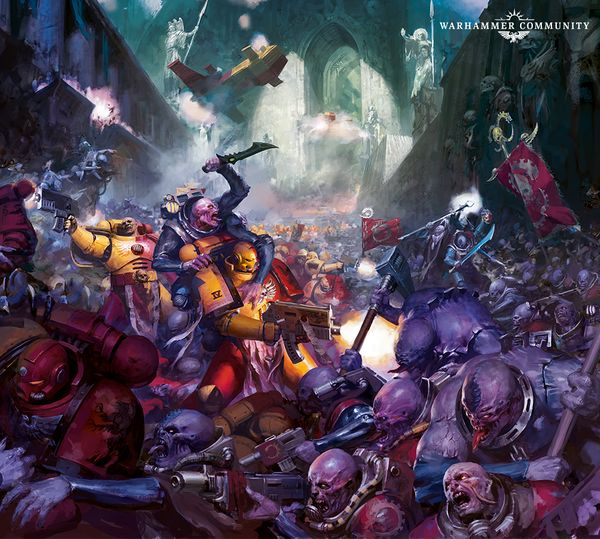
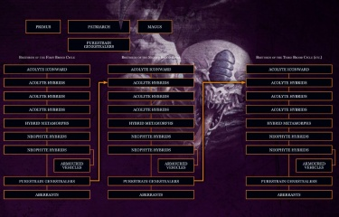
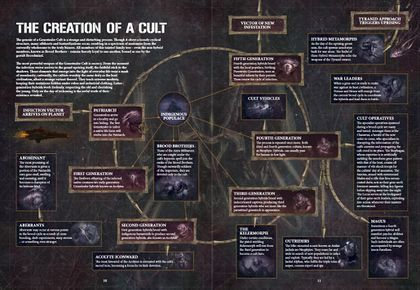
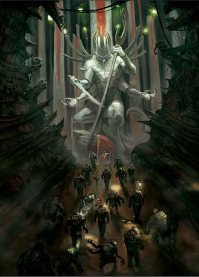
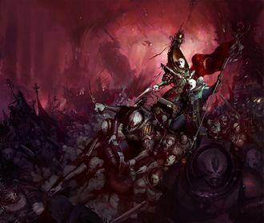
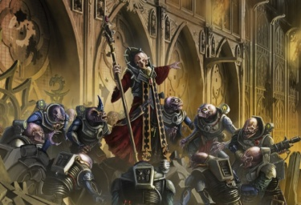
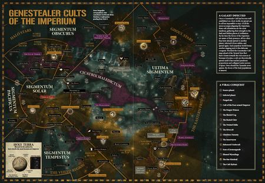
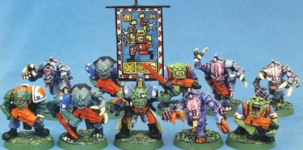
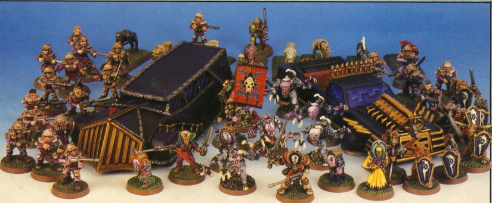

# 0581 基因窃取者教派 Genestealer Cult

精校状态：中文行文已逐段精校，部分术语仍为暂定

分类：概念 / 异型 Xenos / 泰伦虫族 Tyranids

原文来源：https://www.bilibili.com/opus/1134947208264679478

原作者：帝国神选罐头

原文时间：2025年11月14日 10:54

[返回分类目录](目录.md) · [全书目录](../../目录.md)

<!-- A0581-B0001 -->
**英文原文**

A Genestealer Cult is a community of Genestealers, genestealer hybrids, as well as the completely human convert-hosts, infected victims and genetic relatives known as Brood Brothers, existing within another society.

<!-- /A0581-B0001 -->

<!-- A0581-B0002 -->

原译文

基因窃取者教派是一个由基因窃取者、混血基因窃取者以及完全人类转变宿主、受感染的受害者和被称为族裔兄弟的遗传亲属组成的团体，存在于另一个社会中。

**校订译文**

基因窃取者教派是潜伏在其他社会内部的群体，由基因窃取者、混血后裔，以及仍具完整人类外貌的归信宿主、感染者和血亲组成；后一类统称“族裔兄弟”。

**校注：** Brood Brothers对应仍为人形的宿主、感染者及血亲，不仅仅最后一类遗传亲属。

<!-- /A0581-B0002 -->

<!-- A0581-B0003 图片 -->

<!-- A0581-B0004 -->

原译文

Genestealer Cult forces battle Space Marines 基因窃取者教派部队与星际战士作战

**校订译文**

Genestealer Cult forces battle Space Marines 基因窃取者教派部队与星际战士作战

<!-- /A0581-B0004 -->

<!-- A0581-B0005 -->
**英文原文**

Genestealer cults form if a Genestealer infects members of another species with its genetic code. The resultant changes in the genome of the host cause a fanatical loyalty to the genestealers, as well as a drastic change to their reproductive system; their firstborn children will be hybrids, a grotesque mixture of the host's race and genestealers. These hybrids infect further victims, and the infection spreads exponentially. Fourth generation hybrids produce purestrain genestealers, and the cycle starts once again. This brood of purestrains, hybrids, and neophytes is held together by strong psychic and genetic bonds, and assembles around the original genestealer, which becomes the patriarch. Because this community is often hidden behind the facade of a religion or political movement, it is called a genestealer cult by the Imperium.

<!-- /A0581-B0005 -->

<!-- A0581-B0006 -->

原译文

如果基因窃取者用其遗传编码感染另一个物种的成员，就会形成基因窃取者教派。宿主基因组的变化导致了对基因窃取者的狂热忠诚，以及他们的生殖系统的剧烈变化；他们的长子将是混血，这是宿主种族和基因窃取者的奇怪混合体。这些混血会感染更多的受害者，感染呈指数级传播。第四代混血产生了纯血的基因窃取者，循环再次开始。这群纯血、混血和新血被强大的灵能和遗传纽带联系在一起，围绕着最初的成为族长的基因窃取者聚集在一起。由于这个团体往往隐藏在宗教或政治运动的表象之下，因此被帝国称为基因窃取者教派。

**校订译文**

基因窃取者将自身遗传密码植入其他物种后，便可能催生教派。宿主的基因组改变，使其狂热效忠基因窃取者，生殖系统也发生剧变：第一个孩子将是宿主物种与基因窃取者混合的畸形后裔。混血后裔继续感染新受害者，使侵染指数式扩散。第四代混血再生下纯种基因窃取者，循环重新开始。纯种、混血与新信徒由强大的灵能和血缘纽带紧密联结，簇拥着最初的基因窃取者；后者逐渐成为族长。这类群体往往以宗教或政治运动为外衣，因此被帝国称为基因窃取者教派。

**校注：** firstborn children指第一个孩子，不限男性，原长子缩窄含义。

<!-- /A0581-B0006 -->

<!-- A0581-B0007 -->
**英文原文**

As the cult's numbers grow, more specialized types of hybrids are created to serve the patriarch, which is now worshiped as a god. These include magi, primuses, loci, etc.. The cult will often grow and plot below the surface of their host world, using this base of operations to gradually infiltrate into the above society. Later generations are less monstrous than their forbears and can freely walk among Imperial society without much notice. Often a genestealer cult will recruit from the downtrodden underbelly of society, characterizing themselves as liberators from the brutal yoke of Imperial rule. A fully mature cult can be huge, numbering in the billions and covering several worlds.

<!-- /A0581-B0007 -->

<!-- A0581-B0008 -->

原译文

随着教派人数的增长，人们创造了更特殊类型的混血来为族长服务，族长现在被尊为神。这些包括主教、领军、卫士等。教派往往会在宿主世界的表面下生长和策划，利用这个行动基地逐渐渗透到上层社会。后代不像他们的祖先那么可怕，可以在帝国社会中自由行走，不受太多关注。通常，一个基因窃取者教派会从社会底层招募成员，将自己描述为帝国统治残酷枷锁的解放者。一个完全成熟的教派可能是巨大的，数量可达数十亿，覆盖了几个世界。

**校订译文**

随着人数增加，教派会产生更专门化的混血个体，如占星师、领军与基卫，侍奉已被奉为神明的族长。教派常在地下发展、密谋，以此为基地逐步渗透地表社会。后代外貌不似先辈那样怪异，得以自由往来于帝国社会，较少引人注意。教派也常从受压迫的社会底层招募，将自己包装成打破帝国残酷枷锁的解放者。发展成熟后，规模可达数十亿人，遍布多个世界。

**校注：** above society指地表社会，与地下基地相对，非社会上层；magi/primuses/loci为各职衔复数。

<!-- /A0581-B0008 -->

<!-- A0581-B0009 -->
**英文原文**

The Cult's primary concern is their propagation, but overtime this transitions to preparing their host world for the coming of a Tyranid Hive Fleet. Cultists often see this as an anointed holy day of salvation, and they will work fanatically to see a victim population is ready for consumption. At the chosen hour the Genestealer Cult rises up, unleashing a devastating and well-planned assault that can devastate entire Systems.

<!-- /A0581-B0009 -->

<!-- A0581-B0010 -->

原译文

教派的主要关注点是他们的传播，但随着时间的推移，这将过渡到为他们的宿主世界做好准备，迎接泰伦虫巢舰队的到来。信徒们经常把这看作是一个受膏的救赎圣日，他们会狂热地工作，让受害者群体做好消耗的准备。在选定的时刻，基因窃取者教派崛起，发动了一场毁灭性的、精心策划的攻击，可以摧毁整个星系。

**校订译文**

教派起初最关心自身繁衍，逐渐转为替虫巢舰队的到来准备所在世界。信徒将那一天视为神圣的救赎之日，狂热地让当地人口就绪，等候吞噬。约定时刻一到，教派便起事，发动筹划周密、破坏惊人的攻势，足以毁掉整个星系。

<!-- /A0581-B0010 -->

<!-- A0581-B0011 -->
## Hierarchy and Organization 层级与组织

原题：Hierarchy and Organization 层次结构和组织

<!-- /A0581-B0011 -->

<!-- A0581-B0012 -->
### Brood Coven 族会

<!-- /A0581-B0012 -->

<!-- A0581-B0013 -->
**英文原文**

At the top of a Genestealer Cult stands the Patriarch — he determines every action of the cult as its progenitor - he is beloved and seen as a kind of father-figure or, in the case of the Brood Brothers, as a god. Using the Broodmind to maintain control over his forces, besides him in the hierarchy stands the Magus and Primus. These hybrids are of the fourth generation, who operates as a public leadership figure. Patriarch, Magus, and Primus form, together with the other hybrids and Genestealers, an inner circle known as the Broodcoven, which is responsible for leading the cult.

<!-- /A0581-B0013 -->

<!-- A0581-B0014 -->

原译文

在基因窃取者的顶端站着族长 — 他将教派的每一个行为都视为其先驱 — 他受到爱戴，被视为一种父亲般的人物，或者在族裔兄弟的情况下，他被视为神。使用族裔思维来保持对他的部队的控制，除了他在等级制度中之外，还有主教和领军。这些混血是第四代，他们作为公共领导人物运作。族长、主教和领军与其他混血和基因窃取者一起组成了一个被称为族会的内环，负责领导教派。

**校订译文**

教派顶端是族长。作为始祖，他决定教派的一切行动，受到爱戴，被视为父亲般的人物；在族裔兄弟眼中，他更是神明。族长借“族裔思维”控制成员，身旁辅佐的是占星师与领军：这类第四代混血在公众面前担任领袖。三者连同其他混血与基因窃取者，组成名为“族会”的核心圈，领导整个教派。

**校注：** he determines...as its progenitor指族长身为始祖决定教派行动，原句误作将行为看作先驱。

<!-- /A0581-B0014 -->

<!-- A0581-B0015 图片 -->

<!-- A0581-B0016 -->

原译文

Genestealer Cult hierarchy 基因窃取者教派等级制度

**校订译文**

Genestealer Cult hierarchy 基因窃取者教派等级制度

<!-- /A0581-B0016 -->

<!-- A0581-B0017 -->
**英文原文**

The Patriarch and the Magus hold the highest level of leadership within the cult. The death of either figure, or worse, both figures causes, at first, confusion among the cult members. The cult's hierarchy, however, can adapt and recover quickly, and even the deaths of both figures will not shatter or destroy a cult. In the case of the Patriarch's death, the Magus assumes the sole leadership over the cult until the next oldest Purestrain Genestealer becomes the new Patriarch.

<!-- /A0581-B0017 -->

<!-- A0581-B0018 -->

原译文

族长和主教在教派中拥有最高级别的领导权。任何一个人物的死亡，或者更糟糕的是，两个人物的死亡，最初都会在教派成员中造成混乱。然而，教派的等级制度可以迅速适应和恢复，即使两位人物的死亡也不会粉碎或摧毁教派。在族长死亡的情况下，主教将承担对教派的唯一领导权，直到下一位最年长的纯血基因窃取者成为新的族长。

**校订译文**

族长与占星师居于最高领导层。任何一人死亡，乃至两人同时死亡，起初都会引发混乱；但教派组织能迅速调整恢复，甚至不会因两者皆亡而彻底瓦解。族长死后，占星师暂掌唯一领导权，直至下一只最年长的纯种基因窃取者成为新族长。

<!-- /A0581-B0018 -->

<!-- A0581-B0019 -->
### Specialized Hybrids 特化混血

原题：Specialized Hybrids 特殊族裔

<!-- /A0581-B0019 -->

<!-- A0581-B0020 -->
**英文原文**

A wide variety of specialist Hybrids have also been observed, such as the Clamavus, Biophagus, Nexos, Sanctus, Reductus, Kelermorph, Locus, and Benefictus. Beneath these are the standard Genestealer Hybrids, Genestealer Aberrants, Abominants, and Genestealer Familiars.

<!-- /A0581-B0020 -->

<!-- A0581-B0021 -->

原译文

还观察到了各种各样的特殊混血，如宣道者、传疫者、指挥者、圣裁者、隐蔽者、决斗者、卫士和受祝者。下面是标准的基因窃取者族裔、基因窃取者畸变体、畸变主宰和基因窃取者魔宠。

**校订译文**

已知的特化混血包括传教员、生物噬变师、指挥使、圣裁者、隐蔽破坏者、杀戮兵器、基卫和赐灵者等。其下则是普通混血、畸变体、憎恶体与基因窃取者魔宠。

**校注：** 按GW09/GW10第22页更新官方兵种名：占星师、传教员、生物噬变师、指挥使、杀戮兵器、基卫、赐灵者、憎恶体。Reductus为原文简称，采用完整Reductus Saboteur词根并标参考。

<!-- /A0581-B0021 -->

<!-- A0581-B0022 -->
### Infestation 侵染群

原题：Infestation 侵扰

<!-- /A0581-B0022 -->

<!-- A0581-B0023 -->
**英文原文**

All the cultists of a given world are known as an infestation, and each population area can propagate several full brood cycles. All the cultists in a given population center are known as a gene-sect. Some populations are only numerous enough to support one gene-sect, but on those worlds that are heavily populated, several can coexist. Though each gene-sect may further differentiate itself with markings and subtleties of coloration, ultimately they all hail from the same Patriarch, and usually work together seamlessly. Each gene-sect has its own specialist organisms and leaders. These usually hail from the fourth generation, and hence can pass for human. So close are they in thought and deed that they and their peers in other gene-sects may even band together to fight in the same place at the same time. These gene-sects, usually at least several hundred members strong, are further subdivided into claws. Claws typically number between fifty and a hundred warriors, formed for specific duties, these are assembled and disbanded according to the cult’s needs. Claws will have at least one leader figure that guides them in their mission, and each Magus and Primus will have several claws at their disposal, ranging from neophyte groups that can pass for human to monstrous broods of aberrants that are unmistakably alien.

<!-- /A0581-B0023 -->

<!-- A0581-B0024 -->

原译文

一个特定世界的所有信徒都被称为侵扰，每个人口区域都可以繁殖几个完整的族群。一个特定人口中心的所有信徒都被称为基因教派。有些人口的数量只足以支持一个基因教派，但在那些人口稠密的世界上，几个可以共存。尽管每个基因教派可能会通过标记和微妙的颜色进一步区分自己，但最终它们都来自同一个族长，并且通常无缝地协同工作。每个基因教派都有自己的特殊生物和领导者。这些通常来自第四代，因此可以被视为人类。他们在思想和行为上如此接近，以至于他们和其他基因教派的同辈甚至可能在同一时间、同一地点联合起来作战。这些基因教派通常至少有几百个成员，进一步细分为利爪。利爪通常有五十到一百名战士，为特定的任务而组成，根据教派的需要进行组装和解散。利爪将至少有一个领袖人物来引导他们的任务，每个主教和领军都将有几个利爪可供支配，从可以被误认为是人类的新血群体到明显是异型的可怕的族裔畸变体。

**校订译文**

一个世界的全体教徒统称“侵染群”，各人口聚居区内都可能完成数轮繁殖世代。单个聚居中心的信徒组成“基因分教团”。有些地区人口仅够容纳一个分教团，人口众多的世界则可让多个并存。它们可能以不同标记或细微色差区分，但都源于同一族长，通常配合默契。每个分教团拥有自己的特化个体和领袖，通常来自可伪装成人类的第四代。他们与其他分教团同类的思想、行动高度一致，甚至会同步集结至一处作战。一个分教团通常至少有数百成员，再下分为“利爪”：每支约五十至一百名战士，为特定任务临时编组，随需要组建、解散，并至少配有一位领袖。每名占星师和领军均可调遣数支利爪，从能够混入人类的新信徒，到一眼就能辨出异形特征的畸变体群，都在其中。

**校注：** gene-sect为世界内分支，暂译基因分教团，与Genestealer Cult教派本体区分；brood cycles为完整繁殖循环而非几个族群。

<!-- /A0581-B0024 -->

<!-- A0581-B0025 图片 -->

<!-- A0581-B0026 -->

原译文

The cycle of reproduction of a Genestealer Cult 基因窃取者教派的繁殖周期

**校订译文**

The cycle of reproduction of a Genestealer Cult 基因窃取者教派的繁殖周期

<!-- /A0581-B0026 -->

<!-- A0581-B0027 -->
**英文原文**

Once the cult reaches a point of maturity where it feels secure enough that it can spare the resources to spread, it sends out a Genestealer – or even an entire brood – to find new prey. These will either come from the original brood to have made planetfall, known as the First Curse, or the Purestrain Genestealers of a brood cycle’s fifth generation. These vectors of infection will start a new gene-sect should they find another suitable population center on the same world, or an entirely new infestation if they reach a planet that can support a splinter of the parent cult.

<!-- /A0581-B0027 -->

<!-- A0581-B0028 -->

原译文

一旦教派达到足够安全的成熟点，可以腾出资源进行传播，它就会派出一只基因窃取者 — 甚至是一整个族裔 — 去寻找新的猎物。这些要么来自造成行星陷落的原初族裔，被称为第一诅咒，要么来自族群第五代的纯血基因窃取者。如果这些感染媒介在同一个世界上找到另一个合适的人口中心，它们将开始一个新的基因教派，或者如果它们到达一个可以支持母教派分裂的行星，它们将发起一次全新的侵扰。

**校订译文**

教派发展成熟、地位稳固，有余力向外扩张后，就会派出一只乃至整群基因窃取者寻找新猎物。它们可能来自最初登陆、被称为“初始诅咒”的那批虫群，也可能是繁殖循环第五代诞生的纯种。这些传播侵染的个体若在同一世界找到适宜的新聚居中心，就会建立新分教团；若抵达足以容纳母教派分支的另一颗行星，则会开辟全新的侵染群。

**校注：** made planetfall意为登陆，不是造成行星陷落。

<!-- /A0581-B0028 -->

<!-- A0581-B0029 -->
**英文原文**

Brood Brothers may exist outside the cult but are still ultimately part of the clan. Even further outside stand the uninfected allies of the cult, mostly members of suppressed minorities, social fringe groups as well as mutants. These groups are not considered ideal hosts as they cannot contribute to the cult's political power. They are mostly seen as unessential elements, of use only when the cult actively rebels, and are exploited ruthlessly.

<!-- /A0581-B0029 -->

<!-- A0581-B0030 -->

原译文

族裔兄弟可能存在于教派之外，但最终仍是氏族的一部分。更远是教派的未受感染的盟友，他们大多是受压迫的少数群体、社会边缘群体以及变种人。这些团体不被认为是理想的宿主，因为他们不能为教派的政治权力做出贡献。他们大多被视为不必要的成员，只有在教派主动叛乱时才有用，并被无情地利用。

**校订译文**

族裔兄弟可能生活在教派组织之外，但最终仍属于这个族群。关系更疏远的，是未受感染的盟友，主要包括受压迫的少数群体、社会边缘人和变种人。教派认为这些人无法增强自身政治影响，不是理想宿主，只把他们当成可有可无的工具，在公开叛乱时才会派上用场，并无情加以榨取。

<!-- /A0581-B0030 -->

<!-- A0581-B0031 -->
## Genestealer Cults and the Tyranids 基因窃取者教派和泰伦

<!-- /A0581-B0031 -->

<!-- A0581-B0032 -->
**英文原文**

To a Genestealer Cult, the Tyranid is worshipped as a deity. Often the cults call the Tyranids Star Children or describe them with similarly grandiose-religious titles like Father's Fathers or Emperor's angels. The Cult views the coming Hive Fleet as a long-awaited prophecy, its arrival heralding their lifting into the light forever.

<!-- /A0581-B0032 -->

<!-- A0581-B0033 -->

原译文

对于基因窃取者教派来说，泰伦被当作神来崇拜。教派经常称泰伦为星之子，或者用类似的宏伟宗教头衔来描述他们，比如祖父或帝皇的天使。教派将即将到来的虫巢舰队视为一个期待已久的预言，它的到来预示着他们将永远升入光明之中。

**校订译文**

在教派眼中，泰伦是神祇，常被称为“星之子”，或冠以“众父之父”“帝皇的天使”等庄严的宗教称号。虫巢舰队的到来意味着期盼已久的预言实现，信徒将从此升入永恒光明。

**校注：** Father’s Fathers为宗教称呼众父之父，原祖父冲淡语境。

<!-- /A0581-B0033 -->

<!-- A0581-B0034 图片 -->

<!-- A0581-B0035 -->

原译文

Genestealer Cult Shrine 基因窃取者教派圣地

**校订译文**

Genestealer Cult Shrine 基因窃取者教派圣地

<!-- /A0581-B0035 -->

<!-- A0581-B0036 -->
**英文原文**

Genestealers are effectively the heralds of Tyranid invasions, because the psychic power of the Patriarch shines like a beacon in the Warp and is perceived by the Hive Fleets of the Tyranids. As the cult's power grows over the world, the beacon becomes stronger, signaling to the Tyranids the location of a biologically rich world. By the time the Hive Fleets arrive, the world may already be completely in the hands of the Genestealer Cult, or torn apart by civil war between the cult and the remaining free society, or at least weakened and rife with traitors. Acting in concert with the Hive Mind, a Genestealer Cult will fanatically fight for the Tyranids once it has arrived over their world.

<!-- /A0581-B0036 -->

<!-- A0581-B0037 -->

原译文

基因窃取者实际上是泰伦入侵的先驱，因为族长的灵能力量像亚空间中的灯塔一样闪耀，并被泰伦的虫巢舰队所感知。随着教派的力量在世界各地增长，灯塔变得越来越强，向泰伦发出了生物质丰富世界的位置信号。当虫巢舰队到达时，世界可能已经完全掌握在基因窃取者教派手中，或者被教派与剩余的自由社会之间的内战撕裂，或者至少被削弱并充斥着叛徒。与虫巢思维协同行动，一旦到达他们的世界，基因窃取者邪教将狂热地为泰伦而战。

**校订译文**

基因窃取者实际上是泰伦入侵的先驱。族长的灵能力量在亚空间中如信标闪耀，能被虫巢舰队感知；教派在世界上愈发强盛，信号也越强，标示着生物质丰饶的猎场。舰队抵达时，该星可能已完全落入教派之手，也可能正因教派与尚未受控的社会势力内战而分崩离析，至少也会国力衰弱、内奸遍布。虫群一到，教派便与虫巢意志协同，为泰伦狂热作战。

<!-- /A0581-B0037 -->

<!-- A0581-B0038 -->
**英文原文**

However, a Hive Fleet's arrival usually seals the destiny of a cult. Either their host society destroys them and their Xenos allies or the Tyranid invasion succeeds, resulting in all surviving cult members being absorbed like the rest of the planet. After the opposition is defeated, the Genestealer Patriarch and its Brood of Purestrain Genestealers will massacre its own without hesitation. The cult's biomass is harvested and consumed by the Tyranid Hive Fleet. Genestealer Cults differ greatly in their reaction to this fate. Some cultists are aware of their ultimate destiny long before the Hive Fleet's arrival and welcome the idea to be absorbed into a greater whole; many will weep in joy or sing praises even as they are torn apart by their former allies. However, other cults or even individual cultists are surprised and horrified when the truth is revealed to them, sometimes embracing their human nature just before their demise. In rare cases, cultists may even rebel against the Tyranids after understanding what is happening to them.

<!-- /A0581-B0038 -->

<!-- A0581-B0039 -->

原译文

然而，虫巢舰队的到来通常决定了教派的命运。要么他们的宿主社会摧毁他们和他们的异型盟友，要么泰伦入侵成功，导致所有幸存的教派成员像行星上其他地方一样被吸收。在反抗者被击败后，基因窃取者族长及其纯血基因窃取者兄弟将毫不犹豫地屠杀自己。该教派的生物质被泰伦虫巢舰队收割和消耗。基因窃取者教派对这种命运的反应大不相同。一些信徒早在虫巢舰队到来之前就意识到了他们的最终命运，并欢迎这个想法被吸收到一个更大的整体中；许多人会高兴地哭泣或歌颂，即使他们被以前的盟友撕裂。然而，当真相被揭露时，其他教派甚至个别教派都会感到惊讶和恐惧，有时甚至在他们死亡前接受了他们的人性。在极少数情况下，信徒甚至可能在了解了泰伦的情况后对抗他们。

**校订译文**

然而，舰队到来通常也宣告教派的结局：要么当地社会消灭教派及其异形盟友，要么泰伦获胜，将幸存信徒与全星球其他生命一同吸收。抵抗被清除后，族长和纯种虫群便会毫不迟疑地屠杀自己的信众，供虫巢舰队收割、吞噬生物质。各教派对此反应迥异。有的早已知晓命运，欢迎融入更宏大的整体；即使被昔日盟友撕碎，仍喜极而泣、高唱赞歌。另一些教派或个别信徒，直到真相揭晓才惊骇万分，有时在死前最后一刻重新拥抱人性。极少数甚至在醒悟后反抗泰伦。

**校注：** massacre its own为杀自己的教众，不是族长与纯种自杀；few cultists指个别信徒，不是个别教派。

<!-- /A0581-B0039 -->

<!-- A0581-B0040 图片 -->

<!-- A0581-B0041 -->

原译文

Genestealer Cult 基因窃取者

**校订译文**

Genestealer Cult 基因窃取者教派

<!-- /A0581-B0041 -->

<!-- A0581-B0042 -->
## Genestealer Cults in the Imperium 帝国内的基因窃取者教派

<!-- /A0581-B0042 -->

<!-- A0581-B0043 -->
**英文原文**

Even before Genestealers were revealed as being a part of the Tyranid race, their infiltration of human worlds was a dire threat. A single Genestealer or infected human on a planet can easily lead to the corruption of the planet's entire human population. Once a cult achieves numerical advantage, the planet becomes doomed. At a certain point the only sensible option would be to sterilize the planet through exterminatus. The first known Genestealer Cult encountered by the Imperium was discovered in 680.M41 on Ghosar Quintus.

<!-- /A0581-B0043 -->

<!-- A0581-B0044 -->

原译文

甚至在基因窃取者被揭露为泰伦种族的一部分之前，他们对人类世界的渗透就是一个可怕的威胁。一个行星上的一个基因窃取者或受感染的人很容易导致行星上整个人口的腐化。一旦一个教派获得了数量优势，这个行星就注定要灭亡。在某种程度上，唯一明智的选择是通过灭绝令来对行星进行灭菌。帝国遇到的第一个已知的基因窃取者教派于680.M41在戈萨尔五号上发现。

**校订译文**

即使在基因窃取者被证实属于泰伦之前，它们对人类世界的渗透已是严重威胁。一颗星球上只需出现一只基因窃取者，或一名受感染的人，就可能导致整个人口遭到侵染。教派一旦占据人数优势，该世界便凶多吉少；到了某个阶段，唯一合理的选择甚至只剩灭绝令。帝国最早发现并记载的教派，位于680.M41的戈萨尔五号。

<!-- /A0581-B0044 -->

<!-- A0581-B0045 图片 -->

<!-- A0581-B0046 -->

原译文

mass of a Genestealer Cult's forces 基因窃取者教派的庞大部队

**校订译文**

mass of a Genestealer Cult's forces 基因窃取者教派的庞大部队

<!-- /A0581-B0046 -->

<!-- A0581-B0047 -->
**英文原文**

At first Genestealers and their methods of reproduction were poorly understood, and the menace they presented terribly underestimated. With the investigation of the reproductive cycle and the aggressive propagation resulting from it, this changed. As deeper knowledge of Genestealer cults was gained by the Imperium and the Inquisition, subtle hints could uncover the existence of Genestealer cults within human societies. Infiltrated planets could be recognized and cleansed of Genestealers and infected humans by Space Marine troops or even by Exterminatus.

<!-- /A0581-B0047 -->

<!-- A0581-B0048 -->

原译文

起初，人们对基因窃取者教派及其繁殖方法知之甚少，他们所带来的威胁被严重低估了。随着对繁殖周期及其引发的侵略性传播的研究，这种情况发生了变化。随着帝国和审判庭对基因窃取者教派有了更深入的了解，微妙的线索可以揭示人类社会重基因窃取者教派的存在。被渗透的行星可以被星际战士部队甚至灭绝令识别并清除基因窃取者和受感染的人类。

**校订译文**

最初，人们不了解基因窃取者及其繁殖方式，严重低估了危害。对繁殖循环与迅猛扩散的研究改变了这一点。帝国和审判庭逐渐掌握足够知识，能从细微迹象识破潜伏的人类社会中的教派，再派星际战士清除基因窃取者及感染者，必要时甚至执行灭绝令。

<!-- /A0581-B0048 -->

<!-- A0581-B0049 -->
**英文原文**

A cult is often not recognized as a threat to the planet - its activity in achieving power at first being purely through subvert, non-violent means. A Cult will bide its times for generations, slowly gaining power behind the scenes and propagating its numbers. However if the threat is recognized for what it is, the cult takes overt military action to survive. Genestealer Cults will also violently respond to outside threats that threaten their hold over a world, be it a Warp breach, Ork Waaagh!, or Hrud migration.

<!-- /A0581-B0049 -->

<!-- A0581-B0050 -->

原译文

教派往往不被视为对行星的威胁 — 它最初纯粹是通过颠覆、非暴力手段获得权力的。一个教派将世世代代等待时机，在幕后慢慢获得权力，并传播其数量。然而，如果人们认识到威胁是什么，教派就会采取公开的军事行动来生存。基因窃取者也会对威胁他们对世界的控制的外部威胁做出暴力回应，无论是亚空间突破口，欧克Waaagh！，或赫鲁德迁移。

**校订译文**

教派起初往往不被视为行星威胁，因为它们只以隐秘、非暴力的手段谋取权力，历经数代潜伏，在幕后缓慢扩张势力与人数。但一旦身份败露，就会为生存而公开举兵。对威胁自身控制的外来力量——无论亚空间裂口、欧克 Waaagh!，还是赫鲁德迁徙——它们也会以暴力回应。

<!-- /A0581-B0050 -->

<!-- A0581-B0051 -->
**英文原文**

Genestealer Cults thrive among the downtrodden and oppressed classes of Imperial society, often seeming as nothing more than a typical planetary insurgent sect. The Cultists eagerly await the day of liberation from the Imperium, which the Cult leadership insists will come with the arrival of the Star Children. The Cult itself fosters such a belief, inspiring generations of sedition and revolution in preparation for their inevitable uprising.

<!-- /A0581-B0051 -->

<!-- A0581-B0052 -->

原译文

基因窃取者教派在帝国社会的受压迫阶层中蓬勃发展，往往看起来只不过是一个典型的行星叛乱教派。教派急切地等待着从帝国中解放出来的那一天，教派领导层坚称，随着星之子的到来，这一天将会到来。教派本身就培养了这种信仰，激发了几代人的煽动和变革，为他们不可避免的叛乱做准备。

**校订译文**

教派在受压迫、受剥削的帝国民众中最易滋长，表面看起来常与普通地方叛乱组织无异。信徒急切等待脱离帝国的解放日，领袖坚称“星之子”一到，那一天便会来临。教派不断强化这种信仰，鼓动一代又一代人煽动反抗、投身革命，为最终起义做准备。

<!-- /A0581-B0052 -->

<!-- A0581-B0053 图片 -->

<!-- A0581-B0054 -->

原译文

Genestealer Cults Infestations 基因窃取者教派侵袭

**校订译文**

Genestealer Cults Infestations 基因窃取者教派侵染分布

<!-- /A0581-B0054 -->

<!-- A0581-B0055 -->
### Known Infestations 已知侵染地点

原题：Known Infestations 著名侵扰

<!-- /A0581-B0055 -->

<!-- A0581-B0056 -->

原译文

Arcadium 阿卡迪亚姆

**校订译文**

Arcadium 阿卡迪亚姆

<!-- /A0581-B0056 -->

<!-- A0581-B0057 -->

原译文

Darvon VI 达尔丰六号

**校订译文**

Darvon VI 达尔丰六号

<!-- /A0581-B0057 -->

<!-- A0581-B0058 -->

原译文

Ghosar Quintus 戈萨尔五号

**校订译文**

Ghosar Quintus 戈萨尔五号

<!-- /A0581-B0058 -->

<!-- A0581-B0059 -->

原译文

Ghyre 吉尔

**校订译文**

Ghyre 吉尔

<!-- /A0581-B0059 -->

<!-- A0581-B0060 -->

原译文

Graia 格拉亚

**校订译文**

Graia 格拉亚

<!-- /A0581-B0060 -->

<!-- A0581-B0061 -->

原译文

Gravalax 格拉瓦拉克斯

**校订译文**

Gravalax 格拉瓦拉克斯

<!-- /A0581-B0061 -->

<!-- A0581-B0062 -->

原译文

Ichar IV 伊卡尔四号

**校订译文**

Ichar IV 伊卡尔四号

<!-- /A0581-B0062 -->

<!-- A0581-B0063 -->

原译文

Lamarno 拉马尔诺

**校订译文**

Lamarno 拉马尔诺

<!-- /A0581-B0063 -->

<!-- A0581-B0064 -->

原译文

Necromunda 涅克罗蒙达

**校订译文**

Necromunda 涅克罗蒙达

<!-- /A0581-B0064 -->

<!-- A0581-B0065 -->

原译文

Radnar 拉德纳

**校订译文**

Radnar 拉德纳

<!-- /A0581-B0065 -->

<!-- A0581-B0066 -->

原译文

Sabulorb 萨博洛布

**校订译文**

Sabulorb 萨博洛布

<!-- /A0581-B0066 -->

<!-- A0581-B0067 -->

原译文

Scitalyss 西塔利斯

**校订译文**

Scitalyss 西塔利斯

<!-- /A0581-B0067 -->

<!-- A0581-B0068 -->

原译文

Serenade 小夜曲星

**校订译文**

Serenade 小夜曲星

<!-- /A0581-B0068 -->

<!-- A0581-B0069 -->

原译文

Stalinvast 斯大林瓦斯特

**校订译文**

Stalinvast 斯大林瓦斯特

<!-- /A0581-B0069 -->

<!-- A0581-B0070 -->

原译文

Terra 泰拉

**校订译文**

Terra 泰拉

<!-- /A0581-B0070 -->

<!-- A0581-B0071 -->

原译文

Thranx 特兰克斯

**校订译文**

Thranx 特兰克斯

<!-- /A0581-B0071 -->

<!-- A0581-B0072 -->

原译文

Torhaven 托尔黑文

**校订译文**

Torhaven 托尔黑文

<!-- /A0581-B0072 -->

<!-- A0581-B0073 -->

原译文

Triton 海卫一

**校订译文**

Triton 海卫一

<!-- /A0581-B0073 -->

<!-- A0581-B0074 -->

原译文

Vigilus 警戒星

**校订译文**

Vigilus 警戒星

<!-- /A0581-B0074 -->

<!-- A0581-B0075 -->
**英文原文**

Zaisuthra - Genestealers infect an entire Eldar Craftworld.

<!-- /A0581-B0075 -->

<!-- A0581-B0076 -->

原译文

扎苏特拉 - 基因窃取者感染了整个灵族方舟世界

**校订译文**

扎苏特拉 - 基因窃取者感染了整个灵族方舟世界

<!-- /A0581-B0076 -->

<!-- A0581-B0077 -->
### Known Imperial Genestealer Cults 帝国境内已知的基因窃取者教派

原题：Known Imperial Genestealer Cults 著名帝国基因窃取者教派

<!-- /A0581-B0077 -->

<!-- A0581-B0078 -->
**英文原文**

Though only a few Genestealer cults have been formally documented by the Ordo Xenos, based on information provided on Ghosar Quintus it appears that there could be hundreds if not thousands of cults in Ultima Segmentum alone.

<!-- /A0581-B0078 -->

<!-- A0581-B0079 -->

原译文

尽管只有少数基因窃取者教派被攘外修会正式记录在案，但根据戈萨尔五号提供的信息，仅在极限星域就可能有数百甚至数千个教派。

**校订译文**

异形审判庭正式记录的教派虽寥寥无几，但戈萨尔五号的情报表明，仅极限星域便可能潜藏数百乃至数千个。

<!-- /A0581-B0079 -->

<!-- A0581-B0080 -->
### Officially Documented Cults 帝国官方记载的教派

原题：Officially Documented Cults 官方记录的教派

**校注：** Officially Documented指帝国内部有正式记录，并非本稿已查GW官网为这些全部译名认证。

<!-- /A0581-B0080 -->

<!-- A0581-B0081 -->

原译文

Cult of the Bladed Cog 刀刃齿轮教派

**校订译文**

Cult of the Bladed Cog 刀刃齿轮教派

<!-- /A0581-B0081 -->

<!-- A0581-B0082 -->

原译文

Cult of the Four-Armed Emperor 四臂帝皇教派

**校订译文**

Cult of the Four-Armed Emperor 四臂帝皇教派

<!-- /A0581-B0082 -->

<!-- A0581-B0083 -->

原译文

Cult of the Hive Cult 虫群崇拜教派

**校订译文**

Cult of the Hive Cult 虫群崇拜教派

<!-- /A0581-B0083 -->

<!-- A0581-B0084 -->

原译文

Cult of the Innerwyrm 内龙教派

**校订译文**

Cult of the Innerwyrm 内龙教派

<!-- /A0581-B0084 -->

<!-- A0581-B0085 -->

原译文

Cult of the Pauper Princes 乞丐王子教派

**校订译文**

Cult of the Pauper Princes 乞丐王子教派

<!-- /A0581-B0085 -->

<!-- A0581-B0086 -->

原译文

Cult of the Rusted Claw 锈爪教派

**校订译文**

Cult of the Rusted Claw 锈爪教派

<!-- /A0581-B0086 -->

<!-- A0581-B0087 -->

原译文

Cult of the Twisted Helix 扭曲螺旋教派

**校订译文**

Cult of the Twisted Helix 扭曲螺旋教派

<!-- /A0581-B0087 -->

<!-- A0581-B0088 -->
## Genestealer Cults in Xenos Societies 异形社会中的基因窃取者教派

原题：Genestealer Cults in Xenos Societies 异型社会的基因窃取者教派

<!-- /A0581-B0088 -->

<!-- A0581-B0089 -->
**英文原文**

Genestealers are not limited to infecting humans; virtually any race or species can be infested, including Orks. However, broods within a society such as Orks are seldom big or long-lasting on account of the special life cycle and the extremely intolerant structure of society of the Orkoid species. Orks are also able to sense a wrongness about those infected that disturbs them. In fact, Orks seem to be rather unpopular hosts, and serve mostly only as a kind of interim solution, until more worthwhile victims are available. Genestealer infections can only thrive in large, and relatively open societies such as those of humanity. However Genestealer Cults can cause catastrophic damage when they spread through Ork communities, most notably during the Xenos War.

<!-- /A0581-B0089 -->

<!-- A0581-B0090 -->

原译文

基因盗窃者不仅限于感染人类；几乎任何种族或物种都可能受到侵扰，包括欧克。然而，由于欧克物种的特殊生命周期和极其不宽容的社会结构，像欧克这样的社会中的幼崽很少巨大或持久。欧克也能感觉到那些感染者的错误，这会干扰他们。事实上，欧克似乎是相当不受欢迎的宿主，在有更多有价值的受害者之前，主要只是作为一种临时解决方案。基因窃取者感染只会在人类这样的大型、相对开放的社会中茁壮成长。然而，当基因窃取者教派在欧克团体传播时，可能会造成灾难性的破坏，尤其是在异型战争期间。

**校订译文**

基因窃取者不限于感染人类，几乎任何种族都可能中招，包括欧克。但欧克独特的生命周期与极度排他的社会结构，使其中的教派很难壮大、长存；同族也能察觉感染者身上令人不安的异样。因此，欧克不是受青睐的宿主，通常只是找到更有价值猎物之前的临时选择。基因窃取者的侵染，主要在人类那样人口众多、相对开放的社会中繁盛。尽管如此，一旦在欧克群体中传播，也可能造成灾难性破坏，异形战争便是突出例子。

<!-- /A0581-B0090 -->

<!-- A0581-B0091 图片 -->

<!-- A0581-B0092 -->

原译文

Ork/Genestealer Brood 欧克/基因窃取者族裔

**校订译文**

Ork/Genestealer Brood 欧克/基因窃取者族裔

<!-- /A0581-B0092 -->

<!-- A0581-B0093 -->
**英文原文**

Genestealer activity has also been observed on the Tau Empire Sept of Ksi'm'yen, though the Tau's connection to their Ethereal Caste makes infection by Genestealers difficult. The Kroot are known to have been affected as well, though they are generally able to avoid those infected thanks to their ability to taste pheromones, and the wisdom of the Shapers guiding their evolution. Kroot who have consumed genestealer hybrids can smell other infected individuals, which helps detect infestations in other auxiliary races like the Vespid.

<!-- /A0581-B0093 -->

<!-- A0581-B0094 -->

原译文

在科西'姆'延的钛帝国家门上也观察到了基因窃取者的活动，尽管钛与其以太种姓的联系使基因窃取者难以感染。众所周知，克鲁特也受到了影响，尽管他们通常能够避免感染，这要归功于他们品尝信息素的能力，以及塑形者引导他们进化的智慧。食用过基因窃取者的克鲁特可以闻到其他感染者的气味，这有助于检测其他辅助种族（如胡蜂人）的侵染。

**校订译文**

钛帝国的科西’姆’延家门也出现过基因窃取者活动，但钛族与以太种姓的联系，令感染较难发生。克鲁特同样可能受害；不过，它们能辨尝信息素，又有塑形者以智慧指引进化，通常可以避开感染者。吃过基因窃取者混血的克鲁特，还能嗅出其他受感染个体，帮助发现胡蜂人等辅助种族中的侵染。

**校注：** 食用对象为混血genestealer hybrids，原译省略，已补回。

<!-- /A0581-B0094 -->

<!-- A0581-B0095 -->
**英文原文**

Genestealers are known to have started colonies among the Eldar too, such as in the lost Craftworld Zaisuthra, but the Eldar's very long gestation times prevent them from being truly viable hosts. The Eldar of Zaisuthra had their own version of the Broodmind, dubbed the "Groupmind", which they claimed protected them from the predations of Slaanesh.

<!-- /A0581-B0095 -->

<!-- A0581-B0096 -->

原译文

众所周知，基因窃取者也在灵族中建立了殖民地，比如在失落的方舟世界扎苏特拉，但灵族漫长的妊娠期使他们无法成为真正可行的宿主。扎苏特拉的灵族有他们自己的族裔思维版本，被称为“群体思维”，他们声称这可以保护他们免受色孽的捕食。

**校订译文**

灵族也曾被基因窃取者建立据点，例如失落的扎苏特拉方舟世界；但灵族妊娠期极长，不是适宜的宿主。扎苏特拉灵族有自己的“族裔思维”，称为“群体思维”，并宣称它能够保护自己免受色孽捕食。

<!-- /A0581-B0096 -->

<!-- A0581-B0097 -->
**英文原文**

The Greet and Tarellians are also known to have had Genestealer colonies, though these species have not been as successful hosts as humans either.

<!-- /A0581-B0097 -->

<!-- A0581-B0098 -->

原译文

格利特和塔里利安也有基因窃取者殖民地，尽管这些物种也没有成为像人类那样成功的宿主。

**校订译文**

格利特与塔里利安中也有过基因窃取者聚落，但同样没有人类宿主那般适合教派发展。

<!-- /A0581-B0098 -->

<!-- A0581-B0099 -->
## Development History 创作沿革

原题：Development History 发展历史

<!-- /A0581-B0099 -->

<!-- A0581-B0100 -->
**英文原文**

Genestealers were introduced in the First Edition of Warhammer 40,000. At the time, though Genestealers could infect and reproduce with any type of creature, purestrain Genestealers could originate only from the infection of a creature known as a Csith. There was no Genestealer cult, as a host died with the "birth" of the hybrid-genestealer.

<!-- /A0581-B0100 -->

<!-- A0581-B0101 -->

原译文

《战锤40000》第一版引入了基因窃取者。当时，尽管基因窃取者可以感染任何类型的生物并繁殖，但纯血基因窃取者只能来自一种被称为奇斯的生物的感染。没有基因窃取者教派，因为宿主随着混血基因窃取者的“诞生”而死亡。

**校订译文**

基因窃取者在《战锤40,000》第一版登场。早期设定允许它们感染各类生物并繁殖，但只有感染一种名为“奇斯”的生物，才会产生纯种。当时尚无基因窃取者教派，因为混血“出生”时，宿主就会死亡。

<!-- /A0581-B0101 -->

<!-- A0581-B0102 -->
**英文原文**

With the appearance of the board game Space Hulk and extensive articles in White Dwarf issues 114, 115 and 116, the Genestealers and their offspring were newly conceived as cult-like communities of Genestealers, hybrids and fully human Brood Brothers, with a strict hierarchy, and a complicated and unique generation cycle. They represented a terribly insidious threat to the Imperium, infecting it from within and spreading like a virus. These Genestealer Clans could also become "Genestealer Cults" by worshipping Chaos. Such Chaos cults included Beastmen, mutants and daemons in the army.

<!-- /A0581-B0102 -->

<!-- A0581-B0103 -->

原译文

随着桌游《太空废船》的出现以及《白矮人》第114、115和116期的大量文章，基因窃取者及其后代被重新设想为基因窃取者、混血和完全人类族裔兄弟的教派的团体，具有严格的等级制度和复杂而独特的世代周期。它们对帝国构成了极其阴险的威胁，从内部感染并像病毒一样传播。这些基因窃取者氏族也可能通过崇拜混沌而成为“基因窃取者邪教”。这些混沌教派的军队包括野兽人、变种人和恶魔。

**校订译文**

随着桌游《太空废船》及《白矮人》第114、115、116期的详尽介绍，设定重新塑造了基因窃取者及其后裔：它们与混血、仍具完整人类形态的族裔兄弟共同形成近似教派的社群，有严格等级和复杂、独特的世代循环，像病毒般从内部侵染帝国，构成难以察觉的致命威胁。在该时期的设定中，这些“基因窃取者氏族”还可通过崇拜混沌，变成“基因窃取者邪教”，在军队中纳入野兽人、变种人和恶魔。

<!-- /A0581-B0103 -->

<!-- A0581-B0104 -->
**英文原文**

With the board game Advanced Space Crusade, the Genestealers were associated with the Tyranids and now their infiltration served as a preparation for the invasion by a Hive Fleet. This version has remained the same to this day and led to a certain decrease of the importance of Genestealer cult armies in Warhammer 40,000. While in the Second Edition they were still a separate army, and an additional force list in Codex: Tyranids (2nd Edition), in the Third Edition the Genestealer cult army appeared only as a semi-official Chapter Approved army list in the Citadel Journal (40 and 41), written by Tim Huckelbery.

<!-- /A0581-B0104 -->

<!-- A0581-B0105 -->

原译文

在桌游《高级太空远征》中，基因窃取者与泰伦有联系，现在他们的渗透为虫巢舰队的入侵做了准备。这个版本一直保持到今天，并导致《战锤40000》中基因窃取者教派军队的重要性有所下降。虽然在第二版中，他们仍然是一支独立的军队，并且在《圣典：泰伦虫族》（第二版）中还有一份额外的部队名单，但在第三版中，基因窃取者教派军队仅在《城堡杂志》（40和41期）中作为半官方文章批准的军队名单出现，该杂志由蒂姆·哈克尔伯里撰写。

**校订译文**

《高级太空远征》将基因窃取者与泰伦联系起来，从此，它们的渗透成为虫巢舰队入侵的前奏。这一基本设定沿用下来，却也一度降低了教派军队在游戏中的地位。第二版时，它们仍是独立军队，并在《圣典：泰伦虫族》第二版中附有军队表；到了第三版，只在《城堡杂志》第40、41期刊登了由蒂姆·哈克尔伯里撰写、以 Chapter Approved 名义发表的半官方军队表。

**校注：** Tim Huckelbery为这份军队表作者，非整本杂志作者；Chapter Approved为出版名目，不译文章批准；规则地位描述限定历史阶段。

<!-- /A0581-B0105 -->

<!-- A0581-B0106 图片 -->

<!-- A0581-B0107 -->

原译文

Genestealer Cult with Chaos allies (Rogue Trader era) 基因窃取者教派与混沌盟友（行商浪人时期）

**校订译文**

Genestealer Cult with Chaos allies (Rogue Trader era) 基因窃取者教派与混沌盟友（行商浪人时期）

<!-- /A0581-B0107 -->

<!-- A0581-B0108 -->
**英文原文**

In February 2016, Games Workshop re-released Genestealer Cults in the board game Deathwatch: Overkill. They were introduced into Warhammer 40,000 proper with the release of Codex: Genestealer Cults.

<!-- /A0581-B0108 -->

<!-- A0581-B0109 -->

原译文

2016年2月，GW在桌游《死亡守望：赶尽杀绝》中重新放出了基因窃取者。随着《圣典:基因窃取者教派》的发布，它们被引入到《战锤40000》中。

**校订译文**

2016年2月，Games Workshop 通过桌游《死亡守望：赶尽杀绝》重新推出基因窃取者教派。随后，《圣典：基因窃取者教派》出版，让它们正式回归《战锤40,000》的阵营体系。

<!-- /A0581-B0109 -->

本篇核心术语与暂定项

以下列出本篇出现的英文原形及核心术语表用词。同形词可能指不同对象，具体词义以本篇正文和校注为准；单复数、别名和仅见于图注的名称可能尚未列入。完整候选见[术语表](../../术语表/双语术语候选.csv)。

| 英文 | 采用中文 | 状态 |
| --- | --- | --- |
| Deathwatch | 死亡守望 | 官方已核对 |
| Eldar | 灵族 | 暂定·语境区分 |
| Tyranids | 泰伦虫族 | 官方已核对 |
| Genestealer Cults | 基因窃取者教派 | 官方已核对 |
| Orks | 欧克蛮人 | 官方已核对 |
| Warp | 亚空间 | 官方已核对 |
| Inquisition | 审判庭 | 暂定 |
| Imperium | 帝国 | 暂定·简称 |
| Craftworld | 方舟世界 | 官方已核对 |
| Waaagh! | Waaagh! | 暂定·保留原文 |
| Kroot | 克鲁特 | 暂定 |
| Ethereal | 以太 | 官方已核对 |
| Hive Mind | 虫巢意志 | 官方已核对 |
| Patriarch | 族长 | 官方已核对 |
| Emperor | 帝皇 | 官方已核对 |
| Slaanesh | 色孽 | 官方已核对 |
| Ordo Xenos | 异形审判庭 | 用户指定 |
| Ultima Segmentum | 极限星域 | 暂定·官方待核 |
| Segmentum | 星域 | 暂定·官方待核 |
| Beastmen | 野兽人 | 暂定·官方待核 |
| Deeper | 深人 | 暂定·官方待核 |
| Ghosar Quintus | 戈萨尔五号 | 暂定·官方待核 |
| Neophyte | 新进者 | 暂定 |
| Mission | 教团／传教机构 | 暂定 |
| Space Marine | 星际战士 | 暂定·官方待核 |
| Chapter | 战团 | 暂定·官方待核 |
| Firstborn | 长子 | 暂定·官方待核 |
| Liberators | 解放者 | 暂定·官方待核 |
| Anointed | 受膏者 | 暂定·官方待核 |
| Host | 天军 | 暂定·官方待核 |
| Xenos | 异形 | 暂定·官方待核 |
| Hrud | 赫鲁德 | 暂定·官方待核 |
| Advanced Space Crusade | 高级太空远征 | 暂定·官方待核 |
| Broodcoven | 族会 | 暂定·官方待核 |
| Broodmind | 族裔思维 | 暂定·官方待核 |
| Gene-sect | 基因分教团 | 暂定·官方待核 |
| First Curse | 初始诅咒 | 暂定·官方待核 |
| Groupmind | 群体思维 | 暂定·官方待核 |
| Csith | 奇斯 | 暂定·官方待核 |
| Zaisuthra | 扎苏特拉 | 暂定·官方待核 |
| Greet | 格利特 | 暂定·官方待核 |
| Tarellians | 塔里利安 | 暂定·官方待核 |
| Tim Huckelbery | 蒂姆·哈克尔伯里 | 暂定·官方待核 |
| Deathwatch: Overkill | 死亡守望：赶尽杀绝 | 暂定·官方待核 |
| Aberrants | 畸变体 | 官方已核对 |
| Benefictus | 赐灵者 | 官方已核对 |
| Biophagus | 生物噬变师 | 官方已核对 |
| Clamavus | 传教员 | 官方已核对 |
| Kelermorph | 杀戮兵器 | 官方已核对 |
| Locus | 基卫 | 官方已核对 |
| Magus | 占星师 | 官方已核对 |
| Nexos | 指挥使 | 官方已核对 |
| Primus | 领军 | 官方已核对 |
| Purestrain Genestealers | 纯种基因窃取者 | 官方已核对 |
| Sanctus | 圣裁者 | 官方已核对 |
| Reductus | 隐蔽破坏者 | 官方词根参考·全称待核 |
| Brood Brothers | 族裔兄弟 | 官方词根参考·全称待核 |
| Sept | 家门 | 暂定·官方待核 |
| Vespid | 胡蜂人 | 暂定·官方待核 |
| Quintus | 昆图斯 | 暂定·官方待核 |
| System | 星系（恒星系统） | 暂定·官方待核 |
| Corruption | 腐败 | 暂定·官方待核 |
| brood cycle | 族裔循环编组 | 暂定·官方待核 |
| Chapter Approved | 战团批准 | 暂定·官方待核 |
| Tau Empire | 钛帝国 | 暂定·官方待核 |
| Games Workshop | Games Workshop | 暂定·官方待核 |

