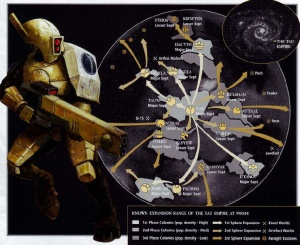
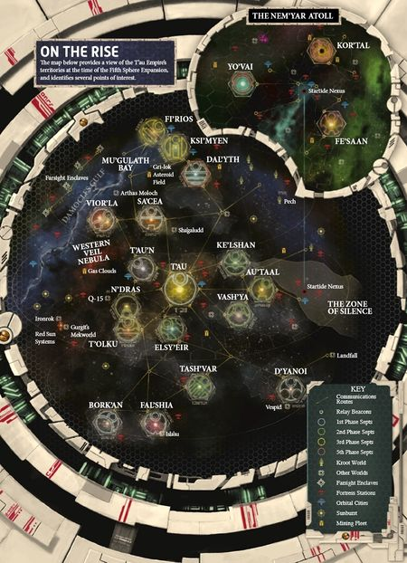
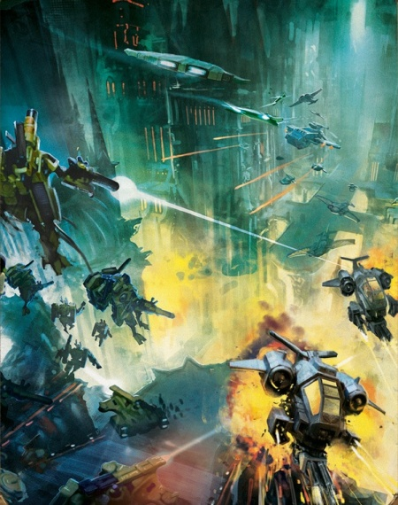
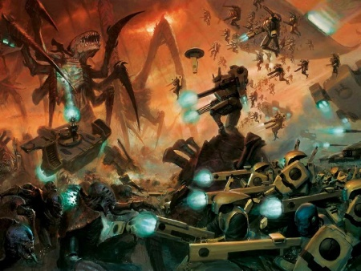
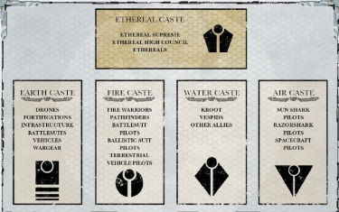
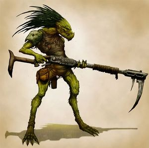
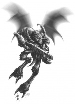
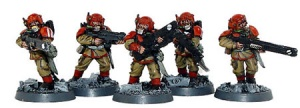
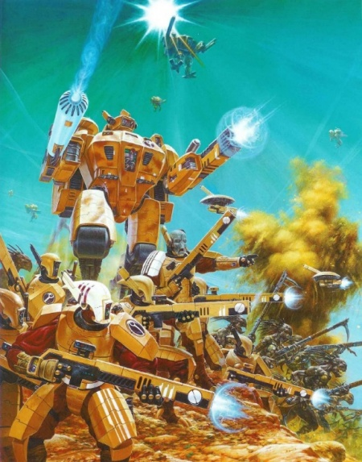

# 0582 钛帝国 T'au Empire

精校状态：中文行文已逐段精校，部分术语仍为暂定

分类：概念 / 异型 Xenos / 钛帝国 T'au Empire

原文来源：https://www.bilibili.com/opus/1140953019939028993

原作者：帝国神选罐头

原文时间：编辑于 2025年12月30日 08:24

[返回分类目录](目录.md) · [全书目录](../../目录.md)

<!-- A0582-B0001 -->
**英文原文**

"Let none doubt that the Tau Empire will bring unity to all – let none doubt that now is our time. Forward, for the Greater Good!"— Aun'Va, Master of the Undying Spirit

<!-- /A0582-B0001 -->

<!-- A0582-B0002 -->

原译文

“毫无疑问，钛帝国将为所有人带来团结 - 毫无疑问，现在是我们的时代。前进，为了上上善道！”— 铵'瓦，不朽精神大师

**校订译文**

“毋庸置疑，钛帝国将令万众归一；毋庸置疑，如今正是我们的时代。前进，为了上上善道！”——铵瓦，不朽精神大师

<!-- /A0582-B0002 -->

<!-- A0582-B0003 -->
**英文原文**

The T’au Empire (or Tau Empire) is a rapidly expanding xenos empire, sometimes referred to as a Commonwealth by its own citizens, situated inside of the Ultima Segmentum, near the Eastern Fringe. Founded by the Ethereals, who lead the T'au Empire in the name of the Greater Good. Several alien races (Kroot, Vespid, among others) have allied themselves with the T'au.

<!-- /A0582-B0003 -->

<!-- A0582-B0004 -->

原译文

钛帝国（或陶帝国）是一个迅速扩张的异型帝国，有时被其公民称为联邦，位于东部边缘附近的极限星域内。由以太建立，他们以上上善道的名义领导着钛帝国。几个异型种族（克鲁特、胡蜂人等）已经与钛结盟。

**校订译文**

钛帝国是位于极限星域、邻近东部边陲的迅速扩张的异形帝国。其公民有时也称之为“联邦”。帝国由以太建立，并由他们以上上善道之名领导；克鲁特、胡蜂人等多个种族已与钛族结盟。英文T’au Empire与Tau Empire只是拼写变体，指同一个政体。

**校注：** T’au/Tau为英文拼写变体，不是钛/陶两个中文政体名。

<!-- /A0582-B0004 -->

<!-- A0582-B0005 -->
**英文原文**

The T'au Empire borders the Imperium and lies within reach of the Astronomican. It has suffered many raids from the Orks, and also seems to lie in the path of several splinter fleets of Hive Fleet Kraken.

<!-- /A0582-B0005 -->

<!-- A0582-B0006 -->

原译文

钛帝国与帝国接壤，位于星炬的范围内。它遭受了欧克的多次袭击，似乎也位于虫巢舰队克拉肯的几个分裂舰队的路径上。

**校订译文**

钛帝国与人类帝国接壤，处于星炬覆盖范围内。它多次遭欧克劫掠，也似乎横在克拉肯虫巢舰队若干分裂舰队的前路上。

<!-- /A0582-B0006 -->

<!-- A0582-B0007 图片 -->

<!-- A0582-B0008 -->

原译文

Symbol of the T'au Empire 钛帝国标志

**校订译文**

Symbol of the T'au Empire 钛帝国标志

<!-- /A0582-B0008 -->

<!-- A0582-B0009 -->
**英文原文**

Capital:T'au

<!-- /A0582-B0009 -->

<!-- A0582-B0010 -->

原译文

首都：钛

**校订译文**

首都：钛星

**校注：** T’au亦为母星，与种族钛族分义；表内首都用钛星。

<!-- /A0582-B0010 -->

<!-- A0582-B0011 -->
**英文原文**

Official languages:T'au Lexicon

<!-- /A0582-B0011 -->

<!-- A0582-B0012 -->

原译文

官方语言：钛词汇

**校订译文**

官方语言：钛语

<!-- /A0582-B0012 -->

<!-- A0582-B0013 -->
**英文原文**

Major Species:T'au, Kroot, Vespid

<!-- /A0582-B0013 -->

<!-- A0582-B0014 -->

原译文

主种族：钛，克鲁特，胡蜂人

**校订译文**

主要种族：钛族、克鲁特、胡蜂人

<!-- /A0582-B0014 -->

<!-- A0582-B0015 -->
**英文原文**

Minor Species:Anthrazods, Boaburi, Brachyura, Charpactin, Demiurg, Formosians, Galgs, Greet, Hrenian, Human (Gue'vesa), Jagordian, Ji'atrix, M'uh'ja, Nagi, Nicassar, Phosiab, Pohu-Agg, Ranghon, Tarellian, Vorgh, Yabi-Yabi

<!-- /A0582-B0015 -->

<!-- A0582-B0016 -->

原译文

次种族：安斯拉佐德，博阿布瑞，布拉基乌拉，查尔帕辛，德穆革，弗尔莫西亚，高尔格，格利特，赫雷尼安，人类（古'维萨），雅戈尔迪安，基'阿特里克斯，牧'胡'加，纳基，尼卡萨，弗西亚布，波胡-阿戈，朗宏，塔里安，沃格，亚比-亚比

**校订译文**

其他种族或群体：安斯拉佐德、博阿布瑞、布拉基乌拉、查尔帕辛、德穆革、弗尔莫西亚、高尔格、格利特、赫雷尼安、人类（古维萨）、雅戈尔迪安、基’阿特里克斯、牧’胡’加、纳基、尼卡萨、弗西亚布、波胡—阿戈、朗宏、塔里利安、沃格、亚比—亚比

<!-- /A0582-B0016 -->

<!-- A0582-B0017 -->
**英文原文**

Type of Government:Ethereal-dominated Oligarchy

<!-- /A0582-B0017 -->

<!-- A0582-B0018 -->

原译文

政府类型：以太统御寡头政体

**校订译文**

政体：由以太主导的寡头政体

<!-- /A0582-B0018 -->

<!-- A0582-B0019 -->
**英文原文**

Head of State:Ethereal Supreme(Currently Aun'va)

<!-- /A0582-B0019 -->

<!-- A0582-B0020 -->

原译文

国家首脑：至高以太（现为铵'瓦）

**校订译文**

国家首脑：至高以太（本条资料记为铵瓦）

**校注：** “目前铵瓦”为底稿的资料时点，不作本稿2026年更新的现任断言。

<!-- /A0582-B0020 -->

<!-- A0582-B0021 -->
**英文原文**

Governing body:Ethereal Council

<!-- /A0582-B0021 -->

<!-- A0582-B0022 -->

原译文

理事机构：以太议会

**校订译文**

统治机构：以太议会

<!-- /A0582-B0022 -->

<!-- A0582-B0023 -->
**英文原文**

State religion(s):Greater Good (Tau'va)

<!-- /A0582-B0023 -->

<!-- A0582-B0024 -->

原译文

国教：上上善道（钛'瓦）

**校订译文**

国家信条：上上善道（Tau’va）

**校注：** 原表religion与后文哲学理念并置，采用中性国家信条，保留原表英文便于判断。

<!-- /A0582-B0024 -->

<!-- A0582-B0025 -->
**英文原文**

Military Forces:Fire Warriors (Fire Caste), Kor'vattra (T'au Navy, Air Caste), T'au Merchant Fleet (Air Caste), T'au Auxiliaries

<!-- /A0582-B0025 -->

<!-- A0582-B0026 -->

原译文

军事部队：火战士（火氏族）、科'瓦特拉（钛海军、气氏族）、钛商船队（气氏族）和钛辅助军

**校订译文**

军事力量：火战士（火氏族）、科’瓦特拉（钛海军，气氏族）、钛商船队（气氏族）、钛辅助军

<!-- /A0582-B0026 -->

<!-- A0582-B0027 -->
**英文原文**

Internal Security Forces:Information Awareness

<!-- /A0582-B0027 -->

<!-- A0582-B0028 -->

原译文

内部安全部队：信息意识

**校订译文**

内部安全机构：信息监察机构（Information Awareness，暂定译名）

**校注：** Information Awareness为内安机构名称，原信息意识字面误导；暂定信息监察机构，保留英文待专篇核对。

<!-- /A0582-B0028 -->

<!-- A0582-B0029 -->
## History 历史

<!-- /A0582-B0029 -->

<!-- A0582-B0030 -->
### Founding 建立

<!-- /A0582-B0030 -->

<!-- A0582-B0031 -->
**英文原文**

In T'au prehistory, they lived in tribes on the desert plains, hunting and gathering their food. As their race aged, they expanded to all environments of their home world, T'au, adapting to each new environment. The T'au of the plains became strong and skilful hunters, larger and stronger than most other T'au. The T'au of the mountains developed the ability to soar high above the baking deserts on thermals. The T'au of the river valleys developed agriculture and metallurgy, forming the first true settlements. The development of settlements led to the need of trade, and wandering T'au began to negotiate and mediate between the disparate tribes. During the 35th Millennium, an Adeptus Mechanicus Explorator fleet Land's Vision, discovered the T'au homeworld and determined that its population were a primitive people at the Stone Age level of development who had mastered the use of primitive weapons and fire. Before the planet could be cleansed and colonised by the Imperium, however, a violent Warp Storm erupted around the planet. This continued for 6,000 years, making the T'au's homeworld utterly inaccessible.

<!-- /A0582-B0031 -->

<!-- A0582-B0032 -->

原译文

在钛的史前时期，他们以部落的形式生活在沙漠平原上，狩猎和采集食物。随着他们种族的成熟，他们扩展到他们家园世界钛的所有环境，适应每一个新的环境。平原上的钛成为了强壮而熟练的猎人，比其他大多数钛都要高大强壮。山区的钛发展出了在热气流中翱翔于灼热沙漠之上的能力。河谷的钛发展了农业和冶金业，形成了第一个真正的定居点。定居点的发展导致了贸易的需要，流浪的钛开始在不同的部落之间进行谈判和调解。在第35个千年期间，一支名为兰德之视的机械神教探索者舰队发现了钛家园世界，并确定其人口是石器时代发展水平的原始人，掌握了原始武器和火的使用。然而，在帝国对行星进行清理和殖民之前，一场猛烈的亚空间风暴在行星周围爆发。这种情况持续了6000年，使钛的家园世界完全无法进入。

**校订译文**

史前钛族以部落为单位，生活在沙漠平原，靠狩猎采集为生。种族发展后，他们逐步扩散至母星钛星的各类环境，并产生适应性变化。平原居民成为强壮、善猎的战士，比其他钛族更高大；山地居民学会借热气流滑翔于炽热沙漠上空；河谷居民发展农业和冶金，建立最早的真正聚落。定居生活催生贸易，四处游走者便在不同部落间谈判、调解。第35千年，机械修会的“兰德之视”探索舰队发现钛星，判定居民仍处于石器时代，只掌握原始武器和火。帝国尚未来得及清剿、殖民，猛烈的亚空间风暴便包围该星，持续六千年，使外界无法进入。

<!-- /A0582-B0032 -->

<!-- A0582-B0033 图片 -->

<!-- A0582-B0034 -->

原译文

T'au Planets 钛行星

**校订译文**

T'au Planets 钛行星

<!-- /A0582-B0034 -->

<!-- A0582-B0035 -->
**英文原文**

T'au technological advancement proceeded at an unusually rapid rate for a newly emergent race. The T'au of the river valleys developed the first fortresses and crude black powder weapons to ward off the aggressive T'au of the plains. During this time inter-tribal conflict escalated. These fledgling skirmishes led to the darkest period in T'au history, the Mont'au, during the end of the 37th Millennium. The numerous wars that broke out lasted for years. Each year, thousands died, squalid conditions and lack of access to fresh food and water creating a plague that killed more T'au than the fighting itself. The T'au were on the verge of wiping themselves out.

<!-- /A0582-B0035 -->

<!-- A0582-B0036 -->

原译文

对于一个新兴的种族来说，钛的技术进步速度异常之快。河谷的钛发展了第一座堡垒和粗制的黑火药武器，以抵御平原的钛的侵略。在此期间，部落间冲突升级。这些初出茅庐的小规模冲突导致了第37个千年末期，钛历史上最黑暗的时期 — 蒙特'奥。爆发的无数战争持续了数年。每年都有数千人死亡，肮脏的环境以及缺乏新鲜食物和水，造成了一场瘟疫，造成的死亡人数超过了战斗本身。他们几乎要灭绝了。

**校订译文**

对一个新兴种族而言，钛族技术进步快得惊人。河谷居民筑起最早的堡垒，制造粗陋火药武器，抵御好战的平原部落。部落冲突愈演愈烈，到第37千年末，最初的小规模交锋终于酿成历史上最黑暗的“蒙特’奥”时期。战乱经年不息，每年夺走数千条生命；污秽的环境和食物、清水短缺，又催生瘟疫，死者甚至多于战火。整个种族濒临自我毁灭。

<!-- /A0582-B0036 -->

<!-- A0582-B0037 -->
**英文原文**

During this time, T'au legends tell of the first appearance of Ethereals at Fio'taun. The T'au builder fortress city of Fio'taun was under siege by an alliance of warriors from the plains and air T'au. Though negotiation had been attempted, the fierce plain warriors would settle for nothing less than the annihilation of Fio'taun. For five long years the inhabitants held off the savage assaults with their thick walls and plentiful cannon. However, disease and starvation began to take their toll. As the tide of the siege turned, two mysterious T'au appeared. One made his way into the camp of the plains T'au, exuding a quiet authority that no T'au was able to resist. Soon, the leader of the plain warriors was persuaded to parlay with the T'au of Fio'taun. Similarly, the other mysterious T'au made his way deep into the fortress. Within a few short hours, the gates stood wide open, and the T'au stood ready to talk.

<!-- /A0582-B0037 -->

<!-- A0582-B0038 -->

原译文

在这段时间里，钛的传说讲述了以太首次出现在菲·托恩。当时，一个由来自平原和空中的钛战士组成的联盟围攻了钛的堡垒城市菲·托恩。虽然已经尝试过谈判，但凶猛的平原战士们只会满足于消灭菲·托恩。在长达五年的时间里，居民们用厚厚的城墙和充足的大炮抵御了野蛮的进攻。然而，疾病和饥饿开始造成损失。随着围攻的浪潮转向，两个神秘的钛出现了。其中一人进入了平原钛的营地，散发出一种钛无法抗拒的宁静权威。不久，平原战士的领袖被说服与菲·托恩的钛谈判。同样，另一位神秘的钛也深入了要塞。不到几个小时，大门就敞开了，钛已经准备好对话了。

**校订译文**

传说，以太就在这一时期首次现身菲·托恩。这座建筑者的堡垒城市被平原战士与空中钛族联军围困；虽曾尝试谈判，平原部落却一心要将其毁灭。居民凭厚墙重炮苦守五年，但饥馑与疾病开始造成损失。围城形势逆转之际，两名神秘钛族出现：一人走进平原营地，带着无可抗拒的沉静威严，说服首领与城内居民会谈；另一人同样深入堡垒。短短数小时，大门敞开，双方准备对话。

**校注：** 复查英文细节与数量，补明对象、地点或程度，避免精简中文时削弱原意。

<!-- /A0582-B0038 -->

<!-- A0582-B0039 -->
**英文原文**

The Ethereals spoke of the importance of peace and understanding between all T'au. They described a Greater Good that each T'au must strive towards. The besiegers and the besieged quickly agreed with the Ethereals and a truce was reached. Across T'au, Ethereals emerged, each with the same quiet authority and message of harmony and cooperation. With the T'au united, the T'au Empire was founded.

<!-- /A0582-B0039 -->

<!-- A0582-B0040 -->

原译文

以太谈到了所有钛之间和平与理解的重要性。他们描述了每个钛必须努力实现的上上善道。围攻者和被围困者很快同意了以太的意见，并达成了停战协议。在整个钛，以太出现了，每个以太都有同样宁静的权威和和谐与合作的信息。随着钛的统一，钛帝国建立了。

**校订译文**

以太阐明钛族之间和平、相互理解的重要，提出每个人都应为之努力的“上上善道”。攻守双方很快接受，达成停战。钛星各地都陆续出现以太，带着同样沉静的权威，倡导和谐与合作。钛族由此统一，钛帝国随之建立。

<!-- /A0582-B0040 -->

<!-- A0582-B0041 -->
### Expansion and conflict 扩张与冲突

<!-- /A0582-B0041 -->

<!-- A0582-B0042 -->
**英文原文**

Over the next thousand years the T'au Empire experienced an unprecedented period of scientific discovery and philosophical advancement. The T'au Empire continued to expand its border at a fast rate through a series of Expansion Phases known to the T'au as "Spheres". These phases are a period of several T'au military campaigns during which nearby worlds are colonised, conquered, or sometimes peacefully persuaded to join the Greater Good. Therefore, apart from the star systems of the T'au, which are called Septs, the empire also incorporated worlds and star systems belonging to the Kroot, Vespid, and the Nicassar, who were the first race to join the empire and survive (as plague wiped out the Poctroon). The Demiurg, a Prospect of the Leagues of Votann, have also joined with the T'au and shared with them the secrets of Ion technology. The empire is composed of over twenty fully developed septs and around one hundred settled worlds, but the exact number and most of their names are unknown.

<!-- /A0582-B0042 -->

<!-- A0582-B0043 -->

原译文

在接下来的一千年里，钛帝国经历了前所未有的科学发现和哲学进步时期。钛帝国通过一系列被称为“界”的扩张阶段，继续快速扩张其边界。这些阶段是一个时期的几次军事战役期间，附近的世界被殖民，征服，或有时和平说服加入上上善道。因此，除了被称为家门的钛星系外，帝国还纳入了属于克鲁特、胡蜂人和尼卡萨的世界和星系，他们是第一个加入帝国并幸存下来的种族（因为瘟疫消灭了珀克纯）。作为沃坦联盟的一员，德穆革也加入了钛，并与他们分享了离子技术的秘密。这个帝国由20多个完全发展的家门和大约100个定居的世界组成，但确切的数字和他们的大部分名字都是未知的。

**校订译文**

此后一千年，帝国进入科学与哲学空前发展的时期，并以接连的“扩张界”迅速开疆。每一界都包含多次军事行动，以殖民、征服，或和平劝说的方式，让邻近世界加入上上善道。因此，除了称为“家门”的钛族星系，帝国还包含克鲁特、胡蜂人和尼卡萨的领地。最早加入的珀克纯已死于瘟疫，尼卡萨则是最早成功融入并延续下来的外族。德穆革实际上是沃坦联盟的一支开拓团，也与钛族联合，分享离子技术。原文所述的帝国已有二十多个成熟家门、约一百个定居世界，但具体数量与多数名称不详。

**校注：** Prospect在沃坦组织语境为开拓团而非前景；20多个家门/100世界系本条原文数值，保留资料时点。

<!-- /A0582-B0043 -->

<!-- A0582-B0044 图片 -->

<!-- A0582-B0045 -->

原译文

Map of the current borders of the T'au Empire 钛帝国当前边界地图

**校订译文**

Map of the current borders of the T'au Empire 钛帝国当前边界地图

<!-- /A0582-B0045 -->

<!-- A0582-B0046 -->
**英文原文**

When the T'au encounter a new alien species, the Ethereals direct each of the Castes to perform a designated role to bring them into the fold. The world is first scanned by the Air Caste and those classified as desirable are investigated further; if a sentient alien race is discovered the Water Caste sends ambassadors to make trade deals, defense pacts, and offer advanced technologies built for them by the Earth Caste. The empire is patient and this process of negotiation may last months, years or even decades. However, should all these efforts fail to persuade the planet to join with them in the Greater Good, it will fall to the Fire Caste to forcibly absorb the world into the T'au Empire. Only the stubborn and warlike Orks have been denied the offer to join the Greater Good, for the T'au abandoned their futile attempts to absorb the Orks after many battles convinced the Ethereals that bargaining with them was impossible.

<!-- /A0582-B0046 -->

<!-- A0582-B0047 -->

原译文

当钛遇到一个新的异型物种时，以太会指示每个氏族执行指定的角色，将他们带进同志。世界首先被气氏族扫描，那些被归类为可取的会被进一步调查；如果发现一个有感知的异型种族，水氏族会派遣大使达成贸易协议、国防协议，并提供地氏族为他们先进技术的建造。帝国是有耐心的，这个谈判过程可能会持续几个月、几年甚至几十年。然而，如果所有这些努力都不能说服行星与他们共同追求上上善道，那么将由火氏族强行将世界吸收到钛帝国。只有顽固和好战的欧克拒绝了加入上上善道的提议，因为在多次战斗使以太相信与他们商讨是不可能的之后，钛放弃了吸收欧克的徒劳尝试。

**校订译文**

遇见新异族时，以太为各氏族分派职责，设法将其纳入帝国。气氏族先扫描行星，对合意的目标深入调查；若发现智慧种族，水氏族便派大使洽谈贸易和共同防御协议，并提供由地氏族制造的先进技术。钛帝国有足够耐心，这一过程可能持续数月、数年乃至数十年。若一切努力仍无法说服对方接受上上善道，便轮到火氏族以武力吞并。好战顽固的欧克是例外：多次战斗令以太确信无法与其谈判，遂放弃招纳，不再提出邀请。

**校注：** have been denied the offer是钛族不再邀请欧克，原译欧克拒绝邀请颠倒施受关系。

<!-- /A0582-B0047 -->

<!-- A0582-B0048 -->
**英文原文**

The T'au made first contact with Humanity shortly after the Second Sphere of Expansion in the form of free captains, pirates and lost colonies. They had regressed so far that they knew not of the outside galaxy. These planets were eventually peacefully assimilated or forcibly subdued, but it took the Water Caste time to realise that these worlds were just the outer fringes of an unimaginably vast interstellar empire, the Imperium of Man. However, thanks to the wisdom of Aun'va, the Fire Caste calls for war with mankind were averted and the T'au embarked on a subtle campaign of trade and diplomacy with Planetary Governors to absorb further human worlds. The Imperium's response to these activities was slow, but when it did come, it was characteristically brutal and the first wars between the Imperium and T'au Empire began.

<!-- /A0582-B0048 -->

<!-- A0582-B0049 -->

原译文

在第二界扩张后不久，钛以自由船长、海盗和失落的殖民地的形式与人类首次接触。他们退化的如此远，以至于他们不知道外面的星系。这些行星最终被和平同化或被强行征服，但水氏族花了一段时间才意识到这些世界只是一个难以想象的巨大星际帝国 — 人类帝国的外围。然而，由于铵'瓦的智慧，火氏族呼吁与人类开战的呼声得以避免，钛开始与行星总督进行微妙的贸易和外交活动，以吸收更多的人类世界。帝国对这些行动的反应很慢，但当它真的到来时，它是典型的残酷，帝国和钛帝国之间的第一次战争开始了。

**校订译文**

第二界扩张后不久，钛族首次遇到人类，接触对象包括独立船长、海盗和失落殖民地。那些殖民地衰退太久，对外部银河已一无所知，最终或和平归附，或被武力征服。水氏族过了一段时间才意识到，这些世界只是一座难以想象的庞大星际政体——人类帝国——的外围。铵瓦压下火氏族全面开战的呼声，改以贸易、外交接近行星总督，逐步吸纳更多人类世界。帝国反应迟缓，却一如既往地残酷；两国最早的战争由此爆发。

<!-- /A0582-B0049 -->

<!-- A0582-B0050 -->
**英文原文**

Through the expertise of the T'au's Earth Caste, lifeless and toxic rocks have been transformed into thriving colonies and even artificial planets, orbital docks and relay stations light the empty space between the stars.

<!-- /A0582-B0050 -->

<!-- A0582-B0051 -->

原译文

通过钛的地氏族的专业知识，没有生命和有毒的岩石已经变成了繁荣的殖民地，甚至是人造行星，轨道码头和中继站照亮了群星之间的空白空间。

**校订译文**

地氏族以精湛技术，把死寂、有毒的岩石星球改造为繁荣殖民地，甚至建造人造行星。轨道船坞和中继站的灯火，点亮了恒星之间的空旷太空。

<!-- /A0582-B0051 -->

<!-- A0582-B0052 -->
### Damocles Crusade 达摩克利斯远征

<!-- /A0582-B0052 -->

<!-- A0582-B0053 -->
**英文原文**

The Damocles Crusade was the first major military conflict fought between the Imperium of Man and the T'au Empire. Members of the T'au Water Caste had established trade agreements with Imperial worlds on the frontier of the Empire, near the Damocles Gulf region of the Ultima Segmentum, and exchanges of goods and technology were common. Alarmed by the threat of alien contamination, the Administratum readied a suitable response and almost a century later, the Damocles Crusade invaded T'au space, destroying several outlying settlements and pushing deep into the T'au Empire. When the Imperial fleet reached the T'au Sept world of Dal'yth; however, the Crusade ground to a bloody stalemate as the formidable numbers and high technology of the T'au and their Kroot allies thwarted every attempt to capture the world or its star system. Many months of terrible fighting ensued with nothing gained on either side. By late 742.M41 the Crusade's commanders eventually agreed to requests from the T'au Water Caste for peace talks. The negotiations were successful and the Imperial fleet withdrew from T'au space unmolested, primarily due to the impending approach of the Tyranid Hive Fleet Behemoth.

<!-- /A0582-B0053 -->

<!-- A0582-B0054 -->

原译文

达摩克利斯远征是人类帝国和钛帝国之间的第一次重大军事冲突。钛水氏族的成员与帝国边境的帝国世界建立了贸易协定，靠近极限星域的达摩克利斯湾地区，货物和技术交流很常见。由于受到异型污染的威胁，内务部准备了适当的应对措施，近一个世纪后，达摩克利斯远征入侵了钛空域，摧毁了几个偏远的定居点，并深入到了钛帝国。当帝国舰队到达'利斯钛家门世界时；然而，远征陷入了血腥的僵局，因为钛及其克鲁特盟友的巨大数量和高科技挫败了夺取世界或其星系的每一次尝试。几个月的可怕战斗接踵而至，双方都一无所获。到742.M41底，远征的指挥官最终同意了钛水氏族的和平谈判请求。谈判取得了成功，帝国舰队不受干扰地从钛空域撤出，主要是因为泰伦虫巢舰队贝希摩斯即将接近。

**校订译文**

达摩克利斯远征是双方首次重大军事冲突。水氏族与极限星域达摩克利斯湾附近的帝国边境世界签订贸易协议，货物与技术往来日益频繁。内务部担忧异形影响扩散，着手筹划反制；近一个世纪后，远征军侵入钛族空间，摧毁外围聚落，深入帝国内部。然而，舰队抵达达利斯家门世界后便陷入血腥僵局：钛族及克鲁特盟军兵多、技术先进，屡次挫败夺取行星与星系的尝试。苦战数月，双方均无进展。742.M41末，远征指挥官终于接受水氏族的和谈请求；谈判成功，帝国舰队得以不受攻击地撤离。贝希摩斯虫巢舰队逼近，是促成撤军的主要原因。

**校注：** Dal’yth原译“'利斯”缺首音，暂定达利斯；the Empire这里多指钛帝国，中文明确区分两国。

<!-- /A0582-B0054 -->

<!-- A0582-B0055 图片 -->

<!-- A0582-B0056 -->

原译文

T'au and Space Marine forces battle in the Damocles Crusade 钛和星际战士在达摩克利斯远征中作战

**校订译文**

T'au and Space Marine forces battle in the Damocles Crusade 钛和星际战士在达摩克利斯远征中作战

<!-- /A0582-B0056 -->

<!-- A0582-B0057 -->
**英文原文**

A known splinter faction of the T'au Empire are the Farsight Enclaves. Also, more recently some worlds and star systems of the Imperium have been conquered by the T'au forces, while a handful have seceded and pledged their allegiance to the T'au empire.

<!-- /A0582-B0057 -->

<!-- A0582-B0058 -->

原译文

一个已知的分裂派系是远见飞地。此外，最近帝国的一些世界和星系被钛部队征服，而少数人则脱离并宣誓效忠钛帝国。

**校订译文**

远见飞地是从钛帝国分裂出的已知政体。此外，人类帝国近来还有一些世界、星系被钛军征服，另一些则自行脱离、宣誓效忠钛帝国。

<!-- /A0582-B0058 -->

<!-- A0582-B0059 -->
### Farsight Expedition 远见远征

<!-- /A0582-B0059 -->

<!-- A0582-B0060 -->
**英文原文**

The Farsight Expedition was launched shortly after the Damocles Crusade. Under the command of Farsight, the T'au forces engaged Orks along an asteroid belt before Farsight mysteriously vanished with his Fire Warriors. After the campaign, Farsight eventually continued his advance despite orders, encountering an unknown enemy at Arthas Moloch and thereafter establishing the Farsight Enclaves.

<!-- /A0582-B0060 -->

<!-- A0582-B0061 -->

原译文

远见远征是在达摩克利斯远征后不久发动的。在远见的指挥下，钛部队沿着小行星带与欧克交战，远见和他的火战士神秘地消失了。战役结束后，远见最终不顾命令继续前进，在阿尔萨斯·摩洛克遇到了一种未知的敌人，随后建立了远见飞地。

**校订译文**

达摩克利斯远征后不久，远见远征开始。远见率钛军沿小行星带与欧克交战，随后与麾下火战士神秘失联。战役之后，他不顾命令继续前进，在阿尔萨斯·摩洛克遭遇不明敌人，最终建立远见飞地。

<!-- /A0582-B0061 -->

<!-- A0582-B0062 -->
### Hive Fleet Gorgon 虫巢舰队戈尔贡

<!-- /A0582-B0062 -->

<!-- A0582-B0063 -->
**英文原文**

The T'au Empire was invaded by Hive Fleet Gorgon in 899.M41. Gorgon was exceptional for its ability to quickly adapt on a biological level to new circumstances of battle, such as evolving immunities to T'au weaponry. This rapid pace of adaptation may have been unique to Gorgon, or it may have been a response to conflict with the T'au, who are also highly adaptable but on a technological level. The combined forces of the T'au and the Imperial Guard destroyed Gorgon in 903.M41, albeit after losing several trading partners and colony worlds.

<!-- /A0582-B0063 -->

<!-- A0582-B0064 -->

原译文

899.M41，钛帝国被虫巢舰队戈尔贡入侵。戈尔贡因其在生物层面上迅速适应新的战斗环境的能力而与众不同，例如对钛武器的免疫力不断增强。这种快速的适应速度可能是戈尔贡独有的，也可能是对与钛冲突的回应，钛在技术层面上也有很强的适应能力。尽管失去了几个贸易伙伴和殖民地，但钛和帝国卫队的联合部队在903.M41摧毁了戈尔贡。

**校订译文**

899.M41，戈尔贡虫巢舰队入侵。它能迅速从生物层面适应战局，例如进化出对钛武器的抵抗力。如此快的适应或许是戈尔贡独有的能力，也可能是与同样善于调整技术的钛族交战所促成。钛族付出失去多个贸易伙伴和殖民世界的代价，最终于903.M41与帝国卫队联合摧毁戈尔贡。

<!-- /A0582-B0064 -->

<!-- A0582-B0065 图片 -->

<!-- A0582-B0066 -->

原译文

Hive Fleet Gorgon battles the T'au 虫巢舰队戈尔贡与钛作战

**校订译文**

Hive Fleet Gorgon battles the T'au 虫巢舰队戈尔贡与钛作战

<!-- /A0582-B0066 -->

<!-- A0582-B0067 -->
### Great War of Confederation 联邦大战

<!-- /A0582-B0067 -->

<!-- A0582-B0068 -->
**英文原文**

The Great War of Confederation began after the Farsight Expedition in 975.M41 and was a war of survival for the T'au. Faced with an enormous Ork invasion fleet, only the leadership of Aun'va and Commander Shadowsun led to T'au victory, paving way for the Third Sphere of Expansion.

<!-- /A0582-B0068 -->

<!-- A0582-B0069 -->

原译文

第一次联邦战争始于975.M41的远见远征之后，是一场关乎钛生存的战争。面对庞大的欧克入侵舰队，只有铵'瓦和影阳指挥官的领导带领钛取得了胜利，为第三界扩张铺平了道路。

**校订译文**

联邦大战发生于远见远征之后，在975.M41爆发，是一场关乎钛族存亡的战争。面对庞大的欧克舰队，铵瓦与影阳指挥官的领导使钛族取胜，也为第三界扩张铺平道路。

**校注：** Great War不是First War，原第一次联邦战争误加序号，改联邦大战。

<!-- /A0582-B0069 -->

<!-- A0582-B0070 -->
### Further Expansion 后续扩张

<!-- /A0582-B0070 -->

<!-- A0582-B0071 -->
**英文原文**

Beginning after the Empire had united against the Orks in the Great War of Confederation, in 997.M41 Aun'va declared a beginning to the Third Sphere of Expansion, which drove deep into Imperial territory and saw the Imperium crushed at the Battle of Mu'gulath Bay.

<!-- /A0582-B0071 -->

<!-- A0582-B0072 -->

原译文

从帝国在第一次联邦战争中联合起来对抗欧克之后开始，997.M41，铵'瓦宣布开始第三界扩张，这一扩张深入帝国领土，并在穆古拉湾之战中粉碎了帝国。

**校订译文**

联邦大战中，钛帝国团结抗击欧克。之后，铵瓦于997.M41宣布第三界扩张开始。攻势深入人类帝国疆域，最终在穆古拉湾之战重创帝国军队。

**校注：** 粉碎的是战役中的帝国军队，不是整个人类帝国灭亡。

<!-- /A0582-B0072 -->

<!-- A0582-B0073 -->
**英文原文**

At some point, the T'au sent an expeditionary force to the planet Malbede where they came into conflict with the Ultramarines Chapter in 936.M41. However, the world proved to be cursed when their fighting awakened the sleeping Necrons from their tomb beneath the surface. In an effort to combat this threat, the T'au and the Ultramarines combined forces to defeat the Necrons. Once the conflict was over, the T'au were allowed to evacuate their forces by Marneus Calgar who proceeded to destroy Malbede through an Exterminatus.

<!-- /A0582-B0073 -->

<!-- A0582-B0074 -->

原译文

在某个时刻，钛派了一支远征部队前往马尔贝德行星，在那里他们于936.M41与极限战士战团发生了冲突。然而，当他们的战斗将沉睡的死灵从地表下的墓穴中唤醒时，世界被证明是被诅咒的。为了对抗这一威胁，钛和极限战士联合起来击败了死灵。冲突结束后，马涅乌斯·卡尔加允许钛撤离部队，并通过灭绝令摧毁了马尔贝德。

**校订译文**

936.M41，钛族派往马尔贝德的远征军与极限战士交战，却惊醒了地底墓穴中的太空死灵。为对抗这一威胁，双方联手击败死灵。战斗结束后，马涅乌斯·卡尔加准许钛军撤走，随后对该星执行灭绝令。

<!-- /A0582-B0074 -->

<!-- A0582-B0075 -->
**英文原文**

In 666.M41, the T'au fought against the Adeptus Astartes of the Space Wolves Chapter during the Battle of Kvarium Alpha. On that waterlogged world, drop pods landed deep in the oceans where their occupants made a move to engage their enemy. On the surface, the battle was fought between the two sides with an equally deadly conflict erupting in the depths of the sea between the Space Wolves and T'au Battlesuits. Thunderhawk Gunships were used to great effect against Hammerhead tanks and Manta gunships with torpedoes, prop-bombs and missiles being used against the T'au. Ultimately, the Space Wolves proved to be the victor in the conflict where hundreds of T'au and Space Wolf corpses floated to the surface. With their mission complete, the Space Wolves made the long trek back to land across the sea bed.

<!-- /A0582-B0075 -->

<!-- A0582-B0076 -->

原译文

666.M41，在克瓦里姆·阿尔法之战中，钛与阿斯塔特修会的太空野狼战团作战。在那个被水淹没的世界里，空投舱降落在深海中，舱内人员在那里采取行动与敌人交战。从表面上看，这场战斗是双方之间的战斗，太空野狼和钛战斗服之间在深海爆发了同样致命的冲突。雷鹰炮艇对锤头鲨坦克和曼塔炮艇产生了巨大的影响，鱼雷、支柱炸弹和导弹被用来对付钛。最终，太空野狼被证明是这场冲突的胜利者，数百具钛和太空野狼的尸体浮出水面。随着任务的完成，太空野狼从海底长途跋涉回到陆地。

**校订译文**

666.M41，钛族在克瓦里姆·阿尔法之战中迎战太空野狼。在这个遍布海水的世界，空降舱落入深海，战士出舱迎敌。双方不仅在海面交战，太空野狼与钛战斗服还在海底展开同样惨烈的厮杀。雷鹰炮艇有效攻击锤头鲨炮艇和蝠鲼登陆舰，向钛军发射鱼雷、自航炸弹及导弹。最终，太空野狼获胜，数百具双方阵亡者的尸体浮上海面。完成任务后，他们沿海床长途跋涉，回到陆地。

**校注：** On the surface指海面，非从表面上看；prop-bombs暂按螺旋桨推进的自航炸弹，非支柱炸弹，技术型号仍待核。Manta官译蝠鲼登陆舰。

<!-- /A0582-B0076 -->

<!-- A0582-B0077 -->
**英文原文**

By late M41, the Third Sphere had ground to a halt due to Imperial counterattacks in the Damocles Gulf. Thus the T'au launched additional Expansion campaigns, including the ill-fated Fourth Sphere, which resulted in a wormhole known as the Startide Nexus. This unforeseen consequence has since allowed for the current Fifth Sphere. Despite the Fifth Sphere still being underway, a Sixth Sphere is still being planned in part due to the significant fighting the Fifth has experienced in the Startide Nexus and Zone of Silence.

<!-- /A0582-B0077 -->

<!-- A0582-B0078 -->

原译文

到M41晚期，由于帝国在达摩克利斯湾的反击，第三界已经陷入停顿。因此，钛发动了额外的扩张战役，包括命运多舛的第四界，这导致了一个被称为星潮枢纽的虫洞。这一不可预见的后果使得目前的第五界得以存在。尽管第五界仍在进行中，但第六界已计划中，部分原因是第五界在星潮枢纽和寂静区经历了激烈的战斗。

**校订译文**

第41千年末，帝国在达摩克利斯湾的反击使第三界扩张停滞。钛族遂继续发动扩张，其中命运多舛的第四界意外造成“星潮枢纽”虫洞，反过来为第五界提供了通道。第五界仍在进行，第六界便已开始筹划，部分原因是前者在星潮枢纽和寂静区遭遇激烈抵抗。

<!-- /A0582-B0078 -->

<!-- A0582-B0079 -->
## Society 社会

<!-- /A0582-B0079 -->

<!-- A0582-B0080 -->
**英文原文**

Each race within the T'au Empire has a unique and different society. However, all races have one common belief in the Greater Good. The Greater Good, or Tau'va (Tau), is the founding principle of T'au society. The Tau'va system is based on Castes and is designed to allow for the advancement of the entire T'au society together towards a more successful, prosperous and easier existence in the future.

<!-- /A0582-B0080 -->

<!-- A0582-B0081 -->

原译文

钛帝国的每个种族都有一个独特而不同的社会。然而，所有种族都有一个共同的信仰，即上上善道。上上善道，或钛'瓦（钛），是钛社会的建立原则。钛'瓦体系以氏族为基础，旨在使整个钛社会共同进步，在未来走向更成功、更繁荣、更轻松的生活。

**校订译文**

帝国内各族保有不同社会，但都共享上上善道这一信念。其钛语称谓为Tau’va，是钛族社会的根本原则。制度以世袭的种姓分工为基础——本稿沿原译称“氏族”——旨在使整个社会共同进步，迈向更成功、繁荣、安定的未来。

**校注：** Caste为世袭种姓制度，与普通氏族Clan不同；为沿稿一致保留氏族称法并说明。

<!-- /A0582-B0081 -->

<!-- A0582-B0082 图片 -->

<!-- A0582-B0083 -->

原译文

Structure of the T'au Empire 钛帝国的结构

**校订译文**

Structure of the T'au Empire 钛帝国的结构

<!-- /A0582-B0083 -->

<!-- A0582-B0084 -->
### T’au 钛族

原题：T'au 钛

<!-- /A0582-B0084 -->

<!-- A0582-B0085 -->
**英文原文**

T'au society is centred around the concept of the Greater Good, where individual T'au sacrifice personal gain in favour of benefiting the T'au race as a whole. It is from this philosophy that the T'au's all-purpose motto, "For the Greater Good!", is derived. The castes, although different in role and organisation, work together for the benefit of all T'au: the Earth caste provide and produce, the Water caste communicate and distribute, the Air caste connect the worlds of the T'au Empire, and the Fire caste protect. The external image of the T'au is that they are altruistic and idealistic, believing in the unification of all "for the Greater Good".

<!-- /A0582-B0085 -->

<!-- A0582-B0086 -->

原译文

钛社会以上上善道的概念为中心，在这个概念中，每个钛都牺牲个人利益，以造福整个钛种族。正是从这一哲学中衍生出了钛的通用箴言“为了上上善道！”。各氏族虽然在角色和组织上有所不同，但为了全体钛的利益而共同努力：地氏族提供和生产，水氏族交流和分配，气氏族连接钛帝国的世界，火氏族保护。钛的外在形象是利他主义和理想主义，相信一切的统一都是“为了上上善道”。

**校订译文**

钛族社会以上上善道为核心，要求个体为全族福祉舍弃私利，“为了上上善道！”的共同箴言由此而来。各氏族职责、组织虽不同，却分工合作：地氏族负责生产供给，水氏族负责沟通分配，气氏族连通帝国各世界，火氏族则保卫一切。钛族对外呈现的，是利他、理想主义的形象，相信万众应为上上善道而统一。

<!-- /A0582-B0086 -->

<!-- A0582-B0087 -->
**英文原文**

Those rare T'au that do not adhere to the tenets of the Greater Good are seen as deviants and can be condemned to a Re-Education Facility.

<!-- /A0582-B0087 -->

<!-- A0582-B0088 -->

原译文

那些罕见的不遵守上上善道教义的钛被视为异端，可能会被判入再教育场所。

**校订译文**

极少数不遵奉上上善道的钛族，被视为离经叛道者，可能被送往再教育设施。

<!-- /A0582-B0088 -->

<!-- A0582-B0089 -->
### Kroot 克鲁特

<!-- /A0582-B0089 -->

<!-- A0582-B0090 -->
**英文原文**

Kroot society is divided into tribes, known as Kindreds. Each Kindred is an extended family group of Kroot and is led by a Shaper, one Kroot with an intuitive understanding of the DNA absorption process all Kroot possess, and responsible for guiding the evolution of their Kindred. The Shaper, upon identifying a beneficial genetic trait, will instruct his Kindred to hunt and consume that animal, and then control the breeding of the Kindred to ensure that the offspring are born with the selected trait. Often, Kindreds will band together, and the Shapers will form a Council, of which the most influential Kindred's Shaper will be made leader of the group. On rare occasions, a Chief will unite a large number of Kindreds underneath him.

<!-- /A0582-B0090 -->

<!-- A0582-B0091 -->

原译文

克鲁特社会分为部落，称为亲族。每个亲族都是克鲁特的一个大家族，由一个塑形者领导，一个对克鲁特所拥有的DNA吸收过程有直观理解的克鲁特，负责指导他们的亲族进化。塑形者在识别出有益的遗传特征后，将指示他的亲族狩猎和食用该动物，然后控制亲族的繁殖，以确保后代出生时具有所选的特征。通常，亲族会联合起来，塑形者会组成一个议会，其中最有影响力的亲族的塑形者将成为该小组的领导者。在极少数情况下，酋长会将众多亲族团结在他之下。

**校订译文**

克鲁特社会由称为“亲族”的部落构成，每支都是延伸家族，由塑形者领导。塑形者能凭直觉理解克鲁特吸收DNA的过程，负责引导亲族进化：发现有益特征后，便指示族人狩猎、吃下对应动物，再调控繁育，确保后代继承所需特征。多支亲族常结盟，塑形者组成议会，由最有影响力的一支的塑形者领头。极少数情况下，酋长能将大量亲族统一在自己麾下。

<!-- /A0582-B0091 -->

<!-- A0582-B0092 图片 -->

<!-- A0582-B0093 -->

原译文

Kroot 克鲁特

**校订译文**

Kroot 克鲁特

<!-- /A0582-B0093 -->

<!-- A0582-B0094 -->
**英文原文**

Kroot dwell in warm, temperate conditions on the worlds they inhabit, and construct large tree houses from animal hides, bound together by regurgitated dead wood. Some Kindreds reside in the ruins of the hive cities. There has been no obvious industry on Pech since the coming of the Orks, but T'au Research Teams have detected strange energy emissions, emanating from a collection of hills near their base.

<!-- /A0582-B0094 -->

<!-- A0582-B0095 -->

原译文

克鲁特在他们所居住的世界里生活在温暖、温和的条件下，用动物皮建造大型树屋，用反刍的枯木捆绑在一起。一些种族居住在巢都城市的废墟中。自从欧克出现以来，佩什上就没有明显的工业，但钛研究小组发现了奇怪的能量排放，这些排放来自他们基地附近的一堆山丘。

**校订译文**

克鲁特喜居温暖、温和的环境，用兽皮搭建大型树屋，以嚼碎后吐出的枯木黏结固定。部分亲族住在巢都废墟中。欧克到来后，佩什已无明显工业活动，不过钛族研究队仍探测到基地附近几座山丘传来奇异能量。

<!-- /A0582-B0095 -->

<!-- A0582-B0096 -->
**英文原文**

The consumption of flesh is one of the key tenets of Kroot spirituality, as it is believed that the consumption of prey imparts the 'spirit' of the prey to the Kroot, which is then passed on to the Kroot's children. This is the average Kroot's understanding of their rapid evolution, with 'spirit' as a substitute for 'genetic trait'. As a part of this, the Kroot believe that when a warrior dies, his spirit should be kept safe by the Kindred. They will consider it their responsibility to consume the bodies of their dead foes, along with their own fallen and elders.

<!-- /A0582-B0096 -->

<!-- A0582-B0097 -->

原译文

食用肉类是克鲁特灵性的关键宗旨之一，因为人们认为，食用猎物会将猎物的“精神”传递给克鲁特，然后再传递给克鲁特的孩子。这是克鲁特对它们快速进化的平均理解，用“精神”代替“遗传特征”。作为其中的一部分，克鲁特认为，当一名战士死亡时，他的精神应该由善良的人来保护。他们会认为他们有责任吃掉死去的敌人的尸体，以及他们自己的牺牲者和长辈。

**校订译文**

食肉是克鲁特精神信仰的核心之一。他们认为，吃掉猎物就能取得其“灵魂”，并传给后代。这是普通克鲁特对自身快速进化的理解：用“灵魂”解释遗传特征。因此，战士死后，其灵魂也该由亲族保全；吃下敌人、阵亡同族与逝去长者的遗体，被视为应尽之责。

**校注：** Kindred为亲族，原“善良的人”误读kind；dead foes/fallen/elders均指食尸仪式。

<!-- /A0582-B0097 -->

<!-- A0582-B0098 -->
### Vespid (Mal'kor) 胡蜂人（马尔'科）

<!-- /A0582-B0098 -->

<!-- A0582-B0099 -->
**英文原文**

The Vespid warriors, called Stingwings, form tactical units referred to as Strains. Each Strain is lead by a Strain leader. Because the Vespid language is so complex (presumably because of their complex mouths) and only the Strain Leaders are given the apparatus to translate their language to their T'au allies, Vespid Strains are very close knit and a lot of reliance on Strain Leaders come from both sides.

<!-- /A0582-B0099 -->

<!-- A0582-B0100 -->

原译文

被称为刺翼的胡蜂人战士组成了被称为群系的战术单位。每个群系由群系领导者领导。由于胡蜂人语言非常复杂（可能是因为他们复杂的嘴），只有群系领袖才能将他们的语言翻译给他们的钛盟友，因此胡蜂人群系非常紧密，双方都非常依赖群系领袖。

**校订译文**

胡蜂尖翼战士组成称为“群系”的战术单位，各由一名群系领袖指挥。胡蜂语言极为复杂，可能与口器结构有关；只有领袖获配翻译设备，能与钛族盟友沟通。因此，群系内部联系紧密，双方都高度依赖这些领袖。

**校注：** 原文仅群系领袖配有翻译装置，原译漏掉关键设备。

<!-- /A0582-B0100 -->

<!-- A0582-B0101 图片 -->

<!-- A0582-B0102 -->

原译文

Vespid warrior 胡蜂人战士

**校订译文**

Vespid warrior 胡蜂人战士

<!-- /A0582-B0102 -->

<!-- A0582-B0103 -->
**英文原文**

Stingwing Strains are highly sought after in T'au Fire Warrior Cadres because of their high level of maneuverability. They are often used by T'au commanders alongside Crisis Battlesuits or used in a scouting role, backing up Pathfinders. In the T'au language they are referred to as "Mal'kor," which comes from "Mal" meaning insect and "kor" meaning air.

<!-- /A0582-B0103 -->

<!-- A0582-B0104 -->

原译文

刺翼群系因其高度的机动性而在钛火战士基核中备受追捧。它们经常被钛指挥官与危机战斗服一起使用，或用于侦察角色，为寻路者提供支援。在钛语言中，它们被称为“马尔'科”，来源于“马尔”，意思是昆虫，“科”意思是空气。

**校订译文**

胡蜂尖翼战士机动性出色，在火战士核心队中很受重视。钛族指挥官常将其与危机战斗服协同部署，也会让它们侦察，为探路者提供支援。钛语称它们“马尔’科”，由意为昆虫的Mal和意为空中的kor构成。

<!-- /A0582-B0104 -->

<!-- A0582-B0105 -->
### Human (Gue’vesa) 人类（古维萨）

原题：Human (Gue'vesa) 人类（古'维萨）

<!-- /A0582-B0105 -->

<!-- A0582-B0106 -->
**英文原文**

The T'au Empire claims to host a growing population of Humans or Gue'vesa (Tau) who were once a part of the Imperium of Man. Ranging from ideological defectors to captured guardsmen and their children, they have allegedly been incorporated into the empire - a notable example being the 19th Regiment of the Brimlock Dragoons.

<!-- /A0582-B0106 -->

<!-- A0582-B0107 -->

原译文

钛帝国声称拥有越来越多的人类或古'维萨（钛）人口，他们曾经是人类帝国的一部分。从意识形态的叛逃者到被俘的卫兵及其子女，他们据称都被并入了帝国 - 一个值得注意的例子是边锁龙骑兵第19兵团。

**校订译文**

钛帝国声称，境内曾属人类帝国的人口正不断增长，钛语称其为“古维萨”。他们包括认同钛族理念的投奔者、被俘的帝国卫队军人及其子女。据称，这些人已融入帝国，著名例子便是边锁龙骑兵第19团。

<!-- /A0582-B0107 -->

<!-- A0582-B0108 图片 -->

<!-- A0582-B0109 -->

原译文

Gue'vesa soldiers 古'维萨士兵

**校订译文**

Gue’vesa soldiers 古维萨士兵

<!-- /A0582-B0109 -->

<!-- A0582-B0110 -->
**英文原文**

It is claimed by the Empire that the Humans are content and treated well, even being allowed to worship the Emperor.

<!-- /A0582-B0110 -->

<!-- A0582-B0111 -->

原译文

帝国声称，人类很满足，待遇很好，甚至被允许崇拜帝皇。

**校订译文**

钛帝国宣称，这些人类生活满足、待遇优厚，甚至获准继续崇拜帝皇。

<!-- /A0582-B0111 -->

<!-- A0582-B0112 -->
### Other Races 其他种族

<!-- /A0582-B0112 -->

<!-- A0582-B0113 -->
**英文原文**

The Anthrazods are a sturdy but dim-witted race used by the T'au for asteroid mining.

<!-- /A0582-B0113 -->

<!-- A0582-B0114 -->

原译文

安斯拉佐德是一种强壮但头脑迟钝的种族，被钛用于小行星采矿。

**校订译文**

安斯拉佐德是一种强壮但头脑迟钝的种族，被钛用于小行星采矿。

<!-- /A0582-B0114 -->

<!-- A0582-B0115 -->

原译文

The Boaburi 博阿布瑞

**校订译文**

The Boaburi 博阿布瑞

<!-- /A0582-B0115 -->

<!-- A0582-B0116 -->
**英文原文**

The Brachyura are a small race unparalleled in the construction of Earth Caste Plasma Generators.

<!-- /A0582-B0116 -->

<!-- A0582-B0117 -->

原译文

布拉基乌拉在建造地氏族的等离子发生器方面是一个无与伦比的小种族。

**校订译文**

布拉基乌拉体型小巧，在建造地氏族等离子发生器方面技艺无双。

<!-- /A0582-B0117 -->

<!-- A0582-B0118 -->
**英文原文**

The Charpactin are used in the Edification Corps.

<!-- /A0582-B0118 -->

<!-- A0582-B0119 -->

原译文

查尔帕辛用于教化军团。

**校订译文**

查尔帕辛在教化军团中效力。

<!-- /A0582-B0119 -->

<!-- A0582-B0120 -->
**英文原文**

The Demiurg are a mining species that has allied itself with the T'au. In truth, they are a Prospect of the Leagues of Votann, who have been misunderstood as a unique species by the Imperium and T'au alike.

<!-- /A0582-B0120 -->

<!-- A0582-B0121 -->

原译文

德穆革是一种与钛结盟的采矿种族。事实上，他们是沃坦联盟的前景，被帝国和钛都误解为一种独特的物种。

**校订译文**

德穆革是与钛族结盟的采矿群体。实际上，它们是沃坦联盟的一支开拓团，只是帝国与钛族都误将其视为独立物种。

**校注：** Demiurg不是另一个已证实种族，原文说明为沃坦开拓团，保持身份限定。

<!-- /A0582-B0121 -->

<!-- A0582-B0122 -->
**英文原文**

The Domati are auxiliary allies who use Wyrmships.

<!-- /A0582-B0122 -->

<!-- A0582-B0123 -->

原译文

多马蒂是使用龙船的辅助军盟友。

**校订译文**

多马蒂是使用龙船的辅助军盟友。

<!-- /A0582-B0123 -->

<!-- A0582-B0124 -->
**英文原文**

The Formosians joined the empire in 896.M40.

<!-- /A0582-B0124 -->

<!-- A0582-B0125 -->

原译文

弗尔莫西亚于896.M40加入帝国。

**校订译文**

弗尔莫西亚于896.M40加入帝国。

<!-- /A0582-B0125 -->

<!-- A0582-B0126 -->
**英文原文**

The Galg are tentacled creatures that often form into mercenary bands which often fight for the T'au.

<!-- /A0582-B0126 -->

<!-- A0582-B0127 -->

原译文

高尔格是有触手的生物，经常组成雇佣兵团伙，为钛而战。

**校订译文**

高尔格是有触手的生物，经常组成雇佣兵团伙，为钛而战。

<!-- /A0582-B0127 -->

<!-- A0582-B0128 -->
**英文原文**

The Greet are an invertebrate species from the Ocean World of Isla'su.

<!-- /A0582-B0128 -->

<!-- A0582-B0129 -->

原译文

格利特是一种来自伊斯拉'苏海洋世界的无脊椎动物。

**校订译文**

格利特是一种来自伊斯拉'苏海洋世界的无脊椎动物。

<!-- /A0582-B0129 -->

<!-- A0582-B0130 -->
**英文原文**

The G’nosh are used as cargo-haulers.

<!-- /A0582-B0130 -->

<!-- A0582-B0131 -->

原译文

基'诺什被用作货物搬运工。

**校订译文**

基'诺什被用作货物搬运工。

<!-- /A0582-B0131 -->

<!-- A0582-B0132 -->
**英文原文**

The Hrenian are auxiliaries that employ Light Infantry to the T'au.

<!-- /A0582-B0132 -->

<!-- A0582-B0133 -->

原译文

赫雷尼安是雇佣轻步兵到钛的辅助军。

**校订译文**

赫雷尼安为钛族提供轻步兵辅助军。

<!-- /A0582-B0133 -->

<!-- A0582-B0134 -->

原译文

The Jagordian 雅戈尔迪安

**校订译文**

The Jagordian 雅戈尔迪安

<!-- /A0582-B0134 -->

<!-- A0582-B0135 -->
**英文原文**

The Ji'atrix are ethereal aliens skilled in void-faring.

<!-- /A0582-B0135 -->

<!-- A0582-B0136 -->

原译文

基'阿特里克斯是空灵的异型，擅长虚空航行

**校订译文**

基'阿特里克斯是空灵的异型，擅长虚空航行

<!-- /A0582-B0136 -->

<!-- A0582-B0137 -->
**英文原文**

The Morralian are auxiliaries that employ Deathsworn to the T'au.

<!-- /A0582-B0137 -->

<!-- A0582-B0138 -->

原译文

莫拉里安是雇佣对钛宣誓死亡的辅助军。

**校订译文**

莫拉里安为钛族提供名为“死誓者”的辅助部队。

**校注：** Deathsworn为部队称谓死誓者，非“对钛宣誓死亡”。；与太空野狼同名单位为不同对象。

<!-- /A0582-B0138 -->

<!-- A0582-B0139 -->

原译文

The M'uh'ja 牧'胡'加

**校订译文**

The M'uh'ja 牧'胡'加

<!-- /A0582-B0139 -->

<!-- A0582-B0140 -->
**英文原文**

The Nagi are small but highly intelligent worms known for their mind control abilities.

<!-- /A0582-B0140 -->

<!-- A0582-B0141 -->

原译文

纳基是一种小型但高度智能的蠕虫，以其精神控制能力而闻名。

**校订译文**

纳基是一种小型但高度智能的蠕虫，以其精神控制能力而闻名。

<!-- /A0582-B0141 -->

<!-- A0582-B0142 -->
**英文原文**

The Nicassar are a highly psychic race and were the first alien species successfully assimilated into the T'au Empire.

<!-- /A0582-B0142 -->

<!-- A0582-B0143 -->

原译文

尼卡萨是一个高度灵能种族，是第一个成功融入钛帝国的异型物种。

**校订译文**

尼卡萨是灵能强大的种族，也是最早成功融入钛帝国并延续至今的异族。

<!-- /A0582-B0143 -->

<!-- A0582-B0144 -->
**英文原文**

The Ostense Council have worked for the T'au as mercenaries.

<!-- /A0582-B0144 -->

<!-- A0582-B0145 -->

原译文

奥斯坦塞议会曾以雇佣兵的身份为钛工作。

**校订译文**

奥斯坦塞议会曾以雇佣兵的身份为钛工作。

<!-- /A0582-B0145 -->

<!-- A0582-B0146 -->
**英文原文**

The Poctroon were the first race to join the Empire, but were wiped out by disease.

<!-- /A0582-B0146 -->

<!-- A0582-B0147 -->

原译文

珀克纯是第一个加入帝国的种族，但被疾病消灭了。

**校订译文**

珀克纯最早加入钛帝国，却被疾病灭绝。

<!-- /A0582-B0147 -->

<!-- A0582-B0148 -->

原译文

The Pohu-Agg 波胡-阿戈

**校订译文**

The Pohu-Agg 波胡-阿戈

<!-- /A0582-B0148 -->

<!-- A0582-B0149 -->

原译文

The Phosiab 弗西亚布

**校订译文**

The Phosiab 弗西亚布

<!-- /A0582-B0149 -->

<!-- A0582-B0150 -->
**英文原文**

The Ranghon are a race which has bowed before the Empire.

<!-- /A0582-B0150 -->

<!-- A0582-B0151 -->

原译文

朗宏是一个向帝国鞠躬的种族。

**校订译文**

朗宏是已经臣服钛帝国的种族。

<!-- /A0582-B0151 -->

<!-- A0582-B0152 -->
**英文原文**

The Tarellian are dog-like aliens who often work as mercenaries for the T'au.

<!-- /A0582-B0152 -->

<!-- A0582-B0153 -->

原译文

塔里安是像狗一样的异型，他们经常为钛充当雇佣兵。

**校订译文**

塔里利安是外形似犬的异形，常受雇为钛族作战。

<!-- /A0582-B0153 -->

<!-- A0582-B0154 -->
**英文原文**

The Thraxians are chitin-covered multi-armed close melee fighters.

<!-- /A0582-B0154 -->

<!-- A0582-B0155 -->

原译文

特拉希安是覆盖着几丁质甲壳的多臂近战战士

**校订译文**

特拉希安是覆盖着几丁质甲壳的多臂近战战士

<!-- /A0582-B0155 -->

<!-- A0582-B0156 -->

原译文

The Vorgh 沃格

**校订译文**

The Vorgh 沃格

<!-- /A0582-B0156 -->

<!-- A0582-B0157 -->
**英文原文**

The Yabi-Yabi are a space-bound species.

<!-- /A0582-B0157 -->

<!-- A0582-B0158 -->

原译文

亚比-亚比是一种空间束缚物种。

**校订译文**

亚比—亚比是栖居太空的种族。

**校注：** space-bound为生活在太空，非空间束缚。

<!-- /A0582-B0158 -->

<!-- A0582-B0159 -->
## Military 军事

<!-- /A0582-B0159 -->

<!-- A0582-B0160 -->
**英文原文**

T'au ground warfare is carried out almost exclusively by the Fire caste, with its Supreme Command being the Shas'ar'tol. The Air caste is responsible for aerial and space combat, and providing transport between systems. The basic Fire Caste military unit is known as a Cadre, or Kau'ui, similar in size and role to an Imperial Guard Company, and is primarily made up of T'au from the same sept. Auxiliaries are drawn from the alien races within the T'au Empire, and can include Kroot warriors, Vespid Stingwings, and Gue'vesa, among other forces.

<!-- /A0582-B0160 -->

<!-- A0582-B0161 -->

原译文

钛的地面战争几乎完全由火氏族进行，其最高指挥是沙'阿‘托尔。气氏族负责空中和太空作战，并提供星系之间的运输。火氏族的基本军事单位被称为基核，或考'钨，其规模和作用与帝国卫队连队相似，主要由同一个家门的钛组成。辅助军来自钛帝国内的异型种族，可能包克鲁特战士、胡蜂人刺翼和古'维萨等部队。

**校订译文**

钛族地面作战几乎全由火氏族承担，最高指挥机构称“沙’阿’托尔”。气氏族负责空中、太空战斗与星系间运输。火氏族的基本单位是核心队，钛语Kau’ui，规模与职能近似帝国卫队的连，主要由同一家门成员组成。辅助部队则来自帝国内其他种族，包括克鲁特战士、胡蜂尖翼战士和古维萨等。

<!-- /A0582-B0161 -->

<!-- A0582-B0162 图片 -->

<!-- A0582-B0163 -->

原译文

The T'au Empire at war 战争中的钛帝国

**校订译文**

The T'au Empire at war 战争中的钛帝国

<!-- /A0582-B0163 -->

<!-- A0582-B0164 -->
**英文原文**

The most commonly-fielded Cadre is a combined-arms formation (made up of multiple Teams, or La'rua), though more specialised Cadres exist such as a Battlesuit Retaliation Cadre and a Pathfinder Infiltration Cadre. Three to six Cadres will often fight together as part of a Contingent, or Tio've similar to an Imperial Guard Regiment and commanded by the most senior Cadre commander. Three to six Contingents may be grouped together into a Battle (also known as a Commune or Kavaal), though this is only a temporary formation. All Fire Caste forces in a given location, whether a planet or star system, is grouped into a Command (or Uash'o) under the leadership of a High Commander, with the four Commands (Fire, Earth, Water and Air) grouped into a Coalition (or Shan'al) under the command of the local Ethereals.

<!-- /A0582-B0164 -->

<!-- A0582-B0165 -->

原译文

最常部署的基核是联合兵种编队（由多个小队或拉'如阿组成），尽管存在更专业的基核，如战斗服报复基核和寻路者渗透基核。三到六个基核经常作为特遣队，或蒂欧'维的一部分一起战斗，类似于帝国卫队兵团，由最高级的基核指挥官指挥。三到六个特遣队可以组成一场战斗（也称为公社或卡瓦尔），尽管这只是一个临时编队。在特定位置的所有火氏族部队，无论是行星还是恒星系统，都在一名高级指挥官的领导下组成一个指挥部（或乌什'欧），四个指挥部（火、地、水和气）组成一个联合体（或杉'奥），在当地以太的指挥下。

**校订译文**

最常见的核心队是合成兵种编队，由多个小队（La’rua）组成；也有战斗服反击核心队、探路者渗透核心队等专门编制。三至六支核心队常合成一支特遣队（Tio’ve），规模近似帝国卫队的团，由最资深的核心队指挥官统领。三至六支特遣队又可临时组成一个战群（Battle，亦称Commune或Kavaal）。同一行星或星系的全部火氏族部队归入一个统辖部（Uash’o），由高级指挥官领导；火、地、水、气四大氏族的统辖部，再组成联合体（Shan’al），听命于当地以太。

**校注：** Battle/Commune/Kavaal在此指临时军事编组，不能译成一次战斗或政治公社；Cadre钛族核心队，区别寂静修女骨干连。

<!-- /A0582-B0165 -->

<!-- A0582-B0166 -->
**英文原文**

The T'au prefer long-ranged combat over close-quarters fighting, and use the speed and agility of their anti-gravity vehicles to fight a war of manoeuvrability. Pinpoint destruction is favoured over massive barrages, hence the preponderance of laser-guided missiles as artillery. The destruction of the enemy's forces is considered more important than the capture of territory, and the T'au will willingly give ground in order to achieve a more advantageous position. Battle plans are complex affairs, with each Cadre given specific targets and launch times, and if the initiative is lost the T'au will fall back to plan a new strategy. The T'au military has neither the inclination nor the numbers to fight a war of attrition, and so must choose its battles carefully.

<!-- /A0582-B0166 -->

<!-- A0582-B0167 -->

原译文

与近距离战斗相比，钛更喜欢远程战斗，并利用其反重力载具的速度和敏捷性进行机动战争。精确摧毁比大规模弹幕更受欢迎，因此激光制导导弹作为火炮占主导地位。消灭敌军被认为比夺取领土更重要，为了获得更有利的地位，钛愿意让步。作战计划是复杂的事情，每个基核都有具体的目标和出发时间，如果失去主动权，钛将重新制定新的战略。钛军队既没有打消耗战的意愿，也没有打消耗战的人数，因此必须谨慎选择战斗。

**校订译文**

钛族偏爱远程交战，利用反重力载具的速度与灵活性开展机动战。相比大规模火力覆盖，他们更重视精确摧毁，因而多以激光制导导弹承担炮兵支援。消灭敌军比占领土地更重要，为争取有利态势，钛军会主动放弃阵地。战斗计划十分周密，每支核心队都有指定目标与发动时间；一旦失去主动，便撤退并重新规划。钛军既不愿，也没有足够人数打消耗战，必须谨慎选择战场。

<!-- /A0582-B0167 -->

<!-- A0582-B0168 -->
**英文原文**

The idea of a static defence is foreign to the T'au's military philosophy. If forced to defend a location, the T'au will still use offensive manoeuvres in order to keep the enemy off-balanced while important assets are removed. Bunkers and other defensive emplacements can be constructed, primarily to defend against long-range bombardment, but as a rule T'au cities are rarely fortified, and will often be evacuated in the face of an enemy attack.

<!-- /A0582-B0168 -->

<!-- A0582-B0169 -->

原译文

静态防御的概念与钛的军事哲学格格不入。如果被迫保卫一个地点，在重要资产被转移的同时，钛仍将使用进攻性机动来守住敌人。可以建造掩体和其他防御阵地，主要是为了防御远程轰炸，但通常钛城市很少设防，在敌人进攻时经常会撤离。

**校订译文**

固守阵地与钛族军事思想格格不入。即使被迫防御，他们也会以进攻性机动扰乱敌人，为转移重要资产争取时间。虽会修建掩体和工事抵御远程轰击，但钛族城市通常很少筑防，敌袭时常选择撤离。

<!-- /A0582-B0169 -->

<!-- A0582-B0170 -->
**英文原文**

In cases where close combat is unavoidable, the T'au will send in its auxiliaries, the Kroot especially, to handle the situation.

<!-- /A0582-B0170 -->

<!-- A0582-B0171 -->

原译文

在近战不可避免的情况下，钛将派遣其辅助军，特别是克鲁特，来处理这种情况。

**校订译文**

在近战不可避免的情况下，钛将派遣其辅助军，特别是克鲁特，来处理这种情况。

<!-- /A0582-B0171 -->

本篇核心术语与暂定项

以下列出本篇出现的英文原形及核心术语表用词。同形词可能指不同对象，具体词义以本篇正文和校注为准；单复数、别名和仅见于图注的名称可能尚未列入。完整候选见[术语表](../../术语表/双语术语候选.csv)。

| 英文 | 采用中文 | 状态 |
| --- | --- | --- |
| Adeptus Astartes | 阿斯塔特修会 | 官方已核对 |
| Space Wolves | 太空野狼 | 官方已核对 |
| Adeptus Mechanicus | 机械修会 | 官方已核对 |
| Imperial Guard | 帝国卫队 | 暂定·语境区分 |
| Leagues of Votann | 沃坦联盟 | 官方已核对 |
| Necrons | 太空死灵 | 官方已核对 |
| Orks | 欧克蛮人 | 官方已核对 |
| T'au Empire | 钛帝国 | 官方已核对 |
| Ultramarines | 极限战士 | 官方已核对 |
| Astronomican | 星炬 | 暂定 |
| Warp | 亚空间 | 官方已核对 |
| Imperium of Man | 人类帝国 | 官方已核对 |
| Imperium | 帝国 | 暂定·简称 |
| Kroot | 克鲁特 | 暂定 |
| Nicassar | 尼卡萨 | 暂定·官方待核 |
| Ethereal | 以太 | 官方已核对 |
| Farsight | 远见 | 暂定 |
| Farsight Enclaves | 远见飞地 | 暂定 |
| Arthas Moloch | 阿尔萨斯·摩洛克 | 暂定 |
| History | 历史 | 编辑用语已统一 |
| Administratum | 内政部 | 暂定 |
| Emperor | 帝皇 | 官方已核对 |
| Imperial Fleet | 帝国舰队 | 暂定 |
| Merchant Fleet | 商船队 | 暂定·官方待核 |
| Ultima Segmentum | 极限星域 | 暂定·官方待核 |
| Segmentum | 星域 | 暂定·官方待核 |
| Eastern Fringe | 东部边缘 | 暂定·官方待核 |
| Gue'vesa | 古维萨 | 暂定·官方待核 |
| Damocles Crusade | 达摩克利斯远征 | 暂定·官方待核 |
| Colony Worlds | 殖民世界 | 暂定·官方待核 |
| Master | 导师（审判庭职衔）／舰务官（舰员职务） | 语境定译·官方待核 |
| Mission | 教团／传教机构 | 暂定 |
| Cadre | 骨干连（寂静修女）／核心队（钛族） | 语境定译·钛族词根参考 |
| Founding | 建军 | 暂定·官方待核 |
| Pathfinder | 探路者 | 暂定·官方待核 |
| Chapter | 战团 | 暂定·官方待核 |
| Marneus Calgar | 马涅乌斯·卡尔加 | 暂定·官方待核 |
| Host | 天军 | 暂定·官方待核 |
| Xenos | 异形 | 暂定·官方待核 |
| T'au | 钛族 | 暂定·官方待核 |
| Greater Good | 上上善道 | 官方已核对 |
| Fire Warriors | 火战士 | 暂定·官方待核 |
| Deathsworn | 死誓者 | 语境定译·官方待核 |
| Harmony | 和谐星 | 暂定·官方待核 |
| Greet | 格利特 | 暂定·官方待核 |
| Ethereal Supreme | 至高以太 | 暂定·官方待核 |
| Ethereal Council | 以太议会 | 暂定·官方待核 |
| Information Awareness | 信息监察机构 | 暂定·官方待核 |
| Fire Caste | 火氏族 | 暂定·官方待核 |
| Earth Caste | 地氏族 | 暂定·官方待核 |
| Water Caste | 水氏族 | 暂定·官方待核 |
| Air Caste | 气氏族 | 暂定·官方待核 |
| Sept | 家门 | 暂定·官方待核 |
| Poctroon | 珀克纯 | 暂定·官方待核 |
| Prospect | 开拓团 | 暂定·官方待核 |
| Great War of Confederation | 联邦大战 | 暂定·官方待核 |
| Malbede | 马尔贝德 | 暂定·官方待核 |
| Kvarium Alpha | 克瓦里姆·阿尔法 | 暂定·官方待核 |
| Startide Nexus | 星潮枢纽 | 暂定·官方待核 |
| Zone of Silence | 寂静区 | 暂定·官方待核 |
| Re-Education Facility | 再教育设施 | 暂定·官方待核 |
| Kindred | 亲族 | 暂定·官方待核 |
| Shaper | 塑形者 | 暂定·官方待核 |
| Pech | 佩什 | 暂定·官方待核 |
| Vespid | 胡蜂人 | 暂定·官方待核 |
| Strain | 群系 | 暂定·官方待核 |
| Brimlock Dragoons | 边锁龙骑兵 | 暂定·官方待核 |
| Anthrazods | 安斯拉佐德 | 暂定·官方待核 |
| Boaburi | 博阿布瑞 | 暂定·官方待核 |
| Brachyura | 布拉基乌拉 | 暂定·官方待核 |
| Charpactin | 查尔帕辛 | 暂定·官方待核 |
| Demiurg | 德穆革 | 暂定·官方待核 |
| Domati | 多马蒂 | 暂定·官方待核 |
| Wyrmships | 龙船 | 暂定·官方待核 |
| Formosians | 弗尔莫西亚 | 暂定·官方待核 |
| Galg | 高尔格 | 暂定·官方待核 |
| G’nosh | 基’诺什 | 暂定·官方待核 |
| Hrenian | 赫雷尼安 | 暂定·官方待核 |
| Jagordian | 雅戈尔迪安 | 暂定·官方待核 |
| Morralian | 莫拉里安 | 暂定·官方待核 |
| Nagi | 纳基 | 暂定·官方待核 |
| Ostense Council | 奥斯坦塞议会 | 暂定·官方待核 |
| Pohu-Agg | 波胡—阿戈 | 暂定·官方待核 |
| Phosiab | 弗西亚布 | 暂定·官方待核 |
| Ranghon | 朗宏 | 暂定·官方待核 |
| Thraxians | 特拉希安 | 暂定·官方待核 |
| Vorgh | 沃格 | 暂定·官方待核 |
| Yabi-Yabi | 亚比—亚比 | 暂定·官方待核 |
| Pathfinder Infiltration Cadre | 探路者渗透核心队 | 暂定·官方待核 |
| Commander Shadowsun | 指挥官影阳 | 官方已核对 |
| Manta | 蝠鲼登陆舰 | 官方已核对 |
| Vespid Stingwings | 胡蜂尖翼战士 | 官方已核对 |
| Retaliation Cadre | 反击核心队 | 官方已核对 |
| Shadowsun | 影阳 | 官方词根参考·语境定译 |
| Pathfinders | 探路者 | 官方词根参考·语境定译 |
| The Key | 钥匙 | 暂定·官方待核 |
| Dwell | 德威尔 | 暂定·官方待核 |
| Sphere | 防御圈 | 暂定·官方待核 |
| Warp Storm | 亚空间风暴 | 暂定·官方待核 |
| System | 星系（恒星系统） | 暂定·官方待核 |
| Tau Empire | 钛帝国 | 暂定·官方待核 |
| Kraken | 克拉肯 | 暂定·官方待核 |
| Enclaves | 飞地 | 暂定·官方待核 |
| Gorgon | 戈尔贡 | 暂定·官方待核 |

