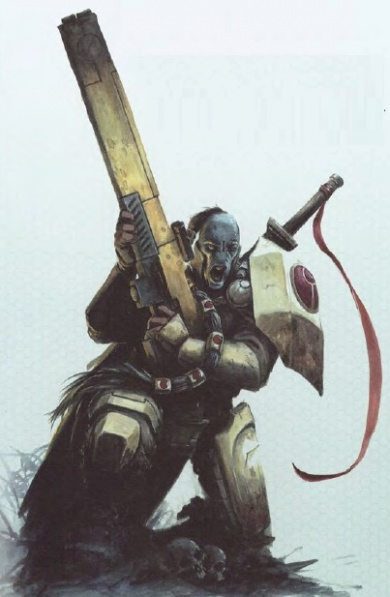
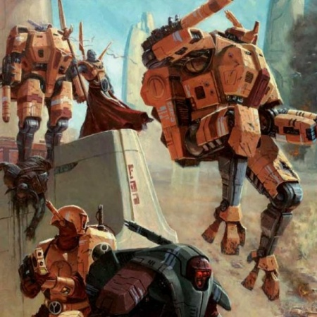
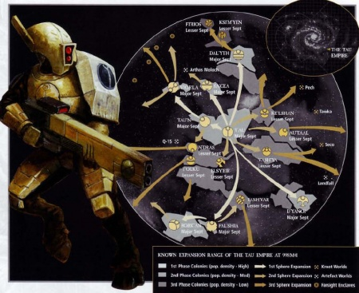
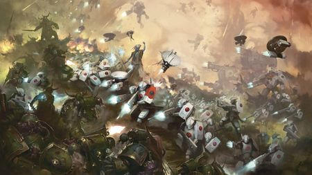
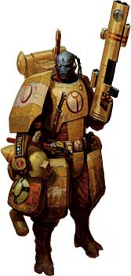
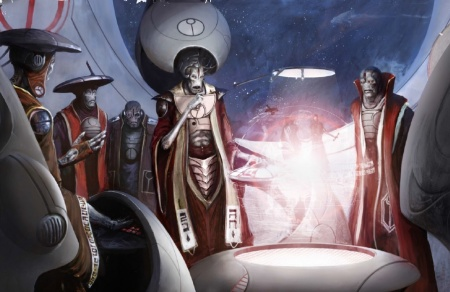
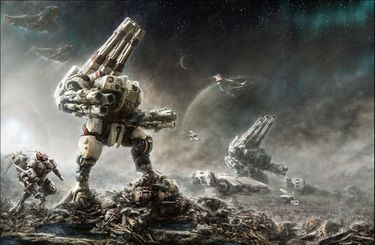

# 0583 钛族

精校状态：中文行文已逐段精校，部分术语仍为暂定

分类：概念 / 异型 Xenos / 钛帝国 T'au Empire

原文来源：https://www.bilibili.com/opus/1124239416680775685

原作者：帝国神选罐头

原文时间：编辑于 2025年12月30日 08:25

[返回分类目录](目录.md) · [全书目录](../../目录.md)

原篇名：钛 T'au

<!-- A0583-B0001 -->
**英文原文**

The T'au (or Tau) are a young race of technologically-oriented beings from the Eastern Fringe and the dominant species of the T'au Empire.

<!-- /A0583-B0001 -->

<!-- A0583-B0002 -->

原译文

钛（或陶）是一个来自东部边缘的年轻种族，以技术为导向，是钛帝国的主导种族。

**校订译文**

钛族是来自东部边陲、重视技术发展的年轻种族，也是钛帝国的主体。T’au与Tau为同一名称的不同英文拼写。

<!-- /A0583-B0002 -->

<!-- A0583-B0003 图片 -->

<!-- A0583-B0004 -->

原译文

T'au Warrior 钛战士

**校订译文**

T'au Warrior 钛战士

<!-- /A0583-B0004 -->

<!-- A0583-B0005 -->
**英文原文**

T'au, the T'au home planet, was discovered in 789.M35 by the Adeptus Mechanicus Explorator Fleet ship Land's Vision. Adeptus Mechanicus records indicate that at that time, the T'au species had mastered the use of simple tools and weapons, as well as fire. Before the planet could be cleansed and colonised by the Imperium, however, a violent Warp-storm erupted around the planet. The outbreak of the wars of the Age of Apostasy shortly thereafter preempted any further Imperial follow-up and the then-minor xenos race was effectively forgotten by humanity outside a few Explorator records.

<!-- /A0583-B0005 -->

<!-- A0583-B0006 -->

原译文

钛是钛族的家园行星，于789.M35被机械神教探索者舰队舰船兰德之视号发现。机械神教的记录表明，当时，钛族已经掌握了简单工具和武器的使用，以及火的使用。然而，在帝国对行星进行清理和殖民之前，一场猛烈的亚空间风暴在行星周围爆发。此后不久，叛教时代战争的爆发阻止了帝国的任何进一步跟进，当时的少数异型种族实际上被人类遗忘了，除了一些探索者的记录。

**校订译文**

789.M35，机械修会探索舰队的“兰德之视号”发现了钛族母星钛星。记录称，当时居民已掌握简单工具、武器与用火技术。然而，帝国尚未来得及清剿殖民，猛烈的亚空间风暴就将该星包围。不久，叛教时代的战火阻断了后续行动；除少数探索档案外，这个当时不起眼的异形种族几乎被人类遗忘。

**校注：** 本篇将Land’s Vision写为发现舰，582则称探索舰队；保留来源的不同表述并记录。

<!-- /A0583-B0006 -->

<!-- A0583-B0007 -->
**英文原文**

It would be another six-thousand years before the Imperium had any further contact with the T'au, when an unknown class of alien vessel was encountered by system defense ships at Devlan in the Ultima Segmentum. After failing to respond to naval challenges, the ship was attacked and destroyed. Bodies recovered from the wreckage were a close match to the records from the Land's Vision. The rapid elevation from a primitive species on a single planet to a starfaring power in only six millennia represented a new danger to Imperial interests, especially as some of the Human worlds on the fringes of Imperial territory were discovered to already have trade relations with the T'au. Almost a century later, the Damocles Crusade smashed into T'au space, bringing the two powers into war.

<!-- /A0583-B0007 -->

<!-- A0583-B0008 -->

原译文

再过六千年，帝国才与钛有任何进一步的接触，当时一艘未知级别的外星飞船在极限星域的德夫兰被星系防御舰船遇到。在未能回应海军质询后，该船遭到袭击并被摧毁。从残骸中找到的尸体与兰德之视号的记录非常吻合。在短短六千年内，从一个行星上的原始物种迅速崛起为一个星际帝国，这对帝国的利益构成了新的威胁，尤其是当帝国领土边缘的一些人类世界被发现已经与钛有贸易关系时。近一个世纪后，达摩克利斯远征闯入钛空域，使两个帝国陷入战争。

**校订译文**

又过了六千年，帝国才再次接触钛族：极限星域德夫兰的星系防御舰发现一艘不明异形船只，因其未回应盘查而将其击毁。打捞的遗体与兰德之视号档案高度吻合。短短六千年，一个单星球上的原始种族已成为星际势力，对帝国构成新威胁；尤其是边疆部分人类世界，竟已与其通商。近一个世纪后，达摩克利斯远征侵入钛族空间，两大政体正式交战。

<!-- /A0583-B0008 -->

<!-- A0583-B0009 -->
## History 历史

<!-- /A0583-B0009 -->

<!-- A0583-B0010 -->
### Early History 早期历史

<!-- /A0583-B0010 -->

<!-- A0583-B0011 -->
**英文原文**

The primitive T'au were a plains-dwelling race. In their prehistory, they lived as nomadic tribes on the desert plains, hunting and gathering their food. Some of these tribes eventually expanded into other environments. The T'au of the mountains grew flaps of skin and light bones that allowed them to float over the deserts on thermal drafts. The T'au of the river valleys developed agriculture and metallurgy, forming the first true settlements. The development of settlements led to the need of trade, and wandering T'au began to negotiate and mediate between the disparate tribes, traveling up and down rivers in crude barges. The T'au that remained on the plains became strong and skillful hunters, larger and stronger than most other T'au.

<!-- /A0583-B0011 -->

<!-- A0583-B0012 -->

原译文

原始的钛是一个居住在平原上的种族。在史前时期，他们作为游牧部落生活在沙漠平原上，狩猎和采集食物。其中一些部落最终扩展到其他环境。山上的钛长出了皮瓣和轻骨，使他们能够在热气流中漂浮在沙漠上。河谷的钛发展了农业和冶金业，形成了第一个真正的定居点。定居点的发展导致了贸易的需要，流浪的钛开始在不同的部落之间进行谈判和调解，乘坐简陋的驳船在河流上来回航行。留在平原上的钛成为了强壮而熟练的猎人，比其他大多数钛都要高大强壮。

**校订译文**

原始钛族生活在沙漠平原，以游牧部落形式狩猎、采集。部分迁往其他环境：山地居民长出皮膜与轻巧骨骼，借热气流在沙漠上空滑翔；河谷居民发展农业、冶金，建立最早聚落。定居生活催生贸易，游历四方者乘简陋驳船往返河道，在不同部落间谈判斡旋。留在平原的钛族则成为强壮、娴熟的猎人，比大多数同族更高大有力。

<!-- /A0583-B0012 -->

<!-- A0583-B0013 图片 -->

<!-- A0583-B0014 -->

原译文

Tau Empire 钛帝国

**校订译文**

Tau Empire 钛帝国

<!-- /A0583-B0014 -->

<!-- A0583-B0015 -->
**英文原文**

Unfortunately for the T'au, the rapid sociological, biological, and technological shifts they were undergoing led to conflict. The mountain T'au and the plains T'au allied to take the farms and cities of the river valley T'au, and the merchant caravans were regularly sacked to prevent alliances from forming. The T'au of the river valleys leveraged their skill at architecture to build walls and fortresses, and quickly discovered the manufacture of black powder weaponry to defend themselves. But with the harvests disrupted, the breakdown of trade and blocked access to fresh water, disease ran rampant in the squalid conditions most T'au now lived in and as many died from sickness as battle. T'au history records this period as Mont'au, "The Terror" or "death age".

<!-- /A0583-B0015 -->

<!-- A0583-B0016 -->

原译文

不幸的是，对于钛来说，他们正在经历的快速的社会、生物和技术转变导致了冲突。山脉的钛与平原的钛结盟，夺取了河谷的钛的农场和城市，商队经常被洗劫，以阻止联盟的形成。河谷的钛利用他们的建筑技能建造了城墙和堡垒，并很快发现了黑火药武器的制造来自卫。但随着收割中断、贸易中断和淡水供应受阻，疾病在大多数钛现在生活的肮脏环境中肆虐，死于疾病的人数与死于战争的人数一样多。这段时期在钛历史上被称为“大恐怖”或“死亡时代”。

**校订译文**

社会、身体与技术的急速变化，也带来冲突。山地和平原部落结盟，侵夺河谷居民的农场与城市；商队屡遭劫掠，以阻止其他联盟形成。河谷钛族运用建筑技艺筑起城墙堡垒，很快学会制造火药武器自卫。然而，收成受损、贸易断绝、清水受阻，令污秽环境中的疾病肆虐，病死人数与战死者相当。钛族史称这一时期为“蒙特’奥”，即“大恐怖”或“死亡时代”。

<!-- /A0583-B0016 -->

<!-- A0583-B0017 -->
**英文原文**

T'au legends tell of the first appearance of Ethereals at the besiged city of Fio'taun after the strange lights appeared in the skies. The fortress city of Fio'taun was under assault by the warriors from the plains. Though negotiation had been attempted, the fierce plain warriors would settle for nothing less than the annihilation of Fio'taun. For five long years, the inhabitants held off the savage assaults with their thick walls and plentiful cannon. However, disease and starvation began to take their toll. As the tide of the siege turned, two mysterious T'au appeared. One made his way into the camp of the plains T'au, exuding a quiet authority that no T'au was able to resist. Soon, the leader of the plains warriors was persuaded to parley with the T'au of Fio'taun. Similarly, the other mysterious T'au made his way deep into the fortress. Within a few short hours, the gates stood wide open and the T'au stood ready to talk.

<!-- /A0583-B0017 -->

<!-- A0583-B0018 -->

原译文

钛传说中，在天空中出现奇怪的光亮后，以太首次出现在被围困的菲'托恩城。要塞城市菲'托恩遭到平原的战士的袭击。尽管已经尝试过谈判，但凶猛的平原战士们只会满足于歼灭菲'托恩。在漫长的五年里，居民们用厚厚的城墙和充足的大炮抵御了野蛮的袭击。然而，疾病和饥饿开始造成损失。随着围攻的浪潮转向，两个神秘的钛出现了。其中一人进入了平原的钛的营地，散发出一种钛无法抗拒的平静权威。不久，平原战士的首领被说服与菲'托恩的钛谈判。同样，另一位神秘的钛也深入了要塞。在短短几个小时内，大门敞开着，钛已经准备好对话了。

**校订译文**

传说，天空出现奇光后，以太首次在遭围困的菲·托恩现身。平原战士一心摧毁这座堡垒城市，即使双方曾尝试谈判也不肯让步；城内居民凭厚墙重炮抵挡五年，终受饥馑与疾病侵蚀。守势危急时，两名神秘钛族出现。一人进入平原军营，以无人能抗拒的沉静威严，说服其首领与城内会谈；另一人深入堡垒。数小时后，城门敞开，双方准备对话。

**校注：** 复查英文细节与数量，补明对象、地点或程度，避免精简中文时削弱原意。

<!-- /A0583-B0018 -->

<!-- A0583-B0019 -->
**英文原文**

The two Ethereals spoke of the importance of peace and understanding between all T'au. They described a Greater Good that each T'au must strive for. The besiegers and the besieged quickly agreed with the Ethereals and a truce was reached. Across the land, other Ethereals emerged, each with the same quiet authority and message of harmony and cooperation. Within a few years, the Ethereals had all of T'au working together.

<!-- /A0583-B0019 -->

<!-- A0583-B0020 -->

原译文

两位以太谈到了所有钛之间和平与理解的重要性。他们描述了每个钛必须为之奋斗的上上善道。围攻者和被围困者很快同意了以太的意见，并达成了停战协议。在这片土地上，其他以太出现了，每个以太都有同样平静的权威和和谐与合作的信息。几年内，以太让整个钛一起协同工作。

**校订译文**

两位以太讲述和平与理解的重要，提出每个钛族都应为之奋斗的上上善道。攻守双方很快接受，达成停战。各地随后出现更多以太，带着同样的权威，传达和谐、合作的主张。数年内，整个钛族便被组织起来，协力共事。

<!-- /A0583-B0020 -->

<!-- A0583-B0021 -->
### Expansion 扩张

<!-- /A0583-B0021 -->

<!-- A0583-B0022 -->
### First Sphere 第一界

<!-- /A0583-B0022 -->

<!-- A0583-B0023 -->
**英文原文**

This was a dynamic period that saw the T'au rapidly take from their homeworld T'au to the stars. Losses among the initial colonists were high, but under the protection of the Fire Caste the expansion continued undeterred. During this period the nascent T'au Empire assimilated their first alien cultures under guidance from the Ethereals, the Thraxians, the Nicassar, the Kroot and several others. The Orks were a notable exception, the savage greenskins giving the T'au their first experience of full-scale inter-species war. By the end of this period, eight major Septs had been established.

<!-- /A0583-B0023 -->

<!-- A0583-B0024 -->

原译文

这是一个充满活力的时期，看到了钛迅速从他们的家园世界钛到群星。最初的殖民者损失惨重，但在火氏族的保护下，扩张仍在继续。在这一时期，新生的钛帝国在以太、特拉希安、尼卡萨、克鲁特和其他几个种族的引导下吸收了他们的第一批外来文化。欧克是一个明显的例外，野蛮的绿皮让钛第一次经历了物种间的全面战争。到这一时期结束时，已经建立了八个主要的家门。

**校订译文**

第一界充满开拓活力，钛族迅速从母星走向群星。最初殖民者损失很大，但在火氏族保护下，扩张未被阻断。以太指导新生帝国，先后接纳特拉希安、尼卡萨、克鲁特等外族。欧克是显著例外：凶暴绿皮让钛族第一次尝到全面种族战争的滋味。这一阶段结束时，八大主要家门已经建立。

**校注：** Thraxians/Nicassar/Kroot为被接纳的异族，不是与以太共同引导钛族的领导者，原语法归属错。

<!-- /A0583-B0024 -->

<!-- A0583-B0025 图片 -->

<!-- A0583-B0026 -->

原译文

Tau planets 钛行星

**校订译文**

Tau planets 钛行星

<!-- /A0583-B0026 -->

<!-- A0583-B0027 -->
### Second Sphere 第二界

<!-- /A0583-B0027 -->

<!-- A0583-B0028 -->
**英文原文**

Fueled by the newly discovered ZFR Horizon Accelerator Engine that allowed T'au ships to make longer voyages into surrounding space, this period of T'au history is characterised by their first ventures across the Damocles Gulf. Several holdings were established on the far side, and several existent local powers were brought into the T'au fold by conquest or trade agreement. Unfortunately for the T'au, this included worlds of the Imperium of Man, a galactic power the scale of which the T'au were then-ignorant. The efforts of the Second Sphere Expansion were cut short when the Damocles Crusade quickly annihilated the T'au holdings on the far side of the gulf and proceeded to penetrate deeply into the heart of T'au territory before being fought to a stalemate at Dal'yth Sept.

<!-- /A0583-B0028 -->

<!-- A0583-B0029 -->

原译文

在新发现的ZFR水平加速引擎的推动下，钛舰船可以在周围的太空中进行更长的航行，这段时间的特点是他们首次穿越达摩克利斯湾。在远方建立了几个领地，并通过征服或贸易协议将几个现有的地方势力纳入了钛。对于钛来说不幸的是，这包括了人类帝国的世界，这是一个银河帝国，当时钛对其规模一无所知。达摩克利斯远征迅速消灭了湾对岸的钛领地，并深入到钛领地的中心，随后在达'利斯家门世界陷入僵局，第二界扩张的努力就此中断。

**校订译文**

新发现的ZFR地平线加速引擎，使舰船能向周边空间展开更长航程，钛族由此首次跨越达摩克利斯湾。在湾的另一侧，他们建立据点，通过征服或贸易吸纳当地势力，却触及了人类帝国所属世界，当时还浑然不知这个银河强权有多庞大。达摩克利斯远征迅速摧毁湾外领地，深入钛帝国腹心，直至达利斯家门才陷入僵局，第二界扩张由此中断。

**校注：** Horizon为引擎名称的一部分，暂译地平线，非原“水平加速”。

<!-- /A0583-B0029 -->

<!-- A0583-B0030 -->
### Third Sphere 第三界

<!-- /A0583-B0030 -->

<!-- A0583-B0031 -->
**英文原文**

The wake of the Imperial withdrawl from T'au space left the Empire on the brink of collapse as the enormity of what the T'au faced was made clear. The Ethereals, realising that the Empire must quickly regain the initiative to bounce back from this loss, declared that this would be the catalyst for renewed vigour in their expansion efforts. Fleets of military conquest and colonial expansion, first led by Commander O'Shovah and then later by Commander O'Shaserra, were dispatched to reclaim territory lost to the T'au and they captured several Imperial worlds that had been stripped of their defenders to rally forces for the Battle for Macragge. Each conquest further built the T'au's strategic momentum.

<!-- /A0583-B0031 -->

<!-- A0583-B0032 -->

原译文

帝国从钛空域撤军的后果使帝国濒临崩溃，因为钛所面临的巨大挑战是显而易见的。以太意识到帝国必须迅速重新获得从这一损失中恢复过来的主动权，宣布这将是他们扩张努力重新焕发活力的催化剂。军事征服和殖民扩张的舰队，最初由欧'肖瓦指挥官领导，后来由欧'沙塞拉指挥官领导，被派往收复钛失去的领土，他们占领了几个为马库拉格之战集结力量而被剥夺了防御者的帝国世界。每一次征服都进一步增强了钛的战略势头。

**校订译文**

帝国撤军之后，钛族终于看清对手的庞大，自己的帝国也已被战争逼至崩溃边缘。以太明白，必须尽快重夺主动、摆脱挫败，遂宣称要把危机变为新一轮扩张的动力。军事征服与殖民舰队先由欧·肖瓦、后由欧·沙塞拉率领，收复失地，并夺取若干因抽调守军支援马库拉格之战而空虚的人类世界。每次胜利都进一步增强钛族的战略势头。

**校注：** 首句帝国撤军与钛帝国濒崩为两个主体，原译混成同一个帝国；O’Shovah远见、O’Shaserra影阳为别称，不另造人物。

<!-- /A0583-B0032 -->

<!-- A0583-B0033 图片 -->

<!-- A0583-B0034 -->

原译文

The T'au battle the forces of Nurgle 钛与纳垢部队作战

**校订译文**

The T'au battle the forces of Nurgle 钛与纳垢部队作战

<!-- /A0583-B0034 -->

<!-- A0583-B0035 -->
**英文原文**

Eventually, the Third Sphere of Expansion ground to a halt due to Imperial counterattacks in the Damocles Gulf and the formation of the Great Rift.

<!-- /A0583-B0035 -->

<!-- A0583-B0036 -->

原译文

最终，由于帝国在达摩克利斯湾的反击和大裂隙的形成，第三界扩张陷入停顿。

**校订译文**

最终，由于帝国在达摩克利斯湾的反击和大裂隙的形成，第三界扩张陷入停顿。

<!-- /A0583-B0036 -->

<!-- A0583-B0037 -->
### Fourth Sphere 第四界

<!-- /A0583-B0037 -->

<!-- A0583-B0038 -->
**英文原文**

The Fourth Sphere of Expansion was launched shortly after the formation of the Great Rift. Utilising new anti-matter engines, the fleet was thought lost in a mass accident but in truth was cast across much of the Galaxy through a wormhole. Years after its disappearance, the Fourth Sphere was able to make contact with the T'au Empire through the wormhole, resulting in the Fifth Sphere of Expansion.

<!-- /A0583-B0038 -->

<!-- A0583-B0039 -->

原译文

第四界扩张是在大裂隙形成后不久启动的。利用新的反物质引擎，舰队被认为在一次大规模事故中迷失了方向，但事实上是通过虫洞穿越银河系的大部分地区。消失多年后，第四界能够通过虫洞与钛帝国取得联系，导致了第五界扩张。

**校订译文**

第四界扩张在大裂隙形成后不久开始。舰队启用新型反物质引擎，一度被认为毁于大规模事故，实际上却被虫洞抛至遥远的银河另一方。失联数年后，第四界部队通过虫洞重新联系钛帝国，促成第五界扩张。

<!-- /A0583-B0039 -->

<!-- A0583-B0040 -->
### Fifth Sphere 第五界

<!-- /A0583-B0040 -->

<!-- A0583-B0041 -->
**英文原文**

The Fifth Sphere of Expansion was launched on the heels of the ill-fated Fourth. It is the current phase of expansion of the T'au. The expedition moved into the wormhole left behind by the Fourth Sphere, now known as Startide Nexus.

<!-- /A0583-B0041 -->

<!-- A0583-B0042 -->

原译文

第五界扩张是在命运多舛的第四界扩张之后推出的。这是钛目前的扩张阶段。探索队进入了第四界留下的虫洞，现在被称为星潮枢纽。

**校订译文**

第五界紧随命运多舛的第四界展开，是本条资料所述的当前扩张阶段。远征军进入第四界留下、后来称为星潮枢纽的虫洞。

<!-- /A0583-B0042 -->

<!-- A0583-B0043 -->
### Sixth Sphere 第六界

<!-- /A0583-B0043 -->

<!-- A0583-B0044 -->
**英文原文**

Despite the Fifth Sphere being unfinished, a Sixth Sphere is currently being planned by Ethereal Supreme Aun'va.

<!-- /A0583-B0044 -->

<!-- A0583-B0045 -->

原译文

尽管第五界尚未完成，但至高以太铵'瓦目前正在计划第六界。

**校订译文**

第五界尚未结束，原文已记载至高以太铵瓦开始筹划第六界。

**校注：** 当前阶段与铵瓦状态按原文资料时点保留，不宣称在本稿生成日期仍为现任活人。

<!-- /A0583-B0045 -->

<!-- A0583-B0046 -->
## Society 社会

<!-- /A0583-B0046 -->

<!-- A0583-B0047 -->
**英文原文**

The T'au are the most open and tolerant of the races in the Galaxy, which means that they prefer not to destroy all other races on sight and are nowhere near as xenophobic as the Imperium. They are appreciative of the ways of the humans, Eldar, and other sentient races, but hold their own values as superior above all others.

<!-- /A0583-B0047 -->

<!-- A0583-B0048 -->

原译文

钛是银河系中最开放、最宽容的种族，这意味着他们不想一眼就摧毁所有其他种族，也不像帝国那样排外。他们欣赏人类、灵族和其他有情种族的方式，但认为自己的价值观高于其他所有种族。

**校订译文**

原文将钛族形容为银河最开放、最宽容的种族：他们通常不会见到异族就加以灭绝，也远不如人类帝国排外。他们愿意欣赏人类、灵族及其他智慧种族的文化，却始终认为自身价值观高于一切。

<!-- /A0583-B0048 -->

<!-- A0583-B0049 -->
**英文原文**

All T'au in all castes have a particular rank in their society, with each individual starting at the lowest and being eventually promoted on merit. However, the T'au attach no stigma to low rank and even the most menial T'au enjoys the respect of their peers.

<!-- /A0583-B0049 -->

<!-- A0583-B0050 -->

原译文

所有氏族的所有钛在社会中都有一个特定的等级，每个人都从最低的开始，最终根据功绩获得晋升。然而，钛并不认为低等级是可耻的，即使是最卑微的钛也受到同辈的尊重。

**校订译文**

每名钛族在所属氏族中都有特定等级，从最低阶起步，按功绩晋升。低阶并不被视为耻辱，即使从事最卑微工作者，也能得到同侪尊重。

<!-- /A0583-B0050 -->

<!-- A0583-B0051 图片 -->

<!-- A0583-B0052 -->

原译文

T'au Fire Warrior 钛火战士

**校订译文**

T'au Fire Warrior 钛火战士

<!-- /A0583-B0052 -->

<!-- A0583-B0053 -->
**英文原文**

T'au names are generally seen in the Imperium as long, complicated, and unwieldy, but they can be broken down into the following:

<!-- /A0583-B0053 -->

<!-- A0583-B0054 -->

原译文

钛的名字在帝国中通常被认为是长而复杂、笨拙的，但它们可以分为以下几类：

**校订译文**

帝国人常觉得钛族姓名冗长复杂、不便使用，但可将其拆解为以下组成部分：

<!-- /A0583-B0054 -->

<!-- A0583-B0055 -->
**英文原文**

Caste and rank within that caste.

<!-- /A0583-B0055 -->

<!-- A0583-B0056 -->

原译文

氏族和氏族内的等级。

**校订译文**

氏族和氏族内的等级。

<!-- /A0583-B0056 -->

<!-- A0583-B0057 -->
**英文原文**

Sept of birth.

<!-- /A0583-B0057 -->

<!-- A0583-B0058 -->

原译文

诞生的家门世界

**校订译文**

诞生的家门世界

<!-- /A0583-B0058 -->

<!-- A0583-B0059 -->
**英文原文**

Personal name (which is often determined/extended by their notable actions or achievements)

<!-- /A0583-B0059 -->

<!-- A0583-B0060 -->

原译文

个人姓名（通常由他们的著名行动或成就决定/扩展）

**校订译文**

个人名，往往随重要事迹或成就而确立、增补。

<!-- /A0583-B0060 -->

<!-- A0583-B0061 -->
**英文原文**

Using a T'au's full name is considered a very formal form of address, while using only their personal name is considered overly-familiar unless one is bonded to them via the Ta'lissera. Using a T'au's caste and rank to refer to them is considered a polite form of address as it acknowledges their role in the Greater Good.

<!-- /A0583-B0061 -->

<!-- A0583-B0062 -->

原译文

使用钛的全名被认为是一种非常正式的称呼形式，而只使用他们的个人名字则被认为过于熟悉，除非有人通过塔利赛拉与他们联系在一起。使用钛的氏族和等级来称呼他们被认为是一种礼貌的称呼方式，因为它承认了他们在上上善道中的作用。

**校订译文**

使用全名称呼极为正式；只叫个人名则过分亲近，除非彼此已通过“塔利赛拉”结为同伴。以氏族加等级称呼，既承认其为上上善道承担的职责，也是一种礼貌表达。

<!-- /A0583-B0062 -->

<!-- A0583-B0063 -->
### Castes and Rank 氏族和等级

<!-- /A0583-B0063 -->

<!-- A0583-B0064 -->
**英文原文**

The Caste System organises all T'au into five different castes and each one of them has a defined social role, be it military, trade, diplomacy, or leadership. The members of a caste are further classified by a specific rank.

<!-- /A0583-B0064 -->

<!-- A0583-B0065 -->

原译文

氏族制度将所有的钛分为五个不同的氏族，每个氏族都有明确的社会角色，无论是军事、贸易、外交还是领导。氏族的成员按特定等级进一步分类。

**校订译文**

种姓制度将钛族分成五个世袭阶层，本稿沿原译称“氏族”。各阶层分别承担军事、贸易、外交或统治等明确职责，内部再依等级区分。

<!-- /A0583-B0065 -->

<!-- A0583-B0066 -->
**英文原文**

The castes are:

<!-- /A0583-B0066 -->

<!-- A0583-B0067 -->

原译文

氏族是

**校订译文**

氏族是

<!-- /A0583-B0067 -->

<!-- A0583-B0068 -->
**英文原文**

Aun (Ethereal) - Supreme/Spiritual Leaders, T'au of the Ethereal Caste are the spiritual and political leaders of the T'au, and T'au of other castes submit to their authority in all things. Should an Ethereal order a T'au of a different caste to kill themselves, they would be obeyed instantly and without question.

<!-- /A0583-B0068 -->

<!-- A0583-B0069 -->

原译文

铵（以太）- 至高/精神领袖，以太氏族的钛是钛的精神和政治领袖，其他氏族的钛在所有事情上都服从他们的权威。如果一个以太命令一个不同氏族的钛自杀，他们会立即毫无疑问地服从。

**校订译文**

铵（Aun，以太）——最高统治者与精神领袖。以太掌握政治和精神权威，其他氏族事事服从；即使被命令自杀，也会立刻照办，毫无质疑。

<!-- /A0583-B0069 -->

<!-- A0583-B0070 -->
**英文原文**

Por (Water) - Bureaucrats, T'au of the Water Caste are the civil servants, merchants, administrators, lawyers, and diplomats of T'au society, flowing among both the other castes and other allied species and ensuring that all have what they need to optimally serve the Greater Good. They display an easy affinity for languages, and adopt many forms of communications with exceptional nuance across their careers.

<!-- /A0583-B0070 -->

<!-- A0583-B0071 -->

原译文

波（水）- 行政员，水氏族的钛是钛社会的公务员、商人、行政人员、律师和外交官，在其他氏族和其他联盟种族之间流动，确保所有人都有他们所需要的东西，以最佳方式服务于上上善道。他们表现出对语言的亲和力，并在职业生涯中采用多种形式的交流，具有非凡的细微差别。

**校订译文**

波（Por，水）——行政与外交人员。水氏族担任公务员、商人、管理者、律师和外交官，往来于各氏族与盟族之间，保证各方获得所需，尽力服务上上善道。他们语言天赋出众，熟习多种沟通方式，擅长捕捉、运用细微含义。

<!-- /A0583-B0071 -->

<!-- A0583-B0072 -->
**英文原文**

Shas (Fire) - Warriors, The T'au of the Fire Caste are the warriors of T'au society and are the most massive and physically powerful of the T'au, generations of breeding having weeded out infirmity.

<!-- /A0583-B0072 -->

<!-- A0583-B0073 -->

原译文

沙（火）- 战士，火氏族的钛是钛社会的战士，是钛中体型最大、身体最强壮的，几代人的繁殖已经消除了虚弱。

**校订译文**

沙（Shas，火）——战士。火氏族是钛族中体格最强壮、最庞大的群体，历代选择性繁育逐渐淘汰了虚弱体质。

<!-- /A0583-B0073 -->

<!-- A0583-B0074 -->
**英文原文**

Fio (Earth) - Engineers, T'au of the Earth Caste have the most numerous population of all the castes, most being physically sturdy labourers who staff farms, factories and construction crews, and their brightest minds go on to be engineers and doctors.

<!-- /A0583-B0074 -->

<!-- A0583-B0075 -->

原译文

菲（土）- 土氏族的钛是所有氏族中人口最多的，他们大多是体格健壮的体力劳动者，在农场、工厂和建筑工人的工作，他们最聪明的头脑后来成为了工程师和医生。

**校订译文**

菲（Fio，地）——工程与生产人员。地氏族人口最多，大多是强健的劳动者，在农场、工厂和工地工作；其中最聪慧者成为工程师与医生。

<!-- /A0583-B0075 -->

<!-- A0583-B0076 -->
**英文原文**

Kor (Air) - Spacefarers, T'au of the Air Caste are sometimes known as "the invisible caste" because they spend most of their time aboard the spacecraft that make up the T'au navy. Generations of exposure to micro-gravity leaves them with hollow bones and a tolerance for high acceleration, though their frailty means they are sluggish and weak in even moderate gravity environments.

<!-- /A0583-B0076 -->

<!-- A0583-B0077 -->

原译文

科（气）- 气氏族的钛有时被称为“隐形氏族”，因为他们大部分时间都在组成钛海军的航天器上度过。几代人暴露在微重力环境中，使他们的骨骼中空，对高加速度有耐受性，尽管他们的脆弱意味着即使在中等重力环境中，他们也会行动迟缓。

**校订译文**

科（Kor，气）——航天人员。因大多生活在海军舰船上，气氏族有时被称为“隐形氏族”。世代处于微重力环境，使其骨骼中空，能耐受高加速度；但身体脆弱，即使中等重力也会令他们行动迟缓、虚弱无力。

<!-- /A0583-B0077 -->

<!-- A0583-B0078 -->
**英文原文**

From highest to lowest, the ranks in Tau society are:

<!-- /A0583-B0078 -->

<!-- A0583-B0079 -->

原译文

从最高到最低，钛社会的等级是：

**校订译文**

从最高到最低，钛社会的等级是：

<!-- /A0583-B0079 -->

<!-- A0583-B0080 -->

原译文

O 欧

**校订译文**

O 欧

<!-- /A0583-B0080 -->

<!-- A0583-B0081 -->

原译文

El 埃

**校订译文**

El 埃

<!-- /A0583-B0081 -->

<!-- A0583-B0082 -->

原译文

Vre 维

**校订译文**

Vre 维

<!-- /A0583-B0082 -->

<!-- A0583-B0083 -->

原译文

Ui 乌

**校订译文**

Ui 乌

<!-- /A0583-B0083 -->

<!-- A0583-B0084 -->

原译文

La 拉

**校订译文**

La 拉

<!-- /A0583-B0084 -->

<!-- A0583-B0085 -->

原译文

Saal 萨

**校订译文**

Saal 萨

<!-- /A0583-B0085 -->

<!-- A0583-B0086 -->
### Sept 家门

原题：Sept 家门世界

<!-- /A0583-B0086 -->

<!-- A0583-B0087 -->
**英文原文**

T'au come from many planetary systems, or Septs, and these shape and define their methods of work. Septs are ruled by a Elemental Council, though final say goes to the Ethereal governor.

<!-- /A0583-B0087 -->

<!-- A0583-B0088 -->

原译文

钛来自许多行星系统，或称家门世界，这些行星系统塑造并定义了它们的工作方法。家门世界由以太议会统治，但最终决定权在于以太总督。

**校订译文**

钛族出身于不同星系，即“家门”，各家门传统影响其处事方式。家门由元素议会治理，但以太总督拥有最终决定权。

**校注：** Elemental Council元素议会，非Ethereal Council以太议会；Sept可包含一个星系，非永远一颗世界。

<!-- /A0583-B0088 -->

<!-- A0583-B0089 -->
**英文原文**

Some of the most important Septs are:

<!-- /A0583-B0089 -->

<!-- A0583-B0090 -->

原译文

一些最重要的家门世界是：

**校订译文**

主要家门包括：

<!-- /A0583-B0090 -->

<!-- A0583-B0091 -->
**英文原文**

T'au - Homeworld

<!-- /A0583-B0091 -->

<!-- A0583-B0092 -->

原译文

钛 - 家园世界

**校订译文**

钛星——母星

<!-- /A0583-B0092 -->

<!-- A0583-B0093 -->
**英文原文**

T'au'n - The first Tau colony.

<!-- /A0583-B0093 -->

<!-- A0583-B0094 -->

原译文

钛'恩 - 第一个钛殖民地

**校订译文**

钛’恩——最早的钛族殖民地

<!-- /A0583-B0094 -->

<!-- A0583-B0095 -->
**英文原文**

Vior'la - Military centre of the T'au Empire.

<!-- /A0583-B0095 -->

<!-- A0583-B0096 -->

原译文

维奥'拉 - 钛帝国的军事中心。

**校订译文**

维奥’拉——钛帝国军事中心

<!-- /A0583-B0096 -->

<!-- A0583-B0097 -->
**英文原文**

D'yanoi - Isolated for a period and considered rustic/backwards.

<!-- /A0583-B0097 -->

<!-- A0583-B0098 -->

原译文

迪'亚诺伊 - 与世隔绝一段时间，被认为是乡村/落后的。

**校订译文**

迪’亚诺伊——曾长期隔绝，被其他家门视为乡僻、落后

<!-- /A0583-B0098 -->

<!-- A0583-B0099 -->
**英文原文**

Bork'an - Manufacturing hub.

<!-- /A0583-B0099 -->

<!-- A0583-B0100 -->

原译文

博克'安 - 制造中心

**校订译文**

博克’安——制造业枢纽

<!-- /A0583-B0100 -->

<!-- A0583-B0101 -->
**英文原文**

Dal'yth - Cosmopolitan.

<!-- /A0583-B0101 -->

<!-- A0583-B0102 -->

原译文

达'利斯 - 大都会

**校订译文**

达利斯——开放、多元的都会家门

<!-- /A0583-B0102 -->

<!-- A0583-B0103 -->
**英文原文**

Fal'shia - Known for its technological innovations.

<!-- /A0583-B0103 -->

<!-- A0583-B0104 -->

原译文

法尔'什亚 - 以技术创新而闻名

**校订译文**

法尔’什亚——以技术创新闻名

<!-- /A0583-B0104 -->

<!-- A0583-B0105 -->
**英文原文**

Sa'cea - Heavily urbanised and militarised.

<!-- /A0583-B0105 -->

<!-- A0583-B0106 -->

原译文

萨'恰 - 高度城市化和军事化

**校订译文**

萨’恰——高度城市化、军事化

<!-- /A0583-B0106 -->

<!-- A0583-B0107 -->
### Personal Name 个人姓名

<!-- /A0583-B0107 -->

<!-- A0583-B0108 -->
**英文原文**

T'au personal names, unlike those of humans, usually mean things in their language, depending on the deeds in their lives. These names are apparently not assigned at birth, but descriptive of the individual as they distinguish themselves. Some examples are 'Kais' (Skillful), 'Vral' (Undercut), and 'Tsua'm' (Middle).

<!-- /A0583-B0108 -->

<!-- A0583-B0109 -->

原译文

与人类不同，钛的名字在他们的语言中通常意味着什么，这取决于他们生活中的行为。这些名字显然不是在出生时指定的，而是描述了个体的区别。一些例子是“凯斯”（熟练）、“维拉尔”（切割）和“苏阿'姆”（中间）。

**校订译文**

钛族的个人名通常有明确词义，随一生事迹而变化。据原文描述，它们并非出生即获，而是在个体崭露头角后用于刻画其特点。例如：Kais意为娴熟，Vral意为下切，Tsua’m意为居中。

**校注：** 原文说人类名不像钛名有意义，概括过度，中文按钛名的命名机制陈述；Vral暂下切，具体姓名寓意待核。

<!-- /A0583-B0109 -->

<!-- A0583-B0110 -->
### Example 示例

<!-- /A0583-B0110 -->

<!-- A0583-B0111 -->
**英文原文**

Thus, the T'au named "Shas'O Vior'la Shovah Kais Mont'yr" (a.k.a. Commander Farsight) would be broken down as follows:

<!-- /A0583-B0111 -->

<!-- A0583-B0112 -->

原译文

因此，名为“沙'欧·维奥'拉·肖瓦·凯斯·蒙特'伊”（又名远见指挥官）的钛姓名将分解如下：

**校订译文**

以远见指挥官的全名“Shas’O Vior’la Shovah Kais Mont’yr”（沙’欧·维奥’拉·肖瓦·凯斯·蒙特’伊）为例，可拆解如下：

<!-- /A0583-B0112 -->

<!-- A0583-B0113 -->
**英文原文**

Shas - The individual is a member of the Fire Caste...

<!-- /A0583-B0113 -->

<!-- A0583-B0114 -->

原译文

沙 - 该个体是火氏族的成员...

**校订译文**

沙 - 该个体是火氏族的成员...

<!-- /A0583-B0114 -->

<!-- A0583-B0115 -->
**英文原文**

O - ...who is a high-ranking Commander and hero...

<!-- /A0583-B0115 -->

<!-- A0583-B0116 -->

原译文

欧 - …是一位高级指挥官和英雄...

**校订译文**

欧 - …是一位高级指挥官和英雄...

<!-- /A0583-B0116 -->

<!-- A0583-B0117 -->
**英文原文**

Vior'la - ...who comes from the Sept of Vior'la...

<!-- /A0583-B0117 -->

<!-- A0583-B0118 -->

原译文

维奥'拉 - …来自维奥'拉家园世界...

**校订译文**

Vior’la——来自维奥’拉家门……

<!-- /A0583-B0118 -->

<!-- A0583-B0119 -->
**英文原文**

...and has a personal name translated as being far-sighted (Shovah), skilled (Kais), and having seen many battles (Mont'yr, meaning "blooded").

<!-- /A0583-B0119 -->

<!-- A0583-B0120 -->

原译文

…并且有一个个人姓名，翻译为有远见（肖瓦），有技能（凯斯），看过许多战斗（蒙特'伊，意思是“血”）。

**校订译文**

……个人名则描述其有远见（Shovah）、技艺娴熟（Kais），并历经战阵（Mont’yr，意为经血火洗礼）。

**校注：** blooded指经战斗历练，非一个名词血。

<!-- /A0583-B0120 -->

<!-- A0583-B0121 -->
## Biology 生理

<!-- /A0583-B0121 -->

<!-- A0583-B0122 -->
**英文原文**

The broad role a T'au fulfills in their society is dictated by the caste to which they are born, and each caste is physically distinct from one another, to the point of being practically separate sub-species.

<!-- /A0583-B0122 -->

<!-- A0583-B0123 -->

原译文

钛在他们的社会中扮演的广泛角色是由他们出生的氏族决定的，每个氏族在身体上都是彼此不同的，几乎是独立的亚种。

**校订译文**

钛族大体承担何种社会职责，出生所属的氏族就已决定。各氏族的身体差别十分明显，几乎可视为不同亚种。

<!-- /A0583-B0123 -->

<!-- A0583-B0124 -->
**英文原文**

Every T'au is humanoid in shape, with two arms, two cloven feet, and a single head. T'au are generally shorter than humans, smaller in stature and with less muscle mass and body weight. Their grey-blue skin is leathery and tough and exudes no moisture, owing to the generally dry conditions of their homeworld. Their faces are flat, wide around the eyes, and their olfactory organs are located inside their mouths. Their eyes can see into the infrared and ultraviolet. T'au eyesight is good, but they take longer to focus on distant objects than humans. The T'au are not very good in close combat, as they find the whole concept uncivilised.

<!-- /A0583-B0124 -->

<!-- A0583-B0125 -->

原译文

每一个钛都是人形的，有两只胳膊、两只分叉的脚和一个头。钛通常比人类矮，身材矮小，肌肉质量和体重较轻。它们灰蓝色的皮肤坚韧，不含水分，因为它们的家园世界通常很干燥。它们的脸是平的，眼睛周围很宽，嗅觉器官位于嘴里。他们的眼睛可以看到红外线和紫外线。钛的视力很好，但他们比人类需要更长的时间来关注远处的物体。钛在近身格斗中并不擅长，因为他们觉得整个概念都是不文明的。

**校订译文**

钛族呈人形，有双臂、分趾的双足和一颗头。通常比人类矮小，肌肉量与体重较低。因母星普遍干燥，灰蓝色皮肤坚韧如革，不向外分泌水分。脸部平坦，眼周较宽，嗅觉器官位于口内。眼睛能感知红外与紫外波段，视力虽佳，对远物调焦却比人类慢。钛族不善近身格斗，也认为这种战斗方式不文明。

**校注：** exudes no moisture为不向外分泌水分，原“不含水分”改变生理事实。

<!-- /A0583-B0125 -->

<!-- A0583-B0126 -->
**英文原文**

The T'au have three digits and a single opposable thumb on each hand. The main skeletal difference from humans is the bone structure of their lower legs, feet, and ankles. T'au have shorter tibia and fibia equivalent bones, but their feet have elongated cuneiform bones and tali and two large central weight-bearing toes. The T'au have evolved to stand and move without using their heels.

<!-- /A0583-B0126 -->

<!-- A0583-B0127 -->

原译文

钛有三个手指，每只手都有一个相对的拇指。与人类骨骼的主要区别在于小腿、脚和脚踝的骨骼结构。钛的胫骨和腓骨较短，但他们的脚有细长的楔形骨和跗骨，以及两个大的中央承重脚趾。钛已经进化到不用脚跟站立和移动。

**校订译文**

每只手有三根手指及一根可对握的拇指。其骨骼与人类最大的差别，位于小腿、脚和踝部：对应胫骨、腓骨的结构较短，楔骨与距骨则延长，中央有两根粗大的承重趾。他们已经适应不靠脚跟支撑的站立与行动方式。

**校注：** three digits and thumb为三指加一拇指；tali为距骨，不是泛称跗骨。

<!-- /A0583-B0127 -->

<!-- A0583-B0128 -->
**英文原文**

The colour of a T'au’s skin often depends on their caste as well which sept they call home. In general, it can be said that the Air Caste have the palest pigmentation, while Fire Caste tend to have the darkest. The darker the T'au’s bluish-grey skin, the closer to the sun they live - therefore those living on Vior'la have much darker skin than those from Bork'an. Also it is known that some strange quality in the green-tinged sun of the N'dras sept can leave those from that region slightly mottled.

<!-- /A0583-B0128 -->

<!-- A0583-B0129 -->

原译文

钛的肤色往往取决于他们的氏族，也取决于他们称之为家的家门世界。一般来说，可以说气氏族的肤色最淡，而火氏族的肤色往往最深。钛的蓝灰色皮肤越深，他们就越靠近太阳，因此居住在维奥'拉的人的皮肤比居住在博克'安的人要深得多。众所周知，恩'达斯家园世界的绿色阳光中的一些奇怪品质会使该地区的人略微杂色。

**校订译文**

肤色与氏族、出身家门均有关。气氏族通常最浅，火氏族最深。居住星球越接近恒星，蓝灰色皮肤往往越深，因此维奥’拉居民比博克’安居民深得多。恩’达斯那颗泛绿恒星的某种异常特性，还会使当地居民皮肤略带斑驳。

<!-- /A0583-B0129 -->

<!-- A0583-B0130 -->
**英文原文**

It has also been suggested by several Imperial observers that T'au blood is bluish-purple, explaining that the blood contains trace amounts of cobalt, rather than iron as common in humans.

<!-- /A0583-B0130 -->

<!-- A0583-B0131 -->

原译文

几位帝国观察者也提出，钛的血是蓝紫色的，解释说血液中含有微量的钴，而不是人类常见的铁。

**校订译文**

有帝国观察者声称，钛族血液呈蓝紫色，因为其中含有微量钴，而非人类血液中常见的铁。

<!-- /A0583-B0131 -->

<!-- A0583-B0132 -->
**英文原文**

It is known that life span of the T'au is short, with a life expectancy of around 50 years. Imperial juvenat treatments can extend this limit to upwards of 83 years, though doing so is considered unnatural. Most T'au need only 1-2 decs (1.5-3 Terra hours) of sleep per every rotaa (rotaa - 15 Terran hours), so approximaley 1.5 Terran hours for 15-hour T'au "day".

<!-- /A0583-B0132 -->

<!-- A0583-B0133 -->

原译文

众所周知，钛的寿命很短，预期寿命约为50岁。帝国回春手术的治疗可以将这一限制延长到83岁以上，尽管这样做被认为是不自然的。每若塔（若塔 - 15泰拉时），大多数钛只需要1-2戴克斯（1.5 - 3泰拉时）的睡眠，所以15小时的钛“日”近似1.5个泰拉时。

**校订译文**

钛族寿命较短，预期约五十年。帝国回春疗法能将其延长至八十三岁以上，但这被认为有违自然。多数钛族每个rotaa——相当于十五个泰拉小时的钛族一日——只需睡一至两个dec，即约一点五至三个泰拉小时。

**校注：** 原文先写1.5—3小时，末尾简写1.5；正文保留完整范围，原译还将一日总时长误成睡眠时长。

<!-- /A0583-B0133 -->

<!-- A0583-B0134 -->
**英文原文**

At least some T'au are born and raised as infants in communal Drone-operated nurseries.

<!-- /A0583-B0134 -->

<!-- A0583-B0135 -->

原译文

至少有一些钛在公共无人机运营的托儿所出生和长大。

**校订译文**

至少有部分钛族在由无人机照料的公共育婴设施中出生、度过婴幼儿期。

<!-- /A0583-B0135 -->

<!-- A0583-B0136 -->
**英文原文**

The T’au are capable of exuding scents that convey their mood and emotional state to others of their kind.

<!-- /A0583-B0136 -->

<!-- A0583-B0137 -->

原译文

钛能够散发出气味，将他们的心情和情绪状态传达给同类中的其他人。

**校订译文**

钛能够散发出气味，将他们的心情和情绪状态传达给同类中的其他人。

<!-- /A0583-B0137 -->

<!-- A0583-B0138 -->
**英文原文**

The T'au and Human shared similar hearing ranges, with the T'au seem deaf to higher frequencies while capable of distinguishing sounds most humans would perceive merely as uncomfortable vibration. This caused the Imperials to consider the T'au to have lamentable taste in music.

<!-- /A0583-B0138 -->

<!-- A0583-B0139 -->

原译文

钛和人类的听力范围相似，钛似乎对更高的频率充耳不闻，但能够区分大多数人类只能感知到的不舒服的振动。这使得帝国认为钛的音乐品味令人遗憾。

**校订译文**

钛族与人类听觉范围相近，但钛族似乎听不见部分高频声音，却能分辨人类只觉得不适的低沉振动。帝国人因此认为他们的音乐品味糟透了。

<!-- /A0583-B0139 -->

<!-- A0583-B0140 -->
### T'au and the Warp 钛与亚空间

<!-- /A0583-B0140 -->

<!-- A0583-B0141 -->
**英文原文**

The T'au have no visible psykers whatsoever among their ranks, for their souls are so feeble they barely register in the Warp at all. For a time they were largely oblivious to the malevolent forces of Chaos, who in turn took little interest in the crumbs that are T'au souls.

<!-- /A0583-B0141 -->

<!-- A0583-B0142 -->

原译文

在他们的队伍中没有任何可见的灵能者，因为他们的灵魂是如此虚弱，以至于他们几乎没有在亚空间中显示。有一段时间，他们基本上没有注意到混沌的邪恶力量，而混沌对量少的钛灵魂也不感兴趣。

**校订译文**

钛族中未见明确的灵能者，灵魂弱得几乎无法在亚空间留下痕迹。一度，他们对混沌的恶意力量几乎一无所知；混沌也很少在意这些微不足道的灵魂碎屑。

<!-- /A0583-B0142 -->

<!-- A0583-B0143 图片 -->

<!-- A0583-B0144 -->

原译文

T'au Command Centre 钛指挥中心

**校订译文**

T'au Command Centre 钛指挥中心

<!-- /A0583-B0144 -->

<!-- A0583-B0145 -->
**英文原文**

Because they have no Navigators, T'au ships cannot travel through the heart of the Warp like Imperium ships do. Instead, they make shallow "dives" into the Warp, a much slower form of travel. Because they have no astropaths, the T'au are reliant on messenger ships to communicate across the stars. These handicaps greatly slow the expansion of the T'au Empire.

<!-- /A0583-B0145 -->

<!-- A0583-B0146 -->

原译文

由于没有导航者，钛舰船无法像帝国舰船那样穿越亚空间中心。相反，它们会在亚空间中进行浅层“潜航”，这是一种速度慢得多的航行方式。因为他们没有星语者，所以他们依靠信使船进行星际通信。这些障碍大大减缓了钛帝国的扩张。

**校订译文**

没有导航员，钛舰无法像帝国舰船那样深入亚空间，只能作浅层“潜航”，速度慢得多。没有星语者，他们又只能靠信使船传递星际消息。这些限制大大拖慢了钛帝国的扩张。

**校注：** 这是本段对旧式钛航行的描述；其他段重力驱动与后期星潮枢纽不能误当相同阶段。 此段主语持续为钛族，英文 empire 指钛帝国；补明主语，避免被误读为人类帝国。

<!-- /A0583-B0146 -->

<!-- A0583-B0147 -->
**英文原文**

The T'au do seem to have some influence on the Warp and vice-versa, as seen by the apparent Warp Entity made in the T'au's image encountered by the Fourth Sphere of Expansion.

<!-- /A0583-B0147 -->

<!-- A0583-B0148 -->

原译文

从第四界扩张遇到的钛图像中明显的亚空间实体可以看出，钛似乎确实对亚空间有一定的影响，反之亦然。

**校订译文**

钛族与亚空间似乎并非毫无相互影响。第四界远征遇见过一个似乎以钛族形象显现的亚空间实体，便是例证。

<!-- /A0583-B0148 -->

<!-- A0583-B0149 -->
## T'au Warfare 钛战争

<!-- /A0583-B0149 -->

<!-- A0583-B0150 -->
**英文原文**

T'au ground warfare is carried out almost exclusively by the Fire Caste, while the Air Caste is responsible for aerial and space combat, and providing transport between systems. The basic Fire Caste military unit is known as a Cadre, or Kau'ui, similar in size and role to an Imperial Guard Company, and is primarily made up of T'au from the same sept.

<!-- /A0583-B0150 -->

<!-- A0583-B0151 -->

原译文

钛的地面战几乎完全由火氏族进行，而气氏族则负责空中和太空作战，并提供星系之间的运输。火氏族的基本军事单位被称为基核，或考'钨，在规模和作用上与帝国卫队相似，主要由同一个家门世界的钛组成。

**校订译文**

地面战几乎全由火氏族承担，气氏族负责空中、太空作战与星系间运输。基本地面编制为核心队（Kau’ui），规模、职责近似帝国卫队的连，主要由同一家门成员组成。

**校注：** Company为帝国卫队的连，原译漏掉编制等级；Cadre钛族核心队，不套寂静修女骨干连。

<!-- /A0583-B0151 -->

<!-- A0583-B0152 -->
**英文原文**

The most commonly-fielded Cadre is a combined-arms formation (made up of multiple Teams, or La'rua), though more specialised Cadres exist such as a Battlesuit Retaliation Cadre and a Pathfinder Infiltration Cadre. Three to six Cadres will often fight together as part of a Contingent, or Tio've similar to an Imperial Guard Regiment and commanded by the most senior Cadre commander. Three to six Contingents may be grouped together into a Battle (also known as a Commune or Kavaal), though this is only a temporary formation. All Fire Caste forces in a given location, whether a planet or star system, are grouped into a Command under the leadership of a High Commander, with the four Commands (or Uash'o) (Fire, Earth, Water and Air) grouped into a Coalition (or Shan'al) under the command of the local Ethereals.

<!-- /A0583-B0152 -->

<!-- A0583-B0153 -->

原译文

最常部署的基核是联合兵种编队（由多个小队或拉'鲁阿组成），尽管存在更专业的基核，如战斗服报复基核和探路者渗透基核。三到六个基核经常作为特遣队或者蒂欧'维的一部分一起战斗，类似于帝国卫队兵团，由最高级的基核指挥官指挥。三到六个特遣队可以组成一个战斗（也称为公社或卡瓦尔），尽管这只是一个临时编队。在给定位置的所有火氏族部队，无论是行星还是恒星系统，都在一位高级指挥官的领导下组成一个指挥部，四个指挥部（或乌什'欧）（火、土、水和气）在当地以太的指挥下组成联合体（或杉'奥）。

**校订译文**

常见核心队为合成兵种编队，由多个小队（La’rua）组成，也有战斗服反击核心队、探路者渗透核心队等专门类型。三至六支核心队组成特遣队（Tio’ve），近似帝国卫队的团，由最资深的核心队指挥官统领。三至六支特遣队又可临时组成战群（Battle，亦称Commune或Kavaal）。一颗行星或一个星系的全部火氏族部队，归入一名高级指挥官领导的统辖部（Uash’o）；火、地、水、气四个统辖部合成联合体（Shan’al），由当地以太指挥。

<!-- /A0583-B0153 -->

<!-- A0583-B0154 -->
**英文原文**

The T'au prefer to carefully plan their assaults and tend to fight only after carefully coordinating all available troops. They also prefer to fight offensively, concerned more with the destruction of the enemy than the taking and holding of ground. The T'au believe that territory is much easier to hold when all enemies are dead. Instead of trying to defend a base or city, the T'au would rather dismantle all the important technology, evacuate, and come back to defeat the occupying force at a later time when their army is sufficient for the task.

<!-- /A0583-B0154 -->

<!-- A0583-B0155 -->

原译文

钛更喜欢仔细计划他们的进攻，往往只有在仔细协调所有可用的部队后才能作战。他们也更喜欢进攻性的战斗，更关心的是摧毁敌人，而不是占领和守住阵地。钛认为，当所有敌人都死了，领土更容易控制。与其试图保卫一个基地或城市，钛宁愿拆除所有重要技术，撤离，并在稍后军队足以完成任务时回来击败占领军。

**校订译文**

钛族偏好周密筹划，通常在协调所有可用兵力后才出战。他们重攻势、重歼敌，胜过占地守城，认为敌人死光后领土自然更易控制。比起死守基地或城市，他们宁愿拆走关键技术设施、撤离，等兵力足够时再回来歼灭占领军。

<!-- /A0583-B0155 -->

<!-- A0583-B0156 -->
**英文原文**

The two primary T'au tactics (known as metastrategies) are the Mont'ka (Killing Blow, metastrategy of the perfect strike) and Kauyon (Patient Hunter, metastrategy of patience and ambush).

<!-- /A0583-B0156 -->

<!-- A0583-B0157 -->

原译文

两种主要的钛战术（称为元战略）是蒙特'卡（杀戮打击，完美打击的元战略）和空育（耐心猎手，忍耐和伏击的元策略）。

**校订译文**

两种主要作战原则，即“元战略”，是蒙特卡——杀戮一击，追求完美突击；以及考雍——耐心猎手，以忍耐和伏击取胜。

**校注：** 按GW09第35/GW10第34页Mont’ka蒙特卡、Kauyon考雍，修复空育/空域异译。

<!-- /A0583-B0157 -->

<!-- A0583-B0158 -->
**英文原文**

Aside from these two principles, the T'au also make use of other metastrategies, including the Rinyon (Circle of Blades, metastrategy of envelopment) and the Rip'yka (Thousand Daggers, metastrategy of cumulative strikes).

<!-- /A0583-B0158 -->

<!-- A0583-B0159 -->

原译文

除了这两个原则外，钛还利用了其他元战略，包括环勇（刃环，包围的元战略）和瑞皮'卡（千匕，渐增打击的元战略）。

**校订译文**

此外，还有环勇——刃环，以包围制敌；以及瑞皮’卡——千匕，以连续、累积的打击摧垮敌人。

<!-- /A0583-B0159 -->

<!-- A0583-B0160 图片 -->

<!-- A0583-B0161 -->

原译文

T'au Empire forces 钛帝国部队

**校订译文**

T'au Empire forces 钛帝国部队

<!-- /A0583-B0161 -->

<!-- A0583-B0162 -->
**英文原文**

The T'au have a formidable standing army but also make use of auxiliary units including the Kroot, Gue'vesa Auxiliaries and Vespid, sometimes using them as the lure in the Kauyon attack method.

<!-- /A0583-B0162 -->

<!-- A0583-B0163 -->

原译文

钛有一支强大的常备军，但也利用辅助部队，包括克鲁特、古'维萨辅助军和胡蜂人，有时在空域攻击方式中用他们作为诱饵。

**校订译文**

钛族拥有强大常备军，也使用克鲁特、古维萨和胡蜂人等辅助部队，有时将其当作考雍战术的诱饵。

<!-- /A0583-B0163 -->

<!-- A0583-B0164 -->
### T'au Warriors 钛战士

<!-- /A0583-B0164 -->

<!-- A0583-B0165 -->
**英文原文**

The T'au Fire Caste is very much a ranged-combat oriented army. A common tactic is to engage the enemy at the maximum range of their weapons, which typically have a longer range and greater firepower than the equivalent weapons of other armies. T'au usually try to take out the strongest weapons of the enemy as well as keeping enemy troops from reaching the T'au lines, as most T'au units are weak in close combat. A more prevalent tactic amongst T'au veterans is the "Mecha-T'au" approach, which utilities the inherent mobility and speed of T'au vehicles and battlesuits to confuse and overwhelm the enemy by engaging them at all levels of the battlefield.

<!-- /A0583-B0165 -->

<!-- A0583-B0166 -->

原译文

钛火氏族是一支以远程作战为导向的军队。一种常见的战术是在敌人武器的最大射程与敌人交战，这些武器通常比其他军队的同等武器具有更长的射程和更大的火力。由于大多数部队在近距离战斗中都很弱，因此钛通常会试图逼出敌人最强大的武器，并阻止敌军到达钛战线。在钛老兵中，一种更为普遍的战术是“机甲-钛”方式，该方式利用钛载具和战斗服的固有机动性和速度，通过在战场的各个层面与敌人交战来迷惑和压倒敌人。

**校订译文**

火氏族高度重视远程火力，常在己方武器的最大有效射程上交战；这些武器通常比其他军队的同类射程更远、威力更强。由于多数单位近战薄弱，钛军优先摧毁敌方最强火力，同时阻止其步兵接近。老兵常采用“机甲钛”战法，利用载具与战斗服的速度、机动性，在战场各处交错打击，迷惑并压倒敌人。

**校注：** their weapons指钛军自身武器，原敌人武器颠倒；take out是摧毁，不是逼出。

<!-- /A0583-B0166 -->

<!-- A0583-B0167 -->
**英文原文**

The T'au army is highly specialised, with each element normally having a specific task in support of the rest of the force. Fire Warrior teams make up the line troops while forward scouts known as Pathfinders scout enemy positions and provide fire support with Rail Rifles and markerlight target designators. The T'au also deploy Broadside Battlesuits and Crisis Battlesuits in supporting roles, providing specialised weapons to deal with any hot spots on the battlefield or providing heavy anti-tank fire. Stealthsuit teams operate independently of the main force, unleashing devastating fire from hidden positions.

<!-- /A0583-B0167 -->

<!-- A0583-B0168 -->

原译文

钛军队高度专业化，每个部队通常都有特定的任务来支援其他部队。火战士小队组成了一线部队，而被称为探路者的前方侦察兵则侦察敌方阵地，并使用轨道步枪和标记灯目标指示器提供火力支援。钛还部署了舷侧战斗服和危机战斗服作为支援角色，提供专门的武器来应对战场上的任何热点，或提供重型反坦克火力。隐形服小组独立于主力部队行动，从隐蔽的位置发射毁灭性的火力。

**校订译文**

钛军分工鲜明，各单位通常承担专门任务，协助其余部队。火战士是主力步兵；探路者侦察敌阵，以磁轨步枪和标记灯指示目标、支援火力。舷炮战斗服与危机战斗服携带专门武器，处理激烈交火地段，或提供重型反坦克火力。隐形战斗服小队则独立于主力行动，从隐蔽位置发动毁灭性射击。

<!-- /A0583-B0168 -->

<!-- A0583-B0169 -->
**英文原文**

The T'au also make extensive use of small, A.I.-controlled drones, typically equipped with guns or forcefields. Drones can be used to protect teams of Fire Warriors and battlesuits or support tanks, and can even be grouped into independent squadrons.

<!-- /A0583-B0169 -->

<!-- A0583-B0170 -->

原译文

钛还广泛使用小型人工智能控制的无人机，通常配备枪支或力场。无人机可用于保护火战士小队和战斗服或支援坦克，甚至可以组成独立的中队。

**校订译文**

钛军广泛使用小型AI无人机，通常装备枪械或力场，可护卫火战士、战斗服，支援坦克，也可编成独立中队。

<!-- /A0583-B0170 -->

<!-- A0583-B0171 -->
## Technology 技术

<!-- /A0583-B0171 -->

<!-- A0583-B0172 -->
**英文原文**

The Tau have a solid grasp on their own technology and have quickly developed to become one of the more technologically advanced races in the galaxy. Over the span of only a few millennia, they developed from simple hunter-gatherers using stone tools on T'au to an interstellar civilization. They have displayed high levels of proficiency of advanced technological concepts such as Plasma technology, anti-gravitic engines, robotics, and Artificial Intelligence. They are capable of great feats of stellar engineering, such as creating artificial worlds and orbital docks. Tau technology is highly dynamic, and is developing at a rapid pace compared to the other races of the galaxy.

<!-- /A0583-B0172 -->

<!-- A0583-B0173 -->

原译文

钛对自己的技术有着扎实的掌握，并迅速发展成为银河系中技术更先进的种族之一。在短短几千年的时间里，他们从使用石头工具的简单狩猎采集者发展成为一个星际文明。他们展示了对等离子技术、反重力引擎、机器人和人工智能等先进技术概念的高度熟练。他们能够完成恒星工程的伟大壮举，比如创造人造世界和轨道码头。钛技术是高度动态的，与银河系的其他种族相比，它的发展速度很快。

**校订译文**

钛族透彻理解自身技术，迅速跻身银河技术先进种族之列。仅数千年，他们便从母星上的石器狩猎采集者，发展为星际文明，熟练掌握等离子技术、反重力引擎、机器人与人工智能，能建造人造世界、轨道船坞等宏伟太空工程。与银河其他种族相比，其技术仍在高速革新。

<!-- /A0583-B0173 -->

<!-- A0583-B0174 -->
**英文原文**

The T'au are known to incorporate technological designs from other races to improve their own capabilities. This was displayed when they were introduced to Ion weapons by the "Demiurg", a Prospect of the Leagues of Votann and quickly produced their own models.

<!-- /A0583-B0174 -->

<!-- A0583-B0175 -->

原译文

众所周知，钛会结合其他种族的技术设计来提高自己的能力。当他们被沃坦联盟的探矿组织“德莫格”介绍离子武器时，他们展示了这一点，并迅速制作了自己的模式。

**校订译文**

钛族也吸收其他种族的设计，增强自身能力。例如，沃坦联盟开拓团德穆革向其传授离子武器后，他们迅速造出了自己的型号。

<!-- /A0583-B0175 -->

<!-- A0583-B0176 -->
### Weaponry 武器

<!-- /A0583-B0176 -->

<!-- A0583-B0177 -->
**英文原文**

The basic weapons of the Fire Caste propel particles that break down into plasma pulses as they are fired. This is commonly used in the long-range Pulse Rifle and more portable Pulse Carbine, the latter of which sports an underslung Auxiliary Grenade Launcher. A rapid-fire variation of the Pulse Carbine, known as the burst cannon, is also used on vehicles and battlesuits.

<!-- /A0583-B0177 -->

<!-- A0583-B0178 -->

原译文

火氏族的基本武器推动粒子在发射时分解为等离子脉冲。这通常用于长程脉冲步枪和更便携的脉冲卡宾枪，后者配有下挂式辅助榴弹发射器。脉冲卡宾枪的一种快速射击变体，称为爆裂炮，也用于车辆和战斗服。

**校订译文**

火氏族的基础枪械发射粒子，使其转化为等离子脉冲。远程脉冲步枪与较便携的脉冲卡宾枪都采用这一原理，后者还配有下挂辅助榴弹发射器。载具与战斗服也使用脉冲卡宾枪的速射衍生型——爆裂炮。

<!-- /A0583-B0178 -->

<!-- A0583-B0179 -->
**英文原文**

The T'au are known to use ion cannons and railguns in their ships as well as their vehicles with various guided and unguided missiles. They also arm their battlesuits with a variety of weapons, ranging from burst cannons and Missile Pods, to Fusion Blasters, Plasma Rifles and Flamers.

<!-- /A0583-B0179 -->

<!-- A0583-B0180 -->

原译文

众所周知，钛在他们的船上使用离子炮和轨道炮，在他们的载具上使用各种制导和非制导导弹。他们还用各种武器武装自己的战斗服，从爆裂炮和导弹吊舱到融合爆破炮、等离子步枪和火焰枪。

**校订译文**

钛族在舰船和载具上使用离子炮、磁轨炮，以及各类制导或非制导导弹。战斗服同样配备多种武器，从爆裂炮、导弹巢，到融合爆破炮、等离子步枪与火焰喷射器。

**校注：** ships as well as vehicles指两者均用离子炮/磁轨炮，原译误把武器分开归属；Missile Pods用导弹巢。 Flamer作为武器时统一官方火焰喷射器；与奸奇火妖的同形名称区分。

<!-- /A0583-B0180 -->

<!-- A0583-B0181 -->
### Space Fleet 太空舰队

<!-- /A0583-B0181 -->

<!-- A0583-B0182 -->
**英文原文**

The T'au space fleet is known as the Kor'vattra, and is crewed by T'au of the Air Caste. Since the earliest days of the First Sphere of Expansion, the Kor'vattra was given high priority by the Ethereals, and their space-faring technology advanced at a rapid pace, increasing their reach substantially in the span of a few centuries. The Kor'vattra suffered tremendous losses to the Imperial fleet during the Damocles Crusade, with their defeat at the Hydass system being particularly noteworthy. Compounding these pressures were exploring tendrils of the Tyranid hive fleets encroaching on T'au space. Following this, the Ethereals provided the very best Earth Caste scientists with whatever resources they needed to modernise and expand the Kor'vattra in a program titled the Kor'or'vesh. It is believed that the T'au's aggressive territorial expansion and the need to upgrade has placed great pressure on the Kor'vattra.

<!-- /A0583-B0182 -->

<!-- A0583-B0183 -->

原译文

钛太空舰队被称为科'瓦恰，由气氏族的钛驾驶。自第一界扩张的最早时期以来，科'瓦恰就受到了以太的高度重视，他们的航天技术迅速发展，在几个世纪的时间里大大增加了他们的覆盖范围。在达摩克利斯远征期间，科'瓦恰遭受了帝国舰队的巨大损失，他们在海达斯星系的失败尤其值得注意。更糟糕的是，他们正在探索侵犯钛空域的泰伦虫巢舰队的卷须。在此之后，以太为最优秀的土氏族科学家提供了他们所需的任何资源，以在名为科'欧'维许的计划中实现科'瓦恰的现代化和扩展。据信，钛的侵略性领土扩张和升级的需要给科'瓦恰带来了巨大的压力。

**校订译文**

钛族太空舰队称为科’瓦特拉，由气氏族操纵。第一界初期，以太便将其置于优先地位，航天技术迅猛发展，数世纪内大幅扩展活动范围。但达摩克利斯远征中，它遭帝国舰队重创，海达斯星系的惨败尤为突出；虫巢舰队的先探支脉侵入钛族空间，更令压力加剧。以太遂向最优秀的地氏族科学家提供充足资源，启动“科’欧’维许”计划，扩建舰队、更新技术。然而，领土迅速扩张与现代化需求，仍被认为使舰队不堪重负。

**校注：** 是泰伦支脉探入钛领土，不是钛在探索侵入的舰队。

<!-- /A0583-B0183 -->

<!-- A0583-B0184 -->
**英文原文**

Until the recent advent of the Startide Nexus, the Tau lacked the faster FTL of the other major galactic races. Their ships mostly utilize Gravitic Drives, which while capable of faster-than-light travel still see longer voyages that often require the occupants to be put inside Cryostasis Units for much of the duration.

<!-- /A0583-B0184 -->

<!-- A0583-B0185 -->

原译文

在星潮枢纽最近出现之前，钛缺乏其他主要银河系种族中更快的超光速。他们的船只大多使用重力驱动，虽然能够比光速更快地航行，但仍然可以看到更长的航程，这通常需要在大部分时间内将乘客放在冷冻装置内。

**校订译文**

星潮枢纽出现前，钛族缺乏其他主要银河种族那样迅速的超光速航行手段。舰船主要采用重力驱动，虽能超过光速，远航仍耗时漫长，乘员往往须在低温休眠舱中度过大部分旅程。

<!-- /A0583-B0185 -->

<!-- A0583-B0186 -->
## Notable Characters 著名成员

<!-- /A0583-B0186 -->

<!-- A0583-B0187 -->
**英文原文**

Aun'Va - High Ethereal and Master of the Undying Spirit

<!-- /A0583-B0187 -->

<!-- A0583-B0188 -->

原译文

铵'瓦 - 至高以太和不朽精神大师

**校订译文**

铵瓦——至高以太、不朽精神大师

<!-- /A0583-B0188 -->

<!-- A0583-B0189 -->
**英文原文**

Aun'shi - Hero of Fio'vash

<!-- /A0583-B0189 -->

<!-- A0583-B0190 -->

原译文

铵'史 - 菲奥'瓦什的英雄

**校订译文**

铵史——菲奥’瓦什的英雄

<!-- /A0583-B0190 -->

<!-- A0583-B0191 -->
**英文原文**

Shas'O T'au Shaserra (aka Commander Shadowsun) - Supreme Commander of the T'au Empire's military forces. Student of Commander Puretide.

<!-- /A0583-B0191 -->

<!-- A0583-B0192 -->

原译文

沙'欧·钛·沙塞拉（又名影阳指挥官）-钛帝国军队的最高指挥官。清汐指挥官的学生。

**校订译文**

沙’欧·钛·沙塞拉（影阳指挥官）——钛帝国军队最高指挥官，清汐的学生。

<!-- /A0583-B0192 -->

<!-- A0583-B0193 -->
**英文原文**

Puretide - Legendary T'au Commander during the Second Sphere of Expansion

<!-- /A0583-B0193 -->

<!-- A0583-B0194 -->

原译文

清汐 - 第二界扩张时期的传奇钛指挥官

**校订译文**

清汐 - 第二界扩张时期的传奇钛指挥官

<!-- /A0583-B0194 -->

<!-- A0583-B0195 -->
**英文原文**

Shas'O Vior'la Shovah Kais Mont'yr (aka Commander Farsight) - Leader of the breakaway Farsight Enclaves and a student of Commander Puretide

<!-- /A0583-B0195 -->

<!-- A0583-B0196 -->

原译文

沙'欧·维奥'拉·肖瓦·凯斯·蒙特'伊（又名远见指挥官）- 分离远见飞地的领导人和清汐指挥官的学生

**校订译文**

沙’欧·维奥’拉·肖瓦·凯斯·蒙特’伊（远见指挥官）——从帝国独立的远见飞地领袖，清汐的学生。

<!-- /A0583-B0196 -->

<!-- A0583-B0197 -->
**英文原文**

Shas'O Kais - Leader of the T'au forces on Kronus in Dawn of War: Dark Crusade

<!-- /A0583-B0197 -->

<!-- A0583-B0198 -->

原译文

沙'欧·凯斯 - 战争黎明：黑暗远征时克罗诺斯的钛部队领袖。

**校订译文**

沙’欧·凯斯——游戏《战争黎明：黑暗远征》中，克洛诺斯的钛军领袖。

**校注：** Kronus行星暂克罗努斯，区别Kronos虫巢舰队克罗诺斯，避免同译。

<!-- /A0583-B0198 -->

<!-- A0583-B0199 -->
**英文原文**

Kor'o Y'eldi - Air Caste High Admiral

<!-- /A0583-B0199 -->

<!-- A0583-B0200 -->

原译文

科'欧·耶'尔迪 - 气氏族至高海军上将

**校订译文**

科'欧·耶'尔迪 - 气氏族至高海军上将

<!-- /A0583-B0200 -->

<!-- A0583-B0201 -->
**英文原文**

Shas'O R'myr (aka Commander Longknife) - Supreme Commander of the T'au coalition on Taros

<!-- /A0583-B0201 -->

<!-- A0583-B0202 -->

原译文

沙'欧·雷'米尔（又名长刀指挥官）- 塔罗斯钛联合体至高指挥官

**校订译文**

沙'欧·雷'米尔（又名长刀指挥官）- 塔罗斯钛联合体至高指挥官

<!-- /A0583-B0202 -->

<!-- A0583-B0203 -->
**英文原文**

Shas'O R'alai - Commander from the sept world of Kel'shan. Pilots a XV-9 Hazard Battle suit

<!-- /A0583-B0203 -->

<!-- A0583-B0204 -->

原译文

沙'欧·瑞'奥艾 - 来自克尔'杉家门世界的指挥官。驾驶XV-9危险战斗服

**校订译文**

沙'欧·瑞'奥艾 - 来自克尔'杉家门世界的指挥官。驾驶XV-9危险战斗服

<!-- /A0583-B0204 -->

<!-- A0583-B0205 -->
**英文原文**

Shas'O Sa'cea Lasa Aun'Kor Mont'yr (aka Commander Coldfire) - Hero of the Tyrannic War

<!-- /A0583-B0205 -->

<!-- A0583-B0206 -->

原译文

沙'欧·萨'赛阿·拉撒·铵'科·蒙特'伊（又名冷焰指挥官）- 泰伦战争英雄

**校订译文**

沙’欧·萨’恰·拉撒·铵’科·蒙特’伊（冷焰指挥官）——泰伦战争英雄。

<!-- /A0583-B0206 -->

<!-- A0583-B0207 -->
**英文原文**

Shas'La Kais - Main character of the game Fire Warrior

<!-- /A0583-B0207 -->

<!-- A0583-B0208 -->

原译文

沙'拉·凯斯 - 游戏《火战士》的主角

**校订译文**

沙'拉·凯斯 - 游戏《火战士》的主角

<!-- /A0583-B0208 -->

<!-- A0583-B0209 -->
**英文原文**

Shas'La T'au Sha'ng (aka Longstrike) - Famed Tank Ace

<!-- /A0583-B0209 -->

<!-- A0583-B0210 -->

原译文

沙'拉·钛·沙'昂（又名长击）-著名的坦克王牌

**校订译文**

沙'拉·钛·沙'昂（又名长击）-著名的坦克王牌

<!-- /A0583-B0210 -->

<!-- A0583-B0211 -->
**英文原文**

Shas'El Lusha - T'au Commander in the game Fire Warrior

<!-- /A0583-B0211 -->

<!-- A0583-B0212 -->

原译文

沙'埃·卢沙 -《火战士》游戏中的钛指挥官

**校订译文**

沙'埃·卢沙 -《火战士》游戏中的钛指挥官

<!-- /A0583-B0212 -->

<!-- A0583-B0213 -->
**英文原文**

Shas'vre Doros - pilot of the KV128 Stormsurge

<!-- /A0583-B0213 -->

<!-- A0583-B0214 -->

原译文

沙'维·多罗斯 - KV128风暴潮驾驶员

**校订译文**

沙'维·多罗斯 - KV128风暴潮驾驶员

<!-- /A0583-B0214 -->

<!-- A0583-B0215 -->
**英文原文**

El'Myamoto (aka Darkstrider) - Famed T'au Pathfinder

<!-- /A0583-B0215 -->

<!-- A0583-B0216 -->

原译文

埃'玛亚莫托（又名黑暗斗士）-著名的钛寻路者

**校订译文**

埃’玛亚莫托（暗行）——著名钛族探路者。

<!-- /A0583-B0216 -->

<!-- A0583-B0217 -->
**英文原文**

Vorcah - Shas'el Vorcah commanded the T'au defence on the colony of Sha'draig when it was invaded by Hive Fleet Gorgon in 900.M41

<!-- /A0583-B0217 -->

<!-- A0583-B0218 -->

原译文

沃卡斯 - 900.M41，当沙'德莱格殖民地被虫巢舰队戈尔贡入侵时，沙'尔·沃卡斯指挥了该殖民地的钛防御

**校订译文**

沃卡斯——900.M41，戈尔贡入侵沙’德莱格殖民地时，由沙’埃·沃卡斯指挥当地钛军防御。

<!-- /A0583-B0218 -->

<!-- A0583-B0219 -->
## Auxiliaries 辅助军

<!-- /A0583-B0219 -->

<!-- A0583-B0220 -->
**英文原文**

The T'au ally and hire various alien species, and employ them in their military as Auxiliaries.

<!-- /A0583-B0220 -->

<!-- A0583-B0221 -->

原译文

钛结盟并雇佣了各种外星物种，并将其作为辅助军用于军队。

**校订译文**

钛族与多个异族结盟或雇用其成员，将其作为辅助军投入战斗。

<!-- /A0583-B0221 -->

<!-- A0583-B0222 -->
### Assimilated 同化

<!-- /A0583-B0222 -->

<!-- A0583-B0223 -->

原译文

Anthrazods 安斯拉佐德

**校订译文**

Anthrazods 安斯拉佐德

<!-- /A0583-B0223 -->

<!-- A0583-B0224 -->

原译文

Boaburi 博阿布瑞

**校订译文**

Boaburi 博阿布瑞

<!-- /A0583-B0224 -->

<!-- A0583-B0225 -->

原译文

Brachyura 布拉基乌拉

**校订译文**

Brachyura 布拉基乌拉

<!-- /A0583-B0225 -->

<!-- A0583-B0226 -->

原译文

Charpactin 查尔帕辛

**校订译文**

Charpactin 查尔帕辛

<!-- /A0583-B0226 -->

<!-- A0583-B0227 -->
**英文原文**

Demiurg (Squats)

<!-- /A0583-B0227 -->

<!-- A0583-B0228 -->

原译文

德穆革（矮人）

**校订译文**

德穆革（太空矮人）

<!-- /A0583-B0228 -->

<!-- A0583-B0229 -->

原译文

Formosian 弗尔莫西亚

**校订译文**

Formosian 弗尔莫西亚

<!-- /A0583-B0229 -->

<!-- A0583-B0230 -->

原译文

Galgs 高尔格

**校订译文**

Galgs 高尔格

<!-- /A0583-B0230 -->

<!-- A0583-B0231 -->

原译文

G’nosh 基'诺什

**校订译文**

G’nosh 基'诺什

<!-- /A0583-B0231 -->

<!-- A0583-B0232 -->

原译文

Greet 格利特

**校订译文**

Greet 格利特

<!-- /A0583-B0232 -->

<!-- A0583-B0233 -->
**英文原文**

Human (Gue'vesa Auxiliaries)

<!-- /A0583-B0233 -->

<!-- A0583-B0234 -->

原译文

人类（古'维萨辅助军）

**校订译文**

人类（古维萨辅助军）

<!-- /A0583-B0234 -->

<!-- A0583-B0235 -->

原译文

Hrenian 赫雷尼安

**校订译文**

Hrenian 赫雷尼安

<!-- /A0583-B0235 -->

<!-- A0583-B0236 -->

原译文

Jagordian 雅戈尔迪安

**校订译文**

Jagordian 雅戈尔迪安

<!-- /A0583-B0236 -->

<!-- A0583-B0237 -->

原译文

Ji'atrix 基'阿特里克斯

**校订译文**

Ji'atrix 基'阿特里克斯

<!-- /A0583-B0237 -->

<!-- A0583-B0238 -->

原译文

Kroot 克鲁特

**校订译文**

Kroot 克鲁特

<!-- /A0583-B0238 -->

<!-- A0583-B0239 -->

原译文

Morralian 莫拉里安

**校订译文**

Morralian 莫拉里安

<!-- /A0583-B0239 -->

<!-- A0583-B0240 -->

原译文

Nagi 纳基

**校订译文**

Nagi 纳基

<!-- /A0583-B0240 -->

<!-- A0583-B0241 -->

原译文

M'uh'ja 牧'胡'加

**校订译文**

M'uh'ja 牧'胡'加

<!-- /A0583-B0241 -->

<!-- A0583-B0242 -->

原译文

Nicassar 尼卡萨

**校订译文**

Nicassar 尼卡萨

<!-- /A0583-B0242 -->

<!-- A0583-B0243 -->

原译文

Phosiab 弗西亚布

**校订译文**

Phosiab 弗西亚布

<!-- /A0583-B0243 -->

<!-- A0583-B0244 -->

原译文

Pohu-Agg 波胡-阿戈

**校订译文**

Pohu-Agg 波胡-阿戈

<!-- /A0583-B0244 -->

<!-- A0583-B0245 -->

原译文

Ranghon 朗宏

**校订译文**

Ranghon 朗宏

<!-- /A0583-B0245 -->

<!-- A0583-B0246 -->

原译文

Thraxians 特拉希安

**校订译文**

Thraxians 特拉希安

<!-- /A0583-B0246 -->

<!-- A0583-B0247 -->

原译文

Vespid 胡蜂人

**校订译文**

Vespid 胡蜂人

<!-- /A0583-B0247 -->

<!-- A0583-B0248 -->

原译文

Yabi-Yabi 亚比-亚比

**校订译文**

Yabi-Yabi 亚比-亚比

<!-- /A0583-B0248 -->

<!-- A0583-B0249 -->

原译文

Vorgh 沃格

**校订译文**

Vorgh 沃格

<!-- /A0583-B0249 -->

<!-- A0583-B0250 -->
### Extinct 灭绝

<!-- /A0583-B0250 -->

<!-- A0583-B0251 -->

原译文

Poctroon 珀克纯

**校订译文**

Poctroon 珀克纯

<!-- /A0583-B0251 -->

<!-- A0583-B0252 -->
## Trivia 琐事

<!-- /A0583-B0252 -->

<!-- A0583-B0253 -->
**英文原文**

Development of the T'au originally began when Gav Thorpe sought to create a counterpart to Warhammer Fantasy's Lizardmen within the Warhammer 40,000 setting. Dubbed the "Shishell", they would include a caste system that saw the Slaan Priests of the Lizardmen changed to the Ethereals, though they were made non-psychic to differentiate them from the Eldar. The Shishell would eventually be renamed the Tau, and lose many of their lizardmen qualities, though the envisioned Caste System remained. Jes Goodwin eventually proposed a Japanese/mecha look to the T'au in order to attract new players and take advantage of the popularity of anime. According to Andy Chambers, the T'au were originally developed to be idealistic and altruistic to contrast the other factions of the setting.

<!-- /A0583-B0253 -->

<!-- A0583-B0254 -->

原译文

钛的发展最初是在加夫·索普试图在战锤40000的设置中创建战锤幻想的蜥蜴人的对应物时开始的。被称为“希谢尔”，他们将包括一个氏族制度，看到蜥蜴人的史兰祭司变成了以太，尽管他们被制成非灵能者，以区别于灵族。希谢尔最终更名为钛，并失去了他们的许多蜥蜴人品质，尽管设想的氏族制度仍然存在。杰斯·古德温最终对钛提出了日本/机甲外观，以吸引新玩家并利用动漫的流行。据安迪·钱伯斯称，钛最初是为了理想主义和利他主义而发展起来的，以与背景中的其他派系形成对比。

**校订译文**

加夫·索普最初想在《战锤40,000》中创造一个对应《战锤幻想》蜥蜴人的阵营，钛族的开发由此开始。原型称为“希谢尔”，采用种姓制度，蜥蜴人的史兰祭司演变为以太；为与灵族区分，以太被设定为不具灵能。后来，希谢尔更名为Tau，许多蜥蜴人特征被舍弃，但种姓结构保留下来。杰斯·古德温继而提议采用日式机甲风格，借动画文化的流行吸引新玩家。安迪·钱伯斯则称，最初赋予钛族理想主义与利他形象，是为了与其他阵营形成对照。

<!-- /A0583-B0254 -->

<!-- A0583-B0255 -->
**英文原文**

The Kroot were originally intended as a separate army, but were eventually folded into the T'au Empire.

<!-- /A0583-B0255 -->

<!-- A0583-B0256 -->

原译文

克鲁特最初打算作为一支独立的军队，但最终被并入了钛帝国。

**校订译文**

克鲁特最初打算作为一支独立的军队，但最终被并入了钛帝国。

<!-- /A0583-B0256 -->

<!-- A0583-B0257 -->
### Tau vs T’au Tau与T’au的拼写变化

原题：Tau vs T'au 陶与钛

<!-- /A0583-B0257 -->

<!-- A0583-B0258 -->
**英文原文**

When first introduced, the faction was referred to as the Tau. But beginning with 8th Edition, an apostrophe was added to the name, making it T'au, though this isn't intended to change the pronunciation.

<!-- /A0583-B0258 -->

<!-- A0583-B0259 -->

原译文

首次引入时，该派系被称为陶。但从第8版开始，名字中添加了撇号，使其成为钛，尽管这并不是为了改变发音。

**校订译文**

该阵营最初以Tau之名登场，第八版起增加撇号，写作T’au；这一调整并不意味着发音改变。中文仍统称钛族。

**校注：** 本段只说明Tau到T’au加撇号，原“陶改钛”将英文拼写变成不存在的中文改名。

<!-- /A0583-B0259 -->

本篇核心术语与暂定项

以下列出本篇出现的英文原形及核心术语表用词。同形词可能指不同对象，具体词义以本篇正文和校注为准；单复数、别名和仅见于图注的名称可能尚未列入。完整候选见[术语表](../../术语表/双语术语候选.csv)。

| 英文 | 采用中文 | 状态 |
| --- | --- | --- |
| Adeptus Mechanicus | 机械修会 | 官方已核对 |
| Imperial Guard | 帝国卫队 | 暂定·语境区分 |
| Eldar | 灵族 | 暂定·语境区分 |
| Leagues of Votann | 沃坦联盟 | 官方已核对 |
| Orks | 欧克蛮人 | 官方已核对 |
| T'au Empire | 钛帝国 | 官方已核对 |
| Warp | 亚空间 | 官方已核对 |
| Great Rift | 大裂隙 | 官方已核对 |
| Imperium of Man | 人类帝国 | 官方已核对 |
| Imperium | 帝国 | 暂定·简称 |
| Faster-Than-Light | 超光速航行 | 暂定 |
| Kroot | 克鲁特 | 暂定 |
| Nicassar | 尼卡萨 | 暂定·官方待核 |
| Ethereal | 以太 | 官方已核对 |
| Farsight | 远见 | 暂定 |
| Farsight Enclaves | 远见飞地 | 暂定 |
| O'Shovah | 欧·肖瓦 | 暂定 |
| History | 历史 | 编辑用语已统一 |
| Imperial Fleet | 帝国舰队 | 暂定 |
| Age of Apostasy | 叛教时代 | 暂定·官方待核 |
| Terra | 泰拉 | 暂定·官方待核 |
| Navigators | 导航员 | 官方已核对 |
| Fifth Sphere of Expansion | 第五次扩张 | 暂定·官方待核 |
| Ultima Segmentum | 极限星域 | 暂定·官方待核 |
| Segmentum | 星域 | 暂定·官方待核 |
| Eastern Fringe | 东部边缘 | 暂定·官方待核 |
| Gue'vesa | 古维萨 | 暂定·官方待核 |
| Damocles Crusade | 达摩克利斯远征 | 暂定·官方待核 |
| Squats | 矮人 | 暂定·官方待核 |
| Kronus | 克洛诺斯 | 暂定·官方待核 |
| Taros | 塔罗斯 | 暂定·官方待核 |
| Macragge | 马库拉格 | 暂定·官方待核 |
| Clear | 清明 | 暂定·官方待核 |
| Master | 导师（审判庭职衔）／舰务官（舰员职务） | 语境定译·官方待核 |
| Cadre | 骨干连（寂静修女）／核心队（钛族） | 语境定译·钛族词根参考 |
| Pathfinder | 探路者 | 暂定·官方待核 |
| Scout | 侦察兵 | 暂定·官方待核 |
| Stormsurge | 风暴潮 | 官方已核对 |
| Powers | 能天使 | 暂定·官方待核 |
| Xenos | 异形 | 暂定·官方待核 |
| T'au | 钛族 | 暂定·官方待核 |
| Greater Good | 上上善道 | 官方已核对 |
| Flamers | 火妖（奸奇单位）／火焰喷射器（武器） | 语境定译·对应官译已核 |
| Fire Warriors | 火战士 | 暂定·官方待核 |
| Bork | 博克 | 暂定·官方待核 |
| Harmony | 和谐星 | 暂定·官方待核 |
| Ethereal Supreme | 至高以太 | 暂定·官方待核 |
| Fire Caste | 火氏族 | 暂定·官方待核 |
| Earth Caste | 地氏族 | 暂定·官方待核 |
| Water Caste | 水氏族 | 暂定·官方待核 |
| Air Caste | 气氏族 | 暂定·官方待核 |
| Sept | 家门 | 暂定·官方待核 |
| Prospect | 开拓团 | 暂定·官方待核 |
| Startide Nexus | 星潮枢纽 | 暂定·官方待核 |
| Vespid | 胡蜂人 | 暂定·官方待核 |
| Demiurg | 德穆革 | 暂定·官方待核 |
| Thraxians | 特拉希安 | 暂定·官方待核 |
| Pathfinder Infiltration Cadre | 探路者渗透核心队 | 暂定·官方待核 |
| Commander Farsight | 指挥官远见 | 官方已核对 |
| Commander Shadowsun | 指挥官影阳 | 官方已核对 |
| Retaliation Cadre | 反击核心队 | 官方已核对 |
| Shadowsun | 影阳 | 官方词根参考·语境定译 |
| Pathfinders | 探路者 | 官方词根参考·语境定译 |
| Gatherers | 收集者 | 暂定·官方待核 |
| Devlan | 德夫兰 | 暂定·官方待核 |
| ZFR Horizon Accelerator Engine | ZFR地平线加速引擎 | 暂定·官方待核 |
| Elemental Council | 元素议会 | 暂定·官方待核 |
| Kais | 凯斯 | 暂定·官方待核 |
| Vral | 维拉尔 | 暂定·官方待核 |
| Rinyon | 环勇 | 暂定·官方待核 |
| Pulse Rifle | 脉冲步枪 | 暂定·官方待核 |
| Pulse Carbine | 脉冲卡宾枪 | 暂定·官方待核 |
| Burst Cannon | 爆裂炮 | 暂定·官方待核 |
| Missile Pods | 导弹巢 | 暂定·官方待核 |
| Hydass | 海达斯 | 暂定·官方待核 |
| Gravitic Drives | 引力驱动 | 暂定·官方待核 |
| Cryostasis Units | 低温休眠舱 | 暂定·官方待核 |
| Commander Longknife | 长刀指挥官 | 暂定·官方待核 |
| Commander Coldfire | 冷焰指挥官 | 暂定·官方待核 |
| Longstrike | 长击 | 暂定·官方待核 |
| Vorcah | 沃卡斯 | 暂定·官方待核 |
| Shishell | 希谢尔 | 暂定·官方待核 |
| Gav Thorpe | 加夫·索普 | 暂定·官方待核 |
| Jes Goodwin | 杰斯·古德温 | 暂定·官方待核 |
| Andy Chambers | 安迪·钱伯斯 | 暂定·官方待核 |
| Broadside Battlesuits | 舷炮战斗服 | 官方已核对 |
| Kauyon | 考雍 | 官方已核对 |
| Darkstrider | 暗行 | 官方已核对 |
| Puretide | 清汐 | 官方词根参考·单名待核 |
| Dark Crusade | 黑暗远征 | 暂定·官方待核 |
| Rampant | 猖獗号 | 暂定·官方待核 |
| Sphere | 防御圈 | 暂定·官方待核 |
| The Blood | 鲜血 | 暂定·官方待核 |
| System | 星系（恒星系统） | 暂定·官方待核 |
| Fal'shia | 法尔’什亚 | 暂定·官方待核 |
| Grenade launcher | 榴弹发射器 | 暂定·官方待核 |
| Auxiliary Grenade Launcher | 辅助榴弹发射器 | 暂定·官方待核 |
| Grenade | 手榴弹 | 暂定·官方待核 |
| Enclaves | 飞地 | 暂定·官方待核 |
| Gorgon | 戈尔贡 | 暂定·官方待核 |

