# 0584 太空死灵 Necrons

精校状态：中文行文已逐段精校，部分术语仍为暂定

分类：概念 / 异型 Xenos / 太空死灵 Necrons

原文来源：https://www.bilibili.com/opus/1124242040907890691

原作者：帝国神选罐头

原文时间：2025年10月16日 14:33

[返回分类目录](目录.md) · [全书目录](../../目录.md)

<!-- A0584-B0001 -->
**英文原文**

The Necrons are a race of mechanical warriors, created from the Necrontyr. They have lain dormant in their stasis-tombs for sixty million years. They are ancient beyond reckoning, pre-dating even the Eldar. At long last, however, they are beginning to awaken, seeking to reestablish the supremacy of the Necron Dynasties over the Galaxy once more. The domain of the Necrons is known to themselves as the Infinite Empire or Necron Star Empire. Currently, the conquered territories of the Necrons equals about a quarter of that of the spatial extent of the Imperium.

<!-- /A0584-B0001 -->

<!-- A0584-B0002 -->

原译文

死灵是一个以惧亡者创造的机械战士种族。它们已经在休眠的墓穴里沉睡了六千万年。它们的古老程度无法估量，甚至早于灵族。然而，他们终于开始觉苏醒，寻求再次重建死灵王朝在银河系的霸权。死灵的领地被称为无限帝国或死灵群星帝国。目前，死灵征服的领土大约相当于帝国空域范围的四分之一。

**校订译文**

太空死灵是由惧亡者转化而来的机械战士种族，已在静滞墓穴中沉眠六千万年。其历史古老得难以估量，甚至早于灵族。如今，他们逐渐苏醒，试图重建死灵王朝对银河的统治。其领土自称“无限帝国”或“死灵群星帝国”；据本条资料，已控制的空间范围约为人类帝国的四分之一。

<!-- /A0584-B0002 -->

<!-- A0584-B0003 图片 -->
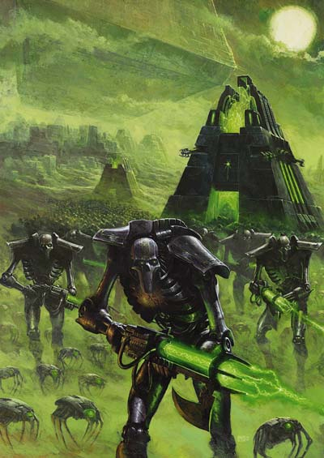

<!-- A0584-B0004 -->

原译文

The Necrons rise 死灵崛起

**校订译文**

The Necrons rise 死灵崛起

<!-- /A0584-B0004 -->

<!-- A0584-B0005 -->
## History 历史

<!-- /A0584-B0005 -->

<!-- A0584-B0006 -->
### Beginnings 起源

<!-- /A0584-B0006 -->

<!-- A0584-B0007 -->
**英文原文**

There are primitive artworks and tribal mythologies that speak of a xenos civilisation that existed billions of years before humans originated on Terra. This ancient race was known as the Necrontyr. They lived precariously, facing solar winds and radiation storms that kept their lives constantly afflicted by sickness and loss. Their cities were built with their short life-spans in mind, as their ancestral tomb complexes greatly outnumbered the living, which were considered little more than temporal residents. Despite their wondrous technologies, the Necrontyr had not been able to conquer their hereditary biological weakness. They also desperately sought to conquer other planets with less hostile environments, and eventually their Dynasties held control over a great part of the galaxy.

<!-- /A0584-B0007 -->

<!-- A0584-B0008 -->

原译文

有原始画作和部落神话，讲述了在人类起源于泰拉之前数十亿年就存在的异型文明。这个古老的种族被称为惧亡者。他们生命不稳定，面临着太阳风和辐射风暴，这些风暴使他们的生命不断受到疾病和亏蚀的折磨。他们的城市在建造时考虑到了他们短暂的寿命，因为他们的墓穴建筑群远远超过了活着的人，而活着的人被认为只不过是临时居民。尽管他们拥有神奇的技术，但惧亡者未能克服他们遗传的生物弱点。他们还拼命地试图征服其他环境不那么恶劣的行星，最终他们的王朝控制了银河系的大部分地区。

**校订译文**

一些原始艺术与部落神话，讲述着在人类诞生于泰拉前数十亿年便已存在的惧亡者文明。它们在恒星风与辐射风暴中艰难存活，一生不断遭受病痛、死亡与丧亲之苦。短促寿命深深塑造城市：祖先的巨大墓群远多于活人的居所，生者仿佛只是短暂停留。即使技术惊人，也无法克服遗传的生理弱点。它们拼命向环境较温和的星球扩张，最终各王朝控制了银河大片区域。

**校注：** 原文以祖先墓葬远多于活人表现短命文明，中文按城市空间语境组织；数十亿年前来自神话和原始艺术叙述，保留来源限定。

<!-- /A0584-B0008 -->

<!-- A0584-B0009 -->
**英文原文**

It was during their military campaigns that the Necrontyr first came into contact with the Old Ones—one of the first sentient races. As their empire expanded and grew more diverse, tensions between the Dynasties threatened their unity. Rebellions known as the First Wars of Secession erupted as entire realms fought for independence. The Triarch—the ruling council of Necrontyr—realised that only the threat of an external enemy would bring unity once more and saw the Old Ones as the perfect subjects for the wrath of their race. Already jealous of the Old Ones' seemingly eternal life spans, the Necrontyr initiated hostilities: the separatists abandoned their rebellion, and the War in Heaven began.

<!-- /A0584-B0009 -->

<!-- A0584-B0010 -->

原译文

正是在他们的军事行动中，惧亡者第一次接触到了古圣 — 最早有感知的种族之一。随着帝国的扩张和多样化，王朝之间的紧张关系威胁到了他们的统一。随着整个王国为独立而战，被称为第一次分裂战争的叛乱爆发了。三圣 — 惧亡者的统治议会 — 意识到只有外部敌人的威胁才能再次带来团结，并将古圣视为他们种族愤怒的完美对象。已经嫉妒古圣的看似永恒的生命，惧亡者发起了敌对行动：分离主义者放弃了叛乱，天堂之战开始了。

**校订译文**

惧亡者在征战中首次遇见古圣——最早的智慧种族之一。帝国扩张、内部日益多样，王朝关系也趋于紧张；整个领地纷纷争取独立，第一次分裂战争爆发。统治议会“三圣”意识到，只有外敌能重新团结全族，而寿命近乎永恒、早已引来嫉妒的古圣，正是转移怨恨的目标。惧亡者宣战后，分离派放弃叛乱，天堂之战由此开始。

<!-- /A0584-B0010 -->

<!-- A0584-B0011 -->
### The War in Heaven 天堂之战

<!-- /A0584-B0011 -->

<!-- A0584-B0012 -->
**英文原文**

The War in Heaven was one of the bloodiest wars in Galactic history, and it soon became apparent that the Necrontyr could never defeat the Old Ones and their mastery of the Warp despite their advanced technology. In a few short centuries, the Necrontyr were annihilated, left little more than an irritation, clinging to existence in the outer dark amongst the halo stars. The War in Heaven resulted in unspeakable loss of life over scores of generations: The unity of the Necrontyr began to fracture once more, resulting in the Second Wars of Secession. The Triarch again desperately searched for for a unifying force, and the Necrontyr searched for bitter centuries for some power to unleash upon the Old Ones—and their prayers were answered. There are conflicting accounts of how the godlike C’tan were first discovered—some archive say a chance probe, others say they were detected in their study of stars, and the Book of Mournful Night says the C’tan were drawn to the Necrontyr by the beacon of their raw hatred for the Old Ones. Seeking the aid of these all-powerful star gods, the Necrontyr sought the favour of the C'tan and constructed bodies of living metal to contain their essence.

<!-- /A0584-B0012 -->

<!-- A0584-B0013 -->

原译文

天堂之战是银河系历史上最血腥的战争之一，很快明显，尽管他们拥有先进的技术，但惧亡者永远无法击败古圣及其对亚空间的掌握。在短短的几个世纪里，惧亡者被彻底击败，只剩下一点恼怒，在光环群星之间的外部黑暗中坚持存在。天堂之战导致了数十代人无法形容的生命损失：惧亡者的团结再次开始破裂，导致了第二次分裂战争。三圣再次拼命寻找一种统一的力量，而惧亡者在痛苦的几个世纪里寻找一些力量来解决古圣 — 他们的祈祷得到了回应。关于类神的星神最初是如何被发现的，有相互矛盾的说法 — 一些档案说是偶然的探测，另一些档案说它们是在他们对恒星的研究中被探测到的，而《哀夜之书》说星神是被他们对古圣的原始仇恨的灯塔吸引到惧亡者身边的。为了寻求这些全能的星神的帮助，惧亡者寻求星神的青睐，并制造了活金属身体来容纳它们的精华。

**校订译文**

天堂之战是银河史上最惨烈的战争之一。惧亡者很快发现，即使技术先进，也无法抗衡精通亚空间的古圣。仅数世纪，它们便被击溃，退入光环群星之间的外缘黑暗苟延残喘，对古圣只剩微不足道的滋扰。数十代人付出难以言喻的牺牲，统一再次瓦解，第二次分裂战争随之爆发。三圣急寻凝聚全族的力量，惧亡者在痛苦中苦求数百年，终于有了回应。星神最初如何被发现，记载各异：有的归于偶然探测，有的称来自恒星研究；《哀夜之书》则说，是对古圣炽烈的仇恨如信标般引来了它们。为求这些强大存在援助，惧亡者制造活体金属躯壳，容纳星神本质。

**校注：** left little more than an irritation指残部对古圣只余轻微滋扰，非惧亡者只剩恼怒；annihilated后仍有幸存者，译击溃不译全族灭绝。 对照本段英文确认同一实体，与全书核心译名统一；不改变同形异义词或省略称呼。

<!-- /A0584-B0013 -->

<!-- A0584-B0014 图片 -->
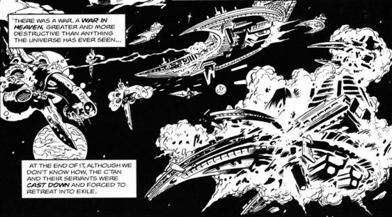

<!-- A0584-B0015 -->

原译文

The War in Heaven 天堂之战

**校订译文**

The War in Heaven 天堂之战

<!-- /A0584-B0015 -->

<!-- A0584-B0016 -->
**英文原文**

So it was that a C'tan known as the Deceiver had an audience with Szarekh the Silent King, lord of the Triarch. The C'tan offered the Silent King immortality and the power to lay low the Old Ones. They claimed this would be given freely, as from one ally to another, as they had also fought and been defeated by the Old Ones and were now looking for vengeance. The Triarch and their court internally discussed the offer for a year, during which the court astrologer, Orikan the Diviner, was the only voice against it. Szarekh was eventually won over by the honeyed words of the C'tan, dismissing Orikan's warnings in his eagerness to unify the Necrontyr and finally attain immortality.

<!-- /A0584-B0016 -->

<!-- A0584-B0017 -->

原译文

于是，一位被称为欺诈者的星神接见了寂静王、三圣领主斯扎拉克。星神为寂静王提供了不朽的生命和击败古圣的力量。他们声称，这将是自由的，就像从一个盟友到另一个盟友一样，因为他们也曾与古圣作战并被击败，现在正在寻求复仇。三圣和他们的宫廷内部讨论了这一提议一年，在此期间，宫廷占星家、占卜师欧瑞坎是唯一反对的声音。斯扎拉克最终被星神的甜言蜜语所说服，驳斥了欧瑞坎的警告，他渴望统一惧亡者，最终获得永生。

**校订译文**

名为欺诈者的星神觐见三圣之首、寂静王斯扎拉克，许诺永生与击倒古圣的力量。星神声称，同样曾败于古圣、如今只求复仇，因此愿像盟友互助一般无偿赠予。三圣与宫廷讨论一年，唯有宫廷占星家、占卜者欧瑞肯反对。斯扎拉克急于统一全族、获得永生，终被甜言蜜语打动，无视了警告。

**校注：** had an audience with为星神觐见寂静王，原接见颠倒；freely是无偿，不是自由。

<!-- /A0584-B0017 -->

<!-- A0584-B0018 -->
### The Biotransference 生体转化

<!-- /A0584-B0018 -->

<!-- A0584-B0019 -->
**英文原文**

Beginning the great Biotransference, by order of Szarekh, every Necrontyr was to submit to the great biofurnaces where their weak flesh was replaced with immortal bodies of living metal. The C'tan drank off the torrent of cast-off life and energy and grew stronger as Szarekh, now in a machine body himself, realised he had made a terrible mistake. The Necrontyr may now be immortal and unified, but they had lost their souls in the process; only few of the very strongest retained their minds and intellect. Thus the soulless machines known as the Necrons were born.

<!-- /A0584-B0019 -->

<!-- A0584-B0020 -->

原译文

根据斯扎拉克的命令，开始了大生体转化，每个惧亡者都要服从大圣体转化，在那里，他们虚弱的肉体被活金属的不朽身体所取代。星神饮下了被抛弃的生命和能量的洪流，当斯扎拉克意识到自己犯了一个可怕的错误时，他变得更强壮了。惧亡者现在可能是不朽和统一的，但他们在这个过程中失去了灵魂；只有少数最强壮的人保留了他们的思想和智慧。因此，被称为死灵的无魂机械诞生了。

**校订译文**

斯扎拉克下令开始大规模生体转化。所有惧亡者进入巨大的生体熔炉，以不朽的活体金属替换孱弱血肉。被剥离的生命与能量化为洪流，供星神吞饮，使其愈加强大。斯扎拉克自己也已化为机械，才意识到犯下可怕错误：全族虽永生、统一，却失去灵魂，只有极少数意志最强者还保有心智。无魂机械种族——太空死灵——由此诞生。

**校注：** biofurnaces生体熔炉被原译误为大圣体转化；变强主体是吞食能量的星神，不是斯扎拉克。

<!-- /A0584-B0020 -->

<!-- A0584-B0021 图片 -->
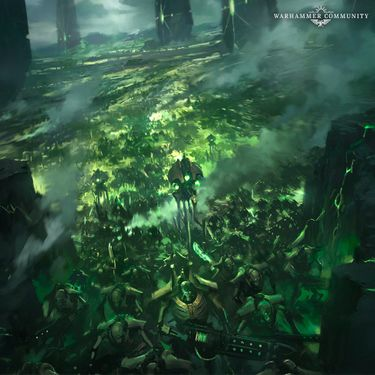

<!-- A0584-B0022 -->

原译文

Necron armies in the Age of the Dark Imperium 黑暗帝国时代的死灵军队

**校订译文**

Necron armies in the Age of the Dark Imperium 黑暗帝国时代的死灵军队

<!-- /A0584-B0022 -->

<!-- A0584-B0023 -->
**英文原文**

And so the second part of the War in Heaven began. Armed with weapons of god-like power, ships that could cross the galaxy in the blink of an eye, and utter supremacy in the material universe, the C'tan and Necrons fought as one. The Old Ones were overwhelmed and defeated in a bloody slaughter of galactic scale that saw systems devoured by black holes and stars extinguished. With the assistance of Nyadra'zatha, the Necron managed to infiltrate the Webway and assail the Old Ones in their own realm. The Necrons burst into the Old Ones' strongest fortresses, overcoming their magics and technology. In desperation, the Old Ones seeded planets with life with ever-stronger links to the warp, to help fight the C'tan, including the Eldar, Orks, K'nib, Rashan, Jokaero and many others. This worked, for a time—the energies of the warp were anathema to the C’tan—but before the Necron and C’tan could respond, the desperation of the Old Ones became their undoing. The Sea of Souls mirrored the war, pain, and destruction of the materium and awash with the spirits of those consumed in the carnage, older warp entities became terrifying predators. Their intergalactic network shattered, their places of power overrun by horrors of their own devising, and their minions possessed by the Enslaver Plague, the Old Ones were scattered—their power utterly broken.

<!-- /A0584-B0023 -->

<!-- A0584-B0024 -->

原译文

于是，天堂之战的第二部分开始了。星神和死灵拥有神一般力量的武器，可以在眨眼间穿越银河系的船只，以及在物质宇宙中的绝对霸权，他们作为一个整体战斗。在银河系规模的血腥屠杀中，古圣被淹没和击败，看到星系被黑洞吞噬，恒星熄灭。在尼亚德拉萨的协助下，死灵设法渗透到网道，并在他们自己的领域攻击古圣。死灵闯入了古圣最坚固的堡垒，克服了他们的魔法和技术。在绝望中，古圣在行星上播种了与亚空间有着越来越紧密联系的生命，以帮助对抗星神，包括灵族、欧克、克'尼卜、拉尚、太空猿猴和许多其他种族。这在一段时间内奏效了 — 亚空间的能量对星神来说是可憎的 — 但在死灵和星神做出回应之前，古圣的绝望成为了他们失败的原因。灵魂之海反映了战争、痛苦和物质界的破坏，充斥着那些在大屠杀中被吞噬的人的灵魂，古老的亚空间实体变成了可怕的掠食者。他们的星系间网络被摧毁，他们的力量场所被他们自己设计的恐怖所淹没，他们的下属被奴役者瘟疫所占据，古圣被分散，他们的力量被彻底摧毁。

**校订译文**

天堂之战的第二阶段随之展开。星神与死灵并肩作战，拥有威能近神的武器、转瞬横跨银河的舰船，以及物质宇宙中的绝对优势。古圣在横扫银河的血腥屠杀中溃败，星系被黑洞吞没，恒星熄灭。借尼亚德拉萨之助，死灵潜入网道，深入古圣自己的疆域，攻破最坚固的堡垒，压倒其魔法与技术。古圣绝望地在各星球培育与亚空间联系更强的生命，包括灵族、欧克、克’尼卜、拉尚、太空猿猴等，协助对抗星神。亚空间能量正是星神克星，此计一度奏效；但敌人尚未反制，绝望的古圣已自酿苦果。物质宇宙的战争、痛苦与毁灭映入灵魂之海，战死者的魂魄充斥其中，古老亚空间实体变为凶暴捕食者。古圣的河系间网络破碎，力量据点遭自身行径催生的恐怖侵占，麾下种族陷入奴役者瘟疫。古圣四散，其力量彻底崩溃。

<!-- /A0584-B0024 -->

<!-- A0584-B0025 -->
### Revolt 反抗

<!-- /A0584-B0025 -->

<!-- A0584-B0026 -->
**英文原文**

Throughout the final stages of the War in Heaven, Szarekh bided his time, waiting for the moment where the C'tan would be most vulnerable. With the Old Ones finally defeated, the Silent King struck and led a Necron revolt against the arrogant C'tan. The Necrons focused the unimaginable energies of the living universe into weapons too mighty for even the C'tan to endure. The C'tan, almost impossible to destroy entirely due to their very nature, were instead shattered into shards.

<!-- /A0584-B0026 -->

<!-- A0584-B0027 -->

原译文

在天堂之战的最后阶段，斯扎拉克等待时机，等待星神最脆弱的时刻。随着古圣最终被击败，寂静王发动了一场针对傲慢的星神的死灵反抗。死灵将活体宇宙中难以想象的能量集中在武器上，这些武器太强大了，连星神都无法承受。由于其性质，星神几乎不可能被完全摧毁，而是被分散成碎片。

**校订译文**

战争末期，斯扎拉克始终隐忍，等待星神最虚弱的瞬间。古圣一败，他便率死灵反抗傲慢的主人，将有生宇宙难以想象的能量汇入武器，连星神也无法承受。星神本质使其几乎不可能被彻底消灭，于是被击碎为无数碎片。

<!-- /A0584-B0027 -->

<!-- A0584-B0028 -->
### The Great Sleep 大休眠

<!-- /A0584-B0028 -->

<!-- A0584-B0029 -->
**英文原文**

Even with the defeat of both the Old Ones and C'tan, the Silent King saw that the time of the Necrons was—for the moment—over. The mantle of galactic domination would soon pass to the Eldar, who had fought alongside the Old Ones in the War in Heaven. The Necrons, weakened by the War in Heaven and the revolt against the C'tan, could not stand against them. Yet the Silent King knew that the time of the Eldar would pass, as did the time of all flesh. So it was that the Silent King ordered the remaining Necron cities to be transformed into great tomb complexes threaded with stasis-crypts. The Necrons were laid to rest, ordered to sleep for sixty million years and then reawaken, ready to rebuild all that was lost and restore the dynasties to their former glory. Yet the Silent King did not join his subjects. Destroying the command protocols by which he had controlled his people, the Silent King left the Galaxy, there to find whatever measure of solace or penance he could.

<!-- /A0584-B0029 -->

<!-- A0584-B0030 -->

原译文

即使击败了古圣和星神，寂静王也看到了死灵的时代 — 就目前而言 — 已经结束了。统治银河的衣钵很快就会传给灵族，他曾在天堂之战中与古圣并肩作战。死灵被天堂之战和对星神的反抗所削弱，无法对抗他们。然而，寂静王知道灵族的时代会过去，所有生灵的时代也会过去。于是，寂静王下令将剩下的死灵城市改造成巨大的墓穴群，里面有静滞墓穴。死灵被安葬，被命令沉睡六千万年，然后重新苏醒，准备重建所有失去的东西，恢复王朝昔日的辉煌。然而，寂静王没有加入他的臣民。寂静王摧毁了他控制人民的指挥协议，离开了银河系，在那里寻找他能找到的任何慰藉或忏悔。

**校订译文**

虽然古圣与星神都被击败，寂静王明白，死灵时代暂时已经结束。银河霸权即将落入曾与古圣并肩作战的灵族之手；天堂之战与反叛已让死灵无力抗衡。但他也相信，灵族终将衰落，一切血肉皆有尽头。于是，残存城市被改建为遍布静滞墓室的巨型陵寝，死灵奉命休眠六千万年，再醒来重建失落帝国、恢复王朝荣光。寂静王自己却未沉眠：他毁掉支配全族的指挥协议，离开银河，在虚空中寻找慰藉或赎罪。

<!-- /A0584-B0030 -->

<!-- A0584-B0031 -->
**英文原文**

For sixty million years the Necrons remained in their deathless slumber in their tombs in what became known as the Great Sleep. As time passed, many Tomb Worlds fell prey to malfunction or ill-fortune. Some were destroyed by marauding Eldar. These failures destroyed millions, if not billions of dormant Necrons.

<!-- /A0584-B0031 -->

<!-- A0584-B0032 -->

原译文

六千万年来，死灵一直在他们的墓穴中沉睡，这就是所谓的大休眠。随着时间的推移，许多墓穴世界都遭遇了故障或厄运。一些被劫掠的灵族摧毁。这些失败摧毁了数百万甚至数十亿休眠的死灵。

**校订译文**

六千万年的无尽沉眠，称为“大休眠”。岁月中，许多墓穴世界因故障或厄运损毁，有些毁于灵族突袭，数百万乃至数十亿沉睡个体因此永远灭亡。

<!-- /A0584-B0032 -->

<!-- A0584-B0033 图片 -->
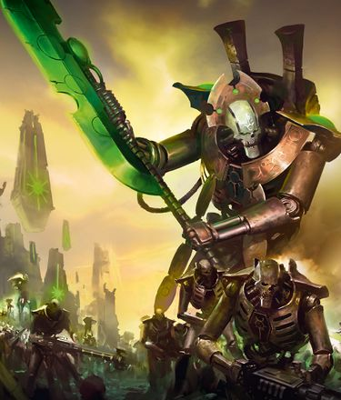

<!-- A0584-B0034 -->

原译文

Necron Overlord with a legion of Warriors marching onwards 死灵霸主率领一支战士军团向前行进

**校订译文**

Necron Overlord with a legion of Warriors marching onwards 死灵霸主率领一支战士军团向前行进

<!-- /A0584-B0034 -->

<!-- A0584-B0035 -->
### The Awakening 苏醒

<!-- /A0584-B0035 -->

<!-- A0584-B0036 -->
**英文原文**

When the Tomb Worlds did begin to reawaken, it was not simultaneously. Some awoke to see the Great Crusade, others during the Age of Apostasy. To avoid chaos, these prematurely awoken Necrons were organized under the Awakened Council. Most, however, awoke during the later years of M41; but even still billions of Necrons lay dormant. What the Imperium cannot know is that, should the Necrons ever fully wake and unite, they would face a foe as numerous as themselves. For now, the Imperium has had but a taste of the Necrons’ might, and it is fortunate for Mankind that the Necrons remain divided by madness and conflicting agendas. However, these are but the first stumbling steps of a giant as it gathers pace, and even now powerful leaders like Anrakyr the Traveler, Imotekh the Stormlord and the Silent King are uniting their people under a common cause in order to reestablish the Infinite Empire.

<!-- /A0584-B0036 -->

<!-- A0584-B0037 -->

原译文

当墓穴世界开始复苏时，它并不是同时出现的。一些人醒来后看到了大远征，另一些人则是在叛教时代。为了避免混乱，这些过早苏醒的死灵被组织在苏醒议会之下。然而，大多数在M41的后期醒来；但即使如此，仍有数十亿的死灵处于休眠状态。帝国不知道的是，如果死灵完全苏醒并团结起来，他们将面临和他们一样多的敌人。目前，帝国只尝到了死灵的力量，对人类来说幸运的是，死灵仍然被疯狂和相互冲突的议程所分裂。然而，这些只是巨人加快步伐的第一步，即使是现在，旅行者安拉基尔、风暴王伊莫泰克和寂静王等强大的领导人也在为了一个共同的事业团结他们的人民，以重建无限帝国。

**校订译文**

墓穴世界并未同时苏醒。有些醒来时目睹了大远征，有些醒于叛教时代；这些提前复苏者被纳入苏醒议会，以免陷入混乱。大多数则在第41千年后期醒来，但仍有数十亿沉眠。帝国尚不知晓：一旦死灵全部苏醒、团结，它将面对一个数量与自己相当的敌人。如今，人类只领教了死灵的一小部分力量，侥幸依靠其疯狂与目标分歧而免于全面威胁。然而，这只是巨人蹒跚起步。旅行者安拉基尔、风暴王伊摩特克与寂静王等强大领袖，正以共同目标凝聚同族，谋求重建无限帝国。

<!-- /A0584-B0037 -->

<!-- A0584-B0038 -->
**英文原文**

In 744.M41, the Silent King ended his self-imposed exile and returned to the galaxy after encounter with the Tyranids within the intergalactic void. He discovered the Tyranids were just one of many threats facing the Necrons. Other alien races had swarmed over their Tomb Worlds and the Warp now seeped across the Galaxy. He has begun a journey across the galaxy with a band of his loyal Triarch Praetorians to reawaken Tomb Worlds that still slumber so they may unite against the Tyranids. The returned Silent King is careful to not reveal his true identity, even to fellow Necrons. He works primarily through Triarch Praetorians or unwitting Crypteks and Necron Overlords to achieve his goal, and has steadily influenced the galaxy from one side to the other. Slowly, he has pursued his his great work from the shadows. He intends to unite the Necrons against the Tyranids while also manipulating the younger races to his own schemes.

<!-- /A0584-B0038 -->

<!-- A0584-B0039 -->

原译文

744.M41，寂静王结束了自我放逐，在星际虚空中与泰伦相遇后返回银河系。他发现泰伦只是死灵面临的众多威胁之一。其他外星种族已经蜂拥而至他们的墓穴世界，亚空间现在渗透到整个银河系。他与一群忠诚的三圣禁卫开始了穿越银河系的旅程，以唤醒仍在沉睡的墓穴世界，这样他们就可以团结起来对抗泰伦。归来的寂静王小心翼翼地不透露自己的真实身份，即使是对死灵同胞也是如此。他主要通过三圣禁卫或不知情的墓穴技师和死灵霸主来实现他的目标，并从一边到另一边稳步影响了银河系。慢慢地，他从阴影中追求他的大业。他打算团结死灵对抗泰伦，同时也操纵年轻种族实施自己的计划。

**校订译文**

744.M41，寂静王在河系间虚空遭遇泰伦后，结束自我放逐，重返银河。他发现，泰伦只是众多威胁之一：其他种族占据墓穴世界，亚空间侵蚀四方。他带着忠诚的三圣禁卫遍历银河，唤醒休眠世界，准备共同抗击泰伦。归来之初，他甚至对同族也隐瞒身份，主要通过禁卫，或不知情的墓穴技师与霸主推动计划，在阴影中逐步扩大影响。他既要团结死灵对抗虫群，也要操纵年轻种族，为自身谋划服务。

**校注：** 此段描述归来早期秘密活动，与后文公开建立驱灵死域为先后阶段，非同时状态。

<!-- /A0584-B0039 -->

<!-- A0584-B0040 图片 -->
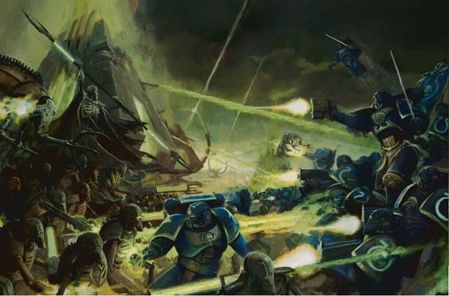

<!-- A0584-B0041 -->

原译文

Necrons battle the Ultramarines 死灵与极限战士战斗

**校订译文**

Necrons battle the Ultramarines 死灵与极限战士战斗

<!-- /A0584-B0041 -->

<!-- A0584-B0042 -->
**英文原文**

The first reported contact between the Necrons and the Imperium of Man came in 897.M41 during the raid on Sanctuary 101. The report specifies that the invaders might have emerged from the ground itself.

<!-- /A0584-B0042 -->

<!-- A0584-B0043 -->

原译文

据报告，死灵与人类帝国之间的首次接触发生在897.M41，在突袭101圣殿期间。报告明确指出，入侵者可能是从地面本身出现的。

**校订译文**

帝国档案中最早报告的正式接触，是897.M41对101圣殿的袭击；报告指出，入侵者可能直接从地下出现。

**校注：** 897.M41是帝国档案首报，非否定前面记述更早苏醒的事实。

<!-- /A0584-B0043 -->

<!-- A0584-B0044 -->
**英文原文**

After the formation of the Great Rift, Szarekh, the Silent King, accelerated his plans by creating the Pariah Nexus. This has proven controversial amongst other dynasties, most notably the Sautekh and their allies. The Sautekh Phaeron, Imotekh, has launched an open revolt against the Silent King's authority as part of the greater War in the Pariah Nexus.

<!-- /A0584-B0044 -->

<!-- A0584-B0045 -->

原译文

大裂隙形成后，寂静王斯扎拉克通过创建驱灵死域加速了他的计划。事实证明，这在其他王朝中是有争议的，尤其是索泰克王朝及其盟友。索泰克法皇，伊莫泰克，发起了一场公开反抗寂静王权威的叛乱，这是驱灵死域更大战争的一部分。

**校订译文**

大裂隙形成后，斯扎拉克通过建立驱灵死域加速计划，却引起其他王朝争议，尤以索泰克及其盟友反应强烈。其法皇伊摩特克公开反抗寂静王，成为驱灵死域大战的一部分。

<!-- /A0584-B0045 -->

<!-- A0584-B0046 -->
## Abiology 机械躯体

原题：Abiology 非生理

<!-- /A0584-B0046 -->

<!-- A0584-B0047 -->
**英文原文**

In appearance, the Necrons are skeletal parodies of living beings with swirling green energies emanating from their mechanical limbs and baleful lifeless emerald eyes. Necrons' bodies contain blood-like coolant to prevent their internal energy reactors from overheating. Physically, Necrons are undying beings whose bodies exhibit superior strength and endurance to that of organics. While purely mechanical, Necrons still experience pain due to its biological usefulness. Moreover they can even be "strangled" in a sense as the act of severing the flow of coolant from their core to their neural matrices will result in eventual death.

<!-- /A0584-B0047 -->

<!-- A0584-B0048 -->

原译文

从外表上看，死灵是对生物的骨骼模仿，它们的机械肢体和充满敌意的无生命的翡翠眼睛散发出旋转的绿色能量。死灵的身体含有类似血液的冷却剂，以防止其内部能量反应堆过热。从身体上讲，死灵是不朽的生物，他们的身体表现出比有机物更强的力量和耐力。虽然纯粹是机械性的，但由于其生物用途，死灵仍然会感到疼痛。此外，从某种意义上说，它们甚至可能被“勒死”，因为切断冷却剂从其核心到神经基质的流动将导致最终死亡。

**校订译文**

死灵的外形仿佛对生者骸骨的讽刺，机械肢体与毫无生气的恶意翠眼间涌动绿光。体内有如血液般的冷却剂，防止能量反应堆过热。躯体不朽，力量与耐久远胜血肉生物；虽然完全机械化，仍保留有用的疼痛反馈。某种意义上，它们甚至会被“勒死”：只要阻断核心流往神经矩阵的冷却剂，便可能最终导致死亡。

<!-- /A0584-B0048 -->

<!-- A0584-B0049 图片 -->
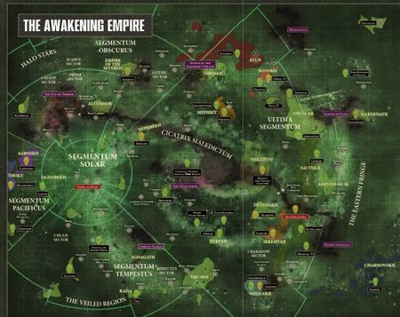

<!-- A0584-B0050 -->

原译文

Necron territory across the galaxy 银河系中的死灵领地

**校订译文**

Necron territory across the galaxy 银河系中的死灵领地

<!-- /A0584-B0050 -->

<!-- A0584-B0051 -->
**英文原文**

Necrons have some robotic counterparts that are comparable to their past organic body parts. Eyes are substituted by oculars, ears by auditory transducers, skin by necrodermis, and their faces by faceplates or death masks. Ribcages remain with their name unchanged, except they now protect an internal energy reactor, rather than life-sustaining organs. Necron perpetual energy reactors require coolant to avoid catastrophic meltdowns, particularly in times of high stress, but can otherwise power their user indefinitely. The reactors give off a distinctive green glow from within their chest cavities.

<!-- /A0584-B0051 -->

<!-- A0584-B0052 -->

原译文

死灵有一些机械对应物，与它们过去的有机身体部位相当。眼睛被目镜取代，耳朵被听觉传感器取代，皮肤被死灵金属取代，脸被面甲或死亡面具取代。肋骨保持其名不变，除了它们现在保护的是内部能量反应堆，而不是维持生命的器官。死灵永恒能量反应堆需要冷却剂来避免灾难性的熔毁，特别是在高应力时期，否则可以无限期地为用户供能。反应堆从胸腔内发出独特的绿光。

**校订译文**

死灵许多构造对应旧日血肉器官：目镜替代眼睛，听觉换能器替代耳朵，死灵金属替代皮肤，面甲或死亡面具替代脸。肋骨仍沿原名，却改为保护体内反应堆。持续供能的反应堆需要冷却剂，尤其在高负荷时，以免发生灾难性熔毁；除此之外，它可以无限期供能，并从胸腔中透出独特绿光。

<!-- /A0584-B0052 -->

<!-- A0584-B0053 -->
**英文原文**

Other parts of their bodies/armour include their shoulder plate or shoulder guard. High-ranking Necrons such as Overlords have command nodes stemming from their shoulder guards, which convey their orders to their warriors. Necrons have complex neural matrices installed in their head which contained their cognitive processors, personalities, and memories. Despite this, skilled Necrons such as Trazyn can swiftly transfer their consciousness and neural information to new bodies should the present one be destroyed.

<!-- /A0584-B0053 -->

<!-- A0584-B0054 -->

原译文

他们身体/盔甲的其他部分包括肩甲或护肩。霸主等高级死灵有来自他们的护肩的指挥节点，这些护肩将他们的命令传达给他们的战士。死灵的大脑中安装了复杂的神经矩阵，其中包含了他们的认知处理器、个性和记忆。尽管如此，如果现在的身体被摧毁，像塔拉辛这样的熟练死灵可以迅速将他们的意识和神经信息转移到新的身体上。

**校订译文**

肩甲等构造也是躯体与装甲的一部分。霸主这类高阶死灵的护肩伸出指挥节点，向麾下武士传达命令。头部安装复杂的神经矩阵，容纳认知处理器、人格与记忆。塔拉辛等精通此道者，即使躯体被毁，也能迅速将意识和神经信息转移至新身体。

<!-- /A0584-B0054 -->

<!-- A0584-B0055 -->
**英文原文**

Cognitively, the majority of the Necron race are little more than mindless automatons. Only the nobility and specialist orders such as Crypteks possessed enough wealth and status to attain bodies with more advanced cognitive systems that allowed them to retain free will and personality post-Biotransference. The soldierly were given bodies deemed adequate but possessing simpler minds, with mid-level commanders such as Royal Wardens expressing an almost childlike personality prone to repetitively performing the same simple tasks. Yet this is still better than the commoners, who were only distributed with crude armoured forms that were little more than prisons into which their now-empty minds were placed. Numb to all joy and experience, they are bound solely to the will of their superiors. Even Necron children were transferred into fully "adult" bodies and had their minds wiped of all sentience. Yet aeons of slumbering and various mishaps regarding reawakening protocols have seen some of even the highest ranked Necron Overlords succumb to madness and senility. Many have now have eccentric personalities and will pursue their own agendas regardless of how distorted it may be. Further examples of the madness and mental decay sweeping through many of the Necrons can be seen in the Flayer Virus and Destroyer Cult.

<!-- /A0584-B0055 -->

<!-- A0584-B0056 -->

原译文

从认知上讲，大多数死灵种族只不过是无意识的机器人。只有像墓穴技师这样的贵族和专家阶层拥有足够的财富和地位，才能获得具有更先进认知系统的身体，使他们在生体转化后能够保持自由意志和个性。士兵们被赋予了被认为足够的身体，但头脑更简单，皇家督军等中级指挥官表现出一种近乎孩子般的个性，倾向于重复执行同样的简单任务。然而，这仍然比平民好，平民只被分发了简陋的装甲形式，这些形式只不过是他们现在空虚的头脑被关进的监狱。麻木给所有的快乐和经验，他们只受上级意志的约束。甚至死灵儿童也被转移到完全“成年”的身体里，他们的头脑被抹去了所有的知觉。然而，在漫长的沉睡和各种关于重新唤醒协议的事故中，甚至一些排名最高的死灵霸主也屈服于疯狂和衰老。许多人现在都有古怪的性格，无论议程有多扭曲，他们都会追求自己的议程。在剥皮者病毒和毁灭者教派中可以看到许多死灵疯狂和精神衰退的进一步例子。

**校订译文**

绝大多数死灵在认知上几乎只是无意识自动机。唯有贵族，以及墓穴技师这样的专业阶层，拥有足够财富、地位，取得先进认知系统，在转化后保留自由意志和人格。军人得到堪用但心智较简单的躯体；皇家监军等中层指挥者甚至表现出近似孩童的人格，倾向反复执行简单任务。这仍好过平民：他们只获粗陋装甲外壳，仿佛囚禁空洞心灵的监狱，对快乐与体验麻木，只能服从上级。连儿童也被送入“成年”大小的躯体，抹去一切意识。漫长休眠和唤醒协议的意外，又令部分最高贵的霸主疯狂、衰退，性情怪异，执着追逐扭曲目标。剥皮者病毒与毁灭者教派，也体现了席卷同族的精神败坏。

**校注：** 贵族与墓穴技师为并列群体，原译“像墓穴技师这样的贵族”误并身份；Royal Warden官译皇家监军。

<!-- /A0584-B0056 -->

<!-- A0584-B0057 -->
**英文原文**

Necrons possess Chronosense, which allows them to adjust the speed of their perception of time. This combined with their immortality has made the Necrons ponderously slow to perform many tasks. Legal proceedings and even theatrical performances can often take over a decade.

<!-- /A0584-B0057 -->

<!-- A0584-B0058 -->

原译文

死灵拥有时间知觉，这使他们能够调整对时间的感知速度。这与他们的不朽相结合，使死灵在执行许多任务时变得迟缓。法律程序甚至戏剧表演往往需要十多年的时间。

**校订译文**

死灵具备“时间知觉”，能调整主观感知时间的速度。结合不朽寿命，这使他们处理许多事情时极其缓慢：一次法律程序，乃至一场戏剧，都可能持续十余年。

<!-- /A0584-B0058 -->

<!-- A0584-B0059 -->
### Reanimation Protocols 复活协议

<!-- /A0584-B0059 -->

<!-- A0584-B0060 -->
**英文原文**

All Necrons possess sophisticated auto-repair systems (dubbed Reanimation Protocols) throughout their exo-skeletal systems that can repair even the most crippling of damage. While this can keep them functioning constantly, should there be irreparable damage sustained, the Necron "phases out". Both their minds and their bodies are teleported to the nearest tomb complex or orbiting ship where they either remain in storage until repairs are made or a new body is forged. This act does, however, come at a cost as each act of transference leads to a decay in the Necron's engrams. As such, those Necrons that have "died" and phased out hundreds of times suffer the most for they become little more than automatons who have lost the memory of the creature that they used to be in life.

<!-- /A0584-B0060 -->

<!-- A0584-B0061 -->

原译文

所有死灵在其整个外骨骼系统中都拥有复杂的自动修复系统（称为复活协议），可以修复甚至最严重的损伤。虽然这可以使它们持续运作，但如果造成不可挽回的损害，死灵会“逐步退出”。他们的思想和身体都传送到最近的墓穴群或轨道船上，在那里他们要么留在仓库里，直到进行维修或锻造新的身体。然而，这一行为确实是有代价的，因为每一次转移行为都会导致死灵记忆印记的衰退。因此，那些已经“死亡”并被逐步退出数百次的死灵遭受的痛苦最大，因为它们只不过是失去了对过去生物记忆的机器人。

**校订译文**

所有死灵的外骨骼都装有精密自动修复系统，即“复生协议”，连重创也能修复。若损伤无法就地弥补，便会“相位撤离”：心智与躯体被传送至最近墓穴或轨道舰船，封存等待修复，或重铸新身。每次转移却会损耗记忆印痕；数百次“死亡”再撤离后，个体可能几乎退化为自动机，再也不记得生前的自己。

**校注：** phase out为相位撤离，不是逐步退出；engrams记忆印痕为技术语境。

<!-- /A0584-B0061 -->

<!-- A0584-B0062 图片 -->
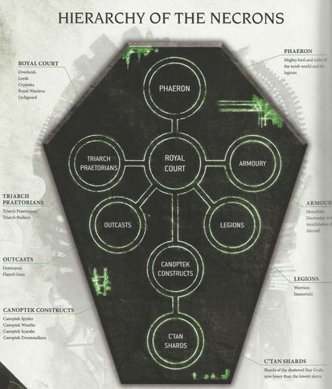

<!-- A0584-B0063 -->

原译文

Necron Dynasty hierarchy 死灵王朝层级

**校订译文**

Necron Dynasty hierarchy 死灵王朝层级

<!-- /A0584-B0063 -->

<!-- A0584-B0064 -->
## Hierarchy 层级

<!-- /A0584-B0064 -->

<!-- A0584-B0065 -->
**英文原文**

The Necrons inherited the same form of government as the Necrontyr. The highest political body of the Infinite Empire is the Triarchy, which consists of the Silent King and two high-ranking Phaerons. The agents of the Triarchy are the Triarch Praetorians, who enforce the Triarch's will upon the lower Dynasties.

<!-- /A0584-B0065 -->

<!-- A0584-B0066 -->

原译文

死灵继承了与惧亡者相同的政府形式。无限帝国的最高政治机构是三圣，由寂静王和两名高级法皇组成。三圣的代理人是三圣禁卫，他们将三圣的意志强加给下级王朝。

**校订译文**

太空死灵沿袭惧亡者政制。无限帝国最高权力机构是三圣，由寂静王与两名高阶法皇组成；三圣禁卫担任执行者，向各王朝贯彻其意志。

<!-- /A0584-B0066 -->

<!-- A0584-B0067 -->
**英文原文**

During the Great Sleep the Silent King was on a self-imposed exile into the void between galaxies while the majority of the Necron race was still in hibernation. However at least 10,000 years before the 41st Millennium a number of Necrons had prematurely awoken. To prevent chaos until such a time the Silent King could be found, the Necrons operated the Awakened Council to settle inter-dynastic disputes.

<!-- /A0584-B0067 -->

<!-- A0584-B0068 -->

原译文

在大休眠期间，寂静王自我放逐到星系之间的虚空中，而大多数死灵种族仍处于休眠状态。然而，在第41个千年之前的至少10000年，一些死灵过早地苏醒了。为了防止混乱，直到找到寂静王，死灵组织运作了苏醒议会来解决王朝间的争端。

**校订译文**

大休眠期间，多数死灵沉睡，寂静王则自我放逐于河系之间。至迟在第41千年前一万年，已有一些个体提前醒来。为在找到寂静王前维持秩序，它们设立苏醒议会，裁决王朝争端。

<!-- /A0584-B0068 -->

<!-- A0584-B0069 图片 -->
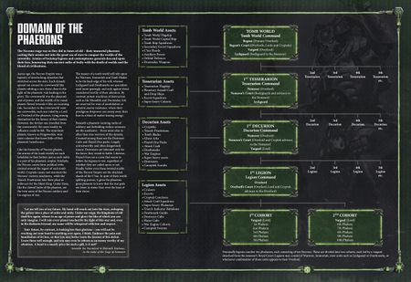

<!-- A0584-B0070 -->

原译文

Necron Tomb World hierarchy 死灵墓穴世界层级

**校订译文**

Necron Tomb World hierarchy 死灵墓穴世界层级

<!-- /A0584-B0070 -->

<!-- A0584-B0071 -->
**英文原文**

The rank-and-file automatons of the Necrons have programming which prevents them from firing on one another. This protocol can only be overridden by a Overlord or Lord of their affiliated dynasty.

<!-- /A0584-B0071 -->

<!-- A0584-B0072 -->

原译文

死灵的普通自动机具有防止它们相互射击的程序。该协议只能由其附属王朝的霸主或领主推翻。

**校订译文**

普通死灵自动兵装有禁止互相射击的程序，只有所属王朝的领主或霸主能解除限制。

<!-- /A0584-B0072 -->

<!-- A0584-B0073 -->
### Necron Dynasties 死灵王朝

<!-- /A0584-B0073 -->

<!-- A0584-B0074 -->
**英文原文**

The Infinite Empire itself is hierarchical. The highest of the Necrons are the Phaerons, the ruler of entire dynasties which comprise many worlds. Beneath these are the Overlords, who rule clusters of Tomb Worlds within their Phaeron's domain. Beneath the Overlords are the Lords, each overseeing a Tomb World. Phaerons and Overlords are served by a Royal Court of Necron Lords and Crypteks. The size of a Royal Court is not only prestigious, it is also an indication of that military power of the noble who rules it. Much like those of Humanity, Necron Courts are rife with webs of political intrigue. Below the Royal Court are the War-Phalanxes of the Necrons, including Necron Warriors (which are the always the core of any Necron legion), Immortals, and war engines. Beneath these ranks are auxiliaries more akin to allies than true warriors. These include the Destroyer Cults and Flayed Ones. Supporting all this are vast swarms of fully autonomous Canoptek constructs. And it is at the bottom of this empire that the captive C'tan endure, shackled and used by their Necron overseers.

<!-- /A0584-B0074 -->

<!-- A0584-B0075 -->

原译文

无限帝国本身就是等级制度。死灵中最高的是法皇，他是包括许多世界的整个王朝的统治者。在这些之下是霸主，他们统治着法皇领地内的墓穴世界集群。在霸主之下是领主，每个领主都监督着一个墓穴世界。法皇和霸主由死灵领主和墓穴技师的皇家宫廷服务。皇家宫廷的规模不仅享有盛誉，也表明了统治它的贵族的军事力量。就像人类一样，死灵宫廷充斥着政治阴谋网。在皇家宫廷之下是死灵的战争方阵，包括死灵战士（他们始终是任何亡灵军团的核心）、不朽者和战争引擎。在这些队伍之下，是更像盟友而非真正战士的辅助部队。这些包括毁灭者教派和剥皮者。支持这一切的是大量完全自主的冥工构造体。被俘虏的星神忍受着这个帝国的底部，被他们的死灵监督者束缚和使用。

**校订译文**

无限帝国等级森严。法皇统治包含多个世界的整个王朝；其下的霸主分掌墓穴世界群；再下的领主各管一个墓穴世界。死灵领主与墓穴技师组成皇家宫廷，为法皇、霸主效力，宫廷规模既象征威望，也体现军事力量，与人类宫廷一样充满阴谋。其下是作战方阵，由每支军团核心的太空死灵武士、不朽者及战争机械组成。再外围则有更接近盟军的辅助力量，如毁灭者教派、剥皮者。庞大而自主运转的冥工构造体支撑整个体系。最底层则是被囚禁的星神，承受枷锁，任死灵监守役使。

<!-- /A0584-B0075 -->

<!-- A0584-B0076 -->
**英文原文**

The goals and personalities of the nobles across Necron dynasties vary greatly. Some may be interested in conquest or extermination of lesser races, others may only act defensively if their territory is intruded upon. Others seek to reverse Biotransference by using a younger organic race as hosts. Others such as the Destroyer Cult have embraced their machine nature and seek to cleanse the galaxy of all life. It is also not uncommon for Dynasties to battle one another.

<!-- /A0584-B0076 -->

<!-- A0584-B0077 -->

原译文

死灵王朝贵族的目标和性格差异很大。有些人可能对征服或消灭较小的种族感兴趣，而另一些人只有在他们的领土受到侵犯时才会采取防御行动。其他人试图通过使用年轻的有机种族作为宿主来逆转生体转化。其他人，如毁灭者教派，已经接受了他们的机械本性，并寻求清除银河系中的所有生命。王朝之间相互争斗也并不罕见。

**校订译文**

各王朝贵族性情与目标差异极大。有些想征服、灭绝被视为低等的种族，有些只在领土受侵时自卫；有人试图借年轻血肉种族为宿主，逆转生体转化；毁灭者教派之流则彻底接受机械本性，誓要清除银河的一切生命。王朝互相开战也并不少见。

<!-- /A0584-B0077 -->

<!-- A0584-B0078 -->
**英文原文**

Many Necron Dynasties have not fully emerged from the Great Sleep, or were damaged during their millions of years in hibernation. The level of awakening of a Dynasty and how intact it endured its slumber often determines its strength and size. The Sautekh Dynasty for instance, widely regarded as the most powerful Necron Dynasty, emerged from the Great Sleep almost entirely intact.

<!-- /A0584-B0078 -->

<!-- A0584-B0079 -->

原译文

许多死灵王朝并没有完全从沉睡中醒来，或者在数百万年的休眠中受到了破坏。一个王朝的苏醒程度以及它在沉睡中的完整程度往往决定了它的力量和规模。例如，被广泛认为是最强大的死灵王朝的索泰克王朝，几乎完全完好无损地从沉睡中出现。

**校订译文**

许多王朝尚未完全从大休眠中苏醒，或已在历时数百万年的沉眠中受损。苏醒程度与保存状况，往往决定其规模与实力。索泰克王朝几乎完好无损地醒来，因此被广泛视为最强王朝。

**校注：** 复查英文细节与数量，补明对象、地点或程度，避免精简中文时削弱原意。

<!-- /A0584-B0079 -->

<!-- A0584-B0080 -->
## Technology 技术

<!-- /A0584-B0080 -->

<!-- A0584-B0081 -->
**英文原文**

The Necrons are the masters of Material technology, and their technological feats may seem magical to lesser races. Their technological masters, Crypteks, can manipulate matter at a fundamental level and wield such arcane concepts as phase-gates, subatomic infusion, and temporal looping. Several Necron super-weapons such as the World Engine and Celestial Orrery have galaxy-devastating capabilities. However it is Living Metal, or Necrodermis, which equips nearly all Necron technology. These billion-strong swarns of nano-Scarabs crawl under the skin of Necrons at a cellular level, allowing for self-repair and regeneration. Also, on particularly rare occasions, a super heavy Necron device called a Necron Pylon is seen. It is feared for its extreme power and ability to appear anywhere on the battlefield.

**校注：** 按段物质层面技术而非狭义材料科学；原文swarns疑swarms。

<!-- /A0584-B0081 -->

<!-- A0584-B0082 -->

原译文

死灵是材料技术的大师，他们的技术壮举对较小的种族来说可能看起来很神奇。他们的技术大师墓穴技师可以在基础层面操纵物质，并运用相位门、亚原子注入和时间循环等神秘概念。一些死灵超级武器，如世界引擎和璀璨星图，具有毁灭银河系的能力。然而，它是活金属，或死灵金属，几乎配备了所有的死灵技术。这些数以十亿计的纳米圣甲虫在细胞水平上在死灵的皮肤下爬行，允许自我修复和再生。此外，在极少数情况下，可以看到一种称为死灵方尖塔的超重型死灵装置。人们担心它的极端力量和出现在战场上任何地方的能力。

**校订译文**

死灵精通操纵物质的技术，在较低等种族眼中，其成就近乎魔法。墓穴技师能从根本层面改变物质，运用相位门、亚原子灌注和时间循环等奥秘。世界引擎、璀璨星图等超级武器，甚至具有摧残银河的威能。几乎所有技术都应用活体金属，又称死灵金属：数十亿纳米圣甲虫在微观尺度活动，令躯体自我修复、再生。极少见的超重型死灵方尖塔同样可怕，火力惊人，还能出现在战场任意位置。

<!-- /A0584-B0082 -->

<!-- A0584-B0083 -->
**英文原文**

Necron rank-and-file troops are equipped with a devastating array of armament, most notably Gauss Weapons which strip away a foes atoms layer by layer and give the Necrons a fearsome level of firepower. Their anti-grav warmachines are based around the art of invasion and terror, wielding horrifying energy weaponry and other esoteric abilities such as Worm Holes. The Necrons also wield large amounts of non-sentient Robots known as Canoptek constructs, which tended their Tomb Worlds during the Great Sleep.

<!-- /A0584-B0083 -->

<!-- A0584-B0084 -->

原译文

死灵的普通部队配备了一系列毁灭性的武器，最著名的是高斯武器，它一层一层地剥离敌人的原子，给死灵带来可怕的火力。他们的反重力武器基于入侵和恐怖的艺术，挥舞着可怕的能量武器和其他深奥的能力，如虫洞。死灵还使用大量被称为冥工构造体的无感知机兵，这些机兵在大休眠期间照料他们的墓穴世界。

**校订译文**

普通死灵士兵就配备大量毁灭性武器，尤以逐层剥离敌人原子的高斯武器著称。反重力战争机械为入侵与恐怖打击而造，使用可怕能量武器，还能运用虫洞等奇异技术。大量无自我意识的冥工机器人也为其服务，在大休眠中照料墓穴世界。

<!-- /A0584-B0084 -->

<!-- A0584-B0085 -->
**英文原文**

The Necron fleet is a small but deadly force capable of destroying most ships very easily. They also don't make use of the same form of interstellar travel, the Warp, as other races do, making them difficult to intercept. The Necron Fleet achieves FTL travel by a variety of means, such as Dolmen Gates and Inertialess Drive.

<!-- /A0584-B0085 -->

<!-- A0584-B0086 -->

原译文

死灵舰队是一支规模虽小但致命的部队，能够很容易地摧毁大多数船只。他们也不像其他种族那样使用相同的星际航行形式，即亚空间，这使得他们很难被拦截。死灵舰队通过多种方式实现超光速航行，如墓石之门和无惯性驱动器。

**校订译文**

死灵舰队规模虽小，却极其致命，能够轻易毁掉多数舰船。它们不依赖其他种族那样的亚空间航行，而以墓石之门、无惯性驱动等多种方式实现超光速移动，因此难以截击。

<!-- /A0584-B0086 -->

<!-- A0584-B0087 图片 -->
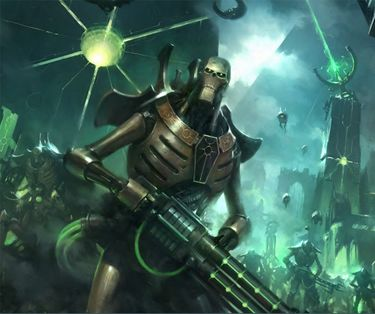

<!-- A0584-B0088 -->

原译文

Necrons of the Szarekhan Dynasty 斯扎拉坎王朝死灵

**校订译文**

Necrons of the Szarekhan Dynasty 斯扎拉坎王朝死灵

<!-- /A0584-B0088 -->

<!-- A0584-B0089 -->
**英文原文**

The Necrons are known for their Blackstone, a substance which can block the powers of the Warp. This makes the Necrons anathema to Chaos, and Blackstone has become a precious commodity across the Galaxy. Blackstone most notably was used in the Cadian Pylons, which held back the power of the Eye of Terror.

<!-- /A0584-B0089 -->

<!-- A0584-B0090 -->

原译文

死灵以黑石而闻名，黑石是一种可以阻断亚空间力量的物质。这使得死灵对混沌深恶痛绝，黑石已成为整个银河系的珍贵商品。黑石最著名的是用于卡迪亚方尖塔，它阻挡了恐惧之眼的力量。

**校订译文**

死灵还以黑石著称。这种物质能阻隔亚空间力量，使死灵成为混沌的克星，也让黑石成为全银河争夺的珍贵资源。最著名的应用是卡迪亚方尖塔，曾压制恐惧之眼的力量。

**校注：** anathema to Chaos为对混沌有克制/排斥效力，原“对混沌深恶痛绝”误作情感。

<!-- /A0584-B0090 -->

<!-- A0584-B0091 -->
**英文原文**

The species are also able to use their technology to create hidden Sub-dimensional reality bubbles, that lie outside of Realspace and are connected to Tomb Worlds via Reality-Tethers. They can have strongholds built within them and the dimensions can be designed so only their owners or serving minions can enter or exit them. Their mastery of fundamental physics is also the source of materials such as Strangesteel or Megaton Matter, and of the Antimatter Collider.

<!-- /A0584-B0091 -->

<!-- A0584-B0092 -->

原译文

死灵还能够利用他们的技术创造隐藏的亚维度现实泡泡，这些泡泡位于现实空间之外，并通过现实系绳与墓穴世界相连。他们可以在里面建造据点，并且可以设计尺寸，这样只有他们的主人或正在服役的下属才能进入或离开他们。他们对基础物理学的掌握也是奇异钢或百万吨物质等材料以及反物质对撞机的来源。

**校订译文**

死灵技术还能在现实空间之外创造隐秘的亚维度现实泡，以“现实系缆”连通墓穴世界，内建要塞，并设定仅主人或仆从可出入的限制。对基础物理的掌控，也让它们制造出奇异钢、兆吨物质和反物质对撞机。

**校注：** dimensions指维度本身，非设计尺寸；专有材料暂兆吨物质，非仅陈述物体质量。

<!-- /A0584-B0092 -->

<!-- A0584-B0093 -->
## Culture 文化

<!-- /A0584-B0093 -->

<!-- A0584-B0094 -->
**英文原文**

While the majority of common Necrons are little more than obedient autonomations, the higher nobility have a complex culture inherited from their days as Necrontyr. Nobility, honour, loyalty to one's liege and pride in one's hereditary titles are all common amongst the rulers of the Necron race. Loyalty and honour are particularly emphasised to the point that over the long millennia, Necron Lords maintain a labyrinthine web of ranks, titles, and allegiances. Necron honour is usually reserved only for other Necrons, and they will usually disdain from using "distasteful" means in their many inter-dynastic conflicts such as Destroyers, Deathmarks, or Flayed Ones. This honour has at times even extended to non-Necron races deemed worthy and honourable adversaries. However, more often than not, Necrons deem other races as little more than vermin worthy only of extermination.

<!-- /A0584-B0094 -->

<!-- A0584-B0095 -->

原译文

虽然大多数普通的死灵只不过是顺从的自主，但更高的贵族有着从惧亡者时代继承下来的复杂文化。高贵、荣誉、对领主的忠诚和对世袭头衔的自豪感在死灵种族的统治者中都很常见。忠诚和荣誉被特别强调，以至于在漫长的数千年里，死灵领主保持着一个由等级、头衔和忠诚组成的迷宫般的网络。死灵的荣誉通常只留给其他死灵，他们通常会不屑于在许多王朝间的冲突中使用“令人厌恶”的手段，如毁灭者、死亡印记或有剥皮者。这一荣誉有时甚至延伸到被视为值得尊敬的对手的非死灵种族。然而，通常情况下，死灵认为其他种族只不过是值得灭绝的害兽。

**校订译文**

普通死灵大多只是服从命令的自动机，高阶贵族却保有惧亡者时代的复杂文化，重视高贵血统、荣誉、效忠与世袭头衔。忠诚和荣誉尤其重要，数千年间形成了迷宫般的等级、封号与效忠关系。但这套尊重通常只给予同族；王朝内战时，他们往往不屑动用毁灭者、死印战士、剥皮者等“不体面”手段。有时，值得尊敬的异族对手也能享此待遇；更多时候，其他种族只被看作应予灭绝的害虫。

<!-- /A0584-B0095 -->

<!-- A0584-B0096 图片 -->
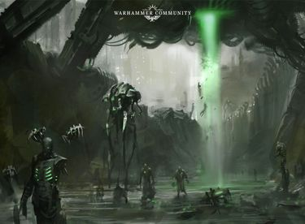

<!-- A0584-B0097 -->

原译文

Necron constructs 死灵构造体

**校订译文**

Necron constructs 死灵构造体

<!-- /A0584-B0097 -->

<!-- A0584-B0098 -->
**英文原文**

There is no set system of ideology amongst the Necron race and their motivations and philosophies will differ greatly from dynasty to dynasty. Some dynasties, like the Kastak wish to regain their organic forms while Imotekh, Phaeron of the powerful Sautekh Dynasty, has embraced the machine bodies of the Necrons as superior. Others, such as the Szarekhan and their allies, follow the Silent King and seek to achieve Necron domination of the Galaxy. Others such as the Maynarkh are hyper-violent and seek only to exterminate all organic life, while the Nihilakh are isolationists that seek to gather treasures and knowledge to themselves.. Meanwhile, the Necrons under the control of Thaszar act as pirates and reavers.

<!-- /A0584-B0098 -->

<!-- A0584-B0099 -->

原译文

死灵种族之间没有固定的意识形态体系，他们的动机和哲学会因王朝而异。一些王朝，如卡斯塔克王朝，希望恢复其有机形态，而强大的索泰克王朝的法皇伊莫泰克则认为死灵的机械身体更优越。其他人，如斯扎拉坎及其盟友，追随寂静王，寻求实现死灵对银河系的统治。其他的，如美奈克，极度暴力，只想消灭所有有机生命，而尼希拉克是寻求为自己收集宝藏和知识的孤立主义者。与此同时，塔萨尔控制下的死灵作为海盗和掠夺者行动。

**校订译文**

死灵没有全族一致的思想体系。卡斯塔克等王朝希望重获血肉，索泰克法皇伊摩特克却认为机械躯体更优越；斯扎拉坎及盟友追随寂静王，谋求重掌银河；美奈克极端暴烈，只求灭尽有机生命；尼希拉克奉行孤立，专注搜集财富与知识。塔萨尔麾下则以海盗和劫掠者为业。

<!-- /A0584-B0099 -->

<!-- A0584-B0100 -->
**英文原文**

Despite there being little unity amongst the majority of the Necron dynasties, those Necrons that go against their complex codes of loyalty and honour sometimes risk the wrath of Triarch Praetorians, which act as enforcers for the Silent King and Necron race as a whole.

<!-- /A0584-B0100 -->

<!-- A0584-B0101 -->

原译文

尽管大多数死灵王朝之间几乎没有团结，但那些违背复杂的忠诚和荣誉准则的死灵有时会冒着三圣禁卫的愤怒，他们是寂静王和整个死灵种族的执行者。

**校订译文**

王朝虽缺少统一，违背复杂忠诚与荣誉准则者，仍可能招致三圣禁卫惩罚；它们执行寂静王及整个死灵种族的权威。

<!-- /A0584-B0101 -->

<!-- A0584-B0102 -->
**英文原文**

While most Necrons only have flashes of memory to their time as flesh-beings, they still have inherited many of their cultural aspects. This includes epic plays of historical dramas. Since becoming Necrons, the audience of such performances no longer food or sleep, nor do they age. Thus have Cryptek playwrights constructed ever-longer dramas which now can last for over a decade. These dramas serve to not only preserve their own history but also serve to combat perhaps the greatest enemy the Necrons now face: boredom over the long millennia.

<!-- /A0584-B0102 -->

<!-- A0584-B0103 -->

原译文

虽然大多数死灵对他们作为血肉之躯的时代只有短暂的记忆，但他们仍然继承了许多文化方面。这包括历史戏剧的史诗剧。自从成为死灵以来，这些表演的观众不再进食或睡眠，也不再衰老。因此，墓穴技师的剧作家们创作了更长的戏剧，现在可以持续十多年。这些戏剧不仅有助于保存自己的历史，也有助于对抗死灵现在面临的最大敌人：漫长千年的无聊。

**校订译文**

多数死灵对血肉时代只留零星记忆，却依旧继承不少文化，包括史诗般的历史戏剧。如今，观众无需饮食睡眠，也不再衰老，墓穴技师剧作家便把戏写得越来越长，一场可演十余年。它们既保存历史，也抵抗不朽者最强大的敌人之一：漫长岁月中的无聊。

<!-- /A0584-B0103 -->

<!-- A0584-B0104 -->
**英文原文**

For measuring size, the Necrons utilize Cubits and for distance they utilize Leagues. For measuring levels of energy they use Keph.

<!-- /A0584-B0104 -->

<!-- A0584-B0105 -->

原译文

为了测量尺寸，死灵使用腕尺，为了距离，他们使用联盟。为了测量能量水平，他们使用凯夫。

**校订译文**

死灵以腕尺测量尺寸，以里格测量距离，以“凯夫”计量能量。

**校注：** Leagues是长度单位里格，不是联盟；不把异星尺度擅自换算为地球固定数值。

<!-- /A0584-B0105 -->

<!-- A0584-B0106 图片 -->
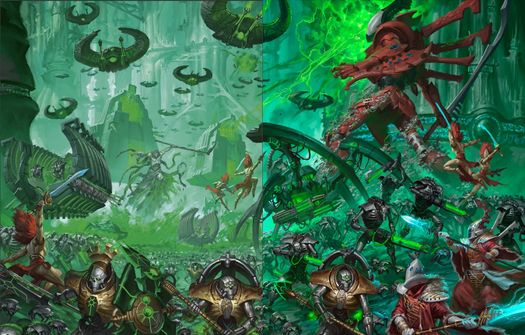

<!-- A0584-B0107 -->

原译文

Necrons battle the Eldar 死灵与灵族作战

**校订译文**

Necrons battle the Eldar 死灵与灵族作战

<!-- /A0584-B0107 -->

<!-- A0584-B0108 -->
## Notable Engagements 著名交战

<!-- /A0584-B0108 -->

<!-- A0584-B0109 -->

原译文

052.M40 - The Corewar 核心战争

**校订译文**

052.M40 - The Corewar 核心战争

<!-- /A0584-B0109 -->

<!-- A0584-B0110 -->

原译文

???.M41 - The Battle of Fordris 弗德里斯之战

**校订译文**

???.M41 - The Battle of Fordris 弗德里斯之战

<!-- /A0584-B0110 -->

<!-- A0584-B0111 -->

原译文

765.M41 - The Fall of Bromoch 布罗莫克陷落

**校订译文**

765.M41 - The Fall of Bromoch 布罗莫克陷落

<!-- /A0584-B0111 -->

<!-- A0584-B0112 -->

原译文

776.M41 - Fallow War 休眠战争

**校订译文**

776.M41 - Fallow War 休眠战争

<!-- /A0584-B0112 -->

<!-- A0584-B0113 -->

原译文

783.M41 - The Battle of Maedrax 梅德拉克斯之战

**校订译文**

783.M41 - The Battle of Maedrax 梅德拉克斯之战

<!-- /A0584-B0113 -->

<!-- A0584-B0114 -->

原译文

798.M41 - The Siege of Somonor 索莫诺围城

**校订译文**

798.M41 - The Siege of Somonor 索莫诺围城

<!-- /A0584-B0114 -->

<!-- A0584-B0115 -->
**英文原文**

799.M41 - Necrons of the Charnovokh Dynasty raised and fought off Dark Eldar attack on the Orks of the Bardrick System

<!-- /A0584-B0115 -->

<!-- A0584-B0116 -->

原译文

查诺沃赫王朝的死灵发起并击退了黑暗灵族对巴德里克星系的兽人的攻击

**校订译文**

799.M41——查诺沃赫王朝死灵苏醒，击退黑暗灵族对巴德里克星系欧克的进攻。

**校注：** raised疑为arose/rose，结合死灵语境暂按苏醒；原文称帮助欧克抗黑暗灵族，不自行改成同攻欧克。

<!-- /A0584-B0116 -->

<!-- A0584-B0117 -->

原译文

855.M41 - The Darklight Extinction 暗光灭绝

**校订译文**

855.M41 - The Darklight Extinction 暗光灭绝

<!-- /A0584-B0117 -->

<!-- A0584-B0118 -->
**英文原文**

873.M41 - The Rytak Dynasty fought with the Kayra Dynasty with their Deathmarks. Both worlds are left leaderless as a result.

<!-- /A0584-B0118 -->

<!-- A0584-B0119 -->

原译文

莱塔克王朝与凯拉王朝用他们的死亡印记作战。因此，这两个世界都失去了领导者。

**校订译文**

873.M41——莱塔克与凯拉两王朝动用死印战士交战，结果双方世界都失去领袖。

<!-- /A0584-B0119 -->

<!-- A0584-B0120 -->

原译文

888.M41 - Battle on the Gythos with Daemons 与恶魔的盖索斯之战

**校订译文**

888.M41 - Battle on the Gythos with Daemons 与恶魔的盖索斯之战

<!-- /A0584-B0120 -->

<!-- A0584-B0121 -->

原译文

894.M41 - Sanctarro Campaign 桑塔罗战役

**校订译文**

894.M41 - Sanctarro Campaign 桑塔罗战役

<!-- /A0584-B0121 -->

<!-- A0584-B0122 -->
**英文原文**

897.M41 - Battle for the Sanctuary 101 with Sisters of Battle

<!-- /A0584-B0122 -->

<!-- A0584-B0123 -->

原译文

与战斗修女争夺101圣殿

**校订译文**

897.M41——与战斗修女争夺101圣殿。

<!-- /A0584-B0123 -->

<!-- A0584-B0124 -->
**英文原文**

898.M41 - Fighting on the Silentia Maiden World with the Eldar and Harlequins

<!-- /A0584-B0124 -->

<!-- A0584-B0125 -->

原译文

与灵族和丑角在西伦提亚少女世界上战斗

**校订译文**

898.M41——在西伦提亚少女世界，与灵族及丑角作战。

**校注：** 对照本段英文确认同一实体，与全书核心译名统一；不改变同形异义词或省略称呼。

<!-- /A0584-B0125 -->

<!-- A0584-B0126 -->

原译文

900.M41 - The Battle of Shemnoch 谢姆诺克之战

**校订译文**

900.M41 - The Battle of Shemnoch 谢姆诺克之战

<!-- /A0584-B0126 -->

<!-- A0584-B0127 -->

原译文

910.M41 - The Siege of Hypnoth 希普诺斯围城

**校订译文**

910.M41 - The Siege of Hypnoth 希普诺斯围城

<!-- /A0584-B0127 -->

<!-- A0584-B0128 -->

原译文

912.M41 - The Battle of the World Engine 世界引擎之战

**校订译文**

912.M41 - The Battle of the World Engine 世界引擎之战

<!-- /A0584-B0128 -->

<!-- A0584-B0129 -->
**英文原文**

919.M41 - Battle on the Vorketh where Daemon Prince Shukketh Voidmaw infects this Tomb World.

<!-- /A0584-B0129 -->

<!-- A0584-B0130 -->

原译文

沃凯斯之战，恶魔王子沙凯斯·虚空之喉感染了这个墓穴世界。

**校订译文**

919.M41——沃凯斯之战：恶魔亲王沙凯斯·虚空之喉侵染该墓穴世界。

<!-- /A0584-B0130 -->

<!-- A0584-B0131 -->

原译文

925.M41 - The Battle of Cardrim 卡德里姆之战

**校订译文**

925.M41 - The Battle of Cardrim 卡德里姆之战

<!-- /A0584-B0131 -->

<!-- A0584-B0132 -->

原译文

933.M41 - The Battle of Midgardia 米德加迪亚之战

**校订译文**

933.M41 - The Battle of Midgardia 米德加迪亚之战

<!-- /A0584-B0132 -->

<!-- A0584-B0133 -->
**英文原文**

947.M41 - Conquest of Uttu Prime, where Nemesor Zahndrekh fought with Catachans and the Imperial Fists

<!-- /A0584-B0133 -->

<!-- A0584-B0134 -->

原译文

征服乌图主星，戴冠者扎赫德克与卡塔昌人和帝国之拳作战

**校订译文**

947.M41——征服乌图主星，戴冠者扎赫德克迎战卡塔昌军与帝国之拳。

<!-- /A0584-B0134 -->

<!-- A0584-B0135 -->

原译文

955.M41 - The Gehenna Campaign 地狱战役

**校订译文**

955.M41 - The Gehenna Campaign 地狱战役

<!-- /A0584-B0135 -->

<!-- A0584-B0136 -->

原译文

963.M41 - The Battle of Malbede 马尔贝德之战

**校订译文**

963.M41 - The Battle of Malbede 马尔贝德之战

**校注：** 本条963.M41与582马尔贝德段936.M41不同，保留来源纪年分歧。

<!-- /A0584-B0136 -->

<!-- A0584-B0137 -->

原译文

973.M41 - Damnos incident. 达姆诺斯事件

**校订译文**

973.M41 - Damnos incident. 达姆诺斯事件

<!-- /A0584-B0137 -->

<!-- A0584-B0138 -->

原译文

976.M41 - Battle with Kroots on the Caroch 与克鲁特的凯路奇之战

**校订译文**

976.M41 - Battle with Kroots on the Caroch 与克鲁特的凯路奇之战

<!-- /A0584-B0138 -->

<!-- A0584-B0139 -->
**英文原文**

979.M41 - Battle for Uan’Voss, where Necrons "help" the Tau to defend the planet against the Tyranid infestation.

<!-- /A0584-B0139 -->

<!-- A0584-B0140 -->

原译文

乌安'沃斯之战，死灵“帮助”钛保卫行星免受泰伦的侵扰。

**校订译文**

979.M41——乌安’沃斯之战，死灵“帮助”钛族守卫行星，抵抗泰伦侵染。

<!-- /A0584-B0140 -->

<!-- A0584-B0141 -->

原译文

984.M41 - Adacore Extermination 艾达核心歼灭

**校订译文**

984.M41 - Adacore Extermination 艾达核心歼灭

<!-- /A0584-B0141 -->

<!-- A0584-B0142 -->
**英文原文**

987.M41 - "Stasis" battle between the forces of Orikan the Diviner and the Obsidian Glaives 7th Company which continues to this day neither begins nor ends.

<!-- /A0584-B0142 -->

<!-- A0584-B0143 -->

原译文

占卜师欧瑞坎和黑曜石阔剑第七连队之间的“静滞”之战一直持续到今天，既没有开始也没有结束。

**校订译文**

987.M41——占卜者欧瑞肯与黑曜石阔剑第七连陷入“静滞”战局；按原文说法，它既未开始，也未结束，一直维持至今。

<!-- /A0584-B0143 -->

<!-- A0584-B0144 -->
**英文原文**

989.M41 - World of Tyr was abandoned by the Agdagath Dynasty after it was overrun by Flayed Ones.

<!-- /A0584-B0144 -->

<!-- A0584-B0145 -->

原译文

提尔世界在被剥皮者占领后被阿格达伽斯王朝抛弃。

**校订译文**

989.M41——提尔遭剥皮者占据，阿格达伽斯王朝被迫弃守。

<!-- /A0584-B0145 -->

<!-- A0584-B0146 -->

原译文

989.M41 - The Battle of Carrion Deep 腐肉深渊之战

**校订译文**

989.M41 - The Battle of Carrion Deep 腐肉深渊之战

<!-- /A0584-B0146 -->

<!-- A0584-B0147 -->

原译文

991.M41 - The Orphean War 奥尔菲安战争

**校订译文**

991.M41 - The Orphean War 奥尔菲安战争

<!-- /A0584-B0147 -->

<!-- A0584-B0148 -->
**英文原文**

994.M41 - War on the fringe worlds of the Thokt Dynasty where the killing ground was created for ravaging Waaagh! Bludtoof hordes.

<!-- /A0584-B0148 -->

<!-- A0584-B0149 -->

原译文

对索科特王朝边缘世界的战争，这片杀戮之地是为了蹂躏蓝牙的Waaagh！部落。

**校订译文**

994.M41——索科特王朝边缘世界之战，在此布下杀戮场，迎击肆虐的血牙 Waaagh!。

**校注：** Bludtoof血牙，非蓝牙；杀戮场用于对付来袭Waaagh，不是蓝牙语义。

<!-- /A0584-B0149 -->

<!-- A0584-B0150 -->

原译文

998.M41 - The Cryptus Campaign 冥府战役

**校订译文**

998.M41 - The Cryptus Campaign 冥府战役

<!-- /A0584-B0150 -->

<!-- A0584-B0151 -->
**英文原文**

999.M41 - Reclaiming the world of Damnos by Imperium forces.

<!-- /A0584-B0151 -->

<!-- A0584-B0152 -->

原译文

帝国部队夺回达姆诺斯世界。

**校订译文**

999.M41——帝国军收复达姆诺斯。

<!-- /A0584-B0152 -->

<!-- A0584-B0153 -->
**英文原文**

999.M41 - Desperate alliance between Anrakyr the Traveller and Dante and his Blood Angels Space Marine Chapter to stop the Hive Fleet Leviathan.

<!-- /A0584-B0153 -->

<!-- A0584-B0154 -->

原译文

旅行者安拉基尔和但丁以及他的圣血天使星际战士之间绝望的联盟，以阻止虫巢舰队利维坦。

**校订译文**

999.M41——旅行者安拉基尔与但丁及圣血天使危急结盟，阻挡利维坦虫巢舰队。

<!-- /A0584-B0154 -->

<!-- A0584-B0155 -->

原译文

999.M41 - The Battle of the Boros Gate 博罗斯之门之战

**校订译文**

999.M41 - The Battle of the Boros Gate 博罗斯之门之战

<!-- /A0584-B0155 -->

<!-- A0584-B0156 -->

原译文

999.M41 - The Carnac Campaign 卡纳克战役

**校订译文**

999.M41 - The Carnac Campaign 卡纳克战役

<!-- /A0584-B0156 -->

<!-- A0584-B0157 -->

原译文

999.M41 - The Second Battle of Damnos 第二次达姆诺斯之战

**校订译文**

999.M41 - The Second Battle of Damnos 第二次达姆诺斯之战

<!-- /A0584-B0157 -->

<!-- A0584-B0158 -->

原译文

???.M41 - The Battle of Schrodinger VII 薛定谔七号之战

**校订译文**

???.M41 - The Battle of Schrodinger VII 薛定谔七号之战

<!-- /A0584-B0158 -->

<!-- A0584-B0159 -->

原译文

~???.M42 - The Absorption Wars 同化战争

**校订译文**

~???.M42 - The Absorption Wars 同化战争

<!-- /A0584-B0159 -->

<!-- A0584-B0160 -->

原译文

~???.M42 - The Cerberax Wars 赛贝拉克斯战争

**校订译文**

~???.M42 - The Cerberax Wars 赛贝拉克斯战争

<!-- /A0584-B0160 -->

<!-- A0584-B0161 -->

原译文

~???.M42 - Hive Fleet Arachnae 虫巢舰队阿拉克涅

**校订译文**

~???.M42 - Hive Fleet Arachnae 虫巢舰队阿拉克涅

<!-- /A0584-B0161 -->

<!-- A0584-B0162 -->

原译文

???.M42 - The Battle for the Orestes System 俄瑞斯忒斯星系之战

**校订译文**

???.M42 - The Battle for the Orestes System 俄瑞斯忒斯星系之战

<!-- /A0584-B0162 -->

<!-- A0584-B0163 -->

原译文

???.M42 - The War in the Pariah Nexus 驱灵死域战争

**校订译文**

???.M42 - The War in the Pariah Nexus 驱灵死域战争

<!-- /A0584-B0163 -->

<!-- A0584-B0164 -->
**英文原文**

The Necron Civil War before the Szarekhan Dynasty and its allies and the Sautekh Dynasty and its allies.

<!-- /A0584-B0164 -->

<!-- A0584-B0165 -->

原译文

斯扎拉坎王朝及其盟友和索泰克王朝及其盟友之前的死灵内战。

**校订译文**

斯扎拉坎及其盟友，与索泰克及其盟友之间的死灵内战。

**校注：** before疑为between误写，双方阵营在上文已明确，按之间；不是在两王朝出现之前。

<!-- /A0584-B0165 -->

<!-- A0584-B0166 -->

原译文

???.M42 - The Third War for Damnos 第三次达姆诺斯战争

**校订译文**

???.M42 - The Third War for Damnos 第三次达姆诺斯战争

<!-- /A0584-B0166 -->

<!-- A0584-B0167 -->

原译文

???.M42 - The War of Silence 寂静战争

**校订译文**

???.M42 - The War of Silence 寂静战争

<!-- /A0584-B0167 -->

<!-- A0584-B0168 -->
## Notable Necrons 著名死灵

<!-- /A0584-B0168 -->

<!-- A0584-B0169 -->
**英文原文**

Ahhotekh - Overlord-Regent of the Suhbekhar Dynasty

<!-- /A0584-B0169 -->

<!-- A0584-B0170 -->

原译文

阿霍泰克 - 索贝克哈尔王朝的霸主摄政

**校订译文**

阿霍泰克 - 索贝克哈尔王朝的霸主摄政

<!-- /A0584-B0170 -->

<!-- A0584-B0171 -->
**英文原文**

Ahmontekh - Phaeron of the Suhbekhar Dynasty

<!-- /A0584-B0171 -->

<!-- A0584-B0172 -->

原译文

阿蒙泰克 - 索贝克哈尔王朝的法皇

**校订译文**

阿蒙泰克 - 索贝克哈尔王朝的法皇

<!-- /A0584-B0172 -->

<!-- A0584-B0173 -->
**英文原文**

Anrakyr the Traveller - Overlord who leads his armies across the stars to awaken as many Tomb Worlds he can.

<!-- /A0584-B0173 -->

<!-- A0584-B0174 -->

原译文

旅行者安拉基尔 - 霸主带领他的军队穿越星际，唤醒尽可能多的墓穴世界。

**校订译文**

旅行者安拉基尔——率军横渡群星，尽可能唤醒墓穴世界的霸主。

<!-- /A0584-B0174 -->

<!-- A0584-B0175 -->
**英文原文**

Hasmoteph the Resplendent - Lord.

<!-- /A0584-B0175 -->

<!-- A0584-B0176 -->

原译文

辉煌者哈斯莫特普 - 领主

**校订译文**

辉煌者哈斯莫特普 - 领主

<!-- /A0584-B0176 -->

<!-- A0584-B0177 -->
**英文原文**

Imotekh the Stormlord - Phaeron of the Sautekh Dynasty.

<!-- /A0584-B0177 -->

<!-- A0584-B0178 -->

原译文

风暴王伊莫泰克 - 索泰克王朝的法皇

**校订译文**

风暴王伊摩特克——索泰克王朝法皇。

<!-- /A0584-B0178 -->

<!-- A0584-B0179 -->
**英文原文**

Kamoteph the Crooked - Cryptek.

<!-- /A0584-B0179 -->

<!-- A0584-B0180 -->

原译文

欺诈者卡莫特普 - 墓穴技师

**校订译文**

欺诈者卡莫特普 - 墓穴技师

<!-- /A0584-B0180 -->

<!-- A0584-B0181 -->
**英文原文**

Vargard Obyron - Famed bodyguard to Nemesor Zahndrekh.

<!-- /A0584-B0181 -->

<!-- A0584-B0182 -->

原译文

王卫奥伯龙 - 戴冠者扎赫德克的著名护卫

**校订译文**

王卫奥伯龙 - 戴冠者扎赫德克的著名护卫

<!-- /A0584-B0182 -->

<!-- A0584-B0183 -->
**英文原文**

Orikan the Diviner - Cryptek known for his ability to predict the future.

<!-- /A0584-B0183 -->

<!-- A0584-B0184 -->

原译文

占星者欧瑞坎 - 以预测未来的能力而闻名的墓穴技师。

**校订译文**

占卜者欧瑞肯——以预知未来著称的墓穴技师。

<!-- /A0584-B0184 -->

<!-- A0584-B0185 -->
**英文原文**

Szarekh - The last Silent King of the Triarch.

<!-- /A0584-B0185 -->

<!-- A0584-B0186 -->

原译文

斯扎拉克 - 三圣的最后一位寂静王。

**校订译文**

斯扎拉克 - 三圣的最后一位寂静王。

<!-- /A0584-B0186 -->

<!-- A0584-B0187 -->
**英文原文**

Illuminor Szeras - Cryptek seeking to unravel the mysteries of life.

<!-- /A0584-B0187 -->

<!-- A0584-B0188 -->

原译文

启明者泽拉斯 - 试图揭开生命的奥秘的墓穴技师。

**校订译文**

光耀者泽拉斯——试图解开生命奥秘的墓穴技师。

<!-- /A0584-B0188 -->

<!-- A0584-B0189 -->
**英文原文**

Trazyn the Infinite - Overlord of Solemnace and a collector of rare artifacts.

<!-- /A0584-B0189 -->

<!-- A0584-B0190 -->

原译文

无限者塔拉辛 - 索勒纳姆斯的霸主和稀有文物收藏家。

**校订译文**

无尽者塔拉辛——索勒纳姆斯霸主，珍稀文物收藏家。

<!-- /A0584-B0190 -->

<!-- A0584-B0191 -->
**英文原文**

Nemesor Zahndrekh - Overlord of Gidrim.

<!-- /A0584-B0191 -->

<!-- A0584-B0192 -->

原译文

戴冠者扎赫德克 - 吉德瑞姆的霸主

**校订译文**

戴冠者扎赫德克 - 吉德瑞姆的霸主

<!-- /A0584-B0192 -->

<!-- A0584-B0193 -->
**英文原文**

Zaphet - Royal Warden that leads the Shining Company, a Necron force without a dynasty.

<!-- /A0584-B0193 -->

<!-- A0584-B0194 -->

原译文

扎贝特 - 领导闪耀连队的皇家督军，这是一支没有王朝的死灵部队。

**校订译文**

扎贝特——率领无王朝归属的“闪耀连队”的皇家监军。

<!-- /A0584-B0194 -->

<!-- A0584-B0195 -->
## Development History 创作沿革

原题：Development History 发展历史

<!-- /A0584-B0195 -->

<!-- A0584-B0196 -->
**英文原文**

Necrons have their thematic origins in the Chaos Androids of the 1990 board game Space Crusade, though these were not related to the future Necrons besides being killer robots which fought the Imperium and were heavily inspired by the Terminator movie franchise. Years later, the first appearance of the Necrons proper came in 1998's White Dwarf #217 and #218. At this time little was known about the Necrons, save that they had their origins from the Necrontyr. Their army at the time only consisted of Necron Lords, Destroyers, Warriors, and Scarabs. In 2002, the Necrons received their first official army codex which established them as soulless automatons serving the C'tan.

<!-- /A0584-B0196 -->

<!-- A0584-B0197 -->

原译文

死灵的主题起源于1990年桌游《太空远征》中的混沌机器人，尽管这些机器人与未来的死灵无关，它们是与帝国作战的杀手机器人，深受《终结者》电影系列的启发。几年后，死灵首次出现在1998年的《白矮人》#217和#218中。当时，人们对死灵知之甚少，只知道他们起源于惧亡者。当时他们的军队只有死灵领主、毁灭者、战士和圣甲虫。2002年，死灵收到了他们的第一个官方军队圣典，这使他们成为为星神服务的无魂机兵。

**校订译文**

死灵的主题原型可追溯到1990年桌游《太空远征》的混沌机器人。除同为对抗帝国的杀戮机械、深受《终结者》电影启发外，它们与后来的死灵并无设定关联。正式的太空死灵直到1998年《白矮人》第217、218期才登场；当时背景信息很少，只知源于惧亡者，军队也仅有领主、毁灭者、武士和圣甲虫。2002年，第一本专属圣典将其确立为侍奉星神的无魂自动机。

<!-- /A0584-B0197 -->

<!-- A0584-B0198 图片 -->
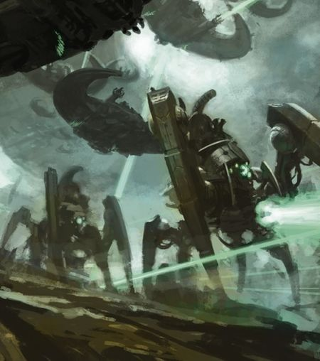

<!-- A0584-B0199 -->

原译文

Necron War Engines 死灵战争引擎

**校订译文**

Necron War Engines 死灵战争引擎

<!-- /A0584-B0199 -->

<!-- A0584-B0200 -->
**英文原文**

The 5th Edition Codex in 2011 changed the Necron lore radically, establishing more individuality and character into the army and introducing concepts such as dynasties and named characters. It also established that they had overthrown their former C'tan masters.

<!-- /A0584-B0200 -->

<!-- A0584-B0201 -->

原译文

2011年的第五版圣典从根本上改变了死灵传说，在军队中建立了更多的个性和性格，并引入了王朝和命名字符等概念。它还确定，他们推翻了前主人星神。

**校订译文**

2011年的第五版圣典大幅改写背景，赋予死灵更多个体性格，引入王朝与具名角色，并确立它们已推翻昔日星神主人的设定。

**校注：** named characters为有姓名的角色，不是命名字符。

<!-- /A0584-B0201 -->

本篇核心术语与暂定项

以下列出本篇出现的英文原形及核心术语表用词。同形词可能指不同对象，具体词义以本篇正文和校注为准；单复数、别名和仅见于图注的名称可能尚未列入。完整候选见[术语表](../../术语表/双语术语候选.csv)。

| 英文 | 采用中文 | 状态 |
| --- | --- | --- |
| Blood Angels | 圣血天使 | 官方已核对 |
| Eldar | 灵族 | 暂定·语境区分 |
| Dark Eldar | 黑暗灵族 | 暂定·旧称对应 |
| Tyranids | 泰伦虫族 | 官方已核对 |
| Necrons | 太空死灵 | 官方已核对 |
| Orks | 欧克蛮人 | 官方已核对 |
| Terminator | 终结者 | 官方已核对 |
| Warp | 亚空间 | 官方已核对 |
| Great Rift | 大裂隙 | 官方已核对 |
| Imperium of Man | 人类帝国 | 官方已核对 |
| Imperium | 帝国 | 暂定·简称 |
| Webway | 网道 | 暂定 |
| Waaagh! | Waaagh! | 暂定·保留原文 |
| Cryptek | 墓穴技师 | 暂定 |
| Trazyn the Infinite | 无尽者塔拉辛 | 官方已核对 |
| Old Ones | 古圣 | 暂定 |
| History | 历史 | 编辑用语已统一 |
| Eye of Terror | 恐惧之眼 | 官方已核对 |
| Enslaver | 奴役者 | 暂定 |
| Imperial Fists | 帝国之拳 | 暂定 |
| Reanimation Protocols | 复生协议 | 暂定·官方待核 |
| Age of Apostasy | 叛教时代 | 暂定·官方待核 |
| Daemon Prince | 恶魔亲王 | 官方已核对 |
| Unchanged | 未变者 | 暂定·官方待核 |
| Maiden World | 少女世界 | 暂定·官方待核 |
| Szarekhan Dynasty | 斯扎拉坎王朝 | 暂定·官方待核 |
| Sautekh Dynasty | 索泰克王朝 | 暂定·官方待核 |
| Great Crusade | 大远征 | 暂定·官方待核 |
| Terra | 泰拉 | 暂定·官方待核 |
| Sisters of Battle | 战斗修女 | 暂定·官方待核 |
| Enforcers | 地方执法者 | 暂定·官方待核 |
| Pariah Nexus | 驱灵死域 | 暂定·官方待核 |
| Hive Fleet Leviathan | 利维坦虫巢舰队 | 暂定·官方待核 |
| Halo Stars | 光环群星 | 暂定·官方待核 |
| War in Heaven | 天堂之战 | 暂定·官方待核 |
| Perpetual | 永生者 | 暂定·官方待核 |
| Endurance | 坚韧 | 暂定·官方待核 |
| Damnos | 达蒙斯 | 暂定·官方待核 |
| Pariah | 贱民 | 暂定·官方待核 |
| Ancient | 旗手 | 官方已核对 |
| Destroyer | 毁灭者 | 暂定·官方待核 |
| Space Marine | 星际战士 | 暂定·官方待核 |
| Chapter | 战团 | 暂定·官方待核 |
| Dante | 但丁 | 暂定·官方待核 |
| Obsidian Glaives | 黑曜石阔剑 | 暂定·官方待核 |
| Destroyers | 毁灭者 | 暂定·官方待核 |
| Predators | 掠食者 | 暂定·官方待核 |
| Overlord | 霸主 | 官方已核对 |
| Invaders | 侵略者 | 暂定·官方待核 |
| Powers | 能天使 | 暂定·官方待核 |
| Xenos | 异形 | 暂定·官方待核 |
| Jokaero | 太空猿猴 | 暂定·官方待核 |
| Necrontyr | 惧亡者 | 暂定·官方待核 |
| Triarch | 三圣（太空死灵统治议会）／三叉戟成员（钢铁勇士职衔） | 语境定译·官方待核 |
| C'tan | 星神 | 暂定·官方待核 |
| K'nib | 克尼卜 | 暂定·官方待核 |
| Rashan | 拉杉 | 暂定·官方待核 |
| Enslaver Plague | 奴役者瘟疫 | 暂定·官方待核 |
| Szarekh | 斯扎拉克 | 暂定·官方待核 |
| Reavers | 劫掠者 | 官方已核对 |
| Infinite Empire | 无限帝国 | 暂定·官方待核 |
| Necron Star Empire | 死灵群星帝国 | 暂定·官方待核 |
| First Wars of Secession | 第一次分裂战争 | 暂定·官方待核 |
| Second Wars of Secession | 第二次分裂战争 | 暂定·官方待核 |
| Book of Mournful Night | 哀夜之书 | 暂定·官方待核 |
| Biotransference | 生体转化 | 暂定·官方待核 |
| Great Sleep | 大休眠 | 暂定·官方待核 |
| Awakened Council | 苏醒议会 | 暂定·官方待核 |
| Chronosense | 时间知觉 | 暂定·官方待核 |
| Phaeron | 法皇 | 暂定·官方待核 |
| Flayer Virus | 剥皮者病毒 | 暂定·官方待核 |
| Destroyer Cult | 毁灭者教派 | 暂定·官方待核 |
| Necrodermis | 死灵金属 | 暂定·官方待核 |
| Celestial Orrery | 璀璨星图 | 暂定·官方待核 |
| Dolmen Gates | 墓石之门 | 暂定·官方待核 |
| Inertialess Drive | 无惯性驱动 | 暂定·官方待核 |
| Reality-Tethers | 现实系缆 | 暂定·官方待核 |
| Strangesteel | 奇异钢 | 暂定·官方待核 |
| Megaton Matter | 兆吨物质 | 暂定·官方待核 |
| Antimatter Collider | 反物质对撞机 | 暂定·官方待核 |
| Kastak | 卡斯塔克 | 暂定·官方待核 |
| Thaszar | 塔萨尔 | 暂定·官方待核 |
| Keph | 凯夫 | 暂定·官方待核 |
| Charnovokh Dynasty | 查诺沃赫王朝 | 暂定·官方待核 |
| Bardrick System | 巴德里克星系 | 暂定·官方待核 |
| Rytak Dynasty | 莱塔克王朝 | 暂定·官方待核 |
| Kayra Dynasty | 凯拉王朝 | 暂定·官方待核 |
| Silentia | 西伦提亚 | 暂定·官方待核 |
| Shukketh Voidmaw | 沙凯斯·虚空之喉 | 暂定·官方待核 |
| Uttu Prime | 乌图主星 | 暂定·官方待核 |
| Uan’Voss | 乌安’沃斯 | 暂定·官方待核 |
| Agdagath Dynasty | 阿格达伽斯王朝 | 暂定·官方待核 |
| Thokt Dynasty | 索科特王朝 | 暂定·官方待核 |
| Bludtoof | 血牙 | 暂定·官方待核 |
| Ahhotekh | 阿霍泰克 | 暂定·官方待核 |
| Ahmontekh | 阿蒙泰克 | 暂定·官方待核 |
| Suhbekhar Dynasty | 索贝克哈尔王朝 | 暂定·官方待核 |
| Anrakyr the Traveller | 旅行者安拉基尔 | 暂定·官方待核 |
| Hasmoteph the Resplendent | 辉煌者哈斯莫特普 | 暂定·官方待核 |
| Kamoteph the Crooked | 欺诈者卡莫特普 | 暂定·官方待核 |
| Vargard Obyron | 王卫奥伯龙 | 暂定·官方待核 |
| Nemesor Zahndrekh | 戴冠者扎赫德克 | 暂定·官方待核 |
| Solemnace | 索勒纳姆斯 | 暂定·官方待核 |
| Gidrim | 吉德瑞姆 | 暂定·官方待核 |
| Zaphet | 扎贝特 | 暂定·官方待核 |
| Shining Company | 闪耀连队 | 暂定·官方待核 |
| Chaos Androids | 混沌机器人 | 暂定·官方待核 |
| Imotekh the Stormlord | 风暴王伊摩特克 | 官方已核对 |
| Orikan the Diviner | 占卜者欧瑞肯 | 官方已核对 |
| Illuminor Szeras | 光耀者泽拉斯 | 官方已核对 |
| The Silent King | 寂静王 | 官方已核对 |
| Royal Warden | 皇家监军 | 官方已核对 |
| Necron Warriors | 太空死灵武士 | 官方已核对 |
| Immortals | 不朽者 | 官方已核对 |
| Flayed Ones | 剥皮者 | 官方已核对 |
| Deathmarks | 死印战士 | 官方已核对 |
| Triarch Praetorians | 三圣禁卫 | 官方已核对 |
| Imotekh | 伊摩特克 | 官方词根参考·单名待核 |
| Orikan | 欧瑞肯 | 官方词根参考·单名待核 |
| The Deceiver | 欺诈者 | 官方词根参考·单名待核 |
| Pylons | 方尖碑 | 暂定·官方待核 |
| Vengeance | 复仇号 | 暂定·官方待核 |
| Maynarkh | 美奈克 | 暂定·官方待核 |
| System | 星系（恒星系统） | 暂定·官方待核 |
| Voss | 沃斯 | 暂定·官方待核 |
| Gauss Weapons | 高斯武器 | 暂定·官方待核 |
| Resplendent | 辉煌号 | 暂定·官方待核 |
| Epic | 史诗 | 暂定·官方待核 |

