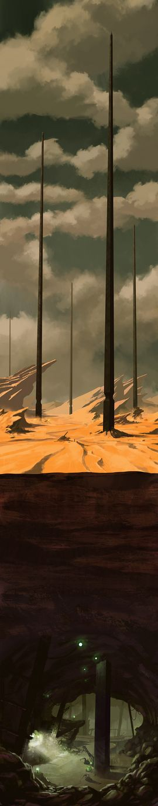
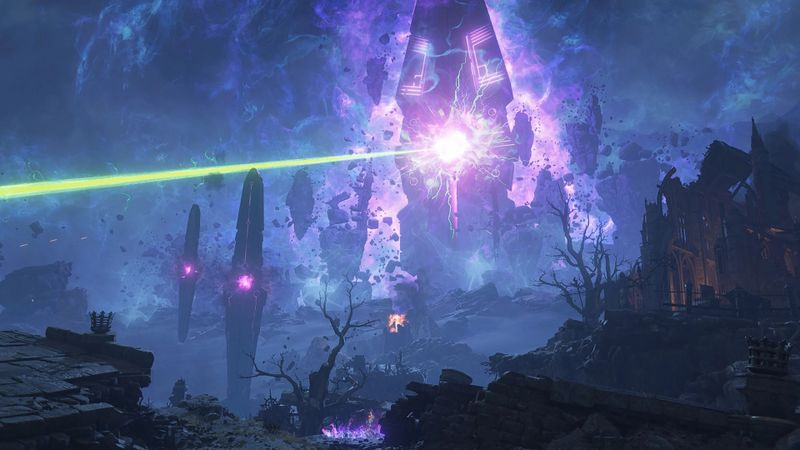
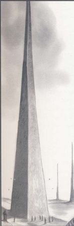
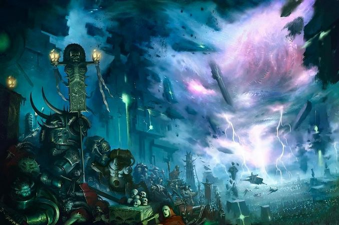

# 0586 方尖碑 Pylons

精校状态：中文行文已逐段精校，部分术语仍为暂定

分类：概念 / 异型 Xenos / 太空死灵 Necrons

原文来源：https://www.bilibili.com/opus/1202229554587893766

原作者：帝国神选罐头

原文时间：2026年05月14日 18:24

[返回分类目录](目录.md) · [全书目录](../../目录.md)

<!-- A0586-B0001 -->
**英文原文**

Pylons are monumental constructions of, once mysterious but now known to be Necron in origins, found on numerous planets across the galaxy that hold back significant overlap between the Warp and realspace. The form and number of the pylons on each respective world are unique to one another, but their effects the same.

<!-- /A0586-B0001 -->

<!-- A0586-B0002 -->

原译文

方尖碑是曾经神秘但现在已知起源于死灵的纪念性建筑，发现于银河系中的许多行星上，这些行星阻碍了亚空间和现实空间之间的显著重叠。每个世界上方尖碑的形式和数量都是独一无二的，但它们的效果是一样的。

**校订译文**

方尖碑是银河许多行星上的巨型构造，能够阻止亚空间与现实空间大范围重叠。它们的起源曾是谜，如今已知出自太空死灵。各个世界上的方尖碑形制、数量不尽相同，却具有同样的抑制作用。

<!-- /A0586-B0002 -->

<!-- A0586-B0003 图片 -->

<!-- A0586-B0004 -->

原译文

Cadian Pylons 卡迪亚方尖碑

**校订译文**

Cadian Pylons 卡迪亚方尖碑

<!-- /A0586-B0004 -->

<!-- A0586-B0005 -->
## Overview 概述

<!-- /A0586-B0005 -->

<!-- A0586-B0006 -->
**英文原文**

The necron pylons employ negatively empyrically charged noctilith in order to dampen the effects of the warp. However, Noctolith can both ward against or act as a locus for warp energies. The forces of Chaos have learned how to subvert these materials and device to instead thin the veil between the Warp and reality. An example of these devices can be flipped to being in a position of positive empyrical charge, empowering local warp energies in realspace, is seen in the subversion of Project Aurora's pylon network on Demerium.

<!-- /A0586-B0006 -->

<!-- A0586-B0007 -->

原译文

死灵方尖碑使用带反至高天电光来抑制亚空间的影响。然而，光既可以对抗亚空间能量，也可以作为亚空间能量的核心。混沌势力已经学会了如何反转这些材料和设备，从而揭开亚空间和现实之间的面纱。这些装置的一个例子可以被反转到正至高天电荷的位置，在现实空间中赋予局部亚空间能量，这可以在奥罗拉项目对德梅里姆的方尖碑网络的反转中看到。

**校订译文**

死灵方尖碑利用处于负向至高天极性的夜石，抑制亚空间影响。不过，夜石既能隔绝亚空间能量，也能成为其汇聚点。混沌势力已学会扭转材料与装置的作用，使亚空间和现实之间的帷幕变薄。德梅里姆的奥罗拉计划方尖碑网络遭到篡改，就是一例：装置转为正向至高天极性，反而增强现实空间内的局部亚空间能量。

**校注：** noctilith/Noctolith/夜石是黑石的名称及源文异拼，原译“光、电光”漏失材料；empyrically charged描述科幻设定中的至高天极性，不是普通电光。

<!-- /A0586-B0007 -->

<!-- A0586-B0008 图片 -->

<!-- A0586-B0009 -->

原译文

noctolith obelisk being used as a locus for warp energies 夜石方尖碑被用作亚空间能量的核心

**校订译文**

noctolith obelisk being used as a locus for warp energies 夜石方尖碑成为亚空间能量的汇聚点

<!-- /A0586-B0009 -->

<!-- A0586-B0010 -->
**英文原文**

Each unique set of pylons appear to have unique properties, as seen in the Pariah Nexus. Each set is one part of an immeasurable complex machine with a robust number of redundancies. Necrons are capable of seeding worlds with Pylons using vessels known as Pylon Ships.

<!-- /A0586-B0010 -->

<!-- A0586-B0011 -->

原译文

每一组独特的方尖碑似乎都有其独特的属性，如驱灵死域所示。每一组都是具有大量冗余的无法估量的复杂机械的一部分。死灵能够使用被称为方尖碑舰的战舰将方尖碑放置在世界上。

**校订译文**

如驱灵死域所示，各组方尖碑似乎又各有特性。它们共同组成一台复杂程度难以估量、设有大量冗余的巨型机器。死灵可用称为“方尖碑舰”的舰船，在目标世界布设方尖碑。

**校注：** 开头效果相同与此处各组特性不同并不必然矛盾：共同抑制作用与具体网络功能分开表述。

<!-- /A0586-B0011 -->

<!-- A0586-B0012 -->
## Cadian Pylons 卡迪亚方尖碑

<!-- /A0586-B0012 -->

<!-- A0586-B0013 -->
**英文原文**

Archmagos Esotericus Sigulus Herstoffen of Stygies did much research on the pylons, and Belisarius Cawl developed his work much further by examining the pylon networks once found around the Eye of Terror.

<!-- /A0586-B0013 -->

<!-- A0586-B0014 -->

原译文

黄泉的秘传大贤者西格鲁斯·赫托芬对方尖碑进行了大量研究，贝利撒留·考尔通过检查恐惧之眼周围发现的方尖碑网络，进一步发展了他的工作。

**校订译文**

黄泉的秘传大贤者西格鲁斯·赫托芬曾深入研究方尖碑。贝利萨留斯·考尔又考察恐惧之眼周围曾经存在的方尖碑网络，将这项研究大幅推进。

<!-- /A0586-B0014 -->

<!-- A0586-B0015 图片 -->

<!-- A0586-B0016 -->

原译文

Cadian Pylon 卡迪亚方尖碑

**校订译文**

Cadian Pylon 卡迪亚方尖碑

<!-- /A0586-B0016 -->

<!-- A0586-B0017 -->
**英文原文**

These structures are one kilometre tall, half a kilometre under the earth and half a kilometre on each side. They have intricate systems of tunnels bored into them, which are impossible to map, as even the smallest servitor never returns from a journey within them. There tends to be a complex arrangement of them across a particular planet, such as those on Cadia.

<!-- /A0586-B0017 -->

<!-- A0586-B0018 -->

原译文

这些结构高一公里，在地下半公里，两侧各半公里。它们有错综复杂的隧道系统，无法绘制地图，因为即使是最小的机仆也永远不会从他们的旅程中回来。在一个特定的行星上，它们往往有着复杂的排列，比如卡迪亚上的那些。

**校订译文**

这些构造高一公里，向地下延伸半公里，基部每边长半公里。内部凿有错综复杂的隧道，却无法绘成地图：即使最小的机仆，进入后也从未返回。它们通常按复杂格局遍布一颗行星，卡迪亚便是如此。

**校注：** 原文one kilometre tall与half under earth未明确总高是否含地下，沿述高度与入地深度，不擅自计算总高。

<!-- /A0586-B0018 -->

<!-- A0586-B0019 -->
**英文原文**

Made of Blackstone, they are believed to be of Necron design and intended to influence the warp in their immediate area, this is thought to be the reason that there is a relatively calm area of warp space, now called the Cadian Gate, which is the only safe thoroughfare in the area. Inquisitor Quixos attempted to construct his own in order to further his own Radical goals.

<!-- /A0586-B0019 -->

<!-- A0586-B0020 -->

原译文

它们由黑石制成，据信是死灵设计的，旨在影响其附近区域的亚空间，这被认为是亚空间有一个相对平静的区域的原因，现在被称为卡迪亚之门，这是该地区唯一安全的通道。审判官奇科索斯试图构建自己的，以推进自己的激进目标。

**校订译文**

方尖碑由黑石建成，据信由死灵设计，用于影响周边亚空间。因此，人们认为它们造就了如今称作“卡迪亚之门”的相对平静区域——那是当地唯一安全的通道。审判官奇科索斯曾试图自行建造方尖碑，以实现自己的激进目标。

<!-- /A0586-B0020 -->

<!-- A0586-B0021 -->
**英文原文**

Pylons can be reduced to ruin through overloading them with massive amounts of Warp energy, such as an influx of Daemons. During his Black Crusades, Abaddon hunted and destroyed pylon networks on planets near the Eye of Terror, thereby weakening the barrier between the Warp and realspace. During the 13th Black Crusade, he destroyed Cadia itself, and its pylon network with it. This caused the formation of the Great Rift, which split the galaxy in two.

<!-- /A0586-B0021 -->

<!-- A0586-B0022 -->

原译文

通过方尖碑过载大量的亚空间能量，如大量的恶魔涌入，方尖碑可以被摧毁。在阿巴顿的黑色远征期间，他在恐惧之眼附近的行星上狩猎并摧毁了方尖碑网络，从而削弱了亚空间和现实空间之间的屏障。在第十三次黑色远征期间，他摧毁了卡迪亚本身及其方尖碑网络。这导致了大裂隙的形成，将银河系一分为二。

**校订译文**

巨量亚空间能量可以使方尖碑过载、崩毁，大批恶魔涌入就是一种方式。阿巴顿在历次黑色远征中，搜寻并摧毁恐惧之眼附近行星的方尖碑网络，削弱亚空间与现实之间的屏障。第十三次黑色远征时，他摧毁卡迪亚，连同其方尖碑网络一并消灭，由此引发大裂隙，将银河分成两半。

<!-- /A0586-B0022 -->

<!-- A0586-B0023 -->
### History 历史

<!-- /A0586-B0023 -->

<!-- A0586-B0024 -->
**英文原文**

Some time before 338.M41, the radical Inquisitor Quixos developed an interest in the warp-altering properties of the Cadian pylons, in the hope of permanently closing the Eye of Terror. Controlled through Quixos' enslaved daemonhost Cherubael, a cult calling itself the "Sons of Bael" studied the pylons. These studies bore fruit, and Quixos duplicated the pylons on other worlds using corrupted merchant cartels and personal supplies of Blackstone. These plans never came to fruition as he was executed by an Inquisitorial taskforce led by Eisenhorn.

<!-- /A0586-B0024 -->

<!-- A0586-B0025 -->

原译文

在338.M41之前的一段时间，激进派审判官奇科索斯对卡迪亚方尖碑的亚空间改变特性产生了兴趣，希望永久关闭恐惧之眼。一个自称“贝尔之子”的教派通过奇科索斯被奴役的恶魔宿主凯鲁巴埃尔控制，研究方尖碑。这些研究取得了成果，奇科索斯利用腐败的商业企业联盟和黑石的个人用品在其他世界复制了方尖碑。这些计划从未实现，因为他被艾森霍恩领导的一个审判官特遣部队处决。

**校订译文**

在338.M41之前的某个时候，激进派审判官奇科索斯开始关注卡迪亚方尖碑改变亚空间的特性，希望永久封闭恐惧之眼。他通过受奴役的恶魔宿主凯鲁巴埃尔，控制名为“贝尔之子”的教团研究方尖碑。研究取得成果后，他借助腐化的商业卡特尔及自有黑石储备，在其他世界复制方尖碑。但计划最终未能达成目标：艾森霍恩率领的审判庭特遣队处决了他。

**校注：** 研究已有成果且已复制，不等于完全未实施；never came to fruition按最终目标未实现。

<!-- /A0586-B0025 -->

<!-- A0586-B0026 图片 -->

<!-- A0586-B0027 -->

原译文

Forces of Chaos opening a warp rift in the Skahren System after a pylon node is destroyed 在一个方尖碑节点被摧毁后，混沌势力在斯卡伦星系中打开了一个亚空间裂隙

**校订译文**

Forces of Chaos opening a warp rift in the Skahren System after a pylon node is destroyed 在一个方尖碑节点被摧毁后，混沌势力在斯卡伦星系中打开了一个亚空间裂隙

<!-- /A0586-B0027 -->

<!-- A0586-B0028 -->
**英文原文**

Recently the Necrons under the Silent King Szarekh have created the largest pylon network in the Nephilim Sector. Known as the Pariah Nexus, it is part of an ambitious plan by the Xenos to eventually shut out the Warp entirely. Observing this, Belisarius Cawl later attempted to utilize technology derived from Necron Pylons to stabilize the Attilan Gate to Imperium Nihilus.

<!-- /A0586-B0028 -->

<!-- A0586-B0029 -->

原译文

最近，寂静王斯扎拉克领导下的死灵创造了拿非利星区最大的方尖碑网络。它被称为驱灵死域，是异型最终完全关闭亚空间的野心勃勃计划的一部分。观察到这一点，贝利撒留·考尔后来试图利用来自死灵方尖碑的技术来稳定通往帝国暗面的阿提兰之门。

**校订译文**

近来，寂静王斯扎拉克麾下的死灵在拿非利星区建成了规模最大的方尖碑网络，即驱灵死域。这是它们最终彻底隔绝亚空间的宏大计划的一部分。贝利萨留斯·考尔观察到这一做法后，也尝试利用从死灵方尖碑衍生的技术，稳定通往帝国暗面的阿提兰之门。

<!-- /A0586-B0029 -->

<!-- A0586-B0030 -->
## Known Worlds with Pylons 已知有方尖碑的世界

<!-- /A0586-B0030 -->

<!-- A0586-B0031 -->
**英文原文**

Eriad VI - Near-perfect match to the Cadian Pylons, now destroyed. Bombarded during the 4th Black Crusade.

<!-- /A0586-B0031 -->

<!-- A0586-B0032 -->

原译文

埃里亚德六号 - 与现已被摧毁的卡迪安方尖碑几乎完美匹配。在第四次黑色远征期间遭到轰炸。

**校订译文**

埃里亚德六号——其方尖碑与卡迪亚方尖碑几乎完全相同，现已被毁。该世界在第四次黑色远征中遭到轰炸。

**校注：** now destroyed在英文位置更自然指此地方尖碑，不强移为卡迪亚已经被毁。

<!-- /A0586-B0032 -->

<!-- A0586-B0033 -->

原译文

Cadia 卡迪亚

**校订译文**

Cadia 卡迪亚

<!-- /A0586-B0033 -->

<!-- A0586-B0034 -->

原译文

Cadmus Phosp 卡德摩斯磷光

**校订译文**

Cadmus Phosp 卡德摩斯磷光

<!-- /A0586-B0034 -->

<!-- A0586-B0035 -->

原译文

Demerium 德梅里姆

**校订译文**

Demerium 德梅里姆

<!-- /A0586-B0035 -->

<!-- A0586-B0036 -->

原译文

Vigilus 警戒星

**校订译文**

Vigilus 警戒星

<!-- /A0586-B0036 -->

<!-- A0586-B0037 -->

原译文

Ulvheim 乌尔夫海姆

**校订译文**

Ulvheim 乌尔夫海姆

<!-- /A0586-B0037 -->

<!-- A0586-B0038 -->

原译文

Pit of Raukos 劳科斯深坑

**校订译文**

Pit of Raukos 劳科斯深坑

<!-- /A0586-B0038 -->

<!-- A0586-B0039 -->

原译文

Pariah Nexus pylon locations 驱灵死域方尖碑地点

**校订译文**

Pariah Nexus pylon locations 驱灵死域方尖碑地点

<!-- /A0586-B0039 -->

<!-- A0586-B0040 -->
**英文原文**

Mesmoch - A keystone in the Parish Nexus pylon web. On it is a solitary and very large pylon; a cloud piercing pyramidal structure.

<!-- /A0586-B0040 -->

<!-- A0586-B0041 -->

原译文

梅斯莫克 - 驱灵死域方尖碑网络中的基石。上面有一座孤零零的、非常大的方尖碑；穿透云层的金字塔结构。

**校订译文**

梅斯莫克——驱灵死域方尖碑网络的一处关键支点，只有一座极其巨大的方尖碑，呈刺穿云层的金字塔形。

**校注：** Parish Nexus为Pariah Nexus拼误，原英文保留。

<!-- /A0586-B0041 -->

<!-- A0586-B0042 -->
**英文原文**

Gu-Oli - Pylons are much smaller and concentrated in three distinct areas, with the rest of the world untouched.

<!-- /A0586-B0042 -->

<!-- A0586-B0043 -->

原译文

古-奥利 - 方尖碑要小得多，集中在三个不同的地区，世界的其他地区没有受到影响。

**校订译文**

古-奥利——方尖碑小得多，集中于三个相互分开的地区；星球其余部分未被布设。

**校注：** untouched在布设语境指未动工设置，不扩展为完全不受亚空间抑制影响。

<!-- /A0586-B0043 -->

<!-- A0586-B0044 -->

原译文

Paradyce 帕拉迪斯

**校订译文**

Paradyce 帕拉迪斯

<!-- /A0586-B0044 -->

<!-- A0586-B0045 -->

原译文

Zeidos 泽多斯

**校订译文**

Zeidos 泽多斯

<!-- /A0586-B0045 -->

<!-- A0586-B0046 -->
**英文原文**

Skahren's Coil - Moon-sized pylon. Destroyed.

<!-- /A0586-B0046 -->

<!-- A0586-B0047 -->

原译文

斯卡伦之线圈 - 卫星大小的方尖碑。被摧毁。

**校订译文**

斯卡伦之线圈——一座卫星大小的方尖碑，已被摧毁。

<!-- /A0586-B0047 -->

本篇核心术语与暂定项

以下列出本篇出现的英文原形及核心术语表用词。同形词可能指不同对象，具体词义以本篇正文和校注为准；单复数、别名和仅见于图注的名称可能尚未列入。完整候选见[术语表](../../术语表/双语术语候选.csv)。

| 英文 | 采用中文 | 状态 |
| --- | --- | --- |
| Necrons | 太空死灵 | 官方已核对 |
| Warp | 亚空间 | 官方已核对 |
| Great Rift | 大裂隙 | 官方已核对 |
| Inquisitor | 审判官 | 官方已核对 |
| Imperium | 帝国 | 暂定·简称 |
| Servitor | 机仆 | 暂定 |
| Eye of Terror | 恐惧之眼 | 官方已核对 |
| Imperium Nihilus | 帝国暗面 | 暂定·官方待核 |
| Nephilim Sector | 拿非利星区 | 暂定·官方待核 |
| Pariah Nexus | 驱灵死域 | 暂定·官方待核 |
| Sector | 星区 | 暂定·官方待核 |
| Cadia | 卡迪亚 | 暂定·官方待核 |
| Pariah | 贱民 | 暂定·官方待核 |
| Veil | 韦尔 | 暂定·官方待核 |
| Belisarius Cawl | 贝利萨留斯·考尔 | 官方已核对 |
| Xenos | 异形 | 暂定·官方待核 |
| Szarekh | 斯扎拉克 | 暂定·官方待核 |
| Locus | 基卫 | 官方已核对 |
| The Silent King | 寂静王 | 官方已核对 |
| Pylons | 方尖碑 | 暂定·官方待核 |
| Noctilith | 夜石 | 暂定·官方待核 |
| Noctolith | 夜石 | 暂定·官方待核 |
| Project Aurora | 奥罗拉计划 | 暂定·官方待核 |
| Demerium | 德梅里姆 | 暂定·官方待核 |
| Sigulus Herstoffen | 西格鲁斯·赫托芬 | 暂定·官方待核 |
| Sons of Bael | 贝尔之子 | 暂定·官方待核 |
| Attilan Gate | 阿提兰之门 | 暂定·官方待核 |
| Mesmoch | 梅斯莫克 | 暂定·官方待核 |
| Gu-Oli | 古-奥利 | 暂定·官方待核 |
| Cherubael | 凯鲁巴埃尔 | 暂定·官方待核 |
| Quixos | 奇科索斯 | 暂定·官方待核 |
| Skahren | 斯卡伦 | 暂定·官方待核 |

