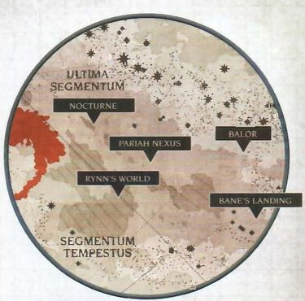
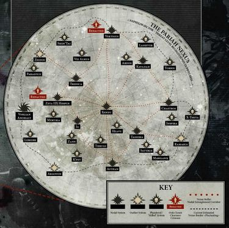

# 0587 驱灵死域 Pariah Nexus

精校状态：中文行文已逐段精校，部分术语仍为暂定

分类：概念 / 异型 Xenos / 太空死灵 Necrons

原文来源：https://www.bilibili.com/opus/1135695198300405761

原作者：帝国神选罐头

原文时间：2025年11月16日 11:17

[返回分类目录](目录.md) · [全书目录](../../目录.md)

<!-- A0587-B0001 -->
**英文原文**

The Pariah Nexus, known to the Necrons themselves as the Contra-Empyric Nexus is a Necron Pylon array in the Nephilim Sector within Ultima Segmentum.、

<!-- /A0587-B0001 -->

<!-- A0587-B0002 -->

原译文

驱灵死域，被死灵自己称为反以太枢纽，是极限星域内拿非利星区的一个死灵方尖碑阵列。

**校订译文**

驱灵死域位于极限星域的拿非利星区，是一片太空死灵方尖碑阵列。死灵自身称其为“反至高天枢纽”。

**校注：** Empyric指至高天/亚空间，不是钛族以太；原反以太枢纽改为反至高天枢纽。

<!-- /A0587-B0002 -->

<!-- A0587-B0003 图片 -->

<!-- A0587-B0004 -->

原译文

Location of the Pariah Nexus 驱灵死域的位置

**校订译文**

Location of the Pariah Nexus 驱灵死域的位置

<!-- /A0587-B0004 -->

<!-- A0587-B0005 -->
### Overview 概述

<!-- /A0587-B0005 -->

<!-- A0587-B0006 -->
**英文原文**

Also known as the Zone of Silence, it is a region of space that seems to be free from the influences of the Warp. The Imperium thus named it after the Pariah Gene, which has a similar effect of suppressing the Warp. In truth, the Nexus is a vast Blackstone array constructed by the Necrons, more specifically the Cryptek Szeras and the Nihilakh Dynasty. Considered the pinnacle of Necron cosmic engineering, at the heart of the network is the Xendu System where an immense Blackstone cage has been constructed. Around the System are vast amounts of Necron orbitals and warships to guard over their great work. Further out lay networks of vast Blackstone Pylons, their deployment extending through patterns of non-euclidean fractal crypto-logic incomprehensible to mortal minds. Scattered through nodal and outlier systems, each pylon was a unique colossal structure whose purpose was to sustain and extend a field of anti-empyric energy. Pylons were seeded on target worlds with an immense Pylon Ship.

<!-- /A0587-B0006 -->

<!-- A0587-B0007 -->

原译文

也被称为寂静区，这是一个似乎不受亚空间影响的空间区域。帝国因此以被遗弃者基因命名，该基因具有类似的抑制亚空间的作用。事实上，死域是由死灵，更具体地说是墓穴技师泽拉斯和尼希拉赫王朝建造的巨大黑石阵列。被认为是死灵宇宙工程的巅峰之作，该网络的核心是森杜星系，其中建造了一个巨大的黑石笼。星系周围有大量的死灵轨道和战舰来保护他们的伟大成果。进一步布局了巨大的黑石方尖碑网络，它们的部署延伸通过凡人无法理解的非欧几里德分形密码逻辑模式。每个方尖碑都分散在节点和异常星系中，是一个独特的巨大结构，其目的是维持和扩展一个反以太能量立场。方尖碑用一艘巨大的方尖碑舰放置在目标世界上。

**校订译文**

这片区域又称“寂静区”，似乎不受亚空间影响。帝国因而借具有类似抑制作用的“贱民基因”为其命名。实际上，它是死灵建造的庞大黑石阵列，主要由墓穴技师泽拉斯与尼希拉克王朝负责，被视为死灵宇宙工程的巅峰。网络核心位于森杜星系，那里建有巨大的黑石牢笼，周围部署大量死灵轨道设施与战舰，守卫这项伟大工程。再往外，是庞大的黑石方尖碑网络，其布局遵循凡人心智无法理解的非欧几里德分形密逻辑模式。各座方尖碑分布在节点及外围星系，形制独特、规模巨大，用以维持并扩展反至高天能量场。它们由巨型方尖碑舰布设在目标世界。

**校注：** Pariah Gene按全书贱民基因；orbitals是轨道设施，不是轨道本身；outlier是外围离群位置而非异常性质；field能量场，原立场错字。

<!-- /A0587-B0007 -->

<!-- A0587-B0008 -->
**英文原文**

During the Indomitus Crusade, the Imperial Battlegroup Kallides was sent to investigate the Nexus, instigating a war there. Imperials in this region soon found themselves effected by a damaging malaise and energy-sapping field dubbed "The Stilling". It is speculated the stilling originates from the many Pylons in the Nexus.

<!-- /A0587-B0008 -->

<!-- A0587-B0009 -->

原译文

在不屈远征期间，帝国卡利德斯战斗群被派去调查死域，在那里挑起了一场战争。这个地区的帝国很快发现自己受到了一种被称为“停滞”的破坏性问题和能量削弱立场的影响。据推测，源于死域中的许多方尖碑。

**校订译文**

不屈远征期间，帝国派遣卡利德斯战斗群调查死域，由此引发战争。当地帝国人员很快受到一种有害衰弱效应及消耗精力的场域影响，称之为“沉寂效应”。据推测，这种效应源自死域内众多方尖碑。

**校注：** Imperials指帝国人员，非帝国政体；malaise为身心衰弱不适，非泛指问题；The Stilling暂译沉寂效应，避免与时间静滞混淆。

<!-- /A0587-B0009 -->

<!-- A0587-B0010 图片 -->

<!-- A0587-B0011 -->

原译文

The Pariah Nexus 驱灵死域

**校订译文**

The Pariah Nexus 驱灵死域

<!-- /A0587-B0011 -->

<!-- A0587-B0012 -->
**英文原文**

The ensuing war within the Pariah Nexus saw not only the Imperium under Belisarius Cawl's Battle Group Hephaestus battle the forces of the Silent King, but even a Necron civil war between the forces of Szarekh and Imotekh. Recently, Chaos forces under Vashtorr have arrived in the area.

<!-- /A0587-B0012 -->

<!-- A0587-B0013 -->

原译文

随后在驱灵死域内爆发的战争不仅见证了贝利撒留·考尔的赫菲斯托斯战斗群领导的帝国与寂静王的部队作战，甚至见证了斯扎拉克和伊莫泰克部队之间的死灵内战。最近，瓦什托尔率领的混沌部队已经抵达该地区。

**校订译文**

此后的驱灵死域战争中，贝利萨留斯·考尔的赫菲斯托斯战斗群与寂静王交战；死灵内部也爆发斯扎拉克与伊摩特克两派之间的内战。近来，瓦什托尔率领的混沌部队也已抵达这一地区。

<!-- /A0587-B0013 -->

本篇核心术语与暂定项

以下列出本篇出现的英文原形及核心术语表用词。同形词可能指不同对象，具体词义以本篇正文和校注为准；单复数、别名和仅见于图注的名称可能尚未列入。完整候选见[术语表](../../术语表/双语术语候选.csv)。

| 英文 | 采用中文 | 状态 |
| --- | --- | --- |
| Necrons | 太空死灵 | 官方已核对 |
| Warp | 亚空间 | 官方已核对 |
| Imperium | 帝国 | 暂定·简称 |
| Cryptek | 墓穴技师 | 暂定 |
| Indomitus | 不屈学派 | 暂定·学派语境 |
| Indomitus Crusade | 不屈远征 | 暂定·官方待核 |
| Nephilim Sector | 拿非利星区 | 暂定·官方待核 |
| Pariah Nexus | 驱灵死域 | 暂定·官方待核 |
| Ultima Segmentum | 极限星域 | 暂定·官方待核 |
| Segmentum | 星域 | 暂定·官方待核 |
| Sector | 星区 | 暂定·官方待核 |
| Pariah | 贱民 | 暂定·官方待核 |
| pariah gene | 贱民基因 | 暂定·官方待核 |
| Belisarius Cawl | 贝利萨留斯·考尔 | 官方已核对 |
| Mortal | 凡人 | 暂定·官方待核 |
| Szarekh | 斯扎拉克 | 暂定·官方待核 |
| Zone of Silence | 寂静区 | 暂定·官方待核 |
| The Silent King | 寂静王 | 官方已核对 |
| Imotekh | 伊摩特克 | 官方词根参考·单名待核 |
| Pylons | 方尖碑 | 暂定·官方待核 |
| Pylon Ship | 方尖碑舰 | 暂定·官方待核 |
| Contra-Empyric Nexus | 反至高天枢纽 | 暂定·官方待核 |
| Xendu System | 森杜星系 | 暂定·官方待核 |
| The Stilling | 沉寂效应 | 暂定·官方待核 |
| Battlegroup Kallides | 卡利德斯战斗群 | 暂定·官方待核 |
| Battle Group Hephaestus | 赫菲斯托斯战斗群 | 暂定·官方待核 |
| System | 星系（恒星系统） | 暂定·官方待核 |
| Nihilakh Dynasty | 尼希拉克王朝 | 暂定·官方待核 |
| Hephaestus | 赫菲斯托斯 | 暂定·官方待核 |

