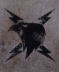

# 0745 M29-712.M30 统一战争 Unification Wars

精校状态：中文行文已逐段精校，部分术语仍为暂定

分类：时间线

原文来源：https://www.bilibili.com/opus/1057805081596919814

原作者：帝国神选罐头

原文时间：编辑于 2025年05月26日 13:07

[返回分类目录](目录.md) · [全书目录](../../目录.md)

<!-- A0745-B0001 -->
**英文原文**

The Unification Wars, also known as the Wars of Unification, is the name of an ancient number of conflicts fought at the end of the Age of Strife. They were spearheaded by the warlord known only as The Emperor in his attempt at reunifying the shattered tribes and nations of Terra, now ruled largely by Techno-Barbarian lords. His intentions were to reforge the shattered remnants of Man and create an Imperium that would bring about a Great Crusade to bring order to the galaxy.

<!-- /A0745-B0001 -->

<!-- A0745-B0002 -->

原译文

统一战争，也称为统一的战争，是纷争时代末期发生的一系列古老冲突的名称。他们由仅被称为帝皇的军阀带头，试图统一现在主要由技术蛮人领主统治的泰拉的破碎的部落和国家。他的意图是重建破碎的人类残余，建立一个帝国，带来一场大远征，为银河系带来秩序。

**校订译文**

统一战争是纷争时代末期一系列古老冲突的总称，由一名仅以“帝皇”为人所知的军阀发起。当时，泰拉的部落与国家四分五裂，大多由科技蛮人领主统治。帝皇意图重新统一这些势力，重整人类文明的残余，建立帝国，再以大远征为银河带来秩序。

<!-- /A0745-B0002 -->

<!-- A0745-B0003 图片 -->

<!-- A0745-B0004 -->

原译文

The Emperor's symbol during Unification, the Raptor Imperialis 统一时期的帝皇象征，帝国猛禽

**校订译文**

The Emperor's symbol during Unification, the Raptor Imperialis 统一时期的帝皇象征，帝国猛禽

<!-- /A0745-B0004 -->

<!-- A0745-B0005 -->
## Overview 概述

<!-- /A0745-B0005 -->

<!-- A0745-B0006 -->
### Prelude 前奏

<!-- /A0745-B0006 -->

<!-- A0745-B0007 -->
**英文原文**

By M29, Terra had been engulfed in the chaos and anarchy of the Age of Strife for several thousand years. Terra was a violent cauldron divided between city-states, Techno-Barbarian warlords, and various other polities. However as Slaanesh was close to its birth at the epicenter of the Eldar Empire, the Warp Storms plaguing humanity's homeworld becalmed themselves. Sensing the time was right, a being known as The Emperor finally began his campaign to reclaim Earth.

<!-- /A0745-B0007 -->

<!-- A0745-B0008 -->

原译文

到了M29，泰拉已经被纷争时代的混乱和无政府状态吞噬了几千年。泰拉是一个被城邦、技术蛮人军阀和其他各种政治势力分裂的暴力熔炉。然而，当色孽在灵族帝国的中心即将诞生时，困扰人类家园世界的亚空间风暴却平静了下来。意识到时机已经成熟，一位被称为帝皇的人终于开始了他夺回地球的行动。

**校订译文**

到 M29，泰拉已在纷争时代的混乱与失序中沉沦数千年。城邦、科技蛮人军阀与各式政体割据一方，使整颗星球成为暴力翻涌的熔炉。然而，随着色孽在灵族帝国的中心逐渐接近诞生，长期困扰人类母星的亚空间风暴开始平息。帝皇判断时机已到，终于发动收复泰拉的战争。

<!-- /A0745-B0008 -->

<!-- A0745-B0009 -->
**英文原文**

Appearing openly for the first time, The Emperor led his Thunder Warriors, genetically engineered super soldiers created in secret laboratories, in a series of campaigns against all other warlords and Techno-barbarians of Old Earth. His forces included not only the Thunder Warriors but also the Custodian Guard, formations that would become the early Imperial Army including Geno Five-Two Chiliad and the Inferallti Hussars, and eventually the proto-Astartes. His forces utilized the advanced weapons of the Terrawatt Clan after he secured an alliance with them. Thus did the Emperor make his move on the major powers of Terra. One of his earliest major campaigns was against the Maulland Sen Confederacy.

<!-- /A0745-B0009 -->

<!-- A0745-B0010 -->

原译文

帝皇首次公开露面，带领他的雷霆战士，在秘密实验室中创建的基因工程超级士兵，对旧地球的所有其他军阀和技术蛮人进行了一系列战役。他的部队不仅包括雷霆战士，还包括禁军卫队，这些编队后来成为了早期的帝国军队，包括基诺52千连团和地狱骠骑兵，最终成为了原型阿斯塔特。在他与泰拉瓦特氏族结盟后，他的部队使用了他们的先进武器。帝皇就这样对泰拉的主要势力采取了行动。他最早的主要战役之一是对抗莫兰森邦联。

**校订译文**

帝皇首次公开现身，率领在秘密实验室中创造的基因改造超级战士——雷霆战士——向古老泰拉上的其他军阀与科技蛮人接连开战。他的军队不仅有雷霆战士，还有帝国禁军，以及后来构成早期帝国军的诸多部队，如基诺五二千连团、因费拉尔提骠骑兵；随后，早期阿斯塔特也加入了这支大军。他与泰拉瓦特氏族结盟后，麾下部队开始使用氏族提供的先进武器。帝皇由此逐一进攻泰拉的主要强权，莫兰森邦联就是早期大规模战役的目标之一。

**校注：** 区分并列部队：禁军、早期帝国军编制与随后加入的原型阿斯塔特，原译误使前者“最终成为原型阿斯塔特”。Geno Five-Two Chiliad 沿54，Inferallti Hussars 沿799。

<!-- /A0745-B0010 -->

<!-- A0745-B0011 -->
### Subduing Terra 征服泰拉

<!-- /A0745-B0011 -->

<!-- A0745-B0012 -->
**英文原文**

Adedeji - This Dynasty ruled from northeastern Africa. After they were defeated by the Emperor they were reduced to lowly status, with many being forced to become factory workers.

<!-- /A0745-B0012 -->

<!-- A0745-B0013 -->

原译文

阿德德吉 - 这个王朝统治着非洲东北部。他们被帝皇打败后，地位低下，许多人被迫成为工厂工人。

**校订译文**

阿德德吉——这个王朝统治非洲东北部。被帝皇击败后，王朝成员地位一落千丈，许多人被迫成为工厂劳工。

<!-- /A0745-B0013 -->

<!-- A0745-B0014 -->
**英文原文**

Albia - Albians refused to kneel before the Emperor and met his Thunder Warriors with their own proto-dreadnoughts and armored ironside soldiers. In battle after battle, the Albians managed to hold back the Emperor's forces but only at staggering cost for the defenders. Admitting the martial temper and indomitable spirit of his foe, the Emperor called a ceasefire and sought a diplomatic solution. The Emperor appeared before the Albian Clan Lords unarmed and clothed in white and crimson, speaking of his vision of a unified mankind. He offered them glory among the stars and redemption. To the shock of many, the warlords of Albia, seeing the Emperor as different from past tyrants, accepted terms and soon became one of the most zealous supporters of unification.

<!-- /A0745-B0014 -->

<!-- A0745-B0015 -->

原译文

阿尔比亚 - 阿尔比亚人拒绝在帝皇面前下跪，并用他们自己的原型无畏和装甲铁面士兵迎接了他的雷霆战士。在一场又一场的战斗中，阿尔比亚人成功地击退了帝皇的军队，但守军付出了惊人的代价。帝皇承认敌人的军事特征和不屈不挠的精神，呼吁停火并寻求外交解决方案。帝皇手无寸铁地出现在阿尔比亚氏族领主面前，身穿白色和深红色的衣服，讲述了他对统一人类的愿景。他在群星中为他们献上荣耀和救赎。令许多人震惊的是，阿尔比亚的军阀认为帝皇不同于过去的暴君，接受了条件，很快成为统一最热心的支持者之一。

**校订译文**

阿尔比亚——阿尔比亚人拒绝向帝皇屈膝，以自己的早期无畏机甲与装甲铁卫迎战雷霆战士。他们在接连不断的战斗中挡住帝皇的大军，却也付出惊人代价。帝皇认可敌人的尚武气概与不屈意志，下令停火，寻求外交解决。他身穿白与深红相间的衣袍，手无寸铁地来到各氏族领主面前，阐述统一人类的愿景，并许诺群星间的荣耀与救赎。令许多人震惊的是，阿尔比亚军阀认为他不同于以往的暴君，接受了条件，很快成为统一事业最热忱的支持者之一。

<!-- /A0745-B0015 -->

<!-- A0745-B0016 -->
**英文原文**

Albyon - The tyrannical warlord Uilleam the Red is defeated by rival Kibuka's forces and imprisoned in the dungeon of Khangba Marwu. Kibuka would also be imprisoned there by another rival force.

<!-- /A0745-B0016 -->

<!-- A0745-B0017 -->

原译文

阿尔比恩 - 残暴的军阀红色乌连姆被对手基布卡的部队击败，并被囚禁在康巴玛乌的地牢中。基布卡也将被另一支敌对势力关押在那里。

**校订译文**

阿尔比恩——残暴的军阀红色乌连姆被对手基布卡击败，关入康巴·玛乌的地牢。后来，基布卡也败于另一股敌对势力，被投入同一处监牢。

**校注：** Albyon 与上条 Albia 拼法不同，分别保留阿尔比恩／阿尔比亚，不以现实地理联想强行合并。

<!-- /A0745-B0017 -->

<!-- A0745-B0018 -->
**英文原文**

Achaemenid Empire - Swearing allegiance to the Emperor early on in his war, the Achaemenid Empire suffered little during the Wars of Unification, avoiding both atomic strike and invasion by Thunder Warriors.

<!-- /A0745-B0018 -->

<!-- A0745-B0019 -->

原译文

阿契美尼德帝国-阿契美尼帝国在战争初期宣誓效忠帝皇，在统一战争中几乎没有遭受任何损失，避免了原子弹袭击和雷霆战士的入侵。

**校订译文**

阿契美尼德帝国——它在战争初期便宣誓效忠帝皇，因此在统一战争中损失甚微，既避开了核打击，也没有遭到雷霆战士入侵。

<!-- /A0745-B0019 -->

<!-- A0745-B0020 -->
**英文原文**

Akkad - Fought against the forces of the Emperor in Central Asia alongside his Udug Hul elite. They were ultimately defeated by the First Legion

<!-- /A0745-B0020 -->

<!-- A0745-B0021 -->

原译文

阿卡德 - 与他的乌杜格·胡尔精英一起在中亚与帝皇的军队作战。他们最终被第一军团击败

**校订译文**

阿卡德——在中亚率领麾下乌杜格·胡尔精锐对抗帝皇，最终被第一军团击败。

**校注：** Akkad 所在条目列表以国家、政体为主，但此条英文用 his 指代，似指统治者；中文保留主语阿卡德，未擅加国家或国王身份，待原出版物核实。

<!-- /A0745-B0021 -->

<!-- A0745-B0022 -->
**英文原文**

Atlan - Ur-queen of this country was killed by Adeptus Custodes during one of the battles

<!-- /A0745-B0022 -->

<!-- A0745-B0023 -->

原译文

阿特兰 - 这个国家的乌尔女王在一次战斗中被禁军杀害

**校订译文**

阿特兰——该国的乌尔女王在一场战斗中被帝国禁军杀死。

<!-- /A0745-B0023 -->

<!-- A0745-B0024 -->
**英文原文**

Boeotia - Mentioned in Imperial records as holding out against full Unification for some considerable time; while tacitly recognizing the Emperor's dominance, the ruling monarchy of Boeotia used all manner of diplomacy in order to avoid losing power. In a show of great patience and benevolence, the Emperor allowed the ruling family of Boeotia - the Yeselti - to carry on like this for over 150 years, with the intention that they would integrate themselves into unified Imperial Terra at their own speed and with as much dignity as possible. Instead, the Yeselti clung onto their independence to the point where, firstly, the Imperial Army was forced to invade the province and finally, Legiones Astartes of the Thousand Sons were assigned to quash the trucculent little state. Boeotia was notable both for the presence of industry and at least one buried shrine to gods worshiped by humans in an earlier age.

<!-- /A0745-B0024 -->

<!-- A0745-B0025 -->

原译文

维奥蒂亚 - 在帝国记录中提到，在相当长的一段时间内，他一直反对完全统一；在默许帝皇统治的同时，维奥蒂亚的统治君主制使用了各种外交手段来避免失去权力。为了表现出极大的耐心和仁慈，帝皇允许博奥提亚的统治家族—叶塞尔提—继续这样生活了150多年，目的是让他们以自己的速度和尽可能多的尊严融入统一的帝国土地。相反，叶塞尔提坚持自己的独立，首先，帝国军队被迫入侵该国家，最后，千子军团的阿斯塔特被派去镇压这个残暴的小国。维奥蒂亚以工业的存在和至少一座埋葬在早期人类崇拜的神的神殿而闻名。

**校订译文**

维奥蒂亚——帝国记录称，这个国家曾长期拒绝彻底归入统一政权。统治王室虽默许帝皇的霸权，却用尽外交手段保全自身权力。帝皇表现出极大的耐心与宽容，容许叶塞尔提王室维持这种状态一百五十多年，希望他们能按自己的步调，尽可能体面地融入统一的泰拉。然而，王室始终固守独立，帝国军最终不得不入侵该地；随后，千子军团也奉命前来，镇压这个顽抗的小国。维奥蒂亚拥有工业设施，也至少有一座深埋地下、供奉人类古代诸神的神殿。

<!-- /A0745-B0025 -->

<!-- A0745-B0026 -->
**英文原文**

Caucasus Wastes - Its ruler, the ethnarch, was defeated by the Emperor's forces and imprisoned in the dungeon of Khangba Marwu.

<!-- /A0745-B0026 -->

<!-- A0745-B0027 -->

原译文

高加索荒原-它的统治者，异族总督，被帝皇的军队击败，被囚禁在康巴玛乌的地牢里。

**校订译文**

高加索荒原——统治这里的族政领主被帝皇的军队击败，关入康巴·玛乌地牢。

**校注：** Ethnarch 指该人类政体的统治职衔，暂译族政领主，原异族总督误增异形含义；主审确认，非官网定译。

<!-- /A0745-B0027 -->

<!-- A0745-B0028 -->
**英文原文**

Ethnarchy - The Ethnarchy is known to have commanded formidable forces consisting of genetically modified warriors known as the Ur-Khasis, dangerous weapons from the Dark Age of Technology, and enslaved Psykers. The first attempt by Imperial forces to capture the Ethnarchy's strongholds earlier in the war had cost the lives of 20,000 Thunder Warriors and a million other casualties. Towards the end of the Unification Wars, the Emperor began his second attempt to topple the Ethnarchy. This time the XVIII Legion of the Legiones Astartes was tasked with destroying the subterranean power generators feeding the Ethnarchy's power fields. In the ensuing Assault on the Tempest Galleries, the XVIIIth Legion was victorious and with their force fields down, the Ethnarchy was quickly crushed by the forces of the Emperor.

<!-- /A0745-B0028 -->

<!-- A0745-B0029 -->

原译文

埃瑟纳希 - 众所周知，埃瑟纳希指挥着由被称为乌尔-哈西的转基因战士、来自黑暗技术时代的危险武器和被奴役的灵能者组成的强大力量。帝国军队在战争早期首次试图占领埃瑟纳希的据点，造成2万名雷霆战士和100万人伤亡。统一战争接近尾声时，帝皇开始了第二次推翻埃瑟纳希的尝试。这一次，阿斯塔特军团第十八军团的任务是摧毁为埃瑟纳希能量场供电的地下发电机。在随后对暴风回廊的袭击中，第十八军团取得了胜利，随着他们的能量场被摧毁，埃瑟纳希很快就被皇帝的军队粉碎了。

**校订译文**

族政国——其军队拥有被称为乌尔-哈西的基因改造战士、黑暗科技时代的危险武器，以及遭奴役的灵能者。战争早期，帝国部队首次进攻其据点时，损失了两万名雷霆战士，其他部队另有一百万人伤亡。统一战争接近尾声时，帝皇再度出手，命令阿斯塔特第十八军团摧毁地下动力发生器，切断防护力场的能源。第十八军团在随后的暴风回廊突袭中获胜。失去力场保护后，族政国很快便被帝皇的大军摧毁。

**校注：** Ethnarchy 沿451族政国，原埃瑟纳希不再与同一国家分成两条。伤亡原文区分两万名雷霆战士战死与其他一百万人伤亡。

<!-- /A0745-B0029 -->

<!-- A0745-B0030 -->
**英文原文**

Franc - Absorbed by the forces of the Emperor.

<!-- /A0745-B0030 -->

<!-- A0745-B0031 -->

原译文

法兰克 - 被帝皇的军队所吸收。

**校订译文**

法兰克——被帝皇的军队兼并。

<!-- /A0745-B0031 -->

<!-- A0745-B0032 -->
**英文原文**

Hy Brasil - Its last independent ruler, Dalmoth Kyn, was one of the last Terran warlords to be defeated by the Emperor. After their defeat Hy Brasil existed as semi-autonomous province within the Imperium, and was governed by Kyn's descendants. However the actions of Malcador the Sigillite ensured that Dalmoth's descendants, including Pherom Sichar, never sat on the Council of Terra when it was created.

<!-- /A0745-B0032 -->

<!-- A0745-B0033 -->

原译文

海巴西 - 其最后一位独立统治者达尔莫斯·金是最后被帝皇击败的人族军阀之一。战败后，海巴西作为帝国内的半自治省存在，由金的后代统治。然而，掌印者马卡多的行动确保了达尔莫斯的后代，包括费尔昂·西查尔，在泰拉议会成立时从未担任过议会成员。

**校订译文**

海巴西——最后一位独立统治者达尔莫斯·金，是最后一批被帝皇击败的泰拉军阀之一。战败后，海巴西成为帝国境内的半自治省份，仍由金的后裔统治。不过，掌印者马卡多从中施加影响，使包括费尔昂·西查尔在内的这些后裔，未能在新成立的泰拉议会中取得席位。

<!-- /A0745-B0033 -->

<!-- A0745-B0034 -->
**英文原文**

Merica - This major kingdom was known for its high fashion and ballrooms, fell to the Emperor's forces.

<!-- /A0745-B0034 -->

<!-- A0745-B0035 -->

原译文

梅里卡 - 这个主要王国以其高级时装和舞厅而闻名，后来被帝皇的军队征服。

**校订译文**

梅里卡——这个以华服与舞厅闻名的大王国，最终被帝皇的军队征服。

<!-- /A0745-B0035 -->

<!-- A0745-B0036 -->
**英文原文**

Maulland Sen Confederacy - The Nordic-based Confederacy, unwittingly serving the Dark Gods by engaging in cannibalistic human sacrifice and forbidden genetic manipulation, was crushed by the Thunder Warriors in the Battle of Maulland Sen. Its ruler, the Priest-King of Maulland Sen, was executed by the Emperor personally.

<!-- /A0745-B0036 -->

<!-- A0745-B0037 -->

原译文

莫兰森邦联 - 总部位于北欧的邦联，在无意中通过食人牺牲和禁止的基因操纵为黑暗铸神服务，在莫兰森战役中被雷霆战士粉碎。其统治者，莫兰森祭司王被帝皇亲自处决。

**校订译文**

莫兰森邦联——这个位于北欧的邦联举行食人人祭，进行禁忌基因实验，在不知不觉间侍奉了黑暗诸神。雷霆战士在莫兰森之战中将其摧毁，统治者莫兰森祭司王则由帝皇亲自处决。

<!-- /A0745-B0037 -->

<!-- A0745-B0038 -->
**英文原文**

Orioc - Deep in the southern ice mountains, the city-state clung to its beliefs until the arrival of the Imperial Heralds. When Orioc opened fire on the XVII, the Astartes launched their attack and, after three hours, detonated seismic charges that buried the entire civilization.

<!-- /A0745-B0038 -->

<!-- A0745-B0039 -->

原译文

奥里亚克-在南部冰山深处，这个城邦一直坚持自己的信仰，直到帝国传令官的到来。当奥里亚克向第十七军团开火时，阿斯塔特发动了袭击，三个小时后，引爆了埋葬整个文明的地震炸药。

**校订译文**

奥里亚克——这座位于南部冰山深处的城邦，一直固守自身信仰，直到帝国先驱军团到来。城邦向第十七军团开火后，阿斯塔特随即发动进攻。三小时后，他们引爆震地炸药，将整个文明埋葬。

<!-- /A0745-B0039 -->

<!-- A0745-B0040 -->
**英文原文**

Oxitania- Ruled by King Gotha during the Unification Wars. Ultimately defeated, though at the cost of the near destruction of the VIII Legion's 9th Company. The company remnants were oathbound to serve Gotha himself, as he had accepted the rank of Rogue Trader from the Emperor in remission of his execution.

<!-- /A0745-B0040 -->

<!-- A0745-B0041 -->

原译文

奥克西塔尼亚 - 统一战争期间由哥达国王统治。最终被击败，尽管代价是第八军团第九连几乎被摧毁。连队的残余分子发誓要亲自为哥达服务，因为他从帝皇那里接受了行商浪人的身份，以赦免他的死刑。

**校订译文**

奥克西塔尼亚——统一战争期间由哥达国王统治。帝国最终征服该国，但第八军团第九连也几乎全军覆没。哥达接受帝皇授予的行商浪人身份，免于死刑；第九连的幸存者则受誓言约束，转而为他效力。

<!-- /A0745-B0041 -->

<!-- A0745-B0042 -->
**英文原文**

Panpacific Empire - The powerful Panpacific under its tyrant Narthan Dume was defeated by the forces of the Emperor. In a rare move, the Emperor had Dume executed instead of imprisoned.

<!-- /A0745-B0042 -->

<!-- A0745-B0043 -->

原译文

泛太平洋帝国——暴君纳坦·杜姆统治下的强大泛太平洋帝国被帝皇的军队击败。帝皇罕见地处决了杜姆，而不是将其监禁。

**校订译文**

泛太平洋帝国——纳森·杜姆统治的强大帝国，被帝皇军队击败。帝皇罕见地没有将杜姆囚禁，而是下令处决。

<!-- /A0745-B0043 -->

<!-- A0745-B0044 -->
**英文原文**

Saragorn Enclave - the Enclave surrendered to the forces of the Emperor but still carried on the experiments in secret. When the Emperor discovered this defiance, he dispatched the VIIIth Astartes Legion to bring his retribution. The Enclave was viciously destroyed.

<!-- /A0745-B0044 -->

<!-- A0745-B0045 -->

原译文

萨拉贡飞地 - 飞地向帝皇的军队投降，但仍秘密进行实验。当帝皇发现这种反抗时，他派遣了阿斯塔特第八军团来报复他。飞地被恶毒地摧毁了。

**校订译文**

萨拉贡飞地——这片飞地虽已向帝皇投降，却继续秘密进行实验。帝皇得知后，派遣阿斯塔特第八军团前来惩罚，整个飞地惨遭毁灭。

<!-- /A0745-B0045 -->

<!-- A0745-B0046 -->
**英文原文**

Ursh - Ruled over by the tyrant Kalagann, Ursh employed powerful psykers in its armies and used their might to unleash dark warp powers on its enemies. This did not, however, avail him when he faced the forces of the Emperor, who defeated and killed Kalagann.

<!-- /A0745-B0046 -->

<!-- A0745-B0047 -->

原译文

乌尔什 - 在暴君卡拉甘恩的统治下，乌尔什在军队中应用了强大的灵能者，并利用他们的力量向敌人释放黑暗的亚空间力量。然而，当它面对击败并杀死卡拉甘恩的帝皇的军队时，这并没有让它受益。

**校订译文**

乌尔什——暴君卡拉甘统治下的乌尔什，广泛运用强大灵能者，向敌人释放黑暗的亚空间力量。但这些手段未能让它挡住帝皇的大军，卡拉甘最终战败身亡。

<!-- /A0745-B0047 -->

<!-- A0745-B0048 -->
**英文原文**

Yndonesic Bloc - The brutal Ethnarch of the bloc, Cardinal Tang, was defeated by the forces of the Emperor and imprisoned.

<!-- /A0745-B0048 -->

<!-- A0745-B0049 -->

原译文

因德尼赛克集团 - 集团中残暴的异族总督，枢机唐，被帝皇的军队击败并监禁。

**校订译文**

因德尼赛克集团——其残暴的族政领主唐红衣主教，被帝皇的军队击败并囚禁。

<!-- /A0745-B0049 -->

<!-- A0745-B0050 -->
**英文原文**

One of the last battles in Europa was the Massacre at Gaduare in Franc, where 5,000 Imperial Thunder Warriors slaughtered 50,000 rebel militia. In 669.M30, the last major battle of the Unification era saw the Emperor purge most of the Thunder Warriors at Mount Ararat, making way for his next generation of superhuman warriors, the Space Marines. At some point after the purge of Mount Ararat, the Palace Coup was launched by dissident Imperials, including surviving Thunder Warriors, who had come to oppose the Emperor for various reasons. The uprising was crushed with the first mass use of Space Marines. From then on, Space Marines became a prominent part in the Imperial armies on Terra, and began developing their distinct, Legion-specific characteristics. For example, the White Scars were used by the Emperor as an outriders probing enemy strongholds for weakness and striking where opportunity arose.

<!-- /A0745-B0050 -->

<!-- A0745-B0051 -->

原译文

欧罗巴的最后一场战斗是法兰克的加德瓦尔大屠杀，5000名帝国雷霆战士屠杀了5万名反叛民兵。669.M30，统一时代的最后一场重大战役，帝皇清除了阿拉拉特山的大部分雷霆战士，为他的下一代超人战士星际战士让路。在亚拉拉特山被清除后的某个时刻，帝国持不同政见的人发动了皇宫政变，其中包括幸存的雷霆战士，他们出于各种原因前来反抗帝皇。随着星际战士的首次大规模使用，叛乱被镇压。从那时起，星际战士成为帝国军队在泰拉的重要组成部分，并开始发展其独特的军团特征。例如，白色疤痕被帝皇用作探测敌人据点弱点并在机会出现的地方发动攻击的局外人。

**校订译文**

法兰克境内的加杜阿雷大屠杀，是欧罗巴地区最后几场战斗之一：五千名雷霆战士屠杀了五万名叛乱民兵。669.M30，统一时代最后一场主要战役发生在阿拉拉特山，帝皇借此清洗大部分雷霆战士，为新一代超人战士——星际战士——让路。此后一段时间，一批出于不同原因反对帝皇的帝国异议者发动皇宫政变，其中也包括幸存雷霆战士。帝国首次大规模投入星际战士，镇压了这场叛乱。从此，阿斯塔特成为泰拉帝国军队的重要力量，各军团也开始形成独特作风。例如，帝皇将白疤用作先遣骑兵，侦察敌军据点的弱点，伺机突击。

**校注：** outriders 指先遣侦察骑兵，非局外人；Gaduare 沿597加杜阿雷。纪年669.M30与后段703、712.M30照录，前者“最后主要战役”与后者正式终结分开。

<!-- /A0745-B0051 -->

<!-- A0745-B0052 -->
**英文原文**

Among the final anti-Imperial warlords to be brought low was Cardinal Tang who still resisted Imperial rule by 703.M30, when most of Terra had already submitted to the Imperium. In that year, the Emperor then set his sights on Luna, occupying it in a quick campaign. After his military victories the Emperor sought to spread his Imperial Truth across the planet, enforcing atheism and destroying the planet's churches. The final church of Terra, the Church of the Lightning Stone, was destroyed shortly before the Great Crusade. The Unification Wars were officially declared over in 712.M30, after there was no power or potentate left on Terra that could hope to threaten the Emperor's rule of the world.

<!-- /A0745-B0052 -->

<!-- A0745-B0053 -->

原译文

在最后被打倒的反帝国军阀中，枢机唐在703.M30时仍然抵制帝国统治，当时大部分土地已经屈服于帝国。那一年，帝皇将目光投向了露娜，迅速占领了它。在取得军事胜利后，帝皇试图在地球上传播他的帝国真理，推行无神论，摧毁地球上的教堂。泰拉的最后一座教堂，雷石教堂，在大远征前不久被摧毁。统一战争于712.M30正式宣布结束，因为泰拉上没有任何力量或君主可以威胁帝皇对世界的统治。

**校订译文**

唐红衣主教是最后一批败亡的反帝国军阀之一。703.M30，大部分泰拉已归顺帝国，他仍在抵抗。就在这一年，帝皇将目光转向月球，以一次迅疾战役将其占领。取得军事胜利后，帝皇开始在泰拉传播帝国真理，推行无神论，拆毁各处教堂。泰拉最后一座教堂——雷石教堂——在大远征前不久被毁。712.M30，泰拉已没有任何势力或统治者足以威胁帝皇的统治，统一战争遂正式宣告结束。

**校注：** Luna 在这里为地球卫星月球，不另作露娜星；原文机构与地理资料的原名仍可由英文对照追溯。

<!-- /A0745-B0053 -->

<!-- A0745-B0054 -->
### Aftermath 余波

<!-- /A0745-B0054 -->

<!-- A0745-B0055 -->
**英文原文**

After capturing Terra and Luna and winning the allegiance of the Mechanicum of Mars, the Emperor launched his Great Crusade. Over the next 200 years, the Emperor spearheaded the Astartes Legions in reconquering much of the Galaxy and finding the lost Primarchs.

<!-- /A0745-B0055 -->

<!-- A0745-B0056 -->

原译文

在占领了泰拉和露娜并赢得了火星机械神教的忠诚后，帝皇发动了他的大远征。在接下来的200年里，帝皇率领阿斯塔特军团重新征服了银河系的大部分地区，并找到了失踪的原体。

**校订译文**

占领泰拉与月球、赢得火星机械教效忠之后，帝皇发动大远征。此后两百年间，他率领阿斯塔特军团重新征服银河大部，并找回失散的原体。

<!-- /A0745-B0056 -->

<!-- A0745-B0057 -->
**英文原文**

However despite the Emperor having ended the Unification Wars, there were still numerous feudal states, religious adherents, remote nations, stubborn autocrats and royal houses that refused to end their independence. While they posed no risk to the Emperor's rule of Terra, these groups resisted any efforts made to make them join the Imperium. The Emperor, however, went to great lengths to resolve these conflicts without using violence, if it was possible. The Imperium's dealings with these independent groups continued well into the Great Crusade, but there was a limit to the Emperor's patience. When it was reached, He would unleash His wrath on any group that still refused to join the Imperium. This occurred with the royal house Yeselti of Boeotia, who were destroyed when they would not end their nation's independence, even after the Emperor gave them one hundred and fifty years to do so. Over a decade later, the Imperium would wage war against the N Brigade in Ossetia, after they resisted the Emperor's rule of Terra as well.

<!-- /A0745-B0057 -->

<!-- A0745-B0058 -->

原译文

然而，尽管帝皇结束了统一战争，但仍有许多封建国家、宗教信徒、偏远国家、顽固的独裁者和王室拒绝结束独立。虽然他们不会对帝皇对泰拉的统治构成风险，但这些团体抵制任何让他们加入帝国的努力。然而，如果可能的话，帝皇竭尽全力在不使用暴力的情况下解决这些冲突。帝国与这些独立团体的交往一直持续到大远征，但帝皇的耐心是有限的。当它到达时，他会向任何仍然拒绝加入帝国的团体发泄他的愤怒。这发生在维奥蒂亚的叶塞尔提王室，即使在帝皇给他们150年的时间结束国家独立后，他们也不会结束国家独立，因此被摧毁。十多年后，在N旅团同样抵制帝皇对泰拉的统治之后，人类帝国便在奥塞梯地区对N旅团发动了战争。

**校订译文**

然而，即使统一战争已告结束，仍有许多封建国家、宗教团体、偏远邦国、顽固独裁者和王室拒绝放弃独立。他们虽不足以威胁帝皇对泰拉的统治，却抵制一切将自身纳入帝国的尝试。帝皇仍尽力以和平方式化解争端，与这些独立势力的交涉一直延续到大远征时期。但他的耐心终有限度，一旦耗尽，仍拒绝归顺者便会面对他的怒火。维奥蒂亚的叶塞尔提王室就是如此：帝皇给了他们一百五十年，他们仍不肯结束独立，最终遭到毁灭。又过了十多年，奥塞梯的 N 旅团也拒绝接受帝皇对泰拉的统治，帝国随即对其开战。

<!-- /A0745-B0058 -->

本篇核心术语与暂定项

以下列出本篇出现的英文原形及核心术语表用词。同形词可能指不同对象，具体词义以本篇正文和校注为准；单复数、别名和仅见于图注的名称可能尚未列入。完整候选见[术语表](../../术语表/双语术语候选.csv)。

| 英文 | 采用中文 | 状态 |
| --- | --- | --- |
| Space Marines | 星际战士 | 官方已核对 |
| Adeptus Custodes | 帝皇禁军 | 官方已核对 |
| Imperial Army | 帝国军 | 暂定·官方待核 |
| Thousand Sons | 千子 | 官方已核对 |
| Eldar | 灵族 | 暂定·语境区分 |
| Warp | 亚空间 | 官方已核对 |
| Imperium | 帝国 | 暂定·简称 |
| Mechanicum | 机械教 | 暂定·历史称谓 |
| Dark Age of Technology | 黑暗科技时代 | 暂定 |
| Rogue Trader | 行商浪人 | 暂定 |
| Emperor | 帝皇 | 官方已核对 |
| Slaanesh | 色孽 | 官方已核对 |
| Great Crusade | 大远征 | 暂定·官方待核 |
| Age of Strife | 纷争时代 | 暂定·官方待核 |
| Terra | 泰拉 | 暂定·官方待核 |
| Legiones Astartes | 阿斯塔特军团 | 暂定·官方待核 |
| Thunder Warriors | 雷霆战士 | 暂定·官方待核 |
| Unification Wars | 统一战争 | 暂定·官方待核 |
| Malcador the Sigillite | 掌印者马卡多 | 暂定·官方待核 |
| Mars | 火星 | 暂定·官方待核 |
| Luna | 月球 | 暂定·官方待核 |
| Imperial Truth | 帝国真理 | 暂定·官方待核 |
| Geno Five-Two Chiliad | 基诺五二千连团 | 暂定·官方待核 |
| Cardinal | 红衣主教 | 暂定 |
| Imperial Heralds | 帝国先驱 | 暂定·官方待核 |
| Ancient | 旗手 | 官方已核对 |
| Custodian Guard | 禁军卫队 | 官方已核对 |
| White Scars | 白疤 | 官方已核 |
| The Sigillite | 掌印者 | 暂定·官方待核 |
| Scars | 伤疤 | 暂定·官方待核 |
| Remnants | 残骸 | 暂定·官方待核 |
| Powers | 能天使 | 暂定·官方待核 |
| The Purge | 净世疫军 | 暂定·官方待核 |
| Oathbound | 誓约者 | 暂定·官方待核 |
| Ethnarchy | 族政国 | 暂定·官方待核 |
| Franc | 法兰克 | 暂定·官方待核 |
| Church of the Lightning Stone | 雷石教堂 | 暂定·官方待核 |
| Maulland Sen | 莫兰森 | 暂定·官方待核 |
| Khangba Marwu | 康巴·玛乌 | 暂定·官方待核 |
| Pherom Sichar | 费尔昂·西查尔 | 暂定·官方待核 |
| Hy Brasil | 海巴西 | 暂定·官方待核 |
| Inferallti Hussars | 因费拉尔提骠骑兵 | 暂定·官方待核 |
| The Dark | 《黑暗》 | 暂定·官方待核 |
| Ironside | 铁边号 | 暂定·官方待核 |
| Merica | 梅里卡 | 暂定·官方待核 |
| Techno-Barbarian | 科技蛮人 | 暂定·官方待核 |
| Dalmoth Kyn | 达尔莫斯·金 | 暂定·官方待核 |
| Kalagann | 卡拉甘 | 暂定·官方待核 |
| Cardinal Tang | 唐红衣主教 | 暂定·官方待核 |
| Yndonesic Bloc | 因德尼赛克集团 | 暂定·官方待核 |
| Narthan Dume | 纳森·杜姆 | 暂定·官方待核 |
| Terrawatt Clan | 泰拉瓦特氏族 | 暂定·官方待核 |
| Albyon | 阿尔比恩 | 暂定·官方待核 |
| Adedeji | 阿德德吉 | 暂定·官方待核 |
| Albia | 阿尔比亚 | 暂定·官方待核 |
| Uilleam the Red | 红色乌连姆 | 暂定·官方待核 |
| Kibuka | 基布卡 | 暂定·官方待核 |
| Achaemenid Empire | 阿契美尼德帝国 | 暂定·官方待核 |
| Akkad | 阿卡德 | 暂定·官方待核 |
| Udug Hul | 乌杜格·胡尔 | 暂定·官方待核 |
| Atlan | 阿特兰 | 暂定·官方待核 |
| Ur-queen | 乌尔女王 | 暂定·官方待核 |
| Boeotia | 维奥蒂亚 | 暂定·官方待核 |
| Yeselti | 叶塞尔提 | 暂定·官方待核 |
| Caucasus Wastes | 高加索荒原 | 暂定·官方待核 |
| Ethnarch | 族政领主 | 暂定·官方待核 |
| Ur-Khasis | 乌尔-哈西 | 暂定·官方待核 |
| Assault on the Tempest Galleries | 暴风回廊突袭 | 暂定·官方待核 |
| Orioc | 奥里亚克 | 暂定·官方待核 |
| Oxitania | 奥克西塔尼亚 | 暂定·官方待核 |
| Gotha | 哥达 | 暂定·官方待核 |
| Panpacific Empire | 泛太平洋帝国 | 暂定·官方待核 |
| Saragorn Enclave | 萨拉贡飞地 | 暂定·官方待核 |
| Ursh | 乌尔什 | 暂定·官方待核 |
| Massacre at Gaduare | 加杜阿雷大屠杀 | 暂定·官方待核 |
| Mount Ararat | 阿拉拉特山 | 暂定·官方待核 |
| Palace Coup | 皇宫政变 | 暂定·官方待核 |
| Ossetia | 奥塞梯 | 暂定·官方待核 |
| N Brigade | N 旅团 | 暂定·官方待核 |
| Defiance | 反抗号 | 暂定·官方待核 |
| Lightning Stone | 雷石 | 暂定·官方待核 |

