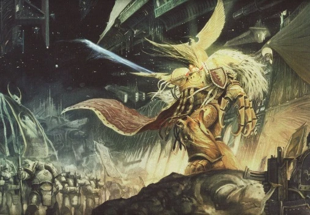
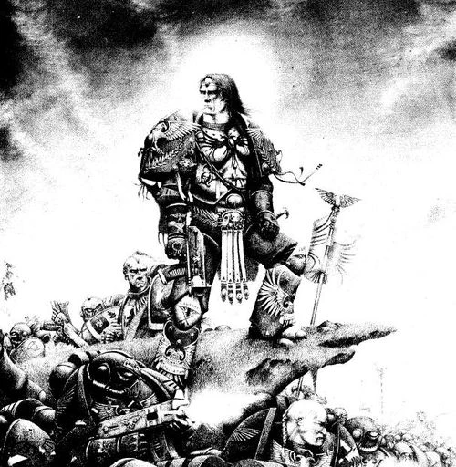

# 0748 798.M30-005.M31 大远征 Great Crusade

精校状态：中文行文已逐段精校，部分术语仍为暂定

分类：时间线

原文来源：https://www.bilibili.com/opus/993982086604914690

原作者：帝国神选罐头

原文时间：编辑于 2025年01月20日 15:21

[返回分类目录](目录.md) · [全书目录](../../目录.md)

<!-- A0748-B0001 -->
**英文原文**

The Great Crusade (~798.M30 — 005.M31) was a brief age of rebuilding and reunification following the complete regression of mankind during the Age of Strife. It was a time when the Emperor still lived in the conventional sense and led his race in person. It followed the Emperor's conquest of Terra in the Unification Wars and lasted roughly from the conquest of Earth's moon to the Battle of Isstvan III and the beginning of the Horus Heresy.

<!-- /A0748-B0001 -->

<!-- A0748-B0002 -->

原译文

大远征（~798.M30--005.M31）是人类在纷争时代完全倒退后重建和统一的短暂时期。这是一个帝皇仍然存活并在传统意义上亲自领导他的种族的时代。它发生在帝皇在统一战争中征服泰拉之后，大致从征服月球到伊斯塔万三号战役和荷鲁斯叛乱的开始。

**校订译文**

大远征（约 798.M30—005.M31）是纷争时代人类文明全面倒退后，一个短暂的重建与再统一时期。当时，帝皇仍以通常意义上的活人之身，亲自领导整个种族。它接续统一战争中对泰拉的征服，大致始于攻占月球，终于伊斯塔万三号之战及荷鲁斯之乱的爆发。

**校注：** 本篇给出的起点约798.M30，与“始于征服月球”及746篇约703.M30不一致，原日期各自保留待核，不将其隐藏为统一纪年。

<!-- /A0748-B0002 -->

<!-- A0748-B0003 图片 -->

<!-- A0748-B0004 -->

原译文

The Emperor with his Space Marines 帝皇与他的星际战士

**校订译文**

The Emperor with his Space Marines 帝皇与他的星际战士

<!-- /A0748-B0004 -->

<!-- A0748-B0005 -->
## The Early Crusade 大远征早期

<!-- /A0748-B0005 -->

<!-- A0748-B0006 -->
**英文原文**

Part of the Emperor's vision of human unification was the Primarch Project, meant to be the creation of 20 superhumans to lead the Emperor's forces to reclaim the galaxy in his name. It also saw the creation of the Space Marine Legions from the gene-seed samples that survived the scattering of the Primarchs by the Chaos gods. These forces would play the major role in the upcoming Great Crusade alongside the Imperial Army, Titan Legions, Legio Cybernetica, Sisters of Silence, and Custodian Guard.

<!-- /A0748-B0006 -->

<!-- A0748-B0007 -->

原译文

帝皇对人类统一的愿景之一是“原体计划”，旨在创造20名超人，带领帝皇的军队以他的名义夺回银河系。还看到了星际战士军团的创建，这些基因种子样本在混沌之神分散原体后幸存下来。这些部队将在即将到来的大远征中发挥重要作用，与帝国陆军、泰坦军团、智控军团、寂静修女和禁军并肩作战。

**校订译文**

帝皇统一人类的宏愿中，包括原体计划：创造二十名超人，由他们以帝皇之名率军收复银河。混沌诸神将原体散布各处后，帝皇又利用留存的基因种子样本建立了星际战士军团。这些军团将与帝国军、泰坦军团、智控军团、寂静修女和帝国禁军一道，在即将到来的大远征中发挥关键作用。

<!-- /A0748-B0007 -->

<!-- A0748-B0008 -->
**英文原文**

The subsiding of the warp storms plaguing much of the galaxy coincided with the end of the Age of Strife. With warp travel feasible again, the Emperor was able to begin the Great Crusade which would create the Imperium. Even before the warp storms and the Age of Strife had ended, the Emperor had begun to make plans for the Great Crusade. These plans included the creation of a far more advanced form of power armour required for the conditions of deep space and alien worlds.

<!-- /A0748-B0008 -->

<!-- A0748-B0009 -->

原译文

困扰银河系大部分地区的亚空间风暴的消退恰逢纷争时代的结束。由于亚空间航行再次可行，帝皇得以开始伟大的大远征，从而建立了帝国。甚至在亚空间风暴和纷争时代结束之前，帝皇就已经开始为大远征制定计划。这些计划包括为宇宙深空和异星世界的条件创造一种更先进的动力盔甲。

**校订译文**

纷争时代结束之际，肆虐银河大部的亚空间风暴也逐渐消退。跃迁航行重新成为可能，帝皇终于能够展开建立帝国的大远征。事实上，在风暴与纷争时代结束以前，他就已开始筹备远征，包括研制更先进的动力护甲，以适应深空与异族世界的作战环境。

<!-- /A0748-B0009 -->

<!-- A0748-B0010 -->
**英文原文**

After securing Luna and then Mars, he began a great building project, reconstructing the industries and production facilities he would need to construct and maintain a great space fleet, sufficient to carry his legions all the way to the edges of the galaxy. Mars, due to its advanced technology and manufacturing infrastructure, became the center of this development, producing, along with ships, the arms and armor his warriors would be equipped with. Saturn, Neptune, and Jupiter fell to the Emperor next, its inhabitants liberated from cruel alien overlords. Finally, the Imperial War Fleet broke out of the Sol System system after completely annihilating the "false world" of Sedna.

<!-- /A0748-B0010 -->

<!-- A0748-B0011 -->

原译文

在收复了月球和火星之后，他开始了一项巨大的建造工程，重建了他建造和维护一支庞大的太空舰队所需的工业和生产设施，足以将他的军团一直运送到银河系的边缘。由于其先进的技术和基础制造设施，火星成为了这一发展的中心，生产他的战士将配备的武器，盔甲以及战舰。土星、海王星和木星随后落入帝皇之手，将其居民从残酷的外星霸主手中解放出来。最后，帝国战争舰队在彻底消灭塞德娜的“虚假世界”后，离开了太阳系。

**校订译文**

控制月球与火星后，帝皇启动庞大的建设计划，恢复工业与生产设施，准备建造、维持一支足以将军团送往银河边缘的舰队。凭借先进技术与制造基础，火星成为这一工程的核心，不仅建造舰船，也为战士生产武器和护甲。随后，土星、海王星与木星相继归于帝皇统治，居民从残酷异形霸主手中获得解放。最终，帝国战斗舰队彻底摧毁塞德娜这座“虚假世界”，驶出太阳系。

<!-- /A0748-B0011 -->

<!-- A0748-B0012 -->
## The Crusade begins 大远征开始

<!-- /A0748-B0012 -->

<!-- A0748-B0013 -->
**英文原文**

His fleet constructed, he forged out into the depths of space, seeking out his Primarchs and spreading the name of the Emperor. Throughout the following millennium, he gradually reclaimed his Primarchs, and slowly united humanity under the Pax Imperialis. World after world fell to the Emperor's forces, at first the Legio Astartes and Custodian Guard and later the Imperial Army, Sisters of Silence, Collegia Titanica, Legio Cybernetica, and others. Tyrants and false-rulers of thousands of worlds were overthrown by Imperial forces, who quickly outlawed religion and dogma by decree of the Emperor himself. Orks, Eldar, Hrud, Slaugth, hideous Warp entities, and many other lesser alien races were all defeated and driven back in a seemingly unstoppable tide of conquest. Worlds whose human population had become too corrupted or mutated were simply exterminated from orbit.

<!-- /A0748-B0013 -->

<!-- A0748-B0014 -->

原译文

他建造了舰队，深入太空，寻找他的原体，并传播帝皇的名字。在接下来的千年里，他逐渐找回了自己的原体，并在帝国圣像下慢慢地将人类团结起来。一个又一个世界落入了帝皇的军队之手，起初是阿斯塔特军团和禁军，后来是帝国陆军、寂静修女、泰坦修会、智控军团等。数千个世界的暴君和假统治者被帝国军队推翻，帝国军队迅速通过帝皇本人的法令宣布宗教和教条为非法。欧克蛮人、艾达灵族、太空鼠人、史洛斯人、丑陋的亚空间实体和许多其他较小的外星种族都被击败，并在看起来就不可阻挡的征服浪潮中被击退。人口过于堕落或变异的世界被从轨道上彻底消灭了。

**校订译文**

舰队建成后，帝皇进军深空，寻找失散的原体，将自己的名号传遍群星。在此后的一千年里，他逐渐找回原体，在帝国治世下重新整合人类。最初出征的是阿斯塔特军团与帝国禁军，后来帝国军、寂静修女、泰坦修会、智控军团等也加入其中，一个又一个世界被征服。数千个世界的暴君与僭主遭到推翻，帝国部队迅速按照帝皇的敕令，禁止宗教及其教条。欧克蛮人、灵族、赫鲁德、史洛斯、恐怖的亚空间实体，以及众多较弱小的异族，都在看似无法阻挡的征服浪潮中被击溃、驱退。对于人类居民腐化或变异过于严重的世界，帝国则直接从轨道实施灭绝。

**校注：** following millennium 明写随后一千年，与同篇“约两百年”冲突，照译并保留疑点。Pax Imperialis 指帝国治世或帝国统治下的和平，原帝国圣像误译。Eldar、Hrud、Slaugth 分别沿灵族、赫鲁德、史洛斯，不混入其他种族名称。

<!-- /A0748-B0014 -->

<!-- A0748-B0015 图片 -->

<!-- A0748-B0016 -->

原译文

The Emperor and his Space Marines 帝皇和他的星际战士

**校订译文**

The Emperor and his Space Marines 帝皇和他的星际战士

<!-- /A0748-B0016 -->

<!-- A0748-B0017 -->
**英文原文**

In the early stages of the Crusade, the Imperial forces were divided into three main thrusts, one commanded by Horus, the other by Ferrus Manus, and the last by the Emperor himself. As each Primarch was discovered, he was given control of his own Legion of Space Marines. As more of the Empire was carved, the Emperor's forces were spread more and more thinly.

<!-- /A0748-B0017 -->

<!-- A0748-B0018 -->

原译文

在大远征的早期阶段，帝国军队分为三个主要方向，一个由荷鲁斯指挥，另一个由费鲁斯·马努斯指挥，最后一个由帝皇本人指挥。当每一位原体被发现时，他都被赋予了自己的星际战士军团的控制权。随着帝国的扩张，帝皇的军队越来越分散。

**校订译文**

大远征早期，帝国军队分三路推进，分别由荷鲁斯、费鲁斯·马努斯与帝皇亲自指挥。每找回一位原体，帝皇便将对应星际战士军团交给他统率。但随着版图扩大，军队也愈发分散，兵力日渐摊薄。

<!-- /A0748-B0018 -->

<!-- A0748-B0019 -->
**英文原文**

The Crusade lasted for around two hundred years. At its peak, it had over 4,300 Expeditionary Fleets involved in galactic conquest. The Great Crusade reached its apex with the great victory by Horus against a massive Waaagh! of Orks in the Ullanor Crusade. After this victory the Emperor declared Horus Warmaster, or acting Supreme Commander in his stead. Having seen most of humanity reunited the Emperor returned to Terra, where he began his secret project.

<!-- /A0748-B0019 -->

<!-- A0748-B0020 -->

原译文

大远征持续了大约两百年。在鼎盛时期，它有4300多支远征舰队参与了银河系的征服。伟大的大远征达到了顶峰是在荷鲁斯战胜了乌兰诺远征中欧克蛮人的大规模Waaagh！。在这场胜利之后，帝皇宣布荷鲁斯为战帅，并代替其担任最高统帅。在目睹了大部分人类的重聚后，帝皇回到了泰拉，在那里他开始了他的秘密计划。

**校订译文**

大远征持续约两百年，鼎盛时有超过四千三百支远征舰队参与征服银河。乌兰诺远征中，荷鲁斯击败规模庞大的欧克 Waaagh!，使大远征达到顶峰。胜利之后，帝皇任命荷鲁斯为战帅，代自己行使最高统帅的职权。见大部分人类已重归统一，帝皇便返回泰拉，开始自己的秘密工程。

**校注：** 修正施受关系：荷鲁斯代帝皇担任最高统帅，不是帝皇代荷鲁斯。

<!-- /A0748-B0020 -->

<!-- A0748-B0021 -->
**英文原文**

Towards the Great Crusade's end came a period of political consolidation. The Legions were at this point dispersed across the galaxy, many acting as garrison forces rather than campaigning armies. The Legions had been battling constantly, especially the Iron Warriors, struggling under the monotony of siege warfare and garrison duties. A large bureaucracy overseen by Malcador and the Council of Terra formed to manage the newly conquered territories. This bureaucracy often clashed with the Astartes military established, and tensions began to run high when it became apparent that the Emperor intended to have Malcador's Terran Council rule over the nascent Imperium and not the Legiones Astartes.

<!-- /A0748-B0021 -->

<!-- A0748-B0022 -->

原译文

大远征接近尾声时，出现了一段政治巩固时期。此时，军团分散在银河系各地，许多人充当驻军，而不是作战部队。军团一直在战斗，尤其是钢铁勇士，在千篇一律的攻城战和驻军任务下挣扎。一个由马卡多和泰拉议会监督的大型官僚机构成立，以管理新征服的领土。这个官僚机构经常与著名的阿斯塔特军队发生冲突，但帝皇显然打算让马卡多的泰拉议会统治新生的帝国，而不是阿斯塔特军团时，紧张局势开始加剧。

**校订译文**

大远征接近尾声时，帝国进入政治整合阶段。各军团分散银河，许多部队转为驻军，不再四处征战。长期作战令军团疲惫不堪，钢铁勇士尤其深陷单调的攻城战与驻防任务。马卡多与泰拉议会监督建立了一套庞大官僚体系，管理新征服的疆域。这套体系经常与既有的阿斯塔特军事权力结构冲突。当帝皇打算让马卡多的泰拉议会，而非阿斯塔特军团统治新生帝国的意图愈发明显时，矛盾也不断升级。

<!-- /A0748-B0022 -->

<!-- A0748-B0023 -->
**英文原文**

Also, without the Emperor's guidance the Primarchs that had previously friendly rivalries were beginning to develop into dangerous feuds. Some of the Primarchs had reached the point of intolerance with one another, others like Magnus the Red had simply become isolated in the confusion of the Great Crusade. Already the Word Bearers Primarch Lorgar had secretly turned against the Emperor decades before the Crusades end after the destruction of his "perfect city" of Monarchia by the Ultramarines. Meanwhile Leman Russ clashed with both Angron and Lion El'Jonson. Perturabo was shunned by most due to the nature of his hand in the Crusade and was in turn envious of Rogal Dorn. Konrad Curze also had a disagreement with Dorn that escalated into a brutal surprise attack that left Dorn badly injured and unconscious. This mistrust and hatred would form the linchpin of the Horus Heresy.

<!-- /A0748-B0023 -->

<!-- A0748-B0024 -->

原译文

此外，在没有帝皇指导的情况下，之前友好竞争的原体们开始发展成危险的争斗。一些原体已经达到了彼此互不相容的地步，而其他人，如马格努斯，则只是在大远征的混乱中被孤立了。在大远征结束前的几十年里，怀言者原体珞珈就已经秘密地对抗帝皇，因为他在莫纳克亚的“完美之城”被极限战士摧毁了。与此同时，黎曼·鲁斯与安格隆和莱恩·艾尔庄森发生了冲突。由于他在大远征中的本性，佩图拉博被大多数人避开，反过来又嫉妒罗格·多恩。康拉德·科兹也与多恩发生了分歧，升级为一场残酷的袭击，导致多恩严重受伤并昏迷。这种不信任和仇恨将成为荷鲁斯叛乱的关键。

**校订译文**

失去帝皇的引导后，原体之间原本尚算友好的竞争，也开始恶化为危险的仇怨。一些原体已经到了彼此无法容忍的地步；红魔马格努斯等人，则在大远征的纷乱中愈发孤立。早在远征结束数十年前，怀言者原体珞珈的“完美之城”摩纳齐亚被极限战士摧毁，他便已秘密背叛帝皇。黎曼·鲁斯则先后与安格隆、莱昂·艾尔’庄森冲突。佩图拉博因自己在远征中承担的任务性质而受到多数兄弟疏远，又反过来嫉妒罗格·多恩。康拉德·科兹与多恩的分歧也升级为一次残酷突袭，令多恩重伤昏迷。这些猜疑与仇恨，后来成为荷鲁斯之乱的重要支点。

**校注：** 摩纳齐亚就是“完美之城”本身，不是另一座城市所处地区。nature of his hand 指佩图拉博在远征中的角色和任务性质，不是他的性格本性。

<!-- /A0748-B0024 -->

<!-- A0748-B0025 -->
## Noteworthy Battles & Campaigns of the Great Crusade 大远征的重要战斗与战役

原题：Noteworthy Battles & Campaigns of the Great Crusade 大远征中值得注意的战斗和战役

<!-- /A0748-B0025 -->

<!-- A0748-B0026 -->
**英文原文**

First Pacification of Luna — The first major battle of the Great Crusade

<!-- /A0748-B0026 -->

<!-- A0748-B0027 -->

原译文

平定月球 — 大远征的第一场主要战役

**校订译文**

第一次月球平定——大远征的首场主要战役。

<!-- /A0748-B0027 -->

<!-- A0748-B0028 -->
**英文原文**

Sedna Campaign - The whole of the Sol System is reclaimed.

<!-- /A0748-B0028 -->

<!-- A0748-B0029 -->

原译文

塞德娜战役 - 整个太阳系被夺回

**校订译文**

塞德娜战役——帝国收复整个太阳系。

<!-- /A0748-B0029 -->

<!-- A0748-B0030 -->
**英文原文**

The Battle of Gorro — The Emperor and Horus battle together against Orks

<!-- /A0748-B0030 -->

<!-- A0748-B0031 -->

原译文

戈罗之战 — 帝皇和荷鲁斯联手对抗欧克蛮人

**校订译文**

戈罗之战——帝皇与荷鲁斯并肩对抗欧克蛮人。

<!-- /A0748-B0031 -->

<!-- A0748-B0032 -->
**英文原文**

The Battle of Keylek — The Luna Wolves exterminate the keylekid.

<!-- /A0748-B0032 -->

<!-- A0748-B0033 -->

原译文

凯莱克之战 — 太空野狼消灭了凯莱克人

**校订译文**

科莱克之战——影月苍狼灭绝凯莱基德。

**校注：** Luna Wolves 是影月苍狼，原译太空野狼误认军团；地名科莱克与种族凯莱基德沿702、703既定区分。

<!-- /A0748-B0033 -->

<!-- A0748-B0034 -->
**英文原文**

The Rangdan Xenocides — The Dark Angels lose 50,000 Battle-Brothers saving the northern Imperim from the Rangda.

<!-- /A0748-B0034 -->

<!-- A0748-B0035 -->

原译文

冉丹灭绝之战 — 黑暗天使失去了50000名战斗兄弟，从冉丹手中拯救了帝国北方

**校订译文**

冉丹灭绝战争——黑暗天使牺牲五万名战斗兄弟，使帝国北部免受冉丹侵害。

<!-- /A0748-B0035 -->

<!-- A0748-B0036 -->
**英文原文**

Battle of Sixty-Three Nineteen — Horus brings the world of Sixty-Three-Nineteen into the Imperial fold.

<!-- /A0748-B0036 -->

<!-- A0748-B0037 -->

原译文

63 -19之战 — 荷鲁斯将63 - 19世界纳入帝国版图

**校订译文**

六十三—十九之战——荷鲁斯将六十三—十九世界纳入帝国。

<!-- /A0748-B0037 -->

<!-- A0748-B0038 -->
**英文原文**

Fall of the Lords of Gardinaal — The 413rd Expeditionary Fleet and Ferrus Manus subdue the advanced human world of Gardinaal

<!-- /A0748-B0038 -->

<!-- A0748-B0039 -->

原译文

加迪那尔领主之陨 — 第413远征舰队和费鲁斯·马努斯征服了加迪那尔的先进人类世界

**校订译文**

加迪纳尔诸领主之陨——第四百一十三远征舰队与费鲁斯·马努斯征服先进的人类世界加迪纳尔。

<!-- /A0748-B0039 -->

<!-- A0748-B0040 -->
**英文原文**

Battle of Gyros-Thravian — The Emperor, Rogal Dorn, Mortarion, and Horus defeat one of the most powerful Ork Warbosses in recorded history, Gharkul Blackfang.

<!-- /A0748-B0040 -->

<!-- A0748-B0041 -->

原译文

杰罗斯-萨洛维安之战 — 帝皇、罗格·多恩、莫塔里安和荷鲁斯击败了有史以来最强大的欧克战争首领之一的伽尔库·黑牙

**校订译文**

杰罗斯-萨洛维安之战——帝皇、罗格·多恩、莫塔里安与荷鲁斯击败了有记载以来最强大的欧克战争头目之一：伽尔库·黑牙。

<!-- /A0748-B0041 -->

<!-- A0748-B0042 -->
**英文原文**

Conquest of Galaspar — The Death Guard conquers the world of Galaspar.

<!-- /A0748-B0042 -->

<!-- A0748-B0043 -->

原译文

征服加拉斯巴 — 死亡守卫征服了加拉斯巴世界

**校订译文**

加拉斯帕征服战——死亡守卫征服加拉斯帕世界。

<!-- /A0748-B0043 -->

<!-- A0748-B0044 -->
**英文原文**

Cleansing of Laeran — The Emperor's Children annihilate the Laer.

<!-- /A0748-B0044 -->

<!-- A0748-B0045 -->

原译文

净化拉尔兰 — 帝皇之子消灭了刺人

**校订译文**

莱兰清洗——帝皇之子灭绝莱尔。

<!-- /A0748-B0045 -->

<!-- A0748-B0046 -->
**英文原文**

Golgothan Slaughter — The World Eaters battle the Brotherhood of Ruin and Orks on Sarum.

<!-- /A0748-B0046 -->

<!-- A0748-B0047 -->

原译文

戈尔戈坦屠杀 — 吞世者在萨鲁姆与毁灭兄弟会和兽人作战

**校订译文**

戈尔戈坦大屠杀——吞世者在萨勒姆对抗毁灭兄弟会与欧克蛮人。

<!-- /A0748-B0047 -->

<!-- A0748-B0048 -->
**英文原文**

Battle of Gate Forty-Two — Horus leads four Legions in a major assault that sees heavy Raven Guard losses.

<!-- /A0748-B0048 -->

<!-- A0748-B0049 -->

原译文

四十二号门之战 — 荷鲁斯率领四个军团进行了一次主要进攻，暗鸦守卫损失惨重

**校订译文**

四十二号门之战——荷鲁斯率四支军团发动大规模攻势，暗鸦守卫损失惨重。

<!-- /A0748-B0049 -->

<!-- A0748-B0050 -->
**英文原文**

Ullanor Crusade — Horus defeats the empire of Ork Warboss Urlakk Urg.

<!-- /A0748-B0050 -->

<!-- A0748-B0051 -->

原译文

乌兰诺远征 — 荷鲁斯击败了兽人战争首领乌尔拉克·乌尔格的帝国

**校订译文**

乌兰诺远征——荷鲁斯击败欧克战争头目乌尔拉克·乌尔格的帝国。

<!-- /A0748-B0051 -->

<!-- A0748-B0052 -->
**英文原文**

Battle of 47-16 — The Word Bearers sack the world of 47-16.

<!-- /A0748-B0052 -->

<!-- A0748-B0053 -->

原译文

47-16之战 — 怀言者洗劫了47-16世界

**校订译文**

47-16 之战——怀言者洗劫 47-16 世界。

<!-- /A0748-B0053 -->

<!-- A0748-B0054 -->
**英文原文**

Diasporex Conflict — The Iron Hands and Emperor's Children battle the Human-Xenos confederation known as the Diasporex

<!-- /A0748-B0054 -->

<!-- A0748-B0055 -->

原译文

流散者之战 — 钢铁之手和帝皇之子与被称为流散者的人类-异形联盟作战

**校订译文**

流散者冲突——钢铁之手与帝皇之子对抗名为流散者的人类与异形联盟。

<!-- /A0748-B0055 -->

<!-- A0748-B0056 -->
**英文原文**

War on Murder — Horus and Sanguinius battle the Megarachnids

<!-- /A0748-B0056 -->

<!-- A0748-B0057 -->

原译文

谋杀之战 — 荷鲁斯和圣吉列斯与巨蛛怪作战

**校订译文**

谋杀星战争——荷鲁斯与圣吉列斯对抗巨蛛怪。

<!-- /A0748-B0057 -->

<!-- A0748-B0058 -->
**英文原文**

Interex Conflict — Horus invades the advanced human civilization Interex.

<!-- /A0748-B0058 -->

<!-- A0748-B0059 -->

原译文

英特瑞克斯冲突 — 荷鲁斯入侵先进的人类文明英特瑞克斯

**校订译文**

英特雷斯冲突——荷鲁斯入侵先进的人类文明英特雷斯。

<!-- /A0748-B0059 -->

<!-- A0748-B0060 -->
**英文原文**

Battle of Davin's Moon — Horus unwittingly falls into a Word Bearers trap and falls to Chaos.

<!-- /A0748-B0060 -->

<!-- A0748-B0061 -->

原译文

戴文之月战役 — 荷鲁斯无意中落入了怀言者的陷阱，堕入了混沌

**校订译文**

戴文之月战役——荷鲁斯不知不觉落入怀言者陷阱，堕向混沌。

<!-- /A0748-B0061 -->

<!-- A0748-B0062 -->
**英文原文**

Auretian Technocracy War — Secretly dedicated to overthrowing the Emperor, Horus wages war on the Auretian Technocracy.

<!-- /A0748-B0062 -->

<!-- A0748-B0063 -->

原译文

奥瑞提亚科技联盟之战 — 荷鲁斯秘密致力于推翻帝皇，对奥瑞提亚科技联盟发动战争。

**校订译文**

奥瑞提安技术联盟战争——已秘密决意推翻帝皇的荷鲁斯，向奥瑞提安技术联盟开战。

<!-- /A0748-B0063 -->

<!-- A0748-B0064 -->
## The End of the Crusade 大远征的结束

<!-- /A0748-B0064 -->

<!-- A0748-B0065 -->
**英文原文**

The age of the Great Crusade ended with the virus bombing of Isstvan III by Warmaster Horus, which announced the beginning of his Rebellion. The loyalist legions were recalled to Terra to defend against the traitor Warmaster, but not all of the Legions were able to return. The Ultramarines were mired in the Ultramar system fighting Kor Phaeron and his retinue of Word Bearers that had come to destroy them. The Space Wolves were finishing their battle at Prospero with the now openly traitorous Thousand Sons, the White Scars were mired in the Chondax Campaign, and the Dark Angels were in the midst of a civil war on Caliban and a slow campaign against the Gordian League.

<!-- /A0748-B0065 -->

<!-- A0748-B0066 -->

原译文

大远征的时代随着战帅荷鲁斯对伊斯塔万三号的病毒轰炸而结束，这宣布了他的叛乱的开始。忠诚的军团被召回泰拉，以抵御叛乱的战帅，但并非所有军团都能返回。极限战士陷在了奥特拉玛星系中，与科尔·法伦和他的怀言者随从作战来摧毁他们。太空野狼在普罗斯佩罗结束了与现已公开叛变的千子的战斗，白色疤痕陷入了香德克斯战役，黑暗天使正在卡利班进行内战，并在对戈迪亚联盟进行着进程缓慢的战役。

**校订译文**

荷鲁斯对伊斯塔万三号发动病毒轰炸，宣告叛乱开始，也终结了大远征时代。忠诚派军团被召回泰拉，抵御叛变战帅，但并非所有军团都能返回。极限战士陷在奥特拉玛星系，与前来毁灭他们的科尔·法伦及其怀言者部队交战。太空野狼刚结束在普罗斯佩罗与已公开叛变的千子的战斗；白疤受困于香德克斯战役；黑暗天使则身陷卡利班内战，同时仍在缓慢推进对戈尔迪安联盟的征讨。

**校注：** 保留源文对叛乱初期各军团处境的合并概述，但它把不同时间发生的考斯、普罗斯佩罗与卡利班事件并列，时间关系需结合各专篇阅读；Ultramar system 源文称星系，与通常奥特拉玛疆域概念有出入，待核。

<!-- /A0748-B0066 -->

<!-- A0748-B0067 -->
**英文原文**

In many ways the Emperor was now gone, The Imperium suddenly finding itself without the great leadership of the Guardian of Mankind. The brief age of recovery which the Great Crusade represented was over, and mankind began to decline into the state it is now, with fear and chaos rife, Inquisitors seeking out heresy at every corner and billions of people living in forced, and willing, slavery to their God-Emperor.

<!-- /A0748-B0067 -->

<!-- A0748-B0068 -->

原译文

在皇帝已经离开的许多方面，帝国突然发现自己没有了人类守护者的伟大领导。大远征所代表的短暂复苏时代已经结束，人类开始衰落到现在的状态，恐惧和混乱盛行，审判官在每个角落寻找异端，数十亿人被迫并自愿成为他们的神皇的奴隶。

**校订译文**

从许多方面来说，帝国已经失去帝皇的亲自引领，不再有这位人类守护者为它指明方向。大远征所代表的短暂复兴宣告结束，人类逐渐衰落为后来的模样：恐惧与混乱蔓延，审判官在每个角落搜寻异端，数十亿人无论被迫还是自愿，都成为神皇的奴仆。

<!-- /A0748-B0068 -->

本篇核心术语与暂定项

以下列出本篇出现的英文原形及核心术语表用词。同形词可能指不同对象，具体词义以本篇正文和校注为准；单复数、别名和仅见于图注的名称可能尚未列入。完整候选见[术语表](../../术语表/双语术语候选.csv)。

| 英文 | 采用中文 | 状态 |
| --- | --- | --- |
| Space Marines | 星际战士 | 官方已核对 |
| Dark Angels | 黑暗天使 | 官方已核对 |
| Space Wolves | 太空野狼 | 官方已核对 |
| Imperial Army | 帝国军 | 暂定·官方待核 |
| Death Guard | 死亡守卫 | 官方已核对 |
| Thousand Sons | 千子 | 官方已核对 |
| World Eaters | 吞世者 | 官方已核对 |
| Eldar | 灵族 | 暂定·语境区分 |
| Orks | 欧克蛮人 | 官方已核对 |
| Ultramar | 奥特拉玛 | 官方已核对 |
| Ultramarines | 极限战士 | 官方已核对 |
| Horus Heresy | 荷鲁斯之乱 | 官方已核对 |
| Warp | 亚空间 | 官方已核对 |
| Imperium | 帝国 | 暂定·简称 |
| Legio Cybernetica | 智控军团 | 暂定 |
| Waaagh! | Waaagh! | 暂定·保留原文 |
| History | 历史 | 编辑用语已统一 |
| Emperor | 帝皇 | 官方已核对 |
| Primarch | 原体 | 官方已核对 |
| Slavery | 奴隶制 | 编辑用语已统一 |
| Word Bearers | 怀言者 | 暂定·官方待核 |
| Emperor's Children | 帝皇之子 | 官方已核对 |
| Iron Warriors | 钢铁勇士 | 暂定·官方待核 |
| Great Crusade | 大远征 | 暂定·官方待核 |
| Galaspar | 加拉斯帕 | 暂定·官方待核 |
| Mortarion | 莫塔里安 | 官方已核对 |
| Gardinaal | 加迪纳尔 | 暂定·官方待核 |
| Age of Strife | 纷争时代 | 暂定·官方待核 |
| Ferrus Manus | 费鲁斯·马努斯 | 暂定·官方待核 |
| Fall of the Lords of Gardinaal | 加迪纳尔诸领主之陨 | 暂定·官方待核 |
| Interex | 英特雷斯 | 暂定·官方待核 |
| Terra | 泰拉 | 暂定·官方待核 |
| Murder | 谋杀 | 暂定·官方待核 |
| Luna Wolves | 影月苍狼 | 暂定·官方待核 |
| Horus | 荷鲁斯 | 暂定·官方待核 |
| Auretian Technocracy | 奥瑞提安技术联盟 | 暂定·官方待核 |
| The Brotherhood | 兄弟会 | 暂定·官方待核 |
| Gordian League | 戈尔迪安联盟 | 暂定·官方待核 |
| Lion El'Jonson | 莱昂·艾尔’庄森 | 官方已核对 |
| Isstvan III | 伊斯塔万三号 | 暂定·官方待核 |
| The Brotherhood of Ruin | 毁灭兄弟会 | 暂定·官方待核 |
| Sarum | 萨勒姆 | 暂定·官方待核 |
| Golgothan Slaughter | 戈尔戈坦大屠杀 | 暂定·官方待核 |
| The Diasporex | 流散者 | 暂定·官方待核 |
| Iron Hands | 钢铁之手 | 暂定·官方待核 |
| Collegia Titanica | 泰坦修会 | 暂定·官方待核 |
| Sisters of Silence | 寂静修女 | 暂定·官方待核 |
| Magnus the Red | 红魔马格努斯 | 官方已核对 |
| Legiones Astartes | 阿斯塔特军团 | 暂定·官方待核 |
| Unification Wars | 统一战争 | 暂定·官方待核 |
| Brotherhood | 兄弟会 | 暂定·官方待核 |
| Konrad Curze | 康拉德·科兹 | 暂定·官方待核 |
| Mars | 火星 | 暂定·官方待核 |
| Jupiter | 木星 | 暂定·官方待核 |
| Caliban | 卡利班 | 暂定·官方待核 |
| Sixty-Three-Nineteen | 六十三—十九 | 暂定·官方待核 |
| Davin | 戴文 | 暂定·官方待核 |
| Luna | 月球 | 暂定·官方待核 |
| Titan | 泰坦 | 暂定·官方待核 |
| Primarch Project | 原体计划 | 暂定·官方待核 |
| Rangdan Xenocides | 冉丹灭绝战争 | 暂定·官方待核 |
| Custodian Guard | 禁军卫队 | 官方已核对 |
| Urlakk Urg | 乌尔拉克·乌尔格 | 暂定·官方待核 |
| Gorro | 戈罗 | 暂定·官方待核 |
| Ullanor | 乌兰诺 | 暂定·官方待核 |
| White Scars | 白疤 | 官方已核 |
| Raven Guard | 暗鸦守卫 | 官方已核 |
| The Primarchs | 原体 | 暂定·官方待核 |
| Scars | 伤疤 | 暂定·官方待核 |
| Sol | 太阳系 | 暂定·官方待核 |
| Isstvan | 伊斯塔万 | 暂定·官方待核 |
| Kor Phaeron | 科尔·法伦 | 暂定·官方待核 |
| Power Armour | 动力盔甲 | 暂定·官方待核 |
| Space Marine | 星际战士 | 暂定·官方待核 |
| Gene-seed | 基因种子 | 暂定·官方待核 |
| Lorgar | 珞珈 | 暂定·官方待核 |
| Monarchia | 摩纳齐亚 | 暂定·官方待核 |
| Chondax | 香德克斯 | 暂定·官方待核 |
| Laer | 莱尔 | 暂定·官方待核 |
| Xenos | 异形 | 暂定·官方待核 |
| Rangda | 冉丹 | 暂定·官方待核 |
| Rangdan | 冉丹 | 暂定·官方待核 |
| Slaugth | 史洛斯 | 暂定·官方待核 |
| Laeran | 莱兰 | 暂定·官方待核 |
| Cleansing of Laeran | 莱兰清洗 | 暂定·官方待核 |
| Hrud | 赫鲁德 | 暂定·官方待核 |
| Warboss | 战争头目 | 官方已核对 |
| Gharkul Blackfang | 伽尔库·黑牙 | 暂定·官方待核 |
| Imperialis | 帝国徽记 | 暂定·官方待核 |
| Angron | 安格隆 | 官方已核对 |
| Phaeron | 法皇 | 暂定·官方待核 |
| Gyros-Thravian | 杰罗斯-萨洛维安 | 暂定·官方待核 |
| Keylekid | 凯莱基德 | 暂定·官方待核 |
| Chondax Campaign | 香德克斯战役 | 暂定·官方待核 |
| Keylek | 科莱克 | 暂定·官方待核 |
| The Dark | 《黑暗》 | 暂定·官方待核 |
| System | 星系（恒星系统） | 暂定·官方待核 |
| First Pacification of Luna | 第一次月球平定 | 暂定·官方待核 |
| Sedna | 塞德娜 | 暂定·官方待核 |
| Sedna Campaign | 塞德娜战役 | 暂定·官方待核 |
| Pax Imperialis | 帝国治世 | 暂定·官方待核 |
| Conquest of Galaspar | 加拉斯帕征服战 | 暂定·官方待核 |
| Diasporex Conflict | 流散者冲突 | 暂定·官方待核 |
| War on Murder | 谋杀星战争 | 暂定·官方待核 |
| Interex Conflict | 英特雷斯冲突 | 暂定·官方待核 |
| Auretian Technocracy War | 奥瑞提安技术联盟战争 | 暂定·官方待核 |
| Battle of Sixty-Three Nineteen | 六十三—十九之战 | 暂定·官方待核 |
| Sixty-Three Nineteen | 六十三—十九 | 暂定·官方待核 |
| Davin's Moon | 戴文之月 | 暂定·官方待核 |
| Titan Legions | 泰坦军团 | 暂定·官方待核 |
| Saturn | 土星 | 暂定·官方待核 |
| Sol System | 太阳系 | 暂定·官方待核 |

