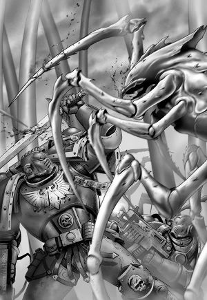

# 0753 大远征时期 谋杀星战争 War on Murder

精校状态：中文行文已逐段精校，部分术语仍为暂定

分类：时间线

原文来源：https://www.bilibili.com/opus/1185066203830288418

原作者：帝国神选罐头

原文时间：2026年03月29日 12:22

[返回分类目录](目录.md) · [全书目录](../../目录.md)

原篇名：大远征时期 谋杀战争 War on Murder

<!-- A0753-B0001 -->
**英文原文**

The War on Murder was a campaign of the Great Crusade on the world of Murder.

<!-- /A0753-B0001 -->

<!-- A0753-B0002 -->

原译文

谋杀战争是在谋杀星世界上的大远征战役。

**校订译文**

谋杀星战争是大远征期间在谋杀星上进行的一场战役。

<!-- /A0753-B0002 -->

<!-- A0753-B0003 图片 -->

<!-- A0753-B0004 -->

原译文

Megarachnids fighting the Emperor's Children 巨蛛怪与帝皇之子作战

**校订译文**

Megarachnids fighting the Emperor's Children 巨蛛怪与帝皇之子作战

<!-- /A0753-B0004 -->

<!-- A0753-B0005 -->
## Overview 概述

<!-- /A0753-B0005 -->

<!-- A0753-B0006 -->
**英文原文**

The war began when the Blood Angels force under Captain Khitas Frome discovered the planet. After landing on the world, the Blood Angels were scattered by artificial storms that blocked communications and subsequently massacred by fierce Xenos creatures dubbed Megarachnids. Captain Frome's last transmission declared "This. World. Is. Murder".

<!-- /A0753-B0006 -->

<!-- A0753-B0007 -->

原译文

当基塔斯·弗罗姆连长率领的圣血天使部队发现这颗行星时，战争开始了。登陆行星后，圣血天使被人造风暴分散，阻断了通讯，随后被被称为巨蛛怪的凶猛的异型生物屠杀。弗罗姆连长的最后一次传输断言“这个世界就是谋杀”。

**校订译文**

基塔斯·弗罗姆连长率领的圣血天使发现这颗星球后，战争随之开始。登陆部队遭人造风暴分割，通讯中断，随后被名为巨蛛怪的凶猛异形屠杀。弗罗姆最后传回的讯息是：“这。颗。星球。就是。谋杀。”

**校注：** 保留原文刻意断句，Murder由最后讯息得名；不是把每段一般“谋杀”都视为地名。

<!-- /A0753-B0007 -->

<!-- A0753-B0008 -->
**英文原文**

Later, a company of Emperor's Children under Eidolon arrived in response to the Blood Angels distress call. Soon they too saw themselves scattered by powerful storms and assaulted by the Megarachnids, with Saul Tarvitz discovering that the Megarachnids had impaled the Blood Angels on a tree-like construct for feasting. After destroying the tree, the storms above them cleared and it became apparent that these constructs were what was responsible for the deadly weather.

<!-- /A0753-B0008 -->

<!-- A0753-B0009 -->

原译文

后来，艾多隆率领的一队帝皇之子响应了圣血天使的求救信号。很快，他们也看到自己被强大的风暴分散，并遭到了巨蛛怪的袭击，索尔·塔维茨发现巨蛛怪将圣血天使刺穿在一棵树状的建筑上，准备大快朵颐。摧毁这棵树后，它们上方的风暴消失了，很明显，这些建筑是造成致命天气的原因。

**校订译文**

后来，艾多隆率领一连帝皇之子响应求救讯号而来。他们同样被猛烈风暴分散，遭到巨蛛怪袭击。索尔·塔维兹发现，巨蛛怪把圣血天使刺挂在树状构造物上，准备享用。摧毁这棵“树”后，上空风暴随之消散，帝国这才明白，致命天气正是由这些构造物制造。

<!-- /A0753-B0009 -->

<!-- A0753-B0010 -->
**英文原文**

With this new advantage, Horus led the Luna Wolves, Emperor's Children, Legio Mortis, and Imperial Army soldiers against the Megarachnids. Sanguinius leading a contingent of Blood Angels arrived soon after, and the Imperial forces waged a vicious six month extermination campaign against the Megarachnids. The war was fierce, but Garviel Loken at least saw it as "glorious" fight against a worthy enemy and a symbol of the Primarch's military prowess.

<!-- /A0753-B0010 -->

<!-- A0753-B0011 -->

原译文

凭借这一新优势，荷鲁斯率领影月苍狼、帝皇之子、死亡军团和帝国军队士兵对抗巨蛛怪。不久之后，圣吉列斯率领一支圣血天使队伍抵达，帝国部队对巨蛛怪发动了为期六个月的残酷灭绝战役。这场战争很激烈，但加维尔·洛肯至少认为这是与一个值得尊敬的敌人的“光荣”战斗，也是原体军事实力的象征。

**校订译文**

掌握这一优势后，荷鲁斯率影月苍狼、帝皇之子、死亡泰坦军团与帝国军对巨蛛怪开战。不久，圣吉列斯也率圣血天使赶到。帝国军队展开持续六个月的残酷灭绝战。战况极其惨烈，但至少在加维尔·洛肯眼中，这仍是一场与强敌交手的“光荣”战争，彰显了原体的军事才华。

<!-- /A0753-B0011 -->

<!-- A0753-B0012 -->
**英文原文**

After the war was nearly done, a fleet of Interex ships arrived informing the Imperials that they had put up warnings to stay away from the planet, and Murder had been a quarantine zone set up to contain the Megarachnids. Imperium forces departed from the Murder to prepare for contact with the new human civilization of Interex.

<!-- /A0753-B0012 -->

<!-- A0753-B0013 -->

原译文

战争接近尾声后，一支英特雷斯舰队抵达，通知帝国人他们已发出远离行星的警告，谋杀星是为遏制巨蛛怪而设立的隔离区。帝国部队离开了谋杀星，准备与新的人类文明英特雷斯接触。

**校订译文**

战事接近结束时，一支英特雷斯舰队抵达。他们告诉帝国，早已设置警告，要求外来者远离这颗星球：谋杀星其实是专门关押巨蛛怪的隔离区。帝国部队随后撤离，准备与新发现的人类文明英特雷斯展开接触。

<!-- /A0753-B0013 -->

<!-- A0753-B0014 -->
**英文原文**

Since that war some of the ancient war machines of Adeptus Astartes that became the relics of Space Marines Chapter of the 41st Millennium still bears the honour marking 'I-XL-XX' on their flank in remembering of this bitter conflict.

<!-- /A0753-B0014 -->

<!-- A0753-B0015 -->

原译文

自那场战争以来，阿斯塔特修会的一些古代战争机器成为了第41个千年星际战士战团的圣物，它们的侧翼仍然带有“I-XL-XX”的荣誉标记，以纪念这场激烈的冲突。

**校订译文**

部分参加过这场战争的古老阿斯塔特战争机器，到 M41 已成为各星际战士战团的圣物，侧面仍保留“I-XL-XX”荣誉标记，以纪念当年的苦战。

<!-- /A0753-B0015 -->

本篇核心术语与暂定项

以下列出本篇出现的英文原形及核心术语表用词。同形词可能指不同对象，具体词义以本篇正文和校注为准；单复数、别名和仅见于图注的名称可能尚未列入。完整候选见[术语表](../../术语表/双语术语候选.csv)。

| 英文 | 采用中文 | 状态 |
| --- | --- | --- |
| Space Marines | 星际战士 | 官方已核对 |
| Adeptus Astartes | 阿斯塔特修会 | 官方已核对 |
| Blood Angels | 圣血天使 | 官方已核对 |
| Imperial Army | 帝国军 | 暂定·官方待核 |
| Imperium | 帝国 | 暂定·简称 |
| Emperor | 帝皇 | 官方已核对 |
| Primarch | 原体 | 官方已核对 |
| Emperor's Children | 帝皇之子 | 官方已核对 |
| Great Crusade | 大远征 | 暂定·官方待核 |
| Interex | 英特雷斯 | 暂定·官方待核 |
| Murder | 谋杀 | 暂定·官方待核 |
| Luna Wolves | 影月苍狼 | 暂定·官方待核 |
| Horus | 荷鲁斯 | 暂定·官方待核 |
| Garviel Loken | 加维尔·洛肯 | 暂定·官方待核 |
| Luna | 月球 | 暂定·官方待核 |
| Ancient | 旗手 | 官方已核对 |
| Eidolon | 艾多隆 | 暂定·官方待核 |
| Chapter | 战团 | 暂定·官方待核 |
| Captain | 连长 | 暂定·官方待核 |
| Xenos | 异形 | 暂定·官方待核 |
| Saul Tarvitz | 索尔·塔维兹 | 暂定·官方待核 |
| The Blood | 鲜血 | 暂定·官方待核 |
| War on Murder | 谋杀星战争 | 暂定·官方待核 |
| Khitas Frome | 基塔斯·弗罗姆 | 暂定·官方待核 |
| Legio Mortis | 死亡军团 | 暂定·官方待核 |

