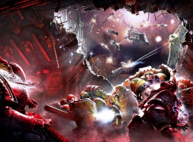
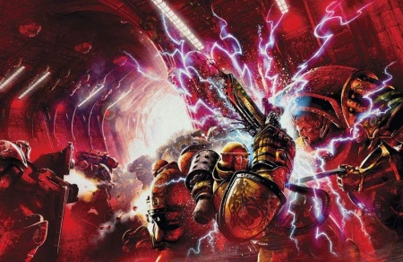

# 0755 007.M31 法尔之战 Battle of Phall

精校状态：中文行文已逐段精校，部分术语仍为暂定

分类：时间线

原文来源：https://www.bilibili.com/opus/1199223356610576402

原作者：帝国神选罐头

原文时间：2026年05月06日 15:59

[返回分类目录](目录.md) · [全书目录](../../目录.md)

原篇名：大远征时期 法尔之战 Battle of Phall

<!-- A0755-B0001 -->
**英文原文**

The Battle of Phall was fought between the Iron Warriors and Imperial Fists early in the Horus Heresy. The engagement resulted in a draw, which is attributed as a major cause for why the Horus Heresy was prolonged over several years rather than ending in months with a Horus victory.

<!-- /A0755-B0001 -->

<!-- A0755-B0002 -->

原译文

法尔之战是在荷鲁斯叛乱早期钢铁勇士和帝国之拳之间进行的。这场交战结果为平局，这被认为是荷鲁斯叛乱延长数年而不是在几个月内以荷鲁斯胜利告终的主要原因。

**校订译文**

法尔之战发生于荷鲁斯之乱早期，由钢铁勇士与帝国之拳交战。战局以平手收场，被认为是叛乱拖延数年、而非由荷鲁斯在数月内获胜的重要原因之一。

**校注：** 原篇名标“大远征时期”，但英文导言、战役资料与全部过程明确属于荷鲁斯之乱早期，标题改用其资料栏的007.M31；原题仍由主稿保留供追溯。

<!-- /A0755-B0002 -->

<!-- A0755-B0003 图片 -->

<!-- A0755-B0004 -->

原译文

The Imperial Fists and the Iron Warriors in battle over the Phall system 帝国之拳与钢铁勇士在法尔星系之战中

**校订译文**

The Imperial Fists and the Iron Warriors in battle over the Phall system 在法尔星系上空交战的帝国之拳与钢铁勇士

<!-- /A0755-B0004 -->

<!-- A0755-B0005 -->
**英文原文**

After intercepting the Death Guard ship Eisenstein, Imperial Fist Primarch Rogal Dorn was informed that Horus led the Sons of Horus, Death Guard, Emperor's Children, and World Eater legions in rebellion after slaughter any loyalists within their forces. Dorn responded by creating a "Retribution Fleet" that would strike against the traitors and bring them to heel. The fleet, representing 1/3rd of the Imperial Fist forces, was set upon by turbulence in the warp and lost many ships before becoming becalmed in the Phall System.

<!-- /A0755-B0005 -->

<!-- A0755-B0006 -->

原译文

在拦截了死亡守卫舰船爱森斯坦号后，帝国之拳原体罗格·多恩得知，荷鲁斯在屠杀了部队中的任何忠诚者后，领导荷鲁斯之子、死亡守卫、帝皇之子和吞世者军团叛乱。多恩的回应是建立一支“报复舰队”，打击叛徒并使他们屈服。代表帝国之拳部队三分之一的舰队受到亚空间湍流的袭击，损失了许多舰船，然后在法尔星系中停滞不前。

**校订译文**

帝国之拳截获死亡守卫的爱森斯坦号后，原体罗格·多恩得知：荷鲁斯先清洗了麾下忠诚派，再率荷鲁斯之子、死亡守卫、帝皇之子与吞世者四支军团叛乱。多恩随即组建惩戒舰队，准备打击叛军，迫其屈服。舰队集中了军团约三分之一的力量，却在途中遭遇亚空间乱流，损失大量舰船，最终滞留法尔星系。

<!-- /A0755-B0006 -->

<!-- A0755-B0007 -->
**英文原文**

Unable to leave, the Imperial Fists were set into a routine of drilling and preparing for combat. After 141 days, the Iron Warrior fleet appeared and immediately proceeding to attack their hated rivals. The battle went poorly for the Iron Warriors; though they outnumbered the Imperial Fists, they suffered substantial losses. Before the advantage could be pushed by the Imperial Fist, communications from Dorn made its way through the storm and ordered all Imperial Fists to return to Terra. The Imperial Fists, loyal to their primarch, immediately departed from the system and suffered substantial losses.

<!-- /A0755-B0007 -->

<!-- A0755-B0008 -->

原译文

由于无法离开，帝国之拳开始了例行的训练和战斗准备。141天后，钢铁勇士舰队出现，并立即开始攻击他们讨厌的对手。这场战斗对钢铁勇士来说很糟糕；虽然他们的人数超过了帝国之拳，但他们遭受了巨大的损失。在帝国之拳能够推进优势之前，多恩的通信穿过风暴，命令所有帝国之拳返回泰拉。忠于他们的原体的帝国之拳立即离开了这个星系，并遭受了巨大的损失。

**校订译文**

无法离开的帝国之拳不断操练，维持战备。一百四十一天后，钢铁勇士舰队出现，立即袭击宿敌。但战局对钢铁勇士十分不利，他们虽占数量优势，仍遭到重创。帝国之拳尚未来得及扩大战果，多恩的讯息便穿过风暴，命令全军返回泰拉。忠诚于原体的战士立即撤离，并在脱战过程中付出惨重损失。

<!-- /A0755-B0008 -->

<!-- A0755-B0009 -->
**英文原文**

Although the Battle of the Phall System seemed like a victory for the Iron Warriors, the Imperial Fists showed that they were a stronger force with an aptitude for battle tactics. The win was a bitter reminder to the Iron Warriors of how the Imperial Fists always overshadowed them, and the moment weighed heavily upon the mind of the Iron Warriors' Primarch Perturabo.

<!-- /A0755-B0009 -->

<!-- A0755-B0010 -->

原译文

虽然法尔星系之战似乎是钢铁勇士的胜利，但帝国之拳表明他们是一支更强大的部队，具有战斗战术的天赋。这场胜利痛苦地提醒着钢铁勇士，帝国之拳总是让他们黯然失色，这一刻沉重地压在了钢铁勇士原体佩图拉博的心中。

**校订译文**

法尔星系之战表面上似乎由钢铁勇士获胜，帝国之拳却证明了自身的战斗实力与战术才能。这场苦涩的胜利再次提醒钢铁勇士，宿敌总能盖过自己的光芒，也在佩图拉博心中留下沉重阴影。

<!-- /A0755-B0010 -->

<!-- A0755-B0011 -->
**英文原文**

Conflict:Horus Heresy

<!-- /A0755-B0011 -->

<!-- A0755-B0012 -->

原译文

冲突：荷鲁斯叛乱

**校订译文**

所属战争：荷鲁斯之乱

<!-- /A0755-B0012 -->

<!-- A0755-B0013 -->
**英文原文**

Date:007.M31

<!-- /A0755-B0013 -->

<!-- A0755-B0014 -->

原译文

日期：007.M31

**校订译文**

日期：007.M31

<!-- /A0755-B0014 -->

<!-- A0755-B0015 -->
**英文原文**

Location:Phall system

<!-- /A0755-B0015 -->

<!-- A0755-B0016 -->

原译文

地点：法尔星系

**校订译文**

地点：法尔星系

<!-- /A0755-B0016 -->

<!-- A0755-B0017 -->
**英文原文**

Outcome:Imperial Strategic Withdrawal

<!-- /A0755-B0017 -->

<!-- A0755-B0018 -->

原译文

结果：帝国战略性撤退

**校订译文**

结果：帝国方面战略撤退

<!-- /A0755-B0018 -->

<!-- A0755-B0019 -->
**英文原文**

Combatants:Iron Warriors/Imperium

<!-- /A0755-B0019 -->

<!-- A0755-B0020 -->

原译文

作战方：钢铁勇士/帝国

**校订译文**

交战双方：钢铁勇士／帝国

<!-- /A0755-B0020 -->

<!-- A0755-B0021 -->
**英文原文**

Commanders:Primarch Perturabo, First Captain Forrix, Captain Berossus, Captain Erasmus Golg (KIA), Warsmith Varrek/Captain Alexis Polux, Captain Amandus Tyr (KIA), Captain Pertinax (KIA), Captain Scallus

<!-- /A0755-B0021 -->

<!-- A0755-B0022 -->

原译文

指挥官：原体佩图拉博，第一连长弗里克斯，连长贝罗索斯，连长伊拉斯谟·高尔(KIA)，战争铁匠瓦雷克/连长亚历克西斯·波鲁克斯，连长阿曼杜斯·提尔(KIA)，连长佩尔蒂纳克斯(KIA)，连长斯卡卢斯

**校订译文**

指挥官：钢铁勇士方面为原体佩图拉博、第一连长弗里克斯、贝罗索斯连长、伊拉斯谟·高尔连长（阵亡）、战争铁匠瓦雷克；帝国方面为亚历克西斯·泼鲁克斯连长、阿曼杜斯·提尔连长（阵亡）、佩尔蒂纳克斯连长（阵亡）及斯卡卢斯连长。

<!-- /A0755-B0022 -->

<!-- A0755-B0023 -->
**英文原文**

Strength:Iron Warriors Traitor Legion totaling 400 ships/1/3rd of Imperial Fists totaling 363 ships and 20,000 Legionaries, Sol System Imperial Army, Saturnine Fleet Reserves

<!-- /A0755-B0023 -->

<!-- A0755-B0024 -->

原译文

力量：钢铁勇士叛徒军团总计400艘舰船/帝国之拳的三分之一，共363艘舰船和20000名军团士兵、太阳系帝国军队、土星预备舰队

**校订译文**

兵力：钢铁勇士约四百艘舰船；帝国方面为帝国之拳军团的三分之一，计三百六十三艘舰船与两万名军团战士，另有太阳系帝国军部队及土星预备舰队。

<!-- /A0755-B0024 -->

<!-- A0755-B0025 -->
**英文原文**

Casualties:Heavy/2/3rd of Fleet Destroyed

<!-- /A0755-B0025 -->

<!-- A0755-B0026 -->

原译文

伤亡：沉重/三分之二的舰队被摧毁

**校订译文**

损失：钢铁勇士损失惨重；帝国惩戒舰队约三分之二被毁。

<!-- /A0755-B0026 -->

<!-- A0755-B0027 -->
## Background 背景

<!-- /A0755-B0027 -->

<!-- A0755-B0028 -->
**英文原文**

After intercepting the Death Guard ship Eisenstein, Rogal Dorn was informed of Horus's treachery at Isstvan III: he led the Sons of Horus, Death Guard, Emperor's Children, and World Eater legions in a purge of any legionary who was loyal to the Emperor before rebelling against Imperial rule. Dorn responded immediately by divided his legion in two. He would lead the Legion’s veteran companies to Terra to inform the Emperor of the betrayal unfolding. Meanwhile, Dorn ordered Sigismund to lead the remainder of the Legion as a "Retribution Fleet" to the Isstvan system. The Retribution Fleet was to reinforce the loyalist elements of the Traitor Legions and strike back at Horus.

<!-- /A0755-B0028 -->

<!-- A0755-B0029 -->

原译文

在拦截了死亡守卫的爱森斯坦号后，罗格·多恩得知荷鲁斯在伊斯塔万三号的背叛：他领导荷鲁斯之子、死亡守卫、帝皇之子和吞世者军团，清洗任何在反抗帝国统治之前忠于帝皇的军团士兵。多恩立即将他的军团一分为二。他将带领军团的老兵前往泰拉，向帝皇通报正在发生的背叛。与此同时，多恩命令西吉斯蒙德率领剩余的军团作为“报复舰队”前往伊斯塔万星系。报复舰队将增援叛徒军团的忠诚派成员，并对荷鲁斯进行反击。

**校订译文**

截获死亡守卫爱森斯坦号后，罗格·多恩得知伊斯塔万三号的叛行：荷鲁斯在公开反抗帝国前，先领导四支军团清洗了所有忠于帝皇的战士。多恩立即将军团分为两部分，自己率老兵连队返回泰拉，向帝皇报告叛乱；其余部队则交由西吉斯蒙德统率，组成惩戒舰队前往伊斯塔万，支援叛乱军团内的忠诚派，并反击荷鲁斯。

<!-- /A0755-B0029 -->

<!-- A0755-B0030 -->
**英文原文**

However, shortly before the fleet departed from the Phalanx, Sigismund met with Euphrati Keeler, who warned him of the cataclysmic battle to come on Terra. Sigismund decided that his duty was to remain at his primarch's side, despite Dorn's orders, and so requested that command of the fleet be given to someone else. Dorn acceded, and command of the fleet fell to Captain Yonnad.

<!-- /A0755-B0030 -->

<!-- A0755-B0031 -->

原译文

然而，在舰队离开山阵号前不久，西吉斯蒙德会见了幼发拉底·基勒，后者警告他泰拉上将发生灾难性的战斗。西吉斯蒙德决定，尽管多恩下达了命令，但他的职责是留在原体身边，因此要求将舰队的指挥权交给其他人。多恩同意了，舰队的指挥权落到了约纳德连长手中。

**校订译文**

然而，就在舰队即将离开山阵号之前，西吉斯蒙德见到尤弗拉蒂·琪乐。她警告他，泰拉将迎来灾难性的大战。尽管已有多恩的命令，他仍认定自己应留在原体身旁，因此请求将舰队交给他人。多恩同意后，约纳德连长接掌了指挥权。

<!-- /A0755-B0031 -->

<!-- A0755-B0032 -->
## Retribution Fleet 惩戒舰队

原题：Retribution Fleet 报复舰队

<!-- /A0755-B0032 -->

<!-- A0755-B0033 -->
**英文原文**

Under Yonnad's command, the Retribution Fleet was composed of approximately one-third of the Imperial Fists' warriors and fleet, numbering over 561 warships and 300 companies of Astartes. These forces were augmented by Astra Militaris from the Sol System and elements of the Saturnyne Reserve Fleet.

<!-- /A0755-B0033 -->

<!-- A0755-B0034 -->

原译文

在约纳德的指挥下，报复舰队由大约三分之一的帝国之拳战士和舰队组成，共有561艘战舰和300个阿斯塔特连队。这些部队得到了来自太阳系的星界军和土星预备舰队的增援。

**校订译文**

约纳德统率的惩戒舰队，集中了帝国之拳约三分之一的战士与舰船，拥有超过五百六十一艘战舰、三百个阿斯塔特连队。来自太阳系的帝国军部队与土星预备舰队也加入其中。

**校注：** 原文写Astra Militaris，拼法不同于Astra Militarum，且本篇兵力栏明确同批太阳系部队为Imperial Army，因此按帝国军处理，不把后世星界军名倒套于大远征军制。超过561艘、后剩363艘等数字依原文保留。

<!-- /A0755-B0034 -->

<!-- A0755-B0035 -->
**英文原文**

To support Horus, the Gods of Chaos had afflicted the Warp with terrible storms to obstruct the Imperium's response to Isstvan. The storms severely disrupted the Imperial Fist deployment by denying astropaths the ability to navigate and psychically communicate across long distances. The storms were so severe that they destroyed approximately a third of the Retribution Fleet (reducing its strength to 363 warships) during the attempted navigation to the Isstvan System. Fleet Master Yonnad was killed during the voyage and command over the Fleet was transferred to Captain Alexis Polux, who was Yonnad's greatest pupil. Although there were more experienced commanders within the Fleet, Polux was considered by Yonnad to have a spark of genius and untapped potential.

<!-- /A0755-B0035 -->

<!-- A0755-B0036 -->

原译文

为了支持荷鲁斯，混沌诸神用可怕的风暴折磨亚空间，以阻碍帝国对伊斯塔万的回应。风暴严重干扰了帝国之拳的部署，使星语者无法进行远距离导航和灵能交流。风暴非常严重，在试图驶向伊斯塔万星系的过程中，摧毁了大约三分之一的报复舰队（将其力量减少到363艘战舰）。舰队之主约纳德在航行中被杀，舰队的指挥权被移交给了约纳德最好的学生亚历克西斯·波鲁克斯连长。尽管舰队中有更多经验丰富的指挥官，但约纳德认为波鲁克斯有天赋和未开发的潜力。

**校订译文**

混沌诸神为支援荷鲁斯，在亚空间掀起可怕风暴，阻碍帝国对伊斯塔万叛乱作出反应。风暴严重扰乱部署，使星语者无法进行远程灵能通讯，航行也受阻。舰队驶向伊斯塔万时，约三分之一的舰船被风暴摧毁，仅剩三百六十三艘。舰队之主约纳德也在途中死亡，指挥权交给他最出色的学生亚历克西斯·泼鲁克斯连长。舰队中虽有更资深的指挥官，约纳德却一直认为泼鲁克斯拥有天才火花，以及尚待发掘的巨大潜力。

**校注：** 原文把astropaths与navigate并列，可能混用了星语者与导航员职能；中文保留通讯中断和航行受阻两个结果，不擅把星语者改成导航员。

<!-- /A0755-B0036 -->

<!-- A0755-B0037 -->
**英文原文**

Ultimately, the Retribution Fleet was unable to find a way through the warp storms to the Isstvan System and lost half of its astropaths during attempts to communicate with Terra. But a break in the Warp Storm was discovered in the Phall System and Fleet Master Polux ordered the Retribution set up a temporary base of operations there lieu of risking additional mass attempts at warp transit.

<!-- /A0755-B0037 -->

<!-- A0755-B0038 -->

原译文

最终，报复舰队无法穿过亚空间风暴到达伊斯塔万星系，并在尝试与泰拉通信时失去了一半的星语者。但是，在法尔星系中发现了亚空间风暴的中断，舰队之主波鲁克斯命令报复部队在那里建立一个临时行动基地，以避免在穿过亚空间中冒着额外的大规模尝试的风险。

**校订译文**

惩戒舰队终究无法穿过风暴抵达伊斯塔万；为了尝试联络泰拉，还损失了半数星语者。但法尔星系的风暴出现一处间歇，泼鲁克斯于是命令舰队在那里建立临时基地，不再冒险反复尝试大规模跃迁。

<!-- /A0755-B0038 -->

<!-- A0755-B0039 -->
## Operations at the Phall System 在法尔星系的行动

<!-- /A0755-B0039 -->

<!-- A0755-B0040 -->
**英文原文**

The Phall System consisted of two habitable agri worlds, Phall I and II. Both were recorded as peaceful, loyal to the Imperium, and lightly populated. Captain Amandus Tyr, a veteran commander, favoured resuming aggressive attempts to navigate to the Isstvan system. Polux rejected this idea, but allowed Tyr to command ten ships to search for a break in the warp storms that would allow journey to the Isstvan system or communication with the Imperium.

<!-- /A0755-B0040 -->

<!-- A0755-B0041 -->

原译文

法尔星系由两个可居住的农业世界组成，法尔一号和二号。两者都被记录为和平、忠于帝国、人口稀少。经验丰富的指挥官阿曼杜斯·提尔连长赞成恢复向伊斯塔万星系导航的侵略性尝试。波鲁克斯拒绝了这个想法，但允许提尔指挥十艘船在亚空间风暴中寻找突破口，以便前往伊斯塔万星系或与帝国通信。

**校订译文**

法尔星系有法尔一号与二号两颗宜居农业世界。记录显示，两地和平、忠于帝国，而且人口稀少。经验丰富的阿曼杜斯·提尔连长主张再度积极尝试前往伊斯塔万。泼鲁克斯拒绝了，却允许他率领十艘舰船寻找风暴中的缺口，以便继续航行或重新与帝国建立通讯。

<!-- /A0755-B0041 -->

<!-- A0755-B0042 -->
**英文原文**

After discovering no trace of the inhabitants of Phall I and II, Polux put the Retribution Fleet on a state of high readiness. The Fleet formed into a constantly changing spherical formation on the edge of the system that would allow for effective defensive operations and rapid warp translation if ordered to withdraw or proceed to Isstvan. Crews drilled constantly, commanders developed contingency plans for defending the fleet, the surrounding system was surveyed in detail, and Polux ordered reserve supplies be used to fully repair the vessels under his command.

<!-- /A0755-B0042 -->

<!-- A0755-B0043 -->

原译文

在没有发现法尔一号和二号居民的踪迹后，波鲁克斯将报复舰队置于高度戒备状态。舰队在星系边缘形成了一个不断变化的球形编队，如果接到撤退或前往伊斯塔万的命令，可以进行有效的防御行动和快速的亚空间移动。船员不断进行演戏，指挥官制定了保卫舰队的应急计划，对周围的星系进行了详细的调查，波鲁克斯下令使用储备物资对他指挥的战舰进行全面维修。

**校订译文**

在两颗行星上都找不到居民踪迹后，泼鲁克斯命令舰队高度戒备。舰队在星系边缘组成不断变换的球形阵势，既能有效防御，也能在接到撤退或继续前往伊斯塔万的命令时迅速跃入亚空间。船员持续演练，指挥官制定各种防御预案，周边区域得到详尽勘测。泼鲁克斯还调拨储备物资，将麾下舰船全面修复。

**校注：** drilled 是军事演练，原“演戏”误字。

<!-- /A0755-B0043 -->

<!-- A0755-B0044 -->
## Battle of Phall 法尔之战

<!-- /A0755-B0044 -->

<!-- A0755-B0045 -->
**英文原文**

The Loyalist fleet was unaware that after the traitor victory at Isstvan V, Horus ordered the Iron Warriors to intercept them, believing such a large force should not go unmolested. Ahead of the attack, Iron Warriors scouting ships collected intelligence on the Retribution Fleet, which was psychically transmitted to hundreds of psi-amplifying devices across the system made up of communication systems cybernetically joined to brutalized astropaths. When these devices received the intelligence gathered by the Iron Warriors scouting vessels, they detonated in massive psychic blasts to transmit their information through the warp storms and back to the main fleet.

<!-- /A0755-B0045 -->

<!-- A0755-B0046 -->

原译文

忠诚派舰队并不知道，在叛徒在伊斯塔万五号获胜后，荷鲁斯命令钢铁勇士拦截他们，认为如此庞大的部队不应不受干扰。 在袭击发生之前，钢铁勇士侦察舰收集了关于报复舰队的情报，这些情报在灵能上被传输到由通信系统组成的系统中的数百个灵能放大设备，这些通信系统在智控上与被残酷对待的星语者相连。当这些设备收到钢铁勇士侦察舰收集的情报时，它们在巨大的灵能爆炸中引爆，通过亚空间风暴将信息传输回主舰队。

**校订译文**

忠诚派并不知道，叛军在伊斯塔万五号获胜后，荷鲁斯已命令钢铁勇士拦截他们，不肯放任这支庞大舰队行动。袭击前，钢铁勇士的侦察舰不断收集情报，以灵能传送给分布全星系的数百台放大装置。这些装置将通讯系统与遭受残酷折磨的星语者进行机械连接；收到情报后，装置便在猛烈的灵能爆炸中自毁，借爆发的能量将讯息穿过风暴，送回主舰队。

<!-- /A0755-B0046 -->

<!-- A0755-B0047 -->
**英文原文**

The psychic blasts from the psi-amplifiers subjected the Imperial Fists and their cohorts to painful screams, visions and other psychic affects. While the event killed a small number of human crew in the Fleet, it was determined not to be an attack but, instead, a psychic signal of some kind. While the Imperial Fists could not determine who was behind planting the devices, they assumed it was the prelude to an attack from an unknown enemy.

<!-- /A0755-B0047 -->

<!-- A0755-B0048 -->

原译文

来自灵能放大器的灵能爆炸使帝国之拳及其军队遭受了痛苦的尖啸、幻觉和其他灵能影响。虽然这一事件导致舰队中少数船员死亡，但人们确定这不是一次袭击，而是某种灵能信号。虽然帝国之拳无法确定是谁在埋设这些装置，但他们认为这是未知敌人进攻的前奏。

**校订译文**

灵能放大器的爆炸，使帝国之拳及其随军部队遭受痛苦尖啸、幻象与其他灵能扰动。舰队中少数普通人类船员因此死亡，但调查判断，这并非直接攻击，而是某种灵能信号。帝国之拳虽然无法查明是谁布设装置，却认定这预示着未知敌人即将来袭。

<!-- /A0755-B0048 -->

<!-- A0755-B0049 -->
## Iron Warriors Attack 钢铁勇士进攻

<!-- /A0755-B0049 -->

<!-- A0755-B0050 -->
**英文原文**

Weeks after the psychic blast and 141 days since the Imperial Fists were becalmed, the Iron Warriors launched a surprise attack against the loyalists, commanded by Primarch Perturabo himself. The Iron Warriors fleet exited the warp within firing range of the Imperial Fists. The vanguard of the Iron Warriors attack was composed of over 100 vessels, followed by hundreds more. The Iron Warriors attack in a jagged cone formation. The tip of the formation was made up of 24 grand cruisers and battle barges with the Contrador at the center under the command of Captain Erasmus Golg of the 11th Grand Company. Within the first four minutes of the attack, the Iron Warriors destroyed the Battle Barge Hammer of Terra and ten other vessels, crippled thirty more, severely damaged an additional 46 ships, and destroyed a total of 36 Imperial Fists companies.

<!-- /A0755-B0050 -->

<!-- A0755-B0051 -->

原译文

在灵能爆炸几周和帝国之拳停滞141天后，钢铁勇士对忠诚派发动了突然袭击，由首原体佩图拉博亲自指挥。钢铁勇士舰队在帝国之拳的射击范围内退出亚空间。钢铁勇士进攻的先锋由100多艘战舰组成，随后还有数百艘。钢铁勇士以锯齿状的锥形阵型进攻。编队的尖端由24艘大型巡洋舰和战斗驳船组成，其中承建者号位于中心，由第11大连的伊拉斯谟·高尔连长指挥。在袭击的前四分钟内，钢铁勇士摧毁了战斗驳船泰拉之锤号和其他十艘战舰，使另外三十艘瘫痪，另外46艘船只严重受损，共摧毁了36个帝国之拳连队。

**校订译文**

灵能爆炸数周后，也就是帝国之拳滞留法尔的第一百四十一天，佩图拉博亲率钢铁勇士发动突袭。他们直接从帝国之拳的射程内跃出亚空间，先锋超过一百艘舰船，后面还有数百艘。整支舰队以参差不齐的锥形阵势突进，尖端由二十四艘大型巡洋舰与战斗驳船组成，第十一大连伊拉斯谟·高尔连长指挥的承建者号居于其中。进攻开始仅四分钟，钢铁勇士就摧毁泰拉之锤号战斗驳船及另外十艘舰船，瘫痪三十艘，重创四十六艘，并歼灭帝国之拳整整三十六个连。

<!-- /A0755-B0051 -->

<!-- A0755-B0052 -->
**英文原文**

The Iron Warriors' strategy was to plunge themselves into the heart of the Imperial Fists fleet, scatter their formation, and destroy them piecemeal. However, the spherical formation and high readiness of the Retribution Fleet denied the Iron Warriors a decisive point to target and enabled the Imperial Fists to quickly adapt their posture to defend against the attack. For this reason, history has recorded the Iron Warriors attack on the Retribution Fleet as "a fist punching an orrery of smoke."

<!-- /A0755-B0052 -->

<!-- A0755-B0053 -->

原译文

钢铁勇士的策略是深入帝国之拳的核心，分散他们的阵型，并逐一摧毁他们。然而，报复舰队的球形编队和高度戒备使钢铁勇士失去了决定性的瞄准点，并使帝国之拳能够迅速调整姿态以防御攻击。出于这个原因，历史将钢铁勇士对报复舰队的袭击记录为“挥拳打烟”

**校订译文**

钢铁勇士打算直插敌舰队腹心，冲散阵形，再各个击破。但惩戒舰队的球形阵势与高度战备，使敌人找不到足以一击制胜的突破点；帝国之拳则迅速调整部署，抵御进攻。因此，后世将这次突击形容为“一拳打向烟雾构成的星象仪”。

**校注：** 保留原文orrery星象仪意象，原“挥拳打烟”漏掉其对应球形舰阵的比喻。

<!-- /A0755-B0053 -->

<!-- A0755-B0054 -->
**英文原文**

During the battle, Perturabo ordered his staff to locate and capture Sigismund, who he believed was in command of the Retribution Fleet. But when it was reported to him that the lower-order Alexis Polux was instead in command, he became so enraged that he critically wounded the Captain who brought him the news, Berossus.

<!-- /A0755-B0054 -->

<!-- A0755-B0055 -->

原译文

在战斗中，佩图拉博命令他的参谋人员找到并俘虏西吉斯蒙德，他认为西吉斯蒙德指挥着报复舰队。但当有人向他报告说，下级亚历克西斯·波鲁克斯正在指挥时，他变得非常愤怒，以至于给他带来消息的连长贝罗索斯受了重伤。

**校订译文**

战斗中，佩图拉博仍以为西吉斯蒙德在指挥惩戒舰队，命令参谋找到并活捉他。但得知真正的指挥官竟是地位较低的泼鲁克斯后，他暴怒之下，将前来报告的贝罗索斯连长打成重伤。

<!-- /A0755-B0055 -->

<!-- A0755-B0056 -->
## Imperial Fists Counterattack 帝国之拳反击

<!-- /A0755-B0056 -->

<!-- A0755-B0057 -->
**英文原文**

The Imperial Fists immediately counterattacked. Some areas of the formation withdrew and reformed, others held firm, while others feigned retreat and then conducted brazen maneuvers to return and attack the Iron Warrior fleet. In the battle that ensued, millions of crew were killed. The Iron Warrior fleet benefited from being more heavily armoured than their loyalist counterparts, albeit at the cost of speed. The Imperial Fists vessels were better equipped on the whole owing to their being stationed in the Sol System, which gave them the benefit of regularly being refreshed with the most advanced Imperial technology, including vortex warheads.

<!-- /A0755-B0057 -->

<!-- A0755-B0058 -->

原译文

帝国之拳立即反击。编队的一些区域撤退并进行了改进，另一些区域则保持不变，而另一些区域假装撤退，然后进行厚颜无耻的花招，返回并攻击钢铁勇士舰队。在随后的战斗中，数百万船员丧生。钢铁勇士舰队受益于比忠诚派对手更重的装甲，尽管以速度为代价。帝国之拳战舰总体上装备更好，因为它们驻扎在太阳系，这使它们能够定期用最先进的帝国技术进行更新，包括漩涡弹头。

**校订译文**

帝国之拳立即反击。部分舰群后撤重组，部分坚守原位，还有一些佯装逃走，再以大胆机动折返，攻击钢铁勇士。随后的激战造成数百万船员死亡。钢铁勇士舰船的护甲更厚，却牺牲了速度；帝国之拳因长期驻扎太阳系，能够经常换装最新帝国技术，包括涡旋弹头，因此整体装备更加先进。

**校注：** brazen manoeuvres 在这里是大胆、冒险的机动，非“厚颜无耻的花招”。

<!-- /A0755-B0058 -->

<!-- A0755-B0059 -->
**英文原文**

As the battle continued, the Imperial Fists gained the advantage. Slower battleships drew fire while fast strike groups conducted hit-and-run attacks against the edges of the Iron Warrior cone-like formation, peeling back its layers of defence from the outside-in. These tactics were very successful, with one strike group led by Captain Amandus Tyr aboard the Halcyon achieving a kill ratio of 4-to-1. The effectiveness of the Imperial Fists defence has been credited to their high readiness, technological edge, and the performance of Fleet master Polux, whom history has recorded as being among the few Astartes who could rival - or exceed - the mental abilities of some primarchs.

<!-- /A0755-B0059 -->

<!-- A0755-B0060 -->

原译文

随着战斗的继续，帝国之拳获得了优势。速度较慢的战列舰开火，而快速打击小队对钢铁勇士锥形编队的边缘进行跑打攻击，从外到内剥离其防御层。这些战术非常成功，由翡翠鸟号上的阿曼杜斯·提尔连长领导的一个打击小队实现了4:1的杀伤率。帝国之拳防御的有效性归功于他们的高度准备、技术优势和舰队之主波鲁克斯的表现，历史记录显示，波鲁克斯是少数能够与某些原体的智力相媲美或超越的阿斯塔特之一。

**校订译文**

战斗持续，帝国之拳逐渐取得优势。行动迟缓的战列舰吸引火力，快速突击舰群则在敌锥形阵势边缘实施打了就跑的袭击，由外向内剥去一层层防御。战术成效显著，阿曼杜斯·提尔在翡翠鸟号上指挥的舰群，甚至打出了四比一的击毁交换比。帝国之拳的成功，归功于高度战备、技术优势，以及泼鲁克斯的出色指挥。后世记载认为，他是少数心智能力足以媲美、乃至超过某些原体的阿斯塔特之一。

**校注：** drew fire 指吸引敌军火力，不是主动开火；strike group 在舰战语境为舰群，不是步兵小队。

<!-- /A0755-B0060 -->

<!-- A0755-B0061 -->
## Polux's Gambit 泼鲁克斯的险招

原题：Polux's Gambit 波鲁克斯的让棋

<!-- /A0755-B0061 -->

<!-- A0755-B0062 -->
**英文原文**

In the course of the Retribution Fleet's counterattacks, Captain Tyr discovered Perturabo's flagship, the Iron Blood at the center of the Iron Warriors formation. Upon reporting the discovery to Fleet Master Polux, he was ordered to assume command over a sub-fleet of 50 ships and execute the traitor primarch. Tyr and Halcyon led a group of a dozen other strike cruisers to strike at the group of forces defending the Iron Blood to draw it into the battle. Then, 15 additional Imperial Fists warships entered the engagement from below, targeting the primarch's escort vessels and launching 1,300 Astartes in a boarding action against Iron Blood. Captain Tyr led the boarding action.

<!-- /A0755-B0062 -->

<!-- A0755-B0063 -->

原译文

在报复舰队的反击过程中，提尔连长在钢铁勇士编队的中心发现了佩图拉博的旗舰铁血号。在向舰队之主波鲁克斯报告这一发现后，他被命令指挥一支由50艘船组成的子舰队，并处决叛徒原体。提尔和翡翠鸟号率领另外十几艘打击巡洋舰对保卫铁血号的部队发动攻击，将其拖入战斗。随后，又有15艘帝国之拳战舰从下方进入交战，瞄准了原体的护卫舰，并发射了1300名阿斯塔特，对铁血号采取跳帮行动。提尔连长领导了跳帮行动。

**校订译文**

反击过程中，提尔发现敌阵中央的佩图拉博旗舰铁血号，并向泼鲁克斯报告。后者命他接管一支五十艘舰船的分舰队，击杀叛变原体。提尔乘翡翠鸟号，率另外十二艘打击巡洋舰进攻铁血号外围防线，诱使其卷入交战。随后，十五艘帝国之拳舰船从下方切入，攻击原体的护航舰，同时投送一千三百名阿斯塔特跳帮铁血号，由提尔亲自率领。

**校注：** a dozen为十二，原“十几艘”不精确。

<!-- /A0755-B0063 -->

<!-- A0755-B0064 图片 -->

<!-- A0755-B0065 -->

原译文

Imperial Fists under the command of Captain Amandus Tyr engage Iron Warriors Primarch Perturabo in close-quarters aboard his flagship, the Iron Blood 在阿曼杜斯·提尔连长的指挥下，帝国之拳在旗舰铁血号上与钢铁勇士原体佩图拉博近距离交战

**校订译文**

Imperial Fists under the command of Captain Amandus Tyr engage Iron Warriors Primarch Perturabo in close-quarters aboard his flagship, the Iron Blood 阿曼杜斯·提尔连长率帝国之拳，在铁血号上与钢铁勇士原体佩图拉博近身交战

<!-- /A0755-B0065 -->

<!-- A0755-B0066 -->
**英文原文**

Fighting aboard Iron Blood was fierce. A second wave of Imperial Fists was to reinforce the boarding action, but it never arrived. When Captain Tyr reached the inner sanctum of the ship where Perturabo resided, he had only 14 terminators and 30 Astartes in Mark III "Iron Armour" with him. All of the Imperial Fists, including Amandus Tyr, were killed in the final assault against the primarch, except for Navarra who was taken alive but severely wounded.

<!-- /A0755-B0066 -->

<!-- A0755-B0067 -->

原译文

铁血号上的战斗非常激烈。第二波帝国之拳是为了加强跳帮行动，但它从未到来。当提尔连长到达佩图拉博所在的船的内室时，他只有14个终结者和30个穿戴Mark III“铁甲”的阿斯塔特。所有的帝国之拳，包括阿曼杜斯·提尔，都在对原体的最后一次袭击中被杀，除了纳瓦拉，他被活捉但受了重伤。

**校订译文**

铁血号上的战斗极为惨烈。原定接应跳帮的第二波帝国之拳始终未能抵达。提尔终于杀到佩图拉博所在的内室时，身边只剩十四名终结者，以及三十名穿着 Mk III 型“铁甲”的阿斯塔特。他们在最后的突击中全部战死，提尔也不例外；只有纳瓦拉身受重伤，被活捉。

<!-- /A0755-B0067 -->

<!-- A0755-B0068 -->
## Imperial Fists Withdrawal 帝国之拳撤退

<!-- /A0755-B0068 -->

<!-- A0755-B0069 -->
**英文原文**

Just as the Retribution Fleet was pressing its advantage, it received a psychic message on behalf of Rogal Dorn ordering their immediate return to Terra. This was the Fleet's first contact with the Imperium in months. Pollux knew that loyally following the order would come at the price of forfeiting victory against the Iron Warriors fleet and inflicting a blow from which the traitor legion would not be able to recover. However, the loyalists were not aware of the broader situation across the galaxy and believed it was possible Terra itself was under attack. Polux ordered the Retribution Fleet to disengage and set course for Terra, sustaining grievous losses in the process. A number of light cruisers were deployed to cover their withdrawal, all of which were lost to the pursuing Iron Warrior battle barges.

<!-- /A0755-B0069 -->

<!-- A0755-B0070 -->

原译文

就在报复舰队发挥优势之际，它收到了罗格·多恩的灵能信息，命令他们立即返回泰拉。这是舰队几个月来首次与帝国接触。波鲁克斯知道，忠诚地服从命令将以丧失对钢铁勇士舰队的胜利为代价，并给叛徒军团造成无法恢复的打击。然而，忠诚派并没有意识到整个银河系的更广泛情况，并认为泰拉本身可能受到攻击。波鲁克斯命令报复舰队脱战，为泰拉设定航向，在此过程中遭受了严重损失。部署了一些轻型巡洋舰来掩护他们的撤退，所有这些巡洋舰都输给了追击的钢铁勇士战斗驳船。

**校订译文**

惩戒舰队正准备扩大战果，却收到代表罗格·多恩发出的灵能讯息，命令立即返回泰拉。这是他们数月来首次与帝国恢复联系。泼鲁克斯明白，遵命意味着放弃击败钢铁勇士、给予叛乱军团不可挽回重创的机会。但忠诚派不清楚银河全局，担心泰拉本身已经遭到进攻。他最终命令舰队脱战，驶向泰拉，并在撤退中承受惨重损失。负责掩护的多艘轻型巡洋舰，无一幸免，全部被追击的钢铁勇士战斗驳船摧毁。

**校注：** forfeiting 的宾语包括胜利及重创敌人的机会；原译把后一项误写成撤退反而会重创叛军，现已修正。

<!-- /A0755-B0070 -->

<!-- A0755-B0071 -->
**英文原文**

Rogal Dorn had issued the recall months before, as soon as he had learned that the Alpha Legion, the Night Lords, the Iron Warriors, and the Word Bearers, had all joined Horus's rebellion, making the traitor forces a much greater threat than he anticipated. Astropaths had been continuously broadcasting for months, unable to penetrate the warp storms until that moment. It has been speculated that the Chaos Gods allowed the psychic message through, in order to prevent the Iron Warriors' fleet from being destroyed, aware that the Imperial Fists were winning the battle, but also that their strict discipline would impel them to withdraw from the battle, even as they were winning.

<!-- /A0755-B0071 -->

<!-- A0755-B0072 -->

原译文

罗格·多恩几个月前就发布了召回令，当他得知阿尔法军团、午夜领主、钢铁勇士和怀言者都加入了荷鲁斯的叛乱时，叛徒部队的威胁比他预期的要大得多。星域已经连续传播了几个月，直到那一刻才穿透亚空间风暴。据推测，混沌诸神允许灵能信息通过，以防止钢铁勇士的舰队被摧毁，他们知道帝国之拳正在赢得这场战斗，但他们严格的纪律也会促使他们退出战斗，即使他们正在获胜。

**校订译文**

多恩早在数月前得知阿尔法军团、午夜领主、钢铁勇士与怀言者也加入叛乱时，就已发出召回令；敌人的威胁远比预想更大。星语者连续广播数月，直到此刻才终于穿透风暴。有人推测，是混沌诸神有意放行讯息，以免钢铁勇士舰队覆灭：诸神知道帝国之拳占据上风，也知道其严明纪律将迫使他们即便即将获胜，也必须遵命撤退。

**校注：** Astropaths为星语者，原“星域连续传播”误字；有关混沌诸神放行讯息仅为源文推测。

<!-- /A0755-B0072 -->

<!-- A0755-B0073 -->
**英文原文**

As the Retribution Fleet was withdrawing, the Iron Warriors aboard the vessel Contrador commanded by Captain Erasmus Golg boarded Captain Polux's warship, the Tribune, which was ultimately destroyed. But before the Tribune was lost, Polux led a boarding operation of his own against the Contrador. The action was successful. Captain Polux killed Captain Golg in hand-to-hand combat and took control of the Contrador, broke away from the Iron Warriors armada, and joined the remaining Retribution Fleet on course for Terra.

<!-- /A0755-B0073 -->

<!-- A0755-B0074 -->

原译文

随着报复舰队的撤退，伊拉斯谟·高尔连长指挥的承建者号上的钢铁勇士跳帮了波鲁克斯连长的战舰保民官号，最终被摧毁。但在保民官号损失之前，波鲁克斯领导了一场针对承建者号的跳帮行动。行动是成功的。波鲁克斯连长在肉搏战中杀死了高尔连长，并控制了承建者号，脱离了钢铁勇士舰队，加入了剩余的报复舰队前往泰拉。

**校订译文**

撤退时，伊拉斯谟·高尔率承建者号上的钢铁勇士，跳帮泼鲁克斯的座舰保民官号，并最终将其摧毁。但在座舰覆灭以前，泼鲁克斯已反向组织跳帮，登上承建者号。他在近战中杀死高尔，夺取敌舰，冲出钢铁勇士舰阵，重新加入驶向泰拉的惩戒舰队残部。

**校注：** 澄清被摧毁者为保民官号，不是跳帮的钢铁勇士或承建者号。

<!-- /A0755-B0074 -->

<!-- A0755-B0075 -->
## Aftermath 余波

<!-- /A0755-B0075 -->

<!-- A0755-B0076 -->
**英文原文**

The engagement was not the decisive victory sought by the Iron Warriors, with both the loyalist and traitor fleets suffering significant losses in equal measure. Only a third of the Retribution Fleet survived. After making a hasty jump from the Phall system, the remnant of the Retribution Fleet was misguided to Ultramar by the Pharos in the Imperium Secundus. Following the Imperial Fists withdrawal, Perturabo smashed the consoles on the bridge of the Iron Blood in a fit of temper when it became clear that his forces escaped defeat only because of the Retribution Fleet's sudden suicidal withdrawal.

<!-- /A0755-B0076 -->

<!-- A0755-B0077 -->

原译文

这场交战并不是钢铁勇士所寻求的决定性胜利，忠诚派和叛徒舰队都遭受了同等程度的重大损失。只有三分之一的报复舰队幸存下来。在仓促地从法尔星系中跳出来后，报复舰队的残余被第二帝国的灯塔误导到了奥特拉玛。帝国之拳撤退后，当很明显他的部队只是因为报复舰队突然自杀性撤退而逃脱失败时，佩图拉博大发雷霆，砸碎了铁血号舰桥上的控制台。

**校订译文**

钢铁勇士未能赢得期望中的决定性胜利，双方舰队都遭到同样惨重的损失。惩戒舰队仅余三分之一，从法尔匆忙跃迁离开后，又受到第二帝国灯塔的引导，偏离原航向，抵达奥特拉玛。佩图拉博则在敌军撤退后，认清自己只是因为对方突然自毁胜局，才侥幸逃过败亡，愤怒地砸烂了铁血号舰桥上的控制台。

<!-- /A0755-B0077 -->

<!-- A0755-B0078 -->
**英文原文**

In the months after the battle, Perturabo became increasingly saturnine and volatile, to the point where even his closest captains could not be sure of his favour or the rationality of his judgments. One sure way to provoke the primarch's rage, Forrix later remarked to Barban Falk, was to speak of the Imperial Fists in any terms other than hatred and contempt.

<!-- /A0755-B0078 -->

<!-- A0755-B0079 -->

原译文

在战斗结束后的几个月里，佩图拉博变得越来越阴沉和不稳定，以至于即使是他最亲密的连长也无法确定他的赞同或判断的合理性。弗里克斯后来对巴尔班·福尔克说，一个肯定会激怒原体的方法就是用仇恨和蔑视以外的任何措辞谈论帝国之拳。

**校订译文**

战后数月，佩图拉博越来越阴郁、喜怒无常，连最亲近的连长都无法判断自己是否仍受宠信，或原体的决定是否还保持理性。弗里克斯后来对巴尔本·法尔克说，想激怒原体，最可靠的办法就是在谈起帝国之拳时，说出任何不带仇恨与蔑视的话。

<!-- /A0755-B0079 -->

<!-- A0755-B0080 -->
**英文原文**

The Fists' failed assassination attempt on Perturabo aboard the Iron Blood also prompted the creation of the Iron Circle, a bodyguard unit composed exclusively of Domitar Class Robots.

<!-- /A0755-B0080 -->

<!-- A0755-B0081 -->

原译文

铁血号上帝国之拳对佩图拉博的失败刺杀也促使了铁环的创建，这是一个由支配者级机兵组成的护卫单位。

**校订译文**

帝国之拳在铁血号上刺杀佩图拉博的行动虽告失败，却促使他组建“铁环”——一支完全由支配者级机兵组成的近卫部队。

<!-- /A0755-B0081 -->

本篇核心术语与暂定项

以下列出本篇出现的英文原形及核心术语表用词。同形词可能指不同对象，具体词义以本篇正文和校注为准；单复数、别名和仅见于图注的名称可能尚未列入。完整候选见[术语表](../../术语表/双语术语候选.csv)。

| 英文 | 采用中文 | 状态 |
| --- | --- | --- |
| Imperial Army | 帝国军 | 暂定·官方待核 |
| Death Guard | 死亡守卫 | 官方已核对 |
| Ultramar | 奥特拉玛 | 官方已核对 |
| Horus Heresy | 荷鲁斯之乱 | 官方已核对 |
| Warp | 亚空间 | 官方已核对 |
| Imperium | 帝国 | 暂定·简称 |
| History | 历史 | 编辑用语已统一 |
| Imperial Fists | 帝国之拳 | 暂定 |
| Phalanx | 山阵号 | 暂定 |
| Emperor | 帝皇 | 官方已核对 |
| Primarch | 原体 | 官方已核对 |
| Battle Barge | 战斗驳船 | 暂定·官方待核 |
| Word Bearers | 怀言者 | 暂定·官方待核 |
| Emperor's Children | 帝皇之子 | 官方已核对 |
| Iron Warriors | 钢铁勇士 | 暂定·官方待核 |
| Night Lords | 午夜领主 | 暂定·官方待核 |
| The Order | 秩序 | 暂定·官方待核 |
| Terra | 泰拉 | 暂定·官方待核 |
| Horus | 荷鲁斯 | 暂定·官方待核 |
| Sons of Horus | 荷鲁斯之子 | 暂定·官方待核 |
| Isstvan III | 伊斯塔万三号 | 暂定·官方待核 |
| Imperium Secundus | 第二帝国 | 暂定·官方待核 |
| Warsmith | 战争铁匠 | 暂定·官方待核 |
| Pharos | 灯塔 | 暂定·官方待核 |
| Alexis Polux | 亚历克西斯·泼鲁克斯 | 暂定·官方待核 |
| Clear | 清明 | 暂定·官方待核 |
| Master | 导师（审判庭职衔）／舰务官（舰员职务） | 语境定译·官方待核 |
| Euphrati Keeler | 尤弗拉蒂·琪乐 | 暂定 |
| Tribune | 护民官 | 暂定·官方待核 |
| Alpha Legion | 阿尔法军团 | 暂定·官方待核 |
| Sol | 太阳系 | 暂定·官方待核 |
| The Phalanx | 山阵号 | 暂定·官方待核 |
| Isstvan | 伊斯塔万 | 暂定·官方待核 |
| First Captain | 第一连长 | 暂定·官方待核 |
| Sigismund | 西吉斯蒙德 | 暂定·官方待核 |
| Berossus | 贝罗索斯 | 暂定·官方待核 |
| Barban Falk | 巴尔本·法尔克 | 暂定·官方待核 |
| Captain | 连长 | 暂定·官方待核 |
| Veteran | 老兵 | 暂定·官方待核 |
| Terminators | 终结者 | 暂定·官方待核 |
| Vanguard | 先锋 | 暂定·官方待核 |
| Sanctum | 圣所星 | 暂定·官方待核 |
| Iron Blood | 铁血（芬里斯部落）／铁血号（舰船） | 语境定译·官方待核 |
| Retribution Fleet | 惩戒舰队 | 暂定·官方待核 |
| Price | 普莱斯 | 暂定·官方待核 |
| Warp Storm | 亚空间风暴 | 暂定·官方待核 |
| System | 星系（恒星系统） | 暂定·官方待核 |
| Saturnine Fleet | 土星舰队 | 暂定·官方待核 |
| Erasmus Golg | 伊拉斯谟·高尔 | 暂定·官方待核 |
| Varrek | 瓦雷克 | 暂定·官方待核 |
| Amandus Tyr | 阿曼杜斯·提尔 | 暂定·官方待核 |
| Scallus | 斯卡卢斯 | 暂定·官方待核 |
| Yonnad | 约纳德 | 暂定·官方待核 |
| Fleet Master | 舰队之主 | 暂定·官方待核 |
| Contrador | 承建者号 | 暂定·官方待核 |
| Hammer of Terra | 泰拉之锤号 | 暂定·官方待核 |
| Halcyon | 翡翠鸟号 | 暂定·官方待核 |
| Navarra | 纳瓦拉 | 暂定·官方待核 |
| Iron Circle | 铁环 | 暂定·官方待核 |
| The Remnant | 遗存者 | 暂定·官方待核 |
| Eisenstein | 艾森斯坦号 | 暂定·官方待核 |
| Sol System | 太阳系 | 暂定·官方待核 |

